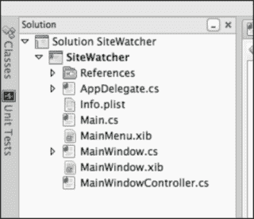

# 六、跨平台开发

微软平台并不是唯一可以执行 C# 代码的平台。使用 Mono 框架，您可以瞄准其他平台，例如 Linux、Mac OS、iOS 和 Android。在这一章中，我们将探索构建一个苹果应用所需的工具和框架。我们将在这里看到的一些工具有:

*   **mono developer**:这是一个 C# IDE，可以让你在其他非 Windows 平台上写 C#
*   **monmac**:这提供了到 Mac 库的绑定，所以你可以使用 C# 中的本地 API
*   **可可**:这是用来创建 Mac 应用的框架

我们将在本章中构建的应用是一个实用程序，您可以使用它在网站上查找文本。给定一个网址，应用将寻找链接，并跟随它们寻找特定的触发文本。我们将看一下使用 Mac OS 的 UI SDK，AppKit 显示结果。

# 建造刮网器

如果你有 C# 的经验，并且需要构建一个应用或实用程序，Mono 可以让你在使用现有的技能集快速创建它方面领先一步。假设你需要关注一个网站，这样你就可以在包含给定文本的新帖子出现时采取行动。与其整天坐在那里手动刷新页面，不如构建一个自动化系统来实现这一点。如果网站没有提供 RSS 提要或其他应用编程接口来为您提供编程访问，您总是可以依靠一种可靠的方法来获取远程数据——编写一个 HTTP 刮板。

这听起来比实际更复杂，这个实用程序所做的只是让你输入一个网址和一些参数，这样应用就知道要搜索什么了。然后，它会去网站，请求所有相关的页面，并搜索你的目标文本。

从创建项目开始。从**文件** | **新建** | **解决方案**菜单项打开**新建解决方案**对话框，打开 MonoDevelop 并创建一个新项目。在该对话框中，从左侧面板的 **C#** | **单项工程**列表中选择**单项工程**。当您创建解决方案时，项目模板会用 Mac 应用的基础知识对其进行初始化，如下图所示:



与我们在上一章中构建的网络应用一样，Mac 应用使用模型-视图-控制器模式来组织自己。项目模板已经创建了控制器(`MainWindowControl`)和视图(`MainWindow.xib`)；创建模型取决于您。

# 建立模型

使用像 MonoMac 这样的东西的主要好处之一是能够跨平台共享代码，尤其是如果您已经熟悉 C# 的话。因为我们正在编写 C#，所以如果我们想为不同的平台构建同一个应用的一部分，任何通用的逻辑和数据结构都可以重用。举个例子，一个使用 Mono 框架编写的名为 iCircuit([http://icircuitapp.com](http://icircuitapp.com))的流行应用已经在 iOS、安卓、Mac 和 Windows Phone 上发布。iCircuit 应用在一些平台上实现了近 90%的代码重用。

这个数字不是 100%的原因是 Mono 框架最近关注的指导原则之一是使用本机框架和接口构建应用。过去跨平台工具包的一个主要争议点是，它们从来没有感觉到特别的原生，因为它们被迫满足于最低的公分母来保持兼容性。使用 Mono，我们鼓励您通过 C# 使用平台的本机 API，这样您就可以利用该平台的所有优势。

模型是您能够找到最多重用的地方，只要您注意尽可能将所有特定于平台的依赖项排除在模型之外。为了保持事情有条不紊，在你的项目中创建一个名为`models`的文件夹，我们将使用它来存储我们所有的模型类。

## 访问网络

与我们在[第 4 章](4.html "Chapter 4. Creating a Windows Store App")、*中构建的 Windows 8 应用一样，创建 Windows Store 应用*时，我们首先要做的是提供连接到 URL 并从远程服务器下载数据的能力。然而，在这种情况下，我们只想访问 HTML 文本，这样我们就可以解析它并寻找各种属性。向`/Models`目录添加一个名为`WebHelper`的类，如下所示:

```cs
using System;
using System.IO;
using System.Net;
using System.Threading.Tasks;

namespace SiteWatcher
{
  internal static class WebHelper
  {
    public static async Task<string> Get(string url)
    {
      var tcs = new TaskCompletionSource<string>();
      var request = WebRequest.Create(url);

      request.BeginGetResponse(o =>  
      {
        var response = request.EndGetResponse(o);
        using (var reader = new StreamReader(response.GetResponseStream()))
        {
          var result = reader.ReadToEnd();
          tcs.SetResult(result);
        }
      }, null);

      return await tcs.Task;
    }
  }
}
```

这与我们在[第 4 章](4.html "Chapter 4. Creating a Windows Store App")*中构建的`WebRequest`类非常相似，只是它只是返回我们想要解析的 HTML 字符串，而不是反序列化一个 JSON 对象；因为`Get`方法将执行远程输入/输出，所以我们使用`async`关键字。根据经验，任何可能需要超过 50 毫秒才能完成的输入/输出绑定方法都应该是异步的。50 毫秒是微软在决定哪些操作系统级应用编程接口将是异步的时所使用的阈值。*

现在，我们将为用户在用户界面中输入的数据构建后备存储模型。我们希望能够为用户做的一件事是保存他们的输入，以便他们下次启动应用时不必重新输入。谢天谢地，我们可以利用 Mac OS 上的一个内置类和 C# 5 的动态对象特性，以一种简单的方式做到这一点。

`NSUserDefaults`类是一个简单的键/值存储应用编程接口，它保存您在应用会话中放入其中的设置。但是，尽管针对“属性包”进行编程可以为您提供非常灵活的 API，但它可能冗长且难以一目了然。为了减轻这种情况，我们将在`NSUserDefaults`周围构建一个漂亮的动态包装器，这样我们的代码至少看起来是强类型的。

首先，确保您的项目引用了`Microsoft.CSharp.dll`组件；如果没有，添加它。然后，在你的`Models`文件夹中添加一个名为`UserSettings.cs`的新类文件，并从`DynamicObject`类继承。请注意这个类中使用的`MonoMac.Foundation`名称空间，因为这是单声道绑定到 Mac 核心基础 API 的地方。

```cs
using System;
using System.Dynamic;
using MonoMac.Foundation;

namespace SiteWatcher
{
  public class UserSettings : DynamicObject
  {
    NSUserDefaults defaults = NSUserDefaults.StandardUserDefaults;

    public override bool TryGetMember(GetMemberBinder binder, out object result)
    {
      result = defaults.ValueForKey(new NSString(binder.Name));
      if (result == null) result = string.Empty;
      return result != null;
    }

    public override bool TrySetMember(SetMemberBinder binder, object value)
    {
      defaults.SetValueForKey(NSObject.FromObject(value), new NSString(binder.Name));
      return true;
    }
  }
}
```

我们只需要覆盖两个方法，`TryGetMember`和`TrySetMember`。在这些方法中，我们将使用`NSUserDefaults`类，这是一个本机的苹果应用编程接口，来获取和设置给定值。这是一个很好的例子，说明了我们如何在运行原生平台的同时，仍然有一个 C# 友好的应用编程接口来编程。

当然，精明的读者会记得，在本章的开头，我说过我们应该尽可能地将特定于平台的代码保留在模型之外。也就是说，正如这些事情通常是，更多的是一个指南。如果我们想把这个程序移植到另一个平台，我们可以把这个类的内部实现替换成适合这个平台的东西，比如在安卓上使用`SharedSettings`，或者在 Windows RT 上使用`ApplicationDataContainer`。

## 制作数据源

接下来，我们将构建封装大部分主要业务逻辑的类。当我们谈论跨平台开发时，这将是所有平台共享的代码的主要候选；你越能把你的代码抽象成像这样的自我维持的类，它被重用的可能性就越高。

在`Models`文件夹中创建新文件，称为`WebDataSource.cs`。这门课将负责通过网络传播并解析结果。创建类后，将以下两个成员添加到类中:

```cs
private List<string> results = new List<string>();

public IEnumerable<string> Results
{
  get { return this.results; }
}
```

每当我们在网站的源中找到匹配时，这个字符串列表将驱动用户界面。为了解析 HTML 以获得这些结果，我们可以利用一个名为 **HTML 敏捷包**的伟大开源库，您可以在 CodePlex 网站([http://htmlagilitypack.codeplex.com/](http://htmlagilitypack.codeplex.com/))上找到它。

当你下载软件包并解压后，在`Net45`文件夹中查找名为`HtmlAgilityPack.dll`的文件。该程序集将在所有 CLR 平台上工作，因此您可以将它复制到您的项目中。右键单击解决方案资源管理器中的`References`节点，然后选择**编辑引用** | **，将程序集添加为引用。净装配**。从浏览至`HtmlAgilityPack.dll`组件.NET 组装表，点击**确定**。

现在我们已经添加了这个依赖项，我们可以开始编写应用的主要逻辑了。请记住，我们的目标是制作一个界面，让我们可以搜索一个寻找特定文本的网站。将以下方法添加到`WebDataSource`类中:

```cs
public async Task Retrieve()
{      
  dynamic settings = new UserSettings();

  var htmlString = await WebHelper.Get(settings.Url);

  HtmlDocument html = new HtmlDocument();
  html.LoadHtml(htmlString);

  foreach(var link in html.DocumentNode.SelectNodes(settings.LinkXPath))
  {
    string linkUrl = link.Attributes["href"].Value;
    if (!linkUrl.StartsWith("http")) {
      linkUrl = settings.Url + linkUrl;
    }

    // get this URL
    string post = await WebHelper.Get (linkUrl);

    ProcessPost(settings, link, post);
  }
}
```

`Retrieve`方法有`async`关键字，使您能够等待异步操作，它首先将`UserSettings`类实例化为动态对象，这样我们就可以从用户界面中提取值。接下来，我们检索初始网址，并将结果加载到一个`HtmlDocument`类中，该类让我们解析出我们正在寻找的所有链接。这就是有趣的地方，对于每个链接，我们异步检索该网址的内容并进行处理。

### 类型

您可能会假设，因为您正在循环中等待(使用`await`关键字)，所以循环的每次迭代都将同时执行。但是请记住，异步不一定意味着并发。在这种情况下，编译器将重写代码，以便在等待 HTTP 调用完成时主线程不会被阻塞，但是循环也不会在等待时继续迭代，因此循环的每次迭代都将以正确的顺序完成。

最后，我们实现`ProcessPost`方法，该方法获取单个 URL 的内容，并使用用户提供的正则表达式进行搜索。

```cs
private void ProcessPost(dynamic settings, HtmlNode link, string postHtml)
{        
  // parse the doc to get the content area: settings.ContentXPath
  HtmlDocument postDoc = new HtmlDocument();
  postDoc.LoadHtml(postHtml);
  var contentNode = postDoc.DocumentNode.SelectSingleNode(settings.ContentXPath);
  if (contentNode == null) return;

  // apply settings.TriggerRegex
  string contentText = contentNode.InnerText;
  if (string.IsNullOrWhiteSpace(contentText)) return;

  Regex regex = new Regex(settings.TriggerRegex);
  var match = regex.Match(contentText);

  // if found, add to results
  if (match.Success)
  {
    results.Add(link.InnerText);
  }
}
```

随着`WebDataSource`类的完成，我们拥有了开始处理用户界面所需的一切。这说明了一些好的抽象(`WebHelper`和`UserSettings`)和新特性(如`async`和`await`)如何结合起来产生相对复杂的功能，同时保持出色的性能。

# 构建视图

接下来，我们将构建 MVC 三角形的第二条和第三条腿、视图和控制器。从视图开始是下一个合乎逻辑的步骤。开发 Mac 应用时，构建 UI 最简单的方法是使用 Xcode 的界面构建器，可以从 Mac App Store 安装。Mac 上的 MonoDevelop 是专门为构建用户界面而与 Xcode 进行互操作而构建的。

双击 MonoDevelop 打开`MainWindow.xib`开始。它会在界面构建器编辑器中用文件自动打开 XCode。表单最初只是一个空白窗口，但是我们将开始添加视图。最初，对于任何在 WinForms 或 XAML 上使用过 Visual Studio 所见即所得编辑器的人来说，这种体验都是非常熟悉的，但这些相似之处很快就产生了分歧。

如果还没有显示，点击下面截图中的按钮，调出屏幕右侧的**实用程序**面板，可以在 Xcode 的右上角找到。


找到对象库，并浏览可供您使用的用户界面元素列表。现在，在对象库中寻找一个垂直分割视图，并将其拖到编辑器表面，确保它在整个窗口中拉伸，如下图所示:


这让我们可以构建一个简单的用户界面，让用户将各种元素调整到对他/她有意义的大小。接下来，我们将把用户提供的选项作为文本字段元素添加到左侧面板中，当然还有附带的标签。

*   **URL** :这是你要刮的网站的 URL。
*   **项目链接 XPath** :这是在用 URL 检索的页面上。这个 XPath 查询应该会返回您感兴趣扫描的链接列表。
*   **内容 XPath** :对于每个项目，我们会根据**项目链接 XPath** 中检索到的 URL 来检索 HTML 内容。在这个新的 HTML 文档中，我们想要选择一个我们将要查看的内容元素。
*   **Trigger Regex** :这是一个正则表达式，我们将用它来表示匹配。

我们还需要一种方法来显示任何匹配的结果。为此，请将对象库中的表视图添加到第二个右侧面板中。该表视图类似于常规.NET/Windows 世界，将为我们提供一个以列表格式显示结果的地方。还要添加一个按钮，我们将使用它来启动我们的网络呼叫。

完成后，您的界面应该如下图所示:


定义好接口后，我们开始关注控制器。如果您以前从未使用过 Xcode，那么向控制器公开单个视图元素是很独特的。其他平台的其他工具倾向于自动生成文本框和按钮的代码引用，在 Xcode 中，您必须手动将它们链接到控制器中的属性。为此，您将会接触到一些 Objective-C 代码，但只是非常短暂的，除了以下步骤之外，您实际上不需要做任何事情:

1.  显示助理编辑器，确保编辑器中显示`MainWindowController.h`。这是控制器的头文件，它将与我们程序中的视图进行交互。
2.  You have to add what are called **outlets** to the controller and connect them with the UI elements, so you can get references to them from code. This is accomplished by holding the *Ctrl* key on your keyboard, and clicking-and-dragging from the control textbox into the header file.

    将显示一个小对话框，如下图所示，它允许您在生成代码之前更改一些选项:

    

3.  Do that for all of the text views and give them appropriate names such as `urlTextView`, `linkXPathTextView`, `contentXPathTextView`, `regexTextView`, and `resultsTableView`.

    当你去添加按钮时，你会注意到你有一个选项来改变连接类型为**动作**连接而不是**插座**连接。这就是如何连接按钮的点击事件。完成此操作后，头文件应定义以下元素:

    ```cs
    @property (assign) IBOutlet NSTextField *urlTextView;
    @property (assign) IBOutlet NSTextField *linkXPathTextView;
    @property (assign) IBOutlet NSTextField *contentXPathTextView;
    @property (assign) IBOutlet NSTextField *regexTextView;
    @property (assign) IBOutlet NSTableView *resultsTableView;

    - (IBAction)buttonClicked:(NSButton *)sender;
    ```

4.  Close Xcode and go back to MonoDevelop and take a look at the `MainWindow.designer.cs` file.

    您会注意到，您添加的所有出口和动作都将在 C# 代码中表示。MonoDevelop 监视文件系统上的文件，当 Xcode 对它们进行更改时，它会相应地重新生成该代码。

    请记住，我们希望用户的设置在会话之间保持不变。所以当窗口加载时，我们想用之前输入的任何值初始化文本框。我们将使用本章前面创建的`UserSettings`类来提供这些值。覆盖`WindowDidLoad`方法(如下代码所示)，该方法在程序第一次运行时执行，并将用户设置中的值设置为文本视图。

    ```cs
    public override void WindowDidLoad ()
    {
      base.WindowDidLoad ();
      dynamic settings = new UserSettings();
      urlTextView.StringValue = settings.Url;
      linkXPathTextView.StringValue = settings.LinkXPath;
      contentXPathTextView.StringValue = settings.ContentXPath;
      regexTextView.StringValue = settings.TriggerRegex;
    }
    ```

5.  Now, we turn our attention to the displaying of data. Our primary output in this application is `NSTableView`, which we are going to use to display any matching links in the target URL. In order to bind data to the table, we create a custom class that inherits from `NSTableViewSource`.

    ```cs
    private class TableViewSource : NSTableViewSource
    {
      private string[] data;

      public TableViewSource(string[] list) 
      { 
        data = list; 
      }

      public override int GetRowCount (NSTableView tableView)
      {
        return data.Length;
      }

      public override NSObject GetObjectValue (NSTableView tableView, NSTableColumn tableColumn, int row)
      {
        return new NSString(data[row]);
      }
    }
    ```

    每当表格视图需要呈现给定的表格单元格时，它将在`GetObjectValue`方法中请求一行的数据。因此，这只是获取一个字符串数组，并在请求时从数组中返回适当的索引。

6.  Now we define the method that quite literally puts everything together.

    ```cs
    private async void GetData()
    {
      // retrieve data from UI
      dynamic settings = new UserSettings();
      settings.Url = urlTextView.StringValue;
      settings.LinkXPath = linkXPathTextView.StringValue;
      settings.ContentXPath = contentXPathTextView.StringValue;
      settings.TriggerRegex = regexTextView.StringValue;

      // initiate data retrieval
      WebDataSource datasource = new WebDataSource();
      await datasource.Retrieve();

      // display data
      TableViewSource source = new TableViewSource(datasource.Results.ToArray());
      resultsTableView.Source = source;
    }
    ```

    在`GetData`方法中，我们做的第一件事是从文本框中提取值，并将其存储在`UserSettings`对象中。接下来，我们从`WebDataSource`检索数据，当然是异步的。现在，将结果传递给`TableViewSource`以便显示。

7.  Finally, implement the `buttonClicked` action that you wired up in Xcode.:

    ```cs
    partial void buttonClicked (MonoMac.AppKit.NSButton sender)
    {
      GetData ();
    }
    ```

    现在运行这个程序，为你想搜索的网页输入一些值。您应该会看到如下截图所示的结果，您也可以尝试使用相同的值，但是请注意，如果黑客新闻更新了它们的 HTML 结构，这将不起作用。

    

# 总结

在这一章中，我们为 Mac OS 创建了一个小的实用程序，使用了 MonoMac 和 mono developer。您可以用来扩展或改进此应用的一些想法如下:

*   跨应用会话保存结果(查看核心数据)
*   通过在处理过程中给用户反馈来构建更好的用户体验(参见`NSProgressIndicator`)
*   通过并行化 URL 请求来提高应用的性能(参见`Parallel.ForEach`)
*   尝试将应用移植到不同的平台。iOS 看 MonoTouch([http://ios.xamarin.com](http://ios.xamarin.com))，安卓看 Mono([http://android.xamarin.com](http://android.xamarin.com))

C# 是一种令人难以置信的表达能力和强大的语言。作为一名开发人员，您能够瞄准每一个主流计算平台，拥有大量不可思议的机会，同时使用一致的编程语言，可以跨平台轻松重用代码。