# 八、使用 OAuth 克隆推特

在本章中，我们将了解使用 ASP.NETCore MVC 创建一个基本的推特克隆有多容易。我们将执行以下任务:

*   使用推特的应用管理在推特上创建你的应用
*   创建一个 ASP.NETCore MVC 应用
*   阅读您的家庭时间表
*   发布推文

可以想象，推特的功能并不是标准的.NET(更不用说在.NETCore)。

Please be aware that you will need to create a Twitter account in order to perform the tasks in this chapter. You can do this by going to [https://twitter.com/](https://twitter.com/) and registering.

对我们来说幸运的是，有许多专注而热情的开发人员免费提供他们的代码。您通常会发现他们的代码托管在 GitHub 上，而这正是我们将寻找一些代码集成到我们的 ASP.NETCore MVC 应用中的地方，以便为它提供推特功能。这一章绝不是对我们将要使用的特定推特库的认可。然而，这个图书馆是我用过的最好的图书馆之一。它也在(在撰写本文时)不断更新。

来看看 Tweetinvi。

# 使用推文

将浏览器指向[https://github.com/linvi/tweetinvi](https://github.com/linvi/tweetinvi)。这个图书馆的描述说明了一切:

Tweetinvi, the best Twitter C# library for the REST and Stream API. It supports .NET, .NETCore, UAP and Portable Class Libraries (Xamarin)...

换句话说，这个库正是我们创建推特克隆应用所需要的。Tweetinvi 真的有很好的记录，并且有一个活跃的社区支持它。

# ASP.NETCore MVC 推特克隆应用

创建一个成熟的推特克隆应用是一项艰巨的工作——恐怕比本章所允许的还要多。因此，我将只举例说明如何阅读你的主订阅源中的推文(你在推特上关注的人的推文)。我还将向您展示如何发布应用的推文。

我将省去这个应用中所有花哨的用户界面元素，相反，我将给你一个极好的基础来继续开发一个成熟的推特克隆。您可以考虑添加以下功能:

*   删除推文
*   转发
*   跟踪某人
*   不跟踪某人
*   发送私人消息
*   搜索
*   查看个人资料信息

您可以添加许多附加功能；请随意构建您希望看到的任何缺失功能。我个人希望有一个更好的方法来策划和保存我觉得有趣的推文。

我知道你们中的一些人可能想知道为什么喜欢一条推文是不够的，这就是我的原因。喜欢推文最近已经成为一种速记方式，让某人让另一个人知道他们已经看到了他们的推文。当你在推文中被提及时尤其如此。推特用户不仅仅是回复(尤其是反问)，而是喜欢这条推文。

喜欢一条推文也不是一种管理工具。你喜欢的东西都在你喜欢的东西下面。没有办法区分。啊哈！我听到你们中的一些人说，*时刻呢？*同样，时刻直播在推特上。

思考时刻，但时刻来到你身边。无论如何，人们可以对像这样的定制推特克隆进行许多改进，使其真正成为自己的。现在，让我们从基础开始。

# 在推特上创建你的应用

在我们开始创建我们的推特克隆之前，我们需要在推特应用管理控制台上注册它。

要访问应用管理控制台，请将浏览器指向[https://apps.twitter.com](https://apps.twitter.com):

1.  点击登录链接，如下图所示:

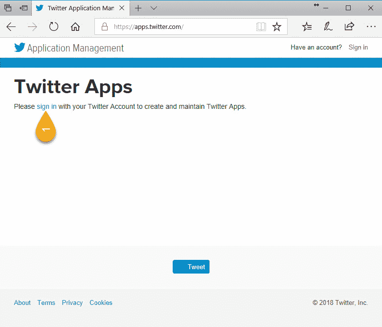

2.  在登录屏幕上使用您的推特凭据登录:


3.  如果您以前创建过任何应用，您会看到它们被列出。你创建的所有应用都列在你的推特应用部分。点击创建新应用按钮:

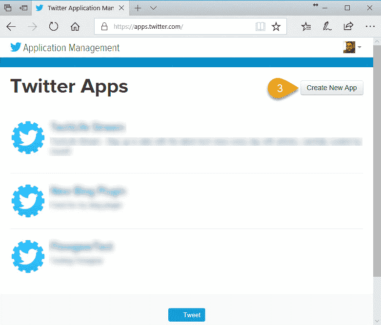

4.  现在，您将看到“创建应用”表单。给你的申请一个合适的名称和描述。为您的应用提供一个网站，最后，提供一个回调网址值。我已经简单地使用了`http://localhost:50000/`，稍后我将向您展示如何在您的应用中配置它。这显示在下面的截图中:

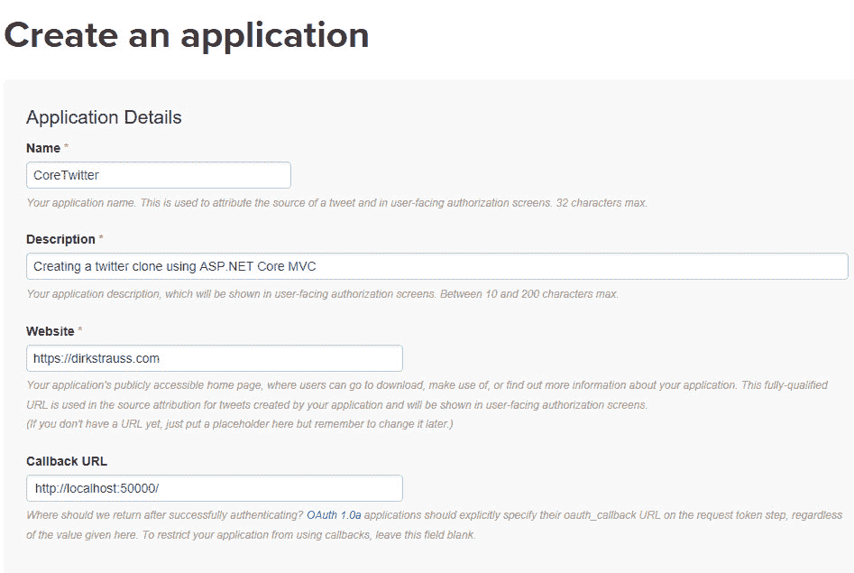

If localhost gives you problems during the callback, try using `127.0.0.1` instead.

5.  选择您理解推特开发者协议的选项，然后点击创建您的推特应用:

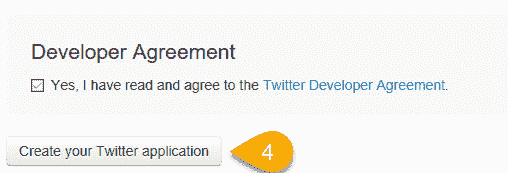

6.  接下来，您将看到刚刚创建的应用设置的摘要。在屏幕顶部，单击密钥和访问令牌选项卡:


7.  这将带您进入应用设置，其中提供了消费者密钥和消费者机密。请务必记下这些键:


8.  在页面底部，您将看到一个名为“创建我的访问令牌”的按钮。点击这个按钮。这将创建允许您进行 API 调用的令牌:


9.  生成令牌后，将为您显示访问令牌和访问令牌密码。也记下这些:

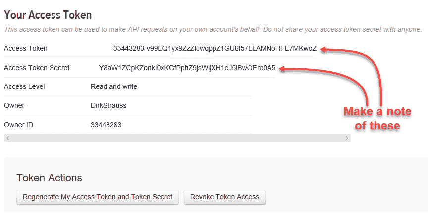

这就是在推特的应用管理控制台上注册你的应用的全部内容。接下来我们需要做的是创建我们的 ASP.NETCore MVC 应用。

# 创建 ASP.NETCore MVC 应用并添加 NuGet 包

现在让我们开始创建 ASP.NETCore MVC 应用，并向其中添加 Twitter 功能:

1.  在 Visual Studio 2017 中，创建新的 ASP.NETCore 网络应用。我只是把我的应用和我在推特上注册时的名字一样。点击确定按钮:

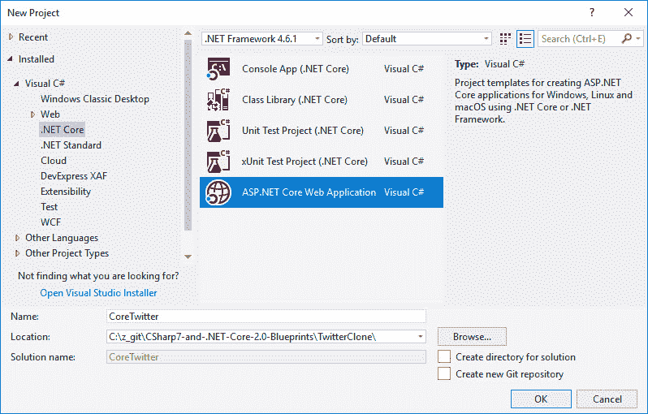

2.  在下一个屏幕上，确保选择了网络应用(模型-视图-控制器)模板，并从下拉列表中选择了 ASP.NETCore 2.0。我明确提到这一点，因为我从读者那里得到的反馈是，他们从未选择过 ASP.NETCore 2.0。点击确定按钮:

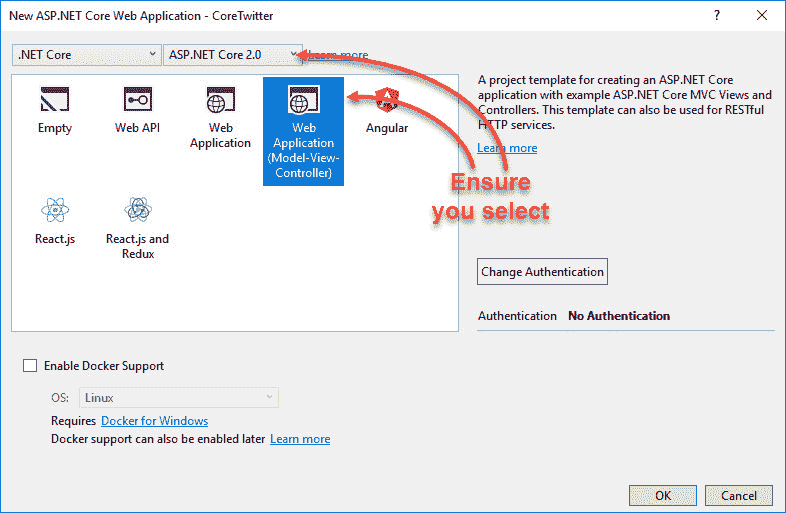

创建项目后，它将如下所示:

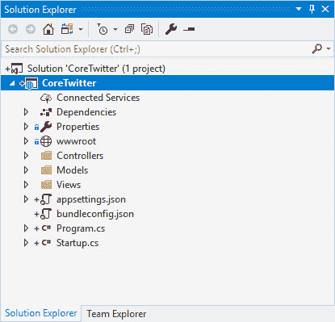

3.  我们现在想去获取 Tweetinvi NuGet 包，所以右键单击该项目并从上下文菜单中选择管理 NuGet 包，如下所示:

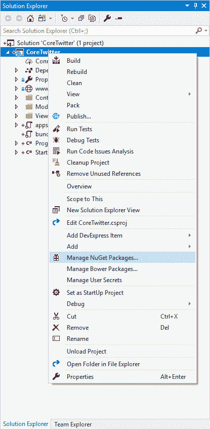

4.  在浏览选项卡中，搜索`tweetinvi`并选择开发人员称为 Linvi 的项目。单击安装按钮将其添加到您的应用中:

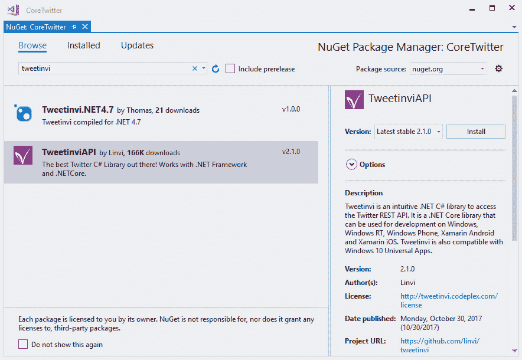

5.  过一会儿，进度将在 Visual Studio 的“输出”窗口中显示完成:


6.  接下来我们要做的是将我们的 URL 设置为之前在 Twitter 应用管理控制台中设置的回调 URL。为此，右键单击您的项目，然后从上下文菜单中单击属性:


7.  选择调试选项卡，然后在应用网址字段中输入回调网址:


If you set the `localhost` portion of the callback URL to `127.0.0.1` in the Application Management console, you need to set it here to `127.0.0.1` too.

8.  保存设置并返回代码窗口。

从设置的角度来看，这应该是您开始编写代码和连接一切所需的全部内容。我们接下来开始做吧。

# 让我们编码

这个项目的所有代码都将在 GitHub 上提供。将您的浏览器指向 https://github.com/PacktPublishing/CSharp7-and-.NET-Core-2.0-蓝图并在阅读本章剩余部分时抓取代码来完成它。

# 设置类别和设置

我想做的第一件事是创建一个存储我的设置的类。为此，请执行以下步骤:

1.  创建一个名为`Classes`的文件夹，在这个文件夹中，创建一个名为`CoreTwitterSettings`的类。然后，在`Classes`文件夹中添加名为`TweetItem`的第二个类(稍后我们将使用这个类)。当你在做的时候，创建另一个名为`css`的文件夹，我们将在一分钟后使用。
2.  完成此操作后，您的项目将如下所示:


3.  打开`CoreTwitterSettings`类，并添加以下代码:

```cs
public class CoreTwitterConfiguration 
{ 
    public string ApplicationName { get; set; } 
    public int TweetFeedLimit { get; set; } = 1; 

    public TwitterSettings TwitterConfiguration { get; set; } = new 
    TwitterSettings(); 
} 

public class TwitterSettings 
{ 
    public string Consumer_Key { get; set; } 
    public string Consumer_Secret { get; set; } 
    public string Access_Token { get; set; } 
    public string Access_Secret { get; set; } 
} 
```

4.  接下来我们要做的是定位我们的`appsettings.json`文件。该文件将位于项目的根目录下，如下图所示:


5.  双击`appsettings.json`文件打开编辑。文件的默认内容应该如下所示:

```cs
{ 
  "Logging": { 
    "IncludeScopes": false, 
    "LogLevel": { 
      "Default": "Warning" 
    } 
  } 
} 
```

6.  修改文件以包含要存储的设置。`appsettings.json`文件的目的是存储应用的所有设置。
7.  将您的消费者密钥和消费者秘密密钥添加到文件中。另外，请注意，我使用了基本网址的设置，即前面设置的回调网址。在一个环境中，这有时很方便。我还创建了一个名为`TweetFeedLimit`的设置来限制返回到主页时间线的推文。

Your Consumer Key and Consumer Secret will definitely differ to the values in my example. So, be sure to change these accordingly in your application.

8.  当您修改了您的`appsettings.json`文件后，它将如下所示:

```cs
{ 
  "Logging": { 
    "IncludeScopes": false, 
    "LogLevel": { 
      "Default": "Warning" 
    } 
  }, 

  "CoreTwitter": { 
    "ApplicationName": "Twitter Core Clone (local)", 
    "TweetFeedLimit": 10, 
    "BaseUrl": "http://localhost:50000/", 
    "TwitterConfiguration": { 
      "Consumer_Key": "[YOUR_CONSSUMER_KEY]", 
      "Consumer_Secret": "[YOUR_CONSUMER_SECRET]", 
      "Access_Token": "", 
      "Access_Secret": "" 
    } 
  } 
} 
```

9.  如果你看一下`CoreTwitterSettings`类，你会发现它有点像`appsettings.json`文件中的 JSON。
10.  在您的 Visual Studio 解决方案中，找到`Startup.cs`文件并打开该文件进行编辑。您将看到 Visual Studio 2017 已经为您在这个类中添加了许多样板代码。特别注意`ConfigureServices`方法。应该是这样的:

```cs
public void ConfigureServices(IServiceCollection services) 
{ 
    services.AddMvc(); 
} 
```

11.  从 ASP.NETCore 1.1 开始，我们就可以使用`Get<T>`，它可以处理整个部分。要使设置在我们的 ASP.NETCore MVC 应用中可用，请按如下方式更改该方法中的代码:

```cs
public void ConfigureServices(IServiceCollection services) 
{ 
    services.AddMvc(); 

    var section = Configuration.GetSection("CoreTwitter"); 
    services.Configure<CoreTwitterConfiguration>(section);             
} 
```

您会注意到我们正在获取`appsettings.json`文件中定义的`CoreTwitter`部分。

# 创建 TweetItem 类

`TweetItem`类只是包含特定推文的网址。它根本不是一个非常复杂的类，但是它的有用性将在本章后面变得清晰。现在，只需向其中添加以下代码:

```cs
public class TweetItem 
{ 
    public string Url { get; set; } 
} 
```

它将存储的网址将是特定推文的网址。

# 设置 CSS

为了将`<blockquote>` HTML 标记用于推文，您需要将一个 CSS 文件添加到您的`CSS`文件夹中。在我们的例子中，我们不会使用它，但是当你进一步构建你的应用时，你会想要使用这个 CSS 来设计你的`<blockquote>`推文。

如果你现在只是玩玩，在完成本章后不打算进一步构建这个应用，你可以跳过这一节添加 CSS 文件。如果您想进一步了解该应用，请继续阅读:

1.  右键单击解决方案中的`css`文件夹，并向其中添加一个新项目。调用文件`site.css`点击添加按钮，如下图所示:


2.  删除`site.css`文件的内容，并添加以下`css`:

```cs
blockquote.twitter-tweet { 
    display: inline-block; 
    font-family: "Helvetica Neue", Roboto, "Segoe UI", Calibri,   
    sans-serif; 
    font-size: 12px; 
    font-weight: bold; 
    line-height: 16px; 
    border-color: # eee # ddd # bbb; 
    border-radius: 5px; 
    border-style: solid; 
    border-width: 1px; 
    box-shadow: 0 1px 3px rgba(0, 0, 0, 0.15); 
    margin: 10px 5px; 
    padding: 0 16px 16px 16px; 
    max-width: 468px; 
} 

blockquote.twitter-tweet p { 
    font-size: 16px; 
    font-weight: normal; 
    line-height: 20px; 
} 

blockquote.twitter-tweet a { 
    color: inherit; 
    font-weight: normal; 
    text-decoration: none; 
    outline: 0 none; 
} 

blockquote.twitter-tweet a:hover, 
blockquote.twitter-tweet a:focus { 
    text-decoration: underline; 
} 
```

为了补充这一部分，你可以阅读 https://dev.twitter.com/web/overview/css 的推特开发者文档，看看 CSS 概述。

# 添加控制器

我们现在需要开始添加控制器。控制器负责响应向您的应用发出的请求:

1.  在`Controllers`文件夹中，添加另一个名为`TwitterController`的控制器。这个控制者将负责撰写新的推文和发布新的推文。稍后我们将回到这个控制器。现在，只需创建类。添加后，您的解决方案应该如下所示:

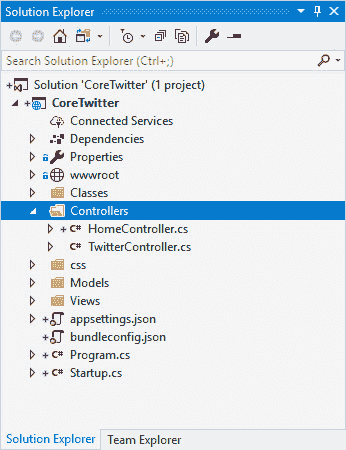

2.  默认情况下，Visual Studio 会在您创建 ASP.NETCore MVC 应用时为您添加`HomeController`。打开`HomeController`看看课的内容。请务必将以下`using`声明添加到您的`HomeController`课程中:

```cs
using Tweetinvi; 
using Tweetinvi.Models; 
```

3.  我想做的第一件事是让存储在`appsettings.json`文件中的应用设置在我的班级中可用。你会记得我们修改了`Startup.cs`文件，在启动时注入设置。
4.  在`HomeController`类的顶部，添加以下代码行:

```cs
CoreTwitterConfiguration config;
```

5.  在该行的正下方，添加一个构造函数，将`CoreTwitterConfiguration`类带入我们的控制器的范围:

```cs
public HomeController(IOptions<CoreTwitterConfiguration> options) 
{ 
    config = options.Value; 
} 
```

6.  我们现在将修改`HomeController`类的`Index`动作，以检查我们是否有访问令牌或访问秘密。你会记得我们之前在`appsettings.json`文件中留下了这些空白。如果这些是空的，那么用户还没有被验证，然后我们将用户重定向到`HomeController`上的`AuthenticateTwitter`操作:

```cs
public IActionResult Index() 
{ 
    try 
    { 
        if (String.IsNullOrWhiteSpace(config.TwitterConfiguration.Access_Token)) throw new Tweetinvi.Exceptions.TwitterNullCredentialsException(); 
        if (String.IsNullOrWhiteSpace(config.TwitterConfiguration.Access_Secret)) throw new Tweetinvi.Exceptions.TwitterNullCredentialsException();                                 
    } 
    catch (Tweetinvi.Exceptions.TwitterNullCredentialsException ex) 
    { 
        return RedirectToAction("AuthenticateTwitter"); 
    } 
    catch (Exception ex) 
    { 
        // Redirect to your error page here 
    } 
    return View(); 
} 
```

7.  现在让我们开始创建`AuthenticateTwitter`动作。为此，我们需要消费者凭证，我们之前从我们的推特应用管理控制台复制了它，并将其添加到我们的`appsettings.json`文件中。然后，我们在整个应用中使用这些设置；现在我们可以看到将我们的设置存储在`appsettings.json`文件中的好处。

8.  在`AuthenticateTwitter`动作里面，我们简单的把消费者密钥和消费者秘密传给`ConsumerCredentials`对象。当我们通过验证后，我们将进入`ValidateOAuth`行动，接下来我们将创建该行动:

```cs
public IActionResult AuthenticateTwitter() 
{ 
    var coreTwitterCredentials = new ConsumerCredentials( 
        config.TwitterConfiguration.Consumer_Key 
        , config.TwitterConfiguration.Consumer_Secret); 
         var callbackURL = "http://" + Request.Host.Value + 
         "/Home/ValidateOAuth"; 
    var authenticationContext = 
    AuthFlow.InitAuthentication(coreTwitterCredentials,  
    callbackURL); 

    return new 
    RedirectResult(authenticationContext.AuthorizationURL); 
} 
```

9.  此时，我们已被重定向到 Twitter，通过 OAuth 验证用户，并通过回调 URL 重定向回我们的 ASP.NETCore 应用。代码非常简单。不过需要注意的是`userCredentials.AccessToken`和`userCredentials.AccessTokenSecret`是从`userCredentials`对象返回的。我只是将这些添加到应用的配置设置中，但实际上，您可能希望将它们存储在其他地方(例如在数据库中加密)。这将允许您使用该应用，而不必每次都验证自己:

```cs
public ActionResult ValidateOAuth() 
{ 
    if (Request.Query.ContainsKey("oauth_verifier") &&  
    Request.Query.ContainsKey("authorization_id")) 
    { 
        var oauthVerifier = Request.Query["oauth_verifier"]; 
        var authId = Request.Query["authorization_id"]; 

        var userCredentials =  
        AuthFlow.CreateCredentialsFromVerifierCode(oauthVerifier, 
        authId); 
        var twitterUser = 
        Tweetinvi.User.GetAuthenticatedUser(userCredentials); 

        config.TwitterConfiguration.Access_Token = 
        userCredentials.AccessToken; 
        config.TwitterConfiguration.Access_Secret = 
        userCredentials.AccessTokenSecret; 

        ViewBag.User = twitterUser; 
    } 

    return View(); 
} 
```

看到这个控制器动作被称为`ValidateOAuth`，让我们创建一个同名的视图，这样我们就可以路由到一个页面，通知用户他们已经成功通过身份验证。

# 创建视图

视图和传统的 HTML 页面不是一回事。ASP.NETCore MVC 应用的页面由视图表示。正如我前面指出的，控制器接收请求并处理该请求。控制器可以将您重定向到另一个控制器操作，但它也可以返回一个视图:

1.  我们现在将继续为我们的应用创建视图。展开`Home`文件夹，并将名为`ValidateOAuth`的新视图添加到`Home`文件夹中。只需创建这些没有模型的视图:


2.  向名为`Twitter`的`Views`文件夹添加另一个文件夹，并向名为`ComposeTweet`和`HomeTimeline`的文件夹添加两个视图。完成后，您的应用将如下所示:


3.  打开`ValidateOAuth`视图，并添加以下标记:

```cs
@if (@ViewBag.User != null) 
{ 
    <h2>OAuth Authentication Succeeded!</h2> 
    <p>Welcome to the CoreTwitter Demo Application <b>@ViewBag.User.Name</b>. You have been successfully authenticated via Twitter.</p> 

    <div class="row"> 
        <div class="col-md-4"> 
            <h2>Go to your home feed</h2> 
            <p> 
                See what's new on your home feed. 
            </p> 
            <p> 
                <a class="btn btn-default" 
                 href="/Home/GetHomeTimeline">Home &raquo;</a> 
            </p> 
        </div> 
    </div> 
} 
else 
{ 
    <h2>OAuth Authentication failed!</h2> 
    <p>An error occurred during authentication. Try <a  
     href="/Home/TwitterAuth">authenticating</a> again.</p> 
} 
```

看一下标记，您会注意到它所做的只是通知用户身份验证状态。如果通过认证，用户可以查看他们的主页，这是他们在推特上关注的人的所有推文。

我想在这里提醒大家注意我在`Home`控制器上调用`GetHomeTimeline`动作的方式。您将在按钮链接中看到以下`href`存在:

```cs
href="/Home/GetHomeTimeline" 
```

这是将用户路由到控制器上的操作的一种方式。稍后，我将向您展示另一种更好的方法。

因此，我们允许成功认证的用户通过点击`Home`链接来查看他们关注的人的推文。这就需要一个叫做`GetHomeTimeline`的动作。我们去修改`HomeController`添加这个动作。

# 修改家庭控制器

回转到`HomeController`并添加另一个名为`GetHomeTimeline`的动作。然后，这将使用用户凭据来查找经过身份验证的用户的主页时间线推文。用户凭据由以下内容组成:

*   消费者密钥
*   消费者秘密
*   访问令牌
*   访问机密

你会注意到这些都是来自`CoreTwitterConfiguration`对象。twitter feed 仅包含设置中设置的限制。我把我的设为`10`，所以这个应该只包含 10 条推文。对于提要中的每一条推文，我都会提取推文的网址，并将其添加到类型列表`TweetItem`(我们之前创建的类)中。如果一切顺利，我会前往`HomeTimeline`查看。

将以下代码添加到您的`GetHomeTimeline`动作中。

You should be getting an error on the code that references the `TwitterViewModel` instance called `homeView`. We will rectify this next.

您的操作应该如下所示:

```cs
public IActionResult GetHomeTimeline() 
{ 
    TwitterViewModel homeView = new TwitterViewModel(); 

    try 
    { 
        if (config.TwitterConfiguration.Access_Token == null) throw new 
        Tweetinvi.Exceptions.TwitterNullCredentialsException(); 
        if (config.TwitterConfiguration.Access_Secret == null) throw 
        new Tweetinvi.Exceptions.TwitterNullCredentialsException(); 

        var userCredentials = Auth.CreateCredentials( 
            config.TwitterConfiguration.Consumer_Key 
            , config.TwitterConfiguration.Consumer_Secret 
            , config.TwitterConfiguration.Access_Token 
            , config.TwitterConfiguration.Access_Secret); 

        var authenticatedUser =  
        Tweetinvi.User.GetAuthenticatedUser(userCredentials); 

        IEnumerable<ITweet> twitterFeed = 
        authenticatedUser.GetHomeTimeline(config.TweetFeedLimit); 

        List<TweetItem> tweets = new List<TweetItem>(); 
        foreach(ITweet tweet in twitterFeed) 
        { 
            TweetItem tweetItem = new TweetItem();                     

            tweetItem.Url = tweet.Url; 
            tweets.Add(tweetItem); 
        } 

        homeView.HomeTimelineTweets = tweets;                 
    } 
    catch (Tweetinvi.Exceptions.TwitterNullCredentialsException ex) 
    { 
        return RedirectToAction("AuthenticateTwitter"); 
    } 
    catch (Exception ex) 
    { 

    } 

    return View("Views/Twitter/HomeTimeline.cshtml", homeView); 
} 
```

如前所述，您会看到一些错误。这是因为我们还没有一个叫做`TwitterViewModel`的模型。让我们创建下一个。

# 创建推特视图模型类

`TwitterViewModel`类只是一个非常简单的类，它将`TweetItem`集合作为一个名为`HomeTimelineTweets`的属性。

让我们从向我们的项目添加一个模型开始:

1.  右键单击您的`Models`文件夹，并在文件夹中添加一个名为`TwitterViewModel`的类。然后，向该类添加以下代码:

```cs
public class TwitterViewModel 
{ 
    public List<TweetItem> HomeTimelineTweets { get; set; } 
}
```

2.  另外，将`using`语句`using CoreTwitter.Classes;`添加到类中。

这就是所需要的一切。当您稍后扩展`TweetItem`类时(如果您决定向该应用添加功能)，该模型将负责将该信息传递给我们的视图，以便在 Razor 中使用。

# 创建家庭时间线视图

回想一下我们之前创建的名为`GetHomeTimeline`的`HomeController`动作，您会记得我们进入了名为`HomeTimeline`的视图。我们已经创建了这个视图，但是现在我们需要给它添加一些逻辑，以便在我们的主页时间线中呈现推文。

因此，我们需要为我们的主页时间线添加一个视图，接下来我们将添加该视图:

1.  打开`HomeTimeline.cshtml`文件，在视图中添加以下标记:

```cs
@model TwitterViewModel 
@{ 
    ViewBag.Title = "What's happening?"; 
} 

<h2>Home - Timeline</h2> 

<div class="row"> 
    <div class="col-md-8"> 

        @foreach (var tweet in Model.HomeTimelineTweets) 
        { 
            <blockquote class="twitter-tweet"> 
                <p lang="en" dir="ltr"> 
                    <a href="@Html.DisplayFor(m => tweet.Url)"></a> 
            </blockquote> 
            <script async 
             src="https://platform.twitter.com/widgets.js" 
             charset="utf-8"></script> 
        } 
    </div> 

    <div class="col-md-4"> 
        <h2>Tweet</h2> 
        <p>What's happening?</p> 
        <a class="btn btn-default" asp-controller="Twitter" asp-
         action="ComposeTweet">Tweet &raquo;</a>   
    </div> 

</div> 
```

首先需要注意的是文件顶部的`@model TwitterViewModel`语句。这允许我们在视图中使用存储在模型中的值。我们的视图所做的是遍历包含在模型的`HomeTimelineTweets`属性中的推文集合，并建立一个推文列表来显示在页面上。

另外我想提醒大家注意的是推文链接上的标签助手`asp-controller`和`asp-action`。这是一种在特定控制器上执行特定操作的更简洁的方式(与我们之前在`ValidateOAuth`视图中看到的在`href`中执行的方式相反)。

最后，你可能想知道`widgets.js`引用在那里做什么。嗯，我不想自己设计我的推文，所以我决定用推特为我设计:

2.  要获得加价，请前往 https://publish.twitter.com/# :


3.  从下拉列表中，选择一条推文作为您尝试嵌入的内容的选项，如下所示:


4.  然后会给你一些示例代码来使用。您只需点击复制代码按钮。这只是我做这件事的方式，但欢迎你走自己的路，不要走这一步:

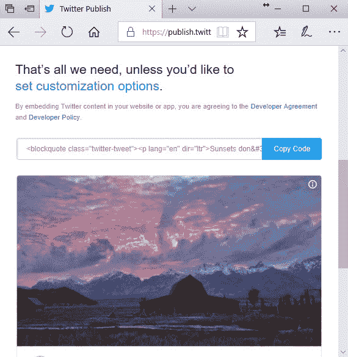

5.  您复制的代码可能如下所示:

```cs
<blockquote class="twitter-tweet"> 
        <p lang="en" dir="ltr">Sunsets don't get much better than 
         this one over <a href="https://twitter.com/GrandTetonNPS?
         ref_src=twsrc%5Etfw">@GrandTetonNPS</a>. 
        <a href="https://twitter.com/hashtag/nature?
         src=hash&amp;ref_src=twsrc%5Etfw"># nature</a> 
        <a href="https://twitter.com/hashtag/sunset?
         src=hash&amp;ref_src=twsrc%5Etfw"># sunset</a> 
    <a href="http://t.co/YuKy2rcjyU">pic.twitter.com/YuKy2rcjyU</a> 
            </p>&mdash; US Department of the Interior (@Interior) 
    <a href="https://twitter.com/Interior/status/463440424141459456?
     ref_src=twsrc%5Etfw">May 5, 2014</a> 
    </blockquote> 
    <script async src="https://platform.twitter.com/widgets.js" 
     charset="utf-8"></script> 
```

6.  拿着它，根据你的页面修改它的样式。这样做一个循环，这样你就可以把所有的推文一个接一个地输出。您最终应该得到的代码只是:

```cs
<blockquote class="twitter-tweet"> 
    <p lang="en" dir="ltr"> 
        <a href="@Html.DisplayFor(m => tweet.Url)"></a> 
</blockquote> 
<script async src="https://platform.twitter.com/widgets.js" charset="utf-8"></script> 
```

它只包含到推特网址的链接。

# 修改推特控制器类

现在我们进入允许用户发送推文的部分。

打开`TwitterController`类，添加两个动作，分别叫做`ComposeTweet`和`PublishTweet`。`TwitterController`类真的很简单。它只包含以下代码:

```cs
public class TwitterController : Controller 
{         
    public IActionResult ComposeTweet() 
    {             
        return View(); 
    } 

    public IActionResult PublishTweet(string tweetText) 
    { 
        var firstTweet = Tweet.PublishTweet(tweetText); 

        return RedirectToAction("GetHomeTimeline", "Home");  
    } 
} 
```

`ComposeTweet`操作只是让用户返回到一个可以撰写推文的视图。您会记得我们之前创建了`ComposeTweet`视图。`PublishTweet`的行动也一样简单。它接受我在推特上发的内容，并将其传递给`Tweetinvi.Tweet`类的`PublishTweet`方法。之后，重定向回主页时间线是有意义的，在那里我们将看到我们刚刚创建的推文。

我们需要完成的最后一个任务是修改`ComposeTweet`视图。接下来让我们做那个。

# 结束—撰写推文视图

最后，我们使用`ComposeTweet`视图。

打开`ComposeTweet`视图，并在视图中添加以下标记:

```cs
@{ 
    ViewData["Title"] = "Tweet"; 
} 

<h2>Tweet</h2> 

<form method="post" asp-controller="Twitter" asp-action="PublishTweet"> 

    <div class="form-group"> 
        <label for="tweet">Tweet : </label> 
        <input type="text" class="form-control" name="tweetText" 
         id="tweetText" value="What's happening?" /> 
    </div> 

    <div class="form-group"> 
        <input type="submit" class="btn btn-success" /> 
    </div> 
</form> 
```

你会再次注意到，我正在使用标签助手来定义控制器和要调用的动作。只是这次，我是在`<form>`标签上做的。此时，您已经准备好第一次运行应用了。让我们看看它的表现如何。

# 运行 moretwitter 应用

执行项目的构建，以确保所有的构建都是正确的。然后，开始调试应用。因为你还没有通过身份验证，你会被重定向到推特进行身份验证。

我相信你已经习惯了看到这一页:

1.  许多网络应用使用 OAuth 进行身份验证。要继续，请单击授权应用按钮，如下所示:


2.  然后，您将看到重定向通知。这可能需要一些时间来重新引导您。这完全取决于您的互联网连接速度:


3.  一旦您被重定向到您的 CoreTwitter 应用，您将看到显示“验证成功”消息。然后，点击主页按钮进入`HomeTimeline`:

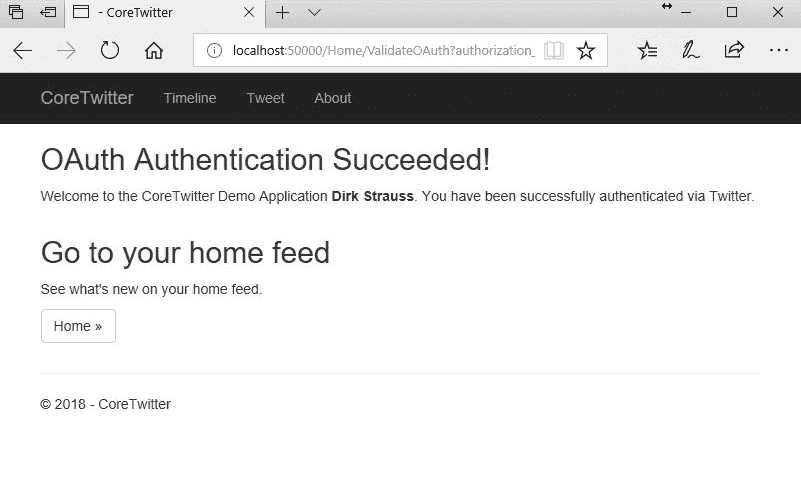

4.  `HomeController`在`GetHomeTimeline`动作被调用时跳转到动作，并将您重定向到`HomeTimeline`视图。您将看到您的推文被加载到页面中:


5.  当您滚动推文时(请记住，我只返回了 10 条)，您会看到包含了一些视频，当您单击播放按钮时，这些视频将会播放:


6.  媒体丰富的推文也可以让你预览文章，你也可以在你的时间线中看到普通的旧文本推文。所有链接都是完全活跃的，您可以点击它们来查看文章:


7.  如果你向右滚动到时间线的底部(这应该在顶部，但我告诉过你我不会在用户界面上做太多)，你会看到推文按钮。点击此处撰写新的推文:

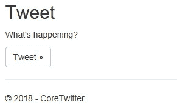

8.  在`ComposeTweet`视图中，您可以在推文栏中输入任何内容，并点击提交查询按钮:


9.  然后，您的推文会发布在推特上，您会再次被重定向到主页时间线，在那里您会看到您新发布的推文:


为了方便起见，您可以通过以下网址查看该特定推文:[https://twitter.com/DirkStrauss/status/973002561979547650](https://twitter.com/DirkStrauss/status/973002561979547650)。

是的，现在真的是凌晨 3:07。`# thatisall`。

# 摘要

回顾这一章，我们真的做了很多。我鼓励你浏览 GitHub 上的代码，以及在[https://github.com/linvi/tweetinvi](https://github.com/linvi/tweetinvi)提供的 Tweetinvi 文档。在本章中，我们看到了如何在 Twitter 的应用管理控制台上注册我们的应用。我们看到，通过使用名为 Tweetinvi 的 NuGet 包，我们可以轻松地将 Twitter 功能添加到我们的 ASP.NETCore MVC 应用中。我们查看了路由以及控制器、模型、视图，并将设置存储在`appsetting.json`文件中。

我们能够通过 OAuth 验证自己，并阅读了我们家庭时间表中的最后 10 条推文。最后，我们能够发布一条推文，并在我们的主页时间线中查看它。

在我们的推特克隆应用内部仍然有很多工作可以做。我希望你已经发现这是一个有趣的章节，并希望你继续努力改进它，以适应你的特定工作流程，并使之成为你自己的工作流程。

在下一章中，我们将了解 Docker 以及它对作为软件开发人员的您意味着什么。我们还将看到如何在 Docker 容器中运行我们的 ASP.NETCore MVC 应用。