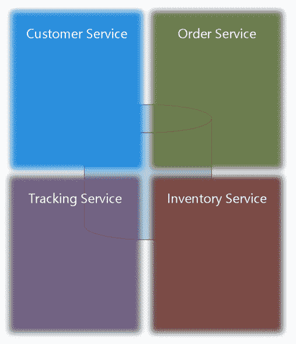
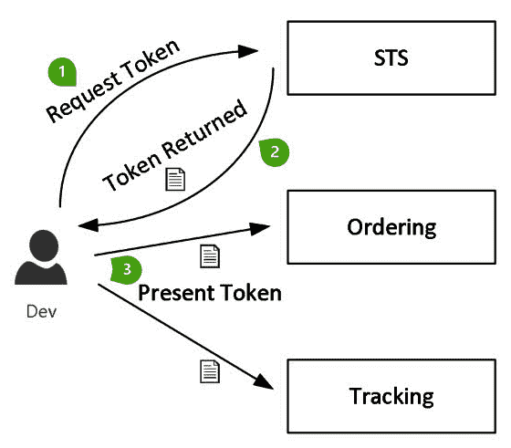
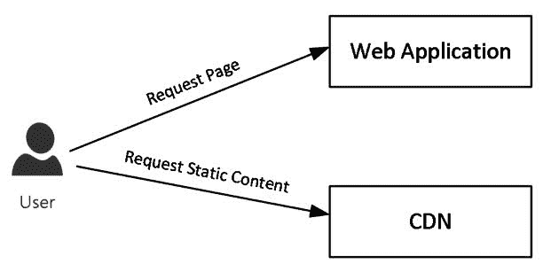
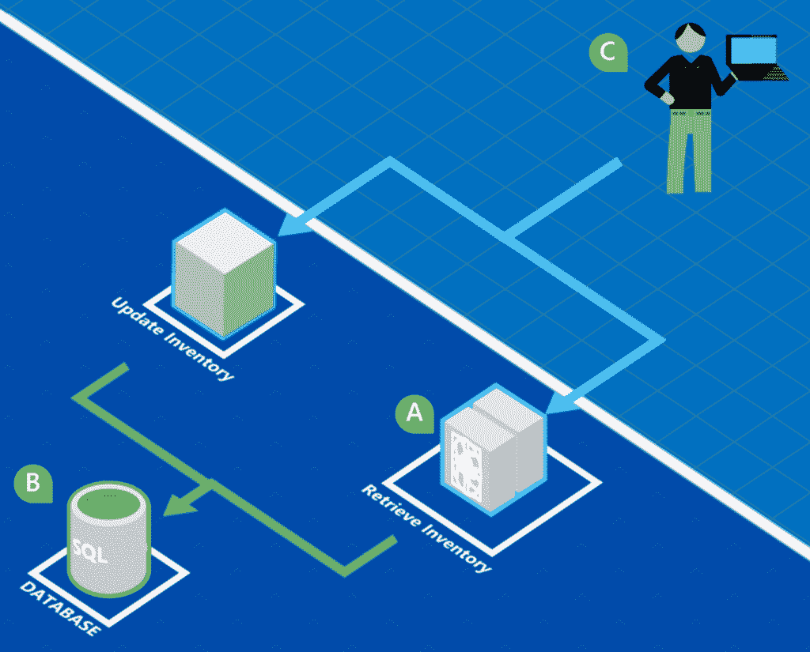

# 十二、云编程

前几章探讨了模式，从较低级别的概念（如 Singleton 和 Factory 模式）到特定技术（如数据库和 web 应用）的模式。这些模式对于确保解决方案的良好设计以确保可维护性和高效实现至关重要。这些模式提供了一个坚实的基础，允许应用随着需求变化和新功能的添加而增强和修改。

本章从更高的层次介绍解决方案，以解决涉及设计和实施可靠、可扩展和安全的解决方案的问题。本章中的模式通常涉及包含多个应用、存储库和一系列可能的基础结构配置的环境。

软件行业在不断发展，伴随着变化，既有新的机遇，也有新的挑战。在本章中，我们将研究云的不同软件模式。其中许多模式都不是新模式，并且存在于内部部署环境中。随着云优先解决方案逐渐成为常态，这些模式变得更加普遍，因为它们易于实现不依赖于本地基础设施的解决方案。

Cloud-first or cloud-native solutions have been designed to target cloud computing resources, while hybrid solutions have been designed to use both cloud computing resources as well as resources from a private data center. 

本章定义了在云中构建解决方案时的五个关键问题：

*   可伸缩性
*   可利用性
*   安全
*   应用设计
*   德沃斯

我们将讨论关键问题以及它们对构建云解决方案的重要性。在讨论这些关注点时，将描述可应用于解决这些关注点的不同模式。

# 技术要求

本章不需要任何特殊的技术要求或源代码，因为它主要是理论性的

# 在云中构建解决方案时的关键注意事项

做出迁移到云计算的决定有其自身的一系列问题和挑战。在本节中，我们将介绍构建基于云的解决方案需要考虑的五个关键领域。虽然这些并不是云所独有的，但由于可用的技术和解决方案范围广泛，因此在切换到云时需要特别注意。

五个主要考虑因素如下：

*   **可扩展性**：这允许为不断增长的业务适应不断增加的负载或流量。
*   **恢复力/可用性**：这确保了系统中故障的妥善处理，对用户的影响尽可能小
*   **安全**：这确保了私有和专有数据保持这种状态，并且不会受到黑客和攻击。
*   **应用设计**：指应用的设计，特别考虑基于云的解决方案。
*   **DevOps**：这是一个工具和实践的集合，支持基于云的解决方案的开发和运行。

根据您的业务需求，您可能需要为部分或所有这些考虑因素寻找解决方案。采用供应商解决您无法预料的问题，但有助于制定良好的应急计划，这也符合您企业的最佳利益。

在下面的部分中，我们将进一步详细讨论这些注意事项以及它们可用的解决方案模式。

These patterns range from a type of technology to architectural to business processes and a single pattern could address more than one concern.

# 可伸缩性

可伸缩性是指分配和管理应用使用的资源的能力，以便应用在给定工作负载下保持可接受的质量水平。大多数云产品都提供了提高应用使用的资源质量和数量的机制。例如，Azure 应用服务允许扩展应用服务的大小和应用服务的实例数。

可伸缩性可以看作是对有限资源的需求。资源可以是磁盘空间、RAM、带宽或软件的另一个可以量化的方面。需求的范围可以是用户数量、并发连接或对资源产生约束的其他需求。随着需求的增加，为了提供资源，对应用施加了压力。当压力影响应用的性能时，这称为资源瓶颈。

例如，度量值可能是在应用性能开始恶化之前可以访问应用的用户数。性能可以设置为请求的平均延迟小于 2 秒。随着用户数量的增加，可以查看系统上的负载，并确定影响性能的特定资源瓶颈

# 工作量

为了确定如何有效地解决扩展问题，了解系统将承受的工作负载非常重要。工作负载主要有四种类型：静态、定期、一生一次和不可预测。

静态工作负载表示系统上活动的恒定级别。因为工作负载不会波动，所以这种类型的系统不需要非常灵活的基础架构。

工作负载发生可预测变化的系统具有周期性工作负载。例如，一个系统在周末或所得税到期的几个月左右会经历大量活动。当负载增加时，这些系统可以放大以保持所需的质量水平，而当负载减少时，这些系统可以缩小以节省成本。

一生一次的工作负载表示围绕特定事件设计的系统。这些系统被配置为处理事件前后的工作负载，一旦不再需要它们，就被取消配置。

不可预测的工作负载通常受益于前面提到的自动缩放功能。这些系统的活动波动较大，业务部门尚未了解这些波动，或者受到其他因素的影响

了解和设计基于云的应用的工作负载类型对于保持高水平的性能和降低成本至关重要。

# 解决方案模式

我们有三种设计模式和一种体系结构模式可供选择，使我们能够增加系统的可扩展性：

*   垂直缩放
*   水平缩放
*   自动缩放
*   微服务

让我们更详细地回顾一下。

# 垂直缩放

尽管可以向本地服务器添加物理 RAM 或额外的磁盘驱动器，但大多数云提供商都支持轻松增加或降低系统计算能力的功能。随着系统的扩展，这通常很少或没有停机时间。这种类型的扩展称为垂直扩展，指 CPU 类型、RAM 大小和质量或磁盘大小和质量等资源发生变化时的扩展。

Vertical scaling is often referred to as *scaling up* while horizontal scaling is often referred to as *scaling out*. In this context, the term *up* refers to the size of the resource while *out* refers to the number of instances.

# 水平缩放

水平缩放不同于垂直缩放，因为水平缩放不改变系统的大小，而是改变所涉及的系统数量。例如，一个 web 应用可能运行在一台具有 4 GB RAM 和 2 个 CPU 的服务器上。如果服务器的大小增加到 8GB RAM 和 4 个 CPU，那么这将是垂直扩展。但是，如果再添加两台具有相同配置的 4 GB RAM 和 2 个 CPU 的服务器，则这将是水平扩展。

水平扩展可以通过使用某种形式的负载平衡来实现，这种负载平衡跨一组系统重定向请求，如下图所示：


在云解决方案中，水平缩放通常优于垂直缩放。这是因为，一般来说，将几个较小的虚拟机用于单个大型服务器以提供相同的性能度量更具成本效益。

为了使水平缩放最有效，它确实需要支持这种缩放类型的系统设计。例如，设计的 web 应用没有存储在服务器上的粘性会话和/或状态，更适合于水平扩展。这是因为粘性会话导致用户的请求被路由到同一虚拟机进行处理，随着时间的推移，虚拟机之间的路由平衡可能会变得不均衡，因此效率可能会降低。

Stateful applications
A *stateful *application maintains information about an active session on the server or repository.

Stateless applications
*Stateless* applications are designed to not require information about an active session to be stored on the server or repository. This allows for subsequent requests in a single session to be sent to any server to be handled and not just to the same server for the entire session.

设计为有状态的 Web 应用需要在共享存储库中维护会话或信息。无状态 web 应用与 web 花园或 web 场中的任何服务器一样，支持更具弹性的模式。这允许 web 应用中的单个节点在不丢失会话信息的情况下发生故障

A web *garden* is a pattern where multiple copies of the same web application are hosted on the same server, whereas a web *farm* is a pattern where multiple copies of the same web application are hosted on different servers. In both patterns, routing is used to expose the multiple copies as if they were a single application.

# 自动缩放

与内部部署解决方案相比，使用云提供商的一个优势是内置了对自动扩展的支持。作为水平扩展的另一个好处，自动扩展应用的能力通常是云服务的一个可配置功能。例如，Azure 应用服务提供了设置自动缩放配置文件的能力，允许应用对条件做出反应。例如，以下屏幕截图显示了自动缩放配置文件：


为工作日设计的配置文件将根据服务器上的负载增加或减少应用服务实例的数量。正在以 CPU 百分比度量负载。如果 CPU 百分比平均高于 60%，则实例数最多增加 10 个。类似地，如果 CPU 百分比降至 30%以下，则实例数将减少到最少 2 个。

An elastic infrastructure allows for resources to be scaled vertically or horizontally without requiring a re-deploy or downtime. The term is actually more of a degree of elasticity instead of referring to whether a system is *elastic* or *not elastic*. For example, an elastic service could allow for scaling both vertically and horizontally without requiring a restart of the service instances. A less elastic service would allow for scaling horizontally without a restart but would require a restart of the service when the size of the server is altered.

# 微服务

对于微服务的含义以及它与**面向服务架构**（**SOA**的关系有不同的解释。在本节中，我们将把微服务视为 SOA 的细化，而不是新的体系结构模式。微服务体系结构通过添加一些额外的关键原则扩展了 SOA，这些原则要求服务必须：

*   要小-因此称为*微型*
*   围绕业务能力进行构建
*   与其他服务松散耦合
*   可独立维护
*   孤立无援

# 小的

微服务通过将 SOA 中的服务缩减到尽可能小的规模，从而使它们走得更远。这与我们已经看到的其他一些模式非常吻合，例如**保持简单愚蠢**（**亲吻**）和**你不需要它**（**雅格尼**）来自[第 2 章](02.html)、*现代软件设计模式和原则*。微服务应该只满足其需求，而不是更多。

# 业务能力

通过围绕业务能力构建服务，我们以这样一种方式调整我们的实现：随着业务需求的变化，我们的服务将以类似的方式发生变化。正因为如此，一个业务领域的变化不太可能影响其他领域。

# 松耦合

微服务应该使用与技术无关的协议（如 HTTP）跨服务边界与其他服务交互。这使得微服务更容易集成，更重要的是，当另一个服务发生变化时，不需要重新构建微服务。这确实需要存在已知的*服务合同*。

Service contract
A *service contract* is the definition of a service that is distributed to other development teams. **Web Services Description Language** (**WSDL**) is a widely known XML-based language for describing services, but other languages, such as Swagger, are also very popular.

在实现微服务时，重要的是要有一个如何管理变更的策略。通过有一个版本化的服务契约，就可以将变更清楚地传达给服务的客户机。

例如，用于存储书籍库存的微服务策略可以有以下策略：

*   每个服务都将进行版本控制，并包含一个招摇过市的定义。
*   每个服务都将从版本 1 开始。
*   当需要更改服务合同时，版本将增加 1。
*   该服务最多可维护三个版本。
*   对服务的更改必须确保所有当前版本都能正常运行。

前面的基本策略确实有有趣的含义。首先，维护服务的团队必须确保更改不会破坏现有服务。这确保了新部署不会中断其他服务，同时允许部署新功能。该合同允许一次最多激活三个服务，从而允许可靠的服务独立更新。

# 可独立维护

这是微服务最显著的特征之一。使微服务能够独立于其他微服务进行维护，使企业能够在不影响其他服务的情况下管理该服务。通过管理服务，我们既包括服务的开发，也包括服务的部署。根据这一原则，可以更新和部署微服务，从而减少影响其他服务的机会，并以与其他服务不同的变化率进行更新和部署。

# 孤立状态

隔离状态包括可以共享的数据和其他资源，包括数据库和文件。这也是微服务体系结构的一个显著特征。通过拥有一个独立的状态，我们减少了数据模型中支持一个服务的更改将影响其他服务的可能性。

下图说明了一种更传统的 SOA 方法，其中单个数据库由多个服务使用：



通过要求微服务具有隔离状态，我们将要求每个服务都有一个数据库，如下图所示：


这有一个优势，即每个服务都可以选择最适合服务需求的技术

# 优势

微服务架构确实代表了传统服务设计的转变，它非常适合基于云的解决方案。微服务的优势以及为什么它们越来越受欢迎，可能不会立即显现出来。我们已经谈到了微服务的设计如何为优雅地处理变化提供优势。从技术角度来看，微服务可以在服务级别和数据库上独立扩展。

可能不清楚的是微服务架构对企业的好处。通过提供小型独立服务，企业可以考虑不同的方法来维护和开发微服务。企业现在可以选择以不同的方式托管服务，包括不同的云提供商，以最适合独立服务。同样，服务的隔离性质允许在开发服务时具有更大程度的灵活性。随着变化的发生，资源（即开发团队成员）可以根据需要分配给不同的服务，并且，随着服务范围的缩小，所需的业务知识量也会减少

# 弹性/可用性

弹性是应用优雅地处理故障的能力，而可用性是应用工作时间的度量。一个应用可能有一组资源，如果其中一个资源变得不可操作或不可用，该应用仍然可用

If an application is designed to handle one or more resources failing without the entire system becoming inoperable, this is referred to as **graceful degradation**.

模式既适用于隔离应用的元素，也适用于处理元素之间的交互，以便在发生故障时，影响是有限的。许多与弹性相关的模式关注于应用中组件之间或与其他应用之间的消息传递。例如，隔板模式将流量隔离到池中，以便当一个池被淹没或出现故障时，其他池不会受到不利影响。其他模式应用特定的技术来处理消息传递，例如重试策略或补偿事务。

可用性是许多基于云的应用的一个重要因素，通常，可用性是根据**服务级别协议**（**SLA**进行衡量的。在大多数情况下，SLA 规定了应用必须保持可操作的时间百分比。模式包括允许组件冗余以及使用技术限制活动增加的影响。例如，基于队列的负载均衡模式使用队列作为调用者或客户机与应用或服务之间的缓冲区，从而限制插入活动可能对应用产生的影响。

Resiliency and availability are identified here as related cloud solution factors as often a resilient application allows for a strict SLA on availability to be achieved.

# 解决方案模式

为了确保我们的系统具有弹性和可用性，我们的最佳选择是寻找具有特定体系结构的提供商。进入**事件驱动架构**（**EDA**。

EDA 是一种架构模式，它使用*事件*来驱动系统的行为和活动。它提供的解决方案模式将帮助我们实现预期的解决方案

# EDA

EDA 提倡生产者和消费者之间存在松散联系的概念，而生产者并不直接了解消费者。此上下文中的事件是从用户登录到系统、下订单到流程未能成功完成的任何更改。EDA 非常适合分布式系统，并允许高度可扩展的解决方案。

EDA 有许多相关模式和方法，本节介绍了与 EDA 直接相关的以下模式：

*   基于队列的负载均衡
*   发行者订阅者
*   优先级队列
*   补偿交易

# 基于队列的负载均衡

基于队列的负载均衡是将高需求对可用性的影响降至最低的有效方法。通过在客户机和服务之间引入队列，我们能够限制或限制服务一次处理的请求数量。这使得用户体验更加流畅。以下图为例：


上图显示了客户端向要处理的队列提交请求，并将结果保存到表中。队列的作用是防止功能被突然的活动高峰淹没。

# 发行者订阅者

发布服务器订阅服务器模式声明存在事件发布服务器和事件使用者。从本质上讲，这是 EDA 的核心，因为发布者与消费者是分离的，不关心事件向消费者的传递，而只关心发布事件。事件将包含用于将事件发送给感兴趣的消费者的信息。消费者随后会注册或订阅对特定事件感兴趣的信息：


上图演示了客户服务和订单服务。客户服务充当发布者，并在添加客户时提交事件。订单服务已订阅新的客户事件。收到新客户事件时，订单服务会将客户信息插入其本地存储

通过在体系结构中引入发布者-订阅者模式，订单服务与客户服务分离。这样做的一个优点是，它为更改提供了更灵活的体系结构。例如，可以引入一项新服务，将新客户添加到解决方案中，而不需要添加到客户服务使用的同一存储库中。此外，多个服务可以订阅新客户活动。添加欢迎电子邮件可以更容易地作为新订户添加，而不必将此功能构建到单一的整体解决方案中。

# 优先级队列

另一个相关的模式是优先级队列，它提供了一种不同处理类似事件的机制。使用上一节中的 new customer 示例，一个新的 customer 事件可能有两个订阅者。一个订户将对大多数新客户感兴趣，而一个订户将确定应以不同方式处理的客户子集。例如，来自农村地区的新订户可能会收到一封电子邮件，其中包含有关专业航运提供商的其他信息。

# 补偿交易

对于分布式系统，将命令作为事务发出并不总是切实可行或可取的。此上下文中的事务是指一个较低级别的编程构造，它将一个或多个命令作为一个操作进行管理，该操作要么全部成功，要么全部失败。在某些情况下，不支持分布式事务，或者使用分布式事务的开销超过了好处。补偿事务模式就是为了处理这种情况而开发的。让我们使用以下基于 BizTalk 业务流程的示例：


该图显示了流程中的两个步骤：在订单服务中创建订单和从客户服务中借记资金。该图显示了如何先创建订单，然后删除资金。如果资金借记未成功，则订单将从订单服务中删除

# 安全

安全性确保应用不会错误地披露信息或提供超出预期用途的功能。安全性包括恶意和意外操作。随着云应用和越来越多的身份提供商的使用，将访问权限限制为仅经批准的用户往往是一项挑战。

最终用户身份验证和授权需要设计和规划，因为隔离运行的应用越来越少，而且使用多个身份提供商（如 Facebook、Google 和 Microsoft）也很常见。在某些情况下，模式用于提供对资源的直接访问，以提高性能和可伸缩性。此外，其他模式涉及在客户端和应用之间创建虚拟墙。

# 解决方案模式

随着该行业的互联程度越来越高，使用外部方对用户进行身份验证的模式变得越来越普遍。这里选择联邦安全模式进行讨论，因为它是确保系统安全的最佳方式之一，而大多数**软件即服务（SaaS）**平台都提供此功能。

# 联邦安全

联邦安全将用户或服务（消费者）的身份验证委托给称为**身份提供者**（**IdP**的外部方。使用联邦安全性的应用将信任 IdP 正确地验证使用者，并准确地提供有关使用者或声明的详细信息。有关消费者的此信息作为令牌呈现。一个常见的场景是使用社交 IdP（如 Google、Facebook 或 Microsoft）的 web 应用

联邦安全性可以处理各种场景，从交互式会话到身份验证后端服务或非交互式会话。另一个常见场景是能够跨一套单独托管的应用提供单一身份验证体验或**单一登录**（**SSO**）。此场景允许从**安全令牌服务**（**STS**）获取单个令牌，以及用于呈现给多个应用的相同令牌，而无需重复登录过程：



联邦安全有两个主要目的。首先，它通过具有单个标识存储简化了标识管理。这允许以集中统一的方式管理身份，从而更容易执行管理任务，例如提供登录体验、忘记密码管理以及以一致的方式撤销密码。其次，它通过在多个应用中为用户提供类似的体验，并且只需要单一形式的身份验证，而不需要记住多个密码，从而提供更好的用户体验。

联邦安全有几种标准，两种广泛使用的标准是**安全断言标记语言**（**SAML**）和**OpenId Connect**（**OIDC**）。SAML 比 OIDC 旧，允许使用 XML SAML 格式交换消息。OIDC 建立在 OAuth 2.0 之上，通常使用**JSON Web 令牌**（**JWT**来描述安全令牌。这两种格式都支持联合安全、SSO，许多公共 IDP（如 Facebook、Google 和 Microsoft）都支持这两种标准。

# 应用设计

应用的设计可能会有很大的差异，并受到许多因素的影响。这些因素不仅是技术性的，而且还受到参与构建、管理和维护应用的团队的影响。例如，有些模式最适合小型专用团队，而不是大量地理位置分散的团队。其他与设计相关的模式更好地处理不同类型的工作负载，并在特定场景中使用。其他模式是围绕更改的频率以及如何在应用发布给用户后限制更改对应用的中断而设计的

# 解决方案模式

由于几乎所有内部部署模式都适用于基于云的解决方案，因此可以涵盖的模式范围是惊人的。之所以选择 Cache 和 CQRS 模式，是因为前者是大多数 web 应用使用的一种非常常见的模式，而后者改变了设计人员对构建解决方案的想法，并很好地适用于其他架构模式，如 SOA 和微服务。

# 隐藏物

将从较慢形式的存储中检索到的信息存储到较快形式的存储或缓存中，这是一种已经在编程中使用了几十年的技术，可以在浏览器缓存等软件和 RAM 等硬件中看到。在本章中，我们将看三个示例：缓存搁置、直写缓存和静态内容托管。

# 缓存在一边

通过在本地或更快的存储形式中加载频繁引用的数据，可以使用“缓存搁置”模式来提高性能。使用此模式，应用负责维护缓存的状态。下图对此进行了说明：


首先，应用从缓存请求信息。如果信息丢失，则从数据存储中请求该信息。然后，应用用这些信息更新缓存。信息存储后，将从缓存中检索并使用，而无需引用较慢的数据存储。使用此模式，应用负责在缓存未命中和数据更新时维护缓存

The term *cache miss* refers to when data is not found in the cache. In other words, it is missing from the cache.

# 直写缓存

直写缓存模式也可以用于提高性能，其方式与缓存旁模式类似。其方法不同于将缓存内容的管理从应用移动到缓存本身，如下图所示：


请求缓存中的一条信息。如果尚未加载数据，则从数据存储中检索信息，将其放入缓存，然后返回。如果数据已经保存，则会立即返回。此模式支持通过缓存服务传递信息写入来更新缓存。然后，缓存服务更新缓存和数据存储中保存的信息。

# 静态内容托管

静态内容托管模式将静态内容（如媒体图像、电影和其他非动态文件）移动到专用于快速检索的系统中。这方面的一项专门服务称为**内容交付网络**（**CDN**），它负责在多个数据中心之间分发内容，并将请求定向到最靠近调用者的数据中心，如下图所示：



静态内容托管是 web 应用的常见模式，其中 web 应用请求动态页面，页面包含静态内容的集合，如 JavaScript 和图像，然后浏览器直接从 CDN 检索这些内容。这是减少 web 应用流量的有效方法。

# 命令和查询职责分离

**命令和查询责任分离**（**CQRS**）是一种非常好的软件模式，需要更详细地讨论，因为它在概念上简单，相对容易实现，但对应用和相关开发人员都有重大影响。该模式清楚地将影响应用状态的命令与仅检索数据的查询分开。简单地说，更新、添加和删除等命令是在不同的服务中提供的，而查询不会更改任何数据

你可以再说一遍*CQRS！*我们认识到，我们在 OOP 和数据库设计中使用了一个 CQR 示例。同样的原则也适用于软件开发的许多领域。在本节中，我们将 CQR 作为一种服务设计模式来介绍，因为它带来了一些有趣的好处，并且非常适合现代模式，如微服务和反应式应用设计。

CQRS is based on the object-oriented design presented in the late 1980s by Bertrand Meyer's book, *Object-Oriented Software Construction*: [http://se.ethz.ch/~meyer/publications/](http://se.ethz.ch/~meyer/publications/).

如果我们重温[第 5 章](05.html)：*实现设计模式-.NETCore*，我们通过将库存上下文拆分为两个接口来说明此模式：`IInventoryReadContext`和`IInventoryWriteContext`。作为提醒，以下是界面：

```cs
public interface IInventoryContext : IInventoryReadContext, IInventoryWriteContext { }

public interface IInventoryReadContext
{
    Book[] GetBooks();
}

public interface IInventoryWriteContext
{
    bool AddBook(string name);
    bool UpdateQuantity(string name, int quantity);
}
```

我们可以看到，`GetBooks`方法与修改库存状态的两种方法`AddBook`和`UpdateQuantity`是分开的。这说明了代码解决方案中的 CQR。

同样的方法也可以应用于服务级别。如果我们使用一个维护库存的服务作为示例，我们将在一个更新库存的服务和另一个检索库存的服务之间中断该服务。下图对此进行了说明：



让我们先来看看 CQR 在基于云的解决方案中的应用所面临的挑战。

# CQR 的挑战

在服务中使用 CQRS 模式存在重大挑战：

*   一致性
*   采用

陈旧性是衡量数据与提交的数据版本之间的紧密程度的指标。在大多数情况下，数据都有可能发生变化，因此，一旦读取一段数据，就有可能更新该数据，从而使读取的数据与源数据不一致。这对于所有分布式系统来说都是一个挑战，因为在这些系统中，无法保证向用户显示的值反映源值。当数据直接反映存储内容时，我们可以称之为数据一致性；如果数据不一致，则视为不一致。

A common term used in distributed systems is *eventual consistency*. Eventual consistency is used to say a system will over time become consistent. In other words, it will eventually become consistent.

另一个更微妙的挑战是收养。将 CQR 实现到一个已建立的开发团队中可能会遇到来自开发人员和设计师的阻力，他们不熟悉该模式，并且可能缺乏业务部门对偏离当前设计模式的支持

那么好处是什么呢？

# 为什么是 CQR？

以下是使用 CQR 的三个重要因素：

*   **合作**
*   **模型分离**
*   **独立可扩展性**

使用单独的服务，我们可以独立地维护、部署和扩展这些服务。这提高了开发团队之间的协作水平。

通过提供单独的服务，我们可以使用最适合我们服务的模型。命令服务可以直接对数据库使用简单的 SQL 语句，因为这是负责的团队最熟悉的技术，而构建查询服务的团队可以使用一个框架来处理针对数据库的复杂语句

大多数解决方案的读取级别往往高于写入级别（反之亦然），因此在许多情况下，按照此标准拆分服务是有意义的。

# 德沃斯

使用基于云的解决方案，数据中心是远程托管的，您通常无法完全控制或访问应用的所有方面。在某些情况下，如无服务器服务，基础设施被抽象出来。应用仍必须公开有关正在运行的应用的信息，这些信息可用于管理和监视应用。用于管理和监视的模式对于应用的成功至关重要，因为它既能使应用保持健康运行，又能为业务提供战略信息。

# 解决方案模式

随着与监控和管理解决方案相关的商业软件包的可用性，许多企业对其分布式系统获得了更好的控制和理解。遥测和连续交付/连续集成在基于云的解决方案中具有特殊的价值，因此被选择用于更详细的介绍。

# 遥测

随着软件行业的发展，分布式系统涉及到更多的服务和应用，能够拥有一个系统的集体和一致的视图已经成为一项巨大的资产。由于 New Relic 和 Microsoft Application Insights 等服务的普及，**应用性能管理**（**APM**系统使用记录的有关应用和基础架构的信息（称为遥测）来监控、管理性能和查看系统的可用性。在基于云的解决方案中，直接访问系统的基础设施通常是不可能或不实际的，APM 允许将遥测数据发送到中央服务、消化，然后呈现给运营和业务部门，如下图所示：


上图取自 Microsoft Application Insights，提供了运行 web 应用的高级快照。一目了然，操作可以识别系统行为的变化，并做出相应的反应。

# 持续集成/持续部署

**持续集成/持续部署**（**CI/CD**）是一种现代开发流程，旨在通过频繁合并变更并部署这些变更来简化**软件交付产品生命周期**（**SDLC**）。CI 解决了企业软件开发中出现的问题，在企业软件开发中，多个程序员在同一个代码库上工作，或者单个产品使用多个代码分支进行管理。

请看下图：


在前面的示例中，有三个目标环境：开发、**用户验收测试**（**UAT**）和生产。开发环境是一个初始环境，在这个环境中，对应用所做的所有更改都将一起进行测试。**质量保证**（**质量保证**团队）使用 UAT 环境，在将变更转移到面向客户的环境（图中称为生产环境）之前，验证系统是否按预期工作。代码库被分解为三个匹配的分支：由开发团队进行的所有更改合并到的主干、UAT（用于部署到 UAT 环境）和生产代码库（用于部署到生产环境）

CI 模式通过在代码库更改时创建新的生成来应用。成功构建后，将对构建运行一套单元测试，以确保现有功能未被破坏。如果构建不成功，开发团队将进行调查并修复代码库或单元测试，以使构建通过

然后将成功的构建推送到目标环境。主干可能被设置为每天自动将一个新构建推送到集成环境中一次，而 QA 团队要求在环境中减少干扰，因此新构建只在办公时间后每周推一次。生产可能需要手动触发来协调新版本，以便在正式版本中宣布新功能和错误修复。

There is confusion over the terms *continuous deployment* and *continuous delivery*. Many sources differentiate the two terms as to whether the process of deploying is automated or manual. In other words, continuous deployment requires automated continuous delivery. 

导致环境之间合并从而将生成推送到环境或发布到环境的触发器可能有所不同。在我们对开发环境的说明中，我们有一组自动测试，可以自动针对新构建运行。如果测试成功，则自动执行从中继到 UAT 代码库的合并。UAT 和生产代码库之间的合并仅在 QA 团队签署或接受 UAT 环境中的变更后执行。

每个企业都将定制 CI/CD 流程，以满足其特定 SDLC 和业务需求。例如，面向公众的网站可能需要快速 SDLC 来保持市场竞争力，而内部应用可能需要更保守的方法来限制未经员工培训而改变功能所造成的中断。

无论如何，已经开发了一套工具来管理组织内的 CI/CD 流程。例如，Azure DevOps 通过允许构建管道来处理构建的创建时间和发布到环境的时间（包括手动和自动触发器），从而帮助管理此过程。

# 总结

云开发需要仔细的规划、维护和监控，模式可以帮助实现高度可扩展、可靠和安全的解决方案。本章中讨论的许多模式都适用于本地应用，并且在云解决方案中是必不可少的。云第一应用的设计应考虑许多因素，包括可扩展性、可用性、维护、监视和安全性。

可扩展的应用允许系统负载波动，同时保持可接受的性能水平。负载可以通过用户数量、并发进程、数据量和软件中的其他因素来衡量。水平扩展解决方案的能力需要特定类型的应用开发，这是一种对云计算特别重要的范例。基于队列的负载均衡等模式是确保解决方案在负载增加的情况下保持响应性的一项重要技术。

本章介绍的许多模式是互补的。例如，遵循命令和查询责任分离的应用可能会利用联合安全性来提供单一登录体验，并使用事件驱动的体系结构来处理应用不同组件之间的一致性。

在基于云的解决方案中，有一个几乎无穷无尽的适用模式集合，用于解决分布式系统中的不同挑战。本章介绍的模式代表了根据其广度以及它们如何相互补充而选择的模式。请参阅参考资料，以探索适用于基于云的解决方案的其他模式。

多么愉快的旅程啊！我们涵盖了从面向对象编程中使用的软件设计模式和基于云的解决方案中使用的体系结构模式，到更高效团队的业务模式和构建成功应用的模式。虽然我们试图涵盖范围广泛的模式，但肯定会有一些模式可以添加，也应该添加。

有鉴于此，Gaurav 和 Jeffrey 向您表示感谢，我们希望您喜欢并从阅读*C# 和.NETCore 设计模式*中获得一些东西。请让我们知道您的想法，并与我们分享您最喜欢的图案。

# 问题

以下问题将使您能够整合本章中包含的信息：

1.  大多数模式都是最近开发的，只适用于基于云的应用。对还是错
2.  ESB 代表什么，可以用于什么类型的体系结构：EDA、SOA 或单片？
3.  基于队列的负载均衡主要用于 DevOps、可伸缩性还是可用性？
4.  CI/CD 的好处是什么？在大量全球分散的团队中，还是在一个由并置开发人员组成的小团队中，这样做更有利？
5.  在静态内容托管之后的网站中，浏览器是直接通过 CDN 检索图像和静态内容，还是 web 应用代表浏览器检索信息？

# 进一步阅读

要了解有关本章所涵盖主题的更多信息，请参阅以下书籍。这些书将为您提供关于本章所涵盖主题的各种深入的实践练习：

*   *Azure 无服务器计算食谱，*由*Praveen Kumar Sreeram 编写，*由*Packt Publishing*出版：[https://www.packtpub.com/in/virtualization-and-cloud/azure-serverless-computing-cookbook](https://www.packtpub.com/in/virtualization-and-cloud/azure-serverless-computing-cookbook)
*   *与 Azure 的微服务，*由*Namit Tanasseri**和 Rahul Rai*编写，由*Packt Publishing*出版：[https://www.packtpub.com/in/virtualization-and-cloud/microservices-azure](https://www.packtpub.com/in/virtualization-and-cloud/microservices-azure)
*   *开发者可以使用 Azure，*作者*Kamil Mrzygłód，*发布作者*Packt Publishing*：[https://www.packtpub.com/virtualization-and-cloud/hands-azure-developers](https://www.packtpub.com/virtualization-and-cloud/hands-azure-developers)
*   *使用.NET Core 2.0 构建微服务-第二版*由*Gaurav Aroraa*编写，由*Packt Publishing*出版：[https://www.packtpub.com/application-development/building-microservices-net-core-20-second-edition](https://www.packtpub.com/application-development/building-microservices-net-core-20-second-edition) 。