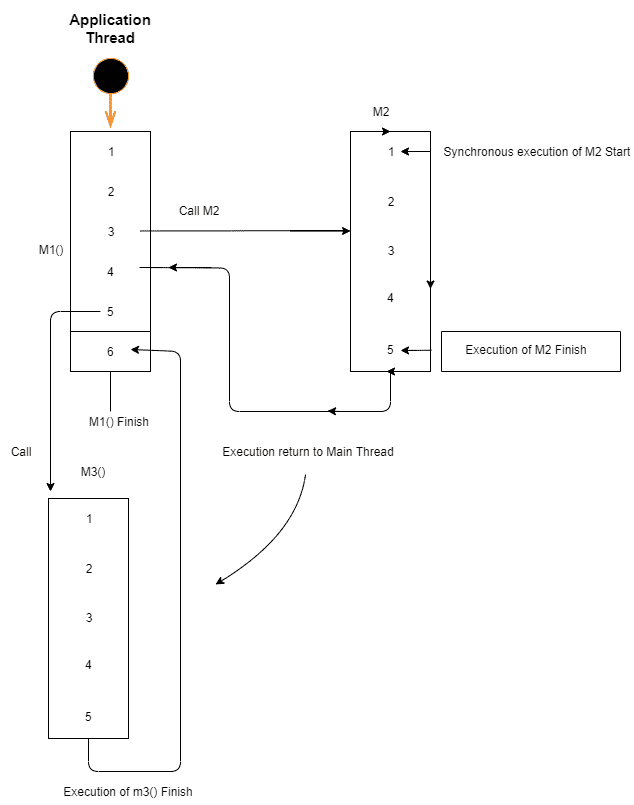

# 八、异步编程简介

在前面的章节中，我们已经看到了并行编程是如何工作的。 并行性是指创建一个或多个应用线程同时执行的称为工作单元的小任务。 由于线程在应用进程中运行，它们在使用委托完成后通知被调用的线程。

在本章中，我们将从介绍同步代码和异步代码之间的区别开始。 然后，我们将讨论什么时候使用异步代码，什么时候避免它。 我们还将讨论异步模式是如何随时间发展的。 最后，我们将看到并行编程中的新特性如何帮助我们避开异步代码的复杂性。

在本章中，我们将涵盖以下主题:

*   同步代码与异步代码
*   何时使用异步编程
*   何时避免异步编程
*   使用异步代码可以解决的问题
*   C# 早期版本中的异步模式

# 技术要求

为了完成本章，你应该对 TPL 和 C# 有一个很好的理解。 本章的源代码可以在 GitHub 上的[https://github.com/PacktPublishing/Hands-On-Parallel-Programming-with-C-8-and-.NET-Core-3/tree/master/Chapter08](https://github.com/PacktPublishing/Hands-On-Parallel-Programming-with-C-8-and-.NET-Core-3/tree/master/Chapter08)找到。

# 程序执行类型

在任何时间点，程序流都可以是同步的或异步的。 同步代码更容易编写和维护，但会带来性能开销和 UI 响应问题。 异步代码整体上提高了应用的性能和响应能力，但反过来又难以编写、调试和维护。

在下面的小节中，我们将详细了解程序执行的同步和异步方式。

# 理解同步程序的执行

在同步执行的情况下，控制永远不会移出调用线程。 每次只执行一行代码，当调用函数时，调用线程等待函数执行完毕，然后再执行下一行代码。 同步编程是最常用的编程方法，由于我们在过去几年看到的 CPU 性能的提高，它工作得很好。 使用更快的处理器，代码完成得更快。

通过并行编程，我们已经看到可以创建并发运行的多个线程。 我们可以启动许多线程，但也可以通过调用`Thread.Join`和`Task.Wait`等结构来使主程序流同步。 让我们来看一个同步代码的例子:

1.  我们通过调用`M1()`方法来启动应用线程。
2.  在第 3 行，`M1()`同步呼叫`M3()`。
3.  在调用`M2()`方法时，控件的执行转移到`M1()`方法。
4.  一旦被调用的方法(`M2`)完成，控件返回到主线程，该主线程执行`M1()`中的其余代码，即第 4 行和第 5 行。
5.  同样的事情发生在第 5 行，拨打`M2`。 第 6 行在`M2`完成时执行。

下面是同步代码执行的图示:



在下一节中，我们将尝试了解更多关于编写异步代码的内容，这将帮助我们比较两个程序流。

# 理解异步程序的执行

异步模型允许我们同时执行多个任务。 如果我们异步调用一个方法，该方法在后台执行，而被调用的线程立即返回并执行下一行代码。 异步方法可能创建线程，也可能不创建线程，这取决于我们正在处理的任务类型。 当异步方法完成时，它通过回调将结果返回给程序。 异步方法可以是 void，在这种情况下，我们不需要指定回调。

下图显示了调用者线程执行`M1()`方法，该方法调用一个名为`M2()`的异步方法:


与前面的方法相反，在这里，调用方线程并不等待`M2()`完成。 如果需要从`M2()`中利用任何输出，则需要将其放入其他方法中，比如这里的`M3()`。 下面是发生的事情:

1.  在执行`M1()`时，调用者线程对`M2()`进行异步调用。
2.  调用者线程在调用`M2()`时提供了一个回调函数，比如`M3()`。
3.  调用者线程不会等待`M2()`完成; 相反，它在`M1()`中完成其余的代码(如果有任何代码要完成的话)。
4.  `M2()`将被 CPU 立即在一个单独的线程中执行，或者在稍后的日期执行。
5.  一旦`M2()`结束，将调用`M3()`，接收`M2()`的输出并对其进行处理。

如您所见，很容易理解同步程序的执行，而异步代码带有代码分支。 我们将学习如何使用[第 9 章](09.html)、*Async、Await 和基于任务的异步编程基础*中的`async`和`await`关键字来减轻这种复杂性。

# 何时使用异步编程

有许多情况下,**直接内存访问**(**DMA)是用于访问主机系统或 I / O 操作(如文件、数据库或网络访问),这是处理由 CPU,而不是应用线程。 在前面的场景中，调用线程调用 I/O API，并通过移动到阻塞状态来等待任务完成。 当 CPU 完成任务时，线程被解除阻塞并完成方法的其余部分。**

使用异步方法，我们可以提高应用的性能和响应能力。 我们也可以通过不同的线程执行一个方法。

# 编写异步代码

异步编程对 C# 来说并不新鲜。 在 C# 的早期版本中，我们使用`Delegate`类的`BeginInvoke`方法以及`IAsyncResult`接口实现来编写异步代码。 随着 TPL 的引入，我们开始使用`Task`类编写异步代码。 从 C# 5.0 开始，`async`和`await`关键字一直是编写异步代码的开发人员的首选。

我们可以用以下方法编写异步代码:

*   使用`Delegate.BeginInvoke()`方法
*   使用`Task`类
*   使用`IAsyncResult`接口
*   使用`async`和`await`关键词

在随后的章节中,我们将详细看看这些代码示例,除了`async`和`await`关键词——[第 9 章](09.html),*异步,等待,和基于任务的异步编程基础*,是献给他们!

# 使用 Delegate 类的 BeginInvoke 方法

在.NET Core 中不再支持使用`Delegate.BeginInvoke`，但我们将在这里从向后兼容性的角度来看它与早期的.NET 版本。

我们可以使用`Delegate.BeginInvoke`方法异步调用任何方法。 如果需要将某些任务从 UI 线程移到后台，可以这样做来提高 UI 的性能。

让我们以`Log`方法为例。 下面的代码以同步方式工作并写入日志。 为了演示，日志代码被删除并替换为一个虚拟的 5 秒延迟，然后`Log`方法将一行内容打印到控制台:

下面是一个虚拟的`Log`方法，需要 5 秒来完成:

```cs
private static void Log(string message)
{
    //Simulate long running method
    Thread.Sleep(5000);
    //Log to file or database
    Console.WriteLine("Logging done");
}
```

下面是`Main`方法对`Log`方法的调用:

```cs
  static void Main(string[] args)
  {
     Console.WriteLine("Starting program");
     Log("this information need to be logged");
     Console.WriteLine("Press any key to exit");
     Console.ReadLine();
  }       
```

显然，5 秒的日志延迟太长了。 由于我们不期望`Log`方法有任何输出(写入控制台只是为了演示目的)，所以异步调用它并立即将响应返回给调用者是有意义的。

下面是程序当前的输出:


我们可以向前面的方法添加一个`Log`方法调用。 然后，我们可以将`Log`方法调用封装在委托中，并在委托上调用`BeginInvoke`方法，如下所示:

```cs
//Log("this information need to be logged");
Action logAction = new Action(()=> Log("this information need to be logged"));                 logAction.BeginInvoke(null,null);
```

这一次，当我们执行代码时，我们将看到旧版本的.NET 中的异步行为。 然而，在.NET Core 中，代码在运行时出现以下错误消息:

`System.PlatformNotSupportedException: 'Operation is not supported on this platform.'`

在.NET Core 中，不再支持将同步方法包装到异步委托中，主要有两个原因:

*   异步委托使用基于`IAsyncResult`的异步模式，这是. net Core 基类库不支持的。
*   没有`System.Runtime.Remoting`异步委托是不可能的，而`System.Runtime.Remoting`在.NET Core 中也不支持。

# 使用 Task 类

如前所述，在.NET Core 中实现异步编程的另一种方法是使用`System.Threading.Tasks.Task`类。 以上代码可以修改为:

```cs
// Log("this information need to be logged");
Task.Factory.StartNew(()=> Log("this information need to be logged"));
```

这将在不改变太多当前代码流的情况下给我们所需的输出:


我们在[第二章](02.html)、*任务并行*中讨论了`Task`。 类为我们提供了一种非常强大的方法来实现基于任务的异步模式。

# 使用 IAsyncResult 接口

在较老版本的 C# 中，已经使用了`IAsyncResult`接口来实现异步编程。 下面是一些在.NET 早期版本中运行良好的示例代码:

1.  首先，我们创建`AsyncCallback`，它将在异步方法完成时执行:

```cs
AsyncCallback callback = new AsyncCallback(MyCallback);
```

2.  然后，我们创建一个委托，该委托将使用传递的参数执行一个`Add`方法。 一旦完成，它将执行由`AsyncCallBack`封装的回调方法:

```cs
SumDelegate d = new SumDelegate(Add);
d.BeginInvoke(100, 200, callback, state);
```

3.  当调用`MyCallBack`方法时，它返回`IAsyncResult`实例。 为了获得底层的结果、状态和回调，我们需要将`IAsyncResult`实例强制转换为`AsyncResult`:

```cs
AsyncResult ar = (AsyncResult)result;
```

4.  一旦我们有了`AsyncResult`，我们就可以调用`EndInvoke`来获取`Add`方法返回的值:

```cs
int i = d.EndInvoke(result);
```

下面是完整的代码:

```cs
using System.Runtime.Remoting.Messaging;
public delegate int SumDelegate(int x, int y);

static void Main(string[] args)
{
    AsyncCallback callback = new AsyncCallback(MyCallback);
    int state = 1000;
    SumDelegate d = new SumDelegate(Add);
    d.BeginInvoke(100, 200, callback, state);
    Console.WriteLine("Press any key to exit");
    Console.ReadLine();
}
public static int Add(int a, int b)
{
    return a + b;
}
public static void MyCallback(IAsyncResult result)
{
    AsyncResult ar = (AsyncResult)result;
    SumDelegate d = (SumDelegate)ar.AsyncDelegate;
    int state = (int)ar.AsyncState;
    int i = d.EndInvoke(result);
    Console.WriteLine(i);
    Console.WriteLine(state);
    Console.ReadLine();
}
```

不幸的是，. net Core 不支持`System.Runtime.Remoting`，所以前面的代码不能在.NET Core 中工作。 我们只能在所有`IAsyncResult`场景中使用基于任务的异步模式:

```cs
FileInfo fi = new FileInfo("test.txt");
            byte[] data = new byte[fi.Length];
            FileStream fs = new FileStream("test.txt", FileMode.Open, FileAccess.Read, FileShare.Read, data.Length, true);
            // We still pass null for the last parameter because
            // the state variable is visible to the continuation delegate.
            Task<int> task = Task<int>.Factory.FromAsync(
                    fs.BeginRead, fs.EndRead, data, 0, data.Length, null);
            int result = task.Result;
            Console.WriteLine(result);
```

前面的代码使用`FileStream`类从文件中读取数据。 `FileStream`实现`IAsyncResult`，从而支持`BeginRead`和`EndRead`方法。 然后，我们使用`Task.Factory.FromAsync`方法包装`IAsyncResult`并返回数据。

# 何时不使用异步编程

在创建响应式 UI 和改进应用性能方面，异步编程非常有用。 然而，在某些情况下应该避免异步编程，因为它可能会降低性能并增加代码的复杂性。 在下面几小节中，我们将介绍几种最好不要使用异步编程的情况。

# 在没有连接池的单个数据库中

在单个数据库服务器没有启用连接池的情况下，异步编程将没有任何好处。 对于长时间运行的连接和多个请求，无论调用是同步的还是异步的，都会存在性能瓶颈。

# 当代码易于阅读和维护很重要的时候

在使用`IAsyncResult`接口时，我们必须将源方法分解为两个方法:`BeginMethodName`和`EndMethodName`。 以这种方式更改逻辑会花费大量的时间和精力，并使代码难以阅读、调试和维护。

# 用于简单和短时间运行的操作

我们需要考虑代码在同步运行时花费了多少时间。 如果不需要花费太长时间，保持代码同步是有意义的，因为实现代码异步会带来性能上的小冲击，而这对微小的增益没有好处。

# 对于具有大量共享资源的应用

如果你的应用正在使用大量的共享资源，比如全局变量或系统文件，保持代码同步是有意义的; 否则，我们最终将减少性能上的好处。 就像共享资源一样，我们需要应用同步原语来降低多线程的性能。 有时，单线程应用比多线程应用的性能更高。

# 使用异步代码可以解决的问题

让我们来看几个情况，在这些情况下，异步编程可以方便地提高应用的响应能力以及应用和服务器的性能。 一些情况如下:

*   日志和审计:日志和审计是应用的横切关注点。 如果您自己编写了用于日志记录和审计的代码，那么对服务器的调用就会变慢，因为它们也需要回写日志。 我们可以使日志记录和审计异步化，并且应该尽可能地使实现无状态。 这将确保回调可以在静态上下文中返回，以便在响应返回到浏览器时调用可以继续执行。
*   服务调用:Web 服务调用和数据库调用可以异步进行，因为一旦我们调用服务/数据库，控制就会离开当前应用并转到进行网络调用的 CPU。 调用者线程进入阻塞状态。 一旦来自服务调用的响应返回，CPU 将接收它并引发一个事件。 调用线程被解除阻塞并开始进一步执行。 作为一种模式，您可能已经看到所有服务代理都返回异步方法。
*   创建响应式 ui:在程序中可能存在用户单击按钮来保存数据的场景。 保存数据可能涉及多个小任务:从 UI 中将数据读取到模型中、连接到数据库以及调用数据库来更新数据。 这可能需要很长时间，而且如果这些调用是在 UI 线程上进行的，那么线程将被阻塞，直到完成此操作。 这意味着在返回调用之前，用户不能在 UI 上做任何事情。 我们可以通过进行异步调用来改善用户体验。
*   cpu 绑定的应用:随着.NET 中新技术和支持的出现，我们现在可以在.NET 中编写机器学习、ETL 处理和加密货币挖掘代码。 这些任务是高度 cpu 密集型的，所以让这些程序异步是有意义的。

**Asynchronous patterns in early versions of C#** In early versions of .NET, two patterns were supported to perform I/O-bound and compute-bound operations:

*   **异步编程模型**(**APM**)

*   **事件异步模式**(**EAP**)

We discussed both of these approaches in detail in [Chapter 2](02.html), *Task Parallelism*. We also learned how to convert these legacy implementations into task-based asynchronous patterns.

现在，让我们回顾一下在这一章中所讲的内容。

# 总结

在这一章中，我们讨论了什么是异步编程以及为什么写异步代码是有意义的。 我们还讨论了可以实现异步编程以及应该避免异步编程的场景。 最后，我们介绍了在 TPL 中实现的各种异步模式。

如果正确使用异步编程，可以有效地利用线程，从而真正提高服务器端应用的性能。 它还提高了桌面/移动应用的响应能力。

在下一章中，我们将讨论.NET 框架提供的异步编程原语。

# 问题

1.  ________ 代码更易于编写、调试和维护。

    1.  同步
    2.  异步
2.  在什么情况下应该使用异步编程?

    1.  File I/O
    2.  带有连接池的数据库
    3.  Network I/O
    4.  没有连接池的数据库
3.  哪一种方法可以用来写异步代码?

    1.  `Delegate.BeginInvoke`
    2.  `Task`
    3.  `IAsyncResult`
4.  哪些这些不能用来写异步代码在.NETCore?

    1.  `IAsyncResult`
    2.  `Task`