# 四、将地形和 ProBuilder 用于 Grayboxing

现在我们已经掌握了使用 Unity 的所有必要概念，让我们开始设计我们的第一个关卡。 本章的理念是学习如何使用地形工具创建游戏的景观，然后使用 ProBuilder 创建比使用立方体更详细的基础 3D 网格。 使用这些工具，你将能够创建任何类型的场景的原型，并在实际执行它的最终图形之前尝试你的想法。

具体来说，我们将在本章中研究以下概念:

*   用地形创建一个景观
*   使用 ProBuilder 创建形状

# 使用地形创建景观

到目前为止，我们已经使用 Cubes 来生成关卡原型，但我们也知道这些形状(T0)有时不能代表我们(T1)可能需要的所有对象。 想象一些不规则的东西，比如一个有山丘、峡谷和河流的完整地形。 使用多维数据集创建这将是一个噩梦。 另一种选择是使用 3D 建模软件，但问题是生成的模型太大太详细，即使在高端 pc 上也不能很好地运行。 在这种情况下，我们需要学习如何使用地形，我们将在本章的第一节做。

在本节中，我们将涵盖以下与地形相关的概念:

*   讨论高度地图
*   创建和配置高度映射
*   创作高度地图
*   添加高度图细节

让我们开始讨论高度地图，它的纹理帮助我们定义地形的高度。

## 讨论高度图

如果我们创建一个巨大的区域游戏的山丘,峡谷、火山口,山谷,使用常规的 3 d 建模工具和河流,我们有问题,我们将使用完整详细的模型对象所有可能的距离,因此把资源浪费在细节我们不会看到当对象是遥远的。 我们会从很远的地方看到很多地形部分，比如山脉和河流，所以这是一个严重的问题。

Unity 地形工具使用了一种叫做高度地图的技术，以一种性能和动态的方式生成地形。 它没有为整个地形生成大型 3D 模型，而是使用了一种叫做高度地图的图像，它看起来像是地形的自上而下黑白照片。

在下图中，你可以看到苏格兰地形高度的黑白自顶向下视图，白色表示高，黑色表示低:

图 4.1 -苏格兰的高度图

在前面的图像中，您可以很容易地找到山峰，同时寻找图像中最白的区域。 海平面以下的一切都是黑色的，而中间的一切使用灰色渐变表示最小高度和最大高度之间的不同高度。 其思想是，图像的每个像素决定了该特定区域的地形的高度。

Unity Terrain 工具可以自动从图像中生成一个 Terrain 3D 网格，节省我们的硬盘空间来创建该地形的完整 3D 模型。 此外，Unity 将在我们移动的时候创建地形，为附近的区域生成高细节模型，为远处的区域生成低细节模型，使它成为一个性能解决方案。

在下图中，您可以看到为地形生成的网格。 你可以看到，靠近地形的部分比远离地形的部分拥有更多的多边形:

图 4.2 -高度地图生成的网格

考虑到这一技术也有其缺点，如 Unity 在我们玩游戏时生成 3D 模型需要花费时间，以及无法创建洞穴，但现在这对我们来说不是问题。

现在我们知道了什么是高度地图，让我们看看如何使用 Unity 地形工具来创建我们自己的高度地图。

## 创建和配置高度映射

如果你点击**GameObject | |地形**3 d 对象,你就会看到一个巨大的飞机出现在场景,地形对象出现在你的**层次结构窗口。 这就是我们的地形，因为它的高度地图一开始都是黑色的，所以在初始状态下没有高度。 在下面的截图中，你可以看到一个全新的**地形**的样子:**

图 4.3 -地形还没有绘制高度

在你开始编辑你的地形之前，你必须配置不同的设置，例如地形的高度地图的大小和分辨率，这取决于你要用它做什么。 这和生成一个完整的世界是不同的。 记住，我们的游戏将发生在玩家基地，所以地形会很小。 在这种情况下，一个面积为 200 x 200 米的被山包围的区域就足够了。

为了配置我们的地形满足这些需求，我们需要做以下工作:

1.  从**层次**或**场景**窗口中选择**地形**。
2.  查看**Terrain**组件的**检查器**，并在其坍塌时展开它。
3.  Click on the wheel icon to switch to configuration mode. In the following screenshot, you can see where that button is located:

    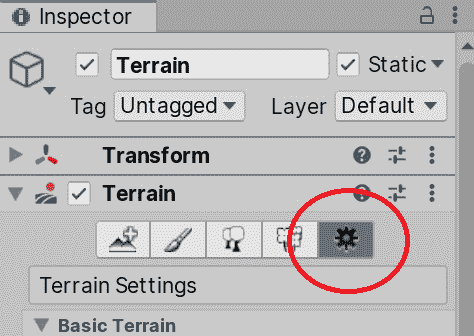

    图 4.4 -地形设置按钮

4.  寻找**网格分辨率**部分。
5.  将**地形宽度**和**地形长度**改为**200** 这就是说我们地形的大小是到是 200 x 200 米。
6.  **Terrain Height** determines the maximum height possible. The white areas of our Height Map are going to be that size. We can reduce it to **500** just to limit the maximum peak of our mountains:

    

    图 4.5 -地形分辨率设置

7.  寻找**纹理分辨率**部分。
8.  **高度地图分辨率**改变为**257 x 257**:

图 4.6 -高度地图分辨率设置

重要提示

highmap 分辨率是 highmap 图像的大小，它将保持地形的不同部分的高度。 在我们的 200 x 200 米的地形中使用 257 x 257 的分辨率意味着地形中的每平方米将被 1 个多一点的高地图所覆盖。 每平方米的分辨率越高，你可以在该区域绘制更多的细节。 通常，地形特征很大，所以每平方米超过 1 个像素通常是一种资源浪费。 找到最小的分辨率，让你可以创建你需要的细节。

你想要设置的另一个初始设置是初始地形高度。 默认情况下，这是 0，所以你可以从底部部分开始画高度，但这样，你不能在地形上挖洞，因为它已经在最低点了。 设置一点初始高度可以让你在需要的时候画出河流的路径和洞。 为了做到这一点，请执行以下步骤:

1.  选择**地形**。
2.  点击**刷**按钮(第二个按钮)。
3.  设置下拉菜单为**设置高度**。
4.  Set the **Height** property to **50**. This will state that we want all the terrain to start at **50** meters in height, allowing us to make holes with a maximum depth of **50** meters:

    

    图 4.7 -设置高度地形工具的位置

5.  点击**压平所有**按钮。 您将看到所有的地形已经被我们之前指定的**50**米抬高。

现在我们已经正确地配置了 Height Map，让我们开始编辑它。

## 创作高度地图

记住，Height Map 只是一个带有高度的图像，所以为了编辑它，我们需要在该图像中绘制高度。 幸运的是，Unity 的工具允许我们直接在编辑器中编辑地形，并直接看到修改高度的结果。 为了做到这一点，我们必须遵循以下步骤:

1.  选择**地形**。
2.  点击**刷**按钮。
3.  Set the dropdown in **Raise or Lower Terrain** mode:

    

    图 4.8 -抬高或降低地形工具位置

4.  在画笔选择器中选择第二个画笔。 这个笔刷模糊了边界，让我们创建更柔和的高度。
5.  设置**刷的大小**为**30**，这样我们就可以创建跨度**30**米的高度。 如果你想创建更微妙的细节，你可以减少这个数字。
6.  Set **Opacity** to **10** to reduce the amount of height we paint per second or click:

    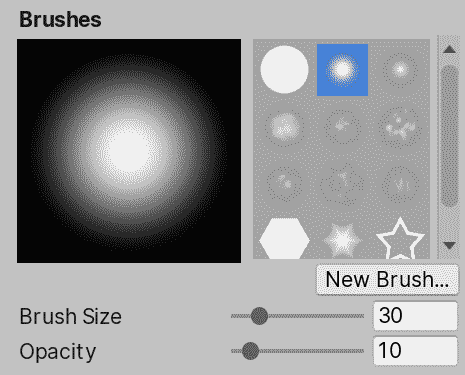

    图 4.9 -平滑边缘刷

7.  Now, if you move the mouse in the **Scene** view, you will see a little preview of the height you will paint if you click on that area. Maybe you will need to navigate closer to the terrain to see it in detail:

    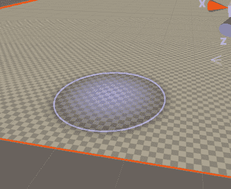

    图 4.10 -预显示区域以提高地形

    重要提示

    你可以在地形附近看到的格子图案让你看到你正在编辑的物体的实际大小。 每个单元格代表一个平方米。 记住，有一个参考来看到你正在编辑的对象的实际大小是有用的，以防止创建太大或太小的地形特征。 也许你可以放入其他类型的参考，比如一个大立方体，它的精确大小代表一个建筑，从而得到你正在创建的山或湖的大小概念。 记住，立方体的默认大小是 1 × 1 × 1 米，所以缩放到(10,10,10)将得到一个 10 × 10 × 10 米的立方体。

8.  按住左键并拖动光标在地形上开始绘制你的地形高度。 记住你可以按*Ctrl*+*Z*(在 Mac 上*命令*+*Z*来恢复任何不想要的更改。
9.  尝试在我们区域的边界周围画上山脉，这将代表我们基地的背景山:

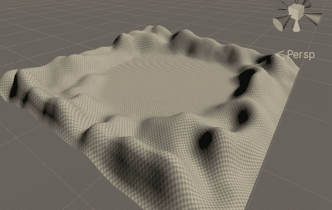

图 4.11 -在地形边缘绘制山脉

现在，我们在未来的基地周围有了不错的初始山丘。 我们也可以在我们未来的根据地周围画一个流域。 要做到这一点，请遵循以下步骤:

1.  Place a cube with a scale of (**50,10,50**) in the middle of the terrain. This will act as a placeholder for the base we are going to create:

    

    图 4.12 -基本区域的占位符立方体

2.  再次选择**地形**和**刷**按钮。
3.  将**刷大小**减为**10**。
4.  Holding the *Shift* key, left-click and drag the mouse over the terrain to paint the basin around our base placeholder. Doing this will lower the terrain instead of raising it:

    

图 4.13 -我们占位基地周围的河流流域

现在，我们有了一个简单但不错的入门地形，它能够让我们从基地的视角了解地形的基本情况。 在继续前进之前，我们将应用一些更精细的细节，使我们的地形看起来更好一点。 在下一节中，我们将讨论如何用不同的工具模拟地形侵蚀。

## 添加高度地图细节

在前一节中，我们创建了一个地形的粗略轮廓。 如果你想让它看起来有点真实，那么你需要开始在这里和那里画很多微小的细节。 通常情况下，这是在关卡设计过程的后期完成的，但现在让我们看看，因为我们正在探索地形工具。 现在，我们的山看起来非常平滑。 在现实生活中，他们更敏锐，所以让我们改进一下:

1.  选择**地形**，启用**画笔**按钮。
2.  在**升高或**降低地形模式下设置下拉。
3.  选择第五支画笔。 这个有一个不规则的布局，所以我们可以在这里和那里画一点噪音。
4.  Set **Brush Size** to **50** so that we can cover a greater area:

    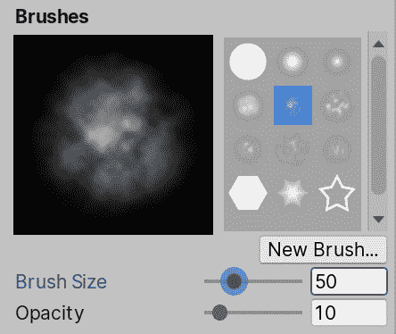

    图 4.14 -云模式画笔的随机性

5.  按住*Shift*，在地形的山丘上做小的点击，而不需要拖动鼠标。 记住将放大到区域，因为这些区域在远处是看不见的。

图 4.15 -用以前的刷子产生的侵蚀

这给我们的山增加了一些不规则性。 现在，让我们想象一下，我们想要在山上有一块平坦的区域，用来放置装饰性的天文台或天线。 遵循以下步骤:

1.  从下拉菜单中选择**地形**，**笔刷工具**和**设置高度**。
2.  设置**高度**为**60**。
3.  Paint an area over the hills. You will see how the terrain will raise if it's lower than **60** meters or became lower in areas greater than **60** meters:

    

    图 4.16 -山丘变平

4.  You can see that the borders have some rough corners that need to be smoothed:

    

    图 4.17 -非光滑的地形边缘

5.  更改下拉菜单为**平滑高度**模式。
6.  Select the second brush with a size of **5** and an opacity of **10**:

    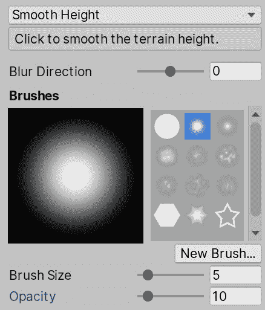

    图 4.18 -平滑高度刷

7.  点击并拖动到平坦区域的边界上，使其更平滑:

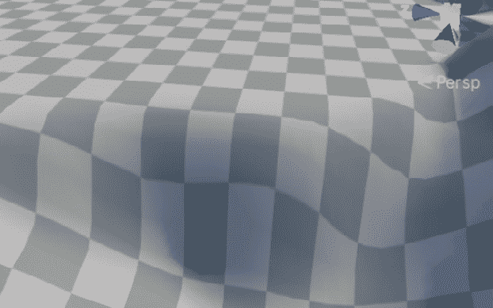

图 4.19 -平滑的地形边缘

我们可以不断添加细节，但我们可以先解决这个问题。 下一步是创建我们的玩家基地，但这一次，让我们探索 ProBuilder 来生成我们的几何图形。

# 使用 ProBuilder 创建形状

到目前为止，我们已经使用立方体和原始形状创建了简单的场景，这对于你将创建的大多数原型来说已经足够了，但有时你会遇到游戏中一些棘手的区域，这将很难用常规的立方体建模， 或者你可能想要在游戏的某些部分中添加一些更深入的细节，以获得玩家对该区域的视觉感受。 在这种情况下，我们可以使用任何 3D 建模工具，如 3D studio, Maya，或 Blender，但这些可能很难学习，你可能不需要所有的力量在你的开发阶段。 幸运的是，Unity 有一个简单的 3D 模型创建器 ProBuilder，所以让我们来探索它。

在本节中，我们将介绍与 ProBuilder 相关的以下概念:

*   安装 ProBuilder
*   创建一个形状
*   操纵网
*   添加细节

ProBuilder 默认不包含在我们的 Unity 项目中，所以让我们从学习如何安装它开始。

## 安装 ProBuilder

Unity 是一个功能强大的引擎，但如果我们不使用，那么将所有这些工具添加到我们的项目中会让引擎运行得更慢，所以我们需要手动指定我们使用的 Unity 工具。 为此，我们将使用包管理器，这是一个工具，我们可以使用它来查看和选择我们将需要哪些 Unity 包。 您可能还记得，前面我们讨论了**Packages**文件夹。 这基本上就是这个包管理器正在修改的内容。

为了使用这个工具安装 ProBuilder，我们需要做以下工作:

1.  Click the **Window | Package Manager** option:

    

    图 4.20 - Package Manager 选项

2.  In the window that just opened, be sure that **Packages** is in **Unity Registry** mode by clicking on the button saying **Packages** at the top-left part of the window and selecting **Unity Registry**:

    

    图 4.21 -显示所有包

3.  请稍等，等待左边的软件包列表中的填充。 确保你已经连接到互联网来下载和安装这些软件包。
4.  Look at the **ProBuilder** package in that list and select it.

    重要提示

    我正在使用 ProBuilder 4.2.3 版本，这是撰写本书时可用的最新版本。 虽然您可以使用较新的版本，但是使用它的步骤可能有所不同。 您可以使用标题左侧的箭头查看旧版本。

    

    图 4.22 -软件包列表中的 ProBuilder

5.  Click on the **Install** button at the bottom right-hand side of the **Package Manager**:

    

    图 4.23 -安装按钮

6.  请稍候，等待包安装。 当**Install**按钮被替换为最新标签时，您将注意到该过程已经结束。

现在我们已经在项目中安装了 ProBuilder，让我们使用它吧!

## 创建形状

我们将开始我们的基地创建一个平面为我们的地板。 我们将这样做:

1.  Open ProBuilder and go to the **Tools | ProBuilder | ProBuilder** window:

    

    图 4.24 - ProBuilder 窗口选项

2.  In the window that has opened, click the plus icon (+) at the right of the **New Shape** button:

    

    图 4.25 -新建形状选项

3.  在**形状选择器**中，选择**平面**。
4.  设置**宽度**和**长度**为**50**。
5.  Set the **Width** and **Length** segments to **2**. We will need those subdivisions later:

    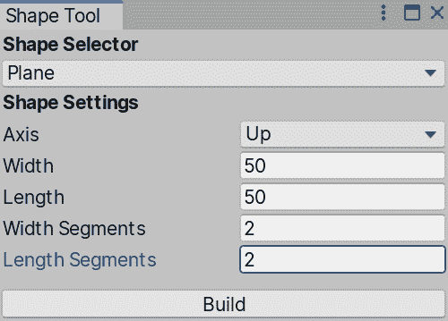

    图 4.26 -新建形状设置

6.  点击**Build**按钮确认**平面**。
7.  Click the first button of the four **ProBuilder** buttons in the **Scene** view to enable movement of the entire plane:

    

    图 4.27 -选择对象工具

8.  用下面的地板替换占位符立方体:

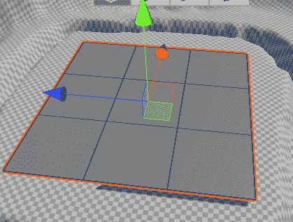

图 4.28 -用 3 x 3 网格细分的平面

现在我们已经创建了地板，让我们学习如何操作它的顶点来改变它的形状。

## 操作网格

如果您选择平面，您将看到它被细分为一个 3 x 3 的网格，因为我们将宽度和高度片段设置为 2(2 切割)。 我们这样做是因为我们将利用外部细胞来创建我们的细胞壁，从而使它们升高。 其想法是修改这些细胞的大小，在创建墙壁之前勾勒出墙壁的长度和宽度。 为此，我们将做以下工作:

1.  选择飞机。
2.  Click the second button (showing the vertices) of the four new buttons that appeared in the Scene View:

    

    图 4.29 -选择顶点工具

3.  Click and drag the mouse to create a selection box that picks the four vertices of the second row of vertexes:

    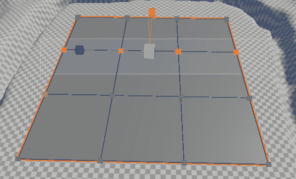

    图 4.30 -顶点选择

4.  Click on the second button in the top-left of the buttons of the Unity Editor to enable the Move Tool:

    

    图 4.31 -移动工具

5.  Move the row of vertexes to make that subdivision of the plane thinner. You can use the checkered pattern on the terrain to get a notion of the size of the wall in meters:

    

    图 4.32 -移动的顶点

6.  对每一行顶点重复*步骤 3*到*5*直到得到大小相似的壁轮廓:

图 4.33 -移动顶点以减少边缘单元格宽度

重要提示

如果您希望顶点具有准确的位置，我建议您安装并研究 ProGrids 包。 这是一个位置捕捉系统，与常规的 Unity 和 ProBuilder。

现在我们已经创建了墙壁的轮廓，让我们添加新的面到我们的网格创建它们。 为了使用我们创建的细分或“面”来制作墙壁，我们必须挑选和挤压它们。 遵循以下步骤:

1.  选择飞机。
2.  Select the fourth button of the **ProBuilder** buttons in the Scene view:

    

    图 4.34 -选择面工具

3.  While holding *Ctrl* (*command* on Mac), click over each of the faces of the wall outlines:

    

    图 4.35 -选择边缘面

4.  In the **ProBuilder** window, look for the plus icon (+) to the right of the Extrude Faces button. It will be located in the red section of the window:

    

    图 4.36 -挤压面选项

5.  在点击加号按钮后出现的窗口中设置**距离**到**5**。
6.  Click the **Extrude** **Faces** button in that window:

    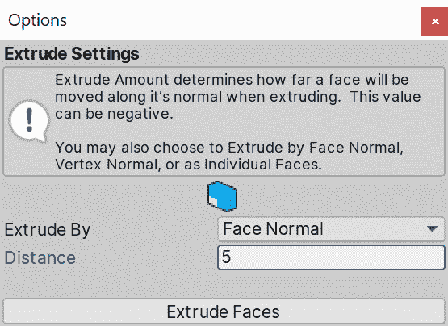

    图 4.37 -挤压距离选项

7.  现在，你应该看到墙的轮廓刚刚从地面升起:

图 4.38 -挤压的网格边缘

现在，如果你注意基层和墙壁如何接触地形，有一个小间隙。 我们可以试着把底座向下移动，但地板可能会消失，因为它会被埋在地形下。 这里我们可以做的一个小技巧就是把墙壁向下推，不移动地板，这样墙壁就会被埋在地形中，但我们的地板会与它保持一点距离。 你可以在下图中看到它的一个示例:

图 4.39 -预期结果切片

为了做到这一点，我们需要做到以下几点:

1.  Select the third **ProBuilder** button in the Scene view to enable edge selection:

    

    图 4.40 -选择边缘工具

2.  While holding *Ctrl* (*command* on Mac), select all the bottom edges of the walls.

    如果你选择了不需要的边，只需再次点击它们，同时按住*Ctrl*(Mac 上的*命令**取消选中它们，同时保持当前选择:*

    **

    *图 4.41 -选择地板边缘*

    *信息框*

    *如果你想在前面的截图中使用线框模式，点击场景视图左上角的阴影按钮，并从下拉菜单中选择线框选项。*

**   Enable the Move Tool pressing the second button in the top-left part of the Unity Editor:

    

    图 4.42 -移动工具

    *   向下移动边缘，直到它们完全埋在地形下:*

 *

图 4.43 -重叠面

现在我们有了一个基础网格，我们可以开始使用其他几个 ProBuilder 工具向其添加细节。

## 添加细节

让我们开始添加细节到的基础上，应用一个小斜面的墙壁。 遵循以下步骤:

1.  Using the edge selection mode (the third button of the **ProBuilder** buttons), select the top edges of our model:

    

    图 4.44 -被选中的顶壁边缘

2.  在**ProBuilder**窗口中，点击**斜面**按钮右侧的加号图标。
3.  Set a distance of **0.5**:

    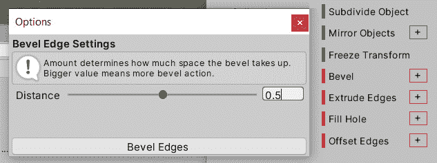

    图 4.45 -要产生的斜面距离

4.  Click on **Bevel Edges**. Now, you can see the top part of our walls with a little bevel:

    

    图 4.46 -斜面加工的结果

5.  或者，你也可以在内墙的底部这样做:

图 4.47 -斜角应用于地板和墙壁的边缘

另一个需要添加的细节是在地面中央添加一个坑，作为我们需要避免掉进去的危险，并让敌人使用 AI 避开它。 要做到这一点，请遵循以下步骤:

1.  通过点击第四个 ProBuilder 场景视图按钮来启用 FACE 选择模式。
2.  选择地板。
3.  在**ProBuilder**窗口中点击**细分**面选项。 最后地板会被分成四部分。
4.  Click that button again to end up with a 4 x 4 grid floor:

    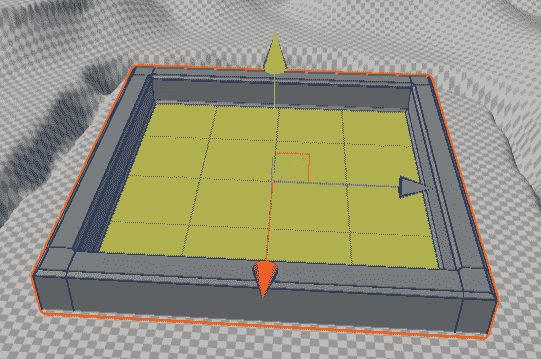

    图 4.48 -细分地板

5.  选择四个内部地砖。
6.  Enable the Scale Tool by clicking the fourth button in the top-left part of the Unity Editor:

    

    图 4.49 -缩放工具

7.  Using the gray cube at the center of the gizmo, scale down the center tiles:

    

    图 4.50 -内部细胞收缩

8.  点击**ProBuilder**窗口中的挤压面按钮。
9.  将挤压的面向下推。
10.  Right-click on the **ProBuilder** window tab and select **Close Tab**. We need to get back to terrain editing and having **ProBuilder** open won't allow us to do that comfortably:

    

    图 4.51 -关闭选项卡

11.  选择**地形**，降低地形区域，这样我们就可以看到坑:

图 4.52 -地形被降低以使坑可见

我知道我们并没有在最初的关卡布局中计划坑，但请记住，定义缩略语是一份会在游戏开发过程中不断改变的文件，所以有时我们可以大胆地改变它，以完善游戏。 只是要注意不要走得太远，没有止境的变化，这是一个很难掌握的艺术。

# 总结

在本章中，我们学习了如何使用高度地图和 Unity 地形工具创建大型地形网格，如绘制高度和设置高度来创建山丘和河流盆地。 此外，我们还学习了如何使用 ProBuilder 创建我们自己的 3D 网格，以及如何操作模型的顶点、边和面，为我们的游戏创建一个原型基础模型。 我们没有讨论一些性能优化，我们可以应用到我们的网格或一些先进的 3D 建模概念，因为这将需要整个章节，这是超出这本书的范围。 现在，我们的主要关注点是原型设计，所以我们对关卡当前的状态很满意。

在下一章中，我们将学习如何下载这些原型模型，并通过整合我们使用外部工具创建的素材(文件)，将其替换为最终的图像。 这是改善游戏图像质量的第一步，我们将在第二部分结束时完成最终外观。*