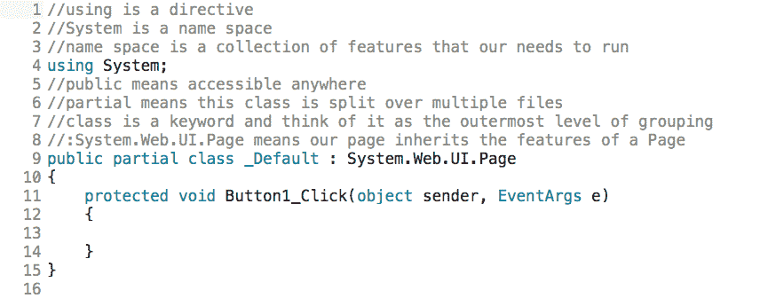

# 使用查询语法构造查询

在本章中，您将学习如何使用查询语法编写查询，例如，方法链接，就像我们之前所做的那样。

# 向 HTML 中添加一个显示按钮

打开一个项目，进入的唯一东西就是一个按钮。 为此，转到“工具箱”，抓取一个`Button`控件，并将其拖放到以`<form id=...`开头的行下面。 替换按钮上的文本，显示:

```cs
<asp:Button ID="Button1" runat="server" Text="Show" />
```

现在，切换到 Design 视图，并双击 Show 按钮。 这把我们带入了`Default.aspx.cs`。 删除事件处理存根。 此项目的相关启动代码部分应该类似于图 11.6.1:



Figure 11.6.1: The starting code section for this project

接下来，转到文件的顶部，在`using System`下，输入以下内容:

```cs
using System.Collections.Generic;
using System.Linq;
```

为了利用这一点，我们将做以下工作。 这是程序代码; 这是机械的。 第一件事是，当有人单击 Show 按钮时，您希望创建一个标签，以便始终有一个累积输出。 为此，在以`protected void Button1_Click...`开头的行下面的花括号中输入以下内容:

```cs
sampLabel.Text = "";
```

# 创建十进制工资数组

接下来，在前面一行的下面，您将创建一个名为`salaries`的`decimal`数组，这是很自然的。 因此，输入以下内容:

```cs
decimal[] salaries = new decimal[] { 56789, 78888, 35555, 34533, 75000 };
```

这就是查询`decimal`数组的方法。 这是一个特定的`decimal`数组，但本质上可以是任何数组。 我们加入一些值，就是这样。

# 使用范围变量

接下来，在这一行下面输入以下内容:

```cs
IEnumerable<string> salResults = from salary in salaries
```

注意，返回或结果集将是`string`类型，而不是`decimal`类型。 在`salResults =`之后，您想要定义 LINQ 查询的主体，所以您说`from salary in salaries`。 如果将鼠标悬停在这里的`salary`上，您会看到它就是所谓的*范围变量*，见*图 11.6.2。* 所以，你要求它在`salaries`看一看。 作为一个范围变量，它是对所有项单独进行的量。


Figure 11.6.2: Range variable

# 选择一个薪资范围并按降序排列

现在你要指定某种逻辑条件。 例如，以某种方式过滤结果。 因此，在这一行下面，输入以下缩进:

```cs
where 35000 <= salary && salary <= 75000
select $"<br>{salary:C}";
```

接下来，您可以`orderby`结果集以降序列出工资; 因此，在这一行下面直接输入以下内容:

```cs
orderby salary descending
```

默认值是从小到大的递增顺序，您可以将其颠倒过来。 当你加入`descending`关键字时，它就会由大变小。

接下来，记住目标是获得一个由字符串填充的字符串的`IEnumerable`构造。 因此，最后，输入以下内容作为该块的一部分:

```cs
select $"<br>{salary:C}";
```

您还可以在适当的地方格式化结果，例如，就像我在这一行中所做的那样，使用货币格式。

# 显示结果

有了这段代码，下一个阶段当然是遍历它并显示结果。 为此，你可以将其转换为列表并打印，或者你也可以做以下操作:

```cs
foreach(string formattedSalary in salResults)
```

我们怎么知道我们应该在这一行中说`string`? 还记得前面的`IEnumerable`行是由字符串填充的吗? 如果您将鼠标悬停在`IEnumerable`上，它会显示`IEnumerable<out T>`，而`T`是字符串。

现在，为了显示结果，在前一行下面的一组花括号之间输入以下内容:

```cs
sampLabel.Text += formattedSalary;
```

这里，`formattedSalary`是要显示的内容。

现在，在你的浏览器中打开这个。 单击 Show 按钮。 图 11.6.3:


Figure 11.6.3: The initial results of running the program

这里的工资按降序排列，从最高到最低，在 75,000 美元到 35,000 美元之间。 这和预期的一样。

# 观察延迟执行

现在，您应该注意的一件事是称为*延迟执行*的概念。 所以，要了解这意味着什么，看看接下来会发生什么。

假设我在`foreach(string formattedSalary in salResults)`行中设置了一个断点。 然后，从 Debug 菜单中选择 Step Into，并单击 Show 按钮。 注意每行是如何连续运行的(以 ms 为单位的运行时间出现在每行之后)。 你应该看到它是如何进入的; 它是如何运行。

对于 LINQ，您应该注意的一件事是延迟执行的概念，这意味着，正如您所看到的，`salResults`实际上在运行，所以它本质上是一个查询变量。 当您使用`foreach`结构迭代它时，它就会运行，如下面的代码块所示，而不是在前面的`IEnumerable`块中编写它时。 那时它就不运行了。 当您迭代它时，它会运行。 否则，您的程序可能会在这些查询结果中携带大量信息。 这是关于延迟执行的:

```cs
IEnumerable<string> salResults = from salary in salaries
                                 where 35000 <= salary && salary <= 75000
                                 orderby salary descending
                                 select $"<br>{salary:C}";
        foreach(string formattedSalary in salResults)
        {
            //display formatted salaries one at a time
            sampLabel.Text += formattedSalary;
        }
```

在下一阶段中，我们将看看另一个实际的例子，看看您可能会做什么。 我们还想显示水平线，所以在`sampLabel.Text += formattedSalary`行下面的右花括号后输入以下内容:

```cs
sampLabel.Text += "<br><hr/>";
```

标签将在输出中添加一条水平线。

# 制作一本字典

接下来，我们做一个`Dictionary`; 为此，接下来输入以下行:

```cs
Dictionary<string, decimal> nameSalaries = new Dictionary<string, decimal>();
```

这里，`<string,decimal>`表示键值对。

# 使用键-值对

现在，让我们添加一些键值对。 所以，从输入以下内容开始:

```cs
nameSalaries.Add("John Jones", 45355);
```

在这一行中，`John Jones`是关键，值是他的工资或$45,355。

然后，您可以重复几次，所以复制并粘贴这一行直接下面三次。 比如，约翰·史密斯，76900; 约翰·詹金斯,89000; 史蒂夫·乔布斯，98000:

```cs
nameSalaries.Add("John Smith", 76900);
nameSalaries.Add("John Jenkins", 89000);
nameSalaries.Add("Steve Jobs", 98000);
```

注意，我在这里重复了几次名称*John*，因为我想简短地说明一个概念。 最后一个列出的是*史蒂夫·乔布斯*，当然他的工资要远远超过 98000!

# 查询键值对中的数据

现在，我们再次查询这个。 这是键值对中的数据，我们会进行查询。 因此，在这些行下面输入以下内容:

```cs
var dictResults = from nameSalary in nameSalaries
```

这里，`nameSalary`是一个范围变量，它指的是 John Jones、John Smith、John Jenkins、Steve Jobs 等等，而`nameSalaries`是字典本身。 `nameSalary`是键和值的特殊组合。

接下来，在这一行下面，缩进以下代码:

```cs
where nameSalary.Key.Contains("John") && nameSalary.Value >= 65000
```

这里我们说的是，键包含名字 John，而薪水大于或等于 65,000 美元。 如果您愿意，您可以添加`OrderBy`等，但出于我们的目的，请在这一行下面直接输入以下内容:

```cs
select $"<br>{nameSalary.Key} earns {nameSalary.Value:C} per year.";
```

在这一行中，我们将选择那些适用于这两个条件的记录:名字是 John，薪水超过$65,000。 所以，在我们的例子中，肯定是约翰·史密斯和约翰·詹金斯。 为了格式化输出，使其看起来很好，我们说`nameSalary.Value:C`将其格式化为货币，然后加上`per year`。

现在，将鼠标悬停在`dictResults`上。 在弹出的工具提示中，你看到它说`IEnumerable`的地方了吗? 现在，`var`被称为*内隐式打字*。 我们以前见过`var`。 有时候，很难判断我们创建的查询的输出是什么，因为它已经足够复杂了。 因此，如果您执行隐式输入，它会告诉您输出应该是什么，即`string`类型的`IEnumerable`。 现在，如果你想，你可以改变这一行如下:

```cs
IEnumerable<string> dictResults = from nameSalary in nameSalaries
```

现在我们也知道这一点，因为在这个查询的末尾，你看到有字符串，对吗? 这些是包含格式化信息的字符串，当然，你可以像往常一样迭代它; 因此，输入以下内容:

```cs
foreach(string nameSal in dictResults)
```

然后，在这一行下面的一组花括号之间，以以下内容结束:

```cs
sampLabel.Text += nameSal;
```

# 运行程序

Run this in your browser to make sure that it's working as expected. Click on the Show button. The results are shown in *Figure 11.6.4*:


Figure 11.6.4: The results of running our program

现在您已经得到了我前面描述的第一个结果，第二组结果显示在它们下面，表明两个名字都包含 John，金额是 65,000 美元或更多。

# 章回顾

为了便于审阅，本章的`Default.aspx.cs`文件的完整版本，包括注释，如下代码块所示:

```cs
//using is a directive
//System is a name space
//name space is a collection of features that our needs to run
using System;
using System.Collections.Generic;
using System.Linq;
//public means accessible anywhere
//partial means this class is split over multiple files
//class is a keyword and think of it as the outermost level of grouping
//:System.Web.UI.Page means our page inherits the features of a Page
public partial class _Default : System.Web.UI.Page
{
    protected void Button1_Click(object sender, EventArgs e)
    {
        //clear label on button click
        sampLabel.Text = "";
        //make array of salaries
        decimal[] salaries = 
        new decimal[] { 56789, 78888, 35555, 34533, 75000 };
        //construct Linq query, which produces a collection of 
        //formatted strings
        IEnumerable<string> salResults = from salary in salaries
                              where 35000 <= salary && salary <= 75000
                              orderby salary descending
                              select $"<br>{salary:C}";
        foreach(string formattedSalary in salResults)
        {
            //display formatted salaries one at a time
            sampLabel.Text += formattedSalary;
        }
        //show horizontal rule on screen
        sampLabel.Text += "<br><hr/>";
        //make dictionary to hold names and salaries as key/value pairs
        Dictionary<string, decimal> nameSalaries = 
        new Dictionary<string, decimal>();
        nameSalaries.Add("John Jones", 45355);
        nameSalaries.Add("John Smith", 76900);
        nameSalaries.Add("John Jenkins", 89000);
        nameSalaries.Add("Steve Jobs", 98000);
        //query below represents all people named John who make 65000 
        //and more
        //this query gives back a formatted string for each key/value 
        //pair that 
        //satisfies the condition
        IEnumerable<string> dictResults = from nameSalary in nameSalaries
                            where nameSalary.Key.Contains("John") && 
                            nameSalary.Value >= 65000
                            select $"<br>{nameSalary.Key} earns 
                            {nameSalary.Value:C} per year.";
        foreach(string nameSal in dictResults)
        {
            sampLabel.Text += nameSal;//display named and salaries
        }
    }
}
```

# 总结

在本章中，您学习了如何使用查询语法编写查询。 您创建了一个十进制工资数组，使用了范围变量，观察了延迟执行，创建了一个字典，使用了键-值对，查询了键-值对中的数据，并学习了隐式输入。

在下一章中，我们将进一步探讨 LINQ。 具体来说，我们将了解 LINQ 在执行聚合函数方面的一些强大功能，比如平均、求和和计数。 我们还会讨论列表中的列表，这是非常实用的东西。