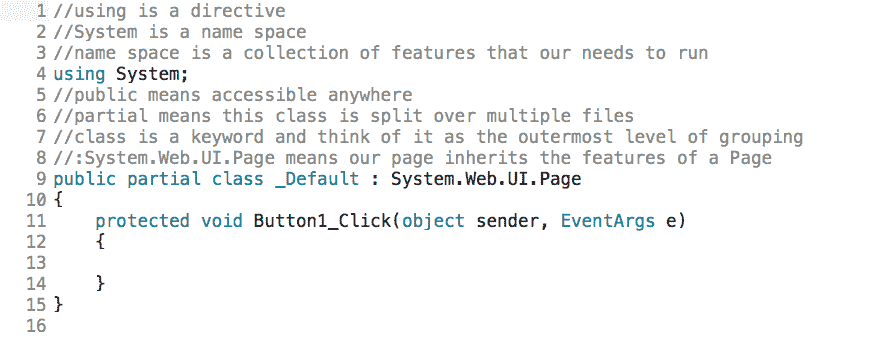

# 执行聚合功能的查询

在本章中，我们将进一步探讨 LINQ。 具体来说，我们将看到 LINQ 在执行诸如平均、求和、计数等聚合函数方面的强大功能。 我们还会讲到列表中的列表，这是一个非常实用的东西。

# 向 HTML 中添加一个显示按钮

打开项目，为了简单起见，我们要做的就是在以`<form id=....`开头的行下面添加一个按钮。 为此，转到“工具箱”，抓取一个`Button`控件，并将其拖动到其中。 将按钮上的文字改为`Show`。

现在，切换到 Design 视图并双击 Show 按钮。 这把我们带入了`Default.aspx.cs`。 删除`Page_Load`块。 我们不需要那个。 这个项目的启动代码的相关部分应该类似于图 12.7.1:



Figure 12.7.1: The starting code section for this project

在下一阶段，转到文件的顶部，在`using System`下，输入以下内容:

```cs
using System.Collections.Generic;
using System.Linq;
```

# 创建一个数组

在本章中有很多代码需要输入，但它是机械的。 首先，我们将创建一个数组，因此在以`protected void Button1_Click...`开头的行下面的花括号中输入以下内容:

```cs
IEnumerable<int> scores = new int[] { 45, 98, 99, 78, 89, 87, 77, 67, 71, 81 };
```

这里，`IEnumerable`是数据类型，`scores`是数组名称。 不管你往数组里放什么值。

# 对列表中的值求平均值

现在，首先我们要找到这个列表的平均值。 因此，输入以下内容:

```cs
var goodStudentAverage = (from score in scores where score >= 90 select score).Average();
```

我们将选择成绩在`90`及以上的学生。 想象一下，这是几个学生的学期成绩。 因此，在前面一行中，我们说的是分数在哪里`>=90`，选择那个分数。 这是一个可以在一行中编写的查询。 在本例中，`score`是范围变量，`scores`是数组，选择的条件是`where score=>90`。 然后输入`.`(点)`Average()`来平均。 换句话说，这样写的方法是运行圆括号之间的查询，然后对数组中的值列表进行平均。 如果将鼠标悬停在这一行中的`var`上，您将看到它显示`double`，因为，正如您所看到的，如果将鼠标悬停在`Average`上，它也会返回一个 double。 因此，这个`Average()`函数作用于`IEnumerable`类型的列表，但是它返回一个`double`数据类型给我们。

# 显示结果

当然，现在可以显示结果了，因为记住它只是一个数值，一个聚合量。 你现在可以在这一行下面说:

```cs
sampLabel.Text = $"<br>The average for great students is {goodStudentAverage}";
```

# 使用 Count 函数

现在，如果你愿意，你也可以，例如，使用`Count`函数，所以你可以像下面这样说:

```cs
var averageStudentCount = scores.Where(grade =>70 <= grade && grade <80).Count();
```

在前面以`var`开头的行中，我们在一行中使用了查询语法，或者内联查询语法，因为我们使用了`from`和`where`。 现在，我们可以使用方法链接和其中的 Lambda 表达式来表达相同的内容。 所以，这里我们说`scores.Where`，然后我们说`grade`是这样的`70 <=grade`，但是`grade <80`。 因此，我们定义了得分在`70`到`80`之间的学生，不包括`80`的学生，我们将他们归为普通学生。 然后我们会`Count`那些。 这将告诉我们有多少人在那里然后我们可以显示这个数字。 例如，您可以输入以下内容:

```cs
sampLabel.Text += $"<br>There are {averageStudentCount} average students.";
```

记住，`averageStudentCount`产生一个数字，因此，例如，结果可以是*有 25 个普通学生*。

# 处理一系列的列表

现在，这个概念的一个非常现实的应用可能是有一个列表的列表。 接着输入以下内容:

```cs
List<int> firstStudent = new List<int> { 90, 89, 92 };
```

假设你有一个学生`firstStudent`。 然后，他或她有一些等级分数，所以您创建整数的`new List`，然后用一组花括号中的一些值初始化这个列表。 因此，输入一些如下所示的值。 (注意，我输入的值在`90`+/-范围内。) 这就是我们以前从未见过的初始化列表的方法。

现在，让我们再为另一个学生做一个整数列表。 为此，为`secondStudent`输入以下内容，并写入整数`new List`。 同样，使用另一组值初始化这个列表。 (注意，在这一行中，我将输入的值在`80`+/-范围内。) 现在，当你有一整个班级，你会有一个这样的列表，对吗? 这是可行的，因为你有多个学生到一个班:

```cs
List<int> secondStudent = new List<int> { 78, 81, 79};
```

现在可以创建构造函数了。 接下来输入以下内容:

```cs
List<List<int>> classList = new List<List<int>>();
```

# 将学生添加到 classList 中

这里，我们有一个整型列表的列表—您可以将列表嵌入到其他列表中。 然后，我们会说，例如，`classList`列表，它等于一个列表的新列表。 要初始化这个列表，可以使用`Add`。 对于下一行，输入以下内容:

```cs
classList.Add(firstStudent);
classList.Add(secondStudent);
```

这就是将第一个学生、第二个学生等等添加到类列表的方法。

# 汇总 classList 中的信息

在下一个阶段，你希望能够得到一些有用的信息。 例如，假设你有一个列表的列表，你想要总结。 因此，输入以下内容:

```cs
var avgPerStudent = classList.Select(student => student.Average());
```

现在以`avgPerStudent`为例，它代表学生的平均成绩。 现在，在您键入`classList.Select()`之后，要选择的数量是代表每个学生的列表，该列表由`(student => student.Average())`捕获。 现在，确保您理解了`student`参数是什么。 在这里，你选择一个学生并计算出他们的平均分。 将鼠标悬停在`student`上，可以看到，数量表示与第一个学生对应的整数列表。 然后，`student.Average`是平均值，然后对下一个学生重复这个过程。 如果将鼠标悬停在`var`上，您将看到在本例中返回的是`IEnumerable`类型。 您可以迭代这些值。 为此，你需要输入以下命令:

```cs
foreach(var studentAvg in avgPerStudent)
```

现在，在这一行下面，在一组花括号中输入以下内容来显示结果:

```cs
sampLabel.Text += $"<br>Average grade={studentAvg}";
```

# 运行程序

现在，构建这个程序并在浏览器中运行它。 点击 Show 按钮:


Figure 12.7.2: The results from running our program

这些是一些看起来很专业的结果。 优秀学生的平均成绩是 98.5 分。 有三个一般的学生。 这两张表的平均分数在最后显示出来。

因此，您了解了 linq -`Average`函数和`Count`函数可以做什么，还了解了可以制作列表的列表。 您可以使用诸如`Select`之类的语句对这些列表进行操作，然后您可以嵌入 Lambda 表达式来分别对列表列表中的每个列表进行操作。

# 章回顾

为了便于审阅，本章的`Default.aspx.cs`文件的完整版本，包括注释，如下代码块所示:

```cs
//using is a directive
//System is a name space
//name space is a collection of features that our needs to run
using System;
using System.Collections.Generic;
using System.Linq;
//public means accessible anywhere
//partial means this class is split over multiple files
//class is a keyword and think of it as the outermost level of grouping
//:System.Web.UI.Page means our page inherits the features of a Page
public partial class _Default : System.Web.UI.Page
{
    protected void Button1_Click(object sender, EventArgs e)
    {
        IEnumerable<int> scores = 
        new int[] { 45, 98, 99, 78, 89, 87, 77, 67, 71, 81 }; 
        //array of integers
        //line 17 below selects all scores 90 or above, and averages them,
        //giving back a double value
        var goodStudentAverage = (from score in scores where score >= 90 select score).Average();
        //line 19 below displays the average
        sampLabel.Text = $"<br>The average for great students is {goodStudentAverage}";
        //line 21 below selects all students below 70 and 80,
        //and counts them
        var averageStudentCount = scores.Where(grade => 70 <= grade && grade < 80).Count();
        //line 23 below displays the student count
        sampLabel.Text += $"<br>There are {averageStudentCount} average students.";
        //lines 25 and 26 create two new lists with initializer lists
        List<int> firstStudent = new List<int> {90,89,92};
        List<int> secondStudent = new List<int> { 78, 81, 79 };
        //line 28 creates a list of lists
        List<List<int>> classList = new List<List<int>>();
        classList.Add(firstStudent);
        classList.Add(secondStudent);
        //line 32 below find the average for each list, and 
        //stores the averages
        //so avgPerStudent is of type IEnumerable
        var avgPerStudent = classList.Select(student => student.Average());
        //lines 35-38 display the averages
        foreach(var studentAvg in avgPerStudent)
        {
            sampLabel.Text += $"<br>Average grade={studentAvg}";
        }
    }
}
```

# 总结

在本章中，我们进一步探讨了 LINQ。 具体地说，我们研究了 LINQ 执行聚合函数的能力，比如平均、求和和计数。 我们还讨论了列表中的列表。 对列表中的值取平均，使用`Count`函数，处理列表的列表，将学生添加到`classList`中，并在`classList`中总结信息。

在下一章中，您将学习元组，它基本上是几个值的集合。