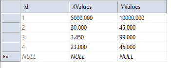
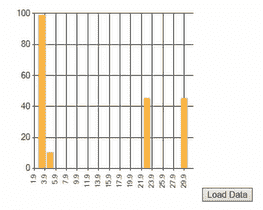

# 将图表控件连接到 SQL Server

在本章中，您将学习如何将图表拖拽到页面中，然后通过 c#作为连接页面和数据库的语言，使它们与 SQL Server 中的一些简单表一起工作。

# 在 HTML 页面中放置图表

启动一个项目，我们首先要做的是在页中放置一个图表。 去工具箱(**Ctrl + Alt*+*X【显示】),在搜索框中输入`char...`,拖拽线以下,始于`<form id=...`。**

 *正如您在屏幕上看到的，这将生成以下所有标记。 你可以让它保持原样。 这对于我们的目的来说已经足够了:

```cs
<asp:Chart ID="Chart1"runat="server">
  <Series>
    <asp:SeriesName="Series1" ChartType="Point"></asp:Series>
  </Series>
  <ChartAreas>
    <asp:ChartArea Name="ChartArea1"></asp:ChartArea>
  </ChartAreas>
</asp:Chart>
```

可以删除两个`<div...`行和`<asp:Label ID...`行。 我们不需要他们。

# 向 HTML 页面添加一个按钮

接下来，您需要在`</asp:Chart>`行下面放置一个按钮。 同样地，转到工具箱，抓取一个`Button`控件，并将其拖动到其中。 将按钮上的文本更改为 Load Data。 这里的`Load Data`表示加载并显示在图表中。

请注意，当您拖动一个图表时，页面将在`System.Web.UI.DataVisualization.Charting`顶部添加如下所示的整个块:

```cs
<%@Register Assembly="System.Web.DataVisualization, Version=4.0.0.0, Culture=neutral, PublicKeyToken=31bf3856ad364e35" Namespace="System.Web.UI.DataVisualization.Charting" TagPrefix="asp" %>
```

# 向 People 数据库添加一个新表

现在，对于下一阶段，单击菜单栏中的“查看”，并选择 SQL Server 对象资源管理器。 您必须添加一个新表，因此在`People`数据库中，右键单击 Tables 文件夹并选择 add new table ... . 您的屏幕应该看起来像图 20.5.1 所示:


Figure 20.5.1: A blank new table

接下来，在`Id`字段中键入`XValues`，然后单击 Data type 字段。 开始键入`decimal`，注意到`decimal(18,0)`会自动显示。 现在将其改为`(18,3)`。 这仅仅意味着一个字段是 18 宽，有 3 位小数点; 也就是说，它的宽度是 18，在右边 3，在左边 15，总共是 18。 这个字段应该选中 Allow null 框。 `YValues`也是一样。 假设我们做了一个实验，测量了一些量。 因此，在`Id`字段中输入`YValues`，在数据类型字段中输入`decimal(18,3)`，并为该字段选中 Allow Nulls 框。

接下来，右键单击 Id 并选择 Set Primary Key。

# 使 auto-incrementation

接下来，你想启用自动增量，所以具体来说，这意味着:

1.  首先，将表重命名为`ExperimentValues`，如下所示:

```cs
    CREATE TABLE [dbo].[ExperimentValues]
```

2.  在`PRIMARY KEY`之后，放`identity(1,1)`，如下:

```cs
    [Id] INT NOT NULL PRIMARY KEY identity(1,1),
```

这里的`identity(1,1)`，正如您前面所了解的，意味着每次添加一个新记录，该字段将从 1 开始增加 1。 所以，这就是我们的表的结构，如图 20.5.2 所示:


Figure 20.5.2: The structure of our table for this chapter

# 向新表中添加值

接下来，单击 Update 按钮。 在出现的对话框中单击 Update Database。

现在有了`ExperimentValues`。 右键单击它，选择 View Data，添加一些值，如图*所示:*



Figure 20.5.3: Values added to the ExperimentValues table

现在，我们在表格中得到了一些值。 再次注意，Id 字段是自动递增的——它从 1 开始，每次添加一条新记录时增加 1。 关闭桌子的窗户，回到`Default.aspx.cs`。

现在，双击 Design 按钮，出现一个小图表，如图*所示:*


Figure 20.5.4: Theoretical preview of the data in the ExperimentValues table

# 项目编码

这个图表还不能代表真实的数据。 这只是一个理论上的预习。 因此，双击 Load Data 按钮，将弹出`Default.aspx.cs`中的事件处理程序。 删除`Page_Load`存根。 我们将从图 20.5.5 中所示的代码开始这个项目:


Figure 20.5.5: The starting code for this project

# 添加一个名称空间

首先，您必须添加一个名称空间。 因此，转到文件的顶部，在`using System`下，输入以下内容:

```cs
using System.Data.SqlClient;
```

这一行用于连接和命令。

# 构建连接字符串

在下一阶段，您需要连接字符串。 因此，在下一行中，首先输入`string connString =`，然后输入`@`符号，使其成为一个逐字字符串，然后输入`""`符号。 现在，要获取连接字符串，执行以下操作:

1.  单击菜单栏中的“查看”，然后选择“SQL Server 对象资源管理器”。
2.  右键单击 People 数据库，并选择 Properties。
3.  在“属性”窗格中，双击“连接字符串”以选择具有长描述的连接字符串。
4.  然后，右键单击长描述并复制它。
5.  将描述粘贴到一组`""`符号之间。

连接字符串行应该如下所示:

```cs
string connString = @"Data Source=(localdb)\MSSQLLocalDB;Initial Catalog=People;Integrated Security=True;Connect Timeout=30;Encrypt=False;TrustServerCertificate=True;ApplicationIntent=ReadWrite;MultiSubnetFailover=False";
```

这是特定于您的计算机的连接字符串。 现在可以关闭 SQL Server 对象资源管理器和属性窗格。

现在，在这一行下面输入以下内容:

```cs
using (SqlConnection conn = new SqlConnection(connString)) 
```

# 编写 SQL 查询

接下来，您将创建`commandText`变量。 因此，在一组花括号之间，输入以下内容:

```cs
string commandText = "select XValues, YValues from dbo.ExperimentValues";
```

要定义文本，必须编写实际的 SQL 查询，因此键入`select XValues, YValues from dbo.ExperimentValues`。 这将从`ExperimentValues`表中的两个列名中选择`XValues`和`YValues`。

# 创建命令对象

现在，您需要创建命令对象，因此输入下面的命令:

```cs
SqlCommand command = new SqlCommand(commandText, conn);
```

这里传入两个相关的量，即两个参数，具体来说就是`(commandText, conn)`。

# 打开连接并创建一个 SQL 数据读取器

在下一阶段，你将打开一个连接，所以在前面一行的下面输入以下内容:

```cs
conn.Open();
```

然后你将做一个 SQL 数据阅读器，所以输入下面的:

```cs
SqlDataReader reader = command.ExecuteReader(); 
```

这一行将得到我们需要的数据。

现在你已经完成了所有这些，在前一行的下面输入以下内容:

```cs
Chart1.DataBindTable(reader, "XValues");
```

注意，我们包含了列的名称`XValues`，它用作*x*-轴的标记。 所以，*x*轴是横轴。

# 运行程序

这是应用程序的核心。 在浏览器中打开它，然后单击 Load Data 按钮。



Figure 20.5.6: Display of The actual data from the ExperimentValues table

数据如图*图 20.5.6*所示。 它的值沿着水平轴和垂直轴。

# 修改程序以显示 Y 值

如果您愿意，只是为了展示这是多么容易，您可以将下面一行更改为 Y 值。 换句话说，你可以把它们翻转过来:

```cs
Chart1.DataBindTable(reader, "YValues");
```

现在，在浏览器中打开它，再次单击 Load Data 按钮。 结果见图 20.5.7:


Figure 20.5.7: Chart of the Values from the ExperimentValues table

现在你可以看到它看起来很不一样。 这就是制作简单图表的方法。 现在保存。 这是整个应用程序。

# 章回顾

让我们回顾一下所做的工作:您构建了连接字符串，并在`using (SqlConnection conn...`行中完成了连接的创建，以便正确地处理连接。 然后，编写查询字符串，创建命令对象，打开连接，并执行读取器。 最后，您使用`DataBind`将数据库表绑定到图表，以便可以显示结果。

本章的完整版本`Default.aspx.cs`文件，包括注释，如下代码块所示:

```cs
//using is a directive
//System is a name space
//name space is a collection of features that our needs to run
using System;
using System.Data.SqlClient;
//public means accessible anywhere
//partial means this class is split over multiple files
//class is a keyword and think of it as the outermost level of grouping
//:System.Web.UI.Page means our page inherits the features of a Page
public partial class _Default : System.Web.UI.Page
{
    protected void Button1_Click(object sender, EventArgs e)
    {
        //make connection string
        string connString = @"Data Source=DESKTOP-4L6NSGO\SQLEXPRESS;Initial Catalog=People;Integrated Security=True;Connect Timeout=15;Encrypt=False;TrustServerCertificate=False;ApplicationIntent=ReadWrite;MultiSubnetFailover=False";
        //enclose connection making inside a using so connection is
        //properly disposed of
        using (SqlConnection conn = new SqlConnection(connString))
        {
            //make command text
            string commandText = "select XValues, YValues from dbo.ExperimentValues";
            //make command object
            SqlCommand command = new SqlCommand(commandText, conn);
            //open connection
            conn.Open();
            //execute reader to read values from table
            SqlDataReader reader = command.ExecuteReader();
            //bind chart to table do display the results
            Chart1.DataBindTable(reader, "XValues");
        }
    }
}
```

# 总结

在本章中，您学习了如何将图表拖拽到页面中，然后通过 c#作为连接页面和数据库的语言，使它们与 SQL Server 中的一些简单表一起工作。 你放置一个图表到 HTML 页面,添加一个新表到`People`数据库,使 auto-incrementation 值添加到新表中,添加了一个名称空间,建立了一个连接字符串,写了一个 SQL 查询,打开了连接和 SQL 数据阅读器,跑项目,最后修改它来显示 Y 值。

在下一章中，您将学习如何将 LINQ 与 SQL 和 SQL Server 结合使用。*