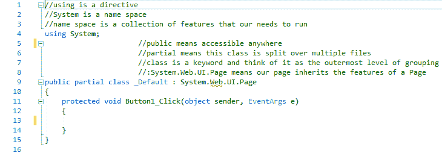

# 二十七、创建和使用 XML 文件

在本章中，我们将看看 XML(可扩展标记语言的缩写)的基础知识。 基本上，它是一种在互联网上构建信息的方式。 XML 的一个有用之处在于它是可扩展的，这意味着您可以创建自己的标记。

# 向 HTML 添加一个按钮

启动一个项目。 唯一要放在中的是单个`Button`控件。 为此，转到“工具箱”，在搜索字段中键入`but`，然后将`Button`控件拖放到以`<form id=...`开头的行下面。 将按钮上的文字改为`Read XML`。

# 编码的 XML

现在您需要一个可以读取的文件。 为此，转到解决方案资源管理器并右键单击网站的名称。 转到下拉菜单中的 Add，然后选择 Add New Item.... 在搜索字段中键入`xml`，并确保您选择的 XML 文件显示 Visual C#。 `XMLFile.xml`的起始屏幕应该类似于*图 27.1.1*所示:


Figure 27.1.1: The starting screen for XMLFile.xml

现在，让我们逐行检查代码的创建过程，以便您能够了解到底发生了什么。 基本上，就像在 HTML 中一样，XML 中也有元素、元素嵌套和属性。

首先，假设您有一家书店。 在 XML 中，您可以创建自己的标记。 所以接下来输入以下内容:

```cs
<bookstore>
```

注意，它会自动创建开始和结束标记:`<bookstore>``</bookstore>`。 在这些标签之间插入一些空行。

当然，书店里有书，所以在第一个`<bookstore>`标签下面输入下面的内容:

```cs
<book type="eBook">
```

一本书可能是一本传统的教科书，也可能是一本电子书。 因此，我们将指定一个 type 属性，并将其设置为我们第一本书的`eBook`。

现在让我们讨论存储在`<book type="eBook">`下的一些元素。 很明显，一个重要的项目是书名，所以输入以下内容:

```cs
<booktitle>The Great Way</booktitle>
```

我们将这本书命名为`The Great Way`。

在下一阶段，你自然会输入作者，所以输入以下内容:

```cs
<author>Bob Jones</author>
```

所以，我们的书是由`Bob Jones`写的。

最后一项当然是价格，在本例中我们将其设为`$10.00`，因此输入以下内容:

```cs
<price>10.00</price>
```

该信息提供了第一个 book 元素，如您所见，它由称为`<booktitle>`、`<author>`和`<price>`的子元素组成。

现在让我们再做一本书，只是为了多样化，如下:

```cs
<book type="traditional">
    <booktitle>Happy People</booktitle>
    <author>Mary Jenkins</author>
    <price>11.00</price>
</book>
```

我们的简单 XML 文件如下代码块所示:

```cs
<?xml version="1.0" encoding="utf-8" ?>
<bookstore>
    <book type="eBook">
        <booktitle>The Great Way</booktitle>
        <author>Bob Jones</author>
        <price>10.00</price>
    </book>
    <book type="traditional">
        <booktitle>Happy People</booktitle>
        <author>Mary Jenkins</author>
        <price>11.00</price>
    </book>
</bookstore>
```

同样，请记住，XML 是*可扩展的*，因为您可以创建自己的标记，*标记*，因为它具有类似于 HTML 的结构，当然，它是一种*语言*。

现在，右键单击选项卡上的`XMLFile.xml`，并从下拉菜单中选择 Copy Full Path。 我们将很快使用这条路径。 (如果您将鼠标悬停在`XMLFile.xml`选项卡上，您可以看到完整路径，但是，它很长，很难记住，所以最好右键单击并选择 Copy the full path。)

现在单击 HTML 内的`Default.aspx`选项卡，切换到 Design 视图，然后双击 Read XML 按钮。 这会出现`Default.aspx.cs`内部的事件处理代码。 删除`Page_Load`存根。 此项目的相关启动代码部分应该类似于图 27.1.2 中所示:



Figure 27.1.2: The starting code for this project

# 添加一个名称空间

让我们从添加名称空间开始。 你需要一个新的，所以在文件顶部的`using System`后面输入以下内容:

```cs
using System.Xml.Linq;
```

您将在编写代码时使用这个名称空间。 (您可以折叠包含`public partial class...`的行之上的所有代码。)

# 将 XML 文件加载到程序中

在下一阶段，在以`protected void Button1_Click...`开头的行下面的一组花括号中输入以下内容:

```cs
XElement fromFile = XElement.Load(@"C:\Users\towsi\Documents\Visual Studio 2015\WebSites\CSharpTemplateUpdated76143\XMLFile.xml");
```

您想加载`XElement fromFile`，那么您可以说`XElement.Load()`。 然后，在括号内放入`@`符号，使其成为一个逐字字符串，后跟双引号。 现在需要利用从`XMLFile.xml`复制的路径，以便可以从那里的文件加载 XML。 因此，在一组`""`符号之间粘贴路径。 这将允许您加载可扩展标记文件。 现在将鼠标悬停在`XElement`上。 它说，类 system。xml。linq。 表示一个 XML 元素。

# 遍历 XML 文件的内容

现在，输入以下内容:

```cs
foreach(XElement childElement in fromFile.Elements())
```

如果将鼠标悬停在这一行末尾的`Elements`上，可以看到它是一个函数，它返回 IEnumerable，因此可以查看它的内容，其中的每个成员都是一个元素。

# 显示结果

现在你可以显示它们了，所以在一组花括号之间输入以下内容:

首先，你需要书的类型。 要得到它，在键入`sampLabel.Text += $"<br>Book Type:`后，您说`{childElement.Attribute("type")`，要得到值，您键入`.Value}";`:

```cs
sampLabel.Text += $"<br>Book Type:{childElement.Attribute("type").Value}";
```

现在，要得到作者你使用`{childElement.Element("author")}";`，如下:

```cs
sampLabel.Text += $"<br>{childElement.Element("author")}";
```

这就是把所有元素都取出来的方法。 在这个阶段，您可以复制粘贴这一行，因为它与书名和书价基本相同。

书名:`{childElement.Element("booktitle")}";`，如下:

```cs
sampLabel.Text += $"<br>{childElement.Element("booktitle")}";
```

对于价格，您说:`{childElement.Element("price")}";`，如下:

```cs
sampLabel.Text += $"<br>{childElement.Element("price")}";
```

最后，你可以使用`"<br><hr/>";`，如下所示:

```cs
sampLabel.Text += $"<br><hr/>";
```

# 运行程序

现在让我们在这里尝试一下，在浏览器中打开它。 请记住，您实际上是在将 XML 读入一个网页。 这是我们的目标。 单击 Read XML 按钮。 结果如图 27*。1.3*:


Figure 27.1.3: The results of running our program

正如您所期望的那样，信息完全按照您输入的方式报告。 请记住，出现水平线是因为您在 HTML 页面中键入了`"<br><hr/>"`，它添加了一个断点和一条水平线规则或线。

这就是如何结合从 XML 文件中读取数据的方法，XML 文件基本上是一个元素集合，就像这个项目中的元素一样，多次嵌套。 你可以把它和 C# 结合起来，你可以产生结果。

# 章回顾

本章的完整版本`Default.aspx.cs`文件，包括注释，如下代码块所示:

```cs
//using is a directive
//System is a name space
//name space is a collection of features that our needs to run
using System;
using System.Xml.Linq;//needed for XElement
//public means accessible anywhere
//partial means this class is split over multiple files
//class is a keyword and think of it as the outermost level of grouping
//:System.Web.UI.Page means our page inherits the features of a Page
public partial class _Default : System.Web.UI.Page
{
    protected void Button1_Click(object sender, EventArgs e)
    {
        //load XML file into "fromFile" variable
        XElement fromFile = XElement.Load(@"C:\Users\towsi\Documents\Visual Studio 2015\WebSites\CSharpTemplateUpdated76143\XMLFile.xml" );

        foreach(XElement childElement in fromFile.Elements())
        {
            //display value
            sampLabel.Text += $"<br>Book Type:{childElement.Attribute("type").Value}";
            //display author
            sampLabel.Text += $"<br>{childElement.Element("author")}";
            //display book title
            sampLabel.Text += $"<br>{childElement.Element("booktitle")}";
            //display price
            sampLabel.Text += $"<br>{childElement.Element("price")}";
            //adds horizontal rule across the page
            sampLabel.Text += $"<br><hr/>";
        }
    }
}
```

# 总结

在本章中，您学习了 XML 的基础知识。 您编写了 XML 代码，将生成的 XML 文件加载到程序中，遍历 XML 文件的内容，并编写代码来显示结果。

在下一章中，您将学习如何将 XML 写入文件，然后在记事本和 Internet Explorer 中查看结果。 所以，你会遇到很多有用的小事情。