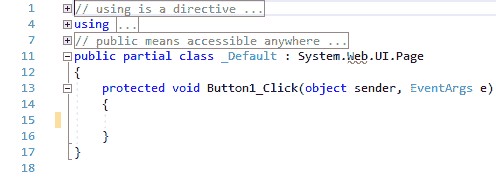
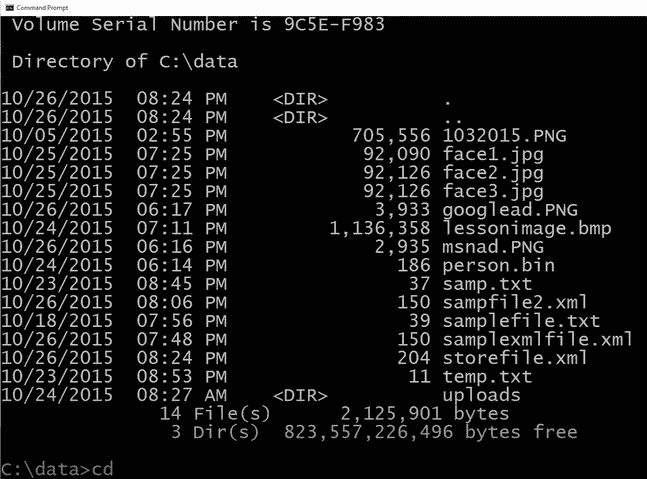
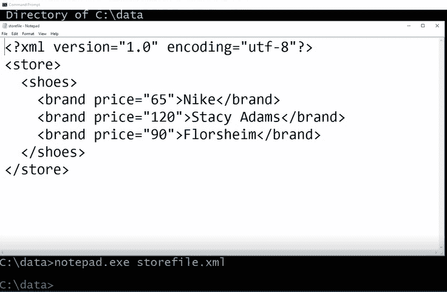

# 用 LINQ 查询 XML 文档

在本章中，您将学习如何结合 LINQ 和 XML 来实现更实用的功能。

# 添加一个文本框和一个按钮到 HTML

启动一个项目，在内部，您需要做的第一件事是添加一个`TextBox`控件。 为此，转到视图|工具箱，在搜索字段中键入`tex`，然后将`TextBox`拖放到以`<form id=...`开头的行下面。 在该行的开头键入`Enter Value:`，这样它看起来像以下所示:

```cs
Enter Value:<asp:TextBoxID="TextBox1" runat="server"></asp:TextBox>
```

你会有一个盒子; 在框中输入一个值，然后您将得到一个结果。 您将扫描 XML 文档以选择高于某个值(例如$50 或$60)的项。 这是我们的目标; 换句话说，制作一个可搜索的页面。

接下来，将一个按钮插入到中。 因此，再次转到工具箱，在搜索字段中键入`but`，并将`Button`控件拖放到前一行下面。 将`Button`控件上的文本修改为简单的`Search`，如下所示:

```cs
<asp:ButtonID="Button1" runat="server" Text="Search" />
```

接下来，转到 Design 视图。 如图 29.3.1 所示:


Figure 29.3.1: The interface of this project in Design view

双击 Search 按钮。 这将打开`Default.aspx.cs`文件。 删除`Page_Load`存根。 折叠上面和下面的所有评论`using System;`-你不需要它们。 此项目的启动代码的相关部分应该如图 29.3.2 所示:



Figure 29.3.2: The starting code for this project

这里有一些有趣的代码—非常实用。 请记住，无论何时你学习一门编程语言，一个简单的事实是，你在现实生活中所做的事情比你在这样的书中看到的任何事情都更具挑战性。

# 添加名称空间

现在让我们添加一些名称空间。 在文件顶部附近的`using System`下输入以下内容:

```cs
using System.Xml.Linq;
using System.Linq;
```

因此，我们在 XML 和 linq 之间建立了一座桥梁，这就是我们的目标。

# 清算的输出

首先，您需要每次清除标签，以便输出不会累积在标签上。 因此，在以`protected void Button1_Click...`开头的行下面的一组花括号之间输入以下内容:

```cs
sampLabel.Text = "";
```

# 构建元素树

接下来，我们将使用以下语法创建一个元素树:

```cs
XElement store = new XElement("store",
```

在这一行中，`store`是树的名称。 基本上，它保存有关产品的信息。 记住，如果你想知道某个东西来自哪里，只需将鼠标悬停在它上面。 因此，如果将鼠标悬停在这一行开头的`XElement`上，工具提示表明它不是来自 XML 名称空间。 相反，它来自 Xml。 Linq 命名空间。

接下来，您将在`store`中放入其他元素。 所以，在带分号的右括号之前插入几个空行，现在你就可以把东西堆在里面了。

Be sure to put the comma in after `store` in the preceding line. When you type the comma, take a look at the tooltip. Do you see where it says params object[] content? This means that there are a variable number of arguments there which you can specify to build up the tree. Remember, params means that you can specify a variable number of arguments.

首先，我们在商店中有一个名为`shoes`的新元素。 所以，缩进下面的行:

```cs
new XElement("shoes",
```

接下来，进一步缩进下面的行:

```cs
new XElement("brand", "Nike", new XAttribute("price", "65")),
```

这里，你说`new XAttribute`，只是为了告诉你这是可能的。 属性为`price`，值为，例如`$65`。 关闭该属性并使用逗号关闭元素。

既然你要重复这个，复制这一行并粘贴到下面，将品牌名称改为`Stacy Adams`，价格改为`$120`，如下所示:

```cs
new XElement("brand", "Stacy Adams", new XAttribute("price", "120")),
```

让我们再重复一遍。 所以，再次复制这一行并粘贴到下面，将品牌名称改为`Florsheim`，价格改为`$90`，如下所示:

```cs
new XElement("brand", "Florsheim", new XAttribute("price", "90"))));
```

Note that at the end of the last line here, you close with four parentheses and a semicolon. You must be extremely careful about this. You must make sure that everything is matching. So, you have a Store, and then you have a Shoes department, and within the Shoes department you carry different Brands: Nike, Stacy Adams, and Florsheim.

# 保存存储 XML 文件

现在，最好能够将其写到一个文件中，以确认结构是按照它应该的样子解释的。 因此，接下来输入以下内容，将缩进与前面的`XElement store...`行对齐:

```cs
store.Save(@"c:\data\storefile.xml");
```

这里，`store.Save()`是一个可以直接调用的很好的函数。 将其保存到一个文件中，在本例中为:`(@"c:\data \storefile.xml");`。

# 测试程序

在进行其他操作之前，让我们确认这将按预期工作，并生成一个好看的 XML 文件。 因此，在浏览器中打开它，并单击 Search 按钮，如图*所示:*


Figure 29.3.3: The interface displayed when testing the program at present

当然，现在什么也没有显示出来，因为您还没有对该部分进行编码。 但是，如果您执行`c:\data`的目录列表，则会有已保存的文件`storefile.xml`，如图 29.3.4:所示。



Figure 29.3.4: The file storefile.xml is saved in the c:\data directory

如果您在记事本中键入`notepad.exe``storefile.xml`在`c:\data>`提示符下打开该文件，您将看到*所示的结果，如图 29.3.5*所示:



Figure 29.3.5: The file storefile.xml opened in Notepad

这个看起来很好。 你有`store`元素,然后在`store``shoes`元素,并在品牌`Nike``shoes`,`Stacy Adams`,`Florsheim`,及每个鞋携带一个价格:65 美元,120 美元和 90 美元,分别。 因此，它看起来是一个很好的文件，对于我们的目的来说已经足够了。 (相信我，在现实生活中，这些事情要复杂得多。)

# 搜索满足特定条件的项目

接下来，在以`store.Save...`开头的行下面输入以下内容，搜索鞋子:

```cs
var shoeSearch = from shoes in store.Descendants("shoes").Descendants("brand")
```

这里，`var shoeSearch`是 LINQ 和 XML 的结合。

接下来，键入`where (decimal)`，它用于转换为十进制值，并且价格大于用户输入的值:

```cs
where (decimal)shoes.Attribute("price") >decimal.Parse(TextBox1.Text)
```

# 在满足搜索条件的项目中进行选择

一旦找到鞋子，你可以从中选择，如下所示:

```cs
select shoes;
```

如果将鼠标悬停在前一行中第一次使用`Descendants`的地方，它会告诉您它返回 IEnumerable。 工具提示说它按文档顺序返回这个文档或元素的经过筛选的后代元素集合。

此外，如果您将鼠标悬停在第二次使用`Descendants`的地方，您将看到它与品牌有关。 当您到达该级别时，例如，您可以将鼠标悬停在以`where...`开头的前一行中的`price`属性上，然后将该属性与用户指定的值进行比较。 这就好像你在从外部到内部遍历它直到你找到 price 属性，然后，在那个阶段，你将那个值与用户输入的值进行比较。

# 显示结果

输入下一行，显示搜索中选择的所有鞋类品牌和价格:

```cs
foreach(XElement shoeBrand in shoeSearch)
```

最后，在前一行下面的一组花括号之间输入以下内容:

```cs
sampLabel.Text += $"<br>Brand:{shoeBrand}<br>Price:{(decimal)shoeBrand.Attribute("price"):C}";
```

在这一行中，可能有多个值，所以要追加。 注意，我们放置了`<br>`标记将每个结果下推到下一行。 要显示价格，您输入`(decimal)`将其转换为十进制值，然后在`shoeBrand.Attribute("price")`之后，使用`:C`将其转换为货币格式。 这就是所有的代码。 把这些都输入进去是很重要的。 最好的学习方法是实践，而不是简单地打开一个预先准备好的文件并运行它。

# 运行程序

现在最后一次打开浏览器，输入一个值，比如`45`，然后单击 Search 按钮。 它应该退回所有的鞋子，对吧，因为价格都比这个高，如图*图 29.3.6*:


Figure 29.3.6: All of the shoes and prices are displayed, as the value entered is less than the price of any of the shoes

现在输入`100`作为值，并再次单击 Search 按钮。 在本例中，它只返回 Stacy Adams 鞋子，其定价为$120，如图*所示:*


Figure 29.3.7: Only the Stacy Adams shoe is returned, as it is priced above $100

再做一个。 输入`85`，再次单击搜索按钮。 如图*图 29.3.8*所示，它返回 Stacy Adams 和 Florsheim 鞋，因为这两款鞋的价格都在 85 美元或以上:


Figure 29.3.8: the Stacy Adams and Florsheim shoes are returned, as both are priced at $85 or more

那就这样吧。 这和预期的一样。 我们还使用您为使这个程序正确工作而编写的整个`XElement`结构生成了一个漂亮的 XML 文件。

# 章回顾

本章的完整版本`Default.aspx.cs`文件，包括注释，如下代码块所示:

```cs
//using is a directive
//System is a name space
//name space is a collection of features that our needs to run
using System;
using System.Xml.Linq;
using System.Linq;
//public means accessible anywhere
//partial means this class is split over multiple files
//class is a keyword and think of it as the outermost level of grouping
//:System.Web.UI.Page means our page inherits the features of a Page
public partial class _Default : System.Web.UI.Page
{
    protected void Button1_Click(object sender, EventArgs e)
    {
        //clear label on every button click so stuff does not accumulate
        sampLabel.Text = "";
        //create a nice XML tree structure for searching: store is the 
        //root, inside that is shoes,
        //and then under shoes are three different brands
        XElement store = new XElement("store",
                            new XElement("shoes",
                            new XElement("brand","Nike", 
                            new XAttribute("price","65")),
                            new XElement("brand", "Stacy Adams", 
                            new XAttribute("price","120")),
                            new XElement("brand", "Florsheim", 
                            new XAttribute("price","90"))));
        //save file to drive to confirm it looks like healthy XML
        store.Save(@"c:\data\storefile.xml");
        //search down to the level of the price attribute, and compare that
        //value against the value entered in the search box by the user
        var shoeSearch = from shoes in store.Descendants("shoes").Descendants("brand")
        where (decimal)shoes.Attribute("price") > decimal.Parse(TextBox1.Text)select shoes;
        //display all the shoe brands, and the prices
        foreach(XElement shoeBrand in shoeSearch)
        {
            sampLabel.Text += $"<br>Brand:{shoeBrand}<br>Price:{(decimal)shoeBrand.Attribute("price"):C}";
        }
    }
} 
```

# 总结

在本章中，您学习了如何结合 LINQ 和 XML 来实现更实用的内容。 您构建了一个元素树，并编写了代码来保存存储 XML 文件，搜索满足特定条件的项，并在满足搜索条件的项中进行选择。