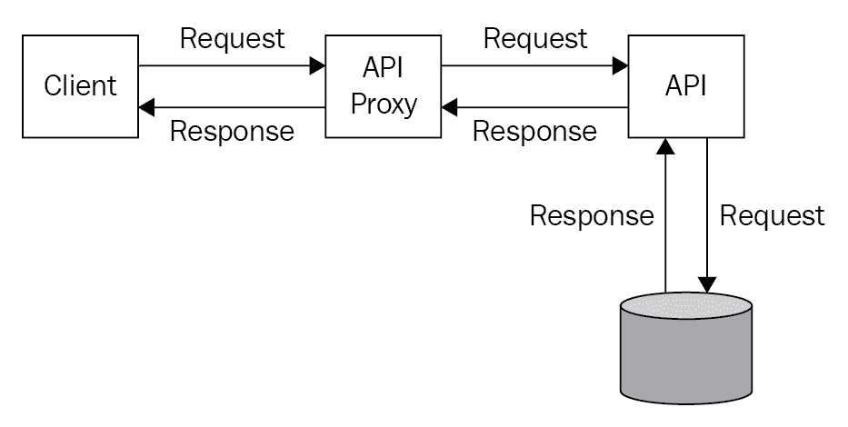
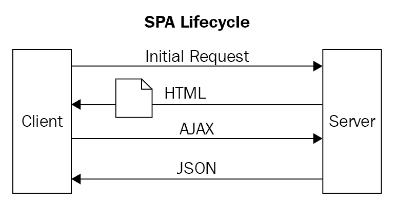
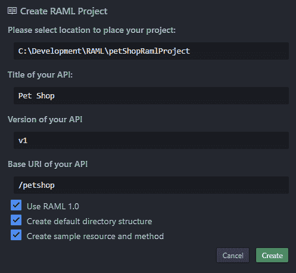
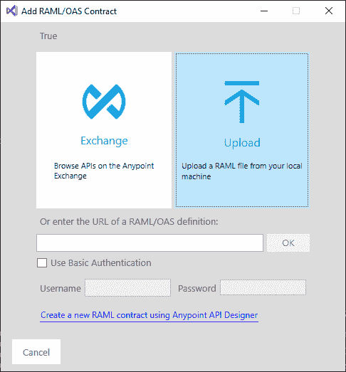
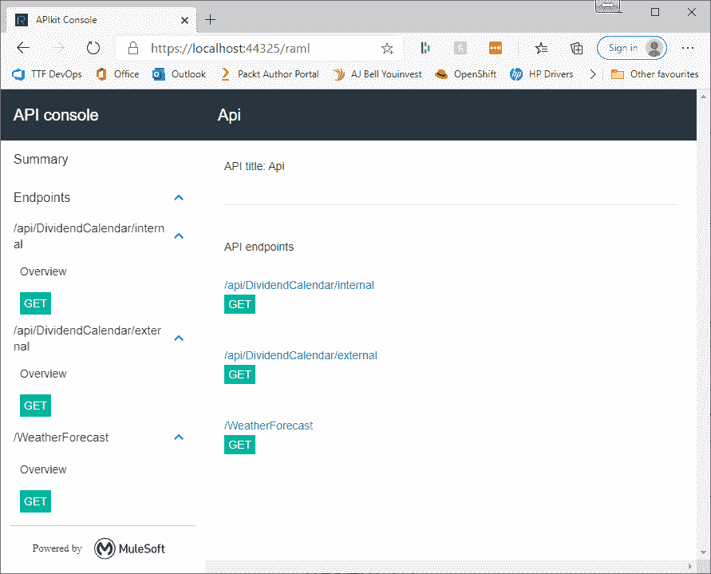

# 九、设计和开发 API

**应用程序编程接口**（**API**）从未像现在这样在许多方面如此重要。API 用于连接政府和机构共享数据，并以协作方式处理商业和政府问题。它们用于医生的手术室和医院之间实时共享患者数据。当您通过 Microsoft 团队、Microsoft Azure、Amazon Web Services 和 Google 云平台等平台连接到电子邮件并与同事和客户协作时，您每天都会使用 API。

每次您使用计算机或电话与某人聊天或进行视频通话时，您都在使用 API。流式传输视频会议、进入网站技术支持聊天室或流式传输您喜爱的音乐和视频时，您使用的是 API。因此，作为一名程序员，您必须精通什么是 API 以及如何设计、开发、保护和部署 API。

在本章中，我们将讨论什么是 API，它们如何使您受益，以及为什么有必要了解它们。我们还将讨论 API 代理、设计和开发指南、如何使用 RAML 设计 API 以及如何使用 Swagger 记录 API。

本章涵盖以下主题：

*   什么是 API？
*   API 代理
*   API 设计指南
*   基于 RAML 的 API 设计
*   大摇大摆的 API 开发

本章将帮助您获得以下技能：

*   了解 API 以及为什么需要了解它们
*   了解 API 代理以及我们使用它们的原因
*   在设计自己的 API 时注意设计准则
*   使用 RAML 设计自己的 api
*   使用 Swagger 记录您的 API

在本章结束时，您将了解良好 API 设计的基础知识，并掌握推进 API 能力所需的知识。理解什么是 API 是很重要的，因此我们将从这一章开始。但首先，确保您实现了以下技术要求，以充分利用本章。

# 技术要求

在本章中，我们将使用以下技术创建 API：

*   Visual Studio 2019 社区版或更高版本
*   Swashback.AspNetCore 5 或更高版本
*   昂首阔步（[https://swagger.io](https://swagger.io) ）
*   原子（[http://atom.io](http://atom.io) ）
*   MuleSoft 的 API 工作台

# 什么是 API？

**API**是可重用的库，可以在不同的应用程序之间共享，并且可以通过 REST 服务提供（在这种情况下，它们被称为**RESTful API**。

**Representational State Transfer** (**REST**) was introduced by Roy Fielding in 2000.

REST 是一种由*约束*构成的架构样式。在编写 REST 服务时，总共应该考虑六个约束。这些限制条件如下：

*   **统一接口**：用于标识资源，通过*表示*对这些资源进行操作。消息使用超媒体并具有自描述性。**超媒体作为应用状态**（**HATEOAS**的引擎，用于包含客户端下一步可以执行哪些操作的信息。
*   **客户机服务器**：该约束通过*封装*实现信息隐藏。因此，只有客户端使用的 API 调用才可见，而所有其他 API 都将被隐藏。RESTful API 应该独立于系统的其他部分，使其松散耦合。
*   **无状态**：表示 RESTful API 既没有会话也没有历史记录。如果客户端需要会话或历史记录，则客户端必须向服务器提供请求中的所有相关信息。
*   **可缓存**：此约束意味着资源必须声明自己可缓存。这意味着可以快速访问资源。结果，我们的 RESTful API 提高了速度，减少了服务器负载。
*   **分层系统**：分层系统约束规定每个层必须做一件事，而且只能做一件事。每个组件应该只知道它需要使用什么来运行和执行它的任务。组件不应该知道它不使用的系统部分。
*   **可选可执行代码**：可执行代码约束为可选。此约束决定服务器可以通过传输可执行代码临时扩展或自定义客户端的功能。

因此，在设计 API 时，谨慎的做法是假设最终用户是具有任何级别经验的程序员。他们应该能够轻松地获得 API，阅读它，并立即将其投入使用。

不要担心创建完美的 API。API 通常会随着时间的推移而发展，如果您曾经使用过 Microsoft API，您就会知道它们会定期升级。具有将来将要删除的功能的 API 通常会标记为注释，通知用户不要使用特定的属性或方法，因为它们将在将来的版本中删除。然后，当它们不再使用时，通常会在最终删除之前用过时的注释对它们进行标记。这会告诉 API 用户使用不推荐的功能升级任何应用程序。

为什么使用 REST 服务进行 API 访问？嗯，许多公司通过在线提供 API 并为其收费而获得巨额利润。因此，RESTful API 可能是非常有价值的资产。快速 API（[https://rapidapi.com/](https://rapidapi.com/) 有免费和付费的 API 可供使用。

您的 API 可以永久保持不变。如果您使用云提供商，您的 API 可以具有高度可扩展性，您可以免费或通过订阅使其普遍可用。您可以封装所有复杂的工作，并通过一个简单的接口公开所需的内容，而且由于您的 API 很小且可缓存，因此速度非常快。现在让我们看看 API 代理以及为什么要使用它们。

# API 代理

**API 代理**是位于客户端和 API 之间的类。本质上，它是您和将使用您的 API 的开发人员之间的 API 合同。因此，您不是让开发人员直接访问 API 的后端服务（在您重构和扩展它们时，这些服务可能会随着时间的推移而中断），而是向 API 的消费者提供保证，即使后端服务发生变化，API 合同也会得到遵守。

下图显示了客户端、API 代理、正在访问的实际 API 以及 API 与数据源之间的通信：



本节将对一个控制台应用程序进行编程，该应用程序显示实现代理模式有多么容易。我们的示例将有一个由 API 和代理实现的接口。API 将返回实际消息，代理将从 API 获取消息并将其传递给客户端。代理还可以做的远不止简单地调用 API 方法并返回响应。它们可以执行身份验证、授权、基于凭据的路由等等。但是，我们的示例将保持在绝对最小值，以便您可以看到代理模式的简单性。

启动新的.NET Framework 控制台应用程序。添加`Apis`、`Interfaces`、`Proxies`文件夹，将`HelloWorldInterface`界面放入`Interfaces`文件夹：

```cs
public interface HelloWorldInterface
{
    string GetMessage();
}
```

我们的接口方法`GetMessage()`以字符串形式返回消息。代理和 API 类都将实现此接口。`HelloWorldApi`类实现了`HelloWorldInterface`，所以将其添加到`Apis`文件夹中：

```cs
internal class HelloWorldApi : HelloWorldInterface
{
    public string GetMessage()
    {
        return "Hello World!";
    }
}
```

如您所见，我们的 API 类实现了接口并返回一条`"Hello World!"`消息。我们还将该类设置为内部类。这会阻止外部调用者访问此类的内容。现在，我们将把我们的`HelloWorldProxy`类添加到`Proxies`文件夹中：

```cs
    public class HelloWorldProxy : HelloWorldInterface
    {
        public string GetMessage()
        {
            return new HelloWorldApi().GetMessage();
        }
    }
```

我们的代理类设置为`public`，因为客户端将调用该类。代理类将调用 API 类中的`GetMessage()`方法，并将响应返回给调用方。现在要做的就是修改我们的`Main()`方法：

```cs
static void Main(string[] args)
{
    Console.WriteLine(new HelloWorldProxy().GetMessage());
    Console.ReadKey();
}
```

我们的`Main()`类调用`HelloWorldProxy`代理类的`GetMessage()`方法。我们的代理类调用 API 类，返回的方法打印在控制台窗口中。然后，控制台在退出前等待按键。

运行代码并查看输出；您已成功实现 API 代理类。你可以使你的代理简单或复杂，因为他们需要，但你在这里做的是成功的基础。

在本章中，我们将构建一个 API。所以，让我们讨论一下我们将要构建的内容，然后着手进行工作。一旦您完成了项目，您将拥有一个可以工作的 API，该 API 可以生成 JSON 格式的每月股息支付日历。

# API 设计指南

编写一个有效的 API 需要遵循一些基本准则，例如，您的资源应该使用复数形式的名词。因此，例如，如果您有一个批发网站，那么您的 URL 将类似于以下虚拟链接：

*   `http://wholesale-website.com/api/customers/1`
*   `http://wholesale-website.com/api/products/20`

前面的 URL 将遵循`api/controller/id`的控制器路由。就业务领域内的关系而言，这些关系也应反映在 URL 中，如`http://wholesale-website.com/api/categories/12/products`-此调用将返回类别`12`的产品列表。

如果您需要使用动词作为资源，那么您可以这样做。进行 HTTP 请求时，使用`GET`检索项目，`HEAD`仅检索头，`POST`插入或保存新资源，`PUT`替换资源，`DELETE`删除资源。通过使用查询参数保持资源精简。

对结果进行分页时，应向客户端提供一组现成的链接。RFC 5988 引入了**链接头**。在本规范中，**国际资源标识符（IRI）**是两个资源之间的类型化连接。更多信息，请参考[https://www.greenbytes.de/tech/webdav/rfc5988.html](https://www.greenbytes.de/tech/webdav/rfc5988.html) 。链接头请求的格式如下：

*   `<https://wholesale-website.com/api/products?page=10&per_page=100>; rel="next"`
*   `<https://wholesale-website.com/api/products?page=11&per_page=100>; rel="last"`

API 的版本控制可以在 URL 中完成。因此，对于同一资源，每个资源都有一个不同的 URL，如下例所示：

*   `https://wholesale-website.com/api/v1/cart`
*   `https://wholesale-website.com/api/v2/cart`

这种版本控制形式非常简单，很容易找到 API 的正确版本。

JSON 是首选的资源表示形式。它比 XML 更容易让人阅读，而且尺寸也更轻。当您使用`POST`、`PUT`和`PATCH`动词时，还应要求将内容类型头设置为 application/JSON，或抛出`415`HTTP 状态码（表示不支持的媒体类型）。Gzip 是一个单文件/流无损数据压缩实用程序。默认情况下使用 Gzip 可以节省大量带宽，并且始终将 HTTP`Accept-Encoding`头设置为`gzip`。

始终对 API 使用 HTTPS（TLS）。调用者的标识应始终在标题中完成。当我们使用 API 访问密钥设置`x-api-key`头时，我们在 API 中看到了这一点。每个请求都应该经过身份验证和授权。未经授权的访问将导致`HTTP 403 Forbidden`响应。此外，请使用正确的 HTTP 响应代码。因此，如果请求成功，请使用`200`状态代码，对于未找到的资源，请使用`404`，以此类推。有关 HTTP 状态代码的详细列表，请访问[https://httpstatuses.com/](https://httpstatuses.com/) 。OAuth2.0 是用于授权的行业标准协议。您可以在[上阅读相关内容 https://oauth.net/2/](https://oauth.net/2/) 。

API 应提供有关其使用的文档和示例。文档应始终与当前版本保持最新，并且应具有视觉吸引力且易于阅读。我们将在本章后面介绍 Swagger，以帮助我们创建文档。

您永远不知道 API 何时需要扩展。因此，这应该从一开始就考虑在内。在我们下一章的*分红日历 API*项目中，您将看到我们如何在一个月的特定日期实现每月一次 API 调用的节流。然而，您可以根据自己的需要有效地提出 1001 种不同的方法来限制 API，但这应该在项目开始时完成。所以，一旦你开始一个新项目，考虑一下*可伸缩性*。

出于安全和性能原因，您可以决定实现 API 代理。API 代理将断开客户端与直接访问 API 的连接。代理可以访问同一项目或外部 API 中的 API。通过使用代理，可以避免暴露数据库架构。

对客户端的响应不应与数据库的结构匹配。这可以为黑客开绿灯。因此，避免数据库结构和发送回客户端的响应之间的一对一映射。您还应该对客户机隐藏标识符，因为它们可用于客户机手动访问数据。

API 包含资源。**资源**是可以以某种方式操作的项目。资源可以是文件或数据。例如，学校数据库中的学生是可以添加、编辑或删除的资源。可以检索和播放视频文件，也可以播放音频文件。图像也是资源，报告模板也是资源，在呈现给用户之前，将打开、操作并填充数据。

通常，资源形成项目集合，例如学校数据库中的学生。`Students`是`Student`类型集合的名称。通过 URL 访问资源。URL 包含指向资源的路径。

URL 被称为**API 端点**。API 端点是资源的地址。此资源可由具有一个或多个参数的 URL 或不带任何参数的 URL 访问。URL 应仅包含复数名词（资源名称），不应包含动词或动作。参数可用于标识集合中的单个资源。如果数据集非常大，则应使用分页。对于参数超过 URI 长度限制的请求，您可以将参数放在`POST`请求的主体中。

动词构成 HTTP 请求的一部分。`POST`动词用于添加资源。要检索一个或多个资源，请使用`GET`动词。`PUT`更新或替换一个或多个资源，`PATCH`更新或修改资源或集合。`DELETE`删除资源或集合。

您应该始终确保适当地提供和响应 HTTP 状态代码。有关 HTTP 状态代码的完整列表，请访问[https://httpstatuses.com/](https://httpstatuses.com/) 。

至于字段、方法和属性名称，您可以使用任何您喜欢的约定，但它必须一致并遵循公司的指导原则。驼峰大小写约定通常在 JSON 中使用。由于您将在 C# 中开发 API，因此最好遵守行业标准 C# 命名约定。

由于您的 API 将随着时间的推移而发展，因此最好采用某种形式的版本控制。版本控制允许使用者使用 API 的特定版本。这对于在 API 的新版本实现破坏性更改时提供向后兼容性非常重要。通常最好在 URL 中包含版本号，如 v1 或 v2。无论您使用何种方法对 API 进行版本设置，只需记住保持*一致*。

如果您将使用第三方 API，则需要对 API 密钥保密。实现这一点的一种方法是将密钥存储在密钥库中，例如 Azure 密钥库，它需要身份验证和授权。您还应该使用自己选择的方法保护自己的 API。现在一种常用的方法是通过使用 API 键。在下一章中，您将看到如何使用 API 密钥和 Azure 密钥库来保护第三方密钥和您自己的 API。

## 定义良好的软件边界

头脑正常的人都不喜欢意大利面代码。它很难阅读、维护和扩展。因此，在设计 API 时，您可以通过定义良好的软件边界来克服这个问题。定义良好的软件边界在**领域驱动设计**（**DDD**中称为**有界上下文**。在业务术语中，有界上下文是一个业务操作单元，如人力资源、财务、客户服务、基础设施等。这些业务运营单元称为**域**，它们可以分解为更小的子域。然后，这些子域可以分解为更小的子域。

通过将业务分解为业务运营单元，可以在这些特定领域雇用领域专家。可以在项目开始时确定通用语言，以便业务部门理解 IT 术语，IT 员工理解业务术语。如果业务人员和 IT 人员的语言一致，那么由于双方的误解而产生错误的可能性就会更小。

将一个主要项目分解为子领域意味着您可以让更小的团队独立处理项目。因此，大型开发团队可以被分成更小的团队，同时处理各种项目。

DDD 本身就是一个很大的主题，这里不涉及。但是，更多信息的链接发布在本章的*进一步阅读*部分。

API 应该公开的唯一项目是形成契约和 API 端点的接口。其他一切都应该对订户和消费者隐藏。这意味着即使是大型数据库也可以分解，以便每个 API 都有自己的数据库。考虑到按照当今的标准，网站是多么的庞大和复杂，我们甚至可以拥有微型数据库和微型前端的微型服务。

微型前端是网页的一小部分，可根据用户交互动态检索和修改。该前端将与 API 交互，API 将访问微型数据库。这对于**单页应用**（**SPA**而言非常理想。

SPA 是由单个页面组成的网站。当用户启动操作时，仅更新网页的所需部分；页面的其余部分保持不变。例如，假设网页有一个侧边。旁边是广告。这些广告作为 HTML 的一部分存储在数据库中。“搁置”设置为每 5 秒自动更新一次。当 5 秒结束时，旁白请求 API 分配一个新的广告。然后，API 使用现有的任何算法从数据库中获取要显示的新广告。然后更新 HTML 文档，并使用新广告更新旁白。下图显示了典型的 SPA 生命周期：



这是一个定义良好的软件边界。它不需要知道任何关于页面其余部分的信息。它所关心的只是每 5 秒显示一个新的广告：


上图显示了 SPA 通过 API 代理与 RESTful API 通信，并且 API 能够访问文档和数据库。

唯一组成这一部分的组件是一个 HTML 文档片段、一个微服务和一个数据库。这些都可以由一个小团队使用团队喜欢的和熟悉的任何技术来完成。完整的 SPA 可以由数百个微型文档、微型服务和微型数据库组成。关键的一点是，这些服务可以由任何技术组成，并由任何团队独立完成。多个项目也可以同时进行。

在我们有限的环境中，我们可以使用以下软件方法来提高代码的质量：

*   **单一责任**、**开/关**、**利斯科夫**、**接口隔离**、**依赖倒置**（**固态**原则
*   **不要重复自己**（**干燥**）
*   **你不会需要它**（**雅格尼**）
*   **保持简单，愚蠢**（**亲吻**）

这些方法可以很好地协同工作，以消除重复代码，防止编写不需要的代码，并保持对象和方法的小型化。我们为一个类和一个方法开发的原因是，它们应该只做一件事，并且做得很好。

名称空间用于执行逻辑分组。我们可以使用名称空间来定义软件边界。名称空间越具体，对程序员来说就越有意义。有意义的名称空间可以帮助程序员对代码进行分区，并轻松找到他们想要的内容。使用名称空间对接口、类、结构和枚举进行逻辑分组。

在下一节中，您将学习如何使用 RAML 设计 API。然后，您将从 RAML 文件生成一个 C# API。

## 理解高质量 API 文档的重要性

在处理项目时，有必要了解已经使用的所有 API。这样做的原因是，您常常会编写已经存在的代码，这显然会导致浪费精力。不仅如此，通过编写您自己已经存在的代码版本，您现在有两个执行相同操作的代码副本。这增加了软件的复杂性并增加了维护开销，因为两个版本的代码都必须维护。这也增加了 bug 的可能性。

在跨多个技术和存储库的大型项目中，团队的人员周转率很高，尤其是在没有文档的情况下，代码重复成为一个真正的问题。有时，只有一两个领域专家，团队中的大多数人根本不知道这个系统。我以前做过这样的项目，维护和扩展这些项目真的很痛苦。

这就是为什么 API 文档对于任何项目都是至关重要的，不管它有多大或多小。在软件开发领域，人们不可避免地会继续前进，特别是当其他地方提供了更有利可图的工作时。如果继续前进的人是领域专家，那么他们将带着他们的知识。如果没有文档存在，那么项目的新开发人员将不得不阅读代码，从而在理解项目方面有一个陡峭的学习曲线。如果代码凌乱而复杂，这会给新员工带来真正的麻烦。

因此，由于缺乏系统知识，程序员将倾向于或多或少地从头开始编写完成工作所需的代码，因为他们将面临按时交付给企业的压力。这通常会导致重复代码和代码重用未被利用。这导致软件变得复杂和容易出错，这种软件最终很难扩展和维护。

现在，您了解了为什么必须记录 API。一个文档化良好的 API 将使程序员更好地理解它，并且更倾向于重用它，从而减少代码复制的可能性，并生成难以扩展或维护的代码。

您还应该注意任何标记为不推荐使用或过时的代码。不推荐使用的代码将在将来的版本中删除，并且不再使用过时的代码。如果您使用的 API 被标记为已弃用或过时，那么应该优先处理此代码。

现在您已经了解了高质量 API 文档的重要性，我们将介绍一个名为 Swagger 的工具。Swagger 是一个易于使用的工具，用于生成美观、高质量的 API 文档。

### 大摇大摆的 API 开发

Swagger 提供了一套功能强大的工具，主要围绕 API 开发。使用“招摇过市”，您可以执行以下操作：

*   **设计**：设计您的 API 并对其建模，以符合基于规范的标准。
*   **构建**：用 C# 构建一个稳定、可重用的 API。
*   **文档**：为开发者提供可以交互的文档。
*   **测试**：轻松测试您的 API。
*   **标准化**：使用公司指南对 API 架构应用约束。

我们将在 ASP.NET Core 3.0+项目中启动并运行 Swagger。因此，从在 VisualStudio2019 中创建项目开始。选择 Web API 和无身份验证设置。在我们继续之前，值得注意的是，Swagger 会自动生成美观、实用的文档。设置 Swagger 只需要很少的代码，这就是许多现代 API 使用它的原因。

在使用 Swagger 之前，我们首先需要在项目中安装对它的支持。要安装 Swagger，必须安装版本 5 或更高版本的`Swashbuckle.AspNetCore`依赖项包。截至撰写本文之时，NuGet 上可用的版本是 5.3.3 版。安装完成后，我们需要将要使用的 Swagger 服务添加到服务集合中。在我们的例子中，我们将只使用 Swagger 来记录我们的 API。在`Startup.cs`类中，将以下行添加到`ConfigureServices()`方法中：

```cs
services.AddSwaggerGen(swagger =>
{
    swagger.SwaggerDoc("v1", new OpenApiInfo { Title = "Weather Forecast API" });
});
```

在我们刚刚添加的代码中，已将 Swagger documenting 服务分配给服务集合。我们的 API 版本是`v1`，我们的 API 标题是`Weather Forecast API`。我们现在需要在`if`语句之后立即更新`Configure()`方法以添加我们的 Swagger 中间件，如下所示：

```cs
app.UseSwagger();
app.UseSwaggerUI(c =>
{
    c.SwaggerEndpoint("/swagger/v1/swagger.json", "Weather Forecast API");
});
```

在我们的`Configure()`方法中，我们通知我们的应用程序使用 Swagger 和 Swagger UI，并为`Weather Forecast API`分配我们的 Swagger 端点。接下来，您将需要安装`Swashbuckle.AspNetCore.Newtonsoft`NuGet 依赖项包（截至撰写本文时的版本 5.3.3）。然后，在您的`ConfigureServices()`方法中添加以下行：

```cs
services.AddSwaggerGenNewtonsoftSupport();
```

我们为我们的 Swagger 文档生成添加了 Newtonsoft 支持。这就是昂首阔步地跑起来的全部内容。因此，运行您的项目并导航到`https://localhost:PORT_NUMBER/swagger/index.html`。您应该看到以下网页：


现在我们来看看为什么我们应该传递不可变的结构而不是可变的对象。

## 传递不可变结构而不是可变对象

在本节中，您将编写一个处理一百万个对象和一百万个不可变结构的计算机程序。您将看到，在性能方面，结构比对象快得多。我们将编写一些代码，在 1440 毫秒内处理 100 万个对象，在 841 毫秒内处理 100 万个结构。这是 599 毫秒的差异。这样一个小的时间单位听起来可能不多，但在处理海量数据集时，在可变对象上使用不可变结构时，您将看到巨大的性能改进。

可变对象中的值也可以在线程之间修改，这对业务非常不利。想象一下，你的银行账户里有 15000 英镑，你付给房东 435 英镑的租金。您的帐户有一个可以超过的透支限额。现在，在你支付 435 英镑的同时，另一个人正在向一家汽车公司支付 23000 英镑购买一辆新车。您帐户上的值由购车者线程修改。因此，你最终支付给房东 23000 英镑，留下 8000 英镑的银行余额负债。我们不会编写一个在线程之间更改可变数据的示例，因为这在[第 8 章](08.html)、*线程和并发*中有介绍。

The key points of this section are that structs are faster than objects and immutable structs are thread-safe.

创建和传递对象时，结构比对象性能更好。您还可以使结构不可变，以便它们是线程安全的。在这里，我们将编写一个小程序。该程序将有两种方法，一种将创建 100 万人对象，另一种将创建 100 万人结构。

添加名为`CH11_WellDefinedBoundaries`的新.NET Framework 控制台应用程序和以下`PersonObject`类：

```cs
public class PersonObject
{
    public string FirstName { get; set; }
    public string LastName { get; set; }
}
```

此对象将用于创建 100 万人对象。现在，添加`PersonStruct`：

```cs
    public struct PersonStruct
    {
        private readonly string _firstName;
        private readonly string _lastName;

        public PersonStruct(string firstName, string lastName)
        {
            _firstName = firstName;
            _lastName = lastName;
        }

        public string FirstName => _firstName;
        public string LastName => _lastName;
    }
```

这个结构是不可变的，`readonly`属性通过构造函数设置，用于创建我们的 100 万个结构。现在，我们可以修改程序以显示对象和结构创建之间的性能。增加`CreateObject()`方法：

```cs
private static void CreateObjects()
{
    Stopwatch stopwatch = new Stopwatch();
    stopwatch.Start();
    var people = new List<PersonObject>();
    for (var i = 1; i <= 1000000; i++)
    {
        people.Add(new PersonObject { FirstName = "Person", LastName = $"Number {i}" });
    }
    stopwatch.Stop();
    Console.WriteLine($"Object: {stopwatch.ElapsedMilliseconds}, Object Count: {people.Count}");
    GC.Collect();
}
```

如您所见，我们启动秒表，创建一个新列表，并向列表中添加 100 万个 person 对象。然后，我们停止秒表，将结果输出到窗口，然后调用垃圾收集器清理资源。现在让我们添加我们的`CreateStructs()`方法：

```cs
private static void CreateStructs()
{
    Stopwatch stopwatch = new Stopwatch();
    stopwatch.Start();
    var people = new List<PersonStruct>();
    for (var i = 1; i <= 1000000; i++)
    {
        people.Add(new PersonStruct("Person", $"Number {i}"));
    }
    stopwatch.Stop();
    Console.WriteLine($"Struct: {stopwatch.ElapsedMilliseconds}, Struct Count: {people.Count}");
    GC.Collect();
}
```

我们的结构在这里做了与`CreateObjects()`方法类似的事情，但是创建了一个结构列表，并向列表中添加了 100 万个结构。最后，对`Main()`方法进行如下修改：

```cs
static void Main(string[] args)
{
    CreateObjects();
    CreateStructs();
    Console.WriteLine("Press any key to exit.");
    Console.ReadKey();
}
```

我们调用这两个方法，然后等待用户按任意键，然后退出。运行该程序，您将看到以下输出：


从上一个屏幕截图可以看出，创建 100 万个对象并将其添加到对象列表需要 1440 毫秒，创建 100 万个结构并将其添加到结构列表只需要 841 毫秒。

因此，不仅可以使结构不可变且线程安全，因为它们不能在线程之间修改，而且与对象相比，它们的执行速度要快得多。因此，如果要处理大量数据，结构可以节省大量处理时间。不仅如此，如果您的云计算服务按执行时间周期收费，那么在对象上使用结构将为您节省资金。

现在让我们来看一下为您将要使用的 API 编写第三方 API 测试。

## 测试第三方 API

您可能会问“*为什么我要测试第三方 API*？”这是个好问题。您应该测试第三方 API 的原因是，就像您自己的代码一样，第三方代码也容易出现编程错误。我记得有一次我在为一家律师事务所建立一个文档处理网站时遇到了一些真正的困难。经过大量调查，我发现问题是由于我使用的 Microsoft API 中嵌入了错误的 JavaScript 造成的。以下屏幕截图是 Microsoft 认知工具包的 GitHub 问题页面，其中有 738 个未决问题：


正如您从 Microsoft 认知工具包中看到的，第三方 API 确实存在问题。这意味着作为程序员，您有责任确保您使用的第三方 API 按预期工作。如果您遇到任何 bug，那么最好将 bug 通知第三方。如果 API 是开源的，并且您可以访问源代码，那么您甚至可以签出代码并提交自己的修复程序。

每当您在第三方代码中遇到无法及时解决的 bug 以满足您的最后期限时，您可以选择编写一个**包装类***，该类具有所有相同的构造函数、方法和属性，并使它们调用相同的构造函数、方法，和第三方类上的属性，但编写自己的第三方属性或方法的无 bug 版本时除外。[第 11 章](11.html)*解决横切关注点*提供了有关代理模式和装饰器模式的部分，这将帮助您编写包装器类。*

 *## 测试您自己的 API

在[第 6 章](06.html)、*单元测试、*和[第 7 章](07.html)、*端到端系统测试*中，您通过代码示例了解了如何测试自己的代码。您应该始终测试自己的 API，因为完全信任 API 的质量非常重要。因此，作为程序员，在将代码传递给质量保证之前，您应该始终对代码进行单元测试。然后，质量保证部应在 API 上运行集成和回归测试，以确保其符合公司商定的质量水平。

您的 API 可能完全符合业务要求，并且完美无缺陷；但是，当它与系统集成时，是否会发生在某些情况下无法测试的特殊情况？我经常在开发团队中遇到这样的情况：代码将在一个人的计算机上工作，而不会在其他计算机上工作。然而，这种情况往往似乎没有逻辑上的理由。这些问题可能令人沮丧，甚至需要花费大量时间才能弄清真相。但是，您希望在传递代码以获得质量保证之前解决这些问题，并且最明确的是在代码发布到生产环境之前。处理客户 bug 并不总是一种愉快的体验。

测试您的程序应包括以下内容：

*   当给定正确的值范围时，被测方法输出正确的结果。
*   如果给定的值范围不正确，该方法将提供适当的响应而不会崩溃。

请记住，您的 API 应该只包含业务要求的内容，而不应该让客户能够访问内部详细信息。这就是作为 Scrum 项目管理方法的一部分的产品 backlog 非常有用的地方。

产品待办事项是您和您的团队将要处理的新功能和技术债务的列表。产品待办事项列表中的每个项目都有一个描述和验收标准，如以下屏幕截图所示：


您围绕验收标准编写单元测试。您的测试将包括正常执行路径和异常执行路径。以该屏幕截图为例，我们有两个验收标准：

*   已成功从第三方 API 获取数据。
*   数据已成功存储在 Cosmos 数据库中。

在这两个验收标准中，我们知道我们将调用获取数据的 API。该数据将从第三方获得。获得数据后，数据将存储在数据库中。从表面上看，我们必须使用的这个规范相当模糊。在现实生活中，我发现这种情况经常发生。

鉴于规范的模糊性，我们将假设规范是通用的，并将应用于不同的 API 调用，并且我们可以假设返回的数据是 JSON 数据。我们还将假设返回的 JSON 数据将以原始形式存储在 Cosmos DB 数据库中。

那么，我们可以为第一个验收标准编写哪些测试？那么，我们可以编写以下测试用例：

1.  当给定一个带有参数列表的 URL 时，断言当提供了所有正确的信息时，我们收到一个状态为`200`的 JSON，并返回一个`GET`请求。
2.  断言当发出未经授权的`GET`请求时，我们收到的状态为`401`。
3.  断言当经过身份验证的用户被禁止访问资源时，我们收到一个状态为`403`。
4.  断言当服务器关闭时，我们收到一个状态为`500`。

我们可以为第二个验收标准编写哪些测试？那么，我们可以编写以下测试用例：

1.  断言未经授权对数据库的访问被拒绝。
2.  断言 API 处理数据库不可用的情况。
3.  断言已授予对数据库的授权访问权限。
4.  断言 JSON 插入数据库成功。

因此，即使从这样一个模糊的规范中，我们也能够获得八个测试用例。在它们之间，所有这些案例都测试到第三方服务器的成功往返，然后返回到数据库。他们还测试过程可能失败的不同点。如果所有这些测试都通过，我们对我们的代码有完全的信心，并且当它离开我们作为开发人员的手时，它将通过质量控制。

在下一节中，我们将了解如何使用 RAML 设计 API。

# 基于 RAML 的 API 设计

在本节中，我们将讨论使用 RAML 设计 API。您可以从 RAML 网站（[获得关于 RAML 各个方面的深入知识 https://raml.org/developers/design-your-api](https://raml.org/developers/design-your-api) ）。我们将通过使用 Atom 中的 API Workbench 设计一个非常简单的 API 来学习 RAML 的基础知识。我们将从安装开始。

第一步是安装软件包。

## 通过 MuleSoft 安装 Atom 和 API 工作台

让我们看看如何做到这一点：

1.  从[开始安装 Atomhttp://atom.io](http://atom.io) 。
2.  然后，单击“安装软件包”：


3.  然后，搜索`api-workbench by mulesoft`并安装：


4.  如果您发现它列在 Packages | Installed Packages 下，则安装成功。

现在我们已经安装了这些包，让我们继续创建项目。

## 创建项目

让我们看看如何进行此操作：

1.  单击文件|添加项目文件夹。
2.  创建新文件夹或选择现有文件夹。我将创建一个名为`C:\Development\RAML`的新文件夹并打开它。
3.  将名为`Shop.raml`的新文件添加到项目文件夹中。
4.  右键单击文件并选择添加新|创建新 API。
5.  给它取任何你想要的名字，然后点击 Ok。您现在刚刚创建了第一个 API 设计。

如果查看 RAML 文件，您将看到其内容是人类可读的文本。我们刚刚创建的 API 包含一个简单的`GET`命令，该命令返回一个包含单词`"Hello World"`的字符串：

```cs
#%RAML 1.0
title: Pet Shop
types:
  TestType:
    type: object
    properties:
      id: number
      optional?: string
      expanded:
        type: object
        properties:
          count: number
/helloWorld:
  get:
    responses:
      200:
        body:
          application/json:
            example: |
              {
                "message" : "Hello World"
              }
```

这是 RAML 代码。您将看到它与 JSON 非常相似，因为代码是简单的、人类可读的缩进代码。删除该文件。从 Packages 菜单中，选择 API Workbench | Create RAML Project。填写“创建 RAML 项目”对话框，如以下屏幕截图所示：



此对话框中的设置将生成以下 RAML 代码：

```cs
#%RAML 1.0
title: Pet Shop
version: v1
baseUri: /petshop
types:
  TestType:
    type: object
    properties:
      id: number
      optional?: string
      expanded:
        type: object
        properties:
          count: number
/helloWorld:
  get:
    responses:
      200:
        body:
          application/json:
            example: |
              {
                "message" : "Hello World"
              }
```

最后一个 RAML 文件与您查看的第一个 RAML 文件之间的主要区别在于插入了`version`和`baseUri`属性。这些设置还会更新项目文件夹的内容，如下所示：


有关此主题的详细教程，请转到[http://apiworkbench.com/docs/](http://apiworkbench.com/docs/) 。此 URL 还提供有关如何添加资源和方法的详细信息；填写方法正文和答复；增加次级资源；添加示例和类型；创建和提取资源类型；添加资源类型参数、方法参数和特征；重用特性、资源类型和库；增加类型和资源；提取库；而且比我们在本章所能涵盖的要多得多。

既然我们有了一个与语言实现无关的设计，那么如何在 C# 中生成 API 呢？

## 从不可知的 RAML 设计规范生成 C# API

您至少需要安装 Visual Studio 2019 社区版。然后，确保关闭 Visual Studio。另外，下载并安装 Visual Studio`MuleSoftInc.RAMLToolsforNET`工具。安装了这些工具后，我们现在将继续执行生成先前指定 API 的框架所需的步骤。这将通过添加 RAML/OAS 合同并导入我们的 RAML 文件来实现：

1.  在 Visual Studio 2019 中，创建一个新的.NET Framework 控制台应用程序。
2.  右键单击项目并选择添加 RAML/OAS 合同。这将打开以下对话框：



3.  单击 Upload，然后选择您的 RAML 文件。然后将显示导入 RAML/OAS 对话框。如图所示填写对话框，然后单击导入：


您的项目现在将使用所需的依赖项进行更新，新的文件夹和文件将添加到您的控制台应用程序中。您将注意到三个根文件夹，分别称为`Contracts`、`Controllers`和`Models`。在`Contracts`文件夹中，我们有我们的 RAML 文件和`IV1HelloWorldController`接口。它包含一种方法：`Task<IHttpActionResult> Get()`。`v1HelloWorldController`类实现`Iv1HelloWorldController`接口。让我们看看控制器类中实现的`Get()`方法：

```cs
/// <summary>
/// /helloWorld
/// </summary>
/// <returns>HelloWorldGet200</returns>
public async Task<IHttpActionResult> Get()
{
    // TODO: implement Get - route: helloWorld/helloWorld
    // var result = new HelloWorldGet200();
    // return Ok(result);
    return Ok();
}
```

在前面的代码中，我们可以看到代码注释了`HelloWorldGet200`类的实例化和返回的结果。`HelloWorldGet200`班是我们的模范班。我们可以将模型更新为我们希望它包含的任何数据。在我们这个简单的例子中，我们不需要太多的麻烦；我们将返回`"Hello World!"`字符串。将未注释行更新为以下内容：

```cs
return Ok("Hello World!");
```

`Ok()`方法返回`OkNegotiatedContentResult<T>`类型。我们将从`Program`类中的`Main()`方法中调用此`Get()`方法。更新`Main()`方法，如图所示：

```cs
static void Main(string[] args)
{
    Task.Run(async () =>
    {
        var hwc = new v1HelloWorldController();
        var response = await hwc.Get() as OkNegotiatedContentResult<string>;
        if (response is OkNegotiatedContentResult<string>)
        {
            var msg = response.Content;
            Console.WriteLine($"Message: {msg}");
        }
    }).GetAwaiter().GetResult();
    Console.ReadKey();
}
```

在静态方法中运行异步代码时，必须将工作添加到线程池队列中。然后执行代码并等待结果。一旦代码返回，我们只需等待按键，然后退出。

我们已经在控制台应用程序中创建了一个 MVCAPI，并基于我们导入的 RAML 文件执行 API 调用。同样的过程也适用于 ASP.NET 和 ASP.NET 核心网站。现在我们将从现有的 API 中提取 RAML。

从本章前面的部分加载红利日历 API 项目。然后，右键单击项目并选择 ExtractRaml。然后，提取完成后，运行项目。将 URL 更改为`https://localhost:44325/raml`。提取 RAML 时，代码生成过程会向项目中添加一个`RamlController`类以及一个 RAML 视图。您将看到您的 API 现在已记录在案，如 RAML 视图所示：



通过使用 RAML，您可以设计一个 API，然后生成结构，还可以对 API 进行反向工程。RAML 规范通过修改 RAML 代码帮助您设计 API 并进行更改。您可以查看[http://raml.org](http://raml.org) 如果您想了解更多信息，请访问网站，了解有关如何充分利用 RAML 规范的更多信息。现在我们来看看 Swagger 以及如何在 ASP.NET Core 3+项目中使用它。

好了，我们现在已经到了这一章的结尾。现在，我们将总结我们取得的成就和学到的知识。

# 总结

在本章中，我们讨论了什么是 API。然后，我们研究了如何使用 API 代理作为我们自己和 API 消费者之间的契约。这保护了我们的 API 不被第三方直接访问。接下来，我们看了一些提高 API 质量的设计指南。

然后，我们继续讨论了 Swagger，并了解了如何使用 Swagger 记录天气 API。然后介绍了测试 API，我们了解了为什么测试您的代码以及您在项目中使用的任何第三方代码是好的。最后，我们研究了使用 RAML 设计一个语言无关的 API，并使用 C# 将其转换为一个工作项目。

在下一章中，我们将编写一个项目来演示如何使用 Azure Key Vault 保护密钥，以及如何使用 API 密钥保护我们自己的 API。但在那之前，让我们用你的大脑来看看你学到了什么。

# 问题

1.  API 代表什么？
2.  REST 代表什么？
3.  REST 的六个限制是什么？
4.  HATEOAS 代表什么？
5.  RAML 是什么？
6.  什么是招摇过市？
7.  术语**定义明确的软件边界**是什么意思？
8.  为什么要理解您正在使用的 API？

9.  什么结构或对象的性能更好？
10.  为什么要测试第三方 API？
11.  为什么要测试自己的 API？
12.  如何确定要为代码编写哪些测试？
13.  列出三种将代码组织到定义良好的软件边界中的方法。

# 进一步阅读

*   [https://weblogs.asp.net/sukumarraju/asp-net-web-api-testing-using-nunit-framework](https://weblogs.asp.net/sukumarraju/asp-net-web-api-testing-using-nunit-framework) 提供了使用 NUnit 测试 web API 的完整示例。
*   [https://raml.org/developers/design-your-api](https://raml.org/developers/design-your-api) 向您展示了如何使用 RAML 设计 API。
*   [http://apiworkbench.com/docs/](http://apiworkbench.com/docs/) 提供了在 Atom 中使用 RAML 设计 API 的文档。
*   [https://dotnetcoretutorials.com/2017/10/19/using-swagger-asp-net-core/](https://dotnetcoretutorials.com/2017/10/19/using-swagger-asp-net-core/) 是一个很好的介绍如何使用招摇。
*   [https://swagger.io/about/](https://swagger.io/about/) 带您进入大摇大摆的页面。
*   [https://httpstatuses.com/](https://httpstatuses.com/) 是 HTTP 状态码列表。
*   [https://www.greenbytes.de/tech/webdav/rfc5988.html](https://www.greenbytes.de/tech/webdav/rfc5988.html) 是网络链接规范 RFC 5988。
*   [https://oauth.net/2/](https://oauth.net/2/) 带您进入 OAuth 2.0 主页。
*   [https://en.wikipedia.org/wiki/Domain-driven_design](https://en.wikipedia.org/wiki/Domain-driven_design) 是领域驱动设计的维基百科页面。
*   [https://www.packtpub.com/gb/application-development/hands-domain-driven-design-net-core](https://www.packtpub.com/gb/application-development/hands-domain-driven-design-net-core) 提供了关于*使用.NET Core*一书实践领域驱动设计的信息。
*   [https://www.packtpub.com/gb/application-development/test-driven-development-c-and-net-core-mvc-video](https://www.packtpub.com/gb/application-development/test-driven-development-c-and-net-core-mvc-video) 提供了关于使用 C# 和.NET 内核以及 MVC 的*测试驱动开发的信息。**