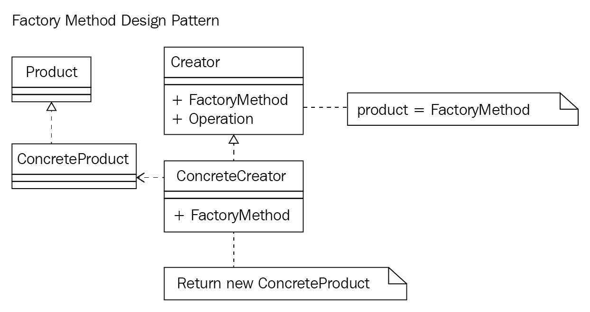
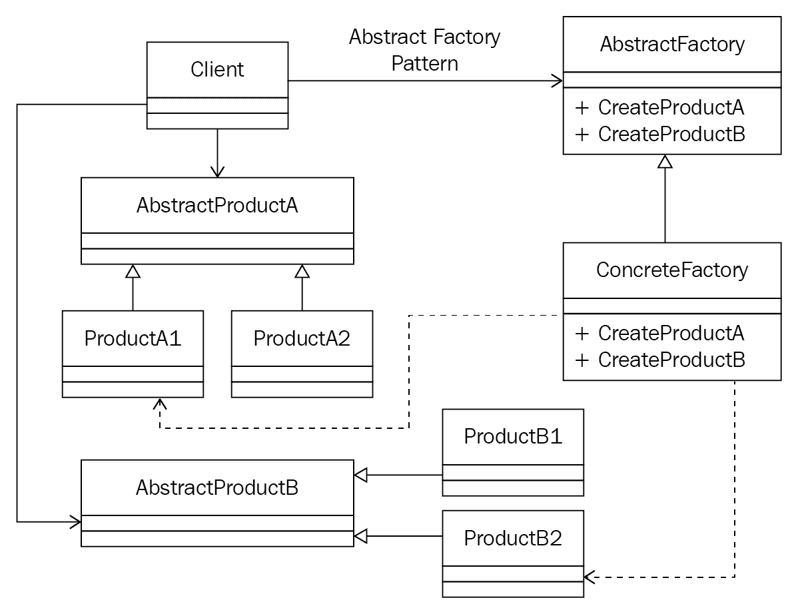
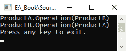
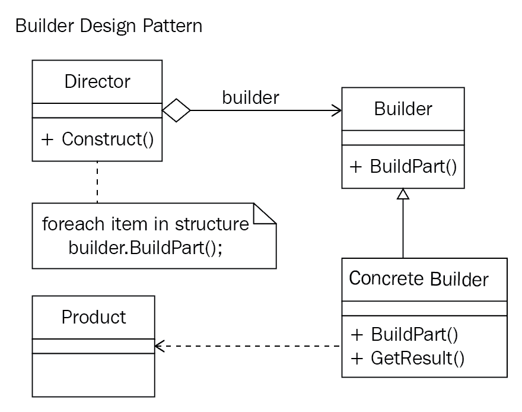
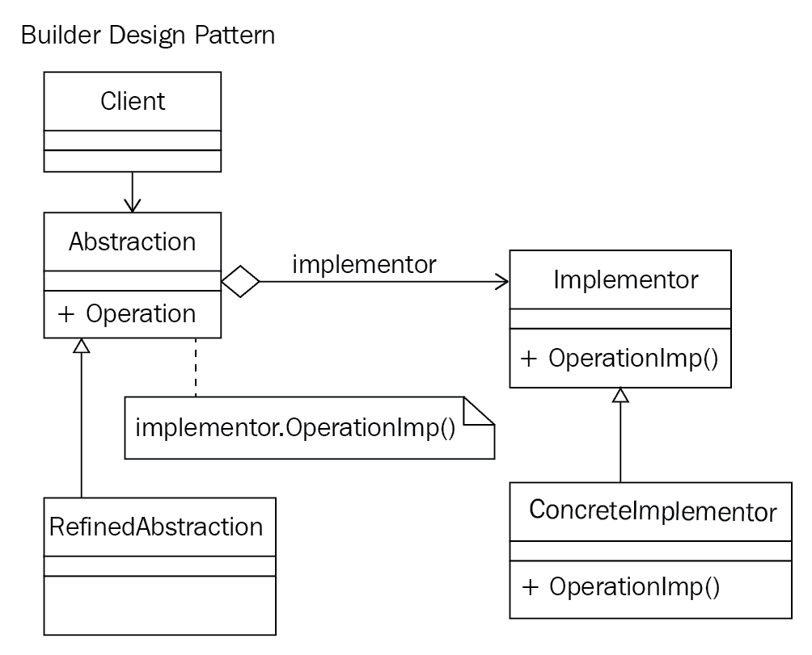
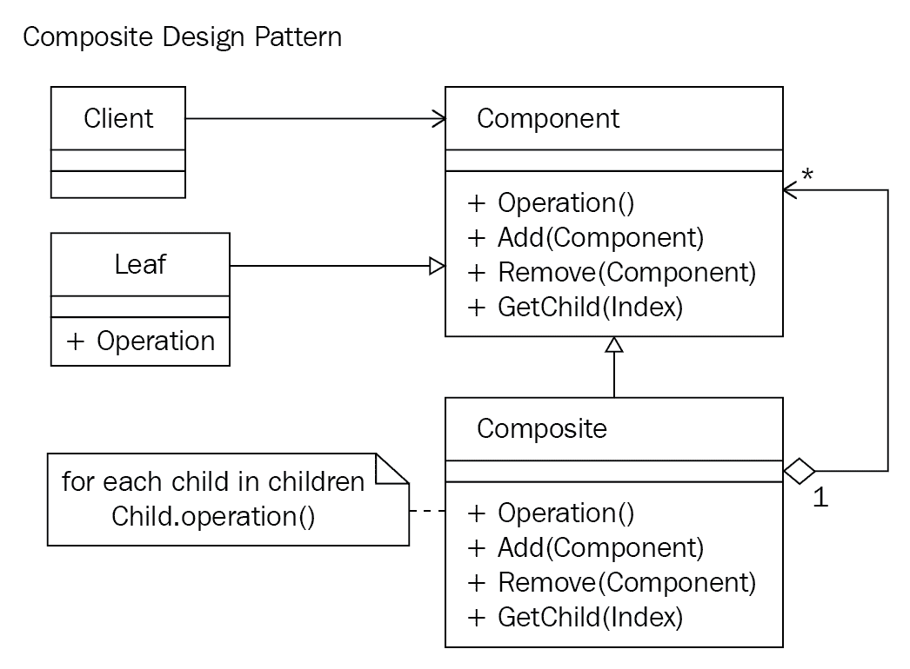
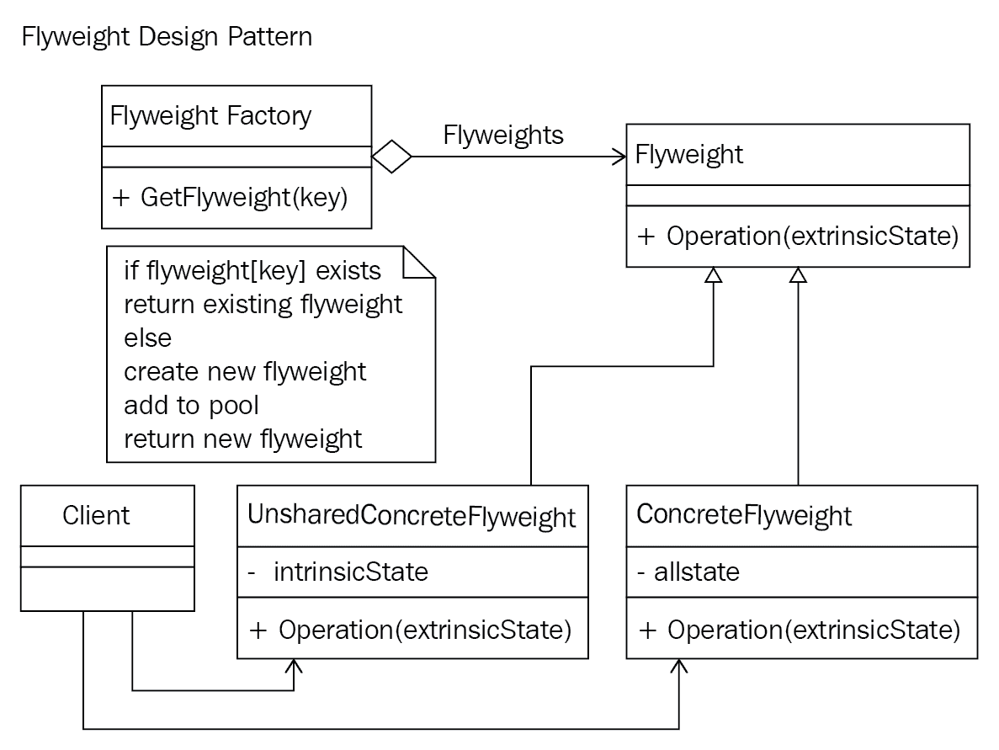

Refactoring C# Code – Implementing Design Patterns

编写干净代码的一半战役在于设计模式的正确实现和使用。设计模式本身可能成为代码气味。当设计模式被用来过度设计一些很容易实现的东西时，它就变成了一种代码味道。

在本书的前几章中，您已经看到了在编写干净代码和重构代码时使用设计模式。具体来说，我们实现了适配器模式、装饰器模式和代理模式。这些模式以正确的方式实现，以完成手头的任务。它们保持简单，而且它们肯定不会使代码复杂化。因此，当用于适当的目的时，设计模式在消除代码气味方面非常有用，从而使代码保持良好、干净和新鲜。

在本章中，我们将讨论**四人帮（GoF）**的创意、结构和行为设计模式。设计模式不是一成不变的，您不必严格执行它们。但是，拥有代码示例可以帮助您从仅仅拥有头脑知识过渡到拥有正确实现和使用设计模式所需的实际技能。

在本章中，我们将介绍以下主题：

*   实现创造性设计模式
*   实现结构设计模式
*   行为设计模式概述

本章结束时，您将具备以下技能：

*   理解、描述和编程不同创意设计模式的能力
*   理解、描述和编程不同结构设计模式的能力
*   对行为设计模式概述的理解

我们将从讨论创造性设计模式开始概述 GoF 设计模式。

# 技术要求

*   Visual Studio 2019
*   Visual Studio 2019.NET Framework 控制台应用程序作为您的工作项目
*   本章完整的源代码：[https://github.com/PacktPublishing/Clean-Code-in-C-/tree/master/CH14/CH14_DesignPatterns](https://github.com/PacktPublishing/Clean-Code-in-C-/tree/master/CH14/CH14_DesignPatterns)

# 实现创造性设计模式

从程序员的角度来看，我们在执行对象创建时使用创造性设计模式。模式是根据手头的任务选择的。有五种创造性设计模式：

*   **Singleton**：Singleton 模式确保在应用程序级别只存在一个对象实例。
*   **工厂方法**：工厂模式用于创建对象，不使用要使用的类。
*   **抽象工厂**：在没有具体类说明的情况下，抽象工厂实例化相关或依赖对象组。
*   **原型**：指定要创建的原型类型，然后创建原型副本。
*   **生成器**：将对象构造与其表示分离。

我们现在将开始实现这些模式中的每一个，从单例设计模式开始。

## 实现单例模式

单例设计模式只允许一个类的一个实例具有全局访问权限。当系统内的所有操作必须由一个对象协调时，请使用单例模式：


此模式的参与者是**s****ingleton**——一个负责管理自身实例并确保整个系统中只有一个自身实例运行的类。

我们现在要实现单例设计模式：

1.  将名为`Singleton`的文件夹添加到`CreationalDesignPatterns`文件夹中。然后，添加一个名为`Singleton`的类：

```cs
public class Singleton {
    private static Singleton _instance;

    protected Singleton() { }

    public static Singleton Instance() {
        return _instance ?? (_instance = new Singleton());
    }
}
```

2.  `Singleton`类存储自身实例的静态副本。无法实例化该类，因为构造函数被标记为受保护。`Instance()`方法是静态的。它检查`Singleton`类的实例是否存在。如果是，则返回。如果实例不存在，则创建并返回实例。现在，我们将添加代码来调用它：

```cs
var instance1 = Singleton.Instance();
var instance2 = Singleton.Instance();

if (instance1.Equals(instance2))
    Console.WriteLine("Instance 1 and instance 2 are the same instance of Singleton.");
```

3.  我们声明了`Singleton`类的两个实例，然后比较它们是否是相同的实例。您可以在以下屏幕截图中看到输出：


如您所见，我们有一个实现 singleton 设计模式的工作类。接下来，我们将讨论工厂方法设计模式。

## 实现工厂方法模式

工厂方法设计模式创建的对象允许其子类实现自己的对象创建逻辑。当您希望将对象实例化保持在单个位置并且需要生成一组特定的相关对象时，请使用此设计模式：



本项目的参与者如下：

*   `Product`**以工厂方式创建的抽象产品**
***   `ConcreteProduct`：继承抽象产品*   `Creator`：具有抽象工厂方法的抽象类*   `Concrete Creator`**继承抽象创建者，覆盖工厂方法****

 ****我们现在将实施工厂方法：

1.  在名为`FactoryMethod`的`CreationalDesignPatterns`文件夹中添加一个文件夹。然后，添加`Product`类：

```cs
public abstract class Product {}
```

2.  `Product`类定义了由工厂方法创建的对象。添加`ConcreteProduct`类：

```cs
public class ConcreteProduct : Product {}
```

3.  `ConcreteProduct`类继承`Product`类。添加`Creator`类：

```cs
public abstract class Creator {
    public abstract Product FactoryMethod();
}
```

4.  `Creator`类将被`ConcreteFactory`类继承，该类将实现`FactoryMethod()`。添加`ConcreteCreator`类：

```cs
public class ConcreteCreator : Creator {
    public override Product FactoryMethod() {
        return new ConcreteProduct();
    }
}
```

5.  `ConcreteCreator`类继承`Creator`类并重写`FactoryMethod()`。该方法返回一个新的`ConcreteProduct`类。以下代码演示了正在使用的 factory 方法：

```cs
var creator = new ConcreteCreator();
var product = creator.FactoryMethod();
Console.WriteLine($"Product Type: {product.GetType().Name}");
```

我们已经创建了`ConcreteCreator`类的一个新实例。然后，我们调用`FactoryMethod()`来创建一个新产品。然后，通过 factory 方法创建的产品名称输出到控制台窗口，如图所示：


既然我们知道了如何实现工厂方法设计模式，我们将继续实现抽象工厂设计模式。

## 实现抽象工厂模式

在不指定具体类的情况下，使用抽象工厂设计模式实例化相关或从属对象组（称为族）：



这一模式的参与者如下：

*   `AbstractFactory`：抽象工厂，由具体工厂实施
*   `ConcreteFactory`：创造具体产品
*   `AbstractProduct`：具体产品将继承的抽象产品
*   `Product`：继承`AbstractProduct`由混凝土厂创建

现在，我们将开始实施该模式：

1.  将名为`CreationalDesignPatterns`的文件夹添加到项目中。
2.  在名为`AbstractFactory`的`CreationalDesignPatterns`文件夹中添加一个文件夹。
3.  在`AbstractFactory`文件夹中，添加`AbstractFactory`类：

```cs
public abstract class AbstractFactory {
    public abstract AbstractProductA CreateProductA();
    public abstract AbstractProductB CreateProductB();
}
```

4.  `AbstractFactory`包含两种创建抽象产品的抽象方法。添加`AbstractProductA`类：

```cs
public abstract class AbstractProductA {
    public abstract void Operation(AbstractProductB productB);
}
```

5.  `AbstractProductA`类有一个抽象方法，对`AbstractProductB`执行操作。现在，添加`AbstractProductB`类：

```cs
public abstract class AbstractProductB {
    public abstract void Operation(AbstractProductA productA);
}
```

6.  `AbstractProductB`类有一个抽象方法，对`AbstractProductA`执行操作。添加`ProductA`类：

```cs
public class ProductA : AbstractProductA {
    public override void Operation(AbstractProductB productB) {
        Console.WriteLine("ProductA.Operation(ProductB)");
    }
}
```

7.  `ProductA`继承`AbstractProductA`并覆盖`Operation()`方法，该方法与`AbstractProductB`交互。本例中的`Operation()`方法打印出一条控制台消息。对`ProductB`类进行同样的操作：

```cs
public class ProductB : AbstractProductB {
    public override void Operation(AbstractProductA productA) {
        Console.WriteLine("ProductB.Operation(ProductA)");
    }
}
```

8.  `ProductB`继承`AbstractProductB`并覆盖`Operation()`方法，该方法与`AbstractProductA`交互。本例中的`Operation()`方法打印出一条控制台消息。添加`ConcreteFactory`类：

```cs
public class ConcreteProduct : AbstractFactory {
    public override AbstractProductA CreateProductA() {
        return new ProductA();
    }

    public override AbstractProductB CreateProductB() {
        return new ProductB();
    }
}
```

9.  `ConcreteFactory`继承`AbstractFactory`类并重写两种产品创建方法。每个方法都返回一个具体的类。添加`Client`类：

```cs
public class Client
{
    private readonly AbstractProductA _abstractProductA;
    private readonly AbstractProductB _abstractProductB;

    public Client(AbstractFactory factory) {
        _abstractProductA = factory.CreateProductA();
        _abstractProductB = factory.CreateProductB();
    }

    public void Run() {
        _abstractProductA.Operation(_abstractProductB);
        _abstractProductB.Operation(_abstractProductA);
    }
}
```

10.  `Client`类声明了两个抽象产品。它的构造函数接受一个`AbstractFactory`类。在构造器内部，工厂为两个声明的抽象产品分配各自的具体产品。`Run()`方法在两个产品上执行`Operation()`。以下代码执行我们的抽象工厂示例：

```cs
AbstractFactory factory = new ConcreteProduct();
Client client = new Client(factory);
client.Run();
```

11.  运行代码，您将看到以下输出：



A good reference implementation of the abstract factory is the ADO.NET 2.0 `DbProviderFactory` abstract class. An article called *Abstract Factory Design Pattern in ADO.NET 2.0* by Moses Soliman on C# Corner is a nice write-up on `DbProviderFactory` about the implementation of the abstract factory design pattern. Here is the link:

[https://www.c-sharpcorner.com/article/abstract-factory-design-pattern-in-ado-net-2-0/](https://www.c-sharpcorner.com/article/abstract-factory-design-pattern-in-ado-net-2-0/).

我们已经成功地实现了抽象工厂设计模式。现在，我们将实现原型模式。

## 实现原型模式

原型设计模式用于创建原型的实例，然后通过克隆原型来创建新对象。当直接创建对象的成本很高时，请使用此模式。使用此模式，您可以缓存对象并在需要时返回克隆：


原型设计模式的参与者如下：

*   `Prototype`：提供自身克隆方法的抽象类
*   `ConcretePrototype`：继承原型并重写`Clone()`方法以返回原型的成员克隆
*   `Client`：请求原型的新克隆

我们现在将实现原型设计模式：

1.  将名为`Prototype`的文件夹添加到`CreationalDesignPatterns`文件夹中，然后添加`Prototype`类：

```cs
public abstract class Prototype {
    public string Id { get; private set; }

    public Prototype(string id) {
        Id = id;
    }

    public abstract Prototype Clone();
}
```

2.  我们的`Prototype`类必须继承。它的构造函数需要传入一个存储在类级别的标识字符串。提供了一个`Clone()`方法，子类将覆盖该方法。现在，添加`ConcretePrototype`类：

```cs
public class ConcretePrototype : Prototype {
    public ConcretePrototype(string id) : base(id) { }

    public override Prototype Clone() {
        return (Prototype) this.MemberwiseClone();
    }
}
```

3.  `ConcretePrototype`类继承自`Prototype`类。它的构造函数接受一个标识字符串，并将该字符串传递给基类的构造函数。然后，它通过调用`MemberwiseClone()`方法并将强制转换的克隆返回到`Prototype`类型，覆盖克隆方法以提供当前对象的浅层副本。现在，对于演示正在使用的原型设计模式的代码：

```cs
var prototype = new ConcretePrototype("Clone 1");
var clone = (ConcretePrototype)prototype.Clone();
Console.WriteLine($"Clone Id: {clone.Id}");
```

我们的代码创建了一个标识符为`"Clone 1"`的`ConcretePrototype`类的新实例。然后我们克隆原型并将其转换为`ConcretePrototype`类型。然后，我们将克隆的标识符打印到控制台窗口，如图所示：


正如我们所看到的，克隆与原型具有相同的标识符。

For a very detailed article of a real-world example, refer to an excellent article called *Prototype Design Pattern with Real-World Scenario*, by Akshay Patel, on C# Corner. Here is the link: [https://www.c-sharpcorner.com/UploadFile/db2972/prototype-design-pattern-with-real-world-scenario624/](https://www.c-sharpcorner.com/UploadFile/db2972/prototype-design-pattern-with-real-world-scenario624/).

现在，我们将实现最终的创造性设计模式，称为构建器设计模式。

## 实现 builder 模式

生成器设计模式将对象的构造与其表示分离。因此，可以使用相同的构造方法创建对象的不同表示形式。当需要分阶段构建和连接复杂对象时，请使用生成器设计模式：



builder 设计模式的参与者如下所示：

*   `Director`：一个类，它通过构造函数接收构建器，然后调用构建器对象上的每个构建方法
*   **`Builder`**：提供抽象构建方法和返回构建对象的抽象方法的抽象类
*   `ConcreteBuilder`：继承`Builder`类的具体类，重写 builder 方法以实际构建对象，重写 result 方法以返回完全构建的对象

让我们开始实施我们的最终创意设计模式——建筑商设计模式：

1.  首先将名为`Builder`的文件夹添加到`CreationalDesignPatterns`文件夹中。然后，添加`Product`类：

```cs
public class Product {
    private List<string> _parts;

    public Product() {
        _parts = new List<string>();
    }

    public void Add(string part) {
        _parts.Add(part);
    }

    public void PrintPartsList() {
        var sb = new StringBuilder();
        sb.AppendLine("Parts Listing:");
        foreach (var part in _parts)
            sb.AppendLine($"- {part}");
        Console.WriteLine(sb.ToString());
    }
}
```

2.  在我们的示例中，`Product`类保存一个部件列表。这些部分是字符串。该列表在构造函数中初始化。部件是通过`Add()`方法添加的，当我们的对象完全构建后，我们可以调用`PrintPartsList()`方法将组成该对象的部件列表打印到控制台窗口。现在，添加`Builder`类：

```cs
public abstract class Builder
{
    public abstract void BuildSection1();
    public abstract void BuildSection2();
    public abstract Product GetProduct();
}
```

3.  我们的`Builder`类将由具体类继承，这些类将重写其抽象方法来构建对象并返回它。现在我们将添加`ConcreteBuilder`类：

```cs
public class ConcreteBuilder : Builder {
    private Product _product;

    public ConcreteBuilder() {
        _product = new Product();
    }

    public override void BuildSection1() {
        _product.Add("Section 1");
    }

    public override void BuildSection2() {
        _product.Add(("Section 2"));
    }

    public override Product GetProduct() {
        return _product;
    }
}
```

4.  我们的`ConcreteBuilder`类继承了`Builder`类。该类存储要构造的对象的实例。构建方法被覆盖，部件通过产品的`Add()`方法添加到产品中。产品通过`GetProduct()`方法调用返回给客户端。添加`Director`类：

```cs
public class Director
{
    public void Build(Builder builder)
    {
        builder.BuildSection1();
        builder.BuildSection2();
    }
}
```

5.  `Director`类是一个具体的类，它通过`Build()`方法获取`Builder`对象，并调用`Builder`对象上的 build 方法来构建该对象。我们现在所需要的是代码，以演示实际的构建器设计模式：

```cs
var director = new Director();
var builder = new ConcreteBuilder();
director.Build(builder);
var product = builder.GetProduct();
product.PrintPartsList();
```

6.  我们创建了一个导演和建设者。然后，主管构建产品。然后分配产品，并将其零件列表打印到控制台窗口，如图所示：


一切都正常运转。

在.NET Framework 中，`System.Text.StringBuilder`类是现实世界中 builder 设计模式的一个示例。当连接五行或更多行时，使用带加号（`+`运算符的字符串连接要比使用`StringBuilder`类慢。当连接行少于五行时，使用`+`运算符的字符串连接速度比`StringBuilder`快，但当连接行多于五行时速度较慢。这是因为每次使用`+`运算符创建字符串时，您都在重新创建字符串，因为字符串在堆上是不可变的。但是`StringBuilder`在堆上分配缓冲区空间。然后，将字符写入缓冲区空间。对于少量的行，`+`操作符速度更快，因为在使用字符串生成器时创建缓冲区的开销更大。但当超过五行时，使用`StringBuilder`时会有明显的差异。在大数据项目中，可能会发生数十万甚至数百万个字符串连接，您决定采用的字符串连接策略要么执行速度快，要么执行速度慢。让我们创建一个简单的演示。创建一个名为`StringConcatenation`的新类，然后添加以下代码：

```cs
private static DateTime _startTime;
private static long _durationPlus;
private static long _durationSb;
```

`_startTime`变量保存方法执行的当前开始时间。当使用`+`操作符进行连接时，`_durationPlus`变量将方法执行的持续时间保存为滴答数，`_durationSb`将操作的持续时间保存为`StringBuilder`连接的滴答数。将`UsingThePlusOperator()`方法添加到类中：

```cs
public static void UsingThePlusOperator()
{
    _startTime = DateTime.Now;
    var text = string.Empty;
    for (var x = 1; x <= 10000; x++)
    {
        text += $"Line: {x}, I must not be a lazy programmer, and should continually develop myself!\n";
    }
    _durationPlus = (DateTime.Now - _startTime).Ticks;
    Console.WriteLine($"Duration (Ticks) Using Plus Operator: {_durationPlus}");
}
```

`UsingThePlusOperator()`方法演示了使用`+`运算符连接 10000 个字符串所花费的时间。处理字符串连接所用的时间存储为触发的刻度数。每毫秒有 10000 个滴答声。现在，添加`UsingTheStringBuilder()`方法：

```cs
public static void UsingTheStringBuilder()
{
    _startTime = DateTime.Now;
    var sb = new StringBuilder();
    for (var x = 1; x <= 10000; x++)
    {
        sb.AppendLine(
            $"Line: {x}, I must not be a lazy programmer, and should continually develop myself!"
        );
    }
    _durationSb = (DateTime.Now - _startTime).Ticks;
    Console.WriteLine($"Duration (Ticks) Using StringBuilder: {_durationSb}");
}
```

此方法与前一种方法相同，只是我们使用`StringBuilder`类执行字符串连接。现在我们将添加代码以打印出时间差，称为`PrintTimeDifference()`：

```cs
public static void PrintTimeDifference()
{
    var difference = _durationPlus - _durationSb;
    Console.WriteLine($"That's a time difference of {difference} ticks.");
    Console.WriteLine($"{difference} ticks = {TimeSpan.FromTicks(difference)} seconds.\n\n");
}
```

`PrintTimeDifference()`方法通过从`+`滴答声中减去`StringBuilder`滴答声来计算时间差。然后，滴答声的差异被打印到控制台上，然后是一行将滴答声转换为秒。下面是测试我们的方法的代码，以便我们可以看到两种串联方法的时间差：

```cs
StringConcatenation.UsingThePlusOperator();
StringConcatenation.UsingTheStringBuilder();
StringConcatenation.PrintTimeDifference();
```

运行代码时，您将在控制台窗口中看到时间和时差，如图所示：


从截图中可以看出，`StringBuilder`要快得多。对于少量的数据，用肉眼看不出有什么区别。但是，当被处理的数据线数量大幅增加时，肉眼可以看到这种差异。

使用构建器模式的另一个例子是报表构造。如果你考虑带状报告，乐队本质上是需要从不同的来源建立起来的部分。因此，您可以拥有主要部分，然后将每个子报表作为不同的部分。最终报告将是这些不同部分的合并。因此，您可以使用如下代码来构建报告：

```cs
var report = new Report();
report.AddHeader();
report.AddLastYearsSalesTotalsForAllRegions();
report.AddLastYearsSalesTotalsByRegion();
report.AddFooter();
report.GenerateOutput();
```

在这里，我们正在创建一个新的报告。我们首先添加标题。然后，我们加上去年所有地区的销售数据，然后是按地区细分的去年销售数据。然后，我们向报告中添加一个页脚，并通过生成报告输出完成该过程。

因此，您已经从 UML 图中看到了构建器模式的默认实现。然后，您使用`StringBuilder`类实现了字符串连接，这有助于以性能方式构建字符串。最后，您了解了构建器模式在构建报表的各个部分并生成其输出时是如何有用的。

好了，我们的创造性设计模式的实现到此结束。现在我们将继续实现一些结构设计模式。

# 实现结构设计模式

作为程序员，我们使用结构模式来改进代码的整体结构。因此，当遇到缺少结构且不干净的代码时，我们可以使用本节中提到的模式来重新构造代码并使其干净。有七种结构设计模式：

*   **适配器**：**使用此模式可以使接口不兼容的类干净地协同工作。**
***   **桥接**：通过将抽象与其实现解耦，使用此模式松散耦合代码。*   **复合**：使用此模式聚合对象，并提供处理单个和对象组合的统一方式。*   **Decorator**：使用此模式可以在向对象动态添加新功能的同时保持界面不变。*   **立面**：使用此模式简化更大、更复杂的接口。*   **Flyweight**：**使用此模式保存内存并在对象之间传递共享数据。*****   **代理**：**在客户端和 API 之间使用此模式拦截客户端和 API 之间的调用。******

 ******我们在前几章中已经讨论了适配器、装饰器和代理模式，因此本章不再讨论它们。现在，我们将开始实现我们的结构设计模式，从桥接模式开始。

## 实现桥接模式

我们使用桥接模式将抽象与其实现解耦，这样它们就不会在编译时绑定。抽象和实现都可以在不影响客户机的情况下变化。

如果需要在运行时绑定实现或在多个对象之间共享实现，如果由于接口耦合和各种实现而存在多个类，或者如果需要映射正交类层次结构，请使用桥接设计模式：



桥梁设计模式的参与者如下：

*   `Abstraction`：包含抽象操作的抽象类
*   `RefinedAbstraction`：继承`Abstraction`类并重写`Operation()`方法
*   `Implementor`：具有抽象`Operation()`方法的抽象类
*   `ConcreteImplementor`：继承`Implementor`类并重写`Operation()`方法

现在，我们将实施桥梁设计模式：

1.  首先将`StructuralDesignPatterns`文件夹添加到项目中，然后在该文件夹中添加`Bridge`文件夹。然后，添加`Implementor`类：

```cs
public abstract class Implementor {
    public abstract void Operation();
}
```

2.  `Implementor`类只有一个抽象方法，称为`Operation()`。添加`Abstraction`类：

```cs
public class Abstraction {
    protected Implementor implementor;

    public Implementor Implementor {
        set => implementor = value;
    }

    public virtual void Operation() {
        implementor.Operation();
    }
}
```

3.  `Abstraction`类有一个保存`Implementor`对象的受保护字段，该对象通过`Implementor`属性设置。一个名为`Operation()`的虚拟方法在实现者上调用`Operation()`方法。添加`RefinedAbstraction`类：

```cs
public class RefinedAbstraction : Abstraction {
    public override void Operation() {
        implementor.Operation();
    }
}
```

4.  `RefinedAbstraction`类继承`Abstraction`类并重写`Operation()`方法，在实现者上调用`Operation()`方法。现在，添加`ConcreteImplementor`类：

```cs
public class ConcreteImplementor : Implementor {
    public override void Operation() {
        Console.WriteLine("Concrete operation executed.");
    }
}
```

5.  `ConcreteImplementor`类继承`Implementor`类并重写`Operation()`方法，将消息打印到控制台。运行 bridge design 模式示例的代码如下所示：

```cs
var abstraction = new RefinedAbstraction();
abstraction.Implementor = new ConcreteImplementor();
abstraction.Operation();
```

我们创建一个新的`RefinedAbstraction`实例，然后将其实现者设置为一个新的`ConcreteImplementor`实例。然后，我们称之为`Operation()`方法。我们的示例桥接器实现的输出如下所示：


如您所见，我们成功地在具体实现器类中执行了具体操作。我们将研究的下一个模式是复合设计模式。

## 实现复合模式

使用复合设计模式，对象由树结构组成，以表示部分-整体层次结构。此模式使您能够以统一的方式处理单个对象和对象的组合。

当需要忽略单个对象和对象组合之间的差异、需要树结构来表示层次结构以及层次结构需要跨其结构的通用功能时，请使用此模式：



复合设计模式的参与者如下所示：

*   `Component`：组合对象接口
*   `Leaf`：构图中没有孩子的叶子
*   `Composite`：存储子组件并执行操作
*   `Client`：通过组件界面操作合成和叶子

现在是实现复合模式的时候了：

1.  将名为`Composite`的新文件夹添加到`StructuralDesignPatterns`类。然后，添加`IComponent`接口：

```cs
public interface IComponent {
    void PrintName();
}
```

2.  `IComponent`接口有一个单一的方法，它将由 leaf 和 composites 实现。添加`Leaf`类：

```cs
public class Leaf : IComponent {
    private readonly string _name;

    public Leaf(string name) {
        _name = name;
    }

    public void PrintName() {
        Console.WriteLine($"Leaf Name: {_name}");
    }
}
```

3.  `Leaf`类实现`IComponent`接口。它的构造函数获取一个名称并存储它，`PrintName()`方法将叶的名称打印到控制台窗口。添加`Composite`类：

```cs
public class Composite : IComponent {
    private readonly string _name;
    private readonly List<IComponent> _components;

    public Composite(string name) {
        _name = name;
        _components = new List<IComponent>();
    }

    public void Add(IComponent component) {
        _components.Add(component);
    }

    public void PrintName() {
        Console.WriteLine($"Composite Name: {_name}");
        foreach (var component in _components) {
            component.PrintName();
        }
    }
}
```

4.  `Composite`类以与 leaf 相同的方式实现`IComponent`接口。此外，`Composite`存储通过`Add()`方法添加的组件列表。它的`PrintName()`方法打印出自己的名称，然后是列表中每个组件的名称。现在，我们将添加代码来测试我们的复合设计模式实现：

```cs
var root = new Composite("Classification of Animals");
var invertebrates = new Composite("+ Invertebrates");
var vertebrates = new Composite("+ Vertebrates");

var warmBlooded = new Leaf("-- Warm-Blooded");
var coldBlooded = new Leaf("-- Cold-Blooded");
var withJointedLegs = new Leaf("-- With Jointed-Legs");
var withoutLegs = new Leaf("-- Without Legs");

invertebrates.Add(withJointedLegs);
invertebrates.Add(withoutLegs);

vertebrates.Add(warmBlooded);
vertebrates.Add(coldBlooded);

root.Add(invertebrates);
root.Add(vertebrates);

root.PrintName();
```

5.  如你所见，我们先制作复合材料，然后制作树叶。然后我们将叶子添加到适当的复合材料中。然后，我们将合成添加到根合成。最后，我们调用根组合的`PrintName()`方法，该方法将打印根的名称以及层次结构中所有组件和叶子的名称。您可以看到输出，如下所示：


我们的复合实现正在按预期工作。我们将实现的下一个模式是 façade 设计模式。

## 实现 façade 模式

façade 模式旨在使 API 子系统的使用更容易。使用此模式可以将大型复杂系统隐藏在一个简单得多的界面后面，供客户机使用。程序员实现此模式的主要原因是他们必须使用或处理的系统太复杂，很难理解。

使用此模式的其他原因包括：如果太多的类彼此依赖，或者仅仅因为程序员无法访问源代码：


立面模式的参与者如下：

*   `Facade`：简单的界面，在客户端和更复杂的子系统系统之间充当*的中间环节*
*   `Subsystem Classes`：子系统类，直接从客户端访问中删除，由 façade 直接访问

我们现在将实施 façade 设计模式：

1.  将名为`Facade`的文件夹添加到`StructuralDesignPatterns`文件夹中。然后，添加`SubsystemOne`和`SubsystemTwo`类：

```cs
public class SubsystemOne {
    public void PrintName() {
        Console.WriteLine("SubsystemOne.PrintName()");
    }
}

public class SubsystemOne {
    public void PrintName() {
        Console.WriteLine("SubsystemOne.PrintName()");
    }
}
```

2.  这些类有一个方法将类名和方法名打印到控制台窗口。现在，让我们添加`Facade`类：

```cs
public class Facade {
    private SubsystemOne _subsystemOne = new SubsystemOne();
    private SubsystemTwo _subsystemTwo = new SubsystemTwo();

    public void SubsystemOneDoWork() {
        _subsystemOne.PrintName();
    }

    public void SubsystemTwoDoWork() {
        _subsystemTwo.PrintName();
    }
}
```

3.  `Facade`类为其了解的每个系统创建成员变量。然后，它提供了一系列方法，这些方法将在请求时访问每个子系统的各个部分。我们将添加代码来测试我们的实现：

```cs
var facade = new Facade();
facade.SubsystemOneDoWork();
facade.SubsystemTwoDoWork();
```

4.  我们所要做的就是创建一个`Facade`变量，然后我们可以调用在子系统中执行方法调用的方法。您应该看到以下输出：


是时候来看看我们最后的结构模式了，称为 flyweight 模式。

## 实现 flyweight 模式

flyweight 设计模式用于通过减少总体对象数量来高效处理大量细粒度对象。使用此模式可以通过减少创建的对象数量来提高性能并减少内存占用：



flyweight 设计模式的参与者如下：

*   `Flyweight`：为飞锤提供一个接口，以便它们可以接收外部状态并对其进行操作
*   `ConcreteFlyweight`：为固有状态添加存储的可共享对象
*   `UnsharedConcreteFlyweight`：当飞锤不需要共享时使用
*   `FlyweightFactory`：正确管理 flyweight 对象并正确共享
*   `Client`：维护 flyweight 引用并计算或存储 flyweight 的外部状态

**Extrinsic state** means that it is not part of the essential nature of the object and that it originates externally to the object. **Intrinsic state** means that the state belongs to the object and is essential to the object.

让我们实现 flyweight 设计模式：

1.  首先将`Flyweight`文件夹添加到`StructuralDesignPatters`文件夹。现在，添加`Flyweight`类：

```cs
public abstract class Flyweight {
    public abstract void Operation(string extrinsicState);
}
```

2.  此类为抽象类，包含一个名为`Operation()`的抽象方法，该方法以 flyweight 的外部状态传递：

```cs
public class ConcreteFlyweight : Flyweight
{
    public override void Operation(string extrinsicState)
    {
        Console.WriteLine($"ConcreteFlyweight: {extrinsicState}");
    }
}
```

3.  `ConcreteFlyweight`类继承`Flyweight`类并重写`Operation()`方法。该方法输出方法名称及其外部状态。现在，添加`FlyweightFactory`类：

```cs
public class FlyweightFactory {
    private readonly Hashtable _flyweights = new Hashtable();

    public FlyweightFactory()
    {
        _flyweights.Add("FlyweightOne", new ConcreteFlyweight());
        _flyweights.Add("FlyweightTwo", new ConcreteFlyweight());
        _flyweights.Add("FlyweightThree", new ConcreteFlyweight());
    }

    public Flyweight GetFlyweight(string key) {
        return ((Flyweight)_flyweights[key]);
    }
}
```

4.  在我们特定的 flyweight 示例中，我们将 flyweight 对象存储在*哈希表*中。在我们的构造函数中创建了三个 flyweight 对象。我们的`GetFlyweight()`方法从哈希表返回指定键的 flyweight。现在，添加客户端：

```cs
public class Client
{
    private const string ExtrinsicState = "Arbitary state can be anything you require!";

    private readonly FlyweightFactory _flyweightFactory = new FlyweightFactory();

    public void ProcessFlyweights()
    {
        var flyweightOne = _flyweightFactory.GetFlyweight("FlyweightOne");
        flyweightOne.Operation(ExtrinsicState);

        var flyweightTwo = _flyweightFactory.GetFlyweight("FlyweightTwo");
        flyweightTwo.Operation(ExtrinsicState);

        var flyweightThree = _flyweightFactory.GetFlyweight("FlyweightThree");
        flyweightThree.Operation(ExtrinsicState);
    }
}
```

5.  外在状态可以是您要求的任何东西。在我们的示例中，我们使用的是字符串。我们声明一个新的 flyweight factory，添加三个 flyweight，并对每个 flyweight 执行操作。让我们添加代码来测试 flyweight 设计模式的实现：

```cs
var flyweightClient = new StructuralDesignPatterns.Flyweight.Client();
flyweightClient.ProcessFlyweights();
```

6.  代码创建一个新的`Client`实例，然后调用`ProcessFlyweights()`方法。您应该看到以下内容：


结构模式就是这样。现在是时候让我们来看看如何实现行为设计模式了。

# 行为设计模式概述

作为一名程序员，您在团队中的行为受您与其他团队成员的沟通和互动方法的控制。我们编程的对象没有什么不同。作为程序员，我们通过使用行为模式来确定对象的行为以及与其他对象的通信方式。这些行为模式如下：

*   **责任链**：处理传入请求的对象的顺序管道。
*   **命令**：封装在对象内某个时间点调用方法所使用的所有信息。
*   **解释器**：提供给定语法的解释。
*   **迭代器**：使用此模式顺序访问聚合对象的元素，而不暴露其底层表示。
*   **中介体**：使用此模式让对象通过中介体相互通信。
*   **Memento**：使用此模式捕获并保存对象的状态。
*   **观察者**：使用此模式观察被观察对象的对象状态的变化并获得通知。
*   **状态**：当对象的状态发生变化时，使用此模式改变其行为。
*   **策略**：使用此模式定义可互换的封装算法目录。
*   **模板方法**：使用此模式定义一个算法和可以在子类中重写的步骤。
*   **访问者**：使用此模式可以在不修改现有对象的情况下向现有对象添加新操作。

由于本书的限制，我们没有足够的篇幅来介绍行为设计模式。考虑到这一点，我将指导您阅读以下书籍，您可以使用这些书籍进一步了解设计模式。第一本书名为《C#中的设计模式：一本包含真实世界示例的实践指南》，由 Vaskaring Sarcar 编写，由 Apress 出版。第二本书叫做.NET 中的*设计模式：面向对象软件设计的 C#和 F#中的可重用方法*，由 Dmitri Nesteruk 撰写，也由 Apress 出版。由 Packt 出版的第三本书名为《C#和.NET 核心设计模式的实践》，作者是 Gaurav Aroraa 和 Jeffrey Chilberto。

在这些书中，您不仅会了解所有的模式，还将接触到真实世界的示例，这将帮助您从简单的头脑知识过渡到在自己的项目中以可重用的方式使用设计模式的实际技能。

这就是我们对设计模式实现的看法。在总结我们所学到的知识之前，我将给您留下一些关于干净代码和重构的最后想法。

# 最后的想法

软件开发有两种类型：**棕地开发**和**绿地开发**。在我们的职业生涯中，我们从事的大部分代码都是棕地开发，这是对现有软件的维护和扩展，而绿地开发则是对新软件的开发、维护和扩展。通过 greenfield 软件开发，您从一开始就有机会编写干净的代码，我鼓励您这样做。

在进行项目之前，确保项目得到了正确的规划。然后，使用可用的工具自信地开发干净的代码。当涉及到棕地开发时，在维护或扩展系统之前，最好先花时间从内到外了解系统。不幸的是，你可能并不总是处于一种时间能给你带来如此奢侈的境地。因此，有时您可能会开始编写所需的代码，而没有意识到已经存在代码来完成您正在实现的任务。保持您编写的代码干净且结构良好将有助于在项目后期更容易地进行重构。

无论您正在从事的项目是棕地项目还是绿地项目，都应由您确保遵守公司程序。它们的存在有很好的理由，这些理由是开发团队和干净的代码库之间的和谐。当您在代码库中遇到不干净的代码时，应该立即对其进行重构。

如果代码太复杂，无法立即更改，并且需要跨层进行太多更改，则必须将更改记录为项目的技术债务，以便在适当规划后的稍后日期解决。

归根结底，不管你称自己为软件架构师、软件工程师、软件开发人员还是其他什么，你的谋生之道就是你的*编程技能*。糟糕的编程可能对你目前的职位不利，甚至会对你找到新职位的能力产生负面影响。因此，利用您所拥有的一切资源，确保您当前的代码对您的能力水平留下持久的良好印象。我曾经听到有人说：

*"You are only as good as your last programming assignment!"*

在构建系统时，不要太聪明，不要构建过于复杂的系统，这一点很重要。将程序的继承深度保持在不大于 1，并通过使用函数编程技术（如 LINQ）尽最大努力减少循环。

你在[第 13 章](13.html)中看到了*重构 C#代码——识别代码气味*，LINQ 如何比`foreach`循环更高效。通过限制计算机程序从头到尾的路径数量，也可以降低软件的复杂性。通过将样板代码删除到可以在编译时编入代码的方面来减少样板代码。这将减少方法中的行数，使其仅包含所需业务逻辑的行。保持班级规模小，只关注一项职责。另外，将方法的代码行数保持在 10 行或更少。类和方法只能执行单个职责。

学会让你写的代码保持简单，以便阅读和推理。理解你写的代码。如果你能很容易地理解你的代码，那么你很好。现在，扪心自问：*在完成另一个项目并回到这个项目后，您是否仍然会毫不费力地理解代码？*当代码难以理解时，必须对其进行重构和简化。

如果做不到这一点，可能会导致臃肿的系统缓慢而痛苦地死去。使用文档注释记录可公开访问的代码。对于隐藏代码，只有当代码本身没有足够的意义时，才使用简洁而有意义的注释。对经常重复的常见代码使用模式，这样你就不会重复自己的代码了。VisualStudio2019 中的缩进是自动的，但不同文档类型的默认缩进不同。因此，最好确保所有文档类型具有相同的缩进级别。使用 Microsoft 建议的标准命名建议。

在不复制和粘贴他人源代码的情况下，给自己解决编程难题。使用基准测试（评测）重写相同的代码，以减少处理时间。经常测试您的代码，以确保它的行为和所做的是它应该做的。最后，练习，练习，然后再多练习一些。

随着时间的推移，我们都会改变我们的编程风格。一些程序员的代码会随着时间的推移而恶化，如果他们在一个采用了大量糟糕实践的程序员团队中。如果其他程序员在一个采用了许多最佳实践的程序员团队中，他们的代码会随着时间的推移而改进。不要忘记，仅仅因为代码可以编译并执行它的本意，并不一定意味着它是最干净或性能最好的代码。

作为一名计算机程序员，你的目标是编写干净、高效、易于阅读、推理、维护和扩展的代码。练习实现 TDD 和 BDD，以及 KISS、SOLID、YAGNI 和 DRY 等软件范例。

考虑从 GITHUB 中检查一些旧代码以将旧版本.NET 版本迁移到新.NET 版本中，并重构代码以使其干净和性能，以及添加文档注释来生成开发团队的 API 文档。这是磨练个人计算机编程技能的好方法。通过这样做，您经常会遇到一些您可以亲自学习的相当聪明的代码。其他时候，可能是想知道程序员当时在想什么！但无论哪种方式，只要有机会，提高你的干净编码技能，只会使你成为一个更强大、更好的程序员。

另一种我认为在编程领域是正确的说法是：

"To become a true expert computer programmer, you have to push yourself beyond what you are currently capable of doing."

所以，无论你或你的同事认为你是怎样的专家，永远记住你能做得更好。因此，继续推进并提升你的比赛。然后，当你退休时，你可以带着作为一名计算机程序员所取得的卓越成就的正义自豪感回顾你的职业生涯！

现在让我们总结一下我们在本章学到的知识。

# 总结

在本章中，我们介绍了几种创造性、结构性和行为设计模式。您使用了在本章中获得的知识来查看遗留代码并理解其目标。然后，您使用本章中学习实现的模式重构现有代码，使其更易于阅读、推理、维护和扩展。通过使用本书中的模式以及您可以使用的许多其他模式，您可以重构现有代码并从一开始就编写干净的代码。

您还使用了创造性设计模式来解决实际问题并提高代码的效率。使用结构设计模式来改进代码的整体结构并改善对象之间的关系。此外，使用行为设计模式改善对象之间的通信，同时保持这些对象的解耦。

好了，这是本章的结尾，我感谢您花时间阅读本书并完成代码示例。记住，使用软件应该是一种乐趣。因此，我们不需要不干净的代码为我们的业务、开发和支持团队以及软件的客户带来问题。所以，想想你正在写的代码，无论你在这个行业工作了多少年，都要努力成为一名比现在更好的程序员。有一句老话：*无论你有多优秀，你总能做得更好*！

让我们测试一下你对本章内容的了解，然后我会给你留下一些进一步的阅读。用 C#编写干净的代码快乐！

# 问题

1.  什么是 GoF 模式？我们为什么要使用它们？
2.  解释创造性设计模式的用途，并列出它们。
3.  解释结构设计模式的用途和用途。
4.  解释行为设计模式的用途并列出它们。
5.  是否可能过度使用设计模式和调用代码？
6.  描述单例设计模式以及何时使用它。
7.  我们为什么要使用工厂方法？
8.  您会使用什么设计模式来隐藏大型且难以使用的系统的复杂性？
9.  如何最大限度地减少内存使用并在对象之间共享公共数据？
10.  使用什么模式将抽象与其实现解耦？
11.  如何构造同一复杂对象的多个表示？
12.  如果您有一个项目需要不同的操作阶段才能使其进入所需的状态，您会使用什么模式，为什么？

# 进一步阅读

*   *重构：改进现有代码*的设计，作者 Martin Fowler
*   莫德·勒梅尔的*大规模重构*
*   *软件开发、设计和编码：模式、调试、单元测试和重构*，作者：John F.Dooley
*   *软件设计的重构气味*，作者：Girish Suryanarayana、Ganesh Samarthyam 和 Tushar Sharma
*   *重构数据库：Scott W.Ambler 和 Pramod J.Sadalage 的进化数据库设计*、
***   Joshua Kerievsky 的*重构为模式*、***   *C#7 和.NET Core 2.0 高性能*，作者：Ovais Mehboob Ahmed Khan*   *提高你的 C#技能*、*作者：Ovais Mehboob Ahmed Khan、John Callaway、Clayton Hunt 和 Rod Stephens***   *企业应用程序架构模式*，作者：Martin Fowler*   Michael C.Feathers 的*有效处理遗留代码*、***   [https://www.dofactory.com/products/dofactory-net](https://www.dofactory.com/products/dofactory-net) ：dofactory 的 RAD 设计模式框架*   *Gaurav Arora 和 Jeffrey Chilberto 的 C#和.NET 核心*动手设计模式*   *使用 C#和.NET 核心*设计模式，由 Dimitris Loukas 编写*   *C#中的设计模式：一个带有真实世界示例的实践指南*，由 Vaskaring Sarcar 编写*****************