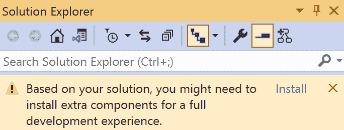
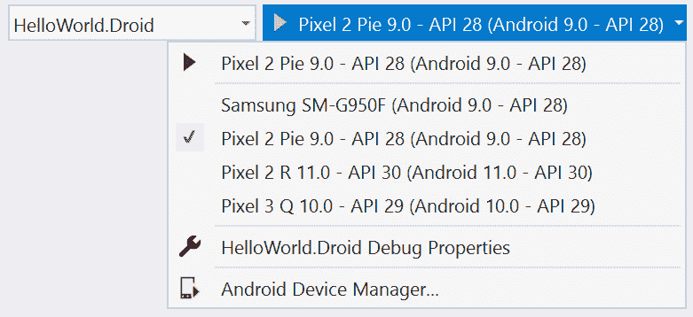
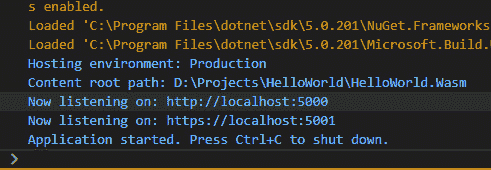
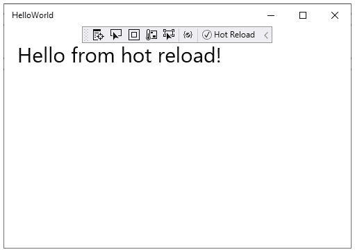
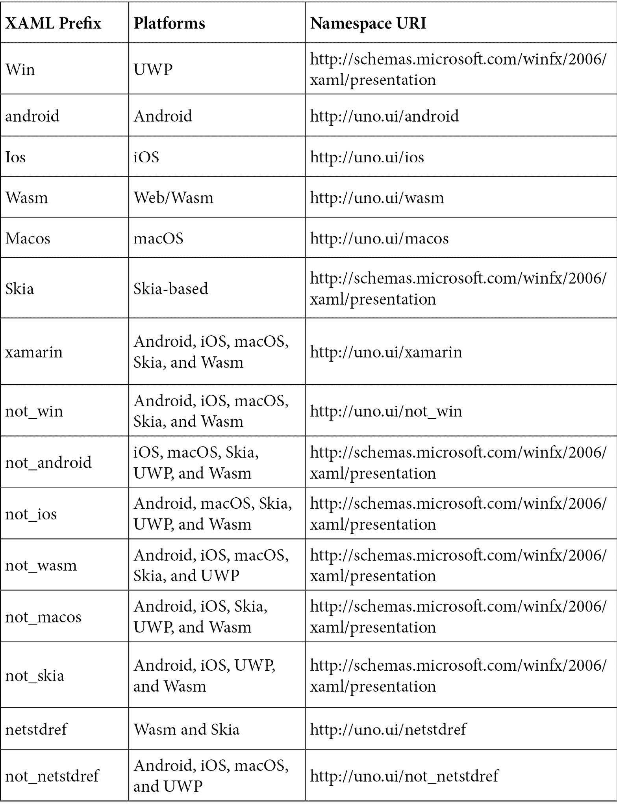
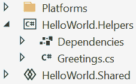
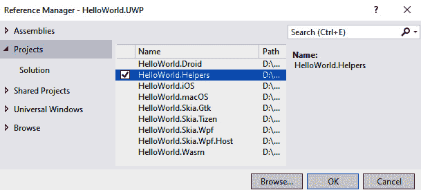

# 二、编写第一款 Uno 平台应用

在本章中，您将学习如何创建一个新的 Uno 平台应用，并了解一个典型的 Uno 平台应用的结构。 首先，我们将浏览默认的 Uno 平台应用模板，包括包含的不同项目，并让您运行在 Windows 10 与您的第一个 Uno 平台应用。 我们将通过展示如何使用模拟器和调试应用的 WebAssembly (Wasm)版本来深入了解在不同平台上运行和调试应用。

由于 Uno 平台支持过多的平台，越来越多的平台被添加到受支持的平台列表中，在本书中，我们将只针对受支持平台的一个子集进行开发。 以下平台是最突出和使用最广泛的平台，我们将针对它们:Windows 10、Android、Web/Wasm、macOS 和 iOS。

为了完整起见，我们在本章中提到了其他平台，而其他章节将只包括前面提到的平台。 这意味着我们不会向你展示如何在**Linux**、**Tizen**或**Windows 7/8**上运行或测试你的应用。

在本章中，我们将涵盖以下主题:

*   创建 Uno 平台应用并了解其结构
*   运行和调试你的应用，包括使用**XAML 热加载**和**C# 编辑并继续**
*   特定于平台的代码使用 C# 编译器符号和**XAML**前缀
*   Uno 平台应用之外的其他项目类型

在本章结束时，你将编写你的第一个 Uno 平台应用，并创建基于运行平台的自定义。 除此之外，您还可以使用不同的 Uno 平台项目类型。

# 技术要求

本章假设您已经设置好了开发环境，包括安装项目模板，如[*第 1 章*](02.html# _idTextAnchor015)，*介绍 Uno 平台*所述。 您可以在这里找到本章的源代码:[https://github.com/PacktPublishing/Creating-Cross-Platform-C-Sharp-Applications-with-Uno-Platform/tree/main/Chapter02](https://github.com/PacktPublishing/Creating-Cross-Platform-C-Sharp-Applications-with-Uno-Platform/tree/main/Chapter02)。

查看下面的视频来查看代码的运行:[https://bit.ly/37Dt0Hg](https://bit.ly/37Dt0Hg)

请注意

如果你正在使用这本书的数字版本，我们建议你自己输入代码或从这本书的 GitHub 存储库访问代码。这样做将帮助你避免任何与代码复制和粘贴相关的潜在错误。

# 创建第一款应用

创建项目有很多不同的方法，所以我们将从最常见的方法开始，使用 Visual Studio。

## 使用 Uno 平台解决方案模板创建项目

创建 UnoPlatform 应用项目的流程与 Visual Studio 中其他项目类型的流程相同。 根据安装的扩展和项目模板，在过滤**Uno 平台**时，您将看到图 2.1 中的选项列表。 注意，对于*图 2.1*，只有**Uno 平台解决方案模板**扩展被安装:


图 2.1 -在新项目对话框中 Uno Platform 项目模板列表

最简单的方法开始使用Uno 平台是使用**多平台应用(Uno 平台)**项目模板，因为这包含了所有必要的项目来为每个平台构建和运行 Uno 平台应用。

选择**Multi-Platform app (Uno Platform)**项目类型，点击**Next**，开始创建应用。 请注意，您没有选择**Multi-Platform Library (Uno Platform)**选项，因为这将创建一个不同的项目类型，我们将在*超越默认的跨平台应用结构*部分介绍。 现在您需要选择项目的名称、位置和解决方案名称，如图*图 2.2*所示:


图 2.2 -配置多平台 App (Uno 平台)

在我们的例子中,我们将调用我们的项目**HelloWorld****并将其保存在 D: \项目**这意味着该项目将被存储在**D: \ \ HelloWorld 项目**与【T7 HelloWorld。 sln 解决方案是顶级元素。 当然，你可以在任何你想要的文件夹中创建项目; **D:\Projects**只是一个例子。 但是请注意，您应该尽可能地在驱动器的根目录附近创建项目，以避免路径过长的问题。 点击**Create**后，Visual Studio 将创建您的项目并为您打开解决方案。 您将在**解决方案资源管理器**中看到所有生成的项目。

如果你创建项目在 Visual Studio Mac,生成的解决方案将包括项目负责人**Windows Presentation Foundation (WPF**)和**环球 Windows 平台**(【显示】UWP)应用。 项目或平台头是当你针对特定平台编译应用时将编译的相应项目。 因此，在 Windows 10 的情况下，UWP 头将被编译。 你需要使用一台 Windows PC 来构建这些应用。 如果不想为这些平台构建，可以从解决方案中删除项目。 如果你要在 Windows 机器上单独构建它们，那么在 Mac 上运行时，请将它们从解决方案中卸载。****

 ****因为你的应用可能目标每个平台不支持 Uno 平台,您可能想要删除这些正面为您的应用。要做到这一点,从解决方案中删除这些项目项目在项目视图中单击右键,点击**删除**如图 2.3 所示*:*

 *

图 2.3 -移除 Skia Tizen 头从解

从解决方案中删除项目后，项目仍然在磁盘上。 要完全删除它，您必须通过打开项目文件夹并删除相应的文件夹来删除项目。 因为我们只针对 Windows 10、Android、Web、macOS 和 iOS，所以你可以删除**Skia。 GTK**、**Skia。 Tizen**，**Skia。 Wpf**和**Skia。 WpfHost**项目从您的解决方案。

## 使用。net 命令行创建项目

当然，你不需要使用 Visual Studio 来创建你的 Uno平台应用。你也可以使用**dotnet 新**模板来创建 Uno 平台应用。 你可以通过打开终端并输入以下内容来创建一个新项目:

```cs
dotnet new unoapp -o MyApp
```

这会创建一个名为**MyApp**的新项目。 你可以在 Uno 平台的模板文档([https://platform.uno/docs/articles/get-started-dotnet-new.html](https://platform.uno/docs/articles/get-started-dotnet-new.html))中找到所有 dotnet 新模板的概述。

当然，并非所有人都希望自己的应用面向所有平台，也并非所有应用都适合在所有平台上运行。 通过在命令中包含特定的标志，您可以选择不为特定平台创建目标项目(下一节将详细介绍这些平台)。 例如，使用下面的命令，你将创建一个不能在 Linux 和其他基于 Skia 的平台上运行的新项目，因为我们将 Skia 头排除在外:

```cs
dotnet new unoapp -o MyApp -skia-wpf=false -skia-gtk=false     -st=false
```

要获取**unoapp**模板的所有可用选项列表，可以运行**dotnet new unoapp -h**。

## 项目结构及负责人

在 Windows 上的 Visual Studio 中使用 Uno 平台解决方案模板创建项目时，在**解决方案资源管理器**中有两个不同的顶级元素:**平台**文件夹和**HelloWorld。 共享**共享 C# 项目。 注意，在解决方案视图中，这是两个顶级元素，然而，磁盘上不存在**Platforms**文件夹。 相反，包括共享项目在内的所有项目都有自己的文件夹，如图*图 2.4*所示:


图 2.4 -文件浏览器中的 HelloWorld 项目

在生成的解决方案的根目录中有一个名为**.vsconfig**的文件。 该文件包含使用生成的项目所需的所有 Visual Studio 组件的列表。 如果您将环境设置为[*第 1 章*](02.html# _idTextAnchor015)，*介绍 Uno 平台*，那么您将拥有您所需要的一切。 但是，如果您看到*图 2.5*中的提示，请单击**Install**链接并添加缺失的工作负载:



图 2.5 - Visual Studio 中缺少组件的警告

在**平台**解决方案文件夹下，你会找到一个针对每个支持平台的**C#**项目:

*   **HelloWorld.Droid.csproj**for Android
*   **HelloWorld.iOS.csproj**
*   **HelloWorld.macOS.csproj**
*   **HelloWorld.Skia.Gtk.csproj**
*   **HelloWorld.Skia.Tizen.csproj**
*   **HelloWorld.Skia.Wpf.csproj**:Windows 7 和 Windows 8 的基础项目
*   **HelloWorld.Skia.Wpf. wpfhost .csproj**:Windows 7 和 Windows 8 上的**HelloWorld.Skia.Wpf**项目的主机
*   **HelloWorld.UWP.csproj**
*   **HelloWorld.Wasm.csproj**

对于各自的平台，这些项目也称为**heads**，因为它们包含平台特有的配置文件，这些配置文件对平台是唯一的，是将为特定平台构建的项目。 这些项目不包含很多代码，因为其中的任何代码都只针对特定的平台。 应用的大部分逻辑和 XAML 通常不会放在前端项目中，而是放在共享项目中。 这些头已经为您配置好了，并允许您在这些平台上运行 C# 和 XAML。 这包括为 Android 头部创建一个主活动，为 iOS 启动一个**UIApplication**，在 macOS 上创建并显示一个**NSApplication**，或者在 WASM 上启动应用。

一些特定的设置和配置，如应用所需的权限，将根据平台而有所不同。 有些平台允许您不受任何限制地使用 api。 相比之下，其他平台则更严格，要求你的应用预先指定这些 api 或请求用户许可，这是你必须在头部项目中配置的东西。 由于这些配置需要在每个人的头脑中完成，不同的平台会带来不同的体验。 我们只会讨论这些差异的部分配置平台负责人在[*第三章*](05.html# _idTextAnchor052),*处理表单和数据,(Mac, WASM, UWP)和第四章[*【显示】*](06.html# _idTextAnchor064),*动员你的应用*,(Android 和 iOS)为这些平台上开发的应用的一部分。*

 *头项目相比,**共享项目是在几乎所有的应用的代码,包括页面和视图应用的核心逻辑,任何资产,如资源或图片将在每一个平台上使用。 共享项目由所有平台负责人引用，因此放置在其中的任何代码都将在所有平台上使用。 如果您不熟悉 C# 共享项目，共享项目不过是在编译引用共享项目的项目时包含的文件列表。**

一个新创建的跨平台应用，如我们的**Hello World**应用已经在共享项目中带有一些文件:

*   **app .xaml.cs**:此为 app 的入口点; 它将加载 UI 并导航到**MainPage**。 在这里，您还可以通过取消注释**InitializeLogging**函数中的相应行来配置事件的日志记录。
*   **App.xaml**:包含常见的 XAML 资源列表，如资源字典和主题资源。
*   **MainPage.xaml.cs**:这个文件包含你的**MainPage**的 C# 代码。
*   **MainPage。 xaml**:这是你可以放置**MainPage**UI 的地方。
*   **资产/共享资产。 md**:这是一个演示资产文件，用于展示资产如何在 Uno 平台应用中工作。
*   **字符串/en/资源。 resw**:这也是一个演示资产文件，你可以用它来开始你的 Uno 平台应用的本地化。

现在您已经熟悉了您的第一个 Uno Platform 应用的项目结构，让我们开始构建和运行您的应用。

# 创建并运行你的第一个 Uno 平台应用

既然你已经熟悉一个 Uno 平台应用的结构，我们可以开始构建和运行你的第一个 Uno 平台应用! 在本节中，我们将介绍构建和运行应用的不同方法。

## 在 Windows 上使用 Visual Studio 运行和调试应用

在 Visual Studio 中运行 Uno 平台应用与运行常规 UWP**Xamarin 完全相同。 窗体**，或 WASM 应用。要在特定的设备或模拟器上构建和运行应用，您可以从启动项目下拉列表中选择相应的头。 注意，根据所选择的配置、目标平台和体系结构，并不是每个项目都将编译为预期的输出，甚至可能根本不编译。 例如，UWP 项目总是针对显式架构，因此，当选择**Any CPU**架构时，将编译到 x86。 这意味着并非所有目标体系结构和项目的组合都将编译成指定的结构，而是在 UWP 的情况下将退回到默认的体系结构，比如 x86。

要运行 UWP 应用，请选择**HelloWorld。 如果 UWP**项目还没有被选中，可以通过选择**HelloWorld 作为启动项目。 UWP**从启动项目下拉列表中，如图*所示:*


图 2.6 - Visual Studio 中的配置、架构、启动项目和目标机器选项

然后，为您的机器选择的正确架构，以及您想要运行的运行配置、调试或版本。 因为我们将在下一节中调试应用，所以现在选择**debug**。 然后，您可以选择要部署到的目标设备，即本地计算机、连接的设备或模拟器。 要做到这一点，使用项目列表右侧的下拉菜单，如图*图 2.7*所示:



图 2.7 - Visual Studio 中的 Android 模拟器列表

然后，您可以通过单击绿色箭头或点击*F5*来启动项目。 应用将构建，你应该看到类似于*图 2.8*的内容:


图 2.8 - HelloWorld 应用在 Windows 10 上运行的截图

恭喜你，你已经运行了你的第一个Uno 平台应用! 当然,在 Windows 上运行你的应用并不是唯一的一部分开发跨平台应用。运行和调试你的应用在 Android 上,iOS,其他平台编写跨平台应用时是至关重要的,确保你的应用在所有平台上都支持工作。

对于 Android 开发，有多种不同的方法来尝试和运行应用。 一种可能是使用 Visual Studio 附带的 Android 模拟器。 为此，只需从目标列表下拉列表中选择 Android 模拟器，如图*图 2.7*所示。

请注意

如果您还没有添加 Android 模拟器设备映像，您将只会看到**Android 模拟器**作为一个选项。 要学习如何添加和配置设备，Visual Studio 文档([https://docs.microsoft.com/en-us/xamarin/android/get-started/installation/android-emulator/device-manager](https://docs.microsoft.com/en-us/xamarin/android/get-started/installation/android-emulator/device-manager))介绍了如何创建新设备并根据需要配置它们。

如果您将 Android 手机连接到您的电脑，它将显示在可用的目标设备列表中。 图 2.7 中所示的三星设备就是一个例子。

请注意

为了优化 Visual Studio 的开发体验，在编辑 C# 或 XAML 文件时，确保 Visual Studio 将使用 UWP 头来实现智能感知，否则，智能感知可能无法正常工作。 为此，当您打开一个 C# 或 XAML 文件时，从打开文件的选项卡名称下面的下拉列表中选择 UWP 头。

### 将 Windows 上的 Visual Studio 与 Mac 上的 Visual Studio 配对

为了测试和调试 iOS 头，你可以直接在 Mac 上开发，我们将在下一节中介绍，或者你可以将 Visual Studio For Windows 和 Mac 配对来远程调试 iOS 头。

在 Visual Studio 中使用。net 工作负载的*移动开发包含了连接到 Mac 所需的软件。然而，要完全配置它需要三个步骤:*

1.  在 Mac 上安装**Xcode**和**Visual Studio for Mac**并打开这些应用，以确保所有依赖项都已安装。
2.  在 Mac 上启用**远程登录**
3.  从 Visual Studio 连接到 Mac。

在 Mac 上启用远程登录需要以下几点:

1.  打开**系统首选项**中的**共享**窗格。
2.  检查**Remote Login**，指定用户**允许访问:**。
3.  根据提示更改任何防火墙设置。

要从 Visual Studio 连接，请执行以下操作:

*   **Tools**>**iOS**>
***   如果您是第一次这样做，选择**Add Mac…**并输入 Mac 名称或 IP 地址，然后在提示时输入用户名和密码。*   如果 Mac 已经列出，请选中它，然后单击**Connect**。**

 **该工具将检查所有需要的东西是否安装在 Mac 上并可用，然后它将打开连接。

如果有一个问题，它会告诉你怎么做解决它。

请注意。

关于将 Visual Studio 与 Mac 配对的更详细说明以及解决可能遇到的任何问题的建议，请访问[https://docs.microsoft.com/xamarin/ios/get-started/installation/windows/connecting-to-mac/](https://docs.microsoft.com/xamarin/ios/get-started/installation/windows/connecting-to-mac/)。

Visual Studio 现在成功地与 Mac 配对，您可以从 Windows 机器调试应用，并看到它在远程 iOS 模拟器上运行。

## 使用 Visual Studio for Mac 运行和调试应用

如果你主要在 Mac 上工作，使用 Visual Studio for Mac 是开发 Uno 平台应用最简单的方法。

使用Visual Studio for Mac 运行您的Uno 平台应用与运行其他应用相同。 您将需要在启动项目列表中选择正确的头项目(例如**HelloWorld。 macOS**或**HelloWorld。 iOS**)，选择要运行应用的正确目标架构，以及要运行应用的设备或模拟器。

当然，除了在本地机器上运行应用外，你还可以在模拟器上运行 Android 或 iOS 应用。 任何合适的设备，你可以运行 Android 或 iOS 构建你的应用将显示为目标在 Visual Studio for Windows，包括任何模拟器或模拟器。

因为调试 Uno 平台应用的 WASM 构建将在 Visual Studio 和 Visual Studio for Mac 之外进行，所以我们将在下一节中讨论这个问题。

## 调试应用的 WASM 头

在编写时，在 Visual Studio 或Visual Studio for Mac 中调试 WASM 还没有得到很好的支持，但是，还有其他的选择。 因此，当使用 Windows 上的 Visual Studio 或 Mac 上的 Visual Studio 时，WASM 的调试体验将在浏览器中进行。为了获得最佳的调试体验，我们推荐使用谷歌 Chrome 的最新 Canary 版本。 可以从[https://www.google.com/chrome/canary/](https://www.google.com/chrome/canary/)获得。 由于调试 WASM 仍然是实验性的，因此可能会发生变化，我们强烈建议访问官方文档([https://platform.uno/docs/articles/debugging-wasm.html](https://platform.uno/docs/articles/debugging-wasm.html))以获得最新的信息。 你可以通过 Visual Studio 了解更多关于调试 WASM 头的信息:[https://platform.uno/blog/debugging-uno-platform-webassembly-apps-in-visual-studio-2019/](https://platform.uno/blog/debugging-uno-platform-webassembly-apps-in-visual-studio-2019/)。

或者，你可以使用 Visual Studio Code 来调试你的应用的 WASM 版本。为了获得最佳的体验，你应该使用**dotnet 新**CLI 来创建你的 Uno 平台应用。 你必须包括**-vscodeWasm**标志，如下所示，因为它会添加你可以在 Visual Studio Code 中使用的构建配置:

```cs
dotnet new unoapp -o HelloWorld -ios=false -android=false 
 -macos=false -uwp=false --vscodeWasm
```

注意，在前面的**dotnet 新**命令中，我们选择了其他头，因为在编写本文时，只有 WASM 版本可以用 Visual Studio Code 进行调试。

如果您已经创建了您的应用，请按照文档中的步骤[https://platform.uno/docs/articles/get-started-vscode.html# updating-an-existing-application-to-work-with-vs-code](https://platform.uno/docs/articles/get-started-vscode.html# updating-an-existing-application-to-work-with-vs-code)。 当项目中已经存在其他平台时，这也适用。

要用 Visual Studio 启动你的应用并调试它，首先使用**dotnet restore**来恢复 NuGet 包。 之后，您将需要启动开发服务器。 要做到这一点，点击 Visual Studio Code 左侧的三角形 bug 图标，打开**RUN AND DEBUG**面板，如图 2.9 所示:


图 2.9 - Visual Studio Code 的 RUN AND DEBUG 视图

单击箭头，其中将运行**. net Core Launch**配置，该配置构建应用并启动开发服务器。 开发服务器将托管你的应用。检查终端输出，看看你可以在本地机器上通过哪个 URL 访问 WASM 应用，如图*所示:*



图 2.10 -开发服务器的终端输出

如果您只是想启动应用，并在没有调试功能的情况下继续，那么就到此为止。 然而，如果你想利用调试和断点支持的优势，你还必须选择**. net Core Debug Uno Platform WebAssembly in Chrome**配置。 在**Run and Debug**面板中选择启动配置后，启动它，这将启动调试服务器。 然后，调试服务器打开一个浏览器窗口，打开 Uno Platform WASM 应用。

请注意

默认情况下，调试服务器将使用谷歌 Chrome 的最新稳定版本启动。 如果你没有安装稳定版的谷歌 Chrome，服务器将不会启动。 如果你想使用最新的稳定版 Edge，你可以更新**.vscode/launch。 将**pwa-chrome**修改为**pwa-msedge**。**

调试服务器已经启动并准备好请求后，它将在 Chrome 或 Edge 中打开网站，这取决于您的配置。 你在 Visual Studio Code 中放置的任何断点都将受到浏览器的尊重，并暂停你的 WASM 应用，类似于断点在非 WASM 项目中与 Visual Studio 的工作方式。

成功完成这些步骤后，你可以在你选择的浏览器中打开你的应用，它看起来像*图 2.11*:


图 2.11 - HelloWorld 应用在浏览器中运行

现在我们已经介绍了运行和调试应用，让我们快速介绍两个非常有用的 Uno 平台开发特性:XAML 热加载和 C# 编辑和继续。

## XAML 热加载和 C# 编辑并继续

为了使开发更容易、更快，尤其是 UI 开发，Uno Platform 在使用 Visual Studio 开发时支持 XAML 热加载和 C# 编辑并继续。 XAML Hot Reload允许你修改视图和页面的 XAML 代码，运行中的应用将实时更新，而 C# Edit and Continue 允许你修改 C# 代码，而无需重启应用来获取更改。

因为你的应用的 UWP 头是使用 UWP 工具链构建的，所以你可以使用 XAML Hot Reload 和 C# Edit 和Continue。 因为在写这篇文章的时候，UWP 是唯一支持两者的平台，所以我们将使用 UWP 来展示它。 其他平台不支持 C# 编辑和继续，但是支持 XAML 热加载。

### XAML 热重载

要尝试XAML 热加载，在 Visual Studio 中打开你的**HelloWorld**项目，将 UWP 头项目设置为启动项目，并启动它。 启动后，打开您的**MainPage。 共享项目中的 xaml**文件。 页面的内容将只是一个**网格**和一个**TextBlock**:

```cs
<Grid Background="{ThemeResource 
                   ApplicationPageBackgroundThemeBrush}">
    <TextBlock Text="Hello, world!"
        Margin="20" FontSize="30" />
</Grid>
```

现在让我们改变页面，将热重载中的文本替换为**Hello !** ，保存文件(*Ctrl*+*S*)，和 voilà，我们的应用现在看起来如*图 2.12*所示，而无需重新启动应用!



图 2.12 -我们的 HelloWorld 应用的 XAML 热重载改变

XAML 热加载适用于 UWP, iOS, Android 和 WebAssembly。 然而，并不是所有类型的更改都被支持，例如，更改控件的事件处理程序不被 XAML Hot Reload 支持，并且需要重新启动应用。 除此之外，更新**ResourceDictionary**文件也不会更新应用，需要重新启动应用。

### C# 编辑并继续

有时，您还需要对“*代码后置*”进行更改，这就是 C# 编辑和继续将成为您的朋友的地方。 注意，你需要使用 UWP 应用的头部，因为它是唯一支持 C# 编辑和继续的平台。 在我们继续尝试 C# 编辑并继续之前，您需要添加一些东西，因为我们的 HelloWorld 应用还没有包含很多 C# 代码。 为此，首先，你需要关闭调试器和应用，因为下面的代码更改不支持 C# 编辑和继续。 更新您的页面，以包含一个带有**的按钮，通过更改**MainPage**内容，单击**事件处理程序:

```cs
<StackPanel Background="{ThemeResource 
                   ApplicationPageBackgroundThemeBrush}">
    <TextBlock x:Name="helloTextBlock"
         Text="Hello from hot reload!" Margin="20"
         FontSize="30" />
    <Button Content="Change text"
        Click="ChangeTextButton_Click"/>
</StackPanel>
```

现在，在您的**MainPage**类中，添加以下代码:

```cs
private void ChangeTextButton_Click(object sender,
                                    RoutedEventArgs e)
{
    helloTextBlock.Text = "Hello from code behind!";
}
```

当你运行应用并点击按钮时，文字将会变成**Hello from code behind!** 。 现在点击**Break all**button 突出显示*图 2.13*或按*Ctrl*+*Alt*+*Break:*


图 2.13 -断开所有按钮

您的应用现在已暂停，您可以更改您的 C# 代码，当您通过点击**Continue**继续您的应用时，这些代码将被拾取。 要看到这一点，将**中的字符串单击**事件处理程序改为**Hello 从 C# 编辑并继续!** :

```cs
private void ChangeTextButton_Click(object sender,
                                    RoutedEventArgs e)
{
    helloTextBlock.Text = 
        "Hello from C# Edit and Continue!";
}
```

然后继续应用。如果你现在点击按钮，文本现在将从 C# 编辑和继续! 。

不过，使用“编辑并继续”可以进行的更改有一些限制; 并不是所有的代码更改都受到支持，例如更改对象的类型。 有关不受支持的更改的完整列表，请访问官方文档([https://docs.microsoft.com/en-us/visualstudio/debugger/supported-code-changes-csharp](https://docs.microsoft.com/en-us/visualstudio/debugger/supported-code-changes-csharp))。 注意，在撰写本文时，C# 编辑和继续只在 UWP 和 Skia 头的 Windows 上工作。

现在我们已经讨论了构建和运行应用，让我们来谈谈条件代码，也就是特定于平台的 C# 和 XAML。

# 平台特定的 XAML 和 C#

虽然 Uno 平台允许你在任何平台上运行应用，而不必担心底层平台特定的 API，但仍有一些情况下，你可能想要编写特定于平台的代码，例如，访问本机平台 API。

## 平台专用 C#

编写特定于平台的 C# 代码类似于编写特定于体系结构的或特定于运行时的 C# 代码。 Uno Platform 提供了一组编译器符号，这些符号将在您的代码为特定平台编译时定义。 这是通过使用预处理器指令实现的。 只有当该符号是为编译设置的时，预处理器指令才会被编译器遵守，否则，编译器将完全忽略该预处理器指令。

在撰写本文时，Uno 平台带有以下预处理器指令:

*   **NETFX_CORE**for UWP
*   **__ANDROID__**for Android
*   **__IOS__**for iOS
*   **HAS_UNO_WASM**(或**__WASM__**)的 web 使用 WebAssembly
*   **__MACOS__**for macOS
*   **HAS_UNO_SKIA**(or**__SKIA__**)为基于 skia 的头

注意，WASM 和 Skia 有两个不同的符号。 两者同样有效，除了名称外没有任何区别。

您可以像使用其他符号一样使用这些，例如**DEBUG**，您甚至可以组合它们，例如，如果 __ANDROID__ || __ MACOS__，则**。 让我们在前面的例子中尝试一下，让**TextBlock**元素使用 C# 符号来指示我们是在桌面、网页还是移动设备上:**

```cs
private void ChangeTextButton_Click(object sender,
                                    RoutedEventArgs e)
{
# if __ANDROID__ || __IOS__
    helloTextBlock.Text = "Hello from C# on mobile!";
# elif HAS__UNO__WASM
    helloTextBlock.Text = "Hello from C# on WASM!";
# else
    helloTextBlock.Text = "Hello from C# on desktop!";
# endif
}
```

如果你运行应用的 UWP 头并单击按钮，文本将会从桌面 C# 改为**Hello !** 因为 UWP 头只在设置**NETFX_CORE**符号时才被编译。 现在，如果你在 Android 或 iOS 模拟器(或设备)上运行该应用并点击按钮，它将显示**Hello from C# on mobile**! 因为 Android 和 iOS 头是用**__ANDROID__**或**__IOS__**符号编译的。

## 平台特异性 XAML

虽然特定于平台的 C# 代码很棒，但也有需要在特定平台上呈现控件的情况。 这就是特定于平台的 XAML 前缀发挥作用的地方。 XAML 前缀允许只在特定平台上呈现控件，类似于 UWP 的条件名称空间。

在撰写本文时，您可以使用以下 XAML 前缀:



图 2.14 -名称空间前缀表、支持的平台及其名称空间 uri

要在 XAML 中包含特定的 XAML 前缀，您必须在 XAML 文件的顶部加上**xmlns:[prefix-name]=[namespace URI]**和所有其他名称空间声明。 **前缀名**是XAML 前缀(第 1 列在图 2.14)*,**名称空间 URI【显示】是名称空间的 URI(第 3 列在图 2.14*)应该使用前缀。****

 *对于将从 Windows 中排除的前缀，您需要将这些前缀添加到**mc:Ignorable**列表中。 这些前缀**android**,**ios**,**wasm**、【显示】macos,**skia**,【病人】xamarin 的,**netstdref**,【t16.1】not_netstdref,**not_win**,所以所有前缀不是**http: / / schemas.microsoft.com/winfx/2006/xaml/presentation。**

现在，让我们通过更新 HelloWorld 项目来尝试一些平台 XAML 前缀，使其具有只在 WASM 上呈现的**TextBlock**元素。 为此，我们首先将前缀添加到**MainPage。 xaml**文件(注意我们省略了一些定义):

```cs
<Page
    x:Class="HelloWorld.MainPage"
    ... 
    xmlns:win="http ://schemas.microsoft.com/winfx/2006/xaml/
             presentation"
 xmlns:android="http ://uno.ui/android"
 xmlns:ios="http ://uno.ui/ios"
 xmlns:wasm="http ://uno.ui/wasm"
 xmlns:macos="http ://uno.ui/macos"
 xmlns:skia="http ://schemas.microsoft.com/winfx/2006/xaml/
              presentation"
    ...
    mc:Ignorable="d android ios wasm macos skia">
    ...
</Page>
```

由于 Android、iOS、WASM、macOS 和 Skia XAML 前缀将在 Windows 上被排除，我们需要将它们添加到**mc:Ignorable**列表中。 这是因为它们不是标准 XAML 规范的一部分，否则会导致错误。 在添加它们之后，我们可以添加仅在应用运行在特定平台(例如 WASM 或iOS)上才渲染的控件。 为此，我们将添加一个**TextBlock**元素来欢迎每个平台上的用户，如下所示:

```cs
<StackPanel>
     <TextBlock x:Name="helloTextBlock"
         Text="Hello World!" Margin="20"
         FontSize="30" />
     <win:TextBlock Text="Welcome on Windows!"/>
 <android:TextBlock Text="Welcome on Android!"/>
 <ios:TextBlock Text="Welcome on iOS!"/>
 <wasm:TextBlock Text="Welcome on WASM!"/>
 <macos:TextBlock Text="Welcome on Mac OS!"/>
 <skia:TextBlock Text="Welcome on Skia!"/>
     <Button Content="Change test"
         Click="ChangeTextButton_Click"/>
</StackPanel>
```

现在，如果你启动你的应用的 WASM 头并在浏览器中打开应用(如果它还没有打开)，应用将显示**欢迎在 WASM!** **TextBlock**元素，如图 2.15 左侧所示。 如果你现在启动你的应用的 UWP 头，应用将显示**欢迎在 Windows 上!** 相反，如图 2.15 右侧所示:


图 2.15 - HelloWorld 应用使用 WASM(左)和 UWP(右)运行

如果您在交叉目标库(如**交叉目标库(Uno Platform)**项目模板中使用 XAML 前缀，这将在下一节中介绍，那么 XAML 前缀的行为将略有不同。 由于交叉目标库的工作方式，**wasm**和**skia**前缀总是被评估为 false。 交叉目标库的一个例子是**跨运行时库**项目类型，我们将在下一节中介绍它。 这是因为两者都编译到。net Standard 2.0，而不是 WASM 或 Skia 头。 您可以使用**netstdref**前缀和名称空间 URI**http: //uno 代替这些前缀。 ui/netstdref**，如果在 WASM 或 Skia 上运行，将评估为 true。 除此之外，还有带有名称空间 URI**http: //uno 的**not_netstdref**前缀。 ui/not_netstdref**，与**netstdref**正好相反。 注意，您需要将这两个前缀添加到**mc:Ignorable**列表中。 现在您已经了解了使用 C# 编译器符号和 XAML 前缀的特定于平台的代码，让我们来看看其他项目类型。

# 超越默认的跨平台应用结构

到目前为止，我们已经创建了一个跨平台的应用，包含每个平台的头部。 但也有不同的项目类型，你可以使用编写你的 Uno 平台应用，我们将在本节介绍。

请注意

**Uno 平台 Visual Studio 解决方案模板**扩展只包含可用 Uno 平台类型的子集。 如果您还没有安装的模板使用**dotnet CLI,做这个现在通过打开一个终端和运行**dotnet 新我 Uno.ProjectTemplates.Dotnet**,因为我们将使用这些在剩余的部分章节。**

 **## 多平台库项目类型

除了**Multi-Platform App (Uno Platform)**项目类型外，最重要的项目类型之一是**跨平台库(Uno Platform)**类型。 **跨平台库(Uno 平台)**项目类型允许你编写可以被 Uno 平台应用使用的代码。 了解项目类型最简单的方法是创建一个新的跨平台库。 我们将通过在现有 HelloWorld 解决方案中创建一个新项目来实现这一点。

请注意

为了能够使用所有与**dotnet new**CLI 一起安装的项目模板，你需要允许 Visual Studio 在项目类型列表中包含**dotnet new**模板。 你可以通过打开的选项下**工具>****阿 ptions**,打开【显示】预览功能**环境下部分位于**【病人】通过检查显示所有。net 核心模板新项目对话框中的。 在此之后，您需要重新启动 Visual Studio，以使更改生效。

启用该选项后，重新启动Visual Studio，并在解决方案视图中右键单击解决方案，然后单击**添加**>**新建项目**，从而打开新项目对话框。 图 2.16:


图 2.16 - Visual Studio 中添加新项目对话框

接下来，选择**Multi-Platform Library (Uno Platform)**项目(在*图 2.16*中突出显示)，然后点击**Next**。 现在需要选择项目的名称。 在本例中，我们将项目命名为**HelloWorld。** 输入名称后，单击**创建**。

这将在您的解决方案中创建一个新的跨平台 Uno 平台库。 在磁盘上，库有自己的文件夹以自身命名，您的解决方案视图将类似于*图 2.17*:



图 2.17 - HelloWorld 解决方案视图

现在让我们向我们的跨平台库中添加一些代码。 我们将重命名类**Class1****问候和介绍一个新的公共静态函数叫做**GetStandardGreeting****将返回字符串“你好从跨平台图书馆!”** :**

```cs
public class Greetings
{
    public static string GetStandardGreeting()
    {
        return "Hello from a cross-platform library!";
    }
}
```

除了创建库之外，还必须在要在其中使用项目的每个头项目中添加对它的引用。 向库添加引用的过程对所有头都是一样的，这就是为什么我们只向您展示如何将引用添加到 UWP 头。

要将引用添加到 UWP 头，请在“解决方案资源管理器”中右键单击 UWP 项目。 在上下文菜单中，您将发现**Add**类别，其中包含**Reference…**选项，在*图 2.18*中也显示:


图 2.18 -为 UWP 头添加| Reference…选项

在点击**Reference…**后，一个新的对话框会打开，你可以在其中选择要添加的 Reference。 在我们的例子中，您需要选择项目，如图*图 2.19*所示:



图 2.19 - UWP 头的参考管理器

在检查**HelloWorld 之后。 助手**项目，点击**OK**保存更改。 现在我们可以在应用的 UWP 版本中使用我们的库。让我们更新平台的条件代码部分中的事件处理程序，以使用 Greetings 帮助类，如下所示:

```cs
private void ChangeTextButton_Click(object sender,
                                    RoutedEventArgs e)
{
# if __ANDROID__ || __IOS__
    helloTextBlock.Text = "Hello from C# on mobile!";
# elif __WASM__
    helloTextBlock.Text = "Hello from C# on WASM!";
# else
    helloTextBlock.Text=
        HelloWorld.Helpers.Greetings.GetStandardGreeting();
# endif
}
```

如果你现在运行 UWP 版本的应用并点击按钮，应用将显示来自跨平台库的**Hello !** 。 但是，如果您使用 macOS 配置构建应用，您将得到一个编译器错误，表明它无法在**HelloWorld 命名空间**中找到**Helpers 命名空间**。 这是因为我们还没有从 macOS 头中添加对库的引用。 对于任何计划使用库的平台，都需要在平台头部添加一个引用。 这个过程也适用于被引用为 NuGet 包的库; 你需要在你想要使用这个库的每个平台头中添加一个对 NuGet 包的引用。 不像 Uno 平台应用项目，其中大部分源代码都在一个共享项目中，**跨平台库**项目类型是一个多目标项目。

## 其他项目类型

除了跨平台库项目类型外，还有其他 Uno 平台项目模板。 我们将在本节中广泛地介绍它们。 为了能够从 Visual Studio 创建它们，可以在 Visual Studio 中显示**dotnet**新模板，如上一节所示。

如果您已经熟悉了使用 XAML 和 MVVM 模式的应用开发，您可能已经知道了Prism([https://prismlibrary.com/](https://prismlibrary.com/))，一个“用于构建松散耦合、可维护和可测试的 XAML 应用”的框架*。* 在 Uno Platform 模板中还有**跨平台应用(Prism) (Uno Platform)**模板，该模板将创建一个 Prism Uno Platform 应用。创建 Prism Uno Platform 应用与创建一个“普通”多平台 Uno 应用是一样的。

除了 Uno Platform Prism 应用模板，还有一个 Uno Platform 模板，用于为**WinUI 3**构建应用。 然而，你可以创建一个 Uno 平台应用，使用 WinUI 3 预览版的 Windows 10。 要使用 WinUI 3 创建 Uno 平台应用，在新项目对话框中，选择**跨平台应用(WinUI) (Uno 平台)**模板。

另一种有用的项目类型是**跨运行时库(Uno Platform)**项目类型，它将创建一个跨运行时库，特别是在开发将使用 NuGet 发布的库时。 与跨平台库不同，在跨平台库中，Skia 和 WASM 版本不是单独构建的，也无法区分，而跨运行时库将分别为 WASM 和 Skia 编译项目，允许使用 XAML 前缀和编译器符号编写 WASM 和 Skia 特定的代码。

除此之外，我们还有**跨平台 UI 测试库**。 跨平台 UI 测试库允许编写可以使用单一代码基在多个平台上运行的 UI 测试。 因为我们将在[*第 7 章*](10.html# _idTextAnchor119)、*testing Your Apps*中更全面地介绍测试，所以我们将在这里介绍项目类型。

最后但并非最不重要的，我们有 Xamarin 的**Uno 平台 WebAssembly 头。 形成**项目类型。 Xamarin 的 Uno 平台 WebAssembly 负责人。 表单允许引入现有的**Xamarin。 使用 WebAssembly 和 Uno 平台将**应用表单到 web 上，这将在[*第八章*](11.html# _idTextAnchor132)，*部署您的应用并进一步*中介绍。

# 总结

在本章中，您学习了如何创建、构建和运行您的第一个 Uno 平台应用，并了解了一般的解决方案结构和平台头如何工作。 我们还介绍了使用 Visual Studio 和 Visual Studio Code 在不同平台上构建、运行和调试应用。 除此之外，您还学习了如何使用 XAML Hot Reload 和 C# Edit and Continue 来简化开发。

在下一节中，我们将为 UnoBookRail 编写应用，该公司在 UnoBookCity 中运营公共交通。 我们将开始[*第三章*](05.html# _idTextAnchor052),*处理表单和数据,通过编写一个 UnoBookRail 任务管理应用,允许进入,过滤和编辑桌面和 web 上的数据。************