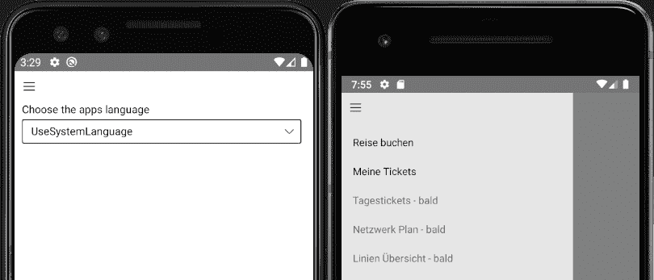
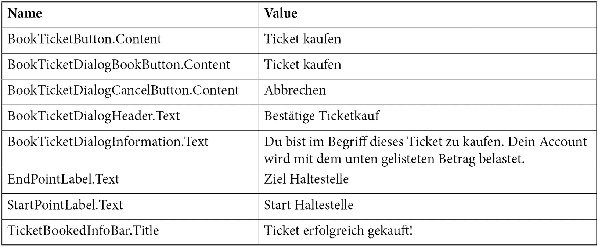
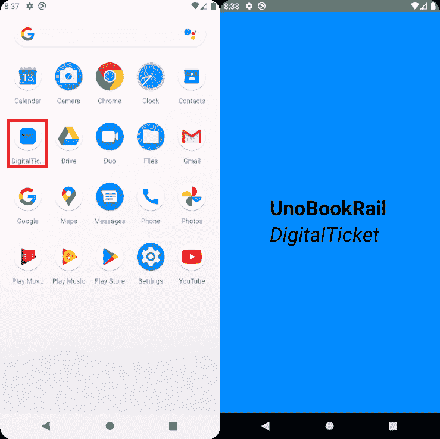

# 五、让你的应用为现实世界做好准备

在上一章中，我们介绍了使用 Uno 平台编写第一款面向 UnoBookRail 员工的移动应用。 在本章中，我们还将编写一个移动应用; 然而，我们将专注于为客户做好准备。 在本章中，您将编写一个应用，在设备上持续用户首选项和更大的数据集。 此外，您还将学习如何通过自定义应用图标使您的应用在视觉上更吸引用户，以及如何编写应用，可以使用辅助技术的人。

为此，我们将在本章中涵盖以下主题:

*   介绍了应用
*   使用**ApplicationData**API 和 SQLite 在本地持久化数据
*   为用户准备好应用
*   本地化应用
*   使用自定义的应用图标和启动屏幕
*   让所有用户都能访问你的应用

在本章结束时，你将创建一个运行在 iOS 和 Android 上的移动应用，这是为客户准备的，也是本地化和可访问的。

# 技术要求

本章假设您已经设置好了开发环境，包括安装项目模板，如[*第 1 章*](02.html# _idTextAnchor015)，*介绍 Uno 平台*所述。 本章的源代码在[https://github.com/PacktPublishing/Creating-Cross-Platform-C-Sharp-Applications-with-Uno-Platform/tree/main/Chapter05](https://github.com/PacktPublishing/Creating-Cross-Platform-C-Sharp-Applications-with-Uno-Platform/tree/main/Chapter05)。

本章中的代码使用了来自[https://github.com/PacktPublishing/Creating-Cross-Platform-C-Sharp-Applications-with-Uno-Platform/tree/main/SharedLibrary](https://github.com/PacktPublishing/Creating-Cross-Platform-C-Sharp-Applications-with-Uno-Platform/tree/main/SharedLibrary)的库。

查看下面的视频来查看代码的运行:[https://bit.ly/3AywuqQ](https://bit.ly/3AywuqQ)

# 应用介绍

在本章中，我们将构建 UnoBookRail DigitalTicket 应用，这是一个针对 UnoBookRail 希望使用 UnoBookRail 从 A 点到达 B 点的客户的应用。 虽然这个应用的真实版本会有很多功能，但在本章中，我们将只开发以下功能:

*   预订 UnoBookRail 网络两个站点之间的车票
*   查看所有预订的门票以及门票的二维码
*   应用本地化，让用户选择应用使用的语言

作为这一目标的一部分，我们也将确保我们的应用具有可访问性，并允许更多不同能力水平的人使用我们的应用。让我们从现在开始创建应用并添加第一个内容。

## 创建应用

首先，我们需要为我们的应用设置解决方案:

1.  首先使用**Multi-Platform app (Uno Platform)****模板创建一个新的 app。**
***   命名项目**DigitalTicket**。 当然，您可以使用不同的名称; 然而，在本章中，我们将假设应用名为 DigitalTicket，并使用各自的名称空间。*   除**Android**、**iOS**和**UWP**外，删除所有平台头。 请注意，我们还删除了 WASM 头，即使在 web 上提供这个功能可能会有好处。 虽然 WASM 在移动设备上运行得相当好，但它并不理想，为了简单起见，我们将继续不使用 WASM 版本的应用。*   将 UnoBookRail 共享库添加到解决方案中，因为我们稍后将需要它的功能。 为此，右键单击解决方案文件，选择**Add**|**Existing Project…**，导航到**UnoBookRail.Common.csproj**文件，然后单击**Open**。*   在每个头项目中引用共享库项目。 要做到这一点，右键单击头部项目，选择**Add**|**Reference…**|**Projects**，勾选**UnoBookRail。 常见**，点击**OK**。 因为我们需要在每个头中引用库，所以对每个头重复这个过程，即 Android、iOS 和 UWP。**

 **因为我们的应用也将遵循**Model-View-Viewmodel**(**MVVM)模式,我们想避免写样板代码,我们还将使用**Microsoft.Toolkit.MVVM**包,您还需要添加一个引用:**

1.  右键单击解决方案视图中的解决方案节点，选择“**Manage NuGet Packages for solution…**”。
2.  搜索**Microsoft.Toolkit.MVVM**，选择**NuGet**包。
3.  在项目列表中选择 Android, iOS 和 UWP 头，然后点击**安装**。

与前一章类似，我们也需要修改我们的应用，为相机缺口留出空间，以避免我们的应用的内容被遮挡:

1.  为此，将以下名称空间添加到**MainPage。 xaml**file:**xmlns:toolkit="using:Uno.UI. "** 。
2.  在此之后，添加**工具箱:VisibleBoundsPadding。 PaddingMask="All"**到我们的**MainPage 内的网格。 xaml**文件。

## 创建主导航和预订流程

由于我们的应用将包含不同的功能，我们将把应用的功能划分到不同的页面中，以便进行导航。 在**MainPage**内部，我们将有我们的导航和相关代码:

1.  首先，通过右键单击**DigitalTicket 创建一个视图文件夹。 共享**，点击**添加**|**新建文件夹**，命名为**视图**。
2.  现在,添加以下三页**视图中右键单击文件夹,文件夹点击**添加**|**新项目…**,选择**空白页**:【显示】JourneyBookingPage。 xaml**，**OwnedTicketsPage。 xaml**和**SettingsPage。 xaml**。
3.  Since we will need it later, create a **Utils** folder and add a **LocalizedResources** class to it with the following code:

    ```cs
    public static class LocalizedResources
    {
        public static string GetString(string key) {
            return key;
        }
    }
    ```

    目前，这个类只返回字符串，这样我们就可以引用这个类，而不必稍后更新代码。 但是，在本章的后面，我们将更新实现，以返回所提供的键的本地化版本。

4.  之后，在您的共享项目中创建一个**ViewModels**文件夹，并创建一个**NavigationViewModel**类。
5.  Add the following to your **NavigationViewModel** class:

    ```cs
    using DigitalTicket.Views;
    using Microsoft.Toolkit.Mvvm.ComponentModel;
    using Microsoft.UI.Xaml.Controls;
    using System;
    namespace DigitalTicket.ViewModels
    {
        public class NavigationViewModel : 
            ObservableObject
        {
            private Type pageType;
            public Type PageType
            {
                get
                {
                    return pageType;
                }
                set
                {
                    SetProperty(ref pageType, value);
                }
            }
            public void NavigationView_SelectionChanged(
              NavigationView navigationView, 
                NavigationViewSelectionChangedEventArgs
                  args)
            {
                if (args.IsSettingsSelected)
                {
                    PageType = typeof(SettingsPage);
                }
                else
                {
                    switch ((args.SelectedItem as 
                       NavigationViewItem).Tag.ToString())
                    {
                        case "JourneyPlanner":
                            PageType = 
                              typeof(JourneyBookingPage);
                            break;
                        case "OwnedTickets":
                            PageType = 
                              typeof(OwnedTicketsPage);
                            break;
                    }
                }
            }
        }
    }
    ```

    这段代码将暴露应该导航到的页面**MainPage**的类型，并提供一个选择更改的侦听器，以便在应用的导航选择更改时更新该侦听器。 要确定正确的页面类型，我们将使用所选项目的**标签**属性。

6.  Now, replace the content of **MainPage** with this:

    ```cs
        ...
        xmlns:muxc="using:Microsoft.UI.Xaml.Controls">
        <Grid toolkit:VisibleBoundsPadding.PaddingMask=
            "All">
            <muxc:NavigationView x:Name="AppNavigation"
                PaneDisplayMode="LeftMinimal"             
                IsBackButtonVisible="Collapsed" 
                Background="{ThemeResource 
                    ApplicationPageBackgroundThemeBrush}"
                SelectionChanged="{x:Bind 
                    navigationVM.NavigationView_
                         SelectionChanged, Mode=OneTime}">
                <muxc:NavigationView.MenuItems>
                    <muxc:NavigationViewItem 
                        x:Name="JourneyBookingItem" 
                        Content="Journey Booking"
                        Tag="JourneyPlanner"/>
                    <muxc:NavigationViewItem 
                        Content="Owned tickets"
                        Tag="OwnedTickets"/>
                    <muxc:NavigationViewItem Content="All 
                        day tickets - soon" 
                        Tag="AllDayTickets" 
                        IsEnabled="False"/>
                    <muxc:NavigationViewItem 
                        Content="Network plan - soon" 
                        IsEnabled="False"/>
                    <muxc:NavigationViewItem 
                        Content="Line overview - soon"
                        IsEnabled="False"/>
                </muxc:NavigationView.MenuItems>
                <Frame x:Name="ContentFrame" 
                    Padding="0,40,0,0"/>
                 </muxc:NavigationView>
        </Grid>
    ```

    这是我们应用的主导航。我们为此使用了**NavigationView**控件，这让我们可以轻松地使用一个汉堡按钮打开一个侧窗格。 在其中，我们提供了不同的导航选项，并设置了**NavigationViewModel**使用的**标签**属性。 由于在本章中我们只允许旅程预订和已拥有的机票列表，所以我们暂时禁用其他选项。

7.  Replace your **MainPage** class with the following:

    ```cs
    using DigitalTicket.ViewModels;
    using DigitalTicket.Views;
    using System;
    using Windows.UI.Xaml.Controls;
    using Windows.UI.Xaml.Navigation;
    namespace DigitalTicket
    {
        public sealed partial class MainPage : Page
        {
            public NavigationViewModel navigationVM = new 
                NavigationViewModel();
            public MainPage()
            {
                InitializeComponent();
                if (navigationVM.PageType is null)
                {
                    AppNavigation.SelectedItem = 
                        JourneyBookingItem;
                    navigationVM.PageType = 
                        typeof(JourneyBookingPage);
                    navigationVM.PageTypeChanged += 
                        NavigationVM_PageTypeChanged;
                }
            }
            protected override void OnNavigatedTo(
                NavigationEventArgs e)
            {
                base.OnNavigatedTo(e);
                if (e.Parameter is Type navigateToType)
                {
                    if (navigateToType == 
                        typeof(SettingsPage))
                    {
                        AppNavigation.SelectedItem = 
                            AppNavigation.SettingsItem;
                    }
                    navigationVM.PageType = 
                        navigateToType;
                    ContentFrame.Navigate(navigateToType);
                }
            }
            private void NavigationVM_PageTypeChanged(
               object sender, EventArgs e)
            {
                ContentFrame.Navigate(
                    navigationVM.PageType);
            }
        }
    }
    ```

    使用，**MainPage**将在创建后创建必要的视图模型，并基于该模型更新显示的内容。 **MainPage**还侦听**OnNavigatedTo**事件，根据传递给它的参数更新显示的项目。 最后，我们还侦听**NavigationViewModels**属性更改事件。

请注意，我们重写了**OnNavigatedTo**函数，以便能够导航到**MainPage**和**MainPage**中的特定页面。 虽然我们现在不需要这个，但我们将在以后使用它。 让我们继续填充旅行预订页面的一些内容:

1.  在**ViewModels**文件夹中创建**trainbookingoption**类。
2.  Add the following code to the **JourneyBookingOption** class:

    ```cs
    using DigitalTicket.Utils;
    using UnoBookRail.Common.Tickets;
    namespace DigitalTicket.ViewModels
    {
        public class JourneyBookingOption
        {
            public readonly string Title;
            public readonly string Price;
            public readonly PricingOption Option;
            public JourneyBookingOption(PricingOption 
                option)
            {
                Title = LocalizedResources.GetString(
                  option.OptionType.ToString() + "Label");
                Price = option.Price;
                Option = option;
            }
        }
    }
    ```

    因为这是一个用于显示选项的数据对象，所以它只包含属性。 因为标题将显示在应用内部，并且需要本地化，所以我们使用**LocalizedResources。 函数来确定正确的值。**

3.  现在创建**JourneyBookingViewModel 类内的**视图模型**文件夹,添加代码出现在 GitHub (https://github.com/PacktPublishing/Creating-Cross-Platform-C-Sharp-Applications-with-Uno-Platform/blob/main/Chapter05/DigitalTicket.Shared/ViewModels/JourneyBookingViewModel.cs)。 注意有几行注释掉了，这是因为我们以后还需要这些行; 然而，现在我们还没有添加必要的代码。**
4.  更新**旅程预订页。xaml.cs**和**旅程预订页。 xaml**，如 GitHub 上所示。
5.  将下面的条目复制到**字符串中。 在**Strings/en**文件夹中重新刷新**文件。 注意，您不必逐字复制**Comments**列，因为它只是为其他两个列提供指导和上下文:


正如您可能注意到的，一些控件设置了**x:Uid**属性，这就是为什么**string 中的条目。 需要 resw**文件。 我们将在*本地化应用*部分介绍这些内容的工作原理; 现在，我们只将代码和相应的条目添加到资源文件中。 现在，如果你启动应用，你应该会看到如图*所示的内容:*


图 5.1 - Android 上的旅程预订页面

现在您的用户可以配置他们的旅程、选择车票并预订车票，尽管使用的车票名称并不理想。 我们将在*本地化你的应用*部分修复这个问题。 为简单起见，我们将不处理实际的支付，并假设支付信息与用户的帐户相关联。

在本节中，我们添加了应用的初始代码和导航。我们还添加了旅程预订页面，尽管它目前并没有实际订票，我们将在稍后更改。 在下一节中，我们将介绍如何使用两种不同的方法——**ApplicationData**API 和 SQLite——在用户的设备上本地持久化数据。

# 使用 ApplicationData API 和 SQLite 本地持久化数据

而在很多情况下可以从互联网上获取数据,正如我们所看到的在[*第四章*](06.html# _idTextAnchor064),*动员你的应用,往往需要在用户的设备上保存数据。 这可能是在没有互联网连接的情况下需要可用的数据，或者是特定于设备的数据，如设置。 我们将从使用**ApplicationData**API 持久化小块数据开始。*

## 使用 ApplicationData API 存储数据

自我们将本地化应用,我们也想给用户可能选择的语言应用。为此,首先创建一个模型**文件夹里面我们共同的项目,并添加一个**SettingsStore【5】班。 现在，将以下代码添加到**SettingsStore**类:****

 **```cs
using Windows.Storage;
public static class SettingsStore
{
    private const string AppLanguageKey = 
        "Settings.AppLanguage";
    public static void StoreAppLanguageOption(string 
         appTheme)
    {
        ApplicationData.Current.LocalSettings.Values[
            AppLanguageKey] = appTheme.ToString();
    }
    public static string GetAppLanguageOption()
    {
        if (ApplicationData.Current.LocalSettings.Values.
            Keys.Contains(AppLanguageKey))
        {
            return ApplicationData.Current.LocalSettings.
                Values[AppLanguageKey].ToString();
        }
        return "SystemDefault";
    }
}
```

为了访问应用的默认本地应用存储，我们使用**ApplicationData.Current.LocalSettings**对象。 **ApplicationData**API 还允许您访问不同的数据存储方式，例如，您可以使用**ApplicationData. current . localfolder**来访问应用的本地文件夹。 在我们的例子中，我们将使用**ApplicationData.Current.LocalSettings**来持久化数据。 **LocalSettings**对象是一个**ApplicationDataContainer**对象，您可以像使用字典一样使用它。 但是请注意，**LocalSettings**对象只支持简单的数据类型，比如字符串和数字。 现在我们已经添加了一种方法来存储应用的显示语言，我们需要让用户改变语言:

1.  首先，在**ViewModels**文件夹中创建一个名为**SettingsViewModel**的新类。 您可以在这里找到该类的代码:[https://github.com/PacktPublishing/Creating-Cross-Platform-C-Sharp-Applications-with-Uno-Platform/blob/main/Chapter05/DigitalTicket.Shared/ViewModels/SettingsViewModel.cs](https://github.com/PacktPublishing/Creating-Cross-Platform-C-Sharp-Applications-with-Uno-Platform/blob/main/Chapter05/DigitalTicket.Shared/ViewModels/SettingsViewModel.cs)。
2.  现在，我们更新我们的设置页面以包含 UI 来更改应用的语言。 要实现，请替换**SettingsPage 中的**Grid**元素。 xaml**with:

    ```cs
    <StackPanel Padding="10,0,10,10">
        <ComboBox x:Name="LanguagesComboBox"
            Header="Choose the app's language"
            SelectedIndex="{x:Bind 
                settingsVM.SelectedLanguageIndex,
                    Mode=TwoWay}"/>
    </StackPanel>
    ```

3.  此外，我们还需要更新**SettingsPage.xaml.cs**。 请注意,我们将设置**ItemsSource****下拉列表框的后台代码,确保**ItemsSource【显示】**下拉列表框后将**创建并准备好,这样**【病人】下拉列表框将更新正确。 为此，添加以下代码:

    ```cs
    using DigitalTicket.ViewModels;
    ...
    private SettingsViewModel settingsVM = new SettingsViewModel();
    public SettingsPage()
    {
        InitializeComponent();
        LanguagesComboBox.ItemsSource = 
            settingsVM.LanguageOptions;
    }
    ```****** 
4.  最后，为了确保在应用开始时所选择的语言将被尊重，在**app .xaml.cs**的**onlauncher**功能中添加以下代码，并为**DigitalTicket 添加导入。 型号**和**数码票。 ViewModels**:

    ```cs
    ApplicationLanguages.PrimaryLanguageOverride = 
    SettingsViewModel.GetPrimaryLanguageOverrideFromLanguage(
    SettingsStore.GetAppLanguageOption());
    ```

现在和已经添加了语言选项，让我们来尝试一下。 如果您现在启动应用并使用左侧导航导航到设置页面，您应该会看到类似于图 5.2 左侧的内容。 现在,如果你选择**Deutsch**选项(德国),打开导航,您会注意到,现在第一项**旅行布臣**,如图所示右侧的【显示】图 5.2。 这是因为**SettingsViewModel**在设置**ApplicationLanguages 后会重新加载**MainPage**和所有其他页面。 PrimaryLanguageOverride**属性。 我们将在*本地化你的应用*部分更多地讨论这个属性，并更新应用，使所有当前可见的文本也基于所选语言更新:



图 5.2 -左:设置页面; 右图:切换为德语后的导航

## 使用 SQLite 存储数据

在**ApplicationData API 有利于存储小块的数据,如果你想要坚持大数据集的数据,**ApplicationData API 并不理想,因为有空间限制的条目存储使用**ApplicationData.Current.LocalSettings 对象。 也就是说，在 UWP 中，对象键的长度只能是 255 个字符，条目的大小只能是 8 千字节。 当然，这并不意味着你不能在你的应用中存储更大或更复杂的数据集。这是**SQLite**发挥作用的地方。 当然，SQLite 并不是存储数据的唯一方式; 还有很多其他的选择。 例如，您可以将数据写入文件并自己解析它们。 然而，在本章中，我们将使用 SQLite，因为它易于使用和集成。 可以使用不同的**C#**库将 SQLite 包含在应用中，并与 SQLite 数据库交互。 因为我们想在移动 Android 和 iOS 设备(和 UWP)上存储 SQLite 数据库， 我们将使用**sqlite-net-pcl**图书馆,图书馆工作在每一个平台上支持我们的应用。**sqlite-net-pcl【t16.1】包括 SQLite 的独立于平台的实现和允许我们轻易地将对象序列化为 SQLite 数据库。********

 **先添加一个引用**sqlite-net-pcl**我们的应用。要做到这一点,右键单击该解决方案在解决方案视图中,单击**管理 NuGet 包解决方案……**,并搜索**sqlite-net-pcl【5】。 因为在撰写本书时，最新的稳定版本是**1.7.335**，选择该版本，并在项目列表中选择 Android、iOS 和 UWP 头。 然后点击**安装**。 现在我们需要添加代码来创建、加载和编写 SQLite 数据库:**

1.  First of all, we need to add a class whose objects we want to persist using SQLite. For this, add a new class called **OwnedTicket** inside the **ViewModels** folder. You can find the source code for this class on GitHub here: [https://github.com/PacktPublishing/Creating-Cross-Platform-C-Sharp-Applications-with-Uno-Platform/blob/main/Chapter05/DigitalTicket.Shared/ViewModels/OwnedTicket.cs](https://github.com/PacktPublishing/Creating-Cross-Platform-C-Sharp-Applications-with-Uno-Platform/blob/main/Chapter05/DigitalTicket.Shared/ViewModels/OwnedTicket.cs).

    有两件重要的事情需要知道:

    由于每个 SQLite 表都需要一个主键，所以我们添加了**DBId**属性，并添加了 PrimaryKey 和**AutoIncrement**属性。 使用这些属性，我们让**sqlite-net-pcl**为我们管理主键，而我们不需要处理这些。

    当将对象传递给**SQLite -net-pcl**以将其持久化到 SQLite 数据库时，只持久化属性。 因为我们不想持久化**showqrcodecomcommand**(实际上也不能)，所以这只是一个字段，而不是一个属性。

2.  Now create the **OwnedTicketsRepository** class inside the **Models** folder and add the following code to it:

    ```cs
    using DigitalTicket.ViewModel;
    using SQLite;
    using System;
    using System.IO;
    using System.Threading.Tasks;
    using Windows.Storage;
    namespace DigitalTicket.Models
    {
        public class OwnedTicketsRepository
        {
            const string DBFileName = "ownedTickets.db";
            private static SQLiteAsyncConnection database;
            public async static Task InitializeDatabase()
            {
                if(database != null)
                {
                    return;
                }
                await ApplicationData.Current.LocalFolder.
                    CreateFileAsync(DBFileName, 
                    CreationCollisionOption.OpenIfExists);
                string dbPath = Path.Combine(
                    ApplicationData.Current.LocalFolder
                        .Path, DBFileName);
                database = 
                    new SQLiteAsyncConnection(dbPath);
                database.CreateTableAsync<
                    OwnedTicket>().Wait();
            }
            public static Task<int> SaveTicketAsync(
                OwnedTicket ticket)
            {
                if (ticket.DBId != 0)
                {
                    // Update an existing ticket.
                    return database.UpdateAsync(ticket);
                }
                else
                {
                    // Save a new ticket.
                    return database.InsertAsync(ticket);
                }
            }
        }
    }
    ```

    **InitializeDatabase**函数处理为我们的 SQLite 数据库创建文件并创建表(如果它不存在)，但是如果文件已经存在，也会加载现有的数据库。 在**SaveTicketsAsync**函数中，我们更新并将传递的票证保存到数据库中，或者更新数据库中已经存在的票证。

3.  Update **App.xaml.cs** to include the following code at the start of the **OnLaunched** function and change the **OnLaunched** function to be async:

    ```cs
    await OwnedTicketsRepository.InitializeDatabase();
    ```

    这将在应用启动时初始化 SQLite 连接，因为按需创建连接并不理想，尤其是在加载已拥有的票证页面时。

4.  现在更新**JourneyBookingViewModel**，将车票保存到**OwnedTicketsRepository**。 为此，删除当前创建的**BookJourney**，并使用文件顶部的语句和**旅程 bookingviewmodel**构造函数中的代码取消**注释。**

现在我们来讨论一下刚才做的步骤。 首先，我们创建了**OwnedTicket**对象，我们将把它写入 SQLite，并在下一节中从 SQLite 加载它。

然后我们添加了**OwnedTicketsRepository**，我们使用它与 SQLite 数据库交互。 在向 SQLite 数据库发出任何请求之前，我们首先需要初始化它，为此我们需要一个文件来将 SQLite 数据库写入其中。 使用下面的代码，我们确保我们想要写入数据库的文件存在:

```cs
await ApplicationData.Current.LocalFolder.CreateFileAsync(DBFileName, CreationCollisionOption.OpenIfExists);
```

之后，我们为数据库创建一个**SQLiteAsyncConnection**对象。 **SQLiteAsyncConnection**对象将处理所有与 SQLite 的通信，包括创建表、保存和加载数据。 因为我们还需要一个表来写入数据，所以我们使用**SQLiteAsyncConnection**来为**OwnedTickets**对象创建一个表，如果这个表在 SQLite 数据库中还不存在的话。 为了确保在对数据库发出任何请求之前完成这些步骤，我们在应用构造函数中调用**OwnedTicketsRepository.InitializeDatabase()**。

最后一步是更新我们的**JourneyBookingViewModel**类，以将数据持久化到 SQLite 数据库。 虽然我们只向数据库添加新的项目,我们仍然需要看是否更新现有条目或添加一个新的条目,这就是为什么**SavedTicketAsync**函数确保我们只创建项目如果没有 ID。

## 从 SQLite 加载数据

现在和我们已经讨论了如何持久化数据，当然，我们还需要加载数据; 否则，我们一开始就不需要持久化数据。 让我们通过添加用户预订的所有机票的概述来更改这一点。 由于 UnoBookRail 的客户需要在上车或检票时出示他们的车票，我们还希望能够为每张车票显示二维码。 由于我们将使用**ZXing.Net.Mobile**进行此操作，请现在将**NuGet**包添加到您的解决方案中，即 Android、iOS 和 UWP heads。 请注意，在撰写本文时，版本**2.4.1**是最新的稳定版本，我们将在本章中使用该版本。

在显示所有票证之前，首先需要从 SQLite 数据库加载它们。 要实现，需要在**OwnedTicketsRepository**类中添加以下方法:

```cs
using System.Collections.Generic;
...
static Task<List<OwnedTicket>> LoadTicketsAsync()
{
    //Get all tickets.
    return database.Table<OwnedTicket>().ToListAsync();
}
```

多亏了**sqlite-net-pcl**，这就是我们需要做的一切。 库为我们处理其余的工作，包括读取表并将行转换为**OwnedTicket**对象。

现在我们也可以加载票证了，我们可以更新在本章开始时创建的**OwnedTicketsPage**类，以显示用户预订的所有票证。 在我们的应用中，这意味着我们将只显示已在该设备上预订的票。 在真实的应用中，我们还可以从远程服务器访问票据并将其下载到设备上; 然而，我们不会这样做，因为它超出了本章的范围:

1.  在更新拥有的票证页面之前，首先在**ViewModels**文件夹中添加**OwnedTicketsViewModel**类。 类的源代码可以在这里找到:[https://github.com/PacktPublishing/Creating-Cross-Platform-C-Sharp-Applications-with-Uno-Platform/blob/main/Chapter05/DigitalTicket.Shared/ViewModels/OwnedTicketsViewModel.cs](https://github.com/PacktPublishing/Creating-Cross-Platform-C-Sharp-Applications-with-Uno-Platform/blob/main/Chapter05/DigitalTicket.Shared/ViewModels/OwnedTicketsViewModel.cs)。
2.  现在，更新**OwnedTicketsPage。** 和**ownedticketspagt .xaml.cs**。 你可以在 GitHub 上找到这两个文件的源代码:[https://github.com/PacktPublishing/Creating-Cross-Platform-C-Sharp-Applications-with-Uno-Platform/tree/main/Chapter05/DigitalTicket.Shared/Views](https://github.com/PacktPublishing/Creating-Cross-Platform-C-Sharp-Applications-with-Uno-Platform/tree/main/Chapter05/DigitalTicket.Shared/Views)。

现在，如果你启动应用并导航到拥有的门票页面，你应该会看到一个空页面。 如果您已经预订了机票，您应该看到类似于图 5.3 左侧的内容。 如果你点击票下面的小的、宽的、灰色的盒子，你应该看到类似于*图 5.3*右边的东西:


图 5.3 -左:拥有单张票的票列表; 右:已拥有机票及已预订机票的二维码

当然，这还不是最终 UI; 用户应该看到提示他们还没有预订机票的文本，而不是一个空白屏幕。 但是现在，由于按钮使用的是**x:Uid**而不是设置**text**或**Content**属性，所以文本可能会丢失，而且按钮也没有标签。 在下一节中，我们将查看**x:Uid**是什么，并更新我们的应用，以便所有标签都被正确显示。

# 为用户准备好应用

在这个部分，我们将更新我们的应用，以便为我们的客户做好准备，包括本地化支持，以使我们的客户更容易使用该应用。 在添加本地化支持后，我们将更新应用的图标和启动画面，以便用户更容易识别。

## 应用本土化

如果你正在开发一款面向用户的应用，那么能够为用户提供母语翻译就非常重要，特别是对于那些面向不同国家用户的应用。 在上一节中，我们已经添加了**x:Uid**属性，并向**string 添加了条目。 resw**文件; 然而，还有其他本地化资源的方法，我们将在后面介绍。 我们将用**x:Uid**开始本地化文本。

### 使用 x:Uid 本地化你的 UI

使用**x:Uid**和资源文件(**.resw**文件)是本地化应用最简单的方法，特别是添加新的翻译，例如，为一种新的语言，是非常容易的。 但是你如何使用**x:Uid**和**.resw**文件本地化你的应用?

**x:Uid**属性可以添加到 XAML 代码的任何元素中。 除了为您想要提供翻译的控件设置**x:Uid**属性外，您还需要添加这些翻译。 这时就要用到**.resw**文件了。 简而言之，**resw**文件是包含必要条目的 XML 文档。 不过，考虑它们的最简单的方法是将它们看作具有三个属性的条目列表，通常用表表示。 这些属性(或列)如下:

*   **Name**:用于查找资源的名称。 此路径还将用于确定要设置哪个控件上的哪个属性。
*   **值**:正在设置的文本或在查找该资源时返回的文本。
*   **Comment**:您可以使用该列提供注释来解释行。 这在将应用翻译成一种新的语言时特别有用，因为你可以使用评论找出最好的翻译。 参见*图 5.4*中的**Comment**栏了解如何使用它们。

当在 Visual Studio 中打开**.resw**文件时，其表现将如图*所示:*


图 5.4 - Visual Studio 中.resw 文件的视图

当将**x:Uid**属性与**.resw**文件结合使用时，需要注意如何为资源写入名称条目。 名称条目需要以控件的**x:Uid**值开始，然后是一个点(**)。** )和应该设置的属性的名称。 因此，在前面的示例中，如果我们想本地化**TextBlock**元素的文本，我们将添加一个名称值为**ButtonTextBlock 的条目。 因为我们想设置**TextBlock**元素的**Text**属性。**

你可能会问:“但本土化是如何运作的?” 毕竟，我们只添加了一个条目; 它怎么知道该选哪种语言呢? 这就是为什么放置**.resw**文件的文件夹很重要。 在项目中，需要有一个**Strings**文件夹。 在该文件夹中，对于你想要本地化应用的每种语言，你都需要有一个带有该语言的**IETF BCP 47 标签**的文件夹。 例如,*英国英语,您将创建一个文件夹命名为【显示】en,*德国(德国)*,您将创建一个文件夹叫【病人】de-DE。 在为您想要支持的每种语言创建的文件夹中，您需要放置**.resw**文件，以便本地化能够正常工作。 注意，如果某一语言不可用，资源查找将尝试寻找下一个最佳匹配。 你可以在这里了解更多关于这个过程，因为你的 Uno 平台应用将在每个平台上表现相同:[https://docs.microsoft.com/windows/uwp/app-resources/how-rms-matches-lang-tags](https://docs.microsoft.com/windows/uwp/app-resources/how-rms-matches-lang-tags)。*

重要提示

给这些文件夹命名时要小心。 资源查找将基于文件夹的名称进行。 如果文件夹的名称有错误或不遵守 IETF BCP 47 标准,资源查找可能会失败,您的用户将迎接失踪标签和文本或语言的资源查找将退回到语言文字被翻译。

我们已经有了一个英文文本资源文件夹; 然而，我们也想支持德语翻译。 为此，在**Strings**文件夹中创建一个名为**de-DE**的新文件夹。 现在，添加一个名为**Resources 的新**.resw**文件。 resw**并添加以下条目:



如果您现在启动该应用并将其语言转换为德语，您将看到旅程预订页面现在已本地化。 如果你的设备语言已经被设置为德语，而不是以英语显示页面，它现在应该以德语显示，即使你现在不切换到德语选项。

### 从代码后访问资源

使用**x:Uid**并不是本地化应用的唯一方法; 现在我们将了解如何从代码后访问资源。 这是很有用的，例如，当你想要本地化集合中的项目时，例如应用中拥有的票据列表。要访问字符串资源，你可以使用**ResourceLoader**类。 我们在本章的开始添加了**LocalizedResources**类; 然而，到目前为止，它还没有访问任何资源。 现在通过添加以下导入并用以下代码替换**GetString**函数来更新**LocalizedResources**:

```cs
using Windows.ApplicationModel.Resources;
...
private static ResourceLoader cachedResourceLoader;
public static string GetString(string name)
{
    if (cachedResourceLoader == null)
    {
        cachedResourceLoader = 
            ResourceLoader.GetForViewIndependentUse();
    }
    if (cachedResourceLoader != null)
    {
        return cachedResourceLoader.GetString(name);
    }
    return null;
}
```

由于我们将经常使用加载的资源，我们缓存该值以避免调用**GetForViewIndependentUse**，因为它的开销很大。

现在我们已经介绍了**x:Uid**的工作原理，以及如何从后台代码访问本地化的资源，让我们更新应用的其余部分以实现本地化。 首先将必要的条目添加到**.resw**文件中。 下面是**MainPage 所需的条目表。 xaml**文件及其英文和德文条目:


现在，在**MainPage 中替换**NavigationViewItems**属性。 xaml**文件如下:

```cs
<muxc:NavigationViewItem x:Name="JourneyBookingItem" x:Uid="JourneyBookingItem" Tag="JourneyPlanner"/>
<muxc:NavigationViewItem x:Uid="OwnedTicketsItem" Tag="OwnedTickets"/>
<muxc:NavigationViewItem x:Uid="AllDayTicketsItem" Tag="AllDayTickets" IsEnabled="False"/>
<muxc:NavigationViewItem x:Uid="NetworkPlanItem" IsEnabled="False"/>
<muxc:NavigationViewItem x:Uid="LineOverViewItemItem" IsEnabled="False"/>
```

要更新应用的其余部分，请查看 GitHub 上的源代码。 您还可以找到更新的**资源。 在那里重新创建英语和德语的**文件。 注意，我们选择不本地化站点名称，因为本地化街道和地点名称可能会导致客户混淆。

重要提示

您还可以本地化其他资源，如图像或音频文件。 为此，您需要将它们放入命名正确的文件夹中。 举个例子,如果你想定位图像称为**Recipe.png**,你需要把语言的本地化版本的图像在**资产/(语言标识符)**文件夹,在**语言标识符是 IETF BCP 47 语言形象的标识符。 您可以在这里了解更多关于定制和本地化资源的信息:[https://docs.microsoft.com/windows/uwp/app-resources/images-tailored-for-scale-theme-contrast](https://docs.microsoft.com/windows/uwp/app-resources/images-tailored-for-scale-theme-contrast)。**

 **在本节中，我们介绍了如何使用**x:Uid**和资源文件本地化您的应用。 随着应用变得越来越大，提供的语言也越来越多，使用多语言应用工具包可能会有所帮助。 它允许您更容易地检查哪些语言键没有被翻译并集成到 Visual Studio 中。 你可以在这里了解更多:[https://developer.microsoft.com/en-us/windows/downloads/multilingual-app-toolkit/](https://developer.microsoft.com/en-us/windows/downloads/multilingual-app-toolkit/)。

## 自定义应用的外观

当向商店发布应用时，你希望你的应用能够被用户识别，并传达你的品牌。 然而，到目前为止，我们开发的所有应用都使用标准的 Uno 平台应用图标。 幸运的是，Uno 平台允许我们改变应用的图标，并为我们的应用设置启动图像。

### 更新应用的图标

让你的应用能够被用户识别的最重要的事情之一就是为你的应用设置一个图标。更新应用的图标很简单。 你可以在这里找到我们将使用的图像:[https://github.com/PacktPublishing/Creating-Cross-Platform-C-Sharp-Applications-with-Uno-Platform/blob/main/Chapter05/DigitalTicket.Shared/img/AppIcon.png](https://github.com/PacktPublishing/Creating-Cross-Platform-C-Sharp-Applications-with-Uno-Platform/blob/main/Chapter05/DigitalTicket.Shared/img/AppIcon.png)。

#### 更新 Android 应用的图标

要更新 Android 应用的图标，你只需要将 Android 项目可绘制文件夹中的**icon .png**文件替换为你想要的应用 logo。 注意，您还需要在项目属性中选择正确的图像。 为此，双击 Android 项目中的**Properties**节点。 在 Android Manifest 部分，从**应用图标**下拉菜单中，选择你想要的图标; 例如，如果您将图标命名为**Appicon**，您将选择**@drawable/Appicon**选项。 或者，您也可以更新**属性**节点内**AndroidManifest.xml**文件中的**android:图标**项。

#### 更新 iOS 应用的图标

更新 iOS 应用的图标需要更多的工作。 对于 iOS 应用，你将需要根据应用安装的设备的不同大小的应用图标。 要查看维度列表并更新 iOS 应用的应用图标，只需展开 iOS 项目的**Assets Catalog**节点，并双击其中的**Media**条目。 在**AppIcons**选项卡中，您可以为不同的设备、类别和尺寸选择图像。 它不需要为每个维度提供图像; 然而，你应该为每个类别提供至少一个图标。

#### 更新 UWP 应用的图标

更新 UWP 头部的应用图标最简单的方法是使用**包的**Visual Assets**标签。 appxmanifest**文件。 为此，双击**Package。 appxmanifest**，然后在**Visual Assets**选项卡中选择**App 图标**。 要更新应用的图标，选择源图像，选择目标文件夹，点击**生成**。 这将生成不同大小的应用图标，因此，更新您的应用的图标到指定的图像。

#### 更新其他项目的图标

虽然我们的应用不会在其他平台上可用，我们删除了各自平台的头像，你可能想要在其他项目中更新其他平台的图标:

*   **macOS**:替换**img/xcimg/AppIcon 中的图像。** 文件夹。 如果您重命名图像，请确保也更新了**内容。 json**文件。
*   **skibased projects**:在 Visual Studio 中右键单击项目，选择**Properties**。 在**应用**选项卡中，您可以使用**资源**部分中的**浏览**按钮选择一个新图标。
*   **WASM**:要更新浏览器中显示的图标，在项目的**Assets**文件夹中添加图标为**favicon.ico**。

### 定制您的应用的启动画面

更新图标并不是让应用更具辨识度的唯一方法。 除了应用的图标，你还可以自定义应用的启动画面。注意，在撰写本文时，只有 Android、iOS、UWP 和 WASM 应用支持设置启动画面。 和图标一样，你可以在 GitHub 上找到图片资源。

#### 更新 Android 启动画面

要在 Android 应用中添加闪屏，首先需要添加闪屏图像。 在本例中，我们将其命名为**SplashScreen.png**。 在此之后，将以下条目添加到**Resource/values/Styles.xml**文件中:

```cs
<item name="android:windowBackground">@drawable/splash</item>
```

然后，您需要在**资源/绘制**中添加**splash.xml**文件，并添加以下代码:

```cs
<?xml version="1.0" encoding="utf-8"?>
    <layer-list xmlns:android=
        "http://schemas.android.com/apk/res/android">
    <item>
        <!-- background color -->
        <color android:color="# 008cff"/>
    </item>
    <item>
    <!-- splash image -->
        <bitmap android:src="@drawable/splashscreen"
                android:tileMode="disabled"
                android:gravity="center" />
    </item>
</layer-list>
```

#### 更新 iOS 应用的启动画面

与任何 iOS 应用一样，启动屏幕也需要是一个故事板。 Uno 平台很容易让单个图像显示为一个启动屏幕。 所有这些简单的步骤:

1.  在解决方案资源管理器中，选择 iOS 项目并按**显示所有文件**按钮。
2.  You'll now be able to see a file called **LaunchScreeen.storyboard**. Right-click on this and select **Include In Project**. This will now automatically be used when you launch the app.

    如果你运行应用，你会看到 Uno 平台的标志，当你启动应用。你可以通过替换图像轻松地改变这一点。

3.  在**资源**文件夹中，您将发现名为**SplashScreen@2x.png**和**SplashScreen@3x.png**的文件。 这些是故事板使用的文件。 用你想要的图像替换它们的内容。
4.  要改变背景的颜色，你可以在 Xcode Interface Builder 中打开故事板并改变颜色。 或者,您可以在 XML 编辑器中打开故事板文件并更改**红**、**绿色**,和**蓝色属性的颜色**写成 backgroundColor**键。**

您可以使用故事板文件，将任何内容作为启动屏幕。 要做到这一点，你需要使用 Xcode Interface Builder。 在版本**16.9**之前，Visual Studio 包含一个 iOS 故事板编辑器，但现在已经不再可用。 现在要编辑一个故事板，你需要在 Mac 的 Visual Studio 中打开项目，右键单击文件，选择**open With**|**Xcode interface Builder**。

#### 更新 UWP 应用的启动画面

与更新 UWP 应用的应用图标类似，使用**包。 appxmanifest**文件和**Visual Assets**标签。 选择**启动屏幕**选项卡，并选择要用于启动屏幕的图像。 在此之后，取消选中**应用推荐填充**，并将**启动画面背景**设置为您想要使用的背景颜色。 在我们的例子中，这将是**# 008CFF**。 现在，点击**Generate**来为 UWP 应用生成启动画面图像。

#### 更新 WASM 应用的启动画面

要更新 WASM 头部的启动画面，请在 WASM 项目的**Assets**文件夹中添加新的启动画面图像。 在此之后，您只需要更新**WasmScripts**文件夹中的**AppManifest.js**文件来引用该图像，并在必要时更新启动画面的颜色。

如果您成功地按照我们的应用的步骤进行操作，您应该可以在 Android 应用列表中看到该应用，如图*图 5.5*左侧所示。 一旦启动应用，在显示旅行预订页面之前，您的应用应该如图*图 5.5*的右侧所示。 注意，这里提供的图标和启动屏幕只是示例。 在真实的应用中，你应该确保你的应用图标看起来很好，即使是这么小:



图 5.5 -左:应用列表中的 DigitalTicket; 右:DigitalTicket 的启动画面

## 确保每个人都可以使用你的应用

为了确保所有人都能使用你的应用，你需要让它具有可访问性。 易用性是开发应用的关键。 各种能力水平的人都会使用你的应用; 如果你的应用无法被访问，你的用户的生活将变得更加艰难，甚至可能无法使用你的应用。

当提到易用性时，大多数人想到的是通过为屏幕阅读器添加标签和 alt 文本，让你的应用能够面向盲人。 然而，可访问性的意义远不止于此。 例如，视力低但没有失明的人可能不会使用屏幕阅读器，而是选择使用高对比度的主题，使应用更容易使用，或者可能选择增大字体大小，使文本更容易阅读。 提供黑暗主题通常被视为纯粹的美学元素; 然而，关于可访问性这一点也很重要。 有些人可能能够更好地阅读文本，而有某些残疾的人将难以使用你的应用。

如果你已经熟悉在 UWP 中可用的 api 来制作你的应用，有一些事情是不同的，让你的 Uno 平台可访问。 因为你的应用将运行在不同的平台上，这些平台都有不同的 api 来提供可访问的应用，所以 UnoPlatform 只有与可访问性相关的可用属性的子集。 在撰写本文时，仅支持以下属性并在每个平台上工作:

*   **自动化属性。 AutomationId**:您可以设置此属性，以便使用辅助技术更容易地导航控件。
*   **自动化属性。 名称**:辅助技术将使用此属性向用户宣布控件。
*   **自动化属性。 LabeledBy**:当设置此属性时，您正在设置此属性的控件将使用此属性指定的控件来宣布。
*   **自动化属性。 AccessibilityView**:使用此属性，您可以指示不应通过辅助技术将控件读出给用户，或者您希望包含通常不会被通知的控件。

除了前面列出的属性，Uno 平台还支持每个平台上的高对比度主题。 由于我们使用 Uno 平台提供的标准控件,我们不需要提防这 Uno 平台已经提供了正确的高对比度寻找我们的应用。然而,如果你写你自己的控制,还应该检查你的应用的高对比度的版本以确保它是可以接受的。

重要提示

您应该始终本地化辅助技术将使用的资源。 不这样做可能会让你的应用无法访问，因为用户可能会遇到语言障碍，特别是当辅助技术希望从一种语言中读出单词并从另一种语言中找到单词时。

为了确保使用辅助技术的用户能够访问你的应用，你需要使用辅助技术测试你的应用。 在下一节中，您可以找到启动平台默认屏幕阅读器的说明。

### 在不同平台上启动屏幕阅读器

由于激活系统辅助技术的步骤因平台而异，我们将逐一介绍，从 Android 开始。

#### Android 上的反馈

启动**设置**应用，然后打开**可访问性**页面。 按**回呼**，轻按开关开启回呼。 最后，按**OK**关闭对话框。

#### 在 iOS 画外音

打开**设置**app，在**常规**下打开**可访问**选项。 然后，点击**Vision**类别中的**VoiceOver**，点击开关开启。

#### 画外音在 macOS

启动**系统首选项**和点击**可访问性**。 然后点击**Vision**类别中的**VoiceOver**。 勾选**启用 VoiceOver**使用**VoiceOver**

#### Windows 上的解说员(适用于 UWP 和 WASM)

要在 Windows 上启动**叙述者**屏幕阅读器，你只需要同时按下 Windows logo 键、*Ctrl*和*输入*即可。

### 更新我们的应用，以方便访问

在本章中，我们并没有确保我们的应用是可访问的。 虽然许多控制方式本身就具有可访问性，例如，用于宣布内容的按钮控制方式，但仍有一些控制方式需要我们改进其可访问性。 如果用户使用辅助技术，并不是所有内容都能以有意义的方式发布。 现在让我们通过更新应用的 UI 来改变这一点，设置所有必要的属性。 为此，我们将首先更新我们的旅行预订页面。

**下拉列表框控制在我们的旅程预订页面目前只会被宣布为**下拉列表框控制和辅助技术,用户不知道****下拉列表框控制实际上是对的。 因为我们已经添加了描述其用途的**TextBlock**元素，所以我们将更新它们以使用**AutomationProperties。** 属性:****

 **```cs
<TextBlock x:Name="StartPointLabel" x:Uid="StartPointLabel" FontSize="20"/>
<ComboBox ItemsSource="{x:Bind journeyBookingVM.AllStations}" x:Uid="StartPointComboBox"
    AutomationProperties.LabeledBy="{x:Bind 
 StartPointLabel}"
    SelectedItem="{x:Bind 
        journeyBookingVM.SelectedStartpoint,Mode=TwoWay}"
    HorizontalAlignment="Stretch" 
        DisplayMemberPath="Name"/>
<TextBlock x:Name="EndPointLabel" x:Uid="EndPointLabel" FontSize="20"/>
<ComboBox ItemsSource="{x:Bind journeyBookingVM.AvailableDestinations, Mode=OneWay}" x:Uid="EndPointComboBox"
    AutomationProperties.LabeledBy="{x:Bind EndPointLabel}"
    SelectedItem="{x:Bind 
        journeyBookingVM.SelectedEndpoint,Mode=TwoWay}"
    HorizontalAlignment="Stretch" 
    DisplayMemberPath="Name"/>
```

现在,当用户导航到**下拉列表框控件使用辅助技术,****下拉列表框控件将使用公布的文本**TextBlock****AutomationProperties 引用的元素。 标签:**。 由于该页面上的其他控件已经为我们处理了可访问性，所以让我们转向拥有的车票页面。**

在自有门票页面，有两个潜在的问题:

*   站名旁边的图标将作为一个空白图标宣布。
*   二维码只会以图片形式发布。

由于图标仅用于可视化表示，我们向辅助技术指出，不应该使用**AutomationProperties 来宣布图标。 属性设置为**Raw**。 如果希望包含辅助技术控件，可以将该属性设置为**Content**。**

为了确保二维码图像以一种有意义的方式发布，我们将添加一个描述性的名称。 为了简单起见，我们只宣布它是当前选中彩票的 QR。 首先，您需要更新图像元素如下:

```cs
<Image x:Name="QRCodeDisplay" x:Uid="QRCodeDisplay"
    Source="{x:Bind ownedTicketsVM.CurrentQRCode,
             Mode=OneWay}"
    Grid.Row="4" MaxWidth="300" MaxHeight="300" 
        Grid.ColumnSpan="2"/>
```

然后，在**资源中添加以下条目。 resw**文件:

**英语**:


**德语**


通过添加这些条目，我们现在为显示的二维码提供了一个描述性名称，同时还确保了该文本将被本地化。

最后，我们还需要更新设置页面。 由于它只包含单个**ComboBox**控件，该控件缺少一个名称，因此将以下条目添加到**资源中。 重启**文件:

**英语**:


**德语**


在本节中，我们简要介绍了 Uno 平台中的可访问性; 然而，也有一些限制和注意的事情，我们没有提到。 有关这些限制的更多信息，请参见官方文档:[https://platform.uno/docs/articles/features/working-with-accessibility.html](https://platform.uno/docs/articles/features/working-with-accessibility.html)。 如果你想了解更多关于可访问性的信息，你可以查看以下资源:

*   [https://docs.microsoft.com/en-us/learn/paths/accessibility-fundamentals/](https://docs.microsoft.com/en-us/learn/paths/accessibility-fundamentals/)
*   [https://developer.mozilla.org/en-US/docs/Learn/Accessibility/What_is_accessibility](https://developer.mozilla.org/en-US/docs/Learn/Accessibility/What_is_accessibility)
*   [https://developers.google.com/web/fundamentals/accessibility](https://developers.google.com/web/fundamentals/accessibility)

# 总结

在本章中，我们构建了一个面向客户的应用，可以在 iOS 和 Android 上运行。 我们介绍了如何使用 SQLite 存储数据，如何让您的应用可访问，并为客户做好准备。 作为部分内容，我们介绍了如何本地化应用，让用户选择应用的语言，以及为应用提供自定义启动画面。

在下一章中，我们将为 UnoBookRail 编写一个信息仪表板。 这款应用将以 UnoBookRail 的员工为目标用户，可在桌面和网络上运行。**********