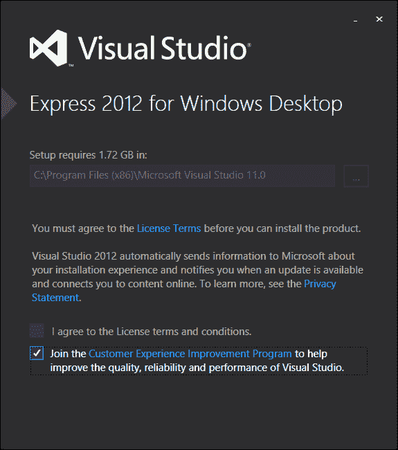
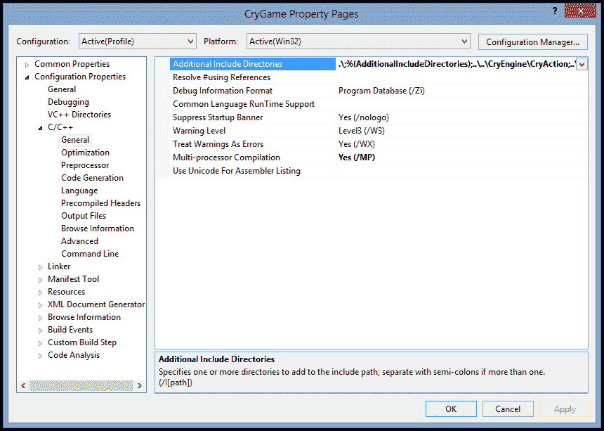
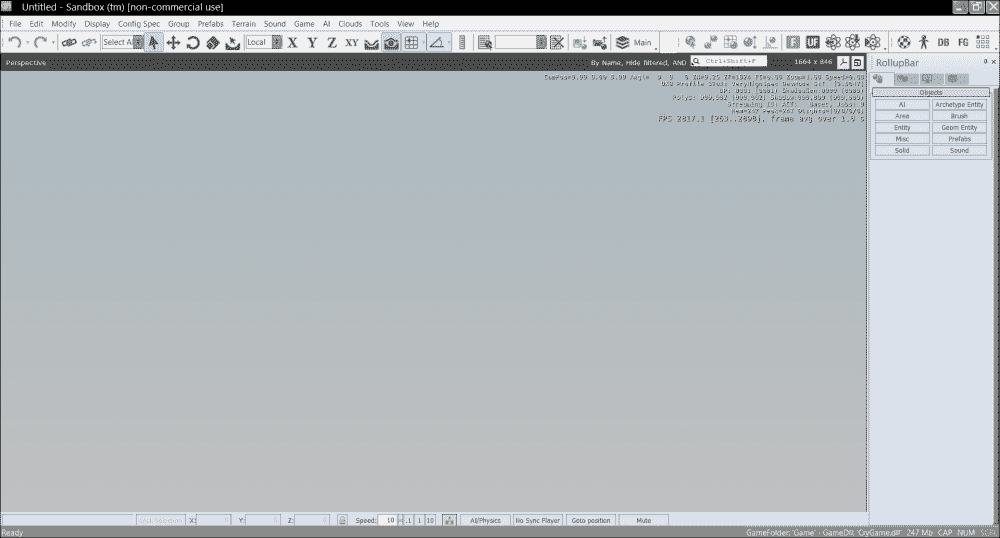
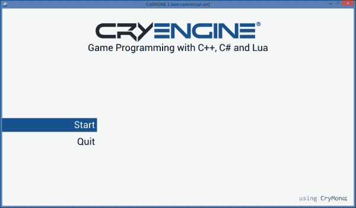
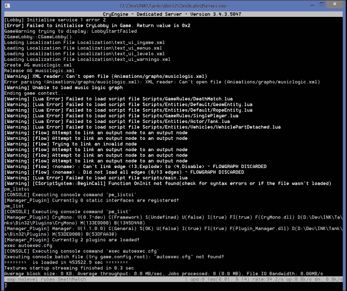

# 第一章。 介绍和设置

CryENGINE 被认为是最具可扩展性的引擎之一，因为它能够描绘各种各样令人印象深刻的视觉效果和游戏玩法。 这使得它成为程序员手中无价的工具，唯一的限制是一个人的创造力。

在本章中，我们将涵盖以下主题:

*   安装 Visual Studio Express 2012 for Windows Desktop
*   下载 CryENGINE 示例安装或使用自定义引擎安装
*   CryENGINE 官方开发门户[http://www.crydev.net](http://www.crydev.net)注册账号
*   编译一个精简的 CryGame 库
*   附加和使用调试器

# 安装 Visual Studio Express 2012

为了编译游戏代码，你需要一个 Visual Studio 的副本。 在这个演示中，我们将使用 Visual Studio Express 2012 For Windows Desktop。

### 注意事项

如果你已经安装了 Visual Studio 2012，你可以跳过这个步骤。



安装Visual Studio 的步骤如下:

1.  访问[http://www.microsoft.com/visualstudio/](http://www.microsoft.com/visualstudio/)下载 Visual Studio Express 2012 for Windows Desktop。
2.  下载可执行文件后，安装应用程序，并在重新启动计算机后进行下一步。

# 选择 CryENGINE 安装类型

现在我们已经安装了 Visual Studio，我们需要下载一个 CryENGINE 版本到上进行开发。

我们为本书创建了一个简化的示例安装，推荐给刚刚开始使用该引擎的用户。 要下载它，请参见下面的*下载这本书的 CryENGINE 示例安装*部分。

如果你更愿意使用 CryENGINE 的另一个版本，比如最新的免费 SDK，请参阅本章后面的*使用自定义或更新的 CryENGINE 安装*章节。 本节将介绍如何集成 CryMono。

# 下载该书的 CryENGINE 示例安装

在本书中，我们将使用自定义 CryENGINE 示例作为学习引擎工作原理的基础。 书中的大多数练习都依赖于这个例子; 然而，您从中获得的工作知识可以应用到默认的 CryENGINE Free SDK(可在[http://www.crydev.net](http://www.crydev.net)获得)。

要下载示例安装，请遵循以下步骤:

1.  访问[https://github.com/inkdev/CryENGINE-Game-Programming-Sample](https://github.com/inkdev/CryENGINE-Game-Programming-Sample)并单击**下载 ZIP**按钮，以下载包含示例的压缩归档文件。
2.  下载后，将归档文件的内容解压缩到您选择的文件夹中。 为了便于示例，我们将把它提取到`C:\Crytek\CryENGINE-Programming-Sample`。

## 刚才发生了什么?

现在，您应该拥有我们的示例 CryENGINE 安装的副本。 现在您可以运行并查看示例内容，我们将在本书的大部分内容中使用它。

# 使用自定义的或更新的 CryENGINE 安装

本节帮助选择使用自定义或更新引擎构建的读者。 如果您不确定这个过程，我们建议阅读本章的*下载该书的 CryENGINE 示例安装*部分。

## 验证构建是否有效

在开始之前，您应该验证您的 CryENGINE 版本的功能，以便您可以使用它运行和根据本书的章节创建代码。

### 注意事项

请注意，如果您使用的是较旧或较新版本的引擎，某些章节可能会提供关于更改系统的示例和信息。 记住这一点，并参考前面提到的示例以获得最佳的学习经验。

检查这一点的一种好方法是启动编辑器和启动器应用程序，并检查引擎是否符合预期的行为。

## 集成 CryMono (c#支持)

如果你对使用 c#编写的样例代码和章节内容感兴趣，你需要将第三方 CryMono 插件集成到你的 CryENGINE 安装中。

### 注意事项

注意，CryMono 默认集成在我们专门为本书创建的示例中。

要开始集成 CryMono，请打开引擎根文件夹中的`Code`文件夹。 我们将把源文件放在这里，放在名为`CryMono/`的子文件夹中。

要下载源代码，请访问[https://github.com/inkdev/CryMono](https://github.com/inkdev/CryMono)，然后点击**下载 Zip**(或者**克隆桌面**，如果您喜欢使用 Git 版本控制客户端)。

下载后，将内容复制到前面提到的`Code/CryMono`文件夹中。 如果该文件夹不存在，请先创建它。

当文件被成功移动后，你的文件夹结构应该如下所示:


### 编译 CryMono 项目

现在我们已经有了CryMono 源代码，我们需要编译它。

首先，使用 Visual Studio 打开`Code/CryMono/Solutions/CryMono.sln`。

### 注意事项

确保使用的是`CryMono.sln`而不是`CryMono Full.sln`。 后者仅在需要重建整个 Mono 运行时时使用，后者是由 CryMono 存储库预编译的。

在编译之前，我们需要修改引擎的`SSystemGlobalEnvironment`结构(这是通过全局`gEnv`指针公开的)。

为此，在`Code/CryEngine/CryCommon/`文件夹中打开`ISystem.h`。 通过搜索结构`SSystemGlobalEnvironment`来找到结构的定义。

然后将以下代码添加到结构体成员和函数的末尾:

```cs
struct IMonoScriptSystem*
  pMonoScriptSystem;
```

### 注意事项

如果你没有完整的引擎源代码，不建议修改接口，因为其他引擎模块已经按照默认的接口进行编译。 然而，附加到这个结构的末尾基本上是无害的。

完成后，打开打开`CryMono.sln`的 Visual Studio 实例并开始编译。

### 注意事项

在成功编译之后，项目中的自动构建后步骤应该自动将已编译文件移动到构建的`Bin32`文件夹中。

要验证 CryMono 已成功编译，请在`Bin32`文件夹中搜索`CryMono.dll`。

### 通过 CryGame.dll 库加载和初始化 CryMono

现在我们在`Bin32`文件夹中有了 CryMono 二进制文件，我们只需要在游戏启动时加载它。 这是通过 CryGame 项目，通过`CGameStartup`类完成的。

首先，打开 CryEngine 或 CryGame 解决方案文件(。 `sln`)存在于`Code/Solutions/`。

#### 包括 CryMono 接口文件夹

在我们修改游戏启动代码之前，我们需要告诉编译器在哪里可以找到 CryMono 接口。

在 Visual Studio 的**Solution Explorer**中右键点击 CryGame 项目，然后选择**Properties**。 这会弹出以下**CryGame 属性页面**窗口:


现在，点击**C/ c++**，选择**General**。 这将打开一个屏幕，显示一般编译器设置，我们将使用它添加一个额外的包括文件夹，如下截图所示:



现在我们要做的就是将`..\..\CryMono\MonoDll\Headers`添加到**附加包括目录**菜单中。 这将告诉编译器在使用`#include`宏时搜索 CryMono 的`Headers`文件夹，允许我们找到 CryMono c++接口。

#### CryMono 启动初始化

在 CryGame 项目的中打开`GameStartup.h`，并在类声明的底部添加以下内容:

```cs
static HMODULE
m_cryMonoDll;
```

然后打开`GameStartup.cpp`，在`CGameStartup`构造函数之前添加以下代码:

```cs
HMODULE CGameStartup::m_cryMonoDll = 0;
```

现在导航到`CGameStartup`析构函数并添加以下代码:

```cs
if(m_cryMonoDll)
{
  CryFreeLibrary(m_cryMonoDll);
  m_cryMonoDll = 0;
}
```

现在导航到`CGameStartup::Init`函数声明，并在`REGISTER_COMMAND("g_loadMod", RequestLoadMod,VF_NULL,"");`代码片段之前添加以下代码:

```cs
m_cryMonoDll = CryLoadLibrary("CryMono.dll");
if(!m_cryMonoDll)
{
  CryFatalError("Could not locate CryMono DLL! %i", GetLastError());
  return false;
}

auto InitMonoFunc = (IMonoScriptSystem::TEntryFunction)CryGetProcAddress(m_cryMonoDll, "InitCryMono");
if(!InitMonoFunc)
{
  CryFatalError("Specified CryMono DLL is not valid!");
  return false;
}

InitMonoFunc(gEnv->pSystem, m_pFramework);
```

现在我们要做的就是编译 CryGame，以便在启动时加载并初始化 CryMono。

#### 流节点注册

由于流程系统最近的变化，流程节点必须在游戏启动期间的某个点注册。 为了确保我们的 c#节点已经注册，我们需要从`IGame::RegisterGameFlowNodes`调用`IMonoScriptSysetm::RegisterFlownodes`。

为此，打开`Game.cpp`并在`CGame::RegisterGameFlowNodes`函数中添加以下内容:

```cs
GetMonoScriptSystem()->RegisterFlownodes();
```

现在，在编译之后，所有托管流节点都应该出现在流程图编辑器中。

# 注册 CryDev 帐号

CryENGINE 免费 SDK 需要一个 CryDev 帐户，以便应用程序的启动。 这可以通过[http://www.crydev.net](http://www.crydev.net)轻松检索，通过以下步骤:

1.  在您选择的浏览器中访问[http://www.crydev.net](http://www.crydev.net)。
2.  点击右上角的**Register**。
3.  阅读并接受使用条款。
4.  选择您的用户名数据。

## 刚才发生了什么?

现在您有了自己的 CryDev 用户帐户。 在运行 CryENGINE Free SDK 应用程序时(参见*运行示例应用程序*)，系统将提示您使用刚刚注册的详细信息进行登录。

# 运行示例应用程序

在我们开始构建游戏项目之前，我们将浏览默认 CryENGINE 应用程序的基础知识。

### 注意事项

所有可执行文件都包含在`Bin32`或`Bin64`文件夹中，这取决于构建体系结构。 但是，我们的示例只包含了一个`Bin32`文件夹，以保持简单，并且构建存储库的大小较小。

## 编辑器

这是开发人员将使用的主要应用程序。 编辑器是引擎的直接接口，用于执行各种开发者特定的任务，如关卡设计和角色设置。

编辑器支持**WYSIWYP**(**你所看到的就是你玩**)功能,它允许开发人员预览游戏按快捷键*Ctrl +*【显示】,或者导航到**游戏**菜单,并选择**【病人】切换到游戏。****

### 启动编辑器

打开主示例文件夹，并导航到`Bin32`文件夹。 在那里，开始`Editor.exe`。



当编辑器完成加载后，你会看到沙盒界面，它可以用来创建游戏的大多数视觉方面(不包括模型和纹理)。

要创建一个新关卡，请打开**File**菜单，并选择**new**选项。 这将显示**新级别**消息框。 只需指定你的关卡名称并点击**OK**，编辑器就会创建并加载你的空关卡。

要加载现有关卡，请打开**File**菜单，然后选择**open**选项。 这将显示**打开级别**消息框。 选择你的关卡并点击**打开**加载你的关卡。

## 发射器

这是终端用户看到的应用程序。 启动时，启动器显示游戏的主菜单，以及允许用户加载关卡和配置游戏的不同选项。

Launcher 的游戏环境通常被称为**纯游戏模式**。

### 启动启动器

打开主示例文件夹，并导航到`Bin32`文件夹。 在那里，开始`Launcher.exe`。



当您启动应用程序时，您将看到默认的主菜单。 这个界面允许用户加载关卡和改变游戏设置，如视觉效果和控制。

当你想要像最终用户那样玩游戏时，启动器比编辑器更可取。 另一个好处是快速启动时间。

## 专用服务器

专用服务器用于启动多人服务器，供其他客户端连接。 专用服务器不初始化渲染器，而是作为控制台应用程序运行。



# 编译 CryGame 项目(c++)

CryENGINE 免费SDK 提供了对游戏逻辑库`CryGame.dll`的完整源代码访问。 这个动态库负责游戏功能的主要部分，以及游戏初始启动过程。

### 注意事项

库是现有类和函数的集合，可以集成到其他项目中。 在 Windows 中,最常见的库是一个**动态链接库***,*或**DLL【显示】*,它使用*`.dll`*文件扩展名。 【病人】***

首先，打开主示例文件夹，并导航到`Code/Solutions/`，其中应该有一个名为`CE Game Programming Sample.sln`的 Visual Studio 解决方案文件。 双击文件，Visual Studio 就会启动，显示包含的项目(参见下面的细分)。

### 注意事项

一个**解决方案**是一个在 Visual Studio 中组织项目的结构。 **解决方案**包含基于文本的`.sln`文件中的项目信息，以及`.suo`文件(特定于用户的选项)。

要构建项目，只需按*F7*或右键单击**Solution Explorer**中的 CryGame 项目，然后选择**build**。

## 刚才发生了什么?

您刚刚编译了`CryGame.dll`，它现在应该出现在二进制文件夹中。 (`Bin32`用于 32 位编译，`Bin64`用于 64 位编译)。 现在启动样例应用程序将加载包含您编译的源代码的`.dll`文件。

## CE 游戏编程示例解析

该解决方案包括以下三个项目，其中一个项目编译为`.dll`文件。

### CryGame

CryGame 项目包含引擎使用的底层游戏逻辑。 这将编译为`CryGame.dll`。

### CryAction

CryAction 项目包含了`CryAction.dll`的部分源代码，它负责大量的系统，如 actor、UI Graphs 和游戏对象。 该项目不编译为`.dll`文件，而是仅用于接口访问。

### CryCommon

CryCommon 项目是一个包含所有共享 CryENGINE 接口的助手。 如果您想访问某个子系统，请在这里查找其公开的接口。

# CryENGINE 文件夹结构

CryENGINE 文件夹结构的解释见下表:

<colgroup><col style="text-align: left"> <col style="text-align: left"></colgroup> 
| 

文件夹名称

 | 

描述

 |
| --- | --- |
| 【t】【t】 | 包含引擎使用的所有 32 位可执行文件和库。 |
| 【t】【t】 | 包含引擎使用的所有 64 位可执行文件和库。 |
| 【t】【t】 | 编辑器配置文件夹，包含常见的编辑器助手、样式等等。 |
| 【t】【t】 | 用作引擎本身所使用的资产的中央文件夹，而不是任何特定的游戏。着色器和配置文件都存储在这里。 |
| 【t】【t】 | 每款游戏都包含一个游戏文件夹，其中包含所有资产、脚本、关卡等。不一定要命名为“Game”，但取决于控制台变量`sys_game_folder`的值。 |
| 【t】【t】 | 包含本地化资产，例如针对每种语言的本地化声音和文本。 |

## PAK 文件

引擎搭载了**CryPak**模块，允许在压缩或未压缩的档案中存储游戏内容文件。 归档文件使用`.pak`文件扩展名。

当游戏内容被请求时，CryPak 系统将通过所有找到的`.pak`文件进行查询，以找到该文件。

### 文件查询优先级

PAK 系统优先考虑在松散文件夹结构中找到的文件，而不是在 PAK 中，除非引擎在 RELEASE 模式下编译。 在这种情况下，存储在 PAK 系统中的文件优先于松散的文件。

如果文件存在于多个`.pak`存档中，则使用文件系统创建日期最近的存档。

### 附加调试器

Visual Studio 允许您将**调试器**附加到您的应用程序。 这允许您使用诸如**断点**等功能; 让您停止在 c++源代码中的特定行，并执行程序的步骤。

要开始调试，请打开`CE Game Programming Sample.sln`并按*F5*，或者单击 Visual Studio 工具栏上的绿色播放图标。 如果出现“编辑器.exe 没有调试符号”消息框，只需点击**OK**即可。

## 刚才发生了什么?

CryENGINE 沙箱编辑器现在应该已经启动，并附带了 Visual Studio 调试器。 现在我们可以在代码中放置断点，并在特定的代码行执行时观察程序执行暂停。

# 总结

在本章中，我们下载并学习了如何使用 CryENGINE 安装。 现在您应该知道编译和调试 CryGame 项目的过程了。

现在，我们已经掌握了继续学习 CryENGINE 编程 API 所需的基本知识。

如果你想学习更多关于 CryENGINE 本身的知识，除了编程知识，你可以打开 Sandbox 编辑器，使用关卡设计工具。 这将帮助你为未来的章节做准备，在那里你将需要利用编辑器 Viewport 和更多。