# 二、将流程图用于可视化脚本编写

CryENGINE 流图是一个强大的基于节点的可视化脚本系统，可以帮助开发人员快速创建功能原型并创建关卡特定逻辑，而无需使用复杂的代码库。

在本章中，我们将:

*   讨论流图的概念
*   创建新的 flowgraphs
*   调试我们 flowgraph
*   使用 Lua、C# 和 c++创建一个自定义流图节点(flownode)

# 流程图的概念

多年来，编写代码一直是创造游戏行为和逻辑的主要方法。 让我们以关卡设计师为例，他为最新游戏创造了一个战斗部分。

传统上，设计师必须让程序员为这个场景创建逻辑。 这有几个问题:

*   它造成了设计和实现之间的脱节
*   程序员被迫花费的时间实际上是设计师的工作
*   设计师无法立即获得关于他/她的部分如何运行的反馈

这就是 CryENGINE 的**流程图**(通常称为**FG**)所解决的问题。 它提供了一组流节点，最好被认为是方便的乐高逻辑块，设计师可以利用它们来拼凑整个场景。 不再向游戏代码团队提出请求; 设计师可以继续前进，并立即实现他们的想法! 我们稍后将更详细地讨论如何创建节点本身，但现在，让我们看看一些简单的流程图，以便您可以开始进入 CryENGINE 游戏逻辑!

# 打开流程图编辑器

为了开始，我们需要打开 Sandbox。 沙盒包含了流程图编辑器，它是许多有用的工具之一，可以通过**视图**|**打开视图窗格**来打开。

### 注意事项

当你打开流程图编辑器时，你应该总是加载一个关卡，因为流程图对于关卡来说是唯一的。 回到[第一章](01.html "Chapter 1. Introduction and Setup")，*介绍和设置*，如果你已经忘记如何创建一个新关卡!

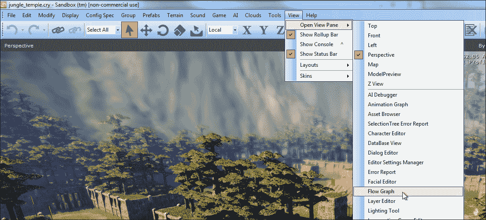

您刚刚访问了您的第一个 Sandbox 工具! 您应该看到一个包含许多子部分和特性的新窗口，但不要担心，让我们逐个解决它们。

# 浏览流程图编辑器

流程图以 XML 文件的形式保存在磁盘上，但可以通过流程图编辑器进行解析和编辑，以便为创建游戏逻辑的过程提供可视化界面。


## 组件

编辑器的这一部分包含项目中的所有流节点，它们被组织成整齐的类别。 让我们快速查看其中，打开**Misc**文件夹。 你应该看到一组节点，它们被分配到类别中:


### 术语

*   **图**:这指的是包含一组相互链接的节点的上下文。
*   **Node**:这是类的可视化表示，可以从输入端口接收数据和事件，也可以通过输出端口发送数据。 它连接到图中的其他节点以创建逻辑。
*   端口**:这是一个功能的可视化表示。 节点可以指定多个输入和输出端口，然后可以从这些端口发送或接收事件。**

 **### 组件类别

这里可能缺少标记为**Debug**的节点; CryENGINE 将类别分配给节点，作为指示在何处适合使用它们的一种方式。

*   **Release**:此节点适合在生产中使用
*   **Advanced**:虽然该节点适合在生产中使用，但在某些情况下可能具有复杂的行为
*   **Debug**:此节点应仅用于内部测试
*   **Obsolete**:不应该使用该节点，该节点在组件列表中不可见

例如，在处理打算发布给公众的级别时，您可能不希望意外包含任何 Debug 节点! 我们可以通过**View**|**Components**来启用或禁用流图编辑器中前三个类别的查看:

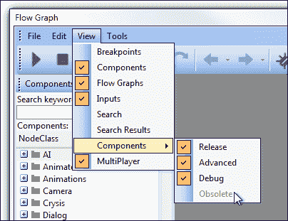

## 流程图类型

在创建新流程图之前，我们需要知道我们的目的与哪种类型最相关。 不同的流图类型允许特殊化，例如，创建处理玩家用户界面布局和绘制的**UI 图**。


### AI 动作

这些是你可以创建的流程图，用来将 AI 行为打包成方便的节点，这些节点可以在其他地方重用。 我们将在稍后学习**人工智能**(**AI**)时解决这些问题。

### UI 操作

CryENGINE 允许您通过 UI 事件系统使用流程图编写用户界面脚本，并在游戏中使用抬头显示脚本。 我们将在[第七章](07.html "Chapter 7. The User Interface")、*用户界面*中讨论这些内容。

### 材质特效

CryENGINE 支持方便的设计师编辑流程图来控制材料事件的处理方式，例如，产生一个污垢颗粒，当附近的地面被射击时，用一层灰尘遮住玩家的屏幕。

### FG 模块

您可以将向上的流图打包到方便的模块中，以便在不同的情况下重用。 我们稍后将对此进行深入描述。

### 实体

这是我们在本章中将花费大部分时间的地方! 90%的情况下，一个流图被分配给一个实体，也就是我们所熟知的**图形实体**，而这种逻辑发生在游戏世界中。

### 预制件

CryENGINE 支持 prefabs，这是一组将实体打包成一个方便重用的文件的集合。 预制内的任何实体流程图将显示在此文件夹中。

# 创建流程图

现在我们已经对流程图编辑器的工作原理有了基本的了解，让我们直接开始创建我们的第一个流程图吧! 您可以暂时关闭流程图编辑器。

## 流程图实体

流图实体是一个非常轻量级的 CryENGINE 对象，设计用于当您需要一个不应用于任何特定实体的流图时。 像所有实体一样，它可以在沙盒内的**RollupBar**中找到。

### 注意事项

如果你不确定实体是什么，跳过这一节直到你阅读了[第 3 章](03.html "Chapter 3. Creating and Utilizing Custom Entities")，*创建和使用自定义实体*。

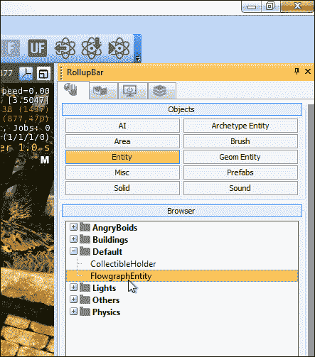

### 生成流实体

选择**FlowgraphEntity**，然后双击并再次单击 viewport，或者单击并将其拖动到关卡中。 您现在应该在**RollupBar**中看到一组全新的选项，包括实体参数、材质层，但对我们来说最重要的是**实体:****FlowgraphEntity**部分。

## 附加一个新的流程图

在**Entity: FlowgraphEntity**section 中，我们需要找到**Flow Graph**分段，然后点击**Create**按钮:

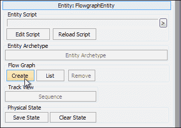

从这里开始，您将看到将流程图分配给一个组的选项。 现在，是否使用并不重要，但是它对于将相关图分组在一起非常有用，特别是在处理较大的项目时。

### 注意事项

组用于创建流程图的结构，允许开发人员将不同的图分类到文件夹中。

完成此操作后，您将看到 Flowgraph 编辑器出现，背景上覆盖着一个模糊的网格。 现在我们准备开始创建逻辑!

## 向流程图中添加节点

向新图中添加节点的最简单方法是浏览**Components**列表并拖动新节点。 然而,这不是非常高效的如果你知道你想添加的名称节点。因此,您还可以使用*问*Flowgraph 内快捷键编辑器打开搜索功能,输入节点的名称你想添加。

在我们的例子中，我们将从**Misc:Start**节点开始，这是一个简单的节点，用于在关卡加载或编辑器测试会话启动时触发其他事件:

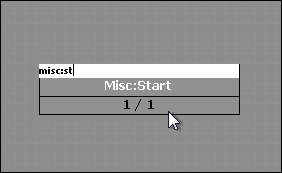

## 输入输出端口

放置节点后，您应该看到节点的输入和输出端口的第一个示例。 在本例中，我们有两个输入值，**InGame**和**InEditor**，还有一个输出端口，方便地命名为**输出**:


输入端口用于向节点提供数据或触发事件，而输出端口用于将数据和事件中继到图中的其他节点。 在本例中，可以编辑**Misc:Start**节点来定义它将在何种游戏环境中执行。 也许你有一些只希望在编辑器中运行的调试逻辑，在这种情况下，我们可以将**InGame**设置为 false 或 0。

### 端口类型

为了指定端口将处理的数据的类型，我们需要知道它的端口类型。 在 Flowgraph Editor 中，我们可以通过查看端口的颜色来判断端口的类型。

以下是可用的端口类型列表:

*   **Void**:这用于没有传递特定值的端口，但被激活以发出事件信号
*   **Int**:当端口应该只接收整数值时使用
*   **Float**:这用于表示端口处理浮点值
*   **EntityId**:表示端口需要一个实体标识符。 (关于实体 id 的更多信息请参考[第 3 章](03.html "Chapter 3. Creating and Utilizing Custom Entities")，*创建和使用自定义实体*)
*   **Vec3**:用于处理三维向量的端口
*   **String**:在这里，端口需要一个字符串
*   **Bool**:当端口期望一个布尔值为 true 或 false 时，使用

### 注意事项

连接不同类型的端口会导致值被自动转换。

## 目标实体

流节点可以特性一个目标实体，允许用户将一个实体从当前级别链接到流节点。 这对于那些打算影响游戏世界中的实体的节点来说非常有用，例如如下截图所示的**Entity:GetPos**节点获取指定实体的世界转换。

### 注意事项

我们还可以通过将**EntityId**输出端口连接到**Choose Entity**端口来动态指定实体。


有两种将实体分配给支持它的节点的方法:

*   通过将其他流节点的**EntityId**输出连接到**Choose Entity**输入
*   右键单击**选择实体**输入，选择:
    *   分配所选实体:这将节点链接到当前在 Editor 视图中选择的实体
    *   **分配图形实体**:将节点连接到分配给该图形的实体

## 连接流程节点

单个流节点无法实现太多功能; 让我们连接两个，并建立一个适当的图表! 为了演示，我们将使用**Time:TimeOfDay**节点:


如前一个屏幕截图所示，要创建端口之间的链接，只需单击输出端口并按住鼠标按钮将光标拖动到输入端口。 释放鼠标，连接就应该创建了!

我们还编辑了**Time**输入端口的值; 输入端口既可以通过输出端口提供数据，也可以直接在 Editor 中编辑它们的值。 要做到这一点，只需单击节点并查看流图编辑器的**Inputs**部分。 从那里，你可以简单地编辑值:


你还可以看到关于节点的有价值的信息:例如，这里我们可以看到这个节点用于设置一天中的时间，以及游戏中时间流逝的速度。

完成此操作后，您可以暂时关闭流程图编辑器。 流程图不需要手动保存; 它们会随关卡自动保存。

### 注意事项

虽然流程图随关卡保存，但通常使用**File**|**save**手动保存是一个很好的做法，以避免丢失您的工作。

## 测试我们的流程图

正如我们在前一章学到的，使用 Sandbox 在 CryENGINE 中测试逻辑非常简单。 只需按下*Ctrl*+*G*快捷键组合，即可进入游戏模式。 现在，当你这么做时，你应该看到关卡的灯光和一般氛围发生了变化，因为你已经改变了一天中的时间!

恭喜你，你迈出了使用 CryENGINE 创造游戏的第一步! 现在看起来不太像，但让我们在这个图上多画一点。

# 股票流量节点概述

为了使变得更复杂一点，我们需要了解 CryENGINE 默认为我们提供了哪些节点。

## 建造时钟

我们可以访问的最有用的节点之一，至少是为了调试的目的，是**HUD:DisplayDebugMessage**节点。 它允许你在游戏窗口中显示信息，可以选择有一个超时。 记住这一点，让我们基于前面学到的时间信息构建一个小的调试时钟。

**Time:TimeOfDay**节点以 CryENGINE 时间格式输出当前时间，该格式定义为小时加分钟除以 60。 例如，下午 1:30 在 CryENGINE 时间中将表示为 13.5。 现在我们知道我们将需要一些数学操作，所以是时候检查 Math 流节点类别了。

我们要做的第一件事是通过舍入当前时间来获得以小时为单位的时间。 为此，放置**Math:Floor**，然后将**Time:TimeOfDay**节点的**CurTime**输出连接到 Floor 的**A**输入端口。 然后，将其输入 Debug Message 节点:

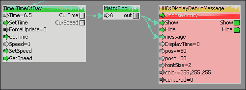

现在就进入游戏，你会在屏幕上看到当前时间(以小时为单位)。

然后我们需要从原始值中减去新的值来得到分钟部分。 为此，我们需要**Math:Sub**从原始**CurTime**值中减去整数小时。 在此之后，一个**Math:Mul**node将按新时间扩展 60 倍，所以你的图形应该如下所示:


记住将第二个 Debug 节点的**posY**设置为向下移动，这样可以同时看到这两个节点。

如果您再次跳转到游戏中，您现在应该看到当前的小时和分钟打印!

## 倾听玩家的输入

如果现在我们想让玩家测试一天中不同时间的移动会怎样? 一般来说，这是设置键监听器的最简单方法，即当按下某个键时触发事件。 幸运的是，CryENGINE 将这个功能很好地封装到一个节点中，即**Input:Key**。

现在让我们来设置一下，按下*P*键将使时间移动得非常快，而按下*O*将再次使时间停止。

### 注意事项

**Input:Key**节点是 Debug 节点。 在生产中使用 Debug 节点通常被认为是一种糟糕的做法，因为可能会出现意想不到的结果，所以请不要在实际的游戏逻辑中使用这个节点。

我们需要设置**Time:TimeOfDay**节点的**Speed**值，但是在本例中，我们还需要输入两个值! CryENGINE 提供了一个名为**Logic 的节点:Any**，它具有多个输入端口，只是传递给它的任何数据，我们可以在这里使用它来接收两个输入值。 我们使用两个关键节点,叫**数学:SetNumber**节点,和【显示】逻辑:任何节点传递这个信息给我们的**时间:TimeOfDay**节点,以及调用【病人】SetSpeed:


现在就进入游戏，按*P*开始新的一天! 再按*O*，一天的时间就会冻结。

## 执行循环

您可能已经注意到我们的时钟不再正确更新了。 这是因为大多数节点不会输出数据，除非触发; 在本例中，如果不触发**GetTime**或**SetTime**，则不会得到输出。 我们有两种调用方法:我们可以使用**Time:Time**来执行每一帧，或者**Time:Timer**。

后者可以控制滴答的粒度，但在这种情况下，我们可能希望它在快速移动的同时每帧更新，所以让我们保持简单。 将**tick**输出连接到**GetTime**输入，我们的时钟将再次正确更新!

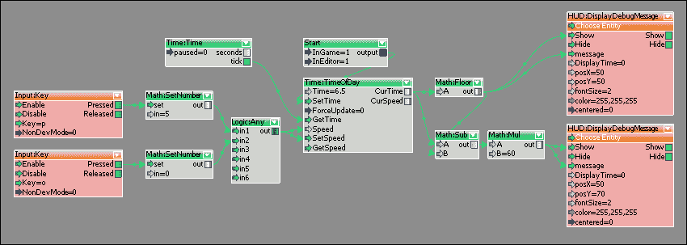

# 流程图模块

流程图模块系统允许将流程图导出为一个模块，该模块可以从另一个图形中触发。

通过创建模块，我们可以在多个层次上重用逻辑，而不必维护同一个图的多个版本。 还可以在模块之间发送和接收独特的数据，以非常模块化的方式允许动态逻辑。

## 创建模块

要开始创建自己的模块，打开流程图编辑器，选择**文件**|**新 FG 模块…** |**Global**:


在生成的**Save**对话框中，使用您选择的名称保存模块。 然后你会看到一个模块的默认视图:


该模块默认包含两个节点; **模块:Start_MyModule**和**模块:End_MyModule**。

*   模块:Start_MyModule 包含三个输出端口:
    *   **Start**:加载模块时调用
    *   **Update**:当需要更新模块时调用
    *   **Cancel**:当模块应该取消时调用，并且默认将连接到**模块:End_MyModule**的**Cancel**输入
*   **模块:End_MyModule**包含两个输入端口:
    *   **Success**:在完成模块时应该调用它，并将“成功”状态传递给调用者
    *   **Cancel**:这用于提前结束模块，并将“cancelled”状态传递给调用者

最后，要用逻辑填充模块，只需将**Start**输出端口连接到逻辑节点。

## 调用模块

要调用一个现有模块，请在 module 节点类别中找到相关节点。 调用节点命名为`Module:Call_<ModuleName>`:


然后简单地触发**呼叫**端口激活模块，**取消**取消模块。

## 模块参数/端口

从我们之前学到的，我们能够调用带有空端口的模块。 这并不是在所有情况下都是最佳的，因为您可能需要向模块传递额外的数据。

为了允许这一点，模块系统公开模块参数。 **Tools**|**Edit Module…** 在的流程图编辑器中，我们可以为我们的模块添加一组参数:


此操作将打开**模块端口**窗口，允许我们添加和删除端口:


通过选择**New Input**或**New Output**，我们将能够添加新的端口，在激活模块时使用。

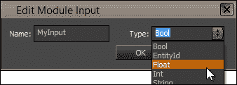

添加新的输入或输出将自动输出其**Module:Start_MyModule**或**Module:End_MyModule**节点，允许您接收数据:


所有的**Module:Call_MyModule**节点也会自动更新，让你可以立即访问新的参数:

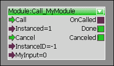

# 定制流节点

总之，CryENGINE 在默认情况下提供了许多有用的节点，包含了一系列的功能。 然而，作为一个程序员，你会经常发现设计人员会请求访问一些默认情况下流图无法提供的隐藏功能。

例如，假设你正在创造一款角色扮演游戏，你拥有一个体验系统。 你可以通过编写代码奖励玩家经验，但关卡设计师也希望能够在关卡中的任意点使用这一功能。

在这种情况下，您可以创建一个自定义流节点; 你可以在代码中创造一个简化的系统表现形式，也许允许设计师简单地指定当节点被触发时给予玩家的经验点数。

不过现在，我们要看一些更简单的东西。 假设我们没有使用现有的 CryENGINE 节点，我们想实现前面看到的**Math:Mul**节点。 回顾一下，它只是一个在流图中实现乘法的简单节点。


# 使用 c++创建自定义节点

回到[第一章](01.html "Chapter 1. Introduction and Setup")，*介绍和设置*，我们首先看了编译和运行 GameDLL，这里打包的为 Visual Studio 的`MiniMonoGameSample.sln`。 让我们再次加载它，确保任何 CryENGINE 实例(例如 Launcher 或 Sandbox)都是关闭的，因为我们将覆盖运行时使用的`CryGame.dll`文件。

## 组织节点

CryENGINE 游戏的标准做法是在 GameDLL 项目中有一个过滤器**CryGame**，称为**Nodes**。 如果不存在，现在就创建它。


## 创建新的节点文件

节点永远不会在项目的其他区域中被引用，所以将节点简单地实现为一个没有头的`.cpp`文件是很好的。

在我们的例子中，让我们添加一个新文件`TutorialNode.cpp`，并创建基本结构:

```cs
# include "stdafx.h"
# include "Nodes/G2FlowBaseNode.h"

  class CTutorialNode : public CFlowBaseNode<eNCT_Instanced>
  {

  };

  REGISTER_FLOW_NODE("Tutorial:Multiplier", CTutorialNode);
```

### 分解代码

首先，纳入`stdafx.h`; 这为您的文件提供了通用的功能和一些标准化的“包含”。 这也是编译文件所必需的。

在那之后，我们包含了第二个文件`Nodes/G2FlowBaseNode.h`。 虽然严格来说它不是 CryENGINE 组件，但这个文件在 CryENGINE 游戏中广泛使用，将节点功能封装到一个容易访问的基类中。

然后创建实际的类定义。 我们从前面提到的基本节点继承，然后指定我们的节点是一个实例节点; 一般来说，您将使用 CryENGINE 中的实例节点。

### 注意事项

正如您在这里看到的，CryENGINE 使用了一些有限的匈牙利符号前缀。 类为`CMyClass`，结构为`SMyData`，接口为`IMyInterface`。

字段使用`m_`前缀也很常见，比如`m_memberVariable`;指针变量使用`p`前缀，比如`*pAnInstance`。

为了简化节点注册，CryENGINE 公开了`REGISTER_FLOW_NODE`预处理宏。 系统将在启动时自动处理节点注册。

## 节点功能概述

对于我们正在创建的节点，我们不需要存储任何私有信息，所以只需使用 c++修饰符将所有节点信息作为类中的第一行:

```cs
public:
```

然后，我们首先实现两个函数:构造函数和`Clone`方法。 我们不需要任何逻辑，所以实现非常简单; 构造函数不初始化任何东西，而`Clone`只是返回当前节点的一个新实例:

```cs
  CTutorialNode(SActivationInfo *pActInfo)
  {
  }

  virtual IFlowNodePtr Clone(SActivationInfo *pActInfo)
  {
    return new CTutorialNode(pActInfo);
  }
```

在这里，我们也第一次认识了`SActivationInfo`。 这个结构包含关于节点当前状态的信息，以及包含它的图，我们将在后面的其他地方使用这个结构。

现在，我们的节点至少需要三个函数来编译:

```cs
  virtual void ProcessEvent(EFlowEvent evt, SActivationInfo *pActInfo)
  {
  }

  virtual void GetConfiguration(SFlowNodeConfig &config)
  {
  }

  virtual void GetMemoryUsage(ICrySizer *s) const
  {
    s->Add(*this);
  }
```

`ProcessEvent`是我们要做大部分节点逻辑的地方; 当我们的节点发生一些有趣的事情时，例如端口被触发，这个函数就会被调用。 `GetConfiguration`控制节点将如何显示，以及它包含哪些输入和输出端口。 `GetMemoryUsage`不需要我们提供任何额外的实现，所以我们只需要添加一个对该节点的引用来跟踪内存使用情况。

现在，验证代码是否可以编译是一个很好的方法; 如果没有，请检查是否正确声明了所有函数签名，并包含了头。

## 实现 GetConfiguration

如前所述，`GetConfiguration`是我们设置如何在流程图编辑器中使用节点的。 首先，我们设置`enum`来描述输入端口; 我们将使用两个值，left 和 right，以及一个激活端口来触发计算。 在类中声明:

```cs
  enum EInput
  {
    EIP_Activate,
    EIP_Left,
    EIP_Right
  };
```

当然，我们还需要一个输出端口来进行计算，因此让我们为`enum`创建一个单独的值。 它不是必需的，但保持一致是一个好习惯，而且大多数节点将有不止一个输出:

```cs
  enum EOutput
  {
    EOP_Result
  };
```

### 创建端口

声明了这些之后，我们就可以开始构建节点了。 端口定义为条目不变的静态数组`GetConfiguration`中声明,并使用一些辅助函数构造,即`InputPortConfig<T>`对于一个特定类型的价值,以及`InputPortConfig_AnyType`允许所有的值,和`InputPortConfig_Void`使用任何数据的端口。

记住这一点，我们知道在两个浮动模板端口上的触发器输入将需要一个 void 输入。 我们还需要一个浮点输出。

```cs
  virtual void GetConfiguration(SFlowNodeConfig &config)
  {
    static const SInputPortConfig inputs[] =
    {
      InputPortConfig_Void("Activate", "Triggers the calculation"),
      InputPortConfig<float>("Left", 0, "The left side of the calculation"),
      InputPortConfig<float>("Right", 0, "The right side of the calculation"),
      {0}
    };
  }
```

如您所见，我们需要指定端口的名称、描述以及使用数据的端口的默认值。 它们应该匹配前面声明的枚举的顺序。

### 注意事项

更改已经使用的节点的端口名称将破坏现有的图。 填写可选的`humanName`参数来更改显示名称。

现在我们重复这个过程，除了我们使用的输出函数集:

```cs
  static const SOutputPortConfig outputs[] =
  {
    OutputPortConfig<float>("Result", "The result of the calculation"),
    {0}
  };
```

### 分配阵列到节点配置

按照创建端口的过程，我们需要将这些数组分配给`config`参数，并提供描述和类别:

```cs
  config.pInputPorts = inputs;
  config.pOutputPorts = outputs;
  config.sDescription = _HELP("Multiplies two numbers");
  config.SetCategory(EFLN_APPROVED);
```

如果现在编译代码，那么该节点在 Editor 中应该是完全可见的。 但你会看到，它还什么都没做; 为了解决这个问题，我们必须执行`ProcessEvent`!

#### Flownode 配置标志

结构体`SFlowNodeConfig`允许你为流程节点分配可选标志，如下所示:

*   `EFLN_TARGET_ENTITY`:表示该节点应该支持目标实体。 要获得当前分配的目标实体，请查看`SActivationInfo::pEntity`。
*   `EFLN_HIDE_UI`:在流程图界面中对用户隐藏节点。
*   `EFLN_UNREMOVEABLE`:禁用用户移除节点的能力。

要在`GetConfiguration`中添加标志，在本例中是为了支持目标实体，只需将该标志添加到`nFlags`变量:

```cs
  config.nFlags |= EFLN_TARGET_ENTITY;
```

## 实现 ProcessEvent

`ProcessEvent`是我们捕获节点所有感兴趣的事件的地方，例如端口被触发。 在我们的例子中，我们希望在`Activate`端口被触发时执行一个计算，因此我们需要检查端口激活情况。 不过首先，我们可以通过检查想要处理的事件来节省一些处理时间。

```cs
  virtual void ProcessEvent(EFlowEvent evt, SActivationInfo *pActInfo)
  {
    switch (evt)
    {
      case eFE_Activate:
      {

      }
      break;
    }
  }
```

通常您要处理多个事件，所以最好养成使用`switch`语句的习惯。

在里面，让我们看看我们用来检查激活，检索数据，然后触发输出的各种 flownode 函数:

```cs
  if (IsPortActive(pActInfo, EIP_Activate))
  {
    float left = GetPortFloat(pActInfo, EIP_Left);
    float right = GetPortFloat(pActInfo, EIP_Right);
    float answer = left * right;

    ActivateOutput(pActInfo, EOP_Result, answer);
  }
```

总之，我们在所有这些函数中使用激活信息来表示当前状态。 然后，我们可以使用`GetPort*`函数检索各种端口类型的值，然后用数据触发输出。

是时候加载编辑器并进行测试了; 如果一切顺利，您应该能够在教程类别中看到您的节点。 祝贺您，您刚刚为 CryENGINE 编写了第一个 c++代码!

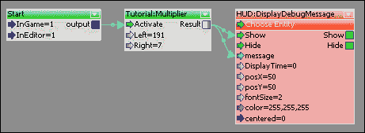

# 在 C# 中创建自定义节点

CryMono 还支持使用 C# 开发人员会感到习惯的习语创建定制节点，比如属性元编程。 要开始使用 C# CryENGINE 脚本，请在`Game/Scripts/CryGameCode.sln`中打开示例脚本解决方案。 在 flownodes 文件夹中添加一个新的`.cs`文件，我们将开始使用 C# 创建相同的节点，这样您就可以看到创建过程是如何变化的。

首先，让我们创建一个基本的骨架节点。 我们需要将正确的命名空间引入`Flowgraph`类的作用域，并为我们的节点设置一些基本属性:

```cs
  using CryEngine.Flowgraph;

  namespace CryGameCode.FlowNodes
  {
    [FlowNode(Name = "Multiplier", Category = "CSharpTutorial", Filter = FlowNodeFilter.Approved)]
    public class TutorialNode : FlowNode
    {

    }
  }
```

就像在 c++中一样，节点在项目的其他任何地方都不会被引用，所以我们为节点分配一个单独的名称空间，以防止它们污染主名称空间。

我们使用`FlowNodeAttribute`类来代替`GetConfiguration`来为节点设置元数据，例如正确的类别和可见性级别。 你的节点必须包含这个属性并从`FlowNode`继承它才能被 CryENGINE 注册; 不需要任何手动注册呼叫。

### 注意事项

请记住，可以在没有名称的最后一个`Attribute`的情况下放置属性。 例如，`FlowNodeAttribute`可以同时作为`[FlowNodeAttribute]`和`[FlowNode]`。

## 添加输入

在 CryMono 中，输入被定义为函数，它们要么接受一个定义数据类型的参数，要么不接受空端口的参数。 它们还需要使用`Port`属性进行装饰。 在我们的例子中，让我们设置与 c++版本中相同的三个输入:

```cs
  [Port]
  public void Activate()
  {
  }

  [Port]
  public void Left(float value)
  {
  }

  [Port]
  public void Right(float value)
  {
  }
```

稍后我们将回到`Activate`的实现。 虽然可以通过在属性中设置可选参数来覆盖端口名称，但更简单的方法是让函数名称定义节点在 Editor 中的显示方式。

## 添加输出

如果需要值，输出被存储为`OutputPort`或`OutputPort<T>`的实例。 现在让我们将`Result`的输出作为一个属性添加到类中:

```cs
  public OutputPort<float> Result { get; set; }
```

## 实施激活

让我们回到我们的`Activate`输入; 同样，我们需要检索这两个值，然后触发一个输出。 `FlowNode`类具有以下方便的功能:

```cs
  var left = GetPortValue<float>(Left);
  var right = GetPortValue<float>(Right);
  var answer = left * right;

  Result.Activate(answer);
```

就是这样! 下次打开流程图编辑器时，你会看到新的**CSharpTutorial:Multiplier**节点，，其功能与你之前实现的 c++等效节点完全相同:

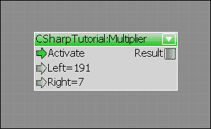

再次祝贺你，因为你已经迈出了使用。net 平台和 CryENGINE 编写游戏代码的第一步!

## 目标实体

在 CryMono 中添加对目标实体的支持很简单，只需将`FlowNode`属性中的`TargetsEntity`属性设置为 true:

```cs
  [FlowNode(TargetsEntity = true)]
```

然后，您可以通过`FlowNode.TargetEntity`获得实体实例，假设它是在包含该节点的流图中分配的。

# 总结

在本章中，我们了解了为什么流程图对设计师是有用的，并创建了我们自己的流程图。

我们还研究了 CryENGINE 提供的一些现有节点，然后用两种编程语言创建了我们自己的节点。 现在你应该对流程图系统有了一个很好的理解，以及如何利用它为你的优势。

在未来的章节中，我们将看到一些流程图可以实现的其他事情，包括设计用户界面、实现物质效果、创建特殊的流节点来表示世界中的实体，以及将 AI 功能包装成方便的可重用模块。

现在，如果您想更多地探索流图的世界，为什么不尝试一下如何实现更多的股票节点呢? 熟悉编写 c++和 C# 节点之间的区别，并了解您更喜欢哪一种。

如果你想尝试使用 CryMono，试着编辑你的节点脚本并在运行 Sandbox 时保存它们; 你可能会惊喜地发现它们是在后台重新编译和重新加载的! 这将帮助您测试新的节点想法，而不会受到编译时间和重新启动的阻碍。**