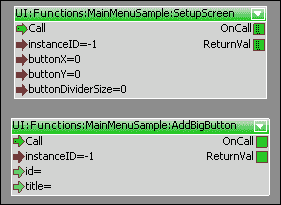

# 第七章。 用户界面

CryENGINE 集成了 Scaleform GFx，允许渲染基于 Adobe flash 的用户界面、hud 和动画纹理。 通过在运行时使用 UI 流图解决方案将 UI 元素绑定在一起，开发人员可以立即直观地创建和扩展用户界面。

在本章中，我们将涵盖以下主题:

*   了解 CryENGINE Scaleform 的实现，以及它带来的好处。
*   创建主菜单。
*   执行 UI 游戏事件系统

# Flash 电影剪辑和 UI 图形

为了给开发者提供一个创建用户界面的解决方案，CryENGINE 集成了 Adobe Scaleform GFx，一个实时的 Flash 渲染游戏引擎。 该系统允许在 Adobe Flash 中创建用户界面，然后可以导出到引擎中立即使用。

### 注意事项

也可以在材料中使用 Flash`.swf`文件，允许在游戏世界中的 3D 对象上呈现 Flash 电影剪辑。

随着 UI 流程图的加入，创建模块化动态用户界面的工作大大简化了，该系统允许使用流程图系统创建和维护任何 Flash UI 元素。

UI 流程图系统基于两种类型的概念:**元素**和**动作**。 每个元素代表一个 Flash 文件(`.swf`或`.gfx`)，而每个动作是一个表示 UI 状态的流程图。

## 元素

UI 元素通过`Game/Libs/UI/UIElements/`中的 XML 文件配置，并表示每个Flash 文件。 通过修改 UI 元素的配置，我们可以更改它接收的事件和对齐模式，以及在导出的 SWF 文件中暴露不同的函数和回调。

### XML 分解

元素的最小值可以在下面的代码中看到:

```cs
<UIElements name="Menus">
  <UIElement name="MyMainMenu" mouseevents="1" keyevents="1" cursor="1" controller_input="1">

    <GFx file="Menus_Startmenu.swf" layer="3">
      <Constraints>
        <Align mode="fullscreen" scale="1"/>
      </Constraints>
    </GFx>

    <functions>
    </functions>

    <events>
    </events>
    <Arrays>
    </Arrays>

    <MovieClips>
    </MovieClips>
  </UIElement>
</UIElements>
```

前面的 XML 代码可以保存为`Game/Libs/UI/UIElements/MyMainMenu.xml`，并将加载名为`Menus_Startmenu.swf`的 Flash 文件到`Game/Libs/UI/`文件夹中。

一旦创建，我们将能够通过流图节点(如**UI:Display:Config**来选择我们的新 UI 元素(用于重新配置任何元素，以便，例如，在运行时为元素启用鼠标事件)。


现在我们知道它是有效的，让我们把它分解一下:

```cs
<UIElements name="Menus">
```

第一个元素定义了文件的开始，并决定我们的元素应该放在哪个类别中。

```cs
<UIElement name="MyMainMenu" mouseevents="1" keyevents="1" cursor="1" controller_input="1">
```

XML 元素用于决定初始配置，包括默认名称，并确定默认情况下应该接收哪些事件。

如前所述，每个元素都可以通过一组属性来配置，从而允许开发人员定义要侦听的事件类型:

<colgroup><col style="text-align: left"> <col style="text-align: left"></colgroup> 
| 

属性名称

 | 

描述

 |
| --- | --- |
| 【t】【t】 | 定义元素的名称(String)。 |
| 【t】【t】 | 确定鼠标事件是否发送到 Flash 文件(0/1)。 |
| 【t】【t】 | 确定是否在元素可见时显示游标(0/1)。 |
| 【t】【t】 | 决定是否向 Flash 文件发送键事件(0/1)。 |
| 【t】【t】 | 确定操纵杆是否应该作为控制台硬件上的光标(0/1)。 |
| 【t】【t】 | 确定在控制台硬件(0/1)上运行时元素是否可见时，是否显示游标。 |
| 【t】【t】 | 定义元素显示的顺序，以防出现多个元素。 |
| 【t】【t】 | 设置元素的背景 alpha 值(0-1)。允许在游戏中透明，例如，在你的主菜单后面的一个游戏中的关卡。 |

### 注意事项

注意，前面提到的属性可以通过使用**UI:Display:Config**节点进行实时调整。

```cs
<GFx file="Menus_Startmenu.swf" layer="3">
```

元素决定为该元素加载哪个 Flash 文件。 可以加载多个 GFx 文件并将它们放入不同的层中。

这允许在运行时选择使用哪个元素层，例如，通过上一个屏幕截图中显示的**UI:Display:Config**节点上的`layer`输入。

```cs
<Constraints>
  <Align mode="fullscreen" scale="1"/>
</Constraints>
```

`Constraints`允许配置 GFx 元素在屏幕上的显示方式，让开发者能够调整元素在不同显示分辨率下的表现。

目前有以下三种模式:

<colgroup><col style="text-align: left"> <col style="text-align: left"> <col style="text-align: left"></colgroup> 
| 

模式名称

 | 

描述

 | 

额外的属性

 |
| --- | --- | --- |
| 固定 | 在固定模式下，开发人员可以使用四个属性来设置到左上角的像素距离，以及所需的分辨率。 | 顶部，左边，宽度和高度 |
| 动态 | 在动态模式下，元件在锚上对齐，允许水平和垂直对齐。halign 可设置为`left`、`center`或`right`，valign 可设置为`top`、`center`或`bottom`。如果缩放设置为`1`，元素将缩放到屏幕分辨率，同时保持长宽比。如果 max 设置为`1`，元素将被最大化以确保覆盖 100%的屏幕。 | Halign, valign, scale 和 Max |
| 全屏 | 当在此模式下激活时，元素视口将与渲染视口完全相同。如果比例设置为`1`，元素将被拉伸到屏幕分辨率。 | 规模 |

## 动作

UI 操作是 UI 流图实现的核心。 每个操作都由一个流图表示，并定义一个 UI 状态。 例如，主菜单中的每个屏幕将使用单独的操作来处理。

所有可用的 UI 操作都可以在流图编辑器中的**流图**工具箱中看到。


创建一个新的 UI 行动,导航到**文件**|**新 UI 行动,并指定您的新操作的名称在新开的**另存为对话框:****

 ****

行动开始使用**界面:行动:**控制节点和指定的未决诉讼的名字**UIAction**输入端口,然后激活**开始**输入。


一旦启动，具有指定名称的 UI 图将被激活，假设它包含一个**UI:Action:Start**节点，如下所示:


图形可以然后通过监听**StartAction**输出端口来初始化所请求的 UI。 一旦操作完成，它应该调用**UI: action:End**，如下所示:


就是这样。 UI 图形以流图 XML 文件的形式保存在`Game/Libs/UI/UIActions/`中。 初始 UI 操作称为**Sys_StateControl**，并且始终处于活动状态。 状态控制器图应该根据系统事件(如关卡加载)负责加载和启用菜单。

系统状态控制操作(`Sys_StateControl.xml`)始终处于活动状态，用于启动初始操作，例如，在启动引擎时显示主菜单。

# 创建主菜单

现在我们对 UI 流程图实现有了基本的了解，让我们开始创建自己的主菜单。

## 创建菜单元素

我们需要做的第一件事是创建 UI 元素定义，以便为引擎提供加载导出的 SWF 文件的方法。

为此，在`Game/Libs/UI/UIElements/`中创建一个名为`MainMenuSample.xml`的新 XML 文档。 我们的菜单所需的最小代码可以在下面的代码中看到:

```cs
<UIElements name="Menus">
  <UIElement name="MainMenuSample" mouseevents="1" keyevents="1" cursor="1" controller_input="1">
    <GFx file="MainMenuSample.swf" layer="3">
      <Constraints>
        <Align mode="dynamic" halign="left" valign="top" scale="1" max="1"/>
      </Constraints>
    </GFx>
  </UIElement>
</UIElements>
```

有了前面的代码，引擎就知道在哪里加载我们的 SWF 文件，以及如何在屏幕上对齐它。

### 注意事项

SWF 文件可以通过使用`GFxExport.exe`(通常存在于`<root>/Tools/`目录中)重新导出，以提高在引擎内使用的效率。 这通常是在游戏发行前完成的。

## 暴露 ActionScript 资产

接下来，我们需要公开我们在 Flash 源文件中定义的函数和事件，以便引擎调用和接收这些函数和事件。

在公开函数和事件时，我们创建了可以被任何流图使用的简单的流图节点。

创建完成后，可以通过导航到**UI**|**Functions**访问功能节点，如下图所示:


通过导航到**UI**|**Events**可以找到事件。

### 注意事项

还可以在 c++中创建 UI 操作和元素，从而有效地让用户界面能够从本地代码中发送和获取事件。 我们将在本章后面的*创建 UI 游戏事件系统*部分进行。

### 功能

要公开方法，我们需要在`UIElement`定义中添加一个新的`<functions>`节，如下代码所示:

```cs
<functions>
  <function name="SetupScreen" funcname="setupScreen" desc="Sets up screen, clearing previous movieclips and configuring settings">
    <param name="buttonX" desc="Initial x pos of buttons" type="int" />
    <param name="buttonY" desc="Initial y pos of buttons" type="int" />
    <param name="buttonDividerSize" desc="Size of the space between buttons" type="int" />
  </function>

  <function name="AddBigButton" funcname="addBigButton" desc="Adds a primary button to the screen">
    <param name="id" desc="Button Id, sent with the onBigButton event" type="string" />
    <param name="title" desc="Button text" type="string" />
  </function>
</functions>
```

使用前面的代码，引擎将创建两个节点，我们可以利用它们来调用 UI Graphs 中的`setupScreen`和`addBigButton`ActionScript 方法。

### 注意事项

函数总是放在相同的流图类别:**UI:Functions:ElementName:FunctionName**



当中显示的节点上的**调用**端口被触发时，ActionScript 方法将被调用指定的参数。

### 注意事项

**instanceID**输入端口决定在哪个元素实例上调用函数。 如果将该值设置为`-1`(默认值)，将在所有实例上调用它，否则如果设置为`-2`，将在所有初始化实例上调用它。

### 事件

设置事件的方式与函数类似，使用`<events>`标记，如下所示:

```cs
<events>
  <event name="OnBigButton" fscommand="onBigButton" desc="Triggered when a big button is pressed">    
    <param name="id" desc="Id of the button" type="string" />
  </event>
</events>
```

前面的代码将导致引擎使**OnBigButton**节点可用，当 Flash 文件调用`onBigButton`fscommand 时触发该节点，以及相关的按钮 ID。


从 Flash 中调用`fscommand`相对容易。 下面的代码将触发`onBigButton`事件，以及相关的按钮 ID 字符串。

```cs
fscommand("onBigButton", buttonId);
```

### 注意事项

与函数类似，事件总是放在**UI: events:ElementName:EventName**中。

### 变量

也可以通过元素定义来定义对 Flash 源文件中变量的访问。 这允许通过使用**UI: variable:Var**节点来获取和设置变量的值。

首先，在元素定义的`<variables>`块中定义数组:

```cs
<variables>
  <variable name="MyTextField" varname="_root.m_myTextField.text"/>
</variables>
```

重新启动编辑器后，放置一个新的**UI:Variable:Var**节点，然后浏览新变量，如下图所示:


然后我们可以使用流程图(flowgraph)在任何时候简单地设置或获取变量的值:


### 阵列

在上一节中，我们在运行时设置了 Flash 变量的值。 通过使用**UI:Variable:Array**节点，这对于数组也是可能的。

首先，在元素的`<arrays>`块中暴露数组，如下所示:

```cs
<arrays>
  <array name="MyArray" varname="_root.m_myArray"/>
</arrays>
```

然后重新启动数组并重复前面的过程，但是使用**UI:Variable: array**节点。 通过 UI 图创建一个新数组，使用**UI:Util:ToArray**节点:


## 将影片剪辑实例暴露到流程图

通过暴露变量的同样方式，也可以通过 UI图形直接访问 MovieClips。 这允许进入特定的帧，改变属性等等。

所有允许影片剪辑交互的节点都可以通过导航到**UI**|**影片剪辑**在流程图编辑器中找到:如下截图所示:


首先，在元素定义中添加或编辑`<movieclips>`块，如下所示:

```cs
<movieclips>
  <movieclip name="MyMovieClip" instancename="_root.m_myMovieclip"/>
</movieclips>
```

这将使流图访问 Flash 文件中的**m_myMovieClip**movieclip。

一旦编辑器重新启动，例如，我们可以使用**UI:MovieClip:GotoAndPlay**节点直接跳到指定剪辑中的不同帧，如下图所示:


## 创建 UI 操作

现在我们已经配置了主菜单元素，现在是创建 UI 操作的时候了，这些操作将导致菜单出现在 Launcher 应用中。

### 创建状态控制图

首先打开沙盒和流图编辑器。 一旦打开，通过导航到**文件**|**新 UI 操作**创建一个新的 UI 操作。 调用动作**Sys_StateControl**。 这将是我们触发初始菜单和处理关键系统事件的主要 UI 操作。

一旦创建了操作，我们将使用以下三个系统事件:

*   OnSystemStarted
*   OnLoadingError
*   OnUnloadComplete

这些事件一起表示主菜单应该何时出现。 我们将把它们结合到一个**UI:Action:Control**节点中，这反过来会激活我们稍后将创建的 MainMenu UIAction。


### 创建 MainMenu 操作

当您完成后，创建另一个 UI 操作并将其命名为**MainMenu**。 打开后，放置一个**UI:Action:Start**节点。 当我们之前创建的**UI:Action:Control**节点执行时，**StartAction**输出端口将自动激活。

我们现在可以钩**开始节点**界面:显示:显示**和**界面:显示:配置为了**节点初始化主菜单,确保用户可以看到它。**

 **

我们的 flash 文件将在游戏开始时显示，但目前缺少任何额外的配置从流程图。

### 添加按钮

现在我们的主菜单文件已经初始化，我们需要在 Flash 文件中添加一些 ActionScript 代码，以允许动态生成和处理 UI 图中的按钮。

本节假设您有一个可以在运行时实例化的影片剪辑。 在我们的示例中，我们将使用一个名为**BigButton**的自定义按钮。


### 注意事项

我们的主菜单的 Flash 源文件(`.fla`)存在于示例安装的`Game/Libs/UI/`文件夹中，可以从[https://github](https://github)[.com/inkdev/CryENGINE-Game-Programming-Sample/](http://.com/inkdev/CryENGINE-Game-Programming-Sample/)下载。

本节还假设您有两个 ActionScript 函数:`SetupScreen`和`AddBigButton`。

`SetupScreen`应该为场景配置默认设置，并删除所有之前生成的对象。 在本例中，我们希望在调用`SetupScreen`时删除使用`AddBigButton`生成的按钮。

`AddBigButton`应该是一个简单的函数，生成一个预先创建的按钮实例，如下所示:

```cs
var button = _root.attachMovie("BigButton", "BigButton" + m_buttons.length, _root.getNextHighestDepth());
```

当按钮被点击时，它应该调用我们在流图中捕获的事件:

```cs
fscommand("onBigButton", button._id);
```

有关创建函数和事件的信息，请参阅前面讨论的*暴露 ActionScript 资产*一节。

当你完成后，将这些节点添加到 MainMenu 操作中，并在配置元素后调用它们:


我们的主菜单现在应该在启动 Launcher 应用时出现，但是没有任何与之交互的用户反馈。

为了解决这个问题，我们可以利用本章前面提到的 OnBigButton 节点。 当按钮被点击时，这个节点将发送事件，同时发送一个字符串标识符，我们可以用它来判断哪个节点被点击了:


在前面的图中，我们截取按钮事件并使用**String:比较**节点来检查我们需要对输入做些什么。 如果点击**IDD_Quit**按钮，我们将退出游戏，如果点击**IDD_Start**节点，我们将加载**Demo**关卡。

## 最终结果

假设你没有创建自己的菜单设计，当你启动启动器时，你现在应该看到以下截图:


既然你已经知道了创建一个简单的菜单是多么容易，为什么不继续创造一个在玩家生成时显示的**抬头显示**(**HUD**)呢?

# 引擎 ActionScript 回调

有许多 ActionScript 回调是由引擎自动调用的。 只要在 Flash 源文件根目录中定义这些函数，引擎就能够调用它们。

*   `cry_onSetup(isConsole:Boolean)`:当 SWF 文件最初被引擎加载时，这个函数被调用。
*   `cry_onShow()`:显示 SWF 文件时调用这个函数。
*   `cry_onHide()`:当 SWF 文件被隐藏时调用该函数。
*   `cry_onResize(_iWidth:Number, _iHeight:Number)`:当游戏分辨率改变时，调用此函数。
*   `cry_onBack()`:当用户按下后退按钮时调用此函数。
*   `cry_requestHide()`:该函数在元素被隐藏时被调用。

# 创建 UI 游戏事件系统

UI 系统利用`IUIGameEventSystem`接口与 flowgraph 通信，允许自定义函数和事件，其定义方式与 ActionScript 资产公开的方式相同。

这用于允许用户界面访问游戏和引擎功能，如获取可玩关卡列表。 每个游戏事件系统都指定它的类别，然后在流程图编辑器中使用它来定义注册的功能和事件的类别。

例如，如果我们使用`IFlashUI::CreateEventSystem`创建一个名为 MyUI 的事件系统，那么通过导航到**UI**|**functions**|**MyUI**可以找到所有的函数。

## 实现 IUIGameEventSystem

实现`IUIGameEventSystem`不需要做太多工作; 只需要分配以下三个纯虚拟值:

*   `GetTypeName`:这是没有直接覆盖; 请使用`UIEVENTSYSTEM`宏。
*   `InitEventSystem`:此调用用于初始化事件系统。
*   `UnloadEventSystem`:此调用是为了卸载事件系统。

因此，最小值如下(以下文件保存为`MyUIGameEventSystem.h`):

```cs
class CMyUIGameEventSystem
  : public IUIGameEventSystem
{
public:
  CMyUIGameEventSystem() {}

  // IUIGameEventSystem
  UIEVENTSYSTEM("MyUIGameEvents");
  virtual void InitEventSystem() {}
  virtual void UnloadEventSystem() {}
  // ~IUIGameEventSystem
};
```

现在我们已经解决了类定义，我们可以继续讨论代码本身。 首先创建一个名为`MyUIGameEventSystem.cpp`的新文件。

创建此文件后，使用`REGISTER_UI_EVENTSYSTEM`宏注册事件系统。 这用于从`CUIManager`类中自动创建类的实例。

将宏放在 CPP 文件的底部，在方法范围之外，如下所示:

```cs
REGISTER_UI_EVENTSYSTEM(CMyUIGameEventSystem);
```

### 注意事项

请注意，`REGISTER_UI_EVENTSYSTEM`宏只能在 CryGame 项目中使用。

我们的事件系统现在应该可以编译，并将与 CryGame 中包含的其他事件系统一起创建。

我们的事件系统现在什么都不做。 阅读以下部分，了解如何向 UI 流公开函数和事件。

## 接收事件

事件系统可以公开功能，这些功能的工作方式与我们通过 Main Menu 元素注册的节点相同。 通过公开函数，我们可以让图表与游戏互动，比如请求玩家的生命值。

首先，我们需要向`CMyUIGameEventSystem`类添加两个新成员:

```cs
SUIEventReceiverDispatcher<CMyUIGameEventSystem> m_eventReceiver;
IUIEventSystem *m_pUIFunctions;
```

当函数的节点在流图中被触发时，事件调度器将负责调用函数。

要开始创建一个函数，请在类声明中添加以下代码:

```cs
void OnMyUIFunction(int intParameter) 
{
  // Log indicating whether the call was successful
  CryLogAlways("OnMyUIFunction %i", intParameter);
}
```

要注册我们的函数，请在您的`InitEventSystem`函数中添加以下代码:

```cs
// Create and register the incoming event system
m_pUIFunctions = gEnv->pFlashUI->CreateEventSystem("MyUI", IUIEventSystem::eEST_UI_TO_SYSTEM);
m_eventReceiver.Init(m_pUIFunctions, this, "MyUIGameEvents");

// Register our function
{
  SUIEventDesc eventDesc("MyUIFunction", "description");

  eventDesc.AddParam<SUIParameterDesc::eUIPT_Int>("IntInput", "parameter description");

  m_eventReceiver.RegisterEvent(eventDesc, &CMyUIGameEventSystem::OnMyUIFunction);
}
```

重新编译并重启沙箱后，现在应该可以在流程图编辑器中看到你的节点了:


## 调度事件

能够向 UI 图公开事件是非常有用的，它允许您处理基于事件的 UI 逻辑，例如，在用户请求时显示记分牌。

首先，让我们将以下代码添加到你的类中:

```cs
enum EUIEvent
{
	eUIE_MyUIEvent
};

SUIEventSenderDispatcher<EUIEvent> m_eventSender;
IUIEventSystem *m_pUIEvents;
```

枚举包含我们将要注册的各种事件，它被用作事件发送方知道您试图将哪个事件发送给 UI 系统的一种方式。

现在我们需要在`InitEventSystem`函数中添加一些代码来显示我们的事件，如下所示:

```cs
// Create and register the outgoing event system
m_pUIEvents = gEnv->pFlashUI->CreateEventSystem("MyUI", IUIEventSystem::eEST_SYSTEM_TO_UI);

m_eventSender.Init(m_pUIEvents);

// Register our event
{
	SUIEventDesc eventDesc("OnMyUIEvent", "description");
	eventDesc.AddParam<SUIParameterDesc::eUIPT_String>("String", "String output description");
	m_eventSender.RegisterEvent<eUIE_MyUIEvent>(eventDesc);
}
```

在成功重新编译后，**OnMyUIEvent**节点现在应该出现在编辑器中:


### 调度事件

要分派你的UI 事件，使用`SUIEventSenderDispatcher::SendEvent`:

```cs
m_eventSender.SendEvent<eUIE_MyUIEvent>("MyStringParam");
```

# 总结

在本章中，我们学习了如何在 CryENGINE 中创建用户界面，并使用这些知识创建了我们自己的主菜单。

你已经掌握了实现自己的 UI 和 UI 事件系统所需的基本知识。

如果你想在进入下一章之前更多地使用用户界面，为什么不展开我们之前创建的主菜单呢? 一个好的起点便是执行关卡选择画面。

在下一章中，我们将介绍创建允许多人游戏功能的网络游戏的过程。******