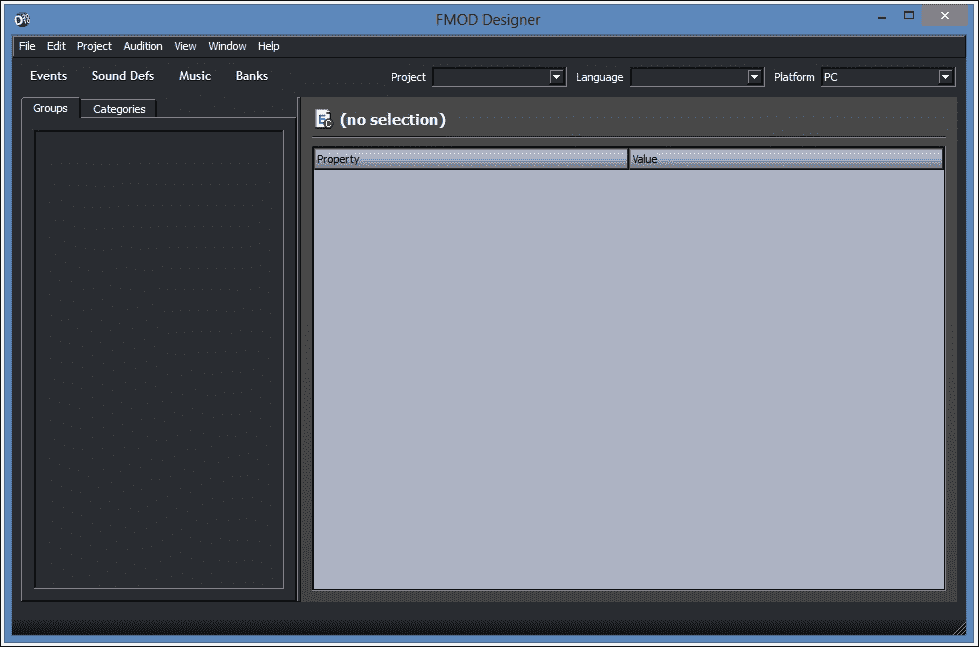
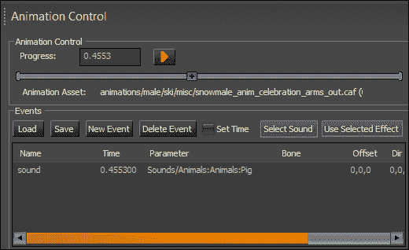
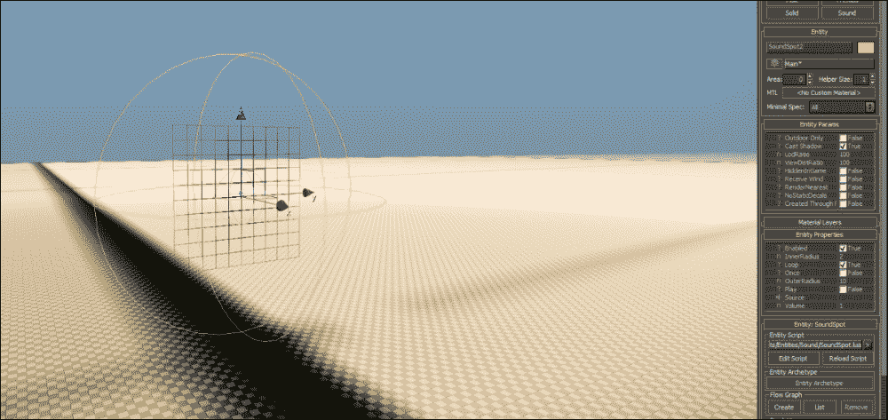

# 第十一章。 效果和声音

CryENGINE 拥有一个非常模块化的效果系统，允许在运行时以最小的努力生成效果。 该引擎还集成了 FMOD，为开发人员提供了动态播放音频、音乐和本地化对话框的工具。

在本章中，我们将涵盖以下主题:

*   学习效果和音响系统
*   发现如何创造和触发物质效应
*   学习如何通过 FMOD 设计师导出和定制声音
*   回放自定义声音
*   学习如何将声音整合到粒子和物理事件中

# 引入效应

如果没有 FX，游戏的世界通常会让人难以置信，并被认为是没有生命的。 简单地添加声音和粒子等效果便能够帮助游戏世界变得更加生动，让玩家能够感受到游戏世界的沉浸感。

虽然在引擎中并没有一个针对所有类型的效果的组合系统，但我们将涵盖许多处理各种效果的系统。 这包括材料效果、粒子效果、声音效果等等。

## 物质效应

材料效果系统处理材料之间的反应，例如，根据岩石落在哪个材料上来播放不同的粒子和声音效果。

### 表面类型

每个材料被分配一个**表面类型**，表明它是什么类型的表面。 例如，如果我们正在创建一个岩石材料，我们应该使用 mat_rock 表面类型。

通过指定一个表面类型，物理系统将能够收集关于碰撞应该如何表现的信息，例如，通过获得表面类型的摩擦值。 多种表面类型之间的交互还允许根据相互接触的表面类型改变动态效果。

可以通过编程非常容易地查询表面类型，允许各种系统创建基于表面类型触发的不同代码路径。

在 c++中，曲面类型由`ISurfaceType`接口表示，可以通过`IMaterial::GetSurfaceType`获得。

使用 c#，表面类型由`CryEngine.SurfaceType`类表示，并可以使用`CryEngine.Material.SurfaceType`属性进行检索。

#### 添加或修改表面类型

表面类型在`Game/Libs/MaterialEffects/SurfaceTypes.xml`中定义。 文件在启动时由引擎解析，允许材料使用加载的表面类型。

每个曲面类型通过使用`SurfaceType`元素定义，例如`mat_fabric`如下代码所示:

```cs
<SurfaceType name="mat_fabric">
  <Physics friction="0.80000001" elasticity="0" pierceability="7" can_shatter="1"/>
</SurfaceType>
```

当碰撞发生时，物理系统查询物理属性。

## 粒子效应

粒子效果由`IParticleManager`界面处理，使用`I3DEngine::GetParticleManager`即可访问。 要获取指向`IParticleEffect`对象的指针，请参见`IParticleManager::FindEffect`。

粒子效果是通过使用**沙盒编辑器**中包含的**粒子编辑器**创建，并且通常保存到`Game/Libs/Particles`。

## 音效

CryENGINE 的声音系统是由 FMOD(游戏邦注:这是一款游戏音频内容创建工具)驱动的。 通过使用 FMOD，引擎支持简单的创建和操作的声音，以便在游戏中立即使用。

声音系统可以通过`ISoundSystem`接口访问，而`ISoundSystem`接口通常通过`gEnv->pSoundSystem`指针进行检索。 声音由`ISound`接口表示，接口可以通过`ISoundSystem::CreateSound`或`ISoundSystem::GetSound`检索指针。

通过访问`ISound`接口，我们可以改变语义、距离乘数等等，还可以通过`ISound::Play`实际播放声音。

### FMOD 设计师

设计师是我们在每次向项目中使用的不同声音库中添加更多声音时所使用的。



设计师允许创建和维护声音库，即在不同声音之间创建隔离的库。 声音库中包含事件、声音定义和音乐。 我们可以赋予它们静态和动态修改器，例如，根据游戏内部环境为声音赋予独特的3D 效果。

# 创造和触发物质效果

有两种方法可以触发自定义材质效果，如下面的部分所述

## 基于物理交互的自动播放

当两个材料因物理事件发生碰撞时，发动机将根据分配给材料的表面类型在`Game/Libs/MaterialEffects/MaterialEffects.xml`中查找一个材料效果。 这允许在某些相互作用发生时播放各种粒子和声音。

例如，如果一块岩石与木头碰撞，我们可以用木屑颗粒播放一个特定的声音事件。

首先，用 Microsoft Excel 打开`MaterialEffects.xml`。

### 注意事项

虽然可以手动修改材质效果文档，但由于 Excel 格式的复杂性，不建议这样做。


现在，您应该可以在 Excel 应用程序中看到材料效果表。 各种表面类型被布局在一个网格中，行和列之间的交集定义了使用哪种效果。

例如,从之前的截图所示的表来看,如果一个材料的表面类型**mat_flesh**与**mat_vegetation 碰撞**表面,引擎将加载**碰撞:vegetation_spruce**的效果。

### 注意事项

可以通过`Libs/MaterialEffects/SurfaceTypes.xml`查看(或修改)表面类型的完整列表。

### 添加新的表面类型

如果你需要在材质效果文档中添加新的表面类型，只需要添加相应的带有表面类型名称的行和列，以便让引擎加载它。

### 注意事项

记住，表面类型的名称在行和列中必须以相同的顺序出现。

### 效应定义

现在我们知道了系统如何为各种表面类型的碰撞找到效果，我们如何找到并创建效果呢?

效果作为纯 XML 文件包含在`Libs/MaterialEffects/FXLibs/`中。 例如，之前使用的定义**碰撞:vegetation_spruce**效果包含在`Libs/MaterialEffects/FXLibs/Collision.xml`中，内容如下:

```cs
<FXLib>
  <Effect name="vegetation_spruce">
    <Particle>
      <Name>Snow.Vegetation.SpruceNeedleGroup</Name>
    </Particle>
  </Effect>
</FXLib>
```

这告诉引擎在触发效果时播放指定的粒子。 例如，如我们之前定义的，如果一个表面类型为**mat_flesh**的材料与另一个表面类型为**mat_vegetation**的材料碰撞，发动机将在碰撞位置产生`Snow.Vegetation.SpruceNeedleGroup`效应。

但是声音呢? 声音可以通过事件以类似于粒子的方式回放; 只需将`Particle`标签替换为`Sound`，并指定您的声音的名称，如下代码所示:

```cs
<Sound>
  <Name>Sounds/Animals:Animals:Pig</Name>
</Sound>
```

现在当播放效果时，我们应该能听到猪蠕动的声音。 撞到植物上就会这样，对吧?

### 注意事项

值得记住的是，一个效果不一定包含一种特定类型的效果，但也可以同时发挥多种效果。 例如，基于前面的代码，我们可以创建一个新的效果，它可以播放声音，并在触发时生成一个粒子效果。

## 触发自定义事件

还可以触发自定义材质效果，这在中很有用，例如，创建基于交互名称不同的脚步声效果时。


### 注意事项

冒号('**:**')表示效果类别，这是我们在`Libs/MaterialEffects/FXLibs/`文件夹中创建的效果库的名称。

前一个截图是一个更小的自定义材质效果的选择，通过编程触发。

要获取效果的 ID，调用`IMaterialEffects::GetEffectId`，提供交互名称和相关表面类型，如下面的代码所示。

```cs
IMaterialEffects *pMaterialEffects = gEnv->pGame->GetIGameFramework()->GetIMaterialEffects();

TMFXEffectId effectId = pMaterialEffects->GetEffectId("footstep_player", surfaceId);
```

### 注意事项

有许多获得表面标识符的方法。 例如，使用`RayWorldIntersection`投射光线将允许我们通过`ray_hit::surface_idx`变量获得碰撞表面的 ID。 我们也可以对任何物质实例简单调用`IMaterial::GetSurfaceTypeId`。

根据传递给`GetEffectId`的表面类型，我们现在应该具有`footstep_player`效果的标识符。 例如，通过与前面的屏幕截图进行交叉引用，并假设我们通过了`mat_metal`标识符，我们应该有`footstep_player:metal_thick`效果的 ID。

然后我们可以通过调用`IMaterialEffects::ExecuteEffect`来执行效果，如下所示:

```cs
SMFXRunTimeEffectParams params;
params.pos = Vec3(0, 0, 10);

bool result = gEnv->pGame->GetIGameFramework()->GetIMaterialEffects()->ExecuteEffect(effectId, params);
```

也可以通过调用`IMaterialEffects::GetResources`来获得效果资源，如下所示:

```cs
if(effectId != InvalidEffectId)
{
  SMFXResourceListPtr->pList = pMaterialEffects->GetResources(effectId);

  if(pList && pList->m_particleList)
  {
    const char *particleEffectName = pList->m_particleList->m_particleParams.name;
  }
}
```

# 基于动画的事件和效果

基于动画的事件可以用来在动画设定的时间内触发特定的效果。 例如，我们可以使用它将声音链接到动画，以确保声音总是与相应的动画同步播放。

首先，通过**沙盒编辑器**打开**角色编辑器**，加载任意角色定义，然后选择任意动画。


选择窗口底部中心的**动画控制**选项卡，并在动画期间选择您想播放声音的任何时间。

当您将滑块定位到您的声音应该播放的时间时，单击**新事件**。

事件的**名称**字段应该是**声音**，将**参数**字段设置为您要播放的声音的路径。



点击**保存**后，声音将在指定的时间随着动画一起播放。

# 产卵粒子发射器

如*粒子效应*部分所述，粒子效应用`IParticleEffect`界面表示。 然而，粒子效果与粒子发射器不同。 效果界面处理默认效果的属性，并可以在游戏中生成显示视觉效果的单个发射器。

发射器由`IParticleEmitter`接口表示，通常通过调用`IParticleEffect::Spawn`来检索。

# 使用 FMod 导出声音

所以你想要输出一个几个声音到引擎? 我们需要做的第一件事是通过**FMod 设计器**创建一个新的 FMod 项目。 为此，首先通过`<Engine Root>/Tools/FmodDesigner/fmod_designer.exe`打开设计器。

要创建一个新项目，单击**File**菜单，选择**new project**，然后将项目保存到您认为合适的位置。 我们将把我们的保存到`Game/Sounds/Animals/Animals.fdp`。

### 注意事项

关于 FMOD 声音系统的更深入的教程，请参阅 CryENGINE 文档[http://docs.cryengine.com/display/SDKDOC3/The+FMOD+Designer](http://docs.cryengine.com/display/SDKDOC3/The+FMOD+Designer)。

## 添加声音到项目中

现在我们已经有了一个声音项目，是时候添加一些声音了。 要做到这一点，确保你在**事件**菜单中，激活**组**选项卡，如下截图所示:


现在，要添加声音，只需将一个`.wav`文件拖动到您选择的组中，它就会出现在那里。 现在可以导航到**项目**|**,*或按 Ctrl*+*【显示】,为了建立波银行为您的项目,也就是发动机将加载检测的声音。***

 **

通过向事件组中添加更多的声音，系统将在请求组时随机选取一个声音。

通过在 FMOD 中选择一个事件组，我们还可以修改它的属性，本质上是调整声音在播放时的播放方式。


大多数属性会静态地影响声音，而以**结尾的随机**会创造一个在运行时随机应用的效果。 例如，通过调整**音高随机化**，我们可以确保声音的音高将被我们选择的值随机偏移，从而赋予声音独特的触感。

# 播放声音

在播放音频时，我们必须区分由程序员触发的动态声音和由关卡创造者触发的静态声音。

有多种触发音频事件的方法，我们应该根据声音的用途来评估这些方法。

## 使用声音点

声音点实体的存在是为了让关卡设计师能够轻松地在特定区域放置能够播放预定义声音的实体。 声音实体支持循环声音，或者每次从脚本事件触发时播放一次。

要使用声音点，首先通过 Rollupbar 放置**soundspot**实体的新实例，或者导航到**Sound**|**soundspot**。 一旦放置好，你应该会看到类似如下截图所示的示例:



我们现在可以指定一个应该在这个位置播放的声音。 点击**Source**实体属性，然后通过**声音浏览器**窗口选择声音，如下图所示:


然后你可以设置**SoundSpot**，要么一直播放声音，要么通过流图触发。 例如，在下面的截图中，当玩家使用*K*键时，声音点将播放其声音。


## 程序化播放声音

为了以编程方式播放声音，我们首先需要检索与我们感兴趣的特定声音相关的`ISound`指针，通过`ISoundSystem::CreateSound`，如下所示:

```cs
ISound *pSound = gEnv->pSoundSystem->CreateSound("Sounds/Animals:Animals:Pig", 0);
```

然后我们可以通过`ISound::Play`直接播放声音，或者将其附加到实体的声音代理上:

```cs
IEntitySoundProxy *pSoundProxy = (IEntitySoundProxy *)pEntity->CreateProxy(ENTITY_PROXY_SOUND);

if(pSoundProxy)
  pSoundProxy->PlySound(pSound);
```

通过使用实体声音代理，我们可以确保当实体在游戏世界中移动时，声音会跟随该实体。

### 声音旗帜

当使用`ISoundSystem::CreateSound interface`创建声音时，我们可以选择指定一组会影响声音回放的标志。

### 注意事项

一些标志需要在 FMOD 中设置才能使用。 例如，带有 3D 空间效果的声音必须先在 FMOD 中设置，然后才能在引擎中使用。

这些标志作为带有`FLAG_SOUND_`前缀的预处理器宏包含在`ISound.h`中。 例如，我们可以将`FLAG_SOUND_DOPPLER`标志应用于我们的声音，以便在回放时模拟多普勒效应。

### 语音语义

语义学本质上是应用于声音的修饰词，并且是每个声音播放所必需的。

不同的声音语义可以在`ISound.h`中(在 CryCommon 项目中)，在`ESoundSemantic`枚举中查看。

# 总结

在本章中，我们将声音从 FMOD 导出到引擎中，并学习了如何调整它们。

你现在应该知道如何通过沙盒编辑器和编程方式触发声音，也应该知道物质效果的工作知识。

如果你还没有准备好进入下一个篇章，为什么不试试扩展你的知识面呢? 一种可能是潜入粒子编辑器并创建自己的粒子，完成自定义的效果和声音。

在下一章中，我们将介绍调试和分析你的游戏逻辑的过程，帮助你更有效地工作。**