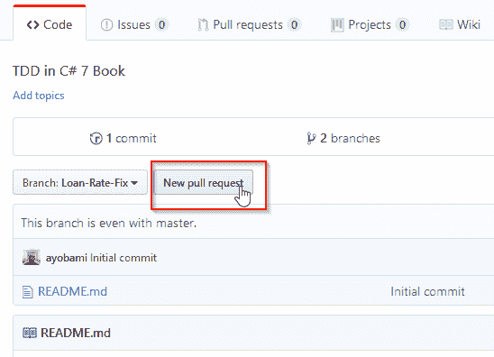
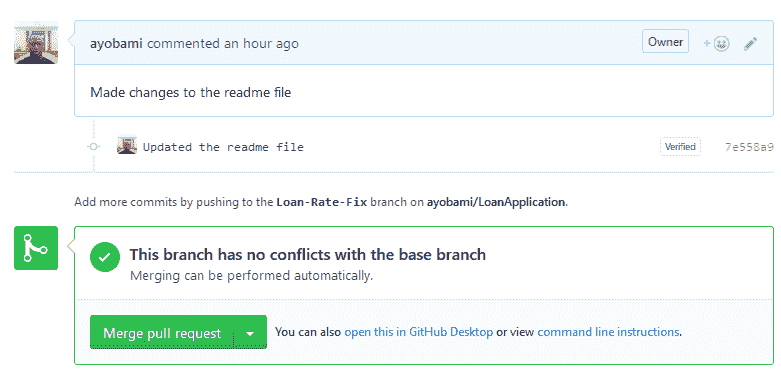
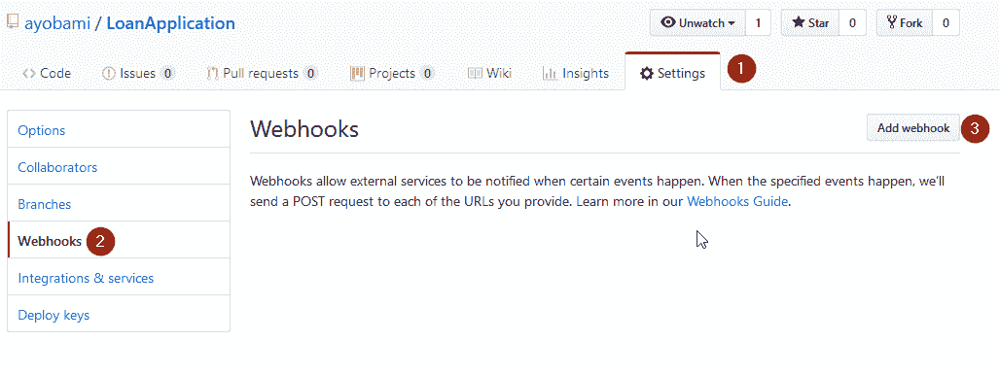
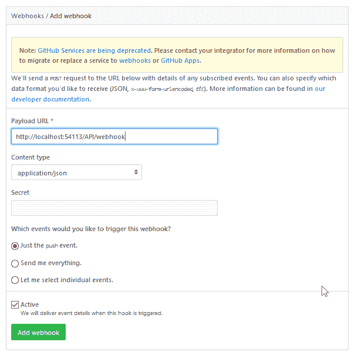
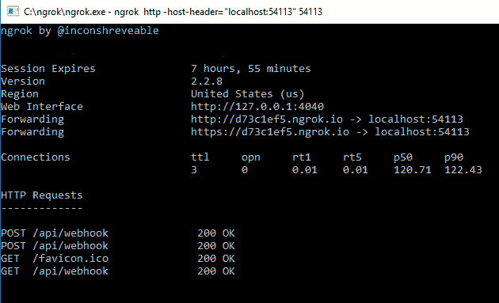

# 持续集成和项目托管

在[第 4 章](4.html)，*.net Core Unit Testing*中，我们探讨了。net Core 和 c#中可用的各种单元测试框架，之后还详细探讨了 xUnit.net 框架。 然后，我们在[第 5 章](5.html)、*数据驱动单元测试*中讨论了数据驱动单元测试的重要概念，这些概念有助于创建可以使用从不同数据源加载的数据执行的单元测试。 在[第 6 章](6.html)，*模拟依赖项*中，我们详细解释了依赖项模拟，其中我们通过*Moq 框架*来创建模拟对象。

有效的 TDD 实践可以帮助提供关于软件项目代码库质量的有用和深刻的反馈。 通过持续集成，构建自动化和代码自动化测试的过程被提升到一个新的水平，允许开发团队利用最先进的现代源代码版本控制系统中可用的基本和高级特性。

适当的持续集成设置和实践会产生有回报的持续交付，在这种情况下，软件项目开发过程可以在项目的生命周期内交付或交付到产品中。

在本章中，我们将探讨持续集成和持续交付的概念。 本章将涵盖以下主题:

*   持续集成
*   持续交付
*   GitHub 在线项目托管
*   基本 Git 命令
*   配置 GitHub 人
*   TeamCity 持续集成平台

# 持续集成

**持续集成**(**CI**)是一种软件开发实践，在这种实践中，软件项目的源代码每天被软件开发团队的成员集成到一个存储库中。 最好是在开发过程的早期阶段开始。 代码集成通常由 CI 工具执行，该工具使用自动构建脚本执行代码验证。

在一个开发团队中，通常有多个开发人员负责项目的不同部分，项目的源代码托管在一个存储库中。 每个开发人员都可以在其计算机上拥有主分支或主线的本地版本或工作副本。

从事某个特性的开发人员将对本地副本进行更改，并使用一组准备好的自动化测试来测试代码，以确保代码能够工作，并且不会破坏任何现有的工作功能。 一旦验证了这一点，本地副本就会被存储库中的最新副本更新。 如果更新产生了任何冲突，那么需要在最终提交或将完成的工作集成到主线中之前解决这些冲突。

源代码存储库通过保存快照和源文件的版本以及超时后所做的更改，促进了对项目代码库的充分版本控制。 如果有必要，开发人员可以恢复或签出提交的早期版本。 存储库可以被托管在本地团队的基础设施,如有现场**Microsoft team Foundation Server 或基于云的存储库,如**GitHub**,**Bitbucket 都**,和许多其他人。**

 **# CI 工作流

CI 要求适当的工作流到位。 CI 的第一个主要组成部分是建立一个可工作的源代码存储库。 这是跟踪项目贡献者所做的所有更改以及协调不同活动所需要的。

为了实现健壮有效的 CI 设置，需要覆盖并正确设置以下方面。

# 单源代码存储库

为了有效地使用源代码存储库，成功构建项目的工作版本所需的所有文件都应该放在单个源代码存储库中。 这些文件应该包括源文件、属性文件、数据库脚本和模式，以及所使用的第三方库和资产。

其他配置文件也可以放在存储库中，特别是开发环境配置。 这将确保项目中的开发人员拥有一致的环境设置。 开发团队的新成员可以使用存储库中可用的配置轻松地设置他们的环境。

# 构建自动化

CI 工作流的构建自动化步骤是确保检测到项目代码库中的更改，并自动测试和构建。 构建自动化通常是在构建脚本的帮助下完成的，构建脚本分析要进行的更改和需要进行的编译。 应该定期构建源代码，最好是每天或每晚构建。 提交的成功是根据是否成功构建了代码库来衡量的。

构建自动化脚本应该能够在有或没有测试的情况下构建系统。 这应该在构建中可以配置。 无论开发人员的 ide 是否有内置的构建管理，都应该在服务器上配置一个中央构建脚本，以确保项目可以构建并轻松地在开发服务器上运行。

# 自动化测试

代码库应该具有自动化测试，这些测试应该覆盖使用相关测试数据的大量可能的测试组合。 应该使用合适的测试框架来开发自动化测试，该框架可以覆盖软件项目的所有层或部分。

有了适当的自动化测试，当自动化构建脚本运行时，可以很容易地检测到源代码中的 bug。 将自动化测试集成到构建过程中，将确保提供良好的测试覆盖率和失败或通过测试的报告，以促进代码的重构。

# 相同的测试和生产环境

为了获得顺利的 CI 体验，确保测试环境和生产环境是相同的是很重要的。 这两个环境应该具有类似的硬件和操作系统配置，以及环境设置。

另外，对于使用数据库的应用程序，测试环境和生产环境都应该具有相同的版本。 运行时和库也应该类似。 然而，有时可能不可能在生产环境的每个实例(例如桌面应用程序)中进行测试，但是您必须确保在测试中使用生产环境的副本。

# 每天提交

代码库的整体运行状况由成功的构建过程运行决定。 项目的主线应该通过开发人员的提交定期更新。 提交代码的开发人员有责任确保代码在推送到存储库之前进行了测试。

如果开发人员的提交破坏了构建，则不应该拖延。 在再次提交更改之前，可以执行回滚来隔离地修复问题。 项目主线或主要分支应始终处于良好状态。 每天提交更改通常更可取。

# CI 的好处

将 CI 整合到开发过程中对开发团队来说非常有价值。 CI 过程提供了许多好处，下面将解释其中一些好处。

# 快速的缺陷检测

有了 CI 流程，就可以频繁地运行自动化测试，并且可以及时发现并修复错误，从而产生一个高质量的健壮系统。 CI 不会自动消除系统中的 bug; 开发人员必须努力编写经过良好测试的干净代码。 然而，CI 可以帮助及时检测那些可能会潜入到生产中的 bug。

# 提高了生产率

开发团队的整体生产力可以通过 CI 得到提高，因为开发人员可以从日常或手工任务中解放出来，这些任务可以作为 CI 过程的一部分自动执行。 开发人员可以专注于开发系统特性的重要任务。

# 降低了风险

有时，由于固有的复杂性，软件项目往往会由于低估需求和其他问题而超出预算和时间表。 CI 可以帮助降低与软件开发相关的风险。 通过频繁的代码提交和集成，可以更清楚地了解项目的状态，并且可以轻松地隔离和处理任何潜在的问题。

# 促进持续交付

对于使用 CI 的开发团队来说，持续或频繁的部署变得相对容易。 这是因为新特性或需求可以快速交付和发布。 这将允许用户对产品提供充分和有用的反馈，这可以用来进一步完善软件和提高质量。

# CI 工具

有相当多的 CI 工具可用，每一种工具都具有不同的特性，这些特性有助于简化 CI 并为部署管道提供良好的结构。 CI 工具的选择取决于几个因素，包括:

*   开发环境、程序语言、框架和应用程序架构
*   开发团队的组成、经验、技能和能力的水平
*   部署环境设置、操作系统和硬件要求

下面介绍一些流行和最常用的 CI 工具。 当有效使用这些 CI 工具时，可以帮助开发团队在软件项目中实现质量标准。

# Microsoft Team Foundation Server

Microsoft**Team Foundation Server**(**TFS**)是一个集成的服务器套装，包含了一组协作工具，以提高软件开发团队的生产力。 TFS 提供了可以与 ide 集成的工具，如**Visual Studio**、**Eclipse**，以及更多的 ide 和代码编辑器。

TFS 提供了一组工具和扩展，以促进顺利的 CI 过程。 使用 TFS，构建、测试和部署应用程序的过程可以自动化。 TFS 通过支持广泛的编程语言和源代码存储库提供了很大的灵活性。

# TeamCity

**TeamCity**是 JetBrains 开发的企业级 CI 工具。 它支持绑定的。net CLI，并且与 TFS 类似，它支持自动部署和组合构建。 TeamCity 可以在代码通过 ide 可用的插件提交之前在服务器上验证并运行自动化测试。

# 詹金斯

Jenkins**Jenkins**是一个开源 CI 服务器，可以独立运行，也可以在容器中运行，也可以通过本机系统包安装。 它是自包含的，能够自动化测试、构建相关任务和应用程序部署。 通过一组链工具和插件，Jenkins 可以与 ide 和源代码存储库集成。

# 持续交付

**连续交付**是 CI 的续作或延伸。 它是一组软件开发实践，确保项目的代码可以部署到与生产环境相同的测试环境中。 持续交付确保了所有更改都是最新的，并且可以在更改通过自动化测试后立即交付并部署到生产环境中。

众所周知，实施 CI 可以促进团队成员之间的良好沟通，消除潜在的风险。 开发团队需要更进一步，通过实践持续交付来确保他们的开发活动对客户有益。 这可以通过确定应用程序在开发周期的任何阶段都是可部署和生产就绪的来实现。

通过开发团队成员的有效沟通和协作，可以实现持续的交付。 这要求应用程序交付过程的主要部分通过一个开发的和细化的部署管道实现自动化。 在任何时候，所开发的应用程序都应该是可部署的。 产品所有者或客户将决定何时部署应用程序。

# 连续交付的好处

通过持续交付，软件开发团队的生产力可以得到提高，同时还可以减少将软件应用程序发布到生产环境中的成本和周转时间。 以下是您的团队应该实践连续交付的原因。

# 更低的风险

与 CI 类似，持续交付有助于降低通常与软件发布和部署相关的风险。 这可以确保零停机时间和应用程序的高可用性，因为经常进行的更改是定期集成的，并且可以用于生产。

# 软件产品质量

由于测试、构建和部署过程的自动化，软件产品很容易对最终用户可用。 用户将能够提供有用和有价值的反馈，这些反馈可用于进一步完善和提高应用程序的质量。

# 降低成本

由于自动化了开发和部署过程的不同部分，软件项目开发和发布成本可以大大降低。 这是因为与增量和连续更改相关的成本被消除了。

# GitHub 在线项目托管

GitHub**GitHub**是一个源代码托管平台，用于版本控制，允许开发团队成员在软件项目中协作和工作，而不考虑他们的地理位置。 GitHub 目前包含了几个使用不同编程语言的开源和专有项目。

GitHub 提供了基本和高级特性，使协作更容易。 它本质上是一个基于 web 的源代码存储库或托管服务，使用 Git 作为版本控制系统，基于 Git 的分布式版本控制行为。

有趣的是，像**Microsoft**，**谷歌**，**Facebook**，以及**Twitter**这些顶级公司都将他们的开源项目托管在 GitHub 上。 基本上，任何 CI 工具都可以与 GitHub 一起使用。 这使得开发团队可以根据他们的预算灵活地选择 CI 工具，使用 GitHub。

除了 GitHub 提供的源代码托管服务，公共网页也可以通过 GitHub 免费托管。 这个特性允许 GitHub 用户创建与所托管的开源项目相关的个人网站。

GitHub 同时支持公共和私有项目存储库托管。 任何人都可以看到公共存储库的文件和提交历史，而私有存储库的访问仅限于添加的成员。 托管在 GitHub 上的私有存储库是有成本的。

# 项目托管

要创建一个项目存储库并访问 GitHub 的特性，您需要首先创建一个 GitHub 帐户。 这可以通过导航到[https://github.com](https://github.com)来完成。 在成功创建帐户之后，您可以继续创建项目存储库。

GitHub 存储库用于组织项目文件夹、文件和资产。 文件包括图片、视频和源文件。 在 GitHub 中，存储库有一个包含项目简明描述的`README`文件是一种常见的做法。 可以选择将软件许可文件添加到项目中。

下面的步骤描述了如何在 GitHub 中创建一个新的存储库:

1.  用创建的帐户登录 GitHub。
2.  导航到[https://github.com/](https://github.com/)new 或从屏幕右上角，在帐户头像或头像旁边，点击+图标。
3.  弹出一个下拉菜单，您可以在其中选择“新建存储库”:


4.  命名存储库`LoanApplication`并提供项目描述。
5.  选择 Public，使存储库可以公开访问。
6.  选择“用 README 初始化此存储库”，以便在项目中包含一个`README`文件。

7.  最后，点击创建存储库，创建并初始化存储库:


# 使用 GitHub 流进行分支

GitHub 有一个基于分支的工作流，称为**GitHub Flow**，为开发团队协作和频繁部署项目提供了强大的支持和工具。

GitHub 流程促进以下:

*   从新的或现有的存储库创建分支
*   创建、编辑、重命名、移动或删除文件
*   基于商定的更改从分支发送 pull 请求
*   根据需要对分支进行更改
*   当分支准备合并时合并 pull 请求
*   通过使用拉取请求或分支页面上的删除按钮来清理分支

从项目中创建分支是 Git 的核心，也是 GitHub 的扩展，GitHub 是 GitHub Flow 的核心概念。 分支**分支**的创建是为了尝试新的概念和想法，或者是为了处理一个特性修复。 分支是存储库的不同版本。

当创建一个新的分支时，通常的做法是在主分支的基础上创建分支。 这将创建一个当时包含在主服务器中的所有文件和配置的副本。 从技术上讲，分支是独立于主分支的，因为在分支上所做的更改不会影响主分支。 然而，新的更新可以从主服务器拉到分支，并且在分支上所做的更改可以合并回主服务器。

下面的 GitHub 图，进一步解释了 GitHub 项目分支的流程，其中提交到分支的变更通过 pull 请求合并到 master:


主分支必须在任何时候都是可部署的。 只有在拉请求被打开后，对已创建分支的更改才应该合并到主分支。 在通过必要的验证和自动化测试之后，将仔细审查和接受这些更改。

要从之前创建的`LoanApplication`存储库中创建一个新的分支，执行以下步骤:

1.  导航到存储库。
2.  点击位于文件列表顶部的下拉菜单，标题为 Branch: master。
3.  键入一个描述性分支名称，该名称在新分支文本框中提供有关该分支的有意义信息。

4.  点击高亮显示的带有分支名称的链接来创建分支:


现在，新创建的分支和主分支完全相同。 通过添加和修改源文件，您可以开始对已创建的分支进行更改。 更改直接提交到分支而不是主。

提交变更有助于正确跟踪一段时间内对分支所做的变更。 每次提交更改时都会提供一个提交消息。 提交消息提供了关于更改内容的详细描述。 始终提供提交消息非常重要，因为 Git 使用提交跟踪更改。 通过提交消息提供所做更改的历史记录，这可以促进项目上的轻松协作。

在存储库中，每次提交都是一个不同的变更单元。 如果工作代码库因提交而中断，或者提交引入了一个 bug，则可以回滚提交。

# 把请求

不管您对代码库所做的更改是大是小，您都可以在项目开发过程中的任何时候发起 pull 请求。 Pull request 是 GitHub 中协作的核心，因为它促进了对提交的讨论和审查。

要打开一个拉请求，单击新拉请求选项卡。 你会被带到拉请求页面，在那里你可以为请求提供评论或描述，然后点击新拉请求按钮:



当您打开一个拉取请求时，项目的所有者或维护者将被告知未决的更改以及您进行合并的意图。 在对分支所做的更改进行适当的审查之后，可以提供必要的反馈以进一步细化代码。 pull 请求显示了您的分支和主分支的文件和内容的差异。 如果认为所做的贡献是好的，它们将被接受并合并到主分支:


# 检查更改并合并

发起 pull 请求后，参与团队的成员将审查更改，并根据存储库的当前位置提供注释。 当拉取请求打开时，您可以继续进行更改，并且与该审查相关的任何评论都将显示在统一的拉取请求视图上。 评论是用 markdown 写的，包含预先格式化的文本块、图像和表情符号。

一旦 pull 请求被审核并接受，它们将合并到 master 分支中。 可以按照以下步骤在 GitHub 中合并请求。 单击 Merge pull request 按钮将更改合并到 master 中。 然后单击确认合并，这将合并分支上的提交到主:



一个拉请求的历史记录保存在 GitHub 中，之后可以搜索，以确定为什么拉请求被发起，同时提供访问已完成的审查和添加的评论。

# 基本 Git 命令

Git 是一个**分布式版本控制系统**(**DVCS**)。 Git 的分支系统非常健壮，使它在其他版本控制系统中脱颖而出。 使用 Git，可以创建一个项目的多个分支，它们彼此独立。 分支的创建、合并和删除过程是无缝的，而且非常快。

Git 极大地支持无摩擦上下文切换的概念，在这里，您可以轻松地创建一个分支来探索您的想法、创建和应用补丁、提交、合并分支，然后切换回您正在处理的早期分支。 所使用的分支工作流将决定是否为每个特性或特性组创建一个分支，同时轻松地在各个分支之间切换以测试特性。

通过为生产、测试和开发设置不同的分支，您可以使用 Git 组织开发并提高生产率，从而控制进入每个分支的文件流和提交。 通过拥有一个好的存储库结构，您可以轻松快速地试验新的想法，并在完成时删除分支。

Git 拥有丰富的有用命令集，掌握了这些命令就可以完全访问其内部结构，并允许基本和高级源代码版本控制操作。 Git 为 Windows、Macintosh 和 Linux 操作系统提供命令行界面和图形用户界面客户端。 这些命令可以在 Mac 和 Linux 的终端上运行，而在 Windows 中有 Git Bash，这是一个用于从命令行运行 Git 的模拟器。

Git 上可用的命令用于执行源代码存储库的初始设置和配置、共享和更新项目、分支和合并，以及各种与源代码版本控制相关的操作。

# 配置命令

可以使用一组命令来配置用户信息，这些信息跨越安装 Git 的计算机上的所有本地存储库。 命令用于获取和设置全局存储库选项。 它接受`--global`选项，该选项后面跟着特定的配置，以便从全局`.gitconfig`文件中获取或设置条目。

要设置将附加到所有提交事务的全局用户名，运行以下命令:

```cs
git config --global user.name "[name]"
```

还可以设置全局用户电子邮件地址。 这将把设置的电子邮件地址附加到所有提交事务。 执行以下命令实现:

```cs
git config --global user.email "[email address]"
```

为了更好地美观，您可以启用命令行输出的着色，使用以下命令:

```cs
git config --global color.ui auto
```

# 库初始化命令

`git init`命令用于创建一个空的 Git 存储库，并重新初始化一个已存在的存储库。 当运行`git init`命令时，将在子目录旁边创建一个`.git`目录，以保存对象`refs/heads`、`refs/tags`、模板文件和引用主分支的 HEAD 的初始 HEAD 文件。 在最简单的形式中，`git init`命令传递存储库名称，这将创建一个具有指定名称的存储库:

```cs
git init [repository-name]
```

要更新和选择新添加的模板或将存储库迁移到另一个位置，可以在现有的存储库中重新运行`git init`。 该命令不会覆盖存储库中已经存在的配置。 完整的`git init`命令概要如下:

```cs
git init [-q | --quiet] [--bare] [--template=<template_directory>] 
 [--separate-git-dir <git dir>]  [--shared[=<permissions>]] [directory] 
```

让我们详细讨论前面的命令:

*   使用`-q`或`--quiet`选项时，将打印错误和警告消息，而抑制其他输出消息。
*   选项`--bare`用于创建裸存储库。
*   `--template=<template_directory>`用于指定使用模板的文件夹。
*   `--separate-git-dir=<git dir>`用于指示到存储库的目录或路径，或者在重新初始化时移动存储库的路径。
*   选项`--shared[=(false|true|umask|group|all|world|everybody|0xxx)]`用于通知 Git 存储库将在多个用户之间共享。 属于同一组的用户可以推入存储库。

使用`git clone`命令，可以将现有存储库克隆到一个新目录中。 该命令为克隆存储库中的所有分支创建远程跟踪分支。 它将下载项目及其整个版本历史。 `git clone`命令可以简单地通过将存储库的 URL 作为一个选项来使用:

```cs
git clone [url]
```

传递给该命令的 URL 将包含传输协议、远程服务器地址和存储库路径的信息。 Git 支持的协议有 SSH、Git、HTTP 和 HTTPS。 该命令有其他可以传递给它的选项，以配置要克隆的存储库。

# 变更命令

Git 有一组有用的命令，用于检查存储库中文件的状态、检查对文件的更新以及提交对项目文件的更改。

`git status`命令用于显示存储库的工作状态。 该命令实际上给出了已更改的文件的摘要，并将这些文件暂留以备下一次提交。 它显示当前 HEAD 提交和索引文件之间存在差异的文件的路径。 它还显示索引文件和工作树之间存在差异的文件的路径，以及当前未被 Git 跟踪但未被添加到`.gitignore`文件中的文件的路径:

```cs
git status
```

`git add`命令使用在工作树中找到的内容更新索引。 它基本上是将文件内容添加到索引中。 它用于添加现有路径的当前内容。 它可以用来删除树中不再存在的路径，或者用对工作树所做的部分更改添加内容。

实践通常是在执行提交之前多次运行该命令。 它将添加与运行命令时相同的文件内容。 它接受用于调整其行为的选项:

```cs
git add [file]
```

`git commit`命令用于记录或存储提交中索引的内容，并与用户提供的提交消息一起描述对项目文件所做的更改。 在运行该命令之前，必须使用`git add`添加了这些更改。

该命令是灵活的，并且允许使用不同的选项来记录更改。 一种方法是将带有更改的文件作为提交命令的参数列出，该命令通知 Git 忽略索引中的更改，并存储所列出文件的当前内容。

此外，`-a`switch 可以与命令一起使用，从索引中列出的所有文件中添加更改，这些文件不在工作树中。 Switch`-m`用于指定提交消息:

```cs
git commit -m "[commit message]"
```

有时，需要显示索引和工作树之间的差异或变化，两个文件或 blob 对象之间可用的变化。 `git diff`命令用于此目的。 当将`--staged`选项传递给该命令时，Git 会显示 staging 和上一个文件版本之间的差异:

```cs
git diff
```

`git rm`命令从工作树和索引中删除文件。 要删除的文件作为一个选项传递给命令。 作为参数传递给命令的文件将从工作目录中删除，并暂存以进行删除。 当`--cached`选项被传递给该命令时，Git 不会从工作目录中删除该文件，而是将其从版本控制中删除:

```cs
git rm [files]
```

可以使用`git reset`命令取消暂存，并保存已经在存储库中暂存的文件的内容。 该命令用于将当前`HEAD`置为指定状态。 此外，它还可以用于根据指定的选项修改索引和工作树。

该命令有三种形式。 第一种和第二种形式用于将条目从树复制到索引中，而最后一种形式用于将当前分支`HEAD`设置为特定的提交:

```cs
git reset [-q] [<tree-ish>] [--] <paths>…​
git reset (--patch | -p) [<tree-ish>] [--] [<paths>…​]
git reset [--soft | --mixed [-N] | --hard | --merge | --keep] [-q] [<commit>]
```

# 分支和合并命令

`git branch`命令是 Git 版本控制系统的核心。 它用于在存储库中创建、移动、重命名、删除和列出可用分支。 该命令有几种表单，并接受用于设置和配置存储库分支的不同选项。 在 Bash 上运行`git branch`命令时，不指定选项，就会列出存储库中的可用分支。 这类似于使用`--list`选项。

要创建一个新的分支，运行`git branch`命令并以分支名称作为参数:

```cs
git branch [branch name]
```

`--delete`选项用于删除指定的分支，`--copy`选项用于在其`reflog`旁边创建指定分支的副本。

要更新工作树或分支中的文件以匹配其他工作树中可用的文件，可以使用`git checkout`命令。 该命令用于切换分支或恢复工作树文件。 与`git branch`类似，它有多种形式并接受不同的选项。

当以分支名称作为参数运行该命令时，Git 切换到指定的分支，更新工作目录，并将 HEAD 指向该分支:

```cs
git checkout [branch name]
```

正如前面部分所讨论的，分支概念允许开发团队尝试新的想法，并从现有的想法创建项目的新版本。 分支的美妙之处在于能够合并从一个分支到另一个分支的变化，本质上是将分支或开发线结合在一起。

在 Git 中，`git merge`命令用于将从一个分支创建的开发分支集成到一个分支中。 例如，如果有一个从主分支创建的开发分支，以测试某个特性，当`git merge [branch name]`命令运行时，Git 将重新跟踪对该分支所做的更改。 这是因为它被从主分支拒绝，直到最新的分支，并将这些更改存储在主分支的一个新的提交:

```cs
git merge [branch name]
git merge --abort
git merge -- continue
```

通常，合并过程会导致不同分支的文件之间的冲突。 运行`git merge --abort`命令将中止合并进程，并将分支恢复到合并前的状态。 解决遇到的冲突后，可以运行`git merge --continue`以重新运行合并进程。

# 配置 GitHub 人

**WebHook**是通过 HTTP POST 传递的事件通知。 WebHook 通常被称为 web 回调或 HTTP 推送 API。 WebHook 提供了一种机制，通过这种机制，应用程序可以在数据到达时实时地向其他应用程序传递数据。

WebHook 与常规 API 的不同之处在于，它不需要通过轮询数据来获取最新的数据来持续利用资源。 当数据通过 URL 可用时，订阅者或消费应用程序接收数据，该 URL 必须已注册到 WebHook 提供者。 WebHook 对于数据的提供者和使用者来说都是有效和高效的。

# 消费人

要从 WebHook 接收通知或数据，消费应用程序需要向提供者注册一个 URL。 提供者将通过 POST 将数据传递到 URL。 该 URL 必须可以从 web 上公开访问，并且可以访问。

WebHook 提供者通常通过 HTTP POST 以 JSON、XML 或通过多部分或 URL 编码的形式传递数据。 订阅者 URL 上 API 的实现将受到 WebHook 提供程序使用的数据传递模式的影响。

很多情况下，需要对 webhook 进行调试。 这可能是为了排除错误。 由于 webhook 的异步特性，这有时会具有挑战性。 首先，必须理解来自 WebHook 的数据。 这可以通过使用能够获取和解析 WebHook 请求的工具来实现。 根据对 WebHook 数据的结构和内容的了解，可以模拟请求来测试 URL API 代码以解决问题。

当使用来自 WebHook 的数据时，重要的是要注意安全性，并将安全性考虑到使用应用程序的设计中。 因为 WebHook 提供者将 POST 数据到的回调 URL 是公开可用的，所以它可能受到恶意攻击。

一种常见且简单的方法是向 URL 附加一个强制身份验证令牌，该令牌将在每个请求上进行验证。 此外，还可以围绕 URL 构建基本身份验证，在接受和处理数据之前验证发起 POST 的一方。 或者，如果请求签名已经在提供者端实现，提供者可以对每个 WebHook 请求签名。 发布的每个请求的签名将由消费者验证。

根据订阅者生成事件的频率，WebHooks 可以引发很多请求。 如果订阅者没有适当地设计来处理如此大的请求，这可能会导致高资源利用率，无论是在带宽还是服务器资源方面。 当资源被充分利用并耗尽时，使用者可能不再能够处理更多的请求，从而导致使用者应用程序的服务被拒绝。

# GitHub WebHook

在 GitHub 中，当事件发生时，webhook 作为一种向外部 web 服务器发送通知的方式。 GitHub WebHooks 允许你设置托管在 GitHub 上的项目，以订阅在[www.github.com](http://www.github.com)平台上可用的所需事件。 当事件发生时，GitHub 发送一个有效负载到配置的端点。

webhook 是在任何存储库或组织级别上配置的。 一旦成功配置，WebHook 将在每次触发订阅的事件或动作时被触发。 GitHub 允许为一个存储库或组织的每个事件创建最多 20 个 webhook。 安装之后，可以在存储库或组织上触发 webhook。

# 事件和有效载荷

在 GitHub 的 WebHook 配置中，你可以指定你想从 GitHub 接收哪些事件请求。 WebHook 请求数据在 GitHub 中被称为有效载荷。 明智的做法是只订阅所需数据的事件，以限制从 GitHub 发送到应用服务器的 HTTP 请求。 默认情况下，即使是在 GitHub 上创建的 WebHook 也会订阅`push`事件。 事件订阅可以通过 GitHub web 或 API 进行修改。

下面的表格解释了一些可以在 GitHub 上订阅的事件:

| **事件** | **描述** |
| `push` | 这是默认事件，当有 Git 推送到存储库时将引发该事件。 这还包括编辑标记或分支，以及通过更新引用的 API 操作提交 |
| `create` | 每当创建分支或标记时引发。 |
| `delete` | 每当删除分支或标记时将引发。 |
| `issues` | 每当问题被分配、未分配、标记、未标记、打开、编辑、里程碑、去里程碑、关闭或重新打开时都会引发。 |
| `repository` | 当存储库被创建、删除(仅组织钩子)、存档、未存档、公开或私有时将引发。 |
| `*` | 这是一个通配符事件，它指示应该为任何事件通知 URL。 |

GitHub 上所有可用事件的完整列表可以在[https://developer.github.com/webhooks/](https://developer.github.com/webhooks/)上找到。

事件具有包含更详细信息的有效负载。 GitHub 中的每个事件都有一个特定的有效负载格式，描述该事件所需的信息。 除了事件特有的特定字段外，每个事件在有效负载中包括触发事件的用户或发送方。

此外，有效负载中还包括发生事件的存储库或组织以及与事件相关的应用程序。 有效载荷不能超过 5mb。 不会触发产生大于 5 MB 负载的事件。 传递给 URL 的有效负载通常包含几个头，其中一些在下表中进行了解释。 当创建一个新的 WebHook 时，GitHub 发送一个 ping 到配置的 URL，作为 WebHook 配置成功的指示:

| **头部** | **描述** |
| --- | --- |
| `User-Agent` | 用户代理发起请求。 它总是带有前缀`Github-Hookshot`。 |
| `X-GitHub-Event` | 包含触发传递的事件的名称。 |
| `X-GitHub-Delivery` | 标识交付的 GUID。 |
| `X-Hub-Signature` | 此报头包含响应体的 HMAC 十六进制摘要。 如果 WebHook 配置了一个秘密，这个报头将被发送。 头部的内容是使用`sha1 hash`函数生成的，秘密作为 HMAC 密钥。 |

# 设置您的第一个 WebHook

要配置 WebHook，我们将使用前面创建的`LoanApplication`存储库。 点击存储库的设置页面，点击 webhook，然后点击 Add webhook:



GitHub 会要求您验证操作。 提供您的 GitHub 帐户密码继续。 WebHook 配置页面将被加载，在这里你可以配置 WebHook 的选项:

1.  在 Payload URL 字段中，提供 web 应用服务器的端点。 因为我们将从 Visual Studio 运行`LoanApplication`，所以我们将使用以下 URL:`http://localhost:54113/API/webhook`。
2.  将 Content 类型下拉菜单改为 application/json，以允许 GitHub 通过 POST 以 json 形式发送有效负载。
3.  接下来，选择选项 Let me select individual events。 这将显示可用 WebHook 事件的完整列表。
4.  选择您希望 WebHook 订阅的事件。

5.  最后点击**添加 webhook**按钮，完成配置:



一旦 WebHook 被创建，GitHub 将尝试发送一个 ping 到 WebHook 中配置的 URL。 指定的 URL`http://localhost:54113/api/webhook`是本地开发，不是公开可用的。 因此 GitHub 无法访问它，导致 WebHook 请求失败:


我们可以使用**Ngrok**这个工具来创建一个公开本地 web 服务器的公共 URL，从而将开发环境公开到互联网上，使其可以被 GitHub 访问。 浏览[https://ngrok.com/download](https://ngrok.com/download)下载适合您操作系统的 Ngrok。

运行以下命令告诉 Ngrok 将端口`54113`公开到互联网:

```cs
ngrok http -host-header="localhost:54113" 54113
```

Ngrok 将创建一个公共 URL，可以访问该 URL，并将其转发到开发 PC 上的指定端口。 在这种情况下，Ngrok 生成了`http://d73c1ef5.ngrok.io`作为 URL，将其转发到端口`54113`:



接下来，将先前创建的 WebHook 的有效负载 URL 更新为`http://d73c1ef5.ngrok.io/api/webhook`。 单击 Update WebHook 按钮保存更改。 在 Recent Deliveries 选项卡下，单击未能交付的有效负载的 GUID。 这将打开一个屏幕，显示 JSON 有效负载，以及一个请求和响应。

点击 Redeliver 按钮。 这将显示一个对话框，询问您是否要重新交付有效负载。 单击 Yes，重新交付此有效载荷按钮。 这将尝试将 JSON 有效负载 POST 到有效负载 URL 字段中指定的新端点。 这一次，有效负载交付将成功，HTTP 响应代码`200`，表示成功联系到端点:


您可以编程消费者 web 应用程序以您希望的方式处理有效负载数据。 配置成功后，GitHub 将在 WebHook 中订阅的任何事件被触发时将有效负载 POST 到端点。

# TeamCity CI 平台

TeamCity 是 JetBrains 开发的独立于平台的 CI 工具。 它是一个用户友好的 CI 工具，专门为软件开发人员和工程师设计的。 TeamCity 是一个健壮而强大的 CI 工具，因为它能够完全优化集成周期。

TeamCity 还可以在不同的平台和环境上并行地运行构建。 使用 TeamCity，您可以定制代码质量、构建持续时间，甚至创建定制指标的统计数据。 它有一个运行代码覆盖的特性，还有一个重复查找器。

# TeamCity 的概念

在本节中，将解释 TeamCity 中经常使用的一些基本术语。 为了理解成功配置构建步骤以及高质量连续过程所需的工件所需的一些概念，这是必要的。 让我们来看看一些基本的术语:

*   **Project**:这是正在开发的软件项目。 它可以是一个发布版或特定的版本。 此外，它还包括 Build Configurations 的集合。
*   **构建代理**:这是执行构建过程的软件。 它独立于 TeamCity 服务器安装。 它们可以驻留在同一台机器上，也可以驻留在运行类似或不同操作系统的独立机器上。 出于生产目的，通常建议将它们安装在不同的机器上，以获得最佳性能。
*   **TeamCity Server**:TeamCity Server 监控构建代理，同时使用兼容性要求将构建分发到连接的代理，并报告进度和结果。 结果中的信息包括构建历史、日志和构建数据。
*   **Build**:这是创建软件项目的特定版本的过程。 触发构建流程将其置于构建队列中，并将在有可用代理运行它时启动。 构建代理在完成构建后将构建工件发送到 TeamCity 服务器。
*   **构建队列**:这是一个包含已触发且尚未启动的构建的列表。 TeamCity Server 读取等待构建的队列，并在代理空闲时将构建分发给兼容的构建代理。
*   **构建工件**:这些是由构建生成的文件。 这些文件包括`dll`文件、可执行文件、安装程序、报告、日志文件等等。
*   **构建配置**:这是描述构建过程的设置集合。 这包括 VCS 根、构建步骤和构建触发器。
*   **构建步骤**:构建步骤由一个集成了构建工具(如 MSBuild)、代码分析引擎和测试框架(如 xUnit.net)的构建运行程序来表示。 构建步骤本质上是一个要执行的任务，它可以包含许多顺序执行的步骤。
*   **Build Trigger**:这是一组在特定事件上触发新构建的规则，例如当 TeamCity 检测到配置的 VCS 根中的更改时，当一个 VCS 触发一个新构建。
*   **VCS 根**:这是一个版本控制设置的集合，包括到源的路径、凭据和其他定义 TeamCity 与版本控制系统通信方式的设置。
*   **更改**:这是对项目源代码的修改。 对于特定的生成配置，当变更已提交到版本控制系统，但尚未包含在生成中时，变更称为挂起。

# 安装 TeamCity 服务器

TeamCity 可以本地托管在开发团队的服务器基础设施上，也可以通过将 TeamCity 与云解决方案集成而实现。 这允许配置虚拟机来运行 TeamCity。 TeamCity 安装将由服务器安装和默认的构建代理组成。

要安装 TeamCity Server，请访问 JetBrains 下载站点获取免费的 TeamCity Server 专业版本，该版本附带免费的许可密钥，可以解锁 3 个构建代理和 100 个构建配置。 如果您使用的是 Windows 操作系统，请运行下载的`.exe`，它与 Tomcat Java JRE 1.8 捆绑在一起。 按照对话框提示提取并安装 TeamCity 核心文件。

在安装过程中，您可以设置 TeamCity 将要侦听的端口，或者将其设置为默认的`8080`。 如果安装成功，TeamCity 将在浏览器中打开，提示您通过在服务器上指定 Data Directory Location 来完成安装过程。 指定路径并单击 Proceed:


初始化 Data Directory Location 路径后，将转到数据库选择页面，在该页面中可以选择任何受支持的数据库。 选择 Internal (HSQLDB)并单击 Proceed 按钮:


在您看到许可协议页面之前，数据库配置将花费几秒钟的时间。 接受许可协议并单击 Continue 按钮。 下一页是 admin 帐户创建页。 使用所需的凭据创建帐户以完成安装。 安装完成后，您将进入概览页面:


# TeamCity CI 工作流

TeamCity 构建生命周期描述服务器和代理之间的数据流。 这基本上是传递给代理的信息以及 TeamCity 检索结果的过程。 工作流描述了项目的配置构建步骤从头到尾执行的方式:

1.  TeamCity 服务器检测到 VCS 根目录中的变更，并将其持久化到数据库中。
2.  构建触发器注意到数据库中的更改，并将构建添加到队列中。
3.  TeamCity Server 将队列上的构建分配给一个兼容的空闲构建代理。

4.  生成代理执行生成步骤。 在执行构建步骤期间，代理将构建进度报告发送到服务器。 构建代理向 TeamCity 服务器报告构建进度，以便实时监视构建过程。
5.  构建代理在完成构建后将构建工件发送到 TeamCity 服务器。

# 配置和运行构建

基本上，项目应该包含运行成功构建所需的配置和项目属性。 使用 TeamCity CI 服务器，运行测试、执行环境检查、编译、构建和使项目的部署就绪版本可用所需的步骤可以端到端自动化。

可以在安装期间指定的端口本地访问已安装的 TeamCity Server。 在本例中，我们将使用`http://localhost:8060`。 要创建 TeamCity 项目，导航到服务器 URL 并使用前面创建的凭据登录。 单击“项目”菜单，然后单击“创建项目”按钮。

你将看到几个项目选项，用于从存储库中手动创建项目，或连接到任何 GitHub、Bitbucket 或 Visual Studio Team Services。 点击 From GitHub.com 按钮将 TeamCity 连接到我们之前在 GitHub 上创建的`LoanApplication`存储库:


弹出**Add Connection**对话框，TeamCity 将被连接到 GitHub。 需要创建一个新的 GitHub OAuth 应用程序来成功地连接 TeamCity 到 GitHub。 在 GitHub 中创建一个新的 OAuth 应用程序，执行以下步骤:

1.  导航到[https://github.com/settings/applications/new](https://github.com/settings/applications/new)。
2.  在主页 URL 字段中，提供 TeamCity Server 的 URL:`http://localhost:8060`。
3.  在授权回调 URL 中提供`http://localhost:8060/oauth/github/accessToken.html`。
4.  点击注册申请按钮，完成注册。 一个新的客户端秘密和客户端 ID 将为您创建:


5.  新创建的客户端 ID 和客户端秘密将用于填充 TeamCity 上添加连接对话框中的字段，以创建一个从 TeamCity 到 GitHub 的连接。 点击 Save 按钮保存设置:


6.  下一步是授权 TeamCity 访问 VCS。 这可以通过点击 Sign in to GitHub 按钮来完成。 将显示一个页面，您必须授权 TeamCity 访问 GitHub 帐户中的公共和私有存储库。 单击 Authorize 完成该过程。

7.  TeamCity 将启动一个到 GitHub 的连接，以检索您可以从中选择的可用存储库列表。 你可以过滤列表来选择你想要的存储库:


8.  与所选存储库的连接将由 TeamCity 进行验证。 如果成功，将显示“创建项目”。 在此页面上，将显示项目和 Build 配置名称。 如果需要，您可以修改它。 单击 Proceed 按钮继续项目设置:


9.  在下一个屏幕中，TeamCity 将扫描连接的存储库以获取可用的配置构建步骤。 您可以单击“创建构建步骤”按钮来添加一个构建步骤:


10.  在“新建构建步骤”屏幕中，您必须从下拉菜单中选择构建运行程序。
11.  为构建步骤指定一个描述性名称。
12.  接下来选择要构建运行程序执行的命令。 填写所有其他必需的字段
13.  点击 Save 按钮保存构建步骤:


14.  一旦保存了构建步骤，可用构建步骤的列表将显示出来，您可以根据需要在相同的过程之后添加更多的构建步骤。 此外，您还可以通过单击“自动检测构建步骤”按钮来重新排序构建步骤并检测构建步骤。

15.  在配置构建步骤之后，您可以通过单击 TeamCity web 页面顶部菜单上的运行链接来运行构建。 这将重定向到你的构建结果页面，在那里你可以查看构建的进度，随后审查它或编辑构建配置:


# 总结

在本章中，我们广泛探讨了 CI 的概念，这是一种帮助开发团队频繁集成代码的软件开发实践。 开发人员需要每天检查代码几次，然后通过使用 CI 工具的自动构建过程进行验证。

此外，还讨论了连续交付 CI 的常用术语。 我们解释了如何在 GitHub 和在线托管平台上托管软件项目的步骤，随后讨论了基本的 Git 命令。

探索了创建 GitHub webhook 来配置与构建管理系统的集成的过程。 最后，给出了安装和配置 TeamCity CI 平台的一步一步的描述。

在下一章中，我们将探索 Cake Bootstrapper，并配置 TeamCity 来使用一个叫做 Cake 的跨平台构建自动化系统来清理、构建和恢复包依赖关系，并测试我们的`LoanApplication`项目。**