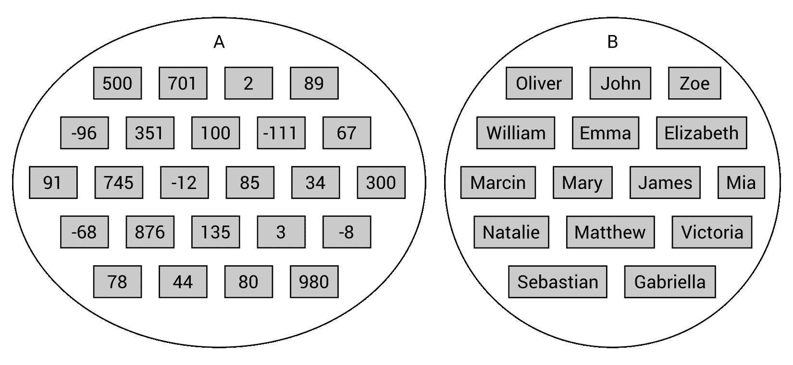
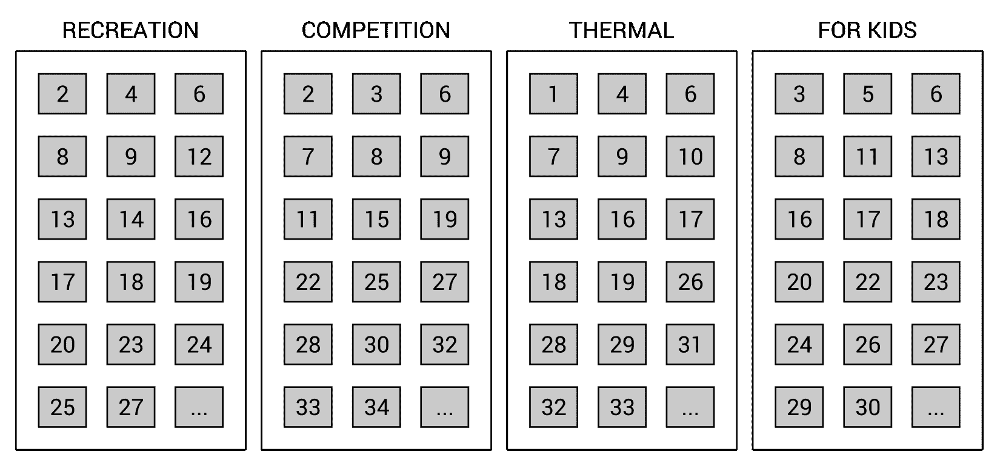

# 字典和集合

本章将重点介绍与词典和集合相关的数据结构。正确应用这些数据结构可以将键映射到值并执行快速查找，以及对集合进行各种操作。为了简化对词典和集合的理解，本章将包含插图和代码片段。

在本章的第一部分中，您将学习字典的非泛型和泛型版本，即一组对，每个对由一个键和一个值组成。然后，还将显示字典的排序变体。您还将看到字典和列表之间的一些相似之处。

本章的剩余部分将向您展示如何使用哈希集，以及名为“排序”集的变量。有可能有一个“排序”集吗？在阅读最后一节时，您将了解如何理解此主题。

本章将介绍以下主题：

*   哈希表
*   辞典
*   分类词典
*   散列集
*   “排序”集

# 哈希表

让我们从第一个数据结构开始，它是一个**哈希表**，也称为**哈希映射**。允许**将**键映射到特定值，如下图所示：


哈希表最重要的一个假设是基于**键**可以非常快速地查找**值**，这应该是*O（1）*操作。为了实现这个目标，使用了**散列函数**。通过**键**生成一个 bucket 的索引，可以找到**值**。

因此，如果需要查找键的值，则不需要遍历集合中的所有项，因为您可以使用哈希函数轻松找到合适的 bucket 并获取值。由于哈希表的出色性能，这种数据结构经常用于许多实际应用程序，例如关联数组、数据库索引或缓存系统。

如您所见，哈希函数的作用非常关键，理想情况下，它应该为所有键生成唯一的结果。但是，可能会为不同的键生成相同的结果。这种情况称为**散列冲突**，应该处理。

从头开始实现哈希表的主题似乎相当困难，特别是当涉及到使用哈希函数、处理哈希冲突以及为存储桶分配特定键时。幸运的是，在用 C#语言开发应用程序时，可以使用合适的实现，而且其使用非常简单。

There are two variants of the hash table-related classes, namely non-generic (`Hashtable`) and generic (`Dictionary`). The first is described in this section, while the other is described in the following section. If you can use the strongly-typed generic version, I strongly recommend using it.

让我们看一下从 Type T1 命名空间中的 TyrT0p 类。如前所述，它存储一组对，其中每个对包含一个键和一个值。一对由`DictionaryEntry`实例表示。

您可以使用索引器轻松访问特定元素。由于`Hashtable`类是哈希表相关类的非泛型变体，您需要将返回的结果强制转换为正确的类型（例如`string`，如下所示：

```cs
string value = (string)hashtable["key"]; 
```

通过类似的方式，可以设置值：

```cs
hashtable["key"] = "value"; 
```

值得一提的是，`null`值对于元素的`key`是不正确的，但是对于元素的`value`是可以接受的。

除了索引器之外，该类还配备了一些属性，这使得可以获取存储元素的数量（`Count`，以及返回键或值的集合（`Keys`和`Values`）。此外，您可以使用一些可用的方法，例如添加新元素（`Add`），删除元素（`Remove`），删除所有元素（`Clear`），以及检查集合是否包含特定键（`Contains`和`ContainsKey`）或给定值（`ContainsValue`）。

如果要从哈希表中获取所有条目，可以使用`foreach`循环遍历集合中存储的所有对，如下所示：

```cs
foreach (DictionaryEntry entry in hashtable) 
{ 
    Console.WriteLine($"{entry.Key} - {entry.Value}"); 
} 
```

循环中使用的变量为`DictionaryEntry`类型。因此，您需要使用其`Key`和`Value`属性分别访问键和值。

You can find more information about the `Hashtable` class at [https://msdn.microsoft.com/library/system.collections.hashtable.aspx](https://msdn.microsoft.com/library/system.collections.hashtable.aspx).

在这篇简短的介绍之后，现在是看一个例子的时候了。

# 示例–电话簿

例如，您将为电话簿创建一个应用程序。`Hashtable`类将用于存储条目，其中人名是一个键，电话号码是一个值，如下图所示：


该程序将演示如何向集合中添加元素，检查存储项的数量，遍历所有项，检查是否存在具有给定键的元素，以及如何基于键获取值。

这里给出的整个代码应该放在`Program`类中`Main`方法的主体中。首先，让我们创建一个`Hashtable`类的新实例，并使用一些条目对其进行初始化，如下代码所示：

```cs
Hashtable phoneBook = new Hashtable() 
{ 
    { "Marcin Jamro", "000-000-000" }, 
    { "John Smith", "111-111-111" } 
}; 
phoneBook["Lily Smith"] = "333-333-333"; 
```

您可以通过多种方式向集合中添加元素，例如在创建类的新实例时（上例中的电话号码为`Marcin Jamro`和`John Smith`），通过使用索引器（`Lily Smith`）和`Add`方法（`Mary Fox`），如代码的以下部分所示：

```cs
try 
{ 
    phoneBook.Add("Mary Fox", "222-222-222"); 
} 
catch (ArgumentException) 
{ 
    Console.WriteLine("The entry already exists."); 
} 
```

如您所见，`Add`方法的调用位于`try-catch`语句中。为什么？答案很简单，您不能用同一个键添加多个元素，在这种情况下，会抛出`ArgumentException`。为了防止应用程序崩溃，使用了`try-catch`语句，并在控制台中显示适当的消息来通知用户有关情况。

When you use the indexer to set a value for a particular key, it will not throw any exception when there is already an item with the given key. In such a situation, a value of this element will be updated.

在代码的以下部分中，您将遍历集合中的所有对，并在控制台中显示结果。当没有项目时，将向用户显示附加信息，如以下代码段所示：

```cs
Console.WriteLine("Phone numbers:"); 
if (phoneBook.Count == 0) 
{ 
    Console.WriteLine("Empty"); 
} 
else 
{ 
    foreach (DictionaryEntry entry in phoneBook) 
    { 
        Console.WriteLine($" - {entry.Key}: {entry.Value}"); 
    } 
} 
```

您可以使用`Count`属性检查集合中是否没有元素，并将其值与`0`进行比较。`foreach`循环的可用性简化了遍历所有对的方法。但是，您需要记住，`Hashtable`类中的单个对由`DictionaryEntry`实例表示，您可以使用`Key`和`Value`属性访问其密钥和值。

最后，让我们看看如何检查集合中是否存在特定键，以及如何获取其值。第一个任务只需调用`Contains`方法即可完成，该方法返回一个值，指示是否存在合适的元素（`true`）或（`false`）。另一个作业（获取值）使用索引器，需要将返回的值强制转换为合适的类型（本例中为`string`。此要求是由哈希表相关类的非泛型版本引起的。代码如下：

```cs
Console.WriteLine(); 
Console.Write("Search by name: "); 
string name = Console.ReadLine(); 
if (phoneBook.Contains(name)) 
{ 
    string number = (string)phoneBook[name]; 
    Console.WriteLine($"Found phone number: {number}"); 
} 
else 
{ 
    Console.WriteLine("The entry does not exist."); 
} 
```

第一个使用哈希表的程序已经准备好了！启动后，您将收到与以下类似的结果：

```cs
    Phone numbers:
     - John Smith: 111-111-111
     - Mary Fox: 222-222-222
     - Lily Smith: 333-333-333
     - Marcin Jamro: 000-000-000

    Search by name: Mary Fox
    Found phone number: 222-222-222

```

值得注意的是，使用`Hashtable`类存储的对的顺序与它们的加法或键的顺序不一致。因此，如果需要呈现排序结果，则需要自己对元素进行排序，或者使用另一种数据结构，即本书后面将介绍的`SortedDictionary`。

但是，现在，让我们来看一看在 C 开发中使用的最常用的类之一，即 HOLt0}，它是哈希表相关类的一个通用版本。

# 辞典

在上一节中，您已经了解了作为哈希表相关类的非泛型变体的`Hashtable`类。但是，它有一个很大的限制，因为它不允许您指定键和值的类型。`DictionaryEntry`类的`Key`和`Value`属性均为`object`类型。因此，即使所有键和值具有相同的类型，也需要执行装箱和取消装箱操作。

如果您想从强类型变体中获益，可以使用`Dictionary`泛型类，这是本章本节的主要主题。

首先，在创建`Dictionary`类的实例时，应该指定两种类型，即键类型和值类型。此外，可以使用以下代码定义字典的初始内容：

```cs
Dictionary<string, string> dictionary = 
    new Dictionary<string, string> 
{ 
    { "Key 1", "Value 1" }, 
    { "Key 2", "Value 2" } 
}; 
```

在前面的代码中，创建了`Dictionary`类的一个新实例。它存储基于`string`的键和值。默认情况下，字典中存在两个条目，即键`Key 1`和`Key 2`。它们的值为`Value 1`和`Value 2`。

与`Hashtable`类类似，这里您还可以使用索引器访问集合中的特定元素，如下代码行所示：

```cs
string value = dictionary["key"]; 
```

值得注意的是，转换为`string`类型是不必要的，因为`Dictionary`是哈希表相关类的强类型版本。因此，返回的值已经具有正确的类型。

如果集合中不存在具有给定键的元素，则抛出`KeyNotFoundException`。要避免出现问题，可以执行以下操作之一：

*   将代码行放在`try-catch`块中
*   检查元素是否存在（通过调用`ContainsKey`）
*   使用`TryGetValue`方法

可以使用索引器添加新元素或更新现有元素的值，如以下代码行所示：

```cs
dictionary["key"] = "value"; 
```

与非泛型变量类似，`key`不能等于`null`，但`value`当然可以等于，前提是集合中存储的值类型允许。此外，获取元素值、添加新元素或更新现有元素的性能接近于*O（1）*操作。

`Dictionary`类配备了一些属性，可以获取存储元素的数量（`Count`，以及返回键或值的集合（`Keys`和`Values`）。此外，您可以使用可用的方法，例如添加新元素（`Add`），删除项目（`Remove`），删除所有元素（`Clear`），以及检查集合是否包含特定键（`ContainsKey`）或给定值（`ContainsValue`）。您还可以使用`TryGetValue`方法尝试获取给定键的值并返回它（如果元素存在）或返回`null`（否则）。

While scenarios of returning a value by a given key (using an indexer or `TryGetValue`) and checking whether the given key exists (`ContainsKey`) are approaching the *O(1)* operation, the process of checking whether the collection contains a given value (`ContainsValue`) is the *O(n)* operation and requires you to search the entire collection for the particular value.

如果要遍历集合中存储的所有对，可以使用`foreach`循环。但是，循环中使用的变量是具有`Key`和`Value`属性的`KeyValuePair`泛型类的实例，允许您访问键和值。`foreach`循环如以下代码段所示：

```cs
foreach (KeyValuePair<string, string> pair in dictionary) 
{ 
    Console.WriteLine($"{pair.Key} - {pair.Value}"); 
} 
```

还记得上一章中某些类的线程安全版本吗？如果是这样的话，`Dictionary`类的情况看起来非常相似，因为`ConcurrentDictionary`类（来自`System.Collections.Concurrent`名称空间）是可用的。配备一套方法，如`TryAdd`、`TryUpdate`、`AddOrUpdate`、`GetOrAdd`等。

You can find more information about the `Dictionary` generic class at [https://msdn.microsoft.com/library/xfhwa508.aspx](https://msdn.microsoft.com/library/xfhwa508.aspx), while details of the thread-safe alternative, namely `ConcurrentDictionary`, are shown at [https://msdn.microsoft.com/library/dd287191.aspx](https://msdn.microsoft.com/library/dd287191.aspx).

让我们开始编码吧！在以下各节中，您将发现两个介绍词典的示例。

# 示例–产品位置

第一个示例是帮助商店员工找到产品放置位置的应用程序。假设每个员工都有一部手机和你的应用程序，用来扫描产品代码，应用程序告诉他们产品应该位于**A1**或**C9**区域。听起来很有趣，不是吗？

由于商店里的产品数量往往很高，因此有必要快速找到结果。因此，产品的数据及其位置将使用通用`Dictionary`类存储在哈希表中。按键为条形码，数值为区号，如下图所示：


让我们看一看代码，它应该添加到 AULT T1R 类中的 TyrT0E.方法中。开始时，您需要创建一个新集合，并添加一些数据：

```cs
Dictionary<string, string> products = 
    new Dictionary<string, string> 
{ 
    { "5900000000000", "A1" }, 
    { "5901111111111", "B5" }, 
    { "5902222222222", "C9" } 
}; 
products["5903333333333"] = "D7"; 
```

代码显示了向集合添加元素的两种方法，即在创建类的新实例时传递元素的数据和使用索引器。第三种解决方案也存在并使用`Add`方法，如代码的以下部分所示：

```cs
try 
{ 
    products.Add("5904444444444", "A3"); 
} 
catch (ArgumentException) 
{ 
    Console.WriteLine("The entry already exists."); 
} 
```

如`Hashtable`类中所述，如果要添加与集合中已经存在的元素具有相同键的元素，则会抛出`ArgumentException`。您可以使用`try-catch`块防止应用程序崩溃。

在代码的以下部分中，您将显示系统中所有可用产品的数据。为此，您可以使用`foreach`循环，但在此之前，您需要检查字典中是否有任何元素。如果没有，则会向用户显示正确的消息。否则，来自所有对的键和值将显示在控制台中。值得一提的是，`foreach`循环中的变量类型是`KeyValuePair<string, string>`，因此其`Key`和`Value`属性是`string`类型，而不是`object`，如非泛型变量的情况。代码如下所示：

```cs
Console.WriteLine("All products:"); 
if (products.Count == 0) 
{ 
    Console.WriteLine("Empty"); 
} 
else 
{ 
    foreach (KeyValuePair<string, string> product in products) 
    { 
        Console.WriteLine($" - {product.Key}: {product.Value}"); 
    } 
}
```

最后，让我们看看代码的一部分，它可以通过条形码找到产品的位置。为此，您可以使用`TryGetValue`检查元素是否存在。如果是，控制台中将显示一条带有目标位置的消息。否则，将显示其他信息。重要的是，`TryGetValue`方法使用`out`参数返回元素的找到值。代码如下：

```cs
Console.WriteLine(); 
Console.Write("Search by barcode: "); 
string barcode = Console.ReadLine(); 
if (products.TryGetValue(barcode, out string location)) 
{ 
    Console.WriteLine($"The product is in the area {location}."); 
} 
else 
{ 
    Console.WriteLine("The product does not exist."); 
} 
```

当您运行该程序时，您将看到商店中所有产品的列表，该程序将要求您输入条形码。输入后，您将收到带有区号的信息。控制台中显示的结果将类似于以下结果：

```cs
    All products:
     - 5900000000000: A1
     - 5901111111111: B5
     - 5902222222222: C9
     - 5903333333333: D7
     - 5904444444444: A3

    Search by barcode: 5902222222222
    The product is in the area C9.
```

您刚刚完成了第一个示例！让我们继续下一个。

# 示例–用户详细信息

第二个示例将向您展示如何在字典中存储更复杂的数据。在此场景中，您将创建一个应用程序，该应用程序根据用户的标识符显示用户的详细信息，如下图所示：


程序应该从三个用户的数据开始。您应该能够输入标识符并查看找到的用户的详细信息。当然，不存在给定用户的情况应该通过在控制台中显示适当的信息来处理。

首先，让我们添加只存储员工数据的`Employee`类，即名字、姓氏和电话号码。代码如下：

```cs
public class Employee 
{ 
    public string FirstName { get; set; } 
    public string LastName { get; set; } 
    public string PhoneNumber { get; set; } 
} 
```

接下来的修改将在`Program`类中的`Main`方法中执行。在这里，您使用`Add`方法创建`Dictionary`类的一个新实例，并添加三名员工的数据，如下代码片段所示：

```cs
Dictionary<int, Employee> employees =  
    new Dictionary<int, Employee>(); 
employees.Add(100, new Employee() { FirstName = "Marcin",  
    LastName = "Jamro", PhoneNumber = "000-000-000" }); 
employees.Add(210, new Employee() { FirstName = "Mary",  
    LastName = "Fox", PhoneNumber = "111-111-111" }); 
employees.Add(303, new Employee() { FirstName = "John",  
    LastName = "Smith", PhoneNumber = "222-222-222" }); 
```

最有趣的操作在以下`do-while`循环中执行：

```cs
bool isCorrect = true; 
do 
{ 
    Console.Write("Enter the employee identifier: "); 
    string idString = Console.ReadLine(); 
    isCorrect = int.TryParse(idString, out int id); 
    if (isCorrect) 
    { 
        Console.ForegroundColor = ConsoleColor.White; 
        if (employees.TryGetValue(id, out Employee employee)) 
        { 
            Console.WriteLine("First name: {1}{0}Last name:  
                {2}{0}Phone number: {3}", 
                Environment.NewLine, 
                employee.FirstName, 
                employee.LastName, 
                employee.PhoneNumber); 
        } 
        else 
        { 
            Console.WriteLine("The employee with the given  
                identifier does not exist."); 
        } 
        Console.ForegroundColor = ConsoleColor.Gray; 
    } 
} 
while (isCorrect); 
```

首先，要求用户输入员工的标识符，然后将其解析为整数值。如果此操作成功完成，则使用`TryGetValue`方法尝试获取用户的详细信息。如果找到用户，即`TryGetValue`返回`true`，则在控制台显示详细信息。否则显示`"The employee with the given identifier does not exist."`消息。循环将一直执行，直到提供的标识符无法解析为整数值为止。

运行应用程序并输入一些数据时，您将收到以下结果：

```cs
    Enter the employee identifier: 100
    First name: Marcin
    Last name: Jamro
    Phone number: 000-000-000
    Enter the employee identifier: 500
    The employee with the given identifier does not exist.
```

这就是全部！您刚刚完成了两个示例，展示了如何在使用 C 语言开发应用程序时使用词典。

然而，关于`Hashtable`类的章节中提到了另一种词典，即排序词典。您是否有兴趣了解它的功能以及如何在程序中使用它？如果是这样，让我们进入下一节。

# 分类词典

哈希表相关类的非泛型和泛型变体都不保持元素的顺序。因此，如果需要显示按键排序的集合中的数据，则需要在显示之前对其进行排序。但是，您可以使用另一种数据结构**排序字典**来解决此问题，并始终保持键排序。因此，只要有必要，您就可以轻松地获得已排序的集合。

排序字典作为`SortedDictionary`泛型类实现，在`System.Collections.Generic`命名空间中可用。您可以在创建`SortedDictionary`类的新实例时指定键和值的类型。此外，该类包含与`Dictionary`类似的属性和方法。

首先，您可以使用索引器访问集合中的特定元素，如以下代码行所示：

```cs
string value = dictionary["key"]; 
```

您应该确保集合中存在该元素。否则，`KeyNotFoundException`被抛出。

您可以添加新元素或更新现有元素的值，如代码所示：

```cs
dictionary["key"] = "value"; 
```

与`Dictionary`类类似，键不能等于`null`，但如果集合中存储的值类型允许，值当然可以等于。

该类配备了一些属性，可以获取存储元素的数量（`Count`，以及返回键和值的集合（`Keys`和`Values`）。此外，您可以使用可用的方法，例如添加新元素（`Add`），删除项目（`Remove`），删除所有元素（`Clear`），以及检查集合是否包含特定键（`ContainsKey`）或给定值（`ContainsValue`）。您可以使用`TryGetValue`方法尝试获取给定键的值并返回它（如果元素存在）或返回`null`（否则）。

如果要遍历集合中存储的所有对，可以使用`foreach`循环。循环中使用的变量是具有`Key`和`Value`属性的`KeyValuePair`泛型类的实例，允许您访问键和值。

尽管有自动排序的优点，`SortedDictionary`类与`Dictionary`相比有一些性能缺陷，因为检索、插入和删除是*O（logn）*操作，其中*n*是集合中的元素数，而不是*O（1）*。此外，`SortedDictionary`与`SortedList`非常相似，如[第 2 章](2.html)、*数组和列表*所述。然而，它在记忆相关和性能相关的结果上有所不同。这两个类的检索都是*O（logn）*操作，但未排序数据的插入和删除是`SortedDictionary`的*O（logn）*和`SortedList`的*O（n）*。当然，`SortedDictionary`比`SortedList`需要更多的内存。如您所见，选择合适的数据结构并非易事，您应该仔细考虑使用特定数据结构的场景，并考虑利弊。

You can find more information about the `SortedDictionary` generic class at [https://msdn.microsoft.com/library/f7fta44c.aspx](https://msdn.microsoft.com/library/f7fta44c.aspx).

让我们通过创建一个示例来查看排序字典的实际操作。

# 示例–定义

例如，您将创建一个简单的百科全书，您可以在其中添加条目，并显示其全部内容。百科全书可以包含数以百万计的条目，因此为用户提供按正确顺序、按字母顺序、按键浏览条目以及快速查找条目的可能性至关重要。因此，在本例中，排序字典是一个不错的选择。

百科全书的思想如下图所示：


程序启动时，会出现一个简单的菜单，有两个选项，即`[a] - add`和`[l] - list`。按下*A*键后，应用程序要求您输入输入的名称和说明。如果提供的数据正确，则会在百科全书中添加一个新条目。如果用户按下*L*键，所有条目的数据将按键排序显示在控制台中。当按下任何其他键时，将显示附加确认，如果确认，程序将退出。

让我们看一看代码，它应该放在 OutT1 类中的 Type T0 方法的主体中：

```cs
SortedDictionary<string, string> definitions =  
    new SortedDictionary<string, string>(); 
do 
{ 
    Console.Write("Choose an option ([a] - add, [l] - list): "); 
    ConsoleKeyInfo keyInfo = Console.ReadKey(); 
    Console.WriteLine(); 
    if (keyInfo.Key == ConsoleKey.A) 
    { 
        Console.ForegroundColor = ConsoleColor.White; 
        Console.Write("Enter the name: "); 
        string name = Console.ReadLine(); 
        Console.Write("Enter the explanation: "); 
        string explanation = Console.ReadLine(); 
        definitions[name] = explanation; 
        Console.ForegroundColor = ConsoleColor.Gray; 
    } 
    else if (keyInfo.Key == ConsoleKey.L) 
    { 
        Console.ForegroundColor = ConsoleColor.White; 
        foreach (KeyValuePair<string, string> definition  
            in definitions) 
        { 
            Console.WriteLine($"{definition.Key}:  
                {definition.Value}"); 
        } 
        Console.ForegroundColor = ConsoleColor.Gray; 
    } 
    else 
    { 
        Console.ForegroundColor = ConsoleColor.White; 
        Console.WriteLine("Do you want to exit the program?  
            Press [y] (yes) or [n] (no)."); 
        Console.ForegroundColor = ConsoleColor.Gray; 
        if (Console.ReadKey().Key == ConsoleKey.Y) 
        { 
            break; 
        } 
    } 
} 
while (true); 
```

开始时，创建了一个新的`SortedDictionary`类实例，它表示一组具有基于`string`的键和基于`string`的值的对。然后，使用无限`do-while`循环。在其中，程序等待用户按下任何键。如果是*A*键，则从用户输入的值中获取输入的名称和说明。然后，使用索引器将一个新条目添加到字典中。因此，如果已经存在具有相同密钥的条目，则将对其进行更新。在按下*L*键的情况下，`foreach`循环用于显示所有输入的条目。当按下任何其他键时，会向用户提出另一个问题，程序将等待确认。如果用户按下*Y*，则您将跳出循环。

运行程序时，可以输入一些条目，也可以显示它们。控制台的结果显示在以下方框中：

```cs
    Choose an option ([a] - add, [l] - list): a
    Enter the name: Zakopane
    Enter the explanation: a city located in Tatra mountains in Poland
    Choose an option ([a] - add, [l] - list): a
    Enter the name: Rzeszow
    Enter the explanation: a capital of the Subcarpathian voivodeship 
    in Poland
    Choose an option ([a] - add, [l] - list): a
    Enter the name: Warszawa
    Enter the explanation: a capital city of Poland
    Choose an option ([a] - add, [l] - list): a
    Enter the name: Lancut
    Enter the explanation: a city located near Rzeszow with 
    a beautiful castle
    Choose an option ([a] - add, [l] - list): l
    Lancut: a city located near Rzeszow with a beautiful castle
    Rzeszow: a capital of the Subcarpathian voivodeship in Poland
    Warszawa: a capital city of Poland
    Zakopane: a city located in Tatra mountains in Poland
    Choose an option ([a] - add, [l] - list): q
    Do you want to exit the program? Press [y] (yes) or [n] (no).
    yPress any key to continue . . .

```

到目前为止，您已经学习了三门与词典相关的课程，即`Hashtable`、`Dictionary`和`SortedDictionary`。它们都有一些特定的优点，可以在各种场景中使用。为了便于理解，本文提供了一些示例，并进行了详细解释。

但是，您知道吗，还有一些其他数据结构只存储键，不存储值？你想进一步了解他们吗？如果是这样，让我们进入下一节。

# 散列集

在某些算法中，需要对具有各种数据的集合执行操作。然而，什么是**集合**？集合是不同对象的集合，没有重复的元素，也没有特定的顺序。因此，您只能知道给定元素是否在集合中。这些集合与数学模型和运算（如并集、交集、减法和对称差分）密切相关。

集合可以存储各种数据，如整型值或字符串值，如下图所示。当然，您还可以使用用户定义类的实例创建一个集合，以及随时从集合中添加和删除元素。



在看到集合开始工作之前，最好提醒您一些可以在两个集合上执行的基本操作，这两个集合分别名为**a**和**B**。让我们从并集和交点开始，如下图所示。如您所见，**接头**（左侧显示为**A∪B**是包含属于**a**或**B**的所有元素的集合。**交叉口**（右侧显示为**A∩B**仅包含属于**A**和**B**的元素：


另一种常见的操作是**集合减法**。**A\B**的结果集包含属于**A**成员而非**B**成员的元素。在下图中，给出了两个示例，即**A\B**和**B\A**：


在对集合执行操作时，还值得一提的是**对称差分**，它在下图的左侧显示为**A∆ B**。最后一组可以解释为两组的并集，即（**a\B**）和（**B\a**）。因此，它包含只属于一个集合的元素，即**A**或**B**。属于两个集合的元素将从结果中排除：


另一个重要的话题是集合之间的**关系**。如果**B**的每个元素也属于**A**，则表示**B**是**A**的**子集**，如上图右侧所示。同时，**A**是**B**的**超集**。此外，如果**B**是**a**的子集，但**B**不等于**a**，则**B**是**a**的**真子集**，而**a**是**B**的真超集。

在用 C 语言开发应用程序时，您可以从`System.Collections.Generic`名称空间中的`HashSet`类提供的高性能操作中获益。该类包含一些属性，包括返回集合中元素数量的`Count`。此外，您可以使用许多方法来执行集合操作，如下所述。

第一组方法可以修改当前集合（在该集合上调用该方法）以创建以下内容，并将该集合作为参数传递：

*   工会（`UnionWith`）
*   交叉口（`IntersectWith`）
*   减法（`ExceptWith`）
*   对称差（`SymmetricExceptWith`）

您还可以检查两个集合之间的关系，例如检查当前集合（在其上调用方法）是否为：

*   作为参数传递的集合的子集（`IsSubsetOf`
*   作为参数传递的集合的超集（`IsSupersetOf`）
*   作为参数传递的集合的适当子集（`IsProperSubsetOf`）
*   作为参数传递的集合的适当超集（`IsProperSupersetOf`）

此外，您可以验证两个集合是否包含相同的元素（`SetEquals`），或者两个集合是否至少有一个公共元素（`Overlaps`）。

除上述操作外，您还可以向集合中添加新元素（`Add`），删除特定元素（`Remove`），或删除所有元素（`Clear`），以及检查集合中是否存在给定元素（`Contains`。

You can find more information about the `HashSet` generic class at [https://msdn.microsoft.com/library/bb359438.aspx](https://msdn.microsoft.com/library/bb359438.aspx).

在这篇介绍之后，尝试将学到的信息付诸实践是一个好主意。因此，让我们继续看两个示例，它们将向您展示如何在应用程序中应用哈希集。

# 示例–优惠券

第一个示例表示检查一次性优惠券是否已使用的系统。如果是这样，应向用户提供适当的信息。否则，系统应通知用户优惠券有效，并应标记为已使用，不能再次使用。由于优惠券数量较多，因此有必要选择一种数据结构，以便快速检查某个集合中是否存在某个元素。因此，选择散列集作为用于存储所用优惠券的标识符的数据结构。因此，您只需要检查集合中是否存在输入的标识符。

让我们看一看代码，它应该添加到 AULT T1R 类中的 TyrT0E.方法中。第一部分如下所示：

```cs
HashSet<int> usedCoupons = new HashSet<int>(); 
do 
{ 
    Console.Write("Enter the coupon number: "); 
    string couponString = Console.ReadLine(); 
    if (int.TryParse(couponString, out int coupon)) 
    { 
        if (usedCoupons.Contains(coupon)) 
        { 
            Console.ForegroundColor = ConsoleColor.Red; 
            Console.WriteLine("It has been already used :-("); 
            Console.ForegroundColor = ConsoleColor.Gray; 
        } 
        else 
        { 
            usedCoupons.Add(coupon); 
            Console.ForegroundColor = ConsoleColor.Green; 
            Console.WriteLine("Thank you! :-)"); 
            Console.ForegroundColor = ConsoleColor.Gray; 
        } 
    } 
    else 
    { 
        break; 
    } 
} 
while (true); 
```

开始时，创建了一个新的`HashSet`泛型类实例，用于存储整数值。然后，大部分操作在`do-while`循环中执行。在这里，程序等待用户输入优惠券标识符。如果无法将其解析为整数值，则中断循环。否则，检查集合是否已经包含与优惠券标识符相等的元素（使用`Contains`方法）。如果是，则会显示适当的警告信息。但是，如果不存在，您可以将其添加到已用优惠券集合中（使用`Add`方法）并通知用户。

当您打破循环时，您只需要显示已使用优惠券的标识符的完整列表。您可以使用`foreach`循环，迭代集合，并在控制台中写入其元素来实现此目标，如以下代码所示：

```cs
Console.WriteLine(); 
Console.WriteLine("A list of used coupons:"); 
foreach (int coupon in usedCoupons) 
{ 
    Console.WriteLine(coupon); 
} 
```

现在，您可以启动应用程序，输入一些数据，并查看其工作原理。控制台中写入的结果如下所示：

```cs
    Enter the coupon number: 100
    Thank you! :-)
    Enter the coupon number: 101
    Thank you! :-)
    Enter the coupon number: 500
    Thank you! :-)
    Enter the coupon number: 345
    Thank you! :-)
    Enter the coupon number: 101
    It has been already used :-(
    Enter the coupon number: l

    A list of used coupons:
    100
    101
    500
    345

```

这是第一个示例的结尾。让我们继续下一步，您将看到一个使用哈希集的更复杂的解决方案。

# 示例-游泳池

这个例子展示了一个水疗中心的系统，该中心有四个游泳池，即娱乐池、竞赛池、热力池和儿童游泳池。每位游客都会收到一条特殊的腕带，可以进入所有游泳池。但是，在进入任何池时都需要扫描腕带，您的程序可以使用这些数据创建各种统计信息。

在该示例中，选择散列集作为数据结构，用于存储在每个游泳池入口处扫描的唯一数量的腕带。将使用四套，每个池一套，如下图所示。此外，它们将在字典中分组，以简化和缩短代码，并使将来的修改更容易：



为了简化应用程序的测试，将随机设置初始数据。因此，您只需要创建统计信息，即按池类型划分的访客数量、最受欢迎的池、至少访问一个池的人数以及访问所有池的人数。所有统计数据都将使用集合。

让我们从`PoolTypeEnum`枚举开始（在`PoolTypeEnum.cs`文件中声明），它表示可能的游泳池类型，如下代码所示：

```cs
public enum PoolTypeEnum 
{ 
    RECREATION, 
    COMPETITION, 
    THERMAL, 
    KIDS 
}; 
```

接下来，将`random`私有静态字段添加到`Program`类中。它将用于用一些随机值填充哈希集。代码如下：

```cs
private static Random random = new Random(); 
```

然后，在`Program`类中声明`GetRandomBoolean`静态方法，根据随机值返回`true`或`false`值。代码如下所示：

```cs
private static bool GetRandomBoolean() 
{ 
    return random.Next(2) == 1; 
} 
```

接下来的更改仅在`Main`方法中需要。第一部分内容如下：

```cs
Dictionary<PoolTypeEnum, HashSet<int>> tickets =  
    new Dictionary<PoolTypeEnum, HashSet<int>>() 
{ 
    { PoolTypeEnum.RECREATION, new HashSet<int>() }, 
    { PoolTypeEnum.COMPETITION, new HashSet<int>() }, 
    { PoolTypeEnum.THERMAL, new HashSet<int>() }, 
    { PoolTypeEnum.KIDS, new HashSet<int>() } 
}; 
```

在这里，您创建了一个新的`Dictionary`实例。它包含四个条目。每个键为`PoolTypeEnum`类型，每个值为`HashSet<int>`类型，即一组整数值。

在下一部分中，将使用随机值填充集合，如下所示：

```cs
for (int i = 1; i < 100; i++) 
{ 
    foreach (KeyValuePair<PoolTypeEnum, HashSet<int>> type  
        in tickets) 
    { 
        if (GetRandomBoolean()) 
        { 
            type.Value.Add(i); 
        } 
    } 
}
```

为此，需要使用两个循环，即`for`和`foreach`。第一个迭代 100 次并模拟 100 个腕带。其中有一个循环`foreach`，循环遍历所有可用的池类型。对于每一个项目，您都会随机检查访客是否进入特定的游泳池。通过获取一个随机布尔值来检查它。如果收到`true`，则会在适当的集合中添加一个标识符。`false`值表示拥有给定数量腕带（`i`的用户尚未进入当前游泳池。

剩下的代码与生成各种统计信息有关。首先，让我们按泳池类型显示访客数量。这样的任务非常简单，因为您只需迭代字典，并写入池类型和集合中的元素数（使用`Count`属性），如代码的以下部分所示：

```cs
Console.WriteLine("Number of visitors by a pool type:"); 
foreach (KeyValuePair<PoolTypeEnum, HashSet<int>> type in tickets) 
{ 
    Console.WriteLine($" - {type.Key.ToString().ToLower()}:  
        {type.Value.Count}"); 
} 
```

下一部分是游客人数最多的游泳池。使用 LINQ 及其方法执行，即：

*   `OrderByDescending`按集合中元素的数量降序排列元素
*   `Select`仅选择一个池类型
*   `FirstOrDefault`取第一个结果

然后，您只需显示结果。执行此操作的代码如下所示：

```cs
PoolTypeEnum maxVisitors = tickets 
    .OrderByDescending(t => t.Value.Count) 
    .Select(t => t.Key) 
    .FirstOrDefault(); 
Console.WriteLine($"Pool '{maxVisitors.ToString().ToLower()}'  
    was the most popular.");
```

然后，您需要获得至少访问过一个池的人数。您可以通过创建所有集合的并集并获取最终集合的计数来执行此任务。开始时，创建一个新集合，并用有关娱乐游泳池的标识符填充它。在下面的代码行中，您调用`UnionWith`方法来创建具有以下三个集合的并集。这部分代码如下所示：

```cs
HashSet<int> any =  
    new HashSet<int>(tickets[PoolTypeEnum.RECREATION]); 
any.UnionWith(tickets[PoolTypeEnum.COMPETITION]); 
any.UnionWith(tickets[PoolTypeEnum.THERMAL]); 
any.UnionWith(tickets[PoolTypeEnum.KIDS]); 
Console.WriteLine($"{any.Count} people visited at least  
    one pool."); 
```

最后一个统计数字是在一次参观温泉中心期间参观所有泳池的人数。要执行这样的计算，只需创建所有集合的交集并获得最终集合的计数。为此，让我们创建一个新集合，并在其中填充有关娱乐游泳池的标识符。然后，调用`IntersectWith`方法创建一个与以下三个集合的交点。最后，使用`Count`属性获取集合中的元素数，并显示结果，如下所示：

```cs
HashSet<int> all =  
    new HashSet<int>(tickets[PoolTypeEnum.RECREATION]); 
all.IntersectWith(tickets[PoolTypeEnum.COMPETITION]); 
all.IntersectWith(tickets[PoolTypeEnum.THERMAL]); 
all.IntersectWith(tickets[PoolTypeEnum.KIDS]); 
Console.WriteLine($"{all.Count} people visited all pools."); 
```

就这些！运行应用程序时，可能会收到与以下结果类似的结果：

```cs
 Number of visitors by a pool type:
     - recreation: 54
     - competition: 44
     - thermal: 48
     - kids: 51

 Pool 'recreation' was the most popular.
 93 people visited at least one pool.
 5 people visited all pools.
```

您刚刚完成了两个有关哈希集的示例。尝试修改代码并添加新特性以了解更多关于此类数据结构的信息是一个好主意。当您准备好学习下一个数据结构时，让我们继续阅读。

# “排序”集

前面描述的类`HashSet`可以理解为只存储键而不存储值的字典。那么，如果有`SortedDictionary`类，可能也有`SortedSet`类？确实有！然而，一个集合可以被“排序”吗？为什么“排序”字用引号写？根据定义，答案很简单，一个集合存储不同对象的集合，没有重复的元素，也没有特定的顺序。如果集合不支持顺序，如何“排序”？因此，“排序”集合可以理解为`HashSet`和`SortedList`的组合，而不是集合本身。

如果您希望有一个不重复元素的不同对象的排序集合，则可以使用“排序”集。合适的类名为`SortedSet`，可在`System.Collections.Generic`名称空间中找到。它有一组方法，类似于在`HashSet`类中已经描述的那些方法，例如`UnionWith`、`IntersectWith`、`ExceptWith`、`SymmetricExceptWith`、`Overlaps`、`IsSubsetOf`、`IsSupersetOf`、`IsProperSubsetOf`和`IsProperSupersetOf`。但是，它包含用于返回最小值和最大值的附加属性（分别为`Min`和`Max`）。值得一提的是，`GetViewBetween`方法返回一个`SortedSet`实例，其中包含给定范围内的值。

You can find more information about the `SortedSet` generic class at [https://msdn.microsoft.com/library/dd412070.aspx](https://msdn.microsoft.com/library/dd412070.aspx).

让我们继续看一个简单的例子，看看如何使用代码中的“排序”集。

# 示例–删除重复项

例如，您将创建一个简单的应用程序，从名称列表中删除重复项。当然，名称的比较应该不区分大小写，因此不允许在同一个集合中同时包含`"Marcin"`和`"marcin"`。

为了了解如何实现这个目标，让我们在`Program`类中添加以下代码作为`Main`方法的主体：

```cs
List<string> names = new List<string>() 
{ 
    "Marcin", 
    "Mary", 
    "James", 
    "Albert", 
    "Lily", 
    "Emily", 
    "marcin", 
    "James", 
    "Jane" 
}; 
SortedSet<string> sorted = new SortedSet<string>( 
    names, 
    Comparer<string>.Create((a, b) =>  
        a.ToLower().CompareTo(b.ToLower()))); 
foreach (string name in sorted) 
{ 
    Console.WriteLine(name); 
} 
```

首先，创建一个名称列表，并用九个元素初始化，包括`"Marcin"`和`"marcin"`。然后，创建`SortedSet`类的新实例，传递两个参数，即名称列表和不区分大小写的比较器。最后，您只需遍历集合，在控制台中写入名称。

运行应用程序时，您将看到以下结果：

```cs
    Albert
    Emily
    James
    Jane
    Lily
    Marcin
    Mary

```

这是本章最后一个示例。因此，让我们进入总结。

# 总结

这本书的第四章重点介绍哈希表、字典和集合。所有这些集合都是有趣的数据结构，可以在各种场景中使用。通过提供这些集合的详细描述和示例，您已经看到选择适当的数据结构不是一项简单的任务，需要分析与性能相关的主题，因为其中一些集合在检索值方面运行得更好，而另一些集合则促进了数据的添加和删除。

一开始，您已经学习了如何使用哈希表的两个变体，即非泛型（`Hashtable`类）和泛型（`Dictionary`）。这些方法的巨大优势在于基于键的值的快速查找，即关闭*O（1）*操作。为了实现这一目标，使用了哈希函数。此外，已排序字典已作为一个有趣的解决方案引入，以解决集合中未排序项的问题，并始终保持键排序。

然后，提出了集运算的高性能解决方案。它使用`HashSet`类，它表示一组不同的对象，没有重复的元素，也没有特定的顺序。该类可以对集合执行各种操作，例如并集、交集、减法和对称差分。然后，引入了“排序”集（即`SortedSet`类）的概念，将其作为不同对象的排序集合，没有重复的元素。

在用 C#语言开发应用程序时，您是否想深入研究数据结构和算法这一主题？如果是这样的话，让我们进入下一章，在那里展示树木。