# 树的变种

在前面的章节中，您已经了解了许多数据结构，从简单的数据结构开始，例如数组。现在，您应该了解一组更为复杂的数据结构，即**树**。

在本章的开头，将介绍基本树，以及它在 C#语言中的实现和一些示例。然后，将介绍二叉树，并详细描述其实现和应用示例。二叉搜索树是另一种树变体，它是许多算法中使用的最流行的树类型之一。以下两部分将介绍自平衡树，即 AVL 和红黑树。

本章的剩余部分将专门讨论作为基于树的数据结构的堆。将介绍三种堆：二进制堆、二项式堆和斐波那契堆。将简要介绍这些类型，并使用外部包展示这些数据结构的应用。

数组、列表、堆栈、队列、字典、集合，现在。。。树。您准备好增加难度并学习下一组数据结构了吗？如果是这样，让我们开始阅读吧！

本章将介绍以下主题：

*   基本树
*   二叉树
*   二叉搜索树
*   平衡二叉树
*   红黑树
*   二进制堆
*   二项式堆
*   斐波那契堆

# 基本树

让我们从介绍树木开始。它们是什么？对于这样的数据结构应该是什么样子，您有什么想法吗？如果不是，我们来看看下面的图表，它描述了一个树，上面有关于其特定元素的字幕：

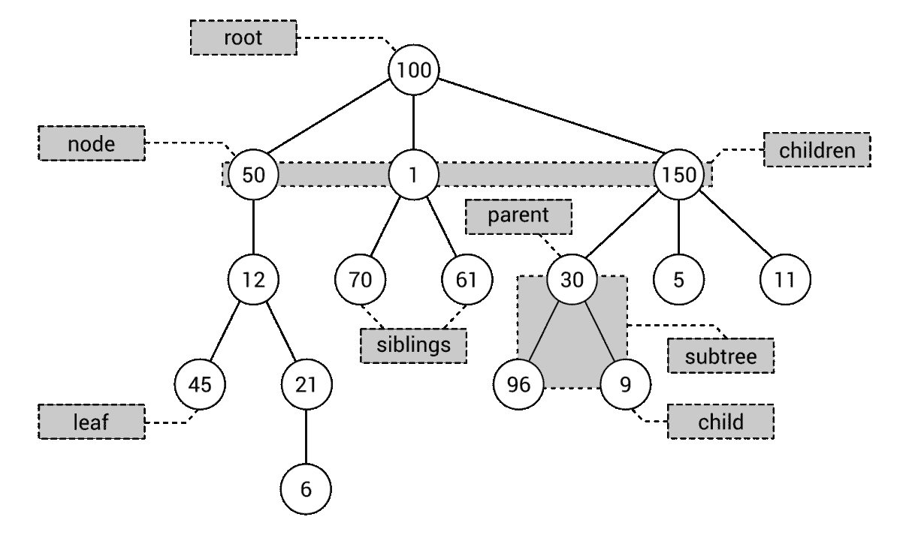

一棵树由多个**节点**组成，包括一个**根**（**100**在图中）。根不包含**父**节点，而所有其他节点都包含。例如，节点**1**的父元素为**100**，而节点**96**将节点**30**作为**父元素**。此外，每个节点可以有任意数量的**子**节点，例如在**根**的情况下有三个**子**（即**50**、**1**、**150**）。同一节点的子节点可以命名为**同级**，如节点**70**和**61**的情况。没有子节点的节点称为**叶**，如图中的**45**和**6**。看看有三个节点的矩形（即，**30**、**96**、**9**）。树的这一部分可以称为**子树**。当然，您可以在树中找到许多子树。

让我们简单地讨论一下节点的最小和最大子节点数。一般来说，这样的数目是不受限制的，每个节点可以包含零、一、二、三或更多子节点。但是，在实际应用中，孩子的数量通常限制为两个，您将在下一节中看到。

# 实施

基于 C#的基本树实现似乎非常明显，并不复杂。为此，可以声明两个类，分别表示单个节点和整个树，如以下部分所述。

# 节点

第一个类被命名为`TreeNode`，并被声明为泛型类，以使开发人员能够指定存储在每个节点中的数据类型。因此，您可以创建强类型解决方案，从而消除将对象强制转换为目标类型的必要性。代码如下：

```cs
public class TreeNode<T> 
{ 
    public T Data { get; set; } 
    public TreeNode<T> Parent { get; set; } 
    public List<TreeNode<T>> Children { get; set; } 

    public int GetHeight() 
    { 
        int height = 1; 
        TreeNode<T> current = this; 
        while (current.Parent != null) 
        { 
            height++; 
            current = current.Parent; 
        } 
        return height; 
    } 
} 
```

该类包含三个属性：在创建类实例时指定类型（`T`）的节点（`Data`中存储的数据、对父节点（`Parent`的引用以及对子节点（`Children`的引用集合）。

除了属性之外，`TreeNode`类还包含`GetHeight`方法，该方法返回节点的高度，即到根节点的距离。该方法的实现非常简单，因为它只使用`while`循环从节点向上移动，直到没有父元素（当到达根时）。

# 树

下一个必需的类名为`Tree`，它代表整个树。其代码甚至比上一节中的代码更简单，如下所示：

```cs
public class Tree<T> 
{ 
    public TreeNode<T> Root { get; set; } 
} 
```

该类仅包含一个属性`Root`。您可以使用此属性访问根节点，然后使用其`Children`属性获取树中其他节点的数据。

值得注意的是，`TreeNode`和`Tree`类都是泛型的，在这些类中使用相同的类型。例如，如果树节点应该存储`string`值，那么`Tree`和`TreeNode`类的实例应该使用`string`类型。

# 示例–标识符的层次结构

您想了解如何在基于 C 的应用程序中使用树吗？让我们来看看第一个例子。目标是用几个节点构建树，如下图所示。代码中将仅显示背景较暗的节点组。但是，最好自己调整代码以扩展此树。

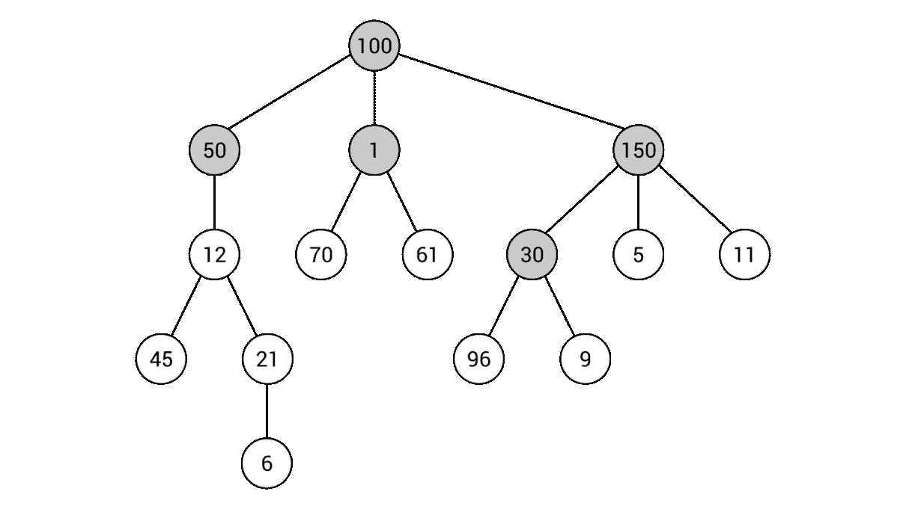

正如您在示例中看到的，每个节点存储一个整数值。因此，`int`将是`Tree`和`TreeNode`类所使用的类型。以下代码部分应放在`Program`类中的`Main`方法中：

```cs
Tree<int> tree = new Tree<int>(); 
tree.Root = new TreeNode<int>() { Data = 100 }; 
tree.Root.Children = new List<TreeNode<int>> 
{ 
    new TreeNode<int>() { Data = 50, Parent = tree.Root }, 
    new TreeNode<int>() { Data = 1, Parent = tree.Root }, 
    new TreeNode<int>() { Data = 150, Parent = tree.Root } 
}; 
tree.Root.Children[2].Children = new List<TreeNode<int>>() 
{ 
    new TreeNode<int>()  
        { Data = 30, Parent = tree.Root.Children[2] } 
}; 
```

代码看起来很简单，不是吗？

开始时，会创建一个新的`Tree`类实例。然后，通过创建`TreeNode`类的新实例，设置`Data`属性的值（到`100`，并将对`TreeNode`实例的引用分配到`Root`属性来配置根节点。

在下面的行中，根节点的子节点是指定的节点，其值等于`50`、`1`和`150`。对于每个节点，`Parent`属性的值设置为对先前添加的根节点的引用。

代码的其余部分显示如何为给定节点添加子节点，即根节点的第三个子节点，即值等于`150`的节点。这里只添加一个节点，该节点的值设置为`30`。当然，还需要指定对父节点的引用。

这就是全部！您已经创建了第一个使用树的程序。现在您可以运行它了，但在控制台中将看不到任何输出。如果要查看节点数据的组织方式，可以调试程序，并在调试时查看变量值。

# 示例–公司结构

在上一个示例中，您看到了如何使用整数值作为树中每个节点的数据。但是，也可以在节点中存储用户定义类的实例。在本例中，您将看到如何创建一个树来表示公司的结构，该树分为三个主要部门：开发、研究和销售。

在每个部门中可以有另一个结构，例如开发团队。在这里，**约翰·史密斯**是**发展总监**。他是**克里斯·莫里斯**的老板，他是两名初级开发人员**埃里克·格林**和**阿什利·洛佩兹**的经理。后者也是**Emily Young**的主管，她是**开发实习生**。

下图显示了一个示例树：

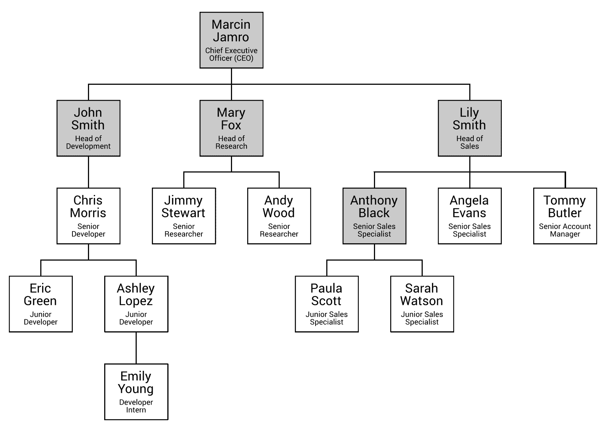

正如您所看到的，每个节点都应该存储更多的信息，而不仅仅是一个整数值。应该有标识符、名称和角色。这些数据作为属性值存储在`Person`类的实例中，如下面的代码片段所示：

```cs
public class Person 
{ 
    public int Id { get; set; } 
    public string Name { get; set; } 
    public string Role { get; set; } 

    public Person() { } 

    public Person(int id, string name, string role) 
    { 
        Id = id; 
        Name = name; 
        Role = role; 
    } 
} 
```

该类包含三个属性（`Id`、`Name`和`Role`），以及两个构造函数。第一个构造函数不接受任何参数，而另一个构造函数接受三个参数并设置特定属性的值。

除了创建一个新类外，还需要在`Program`类的`Main`方法中添加一些代码。必要的行如下所示：

```cs
Tree<Person> company = new Tree<Person>(); 
company.Root = new TreeNode<Person>() 
{ 
    Data = new Person(100, "Marcin Jamro", "CEO"), 
    Parent = null 
}; 
company.Root.Children = new List<TreeNode<Person>>() 
{ 
    new TreeNode<Person>() 
    { 
        Data = new Person(1, "John Smith", "Head of Development"), 
        Parent = company.Root 
    }, 
    new TreeNode<Person>() 
    { 
        Data = new Person(50, "Mary Fox", "Head of Research"), 
        Parent = company.Root 
    }, 
    new TreeNode<Person>() 
    { 
        Data = new Person(150, "Lily Smith", "Head of Sales"), 
        Parent = company.Root 
    } 
}; 
company.Root.Children[2].Children = new List<TreeNode<Person>>() 
{ 
    new TreeNode<Person>() 
    {
```

```cs
        Data = new Person(30, "Anthony Black", "Sales Specialist"),
        Parent = company.Root.Children[2]
    } 
}; 
```

在第一行中，创建了`Tree`类的一个新实例。值得一提的是，`Person`类被用作创建`Tree`和`TreeNode`类的新实例时指定的类型。因此，您可以轻松地为每个节点存储多个简单数据。

剩下的代码行与第一个基本树的示例类似。这里，您还可以指定根节点（对于`CEO`角色），然后配置其子元素（`John Smith`、`Mary Fox`、`Lily Smith`），并为现有节点之一设置子节点，即`Head of Sales`的节点。

它看起来简单明了吗？在下一节中，您将看到一个更受限制但非常重要且众所周知的树变体：二叉树。

# 二叉树

一般来说，基本树中的每个节点都可以包含任意数量的子节点。但是，在**二叉树**的情况下，一个节点不能包含超过两个子节点。这意味着它可以包含零个、一个或两个子节点。这样的要求对二叉树的形状有重要影响，如以下两个表示二叉树的图表所示：


如前所述，二叉树中的一个节点最多可以包含两个子节点。因此，它们被称为**左子**和**右子**。在上图左侧显示的二叉树的情况下，节点**21**有两个子节点，**68**作为左子节点，**12**作为右子节点，而节点**100**只有一个左子节点。

您是否考虑过如何遍历树中的所有节点？在树的**遍历**期间，如何指定节点的顺序？有三种常用方法：预订单、顺序和后订单，如下图所示：

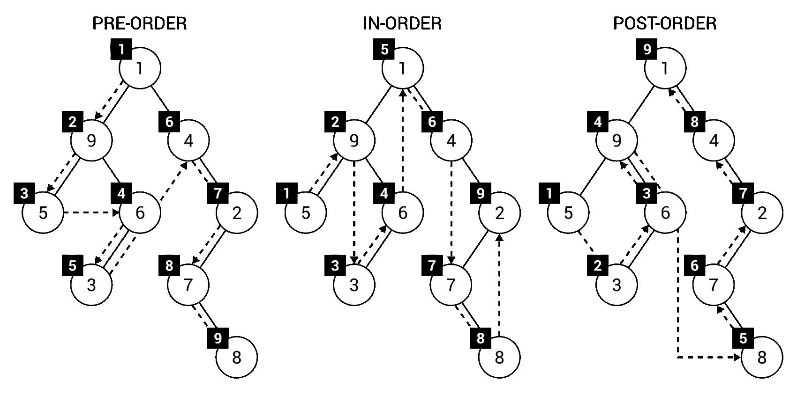

正如图中所示，两种方法之间存在明显的差异。但是，您知道如何对二叉树应用预序、按序或后序遍历吗？让我们详细解释所有这些方法。

如果您想使用**预排序**方法遍历二叉树，首先需要访问根节点。然后，你去看望左边的孩子。最后，找到合适的孩子。当然，这样的规则不仅适用于根节点，还适用于树中的任何节点。由于这个原因，您可以将预顺序遍历的顺序理解为首先访问当前节点，然后访问其左子树（使用预顺序方法递归地访问整个左子树），最后访问其右子树（以类似方式访问右子树）。

这个解释听起来有点复杂，所以让我们来看一看关于前面图左边的树的简单例子。首先，访问根节点（即**1**。然后，分析其左子节点。因此，下一个访问的节点是当前节点**9**。下一步是对其左子级进行预序遍历。因此，访问了**5**。由于该节点不包含任何子节点，当**9**为当前节点时，可以返回到遍历阶段。它已经被访问了，它的左子节点也已经被访问了，所以现在是时候继续访问它的右子节点了。在这里，您首先访问当前节点**6**，然后跟随其左子节点**3**。您可以应用相同的规则继续遍历树。最终顺序为**1**、**9**、**5**、**6**、**3**、**4**、**2**、**7**、**8**。

如果听起来仍然有点混乱，下面的图表应该可以消除任何混乱：

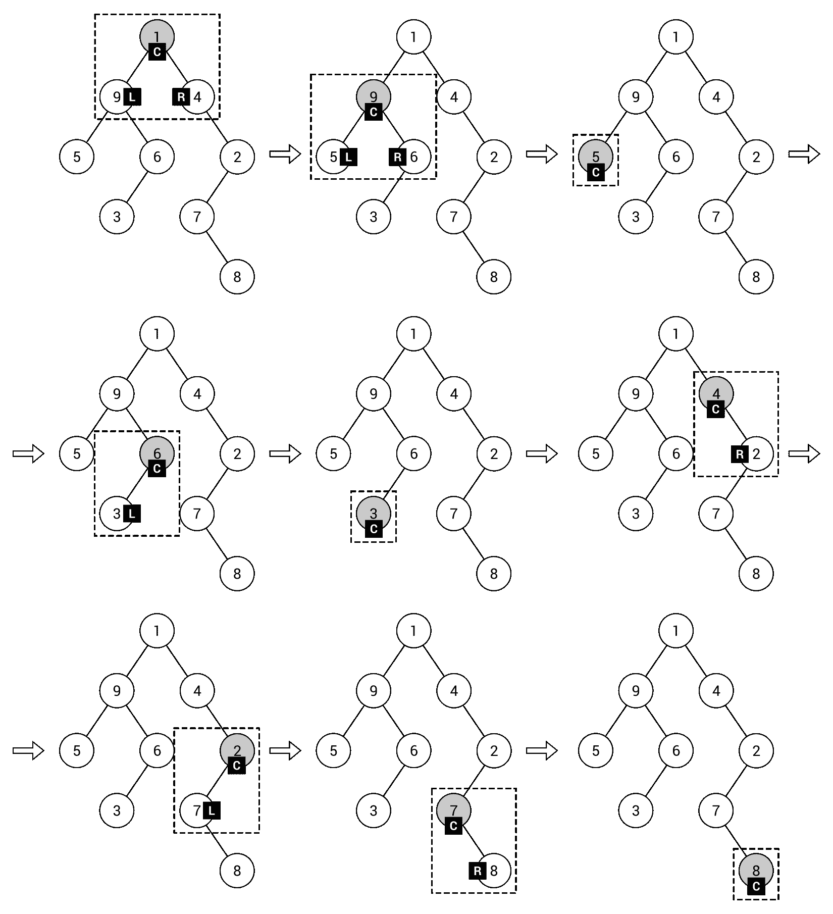

该图显示了带有附加指示器的预顺序遍历的以下步骤：**当前节点**的**C**、**左子节点**的**L**、**右子节点**的**R**。

第二个遍历模式被称为**，顺序为**。它与预排序方法的不同之处在于节点的访问顺序：首先是左子节点，然后是当前节点，然后是右子节点。如果您查看图中显示的所有三种遍历模式的示例，您可以看到第一个访问的节点是**5**。为什么？在开始时，将分析根节点，但不会访问它，因为顺序遍历从左侧子节点开始。因此，它分析节点**9**，但它还有一个左子节点**5**，因此您可以继续此节点。由于该节点没有任何子节点，因此访问当前节点（**5**。然后，当当前节点为**9**且其左子节点已被访问时，您返回到步骤，同时访问当前节点。接下来，您跟随右边的子项，但它有一个左边的子项，**3**，应该首先访问它。根据相同的规则，您将访问二叉树中的其余节点。最终顺序为**5**、**9**、**3**、**6**、**1**、**4**、**7**、**8**、**2**。

最后一个遍历模式名为**post order**，支持以下节点遍历顺序：左子节点、右子节点、当前节点。让我们分析图右侧显示的 post order 示例。在开始时，将分析根节点，但不会访问它，因为后序遍历从左侧子节点开始。因此，与顺序方法的情况一样，您进入节点**9**，然后进入节点**5**。然后需要分析节点**9**的右子节点。但是节点**6**有左边的子节点**3**，应该先访问。因此，在**5**之后，您访问**3**，然后访问**6**，然后访问**9**。有趣的是，二叉树的根节点在最后被访问。最终顺序为**5**、**3**、**6**、**9**、**8**、**7**、**2**、**4**、**1**。

You can find more information about binary trees at [https://en.wikipedia.org/wiki/Binary_tree](https://en.wikipedia.org/wiki/Binary_tree).

在简短的介绍之后，让我们继续讨论基于 C 的实现。

# 实施

二叉树的实现非常简单，特别是如果您使用已描述的基本树代码。为了您的方便，下面几节介绍了所有必要的代码，但只详细解释了其中的新部分。

# 节点

二叉树中的节点由`BinaryTreeNode`实例表示，该实例继承自`TreeNode`泛型类，代码如下：

```cs
public class TreeNode<T> 
{ 
    public T Data { get; set; } 
    public TreeNode<T> Parent { get; set; } 
    public List<TreeNode<T>> Children { get; set; } 

    public int GetHeight() 
    { 
        int height = 1; 
        TreeNode<T> current = this; 
        while (current.Parent != null) 
        { 
            height++; 
            current = current.Parent; 
        } 
        return height; 
    } 
} 
```

在`BinaryTreeNode`类中，需要声明两个属性`Left`和`Right`，这两个属性表示节点的两个可能的子节点。守则的有关部分如下：

```cs
public class BinaryTreeNode<T> : TreeNode<T> 
{ 
    public BinaryTreeNode() => Children =  
        new List<TreeNode<T>>() { null, null }; 

    public BinaryTreeNode<T> Left 
    { 
        get { return (BinaryTreeNode<T>)Children[0]; } 
        set { Children[0] = value; } 
    } 

    public BinaryTreeNode<T> Right 
    { 
        get { return (BinaryTreeNode<T>)Children[1]; } 
        set { Children[1] = value; } 
    } 
} 
```

此外，您需要确保子节点集合正好包含两个项，初始设置为`null`。您可以通过为构造函数中的`Children`属性指定一个默认值来实现这一目标，如前面的代码所示。因此，如果您想要添加子节点，那么对它的引用应该作为列表的第一个或第二个元素（即`Children`属性）放置。因此，这样的集合始终只有两个元素，您可以毫无例外地访问第一个或第二个元素。如果设置为任意节点，则返回对该节点的引用，否则返回`null`。

# 树

下一个必需的类命名为`BinaryTree`。它代表整个二叉树。通过使用泛型类，可以轻松指定存储在每个节点中的数据类型。`BinaryTree`类实现的第一部分如下：

```cs
public class BinaryTree<T> 
{ 
    public BinaryTreeNode<T> Root { get; set; } 
    public int Count { get; set; } 
} 
```

`BinaryTree`类包含两个属性：`Root`表示根节点（作为`BinaryTreeNode`类的实例），以及`Count`表示树中放置的节点总数。当然，这些不是类的唯一成员，因为它还可以配备一组关于遍历树的方法。

本书中描述的第一种遍历方法是预排序。作为提醒，它首先访问当前节点，然后访问其左子节点，然后访问右子节点。`TraversePreOrder`方法的代码如下：

```cs
private void TraversePreOrder(BinaryTreeNode<T> node,  
    List<BinaryTreeNode<T>> result) 
{ 
    if (node != null) 
    { 
        result.Add(node); 
        TraversePreOrder(node.Left, result); 
        TraversePreOrder(node.Right, result); 
    } 
} 
```

该方法采用两个参数：当前节点（`node`）和已访问节点列表（`result`）。递归实现非常简单。首先，通过确保参数不等于`null`来检查节点是否存在。然后，将当前节点添加到已访问节点的集合中，对左侧子节点启动相同的遍历方法，最后对右侧子节点启动该方法。

顺序内和顺序后遍历模式也可以采用类似的实现。让我们从`TraverseInOrder`方法的代码开始，如下所示：

```cs
private void TraverseInOrder(BinaryTreeNode<T> node,  
    List<BinaryTreeNode<T>> result) 
{ 
    if (node != null) 
    { 
        TraverseInOrder(node.Left, result); 
        result.Add(node); 
        TraverseInOrder(node.Right, result); 
    } 
} 
```

在这里，您递归地调用左边子节点的`TraverseInOrder`方法，将当前节点添加到访问的节点列表中，并开始右边子节点的顺序遍历。

下一种方法与后序遍历模式相关，如下所示：

```cs
private void TraversePostOrder(BinaryTreeNode<T> node,  
    List<BinaryTreeNode<T>> result) 
{ 
    if (node != null) 
    { 
        TraversePostOrder(node.Left, result); 
        TraversePostOrder(node.Right, result); 
        result.Add(node); 
    } 
} 
```

代码与已经描述的方法非常相似，但是，当然，应用了另一个访问节点的顺序。在这里，您从左边的子节点开始，然后访问右边的子节点，然后是当前节点。

最后，让我们添加用于以各种模式遍历树的 public 方法，该方法调用前面介绍的私有方法。有关守则如下：

```cs
public List<BinaryTreeNode<T>> Traverse(TraversalEnum mode) 
{ 
    List<BinaryTreeNode<T>> nodes = new List<BinaryTreeNode<T>>(); 
    switch (mode) 
    { 
        case TraversalEnum.PREORDER: 
            TraversePreOrder(Root, nodes); 
            break; 
        case TraversalEnum.INORDER: 
            TraverseInOrder(Root, nodes); 
            break; 
        case TraversalEnum.POSTORDER: 
            TraversePostOrder(Root, nodes); 
            break; 
    } 
    return nodes; 
} 
```

该方法只需要一个参数，`TraversalEnum`枚举值，它从预订单、顺序和后订单中选择合适的模式。`Traverse`方法使用`switch`语句调用合适的私有方法，具体取决于参数的值。

要使用`Traverse`方法，还需要声明`TraversalEnum`枚举，如下代码段所示：

```cs
public enum TraversalEnum 
{ 
    PREORDER, 
    INORDER, 
    POSTORDER 
} 
```

本节描述的最后一种方法是`GetHeight`。它返回树的高度，可以理解为从任何叶节点到根节点的最大步数。实施情况如下：

```cs
public int GetHeight() 
{ 
    int height = 0; 
    foreach (BinaryTreeNode<T> node  
        in Traverse(TraversalEnum.PREORDER)) 
    { 
        height = Math.Max(height, node.GetHeight()); 
    } 
    return height; 
} 
```

代码只是使用预顺序遍历遍历树的所有节点，读取当前节点的高度（使用前面描述的`TreeNode`类中的`GetHeight`方法），如果大于当前最大值，则将其保存为最大值。最后，返回计算的高度。

在介绍了二叉树主题之后，让我们来看一个示例，其中该数据结构用于在一个简单的测验中存储问题和答案。

# 示例–简单测验

作为二叉树的示例，将使用一个简单的测验应用程序。测验由几个问题和答案组成，根据之前做出的决定显示。应用程序提出问题，等待用户按下*Y*（是）或*N*（否），然后继续下一个问题或显示答案。

测验的结构以二叉树的形式创建，如下所示：


开始时，询问用户是否有应用程序开发经验。如果是的话，程序会询问他或她是否已经作为开发人员工作了五年以上。如果答案是肯定的，则给出了申请成为高级开发人员的结果。当然，在用户做出不同决定的情况下会显示其他答案和问题。

简单测验的实现需要`BinaryTree`和`BinaryTreeNode`类，前面已经介绍和解释过。除此之外，您还应该声明`QuizItem`类来表示单个项，例如问题或答案。每个项目仅包含文本内容，存储为`Text`属性的值。正确的实施方法如下：

```cs
public class QuizItem 
{ 
    public string Text { get; set; } 
    public QuizItem(string text) => Text = text; 
} 
```

`Program`类中需要进行一些修改。让我们看看修改后的 OrthT1 方法：

```cs
static void Main(string[] args) 
{ 
    BinaryTree<QuizItem> tree = GetTree(); 
    BinaryTreeNode<QuizItem> node = tree.Root; 
    while (node != null) 
    { 
        if (node.Left != null || node.Right != null) 
        { 
            Console.Write(node.Data.Text); 
            switch (Console.ReadKey(true).Key) 
            { 
                case ConsoleKey.Y: 
                    WriteAnswer(" Yes"); 
                    node = node.Left; 
                    break; 
                case ConsoleKey.N: 
                    WriteAnswer(" No"); 
                    node = node.Right; 
                    break; 
            } 
        } 
        else 
        { 
            WriteAnswer(node.Data.Text); 
            node = null; 
        } 
    } 
} 
```

在方法的第一行中，调用`GetTree`方法（如下面的代码片段所示）来构建包含问题和答案的树。然后，根节点作为当前节点，对其执行以下操作，直到得到答案。

首先，检查左或右子节点是否存在，即它是否是问题（而不是答案）。然后，文本内容写入控制台，程序等待用户按键。如果等于*Y*，则显示关于选择*是*选项的信息，并将当前节点的左子节点用作当前节点。在选择*否*的情况下执行类似的操作，但随后使用当前节点的右子节点。

当用户做出的决定导致显示答案时，答案将显示在控制台中，`null`被分配给`node`变量。因此，您打破了`while`循环。

如前所述，`GetTree`方法用于构造包含问题和答案的二叉树。其代码如下所示：

```cs
private static BinaryTree<QuizItem> GetTree() 
{ 
    BinaryTree<QuizItem> tree = new BinaryTree<QuizItem>(); 
    tree.Root = new BinaryTreeNode<QuizItem>() 
    { 
        Data = new QuizItem("Do you have experience in developing  
            applications?"), 
        Children = new List<TreeNode<QuizItem>>() 
        { 
            new BinaryTreeNode<QuizItem>() 
            { 
                Data = new QuizItem("Have you worked as a  
                    developer for more than 5 years?"), 
                Children = new List<TreeNode<QuizItem>>() 
                { 
                    new BinaryTreeNode<QuizItem>() 
                    { 
                        Data = new QuizItem("Apply as a senior  
                            developer!") 
                    }, 
                    new BinaryTreeNode<QuizItem>() 
                    { 
                        Data = new QuizItem("Apply as a middle  
                            developer!") 
                    } 
                } 
            }, 
            new BinaryTreeNode<QuizItem>() 
            { 
                Data = new QuizItem("Have you completed  
                    the university?"), 
                Children = new List<TreeNode<QuizItem>>() 
                { 
                    new BinaryTreeNode<QuizItem>() 
                    { 
                        Data = new QuizItem("Apply for a junior  
                            developer!") 
                    }, 
                    new BinaryTreeNode<QuizItem>() 
                    { 
                        Data = new QuizItem("Will you find some  
                            time during the semester?"), 
                        Children = new List<TreeNode<QuizItem>>() 
                        { 
                            new BinaryTreeNode<QuizItem>() 
                            { 
                                Data = new QuizItem("Apply for our  
                                   long-time internship program!") 
                            }, 
                            new BinaryTreeNode<QuizItem>() 
                            { 
                                Data = new QuizItem("Apply for  
                                   summer internship program!") 
                            } 
                        } 
                    } 
                } 
            } 
        } 
    }; 
    tree.Count = 9; 
    return tree; 
} 
```

开始时，将创建一个新的`BinaryTree`泛型类实例。它还配置为每个节点包含作为`QuizItem`类实例的数据。然后，将`BinaryTreeNode`的一个新实例分配给`Root`属性。

有趣的是，即使以编程方式创建问题和答案，您也会创建某种树状结构，因为您使用了`Children`属性并直接在此类构造中指定项。因此，您不需要为所有问题和答案创建许多局部变量。值得注意的是，问题相关节点是`BinaryTreeNode`类的一个实例，有两个子节点（对于*是*和*否*决策），而答案相关节点不能包含任何子节点。

In the presented solution, the values of the `Parent` property of the `BinaryTreeNode` instances are not set. If you want to use them or get the height of a node or a tree, you should set them on your own.

最后一种辅助方式为`WriteAnswer`，代码如下：

```cs
private static void WriteAnswer(string text) 
{ 
    Console.ForegroundColor = ConsoleColor.White; 
    Console.WriteLine(text); 
    Console.ForegroundColor = ConsoleColor.Gray; 
} 
```

该方法只是在控制台中以白色显示作为参数传递的文本。它用于显示用户做出的决定和答案的文本内容。

简单的测验应用程序已经准备好了！您可以构建项目，启动项目，并回答一些问题以查看结果。然后，让我们关闭程序并继续下一节，在这里，将介绍二叉树数据结构的一个变体。

# 二叉搜索树

二叉树是一种有趣的数据结构，它允许创建元素的层次结构，每个节点最多可以包含两个子节点，但没有关于节点之间关系的任何规则。因此，如果要检查二叉树是否包含给定值，则需要检查每个节点，使用三种可用模式之一遍历树：预排序、顺序或后排序。这意味着查找时间是线性的，即*O（n）*。

对于树中节点之间的关系有一些精确的规则的情况呢？让我们设想一个场景，其中左子树包含值小于根值的节点，而右子树包含值大于根值的节点。然后，您可以将搜索的值与当前节点进行比较，并决定是否应继续在左子树或右子树中搜索。这种方法可以显著限制检查树是否包含给定值所需的操作数。看起来很有趣，不是吗？

该方法应用于**二叉搜索树**数据结构，也称为**BST**。它是一种二叉树，针对树中节点之间的关系引入了两条严格的规则。规则规定，对于任何节点：

*   其左子树中所有节点的值必须小于其值
*   其右子树中所有节点的值必须大于其值

通常，BST 可以包含两个或多个具有相同值的元素。然而，在本书中给出了一个简化版本，它不接受多个具有相同值的元素。

它在实践中看起来如何？让我们看看下面的 BSTs 图：

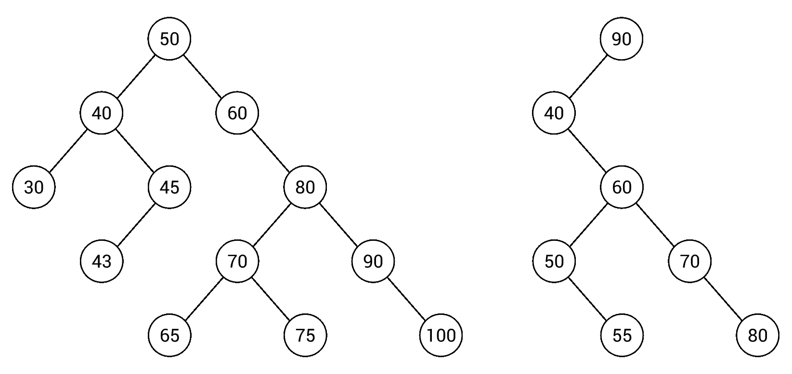

左侧显示的树包含 12 个节点。让我们检查它是否符合 BST 规则。可以通过分析树中的每个节点（叶节点除外）来执行此操作。

让我们从左子树中包含四个后代节点的根节点（值为**50**）开始（**40**、**30**、**45**、**43**），都小于**50**。根节点包含右子树中的七个子节点（**60**、**80**、**70**、**65**、**75**、**90**、**100**），均大于**50**。这意味着根节点满足 BST 规则。如果您想检查节点**80**的 BST 规则，您会看到左子树（**70**、**65**、**75**中的所有后代节点的值都小于**80**，而右子树（**90**、**100）中的值**）大于**80**。您应该对树中的所有节点执行相同的验证。同样，您可以确认图右侧的 BST 遵守规则。

然而，两个这样的 BST 在其拓扑结构上存在显著差异。两者的高度相同，但节点数不同，分别为 12 和 7。左边的那个看起来很胖，而另一个很瘦。哪一个更好？为了回答这个问题，让我们考虑一下在树中搜索值的算法。作为示例，在下图中描述并呈现了搜索值**43**的过程：

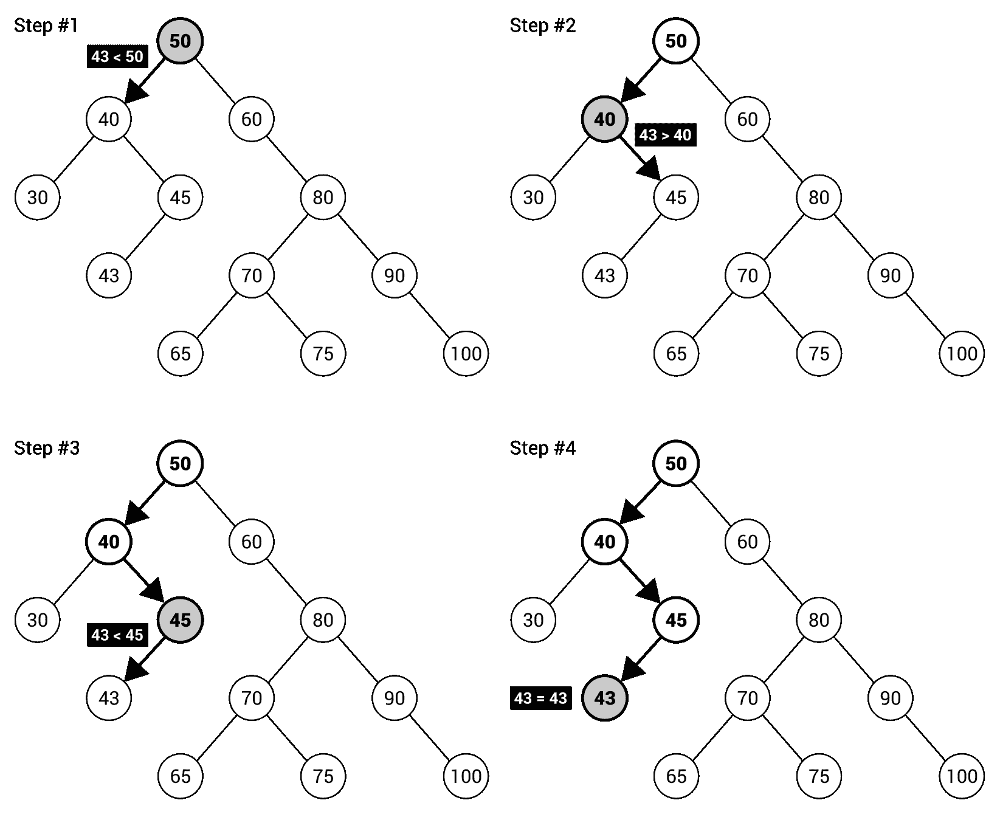

开始时，取根节点的一个值（即，**50**），并检查给定值（**43**）是否更小或更大。它较小，因此您可以继续在左子树中搜索。因此，您将**43**与**40**进行比较。这次选择了正确的子树，因为**43**大于**40**。接下来，将**43**与**45**进行比较，选择左侧子树。在这里，您将**43**与**43**进行比较。因此，可以找到给定的值。如果您查看该树，您将看到只需要四个比较，并且对性能的影响是显而易见的。

因此，很明显，树的形状对查找性能有很大的影响。当然，拥有一棵高度有限的胖树比拥有一棵更高的瘦树要好得多。性能提升是由决定是否应在左子树或右子树中继续搜索而引起的，而无需分析所有节点的值。如果节点没有两个子树，对性能的积极影响将是有限的。在最坏的情况下，当每个节点只包含一个子节点时，搜索时间甚至是线性的。然而，在理想的 BST 中，查找时间是*O（logn）*操作。

You can find more information about BSTs at [https://en.wikipedia.org/wiki/Binary_search_tree](https://en.wikipedia.org/wiki/Binary_search_tree).

在简短的介绍之后，让我们继续用 C 语言实现。最后，您将看到一个示例，该示例演示了如何在实践中使用此数据结构。

# 实施

BST 的实现比前面描述的树的变体更困难。例如，它要求您准备从树中插入和删除节点的操作，这不会违反有关 BST 中元素排列的规则。此外，您还需要引入一种比较节点的机制。

# 节点

让我们从表示树中单个节点的类开始。幸运的是，您可以使用已经为二叉树（`BinaryTreeNode`）描述的类的实现作为基础。修改后的代码如下：

```cs
public class BinaryTreeNode<T> : TreeNode<T> 
{ 
    public BinaryTreeNode() => Children =  
        new List<TreeNode<T>>() { null, null }; 

    public BinaryTreeNode<T> Parent { get; set; } 

    public BinaryTreeNode<T> Left 
    { 
        get { return (BinaryTreeNode<T>)Children[0]; } 
        set { Children[0] = value; } 
    } 

    public BinaryTreeNode<T> Right 
    { 
        get { return (BinaryTreeNode<T>)Children[1]; } 
        set { Children[1] = value; } 
    } 

    public int GetHeight() 
    { 
        int height = 1; 
        BinaryTreeNode<T> current = this; 
        while (current.Parent != null) 
        { 
            height++; 
            current = current.Parent; 
        } 
        return height; 
    } 
} 
```

由于 BST 是二叉树的变体，每个节点都有一个对其左、右子节点（或`null`（如果不存在）以及父节点的引用。节点还存储给定类型的值。正如您在前面的代码中所看到的，`BinaryTreeNode`类中添加了两个成员，即`Parent`属性（属于`BinaryTreeNode`类型）和`GetHeight`方法。它们是从`TreeNode`类的实现中移动和调整的。其最终代码如下：

```cs
public class TreeNode<T> 
{ 
    public T Data { get; set; } 
    public List<TreeNode<T>> Children { get; set; } 
} 
```

修改的原因是为开发人员提供了访问给定节点的父节点的简单方法，而无需从`TreeNode`转换到`BinaryTreeNode`。

# 树

整个树由`BinarySearchTree`类的一个实例表示，该实例继承自`BinaryTree`泛型类，如下代码片段所示：

```cs
public class BinarySearchTree<T> : BinaryTree<T>  
    where T : IComparable 
{ 
} 
```

值得一提的是，存储在每个节点中的数据类型应具有可比性。因此，必须实现`IComparable`接口。这样的要求是必要的，因为算法需要知道值之间的关系。

当然，它不是`BinarySearchTree`类实现的最终版本。在以下部分中，您将看到如何添加新功能，例如查找、插入和删除节点。

# 查找

让我们来看看 AUTYT0EL 方法，它检查树是否包含一个给定值的节点。当然，该方法考虑了有关节点排列的 BST 规则，以限制比较量。代码如下：

```cs
public bool Contains(T data) 
{ 
    BinaryTreeNode<T> node = Root; 
    while (node != null) 
    { 
        int result = data.CompareTo(node.Data); 
        if (result == 0) 
        { 
            return true; 
        } 
        else if (result < 0) 
        { 
            node = node.Left; 
        } 
        else 
        { 
            node = node.Right; 
        } 
    } 
    return false; 
} 
```

该方法只接受一个参数，即应该在树中找到的值。方法内部存在`while`循环。在其中，将搜索的值与当前节点的值进行比较。如果它们相等（比较结果返回`0`，则找到该值并返回`true`布尔值，以通知搜索已成功完成。如果搜索的值小于当前节点的值，则算法将继续在子树中搜索，并将当前节点的左子节点作为根。否则，将使用正确的子树。

The `CompareTo` method is provided by implementation of the `IComparable` interface from the `System` namespace. Such a method makes it possible to compare values. If they are equal, `0` is returned. If the object on which the method is called is bigger than the parameter, a value higher than `0` is returned. Otherwise, a value lower than `0` is returned.

循环将一直执行，直到找到节点或没有合适的子节点可跟随为止。

# 插入

下一个必要的操作是将节点插入 BST。这样的任务有点复杂，因为您需要找到一个位置来添加不会违反 BST 规则的新元素。让我们来看看 Apple T0 方法的代码：

```cs
public void Add(T data) 
{ 
    BinaryTreeNode<T> parent = GetParentForNewNode(data); 
    BinaryTreeNode<T> node = new BinaryTreeNode<T>()  
        { Data = data, Parent = parent }; 

    if (parent == null) 
    { 
        Root = node; 
    } 
    else if (data.CompareTo(parent.Data) < 0) 
    { 
        parent.Left = node; 
    } 
    else 
    { 
        parent.Right = node; 
    } 

    Count++; 
} 
```

该方法采用一个参数，即应添加到树中的值。在该方法中，您可以找到一个父元素（使用`GetParentForNewNode`辅助方法），其中应添加一个新节点作为子节点。然后，创建`BinaryTreeNode`类的新实例，并设置其`Data`和`Parent`属性的值。

在方法的以下部分中，检查找到的父元素是否等于`null`。这意味着树中没有节点，新节点应添加为根，这在行中很明显，其中对节点的引用被分配给了`Root`属性。下一次比较检查加法的值是否小于父节点的值。在这种情况下，应将新节点添加为父节点的左子节点。否则，新节点将作为父节点的右子节点放置。最后，存储在树中的元素数量将增加。

让我们来看一个辅助方法来寻找一个新节点的父元素：

```cs
private BinaryTreeNode<T> GetParentForNewNode(T data) 
{ 
    BinaryTreeNode<T> current = Root; 
    BinaryTreeNode<T> parent = null; 
    while (current != null) 
    { 
        parent = current; 
        int result = data.CompareTo(current.Data); 
        if (result == 0) 
        { 
            throw new ArgumentException( 
                $"The node {data} already exists."); 
        } 
        else if (result < 0) 
        { 
            current = current.Left; 
        } 
        else 
        { 
            current = current.Right; 
        } 
    } 

    return parent; 
} 
```

此方法名为`GetParentForNewNode`，并采用一个参数，即新节点的值。在此方法中，您声明了两个变量，分别表示当前分析的节点（`current`和父节点（`parent`。在`while`循环中修改这些值，直到算法为新节点找到合适的位置。

在循环中，将对当前节点的引用存储为潜在父节点。然后，执行比较，就像前面描述的代码片段一样。首先，检查加法的值是否等于当前节点的值。如果是，将引发异常，因为不允许向 BST 的分析版本添加多个具有相同值的元素。如果添加值小于当前节点的值，则算法将继续在左子树中搜索新节点的位置。否则，将使用当前节点的右子树。最后，返回`parent`变量的值，以指示新节点的找到位置。

# 移动

现在您知道了如何创建新的 BST，向其中添加一些节点，以及检查树中是否已经存在给定的值。但是，您还可以从树中删除项目吗？当然在本节中，您将学习如何实现此目标。

关于从树中删除节点的主要方法命名为`Remove`，并且只接受一个参数，即应该删除的节点的值。`Remove`方法的实施如下：

```cs
public void Remove(T data) 
{ 
    Remove(Root, data); 
} 
```

如您所见，该方法只调用另一个方法，也被命名为`Remove`。此方法的实现更为复杂，如下所示：

```cs
private void Remove(BinaryTreeNode<T> node, T data) 
{ 
    if (node == null)
    {
        throw new ArgumentException(
            $"The node {data} does not exist.");
    }
    else if (data.CompareTo(node.Data) < 0) 
    { 
        Remove(node.Left, data); 
    } 
    else if (data.CompareTo(node.Data) > 0) 
    { 
        Remove(node.Right, data); 
    } 
    else 
    { 
        if (node.Left == null && node.Right == null) 
        { 
            ReplaceInParent(node, null); 
            Count--; 
        } 
        else if (node.Right == null) 
        { 
            ReplaceInParent(node, node.Left); 
            Count--; 
        } 
        else if (node.Left == null) 
        { 
            ReplaceInParent(node, node.Right); 
            Count--; 
        } 
        else 
        { 
            BinaryTreeNode<T> successor =  
                FindMinimumInSubtree(node.Right); 
            node.Data = successor.Data; 
            Remove(successor, successor.Data); 
        } 
    } 
} 
```

首先，该方法检查当前节点（参数`node`是否存在）。如果不是，则抛出异常。然后，`Remove`方法尝试查找要删除的节点。这是通过将当前节点的值与要删除的值进行比较并递归调用当前节点的左子树或右子树的`Remove`方法来实现的。这些操作在条件语句中使用条件`data.CompareTo(node.Data) < 0`和`data.CompareTo(node.Data) > 0`执行。

最有趣的操作将在方法的以下部分中执行。在这里，您需要处理四种节点移除场景，即：

*   删除叶节点
*   删除只有左个子节点的节点
*   删除仅包含右子节点的节点
*   删除同时具有左和右子级的节点

在第一种情况下，只需更新对父元素中已删除节点的引用。因此，父节点不会引用已删除的节点，并且在遍历树时无法访问该节点。

第二种情况也很简单，因为您只需要将对已删除节点（在父元素中）的引用替换为已删除节点的左子节点。此场景如下图所示，展示了如何移除只有左个子节点的节点**80**：

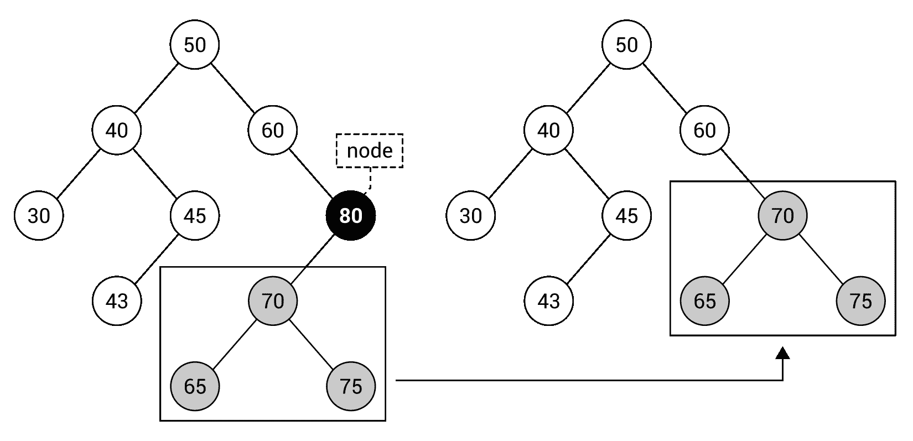

第三个案例与第二个案例非常相似。因此，只需将对已删除节点（在父元素中）的引用替换为作为已删除节点的右子节点的节点。

通过调用辅助方法（`ReplaceInParent`，代码中以类似的方式处理所有这三种情况。它有两个参数：要删除的节点和父节点中应替换它的节点。因此，如果要删除一个叶节点，只需传递`null`作为第二个参数，因为您不想用其他任何东西替换删除的节点。如果删除只有一个子节点的节点，则将引用传递给左或右子节点。当然，您还需要减少存储树中元素数量的计数器。

代码的相关部分如下所示（不同情况下有所不同）：

```cs
ReplaceInParent(node, node.Left); 
Count--; 
```

当然，最复杂的场景是删除同时包含两个子节点的节点。在这种情况下，您会在要删除的节点的右子树中找到具有最小值的节点。然后，将要删除的节点的值与找到的节点的值交换。最后，您只需要为找到的节点递归调用`Remove`方法。代码的相关部分显示在以下代码段中：

```cs
BinaryTreeNode<T> successor = FindMinimumInSubtree(node.Right); 
node.Data = successor.Data; 
Remove(successor, successor.Data); 
```

重要角色由`ReplaceInParent`辅助方式执行，代码如下：

```cs
private void ReplaceInParent(BinaryTreeNode<T> node,  
    BinaryTreeNode<T> newNode) 
{ 
    if (node.Parent != null) 
    { 
        if (node.Parent.Left == node) 
        { 
            node.Parent.Left = newNode; 
        } 
        else 
        { 
            node.Parent.Right = newNode; 
        } 
    } 
    else 
    { 
        Root = newNode; 
    } 

    if (newNode != null) 
    { 
        newNode.Parent = node.Parent; 
    } 
} 
```

该方法采用两个参数：要移除的节点（`node`）和父节点中应替换它的节点（`newNode`）。如果要删除的节点不是根节点，则检查它是否是父节点的左子节点。如果是这样，将更新一个适当的引用，即，将新节点设置为要删除的节点的父节点的左子节点。以类似的方式，当要删除的节点是父节点的正确子节点时，该方法处理该场景。如果要删除的节点是根节点，则要替换的节点设置为根节点。

最后，您检查新节点是否不等于`null`，即您没有删除叶节点。在这种情况下，您可以设置`Parent`属性的值，以指示新节点应该与要删除的节点具有相同的父节点。

最后一个辅助方法名为`FindMinimumInSubtree`，如下所示：

```cs
private BinaryTreeNode<T> FindMinimumInSubtree( 
    BinaryTreeNode<T> node) 
{ 
    while (node.Left != null) 
    { 
        node = node.Left; 
    } 
    return node; 
} 
```

该方法只接受一个参数，即子树的根，其中应找到最小值。在该方法中，`while`循环用于获取最左边的元素。当没有剩余子项时，返回`node`变量的当前值。

The presented implementation of the BST is based on the code shown at [https://en.wikipedia.org/wiki/Binary_search_tree](https://en.wikipedia.org/wiki/Binary_search_tree).

代码看起来很简单，不是吗？然而，它在实践中是如何工作的？让我们看一个描述两个孩子的节点移除的图表：

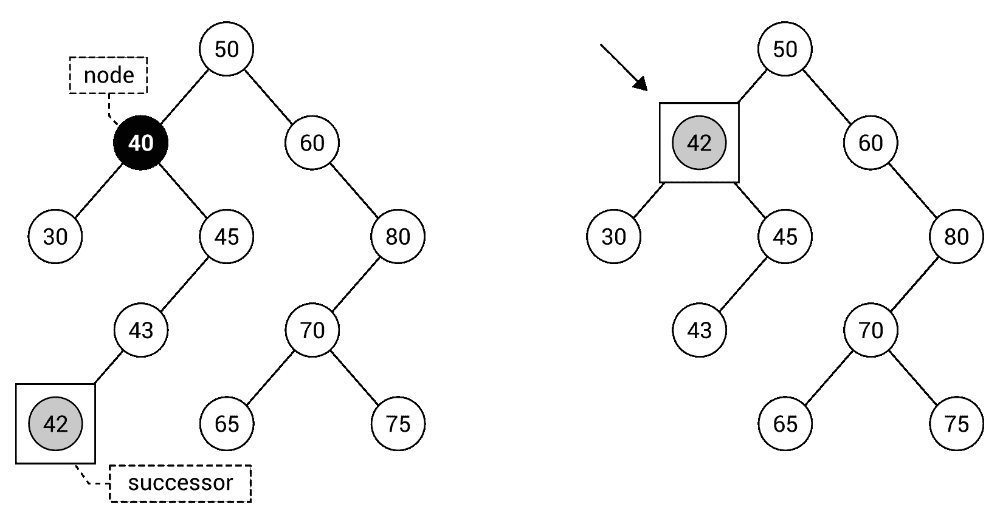

图中显示了如何移除以**40**为值的节点。为此，您需要在要删除的节点的右子树中找到后续节点，即具有最小值的节点。后续节点为节点**42**，替代节点**40**。

# 示例–BST 可视化

在阅读有关 BST 的部分时，您已经了解了很多关于数据结构的知识。因此，现在是时候创建一个示例程序来查看树的这种变化。该应用程序将展示如何创建 BST、添加一些节点（手动和使用前面介绍的插入方法）、删除节点、遍历树以及在控制台中可视化树。

我们来调整`Program`类的代码，如下代码块所示：

```cs
class Program 
{ 
    private const int COLUMN_WIDTH = 5; 

    public static void Main(string[] args) 
    { 
        Console.OutputEncoding = Encoding.UTF8; 

        BinarySearchTree<int> tree = new BinarySearchTree<int>(); 
        tree.Root = new BinaryTreeNode<int>() { Data = 100 }; 
        tree.Root.Left = new BinaryTreeNode<int>()  
            { Data = 50, Parent = tree.Root }; 
        tree.Root.Right = new BinaryTreeNode<int>()  
            { Data = 150, Parent = tree.Root }; 
        tree.Count = 3; 
        VisualizeTree(tree, "The BST with three nodes  
            (50, 100, 150):"); 

        tree.Add(75); 
        tree.Add(125); 
        VisualizeTree(tree, "The BST after adding two nodes  
            (75, 125):"); (...) 

        tree.Remove(25); 
        VisualizeTree(tree,  
            "The BST after removing the node 25:"); (...) 

        Console.Write("Pre-order traversal:\t"); 
        Console.Write(string.Join(", ", tree.Traverse( 
            TraversalEnum.PREORDER).Select(n => n.Data))); 
        Console.Write("\nIn-order traversal:\t"); 
        Console.Write(string.Join(", ", tree.Traverse( 
            TraversalEnum.INORDER).Select(n => n.Data))); 
        Console.Write("\nPost-order traversal:\t"); 
        Console.Write(string.Join(", ", tree.Traverse( 
            TraversalEnum.POSTORDER).Select(n => n.Data))); 
    } 
```

首先，通过创建`BinarySearchTree`类的新实例，准备一个新树（节点存储整数值）。通过添加三个节点以及为子元素和父元素指示正确的引用，可以手动配置它。代码的相关部分如下所示：

```cs
BinarySearchTree<int> tree = new BinarySearchTree<int>(); 
tree.Root = new BinaryTreeNode<int>() { Data = 100 }; 
tree.Root.Left = new BinaryTreeNode<int>()  
    { Data = 50, Parent = tree.Root }; 
tree.Root.Right = new BinaryTreeNode<int>()  
    { Data = 150, Parent = tree.Root }; 
tree.Count = 3; 
```

然后，您使用`Add`方法向树中添加一些节点，并使用`VisualizeTree`方法可视化树的当前状态，如下所示：

```cs
tree.Add(125); 
VisualizeTree(tree, "The BST after adding two nodes (75, 125):"); 
```

下一组操作涉及从树中删除各种节点，以及特定更改的可视化。代码如下：

```cs
tree.Remove(25); 
VisualizeTree(tree, "The BST after removing the node 25:"); 
```

最后给出了三种遍历模式。与预订单方法相关的代码部分如下：

```cs
Console.WriteLine("Pre-order traversal:\t"); 
Console.Write(string.Join(", ",  
    tree.Traverse(TraversalEnum.PREORDER).Select(n => n.Data))); 
```

另一个有趣的任务是开发控制台中树的可视化。这种特性非常有用，因为它允许以舒适、快速的方式观察树，而无需在 IDE 中调试应用程序，也无需在工具提示中使用变量的当前值扩展以下元素。然而，在控制台中显示树并不是一项简单的任务。幸运的是，您不必担心它，因为您将在本节中学习如何实现这样的特性。

首先，让我们看一看 OrthT0A.方法：

```cs
private static void VisualizeTree( 
    BinarySearchTree<int> tree, string caption) 
{ 
    char[][] console = InitializeVisualization( 
        tree, out int width); 
    VisualizeNode(tree.Root, 0, width / 2, console, width); 
    Console.WriteLine(caption); 
    foreach (char[] row in console) 
    { 
        Console.WriteLine(row); 
    } 
} 
```

该方法采用两个参数：表示整个树的`BinarySearchTree`类的实例，以及应显示在可视化上方的标题。在该方法中，使用`InitializeVisualization`辅助方法初始化锯齿状数组（带有应在控制台中显示的字符）。然后，调用`VisualizeNode`递归方法，用树中存在的特定节点的数据填充锯齿状数组的各个部分。最后，标题和缓冲区中的所有行（由锯齿状数组表示）都写入控制台。

下一个有趣的方法是`InitializeVisualization`，它创建上述锯齿状数组，如以下代码片段所示：

```cs
private static char[][] InitializeVisualization( 
    BinarySearchTree<int> tree, out int width) 
{ 
    int height = tree.GetHeight(); 
    width = (int)Math.Pow(2, height) - 1; 
    char[][] console = new char[height * 2][]; 
    for (int i = 0; i < height * 2; i++) 
    { 
        console[i] = new char[COLUMN_WIDTH * width]; 
    } 
    return console; 
}
```

锯齿状数组包含的行数等于树的高度乘以`2`，以便为连接节点和父节点的线留出空间。根据公式*宽度**2*<sup>高度</sup>*-1 计算列数，其中*宽度*为定值`COLUMN_WIDTH`，*高度*为树高。如果在控制台中查看结果，这些值可能更容易理解：

```cs
                                        100
                    ┌-------------------+-------------------┐
                    50                                      150
          ┌---------+---------┐                  ┌---------+---------┐
          25                  75                  125                 175
                               +----┐        ┌----+----┐
                                   90        110       135

```

这里，锯齿状数组有 8 个元素。每个是一个包含 75 个元素的数组。当然，您可以将其理解为一个包含 8 行和 75 列的屏幕缓冲区。

在`VisualizeTree`方法中，调用`VisualizeNode`。您是否有兴趣了解它是如何工作的，以及如何不仅显示节点的值，而且显示线？如果是这样，让我们看看它的代码，如下：

```cs
private static void VisualizeNode(BinaryTreeNode<int> node, 
    int row, int column, char[][] console, int width) 
{ 
    if (node != null) 
    { 
        char[] chars = node.Data.ToString().ToCharArray(); 
        int margin = (COLUMN_WIDTH - chars.Length) / 2; 
        for (int i = 0; i < chars.Length; i++) 
        { 
            console[row][COLUMN_WIDTH * column + i + margin]  
                = chars[i]; 
        } 

        int columnDelta = (width + 1) /  
            (int)Math.Pow(2, node.GetHeight() + 1); 
        VisualizeNode(node.Left, row + 2, column - columnDelta,  
            console, width); 
        VisualizeNode(node.Right, row + 2, column + columnDelta,  
            console, width); 
        DrawLineLeft(node, row, column, console, columnDelta); 
        DrawLineRight(node, row, column, console, columnDelta); 
    } 
} 
```

`VisualizeNode`方法采用五个参数：当前可视化节点（`node`），行索引（`row`），列索引（`column`），锯齿状数组作为缓冲区（`console`），宽度（`width`）。在方法中，检查当前节点是否存在。如果是，则获取节点的值作为`char`数组，计算边距，并将`char`数组（基于字符的值表示）写入缓冲区（变量`console`。

在下面的代码行中，对当前节点的左、右子节点调用`VisualizeNode`方法。当然，您需要调整行的索引（通过添加`2`）和列的索引（通过添加或减去计算值）。

最后，通过调用`DrawLineLeft`和`DrawLineRight`方法绘制线条。第一个在以下代码段中显示：

```cs
private static void DrawLineLeft(BinaryTreeNode<int> node,  
    int row, int column, char[][] console, int columnDelta) 
{ 
    if (node.Left != null) 
    { 
        int startColumnIndex =  
            COLUMN_WIDTH * (column - columnDelta) + 2; 
        int endColumnIndex = COLUMN_WIDTH * column + 2; 
        for (int x = startColumnIndex + 1;  
            x < endColumnIndex; x++) 
        { 
            console[row + 1][x] = '-'; 
        } 
        console[row + 1][startColumnIndex] = '\u250c'; 
        console[row + 1][endColumnIndex] = '+'; 
    } 
} 
```

该方法还采用了五个参数：需要为其绘制线的当前节点（`node`）、行的索引（`row`）、列的索引（`column`）、锯齿状数组作为缓冲区（`console`），以及在`VisualizeNode`方法中计算的增量值（`columnDelta`）。在开始时，检查当前节点是否包含左子节点，因为只有这样才需要绘制线的左部分。如果是这样，则计算列的开始索引和结束索引，并用破折号填充锯齿状数组的适当元素。最后，加号将添加到锯齿状数组中，在该数组中，绘制的线将与另一个元素的右线连接。此外，Unicode 字符┌ （`\u250c`）添加在线路的另一侧，以创建用户友好的可视化效果。

以几乎相同的方式，可以为当前节点绘制右线。当然，您需要调整有关计算列开始和结束索引的代码，并更改用于表示行的变化方向的字符。`DrawLineRight`方法代码的最终版本如下：

```cs
private static void DrawLineRight(BinaryTreeNode<int> node, 
    int row, int column, char[][] console, int columnDelta) 
{ 
    if (node.Right != null) 
    { 
        int startColumnIndex = COLUMN_WIDTH * column + 2; 
        int endColumnIndex =  
            COLUMN_WIDTH * (column + columnDelta) + 2; 
        for (int x = startColumnIndex + 1;  
            x < endColumnIndex; x++) 
        { 
            console[row + 1][x] = '-'; 
        } 
        console[row + 1][startColumnIndex] = '+'; 
        console[row + 1][endColumnIndex] = '\u2510'; 
    } 
} 
```

这就是全部！您已经编写了构建项目、启动程序以及查看其运行所需的全部代码。启动后，您将看到第一个 BST，如下所示：

```cs
    The BST with three nodes (50, 100, 150):
          100
     ┌----+----┐
     50        150 
```

在添加接下来的两个节点`75`和`125`后，BST 看起来有点不同：

```cs
    The BST after adding two nodes (75, 125):
                    100
          ┌---------+---------┐
          50                  150
           +----┐        ┌----+
               75        125
```

然后，对接下来的五个元素执行插入操作。这些操作对树形状有非常明显的影响，如控制台中所示：

```cs
    The BST after adding five nodes (25, 175, 90, 110, 135):
                                        100
                    ┌-------------------+-------------------┐
                    50                                      150
          ┌---------+---------┐                  ┌---------+---------┐
          25                  75                  125                 175
                               +----┐        ┌----+----┐
                                   90        110       135  
```

添加 10 个元素后，程序显示删除树形状上的特定节点的影响。首先，让我们移除以`25`为值的叶节点：

```cs
    The BST after removing the node 25:
                                        100
                    ┌-------------------+-------------------┐
                    50                                      150
                    +---------┐                   ┌---------+---------┐
                              75                  125                 175
                              +----┐         ┌----+----┐
                                   90        110       135 
```

然后，程序检查是否删除只有一个子节点的节点，即右节点。有趣的是，合适的孩子也有合适的孩子。但是，所提出的算法在这种情况下工作正常，您将收到以下结果：

```cs
    The BST after removing the node 50:
                                        100
                    ┌-------------------+-------------------┐
                    75                                      150
                    +----┐                        ┌---------+---------┐
                         90                       125                 175
                                             ┌----+----┐
                                             110       135  
```

最后一个删除操作是最复杂的，因为它需要删除包含两个子节点的节点，并且它还执行根节点的角色。在这种情况下，将找到根的右子树中最左边的元素，并替换要删除的节点，如树的最终视图所示：

```cs
    The BST after removing the node 100:
                                        110
                     ┌-------------------+-------------------┐
                    75                                      150
                    +---------┐                   ┌---------+---------┐
                              90                  125                 175
                                                  +----┐
                                                       135
```

还有一组操作将树的遍历分为三种不同的模式：预顺序、顺序和后顺序。该应用程序显示以下结果：

```cs
    Pre-order traversal:    110, 75, 90, 150, 125, 135, 175
    In-order traversal:     75, 90, 110, 125, 135, 150, 175
    Post-order traversal:   90, 75, 135, 125, 175, 150, 110
```

创建的应用程序看起来非常令人印象深刻，不是吗？您不仅从头开始创建了二进制搜索树的实现，而且还为控制台中的可视化准备了平台。干得好！

Let's take one more look at the results of the in-order approach. As you can see, it gives you the nodes sorted in the ascending order in the case of a binary search tree.

但是，您能看到创建的解决方案存在潜在问题吗？如果只从树的给定区域删除节点，或者插入已排序的值，那么情况会怎样？这可能意味着，拥有适当的宽深比的胖树可能会变瘦。在最坏的情况下，它甚至可以被描述为一个列表，其中所有节点只有一个子节点。你知道如何解决树木不平衡的问题并使它们始终保持平衡吗？如果没有，让我们继续下一节，其中介绍了自平衡树的两种变体。

# 平衡二叉树

在本节中，您将了解**自平衡树**的一个变体，它在添加和删除节点时始终保持树的平衡。然而，为什么它如此重要？如前所述，查找时间的性能取决于树的形状。在节点组织不当、形成列表的情况下，搜索给定值的过程可以是*O（n）*操作。通过正确排列树，性能可以显著提高到*O（logn）*。

你知道吗，BST 很容易变成**不平衡树**？让我们做一个简单的测试，将以下九个数字添加到树中，从 1 到 9。然后，您将收到具有下图左侧所示形状的树。但是，相同的值可以以另一种方式排列，作为**平衡树**，具有明显更好的宽深比，如右图所示：

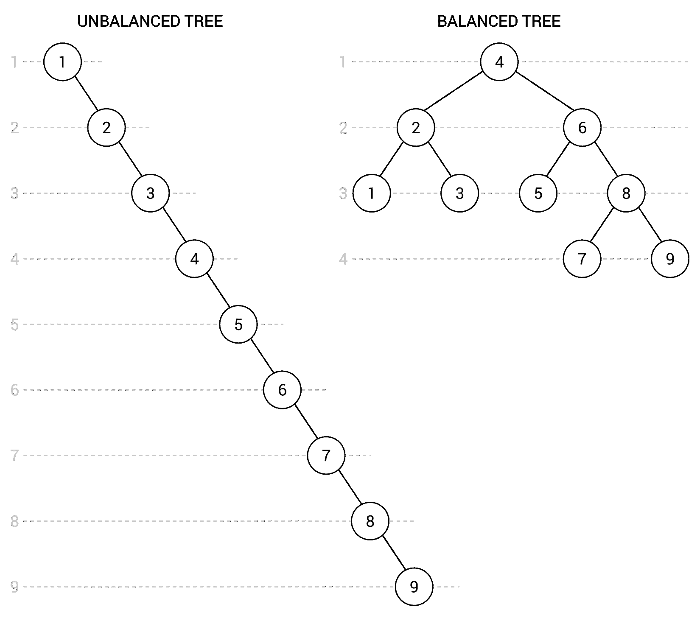

你知道什么是不平衡树和平衡树，以及自我平衡树的目标，但什么是 AVL 树？它是如何工作的？使用此数据结构时应考虑哪些规则？

AVL 树是一种二叉搜索树，其附加要求是，对于每个节点，其左右子树的高度不能相差一个以上。当然，在从树中添加和删除节点后，必须维护该规则。该重要角色由**旋转**执行，用于修复节点的错误排列。

在讨论 AVL 树时，指出此数据结构的性能也是至关重要的。在这种情况下，插入、删除和查找的平均和最坏情况都是*O（logn）*，因此与二叉搜索树相比，最坏情况有显著的改进。

You can find more information about AVL trees at [https://en.wikipedia.org/wiki/AVL_tree](https://en.wikipedia.org/wiki/AVL_tree).

在简短的介绍之后，让我们继续实现。

# 实施

AVL 树的实现，包括保持树的平衡状态所需的各种旋转，似乎相当复杂。幸运的是，您不需要从头开始创建它的实现，因为您可以使用一个可用的 NuGet 包，例如**附件**，它将用于创建我们的示例。

More information about the Adjunct library can be found at:

*   [http://adjunct.codeplex.com/](http://adjunct.codeplex.com/)
*   [https://www.nuget.org/packages/adjunct-System.DataStructures.AvlTree/](https://www.nuget.org/packages/adjunct-System.DataStructures.AvlTree/) 。

该软件包为开发人员提供了一些类，这些类可以在创建基于 C 的应用程序时使用。让我们关注`AvlTree`泛型类，它表示一个 AVL 树。该类的使用非常简单，因此您不需要了解 AVL 树的所有内部细节，您可以很容易地从其优点中获益。

例如，`AvlTree`类配备了`Add`方法，该方法在树中的适当位置插入新节点。您可以使用`Remove`方法轻松删除节点。此外，您还可以通过调用`Height`方法获取给定节点的高度。还可以使用`GetBalanceFactor`获得给定节点的平衡因子，该因子计算为左子树和右子树高度之间的差值。

另一个重要的类是`AvlTreeNode`。它实现了`IBinaryTreeNode`接口，包含四个属性，表示节点的高度（`Height`），对左、右节点的引用（`Left`和`Right`分别），以及在创建类实例时指定类型的节点（`Value`中存储的值。

# 示例–保持树的平衡

正如在 AVL 树的介绍中提到的，有一个非常简单的测试可能会导致 BST 树变得不平衡。您只需添加有序的数字即可创建一棵细长的树。因此，让我们尝试创建一个示例，将完全相同的数据集添加到 AVL 树，使用`Adjunct`库实现。

`Program`类中`Main`方法中的代码如下：

```cs
AvlTree<int> tree = new AvlTree<int>(); 
for (int i = 1; i < 10; i++) 
{ 
    tree.Add(i); 
} 

Console.WriteLine("In-order: "  
    + string.Join(", ", tree.GetInorderEnumerator())); 
Console.WriteLine("Post-order: "  
    + string.Join(", ", tree.GetPostorderEnumerator())); 
Console.WriteLine("Breadth-first: "  
    + string.Join(", ", tree.GetBreadthFirstEnumerator())); 

AvlTreeNode<int> node = tree.FindNode(8); 
Console.WriteLine($"Children of node {node.Value} (height =  
    {node.Height}): {node.Left.Value} and {node.Right.Value}."); 
```

开始时，会创建一个新的`AvlTree`类实例，指示节点将存储整数值。然后，使用`for`循环，使用`Add`方法将以下数字（从 1 到 9）添加到树中。循环执行后，树应包含 9 个节点，按照 AVL 树的规则排列。

此外，您还可以使用常规方法遍历树：顺序法（`GetInorderEnumerator`）、后顺序法（`GetPostorderEnumerator`）和宽度优先法（`GetBreadthFirstEnumerator`）。您已经了解了前两个，但是什么是**宽度优先遍历**？其目的是首先访问相同深度上的所有节点，然后继续访问下一个深度，直到达到最大深度。

运行应用程序时，您将收到以下遍历结果：

```cs
    In-order: 1, 2, 3, 4, 5, 6, 7, 8, 9
    Post-order: 1, 3, 2, 5, 7, 9, 8, 6, 4
    Breadth-first: 4, 2, 6, 1, 3, 5, 8, 7, 9
```

代码的最后一部分使用`FindNode`方法显示了 AVL 树的查找特性。用于获取表示给定值节点的`AvlTreeNode`实例。然后，您可以使用`AvlTreeNode`类的属性轻松获得关于节点的各种数据，例如其高度，以及左、右子节点的值。控制台输出中有关查找功能的部分如下所示：

```cs
    Children of node 8 (height = 2): 7 and 9.
```

简单、方便且无需大量开发工作，这些工作非常精确地描述了应用一个可用包来支持 AVL 树的过程。通过使用它，您不需要自己准备复杂的代码，并且可能出现的问题的数量可以大大减少。

# 红黑树

**红黑树**，也称为**RBT**，是自平衡二叉搜索树的下一个变体。作为 BST 的变体，此数据结构要求维护标准 BST 规则。此外，必须考虑以下规则：

*   每个节点的颜色必须为红色或黑色。因此，需要为存储颜色的节点添加其他数据。
*   具有值的所有节点都不能是叶节点。因此，NIL 伪节点应该用作树中的叶子，而所有其他节点都是内部节点。此外，所有 NIL 伪节点必须为黑色。
*   如果节点为红色，则其两个子节点都必须为黑色。
*   对于任何节点，到后代叶的路由上的黑色节点数（即 NIL 伪节点）必须相同。

下图显示了正确的 RBT：

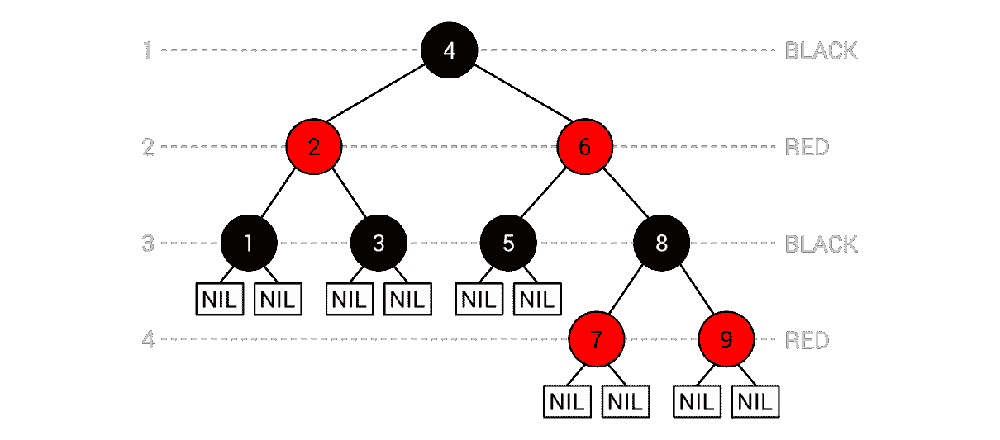

该树由九个节点组成，每个节点的颜色为红色或黑色。值得一提的是作为叶节点添加的 NIL 伪节点。如果您再次查看前面列出的一组规则，您可以确认在这种情况下维护了所有这些规则。

与 AVL 树类似，RBT 还必须在添加或删除节点后维护规则。在这种情况下，恢复 RBT 属性的过程更为复杂，因为它涉及到**重新着色**和**旋转**。幸运的是，您不需要知道和理解非常复杂的内部细节，就可以从这种数据结构中获益并将其应用到项目中。

在讨论这种自平衡 BST 变体时，还值得注意其性能。在平均和最坏情况下，插入、删除和查找都是*O（logn）*操作，因此它们与 AVL 树的情况相同，在最坏情况下比 BST 更好。

You can find more information about RBTs at [https://en.wikipedia.org/wiki/Red-black_tree](https://en.wikipedia.org/wiki/Red-black_tree).

您已经了解了有关 RBT 的一些基本信息，因此让我们使用其中一个可用库继续实现。

# 实施

如果您想在应用程序中使用 RBT，您可以从头开始实现它，或者使用可用的库之一，例如`TreeLib`，您可以使用 NuGet Package Manager 轻松安装它。该库支持几种树，其中存在 RBT。

You can find more information about the library at [http://programmatom.github.io/TreeLib/](http://programmatom.github.io/TreeLib/) and [https://www.nuget.org/packages/TreeLib](https://www.nuget.org/packages/TreeLib).

由于该库为开发人员提供了许多类，因此最好看看与 RBT 相关的类。第一个类名为`RedBlackTreeList`，表示 RBT。它是一个泛型类，因此可以轻松指定存储在每个节点中的数据类型。

该类包含一组方法，包括用于向树插入新元素的`Add`、用于删除具有特定值的节点的`Remove`、用于检查树是否包含给定值的`ContainsKey`、以及用于返回树中存储的最大值和最小值的`Greatest`和`Least`方法。此外，该类还配备了一些迭代节点的变体，包括枚举器。

# 示例–RBT 相关功能

与 AVL 树一样，让我们使用外部库为 RBT 准备示例。这个简单的程序将展示如何创建一个新的树，添加元素，删除一个特定的节点，以及如何从库的其他功能中获益。

让我们看看下面的代码片段，这些代码片段应该添加到 AULT T1R 类中的 TyrT0E.方法中。第一部分内容如下：

```cs
RedBlackTreeList<int> tree = new RedBlackTreeList<int>(); 
for (int i = 1; i <= 10; i++) 
{ 
    tree.Add(i); 
} 
```

这里，创建了`RedBlackTreeList`类的一个新实例。指示节点将存储整数值。然后，使用`for`循环将 10 个数字（从 1 到 10 排列）添加到树中，使用`Add`方法。执行后，应准备好带有 10 个元素的正确排列的 RBT。

在下一行中，使用`Remove`方法删除值为 9 的节点：

```cs
tree.Remove(9); 
```

以下代码行检查树是否包含值等于`5`的节点。然后，返回的布尔值用于在控制台中显示消息：

```cs
bool contains = tree.ContainsKey(5); 
Console.WriteLine( 
    "Does value exist? " + (contains ? "yes" : "no")); 
```

代码的下一部分将展示如何使用`Count`属性以及`Greatest`和`Least`方法。这些特性允许计算树中元素的总数，以及其中存储的最小值和最大值。相关代码行如下所示：

```cs
uint count = tree.Count; 
tree.Greatest(out int greatest); 
tree.Least(out int least); 
Console.WriteLine( 
    $"{count} elements in the range {least}-{greatest}"); 
```

在使用树数据结构时，可能需要某种方法来获取节点的值。您可以使用`GetEnumerable`方法实现此目标，如下所示：

```cs
Console.WriteLine( 
    "Values: " + string.Join(", ", tree.GetEnumerable())); 
```

遍历树中节点的另一种方法涉及到`foreach`循环，如以下代码片段所示：

```cs
Console.Write("Values: "); 
foreach (EntryList<int> node in tree) 
{ 
    Console.Write(node + " "); 
} 
```

如您所见，使用`TreeLib`库非常简单，您可以在几分钟内将其添加到应用程序中。但是，启动程序后控制台中显示的结果是什么？让我们看看：

```cs
    Does value exist? yes
    9 elements in the range 1-10
    Values: 1, 2, 3, 4, 5, 6, 7, 8, 10
    Values: 1 2 3 4 5 6 7 8 10

```

值得注意的是，`TreeLib`并不是唯一一个支持 RBT 的软件包，因此最好看看各种解决方案，选择最适合您需要的解决方案。

您已经到达了本章关于自平衡二进制搜索树的部分的末尾。现在，让我们进入最后一部分，它与堆相关。它们是什么？为什么它们位于关于树的章节中？您将很快了解这些问题和许多其他问题的答案！

# 二进制堆

**堆**是树的另一个变体，它有两个版本：**最小堆**和**最大堆**。对于每一项，必须满足一项附加属性：

*   **对于最小堆**：每个节点的值必须大于等于其父节点的值
*   **对于最大堆**：每个节点的值必须小于等于其父节点的值

这些规则起着非常重要的作用，因为它们规定根节点始终包含最小值（在最小堆中）或最大值（在最大堆中）。因此，它是实现优先级队列的方便数据结构，如[第 3 章](3.html)、*堆栈和队列*所述。

堆有很多变体，包括**二进制堆**，这是本节的主题。在这种情况下，堆必须符合前面提到的规则之一（取决于类型：最小堆或最大堆），并且必须遵守**完整二叉树**规则，该规则要求每个节点不能包含两个以上的子节点，并且树的所有级别都必须完全填充，最后一个除外，必须从左到右填充，并且在右侧可以有一些空白。

让我们看看下面两个二进制堆：

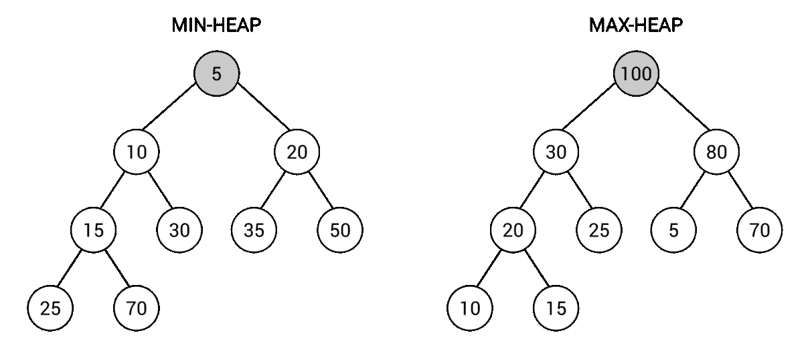

您可以轻松地检查这两个堆是否遵守所有规则。作为一个示例，让我们验证 min heap 变量（如左图所示）中值等于**20**的节点的 heap 属性。节点有两个子节点，其值分别为**35**和**50**，均大于**20**。同样，您可以检查堆中的其余节点。二叉树规则也被维护，因为每个节点最多包含两个子节点。最后一个要求是树的每一层都是完全填充的，但最后一层不需要完全填充，但必须包含从左到右的节点。在 min heap 示例中，三个级别被完全填充（一个、两个和四个节点），而最后一个级别包含两个节点（**25**和**70**），位于最左侧的两个位置。同样，您可以确认 max heap（如右图所示）配置正确。

在这篇关于堆，特别是二进制堆的简短介绍的最后，值得一提的是广泛的应用。如前所述，此数据结构是通过插入新值并移除最小值（在最小堆中）或最大值（在最大堆中）的操作来实现优先级队列的方便方法。此外，堆排序算法中使用了堆，下面的示例对此进行了描述。数据结构还有许多其他应用，例如在图算法中。

You can find more information about binary heaps at [https://en.wikipedia.org/wiki/Binary_heap](https://en.wikipedia.org/wiki/Binary_heap).

您准备好看看堆的实现了吗？如果是这样的话，让我们继续下一节，这里将介绍支持堆的一个可用库。

# 实施

二进制堆可以从头开始实现，也可以使用一些已有的实现。其中一个解决方案名为`Hippie`，可以使用 NuGet Package Manager 安装到项目中。该库包含一些堆变体的实现，包括二进制、二项式和斐波那契堆，本书本章介绍和描述了这些堆。

You can find more information about the library at [https://github.com/pomma89/Hippie](https://github.com/pomma89/Hippie) and [https://www.nuget.org/packages/Hippie](https://www.nuget.org/packages/Hippie).

该库包含几个类，例如`MultiHeap`泛型类，它对于各种堆变体（包括二进制堆）都是通用的。但是，如果相同的类用于二进制、二项式和斐波那契堆，您如何选择要使用的堆类型？您可以使用`HeapFactory`类中的静态方法来解决此问题。例如，可以使用`NewBinaryHeap`方法创建二进制堆，如下所示：

```cs
MultiHeap<int> heap = HeapFactory.NewBinaryHeap<int>(); 
```

`MultiHeap`类配备了一些属性，例如用于获取堆中元素总数的`Count`和用于检索最小值的`Min`。此外，可用的方法允许添加新元素（`Add`），删除特定项（`Remove`），删除最小值（`RemoveMin`），删除所有元素（`Clear`），检查堆中是否存在给定值（`Contains`），以及合并两个堆（`Merge`）。

# 示例–堆排序

作为使用`Hippie`库实现的二进制堆的一个示例，下面介绍并描述了堆排序算法。基于 C#的实现，应该添加到`Program`类中的`Main`方法中，如下所示：

```cs
List<int> unsorted = new List<int>() { 50, 33, 78, -23, 90, 41 }; 
MultiHeap<int> heap = HeapFactory.NewBinaryHeap<int>(); 
unsorted.ForEach(i => heap.Add(i)); 
Console.WriteLine("Unsorted: " + string.Join(", ", unsorted)); 

List<int> sorted = new List<int>(heap.Count); 
while (heap.Count > 0) 
{ 
    sorted.Add(heap.RemoveMin()); 
} 
Console.WriteLine("Sorted: " + string.Join(", ", sorted)); 
```

如您所见，实现非常简单和简短。首先，创建一个列表，其中包含未排序的整数值作为算法的输入。然后，准备一个新的二进制堆，并将每个输入值添加到堆中。在此阶段，输入列表中的元素将写入控制台。

在代码的以下部分中，将创建一个新列表。它将包含排序后的值，因此它将包含算法的结果。然后，使用`while`循环在每次迭代中从堆中移除最小值。循环一直执行到堆中没有元素为止。最后，排序后的列表显示在控制台中。

The heap sort algorithm has *O(n * log(n))* time complexity.

构建项目并运行应用程序时，将看到以下结果：

```cs
    Unsorted: 50, 33, 78, -23, 90, 41
    Sorted: -23, 33, 41, 50, 78, 90

```

如前所述，二进制堆不是堆的唯一变体。其中，二项式堆是非常有趣的方法之一，这是下一节的主题。

# 二项式堆

另一种堆是**二项式堆**。该数据结构由一组不同阶数的**二叉树**组成。顺序为*0*的二叉树只是一个节点。您可以使用两个顺序为*n-1*的二叉树来构建顺序为*n*的树。其中一个树应该作为第一棵树的父树的最左边的子树附着。这听起来确实有点复杂，但下图应该可以消除任何混淆：


如前所述，顺序为**0**的二叉树只是一个节点，如左图所示。顺序为**1**的树由两棵顺序为**0**（用虚线边框标记）的树相互连接而成。对于顺序为**2**的树，使用两个顺序为**1**的树。第二棵树作为第一棵树的父树最左边的子树附着。同样，您可以按以下顺序配置二叉树。

但是，您如何知道二项式堆中应该有多少个二项式树，以及它们应该包含多少个节点？答案可能有点令人惊讶，因为您需要准备节点数量的二进制表示。例如，让我们创建一个包含**13 个**元素的二项式堆。数字**13**具有以下二进制表示：**1101**，即*1*2<sup>0</sup>+0*2<sup>1</sup>+1*2<sup>2</sup>+1*2<sup>3</sup>*。

您需要获得设置位的零基位置，即本例中的**0**、**2**和**3**。这些位置表示应配置的二叉树的顺序：

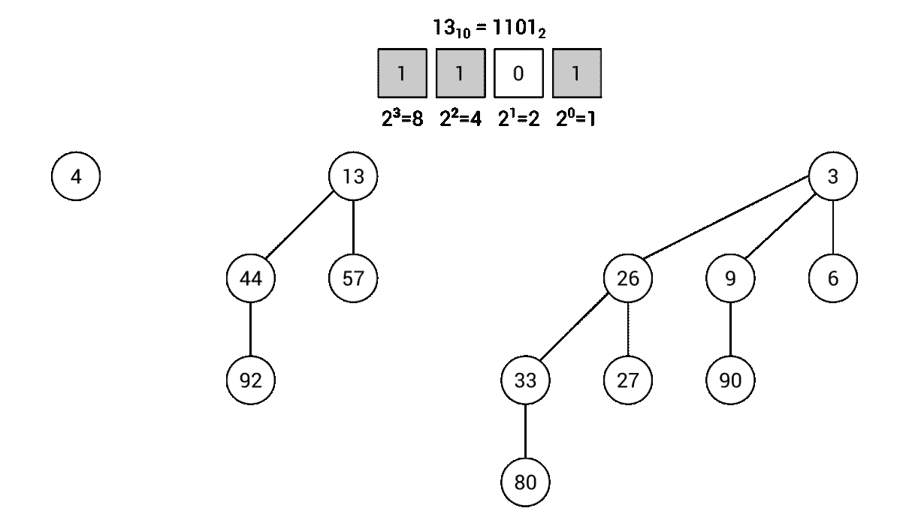

此外，二叉树堆中不能有多个具有相同顺序的二叉树（例如两个具有顺序**2**的树）。还值得注意的是，每个二叉树必须维护 min heap 属性。

You can find more information about binomial heaps at [https://en.wikipedia.org/wiki/Binomial_heap](https://en.wikipedia.org/wiki/Binomial_heap).

二项式堆的实现要比二进制堆复杂得多。出于这个原因，最好使用一个可用的实现，而不是从头开始编写自己的实现。正如在二进制堆的情况中所述，`Hippie`库是一个支持各种堆变体的解决方案，包括二项式堆。

这可能会令人惊讶，但与二进制堆示例相比，代码中唯一的区别是修改了创建`MultiHeap`类新实例的行。为了支持二项式堆，您需要使用`HeapFactory`类中的`NewBinomialHeap`方法，如下所示：

```cs
MultiHeap<int> heap = HeapFactory.NewBinomialHeap<int>(); 
```

不需要更多的更改！现在，您可以以与二进制堆完全相同的方式执行其余操作，例如插入或删除元素。

您已经了解了两种堆，即二进制堆和二项式堆。在下一节中，将简要介绍斐波那契堆。

# 斐波那契堆

**斐波那契堆**是堆的一个有趣变体，在某些方面类似于二项式堆。首先，它也由许多树组成，但是对于每个树的形状没有约束，因此它比二项式堆灵活得多。此外，允许堆中有多个形状完全相同的树。

斐波那契堆的示例如下：


其中一个重要的假设是，每棵树都是一个最小堆。因此，整个斐波那契堆中的最小值肯定是其中一棵树中的根节点。此外，所提出的数据结构支持以*惰性*方式执行各种操作。这意味着它不会执行额外的复杂操作，除非确实有必要。例如，它可以添加一个新节点，就像只添加一个节点的新树一样。

You can find more information about Fibonacci heaps at [https://en.wikipedia.org/wiki/Fibonacci_heap](https://en.wikipedia.org/wiki/Fibonacci_heap).

与二项式堆类似，斐波那契堆的实现也不是一项简单的任务，需要很好地理解此数据结构的内部细节。因此，如果您需要在应用程序中使用斐波那契堆，那么最好使用一个可用的实现，而不是从头开始编写自己的实现。如前所述，`Hippie`库是一个支持多种堆变体的解决方案，包括斐波那契堆。

值得一提的是，与二进制和二项式堆相比，代码中唯一的区别是修改了创建`MultiHeap`类新实例的行。为了支持斐波那契堆，您需要使用`HeapFactory`类中的`NewFibonacciHeap`方法，如下所示：

```cs
MultiHeap<int> heap = HeapFactory.NewFibonacciHeap<int>(); 
```

这就是全部！您刚刚阅读了关于 Fibonacci 堆的简介，它是堆的另一种变体，因此也是树的另一种。这是本章的最后一个主题，现在是进行总结的时候了。

# 总结

本章是本书迄今为止最长的一章。然而，它包含了很多关于树的变体的信息。这样的数据结构在许多算法中扮演着非常重要的角色，了解更多关于它们的知识，以及知道如何在应用程序中使用它们是很好的。因此，本章不仅包含简短的理论介绍，还包含图表、说明和代码示例。

首先，描述了树的概念。作为提醒，树由节点组成，包括一个根节点。根节点不包含父节点，而所有其他节点都包含父节点。每个节点可以有任意数量的子节点。同一节点的子节点可以命名为兄弟节点，而没有子节点的节点可以命名为叶节点。

树的各种变体都遵循这种结构。本章中描述的第一个是二叉树。在这种情况下，一个节点最多可以包含两个子节点。然而，BST 的规则更为严格。对于此类树中的任何节点，其左子树中所有节点的值都必须小于该节点的值，而其右子树中所有节点的值都必须大于该节点的值。BSTs 具有非常广泛的应用范围，并为开发人员提供了查找性能的显著改进。不幸的是，在向树中添加排序值时，很容易使树不平衡。因此，对绩效的积极影响是有限的。

要解决这个问题，可以使用某种自平衡树，它在添加或删除节点时始终保持平衡。本章介绍了自平衡树的两种变体：AVL 树和 RBT。第一种类型有一个附加要求，即对于每个节点，其左子树和右子树的高度不能相差一个以上。RBT 有点复杂，因为它引入了着色节点的概念，无论是红色还是黑色，以及 NIL 伪节点。此外，要求如果节点为红色，则其两个子节点都必须为黑色，并且对于任何节点，到后代叶的路由上的黑色节点数必须相同。正如您在分析此类数据结构时所看到的，它们的实现要困难得多。因此，提供了可使用 NuGet 软件包管理器下载的附加库。

本章的其余部分与堆有关。提醒一下，堆是树的另一个变体，它有两个版本：最小堆和最大堆。值得注意的是，每个节点的值必须大于或等于（对于最小堆）或小于或等于（对于最大堆）其父节点的值。堆存在于许多变体中，包括二进制、二项式和斐波那契式。本章简要介绍了所有这些类型，以及有关使用其中一个 NuGet 包实现的信息。

让我们继续图表，这是下一章的主题！