# 探索图形

在上一章中，您了解了树木。然而，您知道这样的数据结构也属于图形吗？但什么是图形，以及如何在应用程序中使用它？您可以在本章中找到这些问题和许多其他问题的答案！

首先，将介绍有关图形的基本信息，包括节点和边的说明。此外，您将看到有向边和无向边之间的差异，以及加权边和未加权边之间的差异。由于图形是实践中常用的数据结构，您还将看到一些应用程序，例如在社交媒体中存储朋友的数据或在城市中查找道路。然后，将讨论图形表示的主题，即使用邻接列表和矩阵。

在这篇简短的介绍之后，您将学习如何用 C#语言实现图形。此任务涉及一些类的声明，例如关于节点和边的声明。本章将详细描述所有必要的代码。

此外，您还将有机会阅读两种图形遍历模式的描述，即深度优先和广度优先搜索。对于这两种情况，将显示 C#代码和详细说明。

下一部分将介绍最小生成树的主题，以及创建它们的两个算法，即 Kruskal 和 Prim。这些算法将以文本描述、基于 C 的代码片段以及易于理解的插图的形式呈现。此外，还将提供示例真实应用程序。

另一个与图相关的有趣问题是节点的着色，这将在本章的下一部分中予以考虑。最后，将使用 Dijkstra 算法分析在图中寻找最短路径的主题。当然，还将展示示例真实世界应用程序以及基于 C#的实现。

正如你所看到的，图表的主题涉及许多有趣的问题，本书中只会提到其中的一些问题。但是，所选主题适合在基于 C#的实现环境中呈现各种与图形相关的方面。你准备好进入图表的主题了吗？如果是这样，请开始阅读本章！

本章将介绍以下主题：

*   图的概念
*   应用
*   代表
*   实施
*   横穿
*   最小生成树
*   着色
*   最短路径

# 图的概念

让我们从这个问题开始*什么是图形？*广义而言，图是由**节点**（也称**顶点**和**边**组成的数据结构。每条边连接两个节点。图形数据结构不需要关于节点之间连接的任何特定规则，如下图所示：

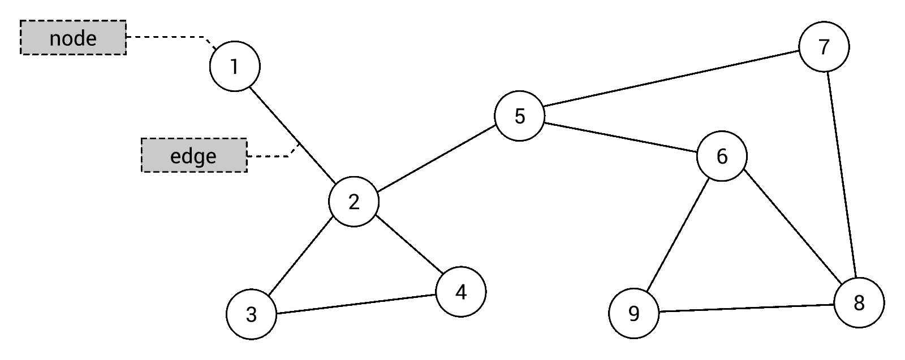

上述概念似乎很简单，不是吗？让我们试着分析前面的图表以消除任何疑问。它包含九个节点，数值介于**1**和**9**之间。这些节点由 11 条边连接，如节点**2**和**4**之间。此外，一个图可以包含**循环**，例如，由**2**、**3**和**4**指示的节点，以及未连接在一起的单独的节点组。但是，关于父节点和子节点的主题，您从学习树中了解到了什么？由于图中没有关于连接的特定规则，因此在本例中不使用此类概念。

A graph can also contain **self-loops**. Each is an edge that connects a given node with itself. However, such a topic is out of the scope of this book and is not taken into account in examples shown in this chapter.

图中的边还需要一些注释。在上图中，您可以看到一个图，其中所有节点都与**无向边**相连，即**双向边**。它们表示可以在两个方向的节点之间移动，例如从节点**2**到**3**和从节点**3**到**2**。这些边以图形方式显示为直线。当一个图包含无向边时，它是一个**无向图**。

然而，当您需要指出节点之间的移动只能在一个方向上进行时，情况又如何呢？在这种情况下，您可以使用**定向边**，即**单向边**，这些边以图形方式表示为直线，箭头指示边的方向。如果一个图包含有向边，则可以将其命名为**有向图**。

下图右侧显示了一个示例有向图，而左侧显示了一个无向图：

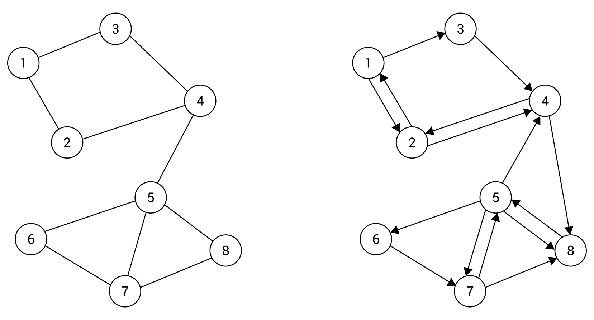

作为一个简短的解释，有向图（如上图右侧所示）包含由 15 条单向边连接的 8 个节点。例如，它们表示可以在节点**1**和**2**之间双向移动，但允许从节点**1**到**3**只在一个方向移动，因此不可能从**3**到达节点**1**直接地

无向边和有向边之间的划分不是唯一的。您还可以为特定边缘指定**权重**（也称为**成本**，以指示节点之间的移动成本。当然，这些权重可以同时指定给无向边和有向边。如果提供了权重，则一条边被命名为**加权边**，整个图被命名为**加权图**。类似地，如果未提供权重，则在可称为**未加权图**的图中使用**未加权边**。

具有无向（左）边和有向（右）边的示例加权图如下图所示：

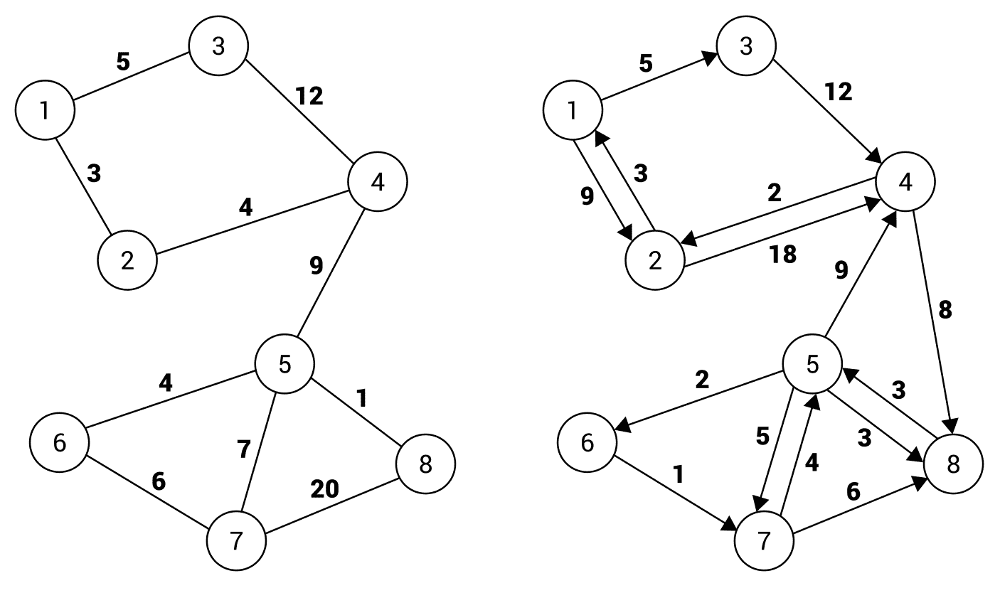

加权边的图形表示仅显示线旁边边的加权相加。例如，从节点**1**到**2**的旅行成本，以及从节点**2**到**1**的旅行成本，在无向图的情况下等于**3**，如上图左侧所示。在有向图（右侧）的情况下，情况要复杂一些。在这里，您可以从节点**1**到**2**旅行，费用相当于**9**，而反向旅行（从节点**2**到**1**要便宜得多，而且只需**3**。

# 应用

在简短的介绍之后，您将了解一些关于图的基本信息，特别是关于节点和各种边的信息。然而，为什么图形的主题如此重要，为什么它占据了本书的整个章节？您能在应用程序中使用此数据结构吗？答案显而易见：是的！这些图通常用于解决各种算法问题，并有许多实际应用。下图显示了两个示例。

首先，让我们考虑一下社交媒体中的朋友结构。每个用户都有很多联系人，但他们也有很多朋友，等等。您应该选择什么数据结构来存储这些数据？图表是最简单的答案之一。在这种情况下，节点表示联系人，而边表示人与人之间的关系。举个例子，让我们看看下面的无向图和非赋权图：

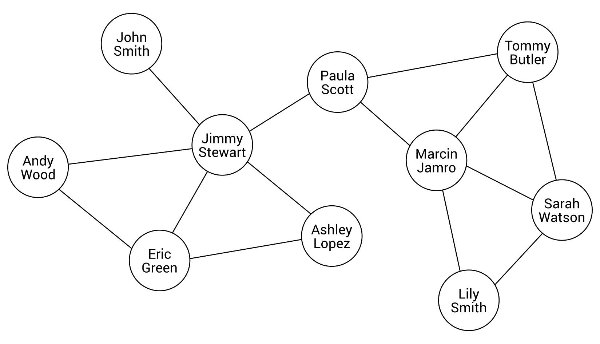

正如你所看到的，**吉米·斯图尔特**有五个联系人，分别是**约翰·史密斯**、**安迪·伍德**、**埃里克·格林**、**阿什利·洛佩兹**和**保拉·斯科特**。同时，**保拉·斯科特**还有另外两个朋友：**马辛·贾莫**和**汤米·巴特勒**。使用图形作为数据结构，您可以轻松检查两个人是朋友还是有共同的联系人。

图的另一个常见应用涉及搜索最短路径的问题。让我们设想一个程序，该程序应该在城市的两点之间找到一条路径，同时考虑到驾驶特定道路所需的时间。在这种情况下，可以使用图形显示城市地图，其中节点表示交叉点，边表示道路。当然，应该为边指定权重，以指示在给定道路上行驶所需的时间。搜索最短路径的主题可以理解为以最小的总代价找到从源节点到目标节点的边列表。基于图形的城市地图示意图如下所示：

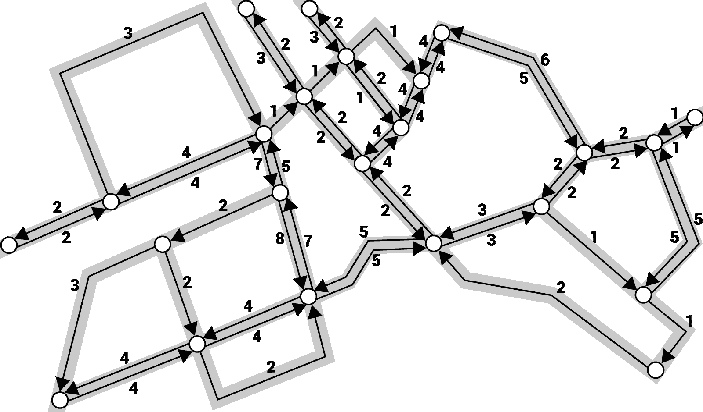

如您所见，选择了有向加权图。定向边的应用使其能够同时支持双向和单向道路，而加权边允许指定在两个交叉口之间行驶所需的时间。

# 代表

现在你知道什么是图形，什么时候可以使用它，但是你如何在计算机内存中表示它呢？解决这个问题有两种常用的方法，即使用**邻接列表**和**邻接矩阵**。以下各节将详细介绍这两种方法。

# 邻接表

第一种方法要求通过指定节点的邻居列表来扩展节点的数据。因此，只需迭代给定节点的邻接列表，就可以轻松获得给定节点的所有邻居。这样的解决方案节省空间，因为只存储相邻边的数据。让我们看看下面的图表：

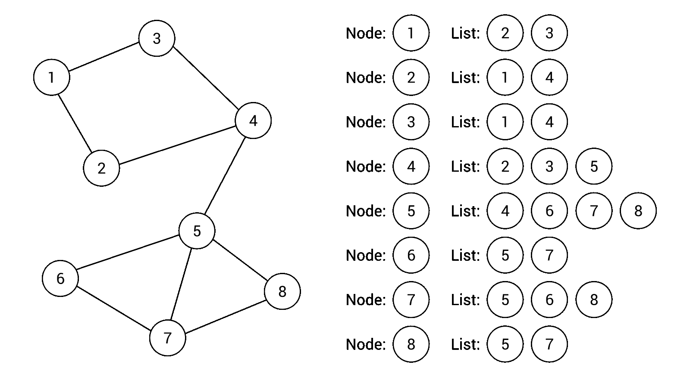

示例图包含 8 个节点和 10 条边。对于每个节点，将创建相邻节点（即邻居）的列表，如图右侧所示。例如，节点**1**有两个邻居，即节点**2**和**3**，而节点**5**有四个邻居，即节点**4**、**6**、**7**和**8**。如您所见，基于无向图和无权重图的邻接列表的表示非常简单，并且易于使用、理解和实现。

然而，在有向图的情况下，邻接列表是如何工作的？答案是显而易见的，因为分配给每个节点的列表只显示从给定节点可以到达的相邻节点。示例图如下所示：

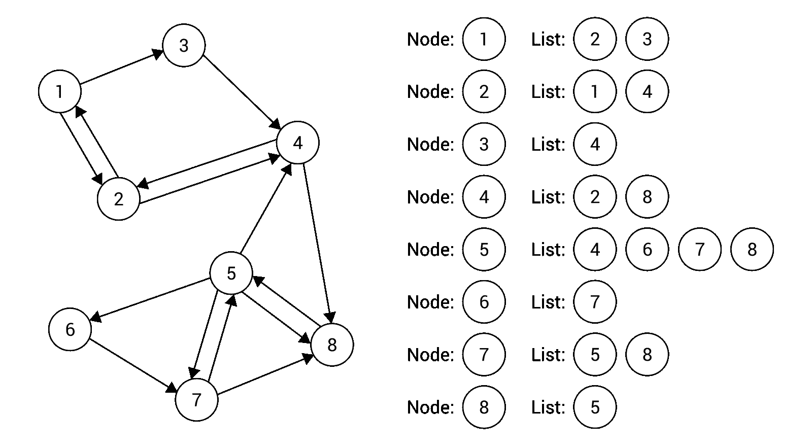

让我们看一看节点 3。这里，邻接列表仅包含一个元素，即节点**4**。不包括节点**1**，因为无法直接从节点**3**到达该节点。

对于加权图，可能需要进一步澄清。在这种情况下，还需要存储特定边的权重。您可以通过扩展存储在邻接列表中的数据来实现此目标，如下图所示：

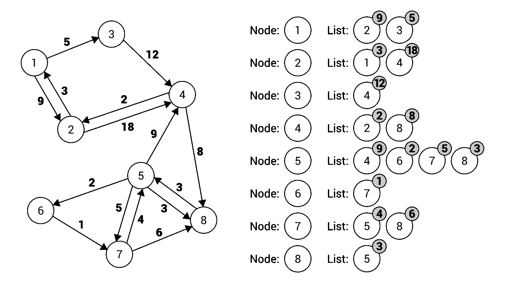

节点**7**的邻接列表包含两个元素，即关于节点**5**（权重等于**4**）和节点**8**（权重等于**6**）的边。

# 邻接矩阵

另一种图形表示方法涉及邻接矩阵，它使用二维数组显示哪些节点通过边连接。矩阵包含相同数量的行和列，这等于节点的数量。其主要思想是将元素中特定边的信息存储在矩阵中给定的行和列中。行和列的索引取决于与边连接的节点。例如，如果要获取有关索引为 1 和 5 的节点之间的边的信息，则应检查索引为 1 的行和索引设置为 5 的列中的元素。

这样的解决方案为您提供了检查两个特定节点是否由边连接的快速方法。但是，它可能需要您存储比邻接列表多得多的数据，特别是当图形在节点之间不包含许多边时。

首先，让我们分析一个无向无权图的基本场景。在这种情况下，邻接矩阵可能只存储布尔值。放置在`i`行和`j`列元素中的`true`值表示索引等于`i`的节点与索引为`j`的节点之间存在连接。如果听起来很复杂，请看以下示例：

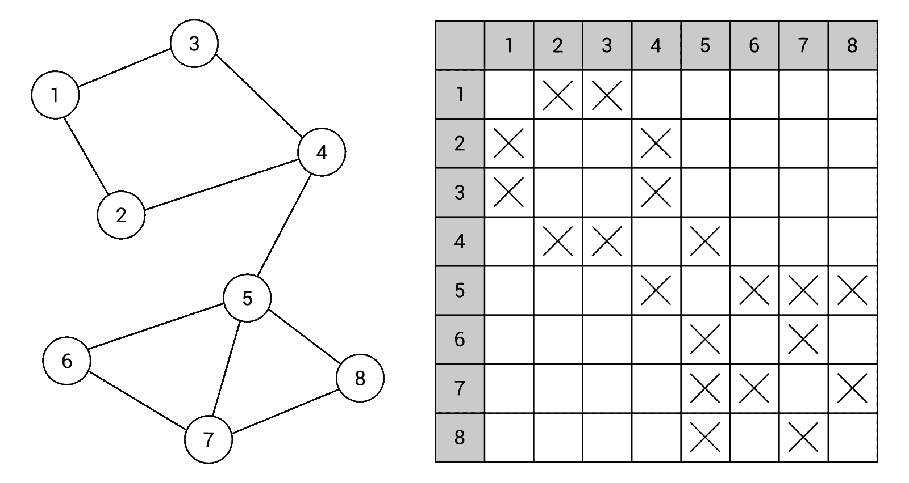

这里，邻接矩阵包含 64 个元素（八行八列），因为图中有八个节点。数组中许多元素的值被设置为`false`，由缺少的指示符表示。其余部分用十字标记，代表`true`值。例如，第四行第三列元素中的该值表示节点**4**和**3**之间存在一条边，如上图所示。

As the presented graph is undirected, the adjacency matrix is symmetric. If there is an edge between nodes `i` and `j`, there is also an edge between nodes `j` and `i`.

下一个示例涉及有向图和无权图。在这种情况下，可以使用相同的规则，但邻接矩阵不需要对称。让我们看看下面的图表，连同邻接矩阵一起呈现：


在所示的邻接矩阵中，您可以找到 15 条边的数据，这些边由 15 个元素表示，带有`true`值，由矩阵中的十字表示。例如，从节点**5**到**4**的单向边在第五行和第四列显示为十字。

在前面的两个示例中，您已经学习了如何使用邻接矩阵表示未加权图。但是，如何存储加权图的数据（无向或有向）？答案很简单，您只需要将存储在邻接矩阵中特定元素中的数据类型从布尔更改为数字。因此，可以指定边的权重，如下图所示：

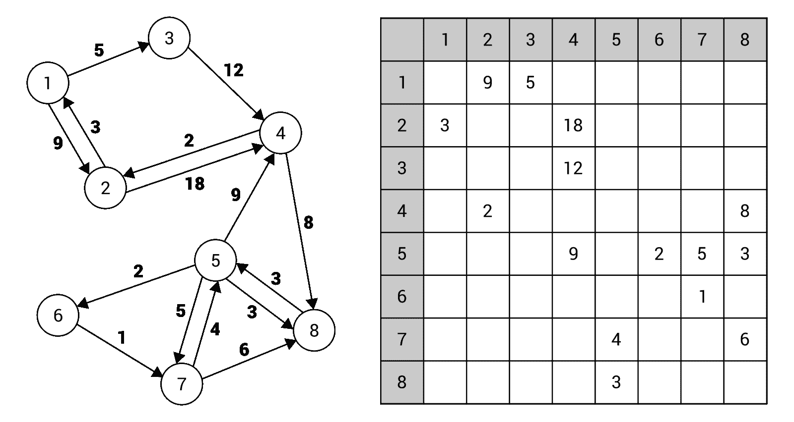

前面的图表和邻接矩阵是自解释的。然而，为了消除任何疑问，让我们看看节点之间的边缘，T0 0，5，T1，1 和 6。这样的边由第五行和第六列的元素表示。元素的值等于在这些节点之间旅行的成本。

# 实施

您已经了解了一些关于图的基本信息，包括节点、边和两种表示方法，即使用邻接列表和矩阵。但是，如何在应用程序中使用这种数据结构？在本节中，您将学习如何使用 C 语言实现图形。为了使您更容易理解所呈现的内容，提供了两个示例。

# 节点

首先，让我们来看看代表图中单个节点的泛型类的代码。这样一个类名为`Node`，其代码如下：

```cs
public class Node<T> 
{ 
    public int Index { get; set; } 
    public T Data { get; set; } 
    public List<Node<T>> Neighbors { get; set; }  
        = new List<Node<T>>(); 
    public List<int> Weights { get; set; } = new List<int>(); 

    public override string ToString() 
    { 
        return $"Node with index {Index}: {Data}, 
            neighbors: {Neighbors.Count}"; 
    } 
} 
```

该类包含四个属性。由于所有这些元素在本章所示的代码片段中都扮演着重要的角色，让我们详细分析它们：

*   第一个属性（`Index`将特定节点的索引存储在图中的节点集合中，以简化访问特定元素的过程。因此，通过使用索引，可以很容易地获得表示特定节点的`Node`类的实例。
*   下一个属性名为`Data`，只在节点中存储一些数据。值得一提的是，此类数据的类型与创建泛型类实例时指定的类型一致。
*   `Neighbors`属性表示特定节点的邻接列表。因此，它包含对表示相邻节点的`Node`实例的引用。
*   最后一个属性名为`Weights`并存储分配给相邻边的权重。在加权图的情况下，`Weights`列表中的元素数量与邻居的数量相同（`Neighbors`。如果图形未加权，`Weights`列表为空。

除了属性之外，该类还包含重写的`ToString`方法，该方法返回对象的文本表示形式。这里返回格式为`"Node with index [index]: [data], neighbors: [count]"`的字符串。

# 边

如图主题的简短介绍中所述，图由节点和边组成。由于节点由`Node`类的实例表示，`Edge`泛型类可用于表示边。代码的适用部分如下所示：

```cs
public class Edge<T> 
{ 
    public Node<T> From { get; set; } 
    public Node<T> To { get; set; } 
    public int Weight { get; set; } 

    public override string ToString() 
    { 
        return $"Edge: {From.Data} -> {To.Data},  
            weight: {Weight}"; 
    } 
} 
```

该类包含三个属性，即表示与边相邻的节点（`From`和`To`），以及边的权重（`Weight`）。此外，重写了`ToString`方法，以显示有关边缘的一些基本信息。

# 图表

下一个类被命名为`Graph`，它表示一个完整的图，具有有向边或无向边，以及有权边或无权边。实现由各种字段和方法组成，详细描述如下。

让我们看一下基本的版本：

```cs
public class Graph<T> 
{ 
    private bool _isDirected = false; 
    private bool _isWeighted = false; 
    public List<Node<T>> Nodes { get; set; }  
        = new List<Node<T>>(); 
} 
```

该类包含两个字段，指示边是否是定向的（`_isDirected`）和加权的（`_isWeighted`）。此外，还声明了`Nodes`属性，该属性存储图中存在的节点列表。

该类还包含构造函数，如下所示：

```cs
public Graph(bool isDirected, bool isWeighted) 
{ 
    _isDirected = isDirected; 
    _isWeighted = isWeighted; 
} 
```

这里，根据传递给构造函数的参数值，只设置`_isDirected`和`_isWeighted`私有字段的值。

`Graph`类的下一个有趣的成员是索引器，它采用两个索引，即两个节点的索引，以返回表示这些节点之间的边的`Edge`泛型类的实例。实现如以下代码段所示：

```cs
public Edge<T> this[int from, int to] 
{ 
    get 
    { 
        Node<T> nodeFrom = Nodes[from]; 
        Node<T> nodeTo = Nodes[to]; 
        int i = nodeFrom.Neighbors.IndexOf(nodeTo); 
        if (i >= 0) 
        { 
            Edge<T> edge = new Edge<T>() 
            { 
                From = nodeFrom, 
                To = nodeTo, 
                Weight = i < nodeFrom.Weights.Count  
                    ? nodeFrom.Weights[i] : 0 
            }; 
            return edge; 
        } 

        return null; 
    } 
} 
```

在索引器中，您可以根据索引得到表示两个节点（`nodeFrom`和`nodeTo`的`Node`类的实例。由于要查找从第一个节点（`nodeFrom`）到第二个节点（`nodeTo`）的边，需要尝试使用`IndexOf`方法在第一个节点的相邻节点集合中查找第二个节点。如果这样的连接不存在，`IndexOf`方法返回负值，`null`由索引器返回。否则，您将创建`Edge`类的新实例并设置其属性的值，包括`From`和`To`。如果提供了关于特定边的权重的数据，则还设置了`Edge`类的`Weight`属性的值。

现在您知道了如何在图中存储节点的数据，但是如何添加新节点？为此，实施`AddNode`方法，如下所示：

```cs
public Node<T> AddNode(T value) 
{ 
    Node<T> node = new Node<T>() { Data = value }; 
    Nodes.Add(node); 
    UpdateIndices(); 
    return node; 
} 
```

在这个方法中，您创建了一个`Node`类的新实例，并根据参数的值设置`Data`属性的值。然后，将新创建的实例添加到`Nodes`集合中，并调用`UpdateIndices`方法（稍后描述）更新集合中存储的所有节点的索引。最后返回代表新添加节点的`Node`实例。

也可以删除现有节点。此操作通过`RemoveNode`方法执行，如下代码段所示：

```cs
public void RemoveNode(Node<T> nodeToRemove) 
{ 
    Nodes.Remove(nodeToRemove); 
    UpdateIndices(); 
    foreach (Node<T> node in Nodes) 
    { 
        RemoveEdge(node, nodeToRemove); 
    } 
} 
```

该方法采用一个参数，即应删除的节点实例。首先，将其从节点集合中移除。然后，更新其余节点的索引。最后，遍历图中的所有节点，以删除与已删除节点连接的所有边。

如您所知，图由节点和边组成。因此，`Graph`类的实现应该为开发人员提供添加新边缘的方法。当然，它应该支持各种不同的边，有向、无向、加权或无加权。拟议实施情况如下所示：

```cs
public void AddEdge(Node<T> from, Node<T> to, int weight = 0) 
{ 
    from.Neighbors.Add(to); 
    if (_isWeighted) 
    { 
        from.Weights.Add(weight); 
    } 

    if (!_isDirected) 
    { 
        to.Neighbors.Add(from); 
        if (_isWeighted) 
        { 
            to.Weights.Add(weight); 
        } 
    } 
} 
```

`AddEdge`方法采用三个参数，即`Node`类的两个实例表示通过边缘连接的节点（`from`和`to`），以及连接的权重（`weight`），默认设置为`0`。

在方法的第一行中，您将表示第二个节点的`Node`实例添加到第一个节点的邻居节点列表中。如果考虑加权图，还将添加上述边的权重。

只有当图形是无向的时，才会考虑代码的以下部分。在这种情况下，需要在相反方向自动添加边。为此，将表示第一个节点的`Node`实例添加到第二个节点的邻居节点列表中。如果对边进行加权，则上述边的权重也会添加到`Weights`列表中。

`RemoveEdge`方法支持从图形中删除边的过程。代码如下：

```cs
public void RemoveEdge(Node<T> from, Node<T> to) 
{ 
    int index = from.Neighbors.FindIndex(n => n == to); 
    if (index >= 0) 
    { 
        from.Neighbors.RemoveAt(index);
        if (_isWeighted)
        { 
            from.Weights.RemoveAt(index); 
        }
    } 
} 
```

该方法采用两个参数，即两个节点（`from`和`to`，在这两个节点之间有一条需要删除的边。首先，尝试在第一个节点的邻居节点列表中查找第二个节点。如果找到它，则将其删除。当然，如果考虑加权图，还应该删除权重数据。

最后一个公共方法名为`GetEdges`，它可以获得图形中所有可用边的集合。拟议的实施情况如下：

```cs
public List<Edge<T>> GetEdges() 
{ 
    List<Edge<T>> edges = new List<Edge<T>>(); 
    foreach (Node<T> from in Nodes) 
    { 
        for (int i = 0; i < from.Neighbors.Count; i++) 
        { 
            Edge<T> edge = new Edge<T>() 
            { 
                From = from, 
                To = from.Neighbors[i], 
                Weight = i < from.Weights.Count  
                    ? from.Weights[i] : 0 
            }; 
            edges.Add(edge); 
        } 
    } 
    return edges; 
} 
```

首先，初始化一个新的边列表。然后，使用`foreach`循环遍历图中的所有节点。在其中，您可以使用`for`循环来创建`Edge`类的实例。实例数应等于当前节点的邻居数（在`foreach`循环中的`from`变量）。在`for`循环中，通过设置`Edge`类的属性值来配置新创建的`Edge`类实例，即第一个节点（即`from`变量，即`foreach`循环中的当前节点）、第二个节点（到当前分析的邻居）和权重。然后，新创建的实例被添加到边集合中，由`edges`变量表示。最后，返回结果。

在各种方法中，您使用`UpdateIndices`方法。代码如下：

```cs
private void UpdateIndices() 
{ 
    int i = 0; 
    Nodes.ForEach(n => n.Index = i++); 
} 
```

该方法只需遍历图中的所有节点，并将`Index`属性的值更新为连续数，从`0`开始。值得注意的是，迭代使用的是`ForEach`方法，而不是`foreach`或`for`循环。

现在您知道了如何创建图形的基本实现。下一步是应用它来表示一些示例图，如下面两节所示。

# 示例–无向边和未加权边

让我们尝试使用前面的实现来创建无向图和无权重图，如下图所示：

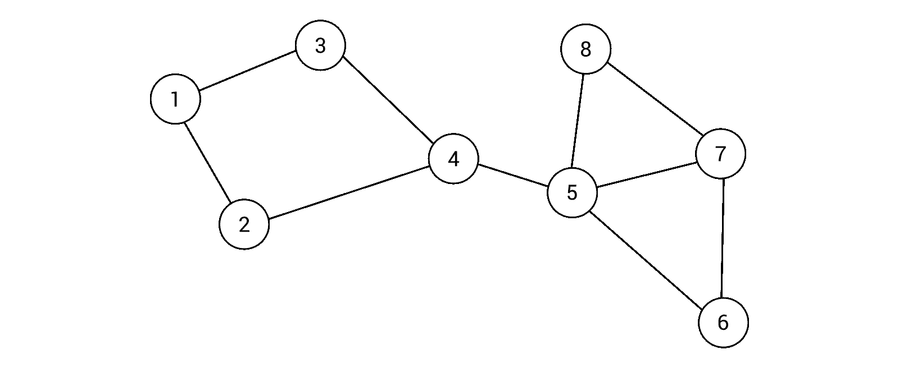

如您所见，该图包含 8 个节点和 10 条边。您可以在`Program`类的`Main`方法中配置示例图。实现从以下代码行开始，它初始化一个新的无向图（第一个参数的值为`false`）和一个未加权图（第二个参数的值为`false`）：

```cs
Graph<int> graph = new Graph<int>(false, false); 
```

然后，添加必要的节点，并将对它们的引用存储为`Node<int>`类型的新变量，如下所示：

```cs
Node<int> n1 = graph.AddNode(1); 
Node<int> n2 = graph.AddNode(2); 
Node<int> n3 = graph.AddNode(3); 
Node<int> n4 = graph.AddNode(4); 
Node<int> n5 = graph.AddNode(5); 
Node<int> n6 = graph.AddNode(6); 
Node<int> n7 = graph.AddNode(7); 
Node<int> n8 = graph.AddNode(8); 
```

最后，根据前面的图，您只需要在节点之间添加边。必要的代码如下所示：

```cs
graph.AddEdge(n1, n2); 
graph.AddEdge(n1, n3); 
graph.AddEdge(n2, n4); 
graph.AddEdge(n3, n4); 
graph.AddEdge(n4, n5); 
graph.AddEdge(n5, n6); 
graph.AddEdge(n5, n7); 
graph.AddEdge(n5, n8); 
graph.AddEdge(n6, n7); 
graph.AddEdge(n7, n8); 
```

这就是全部！如您所见，使用此数据结构的拟议实现，图形的配置非常容易。现在，让我们进入一个稍微复杂的场景，使用定向边和加权边。

# 示例–定向边和加权边

下一个示例涉及有向图和加权图，如下所示：

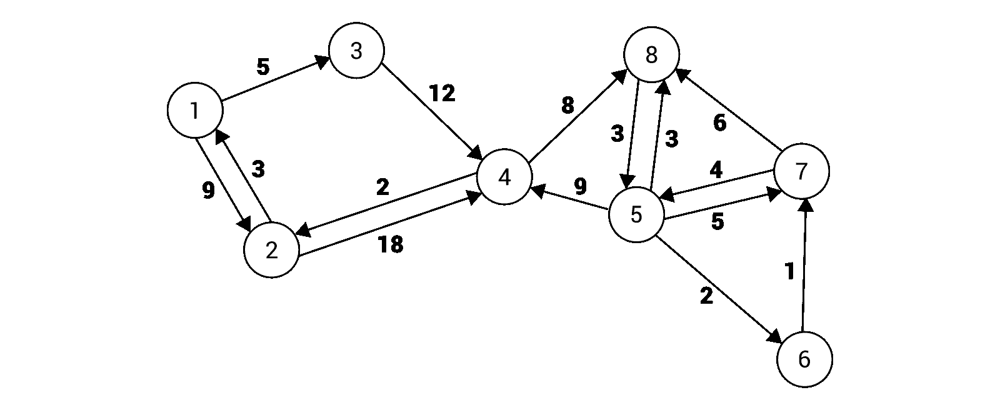

该实现与上一节中描述的实现非常相似。然而，一些修改是必要的。首先，使用构造器参数的不同值，即`true`而不是`false`，以指示正在考虑边的定向和加权变量。合适的代码行如下所示：

```cs
Graph<int> graph = new Graph<int>(true, true); 
```

关于添加节点的部分与上一个示例中完全相同：

```cs
Node<int> n1 = graph.AddNode(1); 
Node<int> n2 = graph.AddNode(2); 
Node<int> n3 = graph.AddNode(3); 
Node<int> n4 = graph.AddNode(4); 
Node<int> n5 = graph.AddNode(5); 
Node<int> n6 = graph.AddNode(6); 
Node<int> n7 = graph.AddNode(7); 
Node<int> n8 = graph.AddNode(8); 
```

在添加边的代码行中很容易看到一些更改。在这里，可以指定定向边及其权重，如下所示：

```cs
graph.AddEdge(n1, n2, 9); 
graph.AddEdge(n1, n3, 5); 
graph.AddEdge(n2, n1, 3); 
graph.AddEdge(n2, n4, 18); 
graph.AddEdge(n3, n4, 12); 
graph.AddEdge(n4, n2, 2); 
graph.AddEdge(n4, n8, 8); 
graph.AddEdge(n5, n4, 9); 
graph.AddEdge(n5, n6, 2); 
graph.AddEdge(n5, n7, 5); 
graph.AddEdge(n5, n8, 3); 
graph.AddEdge(n6, n7, 1); 
graph.AddEdge(n7, n5, 4); 
graph.AddEdge(n7, n8, 6); 
graph.AddEdge(n8, n5, 3); 
```

您刚刚完成了图形的基本实现，如两个示例所示。那么，让我们进入另一个主题，即遍历图。

# 横穿

对图执行的有用操作之一是它的**遍历**，也就是说，以某种特定顺序访问所有节点。当然，上述问题可以通过多种方式解决，如使用**深度优先搜索**（**DFS**）或**广度优先搜索**（**BFS**等）方法。值得一提的是，遍历主题与在图中搜索给定节点的任务严格相关。

# 深度优先搜索

本章中描述的第一个图遍历算法称为 DFS。在示例图的上下文中，其步骤如下：


当然，仅仅通过查看前面的图表就有点难以理解 DFS 算法是如何运行的。出于这个原因，让我们试着分析它的阶段。

在第一步中，您将看到具有八个节点的图。节点**1**标记为灰色背景（表示该节点已被访问），以及红色边框（表示该节点正被访问）。此外，算法中的一个重要角色由当前节点的相邻节点（显示为带虚线边框的圆）执行。当您知道特定指标的作用时，很明显，在第一步中，节点**1**被访问。它有两个邻居（节点**2**和**3**。

然后，考虑第一邻居（节点**2**并执行相同的操作，即访问该节点并分析邻居（节点**1**和**4**。由于节点**1**已经被访问，因此跳过。在下一步中（如**步骤**所示），节点**2**的第一个合适邻居被考虑到节点**4**。它有两个邻居，即节点**2**（已访问）和**8**。接下来，访问节点**8**（**步骤**），并根据相同的规则访问节点**5**（**步骤**。它有四个邻居，即节点**4**（已访问）、**6**、**7**和**8**（已访问）。因此，在下一步骤中，考虑节点**6**（**步骤**。由于它只有一个邻居（节点**7**，因此下一步将访问它（**步骤**。

然后检查节点**7**的邻居，即节点**5**和**8**。这两个节点都已被访问，因此返回到具有未访问邻居的节点。在该示例中，节点**1**具有一个未访问的节点，即节点**3**。当它被访问时（**步骤#8**），所有节点都被遍历，无需进一步操作。

在这个例子中，让我们尝试用 C 语言创建实现。首先，`DFS`方法（在`Graph`类中）的代码如下所示：

```cs
public List<Node<T>> DFS() 
{ 
    bool[] isVisited = new bool[Nodes.Count]; 
    List<Node<T>> result = new List<Node<T>>(); 
    DFS(isVisited, Nodes[0], result); 
    return result; 
} 
```

重要角色由`isVisited`数组执行。它的元素数与节点数完全相同，并存储指示给定节点是否已被访问的值。如果是，则存储`true`值，否则存储`false`。遍历节点的列表表示为`result`变量中的列表。更重要的是，这里调用了`DFS`方法的另一个变体，传递三个参数，即对`isVisited`数组的引用、要分析的第一个节点以及用于存储结果的列表。

上述`DFS`方法变体的代码如下所示：

```cs
private void DFS(bool[] isVisited, Node<T> node,  
    List<Node<T>> result) 
{ 
    result.Add(node); 
    isVisited[node.Index] = true; 

    foreach (Node<T> neighbor in node.Neighbors) 
    { 
        if (!isVisited[neighbor.Index]) 
        { 
            DFS(isVisited, neighbor, result); 
        } 
    } 
} 
```

所示的实现非常简单。开始时，将当前节点添加到已遍历节点的集合中，并更新`isVisited`数组中的元素。然后，使用`foreach`循环遍历当前节点的所有邻居。对于它们中的每一个，如果尚未访问，`DFS`方法将被递归调用。

You can find more information about DFS at [https://en.wikipedia.org/wiki/Depth-first_search](https://en.wikipedia.org/wiki/Depth-first_search).

要完成，让我们看一下可以放置在 AuthT1 类中的 Type T0 方法中的代码。其主要部分显示在以下代码段中：

```cs
Graph<int> graph = new Graph<int>(true, true); 
Node<int> n1 = graph.AddNode(1); (...) 
Node<int> n8 = graph.AddNode(8); 
graph.AddEdge(n1, n2, 9); (...) 
graph.AddEdge(n8, n5, 3); 
List<Node<int>> dfsNodes = graph.DFS(); 
dfsNodes.ForEach(n => Console.WriteLine(n)); 
```

这里，初始化一个有向加权图。要开始遍历图，只需调用`DFS`方法，该方法返回`Node`实例列表。然后，您可以轻松地遍历列表中的元素，以打印关于每个节点的一些基本信息。结果如下所示：

```cs
    Node with index 0: 1, neighbors: 2
    Node with index 1: 2, neighbors: 2
    Node with index 3: 4, neighbors: 2
    Node with index 7: 8, neighbors: 1
    Node with index 4: 5, neighbors: 4
    Node with index 5: 6, neighbors: 1
    Node with index 6: 7, neighbors: 2
    Node with index 2: 3, neighbors: 1

```

这就是全部！如您所见，该算法尝试尽可能深入，然后返回以查找下一个可以遍历的未访问邻居。然而，本文提出的算法并不是解决图遍历问题的唯一方法。在下一节中，您将看到另一个方法，以及一个基本示例及其实现。

# 广度优先搜索

在上一节中，您学习了 DFS 方法。现在您将看到另一种解决方案，即 BFS。其主要目的是首先访问当前节点的所有邻居，然后继续访问下一级节点。

如果前面的描述听起来有点复杂，请查看此图，它描述了 BFS 算法的步骤：


该算法首先访问节点**1**（**步骤**。它有两个邻居，即节点**2**和**3**，下一步访问它们（**步骤**和**步骤****。由于节点**1**没有更多的邻居，因此考虑其第一个邻居（节点**2**的邻居）。因为它只有一个邻居（节点**4**，所以在下一步中会访问它。按照相同的方法，剩余节点的访问顺序为：**8**、**5**、**6**、**7**。**

 **听起来很简单，不是吗？让我们来看看这个实现：

```cs
public List<Node<T>> BFS() 
{ 
    return BFS(Nodes[0]); 
} 
```

`BFS`public 方法被添加到`Graph`类中，仅用于开始图的遍历。它调用 private`BFS`方法，将第一个节点作为参数传递。其代码如下所示：

```cs
private List<Node<T>> BFS(Node<T> node) 
{ 
    bool[] isVisited = new bool[Nodes.Count]; 
    isVisited[node.Index] = true; 

    List<Node<T>> result = new List<Node<T>>(); 
    Queue<Node<T>> queue = new Queue<Node<T>>(); 
    queue.Enqueue(node); 
    while (queue.Count > 0) 
    { 
        Node<T> next = queue.Dequeue(); 
        result.Add(next); 

        foreach (Node<T> neighbor in next.Neighbors) 
        { 
            if (!isVisited[neighbor.Index]) 
            { 
                isVisited[neighbor.Index] = true; 
                queue.Enqueue(neighbor); 
            } 
        } 
    } 

    return result; 
} 
```

代码中的重要角色由`isVisited`数组执行，该数组存储指示特定节点是否已被访问的布尔值。这样一个数组在`BFS`方法开始时被初始化，并且与当前节点相关的元素的值被设置为`true`，这表示该节点已经被访问过。

然后，创建用于存储已遍历节点的列表（`result`）和用于存储应在以下迭代中访问的节点的队列（`queue`。在队列初始化之后，当前节点被添加到队列中。

执行以下操作直到队列为空：从队列中获取第一个节点（变量`next`），将其添加到已访问节点的集合中，并遍历当前节点的邻居。对于它们中的每一个，您都要检查它是否已经被访问过。如果不是，则通过在`isVisited`数组中设置适当的值将其标记为已访问，并将邻居添加到队列中，以便在`while`循环的下一次迭代中进行分析。

You can find more information about the BFS algorithm and its implementation at [https://www.geeksforgeeks.org/breadth-first-traversal-for-a-graph/](https://www.geeksforgeeks.org/breadth-first-traversal-for-a-graph/).

最后，返回已访问节点的列表。如果您想测试所描述的算法，可以在`Program`类的`Main`方法中放置以下代码：

```cs
Graph<int> graph = new Graph<int>(true, true); 
Node<int> n1 = graph.AddNode(1); (...) 
Node<int> n8 = graph.AddNode(8); 
graph.AddEdge(n1, n2, 9); (...) 
graph.AddEdge(n8, n5, 3); 
List<Node<int>> bfsNodes = graph.BFS(); 
bfsNodes.ForEach(n => Console.WriteLine(n)); 
```

代码初始化图形，添加适当的节点和边，并调用`BFS`公共方法根据 BFS 算法遍历图形。最后一行负责遍历结果，以显示控制台中节点的数据：

```cs
 Node with index 0: 1, neighbors: 2
 Node with index 1: 2, neighbors: 2
 Node with index 2: 3, neighbors: 1
 Node with index 3: 4, neighbors: 2
 Node with index 7: 8, neighbors: 1
 Node with index 4: 5, neighbors: 4
 Node with index 5: 6, neighbors: 1
 Node with index 6: 7, neighbors: 2
```

您刚刚学习了两种遍历图的算法，即 DFS 和 BFS。为了使您更容易理解这些主题，本章包含详细的描述、图表和示例。现在，让我们进入下一节，了解另一个重要主题，即最小生成树，它有许多实际应用。

# 最小生成树

在讨论图时，引入**生成树**的主题是有益的。这是怎么一回事？生成树是连接图中所有节点的边的子集，没有圈。当然，在同一个图中可能有许多生成树。例如，让我们来看看下面的图表：

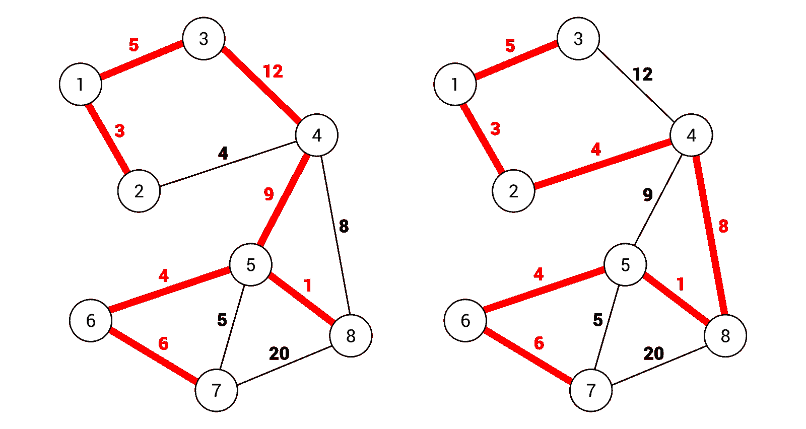

左侧是一棵生成树，由以下几条边组成：（**1**、**2**、（**1**、**3**、（**3**、**4**、**4**、**5**、**5**、**6**、**、**7**、**5**、**8**。总重量等于 40。右侧显示另一棵生成树。此处考虑以下边：（**1**、**2**、（**1**、**3**、（**）2**、**4**、**4**、**8**、**5**、**8**、**5**、**6**、**6**、**7**、、**5**、**6**、以及**6**、【T57】。总重量等于 31。**

 **但是，前面的生成树都不是该图的**最小生成树**（**MST**。生成树是*最小值*是什么意思？答案很简单：它是一个生成树，从图中可用的所有生成树中获得最小成本。您可以通过将边缘（**6**、**7**替换为（**5**、**7**来获得 MST。那么，成本等于 30。还值得一提的是，生成树中的边数等于节点数减去 1。

为什么 MST 的主题如此重要？让我们设想一个场景，当您需要将许多建筑物连接到电信电缆时。当然，有各种可能的连接，例如从一个建筑到另一个建筑，或者使用一个中心。此外，由于必须穿越道路甚至河流，环境条件可能会对投资成本产生严重影响。您的任务是以尽可能低的成本成功地将所有建筑物连接到电信电缆。您应该如何设计连接？要回答这个问题，您只需要创建一个图，其中节点表示连接器，边表示可能的连接。然后，你找到 MST，就这样！

The afore mentioned problem of connecting many buildings to the telecommunication cable is presented in the example at the end of the section regarding the MST.

下一个问题是如何找到 MST？解决这个问题有多种方法，包括 Kruskal 或 Prim 算法的应用，这些方法将在下面的章节中介绍和解释。

# 克鲁斯卡尔算法

Kruskal 发现了一种寻找 MST 的算法。它的操作很容易解释。该算法从剩余的边中提取一条具有最小权重的边，并将其添加到 MST，前提是添加该边不会创建循环。当所有节点都连接时，算法停止。

让我们来看看这个图表，它给出了使用 Kruskal 算法 To1 T1。

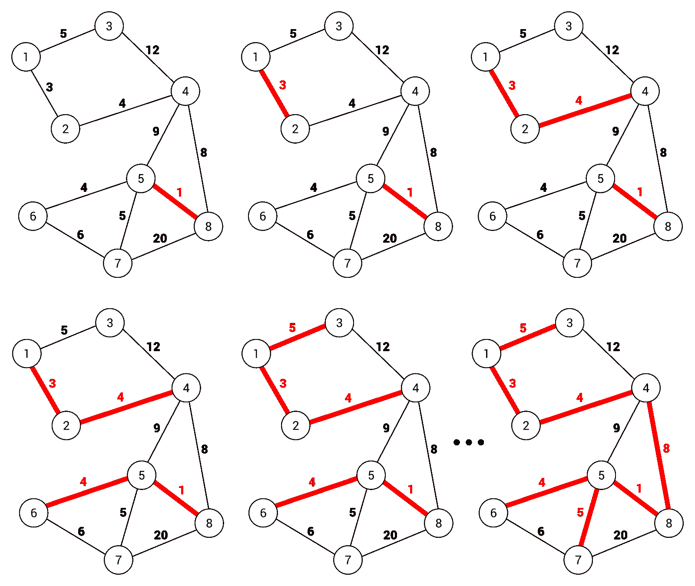

在第一步中，选择边缘（**5**、**8**，因为它具有最小重量，即**1**。然后，选择边缘（**1**、**2**、**2**、**4**、**5**、**6**、**1**、**3**、**5**、**7**、**、**等。值得注意的是，在使用（**4**、**8**边缘之前，考虑使用（**6**、**7**边缘，因为重量较轻。然而，将其添加到 MST 将引入由（**5**、**6**、（**6**、**7**）和（**5**、**7**）边缘形成的循环。因此，该边缘被忽略，算法选择该边缘（**4**、**8**。最后，MST 中的边数为 7。节点数等于**8**，表示算法可以停止运行，找到 MST。****

让我们来看看这个实现。它涉及到`MinimumSpanningTreeKruskal`方法，应该将其添加到`Graph`类中。建议的守则如下：

```cs
public List<Edge<T>> MinimumSpanningTreeKruskal() 
{ 
    List<Edge<T>> edges = GetEdges(); 
    edges.Sort((a, b) => a.Weight.CompareTo(b.Weight)); 
    Queue<Edge<T>> queue = new Queue<Edge<T>>(edges); 

    Subset<T>[] subsets = new Subset<T>[Nodes.Count]; 
    for (int i = 0; i < Nodes.Count; i++) 
    { 
        subsets[i] = new Subset<T>() { Parent = Nodes[i] }; 
    } 

    List<Edge<T>> result = new List<Edge<T>>(); 
    while (result.Count < Nodes.Count - 1) 
    { 
        Edge<T> edge = queue.Dequeue(); 
        Node<T> from = GetRoot(subsets, edge.From); 
        Node<T> to = GetRoot(subsets, edge.To); 
        if (from != to) 
        { 
            result.Add(edge); 
            Union(subsets, from, to); 
        } 
    } 

    return result; 
} 
```

该方法不接受任何参数。首先，通过调用`GetEdges`方法获得边列表。然后，边按权重升序排序。这样一个步骤是至关重要的，因为您需要在算法的后续迭代中获得成本最低的边。在下一行中，将创建一个新队列，并使用`Queue`类的构造函数将`Edge`实例排队。

在下一段代码中，将创建一个包含子集数据的数组。默认情况下，每个节点都添加到单独的子集。这就是为什么`subsets`数组中的元素数等于节点数的原因。子集用于检查向 MST 添加边是否会导致循环的创建。

然后，创建用于存储来自 MST 的边缘的列表（`result`。代码中最有趣的部分是`while`循环，它不断迭代，直到在 MST 中找到正确数量的边。在循环中，只需在`Queue`实例上调用`Dequeue`方法，就可以获得权重最小的边。然后，通过将找到的边添加到 MST 来检查是否未引入任何循环。在这种情况下，将边添加到目标列表中，并调用`Union`方法合并两个子集。

在分析前面的方法时，提到了`GetRoot`方法。其目的是更新子集的父节点，并返回子集的根节点，如下所示：

```cs
private Node<T> GetRoot(Subset<T>[] subsets, Node<T> node) 
{ 
    if (subsets[node.Index].Parent != node) 
    { 
        subsets[node.Index].Parent = GetRoot( 
            subsets, 
            subsets[node.Index].Parent); 
    } 

    return subsets[node.Index].Parent; 
} 
```

最后一个私有方法名为`Union`，它执行两个集合的并集运算（按秩）。它采用三个参数，即一个由`Subset`实例和两个`Node`实例组成的数组，表示应在其上执行并集操作的子集的根节点。代码的适用部分如下所示：

```cs
private void Union(Subset<T>[] subsets, Node<T> a, Node<T> b) 
{ 
    if (subsets[a.Index].Rank > subsets[b.Index].Rank) 
    { 
        subsets[b.Index].Parent = a; 
    } 
    else if (subsets[a.Index].Rank < subsets[b.Index].Rank) 
    { 
        subsets[a.Index].Parent = b; 
    } 
    else 
    { 
        subsets[b.Index].Parent = a; 
        subsets[a.Index].Rank++; 
    } 
} 
```

在前面的代码片段中，您可以看到`Subset`类，但它看起来像什么？让我们来看看它的声明：

```cs
public class Subset<T> 
{ 
    public Node<T> Parent { get; set; } 
    public int Rank { get; set; } 

    public override string ToString() 
    { 
        return $"Subset with rank {Rank}, parent: {Parent.Data}  
            (index: {Parent.Index})"; 
    } 
} 
```

该类包含表示父节点（`Parent`）的属性，以及子集（`Rank`的秩。该类还重写了`ToString`方法，该方法以文本形式提供有关子集的一些基本信息。

The presented code is based on the implementation shown at [https://www.geeksforgeeks.org/greedy-algorithms-set-2-kruskals-minimum-spanning-tree-mst/](https://www.geeksforgeeks.org/greedy-algorithms-set-2-kruskals-minimum-spanning-tree-mst/). You can also find more information about Kruskal's algorithm there.

让我们来看看 Apple T0 方法的用法：

```cs
Graph<int> graph = new Graph<int>(false, true); 
Node<int> n1 = graph.AddNode(1); (...) 
Node<int> n8 = graph.AddNode(8); 
graph.AddEdge(n1, n2, 3); (...) 
graph.AddEdge(n7, n8, 20); 
List<Edge<int>> mstKruskal = graph.MinimumSpanningTreeKruskal(); 
mstKruskal.ForEach(e => Console.WriteLine(e)); 
```

首先，初始化无向加权图，并添加节点和边。然后，调用`MinimumSpanningTreeKruskal`方法，使用 Kruskal 算法查找 MST。最后，您使用`ForEach`方法在控制台中从 MST 写入每个边缘的数据。

# 普林演算法

另一种解决寻找 MST 问题的方法是**Prim 算法**。它使用两组分离的节点，即位于 MST 中的节点和尚未放置在 MST 中的节点。在接下来的迭代中，该算法将查找具有最小权重的边，该边将第一组中的节点与第二组中的节点连接起来。边的节点（不在 MST 中）将添加到此集中。

前面的描述听起来很简单，不是吗？让我们通过分析显示使用 Prim 算法查找 MST 步骤的图表来了解它的实际情况：

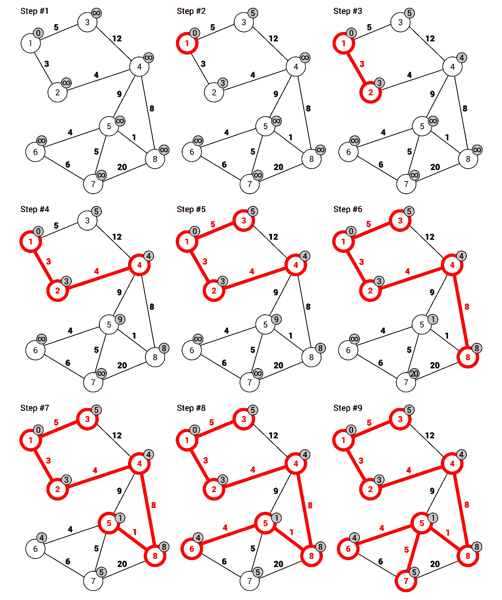

让我们看看图中节点旁边添加的附加指示符。它们表示从其任何邻居到达这样一个节点所需的最小权重。默认情况下，起始节点将该值设置为**0**，而所有其他节点都设置为无穷大。

在**步骤**中，将起始节点添加到构成 MST 的节点子集中，并更新到其邻居的距离，即到达节点**3**的**5**和到达节点**2**的**3**。

在下一步（即**步骤**中，选择成本最小的节点。在这种情况下，选择节点**2**，因为成本等于**3**。其竞争对手（即节点**3**的成本等于**5**。接下来，您需要更新到达当前节点邻居的成本，即节点**4**，成本设置为**4**。

下一个选择的节点显然是节点**4**，因为它不存在于 MST 集合中，并且具有最低的到达成本（**步骤 4**。同样，您可以按以下顺序选择下一条边：（**1**、**3**、（**4**、**8**、（**8**、**5**、**5**、**6**、**5**、**7**。现在，所有节点都包含在 MST 中，算法可以停止其操作。

给出了算法步骤的详细描述，让我们继续基于 C 的实现。大多数操作是在`MinimumSpanningTreePrim`方法中执行的，应该将其添加到`Graph`类中：

```cs
public List<Edge<T>> MinimumSpanningTreePrim() 
{ 
    int[] previous = new int[Nodes.Count]; 
    previous[0] = -1; 

    int[] minWeight = new int[Nodes.Count]; 
    Fill(minWeight, int.MaxValue); 
    minWeight[0] = 0; 

    bool[] isInMST = new bool[Nodes.Count]; 
    Fill(isInMST, false); 

    for (int i = 0; i < Nodes.Count - 1; i++) 
    { 
        int minWeightIndex = GetMinimumWeightIndex( 
            minWeight, isInMST); 
        isInMST[minWeightIndex] = true; 

        for (int j = 0; j < Nodes.Count; j++) 
        { 
            Edge<T> edge = this[minWeightIndex, j]; 
            int weight = edge != null ? edge.Weight : -1; 
            if (edge != null 
                && !isInMST[j] 
                && weight < minWeight[j]) 
            { 
                previous[j] = minWeightIndex; 
                minWeight[j] = weight; 
            } 
        } 
    } 

    List<Edge<T>> result = new List<Edge<T>>(); 
    for (int i = 1; i < Nodes.Count; i++) 
    { 
        Edge<T> edge = this[previous[i], i]; 
        result.Add(edge); 
    } 
    return result; 
} 
```

`MinimumSpanningTreePrim`方法不带任何参数。它使用三个与节点相关的辅助数组，为图形的节点分配额外的数据。第一个，即`previous`，存储前一个节点的索引，从中可以到达给定节点。默认情况下，所有元素的值都等于`0`，但第一个元素的值设置为`-1`。`minWeight`数组存储用于访问给定节点的边缘的最小权重。默认情况下，所有元素设置为`int`类型的最大值，而第一个元素的值设置为`0`。`isInMST`数组表示给定节点是否已经在 MST 中。首先，所有元素的值都应设置为`false`。

代码中最有趣的部分位于`for`循环中。在该索引中，可以找到不位于 MST 中的节点集合中的节点索引，该索引可以以最小成本达到。这样的任务是通过`GetMinimumWeightIndex`方法执行的。然后，使用另一个`for`循环。在它里面，你可以得到一条边，它将节点与索引`minWeightIndex`和`j`连接起来。检查该节点是否尚未位于 MST 中，以及到达该节点的成本是否小于以前的最小成本。如果是，更新`previous`和`minWeight`数组中节点相关元素的值。

代码的其余部分只是准备最终结果。在这里，使用构成 MST 的边的数据创建列表的新实例。`for`循环用于获取以下边的数据，并将其添加到`result`列表中。

在分析代码时，提到了`GetMinimumWeightIndex`私有方法。其代码如下：

```cs
private int GetMinimumWeightIndex(int[] weights, bool[] isInMST) 
{ 
    int minValue = int.MaxValue; 
    int minIndex = 0; 

    for (int i = 0; i < Nodes.Count; i++) 
    { 
        if (!isInMST[i] && weights[i] < minValue) 
        { 
            minValue = weights[i]; 
            minIndex = i; 
        } 
    } 

    return minIndex; 
} 
```

`GetMinimumWeightIndex`方法只找到节点的一个索引，该索引不在 MST 中，并且可以以最小的代价达到。为此，使用`for`循环遍历所有节点。对于每个节点，检查当前节点是否不位于 MST 中，以及到达该节点的成本是否小于已存储的最小值。如果是，则更新`minValue`和`minIndex`变量的值。最后，返回索引。

The presented code is based on the implementation shown at [https://www.geeksforgeeks.org/greedy-algorithms-set-5-prims-minimum-spanning-tree-mst-2/](https://www.geeksforgeeks.org/greedy-algorithms-set-5-prims-minimum-spanning-tree-mst-2/). You can also find more information about Prim's algorithm there.

此外，还使用了辅助`Fill`方法。它只是将数组中所有元素的值设置为作为第二个参数传递的值。该方法的代码如下：

```cs
private void Fill<Q>(Q[] array, Q value) 
{ 
    for (int i = 0; i < array.Length; i++) 
    { 
        array[i] = value; 
    } 
} 
```

让我们来看看 Apple T0 方法的用法：

```cs
Graph<int> graph = new Graph<int>(false, true); 
Node<int> n1 = graph.AddNode(1); (...) 
Node<int> n8 = graph.AddNode(8); 
graph.AddEdge(n1, n2, 3); (...) 
graph.AddEdge(n7, n8, 20); 
List<Edge<int>> mstPrim = graph.MinimumSpanningTreePrim(); 
mstPrim.ForEach(e => Console.WriteLine(e)); 
```

首先，初始化无向加权图，并添加节点和边。然后，调用`MinimumSpanningTreePrim`方法，使用 Prim 算法查找 MST。最后，您使用`ForEach`方法在控制台中从 MST 写入每个边缘的数据。

# 示例–电信电缆

如 MST 主题导言中所述，该问题具有一些重要的现实应用，例如，创建建筑物之间的连接计划，以最低成本为所有建筑物提供电信电缆。当然，有各种可能的连接，例如从一个建筑到另一个建筑或使用枢纽。此外，由于必须穿越道路甚至河流，环境条件可能会对投资成本产生严重影响。例如，让我们创建一个程序，在一组建筑的上下文中解决这个问题，如下图所示：

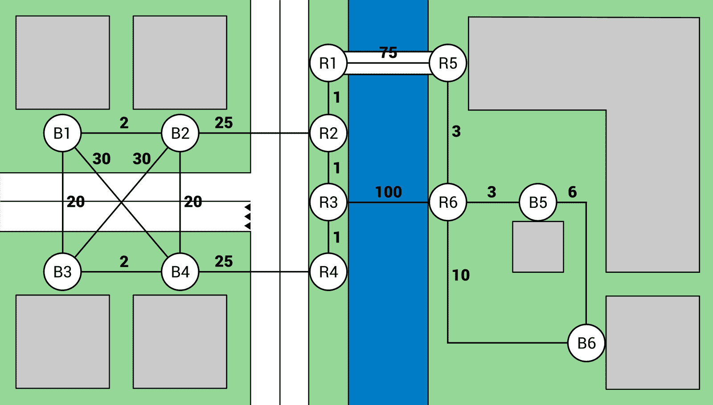

如你所见，该社区由 12 栋建筑组成，包括位于河边的公寓楼和信息亭。这些建筑位于一条只有一座桥的小河的两岸。此外，存在两条道路。当然，不同点之间的连接成本不同，这取决于距离和环境条件。例如，两栋建筑（**B1**和**B2**之间的直接连接成本等于**2**，而使用桥梁（**R1**和**R5**之间）的成本等于**75**。如果您需要无桥过河（在**R3**和**R6**之间），成本更高，等于**100**。

您的任务是找到 MST。在这个例子中，您将应用 Kruskal 和 Prim 的算法来解决这个问题。首先，让我们初始化无向图和加权图，并添加节点和边，如下所示：

```cs
Graph<string> graph = new Graph<string>(false, true); 
Node<string> nodeB1 = graph.AddNode("B1"); (...) 
Node<string> nodeR6 = graph.AddNode("R6"); 
graph.AddEdge(nodeB1, nodeB2, 2); (...) 
graph.AddEdge(nodeR6, nodeB6, 10); 
```

然后，您只需要调用`MinimumSpanningTreeKruskal`方法，使用 Kruskal 算法来查找 MST。获得结果后，您可以轻松地在控制台中显示结果以及总成本。代码的适当部分如以下方框所示：

```cs
Console.WriteLine("Minimum Spanning Tree - Kruskal's Algorithm:"); 
List<Edge<string>> mstKruskal =  
    graph.MinimumSpanningTreeKruskal(); 
mstKruskal.ForEach(e => Console.WriteLine(e)); 
Console.WriteLine("Total cost: " + mstKruskal.Sum(e => e.Weight)); 
```

控制台中显示的结果如下所示：

```cs
    Minimum Spanning Tree - Kruskal's Algorithm:
    Edge: R4 -> R3, weight: 1
    Edge: R3 -> R2, weight: 1
    Edge: R2 -> R1, weight: 1
    Edge: B1 -> B2, weight: 2
    Edge: B3 -> B4, weight: 2
    Edge: R6 -> R5, weight: 3
    Edge: R6 -> B5, weight: 3
    Edge: B5 -> B6, weight: 6
    Edge: B1 -> B3, weight: 20
    Edge: B2 -> R2, weight: 25
    Edge: R1 -> R5, weight: 75
    Total cost: 139

```

如果在地图上可视化这些结果，则会发现以下 MST：

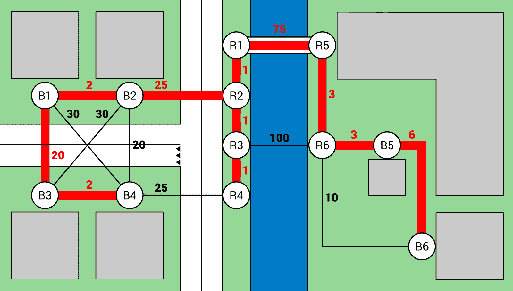

以类似的方式，您可以应用 Prim 的算法：

```cs
Console.WriteLine("nMinimum Spanning Tree - Prim's Algorithm:"); 
List<Edge<string>> mstPrim = graph.MinimumSpanningTreePrim(); 
mstPrim.ForEach(e => Console.WriteLine(e)); 
Console.WriteLine("Total cost: " + mstPrim.Sum(e => e.Weight)); 
```

所得结果如下：

```cs
    Minimum Spanning Tree - Prim's Algorithm:
    Edge: B1 -> B2, weight: 2
    Edge: B1 -> B3, weight: 20
    Edge: B3 -> B4, weight: 2
    Edge: R6 -> B5, weight: 3
    Edge: B5 -> B6, weight: 6
    Edge: R2 -> R1, weight: 1
    Edge: B2 -> R2, weight: 25
    Edge: R2 -> R3, weight: 1
    Edge: R3 -> R4, weight: 1
    Edge: R1 -> R5, weight: 75
    Edge: R5 -> R6, weight: 3
    Total cost: 139

```

这就是全部！您刚刚完成了与 MST 的实际应用程序相关的示例。您是否准备好继续学习另一个与图形相关的主题，即着色？

# 着色

找到 MST 并不是唯一与图形相关的问题。其中，存在**节点着色**。其目的是为所有节点指定颜色（数字），以符合两个具有相同颜色的节点之间不能有边的规则。当然，颜色的数量应该尽可能少。这样的问题在现实世界中有一些应用，例如为地图着色，这是后面所示示例的主题。

Did you know that the nodes of each planar graph can be colored with no more than four colors? If you are interested in this topic, take a look at the **four-color theorem** ([http://mathworld.wolfram.com/Four-ColorTheorem.html](http://mathworld.wolfram.com/Four-ColorTheorem.html)). The implementation of the coloring algorithm shown in this chapter is simple and in some cases could use more colors than really necessary.

让我们看看下面的图表：

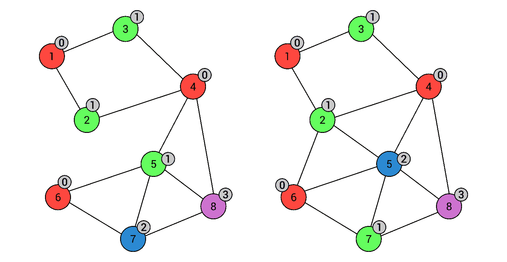

第一个图表（如左图所示）显示了一个使用四种颜色着色的图表：红色（索引等于**0**）、绿色（**1**）、蓝色（**2**）和紫色（**3**）。如您所见，没有具有相同颜色的节点通过边连接。右侧显示的图形描绘了带有两条附加边的图形，即（**2**、**6**）和（**2**、**5**）。在这种情况下，颜色发生了变化，但颜色的数量保持不变。

问题是，如何找到符合上述规则的节点颜色？幸运的是，该算法非常简单，这里给出了它的实现。`Color`方法的代码应该添加到`Graph`类中，如下所示：

```cs
public int[] Color() 
{ 
    int[] colors = new int[Nodes.Count]; 
    Fill(colors, -1); 
    colors[0] = 0; 

    bool[] availability = new bool[Nodes.Count]; 
    for (int i = 1; i < Nodes.Count; i++) 
    { 
        Fill(availability, true); 

        int colorIndex = 0; 
        foreach (Node<T> neighbor in Nodes[i].Neighbors) 
        { 
            colorIndex = colors[neighbor.Index]; 
            if (colorIndex >= 0) 
            { 
                availability[colorIndex] = false; 
            } 
        } 

        colorIndex = 0; 
        for (int j = 0; j < availability.Length; j++) 
        { 
            if (availability[j]) 
            { 
                colorIndex = j; 
                break; 
            } 
        } 

        colors[i] = colorIndex; 
    } 

    return colors; 
} 
```

`Color`方法使用两个辅助节点相关阵列。第一个被命名为`colors`并存储为特定节点选择的颜色索引。默认情况下，所有元素的值都设置为`-1`，但第一个元素的值设置为`0`。这意味着第一个节点的颜色将自动设置为第一种颜色（例如，红色）。另一个辅助数组（`availability`存储关于特定颜色可用性的信息。

代码中最关键的部分是`for`循环。在其中，通过将`true`设置为`availability`数组中所有元素的值，可以重置颜色的可用性。然后，通过将`false`设置为`availability`数组中特定元素的值，遍历当前节点的相邻节点以读取它们的颜色，并将这些颜色标记为不可用。最后一个内部`for`循环只是在`availability`数组中迭代，并找到当前节点的第一个可用颜色。

The presented code is based on the implementation shown at [https://www.geeksforgeeks.org/graph-coloring-set-2-greedy-algorithm/](https://www.geeksforgeeks.org/graph-coloring-set-2-greedy-algorithm/). What is more, you can find more information about the coloring problem there.

此外，辅助`Fill`方法与前面的一个示例中解释的代码完全相同。它只是将数组中所有元素的值设置为作为第二个参数传递的值。该方法的代码如下：

```cs
private void Fill<Q>(Q[] array, Q value) 
{ 
    for (int i = 0; i < array.Length; i++) 
    { 
        array[i] = value; 
    } 
} 
```

让我们来看看 Apple T0 方法的用法：

```cs
Graph<int> graph = new Graph<int>(false, false); 
Node<int> n1 = graph.AddNode(1); (...) 
Node<int> n8 = graph.AddNode(8); 
graph.AddEdge(n1, n2); (...) 
graph.AddEdge(n7, n8); 

int[] colors = graph.Color(); 
for (int i = 0; i < colors.Length; i++) 
{ 
    Console.WriteLine($"Node {graph.Nodes[i].Data}: {colors[i]}"); 
} 
```

在这里，您创建一个新的无向和未加权图，添加节点和边，并调用`Color`方法来执行节点着色。因此，您将收到一个带有特定节点颜色索引的数组。然后，在控制台中显示结果：

```cs
    Node 1: 0
    Node 2: 1
    Node 3: 1
    Node 4: 0
    Node 5: 1
    Node 6: 0
    Node 7: 2
    Node 8: 3
```

在这个简短的介绍之后，您就可以开始实际的应用程序了，即为 voivodeship 贴图着色，下面将介绍这个应用程序。

# 示例–voivodeship 地图

让我们创建一个程序，将波兰境内的 voivodeships 地图表示为图形，并对这些区域进行着色，以便两个具有共同边界的 voivodeships 不具有相同的颜色。当然，你应该限制颜色的数量。

首先，让我们考虑一下图形表示。在这里，节点表示特定的 Voivodeship，而边表示 Voivodeship 之间的公共边界。

下图显示了已上色的波兰地图：

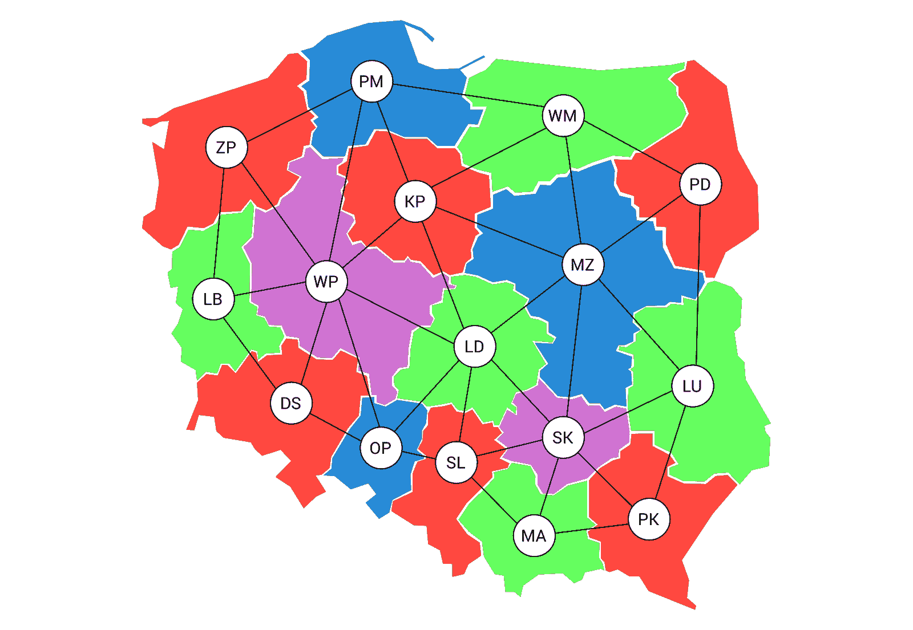

您的任务只是使用前面描述的算法为图中的节点着色。要执行此操作，请创建无向和未加权的图形，添加表示 voivodeships 的节点，并添加边以指示公共边界。代码如下：

```cs
Graph<string> graph = new Graph<string>(false, false); 
Node<string> nodePK = graph.AddNode("PK"); (...) 
Node<string> nodeOP = graph.AddNode("OP"); 
graph.AddEdge(nodePK, nodeLU); (...) 
graph.AddEdge(nodeDS, nodeOP);
```

然后，在`Graph`实例上调用`Color`方法，并返回特定节点的颜色索引。最后，您只需在控制台中显示结果。代码的适用部分如下所示：

```cs
int[] colors = graph.Color(); 
for (int i = 0; i < colors.Length; i++) 
{ 
    Console.WriteLine($"{graph.Nodes[i].Data}: {colors[i]}"); 
} 
```

部分结果如下所示：

```cs
    PK: 0
    LU: 1 (...)
    OP: 2

```

您刚刚学习了如何在图形中为节点着色！然而，这并不是本书中关于图形的有趣主题的结尾。现在，让我们继续在图中搜索最短路径。

# 最短路径

图形是一种很好的数据结构，用于存储各种地图的数据，例如城市及其之间的距离。因此，图形的一个明显的现实应用是搜索两个位置之间的**最短路径**，该路径考虑了特定的成本，例如距离、必要的时间，甚至所需的燃油量。

在图中搜索最短路径有几种方法。然而，常见的解决方案之一是**Dijkstra 的算法**，这使得计算从起始节点到位于图中的所有节点的距离成为可能。然后，您不仅可以轻松获得两个节点之间的连接成本，还可以找到位于起始节点和结束节点之间的节点。

Dijkstra 的算法使用了两个辅助节点相关数组，即用于存储前一个节点的标识符（该节点可以以最小的总成本到达当前节点），以及访问当前节点所需的最小距离（成本）。此外，它使用队列存储应该检查的节点。在连续迭代过程中，该算法更新到图中特定节点的最小距离。最后，辅助阵列包含从所选起始节点到达所有节点的最小距离（成本），以及如何使用最短路径到达每个节点的信息。

在进入示例之前，让我们看一下下面的图表，用 Dijkstra 算法给出两种不同的最短路径。左侧显示从节点**8**到**1**的路径，右侧显示从节点**1**到**7**的路径：

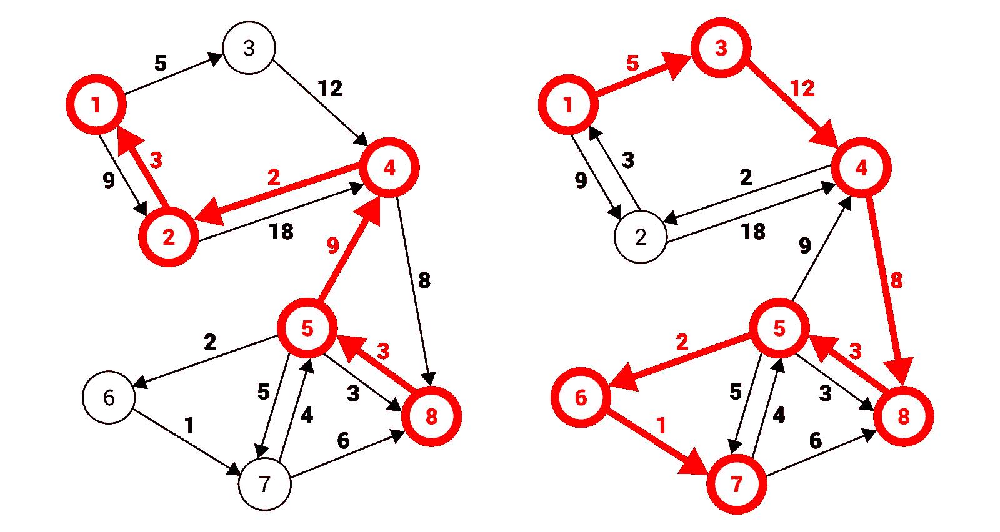

现在是时候看看 C 代码了，它可以用来实现 Dijkstra 的算法。主要角色由`GetShortestPathDijkstra`方法执行，该方法应添加到`Graph`类中。代码如下：

```cs
public List<Edge<T>> GetShortestPathDijkstra( 
    Node<T> source, Node<T> target) 
{ 
    int[] previous = new int[Nodes.Count]; 
    Fill(previous, -1); 

    int[] distances = new int[Nodes.Count]; 
    Fill(distances, int.MaxValue); 
    distances[source.Index] = 0; 

    SimplePriorityQueue<Node<T>> nodes =  
        new SimplePriorityQueue<Node<T>>(); 
    for (int i = 0; i < Nodes.Count; i++) 
    { 
        nodes.Enqueue(Nodes[i], distances[i]); 
    } 

    while (nodes.Count != 0) 
    { 
        Node<T> node = nodes.Dequeue(); 
        for (int i = 0; i < node.Neighbors.Count; i++) 
        { 
            Node<T> neighbor = node.Neighbors[i]; 
            int weight = i < node.Weights.Count  
                ? node.Weights[i] : 0; 
            int weightTotal = distances[node.Index] + weight; 

            if (distances[neighbor.Index] > weightTotal) 
            { 
                distances[neighbor.Index] = weightTotal; 
                previous[neighbor.Index] = node.Index; 
                nodes.UpdatePriority(neighbor,  
                    distances[neighbor.Index]); 
            } 
        } 
    } 

    List<int> indices = new List<int>(); 
    int index = target.Index; 
    while (index >= 0) 
    { 
        indices.Add(index); 
        index = previous[index]; 
    } 

    indices.Reverse(); 
    List<Edge<T>> result = new List<Edge<T>>(); 
    for (int i = 0; i < indices.Count - 1; i++) 
    { 
        Edge<T> edge = this[indices[i], indices[i + 1]]; 
        result.Add(edge); 
    } 
    return result; 
} 
```

`GetShortestPathDijkstra`方法采用两个参数，即`source`和`target`节点。首先，它创建两个与节点相关的辅助数组，用于存储以前节点的索引，从中可以以最小的总成本到达给定节点（`previous`），以及存储当前到给定节点的最小距离（`distances`）。默认情况下，`previous`数组中所有元素的值都设置为`-1`，而`distances`数组中所有元素的值都设置为`int`类型的最大值。当然，到源节点的距离设置为`0`。然后，创建一个新的优先级队列，并将所有节点的数据排队。每个元素的优先级等于到该节点的当前距离。

It is worth noting that the example uses the `OptimizedPriorityQueue` package from NuGet. More information about this package is available at [https://www.nuget.org/packages/OptimizedPriorityQueue](https://www.nuget.org/packages/OptimizedPriorityQueue) and in the *Priority queues* section in [Chapter 3](3.html), *Stacks and Queues*.

代码中最有趣的部分是`while`循环，它一直执行到队列为空。在`while`循环中，您从队列中获取第一个节点，并使用`for`循环遍历其所有邻居。在这样的循环中，通过获取到当前节点的距离和边的权重之和，计算到邻居的距离。如果计算的距离小于当前存储的值，则更新与给定邻居的最小距离有关的值，以及可以从中到达邻居的上一个节点的索引。值得注意的是，队列中元素的优先级也应该更新。

其余操作用于使用存储在`previous`数组中的值解析路径。为此，您可以在`indices`列表中保存以下节点的索引（方向相反）。然后，将其反转以实现从源节点到目标节点的顺序。最后，您只需创建边列表，以适合从方法返回的形式显示结果。

The presented and described implementation is based on the pseudocode shown at [https://en.wikipedia.org/wiki/Dijkstra%27s_algorithm](https://en.wikipedia.org/wiki/Dijkstra%27s_algorithm). You can find some additional information about Dijkstra's algorithm there.

让我们来看看 Apple T0 方法的用法：

```cs
Graph<int> graph = new Graph<int>(true, true); 
Node<int> n1 = graph.AddNode(1); (...) 
Node<int> n8 = graph.AddNode(8); 
graph.AddEdge(n1, n2, 9); (...) 
graph.AddEdge(n8, n5, 3); 
List<Edge<int>> path = graph.GetShortestPathDijkstra(n1, n5); 
path.ForEach(e => Console.WriteLine(e)); 
```

在这里，您创建一个新的有向加权图，添加节点和边，并调用`GetShortestPathDijkstra`方法来搜索两个节点之间的最短路径，即节点`1`和`5`之间的最短路径。因此，您将收到形成最短路径的边列表。然后，您只需迭代所有边，并在控制台中显示结果：

```cs
    Edge: 1 -> 3, weight: 5
    Edge: 3 -> 4, weight: 12
    Edge: 4 -> 8, weight: 8
    Edge: 8 -> 5, weight: 3
```

在这篇简短的介绍之后，结合简单的示例，让我们继续讨论与游戏开发相关的更高级、更有趣的应用程序。走吧！

# 示例-游戏地图

本章最后一个例子涉及 Dijkstra 算法在游戏地图中寻找最短路径的应用。让我们想象一下，你有一个董事会与各种障碍。因此，玩家只能使用棋盘的一部分移动。您的任务是找到位于板上两个位置之间的最短路径。

首先，让我们将电路板表示为二维数组，其中电路板上的给定位置可以移动，也可以不移动。在`Program`类中的`Main`方法中应添加合适的代码部分，如下所示：

```cs
string[] lines = new string[] 
{ 
    "0011100000111110000011111", 
    "0011100000111110000011111", 
    "0011100000111110000011111", 
    "0000000000011100000011111", 
    "0000001110000000000011111", 
    "0001001110011100000011111", 
    "1111111111111110111111100", 
    "1111111111111110111111101", 
    "1111111111111110111111100", 
    "0000000000000000111111110", 
    "0000000000000000111111100", 
    "0001111111001100000001101", 
    "0001111111001100000001100", 
    "0001100000000000111111110", 
    "1111100000000000111111100", 
    "1111100011001100100010001", 
    "1111100011001100001000100" 
}; 
bool[][] map = new bool[lines.Length][]; 
for (int i = 0; i < lines.Length; i++) 
{ 
    map[i] = lines[i] 
        .Select(c => int.Parse(c.ToString()) == 0) 
        .ToArray(); 
} 
```

为了提高代码的可读性，映射被表示为一个`string`值数组。每行显示为文本，字符数等于列数。每个字符的值表示该点的可用性。如果等于`0`，则该位置可用。否则，情况并非如此。然后，应将基于`string`的地图表示转换为布尔二维数组。这样的任务由几行代码执行，如前面的代码段所示。

下一步是创建图形，以及添加必要的节点和边。代码的适用部分如下所示：

```cs
Graph<string> graph = new Graph<string>(false, true); 
for (int i = 0; i < map.Length; i++) 
{ 
    for (int j = 0; j < map[i].Length; j++) 
    { 
        if (map[i][j]) 
        { 
            Node<string> from = graph.AddNode($"{i}-{j}"); 

            if (i > 0 && map[i - 1][j]) 
            { 
                Node<string> to = graph.Nodes.Find( 
                    n => n.Data == $"{i - 1}-{j}"); 
                graph.AddEdge(from, to, 1); 
            } 

            if (j > 0 && map[i][j - 1]) 
            { 
                Node<string> to = graph.Nodes.Find( 
                    n => n.Data == $"{i}-{j - 1}"); 
                graph.AddEdge(from, to, 1); 
            } 
        } 
    } 
} 
```

首先，初始化一个新的无向加权图。然后，使用两个`for`循环遍历电路板上的所有位置。在这样的循环中，检查给定的位置是否可用。如果是，则创建一个新节点（`from`。然后，检查位于当前节点正上方的节点是否也可用。如果是，则添加适当的边缘，其重量等于`1`。以类似的方式，检查放置在当前节点左侧的节点是否可用，并在必要时添加边。

现在您只需要获取表示源节点和目标节点的`Node`实例。您可以使用`Find`方法并提供节点的文本表示，如`0-0`或`16-24`。然后，您只需调用`GetShortestPathDijkstra`方法。在这种情况下，算法将尝试查找第一行和第列中的节点与最后一行和第列中的节点之间的最短路径。代码如下：

```cs
Node<string> source = graph.Nodes.Find(n => n.Data == "0-0"); 
Node<string> target = graph.Nodes.Find(n => n.Data == "16-24"); 
List<Edge<string>> path = graph.GetShortestPathDijkstra( 
   source, target); 
```

代码的最后一部分与控制台中地图的显示有关：

```cs
Console.OutputEncoding = Encoding.UTF8; 
for (int row = 0; row < map.Length; row++) 
{ 
    for (int column = 0; column < map[row].Length; column++) 
    { 
        ConsoleColor color = map[row][column]  
            ? ConsoleColor.Green : ConsoleColor.Red; 
        if (path.Any(e => e.From.Data == $"{row}-{column}"  
            || e.To.Data == $"{row}-{column}")) 
        { 
            color = ConsoleColor.White; 
        } 

        Console.ForegroundColor = color; 
        Console.Write("\u25cf "); 
    } 
    Console.WriteLine(); 
} 
Console.ForegroundColor = ConsoleColor.Gray; 
```

首先，在控制台中设置适当的编码，以便能够同时显示 Unicode 字符。然后，使用两个`for`循环遍历电路板上的所有位置。在这样的循环中，您可以选择一种颜色来表示控制台中的点，绿色（该点可用）或红色（不可用）。如果当前分析的点是最短路径的一部分，则颜色将更改为白色。最后，您只需设置适当的颜色并编写表示项目符号的 Unicode 字符。当程序执行退出两个循环时，将设置默认控制台颜色。

运行应用程序时，您将看到以下结果：


干得好！现在，让我们进行一个简短的总结，总结一下您在阅读本章时所学的主题。

# 总结

您刚刚完成了与开发应用程序时可用的最重要数据结构之一相关的一章，即图形。如您所知，图是由节点和边组成的数据结构。每条边连接两个节点。此外，图中有各种各样的边，例如无向边和有向边，以及未加权边和加权边。所有这些都已详细描述和解释，并附有图表和代码示例。本文还解释了两种图形表示方法，即使用邻接表和邻接矩阵。当然，您还学习了如何使用 C 语言实现图形。

在讨论图形时，展示一些实际应用程序也很重要，特别是由于这种数据结构的普遍使用。例如，本章描述了社交媒体中朋友的结构，或在城市中搜索最短路径的问题。

在本章的主题中，您必须了解如何遍历图，即以特定顺序访问所有节点。提出了两种方法，即 DFS 和 BFS。值得一提的是，遍历主题还可以用于搜索图中的给定节点。

在另一节中，介绍了生成树以及最小生成树的主题。需要提醒的是，生成树是连接图中所有节点的边的子集，没有圈，而 MST 是图中所有可用生成树的最小代价的生成树。有几种方法可以找到 MST，包括 Kruskal 或 Prim 算法的应用。

然后，您学习了下两个与图形相关的流行问题的解决方案。第一个是节点的着色，需要为所有节点指定颜色（数字），以符合两个具有相同颜色的节点之间不能有边的规则。当然，颜色的数量应该尽可能少。

另一个问题是搜索两个节点之间的最短路径，这考虑了特定的成本，例如距离、必要的时间，甚至所需的燃料量。在图中搜索最短路径有几种方法。然而，常见的解决方案之一是 Dijkstra 算法，该算法可以计算从起始节点到图中所有节点的距离。本章介绍并解释了该主题。

现在，是时候进行全面总结了，看看到目前为止本书中介绍的所有数据结构和算法。让我们翻开这一页，进入最后一章！****