# 垃圾邮件过滤

在本章中，我们将使用我们在[第 1 章](01.html# J2B80-5ebdf09927b7492888e31e8436526470)*机器学习建模基础*中安装的两个软件包，开始用 C# 构建真实世界的**机器学习**（**ML**）模型；Accord.NET 用于 ML，Deedle 用于数据操作。在本章中，我们将建立一个垃圾邮件过滤的分类模型。我们将使用包含垃圾邮件和非垃圾邮件的原始电子邮件数据集，并使用它来训练我们的 ML 模型。我们将开始遵循上一章中讨论的开发 ML 模型的步骤。这将帮助我们更好地理解 ML 建模中的工作流和方法，并使它们成为第二天性。在构建垃圾邮件分类模型的同时，我们还将讨论文本数据集的特征工程技术和分类模型的基本模型验证方法，并比较用于垃圾邮件过滤的 logistic 回归分类器和朴素贝叶斯分类器。熟悉这些模型构建步骤、基本文本特征工程技术和基本分类模型验证方法将为使用**自然语言处理**（**NLP**的更高级特征工程技术奠定基础在[第三章](03.html# 12AK80-5ebdf09927b7492888e31e8436526470)中建立多类分类模型*推特情绪分析*。

在本章中，我们将介绍以下主题：

*   垃圾邮件过滤项目的问题定义
*   数据准备
*   电子邮件数据分析
*   电子邮件数据的特征工程
*   用于垃圾邮件过滤的 Logistic 回归与朴素贝叶斯
*   分类模型验证

# 垃圾邮件过滤项目的问题定义

让我们从定义本章要解决的问题开始。你可能已经熟悉了什么是垃圾邮件；垃圾邮件过滤是 Gmail、Yahoo Mail 和 Outlook 等电子邮件服务的基本功能。垃圾邮件对用户来说可能很烦人，但它们带来了更多的问题和风险。例如，垃圾邮件可以被设计为索取信用卡号码或银行账户信息，这些信息可用于信用卡欺诈或洗钱。垃圾邮件还可用于获取个人数据，如社会安全号码或用户 ID 和密码，然后可用于身份盗窃和各种其他犯罪。拥有垃圾邮件过滤技术是电子邮件服务避免用户遭受此类犯罪的重要一步。然而，拥有正确的垃圾邮件过滤解决方案是困难的。你想过滤掉可疑的电子邮件，但同时，你不想过滤太多，以至于非垃圾邮件进入垃圾邮件文件夹，永远不会被用户看到。为了解决这个问题，我们将让我们的 ML 模型从原始电子邮件数据集中学习，并使用主题行将可疑电子邮件分类为垃圾邮件。我们将看两个性能指标来衡量我们的成功：精确性和召回率。我们将在以下部分详细讨论这些指标。

总结我们的问题定义：

*   有什么问题？我们需要一个垃圾邮件过滤解决方案，以防止我们的用户成为欺诈活动的受害者，同时改善用户体验。
*   为什么这是个问题？在过滤可疑邮件和不过滤太多邮件之间取得适当的平衡是很困难的，这样非垃圾邮件仍然会进入收件箱。我们将依靠 ML 模型来学习如何对这些可疑电子邮件进行统计分类。
*   解决这个问题的方法有哪些？我们将建立一个分类模型，根据电子邮件的主题行标记潜在的垃圾邮件。我们将使用准确率和召回率来平衡被过滤的电子邮件数量。
*   成功的标准是什么？我们需要高召回率（实际检索到的垃圾邮件占垃圾邮件总数的百分比），而不需要牺牲太多的准确率（正确分类的垃圾邮件占预测为垃圾邮件的垃圾邮件的百分比）。

# 数据准备

现在我们已经清楚地说明并定义了我们将要用 ML 解决的问题，我们需要数据。没有数据，没有 ML。通常，在数据准备步骤之前，您需要采取额外的步骤来收集和收集所需的数据，但在本书中，我们将使用一个预编译和标记的数据集，该数据集是公开的。在本章中，我们将使用 CSDMC2010 垃圾邮件语料库数据集（[http://csmining.org/index.php/spam-email-datasets-.html](http://csmining.org/index.php/spam-email-datasets-.html) 培训和测试我们的模型。您可以按照链接下载网页底部的压缩数据。下载并解压缩数据后，您将看到两个名为`TESTING`和`TRAINING`的文件夹，以及一个名为`SPAMTrain.label`的文本文件。`SPAMTrain.label`文件在`TRAINING`文件夹中为每封电子邮件添加了编码标签—`0`代表垃圾邮件，`1`代表火腿（非垃圾邮件）。我们将使用此文本文件和`TRAINING`文件夹中的电子邮件数据来构建垃圾邮件分类模型。

下载数据并将其放置在可以加载数据的位置后，需要为将来的特征工程和模型构建步骤做好准备。我们现在拥有的是一个原始数据集，其中包含大量包含单个电子邮件信息的 EML 文件和一个包含标签信息的文本文件。要使此原始数据集可用于使用电子邮件主题行构建垃圾邮件分类模型，我们需要执行以下任务：

1.  **从 EML 文件中提取主题行**：为未来任务准备数据的第一步是从单个 EML 文件中提取主题和主体。我们将使用一个名为`EAGetMail`的包从 EML 文件中加载和提取信息。可以使用 Visual Studio 中的软件包管理器安装此软件包。请看一下代码的第 4 行到第 6 行以安装该软件包。使用`EAGetMail`包，您可以轻松地从 EML 文件（第 24-30 行）加载和提取主题和正文内容。从电子邮件中提取主题和正文后，需要将每行数据作为一行附加到 Deedle 数据框中。查看下面代码第 18 行的`ParseEmails`函数，了解如何创建一个 Deedle 数据框，其中每行包含每个电子邮件的索引号、主题行和正文内容。

2.  **将提取的数据与标签**相结合：从单个 EML 文件中提取主题和正文内容后，我们还需要做一件事。我们需要将编码标签（0 表示垃圾邮件，1 表示火腿）映射到我们在上一步中创建的数据帧的每一行。如果您使用任何文本编辑器打开`SPAMTrain.label`文件，您可以看到编码标签位于第一列，相应的电子邮件文件名位于第二列，用空格分隔。使用 Deedle frame 的`ReadCsv`函数，您可以通过指定空格作为分隔符（参见代码中的第 50 行），轻松地将此标签数据加载到数据帧中。一旦您将这个带标签的数据加载到数据框中，您就可以简单地将这个数据框的第一列添加到我们在上一步中使用 Deedle's frame 的`AddColumn`函数创建的另一个数据框中。查看下面代码的第 49-52 行，了解如何将标签信息与提取的电子邮件数据结合起来。
3.  **将此合并数据导出为 CSV 文件**：现在我们有了一个包含电子邮件和标签数据的数据框，是时候将此数据框导出为 CSV 文件以备将来使用了。如下面代码的第 54 行所示，将数据帧导出到 CSV 文件需要一行。使用 Deedle frame 的`SaveCsv`功能，您可以轻松地将数据帧保存为 CSV 文件。

此数据准备步骤的代码如下所示：

```cs
// Install-Package Deedle
// Install-Package FSharp.Core
using Deedle;
// if you don't have EAGetMail package already, install it 
// via the Package Manager Console by typing in "Install-Package EAGetMail"
using EAGetMail;
using System;
using System.Collections.Generic;
using System.IO;
using System.Linq;
using System.Text;
using System.Threading.Tasks;

namespace EmailParser
{
    class Program
    {
        private static Frame<int, string> ParseEmails(string[] files)
        {
            // we will parse the subject and body from each email
            // and store each record into key-value pairs
            var rows = files.AsEnumerable().Select((x, i) =>
            {
                // load each email file into a Mail object
                Mail email = new Mail("TryIt");
                email.Load(x, false);

                // extract the subject and body
                string emailSubject = email.Subject;
                string textBody = email.TextBody;

                // create key-value pairs with email id (emailNum), subject, and body
                return new { emailNum = i, subject = emailSubject, body = textBody };
            });

            // make a data frame from the rows that we just created above
            return Frame.FromRecords(rows);
        }

        static void Main(string[] args)
        {
            // Get all raw EML-format files
            // TODO: change the path to point to your data directory
            string rawDataDirPath = "<path-to-data-directory>";
            string[] emailFiles = Directory.GetFiles(rawDataDirPath, "*.eml");

            // Parse out the subject and body from the email files
            var emailDF = ParseEmails(emailFiles);
            // Get the labels (spam vs. ham) for each email
            var labelDF = Frame.ReadCsv(rawDataDirPath + "\\SPAMTrain.label", hasHeaders: false, separators: " ", schema: "int,string");
            // Add these labels to the email data frame
            emailDF.AddColumn("is_ham", labelDF.GetColumnAt<String>(0));
            // Save the parsed emails and labels as a CSV file
            emailDF.SaveCsv("transformed.csv");

            Console.WriteLine("Data Preparation Step Done!");
            Console.ReadKey();
        }
    }
}
```

在运行此代码之前，您需要将第 44 行中的`<path-to-data-directory>`替换为存储数据的实际路径。运行此代码后，应创建一个名为`transformed.csv`的文件，该文件将包含四列（`emailNum`、`subject`、`body`和`is_ham`。我们将使用此输出数据作为以下步骤的输入，以便为垃圾邮件过滤项目构建 ML 模型。但是，可以自由发挥创意，使用 Deedle 框架和`EAGetMail`包以不同的方式调整和准备这些数据。我们在这里介绍的代码是一种为将来使用准备原始电子邮件数据的方法，以及一些可以从原始电子邮件数据中提取的信息。使用`EAGetMail`软件包，您可以提取其他功能，例如发件人的电子邮件地址和电子邮件中的附件，这些额外功能可能有助于改进您的垃圾邮件分类模型。

此数据准备步骤的代码也可以在以下存储库中找到：[https://github.com/yoonhwang/c-sharp-machine-learning/blob/master/ch.2/EmailParser.cs](https://github.com/yoonhwang/c-sharp-machine-learning/blob/master/ch.2/EmailParser.cs) 。

# 电子邮件数据分析

在数据准备步骤中，我们将原始数据集转换为更具可读性和可用性的数据集。我们现在有一个文件可以查看，以确定哪些电子邮件是垃圾邮件，哪些不是。此外，我们还可以轻松找到垃圾邮件和非垃圾邮件的主题行。使用这些转换后的数据，让我们开始查看数据的实际外观，并查看是否可以在数据中找到任何模式或问题。

因为我们处理的是文本数据，所以我们首先要看的是垃圾邮件和非垃圾邮件之间的单词分布有什么不同。为了做到这一点，我们需要将前一步的数据输出转换为单词出现的矩阵表示。让我们以数据中的前三个主题行为例，一步一步地完成这一过程。我们的前三个主题如下：


如果我们转换此数据，使每列对应于每个主题行中的每个单词，并将每个单元格的值编码为`1`，如果给定主题行中有单词，如果没有，则生成的矩阵如下所示：


这种特定的编码方式称为**一个热编码**，我们只关心特定单词是否出现在主题行中，而不关心每个单词在主题行中的实际出现次数。在前面提到的例子中，我们还去掉了所有标点符号，例如冒号、问号和感叹号。为了通过编程实现这一点，我们可以使用`regex`将每个主题行拆分为只包含字母数字字符的单词，然后使用一个热编码构建数据帧。执行此编码步骤的代码如下所示：

```cs
private static Frame<int, string> CreateWordVec(Series<int, string> rows)
{
    var wordsByRows = rows.GetAllValues().Select((x, i) =>
    {
        var sb = new SeriesBuilder<string, int>();

        ISet<string> words = new HashSet<string>(
            Regex.Matches(
                // Alphanumeric characters only
                x.Value, "\\w+('(s|d|t|ve|m))?"
            ).Cast<Match>().Select(
                // Then, convert each word to lowercase
                y => y.Value.ToLower()
            ).ToArray()
        );

        // Encode words appeared in each row with 1
        foreach (string w in words)
        {
            sb.Add(w, 1);
        }

        return KeyValue.Create(i, sb.Series);
    });

    // Create a data frame from the rows we just created
    // And encode missing values with 0
    var wordVecDF = Frame.FromRows(wordsByRows).FillMissing(0);

    return wordVecDF;
}
```

有了这种热编码的单词矩阵表示法，我们的数据分析过程就容易多了。例如，如果我们想查看垃圾邮件中最常出现的前十个单词，我们可以简单地对垃圾邮件的一个热编码单词矩阵的每列中的值求和，并取总和值最高的十个单词。这正是我们在以下代码中所做的：

```cs
var hamTermFrequencies = subjectWordVecDF.Where(
    x => x.Value.GetAs<int>("is_ham") == 1
).Sum().Sort().Reversed.Where(x => x.Key != "is_ham");

var spamTermFrequencies = subjectWordVecDF.Where(
    x => x.Value.GetAs<int>("is_ham") == 0
).Sum().Sort().Reversed;

// Look at Top 10 terms that appear in Ham vs. Spam emails
var topN = 10;

var hamTermProportions = hamTermFrequencies / hamEmailCount;
var topHamTerms = hamTermProportions.Keys.Take(topN);
var topHamTermsProportions = hamTermProportions.Values.Take(topN);

System.IO.File.WriteAllLines(
    dataDirPath + "\\ham-frequencies.csv",
    hamTermFrequencies.Keys.Zip(
        hamTermFrequencies.Values, (a, b) => string.Format("{0},{1}", a, b)
    )
);

var spamTermProportions = spamTermFrequencies / spamEmailCount;
var topSpamTerms = spamTermProportions.Keys.Take(topN);
var topSpamTermsProportions = spamTermProportions.Values.Take(topN);

System.IO.File.WriteAllLines(
    dataDirPath + "\\spam-frequencies.csv",
    spamTermFrequencies.Keys.Zip(
        spamTermFrequencies.Values, (a, b) => string.Format("{0},{1}", a, b)
    )
);
```

从这段代码中可以看到，我们使用 Deedle 数据帧的`Sum`方法对每列中的值求和，并按相反顺序排序。我们这样做一次垃圾邮件，再次火腿电子邮件。然后，我们使用`Take`方法获得垃圾邮件和火腿电子邮件中出现频率最高的前十个单词。当您运行此代码时，它将生成两个 CSV 文件：`ham-frequencies.csv`和`spam-frequencies.csv`。这两个文件包含有关垃圾邮件和 ham 电子邮件中单词出现次数的信息，我们稍后将在功能工程和模型构建步骤中使用这些信息。

现在让我们将一些数据可视化，以便进一步分析。首先，查看数据集中火腿电子邮件中出现频率最高的十个术语的下图：

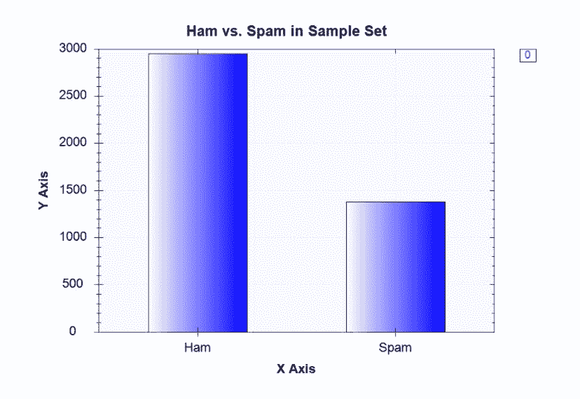

A bar plot for the top ten frequently appearing terms in ham emails

从这个条形图可以看出，数据集中的火腿电子邮件比垃圾邮件多，就像在现实世界中一样。在我们的收件箱中，我们通常收到比垃圾邮件更多的垃圾邮件。我们使用以下代码生成此条形图，以可视化火腿和垃圾邮件在数据集中的分布：

```cs
var barChart = DataBarBox.Show(
    new string[] { "Ham", "Spam" },
    new double[] {
        hamEmailCount,
        spamEmailCount
    }
);
barChart.SetTitle("Ham vs. Spam in Sample Set");
```

使用 Accord.NET 框架中的`DataBarBox`类，我们可以轻松地在条形图中可视化数据。现在让我们想象一下火腿和垃圾邮件中十大常见术语。您可以使用以下代码为火腿和垃圾邮件中的前十个术语生成条形图：

```cs
var hamBarChart = DataBarBox.Show(
    topHamTerms.ToArray(),
    new double[][] {
        topHamTermsProportions.ToArray(),
        spamTermProportions.GetItems(topHamTerms).Values.ToArray()
    }
);
hamBarChart.SetTitle("Top 10 Terms in Ham Emails (blue: HAM, red: SPAM)");

var spamBarChart = DataBarBox.Show(
    topSpamTerms.ToArray(),
    new double[][] {
        hamTermProportions.GetItems(topSpamTerms).Values.ToArray(),
        topSpamTermsProportions.ToArray()
    }
);
spamBarChart.SetTitle("Top 10 Terms in Spam Emails (blue: HAM, red: SPAM)");
```

类似地，我们使用`DataBarBox`类来显示条形图。当您运行此代码时，您将看到 ham 电子邮件中出现频率最高的十个术语的下图：

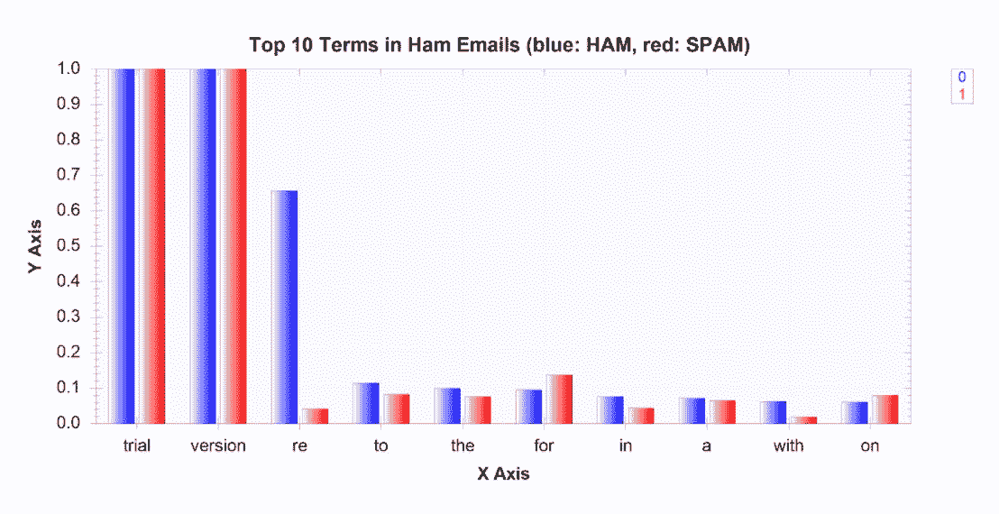

A plot for the top ten frequently appearing terms in ham emails

垃圾邮件中十大常见术语的条形图如下所示：

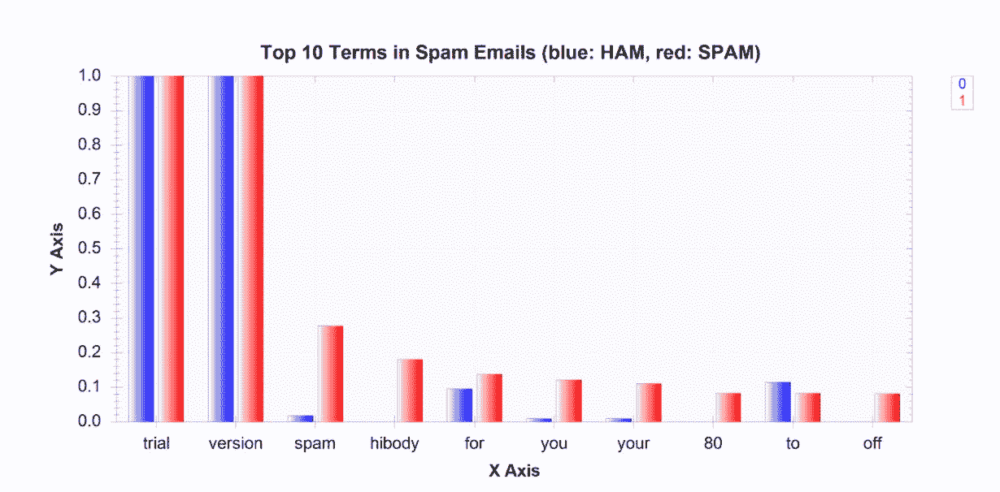

A bar plot for the top ten frequently occurring terms in spam emails

正如所料，垃圾邮件中的单词分布与非垃圾邮件中的单词分布完全不同。例如，如果你看右边的图表，**垃圾邮件**和**hibody**这两个词经常出现在垃圾邮件中，但在非垃圾邮件中却不多见。然而，有些事情没有多大意义。如果你仔细观察，所有垃圾邮件和火腿邮件中都会出现两个词**试用版**和**版本**，这不太可能是真的。如果您在文本编辑器中打开一些原始 EML 文件，您很容易发现并非所有电子邮件的主题行都包含这两个单词。那么，发生了什么？我们以前的数据准备或数据分析步骤是否污染了我们的数据？

进一步的研究表明，我们使用的一个软件包导致了这个问题。我们用来加载和提取电子邮件内容的`EAGetMail`包在我们使用其试用版时会自动将`(Trial Version)`附加到主题行的末尾。现在我们知道了这个数据问题的根本原因，我们需要返回并修复它。一种解决方案是返回到数据准备步骤，并使用以下代码更新我们的`ParseEmails`函数，这只需从主题行中删除附加的`(Trial Version)`标志：

```cs
private static Frame<int, string> ParseEmails(string[] files)
{
    // we will parse the subject and body from each email
    // and store each record into key-value pairs
    var rows = files.AsEnumerable().Select((x, i) =>
    {
        // load each email file into a Mail object
        Mail email = new Mail("TryIt");
        email.Load(x, false);

        // REMOVE "(Trial Version)" flags
        string EATrialVersionRemark = "(Trial Version)"; // EAGetMail appends subjects with "(Trial Version)" for trial version
        string emailSubject = email.Subject.EndsWith(EATrialVersionRemark) ? 
            email.Subject.Substring(0, email.Subject.Length - EATrialVersionRemark.Length) : email.Subject;
        string textBody = email.TextBody;

        // create key-value pairs with email id (emailNum), subject, and body
        return new { emailNum = i, subject = emailSubject, body = textBody };
    });

    // make a data frame from the rows that we just created above
    return Frame.FromRecords(rows);
}
```

更新此代码并再次运行以前的数据准备和分析代码后，用于单词分布的条形图更有意义。

下面的条形图显示了在修复和删除`(Trial Version)`标志后，ham 电子邮件中最常出现的十个术语：


下面的条形图显示了修复和删除`(Trial Version)`标志后垃圾邮件中十大常见术语：


这是一个很好的例子，说明了在构建 ML 模型时数据分析步骤的重要性。在数据准备和数据分析步骤之间进行迭代是非常常见的，因为我们通常会在分析步骤中发现数据问题，并且通常可以通过更新数据准备步骤中使用的一些代码来提高数据质量。现在我们已经有了清晰的数据和主题行中使用的单词的矩阵表示，现在是时候开始研究我们将用于构建 ML 模型的实际特性了。

# 电子邮件数据的特征工程

在上一步中，我们简要地研究了垃圾邮件和火腿电子邮件的单词分布，我们注意到了一些事情。首先，大量最常出现的词是没有太多意义的常用词。例如，像*到*、*到*、*代表*和*a*这样的词是常用词，我们的 ML 算法不会从这些词中学到多少东西。这些类型的词称为**停止词**，通常被忽略或从功能集中删除。我们将使用 NLTK 的停止词列表从我们的功能集中过滤出常用词。您可以从这里下载 NLTK 停止词列表：[https://github.com/yoonhwang/c-sharp-machine-learning/blob/master/ch.2/stopwords.txt](https://github.com/yoonhwang/c-sharp-machine-learning/blob/master/ch.2/stopwords.txt) 。过滤掉这些停止字的一种方法如下代码所示：

```cs
// Read in stopwords list
ISet<string> stopWords = new HashSet<string>(
    File.ReadLines("<path-to-your-stopwords.txt>")
);
// Filter out stopwords from the term frequency series
var spamTermFrequenciesAfterStopWords = spamTermFrequencies.Where(
    x => !stopWords.Contains(x.Key)
);
```

过滤掉这些停止词后，新的非垃圾邮件十大常见术语如下：

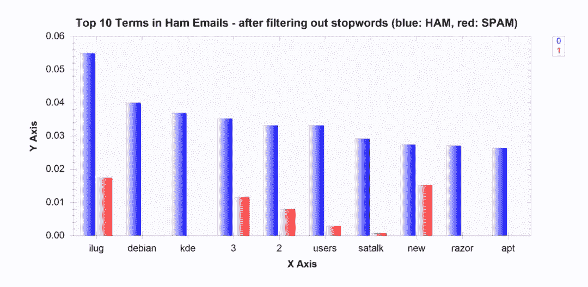

过滤掉停止词后，垃圾邮件十大常见术语如下：

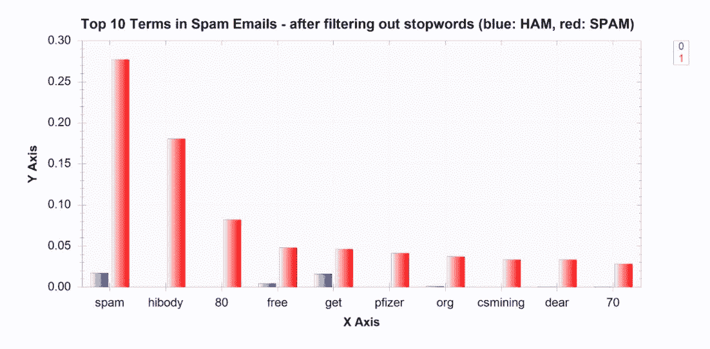

从这些条形图中可以看出，从功能集中过滤掉这些停止词会使更多有意义的词出现在频繁出现的词列表的顶部。然而，我们在这里还可以注意到一件事。数字似乎是一些最常见的词。例如，数字**3**和**2**进入火腿电子邮件中出现频率最高的十个单词。数字**80**和**70**跻身垃圾邮件中出现频率最高的十个词。然而，很难确定这些数字是否对训练 ML 模型将电子邮件分类为垃圾邮件或火腿有很大帮助。有多种方法可以从功能集中过滤出这些数字，但我们将在这里向您展示一种方法。我们更新了在上一步中使用的`regex`，以匹配仅包含字母字符而非字母数字字符的单词。下面的代码显示了我们如何更新`CreateWordVec`函数以从功能集中过滤出数字：

```cs
private static Frame<int, string> CreateWordVec(Series<int, string> rows)
{
    var wordsByRows = rows.GetAllValues().Select((x, i) =>
    {
        var sb = new SeriesBuilder<string, int>();

        ISet<string> words = new HashSet<string>(
            Regex.Matches(
                // Alphabetical characters only
                x.Value, "[a-zA-Z]+('(s|d|t|ve|m))?"
            ).Cast<Match>().Select(
                // Then, convert each word to lowercase
                y => y.Value.ToLower()
            ).ToArray()
        );

        // Encode words appeared in each row with 1
        foreach (string w in words)
        {
            sb.Add(w, 1);
        }

        return KeyValue.Create(i, sb.Series);
    });

    // Create a data frame from the rows we just created
    // And encode missing values with 0
    var wordVecDF = Frame.FromRows(wordsByRows).FillMissing(0);

    return wordVecDF;
}
```

一旦我们从功能集中过滤掉这些数字，ham 电子邮件的单词分布如下所示：

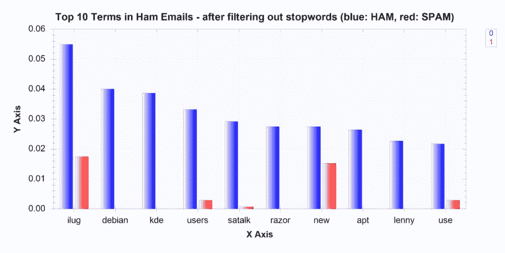

从功能集中过滤出数字后，垃圾邮件的单词分布如下所示：


从这些条形图中可以看出，我们在顶部列表中有更多有意义的单词，而且垃圾邮件和火腿电子邮件的单词分布之间似乎有更大的区别。那些经常出现在垃圾邮件中的词语在火腿邮件中似乎不多见，反之亦然。

数据分析和特征工程步骤的完整代码可在以下 repo 中找到：[https://github.com/yoonhwang/c-sharp-machine-learning/blob/master/ch.2/DataAnalyzer.cs](https://github.com/yoonhwang/c-sharp-machine-learning/blob/master/ch.2/DataAnalyzer.cs) 。运行此代码后，它将生成条形图，显示垃圾邮件和 ham 电子邮件中的单词分布以及两个 CSV 文件，一个用于 ham 电子邮件中具有相应出现次数的单词列表，另一个用于具有相应出现次数的垃圾邮件中的单词列表。当我们在下面的模型构建部分中为垃圾邮件过滤构建分类模型时，我们将在特征选择过程中使用这个术语频率输出。

# 电子邮件垃圾邮件过滤的 Logistic 回归与朴素贝叶斯

我们已经走了很长的路，终于用 C# 构建了我们的第一个 ML 模型。在本节中，我们将训练逻辑回归和朴素贝叶斯分类器，将电子邮件分类为垃圾邮件和火腿。我们将对这两种学习算法进行交叉验证，以评估并更好地理解我们的分类模型在实践中的表现。如前一章中简要讨论的，在 k-折叠交叉验证中，将训练集划分为*k*大小相等的子集，其中一个*k*子集作为验证集，其余的*k-1*子集用于训练模型。然后重复该过程*k*次，每次迭代中使用不同的子集或折叠作为测试的验证集，然后对相应的*k*验证结果进行平均，以报告单个估计。

让我们首先看看如何使用 Accord.NET 框架在 C# 中用逻辑回归实例化交叉验证算法。代码如下：

```cs
var cvLogisticRegressionClassifier = CrossValidation.Create<LogisticRegression, IterativeReweightedLeastSquares<LogisticRegression>, double[], int>(
    // number of folds
    k: numFolds,
    // Learning Algorithm
    learner: (p) => new IterativeReweightedLeastSquares<LogisticRegression>()
    {
        MaxIterations = 100,
        Regularization = 1e-6
    },
    // Using Zero-One Loss Function as a Cost Function
    loss: (actual, expected, p) => new ZeroOneLoss(expected).Loss(actual),
    // Fitting a classifier
    fit: (teacher, x, y, w) => teacher.Learn(x, y, w),
    // Input with Features
    x: input,
    // Output
    y: output
);

// Run Cross-Validation
var result = cvLogisticRegressionClassifier.Learn(input, output);
```

让我们深入地看一下这个代码。通过提供要训练的模型类型、适合模型的学习算法类型、输入数据类型和输出数据类型，我们可以使用静态`Create`函数创建一个新的`CrossValidation`算法。对于本例，我们创建了一个新的`CrossValidation`算法，其中`LogisticRegression`为模型，`IterativeReweightedLeastSquares`为学习算法，双数组为输入类型，整数为输出类型（每个标签）。您可以尝试不同的学习算法来训练逻辑回归模型。在 Accord.NET 中，您可以选择随机梯度下降算法（`LogisticGradientDescent`）作为学习算法来拟合逻辑回归模型。

对于参数，您可以指定 k-fold 交叉验证的折叠次数（*k*）、使用自定义参数的学习方法（`learner`）、您选择的损失/成本函数（`loss`）以及知道如何使用学习算法来拟合模型的函数（`fit`）、输入（`x`），以及输出（`y`。为了在本节中进行说明，我们为 k-折叠交叉验证设置了一个相对较小的数字`3`。此外，我们选择了一个相对较小的数字`100`作为最大迭代次数，并选择了一个相对较大的数字，1e-6 或 1/1000000 作为`IterativeReweightedLeastSquares`学习算法的正则化。对于损失函数，我们使用了一个简单的 0-1 损失函数，其中 0 表示正确的预测，1s 表示错误的预测。这是我们的学习算法试图最小化的代价函数。所有这些参数都可以进行不同的调整。您可以选择不同的损失/成本函数、在 k-折叠交叉验证中使用的折叠数，以及学习算法的最大迭代次数和正则化数。您甚至可以使用不同的学习算法来拟合逻辑回归模型，例如`LogisticGradientDescent`，它迭代地试图找到损失函数的局部最小值。

我们可以应用同样的方法来训练具有 k 倍交叉验证的朴素贝叶斯分类器。使用 Naive Bayes 学习算法运行 k-fold 交叉验证的代码如下：

```cs
var cvNaiveBayesClassifier = CrossValidation.Create<NaiveBayes<BernoulliDistribution>, NaiveBayesLearning<BernoulliDistribution>, double[], int>(
    // number of folds
    k: numFolds,
    // Naive Bayes Classifier with Binomial Distribution
    learner: (p) => new NaiveBayesLearning<BernoulliDistribution>(),
    // Using Zero-One Loss Function as a Cost Function
    loss: (actual, expected, p) => new ZeroOneLoss(expected).Loss(actual),
    // Fitting a classifier
    fit: (teacher, x, y, w) => teacher.Learn(x, y, w),
    // Input with Features
    x: input,
    // Output
    y: output
);

// Run Cross-Validation
var result = cvNaiveBayesClassifier.Learn(input, output);
```

之前的逻辑回归模型代码与此代码之间的唯一区别是我们选择的模型和学习算法。我们使用`NaiveBayes`作为模型，`NaiveBayesLearning`作为学习算法来训练我们的朴素贝叶斯分类器，而不是`LogisticRegression`*和`IterativeReweightedLeastSquares`。因为我们所有的输入值都是二进制的（0 或 1），所以我们使用`BernoulliDistribution`作为我们的朴素贝叶斯分类器模型。*

 *可在以下存储库中找到培训和验证具有 k-fold 交叉验证的分类模型的完整代码：[https://github.com/yoonhwang/c-sharp-machine-learning/blob/master/ch.2/Modeling.cs](https://github.com/yoonhwang/c-sharp-machine-learning/blob/master/ch.2/Modeling.cs) 。运行此代码时，应看到如下输出：

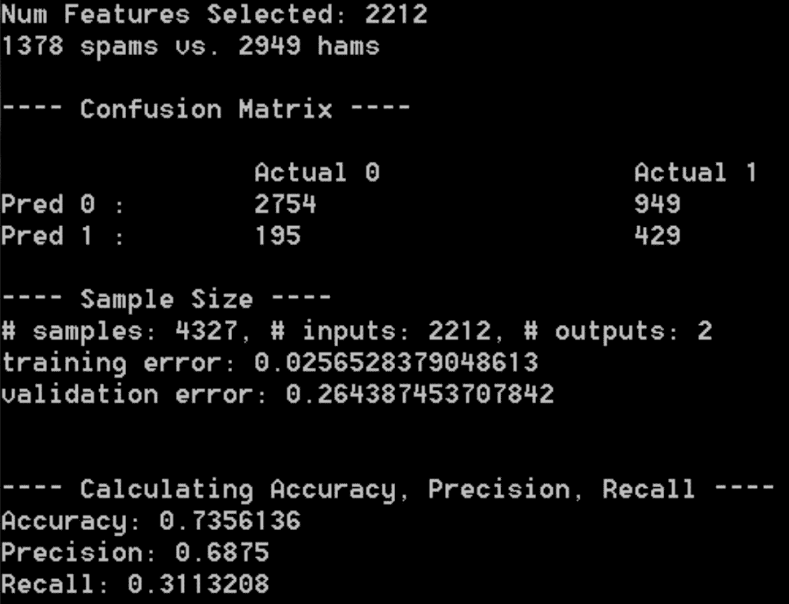

我们将在下面讨论模型验证方法的部分中更详细地了解这些数字代表了什么。为了尝试不同的 ML 模型，只需修改代码中的第 68-88 行。您可以用我们前面讨论过的逻辑回归模型代码替换这些代码，或者您也可以尝试适应您选择的不同学习算法。

# 分类模型验证

在上一节中，我们使用 Accord.NET 框架在 C# 中构建了我们的第一个 ML 模型。然而，我们还没有完全完成。如果我们更仔细地看一下前面的控制台输出，有一件事是非常值得关注的。训练误差约为 0.03，但验证误差约为 0.26。这意味着我们的分类模型在训练集中正确预测了 100 次中的 87 次，但在验证或测试集中的模型预测在 100 次中仅正确 74 次。这是一个典型的过度拟合示例，其中模型与列车组的拟合非常接近，以至于其对不可预见数据集的预测不可靠且不可预测。如果我们采用此模型并将其应用于生产垃圾邮件过滤系统中，则实际过滤垃圾邮件的模型性能将不可靠，并且与我们在培训集中看到的不同。

过度拟合通常是因为模型对于给定的数据集太复杂，或者使用了太多的参数来拟合模型。我们在上一节中构建的朴素贝叶斯分类器模型的过度拟合问题很可能是由于我们用于训练模型的复杂性和特征数量。如果您再次查看上一节末尾的控制台输出，您可以看到用于训练朴素贝叶斯模型的特性数量是 2212。这是太多的特性了，考虑到我们的样本集中只有大约 4200 条电子邮件记录，其中只有大约三分之二（或大约 3000 条记录）用于训练我们的模型（这是因为我们使用了三重交叉验证，而这三重中只有两个在每次迭代中用作训练集）。为了解决这个过度拟合的问题，我们必须减少用于训练模型的功能的数量。为了做到这一点，我们可以过滤掉那些不经常出现的术语。执行此操作的代码位于上一节完整代码的第 48–53 行，如下所示：

```cs
// Change number of features to reduce overfitting
int minNumOccurrences = 1;
string[] wordFeatures = indexedSpamTermFrequencyDF.Where(
    x => x.Value.GetAs<int>("num_occurences") >= minNumOccurrences
).RowKeys.ToArray();
Console.WriteLine("Num Features Selected: {0}", wordFeatures.Count());
```

从这段代码中可以看出，我们在上一节中构建的朴素贝叶斯分类器模型至少使用了垃圾邮件中出现的所有单词一次。如果您查看垃圾邮件中的词频，大约有 1400 个单词只出现一次（请查看在数据分析步骤中创建的`spam-frequencies.csv`文件）。直观地说，那些出现次数较少的单词只会产生噪音，对我们的模型来说没有太多的信息可供学习。这立即告诉我们，当我们在上一节中最初构建分类模型时，我们的模型会暴露在多少噪声中。

现在我们知道了这个过度装配问题的原因，让我们来解决它。让我们用不同的阈值来选择特征。我们尝试了 5、10、15、20 和 25，以获得垃圾邮件中出现的最小数量（即，我们将`minNumOccurrences`设置为 5、10、15 等等），并使用这些阈值训练朴素贝叶斯分类器。

首先，朴素贝叶斯分类器的结果至少出现五次，如下所示：


朴素贝叶斯分类器的结果至少出现 10 次，如下所示：


朴素贝叶斯分类器的结果至少出现 15 次，如下所示：

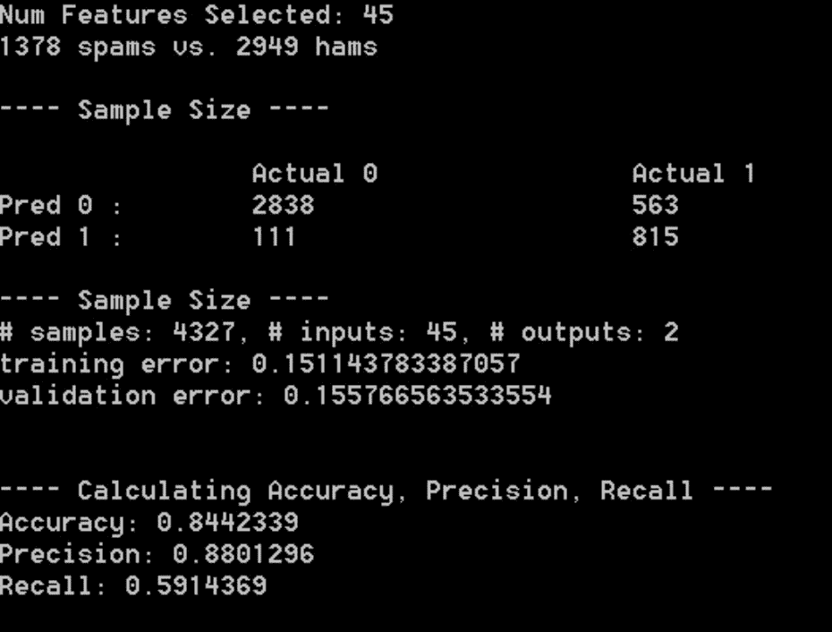

最后，朴素贝叶斯分类器的结果至少出现 20 次，如下所示：

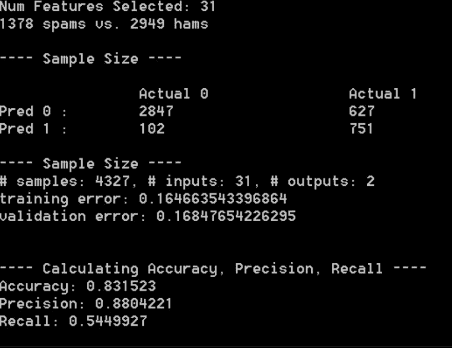

从这些实验结果可以看出，随着我们增加最小单词出现次数并相应减少用于训练模型的特征数量，`training error`和`validation error`之间的差距减小，训练错误开始看起来更类似于验证错误。当我们解决过拟合问题时，我们可以更自信地了解模型在不可预见的数据和生产系统中的行为。我们用 logistic 回归分类模型进行了同样的实验，结果与我们用朴素贝叶斯分类器得到的结果相似。逻辑回归模型的实验结果如下所示。

首先，逻辑回归分类器的结果至少出现五次，如下所示：


逻辑回归分类器至少出现 10 次的结果如下所示：


逻辑回归分类器至少出现 15 次的结果如下所示：

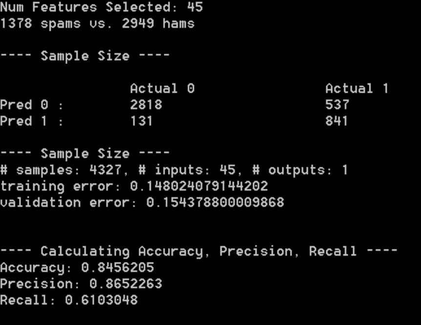

逻辑回归分类器至少出现 20 次的结果如下所示：

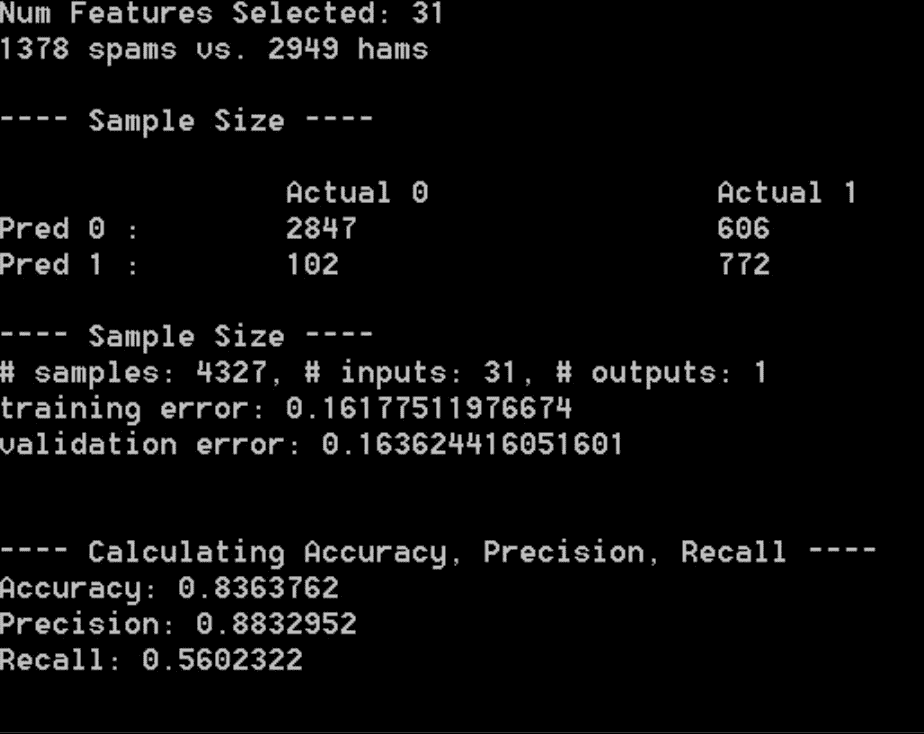

现在我们已经介绍了如何处理过度装配问题，我们还想了解一些模型性能指标：

*   **混淆矩阵**：混淆矩阵是一个表格，告诉我们预测模型的整体性能。每列表示每个实际类，每行表示每个预测类。在二元分类问题的情况下，混淆矩阵将是 2 x 2 矩阵，其中第一行表示负面预测，第二行表示正面预测。第一列代表实际的消极因素，第二列代表实际的积极因素。下表说明了二元分类问题的混淆矩阵中的每个单元格表示的内容：

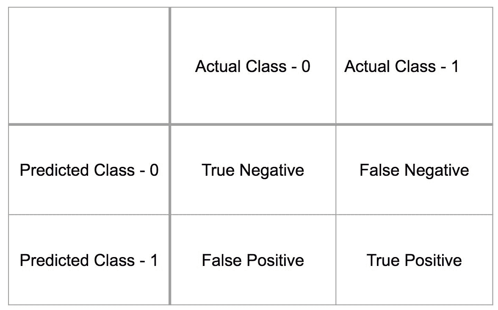

*   **真阴性**（**TN**为模型正确预测 0 级时；**假阴性****FN**为模型预测为**0**时，实际类为**1**；**假阳性****FP**为模型预测为**1**类，实际为**0**类；而**真阳性**（**TP**是当模型正确预测等级**1**时。从表中可以看出，混淆矩阵描述了总体模型性能。在我们的示例中，如果我们查看前面屏幕截图中的最后一个控制台输出，其中显示了我们的逻辑回归分类模型的控制台输出，我们可以看到 TNs 的数量为`2847`，FN 的数量为`606`，FPs 的数量为`102`，TPs 的数量为`772`。有了这些信息，我们可以进一步计算出**真阳性率**（**TPR**）、**真阴性率**（**TNR**）、**假阳性率**（**FPR**）和**假阴性率**（**FNR**）详情如下:

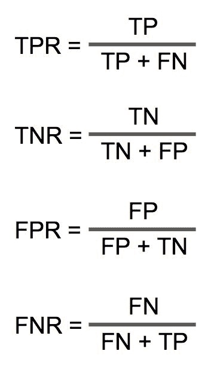

使用前面的示例，我们示例中的真阳性率为 0.56，TNR 为 0.97，FPR 为 0.03，FNR 为 0.44。

*   **准确度**：准确度是正确预测的比例。使用前一示例混淆矩阵中的相同符号，可按如下方式计算精度：


精度是一种常用的模型性能指标，但有时它并不能很好地表示模型的总体性能。例如，如果样本集很大程度上是不平衡的，并且假设我们的样本集中有五封垃圾邮件和 95 封火腿，那么一个简单的分类器将每封电子邮件分类为火腿，其准确率必须达到 95%。但是，它永远不会捕获垃圾邮件。这就是为什么我们需要查看混淆矩阵和其他性能指标，例如精度和召回率：

*   **准确率**：准确率是正确的正向预测数占正向预测总数的比例。使用与前面相同的符号，我们可以按如下方式计算准确率：


如果您查看我们的逻辑回归分类模型结果的前一个屏幕截图中的最后一个控制台输出，则通过将混淆矩阵 772 中的 TPs 数量除以混淆矩阵中 TPs 772 和 FPs 102 的总和来计算准确率，结果为 0.88。

*   **召回率**：召回率是正确的阳性预测数占实际阳性病例总数的比例。这是一种告诉我们该模型检索到多少实际阳性病例的方法。使用与前面相同的符号，我们可以计算召回率，如下所示：

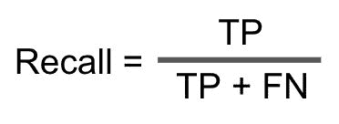

如果您查看前面的逻辑回归分类模式结果截图中的最后一个控制台输出，召回率是通过将混淆矩阵 772 中的测试程序集数量除以混淆矩阵中的测试程序集 772 和 FNs 606 的总和来计算的，结果为 0.56。

有了这些性能指标，数据科学家有责任选择最佳模型。准确率和召回率之间总会有一个折衷。准确率较高的模型召回率较低。在我们的垃圾邮件过滤问题中，如果您认为正确过滤垃圾邮件更重要，并且您可以牺牲一些通过用户收件箱发送的垃圾邮件，那么您可能需要优化精确度。另一方面，如果您认为过滤尽可能多的垃圾邮件更重要，即使您可能最终也会过滤掉一些非垃圾邮件，那么您可能需要优化召回。选择正确的模型不是一个容易的决定，思考需求和成功标准对于做出正确的选择至关重要。

总之，以下是我们可以用来从交叉验证结果和混淆矩阵计算性能指标的代码：

*   **培训与验证（测试）错误**：用于识别过度装配问题（第 48-52 行）：

```cs
// Run Cross-Validation
var result = cvNaiveBayesClassifier.Learn(input, output);

// Training Error vs. Test Error
double trainingError = result.Training.Mean;
double validationError = result.Validation.Mean;
```

*   **混淆矩阵**：真阳性与假阳性，真阴性与假阴性（第 95-108 行）：

```cs
// Confusion Matrix
GeneralConfusionMatrix gcm = result.ToConfusionMatrix(input, output);

float truePositive = (float)gcm.Matrix[1, 1];
float trueNegative = (float)gcm.Matrix[0, 0];
float falsePositive = (float)gcm.Matrix[1, 0];
float falseNegative = (float)gcm.Matrix[0, 1];
```

*   **准确度与精密度与召回率**：用于测量 ML 模型的正确性（第 122-130 行）：

```cs
// Accuracy vs. Precision vs. Recall
float accuracy = (truePositive + trueNegative) / numberOfSamples;
float precision = truePositive / (truePositive + falsePositive);
float recall = truePositive / (truePositive + falseNegative);
```

# 总结

在本章中，我们用 C# 构建了第一个可以用于垃圾邮件过滤的 ML 模型。我们首先定义并明确说明了我们试图解决的问题以及成功的标准。然后，我们从原始电子邮件数据中提取相关信息，并将其转换为可用于数据分析、特征工程和 ML 模型构建步骤的格式。在数据分析步骤中，我们学习了如何应用一种热编码并构建主题行中使用的单词的矩阵表示。我们还从数据分析过程中发现了一个数据问题，并了解了我们如何在数据准备和分析步骤之间来回迭代。然后，我们进一步改进了我们的功能集，过滤掉停止词，并使用`regex`按非字母数字或非字母单词进行分割。利用此功能集，我们使用逻辑回归和朴素贝叶斯分类器算法构建了我们的第一个分类模型，简要介绍了过度拟合的危险，并学习了如何通过查看准确性、精确度和召回率来评估和比较模型性能。最后，我们还学习了精确性和召回率之间的权衡，以及如何根据这些指标和业务需求选择模型。

在下一章中，我们将进一步扩展使用文本数据集构建分类模型的知识和技能。我们将开始研究一个数据集，其中通过使用 Twitter 情绪数据，我们有两个以上的类。我们将学习二元分类模型和多类分类模型之间的区别。我们还将讨论用于特征工程的其他 NLP 技术，以及如何使用随机森林算法构建多类分类模型。*