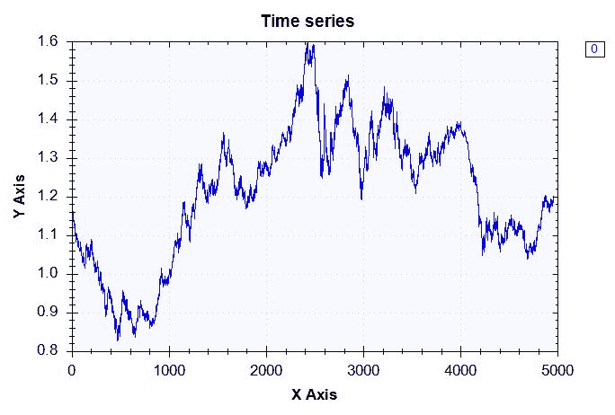
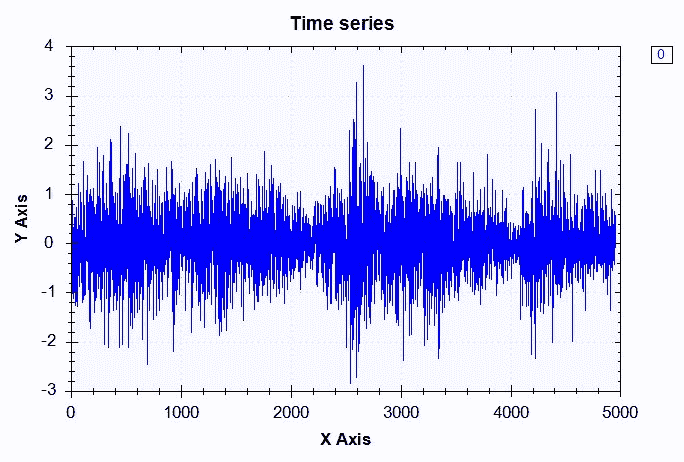
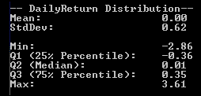
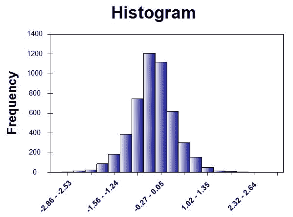
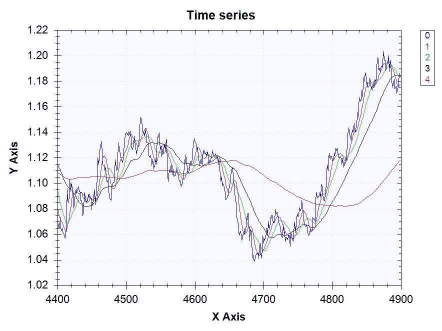
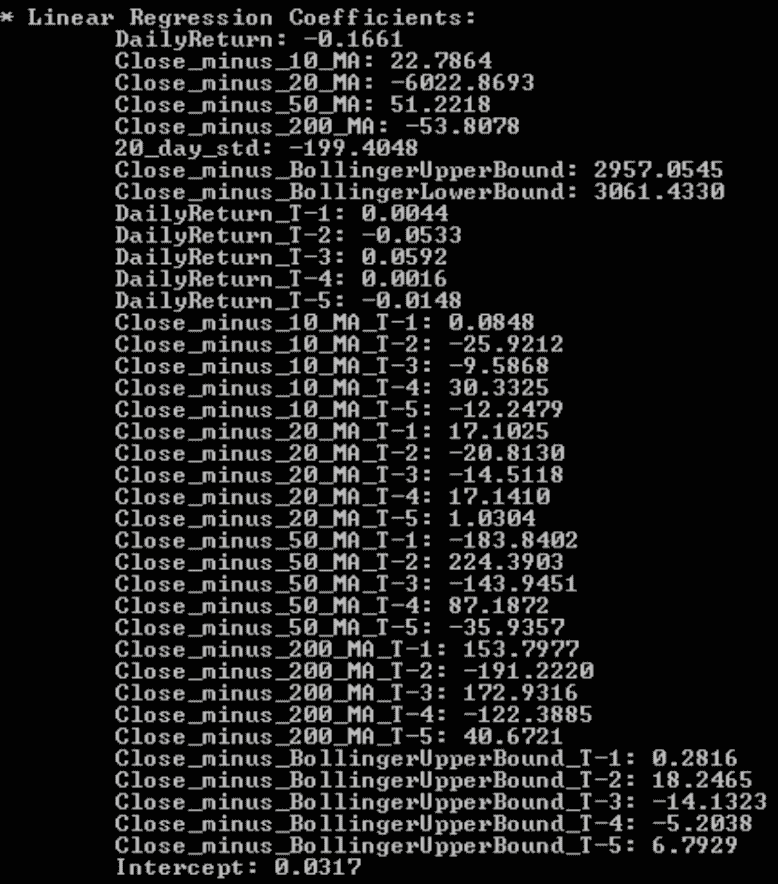
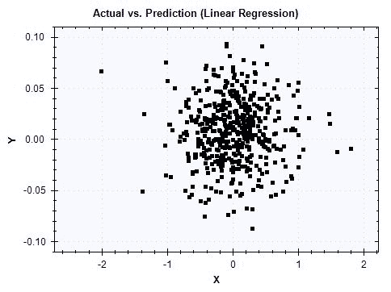
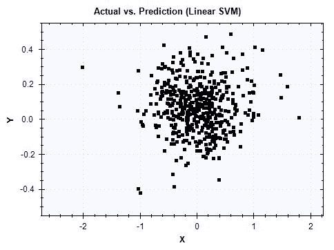

# 外汇汇率预测

在本章中，我们将开始在 C#中建立回归模型。到目前为止，我们已经建立了**机器学习**（**ML**）模型，目标是使用逻辑回归、朴素贝叶斯和随机森林学习算法将数据分类为二进制或多个桶。然而，我们现在正准备改变策略，开始建立预测持续结果的模型。在本章中，我们将探讨一个金融数据集，更具体地说是一个外汇市场数据集。我们将使用欧元（EUR）和美元（USD）之间每日货币汇率的历史数据来构建预测未来汇率的回归模型。我们将从问题定义开始，然后进入数据准备和数据分析。在数据准备和分析步骤中，我们将探讨如何管理时间序列数据并分析每日收益的分布。然后，我们将在功能工程步骤中开始构建可以预测货币汇率的功能。我们将讨论金融市场中一些常用的技术指标，如移动平均线、布林格带和滞后变量。利用这些技术指标，我们将使用线性回归和**支持向量机**（**SVM**学习算法构建回归 ML 模型。在建立这样的模型的同时，我们还将探索一些我们可以微调 SVM 模型超参数的方法。最后，我们将讨论评估回归模型的一些验证指标和方法。我们将讨论如何使用**均方根误差**（**RMSE**）、R<sup class="calibre64">2</sup>以及观测值与拟合值图来评估我们模型的性能。本章结束时，您将拥有预测每日欧元/美元汇率的有效回归模型。

在本章中，我们将介绍以下步骤：

*   外汇汇率（欧元兑美元）预测项目的问题定义
*   在 Deedle 框架中使用时间序列功能进行数据准备
*   时间序列数据分析
*   在外汇交易中使用各种技术指标的特征工程
*   线性回归与支持向量机
*   使用 RMSE、R<sup class="calibre64">2</sup>和实际与预测图进行模型验证

# 问题定义

让我们从定义我们在这个项目中试图解决的问题开始本章。您可能听说过术语*算法交易*或*定量金融/交易*。这是金融业的一个著名领域，数据科学和 ML 在这里与金融相遇。算法交易或定量金融指的是一种策略，即使用从大量历史数据构建的统计学习模型来预测未来金融市场走势。这些策略和技术被各种交易员和投资者广泛使用，用于预测各种金融资产的未来价格。外汇市场是最大、流动性最强的金融市场之一，有大量交易员和投资者参与其中。这是一个独特的市场，每天 24 小时，每周 5 天开放，来自世界各地的交易员前来买卖某些货币对。由于这一优势和独特性，外汇市场也是一个有吸引力的金融市场，算法和定量交易者可以建立 ML 模型来预测未来汇率，并实现交易自动化，以利用计算机可以做出的快速决策和执行。

为了了解我们如何将 ML 知识应用于金融市场和回归模型，我们将使用 1999 年 1 月 1 日至 2017 年 12 月 31 日的每日欧元/美元汇率历史数据。我们将使用一个公开的数据集，可以从以下链接下载：[http://www.global-view.com/forex-trading-tools/forex-history/index.html](http://www.global-view.com/forex-trading-tools/forex-history/index.html) 。有了这些数据，我们将使用常用的技术指标，如移动平均线、布林格带和滞后变量来构建特征。然后，我们将使用线性回归和 SVM 学习算法建立回归模型，预测欧元/美元货币对的未来每日汇率。一旦我们建立了这些模型，我们将使用 RMSE、R<sup class="calibre64"><sub class="calibre65">2</sub></sup>和观察值与预测值的曲线图来评估我们的模型。

总结我们对汇率预测项目的问题定义：

*   有什么问题？我们需要一个回归模型来预测欧元和美元之间的未来汇率；更具体地说，我们希望建立一个 ML 模型，预测欧元/美元汇率的每日变化。
*   为什么这是个问题？由于外汇市场的快节奏和不稳定环境，拥有一个能够预测何时买入和何时卖出特定货币对并作出自主决策的 ML 模型是有利的。
*   解决这个问题的方法有哪些？我们将使用欧元和美元之间每日汇率的历史数据。有了这个数据集，我们将使用常用的技术指标，如移动平均线、布林格带和滞后变量，构建财务特征。我们将探索线性回归和 SVM 学习算法作为回归模型的候选算法。然后，我们将研究 RMSE，R<sup class="calibre64">2</sup>，并使用观察到的与预测的图来评估我们构建的模型的性能。
*   成功的标准是什么？我们希望 RMSE 较低，因为我们希望我们的预测尽可能接近实际值。我们想要高 R<sup class="calibre64">2</sup>，因为它表明了我们的模型的适用性。最后，我们希望看到数据点在观察到的与预测的图中紧密地排列成对角线。

# 数据准备

现在我们知道了本章要解决的问题，让我们开始研究数据。与前两章中预编译和预标记数据不同，我们将从原始欧元/美元汇率数据开始。点击此链接：[http://www.global-view.com/forex-trading-tools/forex-history/index.html](http://www.global-view.com/forex-trading-tools/forex-history/index.html) 并选择**欧元/美元收盘**、**欧元/美元高位**和**欧元/美元低位**。如果您想浏览不同的数据集，还可以选择不同的货币对。选择所需的数据点后，可以选择开始日期和结束日期，还可以选择是下载每日、每周还是每月数据。对于本章，我们选择**1999 年 1 月 1 日**作为**开始日期**和**2017 年 12 月 31 日**作为**停止日期**，并下载包含欧元/美元货币对的接近、高和低价格的每日数据集。

下载数据后，我们需要完成一些任务，以便为将来的数据分析、特征工程和 ML 建模做好准备。首先，我们需要定义目标变量。正如我们在问题定义步骤中所讨论的，我们的目标变量是欧元/美元汇率的每日变化。为了计算每日收益，我们需要从今天的收盘价中减去前一天的收盘价，然后除以前一天的收盘价。计算每日收益的公式如下：


我们可以使用 Deedle 数据框中的`Diff`方法来计算先前价格和当前价格之间的差异。实际上，您可以使用`Diff`方法计算任意时间点的数据点与当前数据点之间的差值。例如，以下代码显示了如何计算当前数据点与提前一步、提前三步和提前五步的数据点之间的差异：

```cs
rawDF["DailyReturn"].Diff(1)
rawDF["DailyReturn"].Diff(3)
rawDF["DailyReturn"].Diff(5)
```

上述代码的输出如下所示：


使用此`Diff`方法，以下代码是我们如何计算欧元/美元汇率的每日收益率：

```cs
// Compute Daily Returns
rawDF.AddColumn(
    "DailyReturn", 
    rawDF["Close"].Diff(1) / rawDF["Close"] * 100.0
);
```

在这段代码中，我们将取前一天和当天收盘价之间的差额，然后除以前一收盘价。通过将它们乘以`100`，我们可以得到百分比形式的每日回报。最后，我们使用 Deedle 数据框中的`AddColumn`方法，将此每日收益序列添加回原始数据框，并使用列名`DailyReturn`。

然而，我们还没有完全完成目标变量的构建。因为我们正在建立一个预测模型，所以我们需要将次日收益率作为目标变量。我们可以使用 Deedle 数据框中的`Shift`方法将每条记录与第二天的回报相关联。与`Diff`方法类似，您可以使用`Shift`方法将序列来回移动到任意时间点。以下代码显示了如何通过`1`、`3`和`5`步骤移动`DailyReturn`列：

```cs
rawDF["DailyReturn"].Shift(1)
rawDF["DailyReturn"].Shift(3)
rawDF["DailyReturn"].Shift(5)
```

上述代码的输出如下所示：


从本例中可以看出，`DailyReturn`列或序列已经向前移动了`1`、`3`和`5`步，这取决于您输入`Shift`方法的参数。使用这个`Shift`方法，我们将把每日回报向后移动一步，这样每个记录都将第二天的回报作为目标变量。下面的代码是我们如何创建目标变量列`Target`：

```cs
// Encode Target Variable - Predict Next Daily Return
rawDF.AddColumn(
    "Target",
    rawDF["DailyReturn"].Shift(-1)
);
```

既然我们已经对目标变量进行了编码，那么我们还需要采取一个步骤来为将来的任务准备数据。当您处理财务数据时，您经常会听到术语*OHLC 图表*或*OHLC 价格*。OHLC 代表开盘、高点、低点和收盘，通常用于显示价格随时间的变化。如果您查看我们下载的数据，您会注意到数据集中缺少未平仓价格。然而，我们将需要开放的价格为我们未来的功能工程步骤。我们将假设某一天的开盘价是前一天的收盘价，因为外汇市场每天 24 小时运行，流动性很强，交易量很大。为了将之前的收盘价作为开盘价，我们将使用`Shift`方法。下面的代码显示了我们如何创建开放价格并将其添加到数据框中：

```cs
// Assume Open prices are previous Close prices
rawDF.AddColumn(
    "Open",
    rawDF["Close"].Shift(1)
);
```

以下代码是我们用于数据准备步骤的完整代码：

```cs
using Deedle;
using System;
using System.Collections.Generic;
using System.IO;
using System.Linq;
using System.Text;
using System.Threading.Tasks;

namespace DataPrep
{
    class Program
    {
        static void Main(string[] args)
        {
            Console.SetWindowSize(100, 50);

            // Read in the raw dataset
            // TODO: change the path to point to your data directory
            string dataDirPath = @"\\Mac\Home\Documents\c-sharp-machine-
learning\ch.4\input-data";

            // Load the data into a data frame
            string rawDataPath = Path.Combine(dataDirPath, "eurusd-daily.csv");
            Console.WriteLine("Loading {0}\n", rawDataPath);
            var rawDF = Frame.ReadCsv(
                rawDataPath,
                hasHeaders: true,
                schema: "Date,float,float,float",
                inferTypes: false
            );

            // Rename & Simplify Column Names
            rawDF.RenameColumns(c => c.Contains("EUR/USD ") ? c.Replace("EUR/USD ", "") : c);

            // Assume Open prices are previous Close prices
            rawDF.AddColumn(
                "Open",
                rawDF["Close"].Shift(1)
            );

            // Compute Daily Returns
            rawDF.AddColumn(
                "DailyReturn", 
                rawDF["Close"].Diff(1) / rawDF["Close"] * 100.0
            );

            // Encode Target Variable - Predict Next Daily Return
            rawDF.AddColumn(
                "Target",
                rawDF["DailyReturn"].Shift(-1)
            );

            rawDF.Print();

            // Save OHLC data
            string ohlcDataPath = Path.Combine(dataDirPath, "eurusd-daily-ohlc.csv");
            Console.WriteLine("\nSaving OHLC data to {0}\n", rawDataPath);
            rawDF.SaveCsv(ohlcDataPath);

            Console.WriteLine("DONE!!");
            Console.ReadKey();
        }
    }
}
```

当您运行此代码时，它会将结果输出到名为`eurusd-daily-ohlc.csv`的文件中，该文件包含 OHLC 价格、每日收益和目标变量。我们将在未来的数据分析和特征工程步骤中使用此文件。

此代码也可以在以下存储库中找到：[https://github.com/yoonhwang/c-sharp-machine-learning/blob/master/ch.4/DataPrep.cs](https://github.com/yoonhwang/c-sharp-machine-learning/blob/master/ch.4/DataPrep.cs) 。

# 时间序列数据分析

让我们开始研究数据。我们将从前面的数据准备步骤中获取输出，并开始查看每日收益的分布。与前几章不同，我们主要处理分类变量，我们处理的是连续变量和时间序列变量。我们将以几种不同的方式来看待这些数据。首先，让我们看看时间序列收盘价图表。以下代码显示了如何使用 Accord.NET 框架构建折线图：

```cs
// Time-series line chart of close prices
DataSeriesBox.Show(
    ohlcDF.RowKeys.Select(x => (double)x),
    ohlcDF.GetColumn<double>("Close").ValuesAll
);
```

有关显示折线图的各种其他方法，请参阅 Accord.NET 文档`DataSeriesBox.Show`方法。在本例中，我们构建了一个折线图，数据帧的整数指数作为*x*轴值，收盘价作为*y*轴值。以下是运行代码时将看到的时间序列折线图：



该图表显示了 1999 年至 2017 年期间欧元/美元汇率的总体变动情况。它从 1.18 左右开始，在 2000 年和 2001 年降到 1.0 以下。然后，2008 年高达 1.6，2017 年则在 1.20 左右。现在让我们看看历史每日收益率。下面的代码显示了如何构建历史每日收益的折线图：

```cs
// Time-series line chart of daily returns
DataSeriesBox.Show(
    ohlcDF.RowKeys.Select(x => (double)x),
    ohlcDF.FillMissing(0.0)["DailyReturn"].ValuesAll
);
```

这里需要注意的一点是`FillMissing`方法的用法。如果您还记得上一个数据准备步骤，`DailyReturn`系列是根据上一期和当前期之间的差异构建的。因此，我们缺少第一个数据点的值，因为第一条记录没有前期数据点。`FillMissing`方法帮助您使用自定义值对缺少的值进行编码。根据您的数据集和假设，您可以使用不同的值对缺失的值进行编码，Deedle 数据框中的`FillMissing`方法将派上用场。

运行上一个代码时，它将显示一个图表，如下所示：



从这张图表可以看出，日收益率在**0**左右波动，大部分在-2.0%和+2.0%之间。让我们更仔细地看看每日收益的分布。我们将查看最小值、最大值、平均值和标准偏差值。然后，我们将查看每日收益的四分位数，在查看代码之后，我们将更详细地讨论这些四分位数。计算这些数字的代码如下所示：

```cs
// Check the distribution of daily returns
double returnMax = ohlcDF["DailyReturn"].Max();
double returnMean = ohlcDF["DailyReturn"].Mean();
double returnMedian = ohlcDF["DailyReturn"].Median();
double returnMin = ohlcDF["DailyReturn"].Min();
double returnStdDev = ohlcDF["DailyReturn"].StdDev();

double[] quantiles = Accord.Statistics.Measures.Quantiles(
    ohlcDF.FillMissing(0.0)["DailyReturn"].ValuesAll.ToArray(),
    new double[] {0.25, 0.5, 0.75}
);

Console.WriteLine("-- DailyReturn Distribution-- ");

Console.WriteLine("Mean: \t\t\t{0:0.00}\nStdDev: \t\t{1:0.00}\n", returnMean, returnStdDev);

Console.WriteLine(
    "Min: \t\t\t{0:0.00}\nQ1 (25% Percentile): \t{1:0.00}\nQ2 (Median): \t\t{2:0.00}\nQ3 (75% Percentile): \t{3:0.00}\nMax: \t\t\t{4:0.00}", 
    returnMin, quantiles[0], quantiles[1], quantiles[2], returnMax
);
```

从这段代码中可以看到，Deedle 框架有许多用于计算基本统计数据的内置方法。如代码的前六行所示，您可以使用 Deedle 框架中的`Max`、`Mean`、`Median`、`Min`和`StdDev`方法来获取每日收益的相应统计信息。

为了得到四分位数，我们需要在 Accord.NET 框架的`Accord.Statistics.Measures`模块中使用`Quantiles`方法。分位数是将有序分布划分为等长间隔的点。例如，十个分位数将有序分布分成十个大小相等的子集，因此第一个子集表示分布的底部 10%，最后一个子集表示分布的顶部 10%。类似地，四个分位数将有序分布划分为大小相等的四个子集，其中第一个子集表示分布的底部 25%，最后一个子集表示分布的顶部 25%。四个分位数通常称为**四分位数**，十个分位数称为**十分位数**，100 个分位数称为**百分位数**。从这些定义可以推断，1<sup class="calibre64">st</sup>四分位数与 0.25<sup class="calibre64">th</sup>十分位数和 25<sup class="calibre64">th</sup>百分位数相同。同样，2<sup class="calibre64">第</sup>和 3<sup class="calibre64">第</sup>四分位数与 0.50<sup class="calibre64">第</sup>和 0.75<sup class="calibre64">第</sup>十分位数以及 50<sup class="calibre64">第</sup>和 75<sup class="calibre64">第</sup>百分位数相同。由于我们对四分位数感兴趣，我们在`Quantiles`方法中使用了 25%、50%和 75%作为`percentiles`参数的输入。以下显示了运行此代码时的输出：



与我们从日收益时间序列折线图中注意到的类似，平均值和中位数约为 0，表明日收益率在 0%左右波动。从 1999 年到 2017 年，历史上最大的负日收益率为-2.86%，最大的正日收益率为 3.61%。第一个四分位数是最小值和中间值之间的中间值，为-0.36%；第三个四分位数是中间值和最大值之间的中间值，为 0.35%。从这些汇总统计数据中，我们可以看出，日收益率从 0%开始几乎是对称分布的。为了更直观地展示这一点，现在让我们看看每日收益的直方图。绘制每日收益直方图的代码如下所示：

```cs
var dailyReturnHistogram = HistogramBox
.Show(
    ohlcDF.FillMissing(0.0)["DailyReturn"].ValuesAll.ToArray()
)
.SetNumberOfBins(20);
```

我们在 Accord.NET 框架中使用`HistogramBox`构建每日收益的直方图。在这里，我们将箱子的数量设置为`20`。您可以增加或减少存储箱的数量，以显示更多或更少的颗粒存储桶。运行此代码时，您将看到以下图表：



与我们在汇总统计中观察到的类似，日收益率从 0%开始几乎对称分布。该日收益率直方图显示了一条清晰的钟形曲线，表明日收益率服从正态分布。

我们为此数据分析步骤运行的完整代码可以在以下链接中找到：[https://github.com/yoonhwang/c-sharp-machine-learning/blob/master/ch.4/DataAnalyzer.cs](https://github.com/yoonhwang/c-sharp-machine-learning/blob/master/ch.4/DataAnalyzer.cs) 。

# 特征工程

现在我们对每日收益的分布有了更好的理解，让我们开始为我们的 ML 建模构建特性。在这一步中，我们将讨论外汇市场交易员使用的几个常用技术指标，以及如何使用这些技术指标为我们的 ML 模型构建功能。

# 移动平均线

我们将构建移动平均线的第一组特性。移动平均线是一个预先定义的周期数的滚动平均线，是一个常用的技术指标。移动平均线有助于平抑价格波动，并显示价格行动的总体趋势。关于如何在金融资产交易中使用移动平均线的深入讨论超出了本书的范围，但简言之，查看具有不同时间框架的多个移动平均线有助于交易员确定交易趋势、支撑和阻力水平。在本章中，我们将使用四个移动平均值，其中回顾期为 10 天、20 天、50 天和 200 天。下面的代码显示了如何使用`Window`方法计算移动平均数：

```cs
// 1\. Moving Averages
ohlcDF.AddColumn("10_MA", ohlcDF.Window(10).Select(x => x.Value["Close"].Mean()));
ohlcDF.AddColumn("20_MA", ohlcDF.Window(20).Select(x => x.Value["Close"].Mean()));
ohlcDF.AddColumn("50_MA", ohlcDF.Window(50).Select(x => x.Value["Close"].Mean()));
ohlcDF.AddColumn("200_MA", ohlcDF.Window(200).Select(x => x.Value["Close"].Mean()));
```

Deedle 框架中的`Window`方法帮助我们轻松计算移动平均线。`Window`方法获取一个数据帧并构建一系列数据帧，其中每个数据帧包含预定义数量的记录。例如，如果您对`Window`方法的输入是`10`，那么它将构建一系列数据帧，其中第一个数据帧包含从第 0 个索引到第 9 个<sup class="calibre64">第</sup>索引的记录，第二个数据帧包含从第 1 个<sup class="calibre64">st</sup>索引到第 11 个<sup class="calibre64">第</sup>索引的记录，等等使用此方法，我们可以轻松地计算不同时间窗口的移动平均值，如代码所示。现在，让我们用这些移动平均线绘制一个时间序列收盘价格图：



从这张图表中可以看出，移动平均线平滑了价格波动。红线表示 10 天的移动平均线，绿线表示 20 天的移动平均线，黑线表示 50 天，红线表示 200 天。从这张图表可以看出，时间窗口越短，价格走势越接近，图表就越不平滑。我们用于生成此图表的代码如下所示：

```cs
// Time-series line chart of close prices & moving averages
var maLineChart = DataSeriesBox.Show(
    ohlcDF.Where(x => x.Key > 4400 && x.Key < 4900).RowKeys.Select(x => (double)x),
    ohlcDF.Where(x => x.Key > 4400 && x.Key < 4900).GetColumn<double>("Close").ValuesAll,
    ohlcDF.Where(x => x.Key > 4400 && x.Key < 4900).GetColumn<double>("10_MA").ValuesAll,
    ohlcDF.Where(x => x.Key > 4400 && x.Key < 4900).GetColumn<double>("20_MA").ValuesAll,
    ohlcDF.Where(x => x.Key > 4400 && x.Key < 4900).GetColumn<double>("50_MA").ValuesAll,
    ohlcDF.Where(x => x.Key > 4400 && x.Key < 4900).GetColumn<double>("200_MA").ValuesAll
);
```

根据我们刚刚计算的这些移动平均线，我们将在模型中使用的实际特征是收盘价和移动平均线之间的距离。如前所述，移动平均线通常作为支撑线和阻力线发挥作用，通过观察每个价格点离移动平均线的距离，我们可以确定我们是否正在接近支撑线和阻力线。计算收盘价和移动平均线之间距离的代码如下：

```cs
// Distance from moving averages
ohlcDF.AddColumn("Close_minus_10_MA", ohlcDF["Close"] - ohlcDF["10_MA"]);
ohlcDF.AddColumn("Close_minus_20_MA", ohlcDF["Close"] - ohlcDF["20_MA"]);
ohlcDF.AddColumn("Close_minus_50_MA", ohlcDF["Close"] - ohlcDF["50_MA"]);
ohlcDF.AddColumn("Close_minus_200_MA", ohlcDF["Close"] - ohlcDF["200_MA"]);
```

# 布林线

第二个技术指标是布林带。布林格带由移动平均线和移动标准偏差组成，移动平均线和移动标准偏差与移动平均线使用的时间窗口相同。然后，在价格-时间序列图上，将布林带标绘为移动平均线上方和下方的两个标准偏差。我们将使用 20 天的时间窗口来计算布林带。计算布林带的代码如下所示：

```cs
// 2\. Bollinger Band
ohlcDF.AddColumn("20_day_std", ohlcDF.Window(20).Select(x => x.Value["Close"].StdDev()));
ohlcDF.AddColumn("BollingerUpperBound", ohlcDF["20_MA"] + ohlcDF["20_day_std"] * 2);
ohlcDF.AddColumn("BollingerLowerBound", ohlcDF["20_MA"] - ohlcDF["20_day_std"] * 2);
```

从这段代码中可以看出，我们使用`Window`和`StdDev`方法来计算移动标准偏差。然后，我们通过从 20 天移动平均数中加上和减去两个标准差来计算布林带的上下限。使用价格序列绘制布林带时，结果如下所示：


蓝线显示价格走势，绿线显示 20 天移动平均线，红线显示布林线带的上边界，即高于移动平均线的两个标准差，黑线显示布林线带的下边界，即低于移动平均线的两个标准差。从这张图表中可以看出，布林格带围绕价格走势形成了一个带。显示此图表的代码如下所示：

```cs
// Time-series line chart of close prices & bollinger bands
var bbLineChart = DataSeriesBox.Show(
    ohlcDF.Where(x => x.Key > 4400 && x.Key < 4900).RowKeys.Select(x => (double)x),
    ohlcDF.Where(x => x.Key > 4400 && x.Key < 4900).GetColumn<double>("Close").ValuesAll,
    ohlcDF.Where(x => x.Key > 4400 && x.Key < 4900).GetColumn<double>("BollingerUpperBound").ValuesAll,
    ohlcDF.Where(x => x.Key > 4400 && x.Key < 4900).GetColumn<double>("20_MA").ValuesAll,
    ohlcDF.Where(x => x.Key > 4400 && x.Key < 4900).GetColumn<double>("BollingerLowerBound").ValuesAll
);
```

与之前的移动平均线类似，我们将使用收盘价和布林线之间的距离。由于大多数交易是在上下波段之间进行的，因此价格和波段之间的距离可以作为我们 ML 型号的特征。计算距离的代码如下所示：

```cs
// Distance from Bollinger Bands
ohlcDF.AddColumn("Close_minus_BollingerUpperBound", ohlcDF["Close"] - ohlcDF["BollingerUpperBound"]);
ohlcDF.AddColumn("Close_minus_BollingerLowerBound", ohlcDF["Close"] - ohlcDF["BollingerLowerBound"]);
```

# 滞后变量

最后，我们要使用的最后一组特性是滞后变量。滞后变量包含有关以前期间的信息。例如，如果我们使用前一天的每日回报值作为模型的特征，那么它是一个滞后一个周期的滞后变量。我们还可以使用当前日期前两天的每日回报作为我们模型的一项功能。这些类型的变量称为**滞后变量**，通常用于时间序列建模。我们将使用每日收益和以前构建的功能作为滞后变量。在这个项目中，我们回顾了五个时期，但您可以尝试更长或更短的回顾时期。为每日回报创建滞后变量的代码如下：

```cs
// 3\. Lagging Variables
ohlcDF.AddColumn("DailyReturn_T-1", ohlcDF["DailyReturn"].Shift(1));
ohlcDF.AddColumn("DailyReturn_T-2", ohlcDF["DailyReturn"].Shift(2));
ohlcDF.AddColumn("DailyReturn_T-3", ohlcDF["DailyReturn"].Shift(3));
ohlcDF.AddColumn("DailyReturn_T-4", ohlcDF["DailyReturn"].Shift(4));
ohlcDF.AddColumn("DailyReturn_T-5", ohlcDF["DailyReturn"].Shift(5));
```

同样，我们可以使用以下代码为移动平均线和收盘价之间的差异创建滞后变量：

```cs
ohlcDF.AddColumn("Close_minus_10_MA_T-1", ohlcDF["Close_minus_10_MA"].Shift(1));
ohlcDF.AddColumn("Close_minus_10_MA_T-2", ohlcDF["Close_minus_10_MA"].Shift(2));
ohlcDF.AddColumn("Close_minus_10_MA_T-3", ohlcDF["Close_minus_10_MA"].Shift(3));
ohlcDF.AddColumn("Close_minus_10_MA_T-4", ohlcDF["Close_minus_10_MA"].Shift(4));
ohlcDF.AddColumn("Close_minus_10_MA_T-5", ohlcDF["Close_minus_10_MA"].Shift(5));

ohlcDF.AddColumn("Close_minus_20_MA_T-1", ohlcDF["Close_minus_20_MA"].Shift(1));
ohlcDF.AddColumn("Close_minus_20_MA_T-2", ohlcDF["Close_minus_20_MA"].Shift(2));
ohlcDF.AddColumn("Close_minus_20_MA_T-3", ohlcDF["Close_minus_20_MA"].Shift(3));
ohlcDF.AddColumn("Close_minus_20_MA_T-4", ohlcDF["Close_minus_20_MA"].Shift(4));
ohlcDF.AddColumn("Close_minus_20_MA_T-5", ohlcDF["Close_minus_20_MA"].Shift(5));

ohlcDF.AddColumn("Close_minus_50_MA_T-1", ohlcDF["Close_minus_50_MA"].Shift(1));
ohlcDF.AddColumn("Close_minus_50_MA_T-2", ohlcDF["Close_minus_50_MA"].Shift(2));
ohlcDF.AddColumn("Close_minus_50_MA_T-3", ohlcDF["Close_minus_50_MA"].Shift(3));
ohlcDF.AddColumn("Close_minus_50_MA_T-4", ohlcDF["Close_minus_50_MA"].Shift(4));
ohlcDF.AddColumn("Close_minus_50_MA_T-5", ohlcDF["Close_minus_50_MA"].Shift(5));

ohlcDF.AddColumn("Close_minus_200_MA_T-1", ohlcDF["Close_minus_200_MA"].Shift(1));
ohlcDF.AddColumn("Close_minus_200_MA_T-2", ohlcDF["Close_minus_200_MA"].Shift(2));
ohlcDF.AddColumn("Close_minus_200_MA_T-3", ohlcDF["Close_minus_200_MA"].Shift(3));
ohlcDF.AddColumn("Close_minus_200_MA_T-4", ohlcDF["Close_minus_200_MA"].Shift(4));
ohlcDF.AddColumn("Close_minus_200_MA_T-5", ohlcDF["Close_minus_200_MA"].Shift(5));
```

最后，我们可以使用以下代码为布林带指示器创建滞后变量：

```cs
ohlcDF.AddColumn("Close_minus_BollingerUpperBound_T-1", ohlcDF["Close_minus_BollingerUpperBound"].Shift(1));
ohlcDF.AddColumn("Close_minus_BollingerUpperBound_T-2", ohlcDF["Close_minus_BollingerUpperBound"].Shift(2));
ohlcDF.AddColumn("Close_minus_BollingerUpperBound_T-3", ohlcDF["Close_minus_BollingerUpperBound"].Shift(3));
ohlcDF.AddColumn("Close_minus_BollingerUpperBound_T-4", ohlcDF["Close_minus_BollingerUpperBound"].Shift(4));
ohlcDF.AddColumn("Close_minus_BollingerUpperBound_T-5", ohlcDF["Close_minus_BollingerUpperBound"].Shift(5));
```

从这些代码片段中可以看出，创建这样的滞后变量非常简单和直接。我们可以简单地使用 Deedle 框架中的`Shift`方法，并根据回顾期更改方法的输入。

在本节中，我们要做的最后一件事是删除缺少的值。因为我们构建了很多时间序列特性，所以我们创建了很多缺失的值。例如，当我们计算 200 天移动平均数时，前 199 条记录将没有移动平均数，因此将缺少值。当您的数据集中碰巧缺少值时，有两种方法可以处理它们—可以使用某些值对它们进行编码，也可以从数据集中删除缺少的值。由于我们有足够的数据，我们将删除所有缺少值的记录。从数据框中删除缺失值的代码如下：

```cs
Console.WriteLine("\n\nDF Shape BEFORE Dropping Missing Values: ({0}, {1})", ohlcDF.RowCount, ohlcDF.ColumnCount);
ohlcDF = ohlcDF.DropSparseRows();
Console.WriteLine("\nDF Shape AFTER Dropping Missing Values: ({0}, {1})\n\n", ohlcDF.RowCount, ohlcDF.ColumnCount);
```

从这段代码中可以看到，Deedle 框架有一个方便的函数，我们可以使用它删除缺少的值。我们可以使用`DropSparseRows`方法删除所有缺失的值。运行此代码时，您的输出将如下所示：


从这个输出中可以看到，由于缺少值，它删除了 250 条记录。可在以下链接找到从端到端运行数据分析步骤的完整代码：[https://github.com/yoonhwang/c-sharp-machine-learning/blob/master/ch.4/FeatureEngineer.cs](https://github.com/yoonhwang/c-sharp-machine-learning/blob/master/ch.4/FeatureEngineer.cs) 。

# 线性回归与支持向量机

在本节中，我们将构建与前几章完全不同的模型。我们将建立预测连续变量的模型，并提供欧元/美元汇率的每日回报，我们将使用两种新的学习算法，线性回归和支持向量机。线性回归模型试图找到目标变量和特征之间的线性关系，而支持向量机模型则试图构建最大化不同类别之间距离的超平面。对于这个汇率预测项目，我们将讨论如何使用 Accord.NET 框架为 C#中的回归问题建立线性回归和 SVM 模型。

在构建模型之前，我们必须将样本集分成两个子集，一个用于训练，另一个用于测试。在上一章中，我们在 Accord.NET 框架中使用了`SplitSetValidation`*，以预定义的比例将样本集随机拆分为训练集和测试集。但是，我们不能在本章中采用相同的方法。因为我们处理的是时间序列数据，所以不能随机选择记录并将其拆分为训练集和测试集。如果我们随机分割样本集，那么我们将使用未来事件训练我们的 ML 模型，并使用过去的事件测试我们的模型。因此，我们希望在某个时间点拆分样本集，并将该时间点之前的记录分成一个序列集，然后将该时间点之后的记录分成一个测试集。下面的代码显示了如何将示例集拆分为训练集和测试集：*

```cs
// Read in the file we created in the previous step
// TODO: change the path to point to your data directory
string dataDirPath = @"<path-to-data-dir>";

// Load the data into a data frame
Console.WriteLine("Loading data...");
var featuresDF = Frame.ReadCsv(
    Path.Combine(dataDirPath, "eurusd-features.csv"),
    hasHeaders: true,
    inferTypes: true
);

// Split the sample set into train and test sets
double trainProportion = 0.9;

int trainSetIndexMax = (int)(featuresDF.RowCount * trainProportion);

var trainSet = featuresDF.Where(x => x.Key < trainSetIndexMax);
var testSet = featuresDF.Where(x => x.Key >= trainSetIndexMax);

Console.WriteLine("\nTrain Set Shape: ({0}, {1})", trainSet.RowCount, trainSet.ColumnCount);
Console.WriteLine("Test Set Shape: ({0}, {1})", testSet.RowCount, testSet.ColumnCount);
```

正如您从这个代码片段中看到的，我们使用`Where`方法按索引过滤样本集中的记录，将样本集的前 90%用于训练，其余 10%用于测试。在训练 ML 模型之前，我们需要做的下一件事是选择我们想要训练模型的特性。由于我们只对使用滞后变量以及价格和移动平均线或布林带之间的距离感兴趣，因此我们不希望将原始移动平均线或布林带数包含到我们的特征空间中。以下代码片段显示了我们如何为模型定义功能集：

```cs
string[] features = new string[] {
    "DailyReturn", 
    "Close_minus_10_MA", "Close_minus_20_MA", "Close_minus_50_MA",
    "Close_minus_200_MA", "20_day_std", 
    "Close_minus_BollingerUpperBound", "Close_minus_BollingerLowerBound",
    "DailyReturn_T-1", "DailyReturn_T-2",
    "DailyReturn_T-3", "DailyReturn_T-4", "DailyReturn_T-5",
    "Close_minus_10_MA_T-1", "Close_minus_10_MA_T-2", 
    "Close_minus_10_MA_T-3", "Close_minus_10_MA_T-4",
    "Close_minus_10_MA_T-5", 
    "Close_minus_20_MA_T-1", "Close_minus_20_MA_T-2",
    "Close_minus_20_MA_T-3", "Close_minus_20_MA_T-4", "Close_minus_20_MA_T-5",
    "Close_minus_50_MA_T-1", "Close_minus_50_MA_T-2", "Close_minus_50_MA_T-3",
    "Close_minus_50_MA_T-4", "Close_minus_50_MA_T-5", 
    "Close_minus_200_MA_T-1", "Close_minus_200_MA_T-2", 
    "Close_minus_200_MA_T-3", "Close_minus_200_MA_T-4",
    "Close_minus_200_MA_T-5",
    "Close_minus_BollingerUpperBound_T-1",
    "Close_minus_BollingerUpperBound_T-2", "Close_minus_BollingerUpperBound_T-3",
    "Close_minus_BollingerUpperBound_T-4", "Close_minus_BollingerUpperBound_T-5"
};
```

现在，我们已经准备好开始构建模型对象并训练我们的 ML 模型。让我们首先看看如何实例化线性回归模型。我们用于训练线性回归模型的代码如下：

```cs
Console.WriteLine("\n**** Linear Regression Model ****");

// OLS learning algorithm
var ols = new OrdinaryLeastSquares()
{
    UseIntercept = true
};

// Fit a linear regression model
MultipleLinearRegression regFit = ols.Learn(trainX, trainY);

// in-sample predictions
double[] regInSamplePreds = regFit.Transform(trainX);

// out-of-sample predictions
double[] regOutSamplePreds = regFit.Transform(testX);
```

正如您从这个代码片段中所看到的，我们使用`OrdinaryLeastSquares`作为学习算法，`MultipleLinearRegression`作为模型。**普通最小二乘法**（**OLS**是一种通过最小化和优化误差平方和来训练线性回归模型的方法。多元线性回归模型是输入特征数大于 1 的模型。最后，为了对数据进行预测，我们使用了`MultipleLinearRegression`对象的`Transform`方法。在下一节中，我们将对列车和测试集进行预测，以进行模型验证。

现在让我们看一下我们将在本章中使用的另一种学习算法和模型。以下代码显示了如何为回归问题构建和训练 SVM 模型：

```cs
Console.WriteLine("\n**** Linear Support Vector Machine ****");
// Linear SVM Learning Algorithm
var teacher = new LinearRegressionNewtonMethod()
{
    Epsilon = 2.1,
    Tolerance = 1e-5,
    UseComplexityHeuristic = true
};

// Train SVM
var svm = teacher.Learn(trainX, trainY);

// in-sample predictions
double[] linSVMInSamplePreds = svm.Score(trainX);

// out-of-sample predictions
double[] linSVMOutSamplePreds = svm.Score(testX);
```

从这段代码中可以看出，我们使用`LinearRegressionNewtonMethod`作为学习算法来训练 SVM 模型。`LinearRegressionNewtonMethod`*是一种基于线性核的支持向量机学习算法。简单地说，内核是一种将数据点投影到另一个空间的方法，其中数据点比原始空间中的数据点更可分离。其他核函数，如多项式核函数和高斯核函数，在训练 SVM 模型时也经常使用。我们将在下一章中试验并进一步讨论这些其他内核，但您当然可以在本项目的其他内核上试验模型性能。使用经过训练的 SVM 模型进行预测时，可以使用`Score`方法，如代码片段所示。*

 *我们用来训练和验证线性回归和 SVM 模型的完整代码可以在这里找到：[https://github.com/yoonhwang/c-sharp-machine-learning/blob/master/ch.4/Modeling.cs](https://github.com/yoonhwang/c-sharp-machine-learning/blob/master/ch.4/Modeling.cs) 。

# 模型验证

现在，您已经为本章的汇率预测项目构建并训练了回归模型，让我们开始研究我们的模型是如何执行的。在本节中，我们将讨论两个常用的基本指标 RMSE 和 R<sup class="calibre64">2</sup>，以及诊断图，即实际值或观察值与预测值的对比。在深入研究这些指标和诊断图之前，让我们首先简要讨论如何从线性回归模型中提取系数和截距值。

下面的代码片段向您展示了如何从`MultipleLinearRegression`*对象中提取系数和截距：*

```cs
Console.WriteLine("\n* Linear Regression Coefficients:");

for (int i = 0; i < features.Length; i++)
{
    Console.WriteLine("\t{0}: {1:0.0000}", features[i], regFit.Weights[i]);
}

Console.WriteLine("\tIntercept: {0:0.0000}", regFit.Intercept);
```

运行此代码时，您将看到如下输出：



查看拟合线性回归模型的系数和截距有助于我们理解该模型，并了解每个特征如何影响预测结果。事实上，我们能够准确地理解和可视化特征和目标变量之间的关系是如何形成的，以及它们是如何相互作用的，这使得线性回归模型仍然具有吸引力，尽管其他黑盒模型，如随机森林模型或支持向量机，通常优于线性回归模型。从这个输出中可以看出，您可以很容易地判断哪些特征对每日收益预测有负面或正面的影响，以及它们的影响程度。

现在让我们看看本章中用于回归模型验证的第一个指标。您可能已经熟悉 RMSE，它测量预测值和实际值之间误差的平方根。RMSE 值越低，模型拟合越好。以下代码显示了如何计算模型拟合的 RMSE：

```cs
// RMSE for in-sample 
double regInSampleRMSE = Math.Sqrt(new SquareLoss(trainX).Loss(regInSamplePreds));

// RMSE for out-sample 
double regOutSampleRMSE = Math.Sqrt(new SquareLoss(testX).Loss(regOutSamplePreds));

Console.WriteLine("RMSE: {0:0.0000} (Train) vs. {1:0.0000} (Test)", regInSampleRMSE, regOutSampleRMSE);
```

从这段代码中可以看出，我们在 Accord.NET 框架中使用了`SquareLoss`类，它计算预测值和实际值之间差异的平方值。为了得到 RMSE，我们需要取这个值的平方根。

我们要看的下一个指标是 R<sup class="calibre64">2</sup>。R<sup class="calibre64">*2*</sup>经常被用作拟合优度的指标。值越接近 1，模型拟合越好。下面的代码显示了如何计算 R<sup class="calibre64">2</sup>值：

```cs
// R^2 for in-sample 
double regInSampleR2 = new RSquaredLoss(trainX[0].Length, trainX).Loss(regInSamplePreds);

// R^2 for out-sample 
double regOutSampleR2 = new RSquaredLoss(testX[0].Length, testX).Loss(regOutSamplePreds);

Console.WriteLine("R^2: {0:0.0000} (Train) vs. {1:0.0000} (Test)", regInSampleR2, regOutSampleR2);
```

正如您从这段代码中看到的，我们在 Accord.NET 框架中使用了`RSquaredLoss`类。我们计算一次样本内预测（列车组上的预测）和一次样本外预测（测试组上的预测）。两个值越接近，过度拟合模型的情况就越少。

当您为 RMSE 运行此代码，为线性回归模型运行 R<sup class="calibre64">2</sup>时，您将得到以下输出：


对于 SVM 模型，您将看到的输出如下：


从这些结果可以看出，支持向量机模型的性能大大优于线性回归模型。与线性回归模型相比，支持向量机模型具有更低的 RMSE。此外，SVM 模型的 R<sup class="calibre64">2</sup>值比线性回归模型高得多。注意线性回归模型的 R<sup class="calibre64">2</sup>值。当模型的拟合比简单的水平线差时，就会发生这种情况，这表明我们的线性回归模型拟合不好。另一方面，支持向量机模型的 R<sup class="calibre64">2</sup>约为 0.26，这表明该模型可以解释 26%的目标变量方差。

最后，我们要看一个诊断图；实际值与预测值。此诊断图是直观地查看模型拟合优度的好方法。理想情况下，我们希望所有的点都在一条对角线上。例如，如果实际值为 1.0，则我们希望预测值接近 1.0。点离对角线越近，模型拟合越好。可以使用以下代码根据预测值绘制实际值：

```cs
// Scatter Plot of expected and actual
ScatterplotBox.Show(
    String.Format("Actual vs. Prediction ({0})", modelName), testY, regOutSamplePreds
);
```

我们正在使用 Accord.NET 框架中的`ScatterplotBox`类构建实际值与预测值的散点图。为线性回归模型结果运行此代码时，您将看到以下诊断图：



为 SVM 模型结果运行相同代码时，诊断图显示如下：



从这些图中可以看出，线性回归模型的预测在 0 左右更为阻塞，而支持向量机模型的预测在更大范围内更为分散。尽管线性回归和 SVM 模型结果的曲线图现在都显示了一条完美的对角线，但 SVM 模型的曲线图显示了更好的结果，并且与我们从 RMSE 和 R<sup class="calibre64">2</sup>度量中看到的结果一致。

我们编写并用于运行模型验证的方法如下：

```cs
private static void ValidateModelResults(string modelName, double[] regInSamplePreds, double[] regOutSamplePreds, double[][] trainX, double[] trainY, double[][] testX, double[] testY)
{
    // RMSE for in-sample 
    double regInSampleRMSE = Math.Sqrt(new SquareLoss(trainX).Loss(regInSamplePreds));

    // RMSE for in-sample 
    double regOutSampleRMSE = Math.Sqrt(new SquareLoss(testX).Loss(regOutSamplePreds));

    Console.WriteLine("RMSE: {0:0.0000} (Train) vs. {1:0.0000} (Test)", regInSampleRMSE, regOutSampleRMSE);

    // R^2 for in-sample 
    double regInSampleR2 = new RSquaredLoss(trainX[0].Length, trainX).Loss(regInSamplePreds);

    // R^2 for in-sample 
    double regOutSampleR2 = new RSquaredLoss(testX[0].Length, testX).Loss(regOutSamplePreds);

    Console.WriteLine("R^2: {0:0.0000} (Train) vs. {1:0.0000} (Test)", regInSampleR2, regOutSampleR2);

    // Scatter Plot of expected and actual
    ScatterplotBox.Show(
        String.Format("Actual vs. Prediction ({0})", modelName), testY, regOutSamplePreds
    );
}
```

# 总结

在本章中，我们建立并训练了第一个回归模型。我们使用了一个时间序列数据集，该数据集包含 1999 年至 2017 年欧元和美元之间的历史每日汇率。我们首先讨论了如何从未标记的原始数据集创建目标变量，以及如何在 Deedle 框架中应用`Shift`和`Diff`方法，以计算每日收益并创建目标变量，即未来一个时期的每日收益。我们进一步以几种不同的方式研究了日收益率的分布，如时间序列折线图、使用均值、标准差和分位数的汇总统计。我们还查看了每日收益的柱状图，看到了一条符合正态分布的绘制良好的钟形曲线。然后，我们介绍了外汇市场中一些常用的技术指标，以及如何将它们应用到我们的功能构建过程中。使用技术指标，如移动平均线、布林格带和滞后变量，我们构建了各种功能，帮助我们的学习算法学习如何预测未来的每日收益。利用我们在特征工程步骤中构建的这些特征，我们构建了线性回归和支持向量机模型来预测欧元/美元汇率。我们学习了如何从`MultipleLinearRegression`*对象中提取系数和截距，以深入了解和更好地理解每个特征如何影响预测结果。我们简要讨论了核函数在建立支持向量机模型中的应用。最后，我们检查了回归模型的两个常用指标，RMSE 和 R<sup class="calibre64">2</sup>，以及实际值与预测值的诊断图。从这个模型验证步骤中，我们观察了支持向量机模型如何在很大程度上优于线性回归模型。我们还讨论了与其他黑盒模型（如随机森林和 SVM 模型）相比，使用线性回归模型可以获得的可解释性的比较优势。*

 *在下一章中，我们将通过使用 Accord.NET 框架在 C#中构建回归模型来扩展我们的知识和经验。我们将使用包含连续变量和分类变量的房价数据集，并学习如何为如此复杂的数据集构建回归模型。我们还将讨论可用于支持向量机的各种其他核函数，以及它们如何影响支持向量机模型的性能。****