# 网络攻击检测

到目前为止，我们主要开发了具有良好平衡样本集的**机器学习**（**ML**）模型，其中目标类在数据集中的样本记录中均匀或几乎均匀分布。然而，在某些情况下，数据集具有不平衡的类分布。类别不平衡在异常和欺诈检测中尤其常见。这类类不平衡问题在训练 ML 模型时会引起问题，因为大多数 ML 算法在目标类大致均匀分布时效果最好。为了解决这个不平衡的阶级问题，我们不能用我们为各种分类和回归问题开发模型的方法来处理它。我们需要采取不同的做法。

在本章中，我们将讨论如何构建异常检测模型。我们将使用一个网络入侵数据集**KDD Cup 1999 Data**，该数据集包含大量网络连接数据，其中一些连接是正常网络连接，另一些是网络攻击。我们将首先查看数据结构、数据集中存在的网络攻击类型以及各种网络功能的分布。然后，我们将应用我们在前几章中讨论过的一些特征工程技术，因为特征集包含分类变量和连续变量。我们还将应用上一章讨论的降维技术，**主成分分析**（**PCA**）。除了我们在前一章中介绍的 PCA 之外，我们还将使用 PCA 构建异常检测模型。通过使用 PCA 构建模型，我们将进一步讨论评估异常检测模型的一些方法，以及什么最适合网络攻击检测项目。

在本章中，我们将介绍以下主题：

*   网络攻击检测项目的问题定义
*   internet 流量数据集的数据分析
*   特征工程与 PCA
*   用于异常检测的主成分分类器
*   评估异常检测模型

# 问题定义

类分布不平衡的数据集会给大多数 ML 算法带来问题，因为它们通常对平衡良好的数据集表现良好。处理 ML 中的类不平衡问题有多种方法。重新采样数据集以平衡目标类是一种方法。您可以对正训练样本进行上采样，在这里随机选择并复制正训练样本，这样大约 50%的数据集属于正类。您还可以对负面训练样本进行下采样，以便负面训练样本的数量与正面训练样本的数量相匹配。在极端类不平衡的情况下，您可以将其视为异常检测问题，其中正事件被视为异常或异常值。异常检测技术在现实问题中有许多应用。它们通常用于网络入侵检测、信用卡欺诈检测，甚至用于医疗诊断。

在本章中，我们将致力于构建网络攻击的异常检测模型。为了建立网络攻击检测模型，我们将使用**KDD Cup 1999 数据**，其中包含大量人工和人工注入的网络攻击数据，以及正常的网络连接数据。此数据可在以下链接中找到：[http://kdd.ics.uci.edu/databases/kddcup99/kddcup99.html](http://kdd.ics.uci.edu/databases/kddcup99/kddcup99.html) 。根据这些数据，我们将首先查看网络攻击类型的分布，然后查看网络特征的分布。由于这是一个模拟的人工数据集，因此该数据集的大部分由网络攻击组成，这些攻击在现实世界中是不正常和不现实的。为了模拟真实的网络攻击示例，我们将从样本集中随机选择网络攻击事件，并构建一个新的训练集，其中包含比恶意连接更多的正常网络连接。利用这个子采样数据集，我们将使用 PCA 建立异常检测模型。然后，我们将通过观察不同目标虚警率下的网络攻击检测率来评估该模型。

总结我们对网络攻击检测项目的问题定义：

*   有什么问题？我们需要一个网络攻击检测模型，能够从大量网络连接中识别潜在的恶意连接，从而避免网络攻击。
*   为什么这是个问题？网络攻击的数量每年都在增加，如果没有为此类攻击做好适当准备，我们的系统将更容易受到各种网络攻击。通过网络攻击检测模型，我们可以避免成为网络攻击的受害者。
*   解决这个问题的方法有哪些？我们将使用具有大量人工和模拟网络攻击数据的公开可用数据。我们将对这些数据进行子采样，以复制现实生活中正常网络连接多于异常和恶意连接的情况。然后，我们将使用 PCA 及其主成分来检测异常。
*   成功的标准是什么？我们想要一个高的网络攻击检测率，即使我们需要牺牲它来获得更高的误报率。这是因为我们更关心允许网络攻击，而不是误报警报。

# 互联网流量数据的数据分析

让我们先来看看互联网流量数据。如前所述，我们将使用 KDD Cup 1999 数据，您可以从以下链接下载：[http://kdd.ics.uci.edu/databases/kddcup99/kddcup99.html](http://kdd.ics.uci.edu/databases/kddcup99/kddcup99.html) 。我们将使用`kddcup.data_10_percent.gz`数据进行网络攻击检测项目。

# 数据清理

我们需要做的第一件事是为将来的步骤清理数据。如果打开刚下载的数据，您将注意到数据集中没有标题。但是，对于未来的数据分析和模型构建，将标题与每列关联总是有益的。基于[中的列描述 http://kdd.ics.uci.edu/databases/kddcup99/kddcup.names](http://kdd.ics.uci.edu/databases/kddcup99/kddcup.names) ，我们将把头附加到原始数据集。将列名附加到数据框的代码如下所示：

```cs
// Read in the Cyber Attack dataset
// TODO: change the path to point to your data directory
string dataDirPath = @"<path-to-data-dir>";

// Load the data into a data frame
string dataPath = Path.Combine(dataDirPath, "kddcup.data_10_percent");
Console.WriteLine("Loading {0}\n\n", dataPath);
var featuresDF = Frame.ReadCsv(
    dataPath,
    hasHeaders: false,
    inferTypes: true
);

string[] colnames =
{
    "duration", "protocol_type", "service", "flag", "src_bytes",
    "dst_bytes", "land", "wrong_fragment", "urgent", "hot",
    "num_failed_logins", "logged_in", "num_compromised", "root_shell",
    "su_attempted", "num_root", "num_file_creations", "num_shells",
    "num_access_files", "num_outbound_cmds", "is_host_login", "is_guest_login",
    "count", "srv_count", "serror_rate", "srv_serror_rate", "rerror_rate",
    "srv_rerror_rate", "same_srv_rate", "diff_srv_rate", "srv_diff_host_rate",
    "dst_host_count", "dst_host_srv_count", "dst_host_same_srv_rate",
    "dst_host_diff_srv_rate", "dst_host_same_src_port_rate",
    "dst_host_srv_diff_host_rate", "dst_host_serror_rate",
    "dst_host_srv_serror_rate", "dst_host_rerror_rate", "dst_host_srv_rerror_rate",
    "attack_type"
};
featuresDF.RenameColumns(colnames);
```

正如您从这段代码中看到的，我们通过向 Deedle 数据帧的`ReadCsv`方法提供`hasHeaders: false`标志来加载这个没有标题的原始数据集。通过提供此标志，我们告诉 Deedle 不要将数据集的第一行作为标题。一旦这些数据加载到数据框中，我们将使用`RenameColumns`方法将列的名称附加到数据框中。

我们将要进行的下一项清理任务是将网络攻击类型按相应类别分组。您可以在以下链接中找到攻击类型与类别之间的映射：[http://kdd.ics.uci.edu/databases/kddcup99/training_attack_types](http://kdd.ics.uci.edu/databases/kddcup99/training_attack_types) 。使用此映射，我们将在数据框中创建一个新列，其中包含有关攻击类别的信息。让我们先看看代码：

```cs
// keeping "normal" for now for plotting purposes
IDictionary<string, string> attackCategories = new Dictionary<string, string>
{
    {"back", "dos"},
    {"land", "dos"},
    {"neptune", "dos"},
    {"pod", "dos"},
    {"smurf", "dos"},
    {"teardrop", "dos"},
    {"ipsweep", "probe"},
    {"nmap", "probe"},
    {"portsweep", "probe"},
    {"satan", "probe"},
    {"ftp_write", "r2l"},
    {"guess_passwd", "r2l"},
    {"imap", "r2l"},
    {"multihop", "r2l"},
    {"phf", "r2l"},
    {"spy", "r2l"},
    {"warezclient", "r2l"},
    {"warezmaster", "r2l"},
    {"buffer_overflow", "u2r"},
    {"loadmodule", "u2r"},
    {"perl", "u2r"},
    {"rootkit", "u2r"},
    {"normal", "normal"}
};

featuresDF.AddColumn(
    "attack_category",
    featuresDF.GetColumn<string>("attack_type")
        .Select(x => attackCategories[x.Value.Replace(".", "")])
);
```

如果仔细看一下这段代码，我们创建了一个`Dictionary`对象，它在攻击类型和类别之间有映射。例如，攻击类型`"back"`是**拒绝服务**（**DOS**）攻击之一，攻击类型`"rootkit"`是**用户对根**（**U2R**攻击之一。使用此映射，我们创建了一个新列`"attack_category"`，并将其添加到`featuresDF`。现在我们已经用列名和攻击类别清理了原始数据集，我们需要将其导出并存储到本地驱动器中以备将来使用。您可以使用以下代码导出此数据：

```cs
featuresDF.SaveCsv(Path.Combine(dataDirPath, "data.csv"));
```

# 目标变量分布

现在我们有了干净的数据可以使用，我们将开始挖掘数据。让我们首先看看网络攻击类别的分布情况。获取目标变量分布的代码如下所示：

```cs
// 1\. Target Variable Distribution
Console.WriteLine("\n\n-- Counts by Attack Category --\n");
var attackCount = featuresDF.AggregateRowsBy<string, int>(
    new string[] { "attack_category" },
    new string[] { "duration" },
    x => x.ValueCount
).SortRows("duration");
attackCount.RenameColumns(new string[] { "attack_category", "count" });

attackCount.Print();

DataBarBox.Show(
    attackCount.GetColumn<string>("attack_category").Values.ToArray(),
    attackCount["count"].Values.ToArray()
).SetTitle(
    "Counts by Attack Category"
);
```

与前几章类似，我们在 Deedle 的数据框架中使用`AggregateRowsBy`方法按目标变量`attack_category`分组，并计算数据集中每个类别的出现次数。然后，我们使用`DataBarBox`类显示此分布的条形图。运行此代码后，将显示以下条形图：

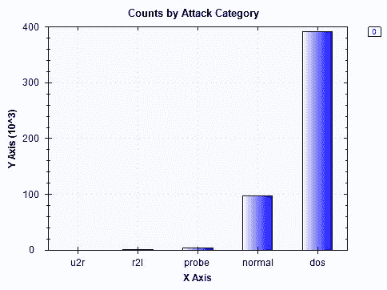

显示每个网络攻击类别发生次数的输出如下所示：

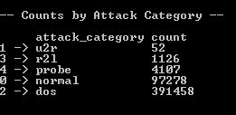

这里有一件事值得注意。数据集中的 DOS 攻击样本比普通样本多。如前所述，我们在本项目中使用的 KDD Cup 1999 数据集是人工和模拟数据，因此，它不能反映现实生活中的情况，正常互联网连接的数量将超过所有其他网络攻击的总和。在以下部分中构建模型时，我们必须记住这一点。

# 分类变量分布

这个数据集中的特征是分类变量和连续变量的混合。例如，名为`duration`的特征表示连接的长度，它是一个连续变量。然而，名为`protocol_type`的特征表示协议的类型，例如`tcp`、`udp`等，是一个分类变量。有关完整的功能说明，您可以访问此链接：[http://kdd.ics.uci.edu/databases/kddcup99/task.html](http://kdd.ics.uci.edu/databases/kddcup99/task.html) 。

在本节中，我们将了解正常连接和恶意连接之间分类变量的分布差异。下面的代码显示了如何将样本集分为两个子组，一个用于正常连接，另一个用于异常连接：

```cs
var attackSubset = featuresDF.Rows[
    featuresDF.GetColumn<string>("attack_category").Where(
        x => !x.Value.Equals("normal")
    ).Keys
];
var normalSubset = featuresDF.Rows[
    featuresDF.GetColumn<string>("attack_category").Where(
        x => x.Value.Equals("normal")
    ).Keys
];
```

现在我们有了这两个子集，让我们开始比较正常连接和恶意连接之间的分类变量分布。让我们首先看一下代码：

```cs
// 2\. Categorical Variable Distribution
string[] categoricalVars =
{
    "protocol_type", "service", "flag", "land"
};
foreach (string variable in categoricalVars)
{
    Console.WriteLine("\n\n-- Counts by {0} --\n", variable);
    Console.WriteLine("* Attack:");
    var attackCountDF = attackSubset.AggregateRowsBy<string, int>(
        new string[] { variable },
        new string[] { "duration" },
        x => x.ValueCount
    );
    attackCountDF.RenameColumns(new string[] { variable, "count" });

    attackCountDF.SortRows("count").Print();

    Console.WriteLine("* Normal:");
    var countDF = normalSubset.AggregateRowsBy<string, int>(
        new string[] { variable },
        new string[] { "duration" },
        x => x.ValueCount
    );
    countDF.RenameColumns(new string[] { variable, "count" });

    countDF.SortRows("count").Print();

    DataBarBox.Show(
        countDF.GetColumn<string>(variable).Values.ToArray(),
        new double[][] 
        {
            attackCountDF["count"].Values.ToArray(),
            countDF["count"].Values.ToArray()
        }
    ).SetTitle(
        String.Format("Counts by {0} (0 - Attack, 1 - Normal)", variable)
    );
}
```

在这段代码中，我们正在迭代一组分类变量：`protocol_type`、`service`、`flag`和`land`。我们将把功能描述推迟到可在以下链接找到的描述页面：[http://kdd.ics.uci.edu/databases/kddcup99/task.html](http://kdd.ics.uci.edu/databases/kddcup99/task.html) 。对于每个分类变量，我们使用`AggregateRowsBy`方法按每种类型的变量进行分组，并统计每种类型的出现次数。我们对正常组进行一次聚合，然后对攻击组进行一次聚合。然后，我们使用`DataBarBox`类显示条形图，以直观地显示分布的差异。让我们来看看一些情节和输出。

以下条形图适用于`protocol_type`功能：

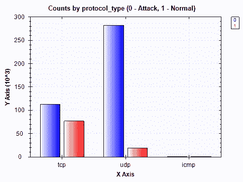

两组之间每种类型的实际计数如下所示：

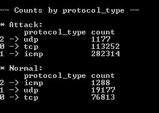

从这些输出中可以看出，正常攻击群和网络攻击群的分布之间存在一些明显的区别。例如，大多数攻击发生在`icmp`和`tcp`协议上，而大多数正常连接发生在`tcp`和`udp`上。

以下条形图适用于`land`功能：


此功能中每种类型的实际计数如下所示：

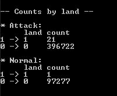

很难说我们是否能从这些结果中推断出任何有意义的见解。对于攻击组和正常组，数据集中几乎所有样本的值均为`0`。让我们看一看另外一个特征。

以下条形图显示了特征`flag`在攻击组和正常组中的分布：

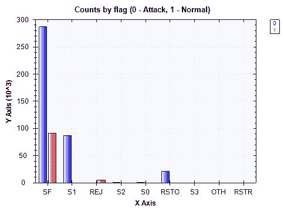

实际计数如下所示：

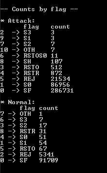

尽管攻击组和正常组最常出现的标志类型为`SF`，但此功能中存在一些明显的区别。似乎旗帜类型`SF`和`REJ`占据了正常组的大部分。另一方面，旗帜类型`SF`、`S0`和`REJ`占据了攻击群的大部分。

# 连续变量分布

到目前为止，我们已经研究了分类变量的分布。现在让我们来看一下功能集中连续变量的分布。与前几章类似，我们将研究每个连续变量的四分位数。为每个连续特征计算四分位数的代码如下所示：

```cs
foreach (string variable in continuousVars)
{
    Console.WriteLine(String.Format("\n\n-- {0} Distribution (Attack) -- ", variable));
    double[] attachQuartiles = Accord.Statistics.Measures.Quantiles(
        attackSubset[variable].DropMissing().ValuesAll.ToArray(),
        new double[] { 0, 0.25, 0.5, 0.75, 1.0 }
    );
    Console.WriteLine(
        "Min: \t\t\t{0:0.00}\nQ1 (25% Percentile): \t{1:0.00}\nQ2 (Median): \t\t{2:0.00}\nQ3 (75% Percentile): \t{3:0.00}\nMax: \t\t\t{4:0.00}",
        attachQuartiles[0], attachQuartiles[1], attachQuartiles[2], attachQuartiles[3], attachQuartiles[4]
    );

    Console.WriteLine(String.Format("\n\n-- {0} Distribution (Normal) -- ", variable));
    double[] normalQuantiles = Accord.Statistics.Measures.Quantiles(
        normalSubset[variable].DropMissing().ValuesAll.ToArray(),
        new double[] { 0, 0.25, 0.5, 0.75, 1.0 }
    );
    Console.WriteLine(
        "Min: \t\t\t{0:0.00}\nQ1 (25% Percentile): \t{1:0.00}\nQ2 (Median): \t\t{2:0.00}\nQ3 (75% Percentile): \t{3:0.00}\nMax: \t\t\t{4:0.00}",
        normalQuantiles[0], normalQuantiles[1], normalQuantiles[2], normalQuantiles[3], normalQuantiles[4]
    );
}
```

变量`continuousVars`定义为以下字符串数组：

```cs
// 3\. Continuous Variable Distribution
string[] continuousVars =
{
    "duration", "src_bytes", "dst_bytes", "wrong_fragment", "urgent", "hot",
    "num_failed_logins", "num_compromised", "root_shell", "su_attempted",
    "num_root", "num_file_creations", "num_shells", "num_access_files",
    "num_outbound_cmds", "count", "srv_count", "serror_rate", "srv_serror_rate",
    "rerror_rate", "srv_rerror_rate", "same_srv_rate", "diff_srv_rate",
    "srv_diff_host_rate", "dst_host_count", "dst_host_srv_count",
    "dst_host_same_srv_rate", "dst_host_diff_srv_rate", "dst_host_same_src_port_rate",
    "dst_host_srv_diff_host_rate", "dst_host_serror_rate", "dst_host_srv_serror_rate",
    "dst_host_rerror_rate", "dst_host_srv_rerror_rate"
};
```

与我们对分类变量分析所做的类似，我们开始迭代前面代码中的连续变量。字符串数组`continuousVars`包含数据集中所有连续特征的列表，我们遍历该数组开始计算每个分布的四分位数。与前几章一样，我们使用`Accord.Statistics.Measures.Quantiles`方法计算四分位数，即最小值、25%百分位数、中位数、75%百分位数和最大值。我们做了两次，一次是针对攻击组，另一次是针对正常组，这样我们就可以看到分布是否有明显的差异。让我们来看看一些特性和它们的分布。

首先，以下输出用于名为`duration`的特征的分布：


从这个输出中，我们可以看到，对于攻击组和正常组，这个特性的大多数值都是`0`。由于这个变量没有太大的差异，我们的模型可能无法从这个特性中学到很多信息。让我们看看另一个特征。

以下输出用于分发名为`dst_bytes`的功能，该功能表示从目标到源的数据字节数：


在这里，我们看到攻击群和正常群之间的分布有一些明显的区别。几乎所有网络攻击的值都为 0，而正常网络连接的值分布范围很广。

最后，以下输出用于名为`wrong_fragment`的功能：

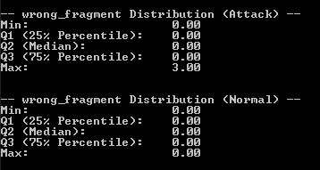

与`duration`特性的情况类似，攻击组和正常组的大多数值都是`0`，这表明我们的模型可能无法从该特性中获得很多见解。您可以运行前面的代码来查看所有其他功能在两个组之间的分布差异。

运行此数据分析步骤的完整代码可在以下链接中找到：[https://github.com/yoonhwang/c-sharp-machine-learning/blob/master/ch.9/DataAnalyzer.cs](https://github.com/yoonhwang/c-sharp-machine-learning/blob/master/ch.9/DataAnalyzer.cs) 。

# 特征工程与 PCA

到目前为止，我们已经分析了目标变量`attack_category`的分布，以及网络攻击数据集中的分类变量和连续变量。在本节中，我们将重点关注对目标变量和分类特征进行编码，并为我们未来的模型构建步骤创建 PCA 特征。

# 目标和分类变量编码

首先，我们必须在目标变量`attack_category`中编码不同的类。如果您回顾上一个数据分析步骤，有五个不同的类别：正常、`dos`、`probe`、`r2l`和`u2r`。我们将用相应的整数表示对这些字符串值进行编码。然后，我们将使用一个热编码对每个分类变量进行编码，如果给定值出现在示例中，则使用 1 进行编码，否则使用 0 进行编码。让我们首先使用以下代码加载在上一个数据分析步骤中创建的已清理数据：

```cs
// Read in the Cyber Attack dataset
// TODO: change the path to point to your data directory
string dataDirPath = @"<path-to-data-dir>";

// Load the data into a data frame
string dataPath = Path.Combine(dataDirPath, "data.csv");
Console.WriteLine("Loading {0}\n\n", dataPath);
var rawDF = Frame.ReadCsv(
    dataPath,
    hasHeaders: true,
    inferTypes: true
);
```

正如您从这段代码中看到的，我们设置了`hasHeaders: true`，因为清理后的数据现在具有与每个列关联的正确标题。下面的代码显示了我们如何对目标变量和分类变量进行编码：

```cs
// Encode Categorical Variables
string[] categoricalVars =
{
    "protocol_type", "service", "flag", "land"
};
// Encode Target Variables
IDictionary<string, int> targetVarEncoding = new Dictionary<string, int>
{
    {"normal", 0},
    {"dos", 1},
    {"probe", 2},
    {"r2l", 3},
    {"u2r", 4}
};

var featuresDF = Frame.CreateEmpty<int, string>();

foreach (string col in rawDF.ColumnKeys)
{
    if(col.Equals("attack_type"))
    {
        continue;
    }
    else if (col.Equals("attack_category"))
    {
        featuresDF.AddColumn(
            col, 
            rawDF.GetColumn<string>(col).Select(x => targetVarEncoding[x.Value])
        );
    }
    else if (categoricalVars.Contains(col))
    {
        var categoryDF = EncodeOneHot(rawDF.GetColumn<string>(col), col);

        foreach (string newCol in categoryDF.ColumnKeys)
        {
            featuresDF.AddColumn(newCol, categoryDF.GetColumn<int>(newCol));
        }
    }
    else
    {
        featuresDF.AddColumn(
            col, 
            rawDF[col].Select((x, i) => double.IsNaN(x.Value) ? 0.0 : x.Value)
        );
    }
}
```

让我们深入地看一下这个代码。我们首先创建了一个字符串数组变量`categoricalVars`，它包含所有分类变量的列名，以及一个字典变量`targetVarEncoding`，它将每个目标类映射为一个整数值。例如，我们将`normal`类编码为`0`，将`dos`攻击类编码为`1`，等等。然后，我们遍历`rawDF`数据帧中的所有列，并开始向新的和空的`featuresDF`添加编码数据。这里需要注意的一点是，我们使用一个助手函数`EncodeOneHot`来编码每个分类变量。让我们看看下面的代码：

```cs
private static Frame<int, string> EncodeOneHot(Series<int, string> rows, string originalColName)
{

    var categoriesByRows = rows.GetAllValues().Select((x, i) =>
    {
        // Encode the categories appeared in each row with 1
        var sb = new SeriesBuilder<string, int>();
        sb.Add(String.Format("{0}_{1}", originalColName, x.Value), 1);

        return KeyValue.Create(i, sb.Series);
    });

    // Create a data frame from the rows we just created
    // And encode missing values with 0
    var categoriesDF = Frame.FromRows(categoriesByRows).FillMissing(0);

    return categoriesDF;
}
```

如果您还记得[第 2 章](02.html# QMFO0-5ebdf09927b7492888e31e8436526470)、*垃圾邮件过滤*和[第 3 章](03.html# 12AK80-5ebdf09927b7492888e31e8436526470)、*推特情绪分析*，这段代码应该很熟悉。在这段代码中，我们迭代每一行，创建一个新的变量，它是原始列名和值的组合，最后创建一个新的 Deedle 数据框，`categoriesDF`。完成此步骤后，此数据帧输出将附加到前面代码中的`featuresDF`。

现在我们已经完成了对目标和分类变量的编码，我们需要导出并存储这个新的数据帧`featuresDF`。我们使用以下代码存储此数据：

```cs
Console.WriteLine("* Exporting feature set...");
featuresDF.SaveCsv(Path.Combine(dataDirPath, "features.csv"));
```

# 拟合主成分分析

利用我们在上一节中刚刚创建的编码数据，让我们开始构建 PCA 特征，我们将在下面的模型构建步骤中用于异常检测。

我们需要做的第一件事是将示例集分为两个单独的集，一个是具有正常连接数据的集，另一个是具有恶意连接的集。当我们创建这些子集时，我们需要在两个组之间创建更真实的分布。如果您还记得上一个数据分析步骤，我们注意到恶意连接比正常连接多，这是不现实的，因为 KDD CUP 1999 数据集是一个人工和手动注入的数据集。除了创建具有更真实数量的正常和恶意连接的数据集之外，我们还需要创建两个子集，以便我们可以仅将 PCA 应用于正常组，然后将其应用于异常组。

这是因为我们只想从普通连接组学习和构建主要组件，并且能够将任何异常值标记为潜在的网络攻击。我们将更详细地讨论如何使用主成分构建异常检测模型。

让我们看看下面的代码，将我们的样本集分成两组：一组为正常组，另一组为网络攻击组：

```cs
// Build PCA with only normal data
var rnd = new Random();

int[] normalIdx = featuresDF["attack_category"]
    .Where(x => x.Value == 0)
    .Keys
    .OrderBy(x => rnd.Next())
    .Take(90000).ToArray();
int[] attackIdx = featuresDF["attack_category"]
    .Where(x => x.Value > 0)
    .Keys
    .OrderBy(x => rnd.Next())
    .Take(10000).ToArray();
int[] totalIdx = normalIdx.Concat(attackIdx).ToArray();
```

从这段代码中可以看出，我们正在通过过滤`attack_category`是`0`（正常）还是大于 0（网络攻击），为正常攻击组和网络攻击组构建索引数组。然后，我们从正常连接中随机选择 90000 个样本，从恶意连接中随机选择 10000 个样本。现在我们有了正常组和异常组的索引，我们将使用以下代码构建用于拟合 PCA 的实际数据：

```cs
var normalSet = featuresDF.Rows[normalIdx];

string[] nonZeroValueCols = normalSet.ColumnKeys.Where(
    x => !x.Equals("attack_category") && normalSet[x].Max() != normalSet[x].Min()
).ToArray();

double[][] normalData = BuildJaggedArray(
    normalSet.Columns[nonZeroValueCols].ToArray2D<double>(), 
    normalSet.RowCount, 
    nonZeroValueCols.Length
);
double[][] wholeData = BuildJaggedArray(
    featuresDF.Rows[totalIdx].Columns[nonZeroValueCols].ToArray2D<double>(),
    totalIdx.Length,
    nonZeroValueCols.Length
);
int[] labels = featuresDF
    .Rows[totalIdx]
    .GetColumn<int>("attack_category")
    .ValuesAll.ToArray();
```

从这段代码中可以看到，`normalData`变量包含所有正常连接样本，`wholeData`变量同时包含正常和网络攻击连接样本。我们将使用`normalData`来拟合 PCA，然后将学习到的 PCA 应用于`wholeData`，如您从以下代码中所见：

```cs
var pca = new PrincipalComponentAnalysis(
    PrincipalComponentMethod.Standardize
);
pca.Learn(normalData);

double[][] transformed = pca.Transform(wholeData);
```

正如在[第 8 章](08.html# 2SG6I0-5ebdf09927b7492888e31e8436526470)、*手写数字识别*中一样，我们使用 Accord.NET 框架中的`PrincipalComponentAnalysis`类来拟合 PCA。一旦我们用正常连接数据训练了 PCA，我们使用`pca`对象的`Transform`方法将其应用于包含正常和网络攻击连接的`wholeData`。

# 主成分分析特征

我们现在只使用普通连接组构建了主组件。让我们简要地检查一下目标类在主成分的不同组合上的分离情况。请看下面的代码：

```cs
double[][] first2Components = transformed.Select(
    x => x.Where((y, i) => i < 2).ToArray()
).ToArray();
ScatterplotBox.Show("Component # 1 vs. Component # 2", first2Components, labels);

double[][] next2Components = transformed.Select(
    x => x.Where((y, i) => i < 3 && i >= 1).ToArray()
).ToArray();
ScatterplotBox.Show("Component # 2 vs. Component # 3", next2Components, labels);

next2Components = transformed.Select(
    x => x.Where((y, i) => i < 4 && i >= 2).ToArray()
).ToArray();
ScatterplotBox.Show("Component # 3 vs. Component # 4", next2Components, labels);

next2Components = transformed.Select(
    x => x.Where((y, i) => i < 5 && i >= 3).ToArray()
).ToArray();
ScatterplotBox.Show("Component # 4 vs. Component # 5", next2Components, labels);

next2Components = transformed.Select(
    x => x.Where((y, i) => i < 6 && i >= 4).ToArray()
).ToArray();
ScatterplotBox.Show("Component # 5 vs. Component # 6", next2Components, labels);
```

正如您从这段代码中看到的，我们一次在两个主成分之间为前六个成分建立散点图。当您运行此代码时，您将看到类似于以下曲线图的曲线图。

第一个图位于第一个主成分和第二个主成分之间，如下所示：


蓝点代表正常连接，其他不同颜色的点代表网络攻击。我们可以看到不同阶级之间的分布有一些区别，但这种模式似乎不太明显。

以下曲线图位于第二和第三部分之间：


最后，以下曲线图位于第三和第四部分之间：

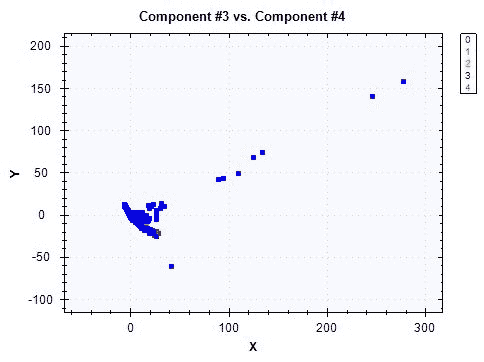

在最后一个情节中，我们看不出不同阶级之间有多少区别。虽然这种模式似乎不是很强，但之前的散点图显示了分布上的一些差异。从视觉上看二维图上的区别尤其困难。如果我们把它带到更高维空间，我们的异常检测模型将要研究的是，模式的差异将变得更加明显。

现在让我们看看主成分解释的方差量。下面的代码显示了如何获得解释的累计方差比例，并将其显示在折线图中：

```cs
double[] explainedVariance = pca.Components
    .Select(x => x.CumulativeProportion)
    .Where(x => x < 1)
    .ToArray();

DataSeriesBox.Show(
    explainedVariance.Select((x, i) => (double)i),
    explainedVariance
).SetTitle("Explained Variance");
System.IO.File.WriteAllLines(
    Path.Combine(dataDirPath, "explained-variance.csv"),
    explainedVariance.Select((x, i) => String.Format("{0},{1:0.0000}", i, x))
);
```

如果您更仔细地查看这段代码，`pca`对象中的`Components`属性包含有关所解释的方差比例的信息。我们可以通过使用`CumulativeProportion`属性迭代每个组件并获得累积比例。一旦我们提取了这些值，我们就可以使用`DataSeriesBox`类来显示一个折线图，显示解释的方差的累积比例。输出如下所示：

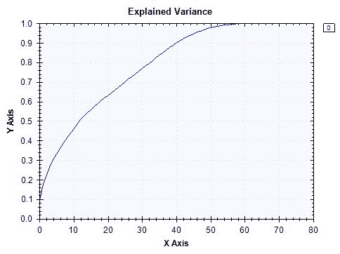

现在，我们已经成功地创建了 PCA 特征，并拥有完整的 PCA 转换数据。您可以使用以下代码导出此数据：

```cs
Console.WriteLine("* Exporting pca-transformed feature set...");
System.IO.File.WriteAllLines(
    Path.Combine(
        dataDirPath,
        "pca-transformed-features.csv"
    ),
    transformed.Select(x => String.Join(",", x))
);
System.IO.File.WriteAllLines(
    Path.Combine(
        dataDirPath,
        "pca-transformed-labels.csv"
    ),
    labels.Select(x => x.ToString())
);
```

特征工程步骤的完整代码可在此链接中找到：[https://github.com/yoonhwang/c-sharp-machine-learning/blob/master/ch.9/FeatureEngineering.cs](https://github.com/yoonhwang/c-sharp-machine-learning/blob/master/ch.9/FeatureEngineering.cs) 。

# 用于异常检测的主成分分类器

我们已经编译了所有内容，现在准备开始为网络攻击检测项目构建异常检测模型。如前所述，我们将使用正态连接群的主成分分布数据，并将其作为主成分的正态范围。对于任何偏离主成分值正常范围的记录，我们将其标记为异常和潜在的网络攻击。

# 培训准备

首先，让我们加载从特征工程步骤创建的特征数据。可以使用以下代码加载 PCA 转换数据和标签数据：

```cs
// Read in the Cyber Attack dataset
// TODO: change the path to point to your data directory
string dataDirPath = @"<path-to-dir>";

// Load the data into a data frame
string dataPath = Path.Combine(dataDirPath, "pca-transformed-features.csv");
Console.WriteLine("Loading {0}\n\n", dataPath);
var featuresDF = Frame.ReadCsv(
    dataPath,
    hasHeaders: false,
    inferTypes: true
);
featuresDF.RenameColumns(
    featuresDF.ColumnKeys.Select((x, i) => String.Format("component-{0}", i + 1))
);

int[] labels = File.ReadLines(
    Path.Combine(dataDirPath, "pca-transformed-labels.csv")
).Select(x => int.Parse(x)).ToArray();
featuresDF.AddColumn("attack_category", labels);
```

让我们快速看一下目标类的分布。每个目标类要计数的代码如下所示：

```cs
var count = featuresDF.AggregateRowsBy<string, int>(
    new string[] { "attack_category" },
    new string[] { "component-1" },
    x => x.ValueCount
).SortRows("component-1");
count.RenameColumns(new string[] { "attack_category", "count" });
count.Print();
```

运行此代码后，您将看到以下输出：

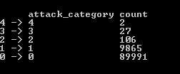

正如预期的那样，大多数样本属于 0 类，这是正常组，其余的组合是我们样本集中的少数（约 10%）。这是对网络攻击更现实的看法。网络攻击发生的频率比正常连接要低。

为了便于说明，我们将使用第一个`27`主成分来解释数据集中约 70%的总体方差。您可以使用不同数量的主成分进行实验，并查看模型性能如何变化。下面的代码显示了我们如何使用第一个`27`主成分创建训练集：

```cs
// First 13 components explain about 50% of the variance
// First 19 components explain about 60% of the variance
// First 27 components explain about 70% of the variance
// First 34 components explain about 80% of the variance
int numComponents = 27;
string[] cols = featuresDF.ColumnKeys.Where((x, i) => i < numComponents).ToArray();

// First, compute distances from the center/mean among normal events
var normalDF = featuresDF.Rows[
    featuresDF["attack_category"].Where(x => x.Value == 0).Keys
].Columns[cols];

double[][] normalData = BuildJaggedArray(
    normalDF.ToArray2D<double>(), normalDF.RowCount, cols.Length
);
```

如果仔细看这段代码，您会注意到我们正在创建的`normalDF`和`normalData`变量只包含正常连接样本。如前所述，我们只想从正态数据中学习，这样我们就可以标记主成分正态范围的任何异常值和极端偏差。在下一节中，我们将使用这些变量构建用于网络攻击检测的主成分分类器。

# 构建主成分分类器

为了构建一个主成分分类器来标记那些偏离正态连接的事件，我们需要计算记录和正态连接分布之间的距离。我们将使用距离度量，**马氏距离**，它测量点和分布之间的距离。对于标准化主成分，如此处所示，计算**马氏距离**的方程式如下：


本式中*C<sub class="calibre111">i</sub>*表示各主成分的值，*var<sub class="calibre111">i</sub>*表示各主成分的方差。让我们来看看下面的例子：


假设您有 5 个主成分，其值如图所示，并且为了简单和演示，假设每个主成分的方差为 1，那么您可以计算出**马氏距离**，如下所示：


本例计算的**马氏距离**为 0.64。有关此距离度量的更详细说明，建议您查看以下 Wikipedia 页面：[https://en.wikipedia.org/wiki/Mahalanobis_distance](https://en.wikipedia.org/wiki/Mahalanobis_distance) 或以下研究论文：[https://users.cs.fiu.edu/~chens/PDF/ICDM03_WS.PDF](https://users.cs.fiu.edu/~chens/PDF/ICDM03_WS.pdf)。

我们将马氏距离方程作为辅助函数`ComputeDistances`实现，如下所示：

```cs
private static double[] ComputeDistances(double[][] data, double[] componentVariances)
{

    double[] distances = data.Select(
        (row, i) => Math.Sqrt(
            row.Select(
                (x, j) => Math.Pow(x, 2) / componentVariances[j]
            ).Sum()
        )
    ).ToArray();

    return distances;
}
```

从这个代码片段中可以看到，`ComputeDistances`方法包含两个参数-`data`和`componentVariances`。变量`data`是我们想要计算距离的二维数组，`componentVariances`变量是从正常网络连接数据中学习的主成分的方差。为了计算主成分的方差，我们使用以下辅助函数：

```cs
private static double[] ComputeVariances(double[][] data)
{
    double[] componentVariances = new double[data[0].Length];

    for (int j = 0; j < data[0].Length; j++)
    {
        componentVariances[j] = data
            .Select((x, i) => Math.Pow(data[i][j], 2))
            .Sum() / data.Length;
    }

    return componentVariances;
}
```

从这个代码片段中可以看到，它正在计算各个列的方差，其中这个二维数组的每一列表示每个主分量。为了计算单个记录与正常网络连接数据分布的距离，我们只需将二维数组传递给辅助函数`ComputeDistances`，如下所示：

```cs
double[] distances = ComputeDistances(normalData);
```

现在我们已经计算了各个记录的距离，让我们分析一下正常连接的范围是如何显示的。我们使用以下代码计算距离的平均值和标准偏差，并使用直方图可视化总体距离分布：

```cs
double meanDistance = distances.Average();
double stdDistance = Math.Sqrt(
    distances
    .Select(x => Math.Pow(x - meanDistance, 2))
    .Sum() / distances.Length
);

Console.WriteLine(
    "* Normal - mean: {0:0.0000}, std: {1:0.0000}",
    meanDistance, stdDistance
);

HistogramBox.Show(
    distances,
    title: "Distances"
)
.SetNumberOfBins(50);
```

运行此代码时，您将看到正常连接的距离度量的平均值和标准偏差的以下输出：


直方图如下所示：

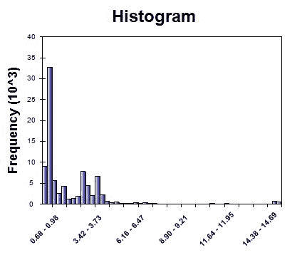

从这些输出中可以看出，大多数距离都非常小，这表明非攻击连接和正常连接通常紧密地聚集在一起。有了这些关于正常连接组中距离分布的信息，让我们开始看看是否可以通过标记超出正常距离范围的某些网络连接来构建检测模型。

以下代码显示了我们如何根据正常网络连接的分布计算网络攻击连接的距离：

```cs
// Detection
var attackDF = featuresDF.Rows[
    featuresDF["attack_category"].Where(x => x.Value > 0).Keys
].Columns[cols];

double[][] attackData = BuildJaggedArray(
    attackDF.ToArray2D<double>(), attackDF.RowCount, cols.Length
);

double[] attackDistances = ComputeDistances(attackData, normalVariances);
```

正如您从这段代码中看到的，我们首先创建了一个名为`attackData`的变量，它包含我们训练集中的所有网络攻击连接。然后，我们使用`ComputeDistances`方法计算网络攻击连接组中各个记录的距离。

现在，我们已经准备好根据刚才计算的距离指标开始标记可疑的网络连接。让我们先看看下面的代码：

```cs
// 5-10% false alarm rate
for (int i = 4; i < 10; i++)
{
    double targetFalseAlarmRate = 0.01 * (i + 1);
    double threshold = Accord.Statistics.Measures.Quantile(
        distances,
        1 - targetFalseAlarmRate
    );

    int[] detected = attackDistances.Select(x => x > threshold ? 1 : 0).ToArray();

    EvaluateResults(attackLabels, detected, targetFalseAlarmRate);
}
```

从这段代码中可以看到，我们根据正常连接组中的距离分布来确定阈值。例如，如果我们的目标是有 5%的虚警率，我们将标记所有与正常范围的距离大于正常连接组内距离分布 95%的连接。更具体地说，在我们的案例中，正常连接距离分布的 95%为 5.45%。因此，在这种情况下，我们将所有与正常范围的距离大于 5.45 的连接标记为网络攻击。我们对 5%到 10%的虚警率重复此过程。我们将在下面的模型评估步骤中更详细地讨论此异常检测模型的性能。

建模步骤的完整代码可在以下链接中找到：[https://github.com/yoonhwang/c-sharp-machine-learning/blob/master/ch.9/Modeling.cs](https://github.com/yoonhwang/c-sharp-machine-learning/blob/master/ch.9/Modeling.cs) 。

# 评估异常检测模型

在前面的模型构建步骤中，我们构建了网络攻击的异常检测模型。在前面的代码中，您可能已经注意到我们正在使用一个名为`EvaluateResults`的函数。这是我们为评估模型性能而编写的辅助函数。让我们看看下面的代码：

```cs
private static void EvaluateResults(int[] attackLabels, int[] detected, double targetFalseAlarmRate)
{
    double overallRecall = (double)detected.Sum() / attackLabels.Length;

    double[] truePositives = new double[4];
    double[] actualClassCounts = new double[4];

    for (int i = 0; i < attackLabels.Length; i++)
    {
        actualClassCounts[attackLabels[i] - 1] += 1.0;

        if (detected[i] > 0)
        {
            truePositives[attackLabels[i] - 1] += 1.0;
        }
    }

    double[] recalls = truePositives.Select((x, i) => x / actualClassCounts[i]).ToArray();

    Console.WriteLine("\n\n---- {0:0.0}% False Alarm Rate ----", targetFalseAlarmRate * 100.0);
    Console.WriteLine("* Overall Attack Detection: {0:0.00}%", overallRecall * 100.0);
    Console.WriteLine(
        "* Detection by Attack Type:\n\t{0}",
        String.Join("\n\t", recalls.Select(
            (x, i) => String.Format("Class {0}: {1:0.00}%", (i + 1), x * 100.0))
        )
    );
}
```

从这段代码中可以看出，我们对两个指标感兴趣：总体网络攻击检测率和每类检测率。评估结果如下：

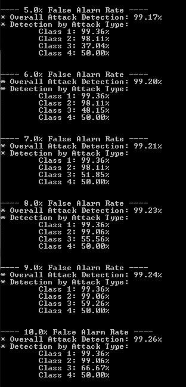

整体结果看起来不错，检测率超过 99%。在 5%的误报率下，约 99.1%的网络攻击被检测到。然而，如果我们仔细观察每类检测率，我们可以看到它们的弱点和优势。在 5%的误报率下，我们的模型能够很好地检测到类别 1 和类别 2，即`dos`和`probe`攻击。另一方面，我们的模型在检测第 3 类和第 4 类攻击方面表现不佳，这两类攻击分别是`r2l`和`u2r`攻击。正如您可以从这个输出中看到的，随着我们增加目标虚警率，总体和每类检测率也会增加。在实际情况中，您必须评估更高的检测率和更高的误报率之间的权衡，并决定满足业务需求的目标误报率。

# 总结

在本章中，我们构建了第一个能够检测网络攻击的异常检测模型。在本章的开头，我们讨论了如何将这种类型的异常检测模型应用到实际情况中，以及开发异常检测模型如何不同于我们迄今为止构建的其他 ML 模型。然后，我们开始分析目标类的分布和各种特征，以便更好地理解数据集。在分析该数据集时，我们还注意到网络攻击样本比正常连接样本多，这在现实生活中是不现实的。为了模拟现实生活中出现异常恶意连接的频率远低于正常连接的情况，我们随机选取正常和恶意连接样本，使 90%的训练集为正常连接，只有 10%为网络攻击示例。

利用这一次选择的训练集，我们对正常连接数据应用主成分分析，找出主成分的正常范围。使用**马氏距离**度量，我们根据正态连接的分布计算各个记录之间的距离。在建模步骤中，我们根据目标虚警率试验了不同的阈值。使用 5%到 10%的误报率，我们建立了网络攻击检测模型并评估了它们的性能。在我们的模型评估步骤中，我们注意到总体检测率超过 99%，而仔细观察每次攻击的检测率可以发现模型的弱点和优势。我们还注意到，随着我们牺牲和提高虚警率，总体网络攻击检测率也有所提高。在应用这种异常检测技术时，有必要了解虚警率和检测率之间的权衡，并根据相关业务需求做出决策。

在下一章中，我们将扩展我们在构建异常检测模型方面的知识和经验。我们将使用信用卡数据集进行信用卡欺诈检测项目。在基于 PCA 的异常检测模型之上，我们将讨论如何使用一类支持向量机进行异常检测。