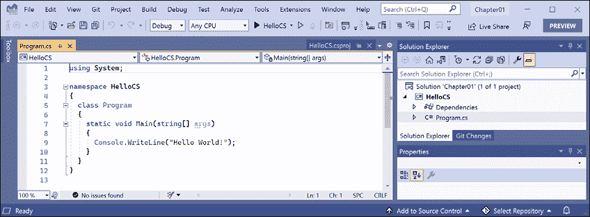
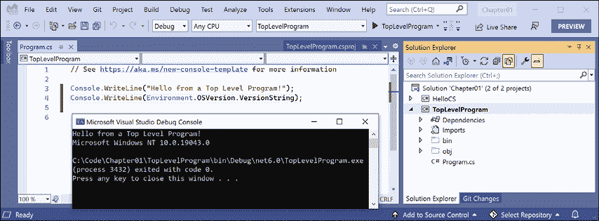
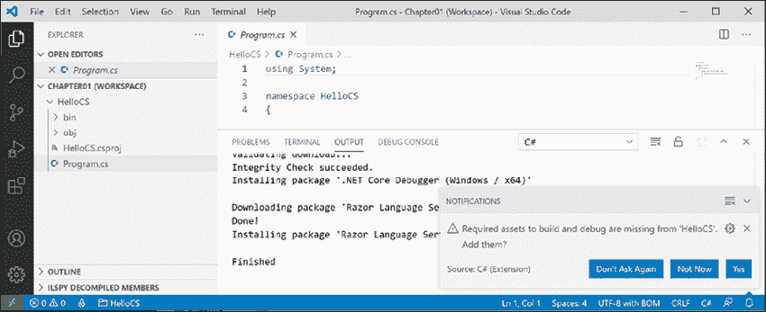
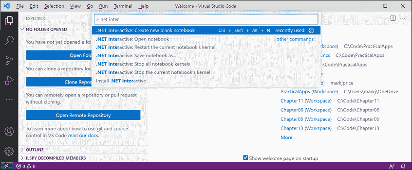
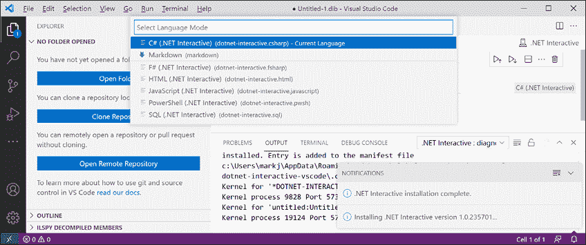
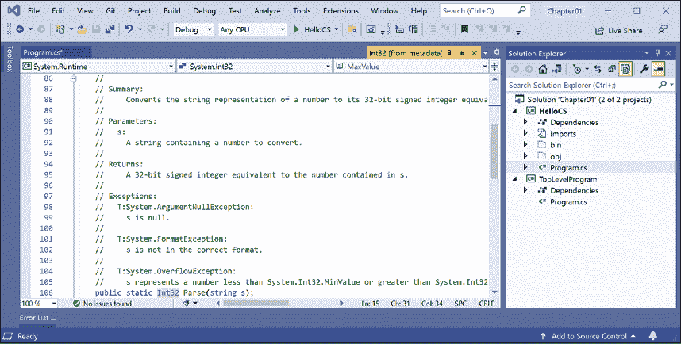
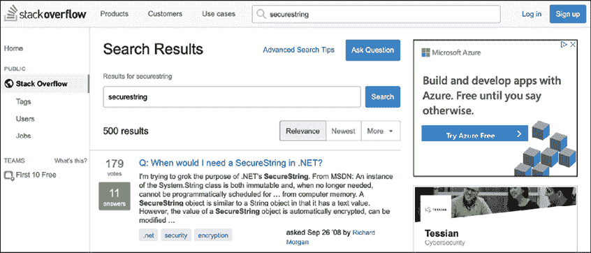

# 一、你好，C#！欢迎使用.NET！

在第一章中，目标是设置开发环境，了解现代.NET、.NETCore、.NET 框架、Mono、Xamarin 和.NET 标准之间的异同，使用 C# 10 和.NET 6 使用各种代码编辑器创建最简单的应用，然后找到寻求帮助的好地方。

本书的 GitHub 存储库提供了针对所有代码任务和笔记本（如果可能）使用完整应用项目的解决方案：

[https://github.com/markjprice/cs10dotnet6](https://github.com/markjprice/cs10dotnet6)

只需按下按钮。（dot）在上面的链接中键入或将`.com`更改为`.dev`，使用 Visual Studio 代码将 GitHub 存储库更改为 Web 的实时编辑器，如*图 1.1*所示：

<figure class="mediaobject"></figure>

图 1.1:VisualStudio 代码，用于在线编辑该书的 GitHub 存储库

在您完成本书的编码任务时，与您选择的代码编辑器一起运行，这非常好。您可以将代码与解决方案代码进行比较，并根据需要轻松复制和粘贴零件。

在本书中，我使用术语**现代.NET**来指代.NET6 及其前身，如.NET5，它们来自.NETCore。我使用术语**legacy.NET**来指代.NET 框架、Mono、Xamarin 和.NET 标准。现代.NET 是那些传统平台和标准的统一。

在第一章之后，本书可分为三个部分：第一，C# 语言的语法和词汇；第二，在.NET 中可用于构建应用功能的类型；第三，可以使用 C# 和.NET 构建的常见跨平台应用示例。

大多数人通过模仿和重复而不是阅读理论的详细解释来学习复杂的话题；因此，我不会对本书中的每一步都进行详细的解释。这样做的目的是让您编写一些代码并看到它运行。

你不需要马上知道所有的细节。这将是随着时间的推移而来的，因为你构建了自己的应用，并且超越了任何一本书所能教给你的。

用 1755 年《英语词典》作者塞缪尔·约翰逊（Samuel Johnson）的话来说，我犯下了“一些疯狂的错误和可笑的荒谬行为，而这些错误和荒谬行为是任何如此复杂的作品都无法避免的。”我对这些负全部责任，并希望你能理解我试图通过写这本关于快速发展的技术（如 C# 和.NET）以及你可以用它们构建的应用的书来应对挑战的挑战。

第一章涵盖以下主题：

*   设置开发环境
*   了解.NET
*   使用 Visual Studio 2022 构建控制台应用
*   使用 Visual Studio 代码构建控制台应用
*   使用.NET 交互式笔记本探索代码
*   查看项目的文件夹和文件
*   充分利用本书的 GitHub 存储库
*   寻求帮助

# 设置开发环境

在开始编程之前，您需要一个 C# 的代码编辑器。微软拥有一系列代码编辑器和**集成开发环境**（**IDEs**），包括：

*   Visual Studio 2022 for Windows
*   Visual Studio 2022 for Mac
*   用于 Windows、Mac 或 Linux 的 Visual Studio 代码
*   GitHub 代码空间

第三方已经创建了自己的 C 代码编辑器，例如 JetBrains Rider。

## 选择合适的学习工具和应用类型

学习 C# 和.NET 的最佳工具和应用类型是什么？

学习时，最好的工具是帮助您编写代码和配置，但不会隐藏真正发生的事情。IDE 提供了易于使用的图形用户界面，但是在下面为您做了什么？一个更基本的代码编辑器，更接近动作，同时提供帮助编写您的代码在学习时会更好。

话虽如此，您可以提出这样的论点：最好的工具是您已经熟悉的工具，或者您或您的团队将用作您的日常开发工具。因此，我希望您可以自由选择任何 C# 代码编辑器或 IDE 来完成本书中的编码任务，包括 Visual Studio 代码、Visual Studio For Windows、Visual Studio For Mac，甚至 JetBrains Rider。

在本书的第三版中，我详细介绍了 VisualStudioforWindows 和 VisualStudio 所有编码任务的代码。不幸的是，这很快变得混乱和混乱。在第六版中，我将在*第 1 章*中详细介绍如何在 Visual Studio 2022 for Windows 和 Visual Studio 代码中创建多个项目。在那之后，我给出了所有工具的项目名称和一般说明，以便您可以使用您喜欢的工具。

学习 C# 语言结构和许多.NET 库的最佳应用类型是不会因不必要的应用代码而分心的应用类型。例如，不需要创建整个 Windows 桌面应用或网站来学习如何编写`switch`语句。

因此，我认为学习*第一章*到*12*中的 C# 和.NET 主题的最佳方法是构建控制台应用。然后，在*第 13 章*至*19*中，您将构建网站、服务以及图形桌面和移动应用。

### .NET 交互式笔记本扩展的优缺点

Visual Studio 代码的另一个好处是.NET 交互式笔记本扩展。这个扩展为编写简单的代码片段提供了一个简单、安全的地方。它使您能够创建一个单独的笔记本文件，其中混合了标记（格式丰富的文本）的“单元格”和使用 C# 和其他相关语言（如 PowerShell、F# 和 SQL（用于数据库）的代码。

然而，.NET 交互式笔记本电脑确实存在一些限制：

*   他们无法读取用户的输入，例如，您不能使用`ReadLine`或`ReadKey`。
*   不能将参数传递给他们。
*   它们不允许您定义自己的名称空间。
*   他们没有任何调试工具（但这些工具将来会出现）。

### 使用 VisualStudio 代码进行跨平台开发

可供选择的最现代、最轻量级的代码编辑器，也是微软唯一一个跨平台的编辑器，是微软 Visual Studio 代码。它可以在所有通用操作系统上运行，包括 Windows、macOS 和多种 Linux，包括 Red Hat Enterprise Linux（RHEL）和 Ubuntu。

VisualStudio 代码是现代跨平台开发的一个很好的选择，因为它有一组广泛且不断增长的扩展来支持 C# 以外的许多语言。

由于具有跨平台和轻量级的特点，它可以安装在您的应用将部署到的所有平台上，以便快速修复错误等等。选择 Visual Studio 代码意味着开发人员可以使用跨平台代码编辑器来开发跨平台应用。

VisualStudio 代码对 web 开发具有强大的支持，尽管它目前对移动和桌面开发的支持较弱。

Visual Studio 代码在 ARM 处理器上受支持，因此您可以在苹果硅计算机和 Raspberry Pi 上进行开发。

Visual Studio 代码是目前最流行的集成开发环境，超过 70%的专业开发人员在 Stack Overflow 2021 调查中选择了它。

### 在云中使用 GitHub 代码空间进行开发

GitHub Codespaces 是一个基于 Visual Studio 代码的完全配置的开发环境，可以在云中托管的环境中旋转，并通过任何 web 浏览器访问。它支持 Git repos、扩展和内置命令行界面，因此您可以从任何设备进行编辑、运行和测试。

### 使用 Visual Studio for Mac 进行一般开发

Microsoft Visual Studio 2022 for Mac可以创建大多数类型的应用，包括控制台应用、网站、web 服务、桌面和移动应用。

要为苹果操作系统（如 iOS）编译应用，以便在 iPhone 和 iPad 等设备上运行，您必须拥有 Xcode，它只在 macOS 上运行。

### 使用 Visual Studio for Windows 进行常规开发

Microsoft Visual Studio 2022 for Windows可以创建大多数类型的应用，包括控制台应用、网站、web 服务、桌面和移动应用。尽管您可以使用 Visual Studio 2022 for Windows 及其 Xamarin 扩展来编写跨平台移动应用，但您仍然需要 macOS 和 Xcode 来编译它。

它仅在 Windows 7 SP1 或更高版本上运行。您必须在 Windows 10 或 Windows 11 上运行它，才能创建从 Microsoft 应用商店安装并在沙箱中运行的**通用 Windows 平台**（**UWP**应用，以保护您的计算机。

### 我用的是什么

为了编写和测试本书的代码，我使用了以下硬件：

*   HP Spectre（英特尔）笔记本电脑
*   苹果硅 Mac 迷你（M1）台式机
*   Raspberry Pi 400（ARM v8）台式机

我使用了以下软件：

*   Visual Studio 代码位于：
    *   苹果 Silicon Mac mini（M1）台式机上的 macOS
    *   HP Spectre（英特尔）笔记本电脑上的 Windows 10
    *   在覆盆子皮 400 上安装 Ubuntu 64
*   Windows 上的 Visual Studio 2022：
    *   HP Spectre（英特尔）笔记本电脑上的 Windows 10
*   Visual Studio 2022 for Mac on:
    *   苹果 Silicon Mac mini（M1）台式机上的 macOS

我希望你也能接触到各种硬件和软件，因为看到平台之间的差异可以加深你对开发挑战的理解，尽管上述任何一种组合都足以学习 C# 和.NET 的基础知识以及如何构建实用的应用和网站。

**更多信息**：通过阅读我在以下链接上写的一篇额外文章，您可以了解如何使用 64 位 Ubuntu 桌面上的 Raspberry Pi 400 编写 C# 和.NET 代码：[https://github.com/markjprice/cs9dotnet5-extras/blob/main/raspberry-pi-ubuntu64/README.md](https://github.com/markjprice/cs9dotnet5-extras/blob/main/raspberry-pi-ubuntu64/README.md) 。

## 跨平台部署

您选择代码编辑器和操作系统进行开发并不限制代码部署的位置。

.NET 6 支持以下平台进行部署：

*   **Windows**：Windows 7 SP1 或更高版本。Windows 10 版本 1607 或更高版本，包括 Windows 11。Windows Server 2012 R2 SP1 或更高版本。Nano 服务器版本 1809 或更高版本。
*   **Mac**：macOS Mojave（10.14 版）或更高版本。
*   **Linux**：Alpine Linux 3.13 或更高版本。CentOS 7 或更高版本。Debian 10 或更高版本。Fedora 32 或更高版本。openSUSE 15 或更高版本。Red Hat Enterprise Linux（RHEL）7 或更高版本。SUSE Enterprise Linux 12 SP2 或更高版本。Ubuntu 16.04、18.04、20.04 或更高版本。
*   **安卓**：API 21 或更高版本。
*   **iOS**：10 或更高版本。

在.NET 5 及更高版本中支持 Windows ARM64 意味着您可以在 Windows ARM 设备（如 Microsoft Surface Pro X）上开发和部署。但在使用 Parallels 和 Windows 10 ARM 虚拟机的 Apple M1 Mac 上开发速度显然是前者的两倍！

## 下载和安装 Visual Studio 2022 for Windows

许多专业 Microsoft 开发人员在日常开发工作中使用 Visual Studio 2022 for Windows。即使如果您选择使用 VisualStudio 代码来完成本书中的编码任务，您也可能需要熟悉自己的 VisualStudio2022 forWindows。

如果您没有 Windows 计算机，则可以跳过本节，继续下一节，您将在 macOS 或 Linux 上下载并安装 Visual Studio 代码。

自 2014 年 10 月以来，微软已经向学生、开源贡献者和个人免费提供了专业质量的 Visual Studio for Windows 版本。它被称为社区版。的任何版本都适合这本书。如果尚未安装，请立即安装：

1.  从以下链接下载适用于 Windows 的Microsoft Visual Studio 2022 17.0 版或更高版本：[https://visualstudio.microsoft.com/downloads/](https://visualstudio.microsoft.com/downloads/) 。
2.  启动安装程序。
3.  在**工作负载**选项卡上，选择以下内容：
    *   **ASP.NET 与 web 开发**
    *   **Azure 开发**
    *   **.NET 桌面开发**
    *   C++开发的桌面开发
    *   **通用 Windows 平台开发**
    *   **使用.NET 进行移动开发**
4.  在**单个组件**选项卡上的**代码工具**部分中，选择以下内容：
    *   **班级设计师**
    *   **Git for Windows**
    *   **先发制人保护-Dotfuscator**
5.  点击**安装**，等待安装程序获取所选软件并安装。
6.  安装完成后，点击**启动**。
7.  第一次运行 Visual Studio 时，系统将提示您登录。如果您有 Microsoft 帐户，则可以使用该帐户。如果您没有，请在以下链接注册一个新的：[https://signup.live.com/](https://signup.live.com/) 。
8.  首次运行Visual Studio 时，系统将提示您配置环境。对于**开发设置**，请选择**Visual C#**。对于颜色主题，我选择了**蓝色**，但是你可以选择任何你喜欢的颜色。
9.  如果要自定义键盘快捷键，请导航至**工具****选项……**，然后选择**键盘**部分。

### Microsoft Visual Studio for Windows 键盘快捷键

在本书中，我将避免显示键盘快捷键，因为它们通常是定制的。如果它们在代码编辑器中是一致的，并且是常用的，我将尝试展示它们。如果您想识别和自定义您的键盘快捷键，则可以，如以下链接所示：[https://docs.microsoft.com/en-us/visualstudio/ide/identifying-and-customizing-keyboard-shortcuts-in-visual-studio](https://docs.microsoft.com/en-us/visualstudio/ide/identifying-and-customizing-keyboard-shortcuts-in-visual-studio) 。

## 下载和安装 Visual Studio 代码

Visual Studio 代码在过去几年中得到了快速改进，并以其受欢迎程度令微软惊喜不已。如果你很勇敢，喜欢生活在最前沿，那么有一个内部版本，它是下一个版本的每日版本。

即使您计划只使用 Visual Studio 2022 for Windows 进行开发，我建议您下载并安装 Visual Studio 代码，并尝试使用它执行本章中的编码任务，然后决定是否在本书的其余部分继续使用 Visual Studio 2022。

现在，让我们下载并安装 Visual Studio 代码、.NET SDK 以及 C# 和.NET 交互式笔记本扩展：

1.  Download and install either the Stable build or the Insiders edition of Visual Studio Code from the following link: [https://code.visualstudio.com/](https://code.visualstudio.com/).

    **更多信息**：如果您在安装 Visual Studio 代码时需要更多帮助，可以通过以下链接阅读官方安装指南：[https://code.visualstudio.com/docs/setup/setup-overview](https://code.visualstudio.com/docs/setup/setup-overview) 。

2.  Download and install the .NET SDKs for versions 3.1, 5.0, and 6.0 from the following link: [https://www.microsoft.com/net/download](https://www.microsoft.com/net/download).

    为了全面了解如何控制.NET SDK，我们需要安装多个版本。NET Core 3.1、.NET 5.0 和.NET 6.0 是当前支持的三个版本。您可以安全地并排安装多个。在本书中，你将学习如何瞄准你想要的目标。

3.  要安装 C# 扩展，必须首先启动 Visual Studio 代码应用。
4.  在 Visual Studio 代码中，单击**扩展**图标或导航到**视图**|**扩展**。
5.  C# 是最流行的扩展之一，因此您应该在列表顶部看到它，或者您可以在搜索框中输入`C# `。
6.  点击**安装**，等待支持包下载安装。
7.  在搜索框中输入`.NET Interactive`以查找**.NET 互动笔记本**分机。
8.  点击**安装**等待安装。

### 安装其他扩展插件

在本书后面的章节中，您将使用更多的扩展。如果要立即安装，我们将使用的所有扩展如下表所示：

<colgroup><col> <col></colgroup> 
| 扩展名和标识符 | 描述 |
| C# 用于 Visual Studio 代码（由 OmniSharp 提供支持）`ms-dotnettools.csharp` | C# 编辑支持，包括语法突出显示、IntelliSense、转到定义、查找所有引用、调试支持.NET 以及支持 Windows、macOS 和 Linux 上的`csproj`项目。 |
| .NET 交互式笔记本电脑`ms-dotnettools.dotnet-interactive-vscode` | 此扩展添加了对在 Visual Studio 代码笔记本中使用.NET Interactive 的支持。它依赖于 Jupyter 扩展（`ms-toolsai.jupyter`。 |
| MSBuild 项目工具`tinytoy.msbuild-project-tools` | 为 MSBuild 项目文件提供 IntelliSense，包括`<PackageReference>`元素的自动完成。 |
| REST 客户端`humao.rest-client` | 发送 HTTP 请求并直接在 Visual Studio 代码中查看响应。 |
| NET 反编译器`icsharpcode.ilspy-vscode` | 反编译 MSIL 程序集–支持现代.NET、.NET Framework、.NET Core 和.NET 标准。 |
| VisualStudio 代码的 Azure 函数`ms-azuretools.vscode-azurefunctions` | 直接从 VS 代码创建、调试、管理和部署无服务器应用。它依赖于 Azure 帐户（`ms-vscode.azure-account`和 Azure 资源（`ms-azuretools.vscode-azureresourcegroups`扩展）。 |
| GitHub 存储库`github.remotehub` | 直接从 VisualStudio 代码中浏览、搜索、编辑和提交任何远程 GitHub 存储库。 |
| 用于 Visual Studio 代码的 SQL Server（mssql）`ms-mssql.mssql` | 用于开发具有丰富功能集的 Microsoft SQL Server、Azure SQL 数据库和 SQL 数据仓库。 |
| Protobuf 3 对 Visual Studio 代码的支持`zxh404.vscode-proto3` | 语法突出显示、语法验证、代码段、代码完成、代码格式、大括号匹配以及行和块注释。 |

### 了解 Microsoft Visual Studio 代码版本

微软几乎每个月都会发布一个新的功能版本的 VisualStudio 代码，并且更频繁地发布 bug 修复版本。例如：

*   版本 1.59，2021 年 8 月功能发布
*   版本 1.59.1，2021 年 8 月错误修复版本

本书中使用的版本是 1.59，但 Microsoft Visual Studio 代码的版本不如您安装的 C# for Visual Studio 代码扩展的版本重要。

虽然不需要 C# 扩展，但它提供了输入时智能感知、代码导航和调试功能，因此安装和更新它非常方便，可以支持最新的 C# 语言功能。

### Microsoft Visual Studio 代码键盘快捷键

在本书中，我将避免显示用于创建新文件等任务的键盘快捷键，因为它们在不同的操作系统上通常是不同的。我将显示键盘快捷键的情况是，例如，在调试过程中，您需要反复按键。这些也更有可能在操作系统之间保持一致。

如果您想为 Visual Studio 代码自定义键盘快捷键，那么您可以，如以下链接所示：[https://code.visualstudio.com/docs/getstarted/keybindings](https://code.visualstudio.com/docs/getstarted/keybindings) 。

我建议您从以下列表中下载操作系统键盘快捷键的 PDF：

*   **视窗**：[https://code.visualstudio.com/shortcuts/keyboard-shortcuts-windows.pdf](https://code.visualstudio.com/shortcuts/keyboard-shortcuts-windows.pdf)
*   **macOS**：[https://code.visualstudio.com/shortcuts/keyboard-shortcuts-macos.pdf](https://code.visualstudio.com/shortcuts/keyboard-shortcuts-macos.pdf)
*   **Linux**：[https://code.visualstudio.com/shortcuts/keyboard-shortcuts-linux.pdf](https://code.visualstudio.com/shortcuts/keyboard-shortcuts-linux.pdf)

# 了解.NET

.NET6、.NETCore、.NETFramework 和 Xamarin 是开发人员用来构建应用和服务的相关和重叠的平台。在本节中，我将向您介绍这些.NET 概念中的每一个。

## 了解.NET 框架

.NET Framework 是一个开发平台，包括一个**公共语言运行库**（**CLR**）和一个**基类库**（**BCL**），后者提供了丰富的类库来构建应用。

微软最初设计的.NET 框架具有跨平台的可能性，但微软将他们的实现努力放在了使其在 Windows 上工作得最好上。

自.NET Framework 4.5.2 以来，它一直是 Windows 操作系统的官方组件。组件与其父产品具有相同的支持，因此 4.5.2 及更高版本遵循安装组件的 Windows 操作系统的生命周期策略。NET Framework 安装在超过 10 亿台计算机上，因此必须尽可能少地进行更改。即使是 bug 修复也可能导致问题，因此它很少更新。

对于.NET Framework 4.0 或更高版本，为.NET Framework 编写的计算机上的所有应用共享相同版本的 CLR 和存储在**全局程序集缓存**（**GAC**中的库），如果其中一些应用需要特定版本的兼容性，则可能会导致问题。

**良好实践**：实际上，.NET Framework 是一个仅限 Windows 的遗留平台。不要使用它创建新的应用。

## 了解 Mono、Xamarin 和 Unity 项目

第三方开发了一个名为**Mono**项目的.NET 框架实现。Mono 是跨平台的，但它远远落后于.NET Framework 的官方实现。

Muno 已经找到了一个小生境作为 To.T1 的基础，XAMARIN PART2 移动平台，以及跨平台游戏开发平台，如损坏 T3。

微软在 2016 年购买了 Xamarin，现在通过 VisualStudio 免费赠送了过去昂贵的 Xamarin 扩展。微软将 Xamarin Studio 开发工具重命名为 Visual Studio for Mac，该工具只能创建移动应用，并使其能够创建其他类型的项目，如控制台应用和 web 服务。通过 Visual Studio 2022 for Mac，Microsoft 已将 Xamarin Studio 编辑器的部分替换为 Visual Studio 2022 for Windows 的部分，以提供更接近同等的体验和性能。Visual Studio 2022 for Mac 也被改写为真正的原生 macOS UI 应用，以提高可靠性并与 macOS 的内置辅助技术配合使用。

## 理解.NETCore

今天，我们生活在一个真正的跨平台世界中，现代移动和云技术的发展使得 Windows 作为一个操作系统的重要性大大降低。正因为如此，微软一直在努力使.NET 与 Windows 的紧密联系脱钩。在将.NET Framework 重写为真正的跨平台时，他们抓住机会重构并删除不再被视为核心的主要部分。

此新产品品牌为.NET Core，包括一个称为 CoreCLR 的 CLR 跨平台实现和一个称为 CoreFX 的简化 BCL。

Microsoft.NET 合作伙伴总监项目经理斯科特·亨特（Scott Hunter）表示，“我们的.NETCore客户中有 40%是该平台的全新开发人员，这正是我们对.NETCore的期望。我们希望引进新的人才。”

.NET Core 是快速移动的，因为它可以与应用并排部署，所以它可以频繁更改，因为知道这些更改不会影响同一台计算机上的其他.NET Core 应用。微软对.NETCore和现代.NET 所做的大多数改进都不能轻易地添加到.NET 框架中。

## 了解到 one.NET 的旅程

在 2020 年 5 月举行的 Microsoft Build 开发者大会上，.NET 团队宣布其统一.NET 的计划被推迟。他们说.NET5 将于 2020 年 11 月 10 日发布，它将统一除移动平台以外的所有.NET 平台。直到 2021 年 11 月的.NET 6，统一的.NET 平台才会支持移动设备。

.NETCore已重命名为.NET，主要版本号已跳过第四个，以避免与.NET Framework 4.x 混淆。微软计划每年 11 月发布年度主要版本，就像苹果每年 9 月发布 iOS 的主要版本一样。

下表显示了现代.NET 的关键版本的发布时间、未来的发布计划以及本书各版本使用的版本：

<colgroup><col> <col> <col> <col></colgroup> 
| 版本 | 释放 | 版本 | 出版 |
| .NETCore RC1 | 2015 年 11 月 | 第一 | 2016 年 3 月 |
| .NETCore 1.0 | 2016 年 6 月 |  |  |
| .NETCore 1.1 | 2016 年 11 月 |  |  |
| .NET Core 1.0.4 和.NET Core 1.1.1 | 2017 年 3 月 | 第二 | 2017 年 3 月 |
| .NETCore 2.0 | 2017 年 8 月 |  |  |
| Windows 10 秋季创建者更新中用于 UWP 的.NETCore | 2017 年 10 月 | 第三 | 2017 年 11 月 |
| .NETCore 2.1（LTS） | 2018 年 5 月 |  |  |
| .NETCore 2.2（当前版本） | 2018 年 12 月 |  |  |
| .NETCore 3.0（当前版本） | 2019 年 9 月 | 第四 | 2019 年 10 月 |
| .NETCore 3.1（LTS） | 2019 年 12 月 |  |  |
| Blazor WebAssembly 3.2（当前版本） | 2020 年 5 月 |  |  |
| .NET 5.0（当前版本） | 2020 年 11 月 | 第五 | 2020 年 11 月 |
| .NET 6.0（LTS） | 2021 年 11 月 | 第六 | 2021 年 11 月 |
| .NET 7.0（当前版本） | 2022 年 11 月 | 第七 | 2022 年 11 月 |
| .NET 8.0（LTS） | 2023 年 11 月 | 第八 | 2023 年 11 月 |

.NETCore3.1 包含用于构建 web 组件的 Blazor 服务器。微软还计划在该版本中加入 Blazor WebAssembly，但推迟了。Blazor WebAssembly 后来作为.NET Core 3.1 的可选附加组件发布。我将它包括在上表中，因为它的版本为 3.2，将其从.NET Core 3.1 的 LTS 中排除。

## 了解.NET 支持

.NET 版本为**长期支持**（**LTS**）或**当前版本**，如下表所示：

*   **LTS**版本稳定，在其生命周期内需要的更新更少。对于不打算频繁更新的应用，这些是一个很好的选择。LTS 发行版将在正式发行后 3 年内提供支持，或在下一个 LTS 发行版发布后 1 年内提供支持，以时间较长者为准。
*   **当前**版本包含可能根据反馈而改变的特性。对于您正在积极开发的应用来说，这是一个很好的选择，因为它们提供了对最新改进的访问。在 6 个月的维护期后，或在正式提供 18 个月后，将不再支持以前的次要版本。

为了安全性和可靠性，两人在其整个生命周期中都会收到关键修复。您必须使用最新的补丁程序才能获得支持。例如，如果系统正在运行 1.0，并且 1.0.1 已经发布，则需要安装 1.0.1 以获得支持。

为了更好地了解您对当前版本和 LTS 版本的选择，可以直观地看到它，LTS 版本有 3 年长的黑色条，当前版本有可变长度的灰色条，它们在新的主要或次要版本（它们保留支持）后的 6 个月内以交叉阴影结束，如图 1.2 所示：

<figure class="mediaobject"></figure>

图 1.2：对各种版本的支持

例如，如果您使用.NET Core 3.0 创建了一个项目，那么当微软在 2019 年 12 月发布.NET Core 3.1 时，您必须在 2020 年 3 月之前将您的项目升级到.NET Core 3.1。（在.NET5 之前，当前版本的维护期只有三个月。）

如果您需要 Microsoft 的长期支持，那么现在就选择.NET 6.0，坚持到.NET 8.0，即使 Microsoft 发布了.NET 7.0。这是因为.NET7.0 将是当前版本，因此它将在.NET6.0 之前失去支持。请记住，即使是 LTS 版本，您也必须升级到 bug fix 版本，如 6.0.1。

除以下列表中所示的版本外，.NET Core 和 modern.NET 的所有版本都已过期：

*   .NET 5.0 将于 2022 年 5 月到期。
*   .NET Core 3.1 将于 2022 年 12 月 3 日到期。
*   .NET 6.0 将于 2024 年 11 月到期。

### 了解.NET 运行时和.NET SDK 版本

.NET 运行时版本控制遵循语义版本控制，也就是说，一个大的增量表示破坏性的更改，小的增量表示新功能，补丁增量表示错误修复。

.NET SDK 版本控制不遵循语义版本控制。主版本号和次版本号与匹配的运行时版本相关联。修补程序编号遵循一种约定，表示 SDK 的主要版本和次要版本。

您可以在下表中看到这方面的示例：

<colgroup><col> <col> <col></colgroup> 
| 改变 | 运行时 | SDK |
| 首次发布 | 6.0.0 | 6.0.100 |
| SDK 错误修复 | 6.0.0 | 6.0.101 |
| 运行时和 SDK 错误修复 | 6.0.1 | 6.0.102 |
| SDK 新功能 | 6.0.1 | 6.0.200 |

### 删除.NET 的旧版本

.NET 运行时更新与主要版本（如 6.x）兼容，.NET SDK 的更新版本保持了构建针对运行时早期版本的应用的能力，从而可以安全删除旧版本。

您可以使用以下命令查看当前安装了哪些 SDK 和运行时：

*   `dotnet --list-sdks`
*   `dotnet --list-runtimes`

在 Windows 上，使用**应用&功能**部分删除.NET SDK。在 macOS 或 Windows 上，使用`dotnet-core-uninstall`工具。默认情况下不安装此工具。

例如，在编写第四版时，我每月都使用以下命令：

```cs
dotnet-core-uninstall remove --all-previews-but-latest --sdk 
```

## 现代.NET 有什么不同？

现代.NET 是模块化的，而传统的.NET 框架是单片的。它是开源的，微软在开源环境下做出改进和改变的决定。微软特别致力于改进现代.NET 的性能。

由于删除了遗留和非跨平台技术，因此它比.NET Framework 的上一个版本小。例如，Windows 窗体和 Office T1、Windows 演示文稿基础 To2 T2（例如，To3T.WPF OutT4）等工作负载可用于构建 AutoT5 图形用户 AutoT6A. Ty7T7 接口 ToY-T8（AutoT99GUI OutT10^）应用，但它们与 Windows 生态系统紧密绑定，因此它们不包含在 OT1111 中。在 macOS 和 Linux 上使用.NET。

### Windows 开发

现代.NET 的一个功能是支持使用 Windows 桌面包运行旧的 Windows 窗体和 WPF 应用，Windows 桌面包包含在.NET Core 3.1 或更高版本的 Windows 中，这就是为什么它比适用于 macOS 和 Linux 的 SDK 更大的原因。如有必要，您可以对旧版 Windows 应用进行一些小更改，然后为.NET 6 重新构建它，以利用新功能和性能改进。

### 网络开发

ASP.NET Web 窗体和 Windows 通信基金会（WCF）是旧的 Web 应用和服务技术，开发人员选择用于开发新开发项目的机会更少，因此它们也被从 NET.NET 中删除。相反，开发人员更喜欢使用 ASP.NET MVC、ASP.NET Web API、SignalR 和 gRPC。这些技术已被重构并组合成一个在现代.NET 上运行的平台，名为 ASP.NETCore。您将在*第 14 章*、*使用 ASP.NETCore剃须刀页面构建网站*、*第 15 章*、*使用模型-视图-控制器模式构建网站*、*第 16 章*、*构建和使用 Web 服务*中了解相关技术*第 18 章**建设和消费专业服务*。

**更多信息**：一些.NET Framework 开发人员对现代.NET 中缺少 ASP.NET Web 表单、WCF 和 Windows 工作流（WF）感到不安，并希望 Microsoft 改变主意。有一些开源项目支持 WCF 和 WF 迁移到现代.NET。您可以通过以下链接阅读更多内容：[https://devblogs.microsoft.com/dotnet/supporting-the-community-with-wf-and-wcf-oss-projects/](https://devblogs.microsoft.com/dotnet/supporting-the-community-with-wf-and-wcf-oss-projects/) 。Blazor Web 表单组件的开源项目位于以下链接：[https://github.com/FritzAndFriends/BlazorWebFormsComponents](https://github.com/FritzAndFriends/BlazorWebFormsComponents) 。

### 数据库开发

**实体框架**（**EF**6 是一种对象关系映射技术，旨在处理存储在关系数据库（如 Oracle 和 Microsoft SQL Server）中的数据。多年来，它一直是个累赘，因此跨平台的API 已被精简，支持 Microsoft Azure Cosmos DB 等非关系型数据库，并被重命名为实体框架核心。您将在*第 10 章**中学习如何使用实体框架核心*处理数据。

如果现有应用使用旧 EF，则.NET Core 3.0 或更高版本支持 6.3 版。

## 现代.NET 的主题

微软已经用 Blazor 创建了一个网站，展示了现代.NET 的主题：[https://themesof.net/](https://themesof.net/) 。

## 理解.NET 标准

2019 年.NET 的情况是微软控制了三个分叉的.NET 平台，如下表所示：

*   **.NETCore**：用于跨平台和新应用
*   **.NET Framework**：用于遗留应用
*   **Xamarin**：用于移动应用

每个都有优点和缺点，因为它们都是针对不同的场景设计的。这导致了开发人员必须学习三种平台的问题，每种平台都有令人讨厌的怪癖和局限性。

正因为如此，微软定义了.NET 标准——所有.NET 平台都可以实现的一组 API 规范，以表明它们的兼容性水平。例如，基本支持由符合.NET 标准 1.4 的平台表示。

在.NET 标准 2.0 及更高版本中，微软将所有三个平台集中在一个现代的最低标准上，这使得开发人员更容易在任何风格的.NET 之间共享代码。

对于.NET Core 2.0 及更高版本，这增加了大多数缺少的 API，开发人员需要将为.NET Framework编写的旧代码移植到跨平台的.NET Core。但是，有些 API 是实现的，但会抛出一个异常，以向开发人员表明不应该实际使用它们！这通常是由于运行.NET 的操作系统不同造成的。您将在*第 2 章*中学习如何处理这些异常，*讲 C#。*

理解.NET 标准只是一个标准是很重要的。您不能像安装 HTML5 那样安装.NET 标准。要使用 HTML5，必须安装实现 HTML5 标准的 web 浏览器。

要使用.NET 标准，必须安装实现.NET 标准规范的.NET 平台。最后一个.NET 标准版本 2.1 是由.NETCore3.0、Mono 和 Xamarin 实现的。C# 8.0 的某些功能需要.NET 标准 2.1。NET 标准 2.1 不是由.NET Framework 4.8 实现的，因此我们应该将.NET Framework 视为遗留。

随着.NET 6 在 2021 年 11 月的发布，对.NET 标准的需求大大减少，因为现在所有平台（包括移动平台）都有一个.NET。NET 6 有一个 BCL 和两个 CLR：CoreCLR 针对服务器或桌面场景（如网站和 Windows 桌面应用）进行了优化，Mono 运行时针对资源有限的移动和 web 浏览器应用进行了优化。

即使是现在，也需要支持为.NET Framework 创建的应用和网站，因此必须了解，您可以创建与传统.NET 平台向后兼容的.NET 标准 2.0 类库。

## 本书版本使用的.NET 平台和工具

在 2016 年 3 月编写的本书第一版中，我重点介绍了.NET Core 功能，但在.NET Core 中尚未实现重要或有用的功能时使用了.NET Framework，因为这是在.NET Core 1.0 最终版本之前。大多数示例都使用 Visual Studio 2015，仅简要显示了 Visual Studio 代码。

第二版（几乎）完全清除了所有.NET Framework 代码示例，因此读者能够专注于真正跨平台运行的.NETCore示例。

第三版完成了切换。它被重写了，所以所有的代码都是纯.NETCore。但为所有任务提供 Visual Studio 代码和 Visual Studio 2017 的分步说明增加了复杂性。

第四版延续了这一趋势，只展示了使用 VisualStudio 代码进行编码的示例，但最后两章除外。在*第 20 章*中*构建 Windows 桌面应用*中，使用了运行在 Windows 10 上的 Visual Studio；在*第 21 章*中*构建跨平台移动应用*中，使用了 Mac 上的 Visual Studio。

在第五版中，*第 20 章**构建 Windows 桌面应用*被移至*附录 B*，为新的*第 20 章**使用 Blazor*构建 Web 用户界面腾出空间。Blazor 项目可以使用 VisualStudio 代码创建。

在第六版中，*第 19 章**使用.NET 毛伊岛*构建移动和桌面应用进行了更新，以展示如何使用 Visual Studio 2022 和**.NET 毛伊岛**（**多平台应用界面**创建移动和桌面跨平台应用。

到第七版和.NET7 发布时，VisualStudio 代码将有一个扩展来支持.NETMAUI。此时，读者将能够对本书中的所有示例使用 VisualStudio 代码。

## 理解中间语言

`dotnet`CLI 工具使用的 C# 编译器（名为**Roslyn**）将您的 C# 源代码转换为**中间语言**（**IL**代码），并将 IL 存储在**程序集**（DLL 或 EXE 文件）中。IL 代码语句类似于汇编语言指令，由.NET 的虚拟机 CoreCLR 执行。

在运行时，CoreCLR 从程序集加载IL 代码，**实时**（**JIT**编译器将其编译为本机 CPU 指令，然后由您机器上的 CPU 执行。

此两步编译过程的好处是，Microsoft 可以为 Linux 和 macOS 以及 Windows 创建 CLR。由于第二个编译步骤，相同的 IL 代码到处运行，该步骤为本机操作系统和 CPU 指令集生成代码。

不管源代码是用哪种语言编写的，例如 C#、Visual Basic 或 F#，所有.NET 应用都使用 IL 代码作为存储在程序集中的指令。Microsoft 和其他公司提供了可以打开程序集并显示此 IL 代码的反汇编工具，如 ILSpy.NET 反编译器扩展。

## 比较.NET 技术

我们可以总结并比较今天的.NET 技术，如下表所示：

<colgroup><col> <col> <col></colgroup> 
| 技术 | 描述 | 主机操作系统 |
| 现代.NET | 一个现代化的功能集，完全支持 C# 8、9 和 10，用于移植现有应用或创建新的桌面、移动和 web 应用和服务 | Windows、macOS、Linux、Android、iOS |
| .NET 框架 | 传统功能集，有限的 C# 8 支持，没有 C# 9 或 10 支持，仅用于维护现有应用 | 仅限窗口 |
| 沙马林 | 仅限移动和桌面应用 | 安卓、iOS、macOS |

# 使用 Visual Studio 2022 构建控制台应用

本节的目标是展示如何使用Visual Studio 2022 for Windows 构建控制台应用。

如果您没有 Windows 计算机或希望使用 Visual Studio 代码，则可以跳过此部分，因为代码相同，只是工具体验不同。

## 使用 Visual Studio 2022 管理多个项目

VisualStudio2022 有一个名为**解决方案**的概念，允许您同时打开和管理多个项目。我们将使用一个解决方案来管理您将在本章中创建的两个项目。

## 使用 VisualStudio2022 编写代码

让我们开始编写代码吧！

1.  启动 VisualStudio2022。
2.  在开始窗口中，点击**新建项目**。
3.  In the **Create a new project** dialog, enter `console` in the **Search for templates** box, and select **Console Application**, making sure that you have chosen the C# project template rather than another language, such as F# or Visual Basic, as shown in *Figure 1.3*:

    <figure class="mediaobject"></figure>

    图 1.3：选择控制台应用项目模板

4.  点击**下一步**。
5.  In the **Configure your new project** dialog, enter `HelloCS` for the project name, enter `C:\Code` for the location, and enter `Chapter01` for the solution name, as shown in *Figure 1.4*:

    <figure class="mediaobject"></figure>

    图 1.4：为新项目配置名称和位置

6.  Click **Next**.

    我们有意使用.NET5.0 的旧项目模板来查看完整控制台应用的外观。在下一节中，您将使用.NET6.0 创建一个控制台应用，并查看发生了哪些更改。

7.  在**附加信息**对话框中，在**目标框架**下拉列表中，记录当前和长期支持版本的.NET 选择，然后选择**.NET 5.0（当前）**并点击**创建**。
8.  In **Solution Explorer**, double-click to open the file named `Program.cs`, and note that **Solution Explorer** shows the **HelloCS** project, as shown in *Figure 1.5*:

    <figure class="mediaobject"></figure>

    图 1.5：在 Visual Studio 2022 中编辑 Program.cs

9.  在`Program.cs`中，修改第 9 行，使写入控制台的文本显示为`Hello, C#!`

## 使用 VisualStudio 编译和运行代码

下一个任务是编译并运行代码。

1.  在 Visual Studio 中，导航到**调试****启动而不调试**。
2.  The output in the console window will show the result of running your application, as shown in *Figure 1.6*:

    <figure class="mediaobject"></figure>

    图 1.6：在 Windows 上运行控制台应用

3.  按任意键关闭控制台窗口并返回 Visual Studio。
4.  Select the **HelloCS** project and then, in the **Solution Explorer** toolbar, toggle on the **Show All Files** button, and note that the compiler-generated `bin` and `obj` folders are visible, as shown in *Figure 1.7*:

    <figure class="mediaobject"></figure>

    图 1.7：显示编译器生成的文件夹和文件

### 了解编译器生成的文件夹和文件

创建了两个编译器生成的文件夹，分别命名为`obj`和`bin`。您不需要查看这些文件夹或了解它们的文件。请注意，编译器需要创建临时文件夹和文件来完成其工作。您可以删除这些文件夹及其文件，以后可以重新创建它们。开发人员通常这样做是为了“清理”项目。Visual Studio 甚至在名为**Clean Solution**的**构建**菜单上有一个命令，可以为您删除一些临时文件。Visual Studio 代码的等效命令为`dotnet clean`。

*   `obj`文件夹为每个源代码文件包含一个编译的*对象*文件。这些对象尚未链接到最终的可执行文件中。
*   `bin`文件夹包含应用或类库的*二进制*可执行文件。我们将在*第 7 章*、*打包和分发.NET 类型*中对此进行更详细的介绍。

## 编写顶级程序

您可能会认为只是为了输出`Hello, C#!`而编写了很多代码。

虽然样板代码是通过项目模板为您编写的，但有没有更简单的方法？

在 C# 9 或更高版本中，有，被称为**顶级程序**。

让我们比较一下由项目模板创建的控制台应用，如下代码所示：

```cs
using System;
namespace HelloCS
{
  class Program
  {
    static void Main(string[] args)
    {
      Console.WriteLine("Hello World!");
    }
  }
} 
```

到新的顶级程序最小控制台应用，如下代码所示：

```cs
using System;
Console.WriteLine("Hello World!"); 
```

这要简单得多，对吗？如果您必须从一个空白文件开始，自己编写所有语句，这会更好。但是它是如何工作的呢？

在编译过程中，所有用于定义名称空间的样板代码、`Program`类及其`Main`方法都会生成，并围绕您编写的语句进行包装。

顶级课程需要记住的要点包括以下列表：

*   任何`using`语句都必须放在文件的顶部。
*   一个项目中只能有一个这样的文件。

文件顶部的`using System;`语句导入`System`名称空间。这使得`Console.WriteLine`语句能够工作。在下一章中，您将了解有关名称空间的更多信息。

## 使用 Visual Studio 2022 添加第二个项目

让我们在解决方案中添加第二个项目，以探索顶级计划：

1.  在 Visual Studio 中，导航到**文件****添加****新项目**。
2.  在**新增项目**对话框中，在**近期项目模板**中，选择**控制台应用【C#】**，然后点击**下一步**。
3.  在**配置新项目**对话框中，对于**项目名称**，输入`TopLevelProgram`，将位置保留为`C:\Code\Chapter01`，然后点击**下一步**。
4.  在**附加信息**对话框中，选择**.NET 6.0（长期支持）**，然后点击**创建**。
5.  在**解决方案浏览器**中，在`TopLevelProgram`项目中双击`Program.cs`打开。
6.  在`Program.cs`中，请注意，代码仅由一条注释和一条语句组成，因为它使用了 C# 9 中引入的顶级程序功能，如以下代码所示：

    ```cs
    // See https://aka.ms/new-console-template for more information
    Console.WriteLine("Hello, World!"); 
    ```

但是当我早些时候介绍顶级程序的概念时，我们需要一个`using System;`语句。我们为什么不需要这个？

### 隐式导入的名称空间

诀窍是我们仍然需要来导入`System`名称空间，但是现在我们可以使用 C# 10 中引入的一个特性来完成。让我们看看如何：

1.  在**解决方案浏览器**中，选择`TopLevelProgram`项目并切换**显示所有文件**按钮，注意编译器生成的`bin`和`obj`文件夹可见。
2.  展开`obj`文件夹，展开`Debug`文件夹，展开`net6.0`文件夹，打开名为`TopLevelProgram.GlobalUsings.g.cs`的文件。
3.  Note that this file is automatically created by the compiler for projects that target .NET 6, and that it uses a feature introduced in C# 10 called **global imports** that imports some commonly used namespaces like `System` for use in all code files, as shown in the following code:

    ```cs
    // <autogenerated />
    global using global::System;
    global using global::System.Collections.Generic;
    global using global::System.IO;
    global using global::System.Linq;
    global using global::System.Net.Http;
    global using global::System.Threading;
    global using global::System.Threading.Tasks; 
    ```

    我将在下一章中详细解释此功能。现在，请注意.NET5 和.NET6 之间的一个重要变化是，许多项目模板（如控制台应用的模板）使用新的语言功能来隐藏真正发生的事情。

4.  在`TopLevelProgram`项目中，在`Program.cs`中修改语句，输出不同的消息和操作系统版本，如下代码所示：

    ```cs
    Console.WriteLine("Hello from a Top Level Program!");
    Console.WriteLine(Environment.OSVersion.VersionString); 
    ```

5.  在**解决方案浏览器**中，右键点击**第 01 章**解决方案，选择**设置启动项目……**，设置**当前选择**，然后点击**确定**。
6.  在**解决方案资源管理器**中，点击**TopLevelProgram**项目（或其中的任何文件或文件夹），请注意 Visual Studio 将项目名称加粗表示**TopLevelProgram**现在是启动项目。
7.  Navigate to **Debug** | **Start Without Debugging** to run the **TopLevelProgram** project, and note the result, as shown in *Figure 1.8*:

    <figure class="mediaobject"></figure>

    图 1.8：在带有两个 Windows 项目的 Visual Studio 解决方案中运行顶级程序

# 使用 Visual Studio 代码构建控制台应用

本节的目标是展示如何使用 VisualStudio 代码构建控制台应用。

如果您不想尝试 Visual Studio 代码或.NET 交互式笔记本，请跳过本节和下一节，然后继续进行*查看项目的文件夹和文件*部分。

本节中的说明和屏幕截图均适用于 Windows，但相同的操作将适用于 macOS 和 Linux 变体上的 Visual Studio 代码。

主要区别在于本机命令行操作，如删除文件：在 Windows 或 macOS 和 Linux 上，命令和路径可能不同。幸运的是，`dotnet`命令行工具在所有平台上都是相同的。

## 使用 Visual Studio 代码管理多个项目

Visual Studio 代码有一个名为**工作区**的概念，允许您同时打开和管理多个项目。我们将使用一个工作区来管理您将在本章中创建的两个项目。

## 使用 VisualStudio 代码编写代码

让我们开始编写代码吧！

1.  启动 VisualStudio 代码。
2.  确保没有任何打开的文件、文件夹或工作区。
3.  导航至**文件****将工作区另存为……**。
4.  在该对话框中，导航到 macOS 上的用户文件夹（我的文件夹名为`markjprice`）、Windows 上的`Documents`文件夹，或任何要保存项目的目录或驱动器。
5.  点击**新建文件夹**按钮，将文件夹命名为`Code`。（如果已完成 Visual Studio 2022 的部分，则此文件夹将已存在。）
6.  在`Code`文件夹中，创建一个名为`Chapter01-vscode`的新文件夹。
7.  在`Chapter01-vscode`文件夹中，将工作区另存为`Chapter01.code-workspace`。
8.  导航到**文件****将文件夹添加到工作区…**或点击**添加文件夹**按钮。
9.  在`Chapter01-vscode`文件夹中，创建一个名为`HelloCS`的新文件夹。
10.  选择`HelloCS`文件夹，点击**添加**按钮。
11.  Navigate to **View** | **Terminal**.

    我们有意使用.NET5.0 的旧项目模板来查看完整控制台应用的外观。在下一节中，您将使用.NET6.0 创建一个控制台应用，并查看发生了哪些更改。

12.  在**终端**中，确保您在`HelloCS`文件夹中，然后使用`dotnet`命令行工具创建一个新的针对.NET 5.0 的控制台应用，如下命令所示：

    ```cs
    dotnet new console -f net5.0 
    ```

13.  You will see that the `dotnet` command-line tool creates a new **Console Application** project for you in the current folder, and the **EXPLORER** window shows the two files created, `HelloCS.csproj` and `Program.cs`, and the `obj` folder, as shown in *Figure 1.9*:

    <figure class="mediaobject"></figure>

    图 1.9:EXPLORER 窗口将显示已经创建了两个文件和一个文件夹

14.  In **EXPLORER**, click on the file named `Program.cs` to open it in the editor window. The first time that you do this, Visual Studio Code may have to download and install C# dependencies like OmniSharp, .NET Core Debugger, and Razor Language Server, if it did not do this when you installed the C# extension or if they need updating. Visual Studio Code will show progress in the **Output** window and eventually the message `Finished`, as shown in the following output:

    ```cs
    Installing C# dependencies...
    Platform: win32, x86_64
    Downloading package 'OmniSharp for Windows (.NET 4.6 / x64)' (36150 KB).................... Done!
    Validating download...
    Integrity Check succeeded.
    Installing package 'OmniSharp for Windows (.NET 4.6 / x64)'
    Downloading package '.NET Core Debugger (Windows / x64)' (45048 KB).................... Done!
    Validating download...
    Integrity Check succeeded.
    Installing package '.NET Core Debugger (Windows / x64)'
    Downloading package 'Razor Language Server (Windows / x64)' (52344 KB).................... Done!
    Installing package 'Razor Language Server (Windows / x64)'
    Finished 
    ```

    前面的输出来自 Windows 上的 Visual Studio 代码。在 macOS 或 Linux 上运行时，输出看起来略有不同，但会下载并安装操作系统的等效组件。

15.  Folders named `obj` and `bin` will have been created and when you see a notification saying that required assets are missing, click **Yes**, as shown in *Figure 1.10*:

    <figure class="mediaobject"></figure>

    图 1.10：添加所需构建和调试资产的警告消息

16.  如果在与通知交互之前通知消失，则可以单击状态栏最右角的钟形图标再次显示该通知。
17.  几秒钟后，将创建另一个名为`.vscode`的文件夹，其中包含 Visual Studio 代码用于在调试期间提供 IntelliSense 等功能的一些文件，您将在*第 4 章*、*编写、调试和测试功能*中了解更多信息。
18.  In `Program.cs`, modify line 9 so that the text that is being written to the console says `Hello, C#!`

    **良好实践**：导航至**文件****自动保存**。此切换将省去每次重新构建应用之前记得保存的麻烦。

## 使用 dotnet CLI 编译和运行代码

下一个任务是编译并运行代码：

1.  导航至**视图****终端**并输入以下命令：

    ```cs
    dotnet run 
    ```

2.  **终端**窗口中的输出将显示您运行应用的结果，如*图 1.11*：

    <figure class="mediaobject"></figure>

    所示

图 1.11：运行第一个控制台应用的输出

## 使用 Visual Studio 代码添加第二个项目

让我们将第二个项目添加到我们的工作区，以探索顶级程序：

1.  在 Visual Studio 代码中，导航到**文件****将文件夹添加到工作区…**。
2.  在`Chapter01-vscode`文件夹中，使用**新建文件夹**按钮创建一个名为`TopLevelProgram`的新文件夹，选中后点击**添加**。
3.  导航至**终端****新终端**，并在出现的下拉列表中选择**TopLevelProgram**。或者，在**浏览器**中，右键点击`TopLevelProgram`文件夹，然后选择**在集成终端**中打开。
4.  In **TERMINAL**, confirm that you are in the `TopLevelProgram` folder, and then enter the command to create a new console application, as shown in the following command:

    ```cs
    dotnet new console 
    ```

    **良好实践**：使用工作区时，在**终端**中输入命令时要小心。在输入具有潜在破坏性的命令之前，请确保您位于正确的文件夹中！这就是为什么我让您在发出创建新控制台应用的命令之前为`TopLevelProgram`创建一个新的终端。

5.  导航至**视图****命令调色板**。
6.  输入`omni`，然后在出现的下拉列表中选择**OmniSharp：选择项目**。
7.  In the drop-down list of two projects, select the **TopLevelProgram** project, and when prompted, click **Yes** to add required assets to debug.

    **良好实践**：要启用调试和其他有用功能，如代码格式化和转到定义，您必须告诉 OmniSharp 您正在 Visual Studio 代码中积极处理的项目。通过单击状态栏左侧火焰图标右侧的项目/文件夹，可以快速切换活动项目。

8.  在**浏览器**中，在`TopLevelProgram`文件夹中选择`Program.cs`，然后将现有语句更改为输出不同的消息，并输出操作系统版本字符串，如下代码所示：

    ```cs
    Console.WriteLine("Hello from a Top Level Program!");
    Console.WriteLine(Environment.OSVersion.VersionString); 
    ```

9.  在**终端**中，输入运行程序的命令，如下命令所示：

    ```cs
    dotnet run 
    ```

10.  Note the output in the **TERMINAL** window, as shown in *Figure 1.12*:

    <figure class="mediaobject"></figure>

    图 1.12：在带有两个 Windows 项目的 Visual Studio 代码工作区中运行顶级程序

如果要在 macOS Big Sur 上运行该程序，则环境操作系统会有所不同，如以下输出所示：

```cs
Hello from a Top Level Program!
Unix 11.2.3 
```

## 使用 Visual Studio 代码管理多个文件

如果要同时处理多个文件，则可以在编辑时将它们并排放置：

1.  在**资源管理器**中，展开两个项目。
2.  打开两个项目中的两个`Program.cs`文件。
3.  单击、按住并拖动其中一个打开文件的“编辑窗口”选项卡，对其进行排列，以便可以同时查看这两个文件。

# 使用.NET 交互式笔记本探索代码

.NET 交互式笔记本电脑使编写代码比顶级程序更容易。它需要 Visual Studio 代码，因此如果您之前没有安装它，请现在安装。

## 创建笔记本

首先，我们需要创建一个笔记本：

1.  在 Visual Studio 代码中，关闭所有打开的工作空间或文件夹。
2.  导航至**视图****命令调色板**。
3.  Type `.net inter`, and then select **.NET Interactive: Create new blank notebook**, as shown in *Figure 1.13*:

    <figure class="mediaobject"></figure>

    图 1.13：创建新的空白.NET 笔记本

4.  When prompted to select the file extension, choose **Create as '.dib'**.

    `.dib`是微软定义的一种实验性文件格式，以避免与的混淆和兼容性问题。`ipynb`Python 交互式笔记本使用的格式。该文件扩展名在历史上仅适用于 Jupyter 笔记本电脑，它可以在笔记本电脑文件（NB）中包含数据、Python 代码（PY）和输出的交互（I）组合。在.NET 交互式笔记本电脑中，这一概念已经扩展到允许混合使用 C#、F#、SQL、HTML、JavaScript、Markdown 和其他语言。`.dib`是 polyglot，表示支持混合语言。支持`.dib`和`.ipynb`文件格式之间的转换。

5.  选择**C#**作为笔记本中代码单元的默认语言。
6.  如果有更新版本的.NET Interactive 可用，您可能需要等待它卸载旧版本并安装新版本。导航至**查看****输出**并在下拉列表中选择**.NET 交互：诊断**。请耐心点。笔记本显示可能需要几分钟，因为它必须为.NET 启动一个托管环境。如果几分钟后什么也没有发生，请关闭 Visual Studio 代码并重新启动它。
7.  下载并安装.NET Interactive Notebook 扩展后，**输出**窗口诊断将显示内核进程已启动（您的进程和端口号将与下面的输出不同），如以下输出所示，该输出已编辑以节省空间：

    ```cs
    Extension started for VS Code Stable.
    ...
    Kernel process 12516 Port 59565 is using tunnel uri http://localhost:59565/ 
    ```

## 在笔记本中编写和运行代码

接下来，我们可以在笔记本单元中编写代码：

1.  The first cell should already be set to **C# (.NET Interactive)**, but if it is set to anything else, then click the language selector in the bottom-right corner of the code cell and then select **C# (.NET Interactive)** as the language mode for that cell, and note your other choices of language for a code cell, as shown in *Figure 1.14*:

    <figure class="mediaobject"></figure>

    图 1.14：更改.NET 交互式笔记本中代码单元的语言

2.  在**C#（.NET Interactive）**代码单元格中，输入一条语句以向控制台输出消息，注意不需要像在完整应用中通常那样以分号结束语句，如以下代码所示：

    ```cs
    Console.WriteLine("Hello, .NET Interactive!") 
    ```

3.  Click the **Execute Cell** button to the left of the code cell and note the output that appears in the gray box under the code cell, as shown in *Figure 1.15*:

    <figure class="mediaobject"></figure>

    图 1.15：在笔记本中运行代码并查看以下输出

## 保存笔记本

像其他文件一样，我们应该先保存笔记本，然后再继续：

1.  导航至**文件****另存为……**。
2.  切换到`Chapter01-vscode`文件夹，将笔记本另存为`Chapter01.dib`。
3.  关闭`Chapter01.dib`编辑器选项卡。

## 向笔记本添加降价和特殊命令

我们可以使用特殊的命令混合和匹配包含标记和代码的单元格：

1.  导航到**文件****打开文件…**，选择`Chapter01.dib`文件。
2.  如果系统提示您使用`Do you` `trust the authors of these files?`，请点击**打开**。
3.  将鼠标悬停在代码块上方，点击**+标记**添加标记单元格。
4.  键入标题级别 1，如以下标记所示：

    ```cs
    # Chapter 1 - Hello, C#! Welcome, .NET!
    Mixing *rich* **text** and code is cool! 
    ```

5.  Click the tick in the top-right corner of the cell to stop editing the cell and view the processed Markdown.

    如果您的单元格顺序错误，则可以拖放以重新排列它们。

6.  将鼠标悬停在标记单元格和代码单元格之间，然后单击**+代码**。
7.  键入特殊命令以输出.NET Interactive 的版本信息，如下代码所示：

    ```cs
    #!about 
    ```

8.  Click the **Execute Cell** button and note the output, as shown in *Figure 1.16*:

    <figure class="mediaobject"></figure>

    图 1.16：在.NET 交互式笔记本中混合标记、代码和特殊命令

## 在多个单元格中执行代码

当笔记本中有多个代码单元格时，必须先执行前面的代码单元格，然后才能在后续代码单元格中使用它们的上下文：

1.  在笔记本底部，添加一个新的代码单元格，然后键入一条语句来声明一个变量并分配一个整数值，如下代码所示：

    ```cs
    int number = 8; 
    ```

2.  在笔记本底部添加一个新的代码单元格，然后键入一条语句输出`number`变量，如下代码所示：

    ```cs
    Console.WriteLine(number); 
    ```

3.  Note the second code cell does not know about the `number` variable because it was defined and assigned in another code cell, aka context, as shown in *Figure 1.17*:

    <figure class="mediaobject"></figure>

    图 1.17:number 变量在当前单元格或上下文中不存在

4.  In the first cell, click the **Execute Cell** button to declare and assign a value to the variable, and then in the second cell, click the **Execute Cell** button to output the `number` variable, and note that this works. (Alternatively, in the first cell, you can click the **Execute Cell and Below** button.)

    **良好实践**：如果您在两个单元格之间拆分了相关代码，请记住在执行下一个单元格之前先执行前一个单元格。在笔记本顶部，有以下按钮—**清除输出**和**全部运行**。这些非常方便，因为您可以单击其中一个，然后单击另一个，以确保所有代码单元都正确执行，只要它们的顺序正确。

## 使用.NET 交互式笔记本获取本书中的代码

在剩下的章节中，我不会给出使用笔记本的明确说明，但是本书的 GitHub 存储库在适当的时候有解决方案笔记本。我预计许多读者会希望运行我预先创建的笔记本，以实现*第 2 章*至*第 12 章*中所述的语言和库功能，他们希望在不必编写完整应用的情况下看到并了解这些功能，即使它只是一个控制台应用：

[https://github.com/markjprice/cs10dotnet6/tree/main/notebooks](https://github.com/markjprice/cs10dotnet6/tree/main/notebooks)

# 查看项目的文件夹和文件

在本章中，您创建了两个名为`HelloCS`和`TopLevelProgram`的项目。

Visual Studio 代码使用工作区文件管理多个项目。Visual Studio 2022 使用解决方案文件来管理多个项目。您还创建了一个.NET 交互式笔记本。

其结果是文件夹结构和文件将在后续章节中重复，尽管只有两个以上的项目，如*图 1.18*所示：

<figure class="mediaobject"></figure>

图 1.18：本章中两个项目的文件夹结构和文件

## 了解常见的文件夹和文件

尽管`.code-workspace`和`.sln`文件不同，但对于 Visual Studio 2022 和 Visual Studio 代码，项目文件夹和文件如`HelloCS`和`TopLevelProgram`是相同的。这意味着如果您愿意，您可以在两个代码编辑器之间进行混合和匹配：

*   在 Visual Studio 2022 中，打开解决方案后，导航到**文件****添加现有项目…**以添加由其他工具创建的项目文件。
*   In Visual Studio Code, with a workspace open, navigate to **File** | **Add Folder to Workspace…** to add a project folder created by another tool.

    **良好实践**：虽然源代码（如`.csproj`和`.cs`文件）是相同的，但编译器自动生成的`bin`和`obj`文件夹可能有不匹配的文件版本，导致错误。如果要同时在 Visual Studio 2022 和 Visual Studio 代码中打开同一项目，请在其他代码编辑器中打开该项目之前删除临时`bin`和`obj`文件夹。这就是为什么我在本章中要求您为 VisualStudio 代码解决方案创建一个不同的文件夹。

## 了解 GitHub 上的解决方案代码

本书 GitHub 存储库中的解决方案代码包括 Visual Studio 代码、Visual Studio 2022 和.NET 交互式笔记本文件的单独文件夹，如下表所示：

*   Visual Studio 2022 解决方案：[https://github.com/markjprice/cs10dotnet6/tree/main/vs4win](https://github.com/markjprice/cs10dotnet6/tree/main/vs4win)
*   Visual Studio 代码解决方案：[https://github.com/markjprice/cs10dotnet6/tree/main/vscode](https://github.com/markjprice/cs10dotnet6/tree/main/vscode)
*   .NET Interactive Notebook solutions: [https://github.com/markjprice/cs10dotnet6/tree/main/notebooks](https://github.com/markjprice/cs10dotnet6/tree/main/notebooks)

    **良好实践**：如果需要，请返回本章，提醒自己如何在您选择的代码编辑器中创建和管理多个项目。GitHub 存储库中有四个代码编辑器（适用于 Windows 的 Visual Studio 2022、适用于 Mac 的 Visual Studio 代码、适用于 Mac 的 Visual Studio 2022 和 JetBrains Rider）的分步说明，以及其他屏幕截图：[https://github.com/markjprice/cs10dotnet6/blob/main/docs/code-editors/](https://github.com/markjprice/cs10dotnet6/blob/main/docs/code-editors/) 。

# 充分利用本书的 GitHub 存储库

Git 是一个常用的源代码管理系统。GitHub 是一个公司、网站和桌面应用，它使 Git 的管理变得更容易。微软在 2018 年收购了 GitHub，因此它将继续与微软工具进行更紧密的集成。

我为这本书创建了一个 GitHub 存储库，并将其用于以下用途：

*   存储可在打印出版日期后维护的书籍的解决方案代码。
*   提供扩展本书的额外材料，如勘误表修正、小的改进、有用链接列表以及无法放入印刷本中的较长文章。
*   如果读者对这本书有疑问，可以提供一个与我联系的地方。

## 对这本书提出问题

如果您无法按照本书中的任何说明进行操作，或者发现解决方案中的文本或代码有错误，请在 GitHub 存储库中提出问题：

1.  使用您喜爱的浏览器导航到以下链接：[https://github.com/markjprice/cs10dotnet6/issues](https://github.com/markjprice/cs10dotnet6/issues) 。
2.  点击**新发行**。
3.  输入尽可能多的细节，以帮助我诊断问题。例如：
    1.  您的操作系统，例如 Windows 11 64 位或 macOS Big Sur 11.2.3 版。
    2.  您的硬件，例如 Intel、Apple Silicon 或 ARM CPU。
    3.  您的代码编辑器，例如 Visual Studio 2022、Visual Studio 代码或其他内容，包括版本号。
    4.  尽可能多的代码和配置是相关的和必要的。
    5.  对预期行为和经历的行为的描述。
    6.  屏幕截图（如果可能）。

写这本书对我来说是一件次要的事。我有一份全职工作，所以周末我大部分时间都在看书。这意味着我不能总是对问题立即做出反应。但我希望我所有的读者都能在我的书上取得成功，所以如果我能不费吹灰之力地帮助你（和其他人），那么我将很乐意这样做。

## 给我反馈

如果你想给我更多关于这本书的一般性反馈，那么 GitHub 存储库`README.md`页面有一些调查的链接。你可以匿名提供反馈，或者如果你想得到我的回复，那么你可以提供一个电子邮件地址。我将只使用此电子邮件地址回答您的反馈。

我喜欢听我的读者讲述他们喜欢我的书的哪些方面，以及改进建议，以及他们如何使用 C# 和.NET，所以不要害羞。请联系！

提前感谢您的深思熟虑和建设性反馈。

## 从 GitHub 存储库下载解决方案代码

我使用 GitHub 存储贯穿各章的所有动手、分步编码示例的解决方案，以及每章末尾的实践练习。您将在以下链接中找到存储库：[https://github.com/markjprice/cs10dotnet6](https://github.com/markjprice/cs10dotnet6) 。

如果只想下载所有解决方案文件而不使用 Git，点击绿色**代码**按钮，然后选择**下载 ZIP**，如*图 1.19*所示：

<figure class="mediaobject"></figure>

图 1.19：将存储库下载为 ZIP 文件

我建议您将前面的链接添加到您最喜欢的书签中，因为我还使用本书的 GitHub 存储库来发布勘误表（更正）和其他有用的链接。

## 将 Git 与 Visual Studio 代码和命令行一起使用

Visual Studio 代码支持 Git，但它将使用您的操作系统的 Git 安装，因此您必须先安装 Git 2.0 或更高版本，然后才能获得这些功能。

您可以通过以下链接安装 Git：[https://git-scm.com/download](https://git-scm.com/download) 。

如果您喜欢使用 GUI，可以从以下链接下载 GitHub Desktop:[https://desktop.github.com](https://desktop.github.com) 。

### 克隆图书解决方案代码存储库

让我们克隆图书解决方案代码库。在下面的步骤中，您将使用 Visual Studio 代码终端，但您可以在任何命令提示符或终端窗口中输入命令：

1.  在您的用户或`Documents`文件夹中，或您希望存储 Git 存储库的任何位置，创建一个名为`Repos-vscode`的文件夹。
2.  在 Visual Studio 代码中，打开`Repos-vscode`文件夹。
3.  导航至**视图****终端**，输入以下命令：

    ```cs
    git clone https://github.com/markjprice/cs10dotnet6.git 
    ```

4.  Note that cloning all the solutions for all of the chapters will take a minute or so, as shown in *Figure 1.20*:

    <figure class="mediaobject"></figure>

    图 1.20：使用 Visual Studio 代码克隆图书解决方案代码

# 寻求帮助

本节介绍如何查找有关 web 编程的高质量信息。

## 阅读 Microsoft 文档

获取 Microsoft 开发者工具和平台帮助的最终资源是 Microsoft 文档，您可以在以下链接找到它：[https://docs.microsoft.com/](https://docs.microsoft.com/) 。

## 获取 dotnet 工具的帮助

在命令行中，您可以向`dotnet`工具寻求有关其命令的帮助：

1.  要在浏览器窗口中打开`dotnet new`命令的正式文档，请在命令行或 Visual Studio 代码终端中输入以下内容：

    ```cs
    dotnet help new 
    ```

2.  要在命令行获得帮助输出，请使用`-h`或`--help`标志，如以下命令所示：

    ```cs
    dotnet new console -h 
    ```

3.  您将看到以下部分输出：

    ```cs
    Console Application (C#)
    Author: Microsoft
    Description: A project for creating a command-line application that can run on .NET Core on Windows, Linux and macOS
    Options:
      -f|--framework. The target framework for the project.
                          net6.0           - Target net6.0
                          net5.0           - Target net5.0
                          netcoreapp3.1\.   - Target netcoreapp3.1
                          netcoreapp3.0\.   - Target netcoreapp3.0
                      Default: net6.0
    --langVersion    Sets langVersion in the created project file text – Optional 
    ```

## 获取类型及其成员的定义

代码编辑器最有用的功能之一是**转到定义**。它在 Visual Studio 代码和 Visual Studio 2022 中提供。它将通过读取已编译程序集中的元数据来显示类型或成员的公共定义。

有些工具，如 ILSpy.NET 反编译器，甚至会为您将元数据和 IL 代码反向工程回 C#。

让我们看看如何使用**进入定义**功能：

1.  在 Visual Studio 2022 或 Visual Studio 代码中，打开名为`Chapter01`的解决方案/工作区。
2.  在`HelloCS`项目中，在`Program.cs`中，在`Main`中，输入以下语句来声明一个名为`z`的整数变量：

    ```cs
    int z; 
    ```

3.  在`int`内点击，然后右键点击并选择**进入定义**。
4.  In the code window that appears, you can see how the `int` data type is defined, as shown in *Figure 1.21*:

    <figure class="mediaobject"></figure>

    图 1.21:int 数据类型元数据

    您可以看到`int`：

    *   使用`struct`关键字定义
    *   在`System.Runtime`组件中
    *   在`System`命名空间中
    *   名称为`Int32`
    *   因此是`System.Int32`类型的别名
    *   实现接口，如`IComparable`
    *   其最大值和最小值为常量
    *   有`Parse`等方法

    **良好实践**：当您尝试在 Visual Studio 代码中使用**转到定义**时，您有时会看到一个错误，称为**未找到定义**。这是因为 C# 扩展不知道当前项目。要解决此问题，请导航到**视图****命令调色板**，输入`omni`，选择**OmniSharp:选择项目**，然后选择要使用的项目。

    现在，**转到定义**功能对您没有多大用处，因为您还不知道所有这些信息的含义。

    在本书第一部分的结尾，包括*章节**2*到*6*，教你关于 C# 的知识，你将知道足够多的知识，这一功能变得非常方便。

5.  In the code editor window, scroll down to find the `Parse` method with a single `string` parameter on line 106, and the comments that document it on lines 86 to 105, as shown in *Figure 1.22*:

    <figure class="mediaobject"></figure>

    图 1.22：带有字符串参数的 Parse 方法的注释

在评论中，您将看到微软已经记录了以下内容：

*   描述该方法的摘要。
*   可以传递给方法的参数，如`string`值。
*   方法的返回值，包括其数据类型。
*   如果调用此方法，可能会出现三个异常，包括`ArgumentNullException`、`FormatException`和`OverflowException`。现在，我们知道我们可以选择将对该方法的调用封装在一个`try`语句中，并捕获哪些异常。

希望你已经迫不及待地想知道这一切意味着什么！

再耐心一点。本章即将结束，在下一章中，您将深入了解 C# 语言的细节。但首先，让我们看看你还能在哪里寻求帮助。

## 正在寻找有关堆栈溢出的答案

Stack Overflow 是最受欢迎的第三方网站，用于获取编程难题的答案。它非常流行，像 DuckDuckGo 这样的搜索引擎有一种特殊的方式来编写查询来搜索网站：

1.  启动您喜爱的 web 浏览器。
2.  Navigate to [DuckDuckGo.com](https://duckduckgo.com/), enter the following query, and note the search results, which are also shown in *Figure 1.23*:

    ```cs
     !so securestring 
    ```

    <figure class="mediaobject"></figure>

    图 1.23:securestring 的堆栈溢出搜索结果

## 使用谷歌搜索答案

您可以使用高级搜索选项搜索谷歌，以增加找到所需内容的可能性：

1.  导航到谷歌。
2.  使用一个简单的谷歌查询来搜索关于`garbage collection`的信息，注意在你看到维基百科对计算机科学中垃圾收集的定义之前，你可能会在你所在的地区看到很多垃圾收集服务的广告。
3.  通过将搜索限制在一个有用的站点，如堆栈溢出，并通过删除我们可能不关心的语言，如 C++、RIST 和 Python，或者通过显式添加 C~*和.NET 来改进搜索，如下面的搜索查询：

## 订阅官方的.NET 博客

为了跟上.NET 的最新发展，需要订阅的一个优秀的博客是由.NET 工程团队编写的官方.NET 博客，您可以在以下链接找到它：[https://devblogs.microsoft.com/dotnet/](https://devblogs.microsoft.com/dotnet/) 。

## 观看斯科特·汉斯曼的视频

微软的斯科特·汉斯曼（Scott Hanselman）在 YouTube 上有一个很好的频道，介绍他们没有教你的电脑知识：[http://computerstufftheydidntteachyou.com/](http://computerstufftheydidntteachyou.com/) 。

我向所有使用计算机的人推荐它。

# 实践与探索

现在，让我们试着回答一些问题，进行一些实际操作，并更详细地讨论本章涵盖的主题，以此来测试您的知识和理解。

## 练习 1.1–测试你的知识

试着回答以下问题，记住尽管大部分答案都可以在本章中找到，但您应该做一些在线调查或编写代码来回答其他问题：

1.  VisualStudio2022 比 VisualStudio 代码好吗？
2.  .NET6 比.NETFramework 好吗？
3.  什么是.NET 标准？为什么它仍然很重要？
4.  为什么程序员可以使用不同的语言，例如 C 和 F 来编写在.NET 上运行的应用？
5.  .NET 控制台应用的入口点方法的名称是什么？应如何声明？
6.  什么是顶级程序？如何访问任何命令行参数？
7.  在提示符处键入什么来构建和执行 C# 源代码？
8.  使用.NET 交互式笔记本编写 C 代码有哪些好处？
9.  你会在哪里寻找 C# 关键字的帮助？
10.  Where would you look for solutions to common programming problems?

    *附录**关于测试你的知识问题的答案*，可从 GitHub 存储库自述文件中的链接下载：[https://github.com/markjprice/cs10dotnet6](https://github.com/markjprice/cs10dotnet6) 。

## 练习 1.2–随时随地练习 C#

Windows 或 Mac 不需要 Visual Studio 代码，甚至不需要 Visual Studio 2022 来编写 C#。您可以访问.NET 小提琴-[https://dotnetfiddle.net/](https://dotnetfiddle.net/) -并开始在线编码。

## 练习 1.3–探索主题

一本书是一种精心策划的经历。我试图在印刷本中找到适当的主题平衡。我写的其他内容可以在本书的 GitHub 存储库中找到。

我相信这本书涵盖了 C# 和.NET 开发人员应该拥有或应该知道的所有基本知识和技能。最好将一些较长的示例作为 Microsoft 文档或第三方文章作者的链接。

使用以下页面上的链接了解有关本章所涵盖主题的更多详细信息：

[https://github.com/markjprice/cs10dotnet6/blob/main/book-links.md# chapter-1---hello-c-welcome-net](https://github.com/markjprice/cs10dotnet6/blob/main/book-links.md# chapter-1---hello-c-welcome-net)

# 总结

在本章中，我们：

*   设置您的开发环境。
*   讨论了现代.NET、.NETCore、.NET 框架、Xamarin 和.NET 标准之间的异同。
*   使用 Visual Studio 代码和.NET SDK 以及 Visual Studio 2022 for Windows 创建一些简单的控制台应用。
*   使用.NET 交互式笔记本执行学习代码片段。
*   了解了如何从 GitHub 存储库下载本书的解决方案代码。
*   最重要的是，学会了如何寻求帮助。

在下一章中，您将学习如何“说”C。