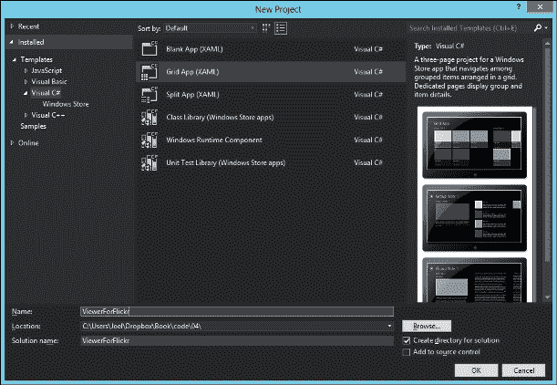
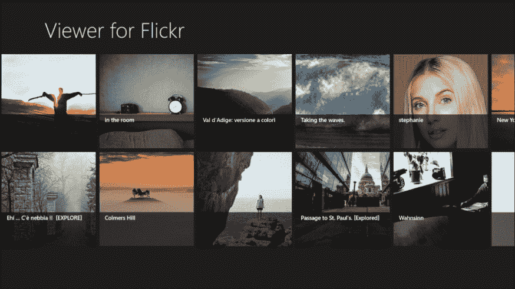

# 第四章。创建窗口商店应用程序

在本书的前半部分，我们研究了如何设置您的开发环境来利用 C# 5.0，看了一下 C#的历史和发展，并回顾了最新版本中您可以使用的新功能。在本章(以及本书的其余部分)中，我们将看一些您可以使用这些功能的实际应用。

本章将引导您创建一个 Windows 商店应用程序。该应用将在新的 Windows 运行时环境中运行，该环境可以针对 x86 和 ARM 架构。在本章中，我们将创建一个 Windows Store 应用程序，通过互联网连接到一个基于 HTTP 的 web 服务并解析 JSON，并在 XAML 页面中显示结果。

完成本章后，您将拥有一个完整的工作项目，可以作为自己应用程序的基础。然后，您可以将该应用程序上传到窗口商店，并有可能从销售中赚钱。

# 制作 Flickr 浏览器

我们将要创建的项目是一个浏览图像的应用程序。作为来源，我们将使用热门图片网站[http://flickr.com](http://flickr.com)。


选择这个作为我们的项目有几个原因。首先，Flickr 提供了一个广泛的网络应用编程接口来浏览他们网站的各个部分，所以这是一个访问数据仓库的简单方法。其次，很多时候你会发现自己正在通过互联网访问外部数据，所以这是一个如何在本地应用程序中处理这种访问的很好的例子。最后，图片是很好的眼中钉，所以应用程序最终会成为你可以炫耀的东西。

## 启动项目

如果你使用的是 Visual Studio Express，那么你必须使用的是 Windows 8 的名为 VS Express 的版本。我们从如下截图所示的**新项目**对话框创建一个新的窗口商店应用程序开始这个过程:



选择**空白应用(XAML)** 项目模板，该模板为您提供创建应用所需的最低要求。你当然应该感到被鼓励使用其他模板来创建项目，看看一些常见的用户界面范例是如何创建的，比如网格应用。但目前，空白的应用程序模板让事情变得简单。

## 连接到 Flickr

现在我们已经有了我们的项目结构，我们可以通过首先连接到 Flickr API 来开始项目。一旦你在 Flickr 上创建了一个用户帐户，你就可以在[http://www.flickr.com/services/api/](http://www.flickr.com/services/api/)访问应用编程接口文档。

一定要浏览文档，了解可能的情况。一旦你准备好继续，获取他们的数据的一个关键因素将是提供一个应用编程接口密钥，申请获得一个非常容易——只需在【http://www.flickr.com/services/apps/create/apply/】的[访问申请表](http://www.flickr.com/services/apps/create/apply/)。

申请一个非商业密钥，然后提供关于你要构建的应用的信息(名称、描述等)。

一旦您完成了应用程序，您将获得两条数据:应用编程接口密钥和应用编程接口秘密。的 Windows RT 版本。NET 框架包含许多不同之处。对于习惯于使用常规桌面版框架的开发人员来说，其中一个不同之处是缺少配置系统。因此，虽然 C#开发人员习惯于在`app.config`文件中输入静态配置值，比如一个 API Key，但是我们在这里不能这样做，因为这些 API 在 WinRT 应用程序中根本不可用。对于完整配置系统的简单模拟，我们可以创建一个静态类来包含常数，并使它们易于访问。

我们从向`DataModel`命名空间添加一个新类开始。如果项目还没有包含它，只需添加一个名为`DataModel`的文件夹，然后添加一个新的类，其内容如下:

```cs
namespace ViewerForFlickr.DataModel
{
    public static class Constants
    {
        public static readonly string ApiKey = "<The API Key>";
        public static readonly string ApiSecret = "<The API Secret>";
    }
}
```

当然，在上面写着`<The API Key>`和`<The API Secret>`的地方，你应该用分配给你自己账户的密钥和秘密来代替。

接下来，我们需要一种通过互联网访问应用编程接口的方法。因为 C# 5.0 中新增了`async`功能，所以这个非常简单。将另一个名为`WebHelper`的类添加到`DataModel`文件夹，如下所示:

```cs
internal static class WebHelper
{
    public static async Task<T> Get<T>(string url)
    {
        HttpClient client = new HttpClient();
        Stream stream = await client.GetStreamAsync(url);

        Var  serializer = new DataContractJsonSerializer(typeof(T));
        return (T)serializer.ReadObject(stream);
    }
}
```

尽管代码行数很少，但这段代码实际上有很多内容。使用`HttpClient`类，有一个方法调用来异步下载数据。返回的数据将在 **JavaScript 对象符号** ( **JSON** )中形成 t。然后，我们使用`DataContractJsonSerializer` 将结果直接反序列化为强类型类，我们使用方法上的泛型参数定义该类。这是 C# 5.0 的伟大之处之一；这个方法在框架的早期版本中有更多的代码行。

定义了`WebHelper`类，我们就可以开始从远程 API 收集实际数据了。Flickr 提供的一个有趣的应用编程接口端点是有趣列表，它返回最近发布到他们服务中的最有趣的照片列表。这很棒，因为你保证总是有一组精彩的图片展示。你可以通过阅读[的 API 文档来熟悉这个方法。](http://www.flickr.com/services/api/flickr.interestingness.getList.html)

当配置为使用 JSON 格式时，服务返回的数据如下所示:

```cs
{
    "photos": {
        "page": 1,
        "pages": 5,
        "perpage": 100,
        "total": "500",
        "photo": [
            {
                "id": "7991307958",
                "owner": "8310501@N07",
                "secret": "921afedb45",
                "server": "8295",
                "farm": 9,
                "title": "Spreading one's wings [explored]",
                "ispublic": 1,
                "isfriend": 0,
                "isfamily": 0
            }
        ]
    },
    "stat": "ok"
}
```

作为 JSON 返回的对象包含分页信息，例如您当前在哪个页面上，以及一组照片信息。因为我们将使用内置的`DataContractJsonSerializer`类来解析 JSON 结果，所以我们需要创建所谓的**数据契约** 。这些是与 JSON 字符串表示的对象结构相匹配的类；序列化程序将从 JSON 字符串中获取数据，并填充数据协定的属性，因此您可以以强类型的方式访问它。

### 类型

在 C#中使用 JSON 还有许多其他解决方案。可以说，更受欢迎的解决方案之一是詹姆斯·牛顿-金的 Json.NET，你可以在[http://json.net](http://json.net)找到。

它是一个非常灵活的库，在解析和创建 JSON 字符串时可以比其他库更快。许多开源项目依赖于这个库。我们在这里不使用它的唯一原因是为了简单起见，因为`DataContractJsonSerializer`是框架自带的。

我们从查看 JSON 结构的最深层开始创建数据契约，它代表了关于一张照片的信息。数据契约只是一个类，在JSON 对象中的每个字段都有一个属性，这个属性已经用一些属性修饰过了。在类定义的顶部，添加`[DataContract]`属性，它只是告诉序列化程序可以使用这个类，然后为每个属性添加一个`[DataMember(Name=`“<字段名>“`)]`属性，这有助于序列化程序知道哪些成员映射到哪些 JSON 属性。

将以下示例代码中的类与 JSON 字符串进行比较:

```cs
[DataContract]
public class ApiPhoto
{
    [DataMember(Name="id")]
    public string Id { get; set; }
    [DataMember(Name="owner")]
    public string Owner { get; set; }
    [DataMember(Name="secret")]
    public string Secret { get; set; }
    [DataMember(Name="server")]
    public string Server { get; set; }
    [DataMember(Name="farm")]
    public string Farm { get; set; }
    [DataMember(Name="title")]
    public string Title { get; set; }

    public string CreateUrl()
    {
        string formatString = "http://farm{0}.staticflickr.com/{1}/{2}_{3}_{4}.jpg";

        string size = "m";

        return string.Format(formatString,
            this.Farm,
            this.Server,
            this.Id,
            this.Secret,
            size);
    }
}
```

传入数据成员属性的`Name`参数在这里使用，因为属性的大小写与 JSON 对象中返回的内容不匹配。当然，您可以将属性命名为与 JSON 对象完全相同的名称，但是这样它就与常规不匹配了。NET 命名约定。

您应该注意到的一件事是，照片对象本身没有指向图像的网址。Flickr 给你如何构建图片网址的指导。在前面的示例中，类中包含的`.CreateUrl`方法将使用类属性中的信息构建图像的网址。你可以在[http://www.flickr.com/services/api/misc.urls.html](http://www.flickr.com/services/api/misc.urls.html)获得更多关于构建 Flickr 网址的不同选项的信息。

在对象链的下一层，我们有一个对象，它包含一些关于结果的元数据，比如页面、页数和每页的项目。您可以使用这些信息让用户浏览结果。该对象还包含一组`ApiPhoto`对象，如下所示:

```cs
[DataContract]
public class ApiPhotos
{
    [DataMember(Name="page")]
    public int Page { get; set; }
    [DataMember(Name="pages")]
    public int Pages { get; set; }
    [DataMember(Name="perpage")]
    public int PerPage { get; set; }
    [DataMember(Name="total")]
    public int Total { get; set; }
    [DataMember(Name="photo")]
    public ApiPhoto[] Photo { get; set; }
}
```

最后，我们创建一个对象来表示外层对象，它只有一个属性，如下所示:

```cs
[DataContract]
public class ApiResult
{
    [DataMember(Name="photos")]
    public ApiPhotos Photos { get; set; }
}
```

现在我们已经创建了所有的数据契约，我们已经准备好将所有的东西放在一起。还记得吗这个代码会通过互联网出去检索数据，这让它成为使用`async` / `await`的绝佳人选。因此，当我们计划我们的界面时，我们希望确保它是可识别的。在`Models`文件夹中创建一个名为`Flickr.cs`的新类。

```cs
public static class Flickr
{
    private static async Task<ApiPhotos> LoadInteresting()
    {
        string url = "http://api.flickr.com/services/rest/?method=flickr.interestingness.getList&api_key={0}&format=json&nojsoncallback=1";
        url = string.Format(url, Constants.ApiKey);

        ApiResult result = await WebHelper.Get<ApiResult>(url);

        return result.Photos;
    }
}
```

在这个类中，我们创建了一个名为`.LoadInteresting()`、的方法，该方法使用我们在本章前面提供的应用编程接口密钥构建了一个指向感兴趣端点的网址。接下来，它使用`WebHelper`类进行 HTTP 调用，并在`ApiResult`类中传递，因为这是表示 JSON 结果格式的对象。一旦 web 调用返回一个值，它将被反序列化，我们返回照片信息。

## 创建用户界面

我们现在有了易于访问的数据，并准备开始创建用户界面。当你在和 XAML 一起工作的时候，就像你在为 Windows 商店(原名 **Metro** )使用 C#创建应用程序的时候一样，一个非常常见的模式是**模型-视图-视图模型** ( **MVVM** ) 。这个架构模型类似于**模型-视图-控制器** ( **MVC** ) ，因为你在任一端都有一个模型和视图，中间有一个组件将这些部分“粘合”在一起。它与 MVC 的不同之处在于“控制器”的角色由 XAML 提供的绑定系统承担，每当数据发生变化时，该系统都会负责更新视图。所以你所要做的就是在你的模型周围提供一个轻量级的包装器，以视图模型的形式让某些绑定场景变得简单一点。因此，您所要做的就是在您的模型周围提供一个轻量级的包装器，以视图模型的形式让某些绑定场景变得更加容易，如下图所示:


在这个应用程序中，您的**模型**组件代表您的问题域的核心逻辑。`ApiPhotos`和`.LoadInteresting`方法在这个相对简单的程序中表示模型。**视图**块由我们将要创建的 XAML 代码表示。因此，我们需要**视图模型**块将**模型**块链接到**视图**块。

创建项目时，会自动包含几个代码位。这些有用的代码之一可以在`Common/StandardStyles.xaml`文件中找到。该文件包含许多有用的样式和模板，您可以在应用程序中使用。我们将使用这些模板之一来显示我们的图像。名为`Standard250x250ItemTemplate`的模板定义如下:

```cs
<DataTemplate x:Key="Standard250x250ItemTemplate">
    <Grid HorizontalAlignment="Left" Width="250" Height="250">
        <Border Background="{StaticResource ListViewItemPlaceholderBackgroundThemeBrush}">
            <Image Source="{Binding Image}" Stretch="UniformToFill" AutomationProperties.Name="{Binding Title}"/>
        </Border>
        <StackPanel VerticalAlignment="Bottom" Background="{StaticResource ListViewItemOverlayBackgroundThemeBrush}">
            <TextBlock Text="{Binding Title}" Foreground="{StaticResource ListViewItemOverlayForegroundThemeBrush}" Style="{StaticResource TitleTextStyle}" Height="60" Margin="15,0,15,0"/>
            <TextBlock Text="{Binding Subtitle}" Foreground="{StaticResource ListViewItemOverlaySecondaryForegroundThemeBrush}" Style="{StaticResource CaptionTextStyle}" TextWrapping="NoWrap" Margin="15,0,15,10"/>
        </StackPanel>
    </Grid>
</DataTemplate>
```

请注意数据绑定到模板控件的各种属性的方式。这种绑定格式自动完成了很多通常在 MVC 模式的“控制器”组件中完成的工作。因此，您可能需要更改某些模型中的数据表示，以便于绑定，这就是我们使用视图模型的原因。

该模板中绑定的属性不同于`ApiPhoto`类中可用的属性。我们将使用视图模型将模型转换成易于绑定的东西。继续创建一个名为`FlickrImage`的新类，它包含模板期望的属性，如下所示:

```cs
public class FlickrImage
{
    public Uri Image { get; set; }
    public string Title { get; set; }
}
```

将以下字段和方法添加到`Flickr`类中:

```cs
public static readonly ObservableCollection<FlickrImage> Images = new ObservableCollection<FlickrImage>();

public static async void Load()
{
    var result = await LoadInteresting();

    var images = from photo in result.Photo
                    select new FlickrImage
                    {
                        Image = new Uri(photo.CreateUrl()),
                        Title = photo.Title
                    };

    Images.Clear();
    foreach (var image in images)
    {
        Images.Add(image);
    }
}
```

`Load()`方法从调用`LoadInteresting()`方法开始，该方法通过互联网进入 Flickr API 并检索感兴趣的照片(当然是异步的)。然后，它使用 LINQ 将结果转换为视图模型列表，并更新静态`Images`属性。注意它如何不重新实例化实际集合，而不是常规列表，`Images`属性是一个`ObservableCollection`集合，这是在视图模型中使用的更好的集合类型。你可以在初始化页面的时候绑定到 XAML UI，然后随时重新加载数据，集合负责通知 UI，绑定框架负责更新屏幕。

定义了视图模型后，我们就可以创建实际的用户界面了。首先从**添加新项目**对话框的 **Visual C# | Windows 商店**菜单中添加一个**基本页面**项目。命名文件`FlickrPage.xaml`，如下图截图所示:


这创建了一个非常基本的页面，有一些简单的东西，如后退按钮。打开`App.xaml.cs`文件，更改`OnLaunched`方式启动`FlickrPage`而不是`MainPage`，可以更改应用程序启动的页面，这是默认设置。当然，我们可以在这个示例中使用`MainPage`，但是您使用的大多数页面都需要一个后退按钮，所以您应该可以使用**基本页面**模板。

我们的界面将是最小的，事实上，它由一个控件组成，我们将把它放在`FlickrPage.xaml`文件中，在包含后退按钮的部分下面，如下所示:

```cs
<GridView
    Grid.Row="2"
    ItemsSource="{Binding Images}"
    ItemTemplate="{StaticResource Standard250x250ItemTemplate}"/>
```

`GridView`将负责以网格布局显示我们绑定到它的项目，非常适合显示一堆图片。我们将`ItemsSource`属性绑定到我们的图像，用于格式化每一个项目的`ItemTemplate`绑定到标准模板。

现在 XAML 已经设置好了，我们要做的就是加载数据并为页面设置`DataContext`！打开名为`FlickrPage.xaml.cs`的文件，将以下两行代码添加到`LoadState`方法中:

```cs
Flickr.Load();
this.DataContext = new { Images = Flickr.Images };
```

我们从启动加载过程开始。记住这是一个异步的方法，所以它会启动向互联网请求数据的过程。然后，我们设置数据上下文，这是 XAML 绑定用来提取数据的。请看下面的截图:



# 总结

本章将带您了解构建使用第三方应用编程接口通过互联网访问信息的 Windows Store 应用程序的过程。该语言的异步编程特性使得实现这些特性变得非常容易。

以下是一些关于如何进一步利用您在这里构建的应用程序的想法:

*   当您点击其中一个缩略图时，让应用程序导航到更大版本的图像(**提示**:查看`ApiPhoto`中的`CreateUrl`方法)
*   了解当应用程序无法访问互联网时会发生什么(**提示**:查看[第 3 章](3.html "Chapter 3. Asynchrony in Action")、*异步操作*中的*异步方法错误处理*部分)
*   添加查看不同类型图像的能力(**提示**:实验`Grid App`项目模板，查看不同的 Flickr API 方法，如`flickr.photos.search`)
*   考虑在照片列表中增加分页(**提示**:看`ApiPhotos`和`ISupportIncrementalLoading`界面的数据)

创建在本地机器上运行的本机应用程序，可以让您针对随着每个技术周期变得越来越强大的硬件进行优化。使用 C# 5 中可用的新异步编程功能将确保您可以利用该硬件。在下一章中，我们将着眼于云，并使用 ASP.NET MVC 构建一个 web 应用程序。