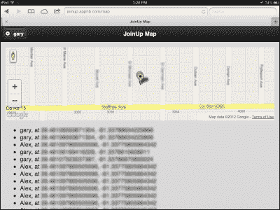

# 五、移动 Web 应用

在前一章中，我们讨论了原生桌面应用的创建，该应用旨在 Windows Store 上分发。在本章中，我们将创建一个 web 应用，让用户登录，并在地图上看到同一物理区域中的其他用户。我们将使用以下技术:

*   **ASP.NET MVC 4**:这个可以让你使用模型-视图-控制器设计模式和异步编程来构建 web 应用
*   **信号员**:这个是一个异步双向通信框架
*   **HTML5 地理定位**:这个为应用提供真实世界的位置
*   **谷歌客户端制图**:这个是为了可视化地理空间信息

这些技术结合在一起，让您可以创建非常强大的网络应用，而随着 ASP.NET MVC 4(与 C# 5 一起发布)的发布，创建每个人都可以通过互联网轻松访问的移动应用比以往任何时候都更容易。到本章结束时，我们将有一个使用现代浏览器功能的网络应用，如网络套接字，让您可以与物理上在您附近的其他网络用户连接。所有这些使得选择 C# 技术栈成为创建 web 应用的一个非常有吸引力的选择。

# 拥有 ASP.NET MVC 的移动 Web

ASP.NET 已经发展成为一个支持多种不同产品的服务器平台。在网络方面，我们有网络表单和 MVC。在服务方面我们有 ASMX web services、 **Windows 通讯框架** ( **WCF** )还有 web services，甚至一些开源技术，比如 ServiceStack 都出现了。

网络的发展可以概括为技术的大熔炉。一个成功的网络开发人员应该精通 HTML、CSS、JavaScript 和 HTTP 协议。从这个意义上说，网络开发可以帮助你发展成为一名精通多种语言的程序员，一个可以用几种编程语言工作的人。我们将在这个项目中使用 ASP.NET MVC，因为它将模型-视图-控制器设计模式应用于网络开发的环境中，同时让每一个贡献的技术都有机会做它最擅长的事情。如下图所示:


您的**模型**块将是包含您的业务逻辑的所有代码，以及连接到远程服务和数据库的代码。**控制器**块将从您的**模型**层检索信息，并在您的用户与**视图**块交互时将信息传递到其中。

关于使用 JavaScript 的客户端开发，一个有趣的观察是，许多应用的架构选择与开发任何其他本机应用时非常相似。从在内存中维护应用状态的方式，到访问和缓存远程信息的方式，有很多相似之处。

## 建立一个肉空间追踪器

转到我们将要构建的应用！

正如术语**赛博空间** 指的是数字领域一样，术语**肉空间** 通俗地用来指现实世界中发生的事情或互动。我们将在本章中创建的项目是一个移动应用，帮助您与物理上靠近您的 web 应用的其他用户连接。建立一个知道你在现实世界中的位置的移动网站是非常有吸引力的，因为就在几年前，这种应用在网络上是不可能的。


这个应用将使用 HTML 5 地理定位 API，让你在地图上看到应用的其他用户。当用户连接时，它将使用 SignalR 打开与服务器的持久连接，SignalR 是一个由几名微软员工启动的开源项目。

### 迭代零点

在我们可以开始编写代码之前，我们必须启动项目，**迭代零** 。我们从创建一个新的 ASP.NET MVC 4 项目开始，如下图所示。在这个例子中，我使用的是 Visual Studio 2012 Express for Web，当然完整版的 Visual Studio 2012 也可以。


一旦您选择了 MVC 4 项目，您将看到一个由几种不同类型的项目模板组成的对话框。由于我们希望我们的网络应用可以从手机上访问，我们选择了 Visual Studio 2012 中包含的新项目模板之一，**移动应用**。该模板预装了许多有用的 JavaScript 库，如下所示:

*   **jQuery** 和 **jQuery。用户界面**:这个是一个非常流行的库，用于简化对 HTML DOM 的访问。该库的用户界面部分提供了一个很好的小部件工具包，可以跨浏览器使用日期选择器等控件。
*   **jQuery。移动**:这个提供了一个框架来创建移动友好的网络应用。
*   这是一个让你实现模型-视图-视图模型模式的 JavaScript 绑定框架。
*   **Modernizr** :这个可以让你做丰富的功能检测，而不是看浏览器的用户代理字符串来决定你可以依靠什么功能。

我们不会使用所有这些库，当然如果你愿意，你可以使用不同的 JavaScript 库。但这些提供了一个方便的起点。您应该花一些时间熟悉由项目模板创建的文件。

首先要看的是主`HomeController`类，因为这是(默认情况下)你的应用的入口点。默认情况下包含一些占位符文本；您可以很容易地更改它，以适应您正在构建的应用。出于我们的目的，我们只需将一些文本更改为简单的信息，并呼吁用户注册。

如下修改`Views/Home/Index.cshtml`文件:

```cs
<h2>@ViewBag.Message</h2>
<p>
    Find like-minded individuals with JoinUp
</p>
```

注意`@ViewBag.Message`标题，您可以在`HomeController`类的`Index`动作方法中更改该特定值，如下所示:

```cs
public ActionResult Index()
{
    ViewBag.Message = "MeetUp. TalkUp. JoinUp";

    return View();
}
```

您可以更改其他视图来添加您自己的信息，例如关于和联系页面，但它们对于此特定演示的目的来说并不重要。

### 异步运行

这个最新版本的 ASP.NET MVC 最强大的附加功能之一是能够在 C# 5 中使用新的`async`和`await`关键词来编写异步动作方法。明确地说，自从 ASP.NET MVC 2 以来，您已经有能力创建异步动作方法，但是它们相当笨拙并且难以使用。

您必须手动跟踪正在进行的异步操作的数量，然后让异步控制器知道它们何时完成，以便它可以最终确定响应。在 ASP.NET MVC 4 中，这不再是必需的。

作为一个例子，我们可以将上一节中讨论的`Index`方法重写为异步的。假设我们希望在登录页面标题中打印的消息来自数据库。因为这可能是与另一台机器上的数据库服务器通信，所以它是异步方法的完美候选。

首先，创建一个可调用的方法，作为从数据库中检索消息的占位符，如下所示:

```cs
private async Task<string> GetSiteMessage()
{
    await Task.Delay(1);
    return "MeetUp. TalkUp. JoinUp";
}
```

当然，在您的实际代码中，这将连接到数据库，例如，它只是在返回字符串之前引入了非常小的延迟。现在可以将`Index`方法改写如下:

```cs
public async Task<ActionResult> Index()
{
    ViewBag.Message = await GetSiteMessage();

    return View();
}
```

你可以看到前面代码中高亮显示的方法的变化，你所要做的就是在方法中添加`async`关键字，使返回值成为一个`Task<ActionResult>`类，然后在方法体的某个地方使用`await`。就这样！您的方法现在将让 ASP.NET 运行时在等待您的方法完成处理的同时，通过处理其他请求来尽可能优化其资源。

## 获取用户位置

一旦定义了我们的初始登陆页面，我们就可以开始查看登录的界面了。请记住，我们应用的既定目标是帮助您与现实世界中的其他用户建立联系。为此，我们将使用许多现代浏览器(包括移动浏览器)中包含的功能来检索用户的位置。为了将所有人连接在一起，我们还将使用名为**信号员** 的库，该库让您与用户的浏览器建立双向通信通道。

该项目的网站简单描述如下:

> 的异步库。NET 来帮助构建实时、多用户的交互式 web 应用。

使用 SignalR，您可以编写一个应用，让您与用户的浏览器进行双向通信。所以不用等待浏览器发起与服务器的通信，实际上可以从服务器调出信息发送给浏览器。有趣的是，SignalR 是开源的，所以如果你好奇的话，可以深入研究一下实现。但是出于我们的目的，我们将从添加对 web 应用的引用开始。通过在包管理控制台中运行以下命令，您可以通过 Nuget 轻松实现这一点:

```cs
install-package signalr

```

或者，如果您更喜欢使用图形用户界面工具，您可以右键单击项目的参考节点，然后选择**管理 NuGet 包**。从那里你可以搜索信号包并点击**安装**按钮。

安装了该依赖项后，我们可以开始勾画用户登录时将看到的界面，并为我们提供应用的主要功能。我们通过使用`Empty MVC Controller`模板向`Controllers`文件夹添加新控制器来开始添加新屏幕的过程。班级名称`MapController`如下:

```cs
public class MapController : Controller
{
    public ActionResult Index()
    {
        return View();
    }
}
```

默认情况下，您创建的文件看起来像前面代码中的文件；记下控制器前缀(`Map`)和动作方法名称(`Index`)。创建控制器后，可以添加视图，按照惯例，该视图使用控制器名称和操作方法名称。

首先，在名为`Map`的`Views`文件夹中添加一个文件夹，这个控制器的所有视图都将进入这里。在该文件夹中，添加一个名为`Index.cshtml`的视图。确保选择`Razor`视图引擎，如果还没有选择的话。生成的 razor 文件非常简单，它只是设置了页面的标题(使用 razor 代码块)，然后输出一个标题，其动作名称如下:

```cs
@{
    ViewBag.Title = "JoinUp Map";
}

<h2>Index</h2>
```

现在我们可以开始修改这个视图并添加地理定位功能。在`Views/map/Index.cshtml`的底部添加以下代码块:

```cs
@section scripts {
    @Scripts.Render("~/Scripts/map.js")
}
```

这个脚本部分是在站点范围的模板中定义的，并确保以正确的顺序呈现脚本引用，以便已经引用了所有其他主要依赖项，如 jQuery。

接下来我们创建我们在前面代码中引用的`map.js`文件，它将保存我们所有的 JavaScript 代码。我们想在应用中做的第一件事是让我们的地理定位工作。将以下代码添加到`map.js`中，以了解如何获取用户的位置:

```cs
$(function () {
    var geo = navigator.geolocation;

    if (geo) {
        geo.getCurrentPosition(userAccepted, userDenied);
    } else {
        userDenied({message:'not supported'}); 
    }
});
```

这从传递给 jQuery 的函数定义开始，jQuery 将在加载 DOM 时执行。在该方法中，我们获得对`navigator.geolocation`属性的引用。如果该对象存在(例如，浏览器实现地理定位)，那么我们调用`.getCurrentPosition`方法并传入两个回调，我们定义如下:

```cs
function userAccepted(pos) {
    alert("lat: " +
        pos.coords.latitude +
        ", lon: " +
        pos.coords.longitude);
}

function userDenied(msg) {
    alert(msg.message);
}
```

一旦你用前面的代码保存了`map.js`，你就可以运行 web 应用( *F5* )来看看它是如何工作的。如下图截图所示，系统会提示用户接受是否希望 web 应用跟踪自己的行踪。如果他们点击**允许**，将执行`userAccepted`方法。如果他们点击**拒绝**，将执行`userDenied`消息。如果没有提供位置，您可以使用此方法相应地调整您的应用。


### 用信号器广播

随着用户位置的建立，该过程的下一部分将涉及到使用 SignalR 将每个人的位置广播给连接的每个其他用户。

我们可以做的第一件事是通过在`Views/Map/Index.cshtml`中的脚本引用中添加以下两行来为 SignalR 添加脚本引用:

```cs
<ul id="messages"></ul>

@section scripts {
    @Scripts.Render("~/Scripts/jquery.signalR-0.5.3.min.js")
    @Scripts.Render("~/signalr/hubs")
    @Scripts.Render("~/Scripts/map.js")
}
```

这将初始化 SignalR 基础设施，并允许我们在实现服务器之前构建应用的客户端。

### 类型

在撰写本文时，`jQuery.signalR`库的 0.5.3 版本是最新的版本。取决于你什么时候读这本书，这个版本很有可能已经改变了。通过 Nuget 添加信号依赖项后，只需查看`Scripts`目录，就可以知道这里应该使用什么版本。

接下来，删除`map.js`类的所有以前的内容。为了保持有序，我们首先用一些方法声明一个 JavaScript 类，如下所示:

```cs
var app = {
    geoAccepted: function(pos) {
        var coord = JSON.stringify(pos.coords);
        app.server.notifyNewPosition(coord);
    },

    initializeLocation: function() {
        var geo = navigator.geolocation;

        if (geo) {
            geo.getCurrentPosition(this.geoAccepted);
        } else {
            error('not supported');
        }
    },

    onNewPosition: function(name, coord) {
        var pos = JSON.parse(coord);
        $('# messages').append('<li>' + name + ', at '+ pos.latitude +', '+ pos.longitude +'</li>');
    }
};
```

您将认识到`initializeLocation`方法与我们之前在那里初始化地理定位应用编程接口的代码相同。在这个版本中，初始化函数传递另一个函数`geoAccepted`，作为当用户接受位置提示时执行的回调。最后一个函数`onNewPosition`，是指当有人通知服务器一个新的位置时执行的。SignalR 将广播位置并执行这个功能，让这个脚本知道用户的名字和他们的新坐标。

当页面加载时，我们想要初始化与 SignalR 的连接，并且在这个过程中使用我们刚刚在名为`app`的变量中创建的对象，这可以通过以下方式完成:

```cs
$(function () {
    var server = $.connection.serverHub;

    server.onNewPosition = app.onNewPosition;

    app.server = server;

    $.connection.hub.start()
        .done(function () {
            app.initializeLocation();
        });
});
```

在 SignalR 中， **Hubs** 是一种非常简单的方式来公开方法，客户端上的 JavaScript 代码可以轻松调用这些方法。向您的`Models`文件夹添加一个名为`ServerHub`的新类，如下所示:

```cs
public class ServerHub : Hub
{
    public void notifyNewPosition(string coord)
    {
        string name = HttpContext.Current.User.Identity.Name;

        Clients.onNewPosition(name, coord);
    }
}
```

我们在这个中枢定义了一个单一的方法，`notifyNewPosition` ，它接受一个字符串。当我们从一个用户那里获得坐标时，这个方法会将其广播给所有其他连接的用户。为此，代码首先获取用户名，然后调用`.onNewPosition`方法广播该名称并与所有连接的用户进行协调。

有趣的是`Clients`属性是一个动态类型，所以`onNewPosition`实际上并不作为该属性上的方法存在。该方法的名称用于自动生成从 JavaScript 代码调用的客户端方法。

为了确保用户在访问页面时登录，我们所要做的就是将`[Authorize]`属性添加到`MapController`类的顶部，如下所示:

```cs
[Authorize]
public class MapController : Controller
```

按 *F5* 运行您的应用，看看我们做得如何。如果一切正常，您将看到如下截图所示的屏幕:


当人们加入网站时，他们的位置被获取并推给其他人。同时，在客户端端，当接收到新的位置时，我们附加一个新的列表项元素，详细说明刚刚接收到的名称和坐标。

我们正在一个接一个地慢慢建立我们的功能，一旦我们验证了这是可行的，我们就可以开始充实下一个部分。

### 映射用户

随着位置信息被推送给每个人，我们可以开始在地图上显示他们的位置。对于这个示例，我们将使用谷歌地图，但是您可以轻松使用 Bing、或 OpenStreet 地图。但这个想法是给你一个空间参考，看看还有谁在看同一个网页，以及他们在世界上相对于你的位置。

首先添加一个 HTML 元素，将地图保存到`Views/Map/Index.cshtml`，如下所示:

```cs
<div 
    id="map"
    style="width:100%; height: 200px;">
</div>
```

这个`<div>`将作为实际地图的容器，由谷歌地图 API 管理。接下来将 JavaScript 添加到`map.js`参考上方的脚本部分，如下所示:

```cs
@section scripts {
    @Scripts.Render("~/Scripts/jquery.signalR-0.5.3.min.js")
    @Scripts.Render("~/signalr/hubs")
    @Scripts.Render("http://maps.google.com/maps/api/js?sensor=false");
    @Scripts.Render("~/Scripts/map.js")
}
```

与 SignalR 脚本一样，我们只需要确保它在我们自己的脚本(`map.js`)之前被引用，以便它在我们的源代码中可用。接下来，我们添加代码来初始化映射，如下所示:

```cs
function initMap(coord) {
    var googleCoord = new google.maps.LatLng(coord.latitude, coord.longitude);

    if (!app.map) {
        var mapElement = document.getElementById("map");
        var map = new google.maps.Map(mapElement, {
            zoom: 15,
            center: googleCoord,
            mapTypeControl: false,
            navigationControlOptions: { style: google.maps.NavigationControlStyle.SMALL },
            mapTypeId: google.maps.MapTypeId.ROADMAP
        });
        app.map = map;
    }
    else {
        app.map.setCenter(googleCoord);
    }
}
```

获得位置后，将调用该函数。它的工作原理是获取用户最初报告的位置，并将对我们之前用`map`标识创建的`<div>` HTML 元素的引用传递给`google.maps.Map`对象的新实例，将地图的中心设置为用户报告的位置。如果再次调用该函数，它将简单地将地图的中心设置为用户的坐标。

为了显示所有的位置，我们将使用谷歌地图的一个功能，能够在地图上放置一个标记。在`map.js`增加以下功能:

```cs
function addMarker(name, coord) {
    var googleCoord = new google.maps.LatLng(coord.latitude, coord.longitude);

    if (!app.markers) app.markers = {};

    if (!app.markers[name]) {
        var marker = new google.maps.Marker({
            position: googleCoord,
            map: app.map,
            title: name
        });
        app.markers[name] = marker;
    }
    else {
        app.markers[name].setPosition(googleCoord);
    }
}
```

此方法通过使用关联 JavaScript 数组来跟踪已添加的标记，该数组类似于 C# 中的`Dictionary<string, object>`集合。当用户报告一个新位置时，它将采用现有的标记并将它移动到新位置。这意味着，对于每个唯一登录的用户，地图将显示一个标记，然后在每次报告新位置时移动它。

最后，我们对 app 对象中的现有功能进行了三个小的更改，以与地图进行交互。首先在`initializeLocation`中，我们从`getCurrentPosition`改为使用`watchPosition`方法，如下所示:

```cs
initializeLocation: function() {
    var geo = navigator.geolocation;

    if (geo) {
        geo.watchPosition(this.geoAccepted);
    } else {
        error('not supported');
    }
},
```

`watchPosition`方法将在每次用户位置改变时更新用户位置，当用户向服务器报告时，这将导致所有位置的实时视图。

接下来，我们更新`geoAccepted`方法，每次用户获得新坐标时都会运行该方法。我们可以利用这个事件在通知服务器新位置之前初始化地图，如下所示:

```cs
geoAccepted: function (pos) {
    var coord = JSON.stringify(pos.coords);

    initMap(pos.coords);

    app.server.notifyNewPosition(coord);
},
```

最后，在用户报告新职位时通知我们页面的方法中，我们对`addMarker`函数进行如下调用:

```cs
onNewPosition: function(name, coord) {
    var pos = JSON.parse(coord);

    addMarker(name, pos);

    $('# messages').append('<li>' + name + ', at '+ pos.latitude +', '+ pos.longitude +'</li>');
}
```

## 测试应用

到了测试应用的时候，可以在自己的电脑上本地做一些初步的测试。但这意味着你在地图中间永远只有一个标记(那就是你)。为了进行更深入的测试，您需要将 web 应用部署到可从互联网访问的服务器上。

有很多选择，从免费的(非常适合测试)到花钱的解决方案。当然，您可以自行设置带有 IIS 的服务器，并以这种方式进行管理。在 ASP.NET 网站的网址[http://www.asp.net/hosting](http://www.asp.net/hosting)上可以找到一个很好的寻找主机的资源。

应用上传到服务器后，尝试从不同地方的不同设备访问它。接下来的三个截图展示了应用在桌面上工作的证据:


在 iPad 上你会看到如下画面:



在 iPhone 上你会看到下面的屏幕:


# 总结

这就是了……一个网络应用，它获取你的物理位置，并实时地将你与该应用的其他用户连接起来。为了做到这一点，我们探索了各种现代网络开发人员，特别是 ASP.NET 开发人员应该熟悉的技术:ASP.NET MVC、SignalR、HTML5 地理定位以及与谷歌地图的客户端映射。

以下是您可以用来扩展此示例的一些想法:

*   考虑将用户的最后一个已知位置保存在数据库中，如 SQL Server 或 MongoDB
*   想想如何扩展这种应用来支持更多的用户( **l** 查看`SignalR.Scaleout`库)
*   将您通知的用户限制为特定距离内的用户(学习如何使用哈弗斯公式计算地球上两点之间的距离)
*   使用网络上可用的各种位置数据库(如 FourSquare Venus 应用编程接口或 FaceBook Places 应用编程接口)显示用户附近的兴趣点。