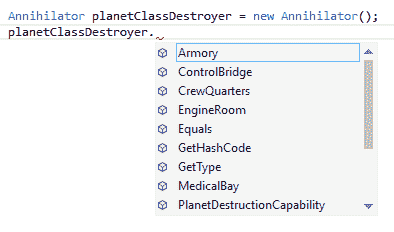
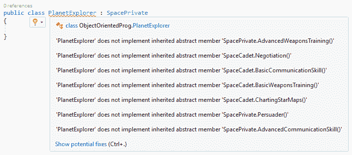

# C# 中的面向对象编程

本章将向您介绍 C# 和**面向对象编程的基础** ( **OOP** )。在这一章中，您将涉及以下食谱:

*   在 C# 中使用继承
*   使用抽象
*   利用封装
*   实现多态性
*   单一责任原则
*   开/闭原理
*   异常处理

# 介绍

在你作为软件创作者的职业生涯中，你会多次听到“面向对象”这个术语。这种设计理念允许对象独立存在，并且可以被不同的代码段重用。我们称之为 OOP 的四大支柱:继承、封装、抽象和多态，这一切都成为可能。

为了理解这一点，您需要开始考虑执行特定任务的对象(基本上是实例化的类)。班级需要坚持固体设计原则。这个原理在这里解释:

*   单一责任原则
*   开/闭原理
*   利斯科夫替代原则
*   界面分离原理
*   依赖倒置原则

让我们从解释 OOP 的四大支柱开始，之后我们将更详细地了解 SOLID 原理。

# 在 C# 中使用继承

在当今世界，继承通常与事物的终结联系在一起。然而，在面向对象程序设计中，它与新的更好的事物的开始联系在一起。当我们创建一个新类时，我们可以采用一个已经存在的类，并在我们的新类上继承它。这意味着我们的新对象将拥有继承类的所有特性以及添加到新类中的附加特性。这是继承的根本。我们把从另一个继承的类称为派生类。

# 准备好

为了说明继承的概念，我们将创建几个从另一个继承的类，以形成新的、功能更丰富的对象。

# 怎么做...

1.  创建一个新的控制台应用，并向您的控制台应用添加一个名为`SpaceShip`的类。

```cs
        public class SpaceShip 
        { 

        }

```

2.  我们的`SpaceShip`课程将包含一些描述宇宙飞船基础的方法。继续将这些方法添加到您的`SpaceShip`类中:

```cs
        public class SpaceShip 
        { 
          public void ControlBridge() 
          { 

          } 
          public void MedicalBay(int patientCapacity) 
          { 

          } 
          public void EngineRoom(int warpDrives) 
          { 

          } 
          public void CrewQuarters(int crewCapacity) 
          { 

          } 
          public void TeleportationRoom() 
          { 

          } 
        }

```

因为`SpaceShip`级构成了所有其他星系间飞船的一部分，它成为了所有其他飞船的蓝图。

3.  接下来，我们要创建一个`Destroyer`类。为了实现这一点，我们将创建一个`Destroyer`类，并在类名后使用冒号来表示我们想要从另一个类(T2】类)继承。因此，在创建`Destroyer`类时需要添加以下内容:

```cs
        public class Destroyer : SpaceShip 
        { 

        }

```

We can also say that the `Destroyer` class is derived from the `SpaceShip` class. The `SpaceShip` class is therefore the base class of all other intergalactic vessels.

4.  接下来，给`Destroyer`类添加一些毁灭者独有的方法。这些方法只属于`Destroyer`类，不属于`SpaceShip`类:

```cs
        public class Destroyer : SpaceShip 
        { 
          public void WarRoom() 
          { 

          } 
          public void Armory(int payloadCapacity) 
          { 

          } 

          public void WarSpecialists(int activeBattalions) 
          { 

          } 
        }

```

5.  最后，创建名为`Annihilator`的第三个类。这是最强大的星系间飞船，用于在行星上发动战争。通过创建类并将其标记为从`Destroyer`类派生，让`Annihilator`类从`Destroyer`类继承，如下所示:

```cs
        public class Annihilator : Destroyer 
        { 

        }

```

6.  最后，给`Annihilator`类添加几个只属于这类`SpaceShip`类的方法:

```cs
        public class Annihilator : Destroyer 
        { 
          public void TractorBeam() 
          { 

          } 

          public void PlanetDestructionCapability() 
          { 

          } 
        }

```

7.  我们现在看到的是，当我们在控制台应用中创建新的`SpaceShip`类实例时，只有该类中定义的方法对我们可用。这是因为`SpaceShip`类不继承任何其他类:


8.  继续在控制台应用中创建`SpaceShip`类及其方法:

```cs
        SpaceShip transporter = new SpaceShip(); 
        transporter.ControlBridge(); 
        transporter.CrewQuarters(1500); 
        transporter.EngineRoom(2); 
        transporter.MedicalBay(350); 
        transporter.TeleportationRoom();

```

您将看到，当实例化这个类的新实例时，这些是我们唯一可用的方法。

9.  接下来，创建`Destroyer`类的新实例。您会注意到`Destroyer`类包含的方法比我们创建该类时定义的更多。这是因为`Destroyer`类继承了`SpaceShip`类，因此继承了`SpaceShip`类的方法:


10.  继续在控制台应用中创建`Destroyer`类及其所有方法:

```cs
        Destroyer warShip = new Destroyer(); 
        warShip.Armory(6); 
        warShip.ControlBridge(); 
        warShip.CrewQuarters(2200); 
        warShip.EngineRoom(4); 
        warShip.MedicalBay(800); 
        warShip.TeleportationRoom(); 
        warShip.WarRoom(); 
        warShip.WarSpecialists(1);

```

11.  最后，创建`Annihilator`类的新实例。该类包含`Destroyer`类的所有方法以及`SpaceShip`类的方法。这是因为`Annihilator`继承了`Destroyer`，而【】又继承了`SpaceShip`:



12.  继续在控制台应用中创建`Annihilator`类及其所有方法:

```cs
        Annihilator planetClassDestroyer = new Annihilator(); 
        planetClassDestroyer.Armory(12); 
        planetClassDestroyer.ControlBridge(); 
        planetClassDestroyer.CrewQuarters(4500); 
        planetClassDestroyer.EngineRoom(7); 
        planetClassDestroyer.MedicalBay(3500); 
        planetClassDestroyer.PlanetDestructionCapability(); 
        planetClassDestroyer.TeleportationRoom(); 
        planetClassDestroyer.TractorBeam(); 
        planetClassDestroyer.WarRoom(); 
        planetClassDestroyer.WarSpecialists(3);

```

# 它是如何工作的...

我们可以看到，继承允许我们通过重用已经存在于之前创建的另一个类中的功能来轻松扩展我们的类。您还需要注意，对`SpaceShip`类的任何更改都将被继承，一直到最顶层的派生类。

继承是 C# 的一个非常强大的特性，它允许开发人员编写更少的代码，并重用工作和测试过的方法。

# 使用抽象

通过抽象，我们从想要创建基本功能的对象中获取从抽象对象派生的所有对象必须具备的功能。为了用简单的术语解释这一点，我们抽象了公共功能，并将其放在一个类中，该类将用于向所有继承它的类提供这一共享功能。

# 准备好了

为了解释抽象，我们将使用抽象类。想象一下，你面对的是受训的太空宇航员，他们需要在训练中不断进步。事实是，一旦你作为实习生学习了一项新技能，即使你学习了更先进的做事方法，这项技能也会被学习并保留下来。您还必须在创建的新对象中实现之前学习的所有技能。抽象类很好地展示了这个概念。

# 怎么做...

1.  创建一个名为`SpaceCadet`的抽象类。这是你开始训练时能得到的第一种宇航员。抽象类及其成员使用`abstract`关键字定义。需要注意的是，抽象类不能被实例化。成员代表`SpaceCadet`将拥有的技能，例如谈判和基本武器训练:

```cs
        public abstract class SpaceCadet 
        { 
          public abstract void ChartingStarMaps(); 
          public abstract void BasicCommunicationSkill(); 
          public abstract void BasicWeaponsTraining(); 
          public abstract void Negotiation(); 
        }

```

2.  接下来，创建另一个名为`SpacePrivate`的抽象类。这个抽象类继承自`SpaceCadet`抽象类。我们基本上是说，当一名太空学员被训练成一名太空士兵时，他们仍然拥有作为一名太空学员所学的所有技能:

```cs
        public abstract class SpacePrivate : SpaceCadet 
        { 
          public abstract void AdvancedCommunicationSkill(); 
          public abstract void AdvancedWeaponsTraining(); 
          public abstract void Persuader(); 
        }

```

3.  为了演示这一点，创建一个名为`LabResearcher`的类，并继承`SpaceCadet`抽象类。通过在新创建的类名后定义冒号和抽象类名来实现从抽象类的继承。这告诉编译器`LabResearcher`类继承自`SpaceCadet`类:

```cs
        public class LabResearcher : SpaceCadet 
        { 

        }

```

因为我们继承了一个抽象类，编译器会在`LabResearcher`类名下面加下划线，警告我们派生类没有实现`SpaceCadet`抽象类中的任何方法。

4.  如果您将鼠标悬停在曲线上，您会看到灯泡提示为我们提供了发现的问题:


5.  Visual Studio 在为发现的问题提供解决方案方面做得很好。通过输入 *Ctrl* + *。*(控制键和句点)，您可以让 Visual Studio 向您展示一些针对已识别问题的潜在修复程序(在本例中，只有一个修复程序):


6.  Visual Studio 添加了所需的方法后，您会看到这些方法与`SpaceCadet`抽象类中定义的方法相同。因此，抽象类需要从抽象类继承的类来实现抽象类中定义的方法。您还会注意到，添加到`LabResearcher`类的方法不包含任何实现，如果按原样使用，将引发异常:

```cs
        public class LabResearcher : SpaceCadet 
        { 
          public override void BasicCommunicationSkill() 
          { 
            thrownewNotImplementedException(); 
          } 

          publicoverridevoid BasicWeaponsTraining() 
          { 
            thrownewNotImplementedException(); 
          } 

          publicoverridevoid ChartingStarMaps() 
          { 
            thrownewNotImplementedException(); 
          } 

          publicoverridevoid Negotiation() 
          { 
            thrownewNotImplementedException(); 
          } 
        }

```

7.  接下来，创建一个名为`PlanetExplorer`的类，并使这个类继承自`SpacePrivate`抽象类。你会记得`SpacePrivate`抽象类继承自`SpaceCadet`抽象类:

```cs
        public class PlanetExplorer : SpacePrivate 
        { 

        }

```

8.  Visual Studio 将再次警告您，您的新类没有实现您继承的抽象类的方法。然而，在这里，你会注意到灯泡提示告诉你，你没有实现`SpacePrivate`和`SpaceCadet`抽象类中的任何方法。这是因为`SpacePrivate`抽象类继承了`SpaceCadet`抽象类:



9.  如前所述，要修复已识别的问题，请键入 *Ctrl* + *。*(控制键和句点)，让 Visual Studio 为您展示一些针对已识别问题的潜在修复(在本例中，只有一个修复)。

10.  将修复程序添加到代码后，您将看到`PlanetExplorer`类包含了`SpacePrivate`和`SpaceCadet`抽象类中的所有方法:

```cs
        public class PlanetExplorer : SpacePrivate 
        { 
          public override void AdvancedCommunicationSkill() 
          { 
            throw new NotImplementedException(); 
          } 

          public override void AdvancedWeaponsTraining() 
          { 
            throw new NotImplementedException(); 
          } 

          public override void BasicCommunicationSkill() 
          { 
            throw new NotImplementedException(); 
          } 

          public override void BasicWeaponsTraining() 
          { 
            throw new NotImplementedException(); 
          } 

          public override void ChartingStarMaps() 
          { 
            throw new NotImplementedException(); 
          } 

          public override void Negotiation() 
          { 
            throw new NotImplementedException(); 
          } 

          public override void Persuader() 
          { 
            throw new NotImplementedException(); 
          } 
        }

```

# 它是如何工作的...

抽象允许我们定义一组通用的功能，这些功能将在从抽象类派生的所有类之间共享。从抽象类继承和普通类的区别在于，对于抽象类，您必须实现该抽象类中定义的所有方法。

这使得该类易于版本化和更改。如果需要添加新功能，可以通过将该功能添加到抽象类中来实现，而无需破坏任何现有代码。Visual Studio 将要求所有继承的类实现抽象类中定义的新方法。

因此，您可以放心，所应用的更改将在从代码中的抽象类派生的所有类中实现。

# 利用封装

什么是封装？简单地说，它隐藏了一个类的内部工作机制，而这些机制对于该类的实现是不必要的。把封装想象成这样:大多数拥有汽车的人都知道汽车是靠汽油行驶的——他们不需要知道内燃机的内部工作原理就能使用汽车。他们只需要知道，当它接近空的时候，他们需要加满汽油，他们需要检查机油和轮胎压力。即便如此，车主通常也不会这么做。对于类和封装来说也是如此。

该类的所有者是使用它的人。该类的内部工作无需向使用该类的开发人员公开。因此，这个类就像一个黑盒。您知道，给定正确的参数集，该类的功能将是一致的。只要输入是正确的，开发人员就不关心类如何精确地到达输出。

# 准备好

为了说明封装的概念，我们将创建一个内部工作有些复杂的类。我们需要计算航天飞机的**推重比** ( **TWR** )来确定它是否能够垂直起飞。它需要施加比其重量更大的推力来抵消重力并进入稳定的轨道。这也取决于航天飞机从哪个行星起飞，因为不同的行星对其表面的物体施加不同的引力。简单来说，TWR 一定不止一个。

# 怎么做...

1.  创建一个名为`LaunchSuttle`的新类。然后，将以下私有变量添加到类中，用于发动机推力、航天飞机质量、局部重力加速度、地球、月球和火星重力的常数值(这些是常数，因为它们永远不会改变)、宇宙重力常数以及我们正在处理的行星的枚举器:

```cs
        public class LaunchShuttle 
        { 
          private double _EngineThrust; 
          private double _TotalShuttleMass; 
          private double _LocalGravitationalAcceleration; 

          private const double EarthGravity = 9.81; 
          private const double MoonGravity = 1.63; 
          private const double MarsGravity = 3.75; 
          private double UniversalGravitationalConstant; 

          public enum Planet { Earth, Moon, Mars } 
        }

```

2.  在我们的类中，我们将添加三个重载构造函数，这三个构造函数对于基于实例化时已知的事实来执行 TWR 的计算是必不可少的(我们假设我们将总是知道航天飞机的发动机推力能力和质量)。我们将传递第一个构造函数的重力加速度。如果我们事先知道这个值是多少，这是很有用的。比如地球的重力加速度为 9.81 米/秒 <sup>2</sup> 。

第二个构造函数将使用`Planet`枚举器来计算使用常量变量值的 TWR。

第三个构造函数将使用行星的半径和质量来计算重力加速度，当这些值已知时，返回 TWR:

```cs
        public LaunchShuttle(double engineThrust, 
          double totalShuttleMass, double gravitationalAcceleration) 
        { 
          _EngineThrust = engineThrust; 
          _TotalShuttleMass = totalShuttleMass; 
          _LocalGravitationalAcceleration =  gravitationalAcceleration; 

        } 

        public LaunchShuttle(double engineThrust, 
          double totalShuttleMass, Planet planet) 
        { 
          _EngineThrust = engineThrust; 
          _TotalShuttleMass = totalShuttleMass; 
          SetGraviationalAcceleration(planet); 

        } 

        public LaunchShuttle(double engineThrust, double 
          totalShuttleMass, double planetMass, double planetRadius) 
        { 
          _EngineThrust = engineThrust; 
          _TotalShuttleMass = totalShuttleMass; 
          SetUniversalGravitationalConstant(); 
          _LocalGravitationalAcceleration =  Math.Round(
            CalculateGravitationalAcceleration (
              planetRadius, planetMass), 2); 
        }

```

3.  为了使用将`Planet`枚举器作为参数传递给类的第二个重载构造函数，我们需要创建另一个作用域为`private`的方法来计算重力加速度。我们还需要将`_LocalGravitationalAcceleration`变量设置为与枚举值匹配的特定常量。这个方法是类的用户使用类时不需要看到的。因此，它的作用域为`private`，以便向用户隐藏该功能:

```cs
        private void SetGraviationalAcceleration(Planet planet) 
        { 
          switch (planet) 
          { 
            case Planet.Earth: 
              _LocalGravitationalAcceleration = EarthGravity; 
            break; 
            case Planet.Moon: 
              _LocalGravitationalAcceleration = MoonGravity; 
            break; 
            case Planet.Mars: 
              _LocalGravitationalAcceleration = MarsGravity; 
            break; 
            default: 
            break; 
          } 
        }

```

4.  在下列方法中，只有一个被定义为公共的，因此对类的用户可见。创造私人方法来设定万有引力常数，计算 TWR 和引力加速度。这些方法的作用域都是私有的，因为开发人员不需要知道这些方法做什么就可以使用这个类:

```cs
        private void SetUniversalGravitationalConstant() 
        { 
          UniversalGravitationalConstant = 6.6726 * Math.Pow(10,  -11); 
        } 

        private double CalculateThrustToWeightRatio() 
        { 
          // TWR = Ft/m.g > 1 
          return _EngineThrust / (_TotalShuttleMass * 
                      _LocalGravitationalAcceleration); 
        } 

        private double CalculateGravitationalAcceleration(
                       double  radius, double mass) 
        { 
          return (UniversalGravitationalConstant * mass) / 
                                        Math.Pow(radius, 2); 
        } 

        public double TWR() 
       { 
         return Math.Round(CalculateThrustToWeightRatio(), 2); 
       }

```

5.  最后，在控制台应用中，使用已知值创建以下变量:

```cs
        double thrust = 220; // kN 
        double shuttleMass = 16.12; // t 
        double gravitationalAccelerationEarth = 9.81; 
        double earthMass = 5.9742 * Math.Pow(10, 24); 
        double earthRadius = 6378100; 
        double thrustToWeightRatio = 0;

```

6.  创建`LaunchShuttle`类的一个新实例，并将计算 TWR 所需的值传递给它:

```cs
        LaunchShuttle NasaShuttle1 = new LaunchShuttle(thrust, 
                   shuttleMass, gravitationalAccelerationEarth); 
        thrustToWeightRatio = NasaShuttle1.TWR(); 
        Console.WriteLine(thrustToWeightRatio);

```

7.  当你在`NasaShuttle1`变量上使用点运算符时，你会注意到智能感知只显示`TWR`方法。该类没有公开它如何获得计算出的 TWR 值的内部工作方式。开发人员唯一知道的是，`LaunchShuttle`类将一致地返回正确的 TWR 值，给定相同的输入参数:


8.  为了测试这一点，再创建两个`LaunchShuttle`类的实例，每次调用不同的构造函数:

```cs
        LaunchShuttle NasaShuttle2 = new LaunchShuttle(thrust, 
                       shuttleMass, LaunchShuttle.Planet.Earth); 
        thrustToWeightRatio = NasaShuttle2.TWR(); 
        Console.WriteLine(thrustToWeightRatio); 

        LaunchShuttle NasaShuttle3 = new LaunchShuttle(
           thrust,  shuttleMass, earthMass, earthRadius); 
        thrustToWeightRatio = NasaShuttle3.TWR(); 
        Console.WriteLine(thrustToWeightRatio); 

        Console.Read();

```

9.  如果运行控制台应用，您将看到为 TWR 返回了相同的值。该值表明，一架重 16.12 吨的航天飞机和一枚能产生 220 千牛顿推力的火箭将能够飞离地球表面(如果只是这样的话):


# 它是如何工作的...

该类使用作用域规则向使用该类的开发人员隐藏类中的某些功能。如前所述，开发者不需要知道如何进行计算来返回 TWR 的值。这些都有助于使这个类更加有用和易于实现。下面是 C# 中可用的各种范围及其用途的列表:

*   `Public`:用于变量、属性、类型和方法，在任何地方都可见。
*   `Private`:这与变量、属性、类型和方法一起使用，并且仅在定义它们的块中可见。
*   `Protected`:这与变量、属性和方法一起使用。不要从公共或私人的角度来考虑这个问题。受保护的范围只在使用它的类以及任何继承的类中可见。
*   `Friend`:这与变量、属性和方法一起使用，只能由同一项目或程序集中的代码使用。
*   `ProtectedFriend`:与变量、属性和方法一起使用，是受保护作用域和友元作用域的组合(顾名思义)。

# 实现多态性

多态性是一个概念，一旦你看了并理解了 OOP 的其他支柱，就很容易理解。多态字面意思是事物可以有多种形式。这意味着从单个接口，您可以创建多个实现。

对此有两个子部分，即静态和动态多态性。有了**静态多态**，你在处理方法和函数的重载。您可以使用相同的方法，但执行许多不同的任务。

借助**动态多态**，您正在处理抽象类的创建和实现。这些抽象类充当一个蓝图，告诉您派生类应该实现什么。下一节将介绍这两种情况。

# 准备好

我们将首先说明抽象类的使用，这是动态多态性的一个例子。然后我们将创建重载构造函数作为静态多态的一个例子。

# 怎么做...

1.  创建一个名为`Shuttle`的抽象类，并给它一个名为`TWR`的成员，这是航天飞机 TWR 的计算:

```cs
        public abstract class Shuttle 
        { 
          public abstract double TWR(); 
        }

```

2.  接下来，创建一个名为`NasaShuttle`的类，并通过将抽象类名放在`NasaShuttle`类声明末尾的冒号后，让它从抽象类`Shuttle`继承:

```cs
        public class NasaShuttle : Shuttle 
        { 

        }

```

3.  Visual Studio 将在`NasaShuttle`类下面加下划线，因为您已经告诉编译器该类继承自一个抽象类，但是您还没有实现该抽象类的成员:


4.  要解决已识别的问题，请键入 *Ctrl* + *。*(控制键和句点)并让 Visual Studio 向您展示一些针对已识别问题的潜在修复程序(在本例中，只有一个修复程序):


5.  然后，Visual Studio 会将缺失的实现添加到您的`NasaShuttle`类中。默认情况下，它会将其添加为未实现，因为您需要为在抽象类中重写的抽象成员提供实现:

```cs
        public class NasaShuttle : Shuttle 
        { 
          public override double TWR() 
          { 
            throw new NotImplementedException(); 
          } 
        }

```

6.  创建另一个名为`RoscosmosShuttle`的类，并从同一个`Shuttle`抽象类继承:

```cs
        public class RoscosmosShuttle : Shuttle 
        { 

        }

```

7.  和以前一样，Visual Studio 将在`RoscosmosShuttle`类下面加下划线，因为您已经告诉编译器该类继承自抽象类，但是您还没有实现该抽象类的成员。

8.  要解决已识别的问题，请键入 *Ctrl* + *。*(控制键和句点)，让 Visual Studio 为您展示一些针对已识别问题的潜在修复(在本例中，只有一个修复)。

9.  然后，被覆盖的方法作为未实现的方法被添加到`RoscosmosShuttle`类中。您刚刚看到了动态多态的一个例子:

```cs
        public class RoscosmosShuttle : Shuttle 
        { 
          public override double TWR() 
          { 
            throw new NotImplementedException(); 
          } 
        }

```

10.  要查看静态多态性的示例，请为`NasaShuttle`创建以下重载构造函数。构造函数名称保持不变，但是构造函数的签名发生了变化，这使得它重载:

```cs
        public NasaShuttle(double engineThrust, 
          double  totalShuttleMass, double gravitationalAcceleration) 
        { 

        } 

        public NasaShuttle(double engineThrust, 
          double  totalShuttleMass, double planetMass, 
          double planetRadius) 
        { 

        }

```

# 它是如何工作的...

通过简单地将良好的面向对象原则应用到类的设计中，您将很容易使用多态性。对于抽象的`Shuttle`类，我们看到该类呈现出`NasaShuttle`类和`RoscosmosShuttle`类的形状，当它被用来从抽象中派生出那些新的类时。`NasaShuttle`类的构造函数随后被重写以提供相同的方法名，但使用不同的签名实现。

这是多态性的核心。很有可能，你一直在使用它而不知道它。

# 单一责任原则

说到固体原则，我们先从**单一责任原则** ( **SRP** )说起。在这里，我们实际上是说，一个类有一个它需要完成的特定任务，它不应该做任何其他事情。

# 准备好了

您将创建一个新的类，并编写代码来记录一个错误到数据库，当一个异常被抛出时，增加更多的部队到星际飞船，导致它超过容量。对于这个配方，请确保您已经向应用中添加了`using System.Data;`和`using System.Data.SqlClient;`名称空间。

# 怎么做...

1.  创建一个名为`StarShip`的新类:

```cs
        public class Starship 
        { 

        }

```

2.  给你的班级增加一个新的方法来设置`StarShip`班级的最大兵力:

```cs
        public void SetMaximumTroopCapacity(int capacity) 
        {             

        }

```

3.  在该方法中，添加一个`trycatch`子句，该子句将尝试设置最大部队容量，但由于某种原因，它将失败。失败后，它会将错误写入数据库中的日志表:

```cs
        try 
        { 
          // Read current capacity and try to add more 
        } 
        catch (Exception ex) 
        { 
          string connectionString = "connection string goes  here";
          string sql = $"INSERT INTO tblLog (error, date) VALUES
            ({ex.Message}, GetDate())";
          using (SqlConnection con = new 
                 SqlConnection(connectionString)) 
          { 
            SqlCommand cmd = new SqlCommand(sql); 
            cmd.CommandType = CommandType.Text; 
            cmd.Connection = con; 
            con.Open(); 
            cmd.ExecuteNonQuery(); 
          } 
          throw ex; 
        }

```

# 它是如何工作的...

如果您的代码看起来像前面的代码，那么您就违反了 SRP。`StarShip`级不再只负责自身和与星际飞船有关的事情。现在，它还必须完成将错误记录到数据库中的任务。您在这里看到的问题是数据库记录代码不属于`SetMaximumTroopCapacity`方法的`catch`子句。更好的方法是创建一个单独的`DatabaseLogging`类，该类包含创建连接和将异常写入相应日志表的方法。您还会发现，您将不得不在多个地方(在每个`catch`子句中)编写日志代码。如果您发现您正在重复代码(通过从其他区域复制和粘贴)，您可能需要将该代码放入一个公共类中，并且您可能已经违反了 SRP 规则。

# 开/闭原理

创建类时，我们需要确保该类禁止任何需要更改内部代码的破坏性修改。我们说这样的班级是封闭的。如果我们需要以某种方式改变它，我们可以通过扩展类来实现。这种扩展性就是我们所说的类对扩展开放的地方。

# 准备好

你将通过观察士兵的职业来创建一个决定士兵技能的职业。我们将向您展示许多开发人员创建这样一个类的方式，以及使用开放/封闭原则创建它的方式。

# 怎么做...

1.  创建一个名为`StarTrooper`的类:

```cs
        public class StarTrooper 
        { 

        }

```

2.  在这个类中，添加一个名为`TrooperClass`的枚举器来识别我们想要返回技能的骑兵类型。另外，创建一个`List<string>`变量来包含特定士兵职业的技能。最后，创建一个名为`GetSkills`的方法，返回给定士兵职业的特定技能集。

这个类非常简单，但是代码的实现是我们经常看到的。有时候，你会看到很多`if...else`语句，而不是`switch`语句。虽然代码的功能是明确的，但是在不改变代码的情况下向`StarTrooper`类添加另一个骑警类并不容易。假设你现在必须给`StarTrooper`类增加一个`Engineer`类。您必须修改`TrooperClass`枚举和`switch`语句中的代码。

这种代码的改变会导致你在之前运行良好的代码中引入错误。我们现在看到`StarTrooper`类没有关闭，不能轻松扩展以容纳额外的`TrooperClass`对象:

```cs
        public enum TrooperClass { Soldier, Medic, Scientist } 
        List<string> TroopSkill; 

        public List<string> GetSkills(TrooperClass troopClass) 
        { 
          switch (troopClass) 
          { 
            case TrooperClass.Soldier: 
              return TroopSkill = new List<string>(new string[] {
                "Weaponry", "TacticalCombat",  "HandToHandCombat" }); 

            case TrooperClass.Medic: 
              return TroopSkill = new List<string>(new string[] {
                "CPR", "AdvancedLifeSupport" }); 

            case TrooperClass.Scientist: 
              return TroopSkill = new List<string>(new string[] {
                "Chemistry",  "MollecularDeconstruction", 
                "QuarkTheory" }); 

            default: 
              return TroopSkill = new List<string>(new string[]  {
                "none" }); 
          } 
        }

```

3.  这个问题的解决办法是继承。我们扩展它，而不是必须改变代码。首先重写前面的`StarTrooper`类，创建一个`Trooper`类。`GetSkills`方法声明为`virtual`:

```cs
        public class Trooper 
        { 
          public virtual List<string> GetSkills() 
          { 
            return new List<string>(new string[] { "none" }); 
          } 
        }

```

4.  现在，我们可以很容易地为可用的`Soldier`、`Medic`和`Scientist`士兵类创建派生类。创建以下继承自`Trooper`类的派生类。您可以看到在创建`GetSkills`方法时使用了`override`关键字:

```cs
        public class Soldier : Trooper 
        { 
          public override List<string> GetSkills() 
          { 
            return new List<string>(new string[] { "Weaponry", 
                         "TacticalCombat", "HandToHandCombat" }); 
          } 
        } 

        public class Medic : Trooper 
        { 
          public override List<string> GetSkills() 
          { 
            return new List<string>(new string[] { 
                   "CPR",  "AdvancedLifeSupport" }); 
          } 
        } 

        public class Scientist : Trooper 
        { 
          public override List<string> GetSkills() 
          { 
            return new List<string>(new string[] { "Chemistry",
              "MollecularDeconstruction", "QuarkTheory" }); 
          } 
        }

```

5.  当扩展类以添加一个额外的`Trooper`类时，代码变得非常容易实现。如果我们现在想要添加`Engineer`类，我们只需在继承之前创建的`Trooper`类之后覆盖`GetSkills`方法:

```cs
        public class Engineer : Trooper 
        { 
          public override List<string> GetSkills() 
          { 
            return new List<string>(new string[] {  
              "Construction", "Demolition" }); 
          } 
        }

```

# 它是如何工作的...

从`Trooper`类派生的类是`Trooper`类的扩展。我们可以说每个类都是封闭的，因为修改它并不需要改变原始代码。`Trooper`类也是可扩展的，因为我们已经能够通过从它创建派生类来轻松扩展该类。

这种设计的另一个副产品是更小、更易管理、更容易阅读和理解的代码。

# 异常处理

作为开发人员，异常处理是您需要注意的事情，并且您还必须非常善于辨别向最终用户显示什么信息以及记录什么信息。信不信由你，写出好的错误信息比看起来要难。向用户显示过多的信息可能会给软件带来不信任感。为调试目的记录的信息太少，对需要修复错误的可怜人来说也毫无用处。这就是为什么你需要一个**异常处理策略**。
一个很好的经验法则是向用户显示一条消息，说明出现了问题，但是已经向支持人员发送了通知。想想谷歌、Dropbox、Twitter(还记得蓝鲸吗？)，以及其他大公司。幽默的错误页面，一个手臂掉了的小机器人，或者一个流行的迷因展示给用户，远比一个满是堆栈痕迹和红色文字的威胁性错误页面要好。它能暂时让用户的注意力从令人沮丧的情况中移开。最重要的是，它能让你挽回面子。

让我们从异常过滤器开始。这些已经有一段时间了。视觉 Basic.NET(VB.NET)和 F# 开发人员有这个功能已经有一段时间了。它是在 C# 6.0 中引入的，并不仅仅是表面上看到的。乍一看，异常过滤器似乎只是指定了需要捕获异常的条件。这毕竟是*异常过滤器*这个名字的寓意。然而，仔细观察，我们发现异常过滤器不仅仅是语法上的糖。

# 准备好

我们将创建一个名为`Chapter3`的新类，并调用一个读取 XML 文件的方法。文件读取逻辑由设置为`true`的布尔标志决定。假设有一些其他的数据库标志，当设置时，也将我们的布尔标志设置为`true`，因此，我们的应用知道读取给定的 XML 文件。

首先确保您添加了以下`using`语句:

```cs
using System.IO;

```

# 怎么做...

1.  创建一个名为`Chapter3`的类(如果你还没有这样做的话)，它包含两个方法。一种方法读取 XML 文件，第二种方法记录任何异常错误:

```cs
        public void ReadXMLFile(string fileName)
        {
          try
          {
            bool blnReadFileFlag = true;
            if (blnReadFileFlag)
            {
              File.ReadAllLines(fileName);
            }
          }
          catch (Exception ex)
          {
            Log(ex);
            throw;
          }
        }

        private void Log(Exception e)
        {
          /* Log the error */
        }

```

2.  在控制台应用中，添加以下代码来调用`ReadXMLFile`方法，并向其传递要读取的文件名:

```cs
Chapter3 ch3 = new Chapter3();
string File = @"c:tempXmlFile.xml";
ch3.ReadXMLFile(File);

```

3.  运行该应用会产生一个错误(假设您的`temp`文件夹中实际上没有名为`XMLFile.xml`的文件。Visual Studio 将打破`throw`的说法:


4.  `Log(ex)`方法已经记录了异常，但是看看 Watch1 窗口。我们不知道`blnReadFileFlag`的价值是什么。当捕捉到异常时，堆栈被展开(增加代码的开销)到任何实际的捕捉块。因此，异常发生之前的堆栈状态会丢失。


5.  如下修改您的`ReadXMLFile`和`Log`方法，以包括异常过滤器:

```cs
        public void ReadXMLFile(string fileName)
        {
          try
          {
            bool blnReadFileFlag = true;
            if (blnReadFileFlag)
            {
              File.ReadAllLines(fileName);
            }
          }
          catch (Exception ex) when (Log(ex))
          {
          }
        }
        private bool Log(Exception e)
        {
          /* Log the error */
          return false;
        }

```

6.  再次运行控制台应用时，Visual Studio 将中断导致异常的实际代码行:


7.  更重要的是`blnReadFileFlag`的值还在范围内。这是因为异常过滤器可以在异常发生的地方而不是异常被处理的地方看到堆栈的状态。查看 Visual Studio 中的“局部变量”窗口，您会看到变量在异常发生时仍在作用域中:


# 它是如何工作的...

想象一下，能够在日志文件中查看异常信息，其中包含所有可用的本地变量值。另一个值得注意的有趣点是`Log(ex)`方法中的 return `false`语句。使用此方法记录错误并返回`false`将允许应用继续运行，并在其他地方处理异常。如你所知，抓`Exception ex`会抓到一切。通过返回`false`，异常过滤器不会运行到`catch`语句中，更具体的`catch`异常(例如我们的`catch (Exception ex)`语句之后的`catch (FileNotFoundException ex)`可以用来处理具体的错误。通常，在捕获异常时，`FileNotFoundException`永远不会在下面的代码示例中被捕获:

```cs
catch (Exception ex)
{ 
}
catch (FileNotFoundException ex)
{ 
}

```

这是因为被捕获的异常的顺序是错误的。传统上，开发人员必须按照特定顺序捕捉异常，这意味着`FileNotFoundException`比`Exception`更特定，因此必须放在`catch (Exception ex)`之前。通过调用`false`返回方法的异常过滤器，我们可以准确地检查和记录异常:

```cs
catch (Exception ex) when (Log(ex))
{ 
}
catch (FileNotFoundException ex)
{ 
}

```

前面的代码将捕获所有异常，这样做时，会准确记录异常，但不会进入异常处理程序，因为`Log(ex)`方法返回`false`。异常过滤器的另一个实现是，它们允许开发人员在出现故障时重试代码。您可能不想捕捉第一个异常，而是在方法中实现一种超时元素。当错误计数器达到最大迭代次数时，您可以捕获并处理异常。您可以在这里看到一个基于`try`子句计数捕获异常的示例:

```cs
public void TryReadXMLFile(string fileName)
{
  bool blnFileRead = false;
  do
  {
    int iTryCount = 0;
    try
    {
      bool blnReadFileFlag = true;
      if (blnReadFileFlag)
      File.ReadAllLines(fileName);
    }
    catch (Exception ex) when (RetryRead(ex, iTryCount++) == true)
    {
    }
  } while (!blnFileRead);
}

private bool RetryRead(Exception e, int tryCount)
{
  bool blnThrowEx = tryCount <= 10 ? blnThrowEx = 
       false : blnThrowEx = true;
  /* Log the error if blnThrowEx = false */
  return blnThrowEx;
}

```

异常过滤是处理代码中异常的非常有用和非常强大的方法。异常过滤器的幕后工作并不像人们想象的那样显而易见，但是异常过滤器的实际能力就在这里。