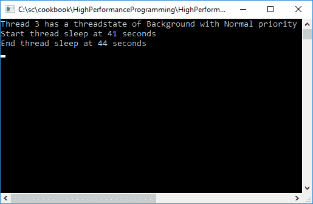
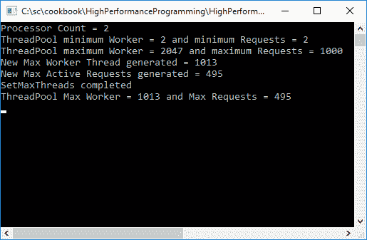
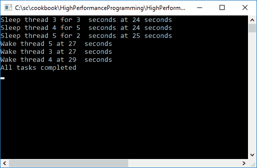
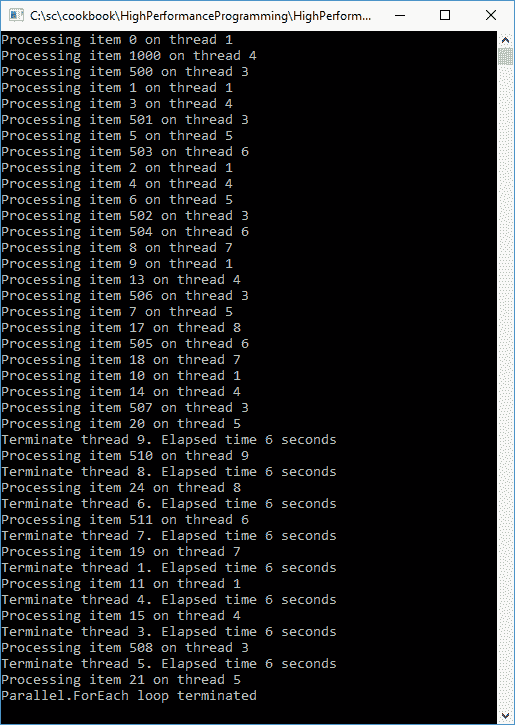
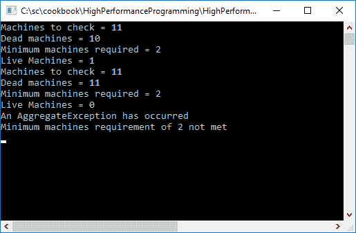
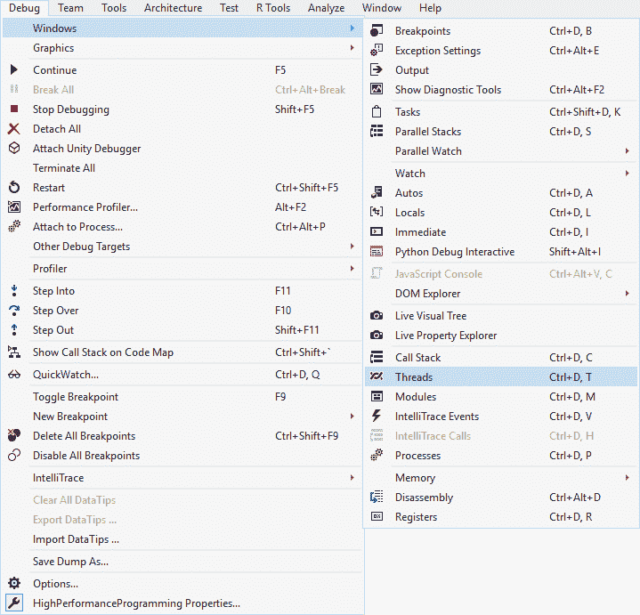
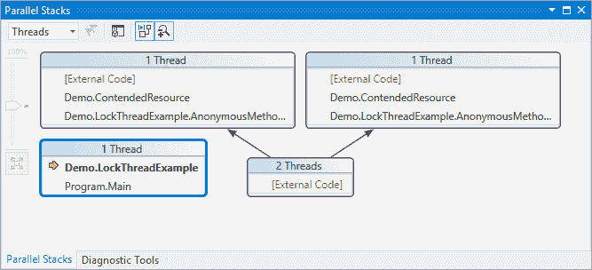

# C#中使用并行和多线程的高性能编程

本章介绍如何使用多线程和并行编程来提高代码的性能。在本章中，我们将介绍以下食谱:

*   创建和中止低优先级后台线程
*   增加最大线程池大小
*   创建多个线程
*   锁定一个线程，直到满足的资源可用
*   使用并行调用对方法的并行调用。引起
*   使用并行 foreach 循环
*   取消并行 foreach 循环
*   捕捉并行 foreach 循环中的错误
*   调试多线程

# 介绍

如果你今天能在电脑里找到一个单核 CPU，那很可能意味着你正站在一个博物馆里。今天的每一台新电脑都利用了多核的优势。程序员可以在自己的应用程序中利用这种额外的处理能力。随着应用程序规模和复杂性的增长，在许多情况下，它们实际上需要利用多线程。

虽然不是每种情况都适合多线程代码逻辑的实现，但是知道如何使用多线程来提高应用程序的性能是很好的。本章将带您了解这一令人兴奋的 C#编程技术的基础。

# 创建和中止低优先级后台线程

我们之所以要专门看一下后台线程，是因为默认情况下，主 app 线程或者`Thread`类构造器创建的所有线程都是前台线程。那么，前台线程和后台线程到底有什么区别呢？嗯，后台线程和前台线程是一样的，除了如果所有前台线程都被终止，后台线程也会停止。如果您的应用程序中有一个进程不能阻止应用程序终止，这将非常有用。换句话说，当应用程序运行时，后台线程必须继续运行。

# 准备好了

我们将创建一个简单的应用程序，将创建的线程定义为后台线程。然后，它将挂起、恢复和中止线程。

# 怎么做...

1.  在 Visual Studio 中创建新的控制台应用程序。

2.  接下来，将名为`Demo`的类添加到您的控制台应用程序中。

3.  在`Demo`类中，添加一个名为`DoBackgroundTask()`的带有`public void`修饰符的方法，并向其中添加以下控制台输出:

```cs
        public void DoBackgroundTask()
        {
          WriteLine($"Thread {Thread.CurrentThread.ManagedThreadId} has
          a threadstate of {Thread.CurrentThread.ThreadState} with
          {Thread.CurrentThread.Priority} priority");
          WriteLine($"Start thread sleep at {DateTime.Now.Second}
                    seconds");
          Thread.Sleep(3000);
          WriteLine($"End thread sleep at {DateTime.Now.Second} seconds");
        }

```

Make sure that you have added the `using` statements for `System.Threading` and `static System.Console` to your `using` statements.

4.  在控制台应用程序的`void Main`方法中，创建`Demo`类的新实例，并将其添加到名为`backgroundThread`的新线程中。将这个新创建的线程定义为后台线程，然后启动它。最后，将线程设置为休眠 5 秒。我们需要这样做，因为我们创建了一个设置为休眠 3 秒的后台线程。后台线程不禁止前台线程终止。因此，如果主应用程序线程(默认情况下是前台线程)在后台线程完成之前终止，应用程序将终止，并且还会终止后台线程:

```cs
        static void Main(string[] args)
        {
          Demo oRecipe = new Demo();
          var backgroundThread = new Thread(oRecipe.DoBackgroundTask);
          backgroundThread.IsBackground = true;
          backgroundThread.Start();
          Thread.Sleep(5000);
        }

```

5.  按下 *F5* 运行您的控制台应用程序。您将看到我们已经创建了一个具有正常优先级的后台线程:



6.  让我们修改我们的线程，并将其优先级设置为低。将这行代码添加到您的控制台应用程序中:

```cs
        backgroundThread.Priority = ThreadPriority.Lowest;

```

该行将降低线程优先级:

```cs
        Demo oRecipe = new Demo();
        var backgroundThread = new Thread(oRecipe.DoBackgroundTask);
        backgroundThread.IsBackground = true;
        backgroundThread.Priority = ThreadPriority.Lowest;
        backgroundThread.Start();
        Thread.Sleep(5000);

```

7.  再次运行您的控制台应用程序。这一次，您将看到线程优先级被设置为最低优先级:


8.  回到你的`DoBackgroundTask()`方法，在调用`Thread.Sleep(3000);`之前添加`Thread.CurrentThread.Abort();`。这一行将过早地杀死后台线程。您的代码应该如下所示:

```cs
        public void DoBackgroundTask()
        {
          WriteLine($"Thread {Thread.CurrentThread.ManagedThreadId} has a
          threadstate of {Thread.CurrentThread.ThreadState} with
          {Thread.CurrentThread.Priority} priority");   
          WriteLine($"Start thread sleep at {DateTime.Now.Second} 
                    seconds");
          Thread.CurrentThread.Abort();
          Thread.Sleep(3000);
          WriteLine($"End thread sleep at {DateTime.Now.Second} seconds");
        }

```

9.  当您运行控制台应用程序时，您将看到线程在调用`Thread.Sleep`方法之前被中止。但是，通常不建议以这种方式中止线程:


# 它是如何工作的...

能够创建一个后台线程是一种在不干扰主应用程序线程进程的情况下处理不同于主线程的线程的好方法。另一个额外的好处是，一旦主应用程序线程完成，后台线程就会终止。这个过程确保您的应用程序将优雅地终止。

# 增加最大线程池大小

中的线程池。NET 驻留在`System.Threading.ThreadPool`类中。一般来说，有很多关于创建自己的线程的讨论，而不是使用线程池。流行的观点认为线程池应该用于简短的任务。这是因为线程池的大小有限。系统中还有许多其他进程将使用线程池。因此，您不希望应用程序占用线程池中的所有线程。

规则是，您不能将最大工作线程或完成线程的数量设置为少于计算机上的处理器数量。也不允许将最大工作线程或完成线程设置为小于最小线程池大小。

# 准备好

我们将读取当前计算机上的处理器数量。然后，我们将获得允许的最小和最大线程池大小，在最小和最大线程池大小之间生成一个随机数，并设置线程池上的最大线程数。

# 怎么做...

1.  在`Demo`类中创建新方法`IncreaseThreadPoolSize()`。

2.  首先使用`Environment.ProcessorCount`添加代码读取当前机器上的处理器数量:

```cs
        public class Demo
        {
          public void IncreaseThreadPoolSize()
          {
             int numberOfProcessors = Environment.ProcessorCount;
             WriteLine($"Processor Count = {numberOfProcessors}");
          }
        }

```

3.  接下来，我们检索线程池中可用的最大和最小线程:

```cs
        int maxworkerThreads; 
        int maxconcurrentActiveRequests; 
        int minworkerThreads; 
        int minconcurrentActiveRequests; 
        ThreadPool.GetMinThreads(out minworkerThreads, 
          out  minconcurrentActiveRequests);
        WriteLine($"ThreadPool minimum Worker = {minworkerThreads} 
          and minimum Requests = {minconcurrentActiveRequests}");
        ThreadPool.GetMaxThreads(out maxworkerThreads, 
          out  maxconcurrentActiveRequests);
        WriteLine($"ThreadPool maximum Worker = {maxworkerThreads} 
          and maximum Requests = {maxconcurrentActiveRequests}");

```

4.  然后，我们在线程池中的最大和最小线程数之间生成一个随机数:

```cs
        Random rndWorkers = new Random(); 
        int newMaxWorker = rndWorkers.Next(minworkerThreads, 
          maxworkerThreads);
        WriteLine($"New Max Worker Thread generated = {newMaxWorker}"); 

        Random rndConRequests = new Random(); 
        int newMaxRequests = rndConRequests.Next(
        minconcurrentActiveRequests, maxconcurrentActiveRequests);
        WriteLine($"New Max Active Requests generated = {newMaxRequests}");

```

5.  我们现在需要尝试通过调用`SetMaxThreads`方法来设置线程池中的最大线程数，并将其设置为工作线程和完成端口线程的新随机最大值。超过此最大数量的任何请求都将排队，直到线程池线程再次变为活动状态。如果`SetMaxThreads`方法成功，该方法将返回真；否则，它将返回`false`。确保`SetMaxThreads`方法成功是个好主意:

```cs
        bool changeSucceeded = ThreadPool.SetMaxThreads(
          newMaxWorker, newMaxRequests); 
        if (changeSucceeded) 
        { 
           WriteLine("SetMaxThreads completed"); 
           int maxworkerThreadCount; 
           int maxconcurrentActiveRequestCount; 
           ThreadPool.GetMaxThreads(out maxworkerThreadCount, 
           out maxconcurrentActiveRequestCount); 
           WriteLine($"ThreadPool Max Worker = {maxworkerThreadCount} 
           and Max Requests = {maxconcurrentActiveRequestCount}"); 
        } 
        else 
           WriteLine("SetMaxThreads failed");

```

Worker threads is the maximum number of worker threads in the thread pool while the completion port threads is the maximum number of asynchronous I/O threads in the thread pool.

6.  当您在列出的步骤中添加了所有代码后，您的`IncreaseThreadPoolSize()`方法应该如下所示:

```cs
        public class Demo
        { 
          public void IncreaseThreadPoolSize() 
          { 
            int numberOfProcessors = Environment.ProcessorCount; 
            WriteLine($"Processor Count = {numberOfProcessors}"); 

            int maxworkerThreads; 
            int maxconcurrentActiveRequests; 
            int minworkerThreads; 
            int minconcurrentActiveRequests; 
            ThreadPool.GetMinThreads(out minworkerThreads, 
              out minconcurrentActiveRequests);  
            WriteLine($"ThreadPool minimum Worker = {minworkerThreads}
              and minimum Requests = {minconcurrentActiveRequests}"); 
            ThreadPool.GetMaxThreads(out maxworkerThreads, 
              out maxconcurrentActiveRequests);
            WriteLine($"ThreadPool maximum Worker = {maxworkerThreads} 
              and maximum Requests = {maxconcurrentActiveRequests}"); 

            Random rndWorkers = new Random(); 
            int newMaxWorker = rndWorkers.Next(minworkerThreads, 
              maxworkerThreads);
            WriteLine($"New Max Worker Thread generated = {newMaxWorker}"); 

            Random rndConRequests = new Random(); 
            int newMaxRequests = rndConRequests.Next(
              minconcurrentActiveRequests, 
              maxconcurrentActiveRequests);        
            WriteLine($"New Max Active Requests generated = 
                      {newMaxRequests}");

            bool changeSucceeded = ThreadPool.SetMaxThreads(
              newMaxWorker, newMaxRequests); 
            if (changeSucceeded) 
            { 
              WriteLine("SetMaxThreads completed"); 
              int maxworkerThreadCount; 
              int maxconcurrentActiveRequestCount; 
              ThreadPool.GetMaxThreads(out maxworkerThreadCount, 
                out maxconcurrentActiveRequestCount);             
              WriteLine($"ThreadPool Max Worker = {maxworkerThreadCount} 
              and Max Requests = {maxconcurrentActiveRequestCount}"); 
            } 
            else 
              WriteLine("SetMaxThreads failed"); 

          } 
        }

```

7.  前往您的控制台应用程序，创建您的`Demo`类的新实例，并调用`IncreaseThreadPoolSize()`方法:

```cs
        Demo oRecipe = new Demo(); 
        oRecipe.IncreaseThreadPoolSize(); 
        Console.ReadLine();

```

8.  最后，运行您的控制台应用程序并记录输出:



# 它是如何工作的...

从控制台应用中，我们可以看到处理器计数为`2`。因此，线程池线程的最小数量也等于`2`。然后，我们读取最大线程池大小，并在最小值和最大值之间生成一个随机数。最后，我们将最大线程池大小设置为随机生成的最小值和最大值。

虽然这只是一个概念证明，而不是在生产应用程序中要做的事情(将线程池设置为随机数)，但它清楚地说明了将线程池设置为开发人员指定的值的能力。

The code in this recipe was compiled for 32-bit. Try changing your application to a 64-bit application and run the code again. See the difference a 64-bit makes.

# 创建多个线程

有时候，我们需要创建多个线程。然而，在我们继续之前，我们需要等待这些线程完成它们需要做的任何事情。为此，使用任务是最合适的。

# 准备好了

确保将`using System.Threading.Tasks;`语句添加到`Recipes`类的顶部。

# 怎么做...

1.  在你的`Demo`类中创建一个名为`MultipleThreadWait()`的新方法。然后，使用`private`修改器创建第二个名为`RunThread()`的方法，该方法需要整数秒来使线程休眠。这将模拟在可变时间内做一些工作的过程:

```cs
        public class Demo 
        { 
          public void MultipleThreadWait() 
          {         

          } 

          private void RunThread(int sleepSeconds) 
          {         

          } 
        }

```

In reality, you would probably not call the same method. You could, for all intents and purposes, call three separate methods. Here, however, for simplicity's sake, we will call the same method with different sleep durations.

2.  将以下代码添加到您的`MultipleThreadWait()`方法中。您会注意到我们正在创建三个任务，然后创建三个线程。然后我们启动这三个线程，让它们休眠`3`、`5`和`2`秒。最后，我们调用`Task.WaitAll`方法等待，然后继续执行应用程序:

```cs
        Task thread1 = Task.Factory.StartNew(() => RunThread(3)); 
        Task thread2 = Task.Factory.StartNew(() => RunThread(5)); 
        Task thread3 = Task.Factory.StartNew(() => RunThread(2)); 

        Task.WaitAll(thread1, thread2, thread3); 
        WriteLine("All tasks completed");

```

3.  然后，在`RunThread()`方法中，我们读取当前线程 ID，然后使线程休眠所提供的毫秒数。这只是秒数乘以`1000`的整数值:

```cs
        int thread
        ID = Thread.CurrentThread.ManagedThreadId; 

        WriteLine($"Sleep thread {threadID} for {sleepSeconds} 
          seconds at {DateTime.Now.Second} seconds"); 
        Thread.Sleep(sleepSeconds * 1000); 
        WriteLine($"Wake thread {threadID} at {DateTime.Now.Second} 
                  seconds");

```

4.  完成代码后，您的`Demo`类应该如下所示:

```cs
        public class Demo 
        { 
          public void MultipleThreadWait() 
          { 
            Task thread1 = Task.Factory.StartNew(() => RunThread(3)); 
            Task thread2 = Task.Factory.StartNew(() => RunThread(5)); 
            Task thread3 = Task.Factory.StartNew(() => RunThread(2)); 

            Task.WaitAll(thread1, thread2, thread3); 
            WriteLine("All tasks completed"); 
          } 

          private void RunThread(int sleepSeconds) 
          { 
            int threadID = Thread.CurrentThread.ManagedThreadId; 
            WriteLine($"Sleep thread {threadID} for {sleepSeconds} 
              seconds at {DateTime.Now.Second}          seconds"); 
            Thread.Sleep(sleepSeconds * 1000); 
            WriteLine($"Wake thread {threadID} at {DateTime.Now.Second} 
                      seconds"); 
          } 
        }

```

5.  最后，向您的控制台应用程序添加一个新的`Demo`类实例，并调用`MultipleThreadWait()`方法:

```cs
        Demo oRecipe = new Demo(); 
        oRecipe.MultipleThreadWait(); 
        Console.ReadLine();

```

6.  运行您的控制台应用程序并查看生成的输出:



# 它是如何工作的...

您会注意到创建了三个线程(`thread 3`、`thread 4`和`thread 5`)。然后通过让它们睡不同的时间来暂停它们。每个线程唤醒后，代码等待所有三个线程完成，然后继续执行应用程序代码。

# 锁定一个线程，直到满足的资源可用

在某些情况下，我们希望将进程的唯一访问权授予特定的线程。我们可以使用`lock`关键字来做到这一点。因此，这将以线程安全的方式执行该进程。因此，当一个线程运行该进程时，它将在锁定范围内独占访问该进程。如果另一个线程试图访问锁定代码内部的进程，它将被阻塞，必须等待轮到它，直到锁被释放。

# 准备好了

对于这个例子，我们将使用任务。确保您已经将`using System.Threading.Tasks;`语句添加到了`Demo`类的顶部。

# 怎么做...

1.  在`Demo`类中，用`private`修改器添加一个名为`threadLock`的对象。然后，添加两个名为`LockThreadExample()`和`ContendedResource()`的方法，以整数秒为参数进行睡眠:

```cs
        public class Demo 
        { 
          private object threadLock = new object(); 
          public void LockThreadExample() 
          {         

          } 

          private void ContendedResource(int sleepSeconds) 
          {         

          } 
        }

```

It is considered to be a best practice to define the object to lock on as private.

2.  在`LockThreadExample()`方法中增加三个任务。他们将创建尝试同时访问同一代码段的线程。这段代码将等到所有线程完成后再终止应用程序:

```cs
        Task thread1 = Task.Factory.StartNew(() => ContendedResource(3));
        Task thread2 = Task.Factory.StartNew(() => ContendedResource(5));
        Task thread3 = Task.Factory.StartNew(() => ContendedResource(2)); 

        Task.WaitAll(thread1, thread2, thread3); 
        WriteLine("All tasks completed");

```

3.  在`ContendedResource()`方法中，使用`private threadLock`对象创建一个锁，然后使线程休眠传递给该方法的秒数作为参数:

```cs
        int threadID = Thread.CurrentThread.ManagedThreadId; 
        lock (threadLock) 
        { 
          WriteLine($"Locked for thread {threadID}"); 
          Thread.Sleep(sleepSeconds * 1000); 
        } 
        WriteLine($"Lock released for thread {threadID}");

```

4.  回到控制台应用程序，添加以下代码来实例化一个新的`Demo`类并调用`LockThreadExample()`方法:

```cs
        Demo oRecipe = new Demo(); 
        oRecipe.LockThreadExample(); 
        Console.ReadLine();

```

5.  运行控制台应用程序，查看控制台窗口的信息输出:


# 它是如何工作的...

我们可以看到`thread 4`获得了对竞争资源的独占访问。与此同时，`thread 3`和`thread 5`试图访问被`thread 4`锁定的竞争资源。这导致其他两个线程等待`thread 4`完成并释放锁。这样做的结果是代码以有序的方式执行，这可以在控制台窗口输出中看到。每个线程等待轮到它，直到它可以访问资源并锁定它的线程。

# 使用并行调用对方法的并行调用。引起

`Parallel.Invoke`允许我们并行执行任务(你猜对了)。有时，您需要同时执行操作，这样做可以加快处理速度。因此，您可以预期处理任务所花费的总时间等于运行时间最长的进程。使用`Parallel.Invoke`相当容易。

# 准备好了

确保您已经将`using System.Threading.Tasks;`语句添加到了`Demo`类的顶部。

# 怎么做...

1.  首先，在名为`ParallelInvoke()`和`PerformSomeTask()`的`Demo`类中创建两个方法，以整数秒的睡眠时间作为参数:

```cs
        public class Demo 
        { 
          public void ParallelInvoke() 
          {         

          } 

          private void PerformSomeTask(int sleepSeconds) 
          {         

          } 
        }

```

2.  将以下代码添加到`ParallelInvoke()`方法中。该代码将调用`Paralell.Invoke`来运行`PerformSomeTask()`方法:

```cs
        WriteLine($"Parallel.Invoke started at 
          {DateTime.Now.Second} seconds"); 
        Parallel.Invoke( 
          () => PerformSomeTask(3), 
          () => PerformSomeTask(5), 
          () => PerformSomeTask(2) 
        ); 

        WriteLine($"Parallel.Invoke completed at 
          {DateTime.Now.Second} seconds");

```

3.  在`PerformSomeTask()`方法中，使线程休眠传递给该方法的秒数作为参数(通过将其乘以`1000`将秒转换为毫秒):

```cs
        int threadID = Thread.CurrentThread.ManagedThreadId; 
        WriteLine($"Sleep thread {threadID} for 
          {sleepSeconds}  seconds"); 
        Thread.Sleep(sleepSeconds * 1000); 
        WriteLine($"Thread {threadID} resumed");

```

4.  添加完所有代码后，您的`Demo`类应该如下所示:

```cs
        public class Demo 
        { 
          public void ParallelInvoke() 
          { 
            WriteLine($"Parallel.Invoke started at 
                      {DateTime.Now.Second} seconds"); 
            Parallel.Invoke( 
              () => PerformSomeTask(3), 
              () => PerformSomeTask(5), 
              () => PerformSomeTask(2) 
            ); 

            WriteLine($"Parallel.Invoke completed at {DateTime.Now.Second} 
                      seconds");            
          } 

          private void PerformSomeTask(int sleepSeconds) 
          {         
            int threadID = Thread.CurrentThread.ManagedThreadId; 
            WriteLine($"Sleep thread {threadID} for {sleepSeconds} 
                      seconds"); 
            Thread.Sleep(sleepSeconds * 1000); 
            WriteLine($"Thread {threadID} resumed"); 
          } 
        }

```

5.  在控制台应用程序中，实例化`Demo`类的新实例，并调用`ParallelInvoke()`方法:

```cs
        Demo oRecipe = new Demo(); 
        oRecipe.ParallelInvoke(); 
        Console.ReadLine();

```

6.  运行控制台应用程序，查看控制台窗口中产生的输出:


# 它是如何工作的...

因为我们正在并行运行所有这些线程，所以我们可以假设最长的进程将表示所有任务的总持续时间。这意味着这个过程的总持续时间将为 5 秒，因为最长的任务需要 5 秒才能完成(我们将`thread 3`设置为最多休眠 5 秒)。

我们可以看到`Parallel.Invoke`开始和结束的时间差正好是 5 秒。

# 使用并行 foreach 循环

前阵子，在一次工作务虚会上(是的，我工作的公司真的很酷)，我的一个同事格雷厄姆·鲁克给我展示了一个平行的`foreach`循环。这当然大大加快了处理速度。但问题是。如果你在处理少量的数据或小任务，使用并行`foreach`循环是没有意义的。并行`foreach`循环在需要进行大量处理或需要处理大量数据时表现出色。

# 准备好

我们将从并行`foreach`循环没有比标准`foreach`循环表现更好的地方开始。为此，我们将创建一个包含 500 个项目的小列表，然后遍历列表，将项目写入控制台窗口。

对于第二个例子，它说明了并行`foreach`循环的力量，我们将使用相同的列表，并为列表中的每个项目创建一个文件。并联`foreach`回路的功率和益处将在第二个例子中显而易见。您需要添加`using System.Diagnostics;`和`using System.IO;`名称空间来运行这个食谱。

# 怎么做...

1.  首先在`Demo`类中创建两个方法。调用一个方法`ReadCollectionForEach()`并传递一个参数`List<string>`。创建第二个名为`ReadCollectionParallelForEach()`的方法，该方法也接受`List<string>`的参数:

```cs
        public class Demo 
        { 
          public double ReadCollectionForEach(List<string> intCollection) 
          {         

          } 

          public double ReadCollectionParallelForEach(List<string> 
            intCollection) 
          {         

          } 
        }

```

2.  在`ReadCollectionForEach()`方法中，添加一个标准的`foreach`循环，该循环将遍历传递给它的字符串集合，并将它找到的值写入控制台窗口。然后，清除控制台窗口。使用计时器记录`foreach`循环中经过的总秒数:

```cs
        var timer = Stopwatch.StartNew(); 
        foreach (string integer in intCollection) 
        { 
          WriteLine(integer); 
          Clear(); 
        } 
        return timer.Elapsed.TotalSeconds;

```

3.  在第二种方法中，称为`ReadCollectionParallelForEach()`，做同样的事情。但是，不要使用标准的`foreach`循环，而是添加一个`Parallel.ForEach`循环。您会注意到`Parallel.ForEach`循环看起来略有不同。`Parallel.ForEach`的签名要求您向它传递一个可枚举的数据源(`List<string> intCollection`)并定义一个动作，该动作是为每次迭代调用的委托(`integer`):

```cs
        var timer = Stopwatch.StartNew(); 
        Parallel.ForEach(intCollection, integer => 
        { 
          WriteLine(integer); 
          Clear(); 
        }); 
        return timer.Elapsed.TotalSeconds;

```

4.  当您添加了所有必需的代码后，您的`Demo`类应该如下所示:

```cs
        public class Demo 
        { 
          public double ReadCollectionForEach(List<string> intCollection) 
          {         
            var timer = Stopwatch.StartNew(); 
            foreach (string integer in intCollection) 
            { 
              WriteLine(integer); 
              Clear(); 
            } 
            return timer.Elapsed.TotalSeconds; 
          } 

          public double ReadCollectionParallelForEach(List<string> 
            intCollection) 
          {         
            var timer = Stopwatch.StartNew(); 
            Parallel.ForEach(intCollection, integer => 
            { 
              WriteLine(integer); 
              Clear(); 
            }); 
            return timer.Elapsed.TotalSeconds; 
          } 
        }

```

5.  在控制台应用程序中，创建`List<string>`集合，并将其传递给在`Demo`类中创建的两个方法。您会注意到，我们只创建了 500 个项目的集合。代码完成后，返回经过的时间(以秒为单位)，并将其输出到控制台窗口:

```cs
        List<string> integerList = new List<string>(); 
        for (int i = 0; i <= 500; i++) 
        { 
          integerList.Add(i.ToString()); 
        } 
        Demo oRecipe = new Demo(); 
        double timeElapsed1 = oRecipe.ReadCollectionForEach(integerList); 
        double timeElapsed2 = oRecipe.ReadCollectionParallelForEach(
          integerList); 
        WriteLine($"foreach executed in {timeElapsed1}"); 
        WriteLine($"Parallel.ForEach executed in {timeElapsed2}");

```

6.  运行您的应用程序。从显示的输出中，您将看到性能的差异。`Parallel.ForEach`循环实际上比`foreach`循环耗时更长:


7.  现在让我们用一个不同的例子。我们将创建一个流程密集型任务，并测量`Parallel.ForEach`循环将给予我们的性能增益。创建两个名为`CreateWriteFilesForEach()`和`CreateWriteFilesParallelForEach()`的方法，它们都以`List<string>`集合为参数:

```cs
        public class Demo 
        { 
          public void CreateWriteFilesForEach(List<string> intCollection) 
          {         

          } 

          public void CreateWriteFilesParallelForEach(List<string> 
            intCollection) 
          {         

          } 
        }

```

8.  将以下代码添加到`CreateWriteFilesForEach()`方法中。这段代码启动计时器，并在`List<string>`对象上执行标准的`foreach`循环。然后，它将经过的时间写入控制台窗口:

```cs
        WriteLine($"Start foreach File method"); 
        var timer = Stopwatch.StartNew(); 
        foreach (string integer in intCollection) 
        {     

        } 
        WriteLine($"foreach File method executed in           {timer.Elapsed.TotalSeconds} seconds");

```

9.  在`foreach`循环中，添加代码以检查是否存在通过将`integer`值附加到`filePath`变量的文件名部分而创建的具有特定名称的文件。创建文件(确保使用`Dispose`方法，以免在尝试写入文件时锁定文件)，并向新创建的文件写入一些文本:

```cs
        string filePath =  $"C:\temp\output\ForEach_Log{integer}.txt"; 
        if (!File.Exists(filePath)) 
        { 
          File.Create(filePath).Dispose(); 
          using (StreamWriter sw = new StreamWriter(filePath, false)) 
          { 
            sw.WriteLine($"{integer}. Log file start:               {DateTime.Now.ToUniversalTime().ToString()}"); 
          } 
        }

```

10.  接下来，将此代码添加到`CreateWriteFilesParallelForEach()`方法中，该方法基本上执行与`CreateWriteFilesForEach()`方法相同的功能，但是使用`Parallel.ForEach`循环来创建和写入文件:

```cs
        WriteLine($"Start Parallel.ForEach File method"); 
        var timer = Stopwatch.StartNew(); 
        Parallel.ForEach(intCollection, integer => 
        { 

        }); 
        WriteLine($"Parallel.ForEach File method executed in          {timer.Elapsed.TotalSeconds} seconds");

```

11.  在`Parallel.ForEach`循环中添加稍加修改的文件创建代码:

```cs
        string filePath = $"C:\temp\output\ParallelForEach_Log{
          integer}.txt"; 
        if (!File.Exists(filePath)) 
        { 
          File.Create(filePath).Dispose(); 
          using (StreamWriter sw = new StreamWriter(filePath, false)) 
          { 
            sw.WriteLine($"{integer}. Log file start:               {DateTime.Now.ToUniversalTime().ToString()}"); 
          } 
        }

```

12.  完成后，您的代码需要如下所示:

```cs
        public class Demo 
        { 
          public void CreateWriteFilesForEach(List<string> intCollection) 
          {         
            WriteLine($"Start foreach File method"); 
            var timer = Stopwatch.StartNew(); 
            foreach (string integer in intCollection) 
            { 
              string filePath = $"C:\temp\output\ForEach_Log{integer}.txt"; 
              if (!File.Exists(filePath)) 
              { 
                File.Create(filePath).Dispose(); 
                using (StreamWriter sw = new StreamWriter(filePath, false)) 
                { 
                    sw.WriteLine($"{integer}. Log file start:                     {DateTime.Now.ToUniversalTime().ToString()}"); 
                } 
              } 
            } 
            WriteLine($"foreach File method executed in {
                      timer.Elapsed.TotalSeconds} seconds"); 
          } 

          public void CreateWriteFilesParallelForEach(List<string> 
            intCollection) 
          {         
            WriteLine($"Start Parallel.ForEach File method"); 
            var timer = Stopwatch.StartNew(); 
            Parallel.ForEach(intCollection, integer => 
            { 
              string filePath = $"C:\temp\output\ParallelForEach_Log 
                {integer}.txt"; 
              if (!File.Exists(filePath)) 
              { 
                File.Create(filePath).Dispose(); 
                using (StreamWriter sw = new StreamWriter(filePath, false)) 
                { 
                  sw.WriteLine($"{integer}. Log file start:                     {DateTime.Now.ToUniversalTime().ToString()}"); 
                } 
              }                 
            }); 
            WriteLine($"Parallel.ForEach File method executed in             {timer.Elapsed.TotalSeconds} seconds"); 
          } 
        }

```

13.  前往控制台应用程序，稍微修改`List<string>`对象，并将计数从`500`增加到`1000`。然后，调用在`Demo`类中创建的文件方法:

```cs
        List<string> integerList = new List<string>(); 
        for (int i = 0; i <= 1000; i++) 
        { 
          integerList.Add(i.ToString()); 
        } 

        Demo oRecipe = new Demo(); 
        oRecipe.CreateWriteFilesForEach(integerList); 
        oRecipe.CreateWriteFilesParallelForEach(integerList); 
        ReadLine();

```

14.  最后，当你准备好的时候，确保你有`C:tempoutput`目录，并且那个目录中没有任何其他文件。运行应用程序，并在控制台窗口中查看输出。这一次，我们可以看到`Parallel.ForEach`循环带来了巨大的变化。性能提升是巨大的，并且预示着比标准的`foreach`环路提高了 47.42%:


# 它是如何工作的...

从本食谱中使用的例子来看，很明显应该仔细考虑并行`foreach`循环的使用。如果您处理的是相对少量的数据或非流程密集型事务，并行`foreach`循环不会给应用程序的性能带来太大好处。在某些情况下，标准的`foreach`环可能比平行的`foreach`环快得多。但是，如果您发现应用程序在处理大量数据或运行处理器密集型任务时遇到性能问题，请尝试并行`foreach`循环。可能会让你大吃一惊。

# 取消并行 foreach 循环

当处理并行`foreach`循环时，显而易见的问题是如何基于某个条件(如超时)提前终止循环。事实证明，并行`foreach`循环很容易过早终止。

# 准备好

我们将创建一个方法，该方法获取一个项目集合，并以并行`foreach`循环的方式遍历该集合。它还将知道一个超时值，如果超过该值，将终止循环并退出方法。

# 怎么做...

1.  首先在`Demo`类中创建一个名为`CancelParallelForEach()`的新方法，它采用两个参数。一个是`List<string>`的集合，另一个是指定超时值的整数。当超过超时值时，`Parallel.ForEach`循环必须终止:

```cs
        public class Demo 
        { 
          public void CancelParallelForEach(List<string> intCollection, 
            int timeOut) 
          {         

          }     
        }

```

2.  在`CancelParallelForEach()`方法中，添加一个计时器来记录经过的时间。这将向循环发出信号，表明已超过超时阈值，循环需要退出。创建定义状态的`Parallel.ForEach`方法。在每次迭代中，根据超时值检查经过的时间，如果超过超时值，则退出循环:

```cs
        var timer = Stopwatch.StartNew(); 
        Parallel.ForEach(intCollection, (integer, state) => 
        { 
          Thread.Sleep(1000); 
          if (timer.Elapsed.Seconds > timeOut) 
          { 
            WriteLine($"Terminate thread {Thread.CurrentThread
              .ManagedThreadId}. Elapsed time {
              timer.Elapsed.Seconds} seconds"); 
            state.Break(); 
          } 
          WriteLine($"Processing item {integer} on thread           {Thread.CurrentThread.ManagedThreadId}"); 
        });

```

3.  在控制台应用程序中，创建`List<string>`对象并向其添加`1000`项。只超时`5`秒调用`CancelParallelForEach()`方法:

```cs
        List<string> integerList = new List<string>(); 
        for (int i = 0; i <= 1000; i++) 
        { 
          integerList.Add(i.ToString()); 
        } 

        Demo oRecipe = new Demo(); 
        oRecipe.CancelParallelForEach(integerList, 5); 
        WriteLine($"Parallel.ForEach loop terminated"); 
        ReadLine();

```

4.  运行控制台应用程序并查看输出结果:



# 它是如何工作的...

您可以从控制台窗口输出中看到，一旦经过的时间超过超时值，并行循环就会被通知在系统最早方便的时候停止执行当前迭代之外的迭代。对`Parallel.ForEach`循环进行这种控制允许开发人员避免失控循环，并通过点击按钮或在达到超时值时自动让应用程序终止来给予用户取消循环操作的控制。

# 捕捉并行 foreach 循环中的错误

使用并行的`foreach`循环，开发人员可以将循环包装在`try...catch`语句中。然而，需要小心，因为`Parallel.ForEach`会抛出`AggregatedException`，它会遇到几个线程合并成一个线程的例外情况。

# 准备好

我们将创建一个包含机器 IP 地址集合的`List<string>`对象。`Parallel.ForEach`循环将检查 IP 地址，以查看给定 IP 另一端的机器是否处于活动状态。它通过查验 IP 地址来做到这一点。执行`Parallel.ForEach`循环的方法也将以整数值给出所需的最小活动机器。如果不满足存活机器的最小数量，将引发异常。

# 怎么做...

1.  在`Demo`类中，添加一个名为`CheckClientMachinesOnline()`的方法，该方法将一组`List<string>`IP 地址和一个整数作为参数，该整数指定了需要联机的最小机器数量。增加第二种方法`MachineReturnedPing()`，会收到一个 IP 地址进行 ping。出于我们的目的，我们将返回`false`来模拟一个死机器(对 IP 地址的 ping 超时):

```cs
        public class Recipes 
        { 
          public void CheckClientMachinesOnline(List<string> ipAddresses, 
            int minimumLive) 
          {         

          }    

          private bool MachineReturnedPing(string ip)   
          {             
            return false; 
          }  
        }

```

2.  在`CheckClientMachinesOnline()`方法中，添加`Parallel.ForEach`循环并创建`ParallelOptions`变量，该变量将指定平行度。将所有这些代码包装在一个`try...catch`语句中，并捕获一个`AggregateException`:

```cs
        try 
        { 
          int machineCount = ipAddresses.Count();                 
          var options = new ParallelOptions(); 
          options.MaxDegreeOfParallelism = machineCount; 
          int deadMachines = 0; 

          Parallel.ForEach(ipAddresses, options, ip => 
          { 

          }); 
        } 
        catch (AggregateException aex) 
        { 
          WriteLine("An AggregateException has occurred"); 
          throw; 
        }

```

3.  在`Parallel.ForEach`循环内部，通过调用`MachineReturnedPing()`方法编写代码检查机器是否在线。在我们的例子中，这个方法将总是返回`false`。您会注意到，我们正在通过`Interlocked.Increment`方法跟踪离线机器计数。这只是在`Parallel.ForEach`循环的线程中递增变量的一种方式:

```cs
        if (MachineReturnedPing(ip)) 
        { 

        } 
        else 
        {                         
          if (machineCount - Interlocked.Increment(ref deadMachines) 
              < minimumLive) 
          { 
            WriteLine($"Machines to check = {machineCount}"); 
            WriteLine($"Dead machines = {deadMachines}"); 
            WriteLine($"Minimum machines required = {minimumLive}"); 
            WriteLine($"Live Machines = {machineCount - deadMachines}"); 
            throw new Exception($"Minimum machines requirement of 
              {minimumLive} not met"); 
          } 
        }

```

4.  如果您正确添加了所有代码，您的`Demo`类将如下所示:

```cs
        public class Demo 
        { 
          public void CheckClientMachinesOnline(List<string> ipAddresses, 
            int minimumLive) 
          {         
            try 
            { 
              int machineCount = ipAddresses.Count();                 
              var options = new ParallelOptions(); 
              options.MaxDegreeOfParallelism = machineCount; 
              int deadMachines = 0; 

              Parallel.ForEach(ipAddresses, options, ip => 
              { 
                if (MachineReturnedPing(ip)) 
                { 

                } 
                else 
                {                         
                  if (machineCount - Interlocked.Increment(
                      ref deadMachines) < minimumLive) 
                  { 
                    WriteLine($"Machines to check = {machineCount}");                            
                    WriteLine($"Dead machines = {deadMachines}"); 
                    WriteLine($"Minimum machines required = 
                              {minimumLive}"); 
                    WriteLine($"Live Machines = {machineCount - 
                              deadMachines}"); 
                    throw new Exception($"Minimum machines requirement 
                                        of {minimumLive} not met"); 
                  } 
                } 
              }); 
            } 
            catch (AggregateException aex) 
            { 
              WriteLine("An AggregateException has occurred"); 
              throw; 
            } 
          }    

          private bool MachineReturnedPing(string ip) 
          {             
            return false; 
          }  
        }

```

5.  在控制台应用程序中，创建`List<string>`对象来存储虚拟 IP 地址的集合。实例化您的`Demo`类并调用`CheckClientMachinesOnline()`方法，将 IP 地址集合和在线所需的最小机器数量传递给它:

```cs
        List<string> ipList = new List<string>(); 
        for (int i = 0; i <= 10; i++) 
        { 
          ipList.Add($"10.0.0.{i.ToString()}"); 
        } 

        try 
        { 
          Demo oRecipe = new Demo(); 
          oRecipe.CheckClientMachinesOnline(ipList, 2); 
        } 
        catch (Exception ex) 
        { 
          WriteLine(ex.InnerException.Message); 
        } 
        ReadLine();

```

6.  运行应用程序并在控制台窗口中查看输出:



Just a point to note. If you have Just My Code enabled, in some cases Visual Studio will break on the line that throws the exception. It might also say that the exception is not handled by the user code. You can just press *F5* to continue. To prevent this from happening, uncheck Enable Just My Code under Tools, Options, Debugging, and General.

# 它是如何工作的...

从控制台窗口输出中，您可以看到没有达到联机所需的最小计算机数量。然后应用程序抛出一个异常，并从`Parallel.ForEach`循环中捕捉到它。能够在类似这样的并行循环中处理异常对于保持应用程序的稳定性至关重要，因为能够在异常发生时处理异常。

我鼓励你玩一下`Parallel.ForEach`循环，深入`AggregareException`类的一些内部方法，以便更好地理解它。

# 调试多线程

在 Visual Studio 中调试多个线程很棘手，尤其是因为这些线程都是同时运行的。幸运的是，作为开发人员，我们有一些工具可以用来更好地理解多线程应用程序中发生的事情。

# 准备好了

调试多线程应用程序时，您可以通过导航到 Visual Studio 中的调试|窗口来访问各种窗口。

# 怎么做...

1.  在代码的某处添加断点后，开始调试多线程应用程序。您可以通过转到 Visual Studio 中的调试|窗口来访问各种调试窗口:



2.  您可以使用的第一个窗口是线程窗口。进入 Visual Studio 中的调试|窗口，或输入 *Ctrl* + *D* 、 *T* 即可。在这里，你可以右击一个线程来观察和标记它。如果您已经给出了线程名称，您将会看到这些名称出现在“名称”列中。要给你的线程起一个名字，修改在早期配方中创建的`LockThreadExample()`方法。

```cs
        public void LockThreadExample()
        {
          Task thread1 = Task.Factory.StartNew(() => ContendedResource(3));
          Task thread2 = Task.Factory.StartNew(() => ContendedResource(5));
          Task thread3 = Task.Factory.StartNew(() => ContendedResource(2)); 

          int threadID = Thread.CurrentThread.ManagedThreadId; 
          Thread.CurrentThread.Name = $"New Thread{threadID}";

          Task.WaitAll(thread1, thread2, thread3); 
          WriteLine("All tasks completed");
        }

```

您还将能够在调试器中看到当前活动的线程。它将被标上黄色箭头。然后是托管标识，这是您之前用来创建唯一线程名的同一标识。

“位置”列显示线程所在的当前方法。“线程”窗口允许您通过双击“位置”字段来查看线程堆栈。您也可以冻结和解冻线程。冻结会阻止线程执行，而解冻会让冻结的线程继续正常运行。


3.  可以通过转到调试|窗口或按住*Ctrl*+*Shift*+*D*、 *K* 来访问任务窗口。要看到这个动作，在你的`LockThreadExample()`方法中的一个断点放在上面写着`Task.WaitAll(thread1, thread2, thread3);`的线上。再次调试应用程序，查看每个创建的线程的状态列。任务的状态显示了当时的状态，我们可以看到这三个线程是活动的、阻止的和计划的:


4.  可以通过在 Visual Studio 中转到调试|窗口或按住 *Ctrl* + *D* + *S* 键来访问并行堆栈窗口。在这里，您可以看到任务和线程的图形视图。通过在“并行堆栈”窗口左上角的下拉列表中进行选择，可以在“线程”和“任务”视图之间切换:



5.  将选择更改为任务将向您显示调试会话中的当前任务:


6.  下一个窗口，无疑是我最喜欢的，是平行观察窗口。它实际上与 Visual Studio 中的标准“监视”窗口相同，但它监视应用程序中所有线程的值。您可以在并行监视中键入任何有效的 C#表达式，并在调试会话中看到此时的值。通过添加几个断点并在平行观察中添加表达式来尝试它。

# 它是如何工作的...

能够在 Visual Studio 中有效地使用多线程应用程序的调试工具，可以更容易地理解应用程序的结构，并帮助您识别可能的错误、瓶颈和关注领域。

我鼓励您更多地了解这些可供您使用的各种调试窗口。