# 探索.NETCore 1.1

本章将探讨.NETCore 1.1。我们会看到什么。NET Core 是什么，你可以用它做什么。我们将关注:

*   创建一个简单的.NETCore应用并在 Mac 上运行
*   创建您的第一个 ASP.NETCore应用
*   发布 ASP.NETCore应用

# 介绍

最近有很多关于.NETCore。真的有很多文章解释什么。NET Core 是什么，它做什么。简单来说就是，。NET Core 允许您创建在 Windows、Linux 和 macOS 上运行的跨平台应用。它通过利用一个. NET 标准库来实现这一点，该标准库以完全相同的代码针对所有这些平台。因此，您可以使用自己熟悉的语言和工具来创建应用。它支持 C#、VB 和 F#，甚至允许使用泛型、异步支持和 LINQ 等构造。有关的更多信息和文档。网芯，去[https://www.microsoft.com/net/core](https://www.microsoft.com/net/core)。

# 创建一个简单的.NETCore应用并在 Mac 上运行

我们将了解如何使用 Visual Studio 2017 在 Windows 上创建应用，然后在 Mac 上运行该应用。这种应用开发以前是不可能的，因为你不能在苹果电脑上运行为视窗系统编译的代码。。NET Core 改变了这一切。

# 准备好

要运行您创建的应用，您需要访问苹果电脑。我使用的是 Mac mini(2012 年末)，搭载 2.5 GHz 英特尔酷睿 i5 CPU，运行内存 4GB 的 macOS Sierra。
为了利用你的。在苹果电脑上，你需要做几件事:

1.  我们需要安装 Homebrew，它是用来获取最新版本的 OpenSSL 的。通过在聚光灯搜索中键入`Terminal`打开苹果电脑上的终端:

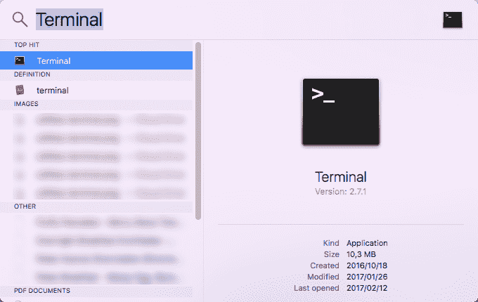

The following steps can also be completed by going to [https://www.microsoft.com/net/core# macos](https://www.microsoft.com/net/core# macos)  and performing these on your Mac.

2.  在终端提示处粘贴以下内容，按*进入*:

```cs
        /usr/bin/ruby -e "$(curl -fsSL         https://raw.githubusercontent.com/Homebrew/install/master/install)"

```

3.  如果终端要求您输入密码，请输入密码并按*进入*。你打字时什么也看不见。这很正常。只需输入您的密码并按*进入*继续。

The requirements for installing Homebrew are an Intel CPU, OS X 10.10 or higher, **Command Line Tools** (**CLT**) for Xcode, and a Bourne-compatible shell for installation, such as bash or zsh. Terminal is thus well suited.

根据您的互联网连接速度以及您是否安装了 CLT Xcode，安装家酿的过程可能需要一些时间来完成。完成后，终端应如下所示:


输入`brew help`会显示一些有用的命令:

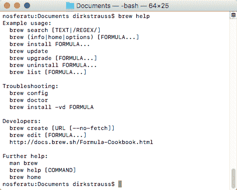

在终端中依次运行以下命令:

*   `brew update`
*   `brew install openssl`
*   `mkdir -p /usr/local/lib`
*   `ln -s /usr/local/opt/openssl/lib/libcrypto.1.0.0.dylib /usr/local/lib/`
*   `ln -s /usr/local/opt/openssl/lib/libssl.1.0.0.dylib /usr/local/lib/`

然后我们需要安装。NET 代码软件开发工具包。从网址[https://www.microsoft.com/net/core# macos](https://www.microsoft.com/net/core# macos)点击下载。NET Core SDK 按钮。下载完成后，点击`.pkg`文件下载。单击继续按钮安装。NET Core 1.1.0 软件开发工具包:

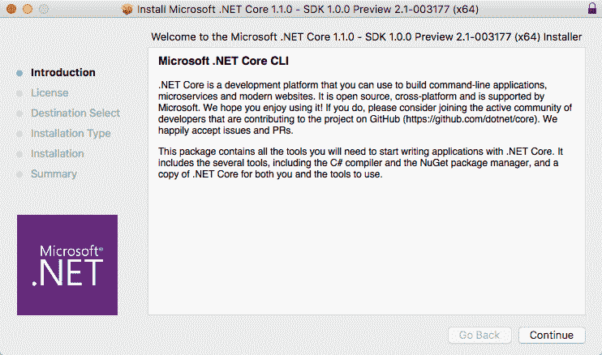

# 怎么做...

1.  我们将在 Visual Studio 2017 中创建一个. NET Core 控制台应用。在 Visual C# 模板下，选择.NETCore和一个控制台应用(.NETCore)项目:

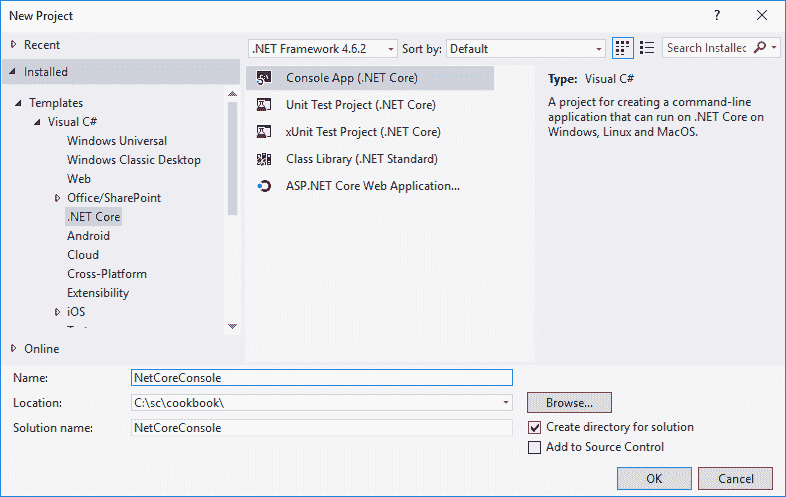

2.  创建控制台应用时，代码如下所示:

```cs
        using System;

        class Program
        {
          static void Main(string[] args)
          {
            Console.WriteLine("Hello World!");
          }
        }

```

3.  修改您的代码，如下所示:

```cs
        static void Main(string[] args)
        {
          Console.WriteLine("I can run on Windows, Linux and macOS");
          GetSystemInfo();
          Console.ReadLine();
        }

        private static void GetSystemInfo()
        {
          var osInfo = System.Runtime.InteropServices.RuntimeInformation.OSDescription;
          Console.WriteLine($"Current OS is: {osInfo}");
        }

```

4.  方法`GetSystemInfo()`只是返回控制台应用当前运行的当前操作系统。我的应用的`csproj`文件如下所示:

```cs
        <Project ToolsVersion="15.0"           >
          <Import Project="$(MSBuildExtensionsPath)$(MSBuildToolsVersion)
            Microsoft.Common.props" />
            <PropertyGroup>
              <OutputType>Exe</OutputType>
              <TargetFramework>netcoreapp1.1</TargetFramework>
            </PropertyGroup>
            <ItemGroup>
              <Compile Include="***.cs" />
              <EmbeddedResource Include="***.resx" />
            </ItemGroup>
            <ItemGroup>
              <PackageReference Include="Microsoft.NETCore.App">
                <Version>1.1.0</Version>
              </PackageReference>
              <PackageReference Include="Microsoft.NET.Sdk">
                <Version>1.0.0-alpha-20161104-2</Version>
                <PrivateAssets>All</PrivateAssets>
              </PackageReference>
            </ItemGroup>
          <Import Project="$(MSBuildToolsPath)Microsoft.CSharp.targets" />
        </Project>

```

`<version>`定义为`1.1.0`。

If you are still running Visual Studio 2017 RC, it would be a good idea to check your installed NuGet packages to see whether there is an update available for your .NET Core version from .NET Core 1.0 to .NET Core 1.1.

# 它是如何工作的...

按 *F5* 运行您的控制台应用。您将看到操作系统显示在输出中:


转到控制台应用的`bin`文件夹，将文件复制到 Mac 桌面上的一个文件夹中。叫那个文件夹`consoleApp`。在终端中，导航到包含复制文件的文件夹。您可以通过键入命令`cd ./Desktop`然后键入`ls`来列出桌面上的内容。检查您创建的文件夹是否列出，如果是，在终端类型`cd ./consoleApp`中。通过输入`ls`，再次列出`consoleApp`文件夹的内容。在我的例子中，DLL 被称为`NetCoreConsole.dll`。要运行您之前编写的代码，请键入`dotnet NetCoreConsole.dll`并按*回车:*

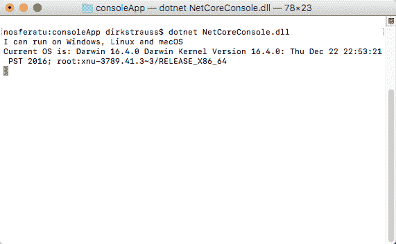

您可以看到代码正在运行，文本在终端中输出。

If, by any chance, you find that trying to run the `dotnet` command (after installing the .NET Core SDK) results in an error saying `command not found`, try the following. In Terminal type the following and press Enter: `ln -s /usr/local/share/dotnet/dotnet /usr/local/bin/`, which adds a symbolic link. Running the `dotnet` command should work after this.

# 创建您的第一个 ASP.NETCore应用

让我们看看如何构建您的第一个 ASP.NETCore应用。在本食谱中，我们将只创建一个非常基本的 ASP.NETCore应用，并简要讨论`Startup`类。需要对该主题进行进一步的阅读，这不包括在 ASP.NETCore的简要介绍中。

# 准备好了

首先在 Visual Studio 2017 中创建新项目。在 Visual C# 下，选择.NETCore节点，然后单击 ASP.NETCore网络应用....点击确定:


然后，您将看到项目模板选择。您可以选择创建一个空应用、一个网络应用接口(允许您创建一个基于 HTTP 的应用接口)或一个完整的网络应用。选择空模板，确保云中的主机未被选中，然后单击确定:

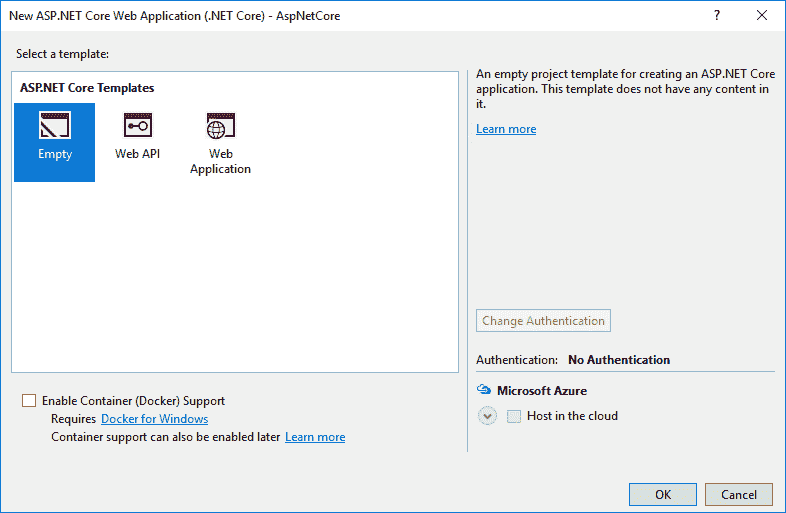

Note how the templates window allows you to enable Docker support. Docker allows you to develop applications inside containers that contain a complete file system and everything else required to run your application. This means that your software will always function exactly the same, regardless of the environment it is in. For more on Docker, visit [www.docker.com](https://www.docker.com/).

创建 ASP.NETCore应用后，您的解决方案资源管理器将如下所示:

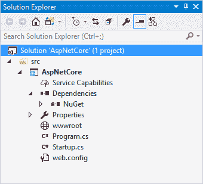

If you are running Visual Studio 2017 RC, what you need to do is click on Tools, NuGet Package Manager, Manage NuGet Packages for Solution... and see if there are any updates to .NET Core. If you are on .NET Core 1.01, there should be an update to .NET Core 1.1 available via NuGet. Let NuGet update your project dependencies for you. After doing this, you must browse to [https://www.microsoft.com/net/download/core#/current](https://www.microsoft.com/net/download/core#/current)  and make sure that you have selected the Current option under All downloads. Download the current .NET Core SDK installer for Windows and install it.

此时，您可以按下 *Ctrl* + *F5* 开始不调试并启动您的 ASP.NETCore应用。这将启动 IIS Express，它是 ASP.NETCore应用的默认主机。它现在唯一做的就是显示文本 Hello World！。您已经成功创建并运行了 ASP.NETCore应用。暂时不要关闭浏览器。保持打开状态:

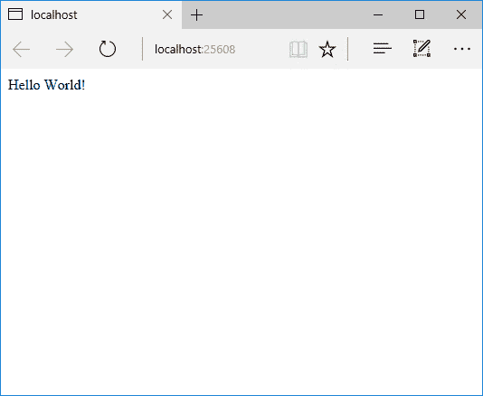

Note that the port number 25608 in the URL of the browser is a randomly selected port. The port number you will see will most likely be different than in the book.

# 怎么做...

1.  右键单击解决方案资源管理器中的解决方案，然后单击文件资源管理器中的打开文件夹。你会注意到你有一个名为`src`的文件夹。点击进入该文件夹，点击其中的`AspNetCore`子文件夹:


2.  比较`AspNetCore`文件夹和 Visual Studio 中的解决方案资源管理器的内容会发现它们实际上是相同的。这是因为在 ASP.NETCore中，Windows 文件系统决定了 Visual Studio 中的解决方案:

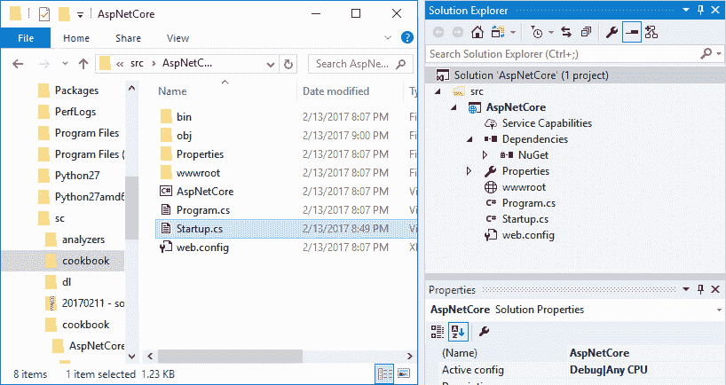

3.  在 Windows 文件浏览器中，右键点击`Startup.cs`文件，在记事本中编辑。您将在记事本中看到以下代码:

```cs
        using System;
        using System.Collections.Generic;
        using System.Linq;
        using System.Threading.Tasks;
        using Microsoft.AspNetCore.Builder;
        using Microsoft.AspNetCore.Hosting;
        using Microsoft.AspNetCore.Http;
        using Microsoft.Extensions.DependencyInjection;
        using Microsoft.Extensions.Logging;

        namespace AspNetCore
        {
          public class Startup
          {
            // This method gets called by the runtime. Use this method 
               to add services to the container.
            // For more information on how to configure your application, 
               visit https://go.microsoft.com/fwlink/?LinkID=398940
            public void ConfigureServices(IServiceCollection services)
            {
            }

            // This method gets called by the runtime. Use this method 
               to configure the HTTP request pipeline.
            public void Configure(IApplicationBuilder app, 
              IHostingEnvironment env, ILoggerFactory loggerFactory)
            {
              loggerFactory.AddConsole();

              if (env.IsDevelopment())
              {
                app.UseDeveloperExceptionPage();
              }

              app.Run(async (context) =>
              {
                await context.Response.WriteAsync("Hello World!");
              });
            }
          }
        }

```

4.  还是在记事本里，编辑写着`await context.Response.WriteAsync("Hello World!");`的那一行，改成`await context.Response.WriteAsync($"The date is {DateTime.Now.ToString("dd MMM yyyy")}");`。将文件保存在记事本中，然后转到浏览器并刷新它。您将看到这些更改显示在浏览器中，而我根本不用在 Visual Studio 中编辑它。这是因为(如前所述)Visual Studio 使用文件系统来确定项目结构，ASP.NET Core 检测到对`Startup.cs`文件的更改，并自动动态重新编译该文件:


5.  更详细地看一下解决方案资源管理器，我想突出显示项目中的一些文件。`wwwroot`文件夹在托管时将代表网站的根目录。您将在这里放置静态文件，如图像、JavaScript 和 CSS 样式表文件。另一个感兴趣的文件是`Startup.cs`文件，它基本上取代了`Global.asax`文件。您可以在`Startup.cs`文件中编写代码，以便在 ASP.NETCore应用启动时执行:


# 它是如何工作的

`Startup.cs`文件包含`Startup`类。ASP.NETCore需要一个`Startup`类，默认情况下会寻找这个类。按照惯例，`Startup`班被称为`Startup`，但是如果你愿意，你可以称它为其他班。如果需要重命名，那么还需要确保修改`Program.cs`文件，以便`WebHostBuilder()`为`.UseStartup`指定正确的类名:

```cs
public static void Main(string[] args)
{
   var host = new WebHostBuilder()
       .UseKestrel()
       .UseContentRoot(Directory.GetCurrentDirectory())
       .UseIISIntegration()
       .UseStartup<Startup>()
       .Build();

   host.Run();
}

```

回到我们在`Startup.cs`文件中的`Startup`类，当你查看这个类时，你会看到两个方法。方法是`Configure()`和`ConfigureServices()`。从对`Configure()`方法的评论中可以看出，它是用来*配置 HTTP 请求管道*的。基本上，传入的请求在这里由应用处理，它目前在我们的应用中所做的就是显示每个传入请求的当前日期。`ConfigureServices()`方法在`Configure()`之前调用，可选。它的明确目的是添加应用所需的任何服务。ASP.NETCore本地支持依赖注入。这意味着如果我可以通过将服务注入到`Startup`类中的方法来利用它们。关于 DI 的更多信息，请务必阅读[https://docs . Microsoft . com/en-us/aspnet/core/foundation/dependency-injection](https://docs.microsoft.com/en-us/aspnet/core/fundamentals/dependency-injection)。

# 发布 ASP.NETCore应用

发布 ASP.NETCore应用非常简单。我们将研究通过命令提示符(以管理员身份运行)发布应用，然后将 ASP.NETCore应用发布到 Windows 服务器上的 IIS。

# 准备好

为此，您需要设置 IIS。启动程序和功能，然后单击程序和功能表单左侧的打开或关闭窗口功能。确保选择了互联网信息服务。选择 IIS 时，单击“确定”打开该功能:


您还需要确保已经安装了.NETCore Windows 服务器托管捆绑包，它将在 IIS 和红隼服务器之间创建反向代理。

At the time of this writing, the .NET Core Windows Server Hosting bundle is available at the following link: 
[https://docs.microsoft.com/en-us/aspnet/core/publishing/iis# install-the-net-core-windows-server-hosting-bundle](https://docs.microsoft.com/en-us/aspnet/core/publishing/iis# install-the-net-core-windows-server-hosting-bundle)

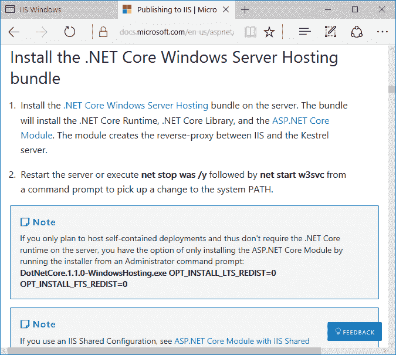

安装后.NETCore Windows 服务器托管包，您需要重新启动 IIS:

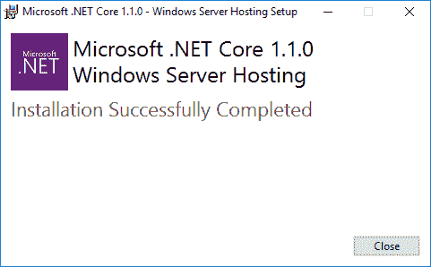

以管理员身份打开命令提示符，输入`iisreset`并按*回车。*这将停止，然后启动 IIS:

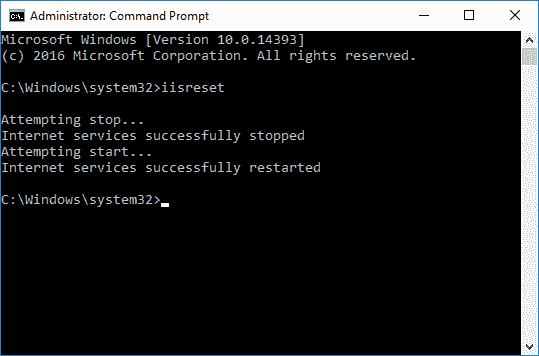

# 怎么做...

1.  以管理员身份运行命令提示符，打开命令提示符。在命令提示符下，转到项目的`src\AspNetCore`目录。确保您的电脑的`C:\`驱动器上的`temp`文件夹中有一个名为`publish`的文件夹，然后键入以下命令，并按*回车。*这将构建并发布您的项目:

```cs
        dotnet publish --output "c:temppublish" --configuration release

```


Depending on what you called your ASP.NET Core application, the folder name under your `src` folder will be different to what mine is.

2.  发布应用后，您将在输出文件夹中看到已发布的文件及其所有依赖项:


3.  返回命令提示符，通过键入`dotnet AspNetCore.dll`运行应用。请注意，如果您的 ASP.NETCore应用被称为其他东西，您将运行的动态链接库将不同于书中的例子。

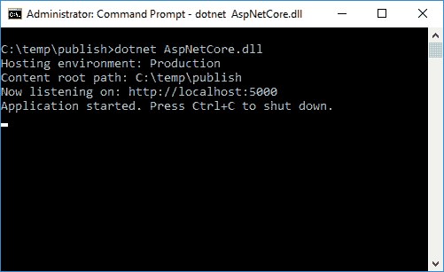

你现在可以进入你的浏览器，输入`http://localhost:5000`。这将为您显示 ASP.NETCore应用:


4.  通过将发布的文件复制到一个文件夹中，并在终端中键入`dotnet AspNetCore.dll`，您可以在 macOS 上执行完全相同的操作:


然后在 Mac 上的 Safari 中，输入`http://localhost:5000`并按*回车。*这将在 Safari 中加载站点:

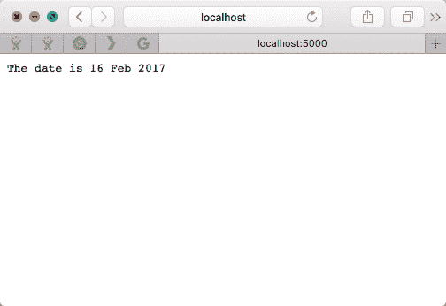

While I have just shown Safari running on macOS as an alternative, the ASP.NET Core application will run happily on Linux too.

5.  将应用发布到 IIS 也很容易。在 Visual Studio 中，右键单击解决方案资源管理器中的项目，然后单击发布...从上下文菜单中:

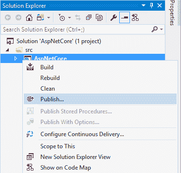

6.  然后，您需要选择一个发布目标。有几个选项可供您选择，但对于本例，您需要选择文件系统选项，然后单击确定:


7.  回到发布屏幕，您可以通过单击设置来修改其他设置...目标位置路径旁边。在这里，您需要选择要在发布模式下完成的发布。最后，点击发布按钮。

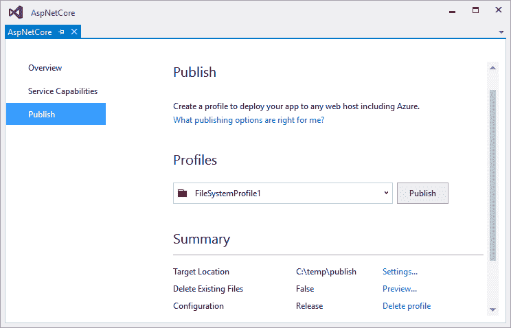

8.  发布应用后，Visual Studio 将在“输出”窗口中显示结果以及您选择的发布位置:

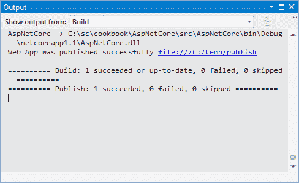

9.  在浏览器中，如果输入`http://localhost`，会看到 IIS 的默认页面。这意味着 IIS 被设置为:

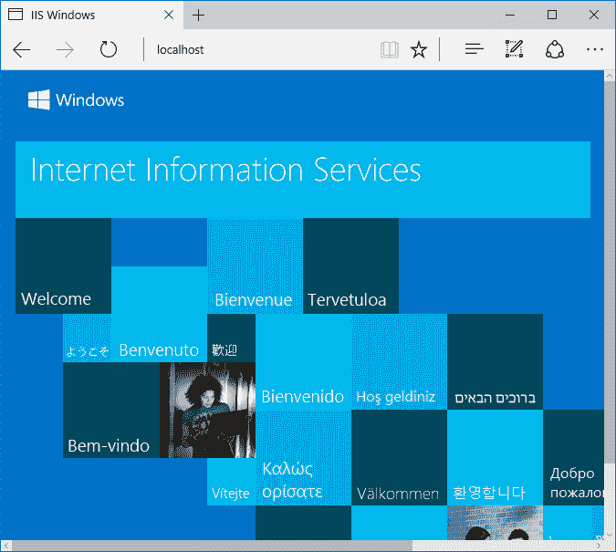

10.  在 Windows 资源管理器中，浏览至`C:\inetpub\wwwroot`并创建一个名为`netcore`的新文件夹。将 ASP.NETCore应用中发布的文件复制到您创建的新文件夹中。在 IIS 中，通过右键单击`Sites`文件夹并选择添加网站来添加新网站。为站点命名，并在“物理路径”设置中选择已发布文件的复制路径。最后，将端口更改为`86`，因为默认网站使用的是端口`80`，点击确定:


11.  您将看到您的网站被添加到 IIS 的“网站”文件夹中。在 IIS 管理器右侧面板的浏览网站标题下，单击浏览*.86 (http):

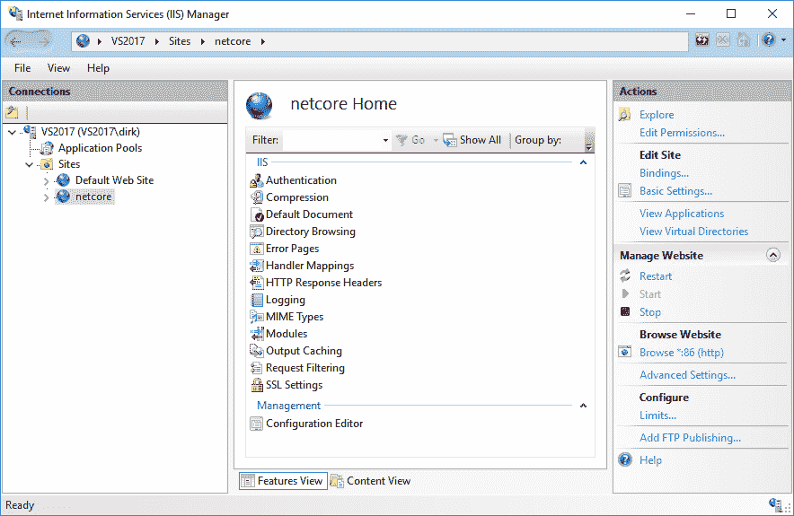

15.  这将在默认浏览器中启动您的 ASP.NETCore应用:


# 它是如何工作的...

在 Windows 上创建一个 ASP.NETCore应用允许我们在 Windows 上运行该应用，以及在 macOS 和 Linux 上运行该应用。通过 Windows 命令提示符或 macOS 终端中的`dotnet`命令，可以轻松地独立运行它。这就是。NET Core 对未来的应用开发如此强大。您可以使用习惯的集成开发环境来开发独立于平台的应用。周围还有很多要了解的。NET Core，你真的需要深入了解这个概念，并了解它的功能。