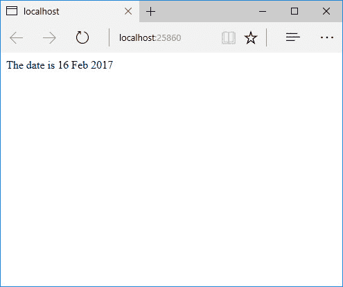
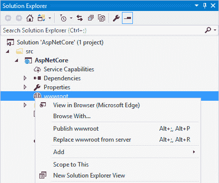
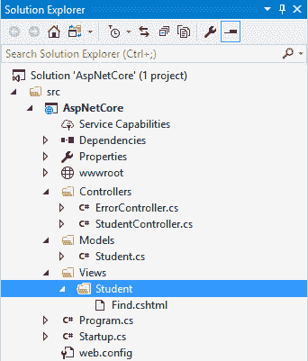
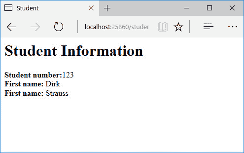

# 十一、基于 MVC 框架的 ASP.NETCore

本章将探索用 MVC 框架创建一个 ASP.NETCore 应用。前一章向您介绍了 ASP.NETCore，我们从本章所需的基础知识开始。如果你不熟悉 ASP.NET 芯，看看[第十章](10.html)、*在探索什么.NET Core 1.1* 必须提供。我们将关注:

*   包括中间件以及它为什么有用
*   创建控制器和使用路由
*   渲染视图

# 介绍

MVC 框架是根据它遵循的 MVC 设计模式命名的。MVC 代表 **M** 模型- **V** 视图- **C** 控制器。一个 HTTP 请求被发送到一个控制器，然后该控制器被映射到*控制器*类中的一个方法。在该方法中，控制器决定如何处理 HTTP 请求。然后，它构建一个对控制器和请求不可知的*模型*。该模型将包含控制器所需信息的所有逻辑集合在一起。然后*视图*用于显示模型中包含的信息，以构建一个 HTML 页面，该页面在 HTTP 响应中被发送回请求客户端。

MVC 框架允许我们通过让框架的每个组件专注于一件特定的事情来分离逻辑:

*   控制器接收 HTTP 请求并建立一个模型
*   模型包含我们请求的数据，并将其发送给视图
*   视图然后从模型中包含的数据创建 HTML 页面

# 包括中间件以及它为什么有用

这个方法将向您展示如何在您的 ASP.NETCore 应用中设置中间件。ASP.NET 的中间件定义了我们的应用如何响应它收到的任何 HTTP 请求。它对于控制我们的应用如何响应用户身份验证或错误也很有用。它还可以对传入的请求执行日志记录操作。

# 准备好

我们需要修改包含在我们的`Startup`类的`Configure()`方法中的代码。在这里，我们在 ASP.NETCore 应用中设置中间件。在[第十章](10.html)、*探索中.NET Core 1.1* ，我们看到我们的`Configure()`方法已经包含了两个中间件。第一个是中间件，当捕获到未处理的异常时，它会显示一个开发人员异常页面。代码如下所示:

```cs
if (env.IsDevelopment())
{
   app.UseDeveloperExceptionPage();
}

```

这将显示任何对调试应用有用的错误消息。通常，该页面会包含堆栈跟踪等信息。它仅在应用处于开发模式时安装。当您第一次创建 ASP.NETCore 应用时，它处于开发模式。

第二个中间件是`app.Run()`，它将一直存在于您的应用中。在[第十章](10.html)、*探索中.NET Core 1.1* ，它会一直用当前日期响应。把中间件想象成看门人。所有进入应用的 HTTP 请求都必须通过中间件。

了解添加中间件的顺序也很重要。在`app.Run()`中间件中，我们做了一个`context.Response.WriteAsync()`。在此之后添加的任何中间件都将无法到达，因为处理管道终止于`app.Run()`。随着我们继续前进，这将变得更加清晰。

# 怎么做...

1.  您当前的 ASP.NETCore 应用应该包含一个如下所示的`Configure()`方法:

```cs
        public void Configure(IApplicationBuilder app, 
          IHostingEnvironment env, 
          ILoggerFactory loggerFactory)
        {
          loggerFactory.AddConsole();

          if (env.IsDevelopment())
          {
            app.UseDeveloperExceptionPage();
          }

         app.Run(async (context) =>
         {
           await context.Response.WriteAsync($"The date is 
             {DateTime.Now.ToString("dd MMM yyyy")}");
         });
       }

```

2.  在调试菜单中，点击开始不调试或按 *Ctrl* + *F5* 。您将看到日期显示如下:



3.  返回到您的代码，告诉您的应用显示欢迎页面中间件。您可以通过在`app.Run()`之前添加`app.UseWelcomePage();`来实现。您的代码需要如下所示:

```cs
        if (env.IsDevelopment())
        {
          app.UseDeveloperExceptionPage();
        }

        app.UseWelcomePage();

        app.Run(async (context) =>
        {
          await context.Response.WriteAsync($"The date is 
            {DateTime.Now.ToString("dd MMM yyyy")}"); 
        });

```

4.  保存您的`Startup.cs`文件并刷新浏览器。


5.  您现在不再看到屏幕上显示的日期。这是因为欢迎页面是终止中间件，任何 HTTP 请求都不会通过它。继续修改欢迎页面中间件，如下所示:

```cs
        app.UseWelcomePage("/hello");

```

6.  如果您现在保存文件并刷新浏览器，您将再次看到浏览器中显示的日期。发生了什么？你刚刚告诉欢迎页面中间件只响应对`/hello`页面的请求。
7.  在浏览器中更改网址如下`http://localhost:25860/hello`并按*进入*。欢迎页面再次显示。
8.  我们来看看`UseDeveloperExceptionPage()`中间件。修改`app.Run()`如下图:

```cs
        app.Run(async (context) =>
        {
          throw new Exception("Error in app.Run()");
          await context.Response.WriteAsync($"The date is 
            {DateTime.Now.ToString("dd MMM yyyy")}"); 
        });

```

9.  保存更改并刷新浏览器。您将看到浏览器现在显示了一个开发人员会发现非常有用的页面。它显示堆栈信息、传入的查询、任何 cookies 以及标题信息。它甚至告诉我们异常发生在第几行(在`Startup.cs`文件的第 36 行)。`UseDeveloperExceptionPage()`中间件允许请求通过它传递到较低的中间件。如果出现异常，这将允许`UseDeveloperExceptionPage()`中间件完成它的工作。如前所述，中间件的放置很重要。如果我们在页面的末尾有这个`UseDeveloperExceptionPage()`中间件，它就不会捕捉到任何未处理的异常。因此，把这个放在你的`Configure()`方法的顶端是个好主意:


10.  让我们进一步理解这个概念。当我们处于生产环境中时，我们通常不希望用户看到异常页面。假设他们需要被引导到一个友好的错误页面。首先，在应用的 wwwroot 中添加一个静态的 HTML 页面。右键单击 wwwroot，并从上下文菜单中选择添加，新项目:



The wwwroot is where you would serve static pages such as JavaScript files, CSS files, images, or static HTML pages.

11.  选择一个 HTML 页面，称之为`friendlyError.html`，点击添加。


12.  如下修改`friendlyError.html`的 HTML:

```cs
        <!DOCTYPE html>
        <html>
          <head>
            <meta charset="utf-8" />
            <title>Friendly Error</title>
          </head>
          <body>
            Something went wrong. Support has been notified.
          </body>
        </html>

```

13.  我们接下来需要做的是向我们的应用添加一个 NuGet 包，这样我们就可以为静态文件提供服务。在 **NuGet 包管理器**中，搜索微软。静态文件，并将其添加到应用中。
14.  现在，我们需要稍微修改代码，以模拟它在生产环境中运行。我们通过如下设置`IHostingEnvironment`界面的`EnvironmaneName`属性来实现:`env.EnvironmentName = EnvironmentName.Production;`。

15.  然后，我们需要向`if (env.IsDevelopment())`条件添加一条`else`语句，并编写代码来调用我们定制的静态错误页面。在这里，我们将把`friendlyError.html`文件添加到我们的`DefaultFileNames()`集合中，并告诉我们的应用，我们希望在生产环境中的任何异常上使用这个错误文件。最后，我们需要通过调用`UseStaticFiles()`方法告诉我们的应用使用静态文件。完成后，您的代码应该如下所示:

```cs
        env.EnvironmentName = EnvironmentName.Production;
        if (env.IsDevelopment())
        {
          app.UseDeveloperExceptionPage();
        }
        else
        {
          DefaultFilesOptions options = new DefaultFilesOptions();
          options.DefaultFileNames.Add("friendlyError.html");
          app.UseDefaultFiles(options);

          app.UseExceptionHandler("/friendlyError"); 
        }

        app.UseStaticFiles();

```

# 它是如何工作的...

再次按 *Ctrl* + *F5* 重启 IIS Express，启动我们的应用。您将看到我们的自定义错误页面已经显示在浏览器中:


实际上，我们可能会使用控制器来做这种事情。我想在这里说明的是添加一个自定义默认页面的用途，以及在生产环境中发生异常时显示该页面的用途。
可以看到，ASP.NET 芯的中间件真的很好用。有很多关于他的主题的文档，我鼓励你对这个主题做一些进一步的阅读。从[的微软文档开始。](https://docs.microsoft.com/en-us/aspnet/core/fundamentals/middleware)

# 创建控制器和使用路由

在 MVC 框架中，控制器、模型和视图需要一起工作来形成 HTTP 请求和响应周期。然而，基本的出发点是根据收到的 HTTP 请求调用正确的控制器。没有它，我们建立在 MVC 框架上的应用就无法工作。在 MVC 框架中，为 HTTP 请求调用正确的控制器的过程称为路由。

# 准备好

我们可以通过查看应用的中间件中包含的路由信息，将 HTTP 请求路由到正确的控制器。然后，中间件使用这个路由信息来查看 HTTP 请求是否需要发送到控制器。中间件将查看传入的网址，并将其与我们提供的配置信息进行匹配。我们可以在`Startup`类中使用两种路由方法中的一种来定义该路由信息，即:

*   基于约定的路由
*   基于属性的路由

本食谱将探索这些路由方法。在此之前，我们需要将 ASP.NET MVC NuGet 包添加到我们的应用中。到目前为止，您应该非常熟悉向应用中添加 NuGet 包。在“获取软件包管理器”中，浏览并安装微软。AspNetCore.Mvc NuGet 包。这将为我们的应用暴露新的中间件，其中之一就是`app.UseMvc();`。这用于将一个 HTTP 请求映射到我们的一个控制器中的一个方法。在您的`Configure()`方法中修改代码如下:

```cs
loggerFactory.AddConsole();

if (env.IsDevelopment())
{
   app.UseDeveloperExceptionPage();
}
else
{
   DefaultFilesOptions options = new DefaultFilesOptions();
   options.DefaultFileNames.Add("friendlyError.html");
   app.UseDefaultFiles(options);

   app.UseExceptionHandler("/friendlyError"); 
}

app.UseStaticFiles();
app.UseMvc();

```

接下来，我们需要注册我们的 MVC 服务，MVC 框架需要这些服务才能运行。在`ConfigureServices()`内添加以下内容:

```cs
public void ConfigureServices(IServiceCollection services)
{
   services.AddMvc();
}

```

完成后，我们就有了 MVC 运行的基本设置。

# 怎么做...

1.  Add another folder to your application called `Controllers`:

    

2.  在`Controllers`文件夹中，添加一个名为`StudentController`的新类。在`StudentController`里面，添加一个名为`Find()`的方法。完成后，您的课程将如下所示:

```cs
        public class StudentController
        {
          public string Find()
          {
            return "Found students";
          }
        }

```

3.  回到`Startup`类，添加一个名为`FindController()`的`private void`方法，该方法采用类型为`IRouteBuilder`的参数。确保您也将`using Microsoft.AspNetCore.Routing;`命名空间添加到您的类中。您的方法应该如下所示:

```cs
        private void FindController(IRouteBuilder route)
        {

        }

```

4.  在`Configure()`方法中，将`app.UseMvc();`改为`app.UseMvc(FindController);`。
5.  我们现在需要告诉我们的应用如何查看一个网址来确定调用哪个控制器。我们将在这里使用基于约定的路由，它使用我们定义的模板来确定呼叫哪个控制器。考虑以下模板`{controller}/{action}`。然后，我们的应用将使用这个模板来分割一个网址，并识别网址的哪一部分是控制器部分，哪一部分是动作。使用我们的`StudentController`类，方法`Find()`是模板引用的动作。因此，当应用接收到带有网址`/Student/Find`的传入 HTTP 请求时，它将知道寻找`StudentController`类并转到该控制器内部的`Find()`方法。

We do not need to have the URL explicitly named `/StudentController/Find` because the MVC framework will, by convention, automatically take the word `Student` in the `{controller}` portion of the template and apply `Controller` to it to identify the name of the Controller to find.

6.  将路线映射添加到`FindController()`方法中。这告诉应用模板名称是默认的，模板需要在网址中寻找一个`{controller}/{action}`模板。您的代码现在应该如下所示:

```cs
        private void FindController(IRouteBuilder route)
        {
          route.MapRoute("Default", "{controller}/{action}");
        }

```

7.  综上所述，您的`Startup`类将如下所示:

```cs
        public void ConfigureServices(IServiceCollection services)
        {
          services.AddMvc();
        }

        public void Configure(IApplicationBuilder app, 
          IHostingEnvironment env, ILoggerFactory loggerFactory)
        {
          loggerFactory.AddConsole();

          if (env.IsDevelopment())
         {
           app.UseDeveloperExceptionPage();
         }
         else
         {
           DefaultFilesOptions options = new DefaultFilesOptions();
           options.DefaultFileNames.Add("friendlyError.html");
           app.UseDefaultFiles(options);

           app.UseExceptionHandler("/friendlyError"); 
         }

         app.UseStaticFiles();
         app.UseMvc(FindController);
       }

       private void FindController(IRouteBuilder route)
       {
         route.MapRoute("Default", "{controller}/{action}");
       }

```

8.  保存您的代码，并在浏览器中的网址末尾输入以下内容:`/student/find`。我的网址如下，但你的会有所不同，因为端口号很可能与我的不同:`http://localhost:25860/student/find`。在浏览器中输入它将把传入的 HTTP 请求路由到正确的控制器。


9.  但是，如果网址格式不正确或者找不到控制器，我们该怎么办。这就是我们可以向模板添加默认值的地方。删除网址的`/student/find`部分，点击回车。您现在应该会在浏览器中看到错误 404。这是因为应用无法根据我们的网址找到控制器。向我们的`Controllers`文件夹添加另一个类。叫这个班`ErrorController`。然后，在这个控制器内部创建一个名为`Support()`的方法。您的代码应该如下所示:

```cs
        public class ErrorController
        {
          public string Support()
          {
            return "Content not found. Contact Support";
          }
        }

```

10.  回到`Startup`类，在`FindController()`方法中修改模板。它应该如下所示:

```cs
        route.MapRoute("Default", "{controller=Error}/{action=Support}");

```

11.  这告诉我们的应用，如果它没有找到控制器，它应该默认为`ErrorController`类，并在该类中执行`Support()`方法。保存您的代码并刷新您的浏览器以查看应用默认为`ErrorController`。


12.  如您所见，ASP.NET MVC 中的路由非常灵活。前面列出的步骤讨论了我们所说的基于约定的路由。还有一种路由方法叫做基于属性的路由，它使用控制器上的属性。转到`ErrorController`类，将下面的`using Microsoft.AspNetCore.Mvc;`命名空间添加到该类中。然后，在类名中添加一个属性`[Route("Error")]`，在方法中添加一个属性`[Route("Support")]`。您的代码应该如下所示:

```cs
        [Route("Error")]
        public class ErrorController
        {
          [Route("Support")]
          public string Support()
          {
            return "Content not found. Contact Support";
          }
        }

```

13.  在`Startup`类里面的`FindController()`方法中，注释掉了行`route.MapRoute("Default", "{controller=Error}/{action=Support}");`。在浏览器中，将文本`/Error/Support`添加到您的网址末尾，然后输入。您将看到，基于在`ErrorController`类中定义的属性，应用正确地匹配了`ErrorController`。

# 它是如何工作的...

MVC 框架中的路由是基于 HTTP 请求访问特定控制器的一种非常灵活的方法。如果您需要对所访问的控制器进行更多控制，基于属性的路由可能比基于约定的路由更适合。也就是说，在使用基于属性的路由时，您还可以做其他事情。看看作为开发人员，您在使用基于属性的路由时可以使用什么。

# 渲染视图

到目前为止，我们一直使用普通的 C# 类作为控制器，但是更常见的是让您的控制器从 MVC 框架提供的`Controller`基类继承。这允许开发人员从他们的控制器返回复杂的对象，在我们的例子中是学生。这些复杂的返回类型在实现`IActionResult`接口的结果中返回。因此，我们可以返回 JSON、XML，甚至 HTML 来返回给客户端。这种用法和创建视图是我们接下来将在这个食谱中看到的。

# 准备好

打开`StudentController`类，修改为包含基于属性的路由。请务必将`using Microsoft.AspNetCore.Mvc;`命名空间添加到`StudentController`类中。还有，继承自`Controller`基类。

```cs
[Route("Student")]
public class StudentController : Controller
{
   [Route("Find")]
   public string Find()
   {
      return "Found students";
   }
}

```

然后，在项目中添加另一个名为`Models`的文件夹。在`Models`文件夹中，添加一个名为`Student`的类，因为我们的应用将返回学生信息。这将是一个简单的类，具有学生编号、名字和姓氏的属性。您的`Student`课应该如下所示:

```cs
public class Student
{
   public int StudentNumber { get; set; }
   public string FirstName { get; set; }
   public string LastName { get; set; }
}

```

回到`StudentController`，我们想要实例化我们的`Student`模型，并给它一些数据。然后我们将`Find()`方法的返回类型从`string`更改为`IActionResult`。另外，将`using AspNetCore.Models;`命名空间添加到您的`StudentController`类中。

Note, if your project is called something other than `AspNetCore`, your namespace will change accordingly:
`using [projectname].Models;`

您的代码现在应该如下所示:

```cs
[Route("Find")]
public IActionResult Find()
{
   var studentModel = new Student
   {
      StudentNumber = 123
      , FirstName = "Dirk"
      , LastName = 'Strauss"
   };
   return View(studentModel);
}

```

最终，我们希望从我们的`StudentController`返回一个视图结果。我们现在已经为下一步做好了一切准备。

# 怎么做...

1.  给你的项目添加一个名为`Views`的新文件夹。在该文件夹中，添加另一个名为`Student`的文件夹。在`Student`文件夹中，通过右键单击`Student`文件夹并选择新建项目来添加新项目...从上下文菜单中。从添加新项目对话框屏幕中，搜索 MVC 视图页面模板，并将其称为`Find.cshtml`。



2.  您应该开始注意到`Views`文件夹、子文件夹和视图遵循一个非常具体的命名约定。这是因为 MVC 框架遵循一个非常具体的约定，当你看`StudentController`的时候，这个约定就会变得清晰。`Views`文件夹是`Views`、`Student`、`Find`，`StudentController`包含类名中的`Student`一词，有一个叫`Find()`的方法。

You can also create a `Shared` folder in the `Views` folder. This is where you place views that are shared across all Controllers and the Controllers will look in the `Shared` folder by default.

3.  返回`Find.cshtml` Razor 视图，删除当前在那里的代码，并替换为以下内容:

```cs
        <html >
          <head>
            <title></title>
          </head>
          <body>
          </body>
        </html>

```

You can also use the HTML code snippet. Type `html` and press *Tab* twice to insert the boilerplate HTML code into the Find view.

4.  Razor 视图的好处是你可以直接在`Find.cshtml`文件中编写 C# 表达式。然而，在我们这样做之前，我们需要设置我们将要引入我们的视图的模型类型。我们使用以下指令做到这一点:`@model AspNetCore.Models.Student`。我们现在可以在我们的 Razor 视图中直接引用我们的`Student`模型，并提供完整的智能感知支持。这是使用带有大写字母`M`的`@Model`完成的。看看对 Razor 视图的更改:

```cs
        @model AspNetCore.Models.Student
        <html >
          <head>
            <title>Student</title>
          </head>
          <body>
            <div>
              <h1>Student Information</h1>
              <strong>Student number:</strong>@Model.StudentNumber<br />
              <strong>First name: </strong>@Model.FirstName<br />
              <strong>First name: </strong>@Model.LastName<br />
            </div>
          </body>
        </html>

```

# 它是如何工作的...

保存代码并刷新浏览器。您的网址应该是`http://localhost:[your port number]/student/find`才能正常工作。



HTTP 请求被路由到`StudentController`，T0 又填充并返回包含我们需要的数据的`Student`模型，并将其发送到“查找剃刀”视图。这就是 MVC 框架的本质。当涉及到 MVC 框架和 ASP.NETCore 的时候，还有很多内容需要介绍，但是这一章只涉及到这些主题的基本介绍。

We as developers are continually challenged to stay up to date with the latest and greatest technologies. There is a drive in us to learn more and become better at what we do. The very fact that you are reading this book is a testament to that. Regarding this chapter, however, .NET Core and the MVC framework are areas that definitely need more learning. It is not possible to cover all there is to know in a single chapter. There are various online resources available to developers. I find that one of the best (and free) resources for learning new tech is the Microsoft Virtual Academy at [https://mva.microsoft.com](https://mva.microsoft.com). Free Microsoft training is delivered by experts.

希望这足以激起你的兴趣，并鼓励你进一步研究这些话题。