# 在 Visual Studio 中编写安全代码和调试

在这一章中，我们将看一些例子，说明作为一名开发人员，在调试代码时如何更高效。我们还将研究如何编写安全代码。编写安全的代码可能是一个挑战，但是请考虑以下问题:如果您的代码安全的一部分涉及到确保密码被安全地存储，为什么要在项目之间反复编写代码？编写一次代码，并在您创建的每个新项目中实现它。我们将研究的概念如下:

*   正确加密和存储密码
*   在代码中使用安全性
*   保护应用配置/网络配置的敏感部分
*   防止 SQL 注入袭击
*   使用智能跟踪、诊断工具和历史调试
*   设置条件断点
*   使用性能提示识别代码中的瓶颈

# 介绍

许多开发人员往往会忽略编写安全代码的需求。开发截止日期和其他与项目相关的压力导致开发人员将交付代码置于以正确的方式完成之上。你们中的许多人可能不同意我的观点，但请相信我，当我说我听到“我们没有这方面的预算”的借口太多次时。这通常是当开发预算已经由其他利益相关者确定，并且没有咨询开发人员时。

考虑这样一种情况，顾问告诉开发人员他们已经向客户销售了一个系统。该系统现在需要开发。此外，开发人员被告知他们有 *x* 小时的时间来完成开发。向开发人员提供一份概述需求的文档，并允许开发人员在要求的时间内开始和完成开发。

这个场景是很多开发者面临的现实。你可能会认为这个场景不可能存在，或者你正在阅读这篇文章，并把这个场景与你公司目前的流程联系起来。不管是什么情况，这都是当今软件开发中发生的事情。

那么，开发人员如何打击项目自杀(我称这些项目为自杀，因为像这样接近的项目很少成功)？从创建可重用的代码开始。想想你经常重复的过程，这些过程足以保证编写一个可重用的动态链接库。你知道你可以创建 Visual Studio 模板吗？如果你有一个你使用的标准项目结构，从它创建一个模板，并在每个新项目中重用它，从而加快交付和减少错误。

项目模板的几个注意事项是数据库层、安全层、公共验证代码(这个数据表包含任何数据吗？)，常见的扩展方法等等。

# 正确加密和存储密码

我经常看到的一件事是密码存储不当。仅仅因为密码存储在服务器的数据库中，并不能保证它的安全。那么，存储不良的密码是什么样子的呢？


存储不当的安全密码不再安全。上一张截图中的密码是实际的用户密码。在登录界面输入第一个密码`^tj_Y4$g1!8LkD`，用户就可以进入系统。密码应该安全地存储在数据库中。事实上，您需要使用加盐的密码哈希。您应该能够加密用户的密码，但永远不能解密。

那么，如何解密密码，使其与用户在登录屏幕上输入的密码相匹配呢？你没有。您总是散列用户在登录屏幕上输入的密码。如果它与存储在数据库中的他们的真实密码的散列相匹配，您就给他们访问系统的权限。

# 准备好了

本配方中的 SQL 表仅用于说明，并非由配方中的代码编写。数据库可以在本书源代码附带的`_database scripts`文件夹中找到。

# 怎么做...

1.  最简单的方法是创建一个控制台应用，然后添加一个新的类库，方法是右键单击您的解决方案，然后从上下文菜单中选择添加，然后选择新建项目。

2.  在添加新项目对话框屏幕中，从已安装的模板中选择类库，并调用您的类`Chapter15`。

3.  您的新类库将以默认名称`Class1.cs`添加到您的解决方案中，为了正确区分代码，我们将其重命名为`Recipes.cs`。但是，如果你觉得更有意义，你可以随意给你的类重新命名。
4.  要重命名类，只需在解决方案资源管理器中单击类名，然后从上下文菜单中选择重命名。

5.  Visual Studio 将要求您确认对项目中代码元素类 1 的所有引用的重命名。只需点击是。

6.  以下类被添加到您的`Chapter15`库项目中:

```cs
        namespace Chapter15 
        { 
          public static class Recipes 
          { 

          } 
        }

```

7.  将以下`using`语句添加到您的课程中:

```cs
        using System.Security.Cryptography;

```

8.  接下来，您需要向类添加两个属性。这些属性将存储盐和散列。通常，您会将这些值与用户名一起写入数据库，但是，为了这个方法的目的，我们将简单地将它们添加到静态属性中。另外给类添加两个方法，分别叫做`RegisterUser()`和`ValidateLogin()`。两种方法都将`username`和`password`变量作为参数:

```cs
        public static class Recipes 
        { 
          public static string saltValue { get; set; } 
          public static string hashValue { get; set; } 

          public static void RegisterUser(string password, string 
            username) 
          { 

          } 

          public static void ValidateLogin(string password, 
            string username) 
          {                   

          } 
        }

```

9.  从`RegisterUser()`方法开始，这里我们做一些事情。要列出方法中的步骤:

1.我们使用`RNGCryptoServiceProvider`生成一个真正随机的、加密的强盐值。

2.将盐添加到密码中，并使用`SHA256`对加盐的密码进行散列。

It doesn't matter if you add the salt before or after the password. Just remember to be consistent each time you do it.

3.将 salt 值和哈希值以及用户名存储在数据库中。

In order to cut down on code, I have not actually added code to write the hash and salt values to the database. I simply added them to the properties created earlier. In a real-world situation, you would always write these to the database.

这是在应用中处理用户密码的一种非常安全的方法:

```cs
        public static void RegisterUser(string password, string  username) 
        { 
          // Create a truly random salt using RNGCryptoServiceProvider. 
          RNGCryptoServiceProvider csprng = new RNGCryptoServiceProvider(); 
          byte[] salt = new byte[32]; 
          csprng.GetBytes(salt); 

          // Get the salt value 
          saltValue = Convert.ToBase64String(salt); 
          // Salt the password 
          byte[] saltedPassword = Encoding.UTF8.GetBytes(
            saltValue + password); 

          // Hash the salted password using SHA256 
          SHA256Managed hashstring = new SHA256Managed(); 
          byte[] hash = hashstring.ComputeHash(saltedPassword); 

          // Save both the salt and the hash in the user's database record. 
          saltValue = Convert.ToBase64String(salt); 
          hashValue = Convert.ToBase64String(hash);             
        }

```

10.  我们需要创建的下一个方法是`ValidateLogin()`方法。在这里，我们首先获取用户名并验证它。如果用户输入的用户名不正确，不要告诉他们。这将提醒试图危害系统的人，他们有错误的用户名，一旦他们得到错误的密码通知，他们就知道用户名是正确的。该方法的步骤如下:
    1.  从数据库中获取输入用户名的 salt 和 hash 值。
    2.  将用户在登录屏幕上输入的密码与从数据库中读取的密码进行加盐。
    3.  用户注册时，使用相同的哈希算法对加盐密码进行哈希。
    4.  将从数据库读取的哈希值与方法中生成的哈希值进行比较。如果两个哈希匹配，则密码输入正确，用户通过验证。

请注意，我们从不解密数据库中的密码。如果您有解密用户密码和匹配输入密码的代码，您需要重新考虑和重写您的密码逻辑。系统永远不能解密用户密码。

```cs
        public static void ValidateLogin(string password, string username) 
        {             
          // Read the user's salt value from the database 
          string saltValueFromDB = saltValue; 

          // Read the user's hash value from the database 
          string hashValueFromDB = hashValue; 

          byte[] saltedPassword = Encoding.UTF8.GetBytes(
            saltValueFromDB + password); 

          // Hash the salted password using SHA256 
          SHA256Managed hashstring = new SHA256Managed(); 
          byte[] hash = hashstring.ComputeHash(saltedPassword); 

          string hashToCompare = Convert.ToBase64String(hash); 

          if (hashValueFromDB.Equals(hashToCompare)) 
            Console.WriteLine("User Validated.");             
          else 
            Console.WriteLine("Login credentials incorrect. User not 
              validated.");             
        }

```

11.  要测试代码，请在您的`CodeSamples`项目中添加对`Chapter15`类的引用。
12.  因为我们创建了一个静态类，所以您可以将新的`using static`添加到您的`Program.cs`文件中:

```cs
        using static Chapter15.Recipes;

```

13.  通过调用`RegisterUser()`方法测试代码，并将其传递给`username`和`password`变量。之后，调用`ValidateLogin()`方法，看密码是否与哈希匹配。在真实的生产系统中，这显然不会同时发生:

```cs
        string username = "dirk.strauss"; 
        string password = "^tj_Y4$g1!8LkD"; 
        RegisterUser(password, username); 

        ValidateLogin(password, username); 
        Console.ReadLine();

```

14.  调试代码时，您将看到用户已经过验证:


15.  最后，稍微修改一下代码，将`password`变量设置为其他值。这将模拟用户输入不正确的密码:

```cs
        string username = "dirk.strauss"; 
        string password = "^tj_Y4$g1!8LkD"; 
        RegisterUser(password, username); 

        password = "WrongPassword"; 
        ValidateLogin(password, username); 
        Console.ReadLine();

```

16.  调试应用时，您将看到用户未通过验证:


# 它是如何工作的...

我们没有在代码中解密密码。事实上，密码从未存储在任何地方。我们总是处理密码的散列。以下是这个食谱的要点:

*   永远不要用 C# 中的`Random`类来生成你的盐。始终使用`RNGCryptoServiceProvider`类。
*   不要在代码中重复使用相同的盐。所以不要用你的 salt 创建一个常量，用它来加盐你系统中的所有密码。
*   如果密码不匹配，不要告诉用户密码不正确。此外，永远不要告诉用户他们输入了不正确的用户名。这可以防止有人在发现两个登录凭证中的一个正确后试图危害系统。相反，如果用户名或密码输入不正确，请通知用户他们的登录凭据不正确。这可能意味着用户名或密码(或两者)输入不正确。
*   您无法从数据库中存储的哈希或 salt 中获取密码。因此，如果数据库遭到破坏，存储在其中的密码数据就不会有风险。用户密码的加密是单向操作，这意味着它永远无法解密。还需要注意的是，即使源代码被恶意人员泄露和窃取，您也无法使用该代码解密数据库中的加密数据。
*   将前面的方法和强大的密码策略结合起来(因为即使在 2016 年，仍然有用户认为使用`'l3tm31n'`进行密码已经足够好了)，你就有了一个非常好的密码加密例程。

当我们查看用户访问表时，存储用户凭据的正确方法如下所示:


salt 和 hash 存储在用户名旁边，并且是安全的，因为它们不能被解密以暴露实际的密码。

If you sign up for a service on the Internet and they send you a confirmation either via e-mail or text message and display your password in this message in plain text, then you should seriously consider closing your account. If a system can read your password and send it to you in plain text, so can anybody else. Never use the same password for all your logins.

# 在代码中使用安全性

保护您的应用免受恶意攻击并不是一件容易的事情。在编写安全代码的同时最大限度地减少漏洞(黑客通常会利用这些漏洞)和黑帽编写越来越复杂的方法来危害系统和网络之间，这是一场持续的斗争。我个人认为，高等院校需要教给 IT 学生两件事:

*   如何使用流行的企业资源规划系统并与之集成
*   适当的软件安全原则

事实上，我相信安全编程 101 绝不能只是给定 IT 课程中的一个模块或主题，而是一门独立的完整课程。它需要以应有的严肃和尊重来处理，并且最好由能够真正黑进系统或网络的人来教导。

白帽教学生如何危害系统、利用易受攻击的代码和渗透网络，将对改变未来软件开发人员的编程方式产生重大影响。归根结底，开发人员知道在防御性编程时不应该做什么。很有可能这些学生中的一些人会继续成为黑帽，但他们会这样做，不管他们是否上过黑客安全编程课。

# 准备好

代码在某些地方可能看起来有点滑稽。这是因为`SecureString`正在使用非托管内存存储敏感信息。请放心，`SecureString`在中得到很好的支持和使用.NET 框架，从用于创建数据库连接的`SqlCredential`对象的实例可以看出:


# 怎么做...

1.  首先向解决方案中添加一个新的 Windows 窗体项目。
2.  调用项目`winformSecure`并点击确定按钮。
3.  在工具箱中，搜索文本框控件并将其添加到表单中。
4.  最后，在表单中添加一个按钮控件。您可以调整此表单的大小，但是您希望看起来更像登录表单:

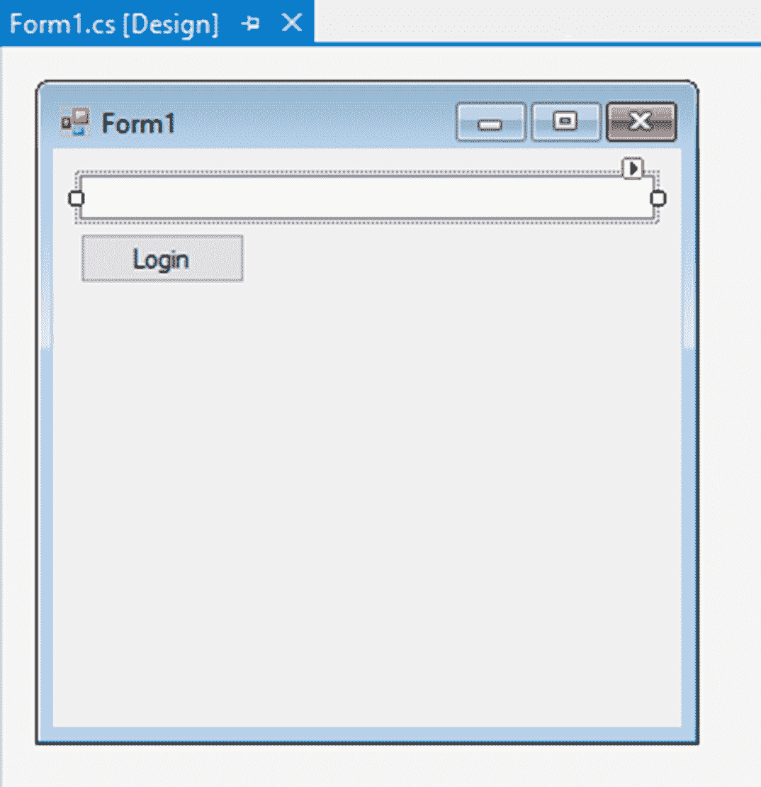

5.  在窗口窗体上选择文本框控件后，打开“属性”面板，单击“事件”按钮(看起来像闪电)。在“键”组中，双击按键事件，在后面的代码中创建处理程序:

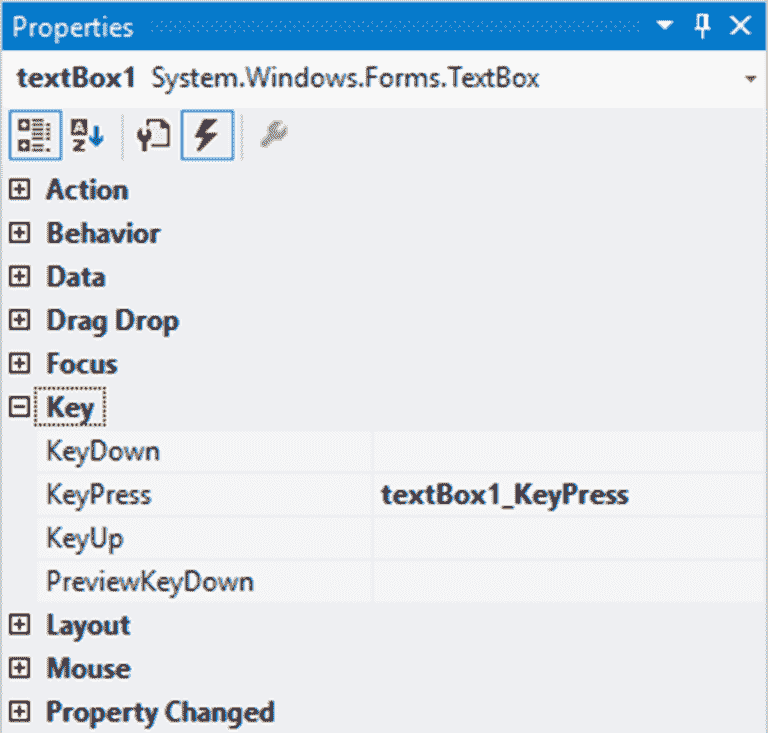

为您创建的代码是文本框控件的按键事件处理程序。每当用户按下键盘上的某个键时，就会触发:

```cs
        private void textBox1_KeyPress(object sender,  KeyPressEventArgs e) 
        { 

        }

```

6.  回到属性面板，展开行为组并将 UseSystemPasswordChar 的值更改为`True`:

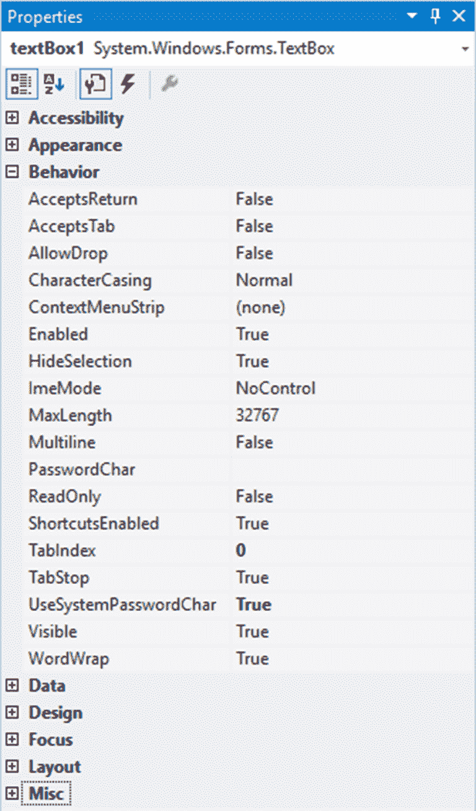

7.  在后面的代码中，添加以下`using`语句:

```cs
        using System.Runtime.InteropServices;

```

8.  将`SecureString`变量作为全局变量添加到您的 Windows 窗体中:

```cs
        SecureString secure = new SecureString();

```

9.  然后，在`KeyPress`事件中，每当用户按下一个键时，将`KeyChar`值附加到`SecureString`变量。您可能想要添加代码来忽略某些按键，但这超出了本食谱的范围:

```cs
        private void textBox1_KeyPress(object sender,  KeyPressEventArgs e) 
        { 
          secure.AppendChar(e.KeyChar); 
        }

```

10.  然后，在登录按钮的事件处理程序中，添加以下代码从`SecureString`对象中读取值。这里，我们使用非托管内存和非托管代码:

```cs
        private void btnLogin_Click(object sender, EventArgs e) 
        { 
          IntPtr unmanagedPtr = IntPtr.Zero; 

          try 
          { 
            if (secure == null) 
            throw new ArgumentNullException("Password not defined");        
            unmanagedPtr = Marshal.SecureStringToGlobalAllocUnicode(
              secure);
            MessageBox.Show($"SecureString password to validate is 
                            {Marshal.PtrToStringUni(unmanagedPtr)}"); 
          } 
          catch(Exception ex) 
          { 
            MessageBox.Show(ex.Message); 
          } 
          finally 
          { 
            Marshal.ZeroFreeGlobalAllocUnicode(unmanagedPtr); 
            secure.Dispose(); 
          } 
        }

```

11.  运行您的 Windows 窗体应用并输入密码:

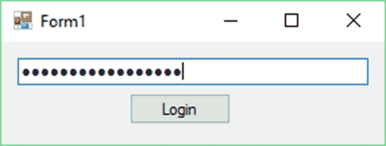

12.  然后点击登录按钮。然后，您将看到您键入的密码显示在消息框中:


# 它是如何工作的...

使用`System.String`存储密码等敏感信息几乎已经成为很多开发者的习惯。这种方法的问题在于`System.String`是不可变的。这意味着`System.String`在内存中创建的对象是不能改变的。如果修改变量，将在内存中创建一个新对象。您也无法确定由`System.String`创建的对象何时会在垃圾收集期间从内存中移除。相反，使用`SecureString`对象，您将加密敏感信息，当不再需要该对象时，它将从内存中删除。`SecureString`在非托管内存中加密和解密您的敏感数据。

现在，我需要明确一件事。`SecureString`绝非万无一失。如果你的系统含有病毒，其唯一目的是危害`SecureString`操作，使用它没有多大帮助(无论如何一定要使用合适的杀毒软件)。在代码执行过程中的某个时刻，密码(或敏感信息)的字符串表示形式是可见的。其次，如果黑客以某种方式找到了检查你的堆或记录你的击键的方法，密码可能是可见的。然而，`SecureString`的使用使得黑客的机会之窗变得更小。机会之窗缩小了，因为攻击媒介(黑客的切入点)减少了，从而减少了你的攻击面(黑客所有攻击点的总和)。

底线是这样的:`SecureString`是有原因的。作为一个关心安全的软件开发者，你应该用`SecureString`。

# 保护应用配置/网络配置的敏感部分

作为开发人员，您无疑将处理密码等敏感信息。在开发过程中如何处理这些信息非常重要。过去，我收到过用于测试的客户实时数据库的副本。这确实给你的客户带来了很大的安全风险。

通常，我们将设置保存在`web.config`文件中(当使用网络应用时)。对于这个例子，我将演示一个使用`App.config`文件的控制台应用。同样的逻辑也适用于`web.config`文件。

# 准备好

创建一个控制台应用是演示这个方法的最快方法。但是，如果您想使用网络应用(并保护`web.config`文件)，您可以这样做。

# 怎么做...

1.  在控制台应用中，找到`App.config`文件。这是包含敏感数据的文件。
2.  如果你打开`App.config`文件，你会看到在`appSettings`标签内，添加了一个名为`Secret`的键。这些信息可能不应该出现在`App.config`中。这里的问题是它可能会被签入到您的源代码管理中。想象一下在 GitHub 上？

```cs
        <?xml version="1.0" encoding="utf-8"?> 
        <configuration> 
          <startup>  
            <supportedRuntime version="v4.0" sku=".NETFramework,
             Version=v4.6.1"/> 
          </startup> 
          <appSettings> 
            <add key="name" value="Dirk"/> 
            <add key="lastname" value="Strauss"/>  
            <add key="Secret" value="letMeIn"/> 
          </appSettings> 
        </configuration>

```

3.  为了克服这个漏洞，我们需要将敏感数据从`App.config`文件移到另一个文件中。为此，我们指定一个文件的路径，该文件将包含我们想要从`App.config`文件中删除的敏感数据。

```cs
        <appSettings file="C:\temp\secret\secret.config">:

```

You might be wondering why not simply just encrypt the information. Well, that is a given really. The reason this value is in plain text is just to demonstrate a concept here. You would probably encrypt this value anyway in a real-world situation. You would not, however, want this sensitive information sitting on a server in a code repository somewhere, even if it is encrypted. Be safe, move it out of your solution.

4.  添加安全文件的路径后，删除包含敏感信息的密钥:


5.  导航到您在`App.config`文件属性中指定的路径。创建您的`secret.config`文件并打开进行编辑:

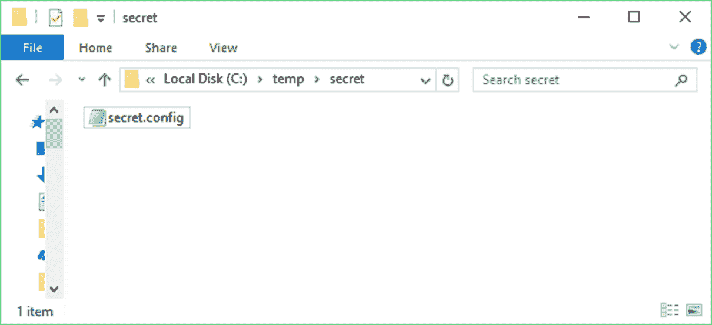

6.  在该文件中，重复`appSettings`部分并添加`Secret`键。现在发生的事情是，当您的控制台应用运行时，它会读取您的解决方案中的`appSettings`部分，并找到对机密文件的引用。然后，它会查找机密文件，并将其与解决方案中的`App.config`合并:

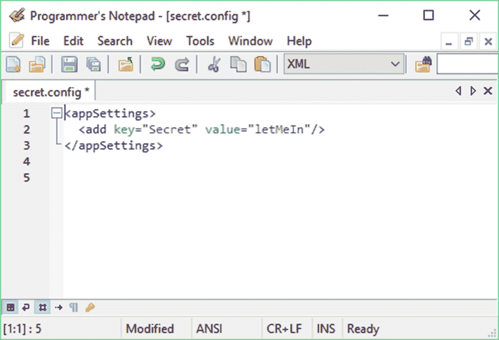

7.  要查看此合并是否有效，请添加对控制台应用的引用。

8.  搜索并添加`System.Configuration`到您的参考资料中:

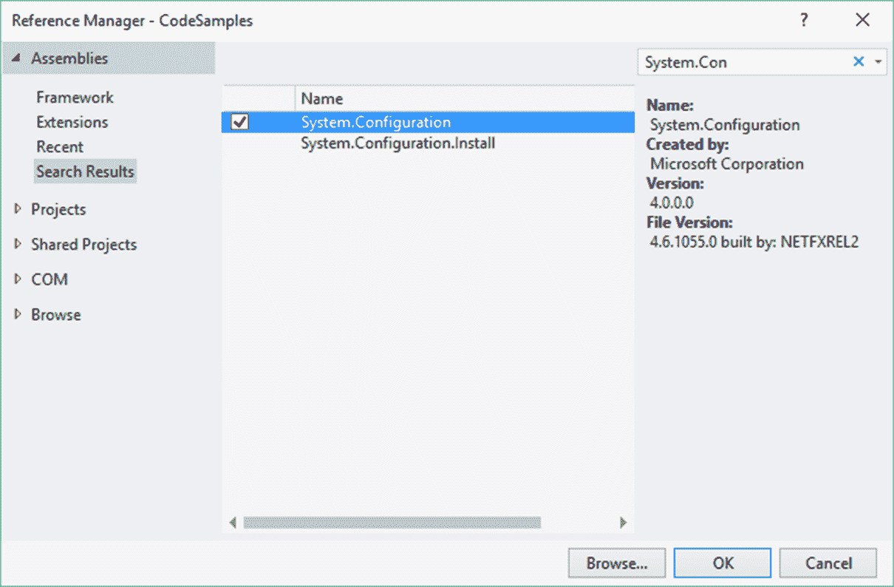

9.  添加引用后，解决方案引用将列出系统.配置
10.  在`Program.cs`文件的顶部，添加以下`using`语句:

```cs
        using System.Configuration;

```

11.  添加以下代码，从您的`App.config`文件中读取`Secret`键设置。只有这一次，它会读取合并后的文件，该文件由您的`App.config`和您的`secret.config`文件组成:

```cs
        string sSecret =  ConfigurationManager.AppSettings["Secret"]; 
        Console.WriteLine(sSecret); 
        Console.ReadLine();

```

12.  运行您的控制台应用，您将看到敏感数据已经从`secret.config`文件中读取，该文件在运行时与`App.config`文件合并:


# 它是如何工作的...

这里需要指出的是，这种技术也适用于`web.config`文件。如果需要从配置文件中删除敏感信息，请将其移动到另一个文件中，这样它就不会包含在源代码管理签入或部署中。

# 防止 SQL 注入袭击

SQL 注入袭击是一个非常现实的问题。有太多的应用仍然容易受到这种攻击。如果你开发一个网络应用或网站，你应该警惕不良的数据库操作。易受攻击的在线 SQL 使数据库面临 SQL 注入攻击。SQL 注入攻击是攻击者通过 web 表单输入框修改 SQL 语句，以产生与最初预期不同的结果。这通常在 web 应用应该访问数据库以验证用户登录的表单上尝试。通过不对用户输入进行消毒，您将您的数据暴露给像这样的攻击。

减轻 SQL 注入攻击的公认解决方案是创建一个参数化存储过程，并从代码中调用它。

# 准备好

在继续这个食谱之前，您需要在您的 SQL Server 中创建`CookbookDB`数据库。您会在附带的源代码中的`_database scripts`文件夹中找到该脚本。

# 怎么做...

1.  这个食谱，我用的是 SQL Server 2012。如果您使用的是旧版本的 SQL Server，则概念是相同的。创建`CookbookDB`数据库后，您会看到在`Tables`文件夹下有一个名为`UserDisplayData`的表:

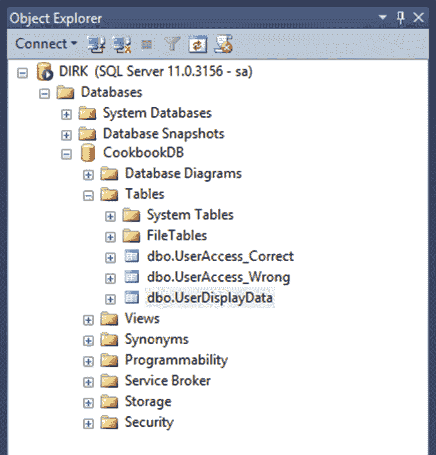

2.  `UserDisplayData`表只是用来说明使用参数化存储过程进行查询的概念。它在生产数据库中没有任何真正的好处，因为它只返回一个屏幕名称:

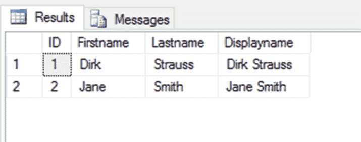

3.  我们需要创建一个存储过程，为特定的标识(用户标识)从该表中选择数据。点击`Programmability`节点将其展开:

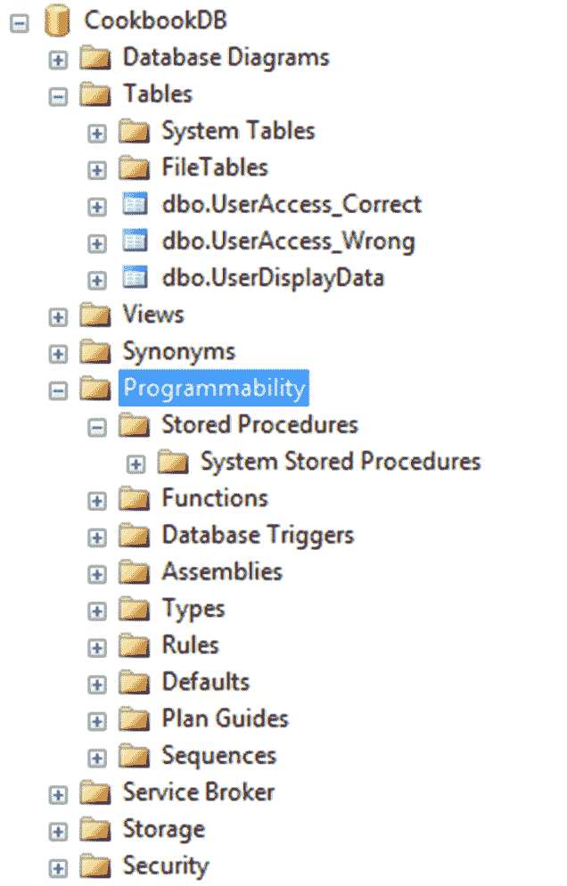

4.  接下来，右键单击`Stored Procedures`节点并选择新建存储过程...从上下文菜单中:

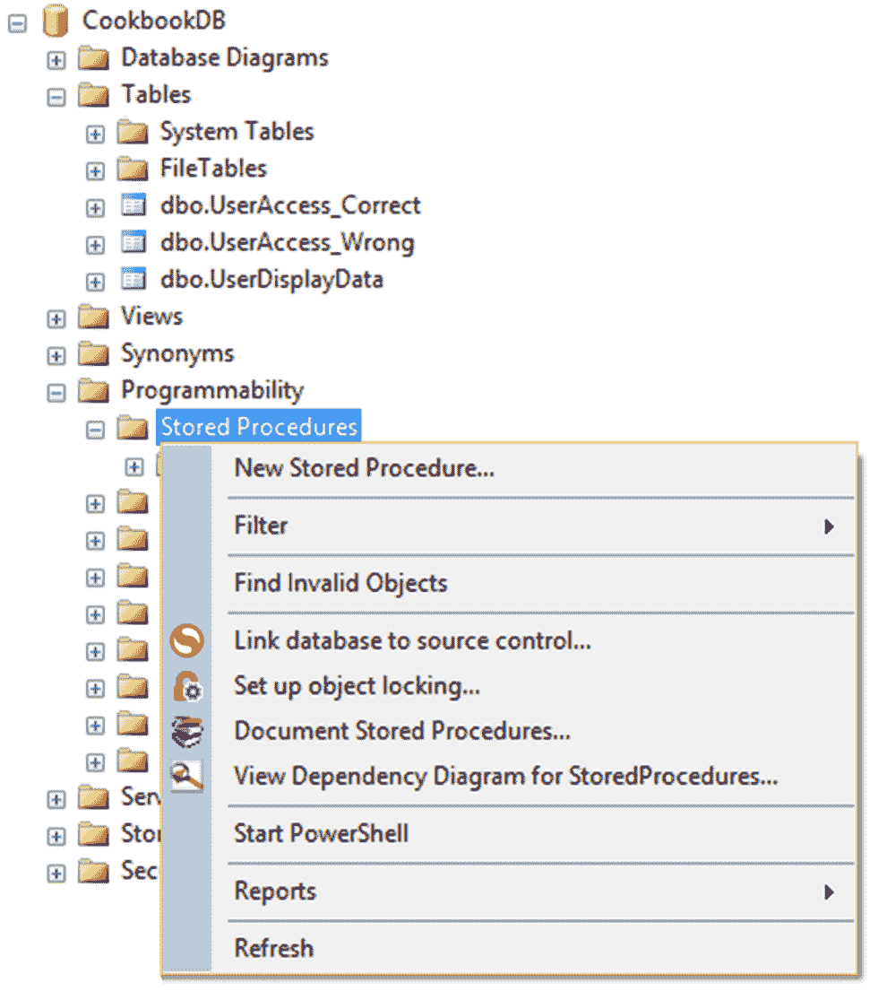

5.  SQL Server 将为您创建以下存储过程模板。该模板包含一个您可以对特定存储过程进行注释的部分，以及一个添加您可能需要的参数的部分，显然还有一个您需要向其中添加实际 SQL 语句的部分:

```cs
        SET ANSI_NULLS ON 
        GO 
        SET QUOTED_IDENTIFIER ON 
        GO 
        -- ============================================= 
        -- Author:          <Author,,Name> 
        -- Create date:      <Create Date,,> 
        -- Description:      <Description,,> 
        -- ============================================= 
        CREATE PROCEDURE <Procedure_Name, sysname, ProcedureName>  
            -- Add the parameters for the stored procedure here 
            <@Param1, sysname, @p1> <Datatype_For_Param1, , int> =                  <Default_Value_For_Param1, , 0>,  
            <@Param2, sysname, @p2> <Datatype_For_Param2, , int> =              <Default_Value_For_Param2, , 0> 
        AS 
        BEGIN 
        -- SET NOCOUNT ON added to prevent extra result sets      from 
        -- interfering with SELECT statements. 
        SET NOCOUNT ON; 

        -- Insert statements for procedure here 
        SELECT <@Param1, sysname, @p1>, <@Param2, sysname, @p2> 
        END 
        GO

```

6.  为存储过程指定一个合适的名称，该名称将描述存储过程的操作或意图:

```cs
        CREATE PROCEDURE cb_ReadCurrentUserDisplayData

```

There are many people that do prefix their stored procedures, and I'm one of those. I like to keep my stored procedures grouped. I, therefore, name my stored procedures in the format *[prefix]_[tablename_or_module]_[stored_procedure_action]*. Having said that, I generally avoid using `sp_` as a prefix to my stored procedures. There are a lot of opinions on the Internet as to why this is a bad idea. It is generally believed that using `sp_` as a stored procedure prefix impacts on performance because it is used as the stored procedure prefix in the master database. For the purposes of this recipe, I have just kept to a simple name for the stored procedure.

7.  为此存储过程定义一个参数。通过这样做，您告诉数据库，当调用该存储过程时，它将传递一个存储在参数调用程序`@userID`中的整型值:

```cs
        @userID INT

```

8.  现在，您定义了该存储过程要使用的 SQL 语句。我们将做一个简单明了的陈述:

```cs
        SELECT 
          Firstname, Lastname, Displayname 
        FROM 
          dbo.UserDisplayData 
        WHERE 
          ID = @userID

```

You will notice that my `SELECT` statement contains the specific column names instead of a `SELECT * FROM`. Doing a `SELECT *` is considered bad practice. You would usually not want to return all the column values from a table. If you want all the column values, then it is better to explicitly list the columns by name instead of just getting all. Using `SELECT *` returns unnecessary columns and increases the overhead on the server. This does make a difference in the bigger scheme of things, especially when the database starts getting a lot of traffic. The thought of having to type out the column names for a large table is definitely not something I would look forward to. You can, however, use the following tricks to make it easy for you to add the column names to your SQL `SELECT` statement. You can right-click on the database table and select Script Table As to create one of several SQL statements. Secondly, you can expand the `Table` node and expand the table you wish to write the statement for. You will then see a node called `Columns`. Drag the `Columns` node onto the query editor. That will insert all the column names into the query editor for you.

9.  当您完成向存储过程添加代码时，它将如下所示:

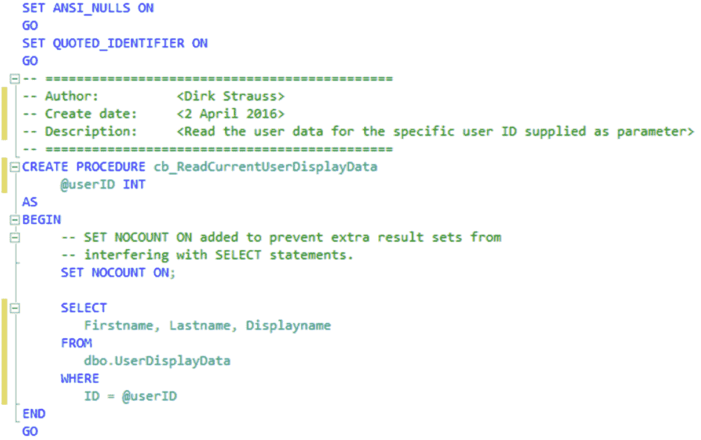

10.  要创建存储过程，您需要单击执行按钮。单击“执行”按钮时，请确保选择了正确的数据库:

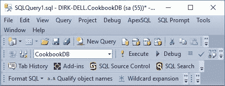

11.  然后将在 SQL Server 中的`Stored Procedures`节点下创建存储过程:


12.  我们现在已经完成了这项任务的一半。是时候构建我们将在应用中用来查询数据库的代码了。我们将把这段代码直接添加到你的控制台应用的`Program.cs`文件中。虽然这段代码不被认为是最佳实践(硬编码服务器凭证)，但它只是用来说明从 C# 调用参数化存储过程的概念。
13.  首先，在控制台应用的顶部添加以下`using`语句:

```cs
        using System.Data.SqlClient;

```

14.  然后，我们添加变量来包含登录服务器所需的凭据:

```cs
        int intUserID = 1; 
        int cmdTimeout = 15; 
        string server = "DIRK"; 
        string db = "CookbookDB"; 
        string uid = "dirk"; 
        string password = "uR^GP2ABG19@!R";

```

15.  我们现在使用`SecureString`来存储密码并将其添加到一个`SqlCredential`对象中:

```cs
        SecureString secpw = new SecureString(); 
        if (password.Length > 0) 
        { 
          foreach (var c in password.ToCharArray()) secpw.AppendChar(c); 
        } 
        secpw.MakeReadOnly(); 

        string dbConn = $"Data Source={server};Initial Catalog={db};"; 
        SqlCredential cred = new SqlCredential(uid, secpw);

```

For more on `SecureString`, see the *Using SecureString in code* recipe of this chapter.

16.  我们现在在`using`语句中创建一个`SqlConnection`对象。这确保了当`using`语句移出范围时，SQL 连接是关闭的:

```cs
        using (SqlConnection conn = new SqlConnection(dbConn,  cred)) 
        {                 
          try 
          { 

          } 
          catch (Exception ex) 
          { 
            Console.WriteLine(ex.Message); 
          } 
        } 
        Console.ReadLine();

```

17.  在`try`内部，添加以下代码来打开连接字符串，并创建一个`SqlCommand`对象，该对象将打开的连接和存储过程的名称作为参数。您可以使用创建实际 SQL 参数的快捷方法传递给存储过程:

```cs
        cmd.Parameters.Add("userID", SqlDbType.Int).Value = intUserID;

```

因为我只是将整数类型的参数传递给存储过程，所以我没有为这个参数定义长度:


但是，如果您需要定义类型为`VarChar(MAX)`的参数，您需要通过添加`-1`来定义参数类型的大小。比方说，你需要在数据库中存储一篇学生的论文；对于`VarChar(MAX)`，代码将如下所示:

```cs
        cmd.Parameters.Add("essay", SqlDbType.VarChar, -1).Value = 
          essayValue;

```

18.  在我们将参数及其值添加到`SqlCommand`对象之后，我们指定一个超时值，执行`SqlDataReader`，并将其加载到`DataTable`中。然后，该值被输出到控制台应用:

```cs
        conn.Open(); 
        SqlCommand cmd = new SqlCommand("cb_ReadCurrentUserDisplayData", 
          conn); 
        cmd.CommandType = CommandType.StoredProcedure; 
        cmd.Parameters.Add("userID", SqlDbType.Int).Value = intUserID; 
        cmd.CommandTimeout = cmdTimeout; 
        var returnData = cmd.ExecuteReader(); 
        var dtData = new DataTable(); 
        dtData.Load(returnData); 

        if (dtData.Rows.Count != 0) 
          Console.WriteLine(dtData.Rows[0]["Displayname"]);

```

19.  将所有代码添加到控制台应用后，正确的完整代码如下所示:

```cs
        int intUserID = 1; 
        int cmdTimeout = 15; 
        string server = "DIRK"; 
        string db = "CookbookDB"; 
        string uid = "dirk"; 
        string password = "uR^GP2ABG19@!R"; 
        SecureString secpw = new SecureString(); 
        if (password.Length > 0) 
        { 
          foreach (var c in password.ToCharArray())
            secpw.AppendChar(c); 
        } 
        secpw.MakeReadOnly(); 

        string dbConn = $"Data Source={server};Initial Catalog={db};"; 

        SqlCredential cred = new SqlCredential(uid, secpw); 
        using (SqlConnection conn = new SqlConnection(dbConn, cred)) 
        {                 
          try 
          { 
            conn.Open(); 
            SqlCommand cmd = new SqlCommand(
              "cb_ReadCurrentUserDisplayData", conn); 
            cmd.CommandType = CommandType.StoredProcedure; 
            cmd.Parameters.Add("userID", SqlDbType.Int).Value = intUserID; 
            cmd.CommandTimeout = cmdTimeout; 
            var returnData = cmd.ExecuteReader(); 
            var dtData = new DataTable(); 
            dtData.Load(returnData); 
            if (dtData.Rows.Count != 0) 
              Console.WriteLine(dtData.Rows[0]["Displayname"]);  
          } 
          catch (Exception ex) 
          { 
            Console.WriteLine(ex.Message); 
          } 
        } 
        Console.ReadLine();

```

20.  运行您的控制台应用，您将看到输出到屏幕的显示名称:


# 它是如何工作的...

通过创建参数化的 SQL 查询，编译器可以在对数据库运行 SQL 语句之前正确替换参数。它将防止恶意数据更改您的 SQL 语句，以获取恶意结果。这是因为`SqlCommand`对象没有直接将参数值插入到语句中。

总而言之，使用参数化存储过程意味着不再有小鲍比表。

# 使用智能跟踪、诊断工具和历史调试

140 多年来，这个值得信赖的老 bug 一直是软件开发人员和工程师的克星。是的，你没看错。事实上是托马斯·爱迪生在 19 世纪 70 年代末创造了“虫子”这个术语。它出现在他的许多笔记本条目中，例如，他描述白炽灯泡仍然有许多“缺陷”。

他调试发明的努力相当传奇。想想一个已经 60 多岁的人每周工作 112 小时的真正勇气和决心。他和他的七人团队(通常误以为只有六个人，因为第七个人没有出现在集体照中)在为期 5 周的睡眠时间里被称为失眠小组。

如今，由于技术的进步，软件开发人员可以使用大量的调试工具(在 Visual Studio 内部和外部)。那么调试真的重要吗？当然有。这是我们作为软件开发人员所做的一部分。如果我们不调试，这里有一些例子:

*   2004 年，英国的**电子数据系统** ( **EDS** )儿童抚养费系统多支付了近 200 万人，而少支付了近 100 万人，导致数十亿美元的儿童抚养费无法收回。EDS 和它所依赖的另一个系统不兼容，导致纳税人赔钱，对这么多单亲父母的生活造成负面影响。
*   苹果地图最初发布于 2012 年。说够了。虽然很多人感到困惑，但我仍然发现自己在一个不熟悉的城市或地区使用谷歌地图寻找一个又一个转弯的方向。
*   Therac-25 放射治疗机使用电子瞄准患者体内的肿瘤。不幸的是，软件中的一个竞争条件导致这台机器对几名患者进行了致命的过量辐射。

影响数百万人生活的软件错误的例子在互联网上随处可见。我们也不是简单地谈论普通的 bug。有时候，我们面临着看似无法克服的问题。知道如何使用一些可用的工具是一种安慰，这使得一个稳定的应用和一个完全不可用的应用有所不同。

# 准备好

请注意，智能跟踪仅在 Visual Studio 的企业版中可用。请参见[https://www.visualstudio.com/vs/compare/](https://www.visualstudio.com/vs/compare/)链接，了解 Visual Studio 版本之间的比较。智能跟踪不是 Visual Studio 中的新功能。随着时间的推移(自 Visual Studio 2010 以来)，它已经发展成为我们今天所拥有的产品。

# 怎么做...

1.  首先，转到工具，选项。
2.  展开智能跟踪节点，然后单击常规。确保选中“启用智能跟踪”。另外，确保选择了智能跟踪事件和调用信息选项。点击确定:

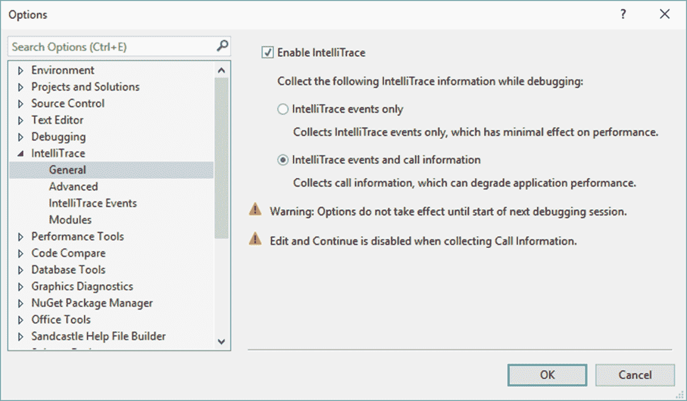

3.  在`Recipes.cs`文件中，您可能需要添加以下`using`语句:

```cs
        using System.Diagnostics; 
        using System.Reflection; 
        using System.IO;

```

4.  在`Recipes`类中添加一个名为`ErrorInception()`的方法。另外，添加代码来读取基本路径，并假设有一个名为`log`的文件夹。不要在硬盘上创建此文件夹。我们希望抛出一个异常。最后，添加另一个名为`LogException()`的方法，该方法不起作用:

```cs
        public static void ErrorInception() 
        { 
          string basepath = Path.GetDirectoryName(
            Assembly.GetEntryAssembly().Location); 
          var full = Path.Combine(basepath, "log"); 
        } 

        private static void LogException(string message) 
        { 

        }

```

5.  确定完整路径后，将以下代码添加到您的`ErrorInception()`方法中。在这里，我们试图打开日志文件。这是异常发生的地方:

```cs
        try 
        { 
          for (int i = 0; i <= 3; i++) 
          { 
            // do work 
            File.Open($"{full}log.txt", FileMode.Append); 
          } 
        } 
        catch (Exception ex) 
        { 
          StackTrace st = new StackTrace(); 
          StackFrame sf = st.GetFrame(0); 
          MethodBase currentMethodName = sf.GetMethod(); 
          ex.Data.Add("Date", DateTime.Now); 
          LogException(ex.Message); 
        }

```

6.  添加完所有代码后，您的代码应该如下所示:

```cs
        public static void ErrorInception() 
        { 
          string basepath = Path.GetDirectoryName(
            Assembly.GetEntryAssembly().Location); 
          var full = Path.Combine(basepath, "log"); 

          try 
          { 
            for (int i = 0; i <= 3; i++) 
            { 
              // do work 
              File.Open($"{full}log.txt", FileMode.Append); 
            } 
          } 
          catch (Exception ex) 
          { 
            StackTrace st = new StackTrace(); 
            StackFrame sf = st.GetFrame(0); 
            MethodBase currentMethodName = sf.GetMethod(); 
            ex.Data.Add("Date", DateTime.Now); 
            LogException(ex.Message); 
          } 
        } 

        private static void LogException(string message) 
        { 

        }

```

7.  在`Program.cs`文件中，调用`ErrorInception()`方法。紧接着，做一个`Console.ReadLine()`这样我们的控制台应用将暂停在那里。不要在代码的任何地方添加任何断点:

```cs
        ErrorInception(); 
        Console.ReadLine();

```

8.  开始调试应用。异常被抛出，应用继续运行，这是更复杂的应用经常遇到的情况。在这一点上，你会期望一个日志文件被附加上应用的虚构数据，但是什么都没有发生。在这一点上，您停止您的应用，并开始在命中和未命中类型的练习中在您的代码上添加断点。我说命中和错过是因为你可能不知道错误在哪里。如果您的代码文件包含几千行代码，尤其如此。现在有了智能跟踪和历史调试，您只需要点击“全部中断”按钮:

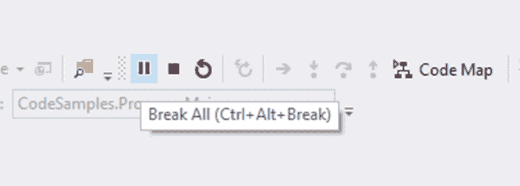

9.  您的应用现在实际上已暂停。如果没有看到“诊断工具”窗口，请按住*Ctrl*+*Alt*+*F2*。

10.  Visual Studio 现在显示“诊断工具”窗口。立即，您可以看到事件部分的红色菱形图标指示有问题。在底部的事件选项卡中，您可以单击例外:


11.  这样做扩展了异常详细信息，您可以在其中看到未找到日志文件。然而，Visual Studio 在历史调试方面更进一步:


12.  您将在异常详细信息的底部看到一个链接，上面写着“激活历史调试”。点击此链接。这允许您在代码编辑器中查看导致此异常的实际代码行。它还允许您在本地窗口、调用堆栈和其他窗口中查看应用状态的历史。现在，您可以在代码编辑器中看到导致异常的特定代码行。在“本地”窗口中，您还可以看到应用用来查找日志文件的路径。这种调试体验非常强大，允许开发人员直接找到错误的根源。这将提高生产效率和代码质量:

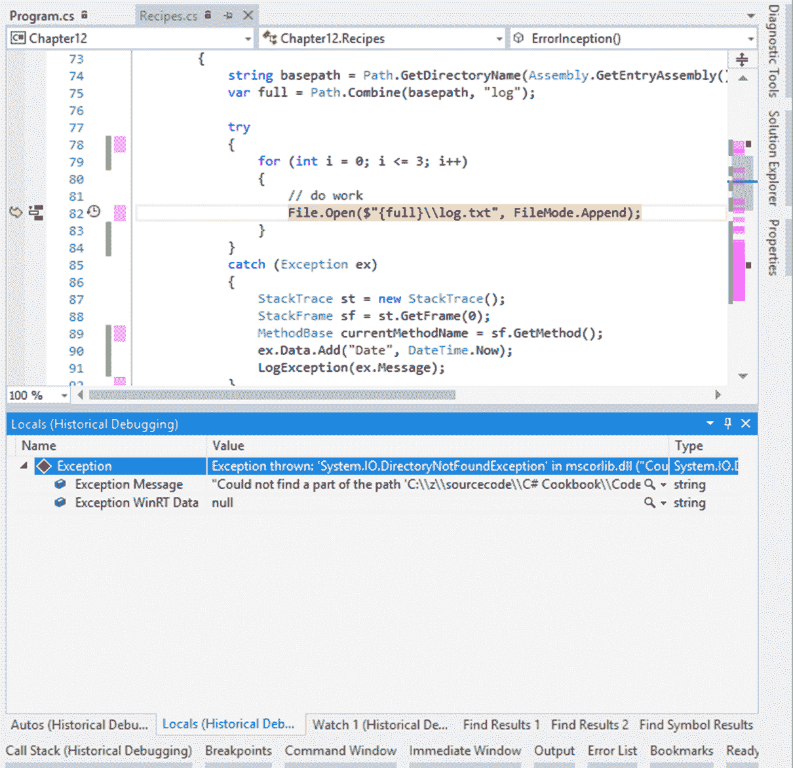

# 它是如何工作的...

这里的外卖是什么？如果你只记得一件事，记住这一点。一旦你的系统的用户由于错误而对系统的能力和潜力失去信心，这种信心几乎不可能恢复。即使你把你的系统从灰烬中复活，在它被 bug 和其他问题压垮之后，生产出一个完美的产品，你的用户也不会轻易动摇。这是因为在他们看来，这个系统是有缺陷的。

我曾经不得不接管一个由一个即将离开公司的高级开发人员部分开发的系统。她有一个出色的规格和一个很好的原型展示给客户。唯一的问题是，在系统的第一阶段实施后不久，她就离开了公司。当 bug 突然出现时，客户自然会向她寻求帮助。

告诉客户开发人员(他单独负责与客户建立关系)已经离开了公司，这对于灌输信心来说不是好兆头。无论如何，让一个开发人员参与进来是这个特定项目的第一个错误。

第二，第二阶段将由你真正开发，他也是唯一一个被分配到这个客户的开发人员。这必须在构建有问题的第一阶段时完成。所以，我在为系统开发新功能时修复了错误。幸运的是，这一次，我有一个叫罗里·谢尔顿的出色的项目经理作为我的助手。我们一起被甩到了最深处，Rory 出色地管理了客户的期望，同时在我们面临的挑战方面对客户完全透明。

不幸的是，用户已经对所提供的系统感到失望，并且不信任该软件。这种信任从未完全恢复。如果我们早在 2007 年就有智能跟踪和历史调试，我肯定能够在我不熟悉的代码库中跟踪问题。

始终调试您的软件。当你没有发现更多的错误时，再次调试它。然后把系统给我妈(爱你妈)。作为该系统的开发人员，您知道要点击哪些按钮和输入哪些数据，以及事情需要以何种顺序发生。我妈妈没有，我可以向你保证，一个不熟悉系统的用户可以比你泡一杯新咖啡更快地打破它。

Visual Studio 为开发人员提供了一套非常强大且功能丰富的调试工具。使用它们。

# 设置条件断点

在调试时，条件断点是另一个隐藏的宝石。这允许您指定一个或多个条件。当满足这些条件之一时，代码将在断点处停止。使用条件断点非常容易。

# 准备好

使用这个食谱，你没有什么特别需要准备的。

# 怎么做...

1.  将以下代码添加到您的`Program.cs`文件中。我们只是创建一个整数列表，并在该列表中循环:

```cs
        List<int> myList = new List<int>() { 1, 4, 6, 9, 11 }; 
        foreach(int num in myList) 
        { 
          Console.WriteLine(num); 
        } 
        Console.ReadLine();

```

2.  接下来，在循环内的`Console.WriteLine(num)`行代码上放置一个断点:


3.  右键单击断点并选择条件...从上下文菜单中:

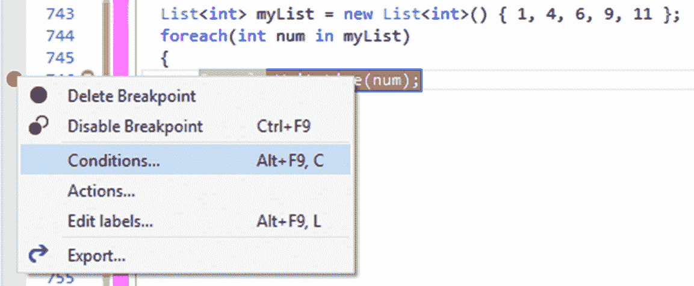

4.  现在，您将看到 Visual Studio 打开了一个断点设置窗口。这里我们指定只有当`num`的值为`9`时才需要命中断点。您可以添加几个条件并指定不同的条件。条件逻辑非常灵活:


5.  调试控制台应用。你会看到，当断点命中时，`num`的值为`9`:

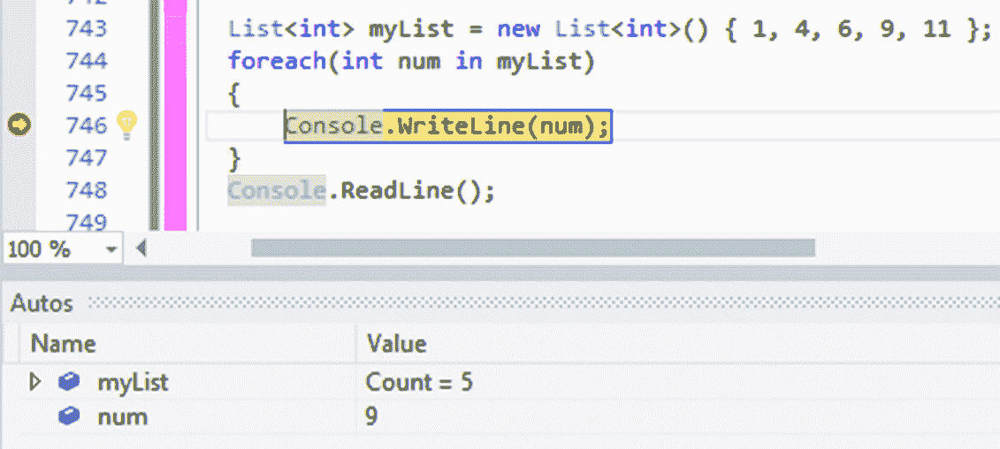

# 它是如何工作的...

在每个循环中评估该条件。当条件为真时，断点将被命中。在这个配方中举例说明的例子中，条件断点的真正好处有些丢失，因为它是一个非常小的列表。考虑一下这个。您正在绑定数据网格。网格上的项目会根据项目的状态给出特定的图标。您的网格包含数百个项目，因为这是一个分层网格。您可以识别绑定到网格的项目的主要标识。然后，该主标识被传递给其他代码逻辑来确定状态，从而确定显示的图标。

调试和按下 *F10* 通过数百个循环在任何情况下都是无效的。使用条件断点，您可以为主标识指定一个值，并且仅当循环达到该值时中断。然后，您可以直接转到显示不正确的项目。

# 使用性能提示识别代码中的瓶颈

性能提示绝对是我最喜欢的 Visual Studio 功能之一。解释他们的所作所为并不能公平对待他们。你必须看到他们在行动。

# 准备好

不要将性能提示与代码镜头混淆。它是与 Visual Studio 中的 CodeLens 分开的选项。

# 怎么做...

1.  默认情况下，性能提示处于启用状态。但是万一您没有看到任何性能提示，请转到工具|选项，并展开调试节点。在常规下，在设置页面的底部，您将看到一个名为调试时显示运行时间性能提示的选项。确保选中此选项:


2.  我们将创建一些简单的方法来模拟长时间运行的任务。为此，我们只需要让线程休眠几秒钟。在`Recipes.cs`文件中，添加以下代码:

```cs
        public static void RunFastTask() 
        { 
          RunLongerTask(); 
        } 

        private static void RunLongerTask() 
        { 
          Thread.Sleep(3000); 
          BottleNeck(); 
        } 

        private static void BottleNeck() 
        { 
          Thread.Sleep(8000); 
        }

```

3.  在您的控制台应用中，调用静态方法`RunFastTask()`并在这一行代码上放置一个断点:

```cs
        RunFastTask(); 
        Thread.Sleep(1000);

```

4.  开始调试控制台应用。您的断点将在`RunFastTask()`方法上停止。点击 *F10* 跳过这个方法:

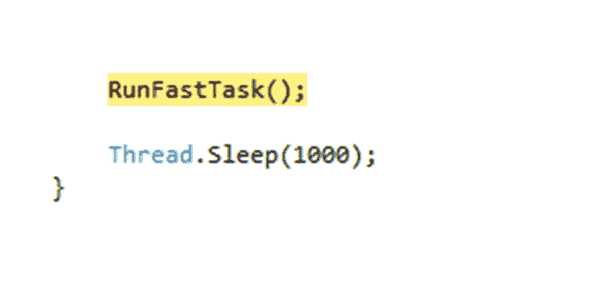

5.  您会注意到，11 秒后，下一行将突出显示，并显示性能提示。PerfTip 显示前一行代码执行所需的时间。所以，现在坐在`Thread.Sleep`上的调试器显示`RunFastTask()`方法花了 11 秒完成。这个任务显然不是很快:


6.  进入`RunFastTask()`方法，可以进一步放置断点，一个一个的跨过，找到造成最长延迟的方法。如您所见，性能提示允许开发人员快速轻松地识别代码中的瓶颈:


# 它是如何工作的...

市场上有许多工具可以做到这一点，甚至更多，允许开发人员查看各种代码度量。然而，性能提示允许您在按照正常的调试任务单步执行代码时动态地查看问题。在我看来，它是不可或缺的调试工具。