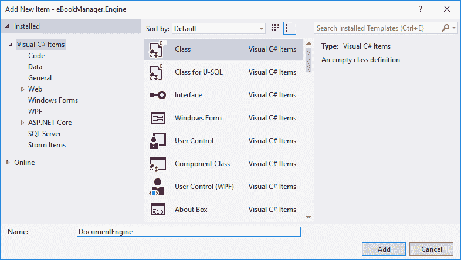
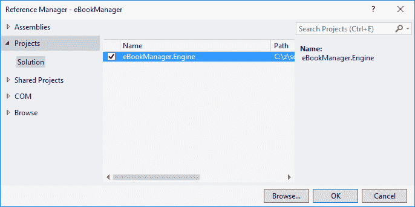
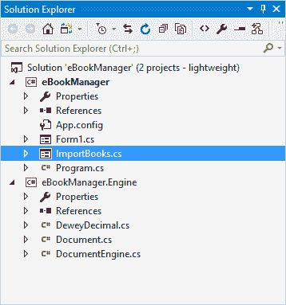
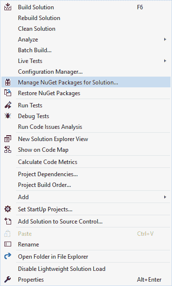
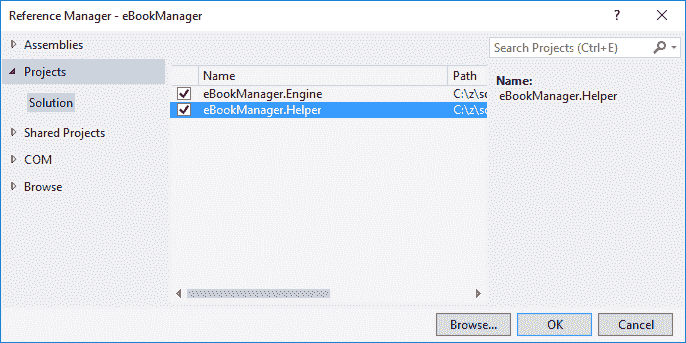
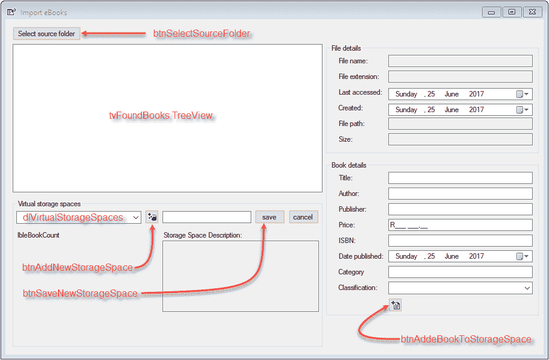
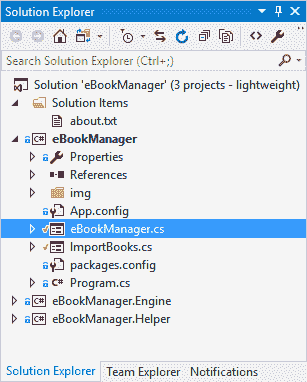
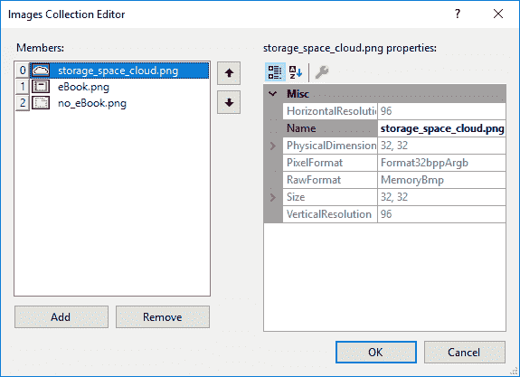
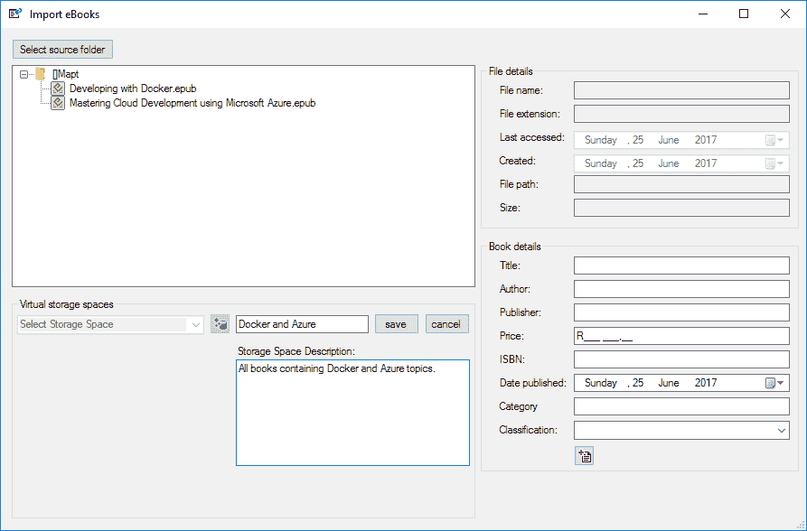
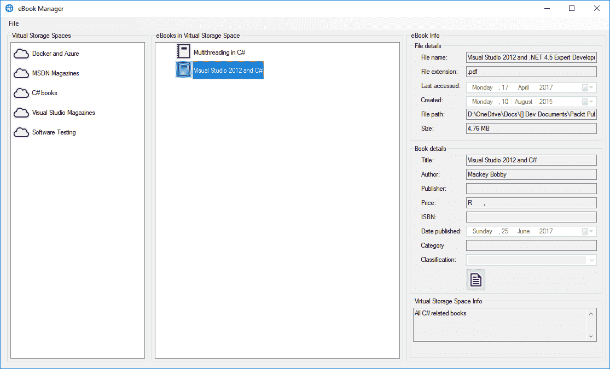

# 电子书管理器和目录应用

C# 7 是一个非常棒的版本，可以在 Visual Studio 2017 中获得。它向开发人员介绍了许多强大的功能，其中一些功能以前只能在其他语言中使用。C# 7 中引入的新特性允许开发人员编写更少的代码并提高工作效率。

可用的功能有:

*   元组
*   模式匹配
*   `Out`变量
*   解构
*   本地功能
*   文字的改进
*   Ref 返回和局部变量
*   通用异步和返回类型
*   访问器、构造器和终结器的表达式主体
*   抛出表达式

本章将带您了解其中的一些功能，而本书的其余部分将在我们前进的过程中向您介绍一些其他功能。在本章中，我们将创建一个`eBookManager`应用。如果你像我一样，你的硬盘上到处都是电子书，还有一些外置硬盘。该应用将提供一种机制，将所有这些不同的位置整合到一个虚拟存储空间中。该应用是功能性的，但可以进一步增强以满足您的需求。像这样的应用范围很广。可以从 GitHub([https://github.com/PacktPublishing/CSharp7-and-.)下载源代码 NET-Core-2.0-蓝图](https://github.com/PacktPublishing/CSharp7-and-.NET-Core-2.0-Blueprints))并跟随它来看看 C# 7 的一些新特性在起作用。

开始吧！

# 设置项目

使用 Visual Studio 2017，我们将创建一个简单的 Windows 窗体应用模板项目。你可以随意调用应用，但我调用了我的`eBookManager`:


该项目将被创建，如下所示:


我们的解决方案需要一个类库项目来包含驱动`eBookManager`应用的类。向您的解决方案中添加一个新的类库项目，并将其称为`eBookManager.Engine`:


使用默认类名将类库项目添加到解决方案中。将此类更改为`Document`:


`Document`类将代表一个电子书。想到一本书，我们可以有多种属性来代表一本书，但要代表所有的书。作者就是一个例子。所有的书都必须有作者，否则就不存在。

我知道你们中的一些人可能认为机器也可以生成文档，但是它生成的信息可能最初是由一个人写的。以代码注释为例。开发人员用代码编写注释，工具从代码生成文档。开发者仍然是作者。

我添加到类中的属性仅仅是我对一本书的解释。请随意添加额外的代码，使其成为您自己的代码。

打开`Document.cs`文件，将以下代码添加到类中:

```cs
namespace eBookManager.Engine 
{ 
    public class Document 
    { 
        public string Title { get; set; } 
        public string FileName { get; set; } 
        public string Extension { get; set; } 
        public DateTime LastAccessed { get; set; } 
        public DateTime Created { get; set; } 
        public string FilePath { get; set; } 
        public string FileSize { get; set; } 
        public string ISBN { get; set; } 
        public string Price { get; set; } 
        public string Publisher { get; set; } 
        public string Author { get; set; } 
        public DateTime PublishDate { get; set; } 
        public DeweyDecimal Classification { get; set; } 
        public string Category { get; set; } 
    } 
} 
```

你会注意到我包含了一个名为`Classification`的属性，类型为`DeweyDecimal`。我们还没有添加这个类，接下来会添加。

在`eBookManager.Engine`项目中，添加一个名为`DeweyDecimal`的类。如果你不想为你的电子书进行这种级别的分类，你可以不去上这门课。为了完整起见，我将它包括在内:


您的`DeweyDecimal`类必须与之前添加的`Document`类在同一个项目中:


`DeweyDecimal`系统挺大的。由于这个原因，我没有迎合每一个可用的图书分类。我也只是假设你会想用编程电子书。然而，在现实中，你可能想加入其他分类，比如文学、科学、艺术等等。由你来决定。
让我们创建一个类来表示杜威十进制系统:

1.  打开`DeweyDecimal`类，并在该类中添加以下代码:

```cs
namespace eBookManager.Engine 
{ 
    public class DeweyDecimal 
    { 
        public string ComputerScience { get; set; } = "000"; 
        public string DataProcessing { get; set; } = "004"; 
        public string ComputerProgramming { get; set; } = "005"; 
    } 
}
```

文字书呆子可能不同意我的观点，但我想提醒他们，我是一个代码书呆子。这里所代表的分类只是为了让我能够对编程和计算机科学相关的电子书进行分类。如前所述，您可以根据自己的需要进行更改。

2.  我们现在需要添加在`eBookManager.Engine`解决方案的核心。这是一个名为`DocumentEngine`的类，它将包含处理文档所需的方法:



您的`eBookManager.Engine`解决方案现在将包含以下类:


3.  我们现在需要从`eBookManager`项目中添加对`eBookManager.Engine`的引用。我相信你们都知道怎么做:


`eBookManager.Engine`项目将出现在参考管理器屏幕的项目部分:



4.  一旦我们添加了引用，我们就需要一个负责导入新书的窗口表单。在`eBookManager`解决方案中添加一个名为`ImportBooks`的新表单:



5.  在我们忘记之前，给`ImportBooks`表单添加一个`ImageList`控件，并将其称为`tvImages`。这将包含我们要编目的不同类型文档的图像。

The `ImageList` is a control you add from the Toolbox on to the `ImportBooks` form. You can access the Images Collection Editor from the `ImageList` properties.

图标可以在源代码的`img`文件夹中找到，可从 GitHub 下载，网址如下—[https://github.com/PacktPublishing/CSharp7-and-.网络核心 2.0 蓝图](https://github.com/PacktPublishing/CSharp7-and-.NET-Core-2.0-Blueprints)。

这里的图标适合 PDF、MS Word 和 ePub 文件类型。它还包含文件夹图像:


6.  现在，要在 C# 7 中使用元组，需要添加`System.ValueTuple` NuGet 包。右键单击您的解决方案，然后选择管理/获取解决方案的包...

Please note that if you are running the .NET Framework 4.7, `System.ValueTuple` is included in this version of the framework. You will therefore not need to get it from NuGet.



7.  搜索`System.ValueTuple`并将其添加到您的解决方案项目中。然后单击“安装”并让该过程完成(您将在 Visual Studio 的输出窗口中看到进度):


我喜欢在我的项目中使用扩展方法。为此，我通常会添加一个单独的项目和/或类。在这个应用中，我添加了一个`eBookManager.Helper`类库项目:


8.  该辅助类也必须添加到`eBookManager`解决方案中作为参考:



最后，我将使用 JSON 作为我的电子书目录的简单文件存储。JSON 真的很灵活，可以被各种编程语言消费。JSON 之所以这么好，是因为它的重量相对较轻，并且它生成的输出是人类可读的:


9.  转到管理您的解决方案的 NuGet 包并搜索`Newtonsoft.Json`。然后将其添加到解决方案中的项目中，并单击“安装”按钮。

现在，您已经为您的`eBookManager`应用设置了所需的基础。接下来，我们将通过编写一些代码来进一步深入应用的内部。

# 虚拟存储空间和扩展方法

让我们从讨论虚拟存储空间背后的逻辑开始。这是硬盘上几个物理空间的单一虚拟表示。存储空间将被视为存储一组特定电子书的单一区域*。我使用术语*宽松地存储*，因为存储空间不存在。它更像是一个分组，而不是硬盘上的物理空间:*

 *1.  要开始创建虚拟存储空间，请在`eBookManager.Engine`项目中添加一个名为`StorageSpace`的新类。打开`StorageSpace.cs`文件并添加以下代码:

```cs
using System; 
using System.Collections.Generic; 

namespace eBookManager.Engine 
{ 
    [Serializable] 
    public class StorageSpace 
    { 
        public int ID { get; set; } 
        public string Name { get; set; } 
        public string Description { get; set; } 
        public List<Document> BookList { get; set; } 
    } 
} 
```

Note that you need to include the `System.Collections.Generic` namespace here, because the `StorageSpace` class contains a property called `BookList` of type `List<Document>` that will contain all the books in that particular storage space.

现在我们需要把注意力集中在`eBookManager.Helper`项目中的`ExtensionMethods`类上。这将是一个静态类，因为扩展方法需要本质上是静态的，以便作用于由扩展方法定义的各种对象。

2.  向`eBookManager.Helper`项目添加一个新类，并修改`ExtensionMethods`类，如下所示:

```cs
public static class ExtensionMethods 
{ 

} 
```

让我们将第一个扩展方法添加到名为`ToInt()`的类中。这个扩展方法所做的是获取一个`string`值，并尝试将其解析为一个`integer`值。每当我需要将`string`转换为`integer`时，我都懒得打字。正是因为这个原因，我使用了一个扩展方法。

3.  将以下静态方法添加到`ExtensionMethods`类中:

```cs
public static int ToInt(this string value, int defaultInteger = 0) 
{ 
    try 
    { 
        if (int.TryParse(value, out int validInteger)) 
          // Out variables 
         return validInteger; 
        else 
         return defaultInteger; 
    } 
    catch  
    { 
        return defaultInteger; 
    } 
} 
```

`ToInt()`延伸法只作用于`string`。这是由方法签名中的代码`this string value`定义的，其中`value`是包含您试图转换为`integer`的`string`的变量名。它还有一个名为`defaultInteger`的默认参数，设置为`0.`除非调用扩展方法的开发人员想要返回一个默认的整数值`0`，否则他们可以向这个扩展方法传递一个不同的整数(例如`-1`)。

也是在这里，我们找到了 C# 7 的第一个特性。对`out`变量的改进。在以前的 C# 迭代中，我们必须对`out`变量执行以下操作:

```cs
int validInteger; 
if (int.TryParse(value, out validInteger)) 
{ 

} 
```

有一个预先声明的整数变量，如果`string`值被解析为`integer`，它就会得到它的值。C# 7 大大简化了代码:

```cs
if (int.TryParse(value, out int validInteger)) 
```

C# 7 允许开发人员在那里声明一个`out`变量，并作为`out`参数传递。转到`ExtensionMethods`类的其他方法，这些方法用于提供以下逻辑:

*   `Read`和`write`到数据源

*   检查存储空间是否存在

*   将字节转换为兆字节

*   将`string`转换为`integer`(如前所述)

`ToMegabytes`方法相当简单。不必到处写这个计算，在扩展方法中定义它是有意义的:

```cs
public static double ToMegabytes(this long bytes) 
{ 
    return (bytes > 0) ? (bytes / 1024f) / 1024f : bytes; 
} 
```

我们还需要一种方法来检查特定的存储空间是否已经存在。

Be sure to add a project reference to `eBookManager.Engine` from the `eBookManager.Helper` project.

这个扩展方法还会将下一个存储空间标识返回给调用代码。如果存储空间不存在，返回的标识将是创建新存储空间时可以使用的下一个标识:

```cs
public static bool StorageSpaceExists(this List<StorageSpace> space, string nameValueToCheck, out int storageSpaceId) 
{ 
    bool exists = false; 
    storageSpaceId = 0; 

    if (space.Count() != 0) 
    { 
       int count = (from r in space 
                 where r.Name.Equals(nameValueToCheck) 
                 select r).Count(); 

        if (count > 0) 
            exists = true; 

        storageSpaceId = (from r in space 
                          select r.ID).Max() + 1;                                 
    } 
    return exists; 
} 
```

我们还需要创建一个方法，将我们拥有的数据转换为 JSON 后`write`到一个文件中:

```cs
public static void WriteToDataStore(this List<StorageSpace> value, string storagePath, bool appendToExistingFile = false) 
{ 
    JsonSerializer json = new JsonSerializer(); 
    json.Formatting = Formatting.Indented; 
    using (StreamWriter sw = new StreamWriter(storagePath,  
     appendToExistingFile)) 
    { 
        using (JsonWriter writer = new JsonTextWriter(sw)) 
        { 
            json.Serialize(writer, value); 
        } 
    } 
} 
```

这个方法不言自明。它作用于`List<StorageSpace>`对象，并将创建 JSON 数据，覆盖在`storagePath`变量中定义的文件。

最后，我们需要能够将数据再次返回到一个`List<StorageSpace>`对象中，并将其返回到调用代码中:

```cs
public static List<StorageSpace> ReadFromDataStore(this List<StorageSpace> value, string storagePath) 
{ 
    JsonSerializer json = new JsonSerializer(); 
    if (!File.Exists(storagePath)) 
    { 
        var newFile = File.Create(storagePath); 
        newFile.Close(); 
    } 
    using (StreamReader sr = new StreamReader(storagePath)) 
    { 
        using (JsonReader reader = new JsonTextReader(sr)) 
        { 
            var retVal = 
             json.Deserialize<List<StorageSpace>>(reader); 
            if (retVal is null) 
                retVal = new List<StorageSpace>(); 

            return retVal; 
        } 
    } 
} 
```

该方法将返回一个空的`List<StorageSpace>`对象，文件中不包含任何内容。`ExtensionMethods`类可以包含更多您可能经常使用的扩展方法。这是分离常用代码的好方法。

# 文档引擎类

这个类的目的仅仅是为文档提供支持代码。在`eBookManager`应用中，我将使用一个名为`GetFileProperties()`的方法，它将(你猜对了)返回所选文件的属性。这个类也只包含这个方法。由于应用是为您的特定目的而修改的，您可以修改这个类并添加特定于文档的其他方法。

`DocumentEngine`类向我们介绍了 C# 7 的下一个名为**元组**的特性。元组具体做什么？开发人员经常需要从一个方法中返回多个值。在其他解决方案中，您当然可以使用`out`参数，但是这些在`async`方法中不起作用。元组为此提供了更好的方法。

在`DocumentEngine`类中，添加以下代码:

```cs
public (DateTime dateCreated, DateTime dateLastAccessed, string fileName, string fileExtension, long fileLength, bool error) GetFileProperties(string filePath) 
{ 
    var returnTuple = (created: DateTime.MinValue,
    lastDateAccessed: DateTime.MinValue, name: "", ext: "",
    fileSize: 0L, error: false); 

    try 
    { 
        FileInfo fi = new FileInfo(filePath); 
        fi.Refresh(); 
        returnTuple = (fi.CreationTime, fi.LastAccessTime, fi.Name, 
        fi.Extension, fi.Length, false); 
    } 
    catch 
    { 
        returnTuple.error = true; 
    } 
    return returnTuple; 
} 
```

`GetFileProperties()`方法返回一个元组作为`(DateTime dateCreated, DateTime dateLastAccessed, string fileName, string fileExtension, long fileLength, bool error)`，并允许我们轻松检查从调用代码返回的值。

在我尝试获取特定文件的属性之前，我通过执行以下操作来初始化`tuple`:

```cs
var returnTuple = (created: DateTime.MinValue, lastDateAccessed: DateTime.MinValue, name: "", ext: "", fileSize: 0L, error: false); 
```

如果有异常，我可以返回默认值。使用`FileInfo`类读取文件属性非常简单。然后，我可以通过执行以下操作将文件属性分配给`tuple`:

```cs
returnTuple = (fi.CreationTime, fi.LastAccessTime, fi.Name, fi.Extension, fi.Length, false); 
```

`tuple`然后返回到调用代码，在那里它将根据需要被使用。接下来我们将看一下调用代码。

# 进口书籍表格

`ImportBooks`形式确实如其名。它允许我们创建虚拟存储空间，并将书籍导入这些空间。表单设计如下:



`TreeView`控件以`tv`为前缀，按钮以`btn`为前缀，组合框以`dl`为前缀，文本框以`txt`为前缀，日期时间选择器以`dt`为前缀。当此表单加载时，如果定义了任何存储空间，这些空间将在`dlVirtualStorageSpaces`组合框中列出。点击选择源文件夹按钮将允许我们选择一个源文件夹来寻找电子书。

如果存储空间不存在，我们可以通过点击`btnAddNewStorageSpace`按钮添加一个新的虚拟存储空间。这将允许我们为新的存储空间添加名称和描述，并点击`btnSaveNewStorageSpace`按钮。

从`tvFoundBooks`树形视图中选择一个电子书将填充表单右侧的**文件详细信息**控件组。然后，您可以添加更多图书详情，并点击`btnAddeBookToStorageSpace`按钮将图书添加到我们的空间:

1.  您需要确保将以下名称空间添加到您的`ImportBooks`类中:

```cs
using eBookManager.Engine; 
using System; 
using System.Collections.Generic; 
using System.IO; 
using System.Linq; 
using System.Windows.Forms; 
using static eBookManager.Helper.ExtensionMethods; 
using static System.Math; 
```

2.  接下来，让我们从最符合逻辑的地方开始，那就是构造函数`ImportBooks()`和表单变量。在构造函数上方添加以下代码:

```cs
private string _jsonPath; 
private List<StorageSpace> spaces; 
private enum StorageSpaceSelection { New = -9999, NoSelection = -1 } 
```

枚举器的用处将在以后的代码中变得显而易见。`_jsonPath`变量将包含用于存储我们电子书信息的文件的路径。

3.  按如下方式修改构造函数:

```cs
public ImportBooks() 
{ 
    InitializeComponent(); 
    _jsonPath = Path.Combine(Application.StartupPath, 
    "bookData.txt"); 
    spaces = spaces.ReadFromDataStore(_jsonPath); 
} 
```

`_jsonPath`初始化为应用的执行文件夹，文件硬编码为`bookData.txt`。如果您想配置这些设置，您可以提供设置屏幕，但是我决定让应用使用硬编码设置。

4.  接下来，我们需要添加另一个枚举器，它定义了我们可以保存在应用中的文件扩展名。正是在这里，我们将看到 C# 7 的另一个被称为`expression-bodied`属性的特性。

# 表达式体访问器、构造器和终结器

如果下面的表达式看起来令人生畏，那是因为它使用了 C# 6 中引入并在 C# 7 中扩展的一个特性:

```cs
private HashSet<string> AllowedExtensions => new HashSet<string>(StringComparer.InvariantCultureIgnoreCase) { ".doc",".docx",".pdf", ".epub" }; 
private enum Extention { doc = 0, docx = 1, pdf = 2, epub = 3 } 
```

前面的例子为我们的应用返回了一个允许的文件扩展名`HashSet`。这些从 C# 6 开始就存在了，但是在 C# 7 中已经扩展到包括*访问器*、*构造器*和*终结器*。让我们稍微简化一下例子。

假设我们必须修改`Document`类，为类内的`_defaultDate`设置一个字段；传统上，我们需要这样做:

```cs
private DateTime _defaultDate; 

public Document() 
{ 
    _defaultDate = DateTime.Now; 
} 
```

在 C# 7 中，我们可以通过简单地执行以下操作来大大简化这段代码:

```cs
private DateTime _defaultDate; 
public Document() => _defaultDate = DateTime.Now; 
```

这是完全合法的，并且编译正确。同样，终结器(或解构器)也可以做到这一点。另一个很好的实现是`expression-bodied`属性，如`AllowedExtensions`属性所示。`expression-bodied`属性实际上从 C# 6 开始就存在了，但是谁在计算呢？

假设我们只想返回 pdf 的`Extension`枚举的`string`值，我们可以做如下事情:

```cs
public string PDFExtension 
{ 
    get 
    { 
        return nameof(Extention.pdf); 
    } 
} 
```

该属性只有一个 get 访问器，永远不会返回除`Extension.pdf`的`string`值以外的任何东西。通过将代码更改为以下内容来简化:

```cs
public string PDFExtension => nameof(Extention.pdf); 
```

就这样。一行代码的作用与前面七行代码完全相同。属于同一类别的`expression-bodied`属性访问器也进行了简化。考虑以下 11 行代码:

```cs
public string DefaultSavePath 
{ 
    get 
    { 
        return _jsonPath; 
    } 
    set 
    { 
        _jsonPath = value; 
    } 
} 
```

使用 C# 7，我们可以将其简化为以下内容:

```cs
public string DefaultSavePath 
{ 
    get => _jsonPath; 
    set => _jsonPath = value; 
} 
```

这使得我们的代码可读性更强，编写速度更快。回到我们的`AllowedExtensions`属性；传统上，它的写法如下:

```cs
private HashSet<string> AllowedExtensions 
{ 
    get 
    { 
        return new HashSet<string> 
        (StringComparer.InvariantCultureIgnoreCase) { ".doc", 
        ".docx", ".pdf", ".epub" }; 
    } 
} 
```

从 C# 6 开始，正如我们之前看到的，我们已经能够简化这一点。这为开发人员提供了一个减少不必要代码的好方法。

# 推广树形视图

当我们查看`PopulateBookList()`方法时，我们可以看到`AllowedExtensions`属性的实现。这个方法所做的就是用在选定的源位置找到的文件和文件夹填充`TreeView`控件。考虑以下代码:

```cs
public void PopulateBookList(string paramDir, TreeNode paramNode) 
{ 
    DirectoryInfo dir = new DirectoryInfo(paramDir); 
    foreach (DirectoryInfo dirInfo in dir.GetDirectories()) 
    { 
        TreeNode node = new TreeNode(dirInfo.Name); 
        node.ImageIndex = 4; 
        node.SelectedImageIndex = 5; 

        if (paramNode != null) 
            paramNode.Nodes.Add(node); 
        else 
            tvFoundBooks.Nodes.Add(node); 
        PopulateBookList(dirInfo.FullName, node); 
    } 
    foreach (FileInfo fleInfo in dir.GetFiles().Where
    (x => AllowedExtensions.Contains(x.Extension)).ToList()) 
    { 
        TreeNode node = new TreeNode(fleInfo.Name); 
        node.Tag = fleInfo.FullName; 
        int iconIndex = Enum.Parse(typeof(Extention), 
         fleInfo.Extension.TrimStart('.'), true).GetHashCode(); 

        node.ImageIndex = iconIndex; 
        node.SelectedImageIndex = iconIndex; 
        if (paramNode != null) 
            paramNode.Nodes.Add(node); 
        else 
            tvFoundBooks.Nodes.Add(node); 
    } 
} 
```

我们需要调用这个方法的第一个地方显然是从它自身内部，因为这是一个递归方法。我们需要称之为第二个地方的是来自`btnSelectSourceFolder`按钮的点击事件:

```cs
private void btnSelectSourceFolder_Click(object sender, EventArgs e) 
{ 
    try 
    { 
        FolderBrowserDialog fbd = new FolderBrowserDialog(); 
        fbd.Description = "Select the location of your eBooks and 
        documents"; 

        DialogResult dlgResult = fbd.ShowDialog(); 
        if (dlgResult == DialogResult.OK) 
        { 
            tvFoundBooks.Nodes.Clear(); 
            tvFoundBooks.ImageList = tvImages; 

            string path = fbd.SelectedPath; 
            DirectoryInfo di = new DirectoryInfo(path); 
            TreeNode root = new TreeNode(di.Name); 
            root.ImageIndex = 4; 
            root.SelectedImageIndex = 5; 
            tvFoundBooks.Nodes.Add(root); 
            PopulateBookList(di.FullName, root); 
            tvFoundBooks.Sort(); 

            root.Expand(); 
        } 
    } 
    catch (Exception ex) 
    { 
        MessageBox.Show(ex.Message); 
    } 
} 
```

这些都是非常简单的代码。选择要递归的文件夹，并用找到的与我们的`AllowedExtensions`属性中包含的文件扩展名匹配的所有文件填充`TreeView`控件。

我们还需要看看`tvFoundBooks` `TreeView`控件中有人选书时的代码。当选择一本书时，我们需要读取所选文件的属性，并将这些属性返回到文件详细信息部分:

```cs
private void tvFoundBooks_AfterSelect(object sender, TreeViewEventArgs e) 
{ 
    DocumentEngine engine = new DocumentEngine(); 
    string path = e.Node.Tag?.ToString() ?? ""; 

    if (File.Exists(path)) 
    { 
        var (dateCreated, dateLastAccessed, fileName, 
        fileExtention, fileLength, hasError) = 
        engine.GetFileProperties(e.Node.Tag.ToString()); 

        if (!hasError) 
        { 
            txtFileName.Text = fileName; 
            txtExtension.Text = fileExtention; 
            dtCreated.Value = dateCreated; 
            dtLastAccessed.Value = dateLastAccessed; 
            txtFilePath.Text = e.Node.Tag.ToString(); 
            txtFileSize.Text = $"{Round(fileLength.ToMegabytes(),
            2).ToString()} MB"; 
        } 
    } 
} 
```

您会注意到，正是在这里，我们调用了返回元组的`DocumentEngine`类上的方法`GetFileProperties()`。

# 本地功能

这是 C# 7 中的一个特性，我真的很想知道在哪里可以找到它的用途。事实证明，局部函数确实非常有用。也被一些人称为*嵌套函数*，这些函数嵌套在另一个父函数中。它显然只在父函数内部的范围内，并且添加了一种有用的方法来调用代码，否则在父函数之外不会有任何真正的目的。考虑`PopulateStorageSpacesList()`方法:

```cs
private void PopulateStorageSpacesList() 
{ 
    List<KeyValuePair<int, string>> lstSpaces = 
    new List<KeyValuePair<int, string>>(); 
    BindStorageSpaceList((int)StorageSpaceSelection.NoSelection, 
    "Select Storage Space"); 

    void BindStorageSpaceList(int key, string value)
    // Local function 
    { 
        lstSpaces.Add(new KeyValuePair<int, string>(key, value)); 
    } 

    if (spaces is null || spaces.Count() == 0) // Pattern matching 
    { 
        BindStorageSpaceList((int)StorageSpaceSelection.New, "
        <create new>"); 
    } 
    else 
    { 
        foreach (var space in spaces) 
        { 
            BindStorageSpaceList(space.ID, space.Name); 
        } 
    } 

    dlVirtualStorageSpaces.DataSource = new 
    BindingSource(lstSpaces, null); 
    dlVirtualStorageSpaces.DisplayMember = "Value"; 
    dlVirtualStorageSpaces.ValueMember = "Key"; 
} 
```

要看`PopulateStorageSpacesList()`如何调用本地函数`BindStorageSpaceList()`，请看下面的截图:


您会注意到，可以从父函数中的任何地方调用本地函数。在这种情况下，`BindStorageSpaceList()`局部函数不返回任何东西，但是你可以从局部函数返回任何你喜欢的东西。你也可以做以下事情:

```cs
private void SomeMethod() 
{ 
    int currentYear = GetCurrentYear(); 

    int GetCurrentYear(int iAddYears = 0) 
    { 
        return DateTime.Now.Year + iAddYears; 
    } 

    int nextYear = GetCurrentYear(1); 
} 
```

可以从父函数中的任何地方访问本地函数。

# 模式匹配

停留在`PopulateStorageSpacesList()`方法，我们可以看到另一个 C# 7 特性的使用，叫做**模式匹配**。`spaces is null`行代码可能是最简单的模式匹配形式。实际上，模式匹配支持几种模式。

考虑一个`switch`语句:

```cs
switch (objObject) 
{ 
    case null: 
        WriteLine("null"); // Constant pattern 
        break; 

    case Document doc when doc.Author.Equals("Stephen King"): 
        WriteLine("Stephen King is the author"); 
        break; 

    case Document doc when doc.Author.StartsWith("Stephen"): 
        WriteLine("Stephen is the author"); 
        break; 

    default: 
        break; 
} 
```

模式匹配允许开发人员使用`is`表达式来查看某个东西是否匹配特定的模式。请记住，模式需要检查最具体到最一般的模式。如果您简单地以`case Document doc:`开始案例，那么传递给类型为`Document`的`switch`语句的所有对象都将匹配。你永远找不到作者是`Stephen King`或以`Stephen`开头的具体文件。

对于 C# 从 C 语言继承的构造，自 70 年代以来没有太大变化。C# 7 通过模式匹配改变了这一切。

# 完成导入书籍代码

让我们看看`ImportBooks`表单中的其余代码。如果以前保存过任何现有存储空间，则表单加载仅填充存储空间列表:

```cs
private void ImportBooks_Load(object sender, EventArgs e) 
{ 
    PopulateStorageSpacesList(); 

    if (dlVirtualStorageSpaces.Items.Count == 0) 
    { 
        dlVirtualStorageSpaces.Items.Add("<create new storage 
        space>"); 
    } 

    lblEbookCount.Text = ""; 
} 
```

我们现在需要添加用于更改所选存储空间的逻辑。`dlVirtualStorageSpaces`控制的`SelectedIndexChanged()`事件修改如下:

```cs
private void dlVirtualStorageSpaces_SelectedIndexChanged(object sender, EventArgs e) 
{ 
    int selectedValue = 
    dlVirtualStorageSpaces.SelectedValue.ToString().ToInt(); 

    if (selectedValue == (int)StorageSpaceSelection.New) // -9999 
    { 
        txtNewStorageSpaceName.Visible = true; 
        lblStorageSpaceDescription.Visible = true; 
        txtStorageSpaceDescription.ReadOnly = false; 
        btnSaveNewStorageSpace.Visible = true; 
        btnCancelNewStorageSpaceSave.Visible = true; 
        dlVirtualStorageSpaces.Enabled = false; 
        btnAddNewStorageSpace.Enabled = false; 
        lblEbookCount.Text = ""; 
    } 
    else if (selectedValue != 
    (int)StorageSpaceSelection.NoSelection) 
    { 
        // Find the contents of the selected storage space 
        int contentCount = (from c in spaces 
                            where c.ID == selectedValue 
                            select c).Count(); 
        if (contentCount > 0) 
        { 
            StorageSpace selectedSpace = (from c in spaces 
                                          where c.ID == 
                                          selectedValue 
                                          select c).First(); 

            txtStorageSpaceDescription.Text = 
            selectedSpace.Description; 

            List<Document> eBooks = (selectedSpace.BookList == 
            null) 
             ? new List<Document> { } : selectedSpace.BookList; 
            lblEbookCount.Text = $"Storage Space contains 
             {eBooks.Count()} {(eBooks.Count() == 1 ? "eBook" :
             "eBooks")}"; 
        } 
    } 
    else 
    { 
        lblEbookCount.Text = ""; 
    } 
} 
```

我不会在这里对代码进行任何详细的解释，因为它正在做什么是相对显而易见的。

# 抛出表达式

我们还需要添加代码来节省新的存储空间。在`btnSaveNewStorageSpace`按钮的`Click`事件中添加以下代码:

```cs
private void btnSaveNewStorageSpace_Click(object sender,
  EventArgs e) 
  { 
    try 
    { 
        if (txtNewStorageSpaceName.Text.Length != 0) 
        { 
            string newName = txtNewStorageSpaceName.Text; 

            // throw expressions: bool spaceExists = 
           (space exists = false) ? return false : throw exception                     
            // Out variables 
            bool spaceExists = (!spaces.StorageSpaceExists
            (newName, out int nextID)) ? false : throw new 
            Exception("The storage space you are 
             trying to add already exists."); 

            if (!spaceExists) 
            { 
                StorageSpace newSpace = new StorageSpace(); 
                newSpace.Name = newName; 
                newSpace.ID = nextID; 
                newSpace.Description = 
                txtStorageSpaceDescription.Text; 
                spaces.Add(newSpace); 
                PopulateStorageSpacesList(); 
                // Save new Storage Space Name 
                txtNewStorageSpaceName.Clear(); 
                txtNewStorageSpaceName.Visible = false; 
                lblStorageSpaceDescription.Visible = false; 
                txtStorageSpaceDescription.ReadOnly = true; 
                txtStorageSpaceDescription.Clear(); 
                btnSaveNewStorageSpace.Visible = false; 
                btnCancelNewStorageSpaceSave.Visible = false; 
                dlVirtualStorageSpaces.Enabled = true; 
                btnAddNewStorageSpace.Enabled = true; 
            } 
        } 
    } 
    catch (Exception ex) 
    { 
        txtNewStorageSpaceName.SelectAll(); 
        MessageBox.Show(ex.Message); 
    } 
} 
```

在这里，我们可以看到 C# 7 语言中的另一个新特性，叫做**抛出表达式**。这使开发人员能够从表达式中抛出异常。问题代码是这样的代码:

```cs
bool spaceExists = (!spaces.StorageSpaceExists(newName, out int nextID)) ? false : throw new Exception("The storage space you are trying to add already exists."); 
```

我总是喜欢记住代码的结构如下:


最后几个方法涉及将电子书保存在选定的虚拟存储空间中。修改`btnAddBookToStorageSpace`按钮的`Click`事件。这段代码还包含一个抛出表达式。如果您尚未从组合框中选择存储空间，则会引发新的异常:

```cs
private void btnAddeBookToStorageSpace_Click(object sender, EventArgs e) 
{ 
    try 
    { 
        int selectedStorageSpaceID = 
         dlVirtualStorageSpaces.SelectedValue.ToString().ToInt(); 
        if ((selectedStorageSpaceID !=   
         (int)StorageSpaceSelection.NoSelection) 
        && (selectedStorageSpaceID !=
          (int)StorageSpaceSelection.New)) 
        { 
            UpdateStorageSpaceBooks(selectedStorageSpaceID); 
        } 
        else throw new Exception("Please select a Storage 
       Space to add your eBook to"); // throw expressions 
    } 
    catch (Exception ex) 
    { 
        MessageBox.Show(ex.Message); 
    } 
} 
```

开发人员现在可以立即在代码中出现异常的地方抛出异常。这相当不错，使代码更清晰，意图更明确。

# 将选定的书保存到存储空间

下面的代码基本上更新了所选存储空间中的图书列表，如果它已经包含了特定的图书(在与用户确认之后)。否则，它会将该书作为新书添加到图书列表中:

```cs
private void UpdateStorageSpaceBooks(int storageSpaceId) 
{ 
    try 
    { 
        int iCount = (from s in spaces 
                      where s.ID == storageSpaceId 
                      select s).Count(); 
        if (iCount > 0) // The space will always exist 
        { 
            // Update 
            StorageSpace existingSpace = (from s in spaces 
              where s.ID == storageSpaceId select s).First(); 

            List<Document> ebooks = existingSpace.BookList; 

            int iBooksExist = (ebooks != null) ? (from b in ebooks 
              where $"{b.FileName}".Equals($"
               {txtFileName.Text.Trim()}") 
                 select b).Count() : 0; 

            if (iBooksExist > 0) 
            { 
                // Update existing book 
                DialogResult dlgResult = MessageBox.Show($"A book 
                with the same name has been found in Storage Space 
                {existingSpace.Name}. 
                Do you want to replace the existing book
                entry with this one?", 
                "Duplicate Title", MessageBoxButtons.YesNo,
                 MessageBoxIcon.Warning,
                 MessageBoxDefaultButton.Button2); 
                if (dlgResult == DialogResult.Yes) 
                { 
                    Document existingBook = (from b in ebooks 
                      where $"
                      {b.FileName}".Equals($"
                      {txtFileName.Text.Trim()}") 
                       select b).First(); 

                    existingBook.FileName = txtFileName.Text; 
                    existingBook.Extension = txtExtension.Text; 
                    existingBook.LastAccessed = 
                    dtLastAccessed.Value; 
                    existingBook.Created = dtCreated.Value; 
                    existingBook.FilePath = txtFilePath.Text; 
                    existingBook.FileSize = txtFileSize.Text; 
                    existingBook.Title = txtTitle.Text; 
                    existingBook.Author = txtAuthor.Text; 
                    existingBook.Publisher = txtPublisher.Text; 
                    existingBook.Price = txtPrice.Text; 
                    existingBook.ISBN = txtISBN.Text; 
                    existingBook.PublishDate = 
                    dtDatePublished.Value; 
                    existingBook.Category = txtCategory.Text; 
               } 
            } 
            else 
            { 
                // Insert new book 
                Document newBook = new Document(); 
                newBook.FileName = txtFileName.Text; 
                newBook.Extension = txtExtension.Text; 
                newBook.LastAccessed = dtLastAccessed.Value; 
                newBook.Created = dtCreated.Value; 
                newBook.FilePath = txtFilePath.Text; 
                newBook.FileSize = txtFileSize.Text; 
                newBook.Title = txtTitle.Text; 
                newBook.Author = txtAuthor.Text; 
                newBook.Publisher = txtPublisher.Text; 
                newBook.Price = txtPrice.Text; 
                newBook.ISBN = txtISBN.Text; 
                newBook.PublishDate = dtDatePublished.Value; 
                newBook.Category = txtCategory.Text; 

                if (ebooks == null) 
                    ebooks = new List<Document>(); 
                ebooks.Add(newBook); 
                existingSpace.BookList = ebooks; 
            } 
        } 
        spaces.WriteToDataStore(_jsonPath); 
        PopulateStorageSpacesList(); 
        MessageBox.Show("Book added"); 
    } 
    catch (Exception ex) 
    { 
        MessageBox.Show(ex.Message); 
    } 
} 
```

最后，作为内务处理，`ImportBooks`表单包含以下代码，用于基于`btnCancelNewStorageSpace`和`btnAddNewStorageSpace`按钮的按钮点击事件显示和启用控制:

```cs
private void btnCancelNewStorageSpaceSave_Click(object sender, EventArgs e) 
{ 
    txtNewStorageSpaceName.Clear(); 
    txtNewStorageSpaceName.Visible = false; 
    lblStorageSpaceDescription.Visible = false; 
    txtStorageSpaceDescription.ReadOnly = true; 
    txtStorageSpaceDescription.Clear(); 
    btnSaveNewStorageSpace.Visible = false; 
    btnCancelNewStorageSpaceSave.Visible = false; 
    dlVirtualStorageSpaces.Enabled = true; 
    btnAddNewStorageSpace.Enabled = true; 
} 

private void btnAddNewStorageSpace_Click(object sender, EventArgs e) 
{ 
    txtNewStorageSpaceName.Visible = true; 
    lblStorageSpaceDescription.Visible = true; 
    txtStorageSpaceDescription.ReadOnly = false; 
    btnSaveNewStorageSpace.Visible = true; 
    btnCancelNewStorageSpaceSave.Visible = true; 
    dlVirtualStorageSpaces.Enabled = false; 
    btnAddNewStorageSpace.Enabled = false; 
} 
```

现在剩下的就是我们在`Form1.cs`表单中完成代码，这是启动表单。

# 主电子书管理器表单

首先将`Form1.cs`重命名为`eBookManager.cs`。这是应用的启动表单，它将列出以前保存的所有现有存储空间:



如下设计您的`eBookManager`表单:

*   `ListView`现有存储空间的控制
*   `ListView`用于选定存储空间中包含的电子书
*   打开电子书文件位置的按钮
*   导航至`ImportBooks.cs`表单的菜单控件
*   显示所选电子书信息的各种只读字段

添加控件后，您的电子书管理器表单将如下所示:


查看我们之前使用的代码，您需要确保导入以下`using`语句:

```cs
using eBookManager.Engine; 
using eBookManager.Helper; 
using System; 
using System.Collections.Generic; 
using System.IO; 
using System.Windows.Forms; 
using System.Linq; 
using System.Diagnostics; 
```

构造函数与`ImportBooks.cs`表单的构造函数非常相似。它读取任何可用的存储空间，并用以前保存的存储空间填充存储空间列表视图控件:

```cs
private string _jsonPath; 
private List<StorageSpace> spaces; 

public eBookManager() 
{ 
    InitializeComponent(); 
    _jsonPath = Path.Combine(Application.StartupPath, 
    "bookData.txt"); 
    spaces = spaces.ReadFromDataStore(_jsonPath); 
} 

private void Form1_Load(object sender, EventArgs e) 
{             
    PopulateStorageSpaceList(); 
} 

private void PopulateStorageSpaceList() 
{ 
    lstStorageSpaces.Clear(); 
    if (!(spaces == null)) 
    { 
        foreach (StorageSpace space in spaces) 
        { 
            ListViewItem lvItem = new ListViewItem(space.Name, 0); 
            lvItem.Tag = space.BookList; 
            lvItem.Name = space.ID.ToString(); 
            lstStorageSpaces.Items.Add(lvItem); 
        } 
    } 
} 
```

如果用户点击某个存储空间，我们需要能够阅读该选定空间中包含的书籍:

```cs
private void lstStorageSpaces_MouseClick(object sender, MouseEventArgs e) 
{ 
    ListViewItem selectedStorageSpace = 
    lstStorageSpaces.SelectedItems[0]; 
    int spaceID = selectedStorageSpace.Name.ToInt(); 

    txtStorageSpaceDescription.Text = (from d in spaces 
                                       where d.ID == spaceID 
                                       select 
                                       d.Description).First(); 

    List<Document> ebookList = 
     (List<Document>)selectedStorageSpace.Tag; 
     PopulateContainedEbooks(ebookList); 
}
```

我们现在需要创建一个方法，用所选存储空间中包含的书籍填充`lstBooks`列表视图:

```cs
private void PopulateContainedEbooks(List<Document> ebookList) 
{ 
    lstBooks.Clear(); 
    ClearSelectedBook(); 

    if (ebookList != null) 
    { 
        foreach (Document eBook in ebookList) 
        { 
            ListViewItem book = new ListViewItem(eBook.Title, 1); 
            book.Tag = eBook; 
            lstBooks.Items.Add(book); 
        } 
    } 
    else 
    { 
        ListViewItem book = new ListViewItem("This storage space 
        contains no eBooks", 2); 
        book.Tag = ""; 
        lstBooks.Items.Add(book); 
    } 
} 
```

您会注意到每个`ListViewItem`都填充了电子书的标题和我添加到表单中的`ImageList`控件中的图像索引。要在 GitHub 存储库中找到图像，请浏览到以下路径:

[https://github.com/PacktPublishing/CSharp7-and-.NET-Core-2.0-蓝图/树/主/电子书管理器/电子书管理器/img](https://github.com/PacktPublishing/CSharp7-and-.NET-Core-2.0-Blueprints/tree/master/eBookManager/eBookManager/img) 

查看图像集合编辑器，您会看到我添加了如下内容:



当选定的存储空间改变时，我们还需要清除选定书籍的详细信息。我已经围绕文件和图书细节创建了两个组控件。这段代码只是遍历所有子控件，如果子控件是一个文本框，它会清除它:

```cs
private void ClearSelectedBook() 
{ 
    foreach (Control ctrl in gbBookDetails.Controls) 
    { 
        if (ctrl is TextBox) 
            ctrl.Text = ""; 
    } 

    foreach (Control ctrl in gbFileDetails.Controls) 
    { 
        if (ctrl is TextBox) 
            ctrl.Text = ""; 
    } 

    dtLastAccessed.Value = DateTime.Now; 
    dtCreated.Value = DateTime.Now; 
    dtDatePublished.Value = DateTime.Now; 
} 
```

添加到表单中的`MenuStrip`在`ImportEBooks`菜单项上有一个点击事件。它只是打开了`ImportBooks`的形式:

```cs
private void mnuImportEbooks_Click(object sender, EventArgs e) 
{ 
    ImportBooks import = new ImportBooks(); 
    import.ShowDialog(); 
    spaces = spaces.ReadFromDataStore(_jsonPath); 
    PopulateStorageSpaceList(); 
} 
```

以下方法包装了选择特定电子书的逻辑，并在`eBookManager`表单上填充文件和电子书详细信息:

```cs
private void lstBooks_MouseClick(object sender, MouseEventArgs e) 
{ 
    ListViewItem selectedBook = lstBooks.SelectedItems[0]; 
    if (!String.IsNullOrEmpty(selectedBook.Tag.ToString())) 
    { 
        Document ebook = (Document)selectedBook.Tag; 
        txtFileName.Text = ebook.FileName; 
        txtExtension.Text = ebook.Extension; 
        dtLastAccessed.Value = ebook.LastAccessed; 
        dtCreated.Value = ebook.Created; 
        txtFilePath.Text = ebook.FilePath; 
        txtFileSize.Text = ebook.FileSize; 
        txtTitle.Text = ebook.Title; 
        txtAuthor.Text = ebook.Author; 
        txtPublisher.Text = ebook.Publisher; 
        txtPrice.Text = ebook.Price; 
        txtISBN.Text = ebook.ISBN; 
        dtDatePublished.Value = ebook.PublishDate; 
        txtCategory.Text = ebook.Category; 
    } 
} 
```

最后，当所选的书是您想要阅读的书时，单击阅读电子书按钮打开所选电子书的文件位置:

```cs
private void btnReadEbook_Click(object sender, EventArgs e) 
{ 
    string filePath = txtFilePath.Text; 
    FileInfo fi = new FileInfo(filePath); 
    if (fi.Exists) 
    { 
        Process.Start(Path.GetDirectoryName(filePath)); 
    } 
} 
```

这就完成了`eBookManager`应用中包含的代码逻辑。

You can further modify the code to open the required application for the selected eBook instead of just the file location. In other words, if you click on a PDF document, the application can launch a PDF reader with the document loaded. Lastly, note that the classification has not been implemented in this version of the application.

是时候启动应用并进行测试了。

# 运行电子书管理器应用

当应用首次启动时，将没有可用的虚拟存储空间。要创建一个，我们需要导入一些书籍。单击“导入电子书”菜单项:


将打开“导入电子书”屏幕，您可以在其中添加新的存储空间并选择电子书的源文件夹:



选择电子书后，添加关于该书的适用信息，并将其保存到存储空间:


添加所有存储空间和电子书后，您将看到虚拟存储空间列表。当您单击存储空间时，其中包含的书籍将会列出:



选择电子书并点击阅读电子书按钮将打开包含所选电子书的文件位置:


最后，让我们看看为`eBook Manager`应用生成的 **JSON** 文件:


正如您所看到的，JSON 文件布局非常好，很容易阅读。

# 摘要

C# 7 是这种语言的奇妙版本。在本章中，我们看了一下`out`变量。您将会记得，使用 C# 7，我们现在能够在变量作为输出参数传递时正确声明变量。然后我们看元组，它提供了一种从一个方法返回多个值的优雅方式。

接下来，我们看一下`expression-bodied`属性，这是一种更简洁的编写代码的方式。然后，我们讨论了局部函数(我最喜欢的特性之一)及其在另一个函数中创建辅助函数的能力。如果使用局部函数的函数是唯一使用它的代码，这是有意义的。

接下来是模式匹配，它是查看特定值是否具有某种*形状*的句法元素。这使得`switch`语句(例如)更易于使用。最后，我们看了投掷表情。这使得向我们的`expression-bodied`成员添加异常抛出、条件表达式和空组合表达式成为可能。

随着您继续使用 C# 7，您将发现更多使用这些新功能的机会。起初(无论如何对我来说)，我必须有目的地让自己使用一个新特性来编写代码(out variables 就是一个完美的例子)。

过了一段时间，这样做的便利性就成了第二天性。您将很快开始使用可用的新功能自动编写代码。*