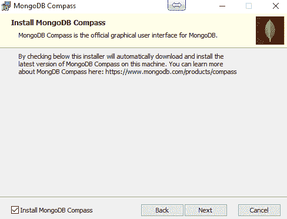
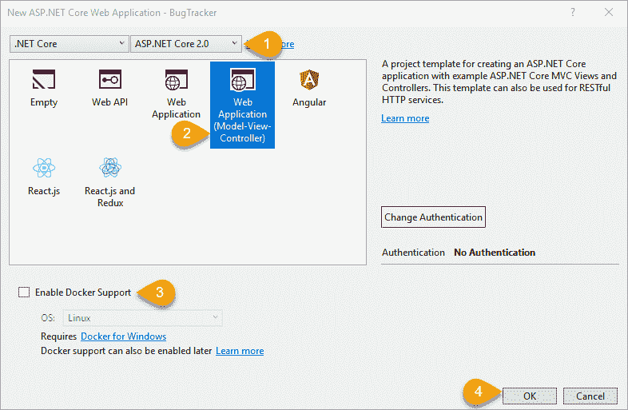
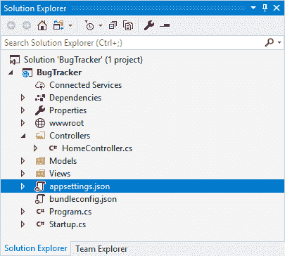
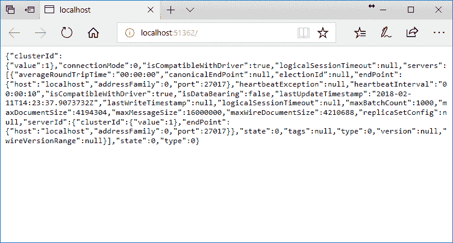
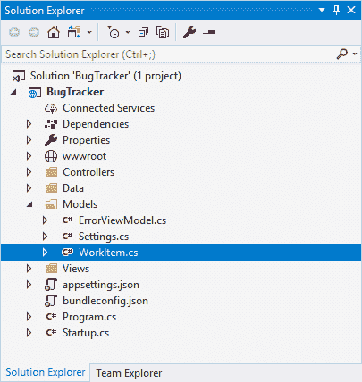
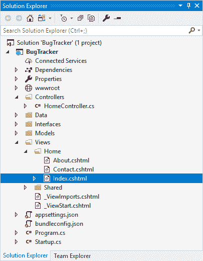
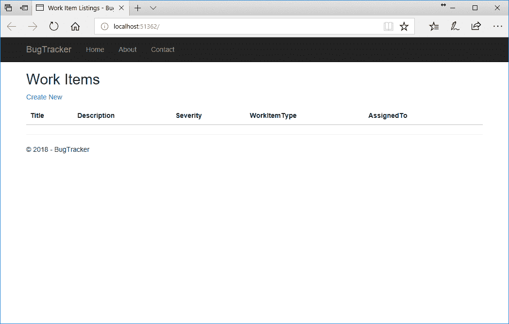
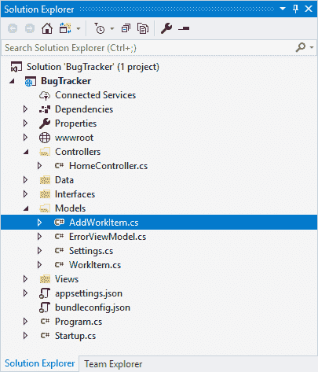
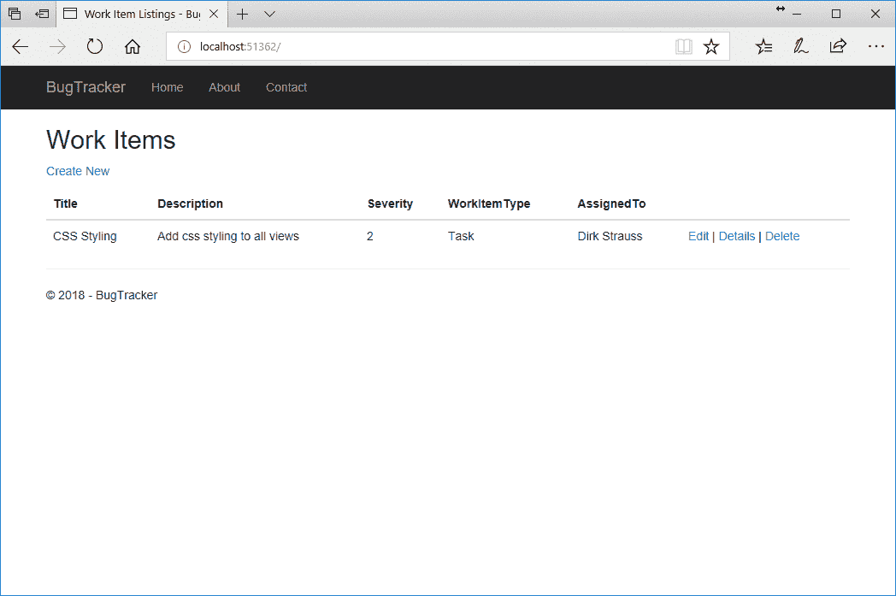
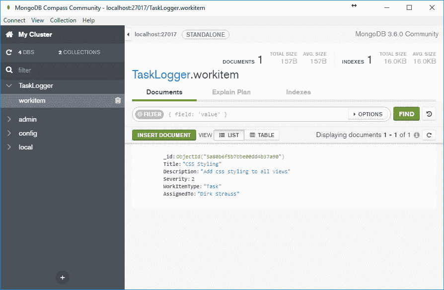

# 四、ASP.NETCore MVC 任务错误日志应用

在这一章中，我们将通过创建一个任务/错误日志应用来看看如何将 MongoDB 与 ASP.NETCore MVC 结合使用。个人任务管理器很有用，当你不能立即处理 bug 时，记录 bug 尤其方便。

我们将在本章中讨论以下主题:

*   在本地计算机上设置 MongoDB
*   使用 MongoDB 指南针的第一步
*   创建一个 ASP.NETCore MVC 应用并集成 MongoDB

你可能想知道为什么我们会选择 MongoDB。你需要问的问题是，创建一个简单的应用需要付出多少努力？

# 使用 MongoDB 有什么好处？

为了回答这个问题，让我们来看看使用 MongoDB 的好处。

# 使用 MongoDB 加快开发速度

在您的开发过程中，这一点可能会变得更加清晰，但是让我们假设我不喜欢的开发过程的一部分是必须为各种表单和字段创建数据表。您是否曾经创建过一个表来存储地址字段信息？没错，您需要添加类似以下内容的内容:

*   地址 1
*   地址 2
*   地址 3
*   地址 4
*   城市
*   状态
*   活力
*   国家

这张桌子显然可以变得很大。这取决于你到底需要储存什么。使用 MongoDB，您只需要将地址数组传递给它。MongoDB 负责其余部分。不要再摆弄创建表语句了。

# 提升职业技能

越来越多的职业网站将 MongoDB 列为热门技能。它在公司中的使用频率更高，新开发人员预计会对 MongoDB 有一些经验。在领英的就业门户网站上快速搜索 MongoDB 关键字，仅在美国就返回了 7800 个工作岗位。拥有 MongoDB 经验是职业生涯的巨大助推器，尤其是如果你习惯使用 SQL Server。

# MongoDB 在业内排名靠前

为了进一步证明我的观点，MongoDB 在网站 DB-Engines 上的整体排名是第五名([https://db-engines.com/en/ranking](https://db-engines.com/en/ranking))，在文档商店类别下排名第一([https://db-engines.com/en/ranking/document+store](https://db-engines.com/en/ranking/document+store))。

These stats were correct at the time of writing. In fact, MongoDB is showing an increase in rankings consistently year on year.

很明显，MongoDB 会留在这里，更重要的是，社区喜欢 MongoDB。这非常重要，因为它创建了一个健康的开发人员社区，共享 MongoDB 上的知识和文章。对 MongoDB 的广泛采用促进了该技术的发展。

# 在本地计算机上设置 MongoDB

前往[https://www.mongodb.com/download-center# community](https://www.mongodb.com/download-center# community)下载最新版本的 Windows MongoDB 社区服务器。然后安装程序会给你一个安装 MongoDB Compass 的选项。

You can also download Compass as a separate installer from the preceding link or by navigating directly to:
[https://www.mongodb.com/download-center?jmp=nav# compass](https://www.mongodb.com/download-center?jmp=nav# compass).



查看 MongoDB Compass 的网页，在[https://docs.mongodb.com/compass/master/](https://docs.mongodb.com/compass/master/)，对 MongoDB Compass 的描述相当清晰:

"MongoDB Compass is designed to allow users to easily analyze and understand the contents of their data collections within MongoDB and perform queries, without requiring knowledge of MongoDB query syntax. MongoDB Compass provides users with a graphical view of their MongoDB schema by randomly sampling a subset of documents from the collection. Sampling documents minimizes performance impact on the database and can produce results quickly."

如果这是你第一次使用 MongoDB，我建议你安装 MongoDB Compass，并玩一会儿。

安装 MongoDB 后，会在`C:\ProgramFiles\MongoDB`下找到。我现在喜欢做的是在一个环境变量上保留完整的安装路径。这使得从 PowerShell 或命令提示符进行访问变得更加容易。`bin`文件夹的完整安装路径是`C:\Program\FilesMongoDBServer3.6bin`。

要设置它，我们执行以下步骤:

1.  打开系统属性屏幕，点击环境变量按钮。
2.  在系统变量组下，选择路径变量，然后单击编辑按钮。将完整的安装路径添加到路径系统变量中。
3.  我们现在需要在硬盘上创建一个文件夹来存储 MongoDB 数据库。您可以在任何地方创建此文件夹，但是无论您在哪里创建它，都需要在下一步中使用它。我在以下路径创建了我的 MongoDB 数据库文件夹:`D:\MongoTask`。

4.  为了使用 MongoDB，您必须首先启动 MongoDB 服务器。不管这是在远程机器上还是在您的本地机器上。打开 PowerShell 并运行以下命令:

```cs
     mongod -dbpath D:MongoTask
```

5.  运行上述命令时，按回车键。您现在已经启动了 MongoDB 服务器。接下来，启动 MongoDB 指南针。
6.  你会发现你还没有任何数据库。点击 CREATE DATABASE 按钮，如下图所示:


7.  将打开“创建数据库”窗口，您可以在“数据库名称”下指定数据库名称，在“集合名称”下指定集合名称。
8.  要完成此操作，请单击屏幕底部的 CEATE DATABASE 按钮，如下图所示:


9.  您将看到一个名为`TaskLogger`的新数据库已经创建，如果您展开`TaskLogger`数据库节点，您将看到列出的 TaskItem 文档，如下图所示:


在本章中，我们不会过多关注 MongoDB Compass。现在，我想向您展示一种通过使用 MongoDB Compass 可视化管理 MongoDB 数据库的方法。您可以删除刚刚创建的任务项文档。您将看到，当您稍后第一次向 MongoDB 数据库中插入数据时，应用是如何自动为您创建文档的。

# 将您的 ASP.NETCore MVC 应用连接到 MongoDB

当谈到在您的应用中使用 MongoDB 时，人们想知道将这一功能添加到一个新的 ASP.NETCore MVC 应用中会有多容易。这个过程真的很简单。首先，创建一个新的 ASP.NETCore网络应用并命名为`BugTracker`:

1.  在新 ASP.NETCore网络应用-错误跟踪器屏幕上，确保您已经从下拉列表中选择了 ASP.NETCore 2.0。
2.  选择网络应用(模型-视图-控制器)。
3.  取消选中启用 Docker 支持选项。最后，点击确定按钮。
4.  您的新 ASP.NETCore MVC 应用将使用基础知识创建，如下图所示:



5.  为应用启用 Docker 支持可以在创建时轻松完成。您还可以为现有应用启用 Docker 支持。

我将在后面的章节中看看 Docker，以及如何让您的应用与 Docker 一起工作。目前，我们的应用不需要 Docker 支持。不要选中它，像平常一样创建应用。

# 添加 NuGet 包

鉴于这一章是关于 MongoDB 的，我们需要将它添加到我们的项目中。最好的方法是添加 NuGet 包。我们可以这样做:

1.  右键单击您的项目，然后选择管理/获取包...从上下文菜单中，如下图所示:


2.  在“获取”屏幕上，您将选择“浏览”选项卡，并输入`Mongodb.Driver`作为搜索词。
3.  选择 MongoDB。由 MongoDB 选项驱动。
4.  单击“安装”按钮将最新的稳定包添加到您的项目中。这在下面的截图中有描述:


5.  您可以在 Visual Studio 的“输出”窗口中查看进度。

6.  将 MongoDB 添加到项目中后，您将看到 MongoDB。驱动程序(2.5.0)被添加到项目的 NuGet 依赖项下，如下图所示:


7.  展开`Controllers`文件夹。你会看到，默认情况下，Visual Studio 已经创建了一个`HomeController.cs`文件。该文件中的代码应该如下所示:

```cs
public class HomeController : Controller 
{ 
    public IActionResult Index() 
    { 
        return View(); 
    } 

    public IActionResult About() 
    { 
        ViewData["Message"] = "Your application description   
        page."; 

        return View(); 
    } 

    public IActionResult Contact() 
    { 
        ViewData["Message"] = "Your contact page."; 

        return View(); 
    } 

    public IActionResult Error() 
    { 
        return View(new ErrorViewModel { RequestId = 
         Activity.Current?.Id ?? HttpContext.TraceIdentifier }); 
    } 
} 
```

我们希望能够从这里连接到 MongoDB，所以让我们创建一些代码来连接到 Mongo 客户端。

You will need to add a `using` statement to your class as follows:

`using MongoDB.Driver;`

连接到 MongoDB 的步骤如下:

1.  通过键入代码片段短代码`ctor`并跳转两次，或者通过显式键入代码来创建构造函数。您的构造函数需要创建一个新的`MongoClient`实例。完成此操作后，您的代码应该如下所示:

```cs
public HomeController() 
{ 
    var mclient = new MongoClient(); 
} 
```

2.  为了让`MongoClient`工作，我们需要给它一个连接字符串到我们创建的 MongoDB 实例。在解决方案“Bug 跟踪器”窗格中打开`appsettings.json`文件，如下图所示:



3.  当您打开您的`appsettings.json`文件时，它应该如下所示:

```cs
{ 
  "Logging": { 
    "IncludeScopes": false, 
    "LogLevel": { 
      "Default": "Warning" 
    } 
  } 
} 
```

4.  修改文件并添加 MongoDB 连接详细信息，如下所示:

```cs
{ 
  "MongoConnection": { 
    "ConnectionString": "mongodb://localhost:27017", 
    "Database": "TaskLogger" 
  }, 
  "Logging": { 
    "IncludeScopes": false, 
    "LogLevel": { 
      "Default": "Warning" 
    } 
  } 
}
```

5.  我们现在要在`Models`文件夹中创建一个`Settings.cs`文件，如下图截图所示:


6.  打开`Settings.cs`文件，并添加以下代码:

```cs
public class Settings 
{ 
    public string ConnectionString { get; set; } 
    public string Database { get; set; } 
} 
```

7.  我们现在需要打开`Startup.cs`文件并修改`ConfigureServices`方法如下注册服务:

```cs
public void ConfigureServices(IServiceCollection services) 
{ 
    services.AddMvc(); 

    services.Configure<Settings>(Options => 
    { 
        Options.ConnectionString = Configuration.GetSection
          ("MongoConnection:ConnectionString").Value; 
        Options.Database = Configuration.GetSection
         ("MongoConnection:Database").Value; 
    }); 

} 
```

8.  返回`HomeController.cs`文件，修改构造函数，将连接字符串传递给`MongoClient`:

```cs
public HomeController(IOptions<Settings> settings) 
{             
    var mclient = new 
     MongoClient(settings.Value.ConnectionString);     
} 
```

9.  此时，我想测试我的代码，看看它是否真的在访问我的 MongoDB 实例。为此，请修改代码以返回集群描述:

```cs
IMongoDatabase _database; 

public HomeController(IOptions<Settings> settings) 
{             
    var mclient = new 
     MongoClient(settings.Value.ConnectionString);             
      _database = mclient.GetDatabase(settings.Value.Database); 
} 

public IActionResult Index() 
{ 
    return Json(_database.Client.Cluster.Description); 
}
```

10.  运行您的 ASP.NETCore MVC 应用，并在浏览器中看到信息输出，如下图所示:



这一切都很好，但是让我们看看如何将添加数据库连接的逻辑分离到自己的类中。

# 创建 MongoDbRepository 类

要创建`MongoDbRepository`类，我们需要执行以下步骤:

1.  在解决方案中创建新文件夹`Data`。在该文件夹中，创建一个名为`MongoDBRepository`的新类:


2.  在这个类中，添加以下代码:

```cs
public class MongoDBRepository 
{ 
    public readonly IMongoDatabase Database; 

    public MongoDBRepository(IOptions<Settings> settings) 
    { 
        try 
        { 
            var mclient = new 
             MongoClient(settings.Value.ConnectionString); 
            Database = 
             mclient.GetDatabase(settings.Value.Database); 
        } 
        catch (Exception ex) 
        { 
            throw new Exception("There was a problem connecting 
             to the MongoDB database", ex); 
        } 
    } 
} 
```

如果代码看起来很熟悉，那是因为它与我们在`HomeController.cs`类中编写的代码相同，只是这次它有一点错误处理，并且在自己的类中。这意味着我们还需要修改`HomeController`类。

3.  在`HomeController`的构造函数和`Index`动作中更改代码。您的代码需要如下所示:

```cs
public MongoDBRepository mongoDb; 

public HomeController(IOptions<Settings> settings) 
{             
    mongoDb =  new MongoDBRepository(settings); 
} 
public IActionResult Index() 
{ 
    return Json(mongoDb.Database.Client.Cluster.Description); 
} 
```

4.  再次运行您的应用，您将在浏览器中看到前面显示的相同信息，因此再次输出到浏览器窗口。

唯一的区别是代码现在被适当地分离了，并且易于重用。因此，如果进一步发生任何变化，它只会在这里更新。

# 向 MongoDB 读写数据

在本节中，我们将了解如何从 MongoDB 数据库中读取工作项列表，以及如何向数据库中插入新的工作项。我称它们为工作项，因为工作项可以是任务或 bug。这可以通过执行以下步骤来完成:

1.  在模型文件夹中，新建一个名为`WorkItem`的类，如下图所示:



2.  将以下代码添加到`WorkItem`类。你会注意到`Id`属于`ObjectId`类型。这表示创建的 MondoDB 文档中的唯一标识符。

You need to ensure that you add the following `using` statement to your `WorkItem` class `using MongoDB.Bson;`.

看看下面的代码:

```cs
public class WorkItem 
{ 
    public ObjectId Id { get; set; } 
    public string Title { get; set; } 
    public string Description { get; set; } 
    public int Severity { get; set; } 
    public string WorkItemType { get; set; } 
    public string AssignedTo { get; set; } 
}
```

3.  接下来，打开`MongoDBRepository`类，并将以下属性添加到该类中:

```cs
public IMongoCollection<WorkItem> WorkItems 
{ 
    get 
    { 
        return Database.GetCollection<WorkItem>("workitem"); 
    } 
} 
```

4.  因为我们至少使用了 C# 6，我们可以通过将`WorkItem`属性更改为**表达式身体属性**来进一步简化它。为此，请将代码更改如下:

```cs
public IMongoCollection<WorkItem> WorkItems => Database.GetCollection<WorkItem>("workitem"); 
```

5.  如果这看起来有点混乱，请看下面的截图:


大括号`get`和`return`语句被`=>`λ运算符替换。被返回的对象(在这种情况下，`WorkItem`对象的集合)在 lambda 操作符之后。这就产生了**表达体属性**。

# 创建接口和工作项服务

接下来，我们需要创建一个接口。为此，我们需要执行以下步骤:

1.  在您的解决方案中创建新的名为“接口”的文件夹，并将名为`IWorkItemService`的接口添加到“接口”文件夹中，如下图所示:


2.  在`IWorkItemService`界面添加以下代码:

```cs
public interface IWorkItemService 
{ 
    IEnumerable<WorkItem> GetAllWorkItems(); 
}
```

3.  在您的`Data`文件夹中，添加另一个名为`WorkItemService`的类，并使其实现`IWorkItemService`界面。

Be sure to add the `using` statement to reference your interface. In my example, this is the `using BugTracker.Interfaces;` statement.

4.  您会注意到 Visual Studio 会提示您实现该接口。为此，单击灯泡提示，然后从上下文菜单中单击实施界面，如下图所示:


5.  完成此操作后，您的`WorkItemService`类将如下所示:

```cs
public class WorkItemService : IWorkItemService 
{ 
    public IEnumerable<WorkItem> GetAllWorkItems() 
    { 
        throw new System.NotImplementedException(); 
    } 
}
```

6.  接下来，添加一个构造函数并完成`GetAllWorkItems`方法，这样您的类看起来如下:

```cs
public class WorkItemService : IWorkItemService 
{ 
    private readonly MongoDBRepository repository; 

    public WorkItemService(IOptions<Settings> settings) 
    { 
        repository = new MongoDBRepository(settings); 
    } 

    public IEnumerable<WorkItem> GetAllWorkItems() 
    { 
        return repository.WorkItems.Find(x => true).ToList(); 
    } 
} 
```

7.  您现在需要打开您的`Startup.cs`文件并编辑`ConfigureServices`方法来添加以下代码行:

```cs
services.AddScoped<IWorkItemService, WorkItemService>(); 
```

8.  您的`ConfigureServices`方法现在将如下所示:

```cs
public void ConfigureServices(IServiceCollection services) 
{ 
    services.AddMvc(); 

    services.Configure<Settings>(Options => 
    { 
        Options.ConnectionString = Configuration.GetSection("MongoConnection:ConnectionString").Value; 
        Options.Database = Configuration.GetSection("MongoConnection:Database").Value; 
    }); 

    services.AddScoped<IWorkItemService, WorkItemService>(); 
} 
```

您所做的是将`IWorkItemService`接口注册到依赖注入框架中。有关依赖注入的更多信息，请参见以下文章:
[。](https://docs.microsoft.com/en-us/aspnet/core/fundamentals/dependency-injection)

# 创建视图

当我们启动应用时，我们希望看到一个工作项列表。因此，我们需要为`HomeController`创建一个视图，通过执行以下步骤来显示工作项列表:

1.  在“视图”文件夹中，展开“主页”子文件夹并删除`Index.cshtml`文件(如果有)。
2.  然后，右键单击主文件夹，并从上下文菜单导航到添加|查看。将显示添加 MVC 视图窗口。
3.  将视图命名为`Index`，并选择列表作为模板。从模型类的下拉列表中，选择工作项(错误跟踪程序。车型)。
4.  保持其余设置不变，然后单击添加按钮:


添加视图后，您的解决方案资源管理器将如下所示:



5.  仔细查看视图，您会注意到它使用`IEnumerable<BugTracker.Models.WorkItem>`作为模型:

```cs
@model IEnumerable<BugTracker.Models.WorkItem> 

@{ 
    ViewData["Title"] = "Work Item Listings"; 
} 
```

这允许我们迭代返回的`WorkItem`对象的集合，并在列表中输出它们。还要注意的是`ViewData["Title"]`已经从`Index`更新为`Work Item Listings`。

# 修改家庭控制器

在运行我们的应用之前，我们需要做的最后一件事是修改`HomeController`类以使用`IWorkItemService`:

1.  如下修改构造函数和`Index`动作:

```cs
private readonly IWorkItemService _workItemService; 

public HomeController(IWorkItemService workItemService) 
{ 
    _workItemService = workItemService; 

} 

public IActionResult Index() 
{ 
    var workItems = _workItemService.GetAllWorkItems(); 
    return View(workItems); 
} 
```

2.  我们正在获取 MongoDB 数据库中的所有工作项，并将它们传递给视图，以便模型使用。

Make sure that you have started the MongoDB server by using the `mongod -dbpath <path>` command format, as explained earlier in the chapter.

3.  完成后，运行应用，如下图所示:



4.  此时，数据库中没有工作项，因此我们在浏览器中看到了这个空列表。接下来，我们将添加代码，将工作项插入到我们的 MongoDB 数据库中。

# 添加工作项

让我们通过执行以下步骤来添加工作项:

1.  要添加工作项，让我们从添加一个名为`AddWorkItem`的类到我们的 Models 文件夹开始，如下图所示:



2.  修改类中的代码，使其本质上类似于`WorkItem`类:

```cs
public class AddWorkItem 
{ 
    public string Title { get; set; } 
    public string Description { get; set; } 
    public int Severity { get; set; } 
    public string WorkItemType { get; set; } 
    public string AssignedTo { get; set; } 
}
```

3.  接下来，在视图文件夹下创建一个名为`AddWorkItem`的新文件夹。右键单击`AddWorkItem`文件夹并选择添加，然后单击上下文菜单中的查看。
4.  将显示添加 MVC 视图窗口。调用视图`AddItem`并选择为模板创建。
5.  从模型类的下拉列表中，选择添加工作项(错误跟踪程序。车型)。
6.  保持其余设置不变，点击添加按钮，如下图所示:


7.  打开`AddItem.cshtml`文件，看一下表单动作。确保设置为`CreateWorkItem`。下面的代码片段显示了代码应该是什么样子:

```cs
<div class="row"> 
  <div class="col-md-4"> 
     <form asp-action="CreateWorkItem"> 
         <div asp-validation-summary="ModelOnly" class="text-danger"></div> @*Rest of code omitted for brevity*@ 
```

您的`Views`文件夹现在应该如下所示:


8.  现在，我们需要对我们的`IWorkItemService`界面做一个小小的改变。修改界面中的代码，如下所示:

```cs
public interface IWorkItemService 
{ 
    IEnumerable<WorkItem> GetAllWorkItems(); 
    void InsertWorkItem(WorkItem workItem); 
} 
```

我们刚刚指定了实现`IWorkItemService`接口的类必须有一个名为`InsertWorkItem`的方法，该方法采用`WorkItem`类型的参数。这意味着我们需要绕过`WorkItemService`并添加一个名为`InsertWorkItem`的方法。我们在`WorkItemService`界面中的代码如下:

```cs
private readonly MongoDBRepository repository; 

public WorkItemService(IOptions<Settings> settings) 
{ 
    repository = new MongoDBRepository(settings); 
} 

public IEnumerable<WorkItem> GetAllWorkItems() 
{ 
    return repository.WorkItems.Find(x => true).ToList(); 
} 

public void InsertWorkItem(WorkItem workItem) 
{ 
    throw new System.NotImplementedException(); 
} 
```

9.  更改`InsertWorkItem`方法，将`WorkItem`类型的单个对象添加到我们的 MongoDB 数据库中。将代码更改如下:

```cs
public void InsertWorkItem(WorkItem workItem) 
{ 

} 
```

10.  现在，我们需要稍微修改一下我们的`WorkItem`类。向类中添加两个构造函数，一个以`AddWorkItem`对象为参数，另一个完全不取参数:

```cs
public class WorkItem 
{ 
    public ObjectId Id { get; set; } 
    public string Title { get; set; } 
    public string Description { get; set; } 
    public int Severity { get; set; } 
    public string WorkItemType { get; set; } 
    public string AssignedTo { get; set; } 

    public WorkItem() 
    { 

    } 

    public WorkItem(AddWorkItem addWorkItem) 
    { 
        Title = addWorkItem.Title; 
        Description = addWorkItem.Description; 
        Severity = addWorkItem.Severity; 
        WorkItemType = addWorkItem.WorkItemType; 
        AssignedTo = addWorkItem.AssignedTo; 
    } 
} 
```

我们添加第二个不带参数的构造函数的原因是为了让 MongoDB 能够反序列化`WorkItem`。

If you want to read up more regarding the reason we add a parameterless constructor for deserialization, take a look at the following URL: [https://stackoverflow.com/questions/267724/why-xml-serializable-class-need-a-parameterless-constructor](https://stackoverflow.com/questions/267724/why-xml-serializable-class-need-a-parameterless-constructor).

11.  我们现在需要向我们的项目添加另一个控制器。右键单击控制器文件夹，添加一个名为`AddWorkItemController`的新控制器。请随意将此添加为空控制器。我们将在下面自己添加代码:


12.  在添加工作项控制器控制器中，添加以下代码:

```cs
private readonly IWorkItemService _workItemService; 

public AddWorkItemController(IWorkItemService workItemService) 
{ 
    _workItemService = workItemService; 
} 

public ActionResult AddItem() 
{ 
    return View(); 
} 

[HttpPost] 
public ActionResult CreateWorkItem(AddWorkItem addWorkItem) 
{ 
    var workItem = new WorkItem(addWorkItem); 
    _workItemService.InsertWorkItem(workItem); 
    return RedirectToAction("Index", "Home"); 
} 
```

你会注意到`HttpPost`动作被称为`CreateWorkItem`。这就是`AddItem.cshtml`文件有一个名为`CreateWorkItem`的表单动作的原因。它告诉视图在单击“创建”按钮时在控制器上调用什么操作。

# 重定向到工作项列表

另一个值得注意的有趣的事情是，在我们调用`WorkItemService`上的`InsertWorkItem`方法之后，我们将视图重定向到`HomeController`上的`Index`动作。正如我们已经知道的，我们知道这将把我们带到工作项目列表:

1.  说到`HomeController`，修改那里的代码，在`AddWorkItemController`类上添加另一个调用`AddItem`动作的动作`AddWorkItem`:

```cs

public ActionResult AddWorkItem() 
{ 
    return RedirectToAction("AddItem", "AddWorkItem"); 
} 
Your HomeController code will now look as follows: 
private readonly IWorkItemService _workItemService; 

public HomeController(IWorkItemService workItemService) 
{ 
    _workItemService = workItemService;             
} 

public IActionResult Index() 
{ 
    var workItems = _workItemService.GetAllWorkItems(); 
    return View(workItems); 
} 

public ActionResult AddWorkItem() 
{ 
    return RedirectToAction("AddItem", "AddWorkItem"); 
} 
```

2.  现在，让我们稍微修改一下`Index.cshtml`视图。为了使索引视图上的列表更直观，修改`Index.cshtml`文件。
3.  添加一个`if`语句，如果列表为空，允许从列表中添加新的工作项。
4.  单击时，添加一个`ActionLink`来调用`HomeController`上的`AddWorkItem`动作:

```cs
@if (Model.Count() == 0)
@if (Model.Count() == 0)
{
    <tr>
        <td colspan="6">There are no Work Items in BugTracker. @Html.ActionLink("Add your first Work Item", "AddWorkItem") now.</td>
    </tr>
}
else
{

    @foreach (var item in Model)
    {
        <tr>
            <td>
                @Html.DisplayFor(modelItem => item.Title)
            </td>
            <td>
                @Html.DisplayFor(modelItem => item.Description)
            </td>
            <td>
                @Html.DisplayFor(modelItem => item.Severity)
            </td>
            <td>
                @Html.DisplayFor(modelItem => item.WorkItemType)
            </td>
            <td>
                @Html.DisplayFor(modelItem => item.AssignedTo)
            </td>
            <td>
            @Html.ActionLink("Edit", "Edit", new { /* 
             id=item.PrimaryKey */ }) |
            @Html.ActionLink("Details", "Details", new { /* 
             id=item.PrimaryKey */ }) |
            @Html.ActionLink("Delete", "Delete", new { /* 
             id=item.PrimaryKey */ })
            </td>
        </tr>
   }
}

```

5.  现在，用下面的`if`语句包装新建`asp-action`:

```cs
@if (Model.Count() > 0) 
{ 
<p> 
    <a asp-action="Create">Create New</a> 
</p> 
} 
```

我们将在稍后讨论这个问题。

此时再来看看应用的逻辑，我们会看到`HomeController` `Index `动作列出了工作项。当我们点击添加您的第一个工作项目链接时，我们在`HomeController`上调用`AddWorkItem`操作。

`HomeController`上的`AddWorkItem`动作又称为`AddWorkItemController`上的`AddItem`动作。这只是返回到`AddItem`视图，在这里我们输入工作项的详细信息并点击创建按钮。

“创建”按钮依次执行`HttpPost`操作，由于`AddItem`视图上的表单操作指向`AddWorkItemController`类上的`CreateWorkItem`操作，因此我们将工作项插入到 MongoDB 数据库中，并通过对`HomeController`上的`Index`操作执行`RedirectToAction`调用来重定向回工作项列表。

Now at this point, if you are thinking that it this a long-winded way to redirect back to the `HomeController` just to redirect to the `AddItem` action on the `AddWorkItemController`, then you're 100% correct. I will show you a quick way to redirect directly to the `AddItem` action on the `AddWorkItemController` when the user clicks on the link to create a new work item. For now, just stick with me. I'm trying to show you how we can interact with controllers and actions.

现在，再次运行您的应用。


您将看到列表中的一个链接允许您添加第一个工作项。

这是重定向回`HomeController`上的`AddWorkItem`动作的链接。要运行它，请执行以下操作:

1.  点击链接，您将看到输出，如下图所示:


2.  这将带您进入添加新工作项的视图。在字段中输入一些信息，然后单击创建按钮。


3.  创建按钮调用`AddWorkItemController`上的`CreateWorkItem`操作，并重定向回`HomeController`的`Index`操作上的工作项目列表。



4.  您可以看到“新建”链接现在显示在列表的顶部。让我们修改 Index.cshtml 视图，使该链接直接重定向到`AddWorkItemController`类上的`AddItem`操作。按照以下步骤更换剃须刀:

```cs
@if (Model.Count() > 0) 
{ 
<p> 
    @Html.ActionLink("Create New", "AddWorkItem/AddItem") 
</p> 
} 
```

您可以看到，我们可以指定应用必须采取的路由，以获得正确的操作。在这种情况下，我们说当点击创建新链接时，我们必须调用`AddWorkItemController`类上的`AddItem`动作。

再次运行您的应用，然后单击“新建”链接。您将看到您被重定向到我们之前添加了工作项的输入表单。

The default styling of the views doesn't look too shabby, but they are definitely not the most beautiful designs out there. This, at least, gives you as a developer the ability to go back and style the screens with CSS, to "prettify" them according to your needs. For now, the dull screens are 100% functional and good enough for our purposes.

打开 MongoDB Compass，您会看到其中有一个工作项文档。查看该文档，您将看到我们刚刚从 ASP.NETCore MVC 应用中添加的信息。



# 摘要

在本章中，我们看了一下:

*   在本地计算机上设置 MongoDB
*   使用 MongoDB 指南针
*   创建一个连接到 MongoDB 的 ASP.NETCore MVC 应用

我们看到 MongoDB Compass 为开发人员提供了一个很好的 MongoDB 数据的图形视图。因此，开发人员不需要知道任何 MongoDB 查询语法。但是，如果您想看一下查询语法，请转到，`https://docs.mongodb.com/manual/tutorial/query-documents/`。

说到 MongoDB 和 ASP.NET Core MVC，还有很多可以学习的地方。一章不足以涵盖全部。但是可以肯定的是，MongoDB 非常强大，同时在您的应用中使用起来非常简单。MongoDB 是有据可查的，有一个蓬勃发展的社区可以帮助和指导你前进。

在下一章中，我们将了解 SignalR 以及如何创建实时聊天应用。