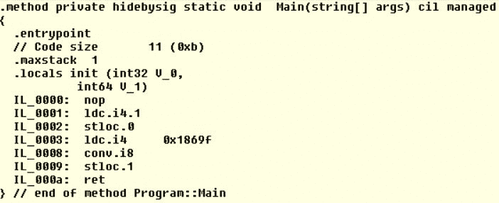
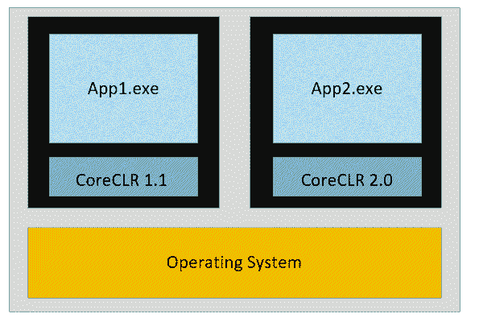
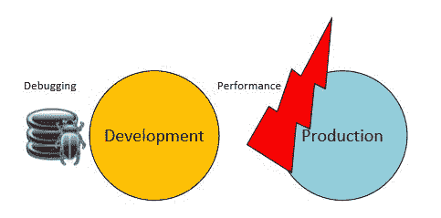
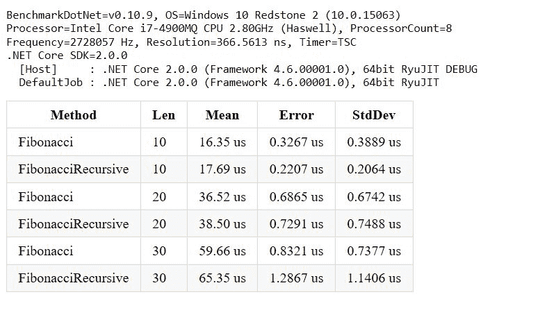
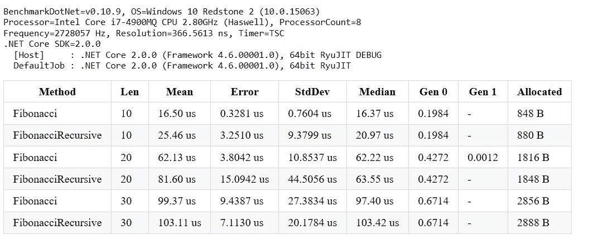

# 理解。堆芯内部构件和测量性能

开发应用架构时，了解。NET 框架工作在保证应用的性能质量方面起着至关重要的作用。在这一章中，我们将集中讨论。NET Core，可以帮助我们为任何应用编写高质量的代码和架构。本章将介绍的一些核心概念。NET Core 内部构件，包括编译过程、垃圾收集、**框架类库** ( **FCL** )。我们将通过 *BenchmarkDotNet* 工具来完成这一章，该工具主要用于衡量代码性能，强烈建议在应用中对代码片段进行基准测试。

在本章中，您将学习以下主题:

*   。净堆芯内部构件
*   利用 CPU 的多个内核实现高性能
*   发布构建如何提高性能
*   基准测试。NET 核心 2.0 应用

# 。净堆芯内部构件

。NET Core 包含两个核心组件——运行时 CoreCLR 和基类库 CoreFX。在本节中，我们将涵盖以下主题:

*   corelx
*   核心 CLR
*   了解 MSIL、CLI、CTS 和 CLS
*   CLR 如何工作
*   从编译到执行——在幕后
*   碎片帐集
*   。NET 本机和 JIT 编译

# corelx

CoreFX 是的代码名。NET Core 的一组库。它包含了所有从微软开始的库。*或系统。*并包含集合、I/O、字符串操作、反射、安全性和许多其他功能。

CoreFX 是运行时不可知的，它可以在任何平台上运行，而不管它支持什么样的 API。

To learn more about each assembly, you can refer to the .NET Core source browser at [https://source.dot.net](https://source.dot.net).

# 核心 CLR

CoreCLR 为提供公共语言运行时环境。NET 核心应用，并管理整个应用生命周期的执行。它在程序运行时执行各种操作。内存分配、垃圾收集、异常处理、类型安全、线程管理和安全性等操作都是 CoreCLR 的一部分。

。NET Core 的运行时提供了与相同的**垃圾收集** ( **GC** )。NET 框架和一个新的**适时** ( **JIT** )编译器，该编译器更加优化，代号为 *RyuJIT* 。什么时候？NET Core 最初发布时，它只支持 64 位平台，但随着的发布。NET Core 2.0，它现在也适用于 32 位平台。但是，32 位版本仅受 Windows 操作系统支持。

# 了解 MSIL、CLI、CTS 和 CLS

当我们构建项目时，代码被编译成**中间语言** ( **IL** )，也称为**微软中间语言** ( **MSIL** )。MSIL 符合**通用语言基础设施** ( **CLI** )，其中 CLI 是提供通用类型系统和语言规范的标准，分别被称为**通用类型系统** ( **CTS** )和**通用语言规范** ( **CLS** )。

CTS 提供了一个通用的类型系统，并将特定于语言的类型编译成兼容的数据类型。它标准化了所有的。NET 语言的数据类型转换为通用数据类型，以实现语言互操作性。例如，如果代码是用 C# 编写的，它将被转换为特定的 CTS。

假设我们有两个变量，在下面的代码片段中使用 C# 定义:

```cs
class Program 
{ 
  static void Main(string[] args) 
  { 
    int minNo = 1; 
    long maxThroughput = 99999; 
  } 
} 
```

编译时，编译器将 MSIL 生成一个程序集，该程序集可通过 CoreCLR 执行 JIT 并将其转换为本机机器代码。注意`int`和`long`类型分别转换为`int32`和`int64`:



并非所有语言都必须完全符合 CTS，它也可以支持较小的 CTS 足迹。例如，当 VB.NET 第一次在 1998 年被释放的时候。NET 框架，它只支持有符号整数数据类型，没有规定使用无符号整数。的更高版本。NET 框架，现在有了。NET Core 2.0，我们可以使用所有托管语言，如 C#，F#，和 VB.NET，来开发应用，并轻松引用任何项目的程序集。

# CLR 如何工作

CLR 被实现为一组随应用一起加载的进程内库，并在应用进程的上下文中运行。在下图中，我们有两个。NET 核心应用运行，命名为 App1.exe 和 App2.exe*。*每个黑框代表应用进程地址空间，App1.exe 和 App2.exe 的应用在此并行运行各自的 CLR 版本:



包装时。NET Core 应用，我们可以将其发布为**框架依赖部署** ( **FDDs** )或**自包含部署** s ( **SCDs** )。在 FDDs 中，发布的包不包含。NET 核心运行时，并期望。NET Core 存在于目标/宿主系统上。对于 SCDs，所有组件，例如。NET Core 运行时和。NET 核心库包含在发布的包中。不需要在目标系统上安装 NET Core。

To learn more about FDDs or SCDs, please refer to [https://docs.microsoft.com/en-us/dotnet/core/deploying/](https://docs.microsoft.com/en-us/dotnet/core/deploying/).

# 从编译到执行——幕后

那个。NET Core 编译过程与。NET 框架。当项目建立时，内部。NET CLI 命令由 MSBuild 系统调用，该系统构建项目并生成程序集(`.dll`)或可执行文件(`.exe`)。此程序集包含清单，该清单包含程序集的元数据，并包括版本号、区域性、类型引用信息、有关被引用程序集的信息以及程序集中其他文件及其关联的列表。该程序集清单存储在 MSIL 代码或独立的**可移植可执行文件** ( **PE** )文件中:


现在，当可执行文件运行时，会启动一个新的进程并引导。NET Core 运行时，然后初始化执行环境，设置堆和线程池，并将程序集加载到进程地址空间。基于该程序，它然后执行主入口点方法(`Main`)并执行 JIT 编译。从这里开始，代码开始执行，对象开始在堆上分配内存，基元类型存储在堆栈上。对于每一种方法，JIT 编译都完成了，并且生成了本机机器代码。

然而，当 JIT 编译完成后，在生成本机代码之前，它还会执行一些验证。这些验证包括以下内容:

*   验证 MSIL 是在构建过程中生成的
*   验证在 JIT 编译过程中是否修改了任何代码或添加了新类型
*   验证目标机器的优化代码已经生成

# 碎片帐集

CLR 最重要的特性之一是垃圾收集器。自从。NET Core 应用是托管应用，大部分垃圾收集是由 CLR 自动完成的。内存中对象的分配是由 CLR 高效完成的。CLR 不仅会不时调整虚拟内存资源，还会减少底层虚拟内存的碎片，从而提高空间效率。

当程序运行时，对象开始在堆上分配内存，每个对象的地址都存储在堆栈上。这个过程一直持续到内存达到最大限制。然后垃圾收集器开始工作，通过移除未使用的托管对象和分配新对象来回收内存。这都是由垃圾收集器自动完成的，但是也有一种方法可以通过调用`GC.Collect`方法来调用垃圾收集器来执行垃圾收集

让我们举一个例子，在`Main`方法中有一个名为`c`的`Car`对象。当执行该函数时，`Car`对象将由 CLR 分配到堆内存中，对该`c`对象的引用将存储在堆上指向`Car`对象的堆栈地址中。当垃圾收集器运行时，它从堆中回收内存，并从堆栈中移除引用:


需要注意的一些要点是，垃圾收集是由垃圾收集器在托管对象上自动完成的，如果有任何非托管对象，如数据库连接、输入/输出操作等，则需要显式对它们进行垃圾收集。否则，垃圾收集将在托管对象上高效工作，并确保应用在执行垃圾收集时不会出现任何性能下降。

# 气相色谱中的世代

垃圾收集中有三种代，称为第 0 代、第 1 代和第 2 代。在本节中，我们将了解代的概念以及它如何影响垃圾收集器的性能。

假设我们运行一个应用，该应用创建了三个名为 Object1、Object2 和 Object3 的对象。这些对象将在第 0 代中分配内存:


现在，当垃圾收集器运行时(这是一个自动过程，除非您从代码中显式调用垃圾收集器)，它会检查应用不需要并且在程序中没有引用的对象。它将简单地移除那些对象。例如，如果对象 1 的范围没有在任何地方被引用，这个对象的内存将被回收。但是，另外两个对象，对象 1 和对象 2，仍然在程序中被引用，并将被移动到第 1 代。

现在，让我们假设创建了另外两个对象，称为对象 4 和对象 5。我们将它们存储在第 0 代插槽中，如下图所示:


当垃圾收集第二次运行时，它将在第 0 代中找到两个名为 Object4 和 Object5 的对象，在第 1 代中找到两个名为 Object2 和 Object3 的对象。垃圾收集器将首先检查第 0 代中那些对象的引用，如果它们没有被应用使用，它们将被删除。第 1 代对象也是如此。例如，如果对象 3 仍被引用，它将被移动到第 2 代，对象 2 将从第 1 代中删除，如下图所示:


这种代的概念实际上优化了 GC 的性能，第 2 代中存储的对象更有可能存储更长的时间。GC 执行更少的访问并获得时间，而不是一次又一次地检查每个对象。第 1 代也是如此，它比第 0 代更不可能回收空间。

# 。NET 本机和 JIT 编译

JIT 编译主要是在运行时完成的，它将 MSIL 代码转换成本机机器代码。这是代码第一次运行的时候，比连续运行的时间要多一点。英寸 NET Core 今天，我们正在为 CPU 功率和内存资源有限的移动和手持设备开发应用。目前，**通用 Windows 平台** ( **UWP** )和 Xamarin 平台都在运行。NET 核心。有了这些平台。NET Core 会在编译时或生成特定于平台的包时自动生成该本机程序集。虽然它不要求 JIT 编译过程在运行时完成，但这最终会提高应用启动时间的性能。这种本机编译是通过名为。NET 原生语言。

。NET Native 在特定于语言的编译器完成编译过程(在构建时完成)后开始编译过程。那个。NET 原生工具链读取语言编译器生成的 MSIL，并执行以下操作:

*   它消除了 MSIL 的元数据。
*   在比较字段值时，它用静态本机代码替换依赖反射和元数据的代码。
*   它检查应用调用的代码，并且只在最终的程序集中包含该代码。
*   它用包含垃圾收集器和无 JIT 编译器的重构运行时替换完整的 CLR。重构的运行时与应用一起运行，并包含在名为`mrt100_app.dll`的程序集中。

# 利用 CPU 的多个内核实现高性能

如今，应用的本质更多地集中在连接性上，在某些情况下，它们的操作需要更多的时间来执行。我们也知道，如今所有的计算机都配备了多核处理器，使用这些内核可以有效地提高应用的性能。网络/IO 等操作存在延迟问题，应用的同步执行往往会导致较长的等待时间。如果长时间运行的任务在单独的线程中或以异步方式执行，则最终的操作将花费更少的时间并提高响应性。另一个好处是性能，它实际上利用了处理器的多个内核，并同时执行任务。在。NET 世界中，我们可以通过将任务拆分为多个线程并使用经典的多线程编程 API，或者称为**任务编程库** ( **TPL** )的更简化、更高级的模型来实现响应能力和性能。现在中支持第三方物流。NET Core 2.0，我们将很快探索如何使用它在多个内核上执行任务。

第三方物流编程模型是基于任务的。任务是一个工作单元——一个对象对正在进行的操作的表示。

通过编写以下几行代码可以创建一个简单的任务:

```cs
static void Main(string[] args) 
{ 
  Task t = new Task(execute); 
  t.Start(); 
  t.Wait(); 
} 

private static void Execute() { 
  for (int i = 0; i < 100; i++) 
  { 
    Console.WriteLine(i); 
  } 
}
```

在前面的代码中，可以使用`Task`对象初始化任务，其中`Execute`是调用`Start`方法时执行的计算方法。`Start`方法告诉。NET Core，任务可以启动并立即返回。它将程序执行分成两个并发运行的线程。第一个线程是实际的应用线程，第二个线程是执行`execute`方法的线程。我们已经使用`t.Wait`方法等待工作任务在控制台上显示结果。否则，一旦程序在`Main`方法下退出代码块，应用就结束了。

并行编程的目标是有效利用多核。例如，我们在单核处理器中运行前面的代码。这两个线程将运行并共享同一个处理器。但是，如果同一个程序可以在多核处理器上运行，它可以通过分别利用每个内核在多个内核上运行，从而提高性能并实现真正的并行性:


与第三方物流不同，经典的`Thread`对象不能保证你的线程会在不同的中央处理器内核上运行。然而，通过第三方语言，它保证了每个线程将在不同的线程上运行，除非它达到了每个中央处理器的任务数量并共享核心。

To learn more about what TPL provides, please refer to 
[https://docs.microsoft.com/en-us/dotnet/standard/parallel-programming/task-parallel-library-tpl](https://docs.microsoft.com/en-us/dotnet/standard/parallel-programming/task-parallel-library-tpl).

# 发布构建如何提高性能

发布和调试版本是中提供的两种版本模式。NET 应用。调试模式通常在我们编写代码或排除错误的过程中使用，而发布构建模式通常在打包应用以部署在生产服务器上时使用。在开发部署包时，开发人员经常会错过将构建模式更新为发布构建，然后他们在部署应用时会面临性能问题:



下表显示了调试模式和发布模式之间的一些差异:

| 调试 | 释放；排放；发布 |
| 编译器不会优化代码 | 当使用发布模式构建时，代码在大小上得到优化和缩小 |
| 异常时捕获并引发堆栈跟踪 | 没有捕获到堆栈跟踪 |
| 调试符号被存储 | # debug 指令下的所有代码和调试符号都将被删除 |
| 源代码在运行时会使用更多内存 | 源代码在运行时使用的内存更少 |

# 基准测试。NET 核心 2.0 应用

基准测试应用是评估工件并将其与商定的标准进行比较的过程。进行基准测试。NET Core 2.0 应用代码，我们可以使用`BenchmarkDotNet`工具，它提供了一个非常简单的 API 来评估代码在您的应用中的性能。通常，在微观层次上进行基准测试，比如用类和方法，并不是一件容易的事情，并且需要相当大的努力来衡量性能，而`BenchmarkDotNet`完成所有与基准测试解决方案相关的低级管道和复杂工作。

# 探索基准网络

在本节中，我们将探索`BenchmarkDotNet`，并了解如何有效地使用它来衡量应用性能。

它可以简单地使用 NuGet 包管理器控制台窗口或通过项目的项目引用部分来安装。要安装`BenchmarkDotNet`，执行以下命令:

```cs
Install-Package BenchmarkDotNet 
```

前面的命令从`NuGet.org`添加了一个`BenchmarkDotNet`包。

为了测试`BenchmarkDotNet`工具，我们将创建一个简单的类，该类包含两种方法来为一系列`10`数字生成斐波那契数列。斐波那契数列可以用多种方式实现，这就是为什么我们用它来衡量哪个代码片段更快、性能更高效。

下面是迭代生成斐波那契序列的第一种方法:

```cs
public class TestBenchmark 
{ 
  int len= 10; 
  [Benchmark] 
  public  void Fibonacci() 
  { 
    int a = 0, b = 1, c = 0; 
    Console.Write("{0} {1}", a, b); 

    for (int i = 2; i < len; i++) 
    { 
      c = a + b; 
      Console.Write(" {0}", c); 
      a = b; 
      b = c; 
    } 
  } 
} 
```

下面是另一种使用递归方法生成斐波那契数列的方法:

```cs

[Benchmark] 
public  void FibonacciRecursive() 
{ 
  int len= 10; 
  Fibonacci_Recursive(0, 1, 1, len); 
} 

private void Fibonacci_Recursive(int a, int b, int counter, int len) 
{ 
  if (counter <= len) 
  { 
    Console.Write("{0} ", a); 
    Fibonacci_Recursive(b, a + b, counter + 1, len); 
  } 
}  
```

请注意，斐波那契数列的两个主要方法都包含`Benchmark`属性。这实际上告诉`BenchmarkRunner`测量包含该属性的方法。最后，我们可以从测量性能并生成报告的应用的主入口点调用`BenchmarkRunner`，如以下代码所示:

```cs
static void Main(string[] args)
{
  BenchmarkRunner.Run<TestBenchmark>();
  Console.Read();
}
```

运行基准测试后，我们将获得如下报告:


除此之外，它还在运行`BenchmarkRunner`的应用的根文件夹中生成文件。这是。html 文件，其中包含关于版本`BenchmarkDotNet`和操作系统、处理器、频率、分辨率和定时器细节的信息。NET 版本(在我们的例子中为。NET Core SDK 2.0.0)、主机等等:


该表包含四列。但是，我们可以添加更多的列，这些列在默认情况下是可选的。我们也可以添加自定义列。方法是包含基准属性的方法的名称，平均值是进行所有测量的平均时间(其中 us 是微秒)，误差是处理误差的时间，标准偏差是测量的标准偏差。

比较两种方法后，`FibonacciRecursive`方法更有效，因为平均值、误差和标准偏差值小于`Fibonacci`方法。

除了 HTML，还创建了两个文件，一个**逗号分隔值** ( **CSV** )文件和一个包含相同信息的**标记文档** ( **MD** )文件。

# 它是如何工作的

Benchmark 在运行时为每个 benchmark 方法生成一个项目，并在发布模式下构建它。它尝试多种组合，通过多次启动该方法来衡量该方法的性能。运行多个周期后，将生成报告，其中包含关于基准测试的文件和信息。

# 设置参数

在前面的例子中，我们测试了只有一个值的方法。实际上，当测试一个企业应用时，我们希望用不同的值来测试它，以估计该方法的性能。

首先，我们可以为每个参数定义一个属性，设置`Params`属性，并指定我们需要测试该方法的值。然后我们可以在代码中使用该属性。`BenchmarkRun`用所有参数自动测试该方法并生成报告。以下是`TestBenchmark`类的完整代码片段:

```cs
public class TestBenchmark 
{ 

  [Params(10,20,30)] 
  public int Len { get; set; } 

  [Benchmark] 
  public  void Fibonacci() 
  { 
    int a = 0, b = 1, c = 0; 
    Console.Write("{0} {1}", a, b); 

    for (int i = 2; i < Len; i++) 
    { 
      c = a + b; 
      Console.Write(" {0}", c); 
      a = b; 
      b = c; 
    } 
  } 

  [Benchmark] 
  public  void FibonacciRecursive() 
  { 
    Fibonacci_Recursive(0, 1, 1, Len); 
  } 

  private void Fibonacci_Recursive(int a, int b, int counter, int len) 
  { 
    if (counter <= len) 
    { 
      Console.Write("{0} ", a); 
      Fibonacci_Recursive(b, a + b, counter + 1, len); 
    } 
  } 
}
```

运行基准测试后，将生成以下报告:



# 使用 BenchmarkDotnet 进行内存诊断

借助`BenchmarkDotnet`，我们还可以诊断内存的任何问题，并测量分配的字节数和垃圾收集。

它可以在类级别使用`MemoryDiagnoser`属性来实现。首先，让我们将`MemoryDiagnoser`属性添加到我们在上一个示例中创建的`TestBenchmark`类中:

```cs
[MemoryDiagnoser] 
public class TestBenchmark {} 
```

请重新运行应用。现在，它将收集其他内存分配和垃圾收集信息，并相应地生成日志:



在上表中，第 0 代和第 1 代列都包含每 1，000 次操作中特定一代的数量。如果该值为 1，则意味着垃圾收集是在 1000 次操作后完成的。但是，请注意，在第一行中，该值为 *0.1984* ，这意味着垃圾收集是在 *198.4* 秒后完成的，而对于该行的 Gen 1，没有进行垃圾收集。Allocated 表示调用该方法时分配的内存大小。它不包括 Stackalloc/堆本机分配。

# 添加配置

基准配置可以通过创建自定义类并从`ManualConfig`类继承来定义。下面是我们之前创建的包含一些基准测试方法的`TestBenchmark`类的例子:

```cs
[Config(typeof(Config))] 
public class TestBenchmark 
{ 
  private class Config : ManualConfig 
  { 
    // We will benchmark ONLY method with names with names (which 
    // contains "A" OR "1") AND (have length < 3) 
    public Config() 
    { 
      Add(new DisjunctionFilter( 
        new NameFilter(name => name.Contains("Recursive")) 
      ));  

    } 
  } 

  [Params(10,20,30)] 
  public int Len { get; set; } 

  [Benchmark] 
  public  void Fibonacci() 
  { 
    int a = 0, b = 1, c = 0; 
    Console.Write("{0} {1}", a, b); 

    for (int i = 2; i < Len; i++) 
    { 
      c = a + b; 
      Console.Write(" {0}", c); 
      a = b; 
      b = c; 
    } 
  } 

  [Benchmark] 
  public  void FibonacciRecursive() 
  { 
    Fibonacci_Recursive(0, 1, 1, Len); 
  } 

  private void Fibonacci_Recursive(int a, int b, int counter, int len) 
  { 
    if (counter <= len) 
    { 
      Console.Write("{0} ", a); 
      Fibonacci_Recursive(b, a + b, counter + 1, len); 
    } 
  } 
} 
```

在前面的代码中，我们定义了继承基准框架中提供的`ManualConfig`类的`Config`类。规则可以在`Config`构造器中定义。在前面的例子中，有一个规则规定只应该执行那些包含`Recursive`的基准方法。在我们的案例中，我们只有一种方法`FibonacciRecursive`，它将被执行，我们将衡量它的性能。

另一种方法是通过流畅的应用编程接口，我们可以跳过创建`Config`类，实现以下内容:

```cs
static void Main(string[] args) 
{ 
  var config = ManualConfig.Create(DefaultConfig.Instance); 
  config.Add(new DisjunctionFilter(new NameFilter(
    name => name.Contains("Recursive")))); 
  BenchmarkRunner.Run<TestBenchmark>(config); 
}
```

要了解更多关于`BenchmarkDotNet`的信息，请参考[http://benchmarkdotnet.org/Configs.htm](http://benchmarkdotnet.org/Configs.htm)。

# 摘要

在本章中，我们学习了的核心概念。NET 核心，包括编译过程、垃圾收集、如何开发高性能。NET Core 应用，方法是利用 CPU 的多个内核，并使用发布版本发布应用。我们还探索了基准测试工具，它高度用于代码优化，并提供特定于类对象的结果。

在下一章中，我们将学习中的多线程和并发编程。NET 核心。