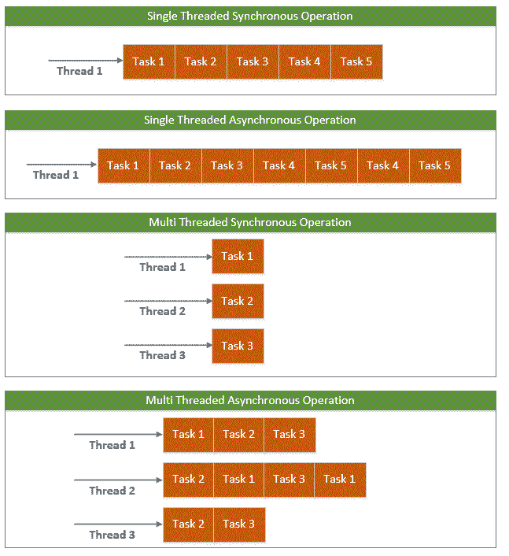
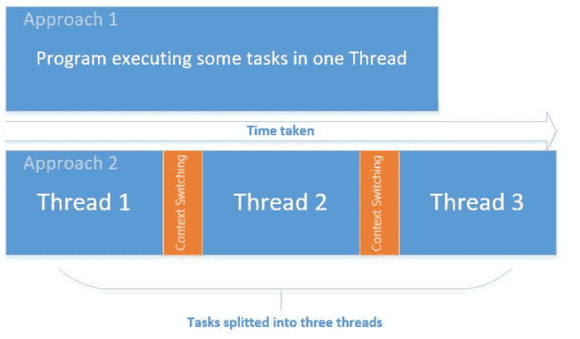
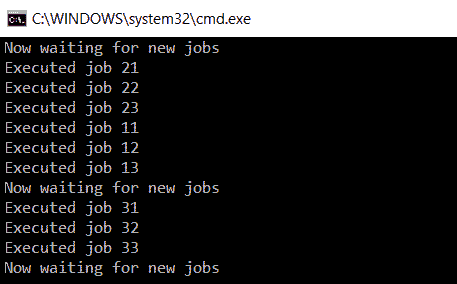

# 三、.NETCore多线程和异步编程

多线程和异步编程是促进高度可扩展和高性能应用开发的两种基本技术。如果应用没有响应，它会影响用户体验，并增加不满意的程度。另一方面，它还会增加服务器端或应用运行位置的资源使用，并且还会增加内存大小和/或 CPU 使用。现在硬件很便宜，每台机器都自带多个 CPU 核。实现多线程和使用异步编程技术不仅提高了应用的性能，而且使应用在本质上更具响应性。

本章研究多线程和异步编程模型的核心概念，以帮助您在项目中使用它们并提高应用的整体性能。

以下是我们将在本章中学习的主题列表:

*   多线程与异步编程
*   多线程在。净核心
*   线程进入。净核心
*   线程同步
*   任务并行库
*   使用第三方物流创建任务
*   基于任务的异步模式
*   并行编程的设计模式

I/O bound operations are code that is dependent on external resources. Examples include accessing a filesystem, accessing a network, and so on.

# 多线程与异步编程

多线程和异步编程如果实现得当，可以提高应用的性能。多线程是指同时执行多个线程来并行执行多个操作或任务的做法。可能有一个主线程和几个后台线程，通常称为工作线程，同时并行运行，并发执行多个任务，而同步和异步操作都可以在单线程或多线程环境中运行。

在单线程同步操作中，只有一个线程按照定义的顺序执行所有任务，并且一个接一个地执行。在单线程异步操作中，只有一个线程执行任务，但它会分配一个时间片来运行每个任务。当时间片结束时，它保存该任务的状态，并开始执行下一个任务。在内部，处理器执行每个任务之间的上下文切换，并分配运行它们的时间片。

在多线程同步操作中，有多个线程并行运行任务。任务之间没有上下文切换，就像异步操作一样。一个线程负责执行分配给它的任务，然后启动另一个任务，而在多线程异步操作中，多个线程运行多个任务，任务可以由一个或多个线程服务和执行。

下图描述了单线程和多线程同步和异步操作之间的区别:



上图显示了四种类型的操作。在单线程同步操作中，我们有一个线程顺序运行五个任务。一旦**任务 1** 完成，**任务 2** 执行，以此类推。在单线程异步操作中，我们有一个单线程，但是每个任务在执行下一个任务之前都会得到一个时间片来执行，以此类推。每个任务将被执行多次，并从暂停的位置继续执行。在多线程同步操作中，我们有三个线程并行运行三个任务**任务 1** 、**任务 2** 、**任务 3** 。最后，在多线程异步操作中，我们有三个任务——**任务 1** 、**任务 2** 、**任务 3**——由三个线程运行，但是每个线程根据分配给每个任务的时间片执行一些上下文切换。

In asynchronous programming, it is not always the case that each asynchronous operation will be running on a new thread. *`Async`/`Await`* is a good example of a situation where there is no additional thread created. The `*async*` operation is executed in the current synchronization context of the main thread and queues the asynchronous operation executed in the allocated time slice.

# 多线程在。净核心

在 CPU 和/或 I/O 绑定的应用中使用多线程有很多好处。它通常用于具有较长或无限生命周期的长时间运行的进程，作为后台任务工作，保持主线程可用，以便管理或处理用户请求。但是，不必要的使用可能会完全降低应用的性能。有些情况下，创建太多的线程不是一个好的架构实践。

以下是多线程非常适合的一些示例:

*   输入输出操作
*   运行长期运行的后台任务
*   数据库操作
*   通过网络通信

# 多线程注意事项

虽然多线程有很多好处，但是在编写多线程应用时，有一些警告需要彻底解决。如果机器是单核或双核机器，并且应用正在创建大量线程，则这些线程之间的上下文切换会降低性能:



上图描述了在单处理器机器上运行的程序。第一个任务同步执行，运行速度比在单个处理器上运行的三个线程要快。系统执行第一个线程，然后等待一段时间再继续执行第二个线程，依此类推。这增加了线程间切换的不必要开销，从而延迟了整体操作。在线程领域，这被称为上下文切换。每个线程之间的框表示线程之间每次上下文切换期间发生的延迟。

就开发人员的体验而言，调试和测试是开发人员在创建多线程应用时面临的另外两个挑战。

# 线程进入。净核心

中的每个应用.NET 从单个线程开始，这是主线程。线程是操作系统用来分配处理器时间的基本单元。每个线程都有一个优先级、异常处理程序和保存在其自己的线程上下文中的数据结构。如果引发异常，它将在线程的上下文中引发，其他线程不受其影响。线程上下文包含一些低级信息，例如，中央处理器寄存器、线程主机进程的地址空间等等。

如果一个应用在单个处理器上运行多个线程，每个线程将被分配一段处理器时间，并且将一个接一个地执行。时间片通常很小，这使得线程看起来好像是同时执行的。一旦分配的时间结束，处理器移动到另一个线程，并且前一个线程等待处理器再次变得可用，并基于分配的时间片执行它。另一方面，如果线程在多个 CPU 上运行，那么它们可能同时执行，但是如果有其他进程和线程在运行，时间片将被相应地分配和执行。

# 在中创建线程。净核心

英寸 NET Core，线程应用编程接口与完整的。. NET 框架版本。通过创建`Thread`类对象并将`ThreadStart`或`ParameterizedThreadStart`委托作为参数传递，可以创建一个新线程。`ThreadStart`和`ParameterizedThreadStart`包装新线程启动时调用的方法。`ParameterizedThreadStart`用于包含参数的方法。

下面是一个在单独线程上运行`ExecuteLongRunningOperation `方法的基本示例:

```cs
static void Main(string[] args) 
{ 
  new Thread(new ThreadStart(ExecuteLongRunningOperation)).Start(); 
} 
static void ExecuteLongRunningOperation() 
{ 
  Thread.Sleep(100000); 
  Console.WriteLine("Operation completed successfully"); 
} 
```

我们也可以在启动线程时传递参数，并使用`ParameterizedThreadStart`委托:

```cs
static void Main(string[] args) 
{ 
  new Thread(new ParameterizedThreadStart
  (ExecuteLongRunningOperation)).Start(100000); 
} 

static void ExecuteLongRunningOperation(object milliseconds) 
{ 
  Thread.Sleep((int)milliseconds); 
  Console.WriteLine("Operation completed successfully"); 
} 
```

`ParameterizedThreadStart`委托以一个对象为参数。因此，如果您想要传递多个参数，可以通过创建一个自定义类并添加以下属性来实现:

```cs
public interface IService 
{ 
  string Name { get; set; } 
  void Execute(); 
} 

public class EmailService : IService 
{ 
  public string Name { get; set; } 
  public void Execute() => throw new NotImplementedException(); 

  public EmailService(string name) 
  { 
    this.Name = name; 
  } 
} 

static void Main(string[] args) 
{ 
  IService service = new EmailService("Email"); 
  new Thread(new ParameterizedThreadStart
  (RunBackgroundService)).Start(service); 
} 

static void RunBackgroundService(Object service) 
{ 
  ((IService)service).Execute(); //Long running task 
} 
```

每个线程都有一个线程优先级。创建线程时，其优先级设置为正常。优先级影响线程的执行。优先级越高，线程的优先级就越高。线程优先级可以在线程对象上定义，如下所示:

```cs
static void RunBackgroundService(Object service) 
{ 
  Thread.CurrentThread.Priority = ThreadPriority.Highest;      
  ((IService)service).Execute(); //Long running task
}
```

`RunBackgroundService`是在单独线程中执行的方法，可以通过使用`ThreadPriority`枚举并通过调用`Thread.CurrentThread`引用当前线程对象来设置优先级，如前面的代码片段所示。

# 线程寿命

线程的生存期取决于在该线程中执行的方法。一旦执行了该方法，CLR 就会取消分配线程占用的内存并释放。另一方面，线程也可以通过调用`Interrupt`或`Abort`方法显式处理。

另一个需要考虑的非常重要的因素是例外。如果异常在一个线程中没有被正确处理，它们会被传播到`calling`方法，以此类推，直到它们到达调用堆栈中的`root`方法。当它到达这一点时，如果没有被处理，CLR 将关闭线程。

对于连续或长时间运行的线程，应该正确定义关闭过程。平稳关闭线程的最佳方法之一是使用`volatile bool`变量:

```cs
class Program 
{ 

  static volatile bool isActive = true;  
  static void Main(string[] args) 
  { 
    new Thread(new ParameterizedThreadStart
    (ExecuteLongRunningOperation)).Start(1000); 
  } 

  static void ExecuteLongRunningOperation(object milliseconds) 
  { 
    while (isActive) 
    { 
      //Do some other operation 
      Console.WriteLine("Operation completed successfully"); 
    } 
  } 
} 
```

在前面的代码中，我们使用了`volatile bool`变量`isActive`，它决定了`while`循环是否执行。

The `volatile` keyword indicates that a field may be modified by multiple threads that are executing at the same time. Fields that are declared volatile are not subject to compiler optimizations that assume access by a single thread. This ensures that the most up-to-date value is present in the field at all times. To learn more about volatile, kindly refer the following URL:
[https://docs.microsoft.com/en-us/dotnet/csharp/language-reference/keywords/volatile](https://docs.microsoft.com/en-us/dotnet/csharp/language-reference/keywords/volatile)

# 中的线程池。网

CLR 提供了一个单独的线程池，其中包含用于异步执行任务的线程列表。每个进程都有自己特定的线程池。CLR 在线程池中添加和移除线程。

要使用`ThreadPool`运行线程，我们可以使用`ThreadPool.QueueUserWorkItem`，如下代码所示:

```cs
class Program 
{ 
  static void Main(string[] args) 
  { 
    ThreadPool.QueueUserWorkItem(ExecuteLongRunningOperation, 1000); 
    Console.Read(); 
  } 
  static void ExecuteLongRunningOperation(object milliseconds) 
  { 

    Thread.Sleep((int)milliseconds); 
    Console.WriteLine("Thread is executed"); 
  } 
} 
```

`QueueUserWorkItem`在线程池中可用的线程中将由 CLR 执行的任务排队。任务队列按照**先进先出** ( **先进先出**顺序维护。但是，根据线程的可用性和任务作业本身，任务完成可能会延迟。

# 线程同步

在多线程应用中，我们有多个线程可以同时访问的共享资源。跨多个线程共享资源的区域被称为临界区。为了保护这些资源并提供线程安全的访问，我们将在本节中讨论某些技术。

让我们举一个例子，其中我们有一个用于将消息记录到文件系统中的 singleton 类。根据定义，单例表示在多个调用之间应该只共享一个实例。下面是一个非线程安全的单例模式的基本实现:

```cs
public class Logger 
{ 
  static Logger _instance; 

  private Logger() { } 

  public Logger GetInstance() 
  { 
    _instance = (_instance == null ? new Logger() : _instance); 
    return _instance; 
  } 

  public void LogMessage(string str) 
  { 
    //Log message into file system 
  } 

} 
```

前面的代码是一个惰性初始化单例，它在第一次调用`GetInstance`方法时创建一个实例。`GetInstance`是关键部分，不是线程安全的。如果多个线程进入临界区，将创建多个实例，并出现争用情况。

竞争条件是多线程编程中的一个问题，当结果取决于事件的时序时就会出现。当两个或多个并行任务访问一个共享对象时，就会出现争用情况。

为了实现线程安全的单例，我们可以使用锁定模式。锁定确保只有一个线程可以进入临界区，如果另一个线程试图进入，它将等待直到线程被释放。下面是一个修改后的版本，它使单例线程安全:

```cs
public class Logger 
{ 

  private static object syncRoot = new object(); 
  static Logger _instance; 

  private Logger() { } 

  public Logger GetInstance() 
  { 
    if (_instance == null) 
    { 
      lock (syncRoot) 
      { 
        if (_instance == null) 
        _instance = new Logger(); 
      } 
    } 
    return _instance; 
  } 

  public void LogMessage(string str) 
  { 
    //Log message into file system 
  } 
} 
```

# 班长

监视器用于提供对资源的线程安全访问。它适用于多线程编程，其中有多个线程需要同时访问一个资源。当多个线程试图进入`monitor`访问任何资源时，CLR 一次只允许一个线程进入，其他线程被阻塞。当线程退出监视器时，下一个等待的线程进入，依此类推。

如果我们看一下`Monitor`类，所有的方法，比如`Monitor.Enter`和`Monitor.Exit`都对对象引用进行操作。与`lock`类似，`Monitor`也提供对资源的门控访问；然而，就其提供的 API 而言，开发人员将拥有更大的控制权。

下面是在中使用`Monitor`的一个基本例子.NETCore:

```cs
public class Job 
{ 

  int _jobDone; 
  object _lock = new object(); 

  public void IncrementJobCounter(int number) 
  { 
    Monitor.Enter(_lock); 
    // access to this field is synchronous
    _jobDone += number; 
    Monitor.Exit(_lock); 
  } 

} 
```

前面的代码片段表示一个作业过程，其中多个线程正在处理某些任务。任务完成后，他们调用`IncrementJobCounter`方法增加`_jobDone`计数器。

在某些情况下，关键部分必须等待资源可用。一旦它们可用，我们希望脉冲等待块执行。

为了帮助我们理解，让我们举一个运行`Job`的例子，它的任务是运行多线程添加的作业。如果没有作业，它应该等待线程推送并立即开始执行它们。

在这个例子中，我们将创建一个在单独线程中运行的`JobExecutor`类。以下是`JobExecutor`的代码片段:

```cs
public class JobExecutor 
{ 
  const int _waitTimeInMillis = 10 * 60 * 1000; 
  private ArrayList _jobs = null; 
  private static JobExecutor _instance = null; 
  private static object _syncRoot = new object(); 

  //Singleton implementation of JobExecutor
  public static JobExecutor Instance 
  { 
    get{ 
    lock (_syncRoot) 
    { 
      if (_instance == null) 
      _instance = new JobExecutor(); 
    } 
    return _instance; 
  } 
} 

private JobExecutor() 
{ 
  IsIdle = true; 
  IsAlive = true; 
  _jobs = new ArrayList(); 
} 

private Boolean IsIdle { get; set; } 
public Boolean IsAlive { get; set; } 

//Callers can use this method to add list of jobs
public void AddJobItems(List<Job> jobList) 
{ 
  //Added lock to provide synchronous access. 
  //Alternatively we can also use Monitor.Enter and Monitor.Exit
  lock (_jobs) 
  { 
    foreach (Job job in jobList) 
    { 
      _jobs.Add(job); 
    } 
    //Release the waiting thread to start executing the //jobs
    Monitor.PulseAll(_jobs); 
  } 
} 

/*Check for jobs count and if the count is 0, then wait for 10 minutes by calling Monitor.Wait. Meanwhile, if new jobs are added to the list, Monitor.PulseAll will be called that releases the waiting thread. Once the waiting is over it checks the count of jobs and if the jobs are there in the list, start executing. Otherwise, wait for the new jobs */
public void CheckandExecuteJobBatch() 
{ 
  lock (_jobs) 
  { 
    while (IsAlive) 
    { 
      if (_jobs == null || _jobs.Count <= 0) 
      { 
        IsIdle = true; 
        Console.WriteLine("Now waiting for new jobs"); 
        //Waiting for 10 minutes 
        Monitor.Wait(_jobs, _waitTimeInMillis); 
      } 
      else 
      { 
        IsIdle = false; 
        ExecuteJob(); 
      } 
    } 
  } 
} 

//Execute the job
private void ExecuteJob() 
{ 
  for(int i=0;i< _jobs.Count;i++) 
  { 
    Job job = (Job)_jobs[i]; 
    //Execute the job; 
    job.DoSomething(); 
    //Remove the Job from the Jobs list 
    _jobs.Remove(job); 
    i--; 
  } 
} 
} 
```

它是一个单例类，其他线程可以使用静态`Instance`属性访问`JobExecutor`实例，并调用`AddJobsItems`方法来添加要执行的作业列表。`CheckandExecuteJobBatch`方法连续运行，每 10 分钟检查一次列表中的新作业。或者，如果通过调用`Monitor.PulseAll`方法被`AddJobsItems`方法中断，它将立即移动到`while`语句并检查项目计数。如果项目存在，`CheckandExecuteJobBatch`方法调用运行该作业的`ExecuteJob`方法。

下面是包含两个属性的`Job`类的代码片段，即`JobID`和`JobName`，以及将在控制台上打印`JobID`的`DoSomething`方法:

```cs
public class Job 
{ 
  // Properties to set and get Job ID and Name
  public int JobID { get; set; } 
  public string JobName { get; set; } 

  //Do some task based on Job ID as set through the JobID        
  //property
  public void DoSomething() 
  { 
    //Do some task based on Job ID  
    Console.WriteLine("Executed job " + JobID);  
  } 
} 
```

最后，在主`Program`类上，我们可以为`JobExecutor`调用三个工作线程和一个线程，如下代码所示:

```cs
class Program 
{ 
  static void Main(string[] args) 
  { 
    Thread jobThread = new Thread(new ThreadStart(ExecuteJobExecutor)); 
    jobThread.Start(); 

    //Starting three Threads add jobs time to time; 
    Thread thread1 = new Thread(new ThreadStart(ExecuteThread1)); 
    Thread thread2 = new Thread(new ThreadStart(ExecuteThread2)); 
    Thread thread3 = new Thread(new ThreadStart(ExecuteThread3)); 
    Thread1.Start(); 
    Thread2.Start(); 
    thread3.Start(); 

    Console.Read(); 
  } 

  //Implementation of ExecuteThread 1 that is adding three 
  //jobs in the list and calling AddJobItems of a singleton 
  //JobExecutor instance
  private static void ExecuteThread1() 
  { 
    Thread.Sleep(5000); 
    List<Job> jobs = new List<Job>(); 
    jobs.Add(new Job() { JobID = 11, JobName = "Thread 1 Job 1" }); 
    jobs.Add(new Job() { JobID = 12, JobName = "Thread 1 Job 2" }); 
    jobs.Add(new Job() { JobID = 13, JobName = "Thread 1 Job 3" }); 
    JobExecutor.Instance.AddJobItems(jobs); 
  } 

  //Implementation of ExecuteThread2 method that is also adding 
  //three jobs and calling AddJobItems method of singleton 
  //JobExecutor instance 
  private static void ExecuteThread2() 
  { 
    Thread.Sleep(5000); 
    List<Job> jobs = new List<Job>(); 
    jobs.Add(new Job() { JobID = 21, JobName = "Thread 2 Job 1" }); 
    jobs.Add(new Job() { JobID = 22, JobName = "Thread 2 Job 2" }); 
    jobs.Add(new Job() { JobID = 23, JobName = "Thread 2 Job 3" }); 
    JobExecutor.Instance.AddJobItems(jobs); 
  } 

  //Implementation of ExecuteThread3 method that is again 
  // adding 3 jobs instances into the list and 
  //calling AddJobItems to add those items into the list to execute
  private static void ExecuteThread3() 
  { 
    Thread.Sleep(5000); 
    List<Job> jobs = new List<Job>(); 
    jobs.Add(new Job() { JobID = 31, JobName = "Thread 3 Job 1" }); 
    jobs.Add(new Job() { JobID = 32, JobName = "Thread 3 Job 2" }); 
    jobs.Add(new Job() { JobID = 33, JobName = "Thread 3 Job 3" }); 
    JobExecutor.Instance.AddJobItems(jobs); 
  } 

  //Implementation of ExecuteJobExecutor that calls the 
  //CheckAndExecuteJobBatch to run the jobs
  public static void ExecuteJobExecutor() 
  { 
    JobExecutor.Instance.IsAlive = true; 
    JobExecutor.Instance.CheckandExecuteJobBatch(); 
  } 
} 
```

以下是运行此代码的输出:



# 任务并行库

到目前为止，我们已经学习了一些关于多线程的核心概念，并且已经使用线程来执行多个任务。与中的经典线程模型相比.NET，TPL 将使用线程的复杂性降至最低，并通过一组 API 提供了一个抽象，帮助开发人员将更多的注意力集中在应用上，而不是集中在如何提供线程以及其他事情上。

在线程上使用第三方语言有几个好处:

*   它将并发性自动升级到多核级别
*   它将 LINQ 查询自动升级到多核级别
*   它处理工作的划分，并在需要时使用`ThreadPool`
*   它易于使用，并降低了直接使用线程的复杂性

# 使用第三方物流创建任务

第三方物流应用编程接口在`System.Threading`和`System.Threading.Tasks`名称空间中可用。他们围绕任务工作，任务是异步运行的程序或代码块。异步任务可以通过调用`Task.Run`或`TaskFactory.StartNew`方法来运行。当我们创建一个任务时，我们提供一个命名委托、匿名方法或任务执行的 lambda 表达式。

下面是一个代码片段，它使用一个 lambda 表达式来执行使用`Task.Run`的`ExecuteLongRunningTasks`方法:

```cs
class Program 
{ 
  static void Main(string[] args) 
  { 
    Task t = Task.Run(()=>ExecuteLongRunningTask(5000)); 
    t.Wait(); 
  } 

  public static void ExecuteLongRunningTask(int millis) 
  { 
    Thread.Sleep(millis); 
    Console.WriteLine("Hello World"); 

  } 
} 
```

在前面的代码片段中，我们已经使用`Task.Run`方法异步执行了`ExecuteLongRunningTask`方法。`Task.Run`方法返回`Task`对象，该对象可用于进一步等待异步代码段在程序结束前完全执行。为了等待任务，我们使用了`Wait`方法。

或者，我们也可以使用`Task.Factory.StartNew`方法，它更高级，提供了更多的选项。调用`Task.Factory.StartNew`方法时，可以指定`CancellationToken`、`TaskCreationOptions`、`TaskScheduler`设置状态，指定其他选项，调度任务。

第三方物流使用开箱即用的多核 CPU。当使用第三方应用编程接口执行任务时，它会自动将任务分成一个或多个线程，并利用多个处理器(如果有)。将创建多少线程的决定是由 CLR 在运行时计算的。尽管一个线程只与一个处理器有亲缘关系，但在多个处理器上运行任何任务都需要适当的手动实现。

# 基于任务的异步模式

当开发任何软件时，在设计其架构时实现最佳实践总是好的。基于任务的异步模式是使用第三方语言时可以使用的推荐模式之一。然而，在实现 TAP 时，有几件事要记住。

# 命名约定

异步执行的方法应该有命名后缀`Async`。例如，如果方法名称以`ExecuteLongRunningOperation`开头，它应该有后缀`Async`，结果名称为`ExecuteLongRunningOperationAsync`。

# 返回类型

方法签名应该返回一个`System.Threading.Tasks.Task`或`System.Threading.Tasks.Task<TResult>`。任务的返回类型相当于返回`void`的方法，而`TResult`是数据类型。

# 因素

`out`和`ref`参数不允许作为方法签名中的参数。如果需要返回多个值，可以使用元组或自定义数据结构。如前所述，该方法应始终返回`Task`或`Task<TResult>`。

以下是同步和异步方法的一些签名:

| **同步法** | **异步方法** |
| `Void Execute();` | `Task ExecuteAsync();` |
| `List<string> GetCountries();` | `Task<List<string>> GetCountriesAsync();` |
| `Tuple<int, string> GetState(int stateID);` | `Task<Tuple<int, string>> GetStateAsync(int stateID);` |
| `Person GetPerson(int personID);` | `Task<Person> GetPersonAsync(int personID);` |

# 例外

异步方法应该总是抛出分配给返回任务的异常。但是，应该正确处理使用错误，例如将空参数传递给异步方法。

假设我们希望基于预定义的模板列表动态生成几个文档，其中每个模板用动态值填充占位符，并将其写入文件系统。我们假设这个操作将花费足够的时间为每个模板生成一个文档。下面的代码片段展示了如何处理异常:

```cs
static void Main(string[] args) 
{ 
  List<Template> templates = GetTemplates(); 
  IEnumerable<Task> asyncDocs = from template in templates select 
  GenerateDocumentAsync(template); 
  try 
  { 
    Task.WaitAll(asyncDocs.ToArray()); 

  }catch(Exception ex) 
  { 
    Console.WriteLine(ex); 
  } 
  Console.Read(); 
} 

private static async Task<int> GenerateDocumentAsync(Template template) 
{ 
  //To automate long running operation 
  Thread.Sleep(3000); 
  //Throwing exception intentionally 
  throw new Exception(); 
}
```

在前面的代码中，我们有一个`GenerateDocumentAsync`方法，它执行一个长时间运行的操作，比如从数据库中读取模板，填充占位符，以及将文档写入文件系统。为了自动化这个过程，我们使用`Thread.Sleep`让线程休眠三秒钟，然后抛出一个异常，该异常将被传播到调用方法。`Main`方法循环模板列表，并为每个模板调用`GenerateDocumentAsync`方法。每个`GenerateDocumentAsync`方法返回一个任务。调用异步方法时，异常实际上是隐藏的，直到调用`Wait`、`WaitAll`、`WhenAll`等方法。在前面的例子中，一旦调用`Task.WaitAll`方法，就会抛出异常，并将异常记录在控制台上。

# 任务状态

任务对象提供了一个`TaskStatus`，用于知道任务是否正在执行正在运行的方法，是否已经完成了方法，是否遇到了故障，或者是否发生了其他情况。使用`Task.Run`初始化的任务初始状态为`Created`，但调用`Start`方法时，其状态变为`Running`。应用 TAP 模式时，所有的方法都返回`Task`对象，无论是使用里面的`Task.Run`，都要激活方法体。这意味着状态应该是除`Created`以外的任何状态。TAP 模式确保消费者任务被激活，并且不需要启动任务。

# 任务取消

对于基于 TAP 的异步方法来说，取消是一件可选的事情。如果该方法接受`CancellationToken`作为参数，则调用方可以使用它来取消任务。但是，对于 TAP，应该正确处理取消。下面是一个展示如何实现取消的基本示例:

```cs
static void Main(string[] args) 
{ 
  CancellationTokenSource tokenSource = new CancellationTokenSource(); 
  CancellationToken token = tokenSource.Token; 
  Task.Factory.StartNew(() => SaveFileAsync(path, bytes, token)); 
} 

static Task<int> SaveFileAsync(string path, byte[] fileBytes, CancellationToken cancellationToken) 
{ 
  if (cancellationToken.IsCancellationRequested) 
  { 
    Console.WriteLine("Cancellation is requested..."); 
    cancellationToken.ThrowIfCancellationRequested      
  } 
  //Do some file save operation 
  File.WriteAllBytes(path, fileBytes); 
  return Task.FromResult<int>(0); 
} 
```

在前面的代码中，我们有一个以`byte`数组和`CancellationToken`为参数的`SaveFileAsync`方法。在`Main`方法中，我们初始化了`CancellationTokenSource`，可以在程序的后面用来取消异步操作。为了测试取消场景，我们将在`Task.Factory.StartNew`方法之后调用`tokenSource`的`Cancel`方法，操作将被取消。此外，当任务被取消时，其状态被设置为`Cancelled`，并且`IsCompleted`属性被设置为`true`。

# 任务进度报告

有了第三方物流，我们可以使用`IProgress<T>`界面从异步操作中获取实时进度通知。这可以用在我们需要更新异步操作的用户界面或控制台应用的场景中。定义基于 TAP 的异步方法时，在参数中定义`IProgress<T>`是可选的。我们可以有重载的方法，可以帮助消费者在特定需求的情况下使用。但是，只有当异步方法支持它们时，才应该使用它们。以下是`SaveFileAsync`的修改版本，更新了用户的真实进度:

```cs
static void Main(string[] args) 
{ 
  var progressHandler = new Progress<string>(value => 
  { 
    Console.WriteLine(value); 
  }); 

  var progress = progressHandler as IProgress<string>; 

  CancellationTokenSource tokenSource = new CancellationTokenSource(); 
  CancellationToken token = tokenSource.Token; 

  Task.Factory.StartNew(() => SaveFileAsync(path, bytes, 
  token, progress)); 
  Console.Read(); 

} 
static Task<int> SaveFileAsync(string path, byte[] fileBytes, CancellationToken cancellationToken, IProgress<string> progress) 
{ 
  if (cancellationToken.IsCancellationRequested) 
  { 
    progress.Report("Cancellation is called"); 
    Console.WriteLine("Cancellation is requested..."); 
  } 

  progress.Report("Saving File"); 
  File.WriteAllBytes(path, fileBytes);   
  progress.Report("File Saved"); 
  return Task.FromResult<int>(0); 

} 
```

# 使用编译器实现 TAP

任何带有`async`关键字(用于 C#)或`Async`关键字(用于 Visual Basic)的方法都称为异步方法。`async`关键字可以应用于方法、匿名方法或 Lambda 表达式，语言编译器可以异步执行该任务。

下面是一个使用编译器方法的 TAP 方法的简单实现:

```cs
static void Main(string[] args) 
{ 
  var t = ExecuteLongRunningOperationAsync(100000); 
  Console.WriteLine("Called ExecuteLongRunningOperationAsync method, 
  now waiting for it to complete"); 
  t.Wait(); 
  Console.Read(); 
}   

public static async Task<int> ExecuteLongRunningOperationAsync(int millis) 
{ 
  Task t = Task.Factory.StartNew(() => RunLoopAsync(millis)); 
  await t; 
  Console.WriteLine("Executed RunLoopAsync method"); 
  return 0; 
} 

public static void RunLoopAsync(int millis) 
{ 
  Console.WriteLine("Inside RunLoopAsync method"); 
  for(int i=0;i< millis; i++) 
  { 
    Debug.WriteLine($"Counter = {i}"); 
  } 
  Console.WriteLine("Exiting RunLoopAsync method"); 
} 
```

在前面的代码中，我们有`ExecuteLongRunningOperationAsync`方法，它是按照编译器方法实现的。它调用`RunLoopAsync`，执行在参数中传递的一定毫秒数的循环。`ExecuteLongRunningOperationAsync`方法上的`async`关键字实际上告诉编译器，这个方法必须异步执行，一旦到达`await`语句，该方法返回到`Main`方法，该方法将该行写入控制台并等待任务完成。一旦执行了`RunLoopAsync`，控制返回到`await`，并开始执行`ExecuteLongRunningOperationAsync`方法中的下一条语句。

# 实现 TAP，更好地控制任务

我们知道，第三方物流以`Task`和`Task<TResult>`为中心。我们可以通过调用`Task.Run`方法来执行一个异步任务，并异步执行一个`delegate`方法或一段代码，并在该任务上使用`Wait`或其他方法。然而，这种方法并不总是足够的，在某些情况下，我们可能有不同的方法来执行异步操作，我们可能会使用基于 **E** **事件的异步模式** ( **EAP** )或 **A** **同步编程模型** ( **APM** ) *。*要在这里实现 TAP 原理，并获得对用不同模型执行的异步操作的相同控制，我们可以使用`TaskCompletionSource<TResult>`对象。

`The TaskCompletionSource<TResult> `对象用于创建执行异步操作的任务。当异步操作完成时，我们可以使用`TaskCompletionSource<TResult>`对象来设置任务的结果、异常或状态。

下面是一个执行返回`Task`的`ExecuteTask`方法的基本示例，其中`ExecuteTask`方法使用`TaskCompletionSource<TResult>`对象将响应包装为`Task`，并通过`Task.StartNew`方法执行`ExecuteLongRunningTask`:

```cs
static void Main(string[] args) 
{ 
  var t = ExecuteTask(); 
  t.Wait(); 
  Console.Read(); 
} 

public static Task<int> ExecuteTask() 
{ 
  var tcs = new TaskCompletionSource<int>(); 
  Task<int> t1 = tcs.Task; 
  Task.Factory.StartNew(() => 
  { 
    try 
    { 
      ExecuteLongRunningTask(10000); 
      tcs.SetResult(1); 
    }catch(Exception ex) 
    { 
      tcs.SetException(ex); 
    } 
  }); 
  return tcs.Task; 

} 

public static void ExecuteLongRunningTask(int millis) 
{ 
  Thread.Sleep(millis); 
  Console.WriteLine("Executed"); 
} 
```

# 并行编程的设计模式

有多种方法可以将任务设计为并行运行。在本节中，我们将学习第三方物流中使用的一些顶级设计模式:

*   流水线模式
*   数据流模式
*   生产者-消费者模式
*   平行。为每一个
*   平行 LINQ

# 流水线模式

流水线模式通常用于我们需要按顺序执行异步任务的场景:


考虑这样一个任务，我们需要首先创建一个用户记录，然后启动一个工作流并发送一封电子邮件。为了实现这个场景，我们可以使用第三方物流的`ContinueWith`方法。这里有一个完整的例子:

```cs
static void Main(string[] args) 
{ 

  Task<int> t1 = Task.Factory.StartNew(() =>  
  { return CreateUser(); }); 

  var t2=t1.ContinueWith((antecedent) => 
  { return InitiateWorkflow(antecedent.Result); }); 
  var t3 = t2.ContinueWith((antecedant) => 
  { return SendEmail(antecedant.Result); }); 

  Console.Read(); 

} 

public static int CreateUser() 
{ 
  //Create user, passing hardcoded user ID as 1 
  Thread.Sleep(1000); 
  Console.WriteLine("User created"); 
  return 1; 
} 

public static int InitiateWorkflow(int userId) 
{ 
  //Initiate Workflow 
  Thread.Sleep(1000); 
  Console.WriteLine("Workflow initiates"); 

  return userId; 
} 

public static int SendEmail(int userId) 
{ 
  //Send email 
  Thread.Sleep(1000); 
  Console.WriteLine("Email sent"); 

  return userId; 
}  
```

# 数据流模式

数据流模式是一种具有一对多和多对一关系的通用模式。例如，下图表示并行执行的两个任务**任务 1** 和**任务 2** ，以及只有在前两个任务都完成时才会启动的第三个任务**任务 3** 。一旦**任务 3** 完成，**任务 4** 和**任务 5** 将并行执行:


我们可以使用以下代码实现前面的示例:

```cs
static void Main(string[] args) 
{ 
  //Creating two tasks t1 and t2 and starting them at the same //time
  Task<int> t1 = Task.Factory.StartNew(() => { return Task1(); }); 
  Task<int> t2 = Task.Factory.StartNew(() => { return Task2(); }); 

  //Creating task 3 and used ContinueWhenAll that runs when both the 
  //tasks T1 and T2 will be completed
  Task<int> t3 = Task.Factory.ContinueWhenAll(
  new[] { t1, t2 }, (tasks) => { return Task3(); }); 

  //Task 4 and Task 5 will be started when Task 3 will be completed. 
  //ContinueWith actually creates a continuation of executing tasks 
  //T4 and T5 asynchronously when the task T3 is completed
  Task<int> t4 = t3.ContinueWith((antecendent) => { return Task4(); }); 
  Task<int> t5 = t3.ContinueWith((antecendent) => { return Task5(); }); 
  Console.Read(); 
} 
//Implementation of Task1
public static int Task1() 
{ 
  Thread.Sleep(1000); 
  Console.WriteLine("Task 1 is executed"); 
  return 1; 
} 

//Implementation of Task2 
public static int Task2() 
{ 
  Thread.Sleep(1000); 
  Console.WriteLine("Task 2 is executed"); 
  return 1; 
} 
//Implementation of Task3 
public static int Task3() 
{ 
  Thread.Sleep(1000); 
  Console.WriteLine("Task 3 is executed"); 
  return 1; 
} 
Implementation of Task4
public static int Task4() 
{ 
  Thread.Sleep(1000); 
  Console.WriteLine("Task 4 is executed"); 
  return 1; 
} 

//Implementation of Task5
public static int Task5() 
{ 
  Thread.Sleep(1000); 
  Console.WriteLine("Task 5 is executed"); 
  return 1; 
} 
```

# 生产者/消费者模式

执行长时间运行操作的最佳模式之一是生产者/消费者模式。在这种模式下，有生产者和消费者，一个或多个生产者通过被称为`BlockingCollection`的共享数据结构连接到一个或多个消费者。`BlockingCollection`是并行编程中使用的固定大小的集合。如果集合已满，则阻止生产者，如果集合为空，则不应再添加消费者:


在一个真实的例子中，生产者可以是从数据库中读取图像的组件，消费者可以是处理该图像并将其保存到文件系统中的组件:

```cs
static void Main(string[] args) 
{ 
  int maxColl = 10; 
  var blockingCollection = new BlockingCollection<int>(maxColl); 
  var taskFactory = new TaskFactory(TaskCreationOptions.LongRunning, 
  TaskContinuationOptions.None); 

  Task producer = taskFactory.StartNew(() => 
  { 
    if (blockingCollection.Count <= maxColl) 
    { 
      int imageID = ReadImageFromDB(); 
      blockingCollection.Add(imageID); 
      blockingCollection.CompleteAdding(); 
    } 
  }); 

  Task consumer = taskFactory.StartNew(() => 
  { 
    while (!blockingCollection.IsCompleted) 
    { 
      try 
      { 
        int imageID = blockingCollection.Take(); 
        ProcessImage(imageID); 
      } 
      catch (Exception ex) 
      { 
        //Log exception 
      } 
    } 
  }); 

  Console.Read(); 

} 

public static int ReadImageFromDB() 
{ 
  Thread.Sleep(1000); 
  Console.WriteLine("Image is read"); 
  return 1; 
} 

public static void ProcessImage(int imageID) 
{ 
  Thread.Sleep(1000); 
  Console.WriteLine("Image is processed"); 

} 
```

在前面的例子中，我们初始化了通用的`BlockingCollection<int>`来存储将由生产者添加并通过消费者处理的`imageID`。我们将集合的最大大小设置为 10。然后，我们添加了一个`Producer`项，从数据库中读取图像，调用`Add`方法，在分块集合中添加`imageID`，消费者可以进一步拾取和处理。使用者任务只是检查集合中的任何可用项并对其进行处理。

To learn more about the data structures available for parallel programming, please refer to [https://docs.microsoft.com/en-us/dotnet/standard/parallel-programming/data-structures-for-parallel-programming](https://docs.microsoft.com/en-us/dotnet/standard/parallel-programming/data-structures-for-parallel-programming).

# 平行。为每一个

`Parallel.ForEach`是经典`foreach`循环的多线程版本。`foreach`循环在单线程上运行，而`Parallel.ForEach`在多线程上运行，并利用 CPU 的多个内核(如果可用)。

下面是一个在需要处理的文档列表中使用`Parallel.ForEach`的基本示例，其中包含一个 I/O 绑定操作:

```cs
static void Main(string[] args) 
{ 
  List<Document> docs = GetUserDocuments(); 
  Parallel.ForEach(docs, (doc) => 
  { 
    ManageDocument(doc); 
  }); 
} 
private static void ManageDocument(Document doc) => Thread.Sleep(1000); 
```

为了复制 I/O 绑定操作，我们只是给`ManageDocument`方法增加了 1 秒的延迟。如果使用`foreach`循环执行同样的方法，差别会很明显。

# 平行 LINQ

并行 LINQ 是 LINQ 的一个版本，在多核处理器上并行执行查询。它包含全套的标准 LINQ 查询操作符以及一些用于并行操作的附加操作符。建议您在长时间运行的任务中使用此功能，尽管不正确的使用可能会降低应用的性能。平行 LINQ 经营`List`、`List<T>`、`IEnumerable`、`IEnumerable<T>`等系列。在引擎盖下，它将列表分割成多个部分，并在中央处理器的不同处理器上运行每个部分。

这里是前面例子的修改版本，用`Parallel.ForEach`代替 PLINQ 操作:

```cs
static void Main(string[] args) 
{ 
  List<Document> docs = GetUserDocuments(); 

  var query = from doc in docs.AsParallel() 
  select ManageDocument(doc); 
} 

private static Document ManageDocument(Document doc) 
{ 
  Thread.Sleep(1000); 
  return doc; 
} 
```

# 摘要

在本章中，我们学习了多线程和异步编程的核心基础。这一章从两者之间的基本区别开始，引导您了解关于多线程的一些核心概念，有哪些可用的 API，以及如何编写多线程应用。我们还研究了如何使用任务编程库来服务异步操作，以及如何实现任务异步模式。最后，我们探索了并行编程技术以及用于这些技术的一些最佳设计模式。

在下一章中，我们将探讨数据结构的类型及其对性能的影响，如何编写优化的代码，以及一些最佳实践。