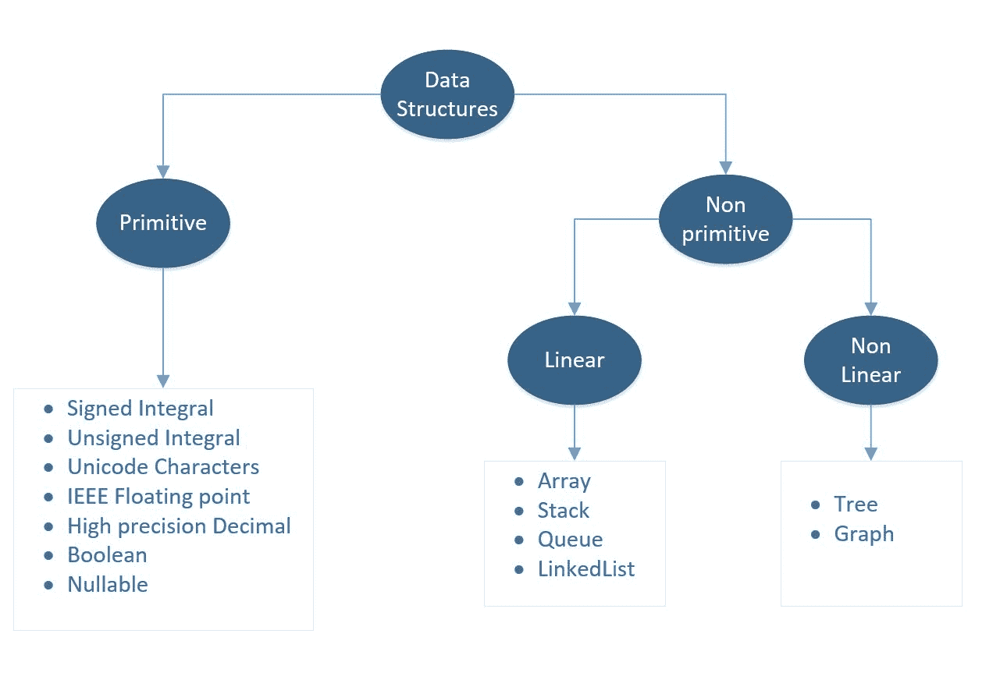
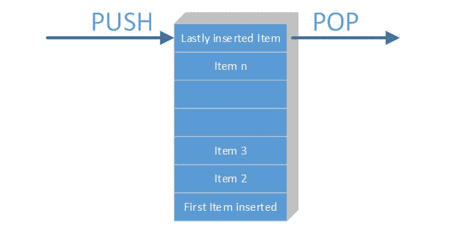
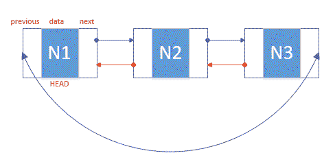
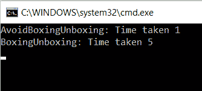

# 数据结构和用 C# 编写优化代码

数据结构是软件工程中存储数据的一种特殊方式。它们在将数据存储在计算机中以使其能够被有效地访问和修改方面起着至关重要的作用，并且它们为存储不同类型的数据提供了不同的存储机制。数据结构有很多种类型，每一种都被设计用来存储一种确定的数据类型。在本章中，我们将详细介绍数据结构，并了解哪些数据结构应该用于特定场景，以提高系统在数据存储和检索方面的性能。我们还将学习如何用 C# 编写优化的代码，以及哪些主要因素会影响性能，这在编写程序时有时会被开发人员忽略。我们将学习一些最佳实践，这些实践可以用来优化对性能有效的代码。

在本章中，我们将涵盖以下主题:

*   什么是数据结构及其特征
*   为性能优化选择正确的数据结构
*   理解使用大 O 符号来衡量程序的性能和复杂性
*   在中编写代码的最佳实践。净核心

# 什么是数据结构？

数据结构是一种存储和统一数据的方式，通过这种方式可以有效地对数据进行操作。数据可以通过几种方式存储。例如，我们可以有一个包含一些属性的`Person`对象，如`PersonID`和`PersonName`，其中`PersonID`是整数类型，`PersonName`是*字符串*类型。该`Person`对象将数据存储在内存中，并可进一步用于将该记录保存在数据库中。另一个例子是一个名为`string`类型的`Countries`数组，它包含一个国家列表。我们可以使用`Countries`数组来检索一个国家名称并在程序中使用它。因此，任何类型的存储数据的对象都称为数据结构。所有基元类型，如整数、字符串、字符和布尔值，都是不同类型的数据结构，而其他集合类型，如`LinkedList`、`ArrayList`、`SortedList`等，也是可以以独占方式存储信息的数据结构类型。

下图说明了数据结构的类型及其相互关系:



数据结构有两种类型:*原语*和*非原语*类型。基本类型是值类型，包括 s *无符号整数*、*无符号整数*、 *unicode 字符*、 *IEEE 浮点*、*高精度十进制*、*布尔*、*枚举*、*结构*和*可空*值类型。

下面是 C# 中可用的基本数据类型列表:

| **原始类型** |
| 符号积分 | `sbyte`、`short`、`int`、`long` |
| 无符号积分 | `byte`、`ushort`、`uint`、`ulong` |
| Unicode 字符 | `Char` |
| IEEE 浮点 | `float`、`double` |
| 高精度小数 | `Decimal` |
| 布尔代数学体系的 | `Bool` |
| 线 | `String` |
| 目标 | `System.Object` |

非主要类型是用户定义的类型，进一步分为线性或非线性类型。在线性数据结构中，元素按顺序组织，例如在*数组*、*链表*和其他相关类型中，而在非线性数据结构中，元素存储没有任何顺序，例如在*树*和*图形中。*

下表显示了中可用的线性和非线性类的类型。网络核心:

| **非主要类型-线性数据结构** |
| 排列 | `ArrayList`、`String[]`、`primitive typed arrays`、`List`、`Dictionary`、`Hashtable`、`BitArray` |
| 堆 | `Stack<T>`、`SortedSet<T>`、`SynchronizedCollection<T>` |
| 长队 | `Queue<T>` |
| 合框架 | `LinkedList<T>` |

。NET Core 不提供任何非主要的非线性类型来表示树或图形格式的数据。然而，我们可以开发自定义类来支持这些类型。

例如，下面是编写以树格式存储数据的自定义树的代码:

```cs
class TreeNode 
{ 
  public TreeNode(string text, object tag) 
  { 
    this.NodeText = text; 
    this.Tag = tag; 
    Nodes = new List<TreeNode>(); 
  } 
  public string NodeText { get; set; } 
  public Object Tag { get; set; } 
  public List<TreeNode> Nodes { get; set; } 
} 
```

最后，我们可以编写一个程序来填充控制台窗口上的树视图，如下所示:

```cs
static void Main(string[] args) 
{ 
  TreeNode node = new TreeNode("Root", null); 
  node.Nodes.Add(new TreeNode("Child 1", null)); 
  node.Nodes[0].Nodes.Add(new TreeNode("Grand Child 1", null)); 
  node.Nodes.Add(new TreeNode("Child 1 (Sibling)", null)); 
  PopulateTreeView(node, ""); 
  Console.Read(); 
} 

//Populates a Tree View on Console 
static void PopulateTreeView(TreeNode node, string space) 
{ 
  Console.WriteLine(space + node.NodeText); 
  space = space + " "; 
  foreach(var treenode in node.Nodes) 
  { 
    //Recurive call 
    PopulateTreeView(treenode, space); 
  } 
}
```

当您运行前面的程序时，它会生成以下输出:


# 了解使用大 O 符号来衡量算法的性能和复杂性

大 O 符号用于定义算法在执行过程中消耗的时间或空间的复杂性和性能。它是表达算法性能和确定程序最坏情况复杂性的基本技术。

为了详细了解它，让我们通过一些代码示例，并使用大 O 符号来计算它们的性能。

如果我们计算以下程序的复杂度，大 O 符号将等于 *O(1)* :

```cs
static int SumNumbers(int a, int b) 
{ 
  return a + b; 
} 
```

这是因为，无论如何指定参数，它只是添加并返回它。

让我们考虑另一个在列表中循环的程序。大 O 符号将确定为 *O(N)* :

```cs
static bool FindItem(List<string> items, string value) 
{ 
  foreach(var item in items) 
  { 
    if (item == value) 
    { 
      return true; 
    } 
  } 
  return false; 
} 
```

在前面的示例中，程序正在遍历项目列表，并将作为参数传递的值与列表中的每个项目进行比较。如果找到项目，程序返回`true`。

复杂性被确定为 *O(N)* ，因为最坏的情况可能是向 *N* 项循环，其中 *N* 可能是第一个索引或任何索引，直到它到达最后一个索引，即 *N* 。

现在我们来看一个*选择排序*的例子，定义为 *O(N2)* :

```cs
static void SelectionSort(int[] nums) 
{ 
  int i, j, min; 

  // One by one move boundary of unsorted subarray 
  for (i = 0; i <nums.Length-1; i++) 
  { 
    min = i; 
    for (j = i + 1; j < nums.Length; j++) 
    if (nums[j] < nums[min]) 
    min = j; 

    // Swap the found minimum element with the first element 
    int temp = nums[min]; 
    nums[min] = nums[i]; 
    nums[i] = temp; 
  } 
} 
```

在前面的例子中，我们有两个嵌套的循环。第一个循环从`0`遍历到最后一个索引，而第二个循环从下一项遍历到倒数第二项，并交换值以按升序对数组进行排序。嵌套循环的数量与 *N* 的幂成正比，因此大 O 符号被定义为 *O(N2)* 。

接下来，让我们考虑一个递归函数，其中大 O 符号被定义为*O(2N)*，其中 *2N* 确定所花费的时间，该时间随着输入数据集中运行指数周期的每个额外元素而加倍。这里有一个`Fibonacci_Recursive`方法的例子，递归调用该方法，直到计数器等于最大值:

```cs
static void Main(string[] args){ 
  Fibonacci_Recursive(0, 1, 1, 10); 
} 

static void Fibonacci_Recursive(int a, int b, int counter, int maxNo) 
{ 
  if (counter <= maxNo) 
  { 
    Console.Write("{0} ", a); 
    Fibonacci_Recursive(b, a + b, counter + 1, len); 
  } 
} 
```

# 对数

对数运算与指数运算完全相反。对数是一个量，表示一个基数的幂必须被提升才能产生一个给定的数。

例如 *2x = 32* ，其中 *x=5* ，可以表示为 *log2 32 =5* 。

在这种情况下，上面表达式的对数是 5，表示一个固定数字 2 的幂，它被提升以产生一个给定的数字 32。

考虑一种二分搜索法算法，该算法通过将一个项目的列表拆分为两个数据集并使用基于该数字的特定数据集来更有效地工作。例如，假设我有一个按升序排序的不同数字的列表:

*{1、5、6、10、15、17、20、42、55、60、67、80、100}*

说我们要找号 *55* 。一种方法是遍历每个索引并逐一检查每个项目。更有效的方法是将列表分成两组，检查我要查找的数字是否大于第一个数据集的最后一项，或者使用第二个数据集。

这里有一个二分搜索法的例子，它的大 O 符号将被确定为 *O(LogN)* :

```cs
static int binarySearch(int[] nums, int startingIndex, int length, int itemToSearch) 
{ 
  if (length >= startingIndex) 
  { 
    int mid = startingIndex + (length - startingIndex) / 2; 

    // If the element found at the middle itself 
    if (nums[mid] == itemToSearch) 
    return mid; 

    // If the element is smaller than mid then it is 
    // present in left set of array 
    if (nums[mid] > itemToSearch) 
    return binarySearch(nums, startingIndex, mid - 1, itemToSearch); 

    // Else the element is present in right set of array 
    return binarySearch(nums, mid + 1, length, itemToSearch); 
  } 

  // If item not found return 1 
  return -1; 
} 
```

# 为性能优化选择正确的数据结构

数据结构是在计算机程序中组织数据的一种精确方式。如果数据没有有效地存储在正确的数据结构中，可能会导致一些影响应用整体体验的性能问题。

在本节中，我们将了解中可用的不同集合类型的优缺点。NET Core 以及哪些类型更适合特定场景:

*   数组和列表
*   堆栈和队列
*   链接列表(单、双和圆形)
*   字典、哈希表和哈希表
*   通用列表

# 数组

数组是保存相似类型元素的集合。可以创建值类型和引用类型的数组。

以下是数组有用的几种情况:

*   如果数据的长度是固定的，使用数组是一个更好的选择，因为它比其他集合更快，例如`arraylists`和泛型列表
*   数组很适合以多维方式表示数据
*   与其他集合相比，它们占用的内存更少
*   使用数组，我们可以按顺序迭代元素

下表显示了可以在阵列中执行的每个操作的大 O 符号:

| **操作** | **大 o 符号** |
| 按索引访问 | *O(1)* |
| 搜索 | *O(n)* |
| 在末尾插入 | *O(n)* |
| 在末尾移除 | *O(n)* |
| 在最后一个元素之前的位置插入 | *O(n)* |
| 移除索引处的元素 | *O(1)* |

如上表所示，在特定位置搜索和插入项目会降低性能，而访问索引中的任何项目或将其从任何位置移除对性能的影响较小。

# 列表

列表被广泛使用。NET 开发人员。尽管在许多场景中使用它更可取，但也有一些性能限制。

当您想要使用索引访问项目时，使用列表是最明智的。与链表不同，在链表中，您必须使用枚举器遍历每个节点来搜索项，而对于列表，我们可以使用索引轻松地访问它。

以下是一些列表有用的建议:

*   当集合大小未知时，建议您使用列表。调整数组的大小是一项昂贵的操作，有了列表，我们只需根据需要添加即可轻松增加集合的大小。
*   与数组不同，列表在创建时不会为项目数保留总内存地址空间。这是因为对于列表，不需要指定集合的大小。另一方面，数组依赖于其初始化的类型和大小，并在初始化期间保留地址空间。
*   有了列表，我们可以使用 lambda 表达式过滤出记录，按降序对项目进行排序，并执行其他操作。数组不提供排序、过滤或其他类似操作。
*   列表表示单个维度集合。

下表显示了可以在列表上执行的每个操作的大 O 符号:

| **操作** | **大 o 符号** |
| 按索引访问 | *O(1)* |
| 搜索 | *O(n)* |
| 在末尾插入 | *O(1)* |
| 从末端移除 | *O(1)* |
| 在最后一个元素之前的位置插入 | *O(n)* |
| 移除索引处的元素 | *O(n)* |

# 大量

堆栈按照**后进先出** ( **后进先出**)的顺序维护项目集合。首先检索要插入的最后一项。栈上只允许两个操作，即`push`和`pop`。栈的真正应用是一个`undo`操作，将更改插入栈中，撤销时，移除最后执行的操作:



上图说明了如何将项目添加到堆栈中。最后插入的项目首先弹出，为了访问插入的第一个项目，我们必须弹出每个元素，直到它到达第一个。

以下是一些堆栈有用的情况:

*   当访问该项的值时应移除该项的情况
*   其中`undo`操作需要是程序中的柠檬
*   维护 web 应用上的导航历史记录
*   递归运算

下表显示了可以在堆栈上执行的每个操作的大 O 符号:

| **操作** | **大 o 符号** |
| 对第一个对象的访问 | *O(1)* |
| 搜索 | *O(n)* |
| 推送项目 | *O(1)* |
| Pop 项目 | *O(1)* |

# 长队

队列以**先进先出** ( **先进先出**)的顺序保存项目集合。首先插入队列的项目首先从队列中检索。队列中只允许三种操作，即`Enqueue`、`Dequeue`和`Peek`。

`Enqueue`将一个元素添加到队列的末尾，而`Dequeue`从队列的开头移除该元素。`Peek`返回队列中最旧的元素，但不删除它们:


上图说明了如何将项目添加到队列中。首先插入的项目将首先从队列中移除，指针将移动到队列中的下一个项目。`Peek`根据第一个项目是否被移除，始终返回插入的第一个项目或指针所指向的项目。

以下是队列有用的一些情况:

*   按顺序处理项目
*   根据先到先得的原则点菜

下表显示了可以在队列上执行的每个操作的大 O 符号:

| **操作** | **大 o 符号** |
| 访问插入的第一个对象 | *O(1)* |
| 搜索 | *O(n)* |
| 伫列项目 | *O(1)* |
| 将项目入队 | *O(1)* |
| 查看项目 | *O(1)* |

# 合框架

链表是一种线性数据结构，其中列表中的每个节点都包含指向下一个节点的引用指针，最后一个节点的引用为 null。第一个节点称为头部。链表有三种，分别叫做*单*、*双*和*循环*链表。

# 单链表

单链表只包含对下一个节点的引用。下图表示单链表:


# 双向链表

在双向链表中，节点包含下一个节点和上一个节点的引用。用户可以使用引用指针向前和向后迭代。下图是双向链表的表示:


# 循环链表

在循环链表中，最后一个节点指向第一个节点。以下是循环链表的一种表示:



以下是链接列表有用的几种情况:

*   以顺序方式提供对项目的访问
*   在列表的任何位置插入项目
*   在任何点或节点移除任何项目
*   当您需要消耗更少的内存时，因为链表中没有数组副本

下表显示了可以在链表上执行的每个操作的大 0 符号值:

| **操作** | **大 o 符号** |
| 访问项目 | *O(1)* |
| 搜索项目 | *O(n)* |
| 插入项目 | *O(1)* |
| 删除项目 | *O(1)* |

# 字典、哈希表和哈希表

字典、哈希表和 hashset 对象以键值格式存储项目。然而，hashsets 和字典对于性能很关键的场景是很好的。以下是这些类型有用的几种情况:

*   以键值格式存储项目，该格式可基于特定键进行检索
*   存储唯一值

下表显示了可以在这些对象上执行的每个操作的大 O 符号值:

| **操作** | **大 o 符号** |
| 接近 | *O(n)* |
| 如果密钥未知，则搜索该值 | *O(n)* |
| 插入项目 | *O(n)* |
| 删除项目 | *O(n)* |

# 通用列表

泛型列表是使用索引访问的强类型元素列表。与数组相反，泛型列表是可扩展的，列表可以动态增长；因此，它们被称为动力学阵列或矢量。与数组不同，泛型列表是一维的，并且是操作内存中元素集合的最佳选项之一。

我们可以定义一个通用列表，如下面的代码示例所示。代码短语`lstNumbers`只允许存储整数值，短语`lstNames`存储`only`字符串，`personLst`存储`Person`对象，等等:

```cs
List<int> lstNumbers = new List<int>();     
List<string> lstNames = new List<string>();     
List<Person> personLst = new List<Person>();              
HashSet<int> hashInt = new HashSet<int>();
```

下表显示了可以在这些对象上执行的每个操作的大 O 符号值:

| **操作** | **大 o 符号** |
| 按索引访问 | *O(1)* |
| 搜索 | *O(n)* |
| 在末尾插入 | *O(1)* |
| 从末端移除 | *O(1)* |
| 在最后一个元素之前的位置插入 | *O(n)* |
| 移除索引处的元素 | *O(n)* |

# 用 C# 编写优化代码的最佳实践

有许多因素会对. NET Core 应用的性能产生负面影响。有时这些都是在编写代码时没有考虑到的小事情，并且没有被公认的最佳实践所解决。因此，为了解决这些问题，程序员经常求助于临时解决方案。然而，当不良实践结合在一起时，就会产生性能问题。了解帮助开发人员编写更简洁的代码并使应用性能更好的最佳实践总是更好的。

在本节中，我们将学习以下主题:

*   装箱和拆箱开销
*   串并置
*   异常处理
*   `for`对`foreach`
*   代表

# 装箱和拆箱开销

装箱和取消装箱方法并不总是好用的，它们会对任务关键型应用的性能产生负面影响。装箱是一种将值类型转换为对象类型的方法，并且是隐式完成的，而取消装箱是一种将对象类型转换回值类型的方法，并且需要显式转换。

让我们来看一个例子，在这个例子中，我们有两个方法执行一个 1000 万条记录的循环，并且在每次迭代中，它们都将计数器递增 1。`AvoidBoxingUnboxing`方法是在每次迭代中使用一个原始整数对其进行初始化和递增，而`BoxingUnboxing`方法是先将数值赋给对象类型，然后在每次迭代中取消装箱，将其转换回整数类型，如下代码所示:

```cs
private static void AvoidBoxingUnboxing() 
{ 

  Stopwatch watch = new Stopwatch(); 
  watch.Start(); 
  //Boxing  
  int counter = 0; 
  for (int i = 0; i < 1000000; i++) 
  { 
    //Unboxing 
    counter = i + 1; 
  } 
  watch.Stop(); 
  Console.WriteLine($"Time taken {watch.ElapsedMilliseconds}"); 
} 

private static void BoxingUnboxing() 
{ 

  Stopwatch watch = new Stopwatch(); 
  watch.Start(); 
  //Boxing  
  object counter = 0; 
  for (int i = 0; i < 1000000; i++) 
  { 
    //Unboxing 
    counter = (int)i + 1; 
  } 
  watch.Stop(); 
  Console.WriteLine($"Time taken {watch.ElapsedMilliseconds}"); 
}
```

当我们运行这两种方法时，我们会清楚地看到性能的差异。`BoxingUnboxing`的执行速度比`AvoidBoxingUnboxing`慢 7 倍，如下图截图所示:



对于任务关键型应用，最好避免装箱和拆箱。然而，在。NET Core 中，我们有许多其他类型，它们在内部使用对象并执行装箱和取消装箱。`System.Collections`和`System.Collections.Specialized`下的大多数类型都使用对象和对象数组进行内部存储，当我们在这些集合中存储基元类型时，它们会执行装箱并将每个基元值转换为对象类型，这增加了额外的开销，并对应用的性能产生负面影响。其他类型的`System.Data`，即`DateSet`、`DataTable`和`DataRow`，也在引擎盖下使用对象数组。

当性能是主要考虑因素时，`System.Collections.Generic`命名空间下的类型或类型化数组是最好的使用方法。例如，`HashSet<T>`、`LinkedList<T>`和`List<T>`都是通用集合的类型。

例如，这里有一个将整数值存储在`ArrayList`中的程序:

```cs
private static void AddValuesInArrayList() 
{ 

  Stopwatch watch = new Stopwatch(); 
  watch.Start(); 
  ArrayList arr = new ArrayList(); 
  for (int i = 0; i < 1000000; i++) 
  { 
    arr.Add(i); 
  } 
  watch.Stop(); 
  Console.WriteLine($"Total time taken is 
  {watch.ElapsedMilliseconds}"); 
}
```

让我们编写另一个程序，它使用整数类型的泛型列表:

```cs
private static void AddValuesInGenericList() 
{ 

  Stopwatch watch = new Stopwatch(); 
  watch.Start(); 
  List<int> lst = new List<int>(); 
  for (int i = 0; i < 1000000; i++) 
  { 
    lst.Add(i); 
  } 
  watch.Stop(); 
  Console.WriteLine($"Total time taken is 
  {watch.ElapsedMilliseconds}"); 
} 
```

运行这两个程序时，差异非常明显。带有通用列表`List<int>`的代码比带有`ArrayList`的代码快 10 倍以上。结果如下:


# 串并置

英寸 NET 中，字符串是不可变的对象。两个字符串引用堆中的相同内存，直到字符串值发生变化。如果字符串中的任何一个发生了变化，就会在堆上创建一个新的字符串，并分配一个新的内存空间。不可变对象通常是线程安全的，并且消除了多个线程之间的竞争条件。字符串值的任何更改都会在内存中创建和分配一个新对象，并避免与多个线程产生冲突。

例如，让我们初始化字符串并将`Hello World`值分配给`a`字符串变量:

```cs
String a = "Hello World"; 
```

现在，让我们将`a`字符串变量分配给另一个变量`b`:

```cs
String b = a;
```

`a`和`b`都指向堆上的同一个值，如下图所示:


现在，假设我们将`b`的值更改为`Hope this helps`:

```cs
b= "Hope this helps"; 
```

这将在堆上创建另一个对象，其中`a`指向相同的对象，`b`指包含新文本的新内存空间:


随着字符串的每次更改，对象都会分配一个新的内存空间。在某些情况下，这可能是一种过分的情况，其中字符串修改的频率更高，并且每个修改都被分配一个单独的内存空间，这为垃圾收集器收集未使用的对象和释放空间创造了工作。在这种情况下，强烈建议您使用`StringBuilder`类。

# 异常处理

异常处理不当也会降低应用的性能。下面的列表包含了处理中异常的一些最佳实践。网络核心:

*   对于您在方法中编写的代码，始终使用特定的异常类型或可以捕获异常的类型。对所有情况使用`Exception`类型并不是一个好的做法。
*   在代码可以抛出异常的地方使用`try`、`catch`以及最后的`block`总是一个很好的做法。最后一个块通常用于清理资源，并返回调用代码期望的正确响应。
*   在深度嵌套代码中，不要使用`try catch`块并将其处理为调用方法或主方法。在多个堆栈上捕获异常会降低性能，因此不建议这样做。
*   对于终止程序的致命情况，始终使用异常。
*   不建议对非关键条件使用异常，例如将值转换为整数或从空数组中读取值，应通过自定义逻辑进行处理。例如，将字符串值转换为整数类型可以通过使用`Int32.Parse`方法来完成，而不是使用`Convert.ToInt32`方法，然后在字符串未表示为数字时失败。
*   抛出异常时，添加一条有意义的消息，以便用户知道异常实际发生在哪里，而不是通过堆栈跟踪。例如，下面的代码显示了一种基于被调用的方法和类引发异常并添加自定义消息的方法:

```cs
static string GetCountryDetails(Dictionary<string, string> countryDictionary, string key)
{
  try
  {
    return countryDictionary[key];
  }
  catch (KeyNotFoundException ex)
  {
    KeyNotFoundException argEx = new KeyNotFoundException("
    Error occured while executing GetCountryDetails method. 
    Cause: Key not found", ex);
    throw argEx;
  }
}
```

*   抛出异常，而不是返回自定义消息或错误代码，并在主调用方法中处理它。
*   记录异常时，请始终检查内部异常并读取异常消息或堆栈跟踪。这很有帮助，并且给出了代码中抛出错误的实际点。

# For 和 foreach

For 和 foreach 是迭代项目列表的两种可选方式。他们每个人都以不同的方式运作。for 循环实际上首先将列表中的所有项加载到内存中，然后使用索引器对每个元素进行迭代，而 foreach 使用枚举器进行迭代，直到到达列表的末尾。

下表显示了适用于`for`和`foreach`的集合类型:

| **类型** | **For/Foreach** |
| 类型化数组 | 对双方都好 |
| 数组列表 | 对...更好 |
| 通用集合 | 对...更好 |

# 代表

委托是。NET，它保存对该方法的引用。该类型相当于 C 或 C++中的函数指针。定义委托时，我们可以指定方法可以采用的参数及其返回类型。这样，引用方法将具有相同的签名。

下面是一个简单的委托，它接受一个字符串并返回一个整数:

```cs
delegate int Log(string n);
```

现在，假设我们有一个`LogToConsole`方法，它的签名与下面代码中显示的相同。此方法获取字符串并将其写入控制台窗口:

```cs
static int LogToConsole(string a) { Console.WriteLine(a); 
  return 1; 
}   
```

我们可以这样初始化和使用这个委托:

```cs
Log logDelegate = LogToConsole; 
logDelegate ("This is a simple delegate call"); 
```

假设我们有另一个名为`LogToDatabase`的方法将信息写入数据库:

```cs
static int LogToDatabase(string a) 
{ 
  Console.WriteLine(a); 
  //Log to database 
  return 1; 
} 
```

以下是引用`LogToDatabase`方法的新`logDelegate`实例的初始化:

```cs
Log logDelegateDatabase = LogToDatabase; 
logDelegateDatabase ("This is a simple delegate call"); 
```

前面的委托是单播委托的表示，因为每个实例都引用一个方法。另一方面，我们也可以通过将`LogToDatabase`分配给相同的`LogDelegate`实例来创建多播委托，如下所示:

```cs
Log logDelegate = LogToConsole; 
logDelegate += LogToDatabase; 
logDelegate("This is a simple delegate call");     
```

前面的代码看起来非常简单，也经过了优化，但实际上，它有巨大的性能开销。英寸 NET 中，委托由一个`MutlicastDelegate`类实现，该类被优化为运行单播委托。它存储方法对目标属性的引用，并直接调用方法。对于多播委托，它使用调用列表，这是一个通用列表，并保存对添加的每个方法的引用。对于多播委托，每个目标属性保存对包含该方法并按顺序执行的泛型列表的引用。然而，这增加了多播委托的开销，并且需要更多的时间来执行。

# 摘要

在这一章中，我们学习了关于数据结构的核心概念、数据结构的类型以及它们的优缺点，然后是每种结构可以使用的最佳场景。我们还学习了大 O 符号，这是编写代码时要考虑的核心主题之一，有助于开发人员识别代码性能。最后，我们研究了一些最佳实践，涵盖了装箱和取消装箱、字符串连接、异常处理、`for`和`foreach`循环以及委托等主题。

在下一章中，我们将学习一些在设计时可能有帮助的指南和最佳实践。NET 核心应用。