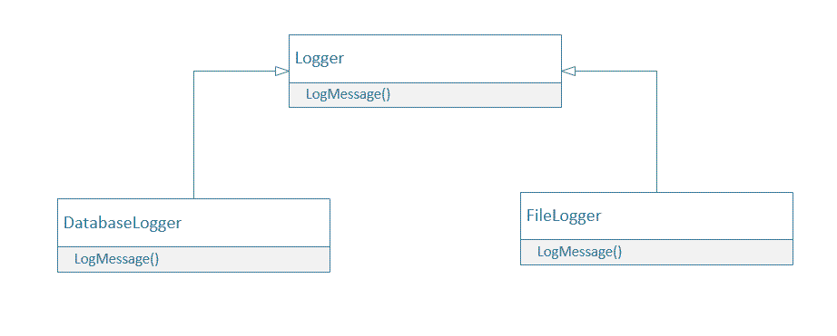
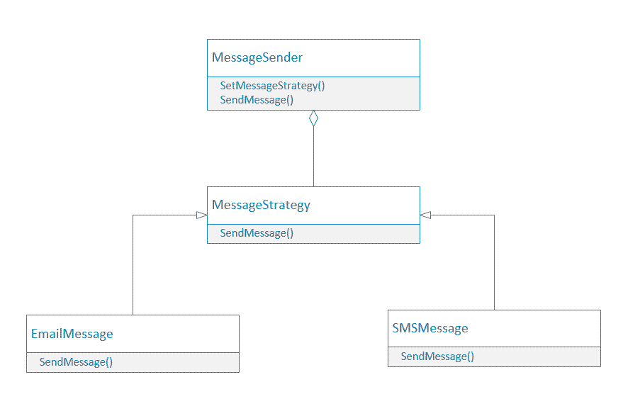
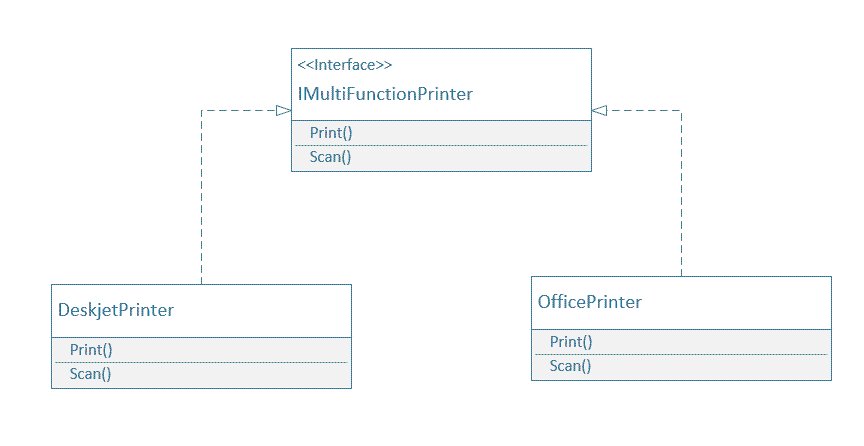
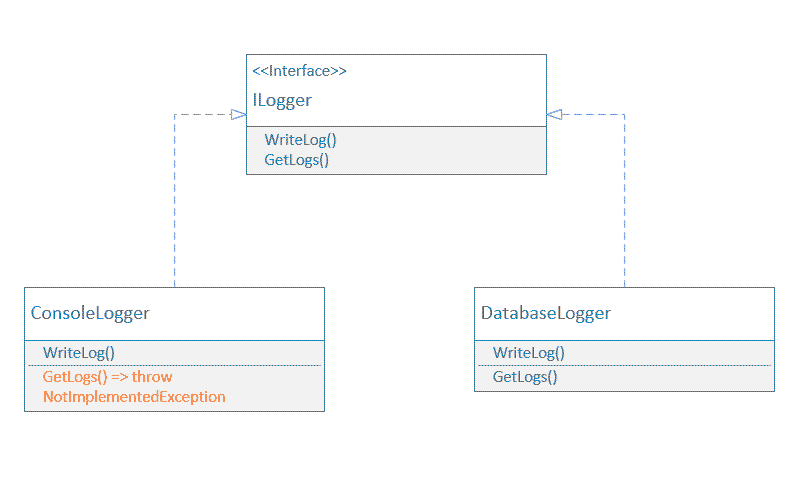
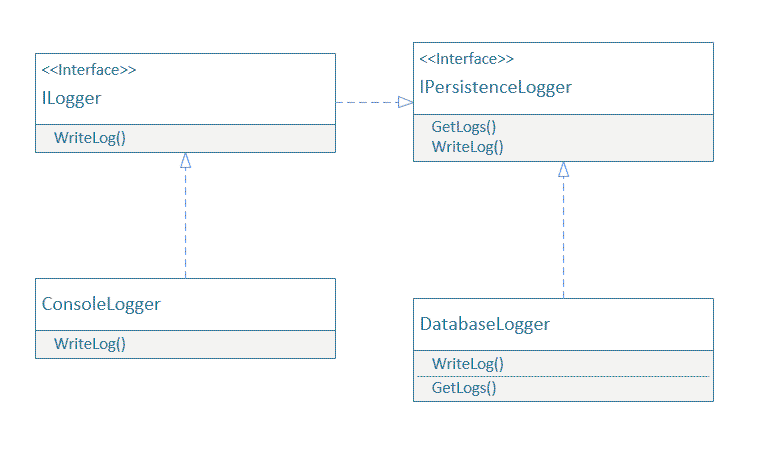
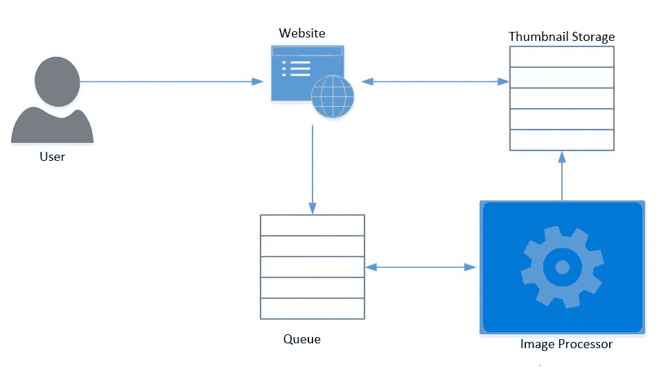

# 设计指南。NET 核心应用程序性能

架构和设计是任何应用程序的核心基础。遵循最佳实践和指导方针使应用程序具有高度的可维护性、性能和可伸缩性。应用程序可以从基于网络的应用程序、网络应用程序接口、基于服务器/客户端 TCP 的消息传递应用程序、任务关键型应用程序等等。但是，所有这些应用程序都应该遵循在各方面都有好处的特定实践。在本章中，我们将学习几乎所有应用程序中常见的某些实践。

以下是我们将在本章中学习的一些原则:

*   编码原则:
    *   命名约定
    *   代码注释
    *   每个文件一个类
    *   每个方法一个逻辑
*   设计原则:
    *   KISS(保持简单，愚蠢)
    *   YAGNI(你不需要它)
    *   干(不要重复自己)
    *   关注点分离
    *   坚实的原则
    *   贮藏
    *   数据结构
    *   沟通
    *   资源管理
    *   并发

# 编码原则

在本节中，我们将介绍一些基本的编码原则，这些原则有助于编写高质量的代码，从而提高应用程序的整体性能和可伸缩性。

# 命名约定

始终在每个应用程序中使用正确的命名约定，从解决方案名称开始，它应该提供关于您正在处理的项目的有意义的信息。项目名称指定应用程序的图层或组件部分。最后，类应该是名词或名词短语，方法应该代表动作。

当我们在 Visual Studio 中创建新项目时，默认解决方案名称被设置为您为项目名称指定的名称。解决方案名称应始终不同于项目名称，因为一个解决方案可能包含多个项目。项目名称应该始终代表系统的特定部分。例如，假设我们正在开发一个消息传递网关，它向不同的方发送不同类型的消息，并包含三个组件，即侦听器、处理器和调度器；监听器监听传入的请求，处理器处理传入的消息，调度程序将消息发送到目的地。命名约定可能如下:

*   解名:`MessagingGatewa` *y* (或任意码字)
*   监听器项目名称:`ListenerApp`
*   处理器项目名称:`ProcessorAPI`(如果是 API)
*   调度员项目名称:`DispatcherApp`

英寸 NET 中，我们通常遵循的命名约定是类和方法名的 Pascal 大小写。在 Pascal 大小写中，每个单词的第一个字符是大写字母，而参数和其他变量遵循 Camel 大小写。下面是一些示例代码，显示了在. NET 中应该如何使用大小写:

```cs
public class MessageDispatcher 
{ 
  public const string SmtpAddress = "smpt.office365.com"; 

  public void SendEmail(string fromAddress, string toAddress, 
  string subject, string body) 
  { 

  } 
}
```

在前面的代码中，我们有一个常量字段`SmtpAddress`和一个使用帕斯卡大小写的`SendEmail`方法，而参数使用骆驼大小写。

下表总结了中不同工件的命名约定。NET:

| **属性** | **命名惯例** | **例** |
| 班级 | 帕斯卡套管 | `class PersonManager {}` |
| 方法 | 帕斯卡套管 | `void SaveRecord(Person person) {}` |
| 参数/成员变量 | 驼色外壳 | `bool isActive;` |
| 连接 | 帕斯卡套管；以字母 I 开头 | `IPerson` |
| 列举型别 | 帕斯卡套管 | `enum Status {InProgress, New, Completed}` |

# 代码注释

任何包含适当注释的代码都可以在很多方面帮助开发人员。它不仅减少了彻底理解代码的时间，还可以利用某些工具，如 *Sandcastle* 或 *DocFx* ，动态生成完整的代码文档，供团队中的其他开发人员共享。此外，当谈到 APIs 时，斯瓦格在开发人员社区中被广泛使用和流行。Swagger 通过提供关于应用编程接口、可用方法、每个方法的参数等完整信息来增强应用编程接口消费者的能力。斯瓦格还阅读这些评论，以提供完整的文档和界面来测试任何应用编程接口。

# 每个文件一个类

与许多其他语言不同，在。NET，我们不限于为每个类创建单独的文件。我们可以创建一个单独的`.cs`文件，并在其中创建多个类。相反，当使用大型应用程序时，这是一种不好的做法，也很痛苦。

# 每个方法一个逻辑

总是写方法一次做一件事。让我们假设我们有一个方法，它从数据库中读取用户标识，然后调用一个应用编程接口来检索用户上传的文档列表。这种情况下最好的方法是使用两个独立的方法`GetUserID`和`GetUserDocuments`，分别检索用户标识和文档:

```cs
public int GetUserId(string userName) 
{ 
  //Get user ID from database by passing the username 
} 

public List<Document> GetUserDocuments(int userID) 
{ 
  //Get list of documents by calling some API 
} 
```

这种方法的好处是减少了代码重复。将来，如果我们想改变任何一种方法的逻辑，我们只需要在一个地方改变它，而不是到处复制它，增加出错的机会。

# 设计原则

遵循最佳实践开发一个干净的架构会增加几个好处，应用程序性能就是其中之一。我们已经多次看到应用程序背后使用的技术是健壮和强大的，但是应用程序的性能仍然不令人满意或很差，这通常是因为糟糕的架构设计和在应用程序设计上投入的时间较少。

在本节中，我们将讨论在中设计和开发应用程序时应遵循的一些常见设计原则。网络核心:

*   KISS(保持简单，愚蠢)
*   YAGNI(你不需要它)
*   干(不要重复自己)
*   关注点分离
*   坚实的原则
*   贮藏
*   数据结构
*   沟通
*   资源管理
*   并发

# KISS(保持简单，愚蠢)

编写更简洁的代码并保持其简单性总是有助于开发人员理解并长期维护它。在代码中增加不必要的复杂性不仅会降低代码的可理解性，而且在需要时也很难维护和更改。这就是 KISS 所说的。在软件环境中，可以在设计软件架构时考虑 KISS，使用**面向对象原则** ( **OOP** )，设计数据库、用户界面、集成等等。增加不必要的复杂性会使软件设计复杂化，并可能影响应用程序的可维护性和性能。

# YAGNI(你不需要它)

YAGNI 是极限编程的核心原则之一。XP 是一种软件方法，它包含短时间的迭代来满足客户需求，并在客户需要或启动时欢迎变更。主要目标是满足客户的期望，并保持客户需求的质量和响应能力。它包括结对编程和代码审查，以保持质量完好无损，并满足客户的期望。

YAGNI 最适合极限编程方法，它帮助开发人员专注于作为应用程序功能或客户需求一部分的特性。做一些额外的事情，而这些事情没有被传达给客户，或者不是迭代或者需求的一部分，最终可能需要返工，并且是浪费时间。

# 干(不要重复自己)

DRY(不要重复自己)也是编写干净代码的核心原则之一。它解决了开发人员在大型应用程序中不断改变或扩展功能或底层逻辑时所面临的挑战。根据该原则，它规定“*每一条知识必须在系统中有一个可靠的表示。*”

编写应用程序时，我们可以使用抽象，避免代码重复，以避免冗余。这有利于适应变化，让开发人员专注于需要变化的领域。如果相同的代码在多个区域重复，那么一个地方的更改也需要在其他地方完成，这就消除了良好的架构实践，从而引发更高的错误风险，并使应用程序代码更有问题。

# 关注点分离

开发清洁架构的核心原则之一是**关注点分离** ( **SoC** )。这种模式规定，正在执行的每种不同类型的工作应用程序应该作为一个单独的组件单独构建，很少或没有与其他组件的紧密耦合。例如，如果一个程序将用户消息保存到数据库中，然后一个服务随机提取消息并选择获胜者，您可以看到这是两个独立的操作，这就是所谓的关注点分离。对于 SoC，代码被视为一个独立的组件，如果需要，任何定制都可以在一个地方完成。可重用性是帮助开发人员在一个地方更改代码以便在多个地方使用它的另一个因素。尽管如此，测试要容易得多，bug 可以在以后遇到困境时被隔离和修复。

# 坚实的原则

SOLID 是 5 个原则的集合，如下所示。它们是开发软件设计时常用的设计原则:

*   **单一责任原则** ( **SRP** )
*   **开启关闭原理** ( **OCP** )
*   **利斯科夫替代原则** ( **LSP** )
*   **接口隔离原理** ( **ISP** )
*   **依存倒置原则** ( **DIP** )

# 单一责任原则

单一责任原则指出，该类应该只有一个特定的目标，并且责任应该完全封装在该类中。如果有任何变化或者需要适应新的目标，应该创建一个新的类或接口。

在软件设计中应用这一原则使我们的代码易于维护和理解。架构师在设计软件架构时通常遵循这一原则，但是，随着时间的推移，当许多开发人员工作并将更改合并到该代码/类中时，它会变得臃肿，并否定单一责任原则，从而最终使我们的代码不可维护。

这也涉及到内聚和耦合的概念。内聚性指的是衡量类中的职责有多紧密相关，而耦合性指的是每个类相互依赖的程度。我们应该始终关注保持类之间的低耦合性和类内的高内聚性。

这里是基本的`PersonManager`类，包含四种方法，分别是`GetPerson`、`SavePerson`、`LogError`和`LogInformation`:


所有这些方法都使用数据库持久性管理器将记录读写到数据库中。你可能已经注意到了，`LogError`和`LogInformation`与`PersonManager`班的凝聚力不高，与`PersonManager`班的衔接紧密。如果我们想在其他类中重用这些方法，我们必须使用`PersonManager`类，而更改内部日志记录的逻辑也需要更改这个`PersonManager`类。因此，`PersonManager`违反了单一责任原则。

为了修复这个设计，我们可以创建一个单独的`LogManager`类，它可以被`PersonManager`用来记录执行操作时的信息或错误。下面是表示关联的更新类图:


# 开放封闭原则

根据定义，开放封闭原则规定，像类、方法、接口等软件实体应该是封闭的，以便修改，开放的，以便扩展。这意味着我们不能通过添加额外的类、接口、方法等来修改现有的代码和扩展功能，以应对任何变化。

在任何应用中使用该原理都可以解决各种问题，如下所示:

*   在不改变现有代码的情况下添加新功能会产生更少的错误，并且不需要彻底的测试
*   当更改现有代码以添加或更新功能时，通常会经历较少的连锁反应
*   扩展大多使用新的接口或抽象类来实现，现有的代码是不必要的，并且破坏现有功能的可能性较小

为了实现开放封闭原则，我们应该使用抽象，这可以通过参数、继承和组合方法来实现。

# 因素

可以在方法中设置特殊参数，这些参数可以用来控制在该方法中编写的主体的行为。假设有一个`LogException`方法将异常保存到数据库中，并且还发送了一封电子邮件。现在，每当调用这个方法时，这两个任务都将被执行。无法停止为代码中的特定异常发送电子邮件。但是，如果它以某种方式表达，并使用一些参数来决定是否必须发送电子邮件，它是可以控制的。尽管如此，如果现有的代码不支持这个参数，那么就需要定制，但是，在设计时，我们可以保留这个方法来公开某些参数，这样我们就可以处理方法的内部行为:

```cs
public void LogException(Exception ex) 
{ 
  SendEmail(ex); 
  LogToDatabase(ex); 
} 
```

建议的实施方式如下:

```cs
public void LogException(Exception ex, bool sendEmail, bool logToDb) 
{ 
  if (sendEmail) 
  { 
    SendEmail(ex); 
  } 

  if (logToDb) 
  { 
    LogToDatabase(ex); 
  } 
}
```

# 遗产

通过继承方法，我们可以使用模板方法模式。使用 Template 方法模式，我们可以在根类中创建默认行为，然后创建子类来覆盖默认行为并实现新功能。

例如，这里有一个将信息记录到文件系统中的`Logger`类:

```cs
public class Logger 
{ 
  public virtual void LogMessage(string message) 
  { 
    //This method logs information into file system 
    LogToFileSystem(message); 
  } 

  private void LogtoFileSystem(string message) { 
    //Log to file system 
  } 
} 
```

我们有一个`LogMessage`方法，通过调用`LogToFileSystem`方法将消息记录到文件系统中。在我们想要扩展功能之前，这种方法工作得很好。假设稍后，我们也提出了将这些信息记录到数据库中的要求。我们必须改变现有的`LogMessage`方法，并将代码写入同一个类本身。稍后，如果出现任何其他需求，我们必须一次又一次地添加该功能并修改这个类。根据开放封闭原则，这是一种违反。

使用 Template 方法模式，我们可以重新设计这段代码，以遵循 Open Closed 原则，这样我们就可以使它为扩展而打开，为定制而关闭。

在 OCP 之后，这里是新的设计，其中我们有一个包含`LogMessage`抽象方法的抽象类，以及两个有自己实现的子类:



通过这种设计，我们可以在不改变现有`Logger`类的情况下增加第 n 个扩展:

```cs
public abstract class Logger 
{ 
  public abstract void LogMessage(string message); 

} 

public class FileLogger : Logger 
{ 
  public override void LogMessage(string message) 
  { 
    //Log to file system 
  } 
} 

public class DatabaseLogger : Logger 
{ 
  public override void LogMessage(string message) 
  { 
    //Log to database 
  } 
} 

```

# 作文

第三种方法是组合，这可以使用策略模式来实现。使用这种方法，客户端代码依赖于抽象，实际的实现被封装在一个单独的类中，该类被注入到向客户端公开的类中。

让我们看看下面这个实现策略模式的例子。基本要求是发送可能是电子邮件或短信的消息，我们需要以一种方式构建它，以便将来可以添加新的消息类型，而无需对主类进行任何修改:



按照策略模式，我们有一个`MessageStrategy`抽象类，它公开了一个抽象方法。每种类型的工作都被封装到继承`MessageStrategy`基础抽象类的独立类中。

以下是`MessageStrategy`抽象类的代码:

```cs
public abstract class MessageStrategy 
{ 
  public abstract void SendMessage(Message message); 
}
```

`MessageStrategy`我们有两个具体的实现；一个发送电子邮件，另一个发送短信，如下所示:

```cs
public class EmailMessage : MessageStrategy 
{ 
  public override void SendMessage(Message message) 
  { 
    //Send Email 
  } 
} 

public class SMSMessage : MessageStrategy 
{ 
  public override void SendMessage(Message message) 
  { 
    //Send SMS  
  } 
} 
```

最后，我们有`MessageSender`类，将由客户端使用。在这个类中，客户端可以设置消息策略并调用`SendMessage`方法，该方法调用特定的具体实现类型来发送消息:

```cs
public class MessageSender 
{ 
  private MessageStrategy _messageStrategy; 
  public void SetMessageStrategy(MessageStrategy messageStrategy) 
  { 
    _messageStrategy = messageStrategy; 
  } 

  public void SendMessage(Message message) 
  { 
    _messageStrategy.SendMessage(message); 
  } 

} 

```

从主程序中，我们可以使用`MessageSender`，如下所示:

```cs
static void Main(string[] args) 
{ 
  MessageSender sender = new MessageSender(); 
  sender.SetMessageStrategy(new EmailMessage()); 
  sender.SendMessage(new Message { MessageID = 1, MessageTo = "jason@tfx.com", 
  MessageFrom = "donotreply@tfx.com", MessageBody = "Hello readers", 
  MessageSubject = "Chapter 5" }); 
}
```

# 利斯科夫原则

根据利斯科夫原理，通过基类对象使用派生类引用的函数必须符合基类的行为。

这意味着子类不应该移除基类的行为，因为这违反了基类的不变量。通常，调用代码应该完全依赖基类中公开的方法，而不知道它的派生实现。

让我们举一个例子，我们首先违反了利科夫原理的定义，然后修正它，以了解它的特殊设计目的:



`IMultiFunctionPrinter`界面公开了如下两种方法:

```cs
public interface IMultiFunctionPrinter 
{ 
  void Print(); 
  void Scan(); 
}
```

这是一个可以由不同类型的打印机实现的接口。以下是实现`IMultiFunctionPrinter`接口的两种打印机，分别如下:

```cs
public class OfficePrinter: IMultiFunctionPrinter 
{ 
  //Office printer can print the page 
  public void Print() { } 
  //Office printer can scan the page 
  public void Scan() { } 
} 

public class DeskjetPrinter : IMultiFunctionPrinter 
{ 
  //Deskjet printer print the page 
  public void Print() { } 
  //Deskjet printer does not contain this feature 
  public void Scan() => throw new NotImplementedException(); 
}
```

在前面的实现中，我们有一个`OfficePrinter`提供打印和扫描功能，而另一个家用`DeskjetPrinter`仅提供打印功能。这个`DeskjetPrinter`实际上违反了利斯科夫原则，因为它在调用`Scan`方法时抛出了`NotImplementedException`。

作为对上述问题的补救，我们可以将`IMultiFunctionPrinter`分成两个接口，即`IPrinter`和`IScanner`，而`IMultiFunctionPrinter`也可以实现这两个接口来支持这两个功能。`DeskjetPrinter`只实现`IPrinter`界面，不支持扫描:


以下是三个接口的代码:`IPrinter`、`IScanner`和`IMultiFunctionPrinter`:

```cs
public interface IPrinter 
{ 
  void Print(); 
} 

public interface IScanner 
{ 
  void Scanner(); 
} 

public interface MultiFunctionPrinter : IPrinter, IScanner 
{  

} 
```

最后，具体实施如下:

```cs
public class DeskjetPrinter : IPrinter 
{ 
  //Deskjet printer print the page 
  public void Print() { } 
} 

public class OfficePrinter: IMultiFunctionPrinter 
{ 
  //Office printer can print the page 
  public void Print() { } 
  //Office printer can scan the page 
  public void Scan() { } 
}
```

# 界面分离原理

接口隔离原则指出，客户端代码应该只依赖于客户端使用的东西，而不应该依赖于客户端不使用的任何东西。这意味着您不能强制客户端代码依赖于某些不需要的方法。

让我们举一个首先违反接口隔离原则的例子:



在上图中，我们有包含两种方法的 ILogger 界面，即`WriteLog`和`GetLogs`。`ConsoleLogger`类将消息写入应用程序控制台窗口，而`DatabaseLogger`类将消息存储到数据库中。`ConsoleLogger`将消息打印在控制台窗口上，并且不保存；它为`GetLogs`方法抛出`NotImplementedException`，因此这违反了界面分离原则。

下面是前面问题的代码:

```cs
public interface ILogger 
{ 
  void WriteLog(string message); 
  List<string> GetLogs(); 
} 

/// <summary> 
/// Logger that prints the information on application console window 
/// </summary> 
public class ConsoleLogger : ILogger 
{ 
  public List<string> GetLogs() => throw new NotImplementedException(); 
  public void WriteLog(string message) 
  { 
    Console.WriteLine(message); 
  } 
} 

/// <summary> 
/// Logger that writes the log into database and persist them 
/// </summary> 
public class DatabaseLogger : ILogger 
{ 
  public List<string> GetLogs() 
  { 
    //do some work to get logs stored in database, as the actual code 
    //in not written so returning null 
    return null;  
  } 
  public void WriteLog(string message) 
  { 
    //do some work to write log into database 
  } 
}
```

为了遵守**接口隔离原则** ( **ISP** )，我们对 ILogger 接口进行了拆分，使其与其他实现者更加精确和相关。iloger 接口将只包含`WriteLog`方法，并且引入了一个新的`IPersistenceLogger`接口，该接口继承了 iloger 接口并提供了`GetLogs`方法:



下面是修改后的示例，如下所示:

```cs
public interface ILogger 
{ 
  void WriteLog(string message); 

} 

public interface PersistenceLogger: ILogger 
{ 
  List<string> GetLogs(); 
} 

/// <summary> 
/// Logger that prints the information on application console window 
/// </summary> 
public class ConsoleLogger : ILogger 
{ 
  public void WriteLog(string message) 
  { 
    Console.WriteLine(message); 
  } 
} 

/// <summary> 
/// Logger that writes the log into database and persist them 
/// </summary> 
public class DatabaseLogger : PersistenceLogger 
{ 
  public List<string> GetLogs() 
  { 
    //do some work to get logs stored in database, as the actual code 
    //in not written so returning null 
    return null; 
  } 
  public void WriteLog(string message) 
  { 
    //do some work to write log into database 
  } 
}
```

# 依存倒置原则

依赖反转原则声明高级模块不应该依赖于低级模块，它们都应该依赖于抽象。

软件应用程序包含多种类型的依赖关系。依赖关系可以是框架依赖关系、第三方库依赖关系、web 服务依赖关系、数据库依赖关系、类依赖关系等等。根据依赖性反转原理，依赖性不应该彼此紧密耦合。

例如，在分层架构方法中，我们有一个表示层，其中定义了所有视图；展示表示层使用的某些方法的服务层；包含系统核心业务逻辑的业务层；以及定义后端数据库连接器和存储库类的数据库层。假设这是一个 ASP.NET MVC 应用程序，其中控制器调用引用业务层的服务，业务层包含系统的核心业务逻辑，它使用数据库层对数据库执行 CRUD(创建、读取、更新和删除)操作。依赖关系树如下所示:


根据依赖反转原则，不建议直接从每一层实例化对象。这在各层之间产生了紧密的耦合。为了打破这种耦合，我们可以通过接口或抽象类来实现抽象。我们可以使用一些实例化模式，如工厂或依赖注入来实例化对象。此外，我们应该总是使用接口而不是类。假设在我们的服务层中，我们有一个对业务层的引用，并且我们的服务契约正在使用`EmployeeManager`来执行一些 CRUD 操作。`EmployeeManager`包含以下方法:

```cs
public class EmployeeManager 
{ 

  public List<Employee> GetEmployees(int id) 
  { 
    //logic to Get employees 
    return null; 
  } 
  public void SaveEmployee(Employee emp) 
  { 
    //logic to Save employee 
  } 
  public void DeleteEmployee(int id) 
  { 
    //Logic to delete employee 
  } 

} 
```

在服务层，我们可以使用 new 关键字实例化业务层`EmployeeManager`对象。在`EmployeeManager`类中添加更多的方法将直接使用服务层，这是基于在每个方法中设置的访问修饰符。此外，现有方法中的任何更改都会破坏服务层代码。如果我们将接口暴露给服务层，并使用一些工厂或**依赖注入** ( **DI** )模式，它会封装底层实现，只暴露那些需要的方法。

下面的代码显示了从`EmployeeManager`类中提取的`IEmployeeManager`界面:

```cs
public interface IEmployeeManager 
{ 
  void DeleteEmployee(int id); 
  System.Collections.Generic.List<Employee> GetEmployees(int id); 
  void SaveEmployee(Employee emp); 
}
```

考虑到前面的例子，我们可以使用依赖注入来注入类型，因此无论何时调用服务管理器，业务管理器实例都将被初始化。

# 贮藏

缓存是可以用来提高应用程序性能的最佳实践之一。它通常用于变化不太频繁的数据。有许多可用的缓存提供程序，我们可以考虑在需要时保存和检索数据。它比数据库操作更快。在 ASP.NET 核心中，我们可以使用内存缓存，将数据存储在服务器的内存中，但是对于一个 web 场或一个应用程序部署到多个位置的负载平衡场景，建议使用分布式缓存。微软 Azure 还提供了一个 Redis 缓存，这是一个分布式缓存，它公开了一个端点，该端点可用于在云上存储值，并可在需要时进行检索。

为了使用 ASP.NET 核心项目中的内存缓存，我们可以简单地在`ConfigureServices`方法中添加内存缓存，如下所示:

```cs
public void ConfigureServices(IServiceCollection services) 
{ 
  services.AddMvc(); 
  services.AddMemoryCache(); 
}
```

然后，我们可以通过依赖注入将`IMemoryCache`注入到我们的控制器或页面模型中，并使用`Set`和`Get`方法设置或获取值。

# 数据结构

选择正确的数据结构对应用程序性能至关重要。在选择任何数据结构之前，强烈建议考虑它是一个开销还是它确实解决了一个特定的用例。在选择合适的数据结构时，需要考虑的一些关键因素如下:

*   了解您需要存储的数据类型
*   了解数据是如何增长的，以及增长时是否有任何缺点
*   了解是否需要通过索引或键/值对来访问数据，并选择合适的数据结构
*   了解您是否需要同步访问，并选择线程安全的集合

在选择正确的数据结构时，还有许多其他因素，这些因素已经在[第 4 章](4.html#361C60-84c100e6bea3438e8844d99ae7f5dfa9)、*数据结构和用 C#编写优化代码中介绍过了。*

# 沟通

如今，通信已经成为任何应用的重要缩影，而首要因素是技术的快速发展。基于网络的应用程序、移动应用程序、物联网应用程序和其他分布式应用程序通过网络执行不同类型的通信。我们可以举一个应用程序的例子，它有一个部署在某个云实例上的 web 前端，调用部署在云中某个单独实例上的某个服务，并执行到本地托管的数据库的一些后端连接。除此之外，我们还可以有一个物联网应用程序，通过互联网调用一些服务来发送室温，等等。设计分布式应用程序时需要考虑的某些因素如下:

# 使用更轻的接口

避免多次往返于服务器，这将增加网络延迟并降低应用程序性能。使用工作单元模式避免了向服务器发送冗余操作，并且只执行一个操作来与后端服务通信。工作单元将所有消息分组为一个单元，并将它们作为一个单元进行处理。

# 最小化消息大小

使用尽可能少的数据与服务通信。例如，有一个 Person API 提供了一些`GET`、`POST`、`PUT`和`DELETE`方法来对该后端数据库执行 CRUD 操作。要删除一个人的记录，我们只需要将这个人的`ID`(主键)作为参数传递给服务，而不是将整个对象作为参数传递。此外，使用不那么膨胀的对象，或者提供最少工件集的属性或方法。最好的情况是使用 **POCO** ( **普通旧 CLR 对象**)实体，这些实体对其他对象的依赖性最小，这些对象只包含那些需要通过网络发送的属性。

# 排队通信

对于较大的对象或复杂的操作，将单个请求/响应通道与分布式消息传递通道分离可以提高应用程序的性能。对于大型、大块的操作，我们可以将通信设计和分布到多个组件中。例如，有一个网站调用一个服务来上传图像，一旦上传，它就会进行一些处理来提取缩略图并将其保存在数据库中。一种方法是在一次调用中同时完成上传和处理，但有时当用户上传更大的图像时，或者如果图像处理花费更长的时间，用户可能会面临请求超时异常，请求将终止。

使用排队体系结构，我们可以将这两个操作分配到单独的调用中。用户上传保存在文件系统中的图像，图像路径将保存到存储器中。后台运行的服务将获取该文件，并异步进行处理。同时，当后端服务正在处理时，控制被返回给用户，在那里用户可以看到一些进行中的通知。最后，当缩略图生成时，将通知用户:



# 资源管理

每个服务器都有一组有限的资源。不管服务器规范有多好，如果应用程序没有被设计成以有效的方式利用资源，这将导致性能问题。在设计时，需要解决某些最佳实践，以优化服务器资源的使用。NET 核心应用程序。

# 避免线程的不当使用

在不监控或中止线程生命周期的情况下为每个任务创建一个新线程是一种不好的做法。线程有利于执行多任务处理，并利用服务器的多种资源并行运行。但是，如果设计是为每个请求创建线程，这可能会降低应用程序的性能，因为 CPU 在线程之间切换的上下文中将花费更多的时间，而不是执行实际的作业。

每当我们使用线程时，我们应该总是尝试保持一个共享的线程池，如果线程繁忙，需要执行的任何新项目都会在队列中等待，并在可用时获取。这样，线程管理很容易，服务器资源将得到有效利用。

# 及时处理物品

**CLR** ( **公共语言运行库**)提供自动内存管理，用新关键字实例化的对象不需要显式垃圾收集； **GC** ( **垃圾收集**)完成工作。但是，非托管资源不是由 GC 自动释放的，应该通过实现`IDisposable`接口显式收集。这些资源可以是数据库连接、文件处理程序、套接字等。了解有关在中释放非托管资源的更多信息。NET Core，请参考中的[第 6 章](6.html#4PHAI0-84c100e6bea3438e8844d99ae7f5dfa9)、*内存管理技术。NET 核心。*

# 需要资源时获取资源

永远只在需要的时候获取资源。提前实例化对象不是一个好的做法。它占用不必要的内存并利用系统资源。进而用*试*、*抓、*最后用*最后用*来阻挡和释放*最后*阻挡中的物体。这样，如果发生任何异常，在方法中实例化的对象将被释放。

# 并发

在并发编程中，许多对象可能同时访问同一资源，保持它们的线程安全是主要目标。英寸 NET Core，我们可以使用锁来提供同步访问。然而，在某些情况下，线程必须等待更长的时间才能访问资源，这使得应用程序没有响应。

最佳做法是只对那些实际资源需要线程安全的特定代码行应用同步访问，例如，可以使用锁的代码行，即数据库操作、文件处理、银行帐户访问和应用程序中的许多其他关键部分。这些需要同步访问，以便一次可以由一个线程处理。

# 摘要

编写更简洁的代码、遵循体系结构和设计原则以及遵循最佳实践在应用程序性能中扮演着重要角色。如果代码过于松散和重复，就会增加出错的机会，增加复杂性，并影响性能。

在这一章中，我们学习了一些编码原则，这些原则使应用程序代码看起来更清晰、更容易理解。如果代码是干净的，它为其他开发人员提供了一种完全理解它的方法，并在许多其他方面有所帮助。后来，我们学习了一些基本的设计原则，这些原则被认为是设计应用程序时的核心原则。KISS、YAGNI、DRY、关注点分离和 SOLID 等原则在软件设计中非常重要，如果使用得当，缓存和选择正确的数据结构会对性能产生重大影响并提高性能。最后，我们学习了一些在处理通信、资源管理和并发时应该考虑的最佳实践。

下一章是对内存管理的详细介绍，我们将在其中探讨内存管理的一些技术。NET 核心。