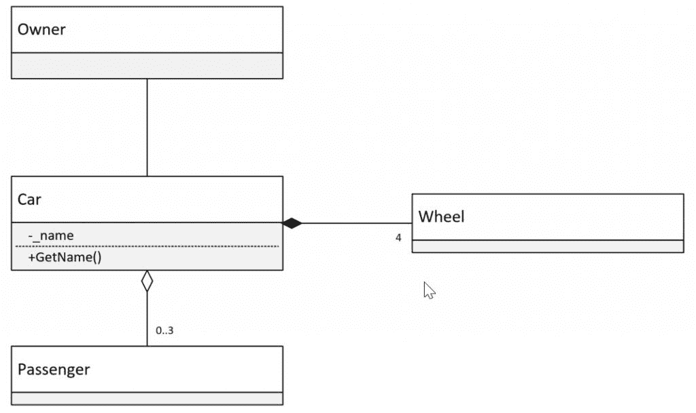
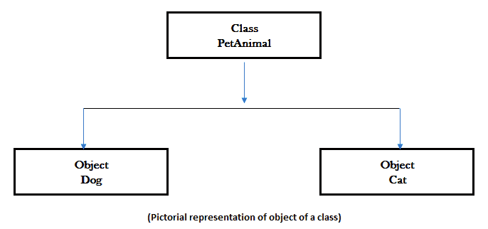
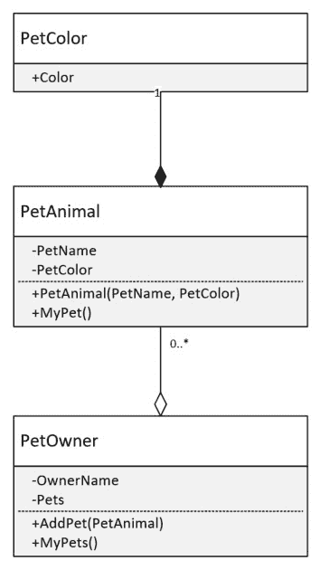
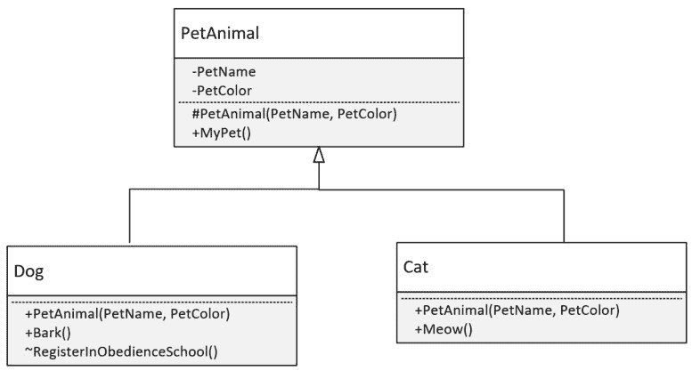

# 一、NETCore 和 C# 中的 OOP 概述

20 多年来，最流行的编程语言一直基于**面向对象编程**（**OOP**的原则。OOP 语言的流行在很大程度上是因为它能够将复杂的逻辑抽象成一种称为对象的结构，这种结构更容易解释，更重要的是，可以在应用中重用。从本质上讲，OOP 是一种软件设计方法，即使用包含数据和功能的对象概念开发软件的模式。随着软件行业的成熟，面向对象编程中出现了一些常见问题的模式，因为这些模式可以有效地解决相同的问题，但可以跨越不同的环境和行业。随着软件从大型机转移到客户机服务器，然后再转移到云计算，出现了其他模式来帮助降低开发成本和提高可靠性。这本书将探索设计模式，从面向对象的基础到基于云的软件的架构设计模式。

OOP is based on the concept of an object. This object generally contains data, referred to as properties and fields, and code or behavior referred to as methods.

**设计模式**是针对软件程序员在开发过程中面临的一般问题的解决方案，它是根据工作和不工作的经验构建的。这些解决方案由众多开发人员在各种情况下进行试验和测试。使用基于此之前活动的模式的好处是确保相同的工作不会重复。除此之外，使用模式还增加了一种可靠性，即问题将在不引入缺陷或问题的情况下得到解决。

本章回顾 OOP 及其如何应用于 C#。请注意，这只是一个简单的介绍，并不意味着是 OOP 或 C# 的完整入门；相反，本章将详细介绍这两个方面，以便向您介绍将在后续章节中介绍的设计模式。本章将涵盖以下主题：

*   关于 OOP 以及类和对象如何工作的讨论
*   遗产
*   封装
*   多态性

# 技术要求

本章包含解释这些概念的各种代码示例。代码保持简单，仅用于演示目的。大多数示例都涉及用 C# 编写的.NETCore 控制台应用。

要运行和执行代码，您需要以下内容：

*   Visual Studio 2019（您也可以使用 Visual Studio 2017 版本 3 或更高版本运行应用）
*   .NETCore
*   SQL Server（本章使用快速版）

# 安装 Visual Studio

为了运行这些代码示例，您需要安装 Visual Studio 或更高版本（也可以使用首选 IDE）。要执行此操作，请遵循以下说明：

1.  从以下链接下载 Visual Studio:[https://docs.microsoft.com/en-us/visualstudio/install/install-visual-studio](https://docs.microsoft.com/en-us/visualstudio/install/install-visual-studio) 。
2.  按照链接中包含的安装说明进行操作。Visual Studio 有多个版本可用；在本章中，我们将使用 Visual Studio for Windows。

# 设置.NETCore

如果未安装.NET Core，则需要遵循以下说明：

1.  从以下链接下载.NETCore：[https://www.microsoft.com/net/download/windows](https://www.microsoft.com/net/download/windows) 。
2.  按照相关库中的安装说明进行操作：[https://dotnet.microsoft.com/download/dotnet-core/2.2](https://dotnet.microsoft.com/download/dotnet-core/2.2) 。

The complete source code is available in GitHub. The source code shown in the chapter might not be complete, so it is recommended that you retrieve the source code in order to run the examples ([https://github.com/PacktPublishing/Hands-On-Design-Patterns-with-C-and-.NET-Core/tree/master/Chapter1](https://github.com/PacktPublishing/Hands-On-Design-Patterns-with-C-and-.NET-Core/tree/master/Chapter1)).

# 本书中使用的模型

作为一种学习帮助，本书将包含许多 C 语言的代码示例以及图表和图像，以尽可能帮助描述特定的概念。这不是一本**统一建模语言**（**UML**的书；然而，对于那些了解 UML 的人来说，许多图应该看起来很熟悉。本节提供本书中将使用的类图的描述。

在这里，类将被定义为包括由虚线分隔的字段和方法。如果对讨论很重要，那么可访问性将被指示为`-`表示私有，`+`表示公共，`# `表示受保护，`~`表示内部。下面的屏幕截图通过显示一个带有私有`_name`变量和公共`GetName()`方法的`Car`类来说明这一点：


显示对象之间的关系时，关联显示为实线，聚合显示为开放菱形，合成显示为填充菱形。当对讨论很重要时，多重性将显示在所讨论的类旁边。下图说明了`Car`类有一个**所有者**和最多三个**乘客**；由四个**轮**组成：



**继承**使用实线在基类上使用开放三角形显示。下图显示了`Account`基类与`CheckingAccount`和`SavingsAccount`子类之间的关系：


**接口**的显示方式与继承类似，但它们使用了虚线以及额外的`<<interface>>`标签，如下图所示：


本节概述了本书中使用的模型。选择这种风格/方法是因为，希望大多数读者都熟悉它

# OOP 以及类和对象的工作方式

OOP 指的是一种软件编程方法，它使用定义为类的对象。这些定义包括字段，有时称为属性，用于存储数据和方法，以提供功能。第一种 OOP 语言是对实际系统的模拟，称为 Simula（[https://en.wikipedia.org/wiki/Simula](https://en.wikipedia.org/wiki/Simula) ），并于 1960 年在挪威计算中心开发。第一种纯 OOP 语言于 1970 年作为 Smalltalk（[出现 https://en.wikipedia.org/wiki/Smalltalk](https://en.wikipedia.org/wiki/Smalltalk) 语言。该语言是为编写 Dynabook（[语言）而设计的 http://history-computer.com/ModernComputer/Personal/Dynabook.html](http://history-computer.com/ModernComputer/Personal/Dynabook.html) ），这是艾伦·凯创造的个人电脑。一些 OOP 语言从那里发展而来，其中最流行的是 java、C++、Python 和 C。

OOP is based on objects that contain data. The OOP paradigm allows developers to arrange/organize code into an abstract or logical structure called an object. An object can contain both data and behavior.

通过使用 OOP 方法，我们正在做以下工作：

*   **模块化**：这里，一个应用被分解成不同的模块。
*   **重用软件**：在这里，我们从不同的（即现有的或新的）模块重建或组合应用。

在下面的部分中，我们将更详细地讨论和理解 OOP 的概念。

# 解释 OOP

早些时候，编程方法有局限性，而且往往难以维护。OOP 为软件开发提供了一种新的范例，与其他方法相比具有优势。将代码组织成对象的概念并不难解释，这对于采用新模式来说是一个巨大的优势。为了解释这个概念，可以从现实世界中举出许多例子。复杂系统也可以使用较小的构建块（即，*对象*）来描述。这使开发人员能够单独查看解决方案的各个部分，同时了解它们如何适合整个解决方案。

考虑到这一点，让我们按如下方式定义一个程序：

"A program is a list of instructions that instructs the language compiler on what to do."

如您所见，对象是以逻辑方式组织指令列表的一种方式。回到房子的例子，建筑师的指示帮助我们建造房子，但它们不是房子本身。相反，建筑师的指示是一座房子的抽象表现。类类似于它定义对象的特征。然后根据类的定义创建一个对象。这通常被称为**实例化对象***。*

为了更深入地理解 OOP，我们应该提到另外两种重要的编程方法：

*   **结构化编程**：这是 Edsger W.Dijkstra 在 1966 年创造的一个术语。结构化编程是一种编程范式，它解决了处理 1000 行代码的问题，并将这些代码分成小部分。这些小部件主要称为**子程序**、**块结构**、**用于**和**而**循环等等。使用结构化编程技术的语言包括 ALGOL、Pascal、PL/I 等。
*   **过程编程**：这是一个从结构化编程中衍生出来的范例，简单地基于我们如何进行调用（也称为**过程****ral 调用**。使用过程编程技术的语言包括 COBOL、Pascal 和 C。Go 编程语言的最新示例于 2009 年发布。

Procedural calls
A procedural call is where a collection of statements, known as a *procedure*,is activated. This is sometimes referred to as a procedure that is *invoked*. 

这两种方法的主要问题是，程序一旦增长，就不容易管理。具有更复杂和更大代码库的程序会使这两种方法紧张，导致应用难以理解和维护。为了克服这些问题，OOP 提供了以下功能：

*   遗产
*   封装
*   多态性

在以下部分中，我们将更详细地讨论这些特性。

Inheritance, encapsulation, and polymorphism are sometimes referred to as the three pillars of OOP.

在开始之前，让我们先讨论一下 OOP 中的一些结构。

# 班级

**类**是描述对象的方法和变量的组或模板定义。换句话说，类是一个蓝图，包含变量的定义和对象类的所有实例所共有的方法。

让我们看看下面的代码示例：

```cs
public class PetAnimal
{
    private readonly string PetName;
    private readonly PetColor PetColor;

    public PetAnimal(string petName, PetColor petColor)
    {
        PetName = petName;
        PetColor = petColor;
    }

    public string MyPet() => $"My pet is {PetName} and its color is {PetColor}.";
}
```

在前面的代码中，我们有一个`PetAnimal`类，它有两个名为`PetName`和`PetColor`的私有字段，还有一个名为`MyPet()`的方法。

# 物件

在现实世界中，对象具有两个特征，即状态和行为。换句话说，我们可以说每个物体都有名称、颜色等等；这些特征只是对象的状态。让我们以任何类型的宠物为例：一只狗和一只猫都会有一个他们叫的名字。这样，我的狗叫艾斯，我的猫叫克莱门汀。同样，狗和猫也有特定的行为，例如，狗吠，猫喵喵。

在*解释 OOP*一节中，我们讨论了 OOP 是一种编程模型，应该结合状态或结构（数据）和行为（方法）来交付软件功能。在前面的示例中，宠物的不同状态构成了实际数据，而宠物的行为是方法

An object stores the information (which is simply data) in attributes and discloses its behavior through methods.

对于像 C# 这样的 OOP 语言来说，对象是类的实例。在我们前面的示例中，真实世界的对象`Dog`将是`PetAnimal`类的对象。

Objects can be concrete (that is, a real-world object, such as a dog or cat, or any type of file, such as physical file or a computer file) or they can be conceptual, such as database schemas or code blueprints.

以下代码段显示了对象如何包含数据和方法，以及如何使用它：

```cs
namespace OOPExample
{
    class Program
    {
        static void Main(string[] args)
        {
            Console.WriteLine("OOP example");
            PetAnimal dog = new PetAnimal("Ace", PetColor.Black);
            Console.WriteLine(dog.MyPet());
            Console.ReadLine();
            PetAnimal cat = new PetAnimal("Clementine", PetColor.Brown);
            Console.WriteLine(cat.MyPet());
            Console.ReadLine();
        }
    }
}
```

在前面的代码片段中，我们创建了两个对象：`dog`和`cat`。这些对象是`PetAnimal`类的两个不同实例。您可以看到，包含动物数据的字段或属性是使用构造函数方法给定的值。构造函数方法是用于创建类实例的特殊方法。

让我们在下图中形象化这个示例：



前面的图表是我们前面代码示例的图示，在这里我们创建了`PetAnimal`类的两个不同的`Dog`和`Cat`对象。这个图表相对来说是不言自明的；它告诉我们`Dog`类的对象是`PetAnimal`类的实例，`Cat`对象也是如此。

# 联想

对象关联是 OOP 的一个重要特性。现实世界中的对象之间存在关系，在 OOP 中，关联允许我们定义一个*has-a*关系；例如，一辆自行车*有一个*骑手，或者一只猫*有一个*鼻子。

*具有*关系的类型如下：

*   **关联**：关联用来描述对象之间的关系，这样就不需要描述所有权，例如，汽车和人之间的关系。汽车和人有一种描述的关系，比如司机。一个人可以驾驶多辆汽车，一辆汽车可以由多人驾驶。
*   **聚合**：聚合是一种特殊的关联形式。与关联类似，对象在聚合中有自己的生命周期，但它涉及所有权。这意味着子对象不能属于另一个父对象。聚合是一种单向关系，其中对象的生命相互独立。例如，子级和父级关系是一个聚合，因为每个子级都有一个父级，但不一定每个父级都有一个子级。
*   **构图**：构图是指死亡关系；它表示两个对象之间的关系，其中一个对象（子对象）依赖于另一个对象（父对象）。如果父对象被删除，则其所有子对象将自动被删除。让我们以房子和房间为例。一个房子有多个房间，但一个房间不能属于多个房子。如果我们拆了房子，房间会自动被删除。

让我们通过扩展前面的 pet 示例并引入一个`PetOwner`类，在 C# 中说明这些概念。`PetOwner`类可以与一个或多个`PetAnimal`实例关联。由于`PetAnimal`类可以存在，也可以不存在所有者，因此关系是聚合。`PetAnimal`与`PetColor`相关，在本系统中`PetColor`仅在与`PetAnimal`相关时才存在，使关联成为一个组合。

下图说明了聚合和组合：



前面的模型基于 UML，您可能不熟悉；那么，让我们指出一些关于图表的重要内容。该类由一个包含类名及其属性和方法（用虚线分隔）的框表示。现在，请忽略名称前面的符号，例如，`+`或`-`，因为我们将在稍后讨论封装时讨论访问修饰符。这些关联显示为一行连接类。在合成的情况下，母材一侧的实心菱形用于显示聚合，而母材一侧的开口菱形用于显示聚合。此外，请注意，该图支持一个指示可能的子级数量的多重性值。在图中，`PetOwner`类可以有`0`或更多`PetAnimal`类（注意，*****表示对关联数量没有强制限制）。

UML
The UML is a modeling language specifically developed for software engineering. It was developed over 20 years and is managed by the **Object Management Group** (**OMG**). You can refer to [http://www.uml.org/](http://www.uml.org/) for more details.

# 接口

在 C# 中，一个**接口**定义了一个对象所包含的内容或其契约；尤其是对象的方法、属性、事件或索引。但是，接口不提供实现。接口不能包含属性。这与基类不同，基类提供契约和实现。实现接口的类必须实现接口中指定的所有内容

An abstract class
An abstract class is a bit of a hybrid between the interface and base class as it provides both implementations and attributes as well as methods that must be defined in the child classes.

Signature
The term *signature* can also be used to describe the contract of an object. 

# 遗产

OOP 中最重要的概念之一是继承。类之间的继承允许我们定义一个*is-a-type-of-relationship*；例如，汽车*是*车辆的一种。这个概念的重要性在于它允许相同类型的对象共享相似的特征。假设我们有一个管理在线书店不同产品的系统。我们可能有一个类用于存储有关物理书籍的信息，另一个类用于存储有关数字或在线书籍的信息。两者之间类似的特性（如名称、发布者和作者）可以存储在另一个类中。然后，物理类和数字图书类都可以从另一个类继承

There are different terms to describe classes in inheritance: a *child* or *derived* class inherits from another class while the class being inherited from can be called the *parent* or *base* class. 

在下面的部分中，我们将更详细地讨论继承。

# 继承类型

继承帮助我们定义一个子类。此子类继承父类或基类的行为。

In C#, inheritance is symbolically defined using a colon (`:`).

让我们来看看不同类型的继承：

*   **单继承**：作为最常见的继承类型，单继承描述从另一个类派生的单个类

让我们重温前面提到的`PetAnimal`类，而是使用继承来定义`Dog`和`Cat`类。通过继承，我们可以定义一些对两者都通用的属性。例如，宠物的名称和颜色是通用的，因此它们将位于基类中。猫或狗的具体情况将在特定类别中定义；例如，猫和狗发出的声音。下图显示了一个带有两个子类的`PetAnimal`基类：


C# only supports single inheritance.

*   **多重继承**：当一个派生类继承多个基类时，就会发生多重继承。C++等语言支持多重继承。C# 不支持多重继承，但我们可以借助接口实现类似多重继承的行为。

You can refer to the following post for more information about C# and multiple inheritance:
[https://blogs.msdn.microsoft.com/csharpfaq/2004/03/07/why-doesnt-c-supportmultiple-inheritance/](https://blogs.msdn.microsoft.com/csharpfaq/2004/03/07/why-doesnt-c-supportmultiple-inheritance/).

*   **层次继承**：当多个类从另一个类继承时，会发生层次继承。
*   **多级继承**：当一个类是从一个已经是派生类的类派生出来时，称为多级继承。
*   **杂交遗传**：杂交遗传是多个遗传的组合。

C# does not support hybrid inheritance.

*   **隐式继承**：.NETCore 中的所有类型都隐式继承自`System.Object`类及其派生类。

# 封装

封装是 OOP 中的另一个基本概念，在 OOP 中，类的细节（即属性和方法）可以在对象外部可见或不可见。通过封装，开发人员可以提供如何使用类的指导，并帮助防止类被错误处理。例如，假设我们只允许使用`AddPet(PetAnimal)`方法添加`PetAnimal`对象。我们可以通过使`PetOwner`类的`AddPet(PetAnimal)`方法可用，同时将`Pets`属性限制为`PetAnimal`类之外的任何内容来实现这一点。在 C# 中，这可以通过将`Pets`属性设置为私有来实现。这样做的一个原因是，无论何时添加`PetAnimal`类，都需要额外的逻辑，例如记录或验证`PetOwner`类是否可以有宠物。

C# 支持对项目设置不同的访问级别。项可以是类、类的属性或方法或枚举：

*   **Public**：表示在项目之外可以访问。
*   **私有**：表示只有该对象才可以访问该项。
*   **受保护**：表示只有对象（以及扩展该类的类的对象）才能访问该属性或方法。
*   **内部**：表示只有同一组件内的对象才能访问该项。
*   **受保护内部**：表示只有对象（以及扩展该类的类的对象）才能访问同一程序集中的属性或方法。

在下图中，访问修饰符已应用于`PetAnimal`：



例如，宠物的名字和颜色是私有的，以防止`PetAnimal`类之外的人访问。在本例中，我们限制了`PetName`和`PetColor`属性，因此只有`PetAnimal`类可以访问它们，以确保只有基类`PetAnimal`可以更改它们的值。`PetAnimal`的构造函数受到保护，以确保只有子类可以访问它。在此应用中，只有与`Dog`类位于同一库中的类才能访问`RegisterInObedienceSchool()`方法。

# 多态性

使用同一接口处理不同对象的能力称为多态性。这使开发人员能够通过编写单个功能来构建应用的灵活性，这些功能可以应用于不同的表单，只要它们共享一个公共接口。OOP 中的多态性有不同的定义，我们将区分两种主要类型：

*   **静态或早期绑定**：这种形式的多态性在编译应用时发生。
*   **动态或后期绑定**：这种形式的多态性发生在应用运行时。

# 静态多态性

静态或早期绑定多态性发生在编译时，它主要由方法重载组成，其中一个类有多个同名但参数不同的方法。这通常有助于传达方法背后的含义或简化代码。例如，在计算器中，使用多个方法来添加不同类型的数字，而不是为每个场景使用不同的方法名称，更具可读性；让我们比较以下代码：

```cs
int Add(int a, int b) => a + b;
float Add(float a, float b) => a + b;
decimal Add(decimal a, decimal b) => a + b;
```

在下面，代码以相同的功能再次显示，但没有重载`Add()`方法：

```cs
int AddTwoIntegers(int a, int b) => a + b;
float AddTwoFloats(float a, float b) => a + b;
decimal AddTwoDecimals(decimal a, decimal b) => a + b;
```

在宠物示例中，主人将使用不同的食物喂养`cat`和`dog`类的对象。我们可以将其定义为具有两种方法的`Feed()`类，如下所示：

```cs
public void Feed(PetDog dog)
{
    PetFeeder.FeedPet(dog, new Kibble());
}

public void Feed(PetCat cat)
{
    PetFeeder.FeedPet(cat, new Fish());
}
```

两种方法都使用一个`PetFeeder`类来喂养宠物，而`dog`类给出`Kibble`，而`cat`实例给出`Fish`。`PetFeeder`类在*泛型*一节中描述。

# 动态多态性

动态或后期绑定多态性在应用运行时发生。这可能发生在多种情况下，我们将介绍 C# 中的三种常见形式：接口、继承和泛型。

# 界面多态性

接口定义类必须实现的签名。在`PetAnimal`示例中，假设我们将宠物食品定义为提供一定量的能量，如下所示：

```cs
public interface IPetFood
{
    int Energy { get; }
}
```

接口本身无法实例化，但描述了`IPetFood`实例必须实现的功能。例如，`Kibble`和`Fish`可能提供不同级别的能量，如下代码所示：

```cs
public class Kibble : IPetFood
{
    public int Energy => 7;
}

public class Fish : IPetFood
{
    int IPetFood.Energy => 8;
}
```

在前面的代码片段中，`Kibble`提供的能量比`Fish`少。

# 遗传多态性

继承多态性允许在运行时以与接口类似的方式确定功能，但适用于类继承。在我们的示例中，宠物可以喂食，因此我们可以将其定义为具有新的`Feed(IPetFood)`方法，该方法使用先前定义的接口：

```cs
public virtual void Feed(IPetFood food)
{
    Eat(food);
}

protected void Eat(IPetFood food)
{
    _hunger -= food.Energy;
}
```

前面的代码表示`PetAnimal`的所有实现都将有一个`Feed(IPetFood)`方法，子类可以提供不同的实现。`Eat(IPetFood food)`未标记为虚拟，因为所有`PetAnimal`对象都将使用该方法，而无需重写其行为。它还被标记为受保护，以防止从对象外部访问它。

A virtual method does not have to be defined in a child class; this differs from an interface, where all methods in an interface must be implemented.

`PetDog`不会覆盖基类的行为，因为狗会同时吃掉`Kibble`和`Fish`。猫更具辨别力，如下代码所示：

```cs
public override void Feed(IPetFood food)
{
    if (food is Fish)
    {
        Eat(food);
    }
    else
    {
        Meow();
    }
}
```

使用 override 关键字，`PetCat`将改变基类的行为，导致猫只吃鱼。

# 仿制药

泛型定义可应用于类的行为。一种常用的形式是在集合中，在集合中，无论对象的类型如何，都可以应用相同的方法来处理对象。例如，可以使用相同的逻辑处理字符串列表或整数列表，而无需区分特定类型。

回到宠物，我们可以定义一个喂养宠物的通用类。此类仅为给定宠物和某些食物的宠物提供饲料，如以下代码所示：

```cs
public static class PetFeeder
{
    public static void FeedPet<TP, TF>(TP pet, TF food) where TP : PetAnimal
                                                    where TF : IPetFood 
    {
        pet.Feed(food); 
    }
}
```

这里有几件有趣的事情要指出。首先，类不必被实例化，因为类和方法都被标记为静态的。使用方法签名`FeedPet<TP, TF>`描述通用方法。`where`关键字用于表示关于`TP`和`TF`必须是什么的附加要求。在本例中，`where`关键字将`TP`定义为必须是`PetAnimal`类型，而`TF`必须实现`IPetFood`接口。

# 总结

在本章中，我们讨论了 OOP 及其三个主要特性：继承、封装和多态性。使用这些特性，可以抽象应用中的类，以提供易于理解的定义，并防止以与其用途不一致的方式使用这些定义。这是 OOP 与一些早期类型的软件开发语言（如结构化和过程化编程）之间的本质区别。有了抽象功能的能力，重用和维护代码的能力就增强了。

在下一章中，我们将讨论企业软件开发中使用的各种模式。我们将介绍编程模式以及在**软件开发生命周期**（**SDLC**中使用的软件开发原则和模式。

# 问题

以下问题将使您能够整合本章中包含的信息：

1.  “迟订”和“早订”是指什么？
2.  C# 支持多重继承吗？
3.  在 C# 中，可以使用什么级别的封装来阻止从库外部访问类？
4.  聚合和合成之间的区别是什么
5.  接口可以包含属性吗？（这是一个有点诡计的问题。）
6.  狗吃鱼吗？