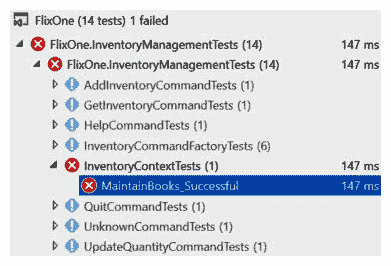
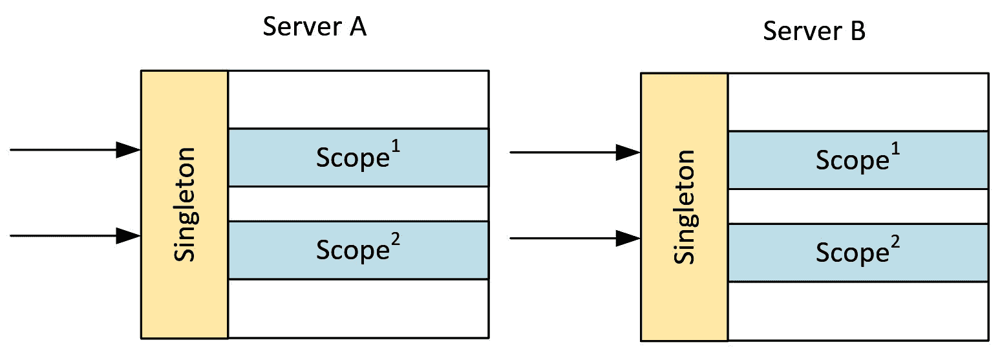

# 实现设计模式-.NET 核心

上一章通过合并其他模式继续构建 FlixOne 库存管理应用程序。使用了更多的四人组模式，包括 Singleton 和 Factory 模式。Singleton 模式用于说明用于维护 FlixOne 图书集合的存储库模式。工厂模式用于进一步探索**依赖性注入**（**DI**）。Net 核心框架用于完成初始库存管理控制台应用程序，以便于**控制反转**（**IoC**容器。

本章将继续以 inventory management console 应用程序为基础，同时还将探讨.Net Core 的功能。将使用.Net 核心框架中内置的单例服务生命周期重新访问和创建上一章中介绍的单例模式。使用框架的 DI，将显示配置模式，并使用不同的示例解释**构造函数注入（CI）**。

本章将介绍以下主题：

*   .Net 核心服务生命周期
*   实施工厂

# 技术要求

本章包含用于解释概念的各种代码示例。代码保持简单，仅用于演示目的。大多数示例都涉及用 C# 编写的.NET 核心控制台应用程序。

要运行和执行代码，您需要以下内容：

*   Visual Studio 2019（您也可以使用 Visual Studio 2017 版本 3 或更高版本运行应用程序）。
*   设置.NET 核心。
*   SQL server（本章使用的是 express edition）。

# 安装 Visual Studio

要运行这些代码示例，您需要安装 Visual Studio 2010 或更高版本。您可以使用首选的 IDE。要执行此操作，请遵循以下说明：

1.  从以下链接下载 Visual Studio:[https://docs.microsoft.com/en-us/visualstudio/install/install-visual-studio](https://docs.microsoft.com/en-us/visualstudio/install/install-visual-studio) 。
2.  按照随附的安装说明进行操作。Visual Studio 安装有多个版本。在本章中，我们将使用 Visual Studio for Windows。

# 设置.NET 内核

如果未安装.NET Core，则需要遵循以下说明：

1.  从以下链接下载.NET 核心：[https://www.microsoft.com/net/download/windows](https://www.microsoft.com/net/download/windows) 。
2.  安装说明和相关库可在以下链接中找到：[https://dotnet.microsoft.com/download/dotnet-core/2.2](https://dotnet.microsoft.com/download/dotnet-core/2.2) 。

The complete source code is available in the GitHub repository. The source code shown in the chapter might not be complete, so it is advisable to retrieve the source in order to run the examples. Please refer to [https://github.com/PacktPublishing/Hands-On-Design-Patterns-with-C-and-.NET-Core/tree/master/Chapter5.](https://github.com/PacktPublishing/Hands-On-Design-Patterns-with-C-and-.NET-Core/tree/master/Chapter5)

# .Net 核心服务生命周期

使用.NETCore 的 DI 时需要了解的一个基本概念是服务生命周期。服务生命周期定义了如何根据创建依赖项的频率来管理依赖项。作为这个过程的一个例子，可以将 DI 看作是管理依赖项容器。依赖关系只是 DI 知道的一个类，因为该类是*向其注册的*。对于.Net Core 的 DI，这是通过以下三种方法完成的`IServiceCollection`：

*   `AddTransient<TService, TImplementation>()`
*   `AddScoped<TService, TImplementation>()`
*   `AddSingleton<TService, TImplementation>()`

`IServiceCollection`接口是注册服务描述的集合，基本上包含依赖关系，以及 DI 何时应该提供依赖关系。例如，当请求`TService`时，提供`TImplementation`（即注入）。

在本节中，我们将介绍三种使用寿命，并通过单元测试对不同的使用寿命进行说明。我们还将研究如何使用实现工厂来创建依赖项的实例。

# 转瞬即逝的

`transient`依赖性意味着每当 DI 收到依赖性请求时，就会创建一个新的依赖性实例。在大多数情况下，这是最值得使用的服务生命周期，因为大多数类都应该设计为轻量级、无状态服务。在需要在引用之间持久化状态的情况下，和/或如果在实例化新实例时有相当大的工作量，那么另一个服务生命周期可能更有意义。

# 范围

在.NETCore 中，存在范围的概念，可以将其视为执行过程的上下文或边界。在某些.Net 核心实现中，作用域是隐式定义的，因此您可能不知道它是否已就位。例如，在 ASP.NETCore 中，为接收到的每个 web 请求创建一个作用域。这意味着，如果依赖项具有作用域生存期，那么每个 web 请求只会构造一次，因此，如果同一依赖项对同一 web 请求多次使用，那么它将被共享。

在本章后面，我们将显式创建一个作用域，以说明作用域的生存期，并且在单元测试中应用的概念与在 ASP.Net 核心应用程序中应用的概念相同。

# 独生子女

在.NETCore 中，实现了单例模式，因此依赖关系只实例化一次，就像上一章中实现的单例模式一样。与前一章中的 Singleton 模式类似，`singleton`类需要是线程安全的，并且只有用于创建 Singleton 类的工厂方法才能保证单个线程只调用一次。

# 回到 FlixOne

为了说明.NETCore 的 DI，我们需要对 FlixOne 库存管理应用程序进行一些修改。首先要做的是更新前面定义的`InventoryContext`类，以便不再实现 Singleton 模式（我们将使用.Net Core 的 DI 来实现这一点）：

```cs
public class InventoryContext : IInventoryContext
{
    public InventoryContext()
    {
       _books = new ConcurrentDictionary<string, Book>();
    }

    private readonly static object _lock = new object(); 

    private readonly IDictionary<string, Book> _books;

    public Book[] GetBooks()
    {
        return _books.Values.ToArray();
    }

    ...
}
```

`AddBook`和`UpdateQuantity`方法的详细信息如下代码所示：

```cs
public bool AddBook(string name)
{
    _books.Add(name, new Book {Name = name});
    return true;
}

public bool UpdateQuantity(string name, int quantity)
{
    lock (_lock)
    {
        _books[name].Quantity += quantity;
    }

    return true;
}
```

有几件事需要注意。构造函数已从受保护更改为公共。这将允许类由类之外的对象实例化。另外，请注意，静态`Instance`属性和私有静态`_instance`字段已被删除，而私有`_lock`字段仍保留。与前一章中定义的单例模式类似，这只保证类是如何实例化的；它不阻止并行访问方法。

Both the `IInventoryContext` interface and the `InventoryContext` and `Book` classes were made public, as our DI is being defined in an external project.

随后，用于返回命令的`InventoryCommandFactory`类被更新为将`InventoryContext`的实例注入其构造函数：

```cs
public class InventoryCommandFactory : IInventoryCommandFactory
{
    private readonly IUserInterface _userInterface;
    private readonly IInventoryContext _context;

    public InventoryCommandFactory(IUserInterface userInterface, IInventoryContext context)
    {
        _userInterface = userInterface;
        _context = context;
    }

    // GetCommand()
    ...
}
```

`GetCommand`方法使用提供的输入来确定特定命令：

```cs
public InventoryCommand GetCommand(string input)
{
    switch (input.ToLower())
    {
        case "q":
        case "quit":
            return new QuitCommand(_userInterface);
        case "a":
        case "addinventory":
            return new AddInventoryCommand(_userInterface, _context);
        case "g":
        case "getinventory":
            return new GetInventoryCommand(_userInterface, _context);
        case "u":
        case "updatequantity":
            return new UpdateQuantityCommand(_userInterface, _context);
        case "?":
            return new HelpCommand(_userInterface);
        default:
            return new UnknownCommand(_userInterface);
    }
}
```

如上所述，`IInventoryContext`接口现在将由客户项目中定义的 DI 容器提供。控制台应用程序现在有一个额外的行来使用`InventoryContext`类创建`IInventoryContext`接口的单例：

```cs
class Program
{
    private static void Main(string[] args)
    {
        IServiceCollection services = new ServiceCollection();
        ConfigureServices(services);
        IServiceProvider serviceProvider = services.BuildServiceProvider();

        var service = serviceProvider.GetService<ICatalogService>();
        service.Run();

        Console.WriteLine("CatalogService has completed.");
        Console.ReadLine();
    }

    private static void ConfigureServices(IServiceCollection services)
    {
        // Add application services.
        services.AddTransient<IUserInterface, ConsoleUserInterface>(); 
        services.AddTransient<ICatalogService, CatalogService>();
        services.AddTransient<IInventoryCommandFactory, InventoryCommandFactory>();

 services.AddSingleton<IInventoryContext, InventoryContext>();
    }
}
```

控制台应用程序现在可以使用与前一章中相同的手动测试运行，但是单元测试是了解使用.NETCore 的 DI 实现了什么的好方法。

The example code provided for this chapter shows the completed project. The following section concentrates on the `InventoryContext` tests. The `InventoryCommandFactory` tests were also modified, but, as the changes are trivial, they will not be covered here.

# 单元测试

随着`InventoryContext`类的更改，我们不再有方便的属性来获取该类的唯一实例。这意味着需要替换`InventoryContext.Instance`，作为第一次尝试，让我们创建一个方法来返回`InventoryContext`的新实例，并使用`GetInventoryContext()`而不是`InventoryContext.Instance`：

```cs
private IInventoryContext GetInventoryContext()
{
    return new InventoryContext();
}
```

正如所料，单元测试失败并显示错误消息：*字典*中不存在给定的密钥：



正如我们在上一章中看到的，这是因为每次创建`InventoryContext`类时，`InventoryContext`图书列表都是空的。这就是为什么我们需要使用单例创建上下文

让我们更新`GetInventoryContext()`方法，现在使用.Net Core 的 DI 提供`IInventoryContext`接口的实例：

```cs
private IInventoryContext GetInventoryContext()
{
    IServiceCollection services = new ServiceCollection();
    services.AddSingleton<IInventoryContext, InventoryContext>();
    var provider = services.BuildServiceProvider();

    return provider.GetService<IInventoryContext>();
}
```

在更新的方法中，将创建一个`ServiceCollection`类的实例，该实例将用于包含所有已注册的依赖项。当请求`IInventoryContext`依赖项时，`InventoryContext`类被注册为要提供的单例。然后生成一个`ServiceProvider`实例，该实例将根据`IServiceCollection`接口中的注册实际执行 DI。最后一步是在请求`IInventoryContext`接口时提供`InventoryContext`类

The `Microsoft.Extensions.DependencyInjection` library will need to be added to the `InventoryManagementTests` project in order to be able to reference the .Net Core DI components.

不幸的是，单元测试仍然没有通过，并导致相同的错误：*字典中没有给定的密钥。*这是因为每次请求`IInventoryContext`时，我们都在创建 DI 框架的新实例。这意味着，即使我们的依赖项是单实例，`ServiceProvider`的每个实例都将提供`InventoryContext`类的一个新实例。为了解决这个问题，我们将在测试首次启动时创建`IServiceCollection`，然后在测试期间使用相同的引用：

```cs
ServiceProvider Services { get; set; }

[TestInitialize]
public void Startup()
{
    IServiceCollection services = new ServiceCollection();
    services.AddSingleton<IInventoryContext, InventoryContext>();
    Services = services.BuildServiceProvider();
}
```

Using the `TestInitialize` attribute is a great way to separate the functionality required by multiple `TestMethod` tests within a `TestClass` class. The method will be run before every test is run.

现在有了对同一`ServiceProvider`实例的引用，我们可以更新以检索依赖关系。以下说明了`AddBook()`方法是如何更新的：

```cs
public Task AddBook(string book)
{
    return Task.Run(() =>
    {
        Assert.IsTrue(Services.GetService<IInventoryContext>().AddBook(book));
    });
}
```

我们的单元测试现在成功通过，因为在测试执行期间只创建了一个`InventoryContext`类实例：


如本节所示，使用内置 DI 相对容易实现单例模式。理解何时使用模式是一个重要的概念。下一节将更详细地探讨范围的概念，以便进一步了解服务生命周期。

# 范围

在同时执行多个进程的应用程序中，了解服务生命周期对于功能性和非功能性需求都非常重要。如前一个单元测试所示，如果没有正确的使用寿命，`InventoryContext`没有按预期运行，并导致无效情况。同样，服务生命周期的不正确使用可能导致应用程序无法很好地扩展。通常，在多进程解决方案中应避免使用锁和共享状态。

为了说明这个概念，假设 FlixOne 库存管理应用程序提供给多个工作人员。现在的挑战是如何跨多个应用程序执行锁定，以及如何拥有单个收集状态。按照我们的说法，这将是一个由多个应用程序共享的`InventoryContext`类。当然，在这方面，将我们的解决方案更改为使用共享存储库（例如，数据库）和/或将我们的解决方案更改为 web 应用程序是有意义的。我们将在后面的章节中介绍数据库和 web 应用程序模式，但是，在讨论服务生命周期时，现在，从 web 应用程序的角度更详细地描述这些是有意义的。

下图描述了一个 web 应用程序接收两个请求：


就服务生命周期而言，两个请求都可以使用单例服务生命周期，而每个请求都会收到自己的作用域生命周期。重要的是要注意垃圾收集。一旦对象不再被引用，使用临时服务生命周期创建的依赖项将被标记为释放，而使用范围服务生命周期创建的依赖项在 web 请求完成之前不会被标记为释放。而且，使用单例服务生命周期创建的依赖项在应用程序结束之前不会被标记为释放。

此外，如下图所示，重要的是要记住，.Net Core 中的依赖项不会在 web garden 或 web 场中的服务器实例之间共享：



在下面的章节中，将展示共享状态的不同方法，包括使用共享缓存、数据库和其他形式的存储库

# 实施工厂

Net 核心 DI 支持在注册依赖项时指定*实现工厂*的功能。这允许控制所提供服务提供的依赖项的创建。这是在使用`IServiceCollection`接口的以下扩展进行注册时完成的：

```cs
public static IServiceCollection AddSingleton<TService, TImplementation>(this IServiceCollection services,     Func<IServiceProvider, TImplementation> implementationFactory)
                where TService : class
                where TImplementation : class, TService;
```

`AddSingleton`扩展既接收要注册的类，也接收需要依赖项时要提供的类。值得注意的一件有趣的事情是.Net 核心 DI 框架将维护注册的服务，并在请求时交付实现，或者作为实例化其中一个依赖项的一部分。此自动实例化称为**构造函数注入**（**CI**。我们将在以下章节中看到这两个方面的示例。

# 投资环境

作为一个例子，让我们重新访问用于管理书籍库存的`InventoryContext`类，方法是分离对我们的书籍集合执行的读操作和写操作。`IInventoryContext`分为`IInventoryReadContext`和`IInventoryWriteContext`：

```cs
using FlixOne.InventoryManagement.Models;

namespace FlixOne.InventoryManagement.Repository
{
    public interface IInventoryContext : IInventoryReadContext, IInventoryWriteContext { }

    public interface IInventoryReadContext
    {
        Book[] GetBooks();
    }

    public interface IInventoryWriteContext
    {
        bool AddBook(string name);
        bool UpdateQuantity(string name, int quantity);
    }
}
```

# IInventoryReadContext

`IInventoryReadContext`界面包含读取书籍的操作，`IInventoryWriteContext`包含修改书籍集合的操作。最初的`IInventoryContext`接口是为方便类同时需要两种依赖类型而创建的。

In later chapters, we will cover patterns that take advantage of splitting the context, including the **Command and** **Query Responsibility Segregation** (**CQRS**) pattern.

使用此重构，需要进行一些更改。第一个只需要阅读书籍集的类，其构造函数会使用`IInventoryReadContext`接口进行更新，如`GetInventoryCommand`类所示：

```cs
internal class GetInventoryCommand : NonTerminatingCommand
{
    private readonly IInventoryReadContext _context;
    internal GetInventoryCommand(IUserInterface userInterface, IInventoryReadContext context) : base(userInterface)
    {
        _context = context;
    }

    protected override bool InternalCommand()
    {
        foreach (var book in _context.GetBooks())
        {
            Interface.WriteMessage($"{book.Name,-30}\tQuantity:{book.Quantity}"); 
        }

        return true;
    }
}
```

# IInventoryWriteContext

同样，需要修改图书集合的类也会更新到`IInventoryWriteContext`界面，如`AddInventoryCommand`所示：

```cs
internal class AddInventoryCommand : NonTerminatingCommand, IParameterisedCommand
{
    private readonly IInventoryWriteContext _context;

    internal AddInventoryCommand(IUserInterface userInterface, IInventoryWriteContext context) : base(userInterface)
    {
        _context = context;
    }

    public string InventoryName { get; private set; }

    ...
}
```

以下是`GetParameters`和`InternalCommand`方法的详细说明：

```cs
/// <summary>
/// AddInventoryCommand requires name
/// </summary>
/// <returns></returns>
public bool GetParameters()
{
    if (string.IsNullOrWhiteSpace(InventoryName))
        InventoryName = GetParameter("name");
    return !string.IsNullOrWhiteSpace(InventoryName);
}

protected override bool InternalCommand()
{
    return _context.AddBook(InventoryName); 
}
```

请注意`InternalCommand`方法，在该方法中，该书被添加到库存中，并在`InventoryName`参数中保留该书的给定名称。

接下来，我们将查看工厂中的 inventory 命令。

# 目录命令工厂

`InventoryCommandFactory`类是使用.Net 类实现的工厂模式，需要阅读和写入以下书籍：

```cs
public class InventoryCommandFactory : IInventoryCommandFactory
{
    private readonly IUserInterface _userInterface;
    private readonly IInventoryContext _context; 

    public InventoryCommandFactory(IUserInterface userInterface, IInventoryContext context)
    {
        _userInterface = userInterface;
        _context = context; 
    }

    public InventoryCommand GetCommand(string input)
    {
        switch (input.ToLower())
        {
            case "q":
            case "quit":
                return new QuitCommand(_userInterface);
            case "a":
            case "addinventory":
                return new AddInventoryCommand(_userInterface, _context);
            case "g":
            case "getinventory":
                return new GetInventoryCommand(_userInterface, _context);
            case "u":
            case "updatequantity":
                return new UpdateQuantityCommand(_userInterface, _context);
            case "?":
                return new HelpCommand(_userInterface);
            default:
                return new UnknownCommand(_userInterface);
        }
    }
}
```

需要注意的一件有趣的事情是，该类实际上不需要修改上一章的版本，因为多态性处理从`IInventoryContext`到`IInventoryReadContext`和`IInventoryWriteContext`接口的转换。

通过这些更改，我们需要更改与`InventoryContext`相关的依赖项的注册，以便使用实现工厂：

```cs
private static void ConfigureServices(IServiceCollection services)
{
    // Add application services.
    ...            

    var context = new InventoryContext();
 services.AddSingleton<IInventoryReadContext, InventoryContext>(p => context);
 services.AddSingleton<IInventoryWriteContext, InventoryContext>(p => context);
 services.AddSingleton<IInventoryContext, InventoryContext>(p => context);
}
```

对于所有三个接口，将使用相同的`InventoryContext`实例，并使用实现工厂扩展实例化一次。这是在请求`IInventoryReadContext`、`IInventoryWriteContext`或`IInventoryContext`依赖项时提供的

# 目录命令

`InventoryCommandFactory`有助于说明如何使用.Net 实现工厂模式，但现在我们使用的是.Net 核心框架，让我们重新讨论一下这一点。我们的要求是给定一个字符串值；我们想要返回`InventoryCommand`的一个特定实现。这可以通过几种方式实现，本节将给出三个示例：

*   使用函数实现工厂
*   使用服务
*   使用第三方容器

# 使用函数实现工厂

`GetService()`方法的实现工厂可以用来确定要返回的`InventoryCommand`类的类型。对于本例，`InventoryCommand`类中创建了一个新的静态方法：

```cs
public static Func<IServiceProvider, Func<string, InventoryCommand>> GetInventoryCommand => 
                                                                            provider => input =>
{
    switch (input.ToLower())
    {
        case "q":
        case "quit":
            return new QuitCommand(provider.GetService<IUserInterface>());
        case "a":
        case "addinventory":
            return new AddInventoryCommand(provider.GetService<IUserInterface>(), provider.GetService<IInventoryWriteContext>());
        case "g":
        case "getinventory":
            return new GetInventoryCommand(provider.GetService<IUserInterface>(), provider.GetService<IInventoryReadContext>());
        case "u":
        case "updatequantity":
            return new UpdateQuantityCommand(provider.GetService<IUserInterface>(), provider.GetService<IInventoryWriteContext>());
        case "?":
            return new HelpCommand(provider.GetService<IUserInterface>());
        default:
            return new UnknownCommand(provider.GetService<IUserInterface>());
    }
};
```

如果您不熟悉 lambda 表达式体，那么阅读这篇文章有点困难，因此我们将详细解释代码。首先，让我们回顾一下`AddSingleton`的语法：

```cs
public static IServiceCollection AddSingleton<TService, TImplementation>(this IServiceCollection services, Func<IServiceProvider, TImplementation> implementationFactory)
            where TService : class
            where TImplementation : class, TService;
```

这表明`AddSingleton`扩展的参数是一个函数：

```cs
Func<IServiceProvider, TImplementation> implementationFactory
```

这意味着以下代码是等效的：

```cs
services.AddSingleton<IInventoryContext, InventoryContext>(provider => new InventoryContext());

services.AddSingleton<IInventoryContext, InventoryContext>(GetInventoryContext);
```

`GetInventoryContext`方法定义如下：

```cs
static Func<IServiceProvider, InventoryContext> GetInventoryContext => provider =>
{
    return new InventoryContext();
};
```

在我们的特定示例中，特定的`InventoryCommand`类型被标记为`FlixOne.InventoryManagement`项目的内部，因此`FlixOne.InventoryManagementClient`项目无法直接访问它们。这就是为什么在返回以下类型的`FlixOne.InventoryManagement.InventoryCommand`类中创建了一个新的静态方法：

```cs
Func<IServiceProvider, Func<string, InventoryCommand>>
```

这意味着，当请求服务时，将提供一个字符串来确定特定类型。由于依赖关系已更改，这意味着`CatalogService`构造函数需要更新：

```cs
public CatalogService(IUserInterface userInterface, Func<string, InventoryCommand> commandFactory)
{
    _userInterface = userInterface;
    _commandFactory = commandFactory;
}
```

当请求服务时，将提供一个字符串来确定特定的服务。由于依赖关系已更改，`CatalogueService`构造函数需要更新：

现在，当用户输入的字符串提供给`CommandFactory`依赖项时，将提供正确的命令：

```cs
while (!response.shouldQuit)
{
    // look at this mistake with the ToLower()
    var input = _userInterface.ReadValue("> ").ToLower();
    var command = _commandFactory(input);

    response = command.RunCommand();

    if (!response.wasSuccessful)
    {
        _userInterface.WriteMessage("Enter ? to view options.");
    }
}
```

与命令工厂相关的单元测试也已更新。作为比较，在现有的`InventoryCommandFactoryTests`类的基础上创建了一个新的`test`类，并命名为`InventoryCommandFunctionTests`。以下代码显示了初始化步骤，并突出显示了更改：

```cs
ServiceProvider Services { get; set; }

[TestInitialize]
public void Startup()
{
    var expectedInterface = new Helpers.TestUserInterface(
        new List<Tuple<string, string>>(),
        new List<string>(),
        new List<string>()
    );

    IServiceCollection services = new ServiceCollection();
    services.AddSingleton<IInventoryContext, InventoryContext>();
 services.AddTransient<Func<string, InventoryCommand>>(InventoryCommand.GetInventoryCommand);

    Services = services.BuildServiceProvider();
}
```

个别测试也被更新，以提供字符串作为 get 服务调用的一部分，如以下代码中的`QuitCommand`所示：

```cs
[TestMethod]
public void QuitCommand_Successful()
{
    Assert.IsInstanceOfType(Services.GetService<Func<string, InventoryCommand>>().Invoke("q"),             
                            typeof(QuitCommand), 
                            "q should be QuitCommand");

    Assert.IsInstanceOfType(Services.GetService<Func<string, InventoryCommand>>().Invoke("quit"),
                            typeof(QuitCommand), 
                            "quit should be QuitCommand");
}
```

这两个测试验证返回的服务是`QuitCommand`类型的，当服务提供者被给予`"q"`或`"quit"`时。

# 使用服务

`ServiceProvider`类提供了一个`Services`方法，当为同一类型注册了多个依赖项时，该方法可用于确定适当的服务。这个例子将对`InventoryCommands`采取不同的策略，并且，由于重构的程度，这将通过创建新类来完成，这些新类只是为了说明这种方法。

在单元测试项目中，创建了一个新文件夹`ImplementationFactoryTests`，用于包含该部分的类。在文件夹中，为`InventoryCommand`创建了一个新的基类：

```cs
public abstract class InventoryCommand
{
    protected abstract string[] CommandStrings { get; }
    public virtual bool IsCommandFor(string input)
    {
        return CommandStrings.Contains(input.ToLower());
    } 
}
```

这个新类背后的概念是子类将定义它们响应的字符串。例如，`QuitCommand`将响应`"q"`和`"quit"`字符串：

```cs
public class QuitCommand : InventoryCommand
{
    protected override string[] CommandStrings => new[] { "q", "quit" };
}
```

下面显示了采用类似方法的`GetInventoryCommand`、`AddInventoryCommand`、`UpdateQuantityCommand`和`HelpCommand`类：

```cs
public class GetInventoryCommand : InventoryCommand
{
    protected override string[] CommandStrings => new[] { "g", "getinventory" };
}

public class AddInventoryCommand : InventoryCommand
{
    protected override string[] CommandStrings => new[] { "a", "addinventory" };
}

public class UpdateQuantityCommand : InventoryCommand
{
    protected override string[] CommandStrings => new[] { "u", "updatequantity" };
}

public class HelpCommand : InventoryCommand
{
    protected override string[] CommandStrings => new[] { "?" };
}
```

不过，`UnknownCommand`类将用作默认值，因此它将通过重写`IsCommandFor`方法始终计算为 true：

```cs
public class UnknownCommand : InventoryCommand
{
    protected override string[] CommandStrings => new string[0];

    public override bool IsCommandFor(string input)
    {
        return true;
    }
}
```

由于`UnknownCommand`类被视为默认类，所以注册顺序很重要，在单元`test`类初始化中如下所示：

```cs
[TestInitialize]
public void Startup()
{
    var expectedInterface = new Helpers.TestUserInterface(
        new List<Tuple<string, string>>(),
        new List<string>(),
        new List<string>()
    );

    IServiceCollection services = new ServiceCollection(); 
    services.AddTransient<InventoryCommand, QuitCommand>();
    services.AddTransient<InventoryCommand, HelpCommand>(); 
    services.AddTransient<InventoryCommand, AddInventoryCommand>();
    services.AddTransient<InventoryCommand, GetInventoryCommand>();
    services.AddTransient<InventoryCommand, UpdateQuantityCommand>();
    // UnknownCommand should be the last registered
 services.AddTransient<InventoryCommand, UnknownCommand>();

    Services = services.BuildServiceProvider();
}
```

为方便起见，创建了一个新方法，以便在给定匹配的输入字符串时返回`InventoryCommand`类的实例：

```cs
public InventoryCommand GetCommand(string input)
{
    return Services.GetServices<InventoryCommand>().First(svc => svc.IsCommandFor(input));
}
```

此方法将遍历为`InventoryCommand`服务注册的依赖项集合，直到使用`IsCommandFor()`方法找到匹配项为止。

然后单元测试使用`GetCommand()`方法确定依赖关系，如下所示`UpdateQuantityCommand`：

```cs
[TestMethod]
public void UpdateQuantityCommand_Successful()
{
    Assert.IsInstanceOfType(GetCommand("u"), 
                            typeof(UpdateQuantityCommand), 
                            "u should be UpdateQuantityCommand");

    Assert.IsInstanceOfType(GetCommand("updatequantity"), 
                            typeof(UpdateQuantityCommand), 
                            "updatequantity should be UpdateQuantityCommand");

    Assert.IsInstanceOfType(GetCommand("UpdaTEQuantity"), 
                            typeof(UpdateQuantityCommand), 
                            "UpdaTEQuantity should be UpdateQuantityCommand");
}
```

# 使用第三方容器

Net 核心框架提供了极大的灵活性和功能性，但有些功能可能不受支持，第三方容器可能是更合适的选择。幸运的是.NETCore 是可扩展的，允许用第三方容器替换内置服务容器。为了提供一个示例，我们将使用`Autofac`作为.Net 核心 DI 的 IoC 容器

`Autofac` has a ton of great features, and is shown here as an example; but of course, there are other IoC containers that could have been used. For example, Castle Windsor and Unit are great alternatives that should also be considered.

第一步是将所需的`Autofac`包添加到项目中。使用包管理器控制台，使用以下命令添加包（仅在测试项目上需要）：

```cs
install-package autofac
```

此示例将再次通过使用命名已注册依赖项的`Autofac`特性来支持我们的`InventoryCommand`工厂。这些命名的依赖项将用于根据提供的输入检索正确的`InventoryCommand`实例

与前面的示例类似，依赖项的注册将在`TestInitialize`方法中完成。注册将根据用于确定命令的命令命名。下面显示了创建将构建`Container`实例的`ContainerBuilder`对象的`Startup`方法结构：

```cs
[TestInitialize]
public void Startup()
{
    IServiceCollection services = new ServiceCollection();

    var builder = new ContainerBuilder(); 

    // commands
    ...

    Container = builder.Build(); 
}
```

命令的注册方式如下：

```cs
// commands
builder.RegisterType<QuitCommand>().Named<InventoryCommand>("q");
builder.RegisterType<QuitCommand>().Named<InventoryCommand>("quit");
builder.RegisterType<UpdateQuantityCommand>().Named<InventoryCommand>("u");
builder.RegisterType<UpdateQuantityCommand>().Named<InventoryCommand>("updatequantity");
builder.RegisterType<HelpCommand>().Named<InventoryCommand>("?");
builder.RegisterType<AddInventoryCommand>().Named<InventoryCommand>("a");
builder.RegisterType<AddInventoryCommand>().Named<InventoryCommand>("addinventory");
builder.RegisterType<GetInventoryCommand>().Named<InventoryCommand>("g");
builder.RegisterType<GetInventoryCommand>().Named<InventoryCommand>("getinventory");
builder.RegisterType<UpdateQuantityCommand>().Named<InventoryCommand>("u");
builder.RegisterType<UpdateQuantityCommand>().Named<InventoryCommand>("u");
builder.RegisterType<UnknownCommand>().As<InventoryCommand>();
```

与前面的示例不同，生成的容器是`Autofac.IContainer`的实例。这将用于检索每个已注册的依赖项。例如，`QuitCommand`将同时命名为`"q"`和`"quit"`，这表示可用于执行该命令的两个命令。另外，请注意，最后注册的类型未命名，属于`UnknownCommand`。如果未按名称找到任何命令，则这将作为默认值。

要确定依赖项，将使用新方法按名称检索依赖项：

```cs
public InventoryCommand GetCommand(string input)
{
    return Container.ResolveOptionalNamed<InventoryCommand>(input.ToLower()) ?? 
           Container.Resolve<InventoryCommand>();
}
```

`Autofac.IContainer`接口有一个`ResolveOptionalNamed<*T*>(*string*)`方法名，如果没有找到匹配的注册，它将返回具有给定名称的依赖项，或者返回 null。如果依赖项没有使用给定的名称注册，那么将返回`UnknownCommand`类的实例。这是通过使用空合并操作`??`和`IContainer.Resolve<*T*>`方法完成的。

`Autofac.IContainer.ResolveNamed<*T*>(*string*)` will throw a `ComponentNotRegisteredException` exception if the dependency resolution fails.

为每个命令编写测试方法，以确保正确解析命令。同样，以`QuitCommand`为例，我们可以看到以下内容：

```cs
[TestMethod]
public void QuitCommand_Successful()
{
    Assert.IsInstanceOfType(GetCommand("q"), typeof(QuitCommand), "q should be QuitCommand");
    Assert.IsInstanceOfType(GetCommand("quit"), typeof(QuitCommand), "quit should be QuitCommand");
}
```

其他`InventoryCommand`示例请查看源代码中的`InventoryCommandAutofacTests`类。

# 总结

本章的目标是更详细地探讨.Net 核心框架，尤其是.Net 核心 DI。支持三种类型的服务生命周期：瞬态、作用域和单例。临时服务将为每个请求创建已注册依赖项的新实例。作用域服务将使用定义的作用域生成一次，而单例服务将在 DI 服务集合的生命周期内执行一次

由于.Net 核心 DI 对于自信地构建.Net 核心应用程序至关重要，因此了解其功能及其局限性非常重要。有效地使用 DI 以及避免重复已经提供的功能非常重要。同样重要的是，如果用第三方 DI 框架替换基本的.Net Core DI 框架可能对应用程序有益，那么了解.Net Core DI 框架的限制以及其他 DI 框架的优势也是明智的。

下一章将在前几章的基础上，探讨.Net 核心 ASP.Net web 应用程序中的常见模式

# 问题

以下问题将使您能够整合本章中包含的信息：

1.  如果您不确定要使用哪种类型的服务生命周期，那么最好将类注册为哪种类型？为什么？
2.  在.Net 核心 ASP.Net 解决方案中，作用域是按 web 请求定义的，还是按会话定义的？
3.  在.Net Core DI framework 中将类注册为单例是否会使其线程安全？
4.  Net 核心 DI 框架是否真的只能被其他 Microsoft 提供的 DI 框架所取代？