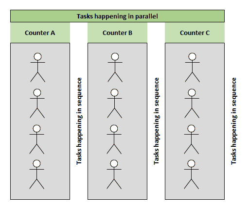
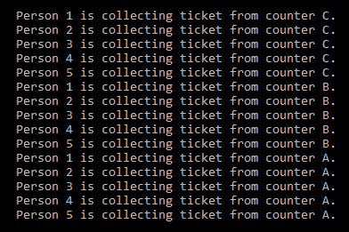
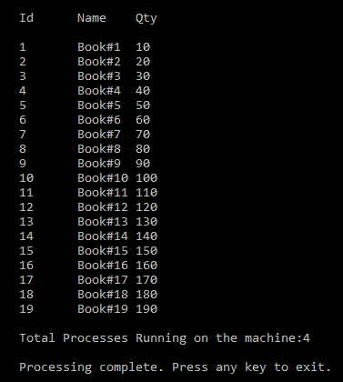

# 八、.NETCore 中的并发编程

在上一章（[第 7 章](07.html)、*实现 Web 应用的设计模式——第 2 部分*）中，我们借助各种 Web 模式创建了一个示例 Web 应用。我们调整了授权和身份验证机制以保护 web 应用，并讨论了**测试驱动开发**（**TDD**），以确保我们的代码已经过测试并正常工作。

本章将讨论在.NETCore 中执行并发编程时应采用的最佳实践。在本章接下来的部分中，我们将学习与 C# 和.NETCore 应用中组织良好的并发相关的设计模式。

本章将介绍以下主题：

*   异步/等待–为什么阻塞不好？
*   多线程和异步编程
*   并发集合
*   模式和实践–TDD 和并行 LINQ

# 技术要求

本章包含各种代码示例来解释这些概念。代码保持简单，仅用于演示目的。大多数示例都涉及用 C# 编写的.NETCore 控制台应用。

The complete source code is available at the following link: [https://github.com/PacktPublishing/Hands-On-Design-Patterns-with-C-and-.NET-Core/tree/master/Chapter8](https://github.com/PacktPublishing/Hands-On-Design-Patterns-with-C-and-.NET-Core/tree/master/Chapter8).

要运行和执行代码，您需要以下内容：

*   Visual Studio 2019（您也可以使用 Visual Studio 2017）
*   设置.NETCore
*   SQL Server（本章使用快速版）

# 安装 Visual Studio

要运行代码示例，您需要安装 VisualStudio（首选 IDE）。为此，您可以按照以下说明进行操作：

1.  从安装说明中提到的下载链接下载 Visual Studio：[https://docs.microsoft.com/en-us/visualstudio/install/install-visual-studio](https://docs.microsoft.com/en-us/visualstudio/install/install-visual-studio) 。
2.  按照上面提到的安装说明操作。
3.  有多个选项可用于 Visual Studio 安装。这里，我们使用的是 Visual Studio for Windows。

# 设置.NETCore

如果未安装.NET Core，则需要遵循以下说明：

1.  在[下载.NET Core for Windowshttps://www.microsoft.com/net/download/windows](https://www.microsoft.com/net/download/windows) 。
2.  有关多个版本和相关库，请访问[https://dotnet.microsoft.com/download/dotnet-core/2.2](https://dotnet.microsoft.com/download/dotnet-core/2.2) 。

# 安装 SQL Server

如果未安装 SQL Server，则可以按照以下说明操作：

1.  从以下链接下载 SQL Server:[https://www.microsoft.com/en-in/download/details.aspx?id=1695](https://www.microsoft.com/en-in/download/details.aspx?id=1695) 。
2.  您可以在此处找到安装说明：[https://docs.microsoft.com/en-us/sql/ssms/download-sql-server-management-studio-ssms?view=sql-服务器-2017](https://docs.microsoft.com/en-us/sql/ssms/download-sql-server-management-studio-ssms?view=sql-server-2017)。

For troubleshooting and for more information, refer to the following link: [https://www.blackbaud.com/files/support/infinityinstaller/content/installermaster/tkinstallsqlserver2008r2.htm](https://www.blackbaud.com/files/support/infinityinstaller/content/installermaster/tkinstallsqlserver2008r2.htm).

# 现实世界中的并发

**并发**是我们生活的一部分：它存在于现实世界中。当我们讨论并发时，我们指的是多任务处理。

在现实世界中，我们中的许多人经常执行多重任务。例如，我们可以一边打手机一边写程序，一边吃晚饭一边看电影，一边读笔记一边唱歌。有很多例子可以说明我们人类是如何进行多任务处理的。不需要太多的科学细节，我们可以看到我们的大脑试图抓住新的事物，同时也可以指挥身体的其他器官工作，例如心脏或我们的嗅觉，作为一种多任务处理的形式

同样的方法也适用于我们的系统（计算机）。如果我们想想今天的计算机，每台可用的计算机都有一个多核（不止一个核）的 CPU。这是为了允许同时执行多个指令，并让我们同时执行多个任务。

真正的并行性在单 CPU 机器上是不可能的，因为任务是不可切换的，因为 CPU 只有一个内核。这仅在具有多个 CPU（多核）的机器上才可能实现。简单来说，并发编程涉及两件事：

*   **任务管理**：管理/分配工作单元到可用线程。
*   **通信**：设置任务的初始参数并获取结果。

Whenever things/tasks are happening at the same time, we call this *concurrency*. In our programming language, whenever any parts of our program run at the same time, this is called concurrent programming. You can also use **parallel programming** as a synonym for concurrent programming.

举个例子，想象一个大型会议，你需要一张票才能进入一个特定的会议大厅。在会议大厅门口，你必须买票，用现金或信用卡付款。在您付款时，柜台助理可以将您的详细信息输入系统，打印发票，并向您提供票据。现在考虑有更多的人想要买票。每个人都必须执行从售票处取票所需的活动。在这种情况下，一个柜台一次只能接待一个人，其余的人等待轮到他们。假设一个人从柜台取票需要两分钟；因此，下一个人需要等待两分钟轮到他们。考虑排队的最后一个人，如果它是一个 50 人的队列。这里的情况可以改变。如果还有两个售票处，而每个售票处都在两分钟内完成任务，这意味着每两分钟就有三个人可以领取三张票，或者每两分钟就有三个售票处销售两张票。换句话说，每个售票处在同一时间点执行相同的任务（即售票）。这意味着所有柜台都是并行服务的；因此，它们是并发的。下图对此进行了描述：



在上图中，可以清楚地看到，队列中的每个人要么处于等待位置，要么在柜台处处于活动状态，并且有三个队列，其中任务按顺序发生。所有三个计数器（`CounterA`、`CounterB`和`CounterC`在同一时间点执行任务，它们并行执行活动。

**Concurrency** is when two or more tasks start, run, and complete in overlapping time periods.
**Parallelism** is when two or more tasks run at the same time.

这些都是并发活动，但请考虑一个场景，其中有大量的人在队列中（例如，10000 人）；在这里执行并行是没有用的，因为这无法解决此操作中可能出现的瓶颈问题。另一方面，您可以将计数器的数量增加到 50 个。他们能解决这个问题吗？当我们使用任何软件时，都会出现这种问题。这是一个与阻塞相关的问题。在接下来的部分中，我们将更详细地讨论并发编程。

# 多线程和异步编程

简单地说，我们可以说多线程意味着一个程序在多个线程上并行运行。在异步编程中，工作单元与主应用线程分开运行，它告诉调用线程任务已完成、失败或正在进行。围绕异步编程需要考虑的有趣问题是，当我们使用它时，它的好处是什么。

The potential for more than one thread to access the same shared data and update it with unpredictable results can be referred to as a **race condition**. We have already discussed race condition in [Chapter 4](04.html), *Implementing Design Patterns - Basics Part 2*.

考虑一下我们在上一节讨论的场景，其中队列中的人正在收集他们的票。让我们尝试在多线程程序中捕获此场景：

```cs
internal class TicketCounter
{
    public static void CounterA() => Console.WriteLine("Person A is collecting ticket from Counter A");
    public static void CounterB() => Console.WriteLine("Person B is collecting ticket from Counter B");
    public static void CounterC() => Console.WriteLine("Person C is collecting ticket from Counter C");
}
```

在这里，我们有一个`TicketCounter`类，它代表我们的整个票务收集柜台（我们在上一节中讨论了这些）。`CounterA()`、`CounterB()`、`CounterC()`三种方式代表一个单独的取票柜台。这些方法只是将消息写入控制台，如下代码所示：

```cs
internal class Program
{
    private static void Main(string[] args)
    {
        var counterA = new Thread(TicketCounter.CounterA);
        var counterB = new Thread(TicketCounter.CounterB);
        var counterC = new Thread(TicketCounter.CounterC);
        Console.WriteLine("3-counters are serving...");
        counterA.Start();
        counterB.Start();
        counterC.Start();
        Console.WriteLine("Next person from row");
        Console.ReadLine();
    }
}
```

前面的代码是我们的`Program`类，它从`Main`方法中启动活动。在这里，我们为所有计数器声明并启动了三个线程。请注意，我们已按顺序/顺序启动这些线程。由于我们预计这些线程将以相同的顺序执行，让我们运行程序并查看输出，如以下屏幕截图所示：


前面的程序没有按照代码中给定的顺序执行。根据我们的代码，执行顺序应如下所示：

```cs
3-counters are serving...
Next person from row
Person A is collecting ticket from Counter A
Person B is collecting ticket from Counter B
Person C is collecting ticket from Counter C
```

这是由于线程造成的，这些线程同时工作，而不保证它们应该按照声明/启动它们的顺序/顺序执行

再次运行程序，查看是否得到相同的输出：


前面的快照显示的输出与前面的结果不同，因此现在我们按顺序/顺序显示输出：

```cs
3-counters are serving...
Person A is collecting ticket from Counter A
Person B is collecting ticket from Counter B
Next person from row
Person C is collecting ticket from Counter C
```

因此，线程正在工作，但不是按照我们定义的顺序。

You can set the priorities of threads like this: `counterC.Priority = ThreadPriority.Highest;`, `counterB.Priority = ThreadPriority.Normal;`, and `counterA.Priority = ThreadPriority.Lowest;`.

为了以同步方式运行线程，让我们修改代码如下：

```cs
internal class SynchronizedTicketCounter
{
    public void ShowMessage()
    {
        int personsInQueue = 5; //assume maximum persons in queue
 lock (this)
        {
            Thread thread = Thread.CurrentThread;
            for (int personCount = 0; personCount < personsInQueue; personCount++)
            {
                Console.WriteLine($"\tPerson {personCount + 1} is collecting ticket from counter {thread.Name}.");
            }
        }
    }
}
```

我们用`ShowMessage()`方法创建了一个新的`SynchronizedTicketCounter`类；请注意前面代码中的`lock(this){...}`。运行程序并检查输出：


现在我们的计数器以正确的顺序提供服务，我们得到了预期的输出。

# 异步/等待–为什么阻塞不好？

异步编程在我们期望在同一时间点进行各种活动的情况下非常有用。使用`async`关键字，我们将方法/操作定义为异步。考虑下面的代码片段：

```cs
internal class AsyncAwait
{
    public async Task ShowMessage()
    {
        Console.WriteLine("\tServing messages!");
        await Task.Delay(1000);
    }
}
```

在这里，我们有一个`AsyncAwait`类和一个`async`方法`ShowMessage()`。此方法只是打印一条将显示在控制台窗口中的消息。现在，每当我们在另一个代码中调用/使用该方法时，该部分代码都可以等待/保持/阻止该操作，直到`ShowMessage()`方法执行并完成其任务。请参阅以下快照：


我们之前的屏幕截图说我们已经为`ShowMessage()`方法设置了 1000 毫秒的延迟。在这里，我们指示程序在 1000 毫秒后完成。如果我们试图从之前的代码中删除`await`，Visual Studio 会立即发出警告，将`await`放回；请参见以下快照：


在`await`操作符的帮助下，我们正在使用非阻塞 API 调用。运行程序并查看以下输出：


我们将获得前面快照中显示的输出。

# 并发集合

NETCore 框架提供了多种集合，我们可以使用这些集合进行 LINQ 查询。作为开发人员，在寻找线程安全的集合时，选项要少得多。如果没有线程安全的集合，当开发人员必须执行多个操作时，他们可能会变得很困难。在这种情况下，我们将满足我们在[第 4 章](04.html)、*实现设计模式-基础第 2 部分*中已经讨论过的竞争条件。为了克服这种情况，我们需要使用`lock`语句，正如我们在上一节中使用的那样。例如，我们可以编写一个`lock`语句的简化实现代码，参考下面的代码片段，其中我们使用了`lock`语句和集合类`Dictionary`：

```cs
public bool UpdateQuantity(string name, int quantity)
{
    lock (_lock)
    {
        _books[name].Quantity += quantity;
    }

    return true;
}
```

前面的代码来自`InventoryContext`；在这段代码中，我们阻止其他线程锁定我们试图更新数量的操作。

The main drawback of the `Dictionary` collection class is that it is not thread-safe. We have to use this in the `lock` statement while we're using `Dictionary` with multiple threads. To make our code thread-safe, we can use the `ConcurrentDictionary` collection class.

`ConcurrentDictionary`是线程安全的集合类，存储键值对。此类具有`lock`语句的实现，并提供线程安全类。考虑下面的代码：

```cs
private readonly IDictionary<string, Book> _books;
protected InventoryContext()
{
    _books = new ConcurrentDictionary<string, Book>();
}
```

前面的代码片段来自 FlixOne 控制台应用的`InventoryContext`类。在这段代码中，我们有`_books`字段，它被初始化为`ConcurrentDictionary`集合类。

当我们在多线程中使用`InventoryContext`类的`UpdateQuantity()`方法时，有可能一个线程添加数量，而另一个线程将数量重置为其初始级别。发生这种情况是因为我们的对象来自单个集合，并且一个线程中对集合的任何更改对其他线程都不可见。所有线程都引用原始的未修改集合，简单地说，我们的方法不是线程安全的，除非我们使用`lock`语句或`ConcurretDictionary`集合类。

# 模式和实践–TDD 和并行 LINQ

当我们使用多线程时，我们应该遵循最佳实践来编写**平滑的代码**。平滑的代码是开发人员不会面临死锁的地方。换句话说，多线程在编写过程中需要非常小心

While multiple threads are running in a class/program, deadlock occurs when each thread approaches the object or resource written under a `lock` statement. The actual deadlock occurs when each thread approaches to lock an object/resource that is already locked by another thread.

一个小错误可能会导致开发人员不得不处理由于线程被阻塞而出现的未知错误。除此之外，代码中几个字的错误实现可能会影响 100 行代码

让我们回到我们在本章开头讨论的会议票示例。如果售票处无法发挥作用并分发车票，会发生什么情况？在这种情况下，每个人都会试图到达售票处并获得一张票，这可能会堵塞售票处。这可能会导致售票柜台堵塞。同样的逻辑也适用于我们的程序。我们会遇到死锁情况，在这种情况下，多个线程会试图锁定我们的对象/资源。避免这种情况的最佳实践是使用同步对象/资源访问的机制。NETCore 框架提供了一个`Monitor`类来实现这一点。我已经重写了我们的旧代码，以避免出现死锁情况。请参阅以下代码：

```cs
private static void ProcessTickets()
{
    var ticketCounter = new TicketCounter();
    var counterA = new Thread(ticketCounter.ShowMessage);
    var counterB = new Thread(ticketCounter.ShowMessage);
    var counterC = new Thread(ticketCounter.ShowMessage);
    counterA.Name = "A";
    counterB.Name = "B";
    counterC.Name = "C";
    counterA.Start();
    counterB.Start();
    counterC.Start();
}
```

这里，我们有`ProcessTicket`方法；它启动三个线程（每个线程代表每个票证计数器）。每一条线都到达了`TicketCounter`类的`ShowMessage`。如果我们的`ShowMessage`方法没有编写好来处理这种情况，就会出现死锁问题。所有三个线程都将尝试获取与`ShowMessage`方法相关的相应对象/资源的锁。

下面的代码是`ShowMessage`方法的实现，我编写了这段代码来处理死锁情况：

```cs
private static readonly object Object = new object();
public void ShowMessage()
{
    const int personsInQueue = 5;
    if (Monitor.TryEnter(Object, 300))
    {
        try
        {
            var thread = Thread.CurrentThread;
            for (var personCount = 0; personCount < personsInQueue; personCount++)
                Console.WriteLine(
                    $"\tPerson {personCount + 1} is collecting ticket from counter {thread.Name}.");
        }
        finally
        {
            Monitor.Exit(Object);
        }
    }
}
```

前面是我们`TicketCounter`类的`ShowMessage()`方法。在这个方法中，每当线程试图锁定`Object`时，如果`Object`已经被锁定，它就会尝试 300 毫秒。`Monitor`类自动处理这种情况。当使用`Monitor`类时，开发人员不需要担心多个线程正在运行，并且每个线程都试图获取锁的情况。运行程序以查看以下输出：


在前面的快照中，您会注意到在`counterA`之后，`counterC`正在服务，然后是`counter B`。这意味着在`thread A`之后启动`thread C`，然后启动`thread B`。换句话说，`thread A`首先获取锁，300 毫秒后，`thread C`尝试锁定，然后`thread B`尝试锁定对象。如果要设置线程的顺序或优先级，可以添加以下代码行：

```cs
counterC.Priority = ThreadPriority.Highest
counterB.Priority = ThreadPriority.Normal;
counterA.Priority = ThreadPriority.Lowest;
```

将前面的行添加到`ProcessTickets`方法时，所有线程都将工作：首先是`Thread C`，然后是`Thread B`，最后是`Thread A`。

Thread priorities are an enum that tells us how to schedule the thread and `System.Threading.ThreadPriority` with the following values:

*   **最低**：这是最低优先级，意味着具有`Lowest`优先级的线程可以排在任何其他优先级的线程之后进行调度。
*   **低于正常**：优先级为`BelowNormal`的线程可以调度在优先级为`Normal`的线程之后，优先级为`Lowest`的线程之前。
*   **正常**：所有线程的默认优先级为`Normal`。具有`Normal`优先级的线程可以调度在具有`AboveNormal`优先级的线程之后，但在具有`BelowNormal`优先级的线程之前。
*   **高于正常**：具有`AboveNormal`优先级的线程可以在具有`Normal`优先级的线程之前调度，但在具有`Highest`优先级的线程之后调度。
*   **最高**：这是线程的最高优先级。具有`Highest`优先级的线程可以在具有任何其他优先级的线程之前进行调度。

为线程设置优先级后，执行程序并查看以下输出：



根据前面的快照，设置优先级后，计数器按`C`、`B`、`A`顺序服务。只要稍微小心一点，实现简单一点，我们就可以处理死锁情况，并按照特定的顺序/优先级调度线程。

NETCore 框架还提供了一个**任务并行库**（**TPL**），它是属于`System.Threading`和`System.Threading.Tasks`命名空间的一组公共 API。在 TPL 的帮助下，开发人员可以通过调整其简化实现使应用并发。

考虑到以下代码，我们可以看到 TPL 的最简单实现：

```cs
public void PallelVersion()
{
    var books = GetBooks();
    Parallel.ForEach(books, Process);
}
```

前面是一个使用`Parallel`关键字的简单`ForEach`循环。在前面的代码中，我们只是迭代一个`books`集合，并使用`Process`方法对其进行处理：

```cs
private void Process(Book book)
{
    Console.WriteLine($"\t{book.Id}\t{book.Name}\t{book.Quantity}");
}
```

前面的代码是我们的`Process`方法（也是最简单的方法），它打印`books`的细节。根据用户的需求，用户可以执行任意数量的操作：

```cs
private static void ParallelismExample()
{
    var parallelism = new Parallelism();
    parallelism.GenerateBooks(19);
    Console.WriteLine("\n\tId\tName\tQty\n");
    parallelism.PallelVersion();
    Console.WriteLine($"\n\tTotal Processes Running on the machine:{Environment.ProcessorCount}\n");
    Console.WriteLine("\tProcessing complete. Press any key to exit.");
    Console.ReadKey();
}
```

如您所见，我们有`ParallelismExample`方法，它通过执行`PallelVersion`方法生成图书列表并处理图书。

在执行程序以查看以下输出之前，首先考虑以下顺序实现的代码片段：

```cs
public void Sequential()
{
    var books = GetBooks();
    foreach (var book in books) { Process(book); }
}
```

前面的代码是一个`Sequential`方法；它使用一个简单的`foreach`循环来处理藏书。执行程序并查看以下输出：


请注意前面的快照。首先，我正在运行这个演示的系统中运行四个进程。第二个迭代集合的顺序为 1 到 19。程序不会将任务划分为机器上运行的不同进程。按任意键退出当前进程，执行`ParallelismVersion`方法的程序，可看到如下输出：



前面的屏幕截图是并行代码的输出；您可能会注意到代码没有按顺序处理，ID 也没有按顺序/顺序传递，我们可以看到`Id``13`在`9`之后，但在`10`之前。如果这些是按顺序运行的，`Id`的顺序将是`9`、`10`，然后是`13`。

LINQ 在.NETCore 诞生之前很长一段时间就在.NET 世界中。`LINQ-to-Objects`允许我们使用任意对象序列执行内存中的查询操作。`LINQ-to-Objects`是`IEnumerable<T>`之上的扩展方法集合。

**Deferred execution** means execution happens once the data is enumerated.

PLINQ 可作为第三方物流的替代品。它是 LINQ 的并行实现。PLINQ 查询在内存`IEnumerable`或`IEnumerable<T>`数据源上运行。此外，它还有一个延迟执行。LINQ 查询按顺序执行操作，而 PLINQ 并行执行操作，并充分利用机器上的所有处理器。考虑下面的代码来查看 PLIQ 的实现：

```cs
public void Process()
{
    var bookCount = 50000;
    _parallelism.GenerateBooks(bookCount);
    var books = _parallelism.GetBooks();
    var query = from book in books.AsParallel()
        where book.Quantity > 12250
        select book;
    Console.WriteLine($"\n\t{query.Count()} books out of {bookCount} total books," +
                      "having Qty in stock more than 12250.");
    Console.ReadKey();
}
```

前面的代码是我们 PLINQ 类的处理方法。在这里，我们使用 PLINQ 查询任何数量超过`12250`的库存图书。执行代码以查看此输出：


PLINQ 使用一台机器的所有处理器，但我们可以使用`WithDegreeOfParallelism()`方法限制 PLINQ 中的处理器。我们可以在`Linq`类的`Process ()`方法中使用以下代码：

```cs
var query = from book in books.AsParallel().WithDegreeOfParallelism(3)
    where book.Quantity > 12250
    select book;
return query;
```

上述代码将仅使用机器的三个处理器。执行它们，您会发现得到与前面代码相同的输出。

# 总结

在本章中，我们讨论了现实世界中的并发编程和并发。我们研究了如何处理日常生活中与并发相关的各种场景。我们查看了从服务柜台收集会议票证的情况，了解了并行编程和并发编程的含义。我们还介绍了多线程、`Async`/`Await`、`Concurrent`集合和 PLINQ。

在下一章中，我们将尝试使用 C 语言进行函数式编程。我们将深入探讨向我们展示如何使用.NETCore 中的 C# 来执行函数式编程的概念。

# 问题

以下问题将使您能够整合本章中包含的信息：

1.  什么是并发编程？
2.  真正的并行是如何发生的？
3.  比赛条件是什么？
4.  我们为什么要使用并发字典？

# 进一步阅读

以下书籍将帮助您了解有关本章所涵盖主题的更多信息：

*   *并发模式和最佳实践*，作者*Atul S Khot*，发表于*Packt Publishing*：[https://www.packtpub.com/in/application-development/concurrent-patterns-and-best-practices](https://www.packtpub.com/in/application-development/concurrent-patterns-and-best-practices)