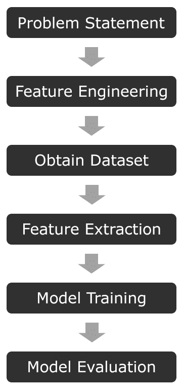
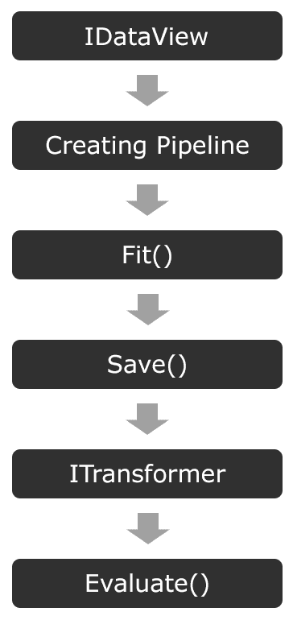

# 一、机器学习入门和 ML.NET

通过阅读这本书，你就迈出了第一步，通过机器学习来解决复杂问题，打破自己的知识。 您将使用微软的 ML.NET 框架来实现这一点。 我花了几年时间将机器学习应用于网络安全，我相信你从这本书中获得的知识不仅会为你打开职业机会，还会打开你的思维过程，改变你处理问题的方式。 在处理一个复杂的问题时，你甚至不会再不考虑机器学习如何解决它。

在本书中，你将学到以下内容:

*   如何以及何时使用 ML.NET 提供的五种不同算法
*   演示 ML.NET 算法的真实端到端示例
*   训练模型、构建训练集和特性工程时的最佳实践
*   使用预训练模型在两个 TensorFlow 和 ONNX 格式

这本书假设你对 C# 有相当扎实的理解。 如果您曾使用过强类型的面向对象编程语言(如 c++或 Java)，那么它的语法和设计模式足够相似，不会妨碍您阅读这本书。 然而,如果这是你第一次深入研究了强类型语言如 C#,我强烈建议捡*【7 天学习 C# T1】,*Gaurav Aroraa,出版的*Packt 出版,得到一个快速的基础。 此外，不要求也不期望有机器学习经验，尽管粗略的理解会加速你的学习。***

 **在本章中，我们将涵盖以下内容:

*   今天学习机器学习的重要性
*   模型的过程
*   探索学习类型
*   探索各种机器学习算法
*   介绍 ML.NET

在本章结束时，您应该对从头到尾构建模型的过程有一个基本的理解，这为本书的其余部分提供了基础。

# 今天学习机器学习的重要性

近年来，机器学习和人工智能已经成为我们生活中不可或缺的一部分，在各种各样的应用中，从在核磁共振成像中发现癌细胞，到在职业篮球比赛中进行面部和物体识别。 在过去的四年 2013 年和 2017 年之间,机器学习专利仅增长 34%,而支出估计增长到 2021 年 57.6 美元(794 年[https://www.forbes.com/sites/louiscolumbus/2018/02/18/roundup-of-machine-learning-forecasts-and-market-estimates-2018/ d6f6c2225](https://www.forbes.com/sites/louiscolumbus/2018/02/18/roundup-of-machine-learning-forecasts-and-market-estimates-2018/# 794d6f6c2225))。

尽管机器学习是一项不断发展的技术，但这个术语早在 1959 年就由阿瑟·塞缪尔创造了——那么，是什么导致了它在被采用之前的 60 年的差距呢? 也许最重要的两个因素是能够足够快地处理模型预测的技术的可用性，以及每分钟捕获的数字数据量。 多摩君 Inc .的数据显示,2017 年的一项研究得出的结论是,250 亿亿字节是每天产生的,当时,世界上 90%的数据被创建在 2015 年和 2017 年之间([https://www.domo.com/learn/data-never-sleeps-5?aid=ogsm072517_1&](https://www.domo.com/learn/data-never-sleeps-5?aid=ogsm072517_1&sf100871281=1)sf100871281 = 1)。 到 2025 年,据估计,463 艾字节的数据要创建每日(https://www.visualcapitalist.com/how-much-data-is-generated-each-day/),其中大部分将来自汽车、视频、图片、物联网设备、电子邮件、甚至设备还没有智能运动了。

过去十年中数据量的增长引发了这样的问题:企业或公司如何使用这些数据来更好地预测销售、预测客户需求或检测文件中的恶意字节。 传统的统计方法可能需要成倍增加的员工来满足当前的需求，更不用说扩展所获取的数据了。 以谷歌 Maps 为例。 随着谷歌在 2013 年收购 Waze，谷歌地图的用户已经得到了基于其用户匿名 GPS 数据的极其精确的路由建议。 有了这个模型，越多的数据点(在这个例子中是来自智能手机的 GPS 数据)，谷歌就能更好地预测你的旅行。 正如我们将在本章后面讨论的，高质量的数据集是机器学习的一个关键组成部分，特别是在谷歌地图的情况下，如果没有合适的数据集，用户体验将会低于标准。

此外，计算机硬件的速度，特别是专门为机器学习量身定制的硬件，也发挥了作用。 **专用集成电路**(**专用集成电路**)的使用呈指数级增长。 市场上最流行的 asic 之一是谷歌**张量处理单元**(**TPU**)。 它最初于 2016 年发布，此后经历了两次迭代，为谷歌云平台上的机器学习任务提供基于云的加速。 其他云平台，如亚马逊的 AWS 和微软的 Azure，也提供 fpga。

此外，AMD 和 NVIDIA 的**图形处理单元**(**gpu**)正在分别使用 ROCm 平台和 cuda 加速库加速基于云和本地的工作负载。 除了加速的工作负载外，AMD 和 NVIDIA 提供的典型专业 gpu 比传统的只使用 cpu 的方法提供了更高的处理器密度。 例如，AMD Radeon Instinct MI60 提供 4,096 个流处理器。 虽然不是成熟的 x86 内核，但不是一对一的比较，双精度浮点任务的峰值性能为 7.373 TFLOPs，而 AMD 的超级强大的 EPYC 7742 服务器 CPU 的最高性能为 2.3 TFLOPs。 从成本和可伸缩性的角度来看，如果算法能够利用 AMD 和 NVIDIA 提供的更专业的核心来加速，那么即使在工作站配置中使用 gpu 也会大大减少训练时间。 幸运的是，ML.NET 提供的 GPU 加速几乎不需要额外的努力。

从软件工程职业的角度来看，由于这种增长和需求远远超过供应，现在是软件工程师开发机器学习技能的最佳时机。 此外，软件工程师还拥有传统数据科学家所不具备的技能——例如，能够将模型构建过程等任务自动化，而不是依赖手工脚本。 软件工程师可以提供更多价值的另一个例子是，在训练模型时，将单元测试和功效测试作为完整管道的一部分。 在大型生产应用中，拥有这些自动化测试对于避免生产问题至关重要。

最后，在 2018 年，有史以来第一次，数据被认为比石油更有价值。 随着行业继续采用数据收集，现有行业利用他们拥有的数据，机器学习将与数据交织在一起。 机器学习之于数据就像精炼工厂之于石油。

# 模型构建过程

在深入了解 ML.NET 之前，需要了解机器学习的核心概念。 在我们开始构建模型和学习 ML.NET 在本书中提供的各种算法时，这些概念将帮助您创建一个基础。 从高层次来说，生成模型是一个复杂的过程; 然而，它可以分为六个主要步骤:

在接下来的几节中，我们将详细介绍每一个步骤，让您清楚地了解如何执行每一个步骤，以及每一个步骤与整个机器学习过程的关系。

# 定义你的问题陈述

实际上，你想要解决什么问题? 在这一点上明确是至关重要的，因为不那么简洁的问题可能会导致大量的返工。 例如，以以下问题陈述为例:*预测选举结果*。 听到这个问题陈述后，我的第一个问题是，处于什么水平? 县，州，还是国家? 每个关卡都需要比上一个关卡更多的功能和数据去预测。 一个更好的问题陈述，尤其是在你的机器学习旅程的早期，应该是县级的一个特定职位，例如*预测 2020 年 Doe 县市长*。 有了这种更直接的问题陈述，您的特性和数据集就更有针对性，也更容易实现。 即使你在机器学习方面有更多的经验，适当地确定问题陈述的范围也是至关重要的。 为了使你的陈述简洁，应该遵循“谁”、“什么”、“何时”、“何地”和“为什么”这五个 w。

# 定义你的特性

机器学习的第二步是定义你的特征。 将特性视为您希望解决的问题的组件或属性。 在机器学习中——特别是在创建新模型时——特征是对模型性能影响最大的因素之一。 正确地思考你的问题陈述将促进一组最初的特性，这些特性将驱动你的数据集和模型结果之间的区别。 回到上一节中的市长例子，您认为公民的数据点具有哪些特征? 或许可以从市长的竞争开始，看看他/她在问题上的立场与其他候选人不同。 这些值可以转化为特征，然后变成约翰多伊县公民的投票。 使用这些数据点可以创建一个可靠的第一个特性。 在模型构建中也可以发现的一个方面是运行多个迭代的特性工程和模型训练，尤其是当数据集增长时。 在模型评估之后，*特征重要性*被用来确定哪些特征实际上在驱动你的预测。 偶尔，您会发现，在经过几次模型训练和功能工程迭代后，直觉功能实际上是无关紧要的。

在[第 11 章](11.html)、*训练和构建生产模型*中，我们将深入研究定义特征和复杂问题的常见方法时的最佳实践，以获得在特征工程中的坚实的第一次通过。

# 获取数据集

可以想象，模型构建过程中最重要的方面之一是获得高质量的数据集。 在上述监督学习的情况下，使用数据集来训练模型的输出。 在无监督学习的情况下，需要对数据集进行标记。 在创建数据集时，一个常见的误解是认为越大越好。 在很多情况下，事实远非如此。 继续前面的示例，如果所有投票结果对每个问题的回答都相同，那会怎么样? 此时，您的数据集由所有相同的数据点组成，您的模型将不能正确地预测任何其他候选人。 这一结果称为*过拟合*。 机器学习算法需要一个多样化但具有代表性的数据集来正确地构建一个生产准备模型。

在[第 11 章](11.html),*训练和建立生产模型,我们将深入探讨获得质量数据集的方法,看有用的资源,管理你的数据集的方法,和转换数据,通常被称为数据争论。*

 *# 特征提取与流水线

获得特征和数据集之后，下一步是执行特征提取。 特征提取(取决于数据集和特征的大小)可能是模型构建过程中最耗时的元素之一。

例如，假设上述虚构的约翰多伊县选举民意调查的结果有 40000 个响应。 每个响应都存储在一个从 web 表单捕获的 SQL 数据库中。 执行 SQL 查询，然后将所有数据返回到 CSV 文件中，使用该文件可以训练模型。 从高层次上说，这是您的特性提取和管道。 对于更复杂的场景，如预测恶意 web 内容或图像分类，提取将包括文件中特定字节的二进制提取。 正确存储这些数据以避免重新运行提取对于快速迭代至关重要(假设特性没有改变)。

在第十一章中，*训练和构建生产模型，*我们将深入探讨如何版本化你的特征提取数据和保持控制你的数据，特别是当你的数据集的规模增长。

# 模型训练

特征提取之后，现在就可以训练模型了。 谢天谢地，ML.NET 的模型训练非常简单。 根据特征提取阶段提取的数据量、管道的复杂性和主机的规格，这个步骤可能需要几个小时才能完成。 当管道变得更大、模型变得更复杂时，您可能会发现自己需要的计算资源可能比笔记本电脑或台式机所能提供的更多; Spark 等工具可以帮助您将节点数量扩展到*n*。

在第 11 章，*训练和构建生产模型*中，我们将讨论使用一个易于使用的开源项目来扩展这一步的工具和技巧。

# 模型评价

一旦模型训练好，最后一步就是对模型进行评估。 模型评估的典型方法是*拿出*数据集的一部分进行评估。 其背后的想法是获取已知数据，将其提交到您的训练模型，并测量您的模型的有效性。 这一步的关键部分是提供一个有代表性的数据集。 如果你的坚持集是动摇的一种方式或其他，那么你将更有可能得到一个错误的感觉，要么高性能或低性能。 在下一章中，我们将深入研究各种评分和评估指标。 ML.NET 为评估模型提供了一个相对简单的界面; 然而，每个算法都有独特的属性需要验证，我们将在深入研究各种算法时回顾这些属性。

# 探索学习类型

现在您了解了组成模型构建过程的步骤，接下来要介绍的主要组件是两种主要的学习类型。 还有几种其他类型的机器学习，比如强化学习。 然而，在本书的范围内，我们将集中讨论 ML.NET 提供的两种算法——有监督学习和无监督学习。 如果你对其他类型的学习感兴趣，请查阅*机器学习算法*，Giuseppe Bonaccorso, Packt Publishing。

# 监督式学习

监督学习是这两种类型中比较常见的一种，同样地，它也被用在我们将在本书中介绍的大多数算法中。 简单地说，监督学习需要您作为数据科学家，将已知输出作为训练的一部分传递给模型。 以本章前面讨论的选举为例。 在监督学习中，选举投票中的每一个数据点都被作为一个特征，在训练过程中被发送到模型中。 在分类算法中，这一步传统上称为**标记**，其中输出值将是训练前的标签之一。

# 无监督学习

相反，在无监督学习中，典型的用例是当确定输入和输出标签被证明是困难的时候。 使用选举场景，当您不确定哪些特性将真正为模型提供数据点以确定选民的投票时，无监督学习可以提供价值和洞察力。 这种方法的好处是，你选择的算法决定了什么特征驱动你的标签。 例如，使用 k-means 之类的聚类算法，可以将所有投票人数据点提交给模型。 然后，该算法将能够将选民数据分组成簇，并预测看不见的数据。 我们将在第 5 章*，聚类模型*中深入探讨无监督聚类学习。

# 探索各种机器学习算法

机器学习的核心是用于解决复杂问题的各种算法。 正如在介绍中提到的，本书将涵盖五种算法:

*   二元分类
*   回归
*   异常检测
*   聚类
*   矩阵分解

每一个都将是本书后面一章的重点，但现在，让我们来快速概述一下它们。

# 二元分类

最容易理解的算法之一是二进制分类。 二分类是一种有监督的机器学习算法。 顾名思义，使用二进制分类算法训练的模型输出将返回 true 或 false 定罪结果(如 0 或 1)。最适合二进制分类模型的问题包括确定评论是否令人讨厌或文件是否恶意。 ML.NET 提供了几种二进制分类模型算法，我们将在第 4 章*分类模型*中介绍这些算法，并提供了一个确定文件是否是恶意文件的工作示例。

# 回归

另一种功能强大但易于理解的算法是回归。 回归是另一种有监督的机器学习算法。 回归算法返回一个实数值，而不是二进制算法或从一组特定值返回的算法。 你可以把回归算法想象成一个代数方程求解器，其中有许多已知值，目标是预测一个未知值。 最适合回归算法的问题有:磨损预测、天气预报、股票市场预测和房价预测等等。

此外，还有一个回归算法子集称为**逻辑回归**模型。 如前所述，传统的线性回归算法返回预测值，而逻辑回归模型将返回结果发生的概率。

ML.NET 提供了几种回归模型算法，我们将在第三章*回归模型*中介绍。

# 异常检测

异常检测，顾名思义，就是在提交给模型的数据中查找意外事件。 正如您可能猜到的那样，该算法的数据需要一段时间的数据。 ML.NET 中的异常检测同时查看峰值和变化点。 顾名思义，**峰值**是暂时的，而**变化点**是更长的变化的起点。

ML.NET 提供了一种异常检测算法，我们将在第六章*异常检测模型*中介绍。

# 聚类

聚类算法是一种无监督的算法，它为寻找与相关项最接近的匹配是理想解决方案的问题提供了唯一的解决方案。 在数据训练过程中，根据数据的特征对数据进行分组，然后在预测过程中选择最接近的匹配。 使用聚类算法的一些例子包括文件类型分类和预测客户选择。

ML.NET 特别使用了 k-means 算法，我们将在第五章*聚类模型*中深入探讨。

# 矩阵分解

最后但并非最不重要的是，矩阵分解算法提供了一个强大的和易于使用的算法来提供建议。 这种算法是针对历史数据可用的问题而设计的，需要解决的问题是从这些数据中预测一个选择，比如电影或音乐的预测。 Netflix 的电影建议系统使用一种矩阵分解的形式来建议你会喜欢什么电影。

我们将在第七章*矩阵因子分解模型*中详细介绍矩阵因子分解。

# ML.NET 是什么?

现在，您已经对机器学习的核心概念有了相当牢固的理解，我们现在可以深入了解微软的 ML.NET 框架。 ML.NET 是微软的首要机器学习框架。 它提供了一个易于使用的框架，可以在.NET 生态系统的范围内相对轻松地训练、创建和运行模型。

微软的 ML.NET 于 2018 年 5 月在华盛顿州西雅图举行的微软开发者大会 BUILD 上宣布并发布(版本 0.1)。 该项目本身是开源的，拥有 GitHub 上的 MIT 许可([https://github.com/dotnet/machinelearning](https://github.com/dotnet/machinelearning))，并且自撰写本文时的第一个版本以来，已经有了 17 个更新。

在微软内部使用 ML.NET 的一些产品包括 Excel 中的图表决策、PowerPoint 中的幻灯片设计、Windows Hello 和 Azure 机器学习。 这强调了 ML.NET 对于您自己的生产部署的生产准备。

从一开始，ML.NET 的设计和构建就是为了方便 C# 和 f# 开发人员使用机器学习，他们使用的架构对于熟悉.NET 框架的人来说是很自然的。 在 ML.NET 出现之前，还没有一个成熟的、受支持的框架，在这个框架中，您不仅可以训练模型，而且还可以在不离开.NET 生态系统的情况下运行模型。 例如，谷歌的 TensorFlow 在 GitHub([https://github.com/migueldeicaza/TensorFlowSharp](https://github.com/migueldeicaza/TensorFlowSharp))上有一个由 Miguel de Icaza 编写的开源包装器; 然而，在撰写本书时，大多数工作流都需要使用 Python 来训练模型，然后可以使用 C# 包装器来运行预测。

此外，微软还打算支持所有主要的平台.NET 开发人员在过去几年中已经习惯于发布他们的应用。 下面是一些平台的例子，括号中是他们的目标框架:

*   网站(ASP.NET)
*   Mobile (Xamarin)
*   桌面(UWP, WPF 和 WinForms)
*   游戏(MonoGame 和 SharpDX)
*   物联网(。 NET Core 和 UWP)

在本书的后面部分，我们将在大多数平台上实现几个真实的应用，以演示如何将 ML.NET 集成到各种应用类型和平台中。

# ML.NET 的技术细节

随着 ML.NET 1.4 的发布，我们建议将目标定位于.NET Core 3.0 或更高版本，以利用作为.NET Core 3.0 一部分添加的硬件本质。 对于那些不熟悉的，.NET Core 2。 . net Framework 中的 x(及更早的)针对具有**流****SIMD****扩展**(**SSE**)的 cpu 进行了优化。 实际上，这些指令提供了在数据集上执行多个 CPU 指令的优化路径。 这种方法被称为**单指令多数据**(**SIMD**)。 考虑到 SSE CPU 扩展最早是在 1999 年的奔腾 III 中添加的，后来是在 2001 年的 Athlon XP 中由 AMD 添加的，这提供了一个非常向后兼容的路径。 然而，这也不允许代码利用过去 20 年在 CPU 扩展方面取得的所有进步。 一个这样的改进是**Advanced Vector Extensions**(**AVX**)，可在 2011 年或以后创建的大多数 Intel 和 AMD cpu 上使用。

这在一条指令中提供 8 个 32 位操作，而 SSE 提供 4 个。 正如你可能猜到的，机器学习可以利用这种加倍的指令。 对于.NET Core 3 中尚未被支持的 cpu(比如 ARM)，.NET Core 3 自动回到基于软件的实现。

# ML.NET 的组件

正如前面提到的，ML.NET 的设计初衷是为有经验的.NET 开发人员提供直观的体验。 体系结构和组件非常类似于在 ASP 中找到的模式。 净和 WPF。

ML.NET 的核心是`MLContext`对象。 与.NET 应用中的`AppContext`类似，`MLContext`是一个单例类。 `MLContext`对象本身提供了对 ML.NET 提供的所有训练器目录的访问(一些是由额外的 NuGet 包提供的)。 您可以将 ML.NET 中的训练器目录看作是一种特定的算法，比如二进制分类或聚类。

以下是 ML.NET 的一些目录:

*   异常检测
*   二元分类
*   聚类
*   预测
*   回归
*   时间序列

这六组算法已经在本章的前面进行了回顾，并将在本书后续的专门章节中进行更详细的介绍。

此外，最近在 ML.NET 1.4 中增加了直接从数据库导入数据的能力。 在撰写本文时，该特性还处于预览状态，它不仅可以简化特性提取过程，而且还扩展了在现有应用或管道中进行实时预测的可能性。 支持所有主流数据库，包括 SQL Server、Oracle、SQLite、PostgreSQL、MySQL、DB2 和 Azure SQL。 我们将在第 4 章*分类模型*中通过一个使用 SQLite 数据库的控制台应用来探讨这个特性。

下图展示了 ML.NET 的高级架构:

在这里，你可以看到与传统机器学习过程几乎完全匹配。 这样做是为了减少那些熟悉其他框架的人的学习曲线。 架构中的每个步骤可以总结如下:

1.  **IDataView**:用于将已加载的训练数据存储到内存中。
2.  **创建管道**:管道创建将`IDataView`对象属性映射到要发送到模型进行训练的值。
3.  **Fit()**:不管算法如何，在管道创建之后，调用`Fit()`开始实际的模型训练。
4.  **Save()**:顾名思义，将模型(以二进制格式)保存到文件中。
5.  **ITransformer**:**将模型加载回内存中运行预测。**
***   **Evaluate()**:顾名思义，这将评估模型([第 2 章](02.html)，*建立 ML.NET 环境*将进一步深入评估架构)。**

 **在本书中，我们将更深入地探讨这些方法。

# ML.NET 的可扩展性

最后，ML.NET 像大多数健壮的框架一样，提供了相当大的可扩展性。 微软已经推出了附加的可扩展性支持，使其能够运行以下外部训练过的模型类型，其中包括:

*   TensorFlow
*   ONNX
*   推断。 净
*   CNTK

如前所述，TensorFlow([https://www.tensorflow.org/](https://www.tensorflow.org/))是谷歌的机器学习框架，官方支持 c++、Go、Java 和 JavaScript 的绑定。 此外，TensorFlow 可以通过 gpu 和谷歌自己的 tpu 来加速。 此外，像 ML.NET 一样，它提供了在各种平台上运行预测的能力，包括 iOS、Android、macOS、ARM、Linux 和 Windows。 谷歌提供几个预先训练的模型。 其中一个比较流行的模型是图像分类模型，它对提交的图像中的对象进行分类。 ML.NET 最近的改进使您能够基于预先训练的模型创建自己的图像分类器。 我们将在[第 12 章](12.html)、*中详细介绍这个场景，在 ML.NET 中使用 TensorFlow*

ONNX([https://onnx.ai/](https://onnx.ai/))是开放式神经网络交换格式(Open Neural Network Exchange Format)的首字母缩略词，由于能够导出为通用格式，是数据科学领域中广泛使用的格式。 ONNX 有 XGBoost、TensorFlow、scikit-learn、LibSVM 和 CoreML 等转换器。 微软在 ML.NET 中对 ONNX 格式的原生支持不仅允许现有机器学习管道具有更好的扩展性，而且还会增加 ML.NET 在机器学习领域的应用。 我们将在[第 13 章](13.html)、*中使用 ONNX 与 ML.NET*中的预先训练的格式模型。

推断。 Net 是微软另一个专注于概率编程的开源机器学习框架。 你可能想知道什么是概率规划。 在较高的层次上，概率编程处理了传统变量类型是确定的灰色区域，如布尔或整数。 概率编程使用具有一定范围的结果值的随机变量，类似于数组。 正则数组与概率编程中的变量之间的区别在于，对于每个值，都有特定值出现的概率。

一个伟大的实际应用的推断。 Net 是微软 TrueSkill 背后的技术。 TrueSkill 是一个评级系统,权力的相亲*光环*和*战争机器,玩家匹配是基于大量的变量,类型,同时,地图都可以归因于甚至两名球员。 虽然超出了本书的范围，一个伟大的白皮书进一步深入推断。 网络和概率规划，一般可以在这里找到:[https://dotnet.github.io/infer/InferNet_Intro.pdf](https://dotnet.github.io/infer/InferNet_Intro.pdf)。*

 *CNTK 同样来自微软，是认知工具包的缩写，是一个专注于神经网络的深度学习工具包。 CNTK 的一个独特特点是它使用有向图来描述神经网络。 虽然超出了本书的范围(我们将在第 12 章的 TensorFlow 中涵盖神经网络)，前馈深度神经网络、卷积神经网络和循环神经网络的世界是非常迷人的。 为了进一步深入研究神经网络，我建议*使用 C#*进行神经网络编程，同样来自 Packt。

对 Azure 和其他模型支持(如 PyTorch([https://pytorch.org/](https://pytorch.org/))的额外扩展已经在路线图中，但在撰写本文时还没有建立时间表。

# 总结

在本章中，你已经了解了发现机器学习的重要性。 此外，您还学习了机器学习的核心概念，包括学习的差异和我们将在本书后面介绍的各种算法。 您还收到了 ML.NET 的介绍。 本章的核心概念是本书其余部分的基础，我们将在接下来的每一章中以这些概念为基础。 在下一章中，我们将建立您的环境，并在 ML.NET 中训练您的第一个模型!******