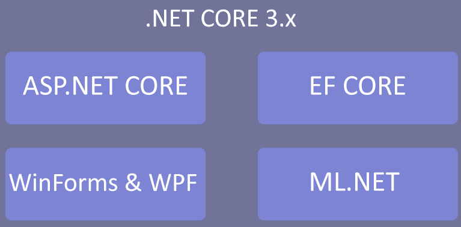
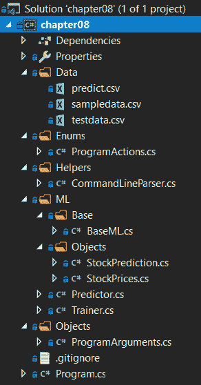

# 使用 ML.NET 与。NETCore和预测

现在我们已经完成了对 ML.NET 提供的各种算法组的深入研究，我们将在接下来的几章中开始探索将 ML.NET 集成到生产应用中。 在本章中，我们将深入研究基于前面章节定义的结构构建的。net Core 控制台应用，重点关注加固和错误处理。 我们将构建的应用使用 forecasting 根据一系列趋势来预测股票价格。 在本章结束时，您应该已经掌握了使用 ML.NET 设计和编码产品级的。net Core 应用。

在本章中，我们将涵盖以下主题:

*   分解。NETCore应用架构
*   创建预测应用
*   探索其他生产应用增强功能

# 分解。NETCore应用架构

[第一章](01.html)，*机器学习入门和 ML.NET，*. net Core 3。 由于在 3.0 版本中进行了优化，x 是使用 ML.NET 的首选平台。 此外，.NET Core 提供了针对 Linux、macOS 和 Windows 的单一编码框架，如下图所示:



# NETCore架构

自 2016 年成立以来，. net Core 的基本目标一直是提供快速的更新，并与(之前仅支持 windows 的)Microsoft . net 框架的特性保持一致。 随着时间和版本的推移，通过使用额外的 NuGet 包，简单地添加之前缺失的 api，差距变得越来越小。 其中一个例子是`Microsoft.Windows.Compatibility`，它提供了 20,000 个 api，包括注册表访问、绘图和 Windows 权限模型访问，这些 api 在核心框架中是找不到的。 这种方法保持了框架的轻量级和跨平台，但是引入了一些设计模式来帮助您开发特定于平台的应用。

例如，一个 Windows 桌面应用使用 ML.NET 提供一个**入侵检测系统**(**IDS**)。 一个简单的方法是在。net Core**Windows Presentation Foundation**(**WPF**)应用中编写所有代码。 然而，这只会将您绑定到 Windows，而不需要进行主要的重构。 更好的方法是创建一个. net Core 类库，其中包含所有与平台无关的代码，然后创建抽象类或接口来在平台应用中实现特定于平台的代码。

# NETCore目标

如前所述，. net Core 提供了针对 Windows、macOS 和 Linux 的单一框架。 然而，这并不仅仅适用于我们在本书中使用的控制台应用。 . net Core 3 最近的工作提供了将现有的。net Framework WPF 和 Windows 窗体应用移植到。net Core 3 的能力，从而使那些依赖于可能存在多年的框架的应用能够使用最新的。net Core 改进。 此外，以前使用 ASP 的 web 应用。 NET 可以迁移到 asp.net。 网络核心(ASP。 NET WebForms 目前没有迁移路径)。

. net Core 目标的另一个好处是能够使用`--self-contained`标志进行编译。 这个标志编译你的应用或库，然后绑定所有必要的。net Core 框架文件。 这允许您在安装过程中部署应用而不需要。net 前提条件。 这确实使您的整体构建输出更大，但在客户场景中，大约 100MB 的增加远远超过先决条件的部署障碍。

# NETCore未来

你可能想知道。net Framework、Mono 和。net Core 的未来会是什么样子。 幸运的是，在撰写本文时，微软已经确认，所有现有框架都将迁移到一个单一的框架，简称为。net 5。 以前，在决定使用哪个框架时，一定的权衡是有保证的。 因此，利用每个框架的优点并首次统一它们将完全消除这些权衡。 例如，Mono 的**Ahead-Of-Time**(**AOT**)编译或者 Xamarin 的跨平台 UI 支持，这些都可以在现有的。net Core 3 中使用。 根据发布的信息申请。

A preview of .NET 5 is expected in the first half of 2020, with a production release in November 2020.

# 创建股票价格估算器应用

如前所述，我们将创建的应用是一个股票价格估算器。 给定一组几天、几周或几年的股票价格，预测算法将在内部识别趋势模式。 与前面的章节不同，应用将被构建为插入生产管道。

与前面的章节一样，完成的项目代码、示例数据集和项目文件可以从:[https://github.com/PacktPublishing/Hands-On-Machine-Learning-With-ML.NET/tree/master/chapter08](https://github.com/PacktPublishing/Hands-On-Machine-Learning-With-ML.NET/tree/master/chapter08)下载。

# 探索项目架构

在我们之前章节中创建的项目体系结构和代码的基础上，我们将在本章中探索的体系结构进一步增强了体系结构，使其更结构化，从而对最终用户更有用。

像前面的一些章节一样，需要一个额外的 NuGet 包——`Microsoft.ML.TimeSeries`——来利用 ML.NET 中的预测功能。 版本 1.3.1 在 GitHub 上包含的例子中都使用了，在本章的深入讲解中也是如此。

在下面的屏幕截图中，您将发现项目的 Visual Studio Solution Explorer 视图。 解决方案中增加了一些新内容，以促进我们目标产品用例的实现。 我们将在本章后面的解决方案截图中详细回顾每一个新文件:



`sampledata.csv`文件包含 24 行股票价格。 请随意调整数据以符合您自己的观察或调整训练模型。 以下是数据片段:

```cs
33
34
301
33
44
299
40
50
400
60
76
500
```

这些行中的每一行都包含我们将填充到`StockPrices`类对象中的股票价格值，我们将在本章的后面讨论这个类对象。

除此之外，我们还添加了包含额外数据点的`testdata.csv`文件，以测试新训练的模型并对其进行评估。 下面是`testdata.csv`内部的数据片段:

```cs
10
25
444
9
11
333
4
3
500
```

# 钻研代码

对于这个应用，如前一节所述，我们是在前几章所完成的工作的基础上构建的。 然而，在本章中，我们将修改每个文件以支持生产用例。 对于从前面章节中更改的每个文件，我们将回顾所做的更改以及这些更改背后的原因。

更改或添加的类和枚举如下:

*   `ProgramActions`
*   `CommandLineParser`
*   `BaseML`
*   `StockPrediction`
*   `StockPrices`
*   `Predictor`
*   `Trainer`
*   `ProgramArguments`
*   `Program`

# ProgramActions 枚举

下面的`ProgramActions`枚举已被添加到解决方案中，以方便使用强类型和结构化路径来处理程序执行的各种操作:

```cs
namespace chapter08.Enums
{
    public enum ProgramActions
    {
        TRAINING,
        PREDICT
    }
}
```

在这个应用的情况下，我们只有两个操作——`Training`和`Predicting`。 但是，如前面章节所示，您可能还需要一个特征提取步骤或者提供一个评估步骤。 这种设计模式允许灵活性，同时也消除了本章开始时提到的**魔术字符串**问题。

# CommandLineParser 类

类提供了一个程序无关的解析器来处理命令行参数。 在前面的章节中，我们手动解析索引并将这些值映射到参数。 另一方面，这种方法创建了一个灵活、易于维护和结构化的响应对象，该对象将参数直接映射到属性。 现在让我们深入课堂:

1.  首先，我们定义函数原型:

```cs
public static T ParseArguments<T>(string[] args) 
```

泛型(即`T`)的使用创建了一种灵活的方法，使该方法不受限于此应用。

2.  接下来，我们测试`null`参数:

```cs
if (args == null)
{
    throw new ArgumentNullException(nameof(args));
}
```

3.  然后，我们测试空参数，并让用户知道将使用默认值而不是失败，就像在前面的章节:

```cs
if (args.Length == 0)
{
    Console.WriteLine("No arguments passed in - using defaults");

    return Activator.CreateInstance<T>();
}
```

4.  在执行 null 和 empty 检查之后，我们执行两个检查的倍数，因为所有的参数都是成对的:

```cs
if (args.Length % 2 != 0)
{
    throw new ArgumentException($"Arguments must be in pairs, there were {args.Length} passed in");
}
```

5.  接着，我们使用`Activator.CreateInstance`方法创建一个`T`**类型的对象:**

 **```cs
var argumentObject = Activator.CreateInstance<T>();
```

确保在创建类对象时，构造函数没有参数，因为如果有参数，此调用将抛出异常。 如果您创建一个带有构造函数参数而没有无参数构造函数的对象，则使用`Activator.CreateInstance`的重载并传入所需的参数。

6.  接下来，我们利用反射来获取`T`类型的所有属性:

```cs
var properties = argumentObject.GetType().GetProperties();
```

7.  现在我们已经创建了通用对象和该对象的属性，然后循环遍历每个参数键/值对，并在对象中设置属性:

```cs
for (var x = 0; x < args.Length; x += 2)
{
    var property = properties.FirstOrDefault(a => a.Name.Equals(args[x], StringComparison.CurrentCultureIgnoreCase));

    if (property == null)
    {
        Console.WriteLine($"{args[x]} is an invalid argument");

        continue;
    }

    if (property.PropertyType.IsEnum)
    {
        property.SetValue(argumentObject, Enum.Parse(property.PropertyType, args[x + 1], true));
    }
    else
    {
        property.SetValue(argumentObject, args[x + 1]);
    }
}
```

请注意用于处理前面提到的`ProgramActions`枚举的`IsEnum`函数的特殊情况。 由于不能自动将字符串值转换为枚举值，因此需要特别使用`Enum.Parse`方法处理字符串到枚举值的转换。 如前所述，如果向`T`类型添加更多枚举，枚举处理程序就是泛型的。

# BaseML 类

这个应用的`BaseML`类已经被简化为简单地实例化`MLContext`对象:

```cs
using Microsoft.ML;

namespace chapter08.ML.Base
{
    public class BaseML
    {
        protected readonly MLContext MlContext;

        protected BaseML()
        {
            MlContext = new MLContext(2020);
        }
    }
}
```

# StockPrediction 类

`StockPrediction`类是我们的预测值的容器，定义如下:

```cs
namespace chapter08.ML.Objects
{
    public class StockPrediction
    {
        public float[] StockForecast { get; set; }

        public float[] LowerBound { get; set; }

        public float[] UpperBound { get; set; }
    }
}
```

`StockForecast`属性将持有基于模型训练的预测股票价值，并将价值提交给预测引擎。 `LowerBound`和`UpperBound`值分别持有最低和最高的估计值。

# 上涨空间类

类包含持有股票价格的单个浮点值。 为了在填充值时保持代码整洁，添加了一个接受股票价格值的构造函数:

```cs
using Microsoft.ML.Data;

namespace chapter08.ML.Objects
{
    public class StockPrices
    {
        [LoadColumn(0)]
        public float StockPrice;

        public StockPrices(float stockPrice)
        {
            StockPrice = stockPrice;
        }
    }
}
```

# 预测类

与前几章相比，`Predictor`课程已被精简和调整以支持预测:

1.  首先，调整`Predict`方法以接受新定义的`ProgramArguments`类对象:

```cs
public void Predict(ProgramArguments arguments)   
```

2.  接下来，我们更新模型`file.Exists`检查以利用`arguments`对象:

```cs
if (!File.Exists(arguments.ModelFileName))
{
    Console.WriteLine($"Failed to find model at {arguments.ModelFileName}");

    return;
}
```

3.  类似地，我们还更新了对利用`arguments`对象的预测文件名引用:

```cs
if (!File.Exists(arguments.PredictionFileName))
{
    Console.WriteLine($"Failed to find input data at {arguments.PredictionFileName}");

    return;
}
```

4.  接下来，我们还修改了模型 open call，以利用`arguments`对象:

```cs
using (var stream = new FileStream(Path.Combine(AppContext.BaseDirectory, arguments.ModelFileName), FileMode.Open, FileAccess.Read, FileShare.Read))
{
    mlModel = MlContext.Model.Load(stream, out _);
}
```

5.  然后，我们使用`StockPrices`和`StockPrediction`类型创建时间序列引擎对象:

```cs
var predictionEngine = mlModel.CreateTimeSeriesEngine<StockPrices, StockPrediction>(MlContext);
```

6.  接下来，我们将股票价格预测文件读入一个字符串数组:

```cs
var stockPrices = File.ReadAllLines(arguments.PredictionFileName);
```

7.  最后，我们遍历每个输入，调用预测引擎，并显示估计值:

```cs
foreach (var stockPrice in stockPrices)
{
    var prediction = predictionEngine.Predict(new StockPrices(Convert.ToSingle(stockPrice)));

    Console.WriteLine($"Given a stock price of ${stockPrice}, the next 5 values are predicted to be: " +
                      $"{string.Join(", ", prediction.StockForecast.Select(a => $"${Math.Round(a)}"))}");
}
```

# 培训类

`Trainer`类，类似于`Predictor`类，由于 ML.NET 预测算法的原因，既进行了精简，又进行了修改:

1.  首先，更新函数原型以获取`ProgramArguments`对象:

```cs
public void Train(ProgramArguments arguments)     
```

2.  接下来，我们更新训练文件检查以利用`argument`对象:

```cs
if (!File.Exists(arguments.TrainingFileName))
{
    Console.WriteLine($"Failed to find training data file ({arguments.TrainingFileName})");

    return;
}
```

3.  类似地，然后我们更新测试文件检查以利用`argument`对象:

```cs
if (!File.Exists(arguments.TestingFileName))
{
    Console.WriteLine($"Failed to find test data file ({arguments.TestingFileName})");

    return;
}
```

4.  接下来，我们从训练文件中加载`StockPrices`值:

```cs
var dataView = MlContext.Data.LoadFromTextFile<StockPrices>(arguments.TrainingFileName);
```

5.  然后我们创建`Forecasting`对象，并利用 C# 的`nameof`**特性来避免魔术字符串引用:**

 **```cs
var model = MlContext.Forecasting.ForecastBySsa(
    outputColumnName: nameof(StockPrediction.StockForecast),
    inputColumnName: nameof(StockPrices.StockPrice), 
    windowSize: 7, 
    seriesLength: 30, 
    trainSize: 24, 
    horizon: 5,
    confidenceLevel: 0.95f,
    confidenceLowerBoundColumn: nameof(StockPrediction.LowerBound),
    confidenceUpperBoundColumn: nameof(StockPrediction.UpperBound));
```

输入和输出列名引用正如我们在前面章节中看到的那样。 属性是训练集中数据点之间的持续时间。 对于这个应用，我们使用`7`来表示一周的持续时间。 `seriesLength`**属性表示本例中数据集的总持续时间。 `horizon`属性指示在运行模型时应该计算多少预测值。 在我们的例子中，我们要求的是`5`预测值。**

 **6.  最后，用训练数据对模型进行变换，调用`CreateTimeSeriesEngine`方法，将模型写入磁盘:

```cs
var transformer = model.Fit(dataView);

var forecastEngine = transformer.CreateTimeSeriesEngine<StockPrices, StockPrediction>(MlContext);

forecastEngine.CheckPoint(MlContext, arguments.ModelFileName);

Console.WriteLine($"Wrote model to {arguments.ModelFileName}");
```

# ProgramArguments 类

这个新类，如本节前面提到的，提供了参数到整个应用中使用的属性的一对一映射:

1.  首先，我们定义直接映射到命令行参数的属性:

```cs
public ProgramActions Action { get; set; }

public string TrainingFileName { get; set; }

public string TestingFileName { get; set; }

public string PredictionFileName { get; set; }

public string ModelFileName { get; set; }
```

2.  最后，我们填充属性的默认值:

```cs
public ProgramArguments()
{
    ModelFileName = "chapter8.mdl";

    PredictionFileName = @"..\..\..\Data\predict.csv";

    TrainingFileName = @"..\..\..\Data\sampledata.csv";

    TestingFileName = @"..\..\..\Data\testdata.csv";
}
```

与前面的章节不同，如果没有按照预期设置任何属性，程序将失败。 这对于开发人员的体验是很好的; 然而，在现实世界中，最终用户更可能尝试不带任何参数地运行应用。

# 项目类

在`Program`类内部，代码被简化以使用本章前面讨论的新`CommandLineParser`类。 通过使用`CommandLineParser`类，所有的操作都被切换为使用强类型枚举:

1.  首先，虽然相对简单，清除屏幕上以前的运行数据是一个改进的用户体验:

```cs
Console.Clear();
```

2.  然后使用新的`CommandLineParser`类和相关的`ParseArguments`方法创建强类型参数对象:

```cs
var arguments = CommandLineParser.ParseArguments<ProgramArguments>(args);
```

3.  然后，我们可以使用一个简化的强类型切换案例来处理我们的两个操作:

```cs
switch (arguments.Action)
{
    case ProgramActions.PREDICT:
        new Predictor().Predict(arguments);
        break;
    case ProgramActions.TRAINING:
        new Trainer().Train(arguments);
        break;
    default:
        Console.WriteLine($"Unhandled action {arguments.Action}");
        break;
}
```

# 运行应用

运行应用的过程与[第 3 章](03.html)、*回归模型*中的样例应用几乎相同，只是在训练时增加了通过测试数据集:

1.  在不带任何参数的情况下运行应用来训练模型，我们使用以下步骤:

```cs
PS chapter08\bin\Debug\netcoreapp3.0> .\chapter08.exe
No arguments passed in - using defaults
Wrote model to chapter8.mdl
```

2.  运行应用，根据包含的预测数据做出预测，我们使用以下步骤:

```cs
PS chapter08\bin\Debug\netcoreapp3.0> .\chapter08.exe action predict
Given a stock price of $101, the next 5 values are predicted to be: $128, $925, $140, $145, $1057
Given a stock price of $102, the next 5 values are predicted to be: $924, $138, $136, $1057, $158
Given a stock price of $300, the next 5 values are predicted to be: $136, $134, $852, $156, $150
Given a stock price of $40, the next 5 values are predicted to be: $133, $795, $122, $149, $864
Given a stock price of $30, the next 5 values are predicted to be: $767, $111, $114, $837, $122
Given a stock price of $400, the next 5 values are predicted to be: $105, $102, $676, $116, $108
Given a stock price of $55, the next 5 values are predicted to be: $97, $594, $91, $103, $645
Given a stock price of $69, the next 5 values are predicted to be: $557, $81, $87, $605, $90
Given a stock price of $430, the next 5 values are predicted to be: $76, $78, $515, $84, $85
```

您可以随意修改这些值，并查看基于训练模型的数据集的预测如何变化。 从这一点开始，一些实验领域可能会做以下工作:

*   调整在`Trainer`类中回顾的超参数，如`windowSize`、`seriesLength`或`horizon`属性，以了解准确性是如何受到影响的。
*   添加更多的数据点——这可能会利用你最喜欢的股票的数据提要。

# 探索其他生产应用增强功能

现在我们已经完成了我们的深入研究，有几个额外的元素可能进一步增强应用。 这里讨论了一些想法。

# 日志记录

随着应用复杂性的增加，强烈推荐使用 NLog([https://nlog-project.org/](https://nlog-project.org/))或类似的开源项目进行日志记录。 这将允许您在不同级别上记录文件、控制台或第三方日志解决方案(如 Loggly)。 例如，如果将此应用部署到客户，将错误级别至少划分为 Debug、Warning 和 error 将有助于远程调试问题。

# 进一步利用反射

正如本节前面提到的，为了创建灵活性和适应性，我们使用`Reflection`来解析命令行参数。 你可以再进一步和替换 switch case 语句/标准流`Program`类使用一个完全基于映像的方法,意味着应用中定义的每一个动作,它`BaseAction`可以继承一个抽象类,在运行时,根据参数,调用合适的类。 对于每个新操作，只需向`ProgramActions`枚举添加一个新条目，然后使用该枚举定义一个类就可以了。

# 利用数据库

在真实场景中，用于运行预测的数据很可能来自数据库。 这个数据库，无论是 Postgres, SQL Server，还是 SQLite 数据库(等等)，都可以通过微软的 Entity Framework Core 或者 ML.NET 内置的数据库加载器方法`CreateDatabaseLoader`来访问。 这个加载器类似于我们通过注入 SQL 查询的额外步骤从可枚举文件或文本文件加载数据的方式。

在生产场景中，考虑到 Entity Framework Core 在 ML.NET 实现中使用 LINQ 而不是纯文本的性能和能力(在撰写本文时)，如果使用数据库源，我建议使用 Entity Framework。

# 总结

在本章中，我们以前面章节的工作为基础，深入探讨了面向生产的。NETCore应用体系结构。 我们还利用 ML.NET 中的预测算法创建了一个全新的股票价格估计器。 最后，我们讨论了进一步增强。NETCore应用(以及一般的生产应用)的一些方法。

在下一章中，我们将深入研究如何使用 ML.NET 的二进制分类和 ASP 来创建一个产品文件分类的 web 应用。 网络核心的框架。******