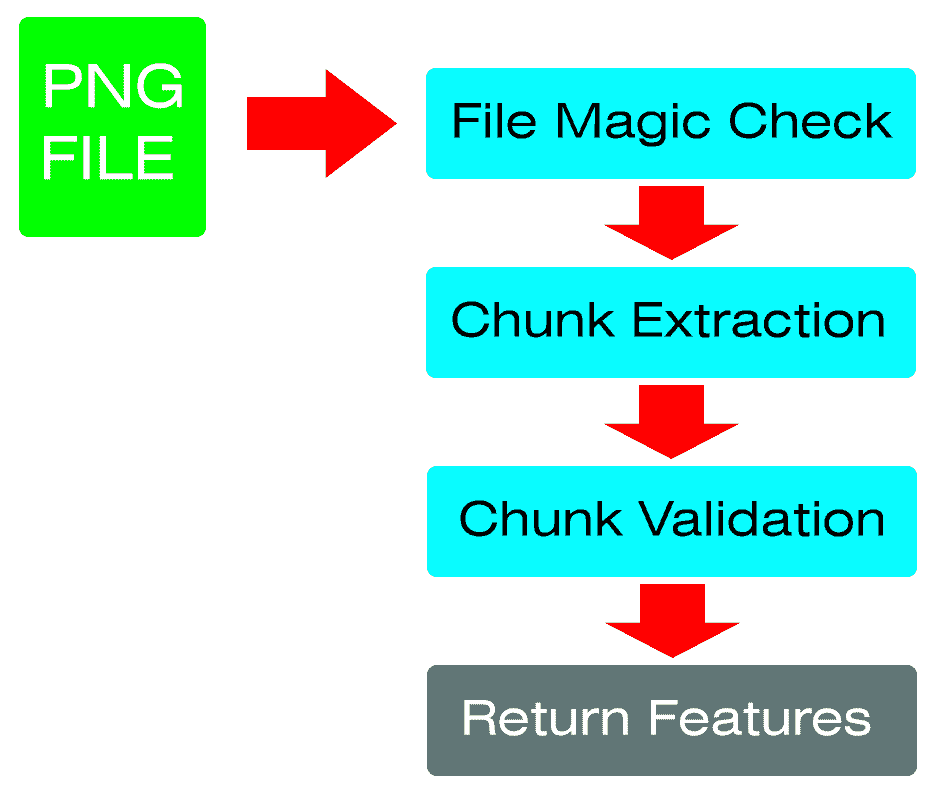
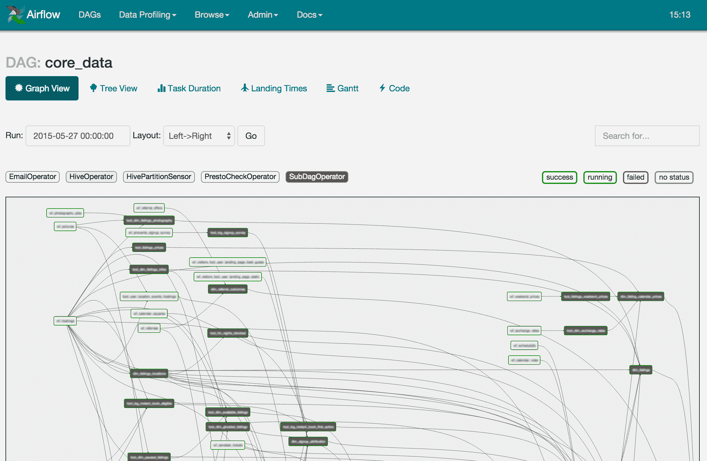
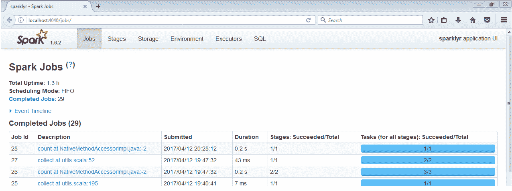

# 十一、训练和建立生产模型

当我们进入本书的最后一部分时，本章提供了在生产环境中使用机器学习的概述。 在本书中，您已经学习了 ML.NET 提供的各种算法，并且创建了一组三个生产应用。 掌握了这些知识后，你的第一个想法可能是:我如何能立即创建下一个杀手级机器学习应用? 在直接回答这个问题之前，本章将帮助你为接下来的步骤做好准备。 正如前面章节所讨论和利用的，训练模型有三个主要组成部分:特征工程、样本收集和创建训练管道。 在本章中，我们将重点关注这三个部分，扩展您如何成功创建生产模型的思维过程，以及提供一些建议的工具，以便能够通过生产级训练管道重复成功。

在本章中，我们将讨论以下内容:

*   调查工程特点
*   获取训练和测试数据集
*   创建您的模型构建管道

# 调查工程特点

正如我们在前几章所讨论的，特性是模型构建过程中最重要的组成部分之一，客观地说，也是最重要的组成部分。 当处理一个新问题时，产生的主要问题是:你将如何解决这个问题? 例如，在网络安全领域，一个常见的漏洞就是隐写术的使用。 隐写术可以追溯到公元前 440 年，是一种在容器中隐藏数据的做法。 这个容器包括绘画、填字游戏、音乐和图片等等。 在网络安全领域，隐写术被用于将恶意的有效载荷隐藏在文件中，否则这些文件就会被忽略，比如图像、音频和视频文件。

看下面这张食物篮子的图片。 这张图片是用在线隐写工具制作的，里面有嵌入的信息; 看看你是否能在下图中发现任何不寻常的模式:


目前的大多数工具都可以屏蔽复杂和纯色图像中的内容，以至于作为最终用户的您甚至不会注意到—如前面的示例所示。

继续这个场景，您现在可能需要回答的一个快速问题是:文件中是否包含另一种文件格式? 另一个要考虑的因素是问题的范围。 试图回答上述问题将导致深入分析递归解析器使用的每一种文件格式，这是非常耗时的，不适合立即处理。 更好的选择是将问题局限于分析音频文件或图像文件。 进一步考虑这个思考过程，让我们将问题限定为特定的图像类型和有效负载类型。

# 带有嵌入式可执行文件的 PNG 图像文件

让我们深入到这个更具体的问题:如何在**便携式网络图形**(**PNG**)文件中检测 Windows 可执行文件? 对于那些好奇的人来说，选择 PNG 文件的原因是它们是电子游戏和互联网中非常常见的无损图像格式，因为它们的图像质量与文件大小的比例非常高。 这种程度的使用为攻击者创建一个接口 PNG 文件在您的机器上,以你为最终用户不考虑,与专有格式或 Windows**可执行**(**EXE**),这可能会导致报警给最终用户。

在下一节中，我们将把 PNG 文件分解为以下步骤:



To dive further into the PNG file format, the specification for PNG is available here: [http://libpng.org/pub/png/spec/1.2/PNG-Contents.html](http://libpng.org/pub/png/spec/1.2/PNG-Contents.html)

# 创建 PNG 解析器

现在让我们将 PNG 文件格式分解为功能，以便驱动一个潜在的模型来检测隐藏的有效载荷。 一个 PNG 文件由连续的块构成。 每个块由一个头描述字段组成，后面跟着一个数据负载。 一个 PNG 文件需要的块包括**IHDR**、**IDAT、**和**IEND**。 按照规范，各节必须按此顺序出现。 下面将对每一部分进行解释。

在块之前的第一个元素是实现检查，以确保文件实际上是一个 PNG 图像文件。 这个检查通常称为**File Magic 检查**。 在我们的数字世界中使用的大多数文件都有一个独特的签名，这使得解析和保存这些文件更加容易。

For those curious about other file format's signature, an extensive list can be found here: [https://www.garykessler.net/library/file_sigs.html](https://www.garykessler.net/library/file_sigs.html)

PNG 文件以以下字节开头:

```cs
137, 80, 78, 71, 13, 10, 26, 10
```

通过使用这些 File Magic 字节，我们可以使用`SequenceEqual`.NET 方法来比较文件数据的第一个字节序列，如下所示:

```cs
using var ms = new MemoryStream(data);

byte[] fileMagic = new byte[FileMagicBytes.Length];

ms.Read(fileMagic, 0, fileMagic.Length);

if (!fileMagic.SequenceEqual(FileMagicBytes))
{
     return (string.Empty, false, null);
}
```

如果`SequenceEqual`方法针对`FileMagicBytes`属性进行检查，并且不匹配，则返回 false。 在这个场景中，该文件不是一个 PNG 文件，因此，我们希望停止进一步解析该文件。

从这里开始，我们将遍历文件的块。 在任何时候，如果字节没有正确设置，这应该被注意到，因为微软油漆或 Adobe PhotoShop 将保存文件，按照 PNG 文件格式的规范。 另一方面，恶意的生成器可能会违反 PNG 文件格式规范的规则，如下所示:

```cs
while (ms.Position != data.Length)
{
    byte[] chunkInfo = new byte[ChunkInfoSize];

    ms.Read(chunkInfo, 0, chunkInfo.Length);

    var chunkSize = chunkInfo.ToInt32();

    byte[] chunkIdBytes = new byte[ChunkIdSize];

    ms.Read(chunkIdBytes, 0, ChunkIdSize);

    var chunkId = Encoding.UTF8.GetString(chunkIdBytes);

    byte[] chunk = new byte[chunkSize];

    ms.Read(chunk, 0, chunkSize);

    switch (chunkId)
    {
        case nameof(IHDR):
            var header = new IHDR(chunk);

            // Payload exceeds length
            if (data.Length <= (header.Width * header.Height * MaxByteDepth) + ms.Position)
            {
                break;
            }

            return (FileType, false, new[] { "SUSPICIOUS: Payload is larger than what the size should be" });
        case nameof(IDAT):
            // Build Embedded file from the chunks
            break;
        case nameof(IEND):
            // Note that the PNG had an end
            break;
    }
}
```

对于每个块，我们读取变量`ChunkInfoSize`，它被定义为 4 个字节。 这个`ChunkInfoSize`数组一旦被读取，就包含要从中读取的数据块的大小。 除了确定要读取的块类型外，还读取 4 字符字符串(`IHDR`、`IDAT`、`IEND`)的 4 字节块。

一旦我们有了块大小和类型，我们就可以构建每个块的类对象表示。 对于这个代码示例，我们将只看 IHDR 类的一个片段，它包含高级图像属性，如尺寸、位深和压缩:

```cs
public class IHDR
{
    public Int32 Width;

    public Int32 Height;

    public byte BitDepth;

    public byte ColorType;

    public byte Compression;

    public byte FilterMethod;

    public byte Interlace;

    public IHDR(byte[] data)
    {
        Width = data.ToInt32();

        Height = data.ToInt32(4);
    }
}
```

我们只提取`Width`和`Height`属性，它们是前 8 个字节(每个 4 个字节)。 对于本例，我们还使用一个扩展方法将字节数组转换为**`Int32`**数组。 在大多数情况下，BitConverter 将是理想的场景，然而，对于这个代码示例，我想简化数据的顺序访问，例如检索前面提到的`Height`属性时的 4 字节偏移量。

前面提到的 IDAT 块是实际的图像数据，也是包含嵌入式有效负载的潜在块。 顾名思义，IEND 只是告诉 PNG 解析器文件已经完成，也就是说，IEND 块中没有有效负载。

一旦文件被解析,我们返回文件类型(**PNG)——无论它是一个有效的结构化 PNG 文件,我们注意到任何可疑,比如如果文件大小比它应该相当大,宽度,高度,和最大深度(24)。 对于每一个注释，它们都可以和生产模型中的有效/无效标志一起被规范化。 此外，它们可以具有具有简单枚举的数字表示。**

For those who are curious about the full application's source code, please refer to [https://github.com/jcapellman/virus-tortoise](https://github.com/jcapellman/virus-tortoise), which utilizes many of the same principles that were shown in the *Creating the File Classification application* section of [Chapter 9](09.html), *Using ML.NET with ASP.NET Core*. 

Taking this example a step further, to iterate through the IDAT chunks that contain the actual image data—and potential executable payloads—would complete the extractor in a production application.

现在，我们已经看到了构建产品级别的特性所需的工作级别，让我们开始构建产品训练数据集。

# 获取训练和测试数据集

现在我们已经完成了关于特性工程的讨论，下一步是获取数据集。 对于某些问题，这可能非常困难。 例如，当试图预测没有人做过的事情，或者是在一个新兴的部门中，有一个训练集来训练，这将比之前的例子中找到恶意文件更加困难。

另一个需要考虑的方面是多样性以及数据如何被分解。 例如，考虑如何使用 ML.NET 提供的异常检测训练器根据行为分析预测恶意 Android 应用。 在考虑构建数据集时，我认为大多数 Android 用户的应用都没有一半是恶意的。 因此，即使是对训练集和测试集进行了恶意和善意(50/50)的分解，也可能会对恶意应用进行过拟合。 弄清楚并分析目标用户将遇到什么情况的实际表示是至关重要的，否则您的模型可能倾向于假阳性或假阴性，而这两种情况最终用户都不会满意。

训练和测试数据集的最后一个元素是如何获得数据集。 由于您的模型很大程度上是基于训练和测试数据集，因此找到代表您的问题集的真实数据集是至关重要的。 使用前面的隐写术示例，如果您在没有验证的情况下提取随机的 PNG 文件，就有可能对错误数据训练模型。 缓解这一问题的方法是检查 IDAT 块中的隐藏有效负载。 同样，在 PNG 示例中对实际文件进行验证也很重要。 当你只在生产应用中使用 PNG 文件时，训练使用 JPG、BMP 或 GIF 文件混合在你的 PNG 文件中可能会导致误报或负报。 因为其他图像格式的二进制结构不同于 PNG，这种非代表性的数据会使训练集偏向不支持的格式。

For those in the cyber-security field, VirusTotal ([https://www.virustotal.com](https://www.virustotal.com)) and Reversing Labs ([https://www.reversinglabs.com](https://www.reversinglabs.com)) offer extensive databases of files to download for a fee if local sources of data for various file types prove difficult to obtain.

# 创建您的模型构建管道

一旦创建了特征提取器并获得了数据集，接下来要建立的是模型构建管道。 模型构建管道的定义可以在下面的图中更好的表现出来:


对于每一个步骤，我们将讨论它们如何与您在下一节中选择的管道相关。

# 讨论在管道平台中要考虑的属性

有相当多的管道工具,可用于部署本地,在云端和 SaaS**(**软件****【5】**服务**)服务。 我们将回顾一些行业中更常用的平台。 然而，无论你选择哪个平台，以下几点都是你需要牢记的:****

*   速度之所以重要，有几个原因。 在构建初始模型时，迭代的时间是非常重要的，因为你很可能会调整训练集和超参数，以便测试各种组合。 在流程的另一端，当您处于预生产或生产阶段时，与测试人员或客户(他们正在等待一个新模型以解决问题或添加特性)进行迭代的时间在大多数情况下是至关重要的。
*   **可重复性**对于确保每次都能在相同的数据集、特征和超参数下重建一个完美的模型也很重要。 尽可能地利用自动化是一种避免训练模型的人为错误方面的方法，同时也有助于可重复性方面。 下一节将讨论的所有平台都在启动新的训练课程后，促进在没有任何人力投入的情况下定义管道。
*   **版本控制和比较**的跟踪对于确保在进行更改时，可以对更改进行比较非常重要。 例如，无论它是超参数——比如 FastTree 模型中树的深度——还是您添加的附加示例，在迭代过程中跟踪这些更改是至关重要的。 假设，如果您做了一个记录在案的更改，并且您的效能显著下降，您总是可以返回并评估那个更改。 如果您没有对您的个人更改进行版本化或文档化以进行比较，那么这个简单的更改可能很难准确地指出有效性的下降。 跟踪的另一个元素是跟踪一段时间内的进展，比如每季度或每年。 这种水平的跟踪可以帮助描绘一幅图画，也可以帮助驱动下一步或跟踪趋势的功效，以获得更多的样本或添加额外的特征。
*   最后，由于几个原因**质量保证**是很重要的，而且在几乎所有情况下，它都对项目的成功或失败至关重要。 想象一下，一个模型直接部署到生产环境中，而不需要由专门的质量保证团队执行手动和自动化测试来进行任何额外的检查。 自动化一起简单的单元测试以确保样本测试相同,或者更好的,从模型到模型发布前,然后生产是一个不错的权宜之计解决方案,而不是整个自动化测试套件与特定范围内保持的功效。

在执行前一节中讨论的模型构建管道中的每个步骤时，应该考虑所有这四个元素。 交付的最后一步取决于前三个元素是否正确完成。 实际的交付取决于您的应用。 例如，如果你正在创建一个 ASP。 asp.net 应用，如我们在[第 9 章](09.html)，*中创建的。 NET Core*，将 ML.NET 模型作为 Jenkins 管道的一部分——这样它就会自动与您的部署捆绑在一起——这将是一个很好的方法。

# 探索机器学习平台

以下是我个人使用过的平台，或者是我的同事为了解决各种问题而使用的平台。 每个平台都有其优点和缺点，特别是考虑到我们试图解决的每个问题的独特性。

# Azure 机器学习

微软的 Azure 云平台除了提供机器学习平台外，还为 Kubernetes、虚拟机和数据库提供了一个完整的平台。 这个平台提供了对 Azure SQL 数据库、Azure 文件存储和公共 url 的直接连接，仅举几例，用于训练和测试集。 Visual Studio Community 2019 中免费提供了一个不能伸缩的轻量级版本。 下面的截图显示了成熟的 UI:


此外,非。 NET 技术，如 TensorFlow、PyTorch 和 scikit-learn 都得到了充分的支持。 像流行的 Jupyter Notebook 和 Azure Notebook 这样的工具也得到了全面支持。

与 Apache flows 类似，通过回顾运行历史来比较版本在 Azure 机器学习中也很容易做到。

支持上述模型构建管道的所有阶段。 下面是 Azure 机器学习的一些优缺点:

**优点:**

*   大量集成到多个数据源中
*   ML.NET 本地支持
*   可以根据您的需要进行缩放吗
*   不需要基础设施设置

**缺点:**

*   训练的时候会很贵吗

# Apache 气流

Apache flows 是一个开源软件，它提供了创建几乎无限复杂的管道的能力。 虽然不是一个本地支持的框架，但. net Core 应用——比如我们在本书中创建的那些应用——可以运行，前提是. net Core 运行时已经安装或者只是使用自包含标志编译。 虽然学习曲线比微软的 Azure 机器学习平台要高，但在某些情况下免费，尤其是在简单试验的情况下，可能会更有益。 以下是气流的界面截图:



与 Azure 机器学习非常相似，管道的可视化确实使配置特定管道比 Apache Spark 更容易。 然而，就像 Apache Spark 一样，设置和配置(取决于您的技能水平)可能相当令人生畏，特别是在 pip 安装之后。 一个更简单的方法是使用预构建的 Docker 容器，比如 Puckel 的 Docker 容器([https://hub.docker.com/r/puckel/docker-airflow](https://hub.docker.com/r/puckel/docker-airflow))。

以下是 Apache flow 的一些优点和缺点:

**优点:**

*   免费和开源
*   文件和例子给出了 4 年多
*   运行在 Windows, Linux 和 macOS 上

**缺点:**

*   复杂的设置(特别是有官方的 pip 指示)
*   .NET 本身不受支持

# Apache 火花

Apache Spark 是另一个开源工具，虽然通常用于大数据管道，但也可以配置为特征提取、训练和大规模模型生产。 当内存和 CPU 的限制阻碍了你构建模型的能力，例如，使用大规模数据集进行训练时，我亲眼目睹了 Apache Spark 利用多个 64C/128T AMD 服务器和超过 tb 的 ram 最大化。 我发现这个平台比 Apache 气流或 Azure 的机器学习平台更难设置，然而，一旦设置好，它就会非常强大。 Apache Spark 的界面如下截图所示:



在微软的 Apache Spark 页面([https://dotnet.microsoft.com/learn/data/spark-tutorial/intro](https://dotnet.microsoft.com/learn/data/spark-tutorial/intro))可以找到一个很好的一步一步安装指南，适用于 Windows 和 Linux。 本指南确实消除了一些未知因素，然而，与 Azure 或气流相比，它仍远不容易启动和运行。 以下是 Apache Spark 的一些优点和缺点:

**优点:**

*   免费和开源
*   .NET 绑定
*   由于它的历史悠久，有很多文档(> 5 年)
*   运行在 Windows, macOS 和 Linux 上

**缺点:**

*   是否很难配置、启动和运行
*   对 IT 基础设施变化敏感

Microsoft has written a .NET binding for Apache Spark and released it for free: [https://dotnet.microsoft.com/apps/data/spark](https://dotnet.microsoft.com/apps/data/spark).  These bindings are available for Windows, macOS, and Linux.

# 总结

在本章的课程中，我们已经从最初的目的问题深入到训练模型，深入到生产准备模型的训练。 通过这一深入研究，我们已经检查了通过生产思维过程和功能工程来创建详细功能所需的努力水平。 然后我们回顾了挑战、处理训练的方法以及如何测试数据集问题。 最后，我们还深入到实际模型构建管道的重要性，使用一个完全自动化的过程。

在下一章中，我们将在 WPF 应用中使用预先构建的 TensorFlow 模型来确定提交的图像是否包含某些对象。 本文将探讨 ML.NET 如何为 TensorFlow 模型提供一个易于使用的接口。