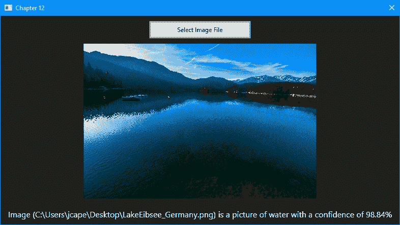

# 在 ML.NET 中使用 TensorFlow

在本章中，我们将使用预训练的 TensorFlow 模型，特别是 Inception 模型，并将该模型集成到一个**Windows Presentation Foundation**(**WPF**)应用程序中。 我们将采用预先训练的模型并应用迁移学习，通过添加一些食物和水体的图片。 迁移学习完成后，我们允许用户选择自己的图像。 在本章结束时，你应该对如何将 TensorFlow 模型集成到你的 ML.NET 应用程序中有一个牢固的掌握。

本章将涵盖以下主题:

*   分解谷歌的 Inception 模型
*   创建图像分类桌面应用程序
*   探索其他生产应用程序增强功能

# 分解谷歌的 Inception 模型

谷歌的 Inception 模型([https://github.com/google/inception](https://github.com/google/inception))经过数百万张图像的训练，以帮助解决我们社会日益增长的一个问题——我的图像是什么? 类型的应用程序想要回答这个问题的范围从匹配的脸,自动检测武器或不必要的对象,体育品牌游戏图片(如品牌运动鞋),和图像存储服务器,为用户提供他们需要的支持搜索没有手动标记,这些只是其中一部分。

这类问题通常用**对象识别**来回答。 一个你可能已经熟悉的物体识别应用是**光学****字符****识别**(**OCR**)。 OCR 是指字符的图像可以被解释为文本，比如微软的 OneNote 手写体转换为文本的功能，或者在收费站读取车牌的功能。 我们将要专门研究的物体识别的特殊应用叫做**图像分类**。

Inception 模型通过使用深度学习对图像进行分类来帮助解决这个问题。 该模型以监督的方式对数百万张图像进行训练，输出为神经网络。 这种方法的优点是，预先构建的模型可以用更小的图像子集进行增强，这也是我们将在本章的下一节中所做的。 这种添加额外数据和标签的方法称为**转移****学习**。 这种方法在创建特定于客户的模型时也很有用。

就像在 GitHub 中从你的主分支中创建一个分支; 您可能希望只添加一个类或修改一个元素，而不必重新创建整个代码基。 在模型方面，以汽车的图像分类器为例。 让我们假设您获得了数百万张覆盖美国和外国汽车、卡车、货车等的图片。 一个新客户来找您，要求您创建一个模型来帮助监视进入政府设施的车辆。 以前的车型不应该扔掉，也不需要完全重新训练，只需要添加更多的商用(或军用)车辆的标签就可以了。

For a larger and more in-depth deep dive into Google's image classification, a good resource is their developer documentation, which can be found from [https://developers.google.com/machine-learning/practica/image-classification/](https://developers.google.com/machine-learning/practica/image-classification/).

# 创建 WPF 图像分类应用程序

如前所述，我们将要创建的应用程序是一个图像分类应用程序，特别允许用户选择图像并确定它是食物还是水。 这是通过前面提到的，包括预训练的 TensorFlow Inception 模型来实现的。 第一次运行应用程序时，使用映像和`tags.tsv`文件对模型的 ML.NET 版本进行训练(将在下一节中查看)。

与前面的章节一样，完整的项目代码、示例数据集和项目文件可以在这里下载:[https://github.com/PacktPublishing/Hands-On-Machine-Learning-With-ML.NET/tree/master/chapter12](https://github.com/PacktPublishing/Hands-On-Machine-Learning-With-ML.NET/tree/master/chapter12)[。](https://github.com/PacktPublishing/Hands-On-Machine-Learning-With-ML.NET/tree/master/chapter10)

# 探索项目架构

在本章中，我们将深入研究 WPF 桌面应用程序。 正如本章第一节提到的，我们将使用 WPF 框架来创建我们的应用程序。 您可能会问，为什么不创建一个 UWP 应用程序，比如我们在[第 10 章](10.html)，*中创建的浏览器应用程序，使用 ML.NET 与 UWP*? 其原因是，至少在撰写本文时，TensorFlow 支持，特别是对图像分类的支持，在 UWP 应用程序中并没有得到完全支持。 也许，在 ML.NET 的未来版本中，会添加这一功能。 对于其他非基于图像的应用程序，你可以在 UWP 应用程序中使用 TensorFlow。

那些以前做过 WPF 开发并仔细观察过的人会注意到这个项目使用了。net Core 3.1。 在。net Core 3.0 中，微软增加了对 WPF 和 WinForms 的支持，因此，在 GUI 开发中，你不再被绑定在仅限 windows 的。net 框架上。 相反，这种支持是通过`Microsoft.WindowsDesktop.App.WPF`NuGet 包添加的。

在这个例子中，我们将使用`Microsoft.ML`(1.3.1)NuGet 包——除了几个额外的 NuGet 包——来在我们的。net 应用程序中使用 TensorFlow。 这些措施包括:

*   `Microsoft.ML.ImageAnalytics`(1.3.1)
*   `Microsoft.ML.TensorFlow`(1.3.1)
*   `SciSharp.TensorFlow.Redist`(1.14.0)

当你读到这篇文章的时候，这些包可能已经有了更新的版本，它们应该可以工作了，然而，上面提到的版本是我们将在这篇文章中使用的版本，以及在 GitHub 存储库中可用的版本。

在下面的截图中，您将找到解决方案的 Visual Studio 解决方案资源管理器视图。 由于 TensorFlow 对项目类型和 CPU 目标的支持更加特殊，我们回到了单个项目，而不是前面几个章节中使用的三个项目的架构:


`tags.tsv`文件(在代码存储库的`assets\images`文件夹中找到)包含 8 行，它们将包含的图像映射到预分类:

```cs
ChickenWings.jpg food
Steak.jpg food
Pizza.jpg food
MongolianGrill.jpg food
Bay.jpg water
Bay2.jpg water
Bay3.jpg water
Beach.jpg water
```

如果您想试验您自己的分类，请删除包含的图像，复制您的图像，并使用标签更新`tags.tsv`文件。 我应该指出的是，所有这些照片都是我在加州的各种假期中拍摄的——你可以随意使用它们。

`img/inception`文件夹中的文件包含所有谷歌预训练文件(和许可文件)。

# 深入研究 WPF 图像分类应用

正如开头部分所讨论的，我们的桌面应用程序是一个 WPF 应用程序。 这个例子的范围,在[第十章](10.html),*使用 ML.NET UWP*,我们使用标准的方法来处理应用程序架构遵循**Model-View-ViewModel**(**MVVM**)设计模式。

我们将在本节中深入讨论的文件如下:

*   `MainWindowViewModel`
*   `MainWindow.xaml`
*   `MainWindow.xaml.cs`
*   `BaseML`
*   `ImageDataInputItem`
*   `ImageDataPredictionItem`
*   `ImageClassificationPredictor`

WPF 项目中其余的文件都是默认的 Visual Studio .NET Core 3.1 WPF 应用程序模板; 例如:`App.xaml`和`AssemblyInfo.cs`文件。

# MainWindowViewModel 类

类的目的是包含我们的业务逻辑和控制视图，如下所示:

1.  我们要做的第一件事是实例化前面讨论过的`ImageClassificationPredictor`类，这样它就可以用来运行预测:

```cs
private readonly ImageClassificationPredictor _prediction = new ImageClassificationPredictor();
```

2.  下一段代码处理 MVVM 对分类字符串的功能，并存储选定的图像。 对于这些属性，我们在值发生变化时调用`OnPropertyChanged`，这会触发绑定视图来刷新绑定到这些属性的任何字段:

```cs
private string _imageClassification;

public string ImageClassification
{
    get => _imageClassification;

    set
    {
        _imageClassification = value;
        OnPropertyChanged();
    }
}

private ImageSource _imageSource;

public ImageSource SelectedImageSource
{
    get => _imageSource;

    set
    {
        _imageSource = value;
        OnPropertyChanged();
    }
}
```

3.  接下来，我们定义`Initialize`方法，它调用预测器的`Initialize`方法。 该方法将返回一个元组，它指示模型是否无法加载或是否未找到，以及异常(如果抛出):

```cs
public (bool Success, string Exception) Initialize() => _prediction.Initialize();
```

4.  然后，我们处理用户单击 Select Image 按钮时发生的情况。 此方法将打开一个对话框，提示用户选择图像。 如果用户取消对话框，该方法返回。 否则，我们调用两个助手方法将图像加载到内存中，并对图像进行分类:

```cs
public void SelectFile()
{
    var ofd = new OpenFileDialog
    {
        Filter = "Image Files(*.BMP;*.JPG;*.PNG)|*.BMP;*.JPG;*.PNG"
    };

    var result = ofd.ShowDialog();

    if (!result.HasValue || !result.Value)
    {
        return;
    }

    LoadImageBytes(ofd.FileName);

    Classify(ofd.FileName);
}
```

5.  `LoadImageBytes`方法获取文件名，并将图像加载到基于 mvvm 的`ImageSource`属性中，因此，选择后，图像控件将自动更新为所选图像的视图:

```cs
private void LoadImageBytes(string fileName)
{
    var image = new BitmapImage();

    var imageData = File.ReadAllBytes(fileName);

    using (var mem = new MemoryStream(imageData))
    {
        mem.Position = 0;

        image.BeginInit();

        image.CreateOptions = BitmapCreateOptions.PreservePixelFormat;
        image.CacheOption = BitmapCacheOption.OnLoad;
        image.UriSource = null;
        image.StreamSource = mem;

        image.EndInit();
    }

    image.Freeze();

    SelectedImageSource = image;
}
```

6.  最后，`Classify`方法获取路径并将其传递给`Predictor`类。 返回预测后，分类和置信度被构建到我们的 MVVM`ImageClassification`属性中，因此，UI 会自动更新:

```cs
public void Classify(string imagePath)
{
 var result = _prediction.Predict(imagePath);

 ImageClassification = $"Image ({imagePath}) is a picture of {result.PredictedLabelValue} with a confidence of {result.Score.Max().ToString("P2")}";
}
```

`MainWindowViewModel`类的最后一个元素与我们在[第 10 章](10.html)、*中定义的`OnPropertyChanged`方法相同，它允许 MVVM 魔法发生。 在定义了`ViewModel`类之后，让我们转向`MainWindow`XAML 文件。*

# 主窗口。 xaml 类

正如在[第 10 章](10.html)、*使用 ML.NET 与 UWP*的*分解 UWP 架构*部分所讨论的，当描述开发时，XAML 标记被用来定义用户界面。 对于这个应用程序的范围，我们的 UI 相对简单:`Button`、`Image Control`和`TextBlock`。

我们现在来看看代码:

1.  我们首先定义的是网格。 在 XAML 中，网格是一个容器，类似于 web 开发中的`<div>`。 然后定义行。 类似于 Bootstrap(但在我看来更容易理解)，它预先定义了每一行的高度。 将一行设置为`Auto`将自动调整高度为内容的高度，而星号则转换为根据主容器的高度使用所有剩余的高度:

```cs
<Grid.RowDefinitions>
    <RowDefinition Height="Auto" />
    <RowDefinition Height="*" />
    <RowDefinition Height="Auto" />
</Grid.RowDefinitions>
```

2.  我们首先定义我们的`Button`对象，它将触发前面提到的`ViewModel`类中的`SelectFile`方法:

```cs
<Button Grid.Row="0" Margin="0,10,0,0" Width="200" Height="35" Content="Select Image File" HorizontalAlignment="Center" Click="btnSelectFile_Click" />
```

3.  然后定义我们的`Image`控件，该控件绑定到前面提到的`ViewModel`类中的`SelectedImageSource`属性:

```cs
<Image Grid.Row="1" Margin="10,10,10,10" Source="{Binding SelectedImageSource}" />
```

4.  然后添加`TextBlock`控件来显示我们的分类:

```cs
<TextBlock Grid.Row="2" Text="{Binding ImageClassification, Mode=OneWay}" TextWrapping="Wrap" Foreground="White" Margin="10,10,10,10" HorizontalAlignment="Center" FontSize="16" />
```

在定义了 View 的 XAML 方面之后，现在让我们深入研究`MainWindow`类背后的代码。

# MainWindow.xaml.cs 文件

`MainWindow.xaml.cs`文件包含 XAML 视图背后的代码，在这里讨论:

1.  我们定义的第一件事是围绕`DataContext`属性的包装器属性，它内置在基类`Window`中:

```cs
private MainWindowViewModel ViewModel => (MainWindowViewModel) DataContext;
```

2.  接下来，我们定义`MainWindow`的构造函数，以便将`DataContext`属性初始化为`MainWindowViewModel`对象。 如果初始化失败，我们不希望应用程序继续。 另外，我们需要使用`MessageBox`对象让用户知道失败的原因:

```cs
public MainWindow()
{
    InitializeComponent();

    DataContext = new MainWindowViewModel();

    var (success, exception) = ViewModel.Initialize();

    if (success)
    {
        return;
    }

    MessageBox.Show($"Failed to initialize model - {exception}");

    Application.Current.Shutdown();
}
```

3.  最后，我们调用 ViewModel 的`SelectFile`方法来处理图像的选择和分类:

```cs
private void btnSelectFile_Click(object sender, RoutedEventArgs e) => ViewModel.SelectFile();
```

有了`MainWindow`类背后的代码，WPF 组件就结束了。 现在让我们关注示例中的机器学习部分。

# BaseML 类

在前面的大多数示例中使用的`BaseML`类为我们的 ML.NET 类公开了一个基类。 在本例中，由于使用预训练模型的性质，我们实际上对类进行了简化。 这个类现在只初始化`MLContext`属性:

```cs
public class BaseML
{
    protected MLContext MlContext;

    public BaseML()
    {
        MlContext = new MLContext(2020);
    }
}
```

在回顾了简化的`BaseML`类之后，让我们进入`ImageDataInputItem`类。

# ImageDataInputItem 类

`ImageDataInputItem`类包含要传递给模型的类; 本质属性为`ImagePath`属性:

```cs
public class ImageDataInputItem
{
    [LoadColumn(0)]
    public string ImagePath;

    [LoadColumn(1)]
    public string Label;
}
```

虽然比我们的大多数输入类要小，Inception 模型只需要两个属性。 现在，让我们深入研究称为`ImageDataPredictionItem`的输出类。

# ImageDataPredictionItem 类

`ImageDataPredictionItem`类包含预测响应，包括预测值字符串的置信度(在包含图像的情况下包含`Water`或`Food`):

```cs
public class ImageDataPredictionItem : ImageDataInputItem
{
    public float[] Score;

    public string PredictedLabelValue;
}
```

与输入类非常相似，输出类只有两个属性，与前面的示例类似。 有了输入和输出类之后，让我们进入`ImageClassificationPredictor`类，它使用这些类进行迁移学习和预测。

# ImageClassificationPredictor 类

`ImageClassificationPredictor`类包含了所有需要加载和预测初始 TensorFlow 模型的代码:

1.  首先，我们需要定义几个助手变量来访问图像和`.tsv`文件:

```cs
// Training Variables
private static readonly string _assetsPath = Path.Combine(Environment.CurrentDirectory, "assets");
private static readonly string _imagesFolder = Path.Combine(_assetsPath, "images");
private readonly string _trainTagsTsv = Path.Combine(_imagesFolder, "tags.tsv");
private readonly string _inceptionTensorFlowModel = Path.Combine(_assetsPath, "inception", "tensorflow_inception_graph.pb");

private const string TF_SOFTMAX = "softmax2_pre_activation";
private const string INPUT = "input";

private static readonly string ML_NET_MODEL = Path.Combine(Environment.CurrentDirectory, "chapter12.mdl");
```

2.  接下来，我们定义预训练的初始模型需要的设置:

```cs
private struct InceptionSettings
{
    public const int ImageHeight = 224;
    public const int ImageWidth = 224;
    public const float Mean = 117;
    public const float Scale = 1;
    public const bool ChannelsLast = true;
}
```

3.  接下来，我们创建我们的`Predict`方法并重载该方法，该方法仅采用映像文件路径。 与前面的例子一样，我们通过调用`MLContext`对象来创建`PredictionEngine`，传入输入类(`ImageDataInputItem`)和输出类(`ImageDataPredictionItem`)，然后调用`Predict`方法来获得我们的模型预测:

```cs
public ImageDataPredictionItem Predict(string filePath) => 
    Predict(new ImageDataInputItem 
        {
            ImagePath = filePath 
        }
    );

public ImageDataPredictionItem Predict(ImageDataInputItem image)
{
    var predictor = MlContext.Model.CreatePredictionEngine<ImageDataInputItem, ImageDataPredictionItem>(_model);

    return predictor.Predict(image);
}
```

4\. 最后，我们用自己的样本初始化和扩展我们的预训练模型:

```cs
public (bool Success, string Exception) Initialize()
{
    try
    {
        if (File.Exists(ML_NET_MODEL))
        {
            _model = MlContext.Model.Load(ML_NET_MODEL, out DataViewSchema modelSchema);

            return (true, string.Empty);
        }

       ...
    }
    catch (Exception ex)
    {
        return (false, ex.ToString());
    }
} 
```

完整的代码，请参考以下 GitHub 存储库链接:[https://github.com/PacktPublishing/Hands-On-Machine-Learning-With-ML.NET/blob/master/chapter12/chapter12.wpf/ML/ImageClassificationPredictor.cs](https://github.com/PacktPublishing/Hands-On-Machine-Learning-With-ML.NET/blob/master/chapter12/chapter12.wpf/ML/ImageClassificationPredictor.cs)。 完成了`Initialize`方法后，代码就完成了。 现在让我们运行应用程序!

# 运行图像分类应用程序

因为我们使用的是预先训练过的模型，所以我们可以从 Visual Studio 运行应用程序。 在运行应用程序时，你会看到一个几乎为空的窗口:


单击 Select Image File 按钮，然后选择一个图像文件将触发模型运行。 在我的例子中，我选择了最近去德国度假时的一张照片，得到了 98.84%的信任度评分:



您可以自由地尝试机器上的各种文件，以查看可信度评分和分类——如果您开始注意到问题，就向映像文件夹和`tags.tsv`文件中添加更多示例，如前面部分所述。 在进行这些更改之前，一定要删除`chapter12.mdl`文件。

# 额外的改进想法

现在我们已经完成了我们的深入研究，有几个额外的元素可能会进一步增强应用程序。 这里讨论了一些想法。

# 根据最终用户的输入进行自我培训

如本章开篇所述，迁移学习的优点之一是能够在动态应用中使用迁移学习。 与本书中回顾的以前的示例应用程序不同，这个应用程序实际上允许最终用户选择一系列(或文件夹)图像，并通过一些代码更改，构建新的`.tsv`文件并训练新的模型。 对于 web 应用程序或商业产品，这将提供很高的价值，也将减轻您的负担，例如，获取各种类型的图像——这是一个令人生畏且很可能是徒劳的目标。

# 日志记录

所*日志*的[第十章](10.html),*使用 ML.NET UWP*,有一个桌面应用程序都有其优点和缺点。最大的反对迫使需要日志是你的桌面应用程序可以安装在任意数量的配置 Windows 7 - 10 日 几乎有无限的排列。 如前所述，强烈建议使用 NLog([https://nlog-project.org/](https://nlog-project.org/))或类似的开源项目进行日志记录，同时使用远程日志记录解决方案(如 Loggly)，这样您就可以从用户的机器中获取错误数据。 考虑到 GDPR 和最近的 CCPA，我们需要确保离开最终用户机器的数据得到传递，并且这些日志不包括个人数据(或通过日志机制上载到远程服务器的实际图像)。

# 利用数据库

类似的性能优化建议[第十章](10.html),*使用 ML.NET UWP*,如果用户选择不止一次相同的图像,特别是如果这个应用程序被用于 kiosk 或转换为一个 web 应用程序,存储的性能优势的分类可能是相当重要的。 一种快速而简单的方法是对图像执行 SHA256，并在数据库中检查哈希值。 根据用户的数量，如果他们是并发的，我会建议以下两种选择之一:

*   如果用户每次只访问一个，并且应用程序将保持 WPF 应用程序，那么建议使用前面提到的轻量级数据库——litdb([http://www.litedb.org/](http://www.litedb.org/))。
*   如果你使用产品启动一个大型 web 应用程序，那么推荐 MongoDB 或水平可扩展的数据库，如微软的 CosmosDB，以确保数据库查找不会比简单地重新执行模型预测慢。

# 总结

在本章的过程中，我们已经深入了解了如何使用预训练的 TensorFlow 模型创建 WPF 应用程序。 我们也回顾和仔细观察了谷歌的图像分类 Inception 模型。 此外，我们学习了如何采用该模型并集成它，以便对用户选择的图像进行图像分类。 最后，我们还讨论了进一步增强示例应用程序的一些方法。

在下一章和最后一章中，我们将集中讨论在 WPF 应用程序中使用预训练的 ONNX 模型进行对象检测。