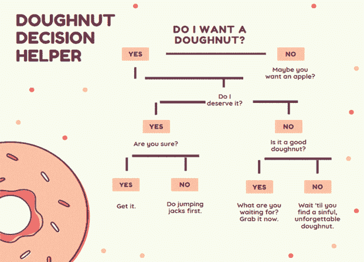
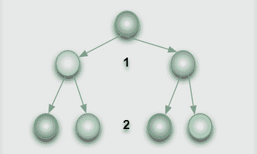
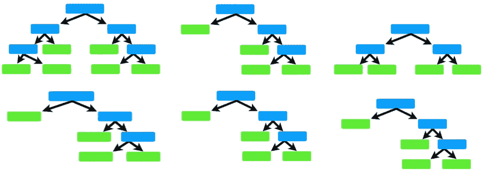

# 三、决策树与随机森林

决策树和随机林是可以用来为应用程序添加功能的强大技术。让我们浏览一下一些概念和代码，希望您能很快安装并运行起来。

在本章中，我们将学习决策树和随机森林。我们将：

*   通过大量代码示例向您展示如何将此强大功能添加到应用程序中
*   讨论决策树
*   讨论随机森林

# 技术要求

您需要在系统中安装 Microsoft Visual Studio。您可能还需要参考开源 SharpLearning framework 的 GitHub 存储库，网址为[https://github.com/mdabros/SharpLearning](https://github.com/mdabros/SharpLearning) 。

查看以下视频以查看代码的作用：[http://bit.ly/2O1Lbhr](http://bit.ly/2O1Lbhr) 。

# 决策树

决策树可用于分类和回归。决策树以是/否、对/错回答顺序问题。基于这些响应，树遵循预定的路径来达到其目标。树更正式地说是有向无环图的一个版本。最后，使用整个数据集和所有特征构建决策树。

下面是一个决策树的示例。您可能不知道它是一个决策树，但您肯定知道这个过程。有人要甜甜圈吗？



如您所见，决策树的流程从顶部开始，向下运行，直到达到特定的结果。树的根是分割数据集的第一个决定。树根据每个节点的**拆分度量**递归拆分数据集。两个最流行的指标是**基尼杂质**和**信息增益**。

这里是决策树的另一个描述，尽管没有大甜甜圈！



决策树的*深度*表示到目前为止已经提出了多少问题。这是树所能达到的深度（可能被问的问题总数），即使使用较少的问题可以获得一些结果。例如，使用前面的图表，在 1 个问题之后可以得到一些结果，在 2 个问题之后可以得到一些结果。因此，该决策树的*深度*为 2。

# 决策树优势

以下是使用决策树的一些优点：

*   简单的解释。
*   直观、自解释的可视化。
*   可以很容易地复制。
*   可以处理数字和分类数据。
*   在非常大的数据集上表现良好。
*   通常情况下，速度非常快。
*   在深度方面，树的位置允许轻松可视化哪些功能是重要的。重要性由树的深度表示。

# 决策树缺点

以下是使用决策树的一些缺点：

*   在每个节点，算法需要确定正确的选择。一个节点上的最佳选择不一定是整个树的最佳选择。
*   如果一棵树很深，它很容易发生所谓的过度装修。
*   决策树可以记住训练集。

# 我们什么时候应该使用决策树？

以下是何时使用决策树的一些示例：

*   当你想要一个简单且可解释的模型时
*   模型何时应为非参数化的
*   当您不想担心特征选择时

# 随机森林

我们已经讨论了决策树，现在是讨论随机森林的时候了。基本上，随机森林是决策树的集合。在随机森林中，随机选择总行数和特征数的一小部分进行训练。然后在此子集上构建决策树。然后，此集合将结果聚合为单个结果。

随机森林也可以减少偏差和方差。他们是怎么做到的？通过对不同的数据样本进行训练，或使用随机特征子集。让我们举个例子。假设我们有 30 个功能。一个随机林可能只使用其中的 10 个特性。这就留下了 20 个未使用的特性，但这 20 个特性中的一些可能很重要。请记住，随机林是决策树的集合。因此，在每棵树中，如果我们利用 10 个特征，随着时间的推移，由于平均定律，我们的大部分特征（如果不是全部的话）都会被包括在内。因此，正是这种包含帮助限制了我们因偏差和方差而产生的误差。

对于大型数据集，树的数量可能会增长得相当大，有时会增长到数万棵甚至更多，这取决于您使用的功能的数量，因此您需要注意性能。

下面是一张随机森林的示意图：



# 随机森林优势

以下是使用随机林的一些优点：

*   比单个决策树更健壮
*   随机森林包含许多决策树，因此能够限制过度拟合和错误
*   在深度方面，位置显示哪些特征有助于分类或回归以及它们的相对重要性
*   可用于回归和分类
*   默认参数就足够了
*   快速训练

# 随机森林劣势

以下是使用随机林的一些缺点：

*   随机森林需要并行进行，以提高速度
*   一旦经过训练，预测的创建可能会很慢
*   更高的精度需要更多的树，这可能会导致模型速度变慢

# 我们什么时候应该使用随机森林？

以下是使用随机林的一些示例：

*   当模型解释不是最重要的标准时。解释不会像一棵树那么容易。
*   当模型的准确性是最重要的。
*   当需要稳健的分类、回归和特征选择分析时。
*   以防止安装过度。
*   图像分类。
*   推荐引擎。

# 锐利学习

现在让我们把注意力转向一个令人难以置信的开源软件包，SharpLearning。**SharpLearning**是一个优秀的机器学习框架，用于个人学习机器学习的许多方面，包括决策树和随机森林，如前几节所述。在深入研究一些代码示例和示例应用程序之前，让我们先花几分钟熟悉一些东西。

# 术语

在本章中，您将看到以下术语的使用。以下是它们各自含义的上下文：

*   **学习者**：指机器学习算法。
*   **模型**：指机器学习模型。
*   **超参数**：这些参数用于调整和调节（希望是）机器学习模型。
*   **目标**：这些通常被称为因变量。在大多数符号中，这将是*y*。这些是我们正在尝试建模的值。
*   **观察**：这是特征矩阵，包含了我们目前掌握的关于目标的所有信息。在大多数符号中，这将是*x*。

在我们的大多数示例中，我们将重点讨论 SharpLearning 中的两个名称空间。他们是：

*   `SharpLearning.DecisionTrees`
*   `SharpLearning.RandomForest`

有了这些，让我们开始深入研究 SharpLearning，并向您展示一些有关其工作原理的概念。

# 加载和保存模型

SharpLearning 可以非常轻松地将模型加载并保存到磁盘。这是机器学习库中非常重要的一部分，SharpLearning 是最容易实现的方法之一。

SharpLearning 中的所有模型都有`Save`和`Load`方法。这些方法为我们完成了保存和加载模型的繁重工作。

作为一个例子，这里我们将把我们学到的一个模型保存到磁盘：

```cs
model.Save(() => StreamWriter(@"C:\randomforest.xml"));
```

如果我们想重新加载此模型，只需使用`Load`方法：

```cs
varloadedModel = RegressionForestModel.Load(() => newStreamReader(@"C:\randomforest.xml"));
```

是的，加载和保存数据模型非常简单。您还可以使用序列化保存模型。这将允许我们在 XML 和二进制格式之间进行选择。SharpLearning 的另一个非常好的设计特性是，序列化模型允许我们序列化到`IPredictorModel`接口。如果每个模型都符合该接口，这将使替换模型变得更加容易。我们可以这样做：

```cs
varxmlSerializer = new GenericXmlDataContractSerializer();
xmlSerializer.Serialize<IPredictorModel<double>>(model, 
 () => new StreamWriter(@"C:\randomforest.xml"));
var loadedModelXml = xmlSerializer
.Deserialize<IPredictorModel<double>>(() => new StreamReader(@"C:\randomforest.xml"));
```

| **算法** | **列车错误** | **测试错误** |
| --- | --- | --- |
| 回归决策树学习器（默认） | 0.0518 | 0.4037 |

在这里，你有即时的训练和测试错误。

When reporting the performance of your model, you should always use the test error even if the training error is lower, since that is an estimate of how well the model generalizes to new data.

现在，让我们来谈谈**超参数**。超参数是影响机器学习算法学习过程的参数。您可以调整它们以调整流程并提高性能和可靠性。同时，您也可能错误地调整参数，使某些参数无法正常工作。让我们看一下，如果超参数调整不当，可能会发生的一些情况：

*   如果模型过于复杂，则最终可能会出现所谓的高方差，或**过度拟合**
*   如果模型过于简单，则最终会出现所谓的高偏差，或**拟合不足**

对于那些还没有这样做的人来说，手动调优 hyperparameters（这是一个几乎在每个用例中都会发生的过程）可能会占用您大量的时间。随着超参数数量随模型的增加而增加，调整时间和工作量也随之增加。最好的解决方法是使用优化器，让工作为您完成。为此，SharpLearning 可以为我们提供巨大的帮助，因为它有许多可用的优化器。下面列出了其中的一些：

*   网格搜索
*   随机搜索
*   粒子群（我们将在[第 7 章](07.html)中讨论，*用 PSO*代替反向传播）
*   贝叶斯优化
*   全球化有界内尔德米德

让我们从一个例子开始。

让我们创建一个学习者并使用默认参数，这很可能已经足够好了。一旦我们找到参数并创建学习者，我们就需要创建模型。然后，我们将预测训练和测试集。一旦所有这些都完成，我们将测量测试集上的错误并记录它：

```cs
// create learner with default parameters
var learner = new RegressionSquareLossGradientBoostLearner(runParallel: false);
// learn model with found parameters
var model = learner.Learn(trainSet.Observations, trainSet.Targets);
// predict the training and test set.
var trainPredictions = model.Predict(trainSet.Observations);
var testPredictions = model.Predict(testSet.Observations);
// since this is a regression problem we are using square error as metric
// for evaluating how well the model performs.
var metric = new MeanSquaredErrorRegressionMetric();
// measure the error on the test set.
var testError = metric.Error(testSet.Targets, testPredictions);
```

这是我们的测试集错误

| **算法** | **测试错误** |
| --- | --- |
| 回归 SquareLossGradientBoostLearner（默认） | 0.4984 |

这一部分完成后，我们现在已经建立了基线。让我们使用一个`RandomSearchOptimizer`来调整超参数，看看是否可以得到更好的结果。为此，我们需要建立超参数的边界，以便优化器知道如何进行调优。让我们看看我们是如何做到这一点的：

```cs
var parameters = new ParameterBounds[]
{
 new ParameterBounds(min: 80, max: 300, 
 transform: Transform.Linear, parameterType: ParameterType.Discrete), 
 new ParameterBounds(min: 0.02, max: 0.2, 
 transform: Transform.Logarithmic, parameterType: ParameterType.Continuous), 
 new ParameterBounds(min: 8, max: 15, 
 transform: Transform.Linear, parameterType: ParameterType.Discrete), 
 new ParameterBounds(min: 0.5, max: 0.9, 
 transform: Transform.Linear, parameterType: ParameterType.Continuous), 
 new ParameterBounds(min: 1, max: numberOfFeatures, 
 transform: Transform.Linear, parameterType: ParameterType.Discrete), 
};
```

你注意到我们用对数变换来计算学习率了吗？你知道我们为什么这么做吗？答案是：确保我们在整个价值范围内的分布更加均匀。我们的最小值和最大值之间有很大的差异（0.02->0.2），所以对数变换是最好的。

我们现在需要一个*验证集*来帮助我们衡量在优化过程中，模型对未知数据的概括程度。为此，我们需要进一步分割训练数据。为了做到这一点，我们将把当前的测试放在优化过程之外。如果我们不这样做，我们就有可能在最终误差估计中获得正偏差，而这将不是我们想要的：

```cs
var validationSplit = new RandomTrainingTestIndexSplitter<double>(trainingPercentage: 0.7, seed: 24)
.SplitSet(trainSet.Observations, trainSet.Targets);
```

优化器还需要一个目标函数。函数将采用双数组作为输入（包含超参数集），并返回一个包含验证错误和相应超参数集的`OptimizerResult`：

```cs
Func<double[], OptimizerResult> minimize = p =>
 {
 var candidateLearner = new RegressionSquareLossGradientBoostLearner(
 iterations: (int)p[0],
learningRate: p[1], 
maximumTreeDepth: (int)p[2], 
subSampleRatio: p[3], 
featuresPrSplit: (int)p[4],
runParallel: false);
 var candidateModel = candidateLearner.Learn(validationSplit.TrainingSet.Observations,
validationSplit.TrainingSet.Targets);
 var validationPredictions = candidateModel.Predict(validationSplit.TestSet.Observations);
 var candidateError = metric.Error(validationSplit.TestSet.Targets, validationPredictions);
 return new OptimizerResult(p, candidateError);
};
```

一旦定义了这个`objective`函数，我们现在就可以创建并运行优化器来找到最佳的参数集。让我们从运行优化器 30 次迭代开始，并尝试 30 组不同的超参数：

```cs
// create our optimizer
var optimizer = new RandomSearchOptimizer(parameters, iterations: 30, runParallel: true);
// find the best hyperparameters for use
var result = optimizer.OptimizeBest(minimize);
var best = result.ParameterSet;
```

一旦我们运行它，我们的优化器就会找到最佳的超参数集。让我们看看它发现了什么：

*   `Trees`：277
*   `learningRate`：0.035
*   `maximumTreeDepth`：15
*   `subSampleRatio`：0.838
*   `featuresPrSplit`：4

进步现在我们有了一组最佳超参数，这些参数是在我们的验证集上测量的，我们可以使用这些参数创建一个学习者，并使用整个数据集学习一个新模型：

```cs
var learner = new RegressionSquareLossGradientBoostLearner(
 iterations: (int)best[0],
learningRate: best[1], 
maximumTreeDepth: (int)best[2], 
subSampleRatio: best[3],
featuresPrSplit: (int)best[4], 
runParallel: false);
var model = learner.Learn(trainSet.Observations, trainSet.Targets);
```

现在，我们的最终超参数集完好无损，我们将这些参数传递给学习者，并能够显著减少测试错误。对于我们来说，手动操作将花费我们永恒的时间！

| **算法** | **测试错误** |
| --- | --- |
| 回归 SquareLossGradientBoostLearner（默认） | 0.4984 |
| 回归 SquarelossGradientBoostLearner（优化器） | 0.3852 |

# 示例代码和应用程序

在接下来的几节中，我们将看到一些没有太多赘述的代码示例。这将是纯 C# 代码，因此它应该是所有人都容易理解的东西。

让我们快速了解一下如何使用 SharpLearning 来预测观察结果。我将向您展示一个完整的代码示例，没有详细说明：

```cs
var parser = new CsvParser(() =>new StringReader(Resources.AptitudeData));
var observations = parser.EnumerateRows(v => v != "Pass").ToF64Matrix();
var targets = parser.EnumerateRows("Pass").ToF64Vector();
var rows = targets.Length;
var learner = new ClassificationDecisionTreeLearner(100, 1, 2, 0.001, 42);
varsut = learner.Learn(observations, targets);
var predictions = sut.Predict(observations);
var evaluator = new TotalErrorClassificationMetric<double>();
var error = evaluator.Error(targets, predictions);
Assert.AreEqual(0.038461538461538464, error, 0.0000001);
```

# 保存模型

下面是一个代码示例，它将向您展示保存模型有多么容易：

```cs
var parser = new CsvParser(() =>new StringReader(Resources.AptitudeData));
var observations = parser.EnumerateRows(v => v != "Pass").ToF64Matrix();
var targets = parser.EnumerateRows("Pass").ToF64Vector();
var learner = new ClassificationDecisionTreeLearner(2);
var sut = learner.Learn(observations, targets);
var writer = new StringWriter();
sut.Save(() => writer);
```

# 均方误差回归度量

**均方误差**（**MSE**是测量误差平方平均值的度量。更具体地说，它测量估计值和估计值之间的平均距离。均方误差总是非负的，接近零的值被认为是更可接受的。SharpLearning 使计算此错误度量变得非常容易，如以下代码所示：

```cs
var targets = new double[] { 1.0, 2.3, 3.1, 4.4, 5.8 };
var predictions = new double[] { 1.0, 2.0, 3.0, 4.0, 5.0 };
var sut = new MeanSquaredErrorRegressionMetric();
var actual = sut.Error(targets, predictions);
```

# F1 成绩

要谈论 f1 分数，我们必须首先谈论*精度*和*回忆*。

**精度**是正确预测的阳性观察值除以总预测阳性观察值的比率。不太正式地说，在所有说他们要来的人中，有多少人来了？

**回忆**（敏感度）是正确预测的阳性观察值与所有观察值之比。

**F1 得分**则为准确度和召回率的加权平均值。

以下是我们如何使用 SharpLearning 计算 f1 分数：

```cs
var targets = new double[] { 0, 1, 1 };
var predictions = new double[] { 0, 1, 1 };
var sut = new F1ScoreMetric<double>(1);
var actual = sut.Error(targets, predictions);
Assert.AreEqual(0.0, actual);
```

# 优化

以下是如何使用*粒子群优化器*返回最佳最小化所提供函数的结果：

```cs
var parameters = new ParameterBounds[]
{
new ParameterBounds(-10.0, 10.0, Transform.Linear),
new ParameterBounds(-10.0, 10.0, Transform.Linear),
new ParameterBounds(-10.0, 10.0, Transform.Linear),
}; 
var sut = new ParticleSwarmOptimizer(parameters, 100);
var actual = sut.OptimizeBest(Minimize);
```

以下是如何使用*网格搜索优化器*通过尝试提供的参数的所有组合进行优化：

```cs
var parameters = new double[][] { new double[]{ 10.0, 20.0, 30.0, 35.0, 37.5, 40.0, 50.0, 60.0 } };
var sut = new GridSearchOptimizer(parameters);
var actual = sut.OptimizeBest(Minimize);
```

以下是如何使用*随机搜索优化器*在提供的最小值和最大值之间初始化随机参数。将返回最佳最小化所提供函数的结果：

```cs
var parameters = new ParameterBounds[] 
{
new ParameterBounds(0.0, 100.0, Transform.Linear)
};
var sut = new RandomSearchOptimizer(parameters, 100);
var actual = sut.OptimizeBest(Minimize);
```

# 示例应用程序 1

在掌握了所有这些知识之后，让我们继续编写我们的第一个示例程序。该程序本身非常简单，旨在展示用最少的代码在应用程序中实现这些技术是多么容易。为了向您展示我的确切意思，以下是程序的输出：


# 代码

下面是实现示例程序并生成先前输出的代码。正如您所看到的，代码非常简单，这里的所有内容（除了索引的混乱）都是我们之前已经看过的代码。我们将把冗长的内容保持在最低限度，这样您就可以专注于代码本身。此示例将读取我们的数据，将其解析为观察值和目标样本，然后使用 1000 棵树创建一个学习者。在此基础上，我们将使用学员学习和创建我们的模型。完成后，我们将计算均方误差度量并在屏幕上显示：

```cs
var parser = new CsvParser(() =>new StringReader(Resources.Glass));
var observations = parser.EnumerateRows(v => v != "Target").ToF64Matrix();
var targets = parser.EnumerateRows("Target").ToF64Vector();
int trees = 1000;
var sut = new RegressionExtremelyRandomizedTreesLearner(trees, 1, 100, 1, 0.0001, 1.0, 42, false);
var indices = Enumerable.Range(0, targets.Length).ToArray();
indices.Shuffle(new Random(42));
indices = indices.Take((int)(targets.Length * 0.7)).ToArray();
var model = sut.Learn(observations, targets, indices);
var predictions = model.Predict(observations);
var evaluator = new MeanSquaredErrorRegressionMetric();
var error = evaluator.Error(targets, predictions);
Console.WriteLine("Error: " + error);
```

# 样本应用 2–葡萄酒质量

在我们的下一个应用程序中，我们将使用我们的知识，根据创建的模型确定葡萄酒最重要的特性。以下是我们完成输出时的外观：


# 代码

这是我们应用程序的代码。和往常一样，我们首先加载数据并将其解析为观察值和目标样本集。由于这是一个回归样本，我们将使用数据样本的 70/30 分割：70%用于训练，30%用于测试。从那里，我们创建了我们的随机森林学习者，并创建了我们的模型。在此之后，我们计算训练和测试错误，并按重要性顺序打印特征重要性，如我们的模型所示：

```cs
var parser = new CsvParser(() =>new StreamReader(Application.StartupPath + "\\winequality-white.csv"));
var targetName = "quality";
// read in our feature matrix
var observations = parser.EnumerateRows(c => c != targetName).ToF64Matrix();
// read in our regression targets
var targets = parser.EnumerateRows(targetName).ToF64Vector();
// Since this is a regression problem, we use the random training/test set splitter. 30 % of the data is used for the test set. 
var splitter = new RandomTrainingTestIndexSplitter<double>(trainingPercentage: 0.7, seed: 24);
var trainingTestSplit = splitter.SplitSet(observations, targets);
var trainSet = trainingTestSplit.TrainingSet;
var testSet = trainingTestSplit.TestSet;
var learner = new RegressionRandomForestLearner(trees: 100);
var model = learner.Learn(trainSet.Observations, trainSet.Targets);
var trainPredictions = model.Predict(trainSet.Observations);
var testPredictions = model.Predict(testSet.Observations);
// since this is a regression problem we are using squared error as the metric
// for evaluating how well the model performs.
var metric = new MeanSquaredErrorRegressionMetric();
var trainError = metric.Error(trainSet.Targets, trainPredictions);
var testError = metric.Error(testSet.Targets, testPredictions);
Trace.WriteLine($"Train error: {trainError:0.0000} - Test error: {testError:0.0000}");
System.Console.WriteLine($"Train error: {trainError:0.0000} - Test error: {testError:0.0000}");

// the variable importance requires the featureNameToIndex from the dataset. 
// This mapping describes the relation from the column name to the associated 
// index in the feature matrix.
var featureNameToIndex = parser.EnumerateRows(c => c != targetName).First().ColumnNameToIndex;

var importances = model.GetVariableImportance(featureNameToIndex);

var importanceCsv = new StringBuilder();
importanceCsv.Append("FeatureName;Importance");
System.Console.WriteLine("FeatureName\tImportance");
foreach (var feature in importances)
{
importanceCsv.AppendLine();
importanceCsv.Append($"{feature.Key};{feature.Value:0.00}");
System.Console.WriteLine($"{feature.Key}\t{feature.Value:0.00}");
}
Trace.WriteLine(importanceCsv);
```

# 总结

在本章中，我们学习了决策树和随机森林。我们还学习了如何使用开源框架 SharpLearn 将这些强大的功能添加到我们的应用程序中。在下一章中，我们将学习面部和运动检测，并向您展示如何使用这项激动人心的技术启用您的应用程序！你会遇到我的宠物法国斗牛犬 Frenchie，他将展示我们将展示的大部分样品。还有，我们有一个客人装束，你只需要看看！

# 工具书类

*   [https://github.com/mdabros/SharpLearning](https://github.com/mdabros/SharpLearning)