# 人脸和运动检测

现在是我们进入一个真正整洁的应用程序的时候了。我们将从使用开源软件包[开始 http://www.aforgenet.com/](http://www.aforgenet.com/) 构建人脸和运动检测应用程序。要做到这一点，您需要在系统中安装一个摄像头来观看实时流媒体视频。从那里，我们将使用该摄像机检测人脸和运动。在本章中，我们将展示两个单独的示例：一个用于面部检测，另一个用于运动检测。我们将向您展示到底发生了什么，以及您可以以多快的速度将这些功能添加到应用程序中。

在本章中，我们将介绍以下主题：

*   面部检测
*   运动检测
*   如何使用本地视频集成摄像机
*   图像滤波/算法

让我们从面部检测开始。在我们的例子中，我将使用我友好的法国斗牛犬为我们摆姿势。在我这样做之前，请重新阅读章节标题。不管你读了多少遍，你都可能会错过这里的关键点。注意它说的是人脸*检测*而不是人脸*识别*。这非常重要，我想停下来，重新强调一下。我们不想确认乔、鲍勃或萨利的身份。我们正试图验证，通过我们的相机所看到的一切，我们能够*检测到*那里有一张脸。我们不关心它是谁的脸，只关心它是一张脸这一事实！在继续前进之前，我们必须理解这一点，否则你的期望会产生错误的偏见，你会让自己感到困惑和不安，我们不希望这样！

正如我稍后将再次强调的那样，面部检测是面部识别的第一部分，是一种复杂得多的野兽。如果你不能在屏幕上的所有东西中识别出一张或多张脸，那么你将永远无法识别这是谁的脸！

# 技术要求

作为先决条件，您需要在系统上安装 Microsoft Visual Studio（任何版本）。您还需要访问[上的开源协议框架 https://github.com/accord-net/framework](https://github.com/accord-net/framework) 。

查看以下视频以查看代码的作用：[http://bit.ly/2xH0thh](http://bit.ly/2xH0thh) 。

# 面部检测

现在，让我们快速查看一下我们的应用程序。您应该将示例解决方案加载到 Microsoft Visual Studio 中：

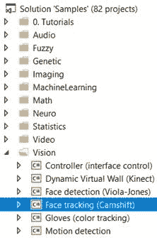

下面是我们运行的示例应用程序。大家向弗兰奇问好！

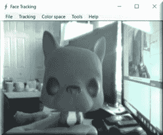

如您所见，我们有一个非常简单的屏幕，专门用于视频捕获设备。在本例中，笔记本电脑摄像头是我们的视频捕获设备。Frenchie 正在为我们在摄像机前摆姿势，一旦我们启用面部跟踪，看看会发生什么：

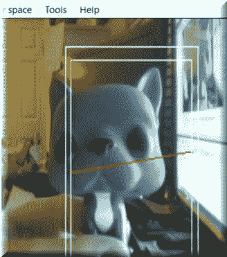

法国佬的面部特征正在被追踪。你在 Frenchie 周围看到的是跟踪容器（白色框）和我们的角度检测器（红线）。当我们移动 Frenchie 时，跟踪容器和角度探测器将跟踪他。这很好，但是如果我们在真实的人脸上启用面部跟踪，会发生什么呢？正如您在下面的屏幕截图中所看到的，跟踪容器和角度正在跟踪我们的客人装腔作势者的脸，就像它对 Frenchie 所做的那样：

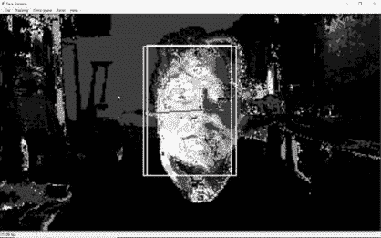

当我们的装腔作势者将他的头从一边移到另一边时，摄像机会跟踪到这一点，你可以看到角度检测器根据它识别的面部角度进行调整。在这种情况下，您会注意到颜色空间是黑白的，而不是彩色的。这是直方图反投影，您可以更改：

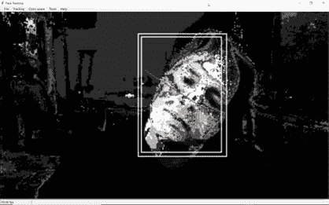

即使我们远离其他物体进入视野的摄像机，面部探测器也能在噪音中跟踪我们的面部。这正是你在电影中看到的面部识别系统的工作原理，尽管更加简单，几分钟内你也可以启动并运行自己的面部识别应用程序

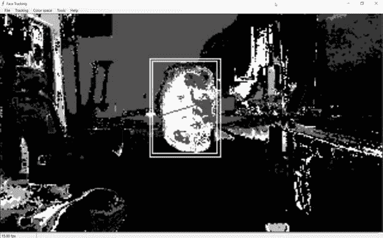

现在我们已经看到了外面，让我们看看引擎盖下面发生了什么。

我们需要扪心自问，到底我们要解决的问题是什么。嗯，我们正在尝试检测（注意我没有说识别）面部图像。虽然对人类来说很容易，但计算机需要非常详细的指令集来完成这一壮举。幸运的是，我们有一个非常著名的算法，叫做 Viola-Jones 算法，它将为我们完成繁重的工作。我们为什么选择这个算法

*   非常高的检测率和非常低的误报率。
*   非常擅长实时处理。
*   非常擅长从非人脸中检测人脸。人脸检测是人脸识别的第一步。

该算法要求相机具有正面正面的人脸正视图。要被检测到，人脸需要直接指向摄像机，不倾斜，不上下看。记住，目前我们只对面部检测感兴趣。

为了深入研究技术方面的问题，我们的算法需要四个阶段来完成它的工作。他们是：

*   Haar 特征选择
*   创造完整的形象
*   Adaboost 训练
*   级联分类器

我们必须首先说明所有人脸都有一些相似的特性，例如眼睛比上脸颊暗，鼻梁比眼睛亮，前额可能比脸的其他部分亮，等等。我们的算法通过使用所谓的**Haar 特征**来匹配这些特征。我们可以通过观察眼睛、嘴巴、鼻梁等的位置和大小，找到匹配的面部特征。然而，这是我们的问题。

在 24x24 像素窗口中，总共有 162336 个可能的功能。显然，如果这一切都能奏效的话，那么尝试和评估它们的成本将高得让人望而却步。因此，我们将使用一种称为**自适应增压**的技术，或者更常见的**自适应增压**。这是你的流行语列表中的另一个，你在任何地方都听到过，甚至可能读到过。我们的学习算法将使用 AdaBoost 来选择最佳特征并训练分类器使用它们。让我们停下来谈一会儿。

AdaBoost 可用于多种类型的学习算法，被认为是许多任务的最佳开箱即用算法。在切换到另一种算法并计时之前，您通常不会注意到它有多好、有多快。我已经做过无数次了，我可以告诉你，差别是非常明显的。

Boosting 获取其他弱学习算法的输出，并将其与加权和组合，加权和是 Boosting 分类器的最终输出。AdaBoost 的自适应部分来自这样一个事实，即后续学习者被调整以支持那些被先前分类器错误分类的实例。不过，我们必须小心准备数据，因为 AdaBoost 对嘈杂的数据和异常值很敏感（还记得我们在[第 1 章](01.html)、*快速复习*中是如何强调的吗）。与其他算法相比，该算法更倾向于过度拟合数据，这就是为什么在前面的章节中我们强调了缺失数据和异常值的数据准备。最后，如果*弱*学习算法比随机猜测更好，AdaBoost 可以成为我们过程中有价值的补充。

有了这个简短的描述，让我们来看看到底发生了什么。对于本例，我们将再次使用 Accord 框架，并使用 Vision Face Tracking 示例。您可以从其 GitHub 位置下载此框架的最新版本：[https://github.com/accord-net/framework](https://github.com/accord-net/framework) 。

我们首先创建一个`FaceHaarCascade`对象。此对象包含一组类似 Haar 的特征的弱分类阶段。将提供许多阶段，每个阶段包含一组分类器树，用于决策过程。我们现在正在技术上使用决策树。雅阁框架的美妙之处在于`FaceHaarCascade`自动为我们创建了所有这些阶段和树，而不让我们暴露细节。

让我们来看看一个特定的阶段可能是什么样子：

```cs
List<HaarCascadeStage> stages = new List<HaarCascadeStage>();
List<HaarFeatureNode[]> nodes;
HaarCascadeStage stage;
stage = new HaarCascadeStage(0.822689414024353); nodes = new List<HaarFeatureNode[]>();
nodes.Add(new[] { new HaarFeatureNode(0.004014195874333382, 0.0337941907346249, 0.8378106951713562, new int[] { 3, 7, 14, 4, -1 }, new int[] { 3, 9, 14, 2, 2 }) });
nodes.Add(new[] { new HaarFeatureNode(0.0151513395830989, 0.1514132022857666, 0.7488812208175659, new int[] { 1, 2, 18, 4, -1 }, new int[] { 7, 2, 6, 4, 3 }) });
nodes.Add(new[] { new HaarFeatureNode(0.004210993181914091, 0.0900492817163467, 0.6374819874763489, new int[] { 1, 7, 15, 9, -1 }, new int[] { 1, 10, 15, 3, 3 }) });
stage.Trees = nodes.ToArray(); stages.Add(stage);
```

如您所见，我们通过为每个阶段的节点提供每个特征的数值，在引擎盖下构建了一个决策树。

一旦创建，我们就可以使用级联对象来创建我们的`HaarObjectDetector`，这就是我们将用于检测的对象。需要：

*   我们的面部目标
*   搜索对象时要使用的最小窗口大小
*   我们的搜索模式在本例中，我们只搜索单个对象
*   在搜索期间重新缩放搜索窗口时要使用的重新缩放因子

```cs
HaarCascade cascade = new FaceHaarCascade();
detector = new HaarObjectDetector(cascade, 25, ObjectDetectorSearchMode.Single, 1.2f,
ObjectDetectorScalingMode.GreaterToSmaller);
```

一旦创建，我们准备好处理我们的视频收集源的主题。在我们的示例中，我们将简单地使用本地相机来捕获所有图像。然而，Accord.Net 框架使得使用其他来源进行图像捕获变得很容易，例如`.avi`文件、动画`.jpg`文件等等。

我们连接到相机，选择分辨率，然后准备就绪：

```cs
foreach (var cap in device?.VideoCapabilities)
 {
if (cap.FrameSize.Height == 240)
return cap;
if (cap.FrameSize.Width == 320)
return cap;
 }
return device?.VideoCapabilities.Last();
```

现在运行应用程序并选择视频源后，我们的应用程序将如下所示。再一次，进入弗兰奇的斗牛犬！请原谅，法国人不是最整洁的宠物

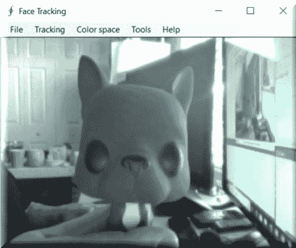

在本次演示中，您会注意到 Frenchie 正对着摄像机，在背景中，我们有 2 个 55 英寸的显示器，以及我妻子喜欢称之为*垃圾*（我们称之为*噪音*）！这样做是为了展示人脸检测算法如何将 Frenchie 的脸与其他任何东西区分开来！如果我们的检测器无法处理这一点，它将消失在噪音中，对我们没有什么用处。

随着我们的视频源的到来，我们需要在收到新帧时得到通知，以便我们能够处理它，应用标记，等等。我们通过附加到视频源播放器的`NewFrameReceived`事件处理程序来实现这一点，如下所示。NET 开发人员应该非常熟悉这一点：

```cs
this.videoSourcePlayer.NewFrameReceived += new Accord.Video.NewFrameEventHandler(this.videoSourcePlayer_NewFrame);
```

让我们看一下，每当我们收到新视频帧可用的通知时会发生什么。

我们需要做的第一件事是`downsample`图像，使其更易于使用：

```cs
ResizeNearestNeighbor resize = new ResizeNearestNeighbor(160, 120);
UnmanagedImagedownsample = resize.Apply(im);
```

如果图像的大小更易于管理，我们将处理帧。如果我们没有找到面部区域，我们将保持跟踪模式，等待一帧具有可检测面部的图像。如果我们发现了一个面部区域，我们将重置跟踪器，定位面部，减小其大小以清除任何背景噪声，初始化跟踪器，并将标记窗口应用于图像。所有这些都是通过以下代码实现的：

```cs
if (regions != null&&regions.Length>0)
 {
tracker?.Reset();
// Will track the first face found
Rectangle face = regions[0];
// Reduce the face size to avoid tracking background
Rectangle window = new Rectangle((int)((regions[0].X + regions[0].Width / 2f) * xscale),
 (int)((regions[0].Y + regions[0].Height / 2f) * yscale), 1, 1);
window.Inflate((int)(0.2f * regions[0].Width * xscale), (int)(0.4f * regions[0].Height * yscale));
if (tracker != null)
 {
tracker.SearchWindow = window;
tracker.ProcessFrame(im);
 }
marker = new RectanglesMarker(window);
marker.ApplyInPlace(im);
args.Frame = im.ToManagedImage();
tracking = true;
 }
else
 {
detecting = true;
 }
```

如果检测到人脸，我们的图像帧现在看起来如下所示：


如果 Frenchie 把头歪到一边，我们的图像框架现在看起来如下所示：

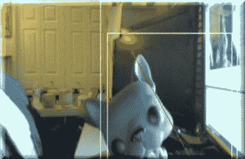

# 运动检测

现在，我们将使我们的焦点更大一点，并检测所有的运动，而不仅仅是人脸。同样，我们将使用 Accord.Net 进行此操作，并使用`Motion detection`示例。与面部识别一样，您将看到将此功能添加到应用程序并立即成为工作中的英雄是多么简单！让我们确保已将正确的项目加载到 Microsoft Visual Studio：

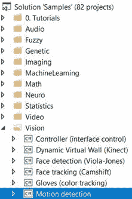

使用运动检测，屏幕上移动的任何东西都将以红色突出显示，因此使用以下屏幕截图，您可以看到手指在移动，但其他所有东西都保持静止：

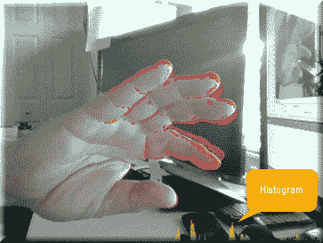

在下面的屏幕截图中，您可以看到更多的移动，用这只匿名手上的红色方块表示：

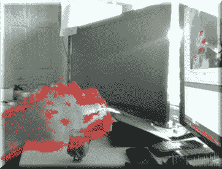

在以下屏幕截图中，您可以看到整个手都在移动：

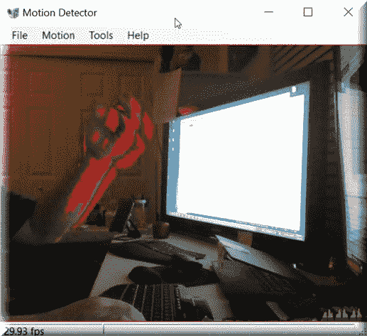

如果我们不希望处理整个屏幕区域的运动，我们可以定义*运动区域*，其中运动检测将仅在这些区域中发生。在下面的屏幕截图中，您可以看到我定义了一个运动区域。在接下来的屏幕截图中，您会注意到这是唯一一个处理运动的区域：

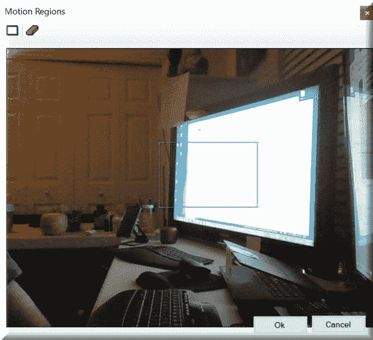

现在，如果我们为摄影机创建一些运动，您将看到仅处理来自定义区域的运动，如下所示：

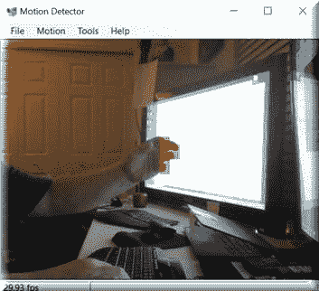

你也可以看到，当一个运动区域被定义，冥想的侏儒彼得在这个区域的前面，我们仍然能够检测到他身后的运动，但是他的脸不是识别的一部分。当然，您可以将这两个过程结合起来，以实现两个方面的最佳效果，如下所示：

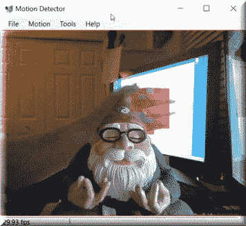

我们可以使用的另一个选项是栅格运动高亮显示。这将基于定义的栅格以红色方块突出显示运动检测区域。基本上，运动区域现在是一个红色框，如您所见：

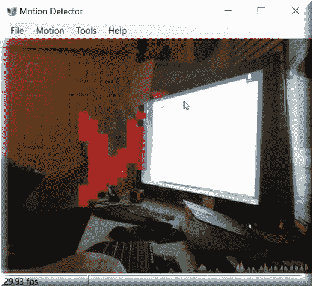

# 密码

下面的代码片段显示了将视频识别添加到应用程序所需执行的所有操作的简单示例。正如你所见，这再简单不过了：

```cs
// create motion detector
MotionDetector detector = new MotionDetector(
 new SimpleBackgroundModelingDetector( ),
 new MotionAreaHighlighting( ) );
// continuously feed video frames to motion detector
while ( ... )
{
 // process new video frame and check motion level
 if ( detector.ProcessFrame( videoFrame ) > 0.02 )
 {
 // ring alarm or do something else
 }
}
```

我们现在打开视频源：

```cs
videoSourcePlayer.VideoSource = new AsyncVideoSource(source);
```

当我们收到一个新的视频帧时，所有的奇迹就发生了。以下是成功处理新视频帧所需的全部代码：

```cs
private void videoSourcePlayer_NewFrame(object sender, NewFrameEventArgsargs)
 {
lock (this)
 {
if (detector != null)
 {
floatmotionLevel = detector.ProcessFrame(args.Frame);
if (motionLevel > motionAlarmLevel)
 {
// flash for 2 seconds
flash = (int)(2 * (1000 / alarmTimer.Interval));
 }
// check objects' count
if (detector.MotionProcessingAlgorithm is BlobCountingObjectsProcessing)
 {
BlobCountingObjectsProcessing countingDetector = (BlobCountingObjectsProcessing)detector.MotionProcessingAlgorithm;
detectedObjectsCount = countingDetector.ObjectsCount;
 }
else
 {
detectedObjectsCount = -1;
 }
// accumulate history
motionHistory.Add(motionLevel);
if (motionHistory.Count> 300)
                    {
motionHistory.RemoveAt(0);
                    }

if (showMotionHistoryToolStripMenuItem.Checked)
DrawMotionHistory(args.Frame);
                }
            }
```

这里的关键是检测帧中发生的运动量，这是通过以下代码完成的。在本例中，我们使用的运动报警级别为 0.2，但您可以随意使用。一旦超过此阈值，您可以执行任何您喜欢的逻辑，例如发送电子邮件警报、发送文本、启动视频捕获操作等：

```cs
float motionLevel = detector.ProcessFrame(args.Frame);
if (motionLevel > motionAlarmLevel)
{
// flash for 2 seconds
flash = (int)(2 * (1000 / alarmTimer.Interval));
}
```

# 总结

在本章中，我们学习了图像和运动检测（而不是识别！）。我们以 Accord.Net 为例，说明了当我们想要为应用程序添加功能时，开源工具能为我们提供什么。

在下一章中，我们将继续讨论图像主题，但将使用开源软件包 ConvNetSharp 训练卷积神经网络。