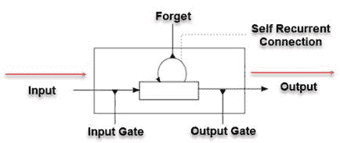
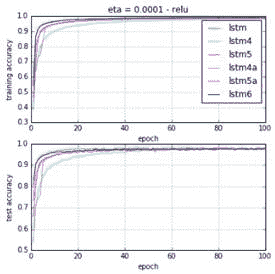
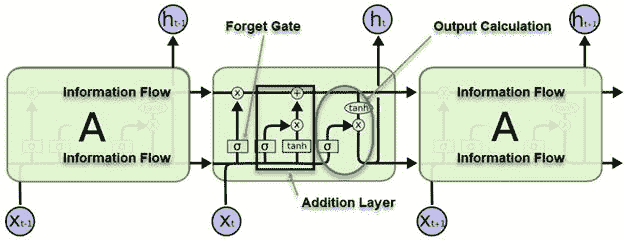
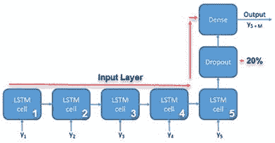
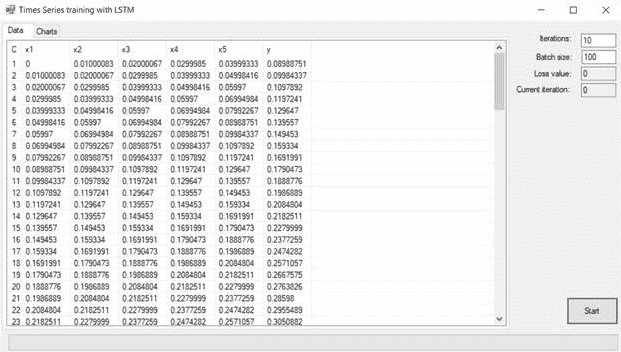
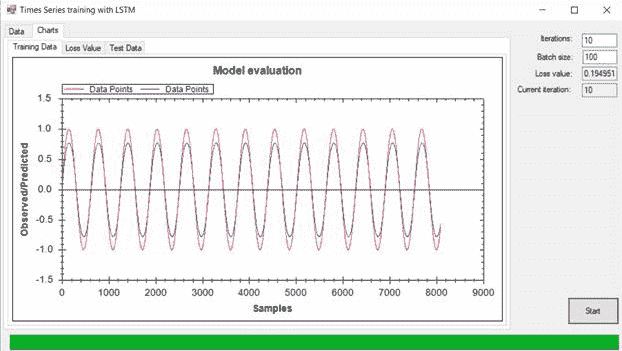
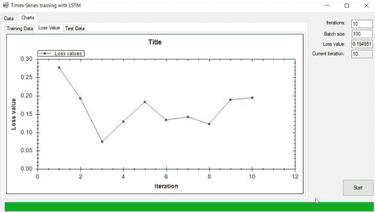
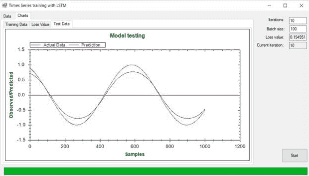
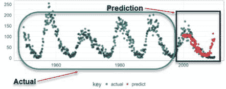

# 基于 CNTK 的时间序列预测与 LSTM

本章旨在帮助您更多地了解 Microsoft 认知工具包（CNTK）。本章中包含的示例的灵感来自于 Python 版本的**CNTK 106**：**第 A 部分——使用 LSTM（基础）**进行时间序列预测。作为 C# 开发人员，Python 代码不是我们将要使用的（尽管我们可以使用几种方法），因此我们制作了自己的 C# 示例以反映该教程。为了使我们的示例简单直观，我们将使用正弦函数来预测未来的时间序列数据。具体而言，我们将使用一个**长-短期记忆递归神经网络**，有时称为**LSTM-RNN**或**LSTM**。LSTM 有许多变体；我们将与原件一起工作。

在本章中，我们将介绍以下主题：

*   LSTM
*   张量
*   静态和动态轴
*   加载数据集
*   绘图数据
*   创建模型
*   创建小批量
*   还有更多…

# 技术要求

您需要具备使用 Microsoft Visual Studio 和 C# 进行.NET 开发的基本知识。您需要从本书的网站下载本章的代码。

查看以下视频以查看代码的作用：[http://bit.ly/2xtDTto](http://bit.ly/2xtDTto) 。

# 长短记忆

**长短期记忆**（**LSTM**网络）是递归神经网络的一种特殊形式。他们有能力对过去遇到的事情保持长期记忆。在 LSTM 中，每个神经元都被称为**记忆单元**所取代。该存储单元在适当的时间被激活和停用，实际上被称为**循环自连接**。

如果我们后退一秒钟，观察一个规则的递归网络的反向传播阶段，梯度信号最终可能会乘以隐藏层中神经元之间突触的权重矩阵很多倍。这到底是什么意思？这意味着这些权重的大小会对学习过程产生更大的影响。这可能是好的也可能是坏的。

如果权重很小，它们可能导致所谓的**消失梯度**，这种情况下，信号变得非常小，以至于学习速度减慢到无法忍受的程度，甚至完全停止。另一方面，如果权重很大，这可能导致信号太大，以至于学习发散而不是收敛。这两种情况都是不可取的，但都是由 LSTM 模型中称为**存储单元**的项目处理的。现在我们来谈谈这个存储单元。

一个存储单元有四个不同的部分。他们是：

*   输入门，恒定重量为 1.0
*   自回归连接神经元
*   忘记门，允许细胞记住或忘记它以前的状态
*   输出门，允许记忆细胞状态对其他神经元产生影响（或不产生影响）

让我们看看这一点，并尝试将其结合起来：



Memory Cell

# LSTM 变体

LSTM 网络有许多变体。其中一些变体包括：

*   选通递归神经网络
*   LSTM4
*   LSTM4a
*   LSTM5
*   LSTM5a
*   LSMT6



Training and Test accuracy, σ = relu, η = 1e −4

其中一种变体是 LSTM 的一个稍微更引人注目的版本，称为门控循环单元，或 GRU/GRNN。它将 LSTM 的忘记门和输入门组合成一个称为**更新门**的门。这使得它比标准的 LSTM 更简单，并且越来越受欢迎。

以下是 LSTM 的外观：



LSTM

如您所见，在 LSTM 中有各种 RNN 没有的内存*门*。这使得它可以毫不费力地保留长期和短期记忆。所以，如果我们想要理解文本，并且需要及时地向前或向后看，那么 LSTM 就是为这样的场景而设计的。让我们来讨论一下不同的大门。正如我们提到的，共有 3 个。让我们用下面的短语来解释它们是如何工作的。

*鲍勃住在纽约市。约翰整天和人们通电话，坐火车上下班。*

**遗忘之门**：我们一到“城市”一词之后的时期，遗忘之门就意识到作品中可能会有上下文的变化。结果，主体 Bob 被遗忘，主体所在的位置现在为空。句子一转到约翰，主题就变成约翰了。这个过程是由忘记门引起的。

**输入门**：所以重要的事实是鲍勃住在纽约市，约翰在火车上通勤，整天和人们交谈。然而，他通过电话与人交谈的事实并不重要，可以忽略。添加新信息的过程通过输入门完成。

**输出门**：如果我们有一句话*鲍勃是个伟人。我们向*致敬。在这句话中，我们有一个空位，有许多可能性。我们知道的是，我们要向这个空白处的任何东西致敬，这是一个描述名词的动词。因此，我们可以安全地假设空白处将填充一个名词。因此，一个好的候选人可能是*鲍勃*。从当前单元状态中选择有用信息并将其显示为输出的工作是输出门的工作。

# LSTM 的应用

以下仅是 LSTM 堆叠网络的一些应用：

*   语音识别
*   笔迹识别
*   时间序列预测与异常检测
*   业务流程管理
*   机器人控制
*   还有更多。。。

时间序列预测本身可以对业务的底线产生巨大的影响。我们可能需要预测某个月的哪一天、哪一季度或哪一年会发生某些大额费用。随着时间的推移，我们还可能对与我们业务相关的消费者价格指数感到担忧。预测精度的提高可以使我们的底线得到一定的改善。

# CNTK 术语

了解 Microsoft CNTK 工具包中使用的一些术语非常重要。现在让我们来看一些术语：

*   **张量**：所有 CNTK 输入、输出和参数都组织为张量。还应注意的是，*小批量*也是张量。
*   **秩**：每个张量都有一个秩。标量是秩为 0 的张量，向量是秩为 1 的张量，矩阵是秩为 2 的张量。
*   **静态轴**：2 所列尺寸为**轴**。每个张量都有*静态*和*动态*轴。静态轴在其整个生命周期内具有相同的长度。
*   **动态轴**：但是，动态轴的长度可能会因实例而异。在显示每个小批次之前，通常不知道它们的长度。此外，还可以订购。
*   **小批量**：小批量也是张量。它有一个动态轴，称为**批次轴**，该轴的长度可以从一个小批次变为另一个小批次。

在写入 CNTK 时，支持一个附加的单个附加动态轴，也称为**序列轴**。该轴允许用户以更抽象、更高级的方式处理序列。序列的美妙之处在于，每当对序列执行操作时，CNTK 工具包都会执行类型检查操作以确定安全性：



Sequence Axis

# 我们的例子

现在我们已经介绍了 CNTK 和 LSTM 的一些基础知识，现在是深入研究示例应用程序的时候了。您可以通过本书附带的代码找到此项目。在继续之前，请确保已在 Microsoft Visual Studio 中将其打开。如果需要进一步说明，您可以按照即将发布的*代码*部分中的说明进行操作。

我们正在创建的示例使用 Microsoft CNTK 作为后端，并将使用简单的正弦波作为我们的函数。正弦波绘制得较早，之所以使用正弦波，是因为大多数人对它非常熟悉。

下面是示例应用程序的屏幕截图：



Main page – training data

前面的屏幕截图显示了我们的主屏幕，显示了我们的正弦波数据点和训练数据。目标是使我们的训练数据（蓝色）在形状上尽可能接近红色，如下所示：



Main Page - Charts

以下屏幕允许我们绘制损失函数：



Plotting the loss value (Loss Value tab)

下面的屏幕允许我们绘制观察值与预测值。目标是使预测值（蓝色）尽可能接近实际值（红色显示）：



Plotting Observed versus Predicted (Test Data tab)

# 为我们的应用程序编码

现在让我们看看我们的代码。为此，您需要参考本书附带的`LSTMTimeSeriesDemo`项目。在 Microsoft Visual Studio 中打开项目。所有必需的 CNTK 库都已在此项目中为您引用，并包含在 Debug/bin 目录中。我们将使用的主要图书馆是`Cntk.Core.Managed`。我们在本例中使用的是 2.5.1 版，以防您感到疑惑！

# 加载数据和图形

为了加载数据和图形，我们将使用两个主要函数
；`LoadTrainingData()`和`PopulateGraphs()`。很简单，对吧

```cs
private void Example_Load(object sender, EventArgs e)
{
 LoadTrainingData(DataSet?["features"].train, DataSet?["label"].train);
PopulateGraphs(DataSet?["label"].train, DataSet?["label"].test);
}
```

# 加载训练数据

对于这个例子，我们只是在动态地编写测试和训练数据。`LoadTrainingData()`函数的作用就是：

```cs
private void LoadTrainingData(float[][] X, float[][] Y)
 {
 //clear the list first
 listView1.Clear();
 listView1.GridLines = true;
 listView1.HideSelection = false;
 if (X == null || Y == null )
 return;

 //add features
 listView1.Columns.Add(new ColumnHeader() {Width=20});
 for (int i=0; i < inDim ;i++)
 {
 var col1 = new ColumnHeader
 {
 Text = $"x{i + 1}",
 Width = 70
 };
 listView1.Columns.Add(col1);
 }

 //Add label
 var col = new ColumnHeader
 {
 Text = $"y",
 Width = 70
 };
 listView1.Columns.Add(col);
for (int i = 0; i < 100; i++)
 {
 var itm = listView1.Items.Add($"{(i+1).ToString()}");
 for (int j = 0; j < X[i].Length; j++)
 itm.SubItems.Add(X[i][j].ToString(CultureInfo.InvariantCulture));
 itm.SubItems.Add(Y[i][0].ToString(CultureInfo.InvariantCulture));
 }
 }
```

# 填充图形

此函数使用培训和测试数据填充图形：

```cs
private void PopulateGraphs(float[][] train, float[][] test)
 {
 if (train == null)
 throw new ArgumentException("TrainNetwork parameter cannot be null");
 if (test == null)
 throw new ArgumentException("test parameter cannot be null");
for (int i=0; i<train.Length; i++)
trainingDataLine?.AddPoint(new PointPair(i + 1, train[i][0]));
for (int i = 0; i < test.Length; i++)
testDataLine?.AddPoint(new PointPair(i + 1, test[i][0]));
zedGraphControl1?.RestoreScale(zedGraphControl1.GraphPane);
zedGraphControl3?.RestoreScale(zedGraphControl3.GraphPane);
}
```

# 分割数据

通过这个函数，我们可以镜像 Python 等框架，这使得从主数据集中分离训练和测试数据变得非常容易。我们创建了自己的函数来做同样的事情：

```cs
static (float[][] train, float[][] valid, float[][] test) SplitDataForTrainingAndTesting(float[][] data, float valSize = 0.1f, float testSize = 0.1f)
{
 if (data == null)
 throw new ArgumentException("data parameter cannot be null");
//Calculate the data needed
var posTest = (int)(data.Length * (1 - testSize));
 var posVal = (int)(posTest * (1 - valSize));
 return (
 data.Skip(0).Take(posVal).ToArray(), 
 data.Skip(posVal).Take(posTest - posVal).ToArray(), 
data.Skip(posTest).ToArray());
}
```

# 运行应用程序

一旦我们点击**运行**按钮，我们将执行下面概述的功能。我们首先确定用户想要使用的迭代次数，以及批大小。设置好进度条和一些内部变量后，我们调用`TrainNetwork()`函数：

```cs
private void btnStart_Click(object sender, EventArgs e)
{
int iteration = int.Parse(textBox1.Text);
 batchSize = int.Parse(textBox2.Text);
progressBar1.Maximum = iteration;
progressBar1.Value = 1;
inDim = 5;
 ouDim = 1;
 int hiDim = 1;
 int cellDim = inDim;
Task.Run(() => TrainNetwork(DataSet, hiDim, cellDim, iteration, batchSize, ReportProgress));
}
```

# 培训网络

在每一个神经网络中，我们都必须训练网络，以便它能够识别我们提供给它的任何东西。我们的`TrainNetwork()`功能就是这样：

```cs
private void TrainNetwork(Dictionary<string, (float[][] train, float[][] valid, float[][] test)> dataSet, int hiDim, int cellDim, int iteration, int batchSize, Action<Trainer, Function, int, DeviceDescriptor> progressReport)
{
Split the dataset on TrainNetwork into validate and test parts
var featureSet = dataSet["features"];
var labelSet = dataSet["label"];
```

创建模型，如下所示：

```cs
var feature = Variable.InputVariable(new int[] { inDim }, DataType.Float, featuresName, null, false /*isSparse*/);
 var label = Variable.InputVariable(new int[] { ouDim }, DataType.Float, labelsName, new List<CNTK.Axis>() { CNTK.Axis.DefaultBatchAxis() }, false);
 var lstmModel = LSTMHelper.CreateModel(feature, ouDim, hiDim, cellDim, DeviceDescriptor.CPUDevice, "timeSeriesOutput");
 Function trainingLoss = CNTKLib.SquaredError(lstmModel, label, "squarederrorLoss");
 Function prediction = CNTKLib.SquaredError(lstmModel, label, "squarederrorEval");
```

为培训做准备：

```cs
TrainingParameterScheduleDouble learningRatePerSample = new TrainingParameterScheduleDouble(0.0005, 1);
TrainingParameterScheduleDouble momentumTimeConstant = CNTKLib.MomentumAsTimeConstantSchedule(256);
IList<Learner> parameterLearners = new List<Learner>()
{
Learner.MomentumSGDLearner(lstmModel?.Parameters(), learningRatePerSample, momentumTimeConstant, /*unitGainMomentum = */true)
};
```

创建培训师，如下所示：

```cs
       var trainer = Trainer.CreateTrainer(lstmModel, trainingLoss, prediction, parameterLearners);
```

对模型进行如下培训：

```cs
for (int i = 1; i <= iteration; i++)
{
```

获取下一个小批量数据，如下所示：

```cs
foreach (var batchData infrom miniBatchData in GetNextDataBatch(featureSet.train, labelSet.train, batchSize)
let xValues = Value.CreateBatch(new NDShape(1, inDim), miniBatchData.X, DeviceDescriptor.CPUDevice)
let yValues = Value.CreateBatch(new NDShape(1, ouDim), miniBatchData.Y, DeviceDescriptor.CPUDevice)
select new Dictionary<Variable, Value>
{
{ feature, xValues },
{ label, yValues }})
{
```

列车，如下所示：

```cs
trainer?.TrainMinibatch(batchData, DeviceDescriptor.CPUDevice);
} 
if (InvokeRequired)
{
Invoke(new Action(() => progressReport?.Invoke(trainer, lstmModel.Clone(), i, DeviceDescriptor.CPUDevice)));
}
else
{
progressReport?.Invoke(trainer, lstmModel.Clone(), i, DeviceDescriptor.CPUDevice);
}
}
}
```

# 创建模型

为了创建一个模型，我们将构建一个包含**长短期记忆**（**LSTM**细胞的单向递归神经网络，如下所示：

```cs
public static Function CreateModel(Variable input, int outDim, int LSTMDim, int cellDim, DeviceDescriptor device, string outputName)
{
Func<Variable, Function> pastValueRecurrenceHook = (x) => CNTKLib.PastValue(x);
```

为每个输入变量创建一个 LSTM 单元格，如下所示：

```cs
Function LSTMFunction = LSTMPComponentWithSelfStabilization<float>(input,  new[] { LSTMDim }, new[] { cellDim }, pastValueRecurrenceHook, pastValueRecurrenceHook, device)?.Item1;
```

创建 LSTM 序列后，返回最后一个单元格以继续生成网络，如下所示：

```cs
pre>       Function lastCell = CNTKLib.SequenceLast(LSTMFunction);
```

实施 20%的辍学率，如下所示：

```cs
       var dropOut = CNTKLib.Dropout(lastCell,0.2, 1);
```

在输出之前创建最后一个密集层，如下所示：

```cs
 return FullyConnectedLinearLayer(dropOut, outDim, device, outputName);
}
```

# 获取下一批数据

我们以可枚举的方式获得下一批数据。我们先验证参数，然后调用`CreateBatch()`函数，该函数后面列出：

```cs
private static IEnumerable<(float[] X, float[] Y)> GetNextDataBatch(float[][] X, float[][] Y, int mMSize)
{
if (X == null)
 throw new ArgumentException("X parameter cannot be null");
 if (Y == null)
 throw new ArgumentException("Y parameter cannot be null");
for (int i = 0; i <= X.Length - 1; i += mMSize)
 {
 var size = X.Length - i;
 if (size > 0 && size > mMSize)
 size = mMSize;
var x = CreateBatch(X, i, size);
 var y = CreateBatch(Y, i, size);
yield return (x, y);
 }
}
```

# 创建一批数据

给定一个数据集，此函数将创建*批*数据，用于以更易管理的段遍历整个数据集。您可以从前面显示的`GetNextDataBatch()`函数中看到它是如何调用的：

```cs
internal static float[] CreateBatch(float[][] data, int start, int count)
{
 var lst = new List<float>();
 for (int i = start; i < start + count; i++)
 {
 if (i >= data.Length)
 break;
lst.AddRange(data[i]);
}
return lst.ToArray();
}
```

# LSTM 的性能如何？

我们测试了 LSTM 与太阳黑子数据预测的预测和历史值，这是一项非常著名的深度学习测试。正如你所看到的，红色的曲线图，这是我们的预测，准确地融入了趋势，这是一个非常令人鼓舞的迹象：



预测与性能

# 总结

在本章中，我们学习了长短记忆递归神经网络。我们编写了一个示例应用程序，展示了如何使用它们，并在此过程中学习了一些基本术语。我们讨论了诸如 LSTM、张量、静态和动态轴、加载数据集、绘制数据、创建模型和创建小批量等主题。在我们的下一章中，我们将访问 LSTM 网络的一个非常接近的近亲：选通循环单元。

# 工具书类

*   Hochreiter，S.，和 Schmidhuber，J.（1997）。长期短期记忆。神经计算，9（8），1735-1780。
*   盖尔斯，F.A.，施密杜伯，J.，和康明斯，F.（2000）。学会遗忘：用 LSTM 持续预测。神经计算，12（10），2451-2471。
*   格雷夫斯，亚历克斯。使用递归神经网络的监督序列标记。第 385 卷。斯普林格，2012 年。

*   班吉奥、西玛德和弗拉斯科尼。用梯度下降法学习长期依赖关系是困难的。IEE 神经网络学报，5，1994 年。
*   乔利特。凯拉斯·吉图布。
*   钟杰、古尔切雷、曹国强和本吉奥。门控递归神经网络序列建模的实证评估，2014 年。
*   霍克雷特和施密杜伯。长期短期记忆。神经计算，9:1735-17801997。
*   Q.V.Le、N.Jaitly 和 H.G.E.是一种初始化校正线性单元的递归网络的简单方法。2015
*   吕和塞勒姆。长短时记忆（lstm）递归神经网络中的简化选通。arXiv:1701.034412017。
*   塞勒姆。一个基本的递归神经网络模型。arXiv 预印本 arXiv:1612.0902220016。
*   塞勒姆。门控递归神经网络的简化参数化。密歇根州立大学备忘录，2016 年 11 月 7 日。