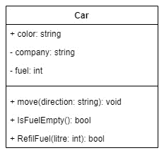
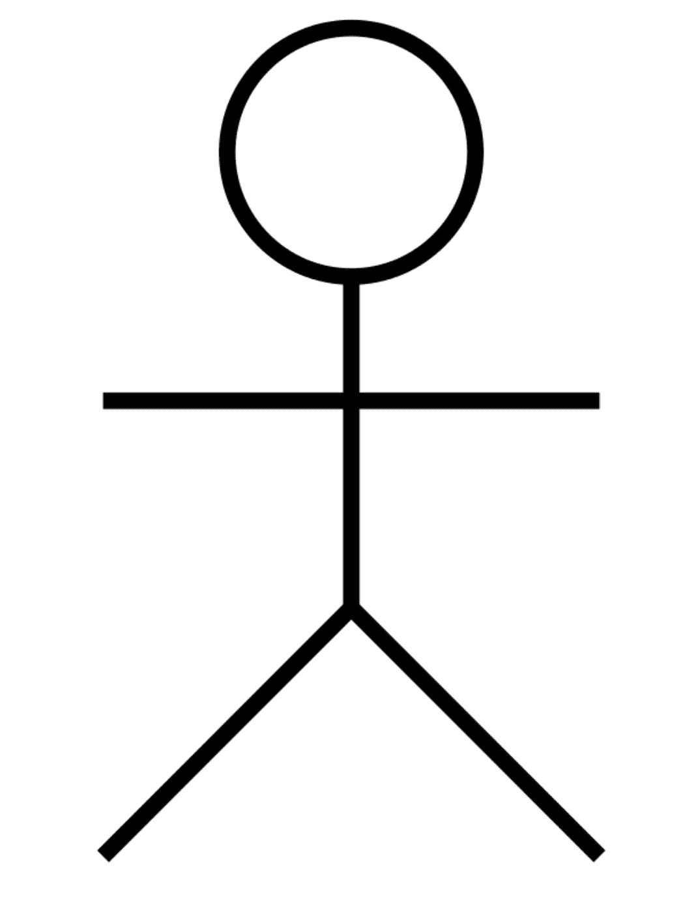
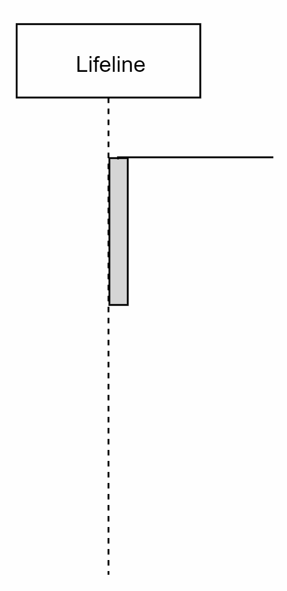
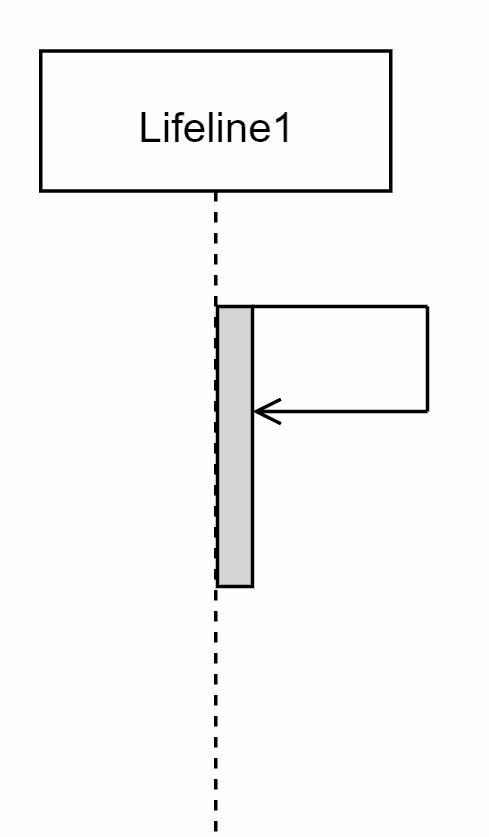
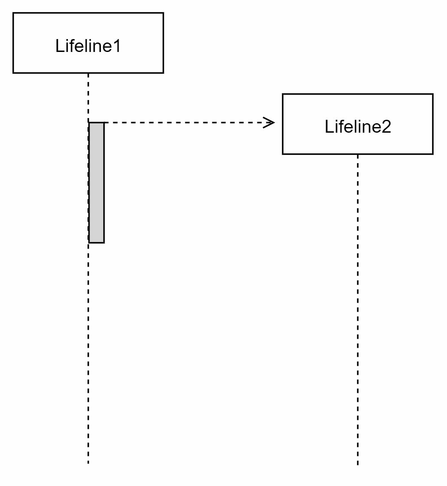

# 软件建模与设计

随着土木工程的出现和大型结构的创建，建模和设计的实践变得非常重要。软件开发也是如此。如今，软件无处不在:你的电脑、手机、电视、汽车等等。随着软件用途的扩大，软件开发变得越来越复杂和昂贵，需要时间和金钱。

软件建模和设计是软件开发生命周期的重要组成部分。如果你有一个想法，并且正在计划开始一个软件项目，你应该做的第一件事是设计和建模软件，而不仅仅是开始编写代码。这将为您提供软件的高级视图，并有机会以易于扩展和修改的方式构建它。如果你没有事先进行建模，你可能会陷入不得不重组软件架构的境地，这可能会非常昂贵。

我们将在本章中讨论的主题如下:

*   设计图表的重要性
*   不同的**统一建模语言** ( **UML** )图
*   类图
*   用例图
*   序列图

# 设计图表的重要性

UML 是一种设计语言，是用于软件建模和设计的标准语言。它最初是由 Grady Booch、Ivar Jacobson 和 James Rumbaugh 在 1994-1995 年间在 Rational Software 开发的。1997 年，**对象管理组** ( **OMG** )采用它作为建模的标准语言。后来，在 2005 年，**国际标准化组织** ( **ISO** )批准 UML 为 ISO 标准，从那以后，它被每个软件社区所采用。

UML 图允许开发人员将软件设计传达给其他人。这是一种有一套鼓励轻松交流的规则的语言。如果你学会了阅读 UML，你就能理解任何用 UML 编写的软件模型。用简单的英语解释一个软件模型是非常困难的。

# 不同的 UML 图

有许多类型的 UML 图，但是我们将在本章中只讨论最重要的。UML 图分为以下两大类:

*   结构图
*   行为图

下表显示了属于结构图类别的图:

*   类图
*   组件图
*   复合结构图
*   部署图
*   对象图
*   包装图
*   剖面图

行为图包括以下内容:

*   活动图
*   通信图
*   交互概述图
*   序列图

*   状态图
*   时序图
*   用例图

# 类图

类图是一种结构图，主要用于提供一个面向对象软件的设计。这个图展示了软件的结构，类的属性和方法，以及系统中类之间的关系。它可以用于开发，也可以用于文档；软件开发人员经常使用这个图表来快速了解代码，并帮助其他开发人员理解系统。它也偶尔被公司业务部门的员工使用。

下面是类图的三个主要部分:

*   类名
*   属性部分
*   方法部分

类图由不同的类组成，这些类用方框或矩形表示。矩形通常被分成上述部分。第一部分保存类名，第二部分保存属性，第三部分包含方法。

让我们看一个类图的例子:

在这里，我们可以看到我们有一个名为`Car`的类，如顶框所示。下面，我们有这个类的属性。我们可以看到`color`是一个属性的名称，前面有一个`+`符号，表示它是一个公共变量。我们还可以看到变量名旁边有一个`:`(冒号)，是一个分隔符。冒号后给出的内容代表变量的类型。在这种情况下，我们可以看到`color`变量属于`string`类型。下一个属性是`company`，也是`string`类型的变量。这前面有一个`-`符号，表示是私有变量。第三个属性是`fuel`，我们可以看到这是`integer`类型的私有变量。

如果我们看下面的属性，我们会看到`Car`类的方法。我们可以看到它有三种方法:`move(direction: string)`、`IsFuelEmpty()`、`RefilFuel(litre: int)`。和属性一样，我们可以看到方法有一个`:`(冒号)。在这种情况下，冒号后给出的类型是方法的返回类型。第一种方法`move`，不返回任何东西，所以类型为 void。在`IsFuelEmpty()`方法中，返回类型是布尔值，第三种方法也是如此。这里需要注意的另一件事是方法的参数，这些参数放在方法名称后面的括号中。例如`move`方法有一个参数叫做`direction`，是一个`string`类型。`RefilFuel(litre: int)`方法有一个`int`类型参数，即`litre`。

在前面的例子中，我们看到了类是如何在类图中表示的。通常，一个系统有多个以某种方式相互关联的类。类图也展示了类之间的关系，这让查看者可以全面了解系统的对象关系。在[第 4 章](04.html)、*对象协作*中，我们了解了面向对象软件中类和对象之间的不同关系。现在让我们看看如何使用类图来表示这些不同的对象关系。

# 遗产

**传承**是一个阶层像另一个阶层的关系，就像宝马 i8 Roadster 是一种车一样。这种关系用一条线和一个空心箭头表示。箭头从类指向超级类，如下图所示:

# 联合

关联关系是对象之间最基本的关系。当一个对象与另一个对象有某种逻辑或物理关系时，称为**关联关系**。它由一条线和一个箭头表示。如果两边都有箭头，这代表双向关系。关联的一个例子如下:

# 聚合

一个**聚合** **关系**是一种特殊类型的关联关系。这种关系通常被称为一种**有-一种**关系**关系**。当一个类中有另一个类/对象时，这就是聚合关系。这是用一条线和一个空心菱形来表示的。例如，一辆汽车有一个轮胎。轮胎和汽车具有聚合关系，如下图所示:

# 作文

当一个类里面有另一个类，依赖类没有超类就不能存在，这就是一个**组合关系**。例如，没有银行就不能有银行账户，如下图所示:

# 属国

当一个类有一个依赖类，但该类本身不依赖于它自己的依赖类时，这些类之间的关系称为**依赖**T2】关系。在依赖关系中，依赖类的任何变化对它所依赖的类都没有任何影响。但是如果依赖的类发生变化，依赖的类就会受到影响。

这种关系由末端带有箭头的虚线表示。例如，让我们假设我们的手机上有一个主题。如果我们改变主题，手机的图标也会改变，所以图标对主题有依赖性。下图显示了这种关系:

# 类图示例

让我们看一个项目类图的例子。在这里，我们有一些年级管理软件，供一所学校的老师和学生使用。该软件允许教师更新不同科目的特定学生的成绩。它还允许学生查看他们的成绩。对于该软件，我们有以下类别:

*   `Person`:

Person class diagram

*   `Teacher`:

Teacher class diagram

*   `Student`:

Student class diagram

*   `Subject`:

Subject class diagram

这里，我们使用了 Visual Studio 来生成类图，因此箭头可能与前面几节中给出的箭头不匹配。如果您正在使用其他绘图软件绘制类图，或者您正在手工绘制，请使用前面章节中指定的箭头。

让我们看看下面完整的类图:

在这里，我们可以看到我们有一个`Person`类，它有两个属性，一个`FirstName`和一个`LastName`。`Student`和`Teacher`类继承了`Person`类，所以我们可以看到箭头是空心的。`Student`类有两个属性，`email`和`studentId`。它还有一个叫`GetExamGrade`(字符串主语)的方法，取主语的名字，返回`char`类型的等级。我们可以看到，另一个类`Subject`与`Student`有构成关系。`Student`有一个科目列表，`Subject`类有三个属性，`grade`、`name`和`subjectId`。`Teacher`类有`email`、`phoneNumber`和`teacherId`，分别为`string`、`string`和`int`类型。`Teacher`班和`Student`班有关联关系，作为老师下面有一群学生。`Teacher`类还有一个叫`GiveExamGrade`的方法，取三个参数，`studentId`、`subject`和`grade`。这种方法会给学生的科目打分。

仅仅通过查看类图，我们就对系统有了一个清晰的概念。我们知道学科与学生的关系，以及学生与教师的关系。我们也知道，一个主体的客体离不开一个学生客体，因为它们是有构成关系的。这就是类图的妙处。

# 用例图

A **用例图**是软件开发中非常常用的行为图。这个图表的主要目的是说明一个软件的功能使用。它保存了系统的用例，可以用来提供功能的高级视图，甚至是软件的一个非常具体的低级模块。通常对于一个系统，有多个关注系统不同层次的用例图。用例图不应该用来显示系统的实现细节；它们被开发成只显示系统的功能需求。用例图对于业务人员来说是非常好的图，可以传达他们从系统中需要什么。

用例图有四个主要部分，如下列表所示:

*   演员
*   用例
*   通信链路
*   系统边界

# 演员

用例图中的参与者不一定是人，而是系统的用户。它可能是一个人，另一个系统，甚至是系统的另一个模块。下图给出了一个参与者的可视化表示:

演员负责提供输入。它向系统发出指令，系统相应地工作。演员做的每一个动作都有目的。用例图向我们展示了一个参与者可以做什么，以及参与者的期望是什么。

# 用例

用例图的可视部分或表示被称为**用例**。这代表系统的功能。参与者将执行一个用例来实现一个目标。用例由一个带有功能名称的椭圆表示。例如，在餐厅应用中，*下订单*可能是一个用例。我们可以这样表述:

# 通信链路

一条**通信链路**是一条从参与者到用例的简单线路。此链接用于显示参与者与特定用例之间的关系。参与者不能访问所有的用例，所以当显示哪个参与者可以访问哪些用例时，通信链接是非常重要的。让我们看一个通信链路的例子，如下图所示:

# 系统边界

**系统边界**主要用来表示一个系统的范围。重要的是能够识别哪些用例属于我们的系统，哪些不属于。在用例图中，我们只关注系统中的用例。在大型系统中，如果系统中的每个模块足够独立，可以在没有其他模块的情况下运行，则这些模块有时会被视为一个边界。这通常显示为一个容纳用例的矩形框。参与者不是系统的一部分，因此参与者将在系统边界之外，如下图所示:

# 用例图示例

现在让我们假设我们有一个餐馆系统，顾客可以在其中点菜。厨师准备食物，经理跟踪销售情况，如下图所示:

从上图中，我们可以看到我们有三个参与者(顾客、厨师和经理)。我们还有不同的用例——检查菜单、订购食物、烹饪食物、供应食物、支付和销售报告，它们都与一个或多个参与者相关联。**客户**参与者参与检查菜单、订购食物和支付用例。厨师必须进入订餐网站才能了解订单。厨师还参与了烹饪食物和服务食物的使用案例。与厨师和顾客不同，经理能够看到餐厅的销售报告。

通过查看这个用例图，我们能够识别系统的功能。它没有给你任何实现细节，但是我们可以很容易地看到系统的概述。

# 序列图

序列图是属于行为图范畴的交互图。顾名思义，它显示了系统活动的顺序。通过查看序列图，您可以确定哪些活动在特定时间范围内发生，哪些活动接下来发生。它让我们了解系统的流程。它所代表的活动可能是用户和系统之间、两个系统之间或者系统和子系统之间的交互。

序列图的横轴表示时间从左向右流逝，而纵轴表示活动的流程。不同的活动以顺序的方式放置在图表中。序列图不一定显示时间流逝的持续时间，而是显示从一个活动到另一个活动的步骤。

在接下来的几节中，我们将看看序列图中使用的符号。

# 演员

序列图中的参与者与用例图中的参与者非常相似。它可能是一个用户，另一个系统，甚至是一个用户组。参与者不是系统的一部分，而是在外部执行命令。当接收到用户的命令时，执行不同的操作。演员用简笔画表示，如下图所示:

# 生命线

序列图中的生命线是系统的实体或元素。每条生命线都有自己的逻辑和任务要做。通常，一个系统有多个生命线，命令从一个生命线传递到另一个生命线。

生命线由一个底部有垂直线的方框表示，如下图所示:

# 激活

激活是生命线上的一个小矩形框。此激活框表示活动处于活动状态的时间点。框的顶部代表活动的开始，框的结尾代表活动的结束。

让我们看看它在图表中的样子:

# 电话留言

呼叫消息指示生命线之间的交互。它从左向右流动，由一行末尾的箭头表示，如下图所示。消息调用表示某种信息或对下一条生命线的触发:

# 回复信息

序列图中的正常消息流是从左到右的，因为这代表动作命令；但是，有时消息会返回给调用者。返回消息从右向左流动，并由一条末端带有箭头的虚线表示，如下图所示:

# 自我信息

有时，消息从生命线传递到自身，例如内部通信。它将以类似于消息调用的方式表示，但它不是指向另一个生命线的另一个活动，而是返回到同一生命线的同一活动，如下图所示:

# 递归消息

当为了递归目的发送自身消息时，它被称为递归消息。为此，在同一时间线上绘制了另一个小活动，如下图所示:

# 创建消息

这种类型的消息不是普通消息，例如呼叫消息。当一个生命线由另一个生命线创建时，使用创建消息，如下图所示:

# 破坏信息

当销毁消息从一个活动发送到一个生命线时，这意味着下面的生命线将不会被执行，并且流程将被停止，如下图所示。它被称为销毁消息，因为它会销毁活动流:

# 持续时间消息

我们使用持续时间消息来显示活动将消息传递给下一个活动和下一个活动收到消息之间的持续时间。它类似于呼叫消息，但角度向下，如下图所示:

# 便条

注释用于包括与元素或动作相关的任何必要注释。它没有特别的规则。它可以放在任何适合清楚表达事件的地方。任何类型的信息都可以写在便条上。注释如下所示:

# 序列图的一个例子

学习任何东西的最好方法是看一个例子。让我们看一下下面这个简单的餐厅系统的序列图:

在这里，我们可以看到一个客户首先从 UI 中请求菜单。用户界面将请求传递给控制器，然后控制器将请求传递给管理器。经理获得菜单并对控制器做出响应。控制器响应用户界面，用户界面在显示屏上显示菜单。

在客户选择一个项目后，订单会一步一步地交给经理。经理调用另一种方法来准备食物，并向客户发送响应，通知他们已收到订单。当食物准备好了，它被提供给顾客。收到食物后，顾客付款并领取付款收据。

通过查看序列图，我们可以看到流程中涉及的不同活动。这个系统是如何一步一步运行的，这一点非常清楚。这种图在展示一个系统的流程时非常有用，非常受欢迎。

# 摘要

在本章中，您学习了如何使用 UML 图来建模和设计软件的基础知识。这对每个软件开发人员来说都非常重要，因为我们需要能够与企业沟通，反之亦然。您还会发现，当与其他开发人员或软件架构师讨论系统时，这些图非常有用。在本章中，我们没有涵盖所有可用于建模和设计软件的不同图表，因为这超出了本书的范围。在本章中，我们讨论了类图、用例图和序列图。我们看到了每个图表的示例，并研究了如何绘制它们。

在下一章中，我们将了解如何使用 Visual Studio。我们将看到一些提示和技巧，它们将帮助您在使用 Visual Studio 时提高工作效率。